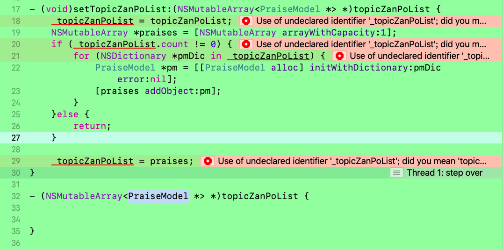

> <h2 id=''></h2>
- [**成员变量和属性**](#成员变量和属性)
	- [成员变量](#成员变量)
	- [实例变量](#实例变量)
	- [重写Setter、Getter](#重写Setter、Getter)
	- [属性](#属性)
		- [readonly](#readonly)
- [**‌泛型**](#泛型)
- **参考资料**
	- [**全局变量、静态变量、自动(局部)变量**](https://www.jianshu.com/p/797fb0dffc70)


<br/>

***
<br/>


> <h1 id='成员变量和属性'>成员变量和属性</h1>


```

@interface  ViewController :UIViewController
{

    UIButton *yourButton;
    int count;
    id data；
}

@property(nonatomic, strong) UIButton *myButton;

@end

```


<br/>
<br/>
> <h2 id='成员变量'>成员变量</h2>

- **成员变量:**  

&emsp; ` 作用`：用于类的内部，无需与外界接触。因此`成员变量`不会生成`set、get`方法，所以外界无法与成员变量接触。

&emsp; `Example`：{ }中所声明的变量都是`成员变量`,`yourButton、count、data`都是成员变量;


<br/>
<br/>
<br/>


> <h2 id='实例变量'>实例变量</h2>

&emsp; ` 作用`: ` 实例变量`本质上就是`成员变量`，只是实例是针对类而言，实例是指类的声明。

&emsp; `Example`：`{   }`中的`yourButton`就是实例变量。`id `是OC特有的类，本质上讲`id`等同于`(void *)`,所以`id data`属于实例变量;


<br/>
<br/>


> <h2 id='属性'>属性</h2>


&emsp; ` 作用`:   允许让其它对象访问到该变量(因为属性创建过程中自动产生了`set` 和`get`方法)。也可以设置只读或者可写等，设置方法也可自定义。

<br/>
<br/>

> <h2 id='readonly'>readonly</h2>

[readonly](https://juejin.cn/post/6844903825577361415)

&emsp; 若有这种情况: **.h**文件中定义了一个readonly属性，但是并未声明构造器实例方法，只有一个类方法,又因为类方法不能直接为readonly属性赋值,那该如何对**readonly属性**进行初始化赋值呢?

&emsp; 实际忽视了几个简单问题：
- 1.类方法不可以使用自身属性和实例方法，但是可以使用self。
- 2.readonly属性可以在构造器函数中初始化，（也理解为什么时候需要readonly属性了，只希望初始化一次，或者不希望随便更改，其实在.m文件的实例方法中可以更改，只是不能在外面通过对象的属性直接更改而已 ）。

```
//解决问题，怎么通过类方法初始化一个readonly属性？
//头文件中并未声明这个方法，只能在里面使用。
//这个方法的作用是为了给下面一个类方法的使用。（因为在类方法中无法使用属性和实例方法，但是可以使用self）
- (instancetype)initWithButtonType:(UIButtonType)buttonType {
    self = [super init];
    _buttonType = buttonType;
    return self;
   }
 
+ (instancetype)buttonWithType:(UIButtonType)buttonType{
    //这里相当于生成一个对象
    return [[self alloc] initWithButtonType:buttonType];
}
```


<br/>
<br/>


> <h2 id='重写Setter、Getter'>重写Setter、Getter</h2>


**`若只重写setter和getter其中之一，可以直接重写`**

```
//点赞列表
@property(nonatomic, copy) NSMutableArray<PraiseModel *> *topicZanPoList;

//重写Setter方法
- (void)setTopicZanPoList:(NSMutableArray<PraiseModel *> *)topicZanPoList {
    _topicZanPoList = topicZanPoList;
    NSMutableArray *praises = [NSMutableArray arrayWithCapacity:1];
    if (_topicZanPoList.count != 0) {
        for (NSDictionary *pmDic in _topicZanPoList) {
            PraiseModel *pm = [[PraiseModel alloc] initWithDictionary:pmDic error:nil];
            [praises addObject:pm];
        }
    }else {
        return;
    }
    
    _topicZanPoList = praises;
}

```


<br/>

若这时还要重写Getter方法，则会报以下错误，如图：



```
//重写Getter方法
- (NSMutableArray<PraiseModel *> *)topicZanPoList {
    
    return _topicZanPoList;
}

```

注意点：
**`set、get书写错误导致死循环`**

```
//在set方法中：
self.age=age;   //相当于是[self setAge:age];

在get方法中:
 return self.age;  //相当于是[self age];
```


<br/>

***
<br/>


> <h1 id='泛型'>泛型</h1>

[泛型使用](https://www.cnblogs.com/lxlx1798/p/11642938.html)


