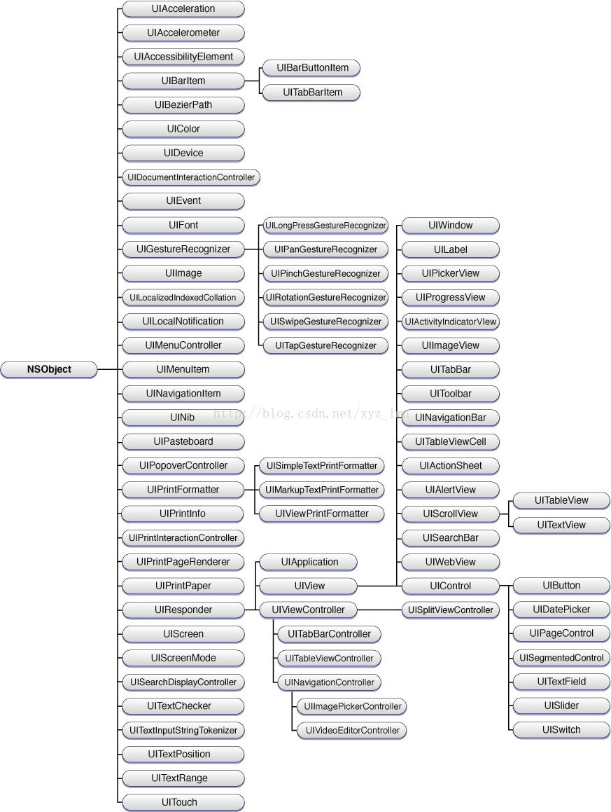

- [**响应者继承链**](#响应者继承链)
- [**响应者链**](#响应者链)
- [**View 响应者查找和Event传递**](#View响应者查找)


<br/>

***
<br/>

># <h1 id = "响应者继承链">响应者继承链</h1>



&emsp;  `响应者对象`：继承自`UIResponder`的对象称之为响应者对象。`UIApplication`、`UIView`、`UIViewController`和所有继承`UIView`的`UIKit`类都直接或间接的继承自`UIResponder`。

&emsp;  `UIResponder`一般响应以下几种事件：`触摸事件(touch handling)`、`点按事件(press handling)`、`加速事件`和`远程控制事件`。


<br/>

***
<br/>

># <h1 id = "响应者链">响应者链</h1>


&emsp;  由多个响应者组合起来的链条，就叫做响应者链。它表示了每个响应者之间的联系，并且可以使得一个事件可选择多个对象处理

**`响应步骤`**

假设触摸了initial view：
- 第一响应者就是initial view即initial view首先响应touchesBegan:withEvent:方法，接着传递给橘黄色的view

- 橘黄色的view开始响应touchesBegan:withEvent:方法，接着传递给蓝绿色view

- 蓝绿色view响应touchesBegan:withEvent:方法，接着传递给控制器的view

- 控制器view响应touchesBegan:withEvent:方法，控制器传递给了窗口

- 窗口再传递给application

如果上述响应者都不处理该事件，那么事件被丢弃。


<br/>

***
<br/>


># <h1 id = "View响应者查找">View响应者查找和Event传递</h1>

&emsp;  当一个触摸事件产生的时候，我们的程序是如何找到第一响应者的呢？


> 苹果注册了一个 Source1 (基于 mach port 的) 用来接收系统事件，其回调函数为 __IOHIDEventSystemClientQueueCallback()。
> 当一个硬件事件(触摸/锁屏/摇晃等)发生后，首先由 IOKit.framework 生成一个 IOHIDEvent 事件并由 SpringBoard 接收。
> SpringBoard 只接收按键(锁屏/静音等)，触摸，加速，接近传感器等几种 Event，随后用 mach port 转发给需要的App进程。随后苹果注册的那个 Source1 就会触发回调，并调用 _UIApplicationHandleEventQueue() 进行应用内部的分发。
> _UIApplicationHandleEventQueue() 会把 IOHIDEvent 处理并包装成 UIEvent 进行处理或分发，其中包括识别 UIGesture/处理屏幕旋转/发送给 UIWindow 等。通常事件比如 UIButton 点击、touchesBegin/Move/End/Cancel 事件都是在这个回调中完成的


&emsp;  当你点击了屏幕会产生一个触摸事件，消息循环`(runloop)`会接收到触摸事件放到消息队列里，`UIApplication`会会从消息队列里取事件分发下去，首先传给`UIWindow`，`UIWindow`会使用`hitTest:withEvent:`方法找到此次触摸事件初始点所在的视图，找到这个视图之后他就会调用视图的`touchesBegan:withEvent:`方法来处理事件。

**`View 响应者查找`**

在这里我们先要了解两个方法：

```
//称为方法A
- (nullableUIView*)hitTest:(CGPoint)point withEvent:(nullableUIEvent*)event；

//称为方法B
- (BOOL)pointInside:(CGPoint)point withEvent:(nullableUIEvent*)event；

```


&emsp;  对View进行重写这两个方法后，就会发现，点击屏幕后，首先响应的是方法A；

&emsp;  如果方法A中，我们没有调用父类的这个方法，那就根据这个方法A的返回view，作为响应事件的view。（当然返回nil，就是这个view不响应）

&emsp;  如果方法A中，我们调用了父类的这个方法，也就是`[super hitTest:point withEvent:event];`那这个时候系统就要调用方法B；通过这个方法的返回值，来判断当前这个View能不能响应消息。

&emsp; 如果方法B返回的是no，那就不用再去遍历它的子视图。方法A返回的View就是可以响应事件的view。

&emsp; 如果方法B返回的是YES，那就去遍历它的子视图。（就是上图我们描述的那样，找到合适的view返回，如果找不到，那就由方法A返回的view去响应这个事件。）

因此总结下来：

```
//返回一个view来响应事件 （我们如果不想影响系统的事件传递链，在这个方法内，最好调用父类的这个方法）
- (nullableUIView*)hitTest:(CGPoint)point withEvent:(nullableUIEvent*)event；

//返回的值可以用来判断是否继续遍历子视图（返回的根据是触摸的point是否在view的frame范围内）
- (BOOL)pointInside:(CGPoint)point withEvent:(nullableUIEvent*)event；
```

&emsp;  当你点击了屏幕上的某个view，这个动作由硬件层传导到操作系统，然后又从底层封装成一个事件（Event）顺着view的层级往上传导，一直要找到含有这个点击点且层级最高（文档说是最低，我理解是视图树的根节点，或者最靠近你的手指的view）的view来响应事件，这个view就是hit-test view。

&emsp;  决定谁**`hit-test view`**是通过不断递归调用view中的 *`- (UIView *)hitTest: withEvent:*方法和 *-(BOOL)pointInside: withEvent:`* 方法来实现的，文段中的这段话太好理解，于是一位大神仿照官方文档中这张图做了个Demo -> [Github地址](https://link.jianshu.com?t=https%3A%2F%2Fgithub.com%2Fslemon%2FHitTestViewUsage)

<br/>

扔个简单🌰：


**UIView中的坐标转换**

```
（1）[A convertPoint:pointB fromView:B]
将B视图的pointB这个点转换成A视图上的点的（坐标转换）
（2）[A convertPoint:pointA toView:B]
将A视图中的pointA这个点转换成，视图B中的点（坐标转换）

```


**`Demo Code`**

`AView.m`

```
#import "AView.h"

@implementation AView

- (UIView *)hitTest:(CGPoint)point withEvent:(UIEvent *)event {
    NSLog(@"进入A_View ---> hitTest: withEvent ---");
    UIView * view = [super hitTest:point withEvent:event];
    NSLog(@"离开A_View ---> hitTest: withEvent ---> hitTestView:%@",view);
    return view;
}

- (BOOL)pointInside:(CGPoint)point withEvent:(nullable UIEvent *)event {
    NSLog(@"A_view ~~~> pointInside withEvent ~~~");
    BOOL isInside = [super pointInside:point withEvent:event];
    NSLog(@"A_view ~~~> pointInside withEvent ~~~> isInside:%d",isInside);
    return isInside;
}

- (void)touchesBegan:(NSSet *)touches withEvent:(UIEvent *)event
{
    NSLog(@"A_touchesBegan");
}

- (void)touchesMoved:(NSSet<UITouch *> *)touches withEvent:(nullable UIEvent *)event {
    NSLog(@"A_touchesMoved");
}

- (void)touchesEnded:(NSSet<UITouch *> *)touches withEvent:(nullable UIEvent *)event {
    NSLog(@"A_touchesEnded");
}

@end
```

`BView.m`

```
@implementation BView

- (UIView *)hitTest:(CGPoint)point withEvent:(UIEvent *)event {
    NSLog(@"进入B_View ---> hitTest withEvent ---");
    UIView * view = [super hitTest:point withEvent:event];
    NSLog(@"离开B_View ---> hitTest withEvent ---> hitTestView:%@",view);
    return view;
}

- (BOOL)pointInside:(CGPoint)point withEvent:(nullable UIEvent *)event {
    NSLog(@"B_view ~~~> pointInside withEvent ~~~");
    BOOL isInside = [super pointInside:point withEvent:event];
    NSLog(@"B_view ~~~> pointInside withEvent ~~~> isInside:%d",isInside);
    return isInside;
}

- (void)touchesBegan:(NSSet *)touches withEvent:(UIEvent *)event
{
    NSLog(@"B_touchesBegan");
}

- (void)touchesMoved:(NSSet<UITouch *> *)touches withEvent:(nullable UIEvent *)event {
    NSLog(@"B_touchesMoved");
}

- (void)touchesEnded:(NSSet<UITouch *> *)touches withEvent:(nullable UIEvent *)event {
    NSLog(@"B_touchesEnded");
}


@end

```

`CView.m`

```
@implementation CView

- (UIView *)hitTest:(CGPoint)point withEvent:(UIEvent *)event {
    NSLog(@"进入C_View ---> hitTest withEvent --- ");
    UIView * view = [super hitTest:point withEvent:event];
    NSLog(@"离开C_View ---> hitTest withEvent ---> hitTestView:%@",view);
    return view;
}

- (BOOL)pointInside:(CGPoint)point withEvent:(nullable UIEvent *)event {
    NSLog(@"C_view ~~~> pointInside withEvent ~~~");
    BOOL isInside = [super pointInside:point withEvent:event];
    NSLog(@"C_view ~~~> pointInside withEvent ~~~> isInside:%d",isInside);
    return isInside;
}

- (void)touchesBegan:(NSSet *)touches withEvent:(UIEvent *)event
{
    NSLog(@"C_touchesBegan");
}

- (void)touchesMoved:(NSSet<UITouch *> *)touches withEvent:(nullable UIEvent *)event {
    NSLog(@"C_touchesMoved");
}

- (void)touchesEnded:(NSSet<UITouch *> *)touches withEvent:(nullable UIEvent *)event {
    NSLog(@"C_touchesEnded");
}


@end

```


`DView`

```
@implementation DView

- (UIView *)hitTest:(CGPoint)point withEvent:(UIEvent *)event {
    NSLog(@"进入D_View ---> hitTest withEvent ---");
    UIView * view = [super hitTest:point withEvent:event];
    NSLog(@"离开D_View ---> hitTest withEvent ---> hitTestView:%@",view);
    return view;
}

- (BOOL)pointInside:(CGPoint)point withEvent:(nullable UIEvent *)event {
    NSLog(@"D_view ~~~> pointInside withEvent ~~~");
    BOOL isInside = [super pointInside:point withEvent:event];
    NSLog(@"D_view ~~~> pointInside withEvent ~~~> isInside:%d",isInside);
    return isInside;
}

- (void)touchesBegan:(NSSet *)touches withEvent:(UIEvent *)event
{
    NSLog(@"D_touchesBegan");
}

- (void)touchesMoved:(NSSet<UITouch *> *)touches withEvent:(nullable UIEvent *)event {
    NSLog(@"D_touchesMoved");
}

- (void)touchesEnded:(NSSet<UITouch *> *)touches withEvent:(nullable UIEvent *)event {
    NSLog(@"D_touchesEnded");
}

@end

```

`EView.m`

```
@implementation EView

- (UIView *)hitTest:(CGPoint)point withEvent:(UIEvent *)event {
    NSLog(@"进入E_View ---> hitTest withEvent ---");
    UIView * view = [super hitTest:point withEvent:event];
    NSLog(@"离开E_View ---> hitTest withEvent ---> hitTestView:%@",view);
    return view;
}

- (BOOL)pointInside:(CGPoint)point withEvent:(nullable UIEvent *)event {
    NSLog(@"E_view ~~~> pointInside withEvent ~~~");
    BOOL isInside = [super pointInside:point withEvent:event];
    NSLog(@"E_view ~~~> pointInside withEvent ~~~> isInside:%d",isInside);
    return isInside;
}

- (void)touchesBegan:(NSSet *)touches withEvent:(UIEvent *)event
{
    NSLog(@"E_touchesBegan");
}

- (void)touchesMoved:(NSSet<UITouch *> *)touches withEvent:(nullable UIEvent *)event {
    NSLog(@"E_touchesMoved");
}

- (void)touchesEnded:(NSSet<UITouch *> *)touches withEvent:(nullable UIEvent *)event {
    NSLog(@"E_touchesEnded");
}


@end

```


点击`EView`，打印：


**`hitTest: withEvent: 查找过程`**

点击viewE:

1.  A 是`UIWindow`的根视图，首先对A进行`hitTest:withEvent:`;

2.  判断A的`userInteractionEnabled`，如果为NO，A的`hitTest: withEvent:`返回nil;

3.  `pointInside: withEvent:`方法判断用户点击是否在A的范围内，显然返回YES

4.  遍历A的子视图B和C，由于从后向前遍历;

5.  因此先查看C，调用C的`hitTest: withEvent:`方法：`pointInside: withEvent:`方法判断用户点击是否在C的范围内，不在返回NO，C对应的`hitTest: withEvent: `方法return nil；

6. 再查看B，调用B的`hitTest: withEvent:`方法：`pointInside: withEvent:`判断用户点击是否在B的返回内，在返回YES

7.  遍历B的子视图D和E，从后向前遍历;

8.  先查看E，调用E的`hitTest: withEvent:`方法`pointInside: withEvent:`方法 判断用户点击是否在E的范围内，在返回YES，E没有子视图，因此E对应的`hitTest: withEvent:`方法返回E,再往前回溯，就是B的`hitTest:withEvent:`方法返回E，因此A的`hitTest:withEvent:`方法返回E;

9.  至此，点击事件的第一响应者就找到了。

查找逻辑的Code，如下：

```
- (UIView *)hitTest:(CGPoint)point withEvent:(UIEvent *)event {
    if (!self.isUserInteractionEnabled || self.isHidden || self.alpha <= 0.01) {
        return nil;
    }
    if ([self pointInside:point withEvent:event]) {
        for (UIView *subview in [self.subviews reverseObjectEnumerator]) {
            CGPoint convertedPoint = [subview convertPoint:point fromView:self];
            UIView *hitTestView = [subview hitTest:convertedPoint withEvent:event];
            if (hitTestView) {
                return hitTestView;
            }
        }
        return self;
    }
    return nil;
}

```


<br/>

**`Event 传递`**

&emsp;  如果hitTest:withEvent: 找到的第一响应者view没有处理该事件，那么`事件会沿着响应者链向上传递->父视图->视图控制器，如果传递到最顶级视图还没处理事件，那么就传递给UIWindow处理，若window对象也不处理->交给UIApplication处理，如果UIApplication对象还不处理，就丢弃该事件`。


控件不能相应的情况：

-  userInteractionEnabled = NO
-  hidden = YES
-  透明度 alpha 小于等于0.01
-  子视图超出了父视图区域

&emsp;  子视图超出父视图，不响应的原因：因为父视图的`pointInside: withEvent:`方法返回了NO，就不会遍历子视图了。可以重写`pointInside: withEvent:`方法解决此问题。

&emsp;  例如： UIButton 放在 UIImageView 上，点击 UIButton ，UIButton不会相应事件，这是因为UIImageView 的userInteractionEnabled默认是NO的，即使UIButton是相应控件。


<br/>

***
<br/>


[**响应链(II)**](https://github.com/harleyGit/StudyNotes/blob/master/iOS/Objective-C/响应链(II).md)


[](https://www.jianshu.com/p/d8512dff2b3e)

[](https://www.jianshu.com/p/ca3cd5306668)
