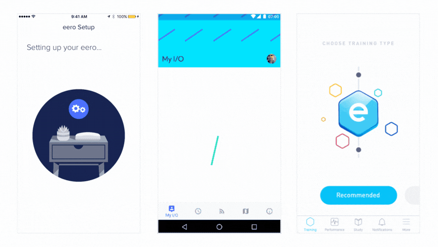

> <h2 id=''></h2>
- [**仿射动画**](#仿射动画)
	- [原理](#原理)
	- [CGAffineTransform](#CGAffineTransform)
- [**绘制**](#绘制)
	- [半圆边框](#半圆边框)
	- [绘制背景色](#绘制背景色)
	- [绘制文本](#绘制文本)
	- [绘制图片](#绘制图片)
	- [边框、阴影绘制](#边框、阴影绘制)
	- [线条绘制 ](#线条绘制 )
	- [绘制渐变](#绘制渐变)
	- [翻转绘制](#翻转绘制)
- [**优化**](#优化)
- [**框架**](#框架)
- [Lottie 框架](#Lottie框架)
	- [iOS使用Lottie](#iOS使用Lottie)
- [**OpenGL**](#OpenGL)
- **参考资料**
	- [**iOS核心动画**](https://zsisme.gitbooks.io/ios-/content/)
	- [**Core Graphics (长篇高能)**](https://www.jianshu.com/p/491b50cb19cb)
	- [iOS中拉伸图片的几种方式](https://www.jianshu.com/p/c9cbbdaa9b02)
	- [动画基础总结篇](http://www.cocoachina.com/articles/22302)
	- [UIView Animations](https://www.jianshu.com/p/71f2fa270b9c)
	- [CALayer、Core Animaton、UIview动画](https://blog.csdn.net/zhw521411/article/details/84974997)


<br/>
<br/>

***
<br/>


> <h1 id='仿射动画'>仿射动画</h1>


- **原理**
- **CGAffineTransform**
	- 消失收回效果


<br/>
<br/>

> <h2 id='原理'>原理</h2>


&emsp;  `UIView`有`CGAffineTransform`类型的属性`transform，它是定义在二维空间上完成View的平移，旋转，缩放等效果的实现。

&emsp;  CGAffineTransform是一个映射转换3*3的矩阵，用来绘画2D图像。可以实现放大、缩小、平移。其结构体为：

```
struct CGAffineTransform {
  CGFloat a, b, c, d;
  CGFloat tx, ty;
};


```

&emsp;  CGAffineTransform是一个结构体，里面有（a，b，c，d，tx，ty）六个参数，对应着一个3 * 3 的矩阵，有九个参数，默认值是[ 1 0 0 1 0 0 ]。如下图：


<br/>

- **`参数的用处：`**
	-  a: 用来控制在x轴方向上的缩放；
	-  b: 旋转会用到，初始值0。
	-  c: 旋转会用到，初始值0。
	-  d: 用来控制在y轴方向上的缩放；
	-  tx: 视图x轴平移，初始值0，没有平移。
	-  ty: 视图y轴平移，初始值0，没有平移。

&emsp;  为了把**二维图形的旋转、缩放、平移变化**统一在一个坐标系里,引入了[齐次坐标的概念](https://blog.csdn.net/jeffasd/article/details/77944822),**即把一个图形用一个三维矩阵表示**,其中第三列总是(0,0,1),用来作为坐标系的标准。所以**所有的变化都由前两列完成**.


<br/>
<br/>

> **公式计算**


设原坐标设为`(x,y,1)`


```
上图中的tx 和ty 记做 t小x ，t小y

                  |a    b    0|
  [x,y,1]  *      |c    d    0|     =     [ax+cy+t小x   bx+dy+t小y  1] ;
```

通过矩阵运算后的坐标[ax+cy+t小x bx+dy+t小y 1]


<br/>
<br/>


> <h2 id='CGAffineTransform'>CGAffineTransform</h2>


```
/*
CGAffineTransform transform  = CGAffineTransformMake(CGFloat a,CGFloat b,CGFloat c,CGFloa td,CGFloat tx,CGFloat ty)
*/

//CGAffineTransformIdentity是系统提供的一个常量,没有做任何的转换
//其值为：[ 1 0 0 1 0 0 ](和原图一样的transform)
CGAffineTransform  transform = CGAffineTransformIdentity;
```
默认的CGAffineTransformIdentity


<br/>
<br/>

**示例**

```

//1.先正常创建collectionview 
_collectionview=[[UICollectionView alloc]initWithFrame:CGRectMake(0,kScreenHeigth-100-SafeAreaBoHttomHeight, kScreenWidth, 100) 
collectionViewLayout:layout];
//2.相对移动 往下移动高的距离（本例为100）,还有一种方法，创建时y的坐标就再加上高，达到同样的效果
   _collectionview.transform = CGAffineTransformMakeTranslation(0, 100);
//3.加个view的简单动画，设个觉得可以的动画时间
 [UIView animateWithDuration:0.4 animations:^{
            self.collectionview.transform = CGAffineTransformMakeTranslation(0, 0);
        }];

```

<br/>

- **消失收回的效果**

原理和推出一样，在动画结束后消失视图

```
//先移动试图到底部，动画结束，移除视图
  [UIView animateWithDuration:0.4 animations:^{
        self.collectionview.transform = CGAffineTransformMakeTranslation(0, 100);
    } completion:^(BOOL finished) {
         [self removeFromSuperview];
    }];
```


<br/>

> <h2 id=''></h2>


<br/>
<br/>


<br/>
<br/>

***
<br/>


> <h1 id='绘制'>绘制</h1>

<br/>

> <h2 id='半圆边框'>半圆边框</h2>

```
+ (UIImageView *) drawInputViewWithFrame:(CGRect)frame {
    UIImageView *inputView = [[UIImageView alloc] initWithFrame:frame];
    CGFloat lineW = 1.0f;
    
    //获取上下文，两种情况(从UIView或者UIImageView)
    UIGraphicsBeginImageContext(inputView.frame.size);
    
    //获取图片上下文
    CGContextRef context = UIGraphicsGetCurrentContext();
    //线条样式：无端点
    CGContextSetLineCap(context, kCGLineCapButt);
    [[UIColor lightGrayColor] setStroke];
    //设置线条宽度
    CGContextSetLineWidth(context, lineW);
    
    //上部的线
    CGFloat startX = CGRectGetMinX(inputView.frame)+CGRectGetHeight(inputView.frame)/2;
    CGFloat endX = CGRectGetMaxX(inputView.frame)-CGRectGetHeight(inputView.frame)/2;
    CGContextMoveToPoint(context, startX, lineW);
    CGContextAddLineToPoint(context, endX, lineW);
    CGContextStrokePath(context);

    
    //绘制右圆弧
    [GRegisterController drawArcInContext:context superViewFrame:inputView.frame isLeft:NO lineWidth:lineW];
    CGContextStrokePath(context);

    
    //下部的线
    CGFloat lineY = CGRectGetHeight(inputView.frame)-lineW;
    CGContextMoveToPoint(context, startX, lineY);
    CGContextAddLineToPoint(context, endX, lineY);
    CGContextStrokePath(context);

    
    //绘制左圆弧
    [GRegisterController drawArcInContext:context superViewFrame:inputView.frame isLeft:YES lineWidth:lineW];
    CGContextStrokePath(context);

    //获取上下文中的image
    inputView.image = UIGraphicsGetImageFromCurrentImageContext();
    //结束上下文，显示imageView
    UIGraphicsEndImageContext();
    
    return inputView;
}

+ (void) drawArcInContext:(CGContextRef)context superViewFrame:(CGRect)frame isLeft:(BOOL)isLeft lineWidth:(CGFloat)lineW {

    //半径
    CGFloat radius = (CGRectGetHeight(frame)-2*lineW)/2;
    //圆弧中心点X坐标
    CGFloat centerX = 0.0f;
    //圆弧中心点Y坐标
    CGFloat centerY = radius+lineW;
    CGFloat startAngle = 0.0f;
    CGFloat endAngle = 0.0f;
    
    if (isLeft) {
        //圆弧中心点X坐标
        centerX = lineW+radius;
        startAngle = -M_PI_2;
        endAngle = M_PI_2;
    }else {
        centerX = CGRectGetMaxX(frame)-lineW-radius;
        startAngle = M_PI_2;
        endAngle = -M_PI_2;
    }
    
    CGContextAddArc(context, centerX, centerY, radius, startAngle, endAngle, 1);

}


- (UIImageView *)phoneNumberView {
    if (!_phoneNumberView) {
        _phoneNumberView = [GRegisterController drawInputViewWithFrame:CGRectMake(0, 100, 414, 46)];
    }
    return _phoneNumberView;
}

[self.view addSubview:self.phoneNumberView];

```
效果图：


问题：`无法设置绘制区域内的填充色？？`


<br/>
<br/>


> <h2 id='绘制背景色'>绘制背景色</h2>


```
override func draw(_ rect: CGRect) {

      let p = UIBezierPath(rect: rect)
      UIColor.red.setFill()
      p.fill()
}
```

效果：


<br/>
<br/>


> <h2 id='绘制文本'>绘制文本</h2>


```
override func draw(_ rect: CGRect) {

    let fontName = "HelveticaNeue-Bold"
    let helveticaBold = UIFont(name: fontName, size: 20.0)
    let string = "HUANG HARLEY 2020.01.18"
    string.draw(at: CGPoint(x: 40, y: 40), withAttributes: [NSAttributedString.Key.font : helveticaBold!,NSAttributedString.Key.foregroundColor:UIColor.red ])
}
```


<br/>
<br/>


> <h2 id='绘制图片'>绘制图片</h2>


```
override func draw(_ rect: CGRect) {
    
    guard let picURL = URL.init(string: "https://www.apple.com.cn/v/safari/k/images/overview/safari_icon__ep64chrczuky_large_2x.jpg") else { return }
    do {
        let img = UIImage.init(data: try Data.init(contentsOf: picURL))
        //这里是绘制的起始点，会根据图片的大小绘制
        img?.draw(in: CGRect.init(x: 88, y: 64, width: 200, height: 200))//这里指定绘制的起始点和大小，可以自行查看区别
    } catch  {
        
    }
    
    
}

```


<br/>
<br/>


> <h2 id='边框、阴影绘制'>边框、阴影绘制</h2>


```
override func draw(_ rect: CGRect) {
    
    let currentContext = UIGraphicsGetCurrentContext()
    let path = CGMutablePath()
    
    ///绘制边界
    /**绘制矩形的边界*/
    let rectangle = CGRect.init(x: 100, y: 100, width: 80, height: 80)
    /**将矩形添加到路径中*/
    path.addRect(rectangle)
    /**设置线宽*/
    currentContext?.setLineWidth(5)
    /**获取当前上下文句柄*/
    currentContext?.addPath(path)
    
    ///填充颜色
    /**设置填充颜色*/
    UIColor.cyan.setFill()
    /**设置边框颜色*/
    UIColor.red.setStroke()
    
    ///绘制阴影
    let offset = CGSize.init(width: 10, height: 10)
    currentContext?.setShadow(offset: offset, blur: 20, color: UIColor.purple.cgColor)
    
    /**在上下文毛边并填充路径*/
    currentContext?.drawPath(using: .fillStroke)
}

```


<br/>
<br/>


> <h2 id='线条绘制 '>线条绘制 </h2>


```
override func draw(_ rect: CGRect) {
    
     UIColor.red.set()
     /**获取当前的图形上下文*/
    guard let context = UIGraphicsGetCurrentContext() else { return }
     /**设置线宽*/
    (context ).setLineWidth(10)
     /**设置线的划线方式*/
    (context ).setLineCap(.round) //z
     /**设置线的起点*/
    (context ).move(to: CGPoint.init(x: 100, y: 90))
     /**设置线的终点*/
    (context ).addLine(to: CGPoint.init(x: 180, y: 170))
     /**设置两条线直接的链接的方式*/
    (context ).setLineJoin(.round)
    
     /**如果绘制连续颜色，则直接addLine就可以*/
    (context ).addLine(to: CGPoint.init(x: 100, y: 250))
   
     /**使用上下文当前的颜色绘制线条*/
    (context ).strokePath()
}
```


<br/>
<br/>


> <h2 id='绘制渐变'> 绘制渐变</h2>


```
override func draw(_ rect: CGRect) {
    
    let currentContext = UIGraphicsGetCurrentContext()
    /**创建颜色空间,用来描述域值范围*/
    let colorSpace = CGColorSpaceCreateDeviceRGB()
    let startColor = UIColor.red
    /**获取颜色组件*/
    let startColorComponents = startColor.cgColor.components

    let endColor = UIColor.purple
    let endColorComponents = endColor.cgColor.components
    ///RGB 颜色分量和 alpha 值写入
    let colorComponents = [
       startColorComponents?[0],
       startColorComponents?[1],
       startColorComponents?[2],
       startColorComponents?[3],
       endColorComponents?[0],
       endColorComponents?[1],
       endColorComponents?[2],
       endColorComponents?[3]
       ] as! [CGFloat]
    ///定义各种颜色的相对位置
    let colorIndices = [0.0,1.0] as [CGFloat]
    ///描述渐变信息
    let gradient = CGGradient.init(colorSpace: colorSpace, colorComponents: colorComponents, locations: colorIndices, count: 2)
    ///渐变将沿纵轴 (vertical axis) 方向绘制
    currentContext?.drawLinearGradient(gradient!, start: CGPoint.init(x: 100, y: 100), end: CGPoint.init(x: 100, y: 200), options: [])
    
}
```


<br/>
<br/>


> <h2 id='翻转绘制'>翻转绘制</h2>


```
override func draw(_ rect: CGRect) {
        
         let path = CGMutablePath()
         /**绘制矩形的边界*/
         let rectangle = CGRect.init(x: 200, y: 100, width: 80, height: 80)
         /**将矩形添加到路径中*/
         path.addRect(rectangle)
         /**使用缩放*/
//         let transform = CGAffineTransform.init(scaleX: 1.5, y: 1.5)
//         path.addRect(rectangle, transform: transform)
          /**使用旋转*/
        let transform = CGAffineTransform.init(rotationAngle: CGFloat((45.0 * Double.pi)/180))
         path.addRect(rectangle, transform: transform)
          
         /**获取当前上下文句柄*/
         let currentContext = UIGraphicsGetCurrentContext()
         /**保存上下文，便于后期恢复*/
         currentContext?.saveGState()
 //        /*像右移动10个点*/
         currentContext?.translateBy(x: 10, y: 0)
  
         currentContext?.addPath(path)
         /**设置填充颜色*/
         UIColor.red.setFill()
         /**设置边框颜色*/
         UIColor.yellow.setStroke()
         /**设置线宽*/
         currentContext?.setLineWidth(5)
         /**在上下文毛边并填充路径*/
         currentContext?.drawPath(using: .fillStroke)
         /**回复上下文状态*/
         currentContext?.restoreGState()
    }

```


<br/>
<br/>

***
<br/>

> <h1 id='优化'>优化</h1>


<br/>


> <h2 id='Images.xcassets和单独文件夹区别'>Images.xcassets和单独文件夹区别</h2>


- **Images.xcassets**

	- （1）图片的资源包放到 Images.xcassets 中，会把所有的文件打包 Assets.car文件，图片会被压缩，从而使包的体积变小。
	
	- （2）只支持png格式的图片
	
	- （3）图片只支持 [UIImage imageNamed:@"logo01"] 的方式实例化

```
imageView.image = [UIImage imageNamed:@"logo01"];
```

<br/>

- **imageNamed方法特点:**
	- （1）加载到内存当中会一直存在内存当中，（图片）不会随着对象的销毁而销毁。
	
	- （2）相同的图片是不会重复加载内存中
	
	- （3）加载到内存中占据的内存较大

所以比较适合放置一些tabBar图标,导航图标等!

<br/>

- **单独文件夹**

	- （1）图片的资源包放到文件夹中，会被打包 MainBundle 中。图片不会被压缩。
	
	- （2）可以使用 [UIImage imageNamed:@"logo01"] 加载，也可以使用i mageWithContentOfFile: 方法加载。

```
// imageView.image = [UIImage imageNamed:@"logo01"];
NSString *path = [[NSBundle mainBundle] pathForResource:@"logo01.png" ofType:nil];
imageView.image = [UIImage imageWithContentsOfFile:path];
```


<br/>

- **imageWithContentsOfFile特点**

	- （1）加载的图片会随着对象的销毁而销毁
	
	- （2）相同的图片是会重复加载到内存中
	
	- （3）加载到内存中占据的内存较大

比较放置一些大的背景图,设置中的头像之类的!


<br/>
<br/>

***
<br/>

> <h1 id='框架'>框架</h1>

<br/>

> <h2 id='Lottie框架'>Lottie 框架</h2>

&emsp; Lottie 是 Airbnb 开源的一个动画框架。Lottie 这个名字来自于一名德国导演洛特·赖尼格尔（Lotte Reiniger），她最著名的电影叫作“阿赫迈德王子历险记（The Adventures of Prince Achmed）”。这个框架和其他的动画框架不太一样，动画的编写和维护将由动画设计师完成，完全无需开发者操心。

&emsp; 动画设计师做好动画以后，可以使用After Effects将动画导出成 JSON 文件，然后由 Lottie 加载和渲染这个 JSON 文件，并转换成对应的动画代码。由于是 JSON 格式，文件也会很小，可以减少 App 包大小。运行时还可以通过代码控制更改动画，比如更改颜色、位置以及任何关键值。另外，Lottie 还支持页面切换的过场动画（UIViewController Transitions）。




<br/>


&emsp; 上面这些动画，就是由动画设计师使用 After Effects 创作，然后使用 Bodymovin进行导出的，开发者完全不用做什么额外的代码工作，就能够使用原生方式将其渲染出来。

&emsp; Bodymovin 是 Hernan Torrisi 做的一个 After Effects 的插件，起初导出的 JSON 文件只是通过 JavaScript 在网页中进行动画的播放，后来才将 JSON 文件的解析渲染应用到了其他平台上。

<br/>

&emsp; 如何使用 **Bodymovin** 呢？

&emsp; 你需要先到Adobe 官网下载 Bodymovin 插件，并在 After Effects 中安装。使用 After Effects 制作完动画后，选择 Windows 菜单，找到 Extensions 的 Bodymovin 项，在菜单中选择 Render 按钮就可以输出 JSON 文件了。


<br/>
<br/>

> <h3 id='iOS使用Lottie'>iOS使用Lottie</h3>

&emsp; 在 iOS 开发中使用 Lottie 也很简单，只要集成 Lottie 框架，然后在程序中通过 Lottie 的接口控制 After Effects 生成的动画 JSON 就行了。首先，你可以通过 [CocoaPods 集成 Lottie 框架](https://github.com/airbnb/lottie-ios/)到你工程中。

&emsp; 快速读取一个由 Bodymovin 生成的 JSON 文件进行播放。具体代码如下所示：

```
LOTAnimationView *animation = [LOTAnimationView animationNamed:@"Lottie"];
[self.view addSubview:animation];
[animation playWithCompletion:^(BOOL animationFinished) {
  // 动画完成后需要处理的事情
}];
```

&emsp; 利用 Lottie 的动画进度控制能力，还可以完成手势与动效同步的问题。动画进度控制是 LOTAnimationView 的 animationProgress 属性，设置属性的示例代码如下：

```
CGPoint translation = [gesture getTranslationInView:self.view];
CGFloat progress = translation.y / self.view.bounds.size.height;
animationView.animationProgress = progress;
```

<br/>

&emsp; Lottie 还带有一个 UIViewController animation-controller，可以自定义页面切换的过场动画，示例代码如下：

```
#pragma mark -- 定制转场动画
// 代理返回推出控制器的动画
- (id<UIViewControllerAnimatedTransitioning>)animationControllerForPresentedController:(UIViewController *)presented presentingController:(UIViewController *)presenting sourceController:(UIViewController *)source {
  LOTAnimationTransitionController *animationController = [[LOTAnimationTransitionController alloc] initWithAnimationNamed:@"vcTransition1" fromLayerNamed:@"outLayer" toLayerNamed:@"inLayer" applyAnimationTransform:NO];
  return animationController;
}
// 代理返回退出控制器的动画
- (id<UIViewControllerAnimatedTransitioning>)animationControllerForDismissedController:(UIViewController *)dismissed {
  LOTAnimationTransitionController *animationController = [[LOTAnimationTransitionController alloc] initWithAnimationNamed:@"vcTransition2" fromLayerNamed:@"outLayer" toLayerNamed:@"inLayer" applyAnimationTransform:NO];
  return animationController;
}
```

Lottie 在运行期间提供接口和协议来更改动画，有动画数据搜索接口 LOTKeyPath，以及设置动画数据的协议 LOTValueDelegate。详细的说明和使用示例代码，你可以参看官方 iOS 教程。


<br/>

> **多平台支持**

&emsp; Lottie 支持多平台，除了 支持iOS，还支持 Android 、React Native和Flutter。除了官方维护的这些平台外，Lottie 还支持Windows、Qt、Skia 。陈卿还实现了 React、Vue和Angular对 Lottie 的支持，并已将代码放到了 GitHub 上。


&emsp; 有了这么多平台的支持，对于动画设计师来说，可以安心做动画，只要简单地转换就可以完美展现动画效果，再也不用担心到开发者那里动画效果被大打折扣了。而对于开发者来说，再也不用写那些难以维护的大量动效代码了，而且 App 安装包的体积还变小了。


<br/>
<br/>
<br/>

> <h2 id='Lottie实现原理'>Lottie 实现原理</h2>


&emsp; Lottie iOS在 iOS 内做的事情就是将 After Effects 编辑的动画内容，通过 JSON 文件这个中间媒介，一一映射到 iOS 的 LayerModel、Keyframe、ShapeItem、DashElement、Marker、Mask、Transform 这些类的属性中并保存了下来，接下来再通过 CoreAnimation 进行渲染。这就和你手动写动画代码的实现是一样的，只不过这个过程的精准描述，全部由动画设计师通过 JSON 文件输入进来了。

Lottie iOS 使用系统自带的 Codable 协议来解析 JSON 文件，这样就可以享受系统升级带来性能提升的便利，比如 ShapeItem 这个类设计如下：

```
// Shape Layer
class ShapeItem: Codable {
  
  /// shape 的名字
  let name: String
  
  /// shape 的类型
  let type: ShapeType
  // 和 json 中字符映射
  private enum CodingKeys : String, CodingKey {
    case name = "nm"
    case type = "ty"
  }
  // 初始化
  required init(from decoder: Decoder) throws {
    let container = try decoder.container(keyedBy: ShapeItem.CodingKeys.self)
    self.name = try container.decodeIfPresent(String.self, forKey: .name) ?? "Layer"
    self.type = try container.decode(ShapeType.self, forKey: .type)
  }
}
```

通过上面代码可以看出，ShapeItem 有两个属性，映射到 JSON 的字符键值是 nm 和 ty，分别代表 shape 的名字和类型。下面，我们再一起看一段 Bodymovin 生成的 JSON 代码：

```
{
	"ty": "st",
	"fillEnabled": true,
	"c": {
		"k": [{
			"i": {
				"x": [0.833],
				"y": [0.833]
			},
			"o": {
				"x": [0.167],
				"y": [0.167]
			},
			"n": ["0p833_0p833_0p167_0p167"],
			"t": 22,
			"s": [0, 0.65, 0.6, 1],
			"e": [0.76, 0.76, 0.76, 1]
		}, {
			"t": 36
		}]
	},
	"o": {
		"k": 100
	},
	"w": {
		"k": 3
	},
	"lc": 2,
	"lj": 2,
	"nm": "Stroke 1",
	"mn": "ADBE Vector Graphic - Stroke"
}
```


在这段 JSON 代码中，nm 键对应的值是 Stroke 1，ty 键对应的值是 st。那我们再来看看，st 是什么类型。

我们知道，ShapeType 是个枚举类型，它的定义如下：

```

enum ShapeType: String, Codable {
  case ellipse = "el"
  case fill = "fl"
  case gradientFill = "gf"
  case group = "gr"
  case gradientStroke = "gs"
  case merge = "mm"
  case rectangle = "rc"
  case repeater = "rp"
  case round = "rd"
  case shape = "sh"
  case star = "sr"
  case stroke = "st"
  case trim = "tm"
  case transform = "tr"
}
```

通过上面的枚举定义，可以看到 st 对应的是 stroke 类型。


Lottie 就是通过这种方式，定义了一系列的类结构，可以将 JSON 数据全部映射过来。所有映射用的类都放在 Lottie 的 Model 目录下。使用 CoreAnimation 渲染的相关代码都在 NodeRenderSystem 目录下，比如前面举例的 Stoke。

在渲染前会生成一个节点，实现在 StrokeNode.swift 里，然后对 StokeNode 这个节点渲染的逻辑在 StrokeRenderer.swift 里。核心代码如下：

```
// 设置 Context
func setupForStroke(_ inContext: CGContext) {
  inContext.setLineWidth(width) // 行宽
  inContext.setMiterLimit(miterLimit)
  inContext.setLineCap(lineCap.cgLineCap) // 行间隔
  inContext.setLineJoin(lineJoin.cgLineJoin)
  // 设置线条样式
  if let dashPhase = dashPhase, let lengths = dashLengths {
    inContext.setLineDash(phase: dashPhase, lengths: lengths)
  } else {
    inContext.setLineDash(phase: 0, lengths: [])
  }
}
// 渲染
func render(_ inContext: CGContext) {
  guard inContext.path != nil && inContext.path!.isEmpty == false else {
    return
  }
  guard let color = color else { return }
  hasUpdate = false
  setupForStroke(inContext)
  inContext.setAlpha(opacity) // 设置透明度
  inContext.setStrokeColor(color) // 设置颜色
  inContext.strokePath()
}
```


这段代码看起来是不是就很熟悉了？

如果是手写动画，这些代码就需要不断重复地写。使用第三方库去写动画的话，也无非就是多封装了一层，而属性的设置、动画时间的设置等，还是需要手动添加很多代码来完成。

但是，使用 Lottie 后，你就完全不用去管这些代码了，只需要在 After Effects 那设置属性、控制动画时间就好了。


<br/>
<br/>

<br/>

> <h2 id=''></h2>


<br/>
<br/>

<br/>

> <h2 id=''></h2>


<br/>
<br/>


<br/>
<br/>

***
<br/>

> <h1 id='OpenGL'>OpenGL</h1>


概念词介绍：
管线：流水线工作(一环套着一环)，分为：
-  固定管线：在已有的选择做出选择；
-  可编程管线：可以对其进行合理的改变，对其某一环节进行改变。

&emsp;  在OpenGL中没有正方形之说，只有点、线、三角形，没有四边形之说。因为点、线、三角形这些基本图形可以构成其他图形了。


<br/>

> <h2 id=''></h2>


<br/>
<br/>


<br/>
<br/>

***
<br/>


> <h1 id=''></h1>

<br/>

> <h2 id=''></h2>


<br/>
<br/>

