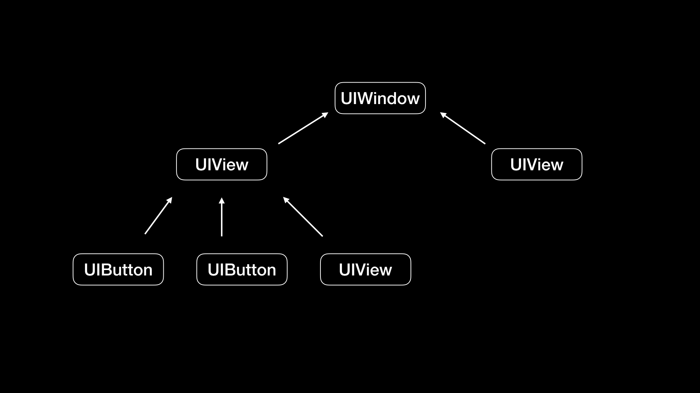

> <h2 id=''></h2>
- [**埋点分类**](#埋点分类)
	- [方法替换埋点](#方法替换埋点)
		- [页面进入埋点](#页面进入埋点)
		- [点击埋点](#点击埋点)
		- [事件唯一标识](#事件唯一标识)


<br/>

***
<br/>


> <h1 id='埋点分类'>埋点分类</h1>

<br/>

&emsp; 埋点可以解决两大类问题：一是了解用户使用 App 的行为，二是降低分析线上问题的难度。目前，iOS 开发中常见的埋点方式，主要包括代码埋点、可视化埋点和无埋点这三种:
- 代码埋点主要就是通过手写代码的方式来埋点，能很精确的在需要埋点的代码处加上埋点的代码，可以很方便地记录当前环境的变量值，方便调试，并跟踪埋点内容，但存在开发工作量大，并且埋点代码到处都是，后期难以维护等问题。
- 可视化埋点，就是将埋点增加和修改的工作可视化了，提升了增加和维护埋点的体验。
- 无埋点，并不是不需要埋点，而更确切地说是“全埋点”，而且埋点代码不会出现在业务代码中，容易管理和维护。它的缺点在于，埋点成本高，后期的解析也比较复杂，再加上 view_path 的不确定性。所以，这种方案并不能解决所有的埋点需求，但对于大量通用的埋点需求来说，能够节省大量的开发和维护成本。

<br/>

&emsp; 在这其中，可视化埋点和无埋点，都属于是无侵入的埋点方案，因为它们都不需要在工程代码中写入埋点代码。所以，采用这样的无侵入埋点方案，既可以做到埋点被统一维护，又可以实现和工程代码的解耦。


<br/>


> <h2 id='方法替换埋点'>方法替换埋点</h2>

<br/>

> <h2 id='页面进入埋点'>页面进入埋点</h2>

&emsp; 在 iOS 开发中最常见的三种埋点，就是对页面进入次数、页面停留时间、点击事件的埋点。对于这三种常见情况，我们都可以通过运行时方法替换技术来插入埋点代码，以实现无侵入的埋点方法。具体的实现方法是：先写一个运行时方法替换的类 SMHook，加上替换的方法 hookClass:fromSelector:toSelector，代码如下：

```

#import "SMHook.h"
#import <objc/runtime.h>

@implementation SMHook

+ (void)hookClass:(Class)classObject fromSelector:(SEL)fromSelector toSelector:(SEL)toSelector {
    Class class = classObject;
    // 得到被替换类的实例方法
    Method fromMethod = class_getInstanceMethod(class, fromSelector);
    // 得到替换类的实例方法
    Method toMethod = class_getInstanceMethod(class, toSelector);
    
    // class_addMethod 返回成功表示被替换的方法没实现，然后会通过 class_addMethod 方法先实现；返回失败则表示被替换方法已存在，可以直接进行 IMP 指针交换 
    if(class_addMethod(class, fromSelector, method_getImplementation(toMethod), method_getTypeEncoding(toMethod))) {
      // 进行方法的替换
        class_replaceMethod(class, toSelector, method_getImplementation(fromMethod), method_getTypeEncoding(fromMethod));
    } else {
      // 交换 IMP 指针
        method_exchangeImplementations(fromMethod, toMethod);
    }

}

@end
```

这个方法利用运行时 method_exchangeImplementations 接口将方法的实现进行了交换，原方法调用时就会被 hook 住，从而去执行指定的方法。


<br/>
<br/>

**页面进入次数、页面停留时间都需要对 UIViewController 生命周期进行埋点，**你可以创建一个 UIViewController 的 Category，代码如下：

```
@implementation UIViewController (logger)
+ (void)load {
    static dispatch_once_t onceToken;
    dispatch_once(&onceToken, ^{
        // 通过 @selector 获得被替换和替换方法的 SEL，作为 SMHook:hookClass:fromeSelector:toSelector 的参数传入 
        SEL fromSelectorAppear = @selector(viewWillAppear:);
        SEL toSelectorAppear = @selector(hook_viewWillAppear:);
        [SMHook hookClass:self fromSelector:fromSelectorAppear toSelector:toSelectorAppear];
        
        SEL fromSelectorDisappear = @selector(viewWillDisappear:);
        SEL toSelectorDisappear = @selector(hook_viewWillDisappear:);
        
        [SMHook hookClass:self fromSelector:fromSelectorDisappear toSelector:toSelectorDisappear];
    });
}

- (void)hook_viewWillAppear:(BOOL)animated {
    // 先执行插入代码，再执行原 viewWillAppear 方法
    [self insertToViewWillAppear];
    [self hook_viewWillAppear:animated];
}
- (void)hook_viewWillDisappear:(BOOL)animated {
    // 执行插入代码，再执行原 viewWillDisappear 方法
    [self insertToViewWillDisappear];
    [self hook_viewWillDisappear:animated];
}

- (void)insertToViewWillAppear {
    // 在 ViewWillAppear 时进行日志的埋点
    [[[[SMLogger create]
       message:[NSString stringWithFormat:@"%@ Appear",NSStringFromClass([self class])]]
      classify:ProjectClassifyOperation]
     save];
}
- (void)insertToViewWillDisappear {
    // 在 ViewWillDisappear 时进行日志的埋点
    [[[[SMLogger create]
       message:[NSString stringWithFormat:@"%@ Disappear",NSStringFromClass([self class])]]
      classify:ProjectClassifyOperation]
     save];
}
@end
```

&emsp; 可以看到，Category 在 +load() 方法里使用了 SMHook 进行方法替换，在替换的方法里执行需要埋点的方法 [self insertToViewWillAppear]。这样的话，每个 UIViewController 生命周期到了 ViewWillAppear 时都会去执行 insertToViewWillAppear 方法。


&emsp; 那么，我们要怎么区别不同的 UIViewController 呢？我一般采取的做法都是，使用 NSStringFromClass([self class]) 方法来取类名。这样，我就能够通过类名来区别不同的 UIViewController 了。


<br/>


> <h2 id='点击埋点'>点击埋点</h2>

&emsp; 对于点击事件来说，我们也可以通过运行时方法替换的方式进行无侵入埋点。这里最主要的工作是，找到这个点击事件的方法 sendAction:to:forEvent:，然后在 +load() 方法使用 SMHook 替换成为你定义的方法。完整代码实现如下：

```
+ (void)load {
    static dispatch_once_t onceToken;
    dispatch_once(&onceToken, ^{
        // 通过 @selector 获得被替换和替换方法的 SEL，作为 SMHook:hookClass:fromeSelector:toSelector 的参数传入
        SEL fromSelector = @selector(sendAction:to:forEvent:);
        SEL toSelector = @selector(hook_sendAction:to:forEvent:);
        [SMHook hookClass:self fromSelector:fromSelector toSelector:toSelector];
    });
}

- (void)hook_sendAction:(SEL)action to:(id)target forEvent:(UIEvent *)event {
    [self insertToSendAction:action to:target forEvent:event];
    [self hook_sendAction:action to:target forEvent:event];
}
- (void)insertToSendAction:(SEL)action to:(id)target forEvent:(UIEvent *)event {
    // 日志记录
    if ([[[event allTouches] anyObject] phase] == UITouchPhaseEnded) {
        NSString *actionString = NSStringFromSelector(action);
        NSString *targetName = NSStringFromClass([target class]);
        [[[SMLogger create] message:[NSString stringWithFormat:@"%@ %@",targetName,actionString]] save];
    }
}
```


&emsp; 和 UIViewController 生命周期埋点不同的是，UIButton 在一个视图类中可能有多个不同的继承类，相同 UIButton 的子类在不同视图类的埋点也要区别开。所以，我们需要通过 “action 选择器名 NSStringFromSelector(action)” +“视图类名 NSStringFromClass([target class])”组合成一个唯一的标识，来进行埋点记录。


&emsp; 除了 UIViewController、UIButton 控件以外，Cocoa 框架的其他控件都可以使用这种方法来进行无侵入埋点。以 Cocoa 框架中最复杂的 UITableView 控件为例，你可以使用 hook setDelegate 方法来实现无侵入埋点。另外，对于 Cocoa 框架中的手势事件（Gesture Event），我们也可以通过 hook initWithTarget:action: 方法来实现无侵入埋点。


<br/>


> <h2 id='事件唯一标识'>事件唯一标识</h2>

通过运行时方法替换的方式，我们能够 hook 住所有的 Objective-C 方法，可以说是大而全了，能够帮助我们解决绝大部分的埋点问题。

但是，这种方案的精确度还不够高，还无法区分相同类在不同视图树节点的情况。比如，一个视图下相同 UIButton 的不同实例，仅仅通过 “action 选择器名”+“视图类名”的组合还不能够区分开。这时，我们就需要有一个唯一标识来区分不同的事件。接下来，我就跟你说说如何制定出这个唯一标识。

这时，我首先想到的就是，能不能通过视图层级的路径来解决这个问题。因为每个页面都有一个视图树结构，通过视图的 superview 和 subviews 的属性，我们就能够还原出每个页面的视图树。视图树的顶层是 UIWindow，每个视图都在树的子节点上。如下:




<br/>


> <h2 id=''></h2>


<br/>


> <h2 id=''></h2>


<br/>

***
<br/>


> <h1 id=''></h1>

<br/>


> <h2 id=''></h2>


<br/>

***
<br/>


> <h1 id=''></h1>

<br/>


> <h2 id=''></h2>


<br/>

***
<br/>


> <h1 id=''></h1>

<br/>


> <h2 id=''></h2>
