- [**汇编**](#汇编)
- [**类**](#类)
	- [实例对象](#实例对象)
	- [类对象(class对象)](#类对象(class对象))
	- [isa指针](#isa指针)
	- [元类对象（meta-class对象）](#元类对象（meta-class对象）)
	- [isa指针指向](#isa指针指向)
	- [Class本质](#Class本质)
		- [objc_class源码](#objc_class源码)
		- [objc_object源码](#objc_object源码)
	- [class的superClass指针的指向](#class的superClass指针的指向)
	- [meta-class对象的superClass指针指向](#meta-class对象的superClass指针指向)
	- [**[self class]和[super class]**](#selfclass和superclass)
	- **[object_getClass和class区别](#object_getClass和class区别)**
	- [**method_getTypeEncoding**](#method_getTypeEncoding)
- [**自动引用技术**](#自动引用技术)
	- [retain源码](#retain源码)
	- [rootRetain()](#rootRetain())
	- [处理溢出rootRetain_overflow](#处理溢出rootRetain_overflow)
	- [内联函数调用和普通函数调用的区别](#内联函数调用和普通函数调用的区别)
- [**弱引用**](#弱引用)
	- [Sidetable](#Sidetable)
- **资料**
	- [**[self class]和[super class]**](https://www.cnblogs.com/lutengda/p/9486559.html)
	- [**元类详解**](https://blog.csdn.net/windyitian/article/details/19810875)
	- [**objc源码编译**](https://juejin.cn/post/6844903959161733133)
	- [深入理解iOS内存管理](https://juejin.cn/post/6844904004669931533#heading-5)
	- [weak引用以及sidetable表](https://blog.csdn.net/shengpeng3344/article/details/105825715)
	- [OC对象本质](https://www.jianshu.com/p/ffd742041946)
	- [**探寻Class的本质**](https://www.jianshu.com/p/74db5638f34f)


<br/>

***
<br/>

> <h1 id='汇编'>汇编</h1>


&emsp;  OC中 Assembly File 是写汇编的文件，在 New File的 Other中，文件名为 File.s 建成以后里面什么都没有。

&emsp;  汇编是重要的一门编程语言，是对设备的开发。


<br/>

***
<br/>
<br/>


> <h1 id='类'>类</h1>

OC对象分为三种：
>- 实例对象(instance对象);
>- 类对象(class对象);
>- 元类对象（meta-class对象）


<br/>
<br/>


> <h2 id='实例对象'>实例对象</h2>

&emsp;  实例对象（instance对象）就是通过类的alloc出来的对象，每次调用alloc都会产生新的实例对象。例如：

```
NSObjcet *obj1 = [[NSObject alloc] init];
NSObjcet *obj2 = [[NSObject alloc] init];
```

&emsp;  obj1和obj2都是NSObject的实例对象，但是它们是不同的两个实例对象，分别占用两块不同的内存地址。

&emsp;  实例对象在内存中存储的信息包括：
- isa指针
- 其他成员变量

实例对象存储的信息:

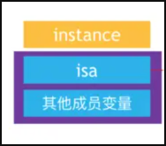


<br/>
<br/>

> <h2 id='类对象(class对象)'>类对象(class对象)</h2>


&emsp;  `类对象（class对象）`就是通过class方法或者runtime的object_getClass方法得到的class对象。

&emsp;  `注意：`class 方法只是获取类，并不能获取真正获取其类对象。在这里因为下面的obj1的类就是NSObject所以其类对象和类是一样的。若换成其他的结果可能不一样。

```
Class objClass1 = [obj1 class];
Class objClass2 = [obj2 class];
Class objClass3 = [NSObject class];

// runtime方法
Class objClass4 = object_getClass(obj1);
Class objClass5 = object_getClass(obj2);

NSLog(@"objClass1= %@,\n objClass2= %@,\n objClass3= %@,\n objClass4= %@,\n objClass5= %@,\n ", obj1, obj2, objClass1, objClass2, objClass3, objClass4, objClass5);
```
打印：

```
objClass1= NSObject,

objClass2= NSObject,

objClass3= NSObject,

objClass4= NSObject,

objClass5= NSObject,
```

&emsp;  objClass1-objClass5都是NSObject的类对象（class对象），且它们是同一个对象。

>&emsp;  **`每个类在内存中有且只有一个class对象`**

- 类对象在内存中存储的信息包括：
	- `isa`指针
	- `superClass`指针
	- 类的`属性`信息（`@property`），类的成员变量信息（`ivar`）
	- 类的`对象方法`信息（`instance method`），类的`协议`信息（`protocol`）

类对象存储图

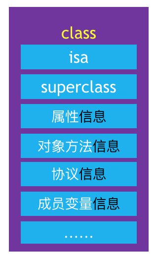


<br/>
<br/>


> <h2 id='元类对象（meta-class对象）'>元类对象（meta-class对象）</h2>

&emsp;  **`元类对象（meta-class对象）`**就是通过RunTime的`object_getClass`方法得到的对象

```
//通过RunTIme的API获得元类对象
Class objectMetaClass = object_getClass([NSObject class]);
```

objectMetaClass就是NSObject的元类对象


<br/>


**`每个类在内存中有且只有一个元类对象`**

元类对象和类对象的内存结构是一样的，但是用途不一样，元类对象在内存中存储的信息包括：
- `isa`指针
- `superClass`指针
- 类的`类方法`信息（`class method`）


元类对象存储信息

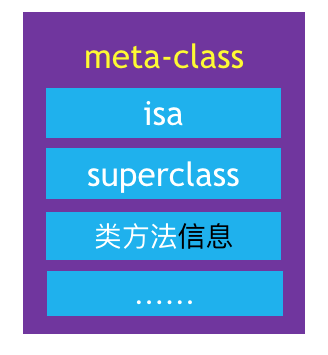


以上我们了解了`实例对象`、`类对象`和`元类对象`的含义以及包含的内容，那么它们当中的`isa`指针和`superClass`指针分别指向哪里呢?


<br/>
<br/>

> <h2 id='isa指针指向'>isa指针指向</h2>

isa指针指向用一张示意图来简单概括一下：


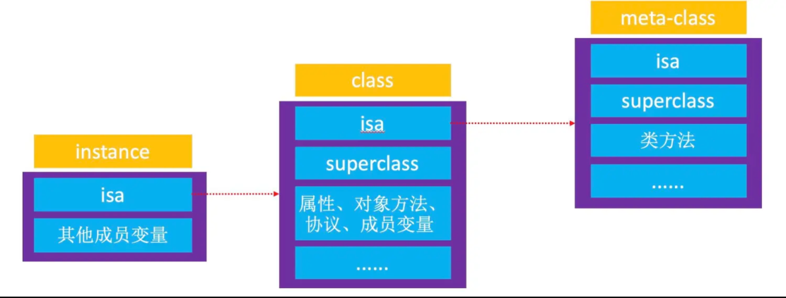


&emsp;  实例对象（instance对象）的`isa`指针指向`class`。当调用对象方法时，通过实例对象的`isa`找到`class`，最后找到对象方法的实现进行调用。

&emsp;  类对象（class对象）的`isa`指针指向meta-class。当调用类方法时，通过类对象的`isa`找到meta-class，最后找到类方法的实现进行调用。


<br/>
<br/>


> <h3 id='objc_class源码'>objc_class源码</h3>


```
struct objc_class : objc_object {
    // Class ISA;
    Class superclass;
    cache_t cache;             // formerly cache pointer and vtable
    class_data_bits_t bits;    // 存储一部分类的元数据信息

	//存储着方法列表，属性列表，协议列表等内容
    class_rw_t *data() const {
        return bits.data();
    }
    void setData(class_rw_t *newData) {
        bits.setData(newData);
    }

    void setInfo(uint32_t set) {
        ASSERT(isFuture()  ||  isRealized());
        data()->setFlags(set);
    }

    void clearInfo(uint32_t clear) {
        ASSERT(isFuture()  ||  isRealized());
        data()->clearFlags(clear);
    }
    
    //. . . . . . .
    //. . . . . . .
    //. . . . . . .
}
    
```

<br/>

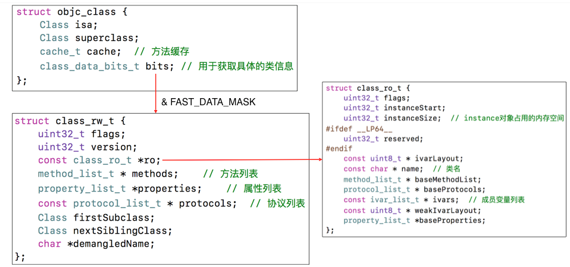


**class_data_bits_t源码**

```
struct class_data_bits_t {
	//存储了一些类的标志信息，例如是否是元类（meta-class）等
	uintptr_t bits;
	//用于快速访问一些常见的类信息，如类的引用计数（retain count）等
	uintptr_t fast_data;
	union {
	    struct {
				//指向类的第一个子类
				uintptr_t firstSubclass;
				//指向同一层次的下一个类
				uintptr_t nextSiblingClass;
	    };
	    struct {
				//在类数组中的索引
				uintptr_t classArrayIndex;
				//指向一个用于存储更多类信息的结构体
				uintptr_t bitsPointer;
	    };
	};
};
```


<br/>
<br/>

> <h3 id='objc_object源码'>objc_object源码</h3>

```

struct objc_object {
private:
	//isa_t 是在Objective-C中用于表示对象的isa指针的类型。在Objective-C中，每个对象都有一个isa指针，该指针指向该对象的类。这个类通常是一个Class对象，而isa_t则是Class类型的一个别名
	isa_t isa;

public:

    // ISA() assumes this is NOT a tagged pointer object
    Class ISA();

    // rawISA() assumes this is NOT a tagged pointer object or a non pointer ISA
    Class rawISA();

    // getIsa() allows this to be a tagged pointer object
    Class getIsa();
    
    uintptr_t isaBits() const;

    // initIsa() should be used to init the isa of new objects only.
    // If this object already has an isa, use changeIsa() for correctness.
    // initInstanceIsa(): objects with no custom RR/AWZ
    // initClassIsa(): class objects
    // initProtocolIsa(): protocol objects
    // initIsa(): other objects
    void initIsa(Class cls /*nonpointer=false*/);
    void initClassIsa(Class cls /*nonpointer=maybe*/);
    void initProtocolIsa(Class cls /*nonpointer=maybe*/);
    void initInstanceIsa(Class cls, bool hasCxxDtor);

    // changeIsa() should be used to change the isa of existing objects.
    // If this is a new object, use initIsa() for performance.
    Class changeIsa(Class newCls);

    bool hasNonpointerIsa();
    bool isTaggedPointer();
    bool isBasicTaggedPointer();
    bool isExtTaggedPointer();
    bool isClass();

    // object may have associated objects?
    bool hasAssociatedObjects();
    void setHasAssociatedObjects();

    // object may be weakly referenced?
    bool isWeaklyReferenced();
    void setWeaklyReferenced_nolock();

    // object may have -.cxx_destruct implementation?
    bool hasCxxDtor();

    // Optimized calls to retain/release methods
    id retain();
    void release();
    id autorelease();

    // Implementations of retain/release methods
    id rootRetain();
    bool rootRelease();
    id rootAutorelease();
    bool rootTryRetain();
    bool rootReleaseShouldDealloc();
    uintptr_t rootRetainCount();

    // Implementation of dealloc methods
    bool rootIsDeallocating();
    void clearDeallocating();
    void rootDealloc();

private:
    void initIsa(Class newCls, bool nonpointer, bool hasCxxDtor);

    // Slow paths for inline control
    id rootAutorelease2();
    uintptr_t overrelease_error();

#if SUPPORT_NONPOINTER_ISA
    // Unified retain count manipulation for nonpointer isa
    id rootRetain(bool tryRetain, bool handleOverflow);
    bool rootRelease(bool performDealloc, bool handleUnderflow);
    id rootRetain_overflow(bool tryRetain);
    uintptr_t rootRelease_underflow(bool performDealloc);

    void clearDeallocating_slow();

    // Side table retain count overflow for nonpointer isa
    void sidetable_lock();
    void sidetable_unlock();
	/**
		* 这个函数的具体实现可能涉及到 Objective-C 对象的底层内存管理结构，因为它包含了 "nolock"，可能是在不使用锁的情况下执行操作，这可能是因为它是在一些不需要线程同步的上下文中被调用的。
		
		* nolock" 则表示在无需锁的情况下执行操作
		* extra_rc: 这是额外的引用计数，可能是对象内存管理的一部分。在某些情况下，需要对对象进行额外的引用计数操作，而不是普通的引用计数增减。这个参数提供了额外的引用计数值
		* isDeallocating: 这是一个布尔值，指示是否正在进行释放（deallocating）对象的过程中调用此函数。在对象释放的过程中，可能需要进行特殊的处理
		* weaklyReferenced: 这也是一个布尔值，用于指示对象是否被弱引用。弱引用是一种不会增加对象引用计数的引用方式，当对象被释放时，弱引用会自动变为 nil。
	*/
	void sidetable_moveExtraRC_nolock(size_t extra_rc, bool isDeallocating, bool weaklyReferenced);
	bool sidetable_addExtraRC_nolock(size_t delta_rc);
	size_t sidetable_subExtraRC_nolock(size_t delta_rc);
	size_t sidetable_getExtraRC_nolock();
#endif

    // Side-table-only retain count
    bool sidetable_isDeallocating();
    void sidetable_clearDeallocating();

    bool sidetable_isWeaklyReferenced();
    void sidetable_setWeaklyReferenced_nolock();

    id sidetable_retain();
    id sidetable_retain_slow(SideTable& table);

    uintptr_t sidetable_release(bool performDealloc = true);
    uintptr_t sidetable_release_slow(SideTable& table, bool performDealloc = true);

    bool sidetable_tryRetain();

    uintptr_t sidetable_retainCount();
#if DEBUG
    bool sidetable_present();
#endif
};

```


<br/>
<br/>

> <h2 id='class的superClass指针的指向'>class的superClass指针的指向</h2>

类(class)的superClass指针指向用一张示意图来简单概括一下：

类的superClass指针指向图

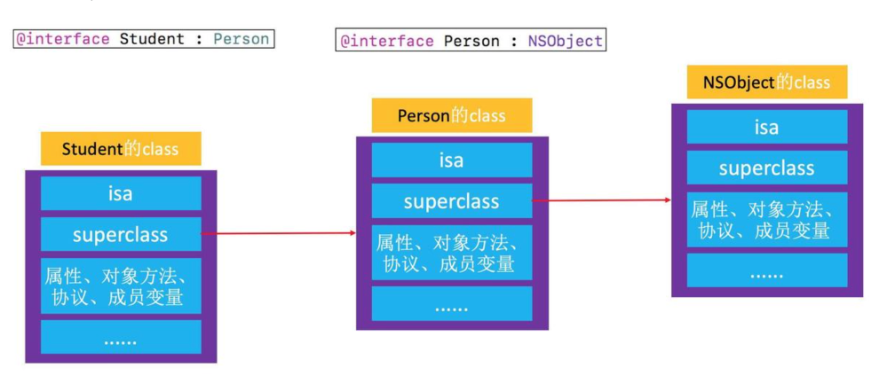

&emsp;  图中举例Student继承自Person，Person继承自NSObject。

&emsp;  当Student的实例对象要调用父类Person的对象方法时，会先通过`isa`找到Student的`class`，然后通过`class`中的superClass找到父类Person的`class`，最后找到对象方法的实现进行调用。


<br/>
<br/>

> <h2 id='meta-class对象的superClass指针指向'>meta-class对象的superClass指针指向</h2>

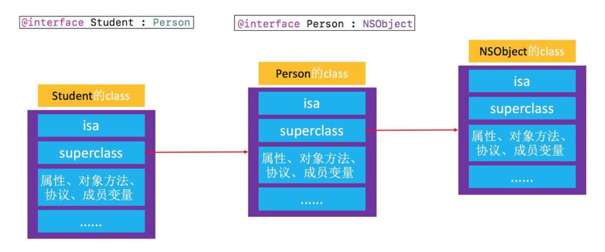

&emsp;  同上，当Student的class要调用Person的类方法时，会先通过isa找到Student的meta-class，然后通过superClass找到Person的meta-class，最后找到类方法的实现进行调用。

这里当然要提一下非常经典的isa指向图，做进一步的总结：

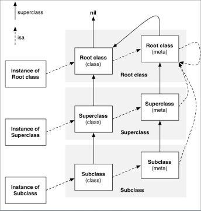

> 1、instance的isa指向class
> 
> 2、class的isa指向meta-class
> 
> 3、meta-class的isa指向基类的meta-class，基类的isa指向自己
> 
> 4、class的superClass指向父类的class，如果没有父类，则superClass指针为nil
> 
> 5、meta-class的superClass指向父类的meta-class，基类的meta-class的superClass指向基类的class
> 
> 6、instance调用对象方法的轨迹：通过isa找到class，方法不存在，就通过superclass逐层到父类里找，有就实现，如果找到基类仍没有找到，就会抛出`unrecognized selector sent to instance`异常
> 
> 7、class调用类方法的轨迹：通过isa找到meta-class，方法不存在，就通过superClass逐层父类里找。


**补充：**

相信很多人在查看源码或者看一些底层博客的时候，经常会看到下面一段代码，来讲述class的内部结构：

```
struct objc_class {
    // objc_class 结构体的实例指针
    Class _Nonnull isa  OBJC_ISA_AVAILABILITY; 

#if !__OBJC2__
    // 指向父类的指针
    Class _Nullable super_class                              OBJC2_UNAVAILABLE;
    // 类的名字 
    const char * _Nonnull name                               OBJC2_UNAVAILABLE;
    // 类的版本信息，默认为 0
    long version                                             OBJC2_UNAVAILABLE;
    // 类的信息，供运行期使用的一些位标识  
    long info                                                OBJC2_UNAVAILABLE;
    // 该类的实例变量大小;
    long instance_size                                       OBJC2_UNAVAILABLE;
    // 该类的实例变量列表
    struct objc_ivar_list * _Nullable ivars                  OBJC2_UNAVAILABLE;
    // 方法定义的列表
    struct objc_method_list * _Nullable * _Nullable methodLists                    OBJC2_UNAVAILABLE;
     // 方法缓存
    struct objc_cache * _Nonnull cache                       OBJC2_UNAVAILABLE;
    // 遵守的协议列表
    struct objc_protocol_list * _Nullable protocols          OBJC2_UNAVAILABLE;
#endif

} OBJC2_UNAVAILABLE;

```

这段源码其实讲述的也是class内部结构，包含成员变量列表、方法列表、方法缓存以及协议列表。细心的人可能会发现，这段代码里面是有`if`判断条件的:

```
#if !__OBJC2__

```

判断条件是非OC2.0版本，也就是说在OC2.0之前的版本中，class底层的结构体中包含上面代码所讲述的，但我们现在所用的最新版肯定是OC2.0版本了，所以这段代码就不再使用了。

新的class底层的objc_class结构体：

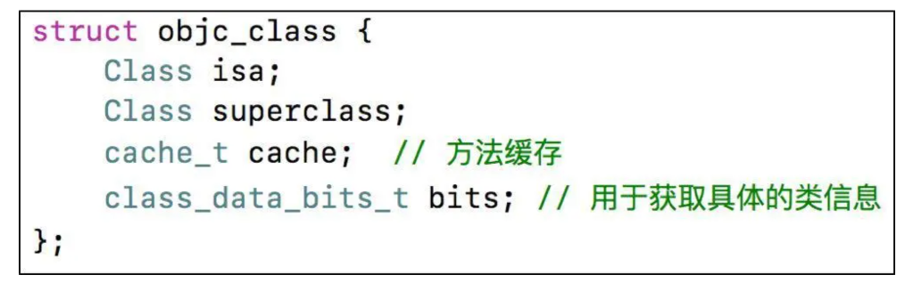

&emsp;  可以看到结构体中只包含`isa`、`superclass`、`cache`和`bits`。而`bits`经过`& FAST_DATA_MASK`之后，会得到`struct class_rw_t`这样一个结构体：


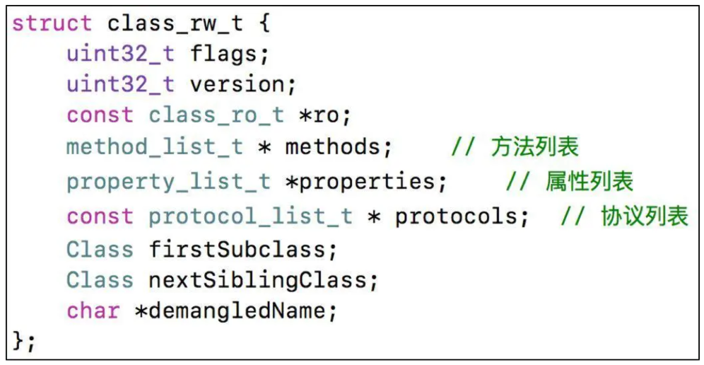


<br/>

> rw代表readwrite，可读可写
> t代表table，列表

`struct class_rw_t`结构体中就包含了方法列表、属性列表以及协议列表，这些都是可读可写的。其中还包含一个`struct class_ro_t`的结构体：


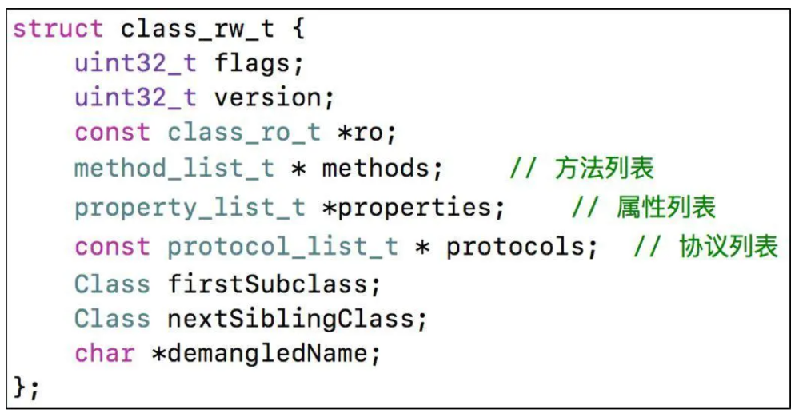


<br/>
<br/>

- **ro代表readonly，只读**

`struct class_ro_t`的结构体中包含了instance对象占用的内存空间、类名以及成员变量列表，当然这些都是只读的。


<br/>


> <h2 id='isa指针'>isa指针</h2>


&emsp; 下面这段代码是用于定义不同架构下的 isa 指针的掩码、位字段、常量等信息，其中涉及到 ARM64 和 x86_64 两个架构。这是一种与对象的内存布局相关的底层宏定义，用于优化对象的内存表示。

这里贴出了arm64位架构isa源码:

```

/**
	* 是否定义了SUPPORT_PACKED_ISA 这个宏
	
	* SUPPORT_PACKED_ISA 可能是一个用于开启或关闭支持“Packed ISA”（压缩的 isa 指针）的宏。ISA（指针）是 Objective-C 对象的一个关键部分，而“Packed ISA”是一种优化，用于减小对象的内存占用。
*/
#if SUPPORT_PACKED_ISA

    // extra_rc must be the MSB-most field (so it matches carry/overflow flags)
    // nonpointer must be the LSB (fixme or get rid of it)
    // shiftcls must occupy the same bits that a real class pointer would
    // bits + RC_ONE is equivalent to extra_rc + 1
    // RC_HALF is the high bit of extra_rc (i.e. half of its range)

    // future expansion:
    // uintptr_t fast_rr : 1;     // no r/r overrides
    // uintptr_t lock : 2;        // lock for atomic property, @synch
    // uintptr_t extraBytes : 1;  // allocated with extra bytes

//确定了这段代码只在 ARM64 架构下生效
# if __arm64__
#   define ISA_MASK        0x0000000ffffffff8ULL //用于掩码 isa 指针的值，保留了一部分用于标识对象类型的信息
#   define ISA_MAGIC_MASK  0x000003f000000001ULL //是用于标识“Magic”值的掩码和实际数值。这通常用于快速判断对象的类型，这也是一种优化手段
#   define ISA_MAGIC_VALUE 0x000001a000000001ULL  //是用于标识“Magic”值的掩码和实际数值。这通常用于快速判断对象的类型，这也是一种优化手段
#   define ISA_BITFIELD    //这是一个位字段，用于表示 isa 指针中的不同信息                                                  \
      uintptr_t nonpointer        : 1;  //(非指针）这个位表示对象是否是一个普通的指针。如果该位为1，表示这是一个普通指针，而不是一个优化过的指针。在一些特殊情况下，为了节省内存，对象可能不是普通指针                                     \
      uintptr_t has_assoc         : 1; //有关联对象）：这个位表示对象是否有关联对象（Associated Objects）。Objective-C 允许在运行时为对象动态关联一些额外的数据。如果该位为1，表示该对象有关联对象                                      \
      uintptr_t has_cxx_dtor      : 1; //有C++析构函数）：这个位表示对象是否有C++的析构函数。Objective-C++ 中的对象可能会包含C++的析构函数，用于在对象释放时执行一些特定的清理操作。如果该位为1，表示该对象有C++析构函数                                      \
      uintptr_t shiftcls          : 33; /*MACH_VM_MAX_ADDRESS 0x1000000000 类别信息，33位足够表示类指针在 ARM64 架构中的情况*/ \
      uintptr_t magic             : 6;//魔数）：这个位字段用于存储一个魔数值，是一个独特的标识，用于在某些情况下快速确定对象的类型。在这里，magic 有 6 位，可能代表着 64 种不同的魔数值。这可以用于快速的类型检查或标识对象的一些特定特征。                                       \
      uintptr_t weakly_referenced : 1;//（弱引用标记）：这个位表示对象是否被弱引用。如果该位为1，表示对象当前被一个或多个弱引用引用着，否则为0。弱引用是一种不会增加对象引用计数的引用方式，当对象被释放时，弱引用会自动变为 nil                                       \
      uintptr_t deallocating      : 1;//正在释放标记）：这个位表示对象是否正在释放中。如果该位为1，表示对象正在执行释放（deallocating）过程，否则为0。在对象释放的过程中，可能需要采取一些特殊的处理，这个标记可以用于检查对象的释放状态。                                       \
      uintptr_t has_sidetable_rc  : 1; //（有辅助引用计数表标记）：这个位表示对象是否有辅助引用计数表。在某些情况下，为了优化引用计数的管理，对象可能使用辅助引用计数表，而不是直接在 isa 指针中存储引用计数。如果该位为1，表示对象使用了辅助引用计数表，否则为0。                                      \
      uintptr_t extra_rc          : 19 //额外的引用计数信息
#   define RC_ONE   (1ULL<<45)//表示引用计数增加 1 的情况
#   define RC_HALF  (1ULL<<18)//表示引用计数减半的情况

# elif __x86_64__
#   define ISA_MASK        0x00007ffffffffff8ULL
#   define ISA_MAGIC_MASK  0x001f800000000001ULL
#   define ISA_MAGIC_VALUE 0x001d800000000001ULL
#   define ISA_BITFIELD                                                        \
      uintptr_t nonpointer        : 1;                                         \
      uintptr_t has_assoc         : 1;                                         \
      uintptr_t has_cxx_dtor      : 1;                                         \
      uintptr_t shiftcls          : 44; /*MACH_VM_MAX_ADDRESS 0x7fffffe00000*/ \
      uintptr_t magic             : 6;                                         \
      uintptr_t weakly_referenced : 1;                                         \
      uintptr_t deallocating      : 1;                                         \
      uintptr_t has_sidetable_rc  : 1;                                         \
      uintptr_t extra_rc          : 8
#   define RC_ONE   (1ULL<<56)
#   define RC_HALF  (1ULL<<7)

# else
#   error unknown architecture for packed isa
# endif

// SUPPORT_PACKED_ISA
#endif
```


<br/>
<br/>


> <h2 id='selfclass和superclass'>[self class]和[super class]</h2>


```
NSLog(@"self:%@",[self class]);
NSLog(@"super:%@",[super class]);
```

打印：

```
[1133:29988] self:SVC
[1133:29988] super:SVC
```

- `self`：是类的隐藏参数，它指向当前调用方法的类的实例。

- `super`：本质是一个编译器标识符，和self指向同一个消息接收者，和self不同的是，调用class时会去父类的的方法里调用而不是本类。


<br/>
<br/>

>## <h2 id='object_getClass和class区别'>[object_getClass和class区别](https://www.jianshu.com/p/54c190542aa8)
</h2>


object_getClass(obj)和[obj class]返回的指针不同

`[OBJ class]`: 第一次调用 class 是实例方法，会返回isa的类，第二次调用的就是类方法，返回的是本身，以后调用都是执行类的方法，返回的都是本身；

`object_getClass(obj)`:返回 isa 的指向链所指的类；


<br/>
<br/>

># <h2 id='method_getTypeEncoding'>[method_getTypeEncoding](https://blog.csdn.net/zhenganzhong_csdn/article/details/47094407)</h2>

&emsp;  将方法按照一定顺序，转华为字符串类型，


<br/>
<br/>


> <h2 id=''></h2>


<br/>

***
<br/>


> <h1 id='自动引用技术'>自动引用技术</h1>


<br/>


> <h2 id='retain源码'>retain源码</h2>

面试提问：如果让你设计一套引用计数机制，你会怎么做？ 嗯，这是个不错的面试题！ 其实，该问题的答案不外乎两种：

- 在对象内部管理引用计数；
- 通过外部结构(如：hash 表)统一管理引用计数。

在`objc-object.h`文件中

**retain()方法:**


这段代码是一个用于对象引用计数管理的方法，根据对象的类型和类的实现方式，选择性地执行不同的引用计数操作。如果类没有自定义的引用计数操作，就调用 rootRetain() 方法，否则通过消息发送的方式调用类的 retain 方法。

```
inline id objc_object::retain()
{
    ASSERT(!isTaggedPointer());  // 首先通过 ASSERT 宏进行断言检查，确保对象不是标记指针。标记指针是一种用于表示小整数的特殊指针，不需要进行引用计数管理

		//使用 fastpath 宏，这是一个用于优化的宏，它通常用于提高代码执行效率。在这里，检查对象的类是否没有自定义的 retain 和 release 操作。
		//如果没有自定义，就直接调用 rootRetain() 方法，该方法是 runtime 提供的对普通引用计数的增加操作。
		//通过对象的 ISA() 方法获取对象的类（元类），然后检查该类是否具有自定义的 retain（引用计数增加）和 release（引用计数减少）操作。在这里，ISA() 返回的是对象的类（元类）的 isa 指针，通过这个指针可以访问类的一些信息，包括是否有自定义的引用计数操作
		//hasCustomRR() 是一个用于检查类是否有自定义引用计数操作的方法。这个方法可能在 Objective-C 运行时中的类的结构中实现。如果类有自定义的引用计数操作，那么 hasCustomRR() 可能返回 true，否则返回 false
		if (fastpath(!ISA()->hasCustomRR())) {
		    // 如果对象的类没有自定义的 `retain` 和 `release` 操作
		    // 调用 rootRetain() 方法，该方法是 runtime 提供的对普通引用计数的增加操作
		    return rootRetain();
		}

    // 如果对象的类有自定义的 `retain` 和 `release` 操作
    // 调用 objc_msgSend 函数，通过消息发送的方式调用类的 `retain` 方法
    return ((id(*)(objc_object *, SEL))objc_msgSend)(this, @selector(retain));
}
```

<br/>
<br/>


<br/><br/>

> <h2 id='rootRetain()'>rootRetain()</h2>


&emsp; 这代码段实际上调用了 objc_object 类的 rootRetain 方法，该方法带有两个参数 tryRetain 和 handleOverflow，而在这里调用的是重载版本，即 rootRetain(false, false)。

```
//ALWAYS_INLINE 是一个用于告诉编译器尽可能进行内联（inline）优化的宏。内联是一种编译器优化技术，它会尝试将函数调用处的函数体直接嵌入到调用的地方，而不是通过函数调用的方式执行。这可以减少函数调用的开销，提高程序的执行效率。
ALWAYS_INLINE id 
objc_object::rootRetain()
{
	//rootRetain(bool tryRetain, bool handleOverflow)方法
	//调用了一个重载版本，将 tryRetain 和 handleOverflow 都设为 false。
	return rootRetain(false, false);
}
```

<br/>

```
id objc_object::rootRetain(bool tryRetain, bool handleOverflow)
{
    // 具体的引用计数操作实现
    //调用 sidetable_retain 方法，而 sidetable_retain 方法是用于处理引用计数的底层实现
    return sidetable_retain(tryRetain, handleOverflow);
}
```

<br/>

<br/>

**`rootRetain(bool tryRetain, bool handleOverflow)详细代码:`**

```
ALWAYS_INLINE id 
objc_object::rootRetain(bool tryRetain, bool handleOverflow)
{
    if (isTaggedPointer()) return (id)this;

    bool sideTableLocked = false;// 标记辅助引用计数表是否被锁住
    bool transcribeToSideTable = false;// 标记是否需要将引用计数拷贝到辅助引用计数表
    
    //isa_t 是 Objective-C 中用于表示对象的 isa 指针的类型
    //指向 Class 结构体。在不同的架构和编译器中，isa_t 的实际类型可能有所不同
    //该结构体包含了关于类的元数据信息，例如类的名称、实例变量列表、方法列表等
    //isa 指针是一个非常关键的概念，它指向对象的类（Class）或元类（meta-class）
    isa_t oldisa;
    isa_t newisa;

    do {
        transcribeToSideTable = false;
        
        /**
         * 在 ARM 架构的处理器中，有一类指令集支持乐观并发的原子操作，其中 LoadExclusive 就是其中之一。
         * 这类指令允许线程在读取数据时标记一个“排他性锁”，然后尝试在后续的修改操作中检查这个锁是否保持。
         * 如果保持，就表示没有其他线程修改过这个数据。
        */
        /**
         * 对于 LoadExclusive(&isa.bits) 这样的操作，它的目的可能是在并发环境中尝试读取 isa 指针的值，
         * 并在后续的操作中检查这个值是否保持不变，以确定在读取和后续操作之间是否有其他线程对 isa 进行了修改
         
         * LoadExclusive 可以用于提供一种乐观并发的方式，通过标记一个排他性锁，尝试读取数据，然后在后续操作中检查锁是否保持
         */
        oldisa = LoadExclusive(&isa.bits);
        newisa = oldisa;
        
        /** slowpath(!newisa.nonpointer) 表达了一种条件，用于在对象类信息更新时，当对象是普通指针时，执行慢速路径的逻辑。这样的情况可能涉及到特殊处理，以确保系统的稳定性和正确性
        
        * lowpath 通常是一个宏或函数，用于在代码中实现一些慢速路径的逻辑，这通常涉及到一些额外的处理、错误处理或者性能较差的情况。
        * 在你提供的上下文中，slowpath(!newisa.nonpointer) 表示一种慢速路径的条件
        
        * nonpointer 是该结构体中的一个位字段，用于表示该对象是否是普通指针。通常，一个普通指针是指不经过额外压缩或优化的指针，直接指向类对象或元类。
        */
        if (slowpath(!newisa.nonpointer)) {//!newisa.nonpointer 表示如果 newisa 的 nonpointer 位为 0（即对象是一个普通指针），那么条件成立，执行慢速路径的逻辑
        
	        /** ClearExclusive(&isa.bits) 表示释放之前设置的排他性锁标记，通常用于多线程环境中，确保在并发更新对象信息时的正确性
	        
	        * ClearExclusive 通常是一种原子操作，用于清除之前通过 LoadExclusive 或类似操作设置的“排他性锁”标记。
	        * 在多线程编程中，这样的操作用于释放线程对某个资源或数据的独占性控制。
	        
	        * 在上下文中，ClearExclusive(&isa.bits) 可能用于清除之前对 isa 指针（或者其一部分，如 bits）设置的排他性锁标记。
	        * 这样的操作通常是在对象的类信息更新过程中进行的，以确保在完成更新之后释放对 isa 指针的独占性控制。
	        */
            ClearExclusive(&isa.bits);
            // 如果是元类，直接返回
            if (rawISA()->isMetaClass()) return (id)this;
            
            //如果是尝试增加引用计数且辅助引用计数表被锁住，则解锁并返回 nil
           if (!tryRetain && sideTableLocked) sidetable_unlock();
           //sidetable_tryRetain() 尝试在辅助引用计数表中增加引用计数。如果操作成功，返回对象自身，否则返回 nil
           //这是一种无锁的尝试增加引用计数的操作，它在多线程环境中可以避免使用锁，提高性能。
            if (tryRetain) return sidetable_tryRetain() ? (id)this : nil;
            //如果不是尝试增加引用计数，直接调用 sidetable_retain() 增加引用计数
            else return sidetable_retain();
        }
        // don't check newisa.fast_rr; we already called any RR overrides
        // 不检查 newisa.fast_rr，因为已经调用了任何 RR（Root Retain）的覆写方法
		
		// 尝试增加引用计数
        if (slowpath(tryRetain && newisa.deallocating)) {
            ClearExclusive(&isa.bits);
            if (!tryRetain && sideTableLocked) sidetable_unlock();
            return nil;
        }
        uintptr_t carry;
        // 使用原子操作增加 extra_rc
        newisa.bits = addc(newisa.bits, RC_ONE, 0, &carry);  // extra_rc++

        if (slowpath(carry)) {// 检查是否发生了溢出
            // newisa.extra_rc++ overflowed  溢出
            if (!handleOverflow) {
                ClearExclusive(&isa.bits);
                //处理引用计数溢出的情况
                return rootRetain_overflow(tryRetain);
            }
            // Leave half of the retain counts inline and 
            // prepare to copy the other half to the side table.
            // 留下一半的引用计数内联，并准备将另一半拷贝到辅助引用计数表
            if (!tryRetain && !sideTableLocked) sidetable_lock();
            sideTableLocked = true;
            transcribeToSideTable = true;
            newisa.extra_rc = RC_HALF;
            newisa.has_sidetable_rc = true;
        }
    } while (slowpath(!StoreExclusive(&isa.bits, oldisa.bits, newisa.bits)));

    if (slowpath(transcribeToSideTable)) {// 如果需要拷贝到辅助引用计数表
        // Copy the other half of the retain counts to the side table. 将另一半的引用计数拷贝到辅助引用计数表
        sidetable_addExtraRC_nolock(RC_HALF);
    }

    // 如果不是尝试增加引用计数且辅助引用计数表被锁住，则解锁
    if (slowpath(!tryRetain && sideTableLocked)) sidetable_unlock();
    // 返回对象自身
    return (id)this;
}
```


<br/>

&emsp; 总体来说，objc_object::rootRetain() 通过调用 rootRetain(bool tryRetain, bool handleOverflow) 方法，间接地调用了 sidetable_retain 方法，从而执行了对象的引用计数操作。这样的设计允许 Objective-C 运行时在不同的情况下进行引用计数的处理，提供了一些灵活性。


<br/><br/>

> <h2 id='处理溢出rootRetain_overflow'>处理溢出rootRetain_overflow</h2>

rootRetain_overflow 是在 rootRetain 方法中的一个分支，用于处理引用计数溢出的情况。下面是对这个分支的详细解读：

```
ALWAYS_INLINE id objc_object::rootRetain_overflow(bool tryRetain)
{
    bool sideTableLocked = false;
    bool transcribeToSideTable = false;

    isa_t oldisa;
    isa_t newisa;

    do {
        transcribeToSideTable = false;
        oldisa = LoadExclusive(&isa.bits);
        newisa = oldisa;

        // 检查是否正在释放
        if (slowpath(tryRetain && newisa.deallocating)) {
            ClearExclusive(&isa.bits);
            if (!tryRetain && sideTableLocked) sidetable_unlock();
            return nil;
        }

        // 溢出处理逻辑
        if (newisa.extra_rc == RC_HALF && newisa.has_sidetable_rc) {
            // newisa.extra_rc 已经是 RC_HALF，且有额外的引用计数存储在辅助引用计数表中
            if (!tryRetain && !sideTableLocked) sidetable_lock();
            sideTableLocked = true;
            transcribeToSideTable = true;
            newisa.extra_rc = 0; // 将溢出的引用计数清零
            newisa.has_sidetable_rc = false; // 清除辅助引用计数表标志
        } else {
            // newisa.extra_rc 不是 RC_HALF，将其设置为 RC_HALF
            newisa.extra_rc = RC_HALF;
        }
    } while (slowpath(!StoreExclusive(&isa.bits, oldisa.bits, newisa.bits)));

    // 如果需要拷贝到辅助引用计数表
    if (slowpath(transcribeToSideTable)) {
        // 将溢出的引用计数拷贝到辅助引用计数表
        sidetable_addExtraRC_nolock(RC_HALF);
    }

    // 如果不是尝试增加引用计数且辅助引用计数表被锁住，则解锁
    if (slowpath(!tryRetain && sideTableLocked)) sidetable_unlock();

    // 返回对象自身
    return (id)this;
}

```


- 这个方法的目的是处理引用计数溢出的情况，具体解读如下：

	- 使用 LoadExclusive 操作加载对象的 isa 指针。
	- 如果对象正在释放中，直接返回 nil。
	- 如果溢出的引用计数已经存储在辅助引用计数表中，将 newisa.extra_rc 设置为 0，清除辅助引用计数表标志。如果没有存储在辅助引用计数表中，将 newisa.extra_rc 设置为 RC_HALF。
	- 使用 StoreExclusive 操作尝试存储新的 isa 指针，如果存储失败，则重新尝试。
	- 如果需要拷贝溢出的引用计数到辅助引用计数表，执行拷贝操作。
	- 最后，根据条件解锁辅助引用计数表，并返回对象自身。

&emsp; 这个方法的逻辑主要是在发生引用计数溢出时，对溢出的引用计数进行适当的处理，可能涉及到辅助引用计数表的操作。这样的设计考虑了在多线程环境下对对象引用计数的一致性和正确性。


<br/><br/><br/>

> <h2 id='内联函数调用和普通函数调用的区别'>内联函数调用和普通函数调用的区别</h2>


- **1.内联函数调用（Inline Function Call）：**
	- 替代性执行： 内联函数是在编译时被插入到调用处的，而不是通过函数调用的方式。编译器将函数的代码复制到调用点，避免了函数调用时的额外开销。
	- 性能提升： 内联函数的主要目的是提高执行效率，尤其是在短小的函数体或者频繁调用的函数中。避免了函数调用的开销，减少了栈帧的创建和销毁。
	- 代码膨胀： 内联函数可能导致代码膨胀，因为每个调用点都会插入函数体的副本。这可能导致可执行文件变大。


<br/>

- **2.普通函数调用（Regular Function Call）：**
	- 调用开销： 普通函数调用需要在调用时将控制权转移给被调用的函数，通常需要保存当前函数的状态（比如寄存器值、返回地址等），创建新的栈帧，执行函数体，最后返回并还原调用前的状态。这些步骤引入了额外的开销。
	- 可维护性： 普通函数调用通常使代码更加模块化和可维护，因为相同的函数体可以在多个地方调用，而不需要在每个调用点都插入相同的代码。
	- 适用范围： 适用于函数体较大，被多处调用的情况，以便提高代码的可读性和维护性。

<br/>

在选择使用内联函数时，需要权衡代码大小、可读性和性能之间的关系。过度使用内联可能导致代码膨胀，反而降低了缓存命中率，因此在实际使用中需要根据具体情况进行权衡。一般来说，内联适用于短小的、频繁调用的函数，而普通函数适用于较大的、可复用的函数。


<br/>
<br/>

> <h2 id=''></h2>


<br/>

***
<br/>


> <h1 id='弱引用'>弱引用</h1>


<br/>
<br/>


> <h2 id='Sidetable'>Sidetable</h2>

&emsp; 并不是只有弱引用对象才有这个sidetable，objc_object对象拥有[**isa指针**](#isa指针)，这个指针中存储了许多信息，其中几位就存储了引用计数，但是当引用计数大于无法使用位存储时，也会创建sidetable，并使用sidetable进行引用计数。同时objc_initWeak也是创建sidetable的。


<br/>
<br/>


> <h2 id=''></h2>


<br/>
<br/>


> <h2 id=''></h2>


<br/>
<br/>


> <h2 id=''></h2>


<br/>
<br/>


> <h2 id=''></h2>


<br/>
<br/>


> <h2 id=''></h2>


<br/>
<br/>


> <h2 id=''></h2>


<br/>
<br/>


> <h2 id=''></h2>


<br/>
<br/>


> <h2 id=''></h2>


<br/>
<br/>


> <h2 id=''></h2>


<br/>
<br/>


> <h2 id=''></h2>


<br/>

***
<br/>

