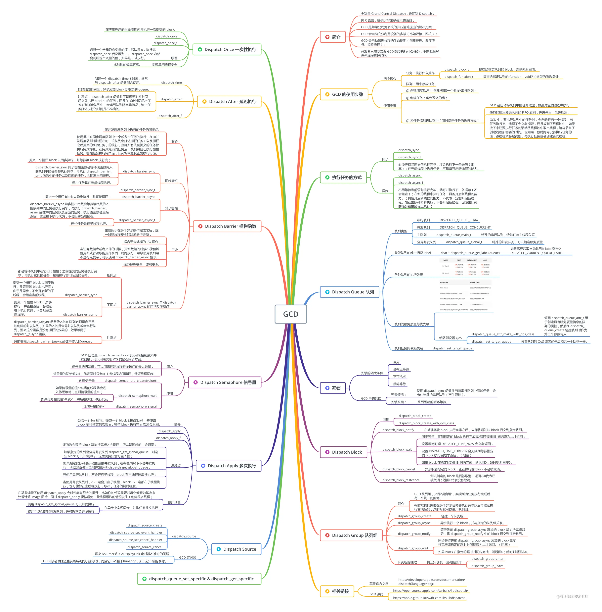

> <h2 id=''></h2>
- [GCD](#GCD)
	- [3种队列类型](#3种队列类型)
	- [dispatch_once](#dispatch_once)
		- [原理](#原理)
	- [并发](#并发)
		- [dispatch_get_global_queue()](#dispatch_get_global_queue())
	- [线程组和依赖](#线程组和依赖)
		- 	[线程组处理](#线程组处理)
- [时间延迟](#时间延迟)
	- [dispatch_after](#dispatch_after)
	- [dispatch_time_t](#dispatch_time_t)
	- [dispatch_walltime](#dispatch_walltime)
- [线程暂停&恢复](#线程暂停&恢复)
- [**锁**](#锁)
	- [锁分类](#锁分类)
	- [OSSpinLock](#OSSpinLock)
	- [NSLock](#NSLock)
	- [NSCondition](#NSCondition)
	- [递归锁NSRecursiveLock](#递归锁NSRecursiveLock)
	- [对象锁/同步锁 @synchronized](#对象锁/同步锁@synchronized)
	- [dispatch_semaphore](#dispatch_semaphore)
	- [读写锁pthread_rwlock](#读写锁pthread_rwlock)
	- [pthread_mutex](#pthread_mutex)
	- [dispatch_barrier_async](dispatch_barrier_async)
	- [pthread_rwlock互斥锁](#pthread_rwlock互斥锁)
- [**避免死锁**](#避免死锁)
	- [pthread_mutex_trylock](#pthread_mutex_trylock)
	- [CPU乱序执行](#CPU乱序执行)
- [**NSOperation**](#NSOperation)
	- [操作和操作队列](#操作和操作队列)
	- [属性](#属性)
	- [线程安全](#线程安全)
	- [NSOperation、NSOperationQueue使用方法](#NSOperation、NSOperationQueue使用方法)
	- [NSInvocationOperation使用](#NSInvocationOperation使用)
	- 	[子程使用NSInvocationOperation](#子程使用NSInvocationOperation)
	- 	[NSBlockOperation](#NSBlockOperation)
	- [常驻线程](#常驻线程)
	- 	[依赖](#依赖)
	- [多任务(任务是异步)](#多任务(任务是异步))
	- [并发](#并发)
- [**内存问题**](#内存问题)
- **资料**
	- [GCD(III)-Harley](https://www.cnblogs.com/EchoHG/p/8664846.html)
	- [GCD](https://www.cnblogs.com/EchoHG/p/8609685.html)
	- [dispatch_once的坑及注意点](https://juejin.cn/post/6844903558224035848)
	- [**多线程**](https://meniny.cn/posts/iOS_Primer_017/)
	- [开源的Parse源码(GCD玩的出神入化)](https://github.com/ChenYilong/ParseSourceCodeStudy)
	- **[NSOperation、NSOperationQueue』详尽总结](https://www.jianshu.com/p/4b1d77054b35)**
	- [**NSOperation**](https://www.jianshu.com/p/d8caf596d5d0)
	- [**NSOperation的进阶使用**](https://juejin.cn/post/6844903721097248782#heading-34)
	- [iOS 入门 017: 多线程](https://meniny.cn/posts/iOS_Primer_017/)


<br/>
<br/>

***
<br/>
<br/>


><h1 id='GCD'>GCD</h1>


> GCD和NSOperaiton 
 - 能用GCD的地方就用GCD 尽量减少NSOperation的使用,因为GCD在多核CPU上线程切换的时间比较短 效率相对高些；
 - NSOperation是建立在GCD之上的，虽然使用起来比较复杂，但是在线程并发管理、优先级、上有着GCD无法比拟的优势。


<br/>
<br/>
<br/>


> <h2 id='3种队列类型'>3种队列类型</h2>

- **`The main queue`**: 与主线程功能相同。实际上，提交至main queue的任务会在主线程中执行。main queue可以调用dispatch_get_main_queue()来获得。因为main queue是与主线程相关的，所以这是一个串行队列。

- **`Global queues`**: 全局队列是并发队列，并由整个进程共享。进程中存在三个全局队列：高、中（默认）、低三个优先级队列。可以调用dispatch_get_global_queue函数传入优先级来访问队列。

- **`用户队列`**: 用户队列 (GCD并不这样称呼这种队列, 但是没有一个特定的名字来形容这种队列，所以我们称其为用户队列) 是用函数 dispatch_queue_create 创建的队列. 这些队列是串行的。正因为如此，它们可以用来完成同步机制, 有点像传统线程中的mutex。

&emsp;  这个有没有开启新线程，需要看这种队列和dispatch_async和dispatch_sync的搭配，请看[这里](https://www.cnblogs.com/EchoHG/p/8609685.html)


<br/>


<br/>




<br/>

><h2 id='dispatch_once'>dispatch_once</h2>

介绍:dispatch_once能保证任务只会被执行一次，即使同时多线程调用也是线程安全的。常用于创建单例、swizzeld method等功能


<br/>

**使用**

```
static dispatch_once_t onceToken;
dispatch_once(&once_token, ^{
	//创建单例、method swizzled或其他任务
})
```


<br/>
<br/>

> <h3 id='原理'>原理</h3>

```
//调用dispatch_once_f来处理
void dispatch_once(dispatch_once_t *val, dispatch_block_t block) {
    dispatch_once_f(val, block, _dispatch_Block_invoke(block));
}
```

dispatch_once封装调用了dispatch_once_f函数，其中通过_dispatch_Block_invoke来执行block任务，它的定义如下：

```
//invoke是指触发block的具体实现，感兴趣的可以看一下Block_layout的结构体
#define _dispatch_Block_invoke(bb) \
        ((dispatch_function_t)((struct Block_layout *)bb)->invoke)
```

接着看一下具体的实现函数dispatch_once_f：


```
void dispatch_once_f(dispatch_once_t *val, void *ctxt, dispatch_function_t func) {
	// volatileg关键字编辑的变量vval，告诉编译器此指针指向的值随时可能被其他线程改变，从而使得编译器不对此指针进行代码编译优化。
	// 指针的最大的作用就是间接的改变变量的值
    struct _dispatch_once_waiter_s * volatile *vval =
            (struct _dispatch_once_waiter_s**)val;
    
    // 初始化一个结构体
    struct _dispatch_once_waiter_s dow = { NULL, 0 };
    
    // 声明辅助变量
    struct _dispatch_once_waiter_s *tail, *tmp;
    // 声明信号变量
    _dispatch_thread_semaphore_t sema;

	// 内置函数 原子比较交换函数 __sync_bool_compare_and_swap
	// 判断vval与NULL是否相等，如果相等就返回YES，并将&dow的值赋给vval
	// 当dispatch_once第一次执行时，predicate也即val为0,地址并不为NULL，但是将0转成链表的时候vval为NULL，那么此“原子比较交换函数”将返回YES并将vval指向值赋值为&dow，即为“等待中”
	//_dispatch_client_callout其内部做了一些判定，但实际上是调用了func而已。到此，block中的用户代码执行完毕。
	// #1
    if (dispatch_atomic_cmpxchg(vval, NULL, &dow, acquire)) {
		    dispatch_atomic_acquire_barrier();//这是一个空的宏函数，大概是注释的作用吧

		// 其实质是执行block
        _dispatch_client_callout(ctxt, func);

        // cpuid指令等待，使得其他线程的【读取到未初始化值的】预执行能被判定为猜测未命中，从而使得这些线程能够进入dispatch_once_f里的另一个分支从而进行等待
        dispatch_atomic_maximally_synchronizing_barrier();
        
        dispatch_atomic_release_barrier(); //这是一个空的宏函数，大概是注释的作用吧
    
		// dispatch_atomic_xchg 其将第二个参数的值赋给第一个参数（解引用指针），然后返回第一个参数被赋值前的解引用值：
		// vval = &dow;
		// old = vval;
		// vval = DISPATCH_ONCE_DONE;// 置block完成标记，是置成NULL吗
		// tmp = old;
        tmp = dispatch_atomic_xchg(vval, DISPATCH_ONCE_DONE, relaxed);
        tail = &dow;
        
        // tmp = 旧的vval = dow
		// vval = dow;
		// 接下来是对信号量链的处理：
		// 1.在block执行过程中，没有其他线程进入本函数来等待，则vval指向值保持为&dow，即tmp被赋值为&dow，即下方while循环不会被执行，此分支结束。
		// 2.在block执行过程中，有其他线程进入本函数来等待进入另一个分支，那么会构造一个信号量链表（vval指向值变为信号量链的头部，链表的尾部为&dow），此时就会当前分支进入while循环，在此while循环中，遍历链表，逐个signal每个信号量，然后结束循环。
        while (tail != tmp) {
            while (!tmp->dow_next) {
		        // 此句是为了提示cpu减少额外处理，提升性能，节省电力。
                dispatch_hardware_pause();
            }
            sema = tmp->dow_sema;
            tmp = (struct _dispatch_once_waiter_s*)tmp->dow_next;
            _dispatch_thread_semaphore_signal(sema);
        }
    } else {
	    // #2
	    // 当执行block分支#1未完成，且有线程再进入本函数时，将进入线程等待分支：
	    // 先调用_dispatch_get_thread_semaphore创建一个信号量，此信号量被赋值给dow.dow_sema。
	    // 然后进入一个无限for循环，假如发现vval的指向值已经为DISPATCH_ONCE_DONE，即“完成”，则直接break，然后调用_dispatch_put_thread_semaphore函数销毁信号量并退出函数
	    // _dispatch_get_thread_semaphore内部使用的是“有即取用，无即创建”策略来获取信号量。
        dow.dow_sema = _dispatch_get_thread_semaphore();
        tmp = *vval;
        
        // 然后进入一个无限for循环
        for (;;) {
        tmp = *vval;
        // 假如发现vval的指向值已经为DISPATCH_ONCE_DONE，即“完成”，则直接break
        // 然后调用_dispatch_put_thread_semaphore函数销毁信号量并退出函数。
        if (tmp == DISPATCH_ONCE_DONE) {
            break;
        }
        dispatch_atomic_store_barrier();// 注释作用
        
        /*
         假如vval的解引用值并非DISPATCH_ONCE_DONE，则进行一个“原子比较并交换”操作（此操作可以避免两个等待线程同时操作链表带来的问题）
         假如此时vval指向值已不再是tmp（这种情况发生在多个线程同时进入线程等待分支#2，并交错修改链表）则for循环重新开始，再尝试重新获取一次vval来进行同样的操作；若指向值还是tmp，则将vval的指向值赋值为&dow，此时val->dow_next值为NULL，可能会使得block执行分支#1进行while等待（如前述），紧接着执行dow.dow_next = tmp这句来增加链表节点（同时也使得block执行分支#1的while等待结束），然后等待在信号量上，当block执行分支#1完成并遍历链表来signal时，唤醒、释放信号量，然后一切就完成了。
         */
        // 此操作可以避免两个等待线程同时操作链表带来的问题
        // 判断vval与tmp是否相等，如果相等就返回YES，并将&dow的值赋给vval
        if (dispatch_atomic_cmpxchg(vval, tmp, &dow)) {
            dow.dow_next = tmp;
            _dispatch_thread_semaphore_wait(dow.dow_sema);
        }
    }
    // _dispatch_put_thread_semaphore内部使用的是“销毁旧的，存储新的”策略来缓存信号量
    _dispatch_put_thread_semaphore(dow.dow_sema);
}
```


<br/>

由上面的代码可知dispatch_once的流程图大致如下：


&emsp; 首先看一下dispatch_once中用的的原子性操作dispatch_atomic_cmpxchg(vval, NULL, &dow, acquire)，它的宏定义展开之后会将$dow赋值给vval，如果vval的初始值为NULL，返回YES,否则返回NO。


&emsp; 首次调用dispatch_once时，因为外部传入的dispatch_once_t变量值为nil，故vval会为NULL，故if判断成立。然后调用_dispatch_client_callout执行block，然后在block执行完成之后将vval的值更新成DISPATCH_ONCE_DONE表示任务已完成。最后遍历链表的节点并调用_dispatch_thread_semaphore_signal来唤醒等待中的信号量；

&emsp; 当其他线程同时也调用dispatch_once时，因为if判断是原子性操作，故只有一个线程进入到if分支中，其他线程会进入else分支。在else分支中会判断block是否已完成，如果已完成则跳出循环；否则就是更新链表并调用_dispatch_thread_semaphore_wait阻塞线程，等待if分支中的block完成后再唤醒当前等待的线程。


<br/>

**总结篇**

&emsp; dispatch_once用原子性操作block执行完成标记位，同时用信号量确保只有一个线程执行block，等block执行完再唤醒所有等待中的线程。


<br/>
<br/>
<br/>


><h2 id='并发'>并发</h2>


&emsp; 在 iOS 并发编程技术中，GCD 的使用率是最高的。所以，在这篇文章中，我就以 GCD 为例和你说说多线程的并发问题。


&emsp; GCD（Grand Central Dispatch）是由苹果公司开发的一个多核编程解决方案。它提供的一套简单易用的接口，极大地方便了并发编程。同时，它还可以完成对复杂的线程创建、释放时机的管理。但是，GCD 带来这些便利的同时，也带来了资源使用上的风险。


&emsp; 例如，在进行数据读写操作时，总是需要一段时间来等待磁盘响应的，如果在这个时候通过 GCD 发起了一个任务，那么 GCD 就会本着最大化利用 CPU 的原则，会在等待磁盘响应的这个空档，再创建一个新线程来保证能够充分利用 CPU。

&emsp; 而如果 GCD 发起的这些新任务，都是类似于数据存储这样需要等待磁盘响应的任务的话，那么随着任务数量的增加，GCD 创建的新线程就会越来越多，从而导致内存资源越来越紧张，等到磁盘开始响应后，再读取数据又会占用更多的内存。结果就是，失控的内存占用会引起更多的内存问题。


&emsp; 这种情况最典型的场景就是数据库读写操作。[FMDB](https://github.com/ccgus/fmdb)是一个开源的第三方数据库框架，通过 FMDatabaseQueue 这个核心类，将与读写数据库相关的磁盘操作都放到一个串行队列里执行，从而避免了线程创建过多导致系统资源紧张的情况。


<br/>
<br/>


> <h3 id='dispatch_get_global_queue()'>dispatch_get_global_queue()</h3>


```

NSLog(@"11111------->>Post 线程请求： %@", [NSThread currentThread]);

dispatch_async(dispatch_get_global_queue(), ^{
	//网络请求，耗时操作
	NSLog(@"22222------->>Post 线程请求： %@", [NSThread currentThread]);
	
	dispatch_async(dispatch_get_main_queue(), ^{
	        //网络请求到数据，进入主线程，开始把数据放到UI上
	        NSLog(@"~~~~222------->>Post 线程请求： %@", [NSThread currentThread]);
	
	    });

});

```

打印结果：

```

2018-12-03 10:52:00.338757+0800 TaiChi_iOS[12042:777252] 11111------->>Post 线程请求： <NSThread: 0x281ebef00>{number = 1, name = main}
2018-12-03 10:52:00.618865+0800 TaiChi_iOS[12042:777252] 22222------->>Post 线程请求： <NSThread: 0x281ebef00>{number = 1, name = main}
2018-12-03 10:52:00.629733+0800 TaiChi_iOS[12042:777252] ~~~~222------->>Post 线程请求： <NSThread: 0x281ebef00>{number = 1, name = main}

```

`结论：`dispatch_get_global_queue()这个线程队列，开启线程队列会视情况而定，有时会开启线程有时不会开启线程。


<br/>
<br/>


为了能够支持以后可能更大的并发量，下面我将其中“已读”功能的数据库操作改成 FMDatabaseQueue。这样，我就可以将并行队列转化为串行队列来执行，避免大并发读写磁盘操作造成内存问题，改写代码如下：

```
// 标记文章已读
- (RACSignal *)markFeedItemAsRead:(NSUInteger)iid fid:(NSUInteger)fid{
    @weakify(self);
    return [RACSignal createSignal:^RACDisposable *(id<RACSubscriber> subscriber) {
        @strongify(self);
        // 改写成 FMDatabaseQueue 串行队列进行数据库操作
        FMDatabaseQueue *queue = [FMDatabaseQueue databaseQueueWithPath:self.feedDBPath];
        [queue inDatabase:^(FMDatabase *db) {
            FMResultSet *rs = [FMResultSet new];
            // 读取文章数据
            if (fid == 0) {
                rs = [db executeQuery:@"select * from feeditem where isread = ? and iid >= ? order by iid desc", @(0), @(iid)];
            } else {
                rs = [db executeQuery:@"select * from feeditem where isread = ? and iid >= ? and fid = ? order by iid desc", @(0), @(iid), @(fid)];
            }
            NSUInteger count = 0;
            while ([rs next]) {
                count++;
            }
            // 更新文章状态为已读
            if (fid == 0) {
                [db executeUpdate:@"update feeditem set isread = ? where iid >= ?", @(1), @(iid)];
            } else {
                [db executeUpdate:@"update feeditem set isread = ? where iid >= ? and fid = ?", @(1), @(iid), @(fid)];
            }
            
            [subscriber sendNext:@(count)];
            [subscriber sendCompleted];
            [db close];
        }];
        return nil;
    }];
}
```

如代码所示，你只需要将数据库的操作放到 FMDatabaseQueue 的 inDatabase 方法入参 block 中，就可以在 FMDatabaseQueue 维护的串行队列里排队等待执行了.


<br/>
<br/>
<br/>


> <h2 id='线程组和依赖'>线程组和依赖</h2>  


- **`dispatch_group常用方法：`**
	- `dispatch_group_enter` :通知 group,下个任务要放入 group 中执行了
	- `dispatch_group_leave`: 通知 group,任务成功完成,要移除,与 enter成对出现
	- `dispatch_group_wait`: 在任务组完成时调用，或者任务组超时是调用（完成指的是enter和leave次数一样多）
	- `dispatch_group_notify`: 只要任务全部完成了,就会在最后调用


[**dispatch_group_enter和dispatch_group_leave 网络请求嵌套**](https://www.jianshu.com/p/71fbc0415b5d)


<br/>

<h3 id='线程组处理'>线程组处理</h3>

```
{
    // 创建队列组
    dispatch_group_t group =  dispatch_group_create();
    // 创建并发队列
    dispatch_queue_t queue = dispatch_get_global_queue(0, 0);
 
    // 开子线程，任务1
    dispatch_group_async(group, queue, ^{
        [NSData dataWithContentsOfURL:[NSURL URLWithString:@"https://img-blog.csdn.net/20180421152137506"]];
        NSLog(@"任务1 完成，线程：%@", [NSThread currentThread]);
    });
 
    // 开子线程，任务2
    dispatch_group_async(group, queue, ^{
        [NSData dataWithContentsOfURL:[NSURL URLWithString:@"https://img-blog.csdn.net/20170112145924755?watermark/2/text/aHR0cDovL2Jsb2cuY3Nkbi5uZXQvaGVyb193cWI=/font/5a6L5L2T/fontsize/400/fill/I0JBQkFCMA==/dissolve/70/gravity/Center"]];
        NSLog(@"任务2 完成，线程：%@", [NSThread currentThread]);
    });
 
    // 全部完成
    dispatch_group_notify(group, queue, ^{
        dispatch_async(dispatch_get_main_queue(), ^{
            NSLog(@"全部完成，线程：%@", [NSThread currentThread]);
        });
    });
}
```

<br/>

输出结果：

```
AsyTaskTest[5963:308229] 任务1 完成，线程：<NSThread: 0x604000263380>{number = 3, name = (null)}

AsyTaskTest[5963:308228] 任务2 完成，线程：<NSThread: 0x60400007c4c0>{number = 4, name = (null)}

AsyTaskTest[5963:308103] 全部完成，线程：<NSThread: 0x604000070600>{number = 1, name = main}

```


<br/>
<br/>


> <h2 id='时间延迟'>时间延迟</h2>


<br/>
<br/>

> <h3 id='dispatch_after'>dispatch_after</h3>


&emsp;  `dispatch_after`是在指定的时间将任务加入到队列中，而不是在指定的时间执行，如果所在的队列上有耗时任务在执行，那么时间上可能出现误差。

```
void  dispatch_after(dispatch_time_t when, dispatch_queue_t queue, dispatch_block_t block);
```


```

NSLog(@"2秒后开始执行");
dispatch_after( dispatch_time(DISPATCH_TIME_NOW, (int64_t)(2 * NSEC_PER_SEC)), dispatch_get_main_queue(),^{
    NSLog(@"等2秒，开始执行任务");
    sleep(2);
    NSLog(@"任务执行完成");
} );

```

输出：

```
2019-05-14 11:51:26.890458+0800 Genealogy[1897:44256] 2秒后开始执行

2019-05-14 11:51:35.784266+0800 Genealogy[1897:44256] 等2秒，开始执行任务

2019-05-14 11:51:40.692939+0800 Genealogy[1897:44256] 任务执行完成
```


<br/>
<br/>

> <h3 id='dispatch_time_t'>dispatch_time_t</h3>


`dispatch_time_t`:用来指定时间，传入的是dispatch_time_t类型的值，通过dispatch_time和dispatch_walltime函数生成;

<br/>

`dispatch_time_t
dispatch_time(dispatch_time_t when, int64_t delta);`


`dispatch_time_t when`:时间点;
`int64_t delta`时间长度;

&emsp;  函数的作用就是获取时间点经过时间长度之后的时间点。第一个参数我们经常使用的是DISPATCH_TIME_NOW，表示现在这个时间点。第二个参数表示的时间长度使用数组* NSEC_PER_SEC的方式获得。

- `NSEC_PER_SEC` 表示秒

- `NSEC_PER_MSEC` 表示毫秒

- `NSEC_PER_USEC` 表示微秒

<br/>


- **dispatch_queue_t queue**: 任务添加的队列;


<br/>
<br/>


> <h3 id='dispatch_walltime'>dispatch_walltime</h3>


```
dispatch_time_t
dispatch_walltime(const struct timespec *_Nullable when, int64_t delta);

const struct timespec *_Nullable when`:  一个struct timespec类型的值;
int64_t delta`:  以纳秒为单位的延迟时间;
```


```

//设置时间点为2秒后
NSTimeInterval iT = [[NSDate dateWithTimeInterval:2 sinceDate:[NSDate date]] timeIntervalSince1970];

struct timespec time;
time.tv_sec = (NSInteger)iT;
//比时间点再晚10秒
dispatch_time_t timer = dispatch_walltime(&time, 10*NSEC_PER_SEC);
NSLog(@"12秒后开始任务");
dispatch_after(timer, dispatch_get_global_queue(DISPATCH_QUEUE_PRIORITY_HIGH, 0), ^{
    NSLog(@"任务开始");
    
    sleep(1);

    NSLog(@"任务完成");
});

```


输出：

```
2019-05-14 12:06:25.194589+0800 Genealogy[2330:55634] 6秒后开始任务`

2019-05-14 12:06:33.000349+0800 Genealogy[2330:55725] 任务开始

2019-05-14 12:06:34.003165+0800 Genealogy[2330:55725] 任务完成
```


<br/>
<br/>

> <h3 id='线程暂停&恢复'>线程暂停&恢复</h3>

[Parse的底层多线程处理思路](https://github.com/ChenYilong/ParseSourceCodeStudy/blob/master/01_Parse的多线程处理思路/Parse的底层多线程处理思路.md#parse-ios-sdk介绍)

当追加大量处理到Dispatch Queue时，在追加处理的过程中，有时希望不执行已追加的处理。

在这种情况下，只要挂起Dispatch Queue即可。当可以执行时再恢复。

```
dispatch_suspend(queue);
```


**dispatch_resume** 函数恢复指定的 Dispatch Queue . 这些函数对已经执行的处理没有影响。挂起后，追加到 Dispatch Queue 中.但尚未执行的处理在此之后停止执行。而恢复则使得这些处理能够继续执行。

分派源创建时默认处于暂停状态，在分派源分派处理程序之前必须先恢复。因为忘记恢复分派源的状态而产生bug是常见的事儿。恢复的方法是调用 dispatch_resume :

```
dispatch_resume (source);
```


<br/>
<br/>

> <h3 id=''></h3>


<br/>
<br/>

***
<br/>

>## <h1 id='锁'>[锁](https://blog.csdn.net/ssy_1992/article/details/104822090)</h1>

[13种线程锁](https://juejin.cn/post/6844903716265394184#heading-1)

<br/>

> <h2 id='锁分类'>锁分类</h2>

iOS的线程锁主要可以分为两大类:**互斥锁** 和 **自旋锁**，其他锁都是这两种锁的延伸和扩展。

- **互斥锁:**
	- [NSLock](#NSLock): 是「非」递归互斥锁, 使用了pthread_mutex_t封装的互斥锁
	- [NSCondition](#NSCondition): 使用pthread_mutex_t封装的互斥锁;
	- [NSConditionLock](#NSConditionLock): 有条件的互斥锁;
	- [NSRecursiveLock](#递归锁NSRecursiveLock): 互斥锁中的递归锁;
	- [@synchronized](#对象锁/同步锁@synchronized): 底层实现是个递归锁;
	- [pthread_mutex](#pthread_mutex): 


<br/>

- **自旋锁:**
	- [pthread_rwlock](#读写锁pthread_rwlock): 读写锁;


互斥锁：属于sleep-waiting类型的锁，线程A获取到锁，在释放锁之前，其他线程都获取不到锁。

- **互斥锁也分为两种：**
	- 递归锁：可重入锁，同一个线程在锁释放前可再次获取锁，即可以递归调用
	- 非递归锁：不可重入，必须等锁释放后才能再次获取锁。


自旋锁：线程A获取到锁，在释放锁之前，线程B又来获取锁，此时获取不到，线程B就会不断的进入循环，一直检查锁是否已被释放，如果释放，则能获取到锁。


<br/>
<br/>

**区别:**

- 互斥锁：当线程获取锁但没有获取到时，线程会进入休眠状态，等锁被释放时，线程会被唤醒，同时获取到锁，继续执行任务，互斥锁会改变线程的状态。线程从sleep（加锁）—>running（解锁）的过程中，有上下文的切换，cpu的抢占，信号的发送等开销。

- 自旋锁：当线程获取锁但没获取到时，不会进入休眠，而是一直循环，线程始终处于活跃状态，不会改变线程状态，也就是忙等。线程一直是running(加锁—>解锁)，死循环检测锁的标志位。递归调用自旋锁一定会死锁。

- 对比：互斥锁的起始原始开销要高于自旋锁，但是基本是一劳永逸，临界区持锁时间的大小并不会对互斥锁的开销造成影响，而自旋锁是死循环检测，加锁全程消耗cpu，起始开销虽然低于互斥锁，但是随着持锁时间，加锁的开销是线性增长。


<br/>
<br/>


**使用场景:**

- 互斥锁会改变线程的状态，使得内核不断的调度线程资源，因此效率上比自旋锁要低很多，不适合使用自旋锁的场景都使用互斥锁。

- 自旋锁在线程的等待过程中是活跃的，避免了进程上下文的调度开销，因此对于线程只会阻塞很短时间的场合是有效的。因此自旋锁适合用于短时间内的轻量级锁定，主要用在临界区持锁时间非常短且CPU资源不紧张的情况下。


<br/>
<br/>

> <h2 id='OSSpinLock'>OSSpinLock</h2>

&emsp; OSSpinLock:自旋锁，性能最高的锁。原理很简单，就是一直 do while 忙等。它的缺点是当等待时会消耗大量 CPU 资源，所以它不适用于较长时间的任务。对于内存缓存的存取来说，它非常合适。


<br/>

**OSSpinLock的优先级反转:**

&emsp; 比如两个线程 A 和 B，优先级 A < B。当 A 获取锁访问共享资源时，B 尝试获取锁，那么 B 就会进入忙等状态，忙等时间越长对 CPU 资源的占用越大；而由于 A 的优先级低于 B，A 无法与高优先级的线程争夺 CPU 资源，从而导致任务迟迟完成不了, 无法释放lock.

解决优先级反转的方法有“优先级天花板”和“优先级继承”，它们的核心操作都是提升当前正在访问共享资源的线程的优先级。

OSSpinLock 因为优先级反转这个问题导致很多开源库都放弃使用了,**而苹果的开发工程师已经停用了OSSpinLock, 在iOS10时OSSpinLock被标记为Deprecated**.


<br/>
<br/>


> <h2 id='NSLock'>NSLock</h2>

NSLock是**非递归互斥锁。**

NSLocking只定义了加锁（获取锁）-lock，和解锁（释放锁）-unlock两个接口。NSLock、NSConditionLock、NSRecursiveLock、NSCondition都实现了这个协议

```
@protocol NSLocking

- (void)lock;
- (void)unlock;

@end
```

-lock和-unlock必须在相同的线程调用，也就是说，他们必须在同一个线程中成对调用，否则会产生未知结果

NSLock是使用了pthread_mutex_t封装的互斥锁。


<br/>
<br/>


> <h2 id='NSCondition'>NSCondition</h2>

NSCondition也是使用了pthread_mutex_t封装的互斥锁，和NSLock中一模一样，同时还使用了pthread_cond_t。它和NSLock的区别是：

NSLock在获取不到锁的时候自动使线程进入休眠，锁被释放后线程又自动被唤醒
NSCondition可以使我们更加灵活的控制线程状态，在任何需要的时候使线程进入休眠或唤醒它。

- [condition lock]：一般用于多线程同时访问、修改同一个数据源，保证在同一 时间内数据源只被访问、修改一次，其他线程的命令需要在lock 外等待，只到 unlock ，才可访问
- [condition unlock]：与lock 同时使用
- [condition wait]：让当前线程处于等待状态
- [condition signal]：CPU发信号告诉线程不用在等待，可以继续执行


<br/>
<br/>


> <h2 id='NSConditionLock'>NSConditionLock</h2>

NSConditionLock条件锁就是有特定条件的锁，说白了就是「有条件的互斥锁」。

- 1).只读属性condition，保存锁当前的条件（所谓的条件condition就是个NSInteger）
- 2).-lockWhenCondition:：获取锁，如果condition与属性相等，则可以获得锁，否则阻塞线程，等待被唤醒
- 3).-unlockWithCondition:释放锁，并修改condition属性

基本用法：

```
// 主线程
self.conditionLock = [[NSConditionLock alloc] init];
    
dispatch_async(dispatch_get_global_queue(DISPATCH_QUEUE_PRIORITY_DEFAULT, 0), ^{
    NSLog(@"进入线程1");
    // 当 lock.condition = 2 时，能够获取到锁，否则休眠等待
    [self.conditionLock lockWhenCondition:2];
    NSLog(@"执行任务1");
    sleep(1);
    [self.lock unlock];
    NSLog(@"退出线程1");
});
    
dispatch_async(dispatch_get_global_queue(DISPATCH_QUEUE_PRIORITY_DEFAULT, 0), ^{
    NSLog(@"进入线程2");
    [self.conditionLock lockWhenCondition:1];
    NSLog(@"执行任务2");
    sleep(5);
    // 将 lock.condition 修改为2，线程1就能获得锁了
    [self.conditionLock unlockWithCondition:2];
    NSLog(@"退出线程2");
});
    
dispatch_async(dispatch_get_global_queue(DISPATCH_QUEUE_PRIORITY_DEFAULT, 0), ^{
    NSLog(@"进入线程3");
    [self.lock lock];
    NSLog(@"执行任务3");
    sleep(2);
    // 将 lock.condition 修改为1，线程2就能获得锁了
    [self.conditionLock unlockWithCondition:1];
    NSLog(@"退出线程3");
});
```

打印结果：

```
2020-04-24 16:20:44.901816+0800 lock[48829:11985930] 进入线程3
2020-04-24 16:20:44.901816+0800 lock[48829:11985929] 进入线程2
2020-04-24 16:20:44.901860+0800 lock[48829:11985931] 进入线程1
2020-04-24 16:20:44.902052+0800 lock[48829:11985930] 执行任务3
2020-04-24 16:20:46.906596+0800 lock[48829:11985930] 退出线程3
2020-04-24 16:20:46.906618+0800 lock[48829:11985929] 执行任务2
2020-04-24 16:20:51.908623+0800 lock[48829:11985931] 执行任务1
2020-04-24 16:20:51.908629+0800 lock[48829:11985929] 退出线程2
2020-04-24 16:20:52.913340+0800 lock[48829:11985931] 退出线程1
```

- [xxx lockWhenCondition:A条件]：表示如果没有其他线程获得该锁，但是该锁内部的 condition不等于A条件，它依然不能获得锁，仍然等待。如果内部的condition等于A条件，并 且没有其他线程获得该锁，则进入代码区，同时设置它获得该锁，其他任何线程都将等待它代码 的完成，直至它解锁。

- -tryLockWhenCondition:，即使在未来某个时间点可以满足条件，它只根据当前condition获取锁，无论能否获取到锁，该线程都会继续向下执行，不会阻塞。

- -lockWhenCondition:beforeDate: 就是要在超时之前，并且满足条件才能获取到锁，返回YES，否则返回NO。同时如果被锁定(已获得锁)，并超过该时间也不再阻塞线程。

- NSCondition使用了一个单一条件，而NSConditionLock似乎把这个条件暴露为参数给我们使用，并且可以是不同的条件。


<br/>
<br/>


> <h2 id='递归锁NSRecursiveLock'>递归锁NSRecursiveLock</h2>

NSRecursiveLock是互斥锁中的递归锁，可被 同一线程多次获取，而不会产生死锁。什么意思呢，一个线程已经获得了锁，开始执行受锁保护的代码（锁还未释放），如果这段代码调用了其他函数，而被调用的函数又要获取这个锁，此时已然可以获得锁并正常执行，而不会死锁。

基本用法：

```
- (void)testLock{
    self.lock = [[NSRecursiveLock alloc] init];
    [NSThread detachNewThreadSelector:@selector(testLock1) toTarget:self withObject:nil];
    [NSThread detachNewThreadSelector:@selector(testLock3) toTarget:self withObject:nil];
}

- (void)testLock1 {
    [self.lock lock];
    NSLog(@"testLock1");
    [self testLock2];
    [self.lock unlock];
    NSLog(@"testLock1: unlock");
}

- (void)testLock2 {
    [self.lock lock];
    NSLog(@"testLock2");
    [self.lock unlock];
    NSLog(@"testLock2: unlock");
}

- (void)testLock3 {
    [self.lock lock];
    NSLog(@"testLock3: %@", [NSThread currentThread]);
    [self.lock unlock];
    NSLog(@"testLock3: unlock");
}
```


与NSLock相比，NSRecursiveLock也实现了NSLocking协议，并定义了两个方法，这些接口的使用和NSLock是完全相同的。唯一不同的就是NSRecursiveLock可递归调用，而NSLock如果想上面描述的场景使用的话就会死锁。
实际上NSRecursiveLock可以递归，只是给锁设置了一个递归属性，具体的实现是在pthread中实现的.有兴趣的童鞋可以研究下pthread或者POSIX


<br/>
<br/>


> <h2 id='对象锁/同步锁@synchronized'>对象锁/同步锁 @synchronized</h2>


@synchronized(id)的使用应该是较多的，它底层实现是个递归锁，不会产生死锁，且不需要手动去加锁解锁，使用起来比较方便


<br/>
<br/>

> <h2 id='dispatch_semaphore'>dispatch_semaphore</h2>

信号量semaphore是一种更高级的同步机制，互斥锁可以说是semaphore在仅取值0/1时的特例。信号量可以有更多的取值空间，用来实现更加复杂的同步，而不单单是线程间互斥。


&emsp; dispatch_semaphore 是信号量，但当信号总量设为 1 时也可以当作锁来。在没有等待情况出现时，它的性能比 pthread_mutex 还要高，但一旦有等待情况出现时，性能就会下降许多。相对于 OSSpinLock 来说，它的优势在于等待时不会消耗 CPU 资源。对磁盘缓存来说，它比较合适。


- 信号量的初始值，可以用来控制线程并发访问的最大数量
- 信号量的初始值为1，代表同时只允许1条线程访问资源，保证线程同步
- GCD的信号量是对系统内核信号量的一层封装，要想更深入的了解，可以去研究一下Linux内核的信号量。

```
//如果信号量的初始值为负，是不正确的
//表示最多开启value个线程
dispatch_semaphore_create(long value)
// 如果信号量的值 > 0，就让信号量的值减1，然后继续往下执行代码
// 如果信号量的值 <= 0，就会休眠等待，直到信号量的值变成>0，就让信号量的值减1，然后继续往下执行代码
// DISPATCH_TIME_FOREVER线程堵塞等待时间，该值表示一直等待；若为1，则表示超时等待1s，1s后继续执行代码
// 返回值，如果，==0表示线程未超时； >0，线程超时。
dispatch_semaphore_wait(self.semaphore, DISPATCH_TIME_FOREVER);
// 让信号量的值+1
dispatch_semaphore_signal(self.semaphore);
```

[**网络请求依次执行**](https://www.jianshu.com/p/71fbc0415b5d)


<br/>
<br/>


> <h2 id='读写锁pthread_rwlock'>读写锁 pthread_rwlock</h2>


读写锁实际是一种特殊的自旋锁，它把对共享资源的访问者划分成读者和写者，读者只对共享资源进行读访问，写者则需要对共享资源进行写操作。这种锁相对于自旋锁而言，能提高并发性，因为 在多处理器系统中，它允许同时有多个读者来访问共享资源，最大可能的读者数为实际的逻辑CPU数。写者是排他性的，一个读写锁同时只能有一个写者或多个读者(与CPU数相关)，但不能同时既有读者又有写者。在读写锁保持期间也是抢占失效的。

一次只有一个线程可以占有写模式的读写锁, 但是可以有多个线程同时占有读模式的读写锁。正是因为这个特性pthread_rwlock 适合于对数据结构的读次数比写次数多得多的情况。因为, 读模式锁定时可以共享, 以写模式锁住时意味着独占, 所以读写锁又叫共享-独占锁。

使用时需要导入头文件#import <pthread.h>，iOS中的读写安全方案需要注意一下场景：

- 同一时间，只能有1个线程进行写的操作
- 同一时间，允许有多个线程进行读的操作
- 同一时间，不允许既有写的操作，又有读的操作


<br/>
<br/>


> <h2 id='pthread_mutex'>pthread_mutex</h2>


mutex叫做”互斥锁”，等待锁的线程会处于休眠状态。需要导入头文件#import <pthread.h> 使用步骤。

简单使用：

```
@property (assign, nonatomic) pthread_mutex_t mutex;
@property (assign, nonatomic) pthread_cond_t cond;
@property (strong, nonatomic) NSMutableArray *data;

#pragma mark - mutex

- (void)testMutex{
    
    // 初始化属性
    pthread_mutexattr_t attr;
    pthread_mutexattr_init(&attr);
    pthread_mutexattr_settype(&attr, PTHREAD_MUTEX_RECURSIVE);
    // 初始化锁
    pthread_mutex_init(&_mutex, &attr);
    // 销毁属性
    pthread_mutexattr_destroy(&attr);

    // 初始化条件
    pthread_cond_init(&_cond, NULL);

    self.data = [NSMutableArray array];

    
    [self otherTest];
}

- (void)otherTest {
    [[[NSThread alloc] initWithTarget:self selector:@selector(removeData) object:nil] start];

    [[[NSThread alloc] initWithTarget:self selector:@selector(addData) object:nil] start];
}

// 线程1
// 删除数组中的元素
- (void)removeData{
    pthread_mutex_lock(&_mutex);
    NSLog(@"remove - begin");

    if (self.data.count == 0) {
        // 等待
        pthread_cond_wait(&_cond, &_mutex);
    }

    [self.data removeLastObject];
    NSLog(@"删除了元素");

    pthread_mutex_unlock(&_mutex);
}

// 线程2
// 往数组中添加元素
- (void)addData{
    pthread_mutex_lock(&_mutex);

    sleep(1);

    [self.data addObject:@"Test"];
    NSLog(@"添加了元素");

    // 激活一个等待该条件的线程
    pthread_cond_signal(&_cond);
    
    pthread_mutex_unlock(&_mutex);
    NSLog(@"add - end");
}

- (void)dealloc{
    pthread_mutex_destroy(&_mutex);
    pthread_cond_destroy(&_cond);

}
```

PTHREAD_MUTEX_RECURSIVE 和 PTHREAD_MUTEX_DEFAULT，这两个属性会创建不同类型的锁，当然也会有不同的打印结果。


<br/>
<br/>

> <h2 id='dispatch_barrier_async'>dispatch_barrier_async</h2>


- 读写锁场景：

	- 同一时间，只能有1个线程进行写的操作
	
	- 同一时间，允许有多个线程进行读的操作
	
	- 同一时间，不允许既有写的操作，又有读的操作

<br/>


上面的场景就是典型的“多读单写”，经常用于文件等数据的读写操作，iOS中的实现方案用**‌dispatch_barrier_async**：

```

@property (nonatomic, copy) NSString *text;
@property (nonatomic, strong) dispatch_queue_t concurrentQueue;


- (void) testAction {
    
    [self testMethod2];
    
}


//读写锁测试
- (void) testMethod2 {
    NSLog(@"读写锁测试------------------------------------>");
    
    /**
     读写锁场景：
     
     同一时间，只能有1个线程进行写的操作
     
     同一时间，允许有多个线程进行读的操作
     
     同一时间，不允许既有写的操作，又有读的操作
     上面的场景就是典型的“多读单写”，经常用于文件等数据的读写操作，iOS中的实现方案有：
     */
    
    self.concurrentQueue = dispatch_queue_create("aaa", DISPATCH_QUEUE_CONCURRENT);
    // 测试代码,模拟多线程情况下的读写
    for (int i = 0; i<10; i++) {
        NSLog(@"🍎 🍎 🍎 写操作1");
        dispatch_async(dispatch_get_global_queue(0, 0), ^{
            self.text = [NSString stringWithFormat:@"噼里啪啦--%d",i];
        });
        
    }
    
    for (int i = 0; i<50; i++) {

        dispatch_async(dispatch_get_global_queue(0, 0), ^{
            NSLog(@"读 %@ %@",[self text],[NSThread currentThread]);
        });
        
    }
    
    
    for (int i = 10; i<20; i++) {
        NSLog(@"🍐 🍐 🍐 写操作2");

        dispatch_async(dispatch_get_global_queue(0, 0), ^{
            self.text = [NSString stringWithFormat:@"噼里啪啦--%d",i];
        });
        
    }
}

// 写操作,栅栏函数是不允许并发的,所以"写操作"是单线程进入的,根据log可以看出来
- (void)setText:(NSString *)text {
    
    __weak typeof(self) weakSelf = self;
    NSLog(@"🌰 🌰 🌰 ------》〉写操作");

    dispatch_barrier_sync(self.concurrentQueue, ^{
        __strong typeof(weakSelf) strongSelf = weakSelf;
        strongSelf->_text = text;
        NSLog(@"写操作 %@ %@",text,[NSThread currentThread]);
        // 模拟耗时操作,1个1个执行,没有并发
        sleep(1);
    });
}
// 读操作,这个是可以并发的,log在很快时间打印完
- (NSString *)text {
    
    __block NSString * t = nil ;
    __weak typeof(self) weakSelf = self;
    NSLog(@"🍊 🍊 🍊 读操作1");

    dispatch_sync(self.concurrentQueue, ^{
        __strong typeof(weakSelf) strongSelf = weakSelf;
        NSLog(@"🍍 🍍 🍍 读操作1");

        t = strongSelf->_text;
        // 模拟耗时操作,瞬间执行完,说明是多个线程并发的进入的
        sleep(1);
        
    });
    return t;
    
}


```

打印：

```
2021-06-01 21:23:42.050578+0800 OCTest[49150:1874181] 读写锁测试------------------------------------>
2021-06-01 21:23:42.050872+0800 OCTest[49150:1874181] 🍎 🍎 🍎 写操作1
2021-06-01 21:23:42.051131+0800 OCTest[49150:1874181] 🍎 🍎 🍎 写操作1
2021-06-01 21:23:42.051168+0800 OCTest[49150:1875102] 🌰 🌰 🌰 ------》〉写操作
2021-06-01 21:23:42.051374+0800 OCTest[49150:1874181] 🍎 🍎 🍎 写操作1
2021-06-01 21:23:42.051447+0800 OCTest[49150:1875240] 🌰 🌰 🌰 ------》〉写操作
2021-06-01 21:23:42.051493+0800 OCTest[49150:1875102] 写操作 噼里啪啦--0 <NSThread: 0x600002005680>{number = 4, name = (null)}
2021-06-01 21:23:42.051602+0800 OCTest[49150:1874181] 🍎 🍎 🍎 写操作1
2021-06-01 21:23:42.051671+0800 OCTest[49150:1875241] 🌰 🌰 🌰 ------》〉写操作
2021-06-01 21:23:42.052223+0800 OCTest[49150:1874181] 🍎 🍎 🍎 写操作1
2021-06-01 21:23:42.052290+0800 OCTest[49150:1875242] 🌰 🌰 🌰 ------》〉写操作
2021-06-01 21:23:42.052553+0800 OCTest[49150:1874181] 🍎 🍎 🍎 写操作1
2021-06-01 21:23:42.052642+0800 OCTest[49150:1875243] 🌰 🌰 🌰 ------》〉写操作
2021-06-01 21:23:42.052926+0800 OCTest[49150:1874181] 🍎 🍎 🍎 写操作1
2021-06-01 21:23:42.052992+0800 OCTest[49150:1875244] 🌰 🌰 🌰 ------》〉写操作
2021-06-01 21:23:42.053249+0800 OCTest[49150:1874181] 🍎 🍎 🍎 写操作1
2021-06-01 21:23:42.053349+0800 OCTest[49150:1875245] 🌰 🌰 🌰 ------》〉写操作
2021-06-01 21:23:42.059369+0800 OCTest[49150:1874181] 🍎 🍎 🍎 写操作1
2021-06-01 21:23:42.059459+0800 OCTest[49150:1875246] 🌰 🌰 🌰 ------》〉写操作
2021-06-01 21:23:42.059518+0800 OCTest[49150:1874181] 🍎 🍎 🍎 写操作1
2021-06-01 21:23:42.059570+0800 OCTest[49150:1875247] 🌰 🌰 🌰 ------》〉写操作
2021-06-01 21:23:42.059764+0800 OCTest[49150:1874181] 🍐 🍐 🍐 写操作2
2021-06-01 21:23:42.059770+0800 OCTest[49150:1875248] 🌰 🌰 🌰 ------》〉写操作
2021-06-01 21:23:42.059808+0800 OCTest[49150:1875249] 🍊 🍊 🍊 读操作1
2021-06-01 21:23:42.059899+0800 OCTest[49150:1874181] 🍐 🍐 🍐 写操作2
2021-06-01 21:23:42.059919+0800 OCTest[49150:1875251] 🍊 🍊 🍊 读操作1
2021-06-01 21:23:42.059938+0800 OCTest[49150:1875250] 🍊 🍊 🍊 读操作1
2021-06-01 21:23:42.059977+0800 OCTest[49150:1875252] 🍊 🍊 🍊 读操作1
2021-06-01 21:23:42.060023+0800 OCTest[49150:1875253] 🍊 🍊 🍊 读操作1
2021-06-01 21:23:42.060034+0800 OCTest[49150:1875254] 🍊 🍊 🍊 读操作1
2021-06-01 21:23:42.060085+0800 OCTest[49150:1874181] 🍐 🍐 🍐 写操作2
2021-06-01 21:23:42.060098+0800 OCTest[49150:1875255] 🍊 🍊 🍊 读操作1
2021-06-01 21:23:42.060133+0800 OCTest[49150:1875256] 🍊 🍊 🍊 读操作1
2021-06-01 21:23:42.060181+0800 OCTest[49150:1875257] 🍊 🍊 🍊 读操作1
2021-06-01 21:23:42.060220+0800 OCTest[49150:1875258] 🍊 🍊 🍊 读操作1
2021-06-01 21:23:42.060282+0800 OCTest[49150:1875259] 🍊 🍊 🍊 读操作1
2021-06-01 21:23:42.060295+0800 OCTest[49150:1875260] 🍊 🍊 🍊 读操作1
2021-06-01 21:23:42.060346+0800 OCTest[49150:1875261] 🍊 🍊 🍊 读操作1
2021-06-01 21:23:42.060403+0800 OCTest[49150:1874181] 🍐 🍐 🍐 写操作2
2021-06-01 21:23:42.060405+0800 OCTest[49150:1875263] 🍊 🍊 🍊 读操作1
2021-06-01 21:23:42.060413+0800 OCTest[49150:1875262] 🍊 🍊 🍊 读操作1
2021-06-01 21:23:42.060456+0800 OCTest[49150:1875264] 🍊 🍊 🍊 读操作1
2021-06-01 21:23:42.060489+0800 OCTest[49150:1875265] 🍊 🍊 🍊 读操作1
2021-06-01 21:23:42.060584+0800 OCTest[49150:1875266] 🍊 🍊 🍊 读操作1
2021-06-01 21:23:42.060644+0800 OCTest[49150:1875267] 🍊 🍊 🍊 读操作1
2021-06-01 21:23:42.060683+0800 OCTest[49150:1874181] 🍐 🍐 🍐 写操作2
2021-06-01 21:23:42.060689+0800 OCTest[49150:1875268] 🍊 🍊 🍊 读操作1
2021-06-01 21:23:42.060719+0800 OCTest[49150:1875269] 🍊 🍊 🍊 读操作1
2021-06-01 21:23:42.060760+0800 OCTest[49150:1875270] 🍊 🍊 🍊 读操作1
2021-06-01 21:23:42.060799+0800 OCTest[49150:1875271] 🍊 🍊 🍊 读操作1
2021-06-01 21:23:42.060826+0800 OCTest[49150:1875272] 🍊 🍊 🍊 读操作1
2021-06-01 21:23:42.060879+0800 OCTest[49150:1875273] 🍊 🍊 🍊 读操作1
2021-06-01 21:23:42.060910+0800 OCTest[49150:1875274] 🍊 🍊 🍊 读操作1
2021-06-01 21:23:42.060941+0800 OCTest[49150:1874181] 🍐 🍐 🍐 写操作2
2021-06-01 21:23:42.060959+0800 OCTest[49150:1875275] 🍊 🍊 🍊 读操作1
2021-06-01 21:23:42.061002+0800 OCTest[49150:1875276] 🍊 🍊 🍊 读操作1
2021-06-01 21:23:42.061048+0800 OCTest[49150:1875277] 🍊 🍊 🍊 读操作1
2021-06-01 21:23:42.061077+0800 OCTest[49150:1875278] 🍊 🍊 🍊 读操作1
2021-06-01 21:23:42.061115+0800 OCTest[49150:1875279] 🍊 🍊 🍊 读操作1
2021-06-01 21:23:42.061187+0800 OCTest[49150:1874181] 🍐 🍐 🍐 写操作2
2021-06-01 21:23:42.061221+0800 OCTest[49150:1875281] 🍊 🍊 🍊 读操作1
2021-06-01 21:23:42.061320+0800 OCTest[49150:1875282] 🍊 🍊 🍊 读操作1
2021-06-01 21:23:42.061327+0800 OCTest[49150:1875283] 🍊 🍊 🍊 读操作1
2021-06-01 21:23:42.061156+0800 OCTest[49150:1875280] 🍊 🍊 🍊 读操作1
2021-06-01 21:23:42.061346+0800 OCTest[49150:1875284] 🍊 🍊 🍊 读操作1
2021-06-01 21:23:42.061405+0800 OCTest[49150:1875285] 🍊 🍊 🍊 读操作1
2021-06-01 21:23:42.061434+0800 OCTest[49150:1875286] 🍊 🍊 🍊 读操作1
2021-06-01 21:23:42.061474+0800 OCTest[49150:1875287] 🍊 🍊 🍊 读操作1
2021-06-01 21:23:42.061510+0800 OCTest[49150:1875288] 🍊 🍊 🍊 读操作1
2021-06-01 21:23:42.061574+0800 OCTest[49150:1875290] 🍊 🍊 🍊 读操作1
2021-06-01 21:23:42.061547+0800 OCTest[49150:1875289] 🍊 🍊 🍊 读操作1
2021-06-01 21:23:42.061636+0800 OCTest[49150:1875291] 🍊 🍊 🍊 读操作1
2021-06-01 21:23:42.061671+0800 OCTest[49150:1875292] 🍊 🍊 🍊 读操作1
2021-06-01 21:23:42.061755+0800 OCTest[49150:1875293] 🍊 🍊 🍊 读操作1
2021-06-01 21:23:42.061819+0800 OCTest[49150:1875294] 🍊 🍊 🍊 读操作1
2021-06-01 21:23:42.061645+0800 OCTest[49150:1874181] 🍐 🍐 🍐 写操作2
2021-06-01 21:23:42.061802+0800 OCTest[49150:1875295] 🍊 🍊 🍊 读操作1
2021-06-01 21:23:42.061935+0800 OCTest[49150:1875297] 🍊 🍊 🍊 读操作1
2021-06-01 21:23:42.061899+0800 OCTest[49150:1875296] 🍊 🍊 🍊 读操作1
2021-06-01 21:23:42.062126+0800 OCTest[49150:1875298] 🍊 🍊 🍊 读操作1
2021-06-01 21:23:42.062160+0800 OCTest[49150:1875299] 🌰 🌰 🌰 ------》〉写操作
2021-06-01 21:23:42.062192+0800 OCTest[49150:1874181] 🍐 🍐 🍐 写操作2
2021-06-01 21:23:42.062200+0800 OCTest[49150:1875300] 🌰 🌰 🌰 ------》〉写操作
2021-06-01 21:23:42.062247+0800 OCTest[49150:1875301] 🌰 🌰 🌰 ------》〉写操作
2021-06-01 21:23:42.062274+0800 OCTest[49150:1875302] 🌰 🌰 🌰 ------》〉写操作
2021-06-01 21:23:42.062444+0800 OCTest[49150:1874181] 🍐 🍐 🍐 写操作2
2021-06-01 21:23:43.055129+0800 OCTest[49150:1875102] 🌰 🌰 🌰 ------》〉写操作
2021-06-01 21:23:43.055269+0800 OCTest[49150:1875240] 写操作 噼里啪啦--1 <NSThread: 0x600002042a80>{number = 7, name = (null)}
2021-06-01 21:23:44.059101+0800 OCTest[49150:1875240] 🌰 🌰 🌰 ------》〉写操作
2021-06-01 21:23:44.059136+0800 OCTest[49150:1875244] 写操作 噼里啪啦--5 <NSThread: 0x600002000e80>{number = 8, name = (null)}
2021-06-01 21:23:45.062779+0800 OCTest[49150:1875244] 🌰 🌰 🌰 ------》〉写操作
2021-06-01 21:23:45.062808+0800 OCTest[49150:1875243] 写操作 噼里啪啦--4 <NSThread: 0x60000200aa40>{number = 9, name = (null)}
2021-06-01 21:23:46.066867+0800 OCTest[49150:1875243] 🌰 🌰 🌰 ------》〉写操作
2021-06-01 21:23:46.066941+0800 OCTest[49150:1875241] 写操作 噼里啪啦--2 <NSThread: 0x60000201ba80>{number = 10, name = (null)}
2021-06-01 21:23:47.072205+0800 OCTest[49150:1875241] 🌰 🌰 🌰 ------》〉写操作
2021-06-01 21:23:47.072235+0800 OCTest[49150:1875242] 写操作 噼里啪啦--3 <NSThread: 0x600002052400>{number = 11, name = (null)}
2021-06-01 21:23:48.075550+0800 OCTest[49150:1875242] 🌰 🌰 🌰 ------》〉写操作
2021-06-01 21:23:48.075615+0800 OCTest[49150:1875245] 写操作 噼里啪啦--6 <NSThread: 0x60000200d840>{number = 12, name = (null)}
2021-06-01 21:23:49.079437+0800 OCTest[49150:1875246] 写操作 噼里啪啦--7 <NSThread: 0x60000200ad40>{number = 13, name = (null)}
2021-06-01 21:23:50.083392+0800 OCTest[49150:1875247] 写操作 噼里啪啦--8 <NSThread: 0x60000200d840>{number = 14, name = (null)}
2021-06-01 21:23:51.084361+0800 OCTest[49150:1875268] 🍍 🍍 🍍 读操作1
2021-06-01 21:23:52.085362+0800 OCTest[49150:1875268] 读 噼里啪啦--8 <NSThread: 0x60000200ab40>{number = 15, name = (null)}
2021-06-01 21:23:52.085422+0800 OCTest[49150:1875301] 写操作 噼里啪啦--12 <NSThread: 0x60000200d040>{number = 16, name = (null)}
2021-06-01 21:23:53.086301+0800 OCTest[49150:1875302] 写操作 噼里啪啦--13 <NSThread: 0x600002051e00>{number = 17, name = (null)}
2021-06-01 21:23:54.087017+0800 OCTest[49150:1875253] 🍍 🍍 🍍 读操作1
2021-06-01 21:23:54.087032+0800 OCTest[49150:1875251] 🍍 🍍 🍍 读操作1
2021-06-01 21:23:55.092658+0800 OCTest[49150:1875251] 读 噼里啪啦--13 <NSThread: 0x6000020533c0>{number = 18, name = (null)}
2021-06-01 21:23:55.092658+0800 OCTest[49150:1875253] 读 噼里啪啦--13 <NSThread: 0x60000200d8c0>{number = 19, name = (null)}
2021-06-01 21:23:55.092684+0800 OCTest[49150:1875248] 写操作 噼里啪啦--9 <NSThread: 0x60000200acc0>{number = 20, name = (null)}
2021-06-01 21:23:56.096441+0800 OCTest[49150:1875276] 🍍 🍍 🍍 读操作1
2021-06-01 21:23:56.096442+0800 OCTest[49150:1875278] 🍍 🍍 🍍 读操作1
2021-06-01 21:23:56.096441+0800 OCTest[49150:1875275] 🍍 🍍 🍍 读操作1
2021-06-01 21:23:56.096438+0800 OCTest[49150:1875249] 🍍 🍍 🍍 读操作1
2021-06-01 21:23:57.101096+0800 OCTest[49150:1875276] 读 噼里啪啦--9 <NSThread: 0x60000207a100>{number = 23, name = (null)}
2021-06-01 21:23:57.101100+0800 OCTest[49150:1875249] 读 噼里啪啦--9 <NSThread: 0x600002043900>{number = 22, name = (null)}
2021-06-01 21:23:57.101108+0800 OCTest[49150:1875278] 读 噼里啪啦--9 <NSThread: 0x60000201b580>{number = 24, name = (null)}
2021-06-01 21:23:57.101100+0800 OCTest[49150:1875275] 读 噼里啪啦--9 <NSThread: 0x60000200acc0>{number = 21, name = (null)}
2021-06-01 21:23:57.101141+0800 OCTest[49150:1875300] 写操作 噼里啪啦--11 <NSThread: 0x60000200d880>{number = 25, name = (null)}
2021-06-01 21:23:58.102176+0800 OCTest[49150:1875299] 写操作 噼里啪啦--10 <NSThread: 0x60000201a540>{number = 26, name = (null)}
2021-06-01 21:23:59.104168+0800 OCTest[49150:1875292] 🍍 🍍 🍍 读操作1
2021-06-01 21:23:59.104179+0800 OCTest[49150:1875274] 🍍 🍍 🍍 读操作1
2021-06-01 21:23:59.104169+0800 OCTest[49150:1875277] 🍍 🍍 🍍 读操作1
2021-06-01 21:23:59.104234+0800 OCTest[49150:1875293] 🍍 🍍 🍍 读操作1
2021-06-01 21:23:59.104235+0800 OCTest[49150:1875294] 🍍 🍍 🍍 读操作1
2021-06-01 21:23:59.104239+0800 OCTest[49150:1875295] 🍍 🍍 🍍 读操作1
2021-06-01 21:23:59.104240+0800 OCTest[49150:1875259] 🍍 🍍 🍍 读操作1
2021-06-01 21:23:59.104251+0800 OCTest[49150:1875298] 🍍 🍍 🍍 读操作1
2021-06-01 21:23:59.104262+0800 OCTest[49150:1875260] 🍍 🍍 🍍 读操作1
2021-06-01 21:23:59.104280+0800 OCTest[49150:1875267] 🍍 🍍 🍍 读操作1
2021-06-01 21:23:59.104294+0800 OCTest[49150:1875258] 🍍 🍍 🍍 读操作1
2021-06-01 21:23:59.104301+0800 OCTest[49150:1875266] 🍍 🍍 🍍 读操作1
2021-06-01 21:23:59.104313+0800 OCTest[49150:1875291] 🍍 🍍 🍍 读操作1
2021-06-01 21:23:59.104171+0800 OCTest[49150:1875261] 🍍 🍍 🍍 读操作1
2021-06-01 21:23:59.104345+0800 OCTest[49150:1875289] 🍍 🍍 🍍 读操作1
2021-06-01 21:23:59.104348+0800 OCTest[49150:1875265] 🍍 🍍 2021-06-01 21:23:59.104423+0800 OCTest[49150:1875257] 🍍 🍍 🍍 读操作1
🍍 读操作1
2021-06-01 21:23:59.104382+0800 OCTest[49150:1875272] 🍍 🍍 🍍 读操作1
2021-06-01 21:23:59.104388+0800 OCTest[49150:1875263] 🍍 🍍 🍍 读操作1
2021-06-01 21:23:59.104427+0800 OCTest[49150:1875262] 🍍 🍍 🍍 读操作1
2021-06-01 21:23:59.104427+0800 OCTest[49150:1875296] 🍍 🍍 🍍 读操作1
2021-06-01 21:23:59.104435+0800 OCTest[49150:1875288] 🍍 🍍 🍍 读操作1
2021-06-01 21:23:59.104464+0800 OCTest[49150:1875264] 🍍 🍍 🍍 读操作1
2021-06-01 21:23:59.104497+0800 OCTest[49150:1875297] 🍍 🍍 🍍 读操作1
2021-06-01 21:23:59.104504+0800 OCTest[49150:1875256] 🍍 🍍 🍍 读操作1
2021-06-01 21:23:59.104507+0800 OCTest[49150:1875255] 🍍 🍍 🍍 读操作1
2021-06-01 21:23:59.104510+0800 OCTest[49150:1875269] 🍍 🍍 🍍 读操作1
2021-06-01 21:23:59.104551+0800 OCTest[49150:1875273] 🍍 🍍 🍍 读操作1
2021-06-01 21:23:59.104569+0800 OCTest[49150:1875250] 🍍 🍍 🍍 读操作1
2021-06-01 21:23:59.104573+0800 OCTest[49150:1875287] 🍍 🍍 🍍 读操作1
2021-06-01 21:23:59.104572+0800 OCTest[49150:1875252] 🍍 🍍 🍍 读操作1
2021-06-01 21:23:59.104584+0800 OCTest[49150:1875270] 🍍 🍍 🍍 读操作1
2021-06-01 21:23:59.104607+0800 OCTest[49150:1875254] 🍍 🍍 🍍 读操作1
2021-06-01 21:23:59.104608+0800 OCTest[49150:1875285] 🍍 🍍 🍍 读操作1
2021-06-01 21:23:59.104619+0800 OCTest[49150:1875286] 🍍 🍍 🍍 读操作1
2021-06-01 21:23:59.104664+0800 OCTest[49150:1875280] 🍍 🍍 🍍 读操作1
2021-06-01 21:23:59.104619+0800 OCTest[49150:1875282] 🍍 🍍 🍍 读操作1
2021-06-01 21:23:59.104675+0800 OCTest[49150:1875271] 🍍 🍍 🍍 读操作1
2021-06-01 21:23:59.104667+0800 OCTest[49150:1875283] 🍍 🍍 🍍 读操作1
2021-06-01 21:23:59.104732+0800 OCTest[49150:1875279] 🍍 🍍 🍍 读操作1
2021-06-01 21:23:59.104683+0800 OCTest[49150:1875281] 🍍 🍍 🍍 读操作1
2021-06-01 21:23:59.104712+0800 OCTest[49150:1875284] 🍍 🍍 🍍 读操作1
2021-06-01 21:23:59.104682+0800 OCTest[49150:1875290] 🍍 🍍 🍍 读操作1
2021-06-01 21:24:00.105580+0800 OCTest[49150:1875293] 读 噼里啪啦--10 <NSThread: 0x6000020075c0>{number = 28, name = (null)}
2021-06-01 21:24:00.105592+0800 OCTest[49150:1875292] 读 噼里啪啦--10 <NSThread: 0x60000201c680>{number = 27, name = (null)}
2021-06-01 21:24:00.105594+0800 OCTest[49150:1875294] 读 噼里啪啦--10 <NSThread: 0x600002053ec0>{number = 29, name = (null)}
2021-06-01 21:24:00.105626+0800 OCTest[49150:1875259] 读 噼里啪啦--10 <NSThread: 0x60000200d8c0>{number = 30, name = (null)}
2021-06-01 21:24:00.105657+0800 OCTest[49150:1875295] 读 噼里啪啦--10 <NSThread: 0x60000201e380>{number = 31, name = (null)}
2021-06-01 21:24:00.105678+0800 OCTest[49150:1875277] 读 噼里啪啦--10 <NSThread: 0x600002078a00>{number = 32, name = (null)}
2021-06-01 21:24:00.105699+0800 OCTest[49150:1875274] 读 噼里啪啦--10 <NSThread: 0x600002000e40>{number = 33, name = (null)}
2021-06-01 21:24:00.106405+0800 OCTest[49150:1875298] 读 噼里啪啦--10 <NSThread: 0x60000201e240>{number = 34, name = (null)}
2021-06-01 21:24:00.106839+0800 OCTest[49150:1875260] 读 噼里啪啦--10 <NSThread: 0x60000200d5c0>{number = 35, name = (null)}
2021-06-01 21:24:00.107150+0800 OCTest[49150:1875258] 读 噼里啪啦--10 <NSThread: 0x60000201aa00>{number = 36, name = (null)}
2021-06-01 21:24:00.107471+0800 OCTest[49150:1875289] 读 噼里啪啦--10 <NSThread: 0x600002007a00>{number = 37, name = (null)}
2021-06-01 21:24:00.107824+0800 OCTest[49150:1875291] 读 噼里啪啦--10 <NSThread: 0x600002007800>{number = 38, name = (null)}
2021-06-01 21:24:00.107992+0800 OCTest[49150:1875261] 读 噼里啪啦--10 <NSThread: 0x60000201abc0>{number = 39, name = (null)}
2021-06-01 21:24:00.108320+0800 OCTest[49150:1875252] 读 噼里啪啦--10 <NSThread: 0x60000201be80>{number = 40, name = (null)}
2021-06-01 21:24:00.108564+0800 OCTest[49150:1875287] 读 噼里啪啦--10 <NSThread: 0x600002007a00>{number = 41, name = (null)}
2021-06-01 21:24:00.109351+0800 OCTest[49150:1875266] 读 噼里啪啦--10 <NSThread: 0x60000200c400>{number = 44, name = (null)}
2021-06-01 21:24:00.109350+0800 OCTest[49150:1875256] 读 噼里啪啦--10 <NSThread: 0x600002000cc0>{number = 42, name = (null)}
2021-06-01 21:24:00.109361+0800 OCTest[49150:1875269] 读 噼里啪啦--10 <NSThread: 0x60000201b340>{number = 43, name = (null)}
2021-06-01 21:24:00.109727+0800 OCTest[49150:1875297] 读 噼里啪啦--10 <NSThread: 0x60000201b0c0>{number = 45, name = (null)}
2021-06-01 21:24:00.110234+0800 OCTest[49150:1875288] 读 噼里啪啦--10 <NSThread: 0x60000200d600>{number = 48, name = (null)}
2021-06-01 21:24:00.109838+0800 OCTest[49150:1875264] 读 噼里啪啦--10 <NSThread: 0x600002007640>{number = 46, name = (null)}
2021-06-01 21:24:00.110236+0800 OCTest[49150:1875296] 读 噼里啪啦--10 <NSThread: 0x60000201bcc0>{number = 47, name = (null)}
2021-06-01 21:24:00.110339+0800 OCTest[49150:1875255] 读 噼里啪啦--10 <NSThread: 0x60000200d780>{number = 49, name = (null)}
2021-06-01 21:24:00.110921+0800 OCTest[49150:1875273] 读 噼里啪啦--10 <NSThread: 0x600002000dc0>{number = 51, name = (null)}
2021-06-01 21:24:00.110915+0800 OCTest[49150:1875250] 读 噼里啪啦--10 <NSThread: 0x600002051fc0>{number = 50, name = (null)}
2021-06-01 21:24:00.110934+0800 OCTest[49150:1875257] 读 噼里啪啦--10 <NSThread: 0x6000020077c0>{number = 52, name = (null)}
2021-06-01 21:24:00.113876+0800 OCTest[49150:1875263] 读 噼里啪啦--10 <NSThread: 0x6000020074c0>{number = 55, name = (null)}
2021-06-01 21:24:00.113849+0800 OCTest[49150:1875265] 读 噼里啪啦--10 <NSThread: 0x600002052940>{number = 54, name = (null)}
2021-06-01 21:24:00.113963+0800 OCTest[49150:1875272] 读 噼里啪啦--10 <NSThread: 0x600002000d40>{number = 57, name = (null)}
2021-06-01 21:24:00.113920+0800 OCTest[49150:1875262] 读 噼里啪啦--10 <NSThread: 0x600002079f40>{number = 56, name = (null)}
2021-06-01 21:24:00.113849+0800 OCTest[49150:1875267] 读 噼里啪啦--10 <NSThread: 0x60000207a6c0>{number = 53, name = (null)}
2021-06-01 21:24:00.119015+0800 OCTest[49150:1875285] 读 噼里啪啦--10 <NSThread: 0x60000201e480>{number = 59, name = (null)}
2021-06-01 21:24:00.119016+0800 OCTest[49150:1875271] 读 噼里啪啦--10 <NSThread: 0x60000200d740>{number = 60, name = (null)}
2021-06-01 21:24:00.119015+0800 OCTest[49150:1875286] 读 噼里啪啦--10 <NSThread: 0x600002051d00>{number = 58, name = (null)}
2021-06-01 21:24:00.119033+0800 OCTest[49150:1875280] 读 噼里啪啦--10 <NSThread: 0x600002079f80>{number = 61, name = (null)}
2021-06-01 21:24:00.119056+0800 OCTest[49150:1875270] 读 噼里啪啦--10 <NSThread: 0x600002001540>{number = 62, name = (null)}
2021-06-01 21:24:00.119073+0800 OCTest[49150:1875282] 读 噼里啪啦--10 <NSThread: 0x60000200d800>{number = 63, name = (null)}
2021-06-01 21:24:00.119088+0800 OCTest[49150:1875254] 读 噼里啪啦--10 <NSThread: 0x60000207a0c0>{number = 64, name = (null)}
2021-06-01 21:24:00.119491+0800 OCTest[49150:1875283] 读 噼里啪啦--10 <NSThread: 0x60000201c6c0>{number = 65, name = (null)}
2021-06-01 21:24:00.119494+0800 OCTest[49150:1875281] 读 噼里啪啦--10 <NSThread: 0x600002000dc0>{number = 66, name = (null)}
2021-06-01 21:24:00.119555+0800 OCTest[49150:1875290] 读 噼里啪啦--10 <NSThread: 0x60000201ad00>{number = 67, name = (null)}
2021-06-01 21:24:00.119707+0800 OCTest[49150:1875279] 读 噼里啪啦--10 <NSThread: 0x600002002040>{number = 68, name = (null)}
2021-06-01 21:24:00.119911+0800 OCTest[49150:1875102] 写操作 噼里啪啦--14 <NSThread: 0x600002005680>{number = 4, name = (null)}
2021-06-01 21:24:00.119914+0800 OCTest[49150:1875284] 读 噼里啪啦--10 <NSThread: 0x60000201b580>{number = 69, name = (null)}
2021-06-01 21:24:01.121618+0800 OCTest[49150:1875240] 写操作 噼里啪啦--15 <NSThread: 0x600002042a80>{number = 7, name = (null)}
2021-06-01 21:24:02.122389+0800 OCTest[49150:1875244] 写操作 噼里啪啦--16 <NSThread: 0x600002000e80>{number = 8, name = (null)}
2021-06-01 21:24:03.124373+0800 OCTest[49150:1875243] 写操作 噼里啪啦--17 <NSThread: 0x60000200aa40>{number = 9, name = (null)}
2021-06-01 21:24:04.125953+0800 OCTest[49150:1875241] 写操作 噼里啪啦--18 <NSThread: 0x60000201ba80>{number = 10, name = (null)}
2021-06-01 21:24:05.131037+0800 OCTest[49150:1875242] 写操作 噼里啪啦--19 <NSThread: 0x600002052400>{number = 11, name = (null)}


```

读写序列图:


根据上面的打印，我们重点关注写的打印：写操作 噼里啪啦--1 和 🍍 字样，其他的都是烟雾弹。我们再结合上面的线程时序图可以看到，一般都是等到栅栏都完成后再执行其他的。所以一般都是先写前10个，再是读，然后接着写。


<br/>

下面贴上一个AFN的实现 , requestHeaderModificationQueue是一个由AFHTTPRequestSerializer创建的并发队列, 使用这个并发队列对一个NSMutableDictionary实现了多读单写的锁.


```
self.requestHeaderModificationQueue = dispatch_queue_create("requestHeaderModificationQueue", DISPATCH_QUEUE_CONCURRENT);

```


<br/>
<br/>
<br/>


> <h2 id='pthread_rwlock互斥锁'>pthread_rwlock互斥锁</h2>

**使用pthread_rwlock 互斥锁（会休眠）:**


<br/>

```
#import <pthread.h>

@property (assign, nonatomic) pthread_rwlock_t lock;


- (void) testAction {
    
    [self testMethod3];
    
}


//读写互斥锁测试
- (void) testMethod3 {
    // 初始化锁
        pthread_rwlock_init(&_lock, NULL);
        
        dispatch_queue_t queue = dispatch_get_global_queue(0, 0);
        
        for (int i = 0; i < 5; i++) {
            dispatch_async(queue, ^{
                [self read];
            });
            dispatch_async(queue, ^{
                [self write];
            });
        }
}

- (void)read {
    //读锁
    pthread_rwlock_rdlock(&_lock);
    
    sleep(1);
    NSLog(@"🍎 🍎 %s", __func__);
    
    pthread_rwlock_unlock(&_lock);
}

- (void)write
{
    //写锁
    pthread_rwlock_wrlock(&_lock);
    
    sleep(1);
    NSLog(@"🍊 🍊 %s", __func__);
    
    pthread_rwlock_unlock(&_lock);
}
```

打印：

```
021-06-01 22:30:57.268204+0800 OCTest[50381:1928202] 🍎 🍎 -[ViewController read]
2021-06-01 22:30:58.272268+0800 OCTest[50381:1928423] 🍊 🍊 -[ViewController write]
2021-06-01 22:30:59.275954+0800 OCTest[50381:1928424] 🍎 🍎 -[ViewController read]
2021-06-01 22:31:00.280702+0800 OCTest[50381:1928425] 🍊 🍊 -[ViewController write]
2021-06-01 22:31:01.283694+0800 OCTest[50381:1928426] 🍎 🍎 -[ViewController read]
2021-06-01 22:31:02.284539+0800 OCTest[50381:1928427] 🍊 🍊 -[ViewController write]
2021-06-01 22:31:03.285518+0800 OCTest[50381:1928428] 🍎 🍎 -[ViewController read]
2021-06-01 22:31:04.286463+0800 OCTest[50381:1928429] 🍊 🍊 -[ViewController write]
2021-06-01 22:31:05.287468+0800 OCTest[50381:1928430] 🍎 🍎 -[ViewController read]
2021-06-01 22:31:06.288403+0800 OCTest[50381:1928431] 🍊 🍊 -[ViewController write]
```


<br/>
<br/>

> <h2 id=''></h2>


<br/>
<br/>
<br/>

***
<br/>

> <h1 id='避免死锁'>避免死锁</h1>

&emsp; 很常见的场景是，同一线程重复获取锁导致的死锁，这种情况可以使用递归锁来处理，pthread_mutex_t使用pthread_mutex_init_recursive()方法初始化就能拥有递归锁的特性。


<br/>

> <h2 id='pthread_mutex_trylock'>pthread_mutex_trylock</h2>


使用pthread_mutex_trylock()等尝试获取锁的方法能有效的避免死锁的情况，在 YYCache 源码中有一段处理就比较精致：

```
while (!finish) {
        if (pthread_mutex_trylock(&_lock) == 0) {
            ...
            finish = YES;
            ...
            pthread_mutex_unlock(&_lock);
        } else {
            usleep(10 * 1000); //10 ms
        }
    }
```

&emsp; 这段代码除了避免潜在的死锁情况外，还做了一个10ms的挂起操作然后循环尝试，而不是直接让线程空转浪费过多的 CPU 资源。

虽然挂起线程“浪费了”互斥锁的空转期，增加了唤醒线程的资源消耗，降低了锁的性能，但是考虑到 YYCache 此处的业务是修剪内存，并非是对锁性能要求很高的业务，并且修剪的任务量可能比较大，出现线程竞争的几率较大，所以这里放弃线程空转直接挂起线程是一个不错的处理方式。


<br/>
<br/>

> <h2 id='CPU乱序执行'>CPU乱序执行</h2>


&emsp; CPU 也可能为了提高效率而去交换指令的顺序，导致加锁的代码也不安全，解决这类问题可以使用内存屏障，CPU 越过内存屏障后会刷新寄存器对变量的分配。

OC 实现单例模式的方法：

```
void
_dispatch_once(dispatch_once_t *predicate,
		DISPATCH_NOESCAPE dispatch_block_t block)
{
	if (DISPATCH_EXPECT(*predicate, ~0l) != ~0l) {
		dispatch_once(predicate, block);
	} else {
		dispatch_compiler_barrier();
	}
	DISPATCH_COMPILER_CAN_ASSUME(*predicate == ~0l);
}
```


&emsp; 其中就能看到内存屏障的宏：#define dispatch_compiler_barrier()  __asm__ __volatile__("" ::: "memory")；还有一个分支预测减少指令跳转的优化宏（减少跳转指令能提高 CPU 流水线执行的效率）：#define DISPATCH_EXPECT(x, v) __builtin_expect((x), (v))。


<br/>
<br/>

> <h2 id=''></h2>


<br/>
<br/>

> <h2 id=''></h2>


<br/>
<br/>
<br/>

***
<br/>


> <h1 id='NSOperation'>NSOperation</h1>


> <h2 id='操作和操作队列'>操作和操作队列</h2>


- **`操作(Operation):`**

&emsp;  执行操作,换句话说就是你在线程中执行的那段代码。

&emsp;  在 GCD 中是放在 block 中的。在 NSOperation 中，我们使用 NSOperation 子类 NSInvocationOperation、NSBlockOperation，或者自定义子类来封装操作。


<br/>

- **`操作队列(Operation Queues)`**

&emsp;  这里的队列指操作队列，即用来存放操作的队列。不同于 GCD 中的调度队列 FIFO（先进先出）的原则。NSOperationQueue 对于添加到队列中的操作，首先进入准备就绪的状态（就绪状态取决于操作之间的依赖关系），然后进入就绪状态的操作的开始执行顺序（非结束执行顺序）由操作之间相对的优先级决定（优先级是操作对象自身的属性）。

&emsp;  操作队列通过设置最大并发操作数（maxConcurrentOperationCount）来控制并发、串行。

&emsp;  NSOperationQueue 为我们提供了两种不同类型的队列：主队列和自定义队列。主队列运行在主线程之上，而自定义队列在后台执行。


<br/>
<br/>


> <h2 id='属性'>属性</h2>

- 队列优先级
	- 	**`queuePriority`:**

```
typedef NS_ENUM(NSInteger, NSOperationQueuePriority){
        NSOperationQueuePriorityVeryLow = -8L,
        NSOperationQueuePriorityLow = -4L,
        NSOperationQueuePriorityNormal = 0,
        NSOperationQueuePriorityHigh = 4,
        NSOperationQueuePriorityVeryHigh = 8
}

```

- 控制串行执行、并发执行

	- `maxConcurrentOperationCount`：控制的不是并发线程的数量，而是一个队列中同时能并发执行的最大操作数。而且一个操作也并非只能在一个线程中运行。

- completionBlock

	completionBlock	可读可写，当 finished 的值更改为 YES 时，将执行该代码块。
	
	completionBlock通常是一个子线程执行；因此，不应该使用这个块来做刷新UI。
	
	finished=YES可能因为它被取消或者因为它完成任务而结束；在编写代码块时，应该考虑到这一点。
 
	completionBlock 类似于GCD的函数  dispatch_block_notify() ，监听 dispatch_block 完成时 dispatch_queue 调用 notification_block


<br/>
<br/>


> <h2 id='线程安全'>线程安全</h2>


从多个线程中使用一个NSOperationQueue对象是安全的，无需创建额外的锁来同步对该对象的访问。

操作队列使用调度框架来启动其操作的执行。因此，操作总是在单独的线程上执行，而不管它们是被指定为同步的还是异步的。


<br/>


```
NSInvocationOperation *op1 = [[NSInvocationOperation alloc] initWithTarget:self selector:@selector(taskOne) object: nil];

- (void) taskOne {
            for();
}

NSBlockOperation *op2 = [NSBlockOperation blockOperationWithBlock:^{

}];

NSOperationQueue *operation = [[NSOperationQueue alloc] init];

[operation addOperation: op1];
[operation addOperation: op2];

```


<br/>

**`- (void) addOperationWithBlock:(void (^)(void))block {}`**


```
NSOperationQueue *queue = [[NSOperationQueue alloc] init];
[queue addOperationWithBlock:^{
      
}];

```


<br/>
<br/>


> <h2 id='NSOperation、NSOperationQueue使用方法'>NSOperation、NSOperationQueue使用方法</h2>


&emsp;  `NSOperation` 需要配合 `NSOperationQueue` 来实现多线程。因为默认情况下，`NSOperation` 单独使用时是系统的同步执行操作，配合 NSOperationQueue 可以实现异步执行。


<br/>

- `NSOperation实现多线程的步骤为：`

	- 创建操作：先将需要执行的操作封装到一个 NSOperation 对象中。
	
	- 创建队列：创建 NSOperationQueue 对象。
	
	- 将操作加入到队列中：将 NSOperation 对象添加到 NSOperationQueue 对象中。

之后系统就会自动将 NSOperationQueue 中的 NSOperation 取出来，在新线程中执行操作。


<br/>
<br/>


`NSOperation的创建操作:`

&emsp; NSOperation 是个抽象类，不能用来封装操作。我们只有使用它的子类来封装操作。我们有三种方式来封装操作。

①.  使用子类 NSInvocationOperation;

②.  使用子类 NSBlockOperation;

③.  自定义继承自 NSOperation 的子类，通过实现内部相应的方法来封装操作;

&emsp; 在不使用 NSOperationQueue，单独使用 NSOperation 的情况下系统同步执行操作，下面我们学习以下操作的三种创建方式。


<br/>
<br/>


> <h3 id=' NSInvocationOperation使用'> NSInvocationOperation使用</h3>


 在主线程使用NSInvocationOperation:
 
 ```

/**
 * 使用子类 NSInvocationOperation
 */
- (void)useInvocationOperation {
    
    // 1.创建 NSInvocationOperation 对象
    NSInvocationOperation *op = [[NSInvocationOperation alloc] initWithTarget:self selector:@selector(task1) object:nil];
    
    // 2.调用 start 方法开始执行操作
    [op start];
}

/**
 * 任务1
 */
- (void)task1 {
    for (int i = 0; i < 2; i++) {
        [NSThread sleepForTimeInterval:2];              // 模拟耗时操作
        NSLog(@"1---%@", [NSThread currentThread]);     // 打印当前线程
    }
}

```

输出：

```
2019-05-20 14:22:37.467721+0800 YSC-NSOperation-demo[3051:82251] 1---<NSThread: 0x600001d62680>{number = 1, name = main}

2019-05-20 14:22:39.469215+0800 YSC-NSOperation-demo[3051:82251] 1---<NSThread: 0x600001d62680>{number = 1, name = main}
```

 


&emsp;  在没有使用NSOperationQueue、在主线程中单独使用子类 NSInvocationOperation 执行一个操作的情况下，操作是在当前线程执行的，并没有开启新线程。


 


<br/>
<br/>


> <h3 id='子程使用NSInvocationOperation'>子程使用NSInvocationOperation</h3>

```
//    在其他线程使用子类 NSInvocationOperation
[NSThread detachNewThreadSelector:@selector(useInvocationOperation) toTarget:self withObject:nil];


/**
 * 使用子类 NSInvocationOperation
 */
- (void)useInvocationOperation {
    
    // 1.创建 NSInvocationOperation 对象
    NSInvocationOperation *op = [[NSInvocationOperation alloc] initWithTarget:self selector:@selector(task1) object:nil];
    
    // 2.调用 start 方法开始执行操作
    [op start];
}

/**
 * 任务1
 */
- (void)task1 {
    for (int i = 0; i < 2; i++) {
        [NSThread sleepForTimeInterval:2];              // 模拟耗时操作
        NSLog(@"1---%@", [NSThread currentThread]);     // 打印当前线程
    }
}
```

输出：

 ```
019-05-20 14:34:38.696854+0800 YSC-NSOperation-demo[3197:87716] 1---<NSThread: 0x600001980600>{number = 3, name = (null)}
 
2019-05-20 14:34:40.701441+0800 YSC-NSOperation-demo[3197:87716] 1---<NSThread: 0x600001980600>{number = 3, name = (null)}
```

&emsp; 在其他线程中单独使用子类 NSInvocationOperation，操作是在当前调用的其他线程执行的，并没有开启新线程。


<br/>
<br/>


> <h2 id='NSBlockOperation'>NSBlockOperation</h2>


```
//    在当前线程使用 NSBlockOperation
[self useBlockOperation];


/**
 * 使用子类 NSBlockOperation
 */
- (void)useBlockOperation {
    
    // 1.创建 NSBlockOperation 对象
    NSBlockOperation *op = [NSBlockOperation blockOperationWithBlock:^{
        for (int i = 0; i < 2; i++) {
            [NSThread sleepForTimeInterval:2];          // 模拟耗时操作
            NSLog(@"1---%@", [NSThread currentThread]); // 打印当前线程
        }
    }];
    
    // 2.调用 start 方法开始执行操作
    [op start];
}
```

输出：

```
2019-05-20 17:02:04.186312+0800 YSC-NSOperation-demo[21633:174028] 1---<NSThread: 0x600001554140>{number = 1, name = main}

2019-05-20 17:02:06.187878+0800 YSC-NSOperation-demo[21633:174028] 1---<NSThread: 0x600001554140>{number = 1, name = main}
```

&emsp;  在没有使用 NSOperationQueue、在主线程中单独使用 NSBlockOperation 执行一个操作的情况下，操作是在当前线程执行的，并没有开启新线程。

&emsp;  与 NSInvocationOperation 使用一样。因为代码是在主线程中调用的，所以打印结果为主线程。如果在其他线程中执行操作，则打印结果为其他线程。


<br/>

```
//使用 NSBlockOperation 的 AddExecutionBlock: 方法
[self useBlockOperationAddExecutionBlock];


/**
 * 使用子类 NSBlockOperation
 * 调用方法 AddExecutionBlock:
 */
- (void)useBlockOperationAddExecutionBlock {
    
    // 1.创建 NSBlockOperation 对象
    NSBlockOperation *op = [NSBlockOperation blockOperationWithBlock:^{
        for (int i = 0; i < 2; i++) {
            [NSThread sleepForTimeInterval:2];          // 模拟耗时操作
            NSLog(@"1---%@", [NSThread currentThread]); // 打印当前线程
        }
    }];
    
    // 2.添加额外的操作
    [op addExecutionBlock:^{
        for (int i = 0; i < 2; i++) {
            [NSThread sleepForTimeInterval:2];          // 模拟耗时操作
            NSLog(@"2---%@", [NSThread currentThread]); // 打印当前线程
        }
    }];
    [op addExecutionBlock:^{
        for (int i = 0; i < 2; i++) {
            [NSThread sleepForTimeInterval:2];          // 模拟耗时操作
            NSLog(@"3---%@", [NSThread currentThread]); // 打印当前线程
        }
    }];
    [op addExecutionBlock:^{
        for (int i = 0; i < 2; i++) {
            [NSThread sleepForTimeInterval:2];          // 模拟耗时操作
            NSLog(@"4---%@", [NSThread currentThread]); // 打印当前线程
        }
    }];
    [op addExecutionBlock:^{
        for (int i = 0; i < 2; i++) {
            [NSThread sleepForTimeInterval:2];          // 模拟耗时操作
            NSLog(@"5---%@", [NSThread currentThread]); // 打印当前线程
        }
    }];
    // 3.调用 start 方法开始执行操作
    [op start];
}

```

输出：

```
2019-05-20 17:18:39.602123+0800 YSC-NSOperation-demo[22041:183103] 3---<NSThread: 0x60000138af00>{number = 1, name = main}

2019-05-20 17:18:39.602129+0800 YSC-NSOperation-demo[22041:183155] 1---<NSThread: 0x6000013d0140>{number = 4, name = (null)}

2019-05-20 17:18:39.602128+0800 YSC-NSOperation-demo[22041:183154] 2---<NSThread: 0x6000013d9440>{number = 5, name = (null)}

2019-05-20 17:18:39.602130+0800 YSC-NSOperation-demo[22041:183162] 4---<NSThread: 0x6000013d4700>{number = 3, name = (null)}

2019-05-20 17:18:41.602619+0800 YSC-NSOperation-demo[22041:183155] 1---<NSThread: 0x6000013d0140>{number = 4, name = (null)}

2019-05-20 17:18:41.602619+0800 YSC-NSOperation-demo[22041:183103] 3---<NSThread: 0x60000138af00>{number = 1, name = main}

2019-05-20 17:18:41.602619+0800 YSC-NSOperation-demo[22041:183154] 2---<NSThread: 0x6000013d9440>{number = 5, name = (null)}

2019-05-20 17:18:41.602619+0800 YSC-NSOperation-demo[22041:183162] 4---<NSThread: 0x6000013d4700>{number = 3, name = (null)}

2019-05-20 17:18:43.603699+0800 YSC-NSOperation-demo[22041:183162] 5---<NSThread: 0x6000013d4700>{number = 3, name = (null)}

2019-05-20 17:18:45.604132+0800 YSC-NSOperation-demo[22041:183162] 5---<NSThread: 0x6000013d4700>{number = 3, name = (null)}

```


&emsp;  NSBlockOperation 还提供了一个方法 addExecutionBlock:，通过`addExecutionBlock: `就可以为 NSBlockOperation 添加额外的操作。这些操作（包括 blockOperationWithBlock 中的操作）可以在不同的线程中同时（并发）执行。只有当所有相关的操作已经完成执行时，才视为完成。

&emsp; 如果添加的操作多的话，blockOperationWithBlock: 中的操作也可能会在其他线程（非当前线程）中执行，这是由系统决定的，并不是说添加到 blockOperationWithBlock: 中的操作一定会在当前线程中执行。（可以使用 addExecutionBlock: 多添加几个操作试试）。

&emsp;  使用子类 NSBlockOperation，并调用方法 AddExecutionBlock: 的情况下，blockOperationWithBlock:方法中的操作 和 addExecutionBlock: 中的操作是在不同的线程中异步执行的。

&emsp;  而且，这次执行结果中 blockOperationWithBlock:方法中的操作也不是在当前线程（主线程）中执行的。从而印证了blockOperationWithBlock: 中的操作也可能会在其他线程（非当前线程）中执行。

&emsp;  一般情况下，如果一个 NSBlockOperation 对象封装了多个操作。NSBlockOperation 是否开启新线程，取决于操作的个数。如果添加的操作的个数多，就会自动开启新线程。当然开启的线程数是由系统来决定的。


<br/>
<br/>


> <h2 id=''></h2>


<br/>
<br/>


> <h2 id='常驻线程'>常驻线程</h2>

&emsp; 在 AFNetworking 2.0 中，把每个请求都封装成了单独的 NSOperationQueue，再由 NSOperationQueue 根据当前的 CPU 数量和系统负载来控制并发。那么，为什么 AFNetworking 2.0 没有为每个请求创建一个线程，而只是创建了一个队列，用来接收 NSOperationQueue 的回调呢？

&emsp; FMDB 只通过 FMDatabaseQueue 开启了一个线程队列，来串行地操作数据库。这又是为什么呢？

<br/>


&emsp; 这大概就是因为多线程技术有坑。特别是 UIKit 干脆就做成了线程不安全，只能在主线程上操作。

&emsp; 而写 UIKit、AFNetworking、FMDB 这些库的“大神”们，并不是解决不了多线程技术可能会带来的问题，而相反正是因为他们非常清楚这些可能存在的问题，所以为避免使用者滥用多线程，亦或是出于性能考虑，而选择了使用单一线程来保证这些基础库的稳定可用。


&emsp; 举一个在开发中可能遇到的一个例子：以照片处理为例，当选择一张照片后，你希望能够看到不同滤镜处理后的效果。如果这些效果图都是在一个队列里串行处理的话，那么你就得等着这些滤镜一个一个地来处理。这么做的话，不仅会影响用户体验，也没能充分利用硬件资源，可以说是把高端手机当作低端机来用了。换句话说就是，用户花大价钱升级了手机硬件，操作 App 的体验却没有得到提升。

&emsp; 所以，我们不能因为多线程技术有坑就不去用，正确的方法应该是更多地去了解多线程会有哪些问题，如果我们能够事先预见到那些问题的话，那么避免这些问题的发生也就不在话下了。

&emsp; 接下来，我们就一起来看看多线程技术常见的两个大坑，常驻线程和并发问题，分别是从何而来，以及如何避免吧。

<br/>


&emsp; 常驻线程，指的就是那些不会停止，一直存在于内存中的线程。在 AFNetworking 2.0 专门创建了一个线程来接收 NSOperationQueue 的回调，这个线程其实就是一个常驻线程。接下来，我们就看看常驻线程这个问题是如何引起的，以及是否有对应的解决方案。

在AFNetworking 2.0 创建常驻线程的代码，来看一下这个线程是怎么创建的：

```
+ (void)networkRequestThreadEntryPoint:(id)__unused object {
    @autoreleasepool {
        // 先用 NSThread 创建了一个线程
        [[NSThread currentThread] setName:@"AFNetworking"];
        // 使用 run 方法添加 runloop
        NSRunLoop *runLoop = [NSRunLoop currentRunLoop];
        [runLoop addPort:[NSMachPort port] forMode:NSDefaultRunLoopMode];
        [runLoop run];
    }
}
```

AFNetworking 2.0 先用 NSThread 创建了一个线程，并使用 NSRunLoop 的 run 方法给这个新线程添加了一个 runloop。


<br/>


通过 NSRunLoop 添加 runloop 的方法有三个：
- run 方法。通过 run 方法添加的 runloop ，会不断地重复调用 runMode:beforeDate: 方法，来保证自己不会停止。
- runUntilDate: 和 runMode:beforeDate 方法。这两个方法添加的 runloop，可以通过指定时间来停止 runloop。

但是若是过多的创建常驻线程，不但不能提高 CPU 的利用率，反而会降低程序的执行效率。常驻线程是很耗费资源的。


<br/>

&emsp; 既然常线程是个坑，那为什么 **AFNetworking 2.0 库还要这么做呢？**

&emsp; 其实，这个问题的根源在于 AFNetworking 2.0 使用的是 NSURLConnection，而 NSURLConnection 的设计上存在些缺陷。接下来，我和你说说它的设计上有哪些缺陷，了解了这些缺陷后你也就能够理解当时 AFNetworking 2.0 为什么明知常驻线程有坑，还是使用了常驻线程。这样，你以后再碰到类似的情况时，也可以跟 AFNetworking 2.0 一样使用常线程去解决问题，只要不滥用常驻线程就可以了。

&emsp; NSURLConnection 发起请求后，所在的线程需要一直存活，以等待接收 NSURLConnectionDelegate 回调方法。但是，网络返回的时间不确定，所以这个线程就需要一直常驻在内存中。既然这样，AFNetworking 2.0 为什么没有在主线程上完成这个工作，而一定要新创建一个线程来做呢？


&emsp; 这是因为主线程还要处理大量的 UI 和交互工作，为了减少对主线程的影响，所以 AFNetworking 2.0 就新建了一个常驻线程，用来处理所有的请求和回调。AFNetworking 2.0 的线程设计如下图所示：


&emsp; 通过上面的分析我们可以知道，如果不是因为 NSURLConnection 的请求必须要有一个一直存活的线程来接收回调，那么 AFNetworking 2.0 就不用创建一个常驻线程出来了。虽然说，在一个 App 里网络请求这个动作的占比很高，但也有很多不需要网络的场景，所以线程一直常驻在内存中，也是不合理的。


<br/>
<br/>


&emsp; AFNetworking 在 3.0 版本时，使用苹果公司新推出的 NSURLSession 替换了 NSURLConnection，从而避免了常驻线程这个坑。NSURLSession 可以指定回调 NSOperationQueue，这样请求就不需要让线程一直常驻在内存里去等待回调了。实现代码如下：

```
self.operationQueue = [[NSOperationQueue alloc] init];
self.operationQueue.maxConcurrentOperationCount = 1;
self.session = [NSURLSession sessionWithConfiguration:self.sessionConfiguration delegate:self delegateQueue:self.operationQueue];
```

&emsp; 从上面的代码可以看出，NSURLSession 发起的请求，可以指定回调的 delegateQueue，不再需要在当前线程进行代理方法的回调。所以说，NSURLSession 解决了 NSURLConnection 的线程回调问题。


<br/>

&emsp; 如果你需要确实需要保活线程一段时间的话，可以选择使用 NSRunLoop 的另外两个方法 runUntilDate: 和 runMode:beforeDate，来指定线程的保活时长。让线程存活时间可预期，总比让线程常驻，至少在硬件资源利用率这点上要更加合理。


或者，你还可以使用 CFRunLoopRef 的 CFRunLoopRun 和 CFRunLoopStop 方法来完成 runloop 的开启和停止，达到将线程保活一段时间的目的。


<br/>
<br/>

> <h2 id='依赖'>依赖</h2>


- **操作依赖:**
	- `- (void) addDependency:(NSOperation *)op`  :添加依赖，使当前操作依赖于操作 op 的完成;
	
	- `- (void) removeDependency:(NSOperation *)op`  :移除依赖，取消当前操作对操作 op 的依赖;
	
	- `@property(readonly, copy) NSArray<NSOperation *> *dependencies;` :  在当前操作开始执行之前完成执行的所有操作对象数组.


```
{
    // 创建队列
    NSOperationQueue *queue = [[NSOperationQueue alloc] init];
 
    // 任务1
    NSBlockOperation *op1 = [NSBlockOperation blockOperationWithBlock:^{
        [NSData dataWithContentsOfURL:[NSURL URLWithString:@"https://img-blog.csdn.net/20180421152137506"]];
        NSLog(@"任务1 完成，线程：%@", [NSThread currentThread]);
    }];
 
    // 任务2
    NSBlockOperation *op2 = [NSBlockOperation blockOperationWithBlock:^{
        [NSData dataWithContentsOfURL:[NSURL URLWithString:@"https://img-blog.csdn.net/20170112145924755?watermark/2/text/aHR0cDovL2Jsb2cuY3Nkbi5uZXQvaGVyb193cWI=/font/5a6L5L2T/fontsize/400/fill/I0JBQkFCMA==/dissolve/70/gravity/Center"]];
        NSLog(@"任务2 完成，线程：%@", [NSThread currentThread]);
    }];
 
    // 添加操作依赖，注意不能循环依赖
    [op1 addDependency:op2];
 
    op1.completionBlock = ^{
        NSLog(@"全部完成，线程：%@", [NSThread currentThread]);
    };
 
    // 添加操作到队列
    [queue addOperation:op1];
    [queue addOperation:op2];
}


```

输出结果：

```
AsyTaskTest[6009:309365] 任务2 完成，线程：<NSThread: 0x600000277c80>{number = 3, name = (null)}

AsyTaskTest[6009:309362] 任务1 完成，线程：<NSThread: 0x60400046c0c0>{number = 4, name = (null)}

AsyTaskTest[6009:309364] 全部完成，线程：<NSThread: 0x600000277d40>{number = 5, name = (null)}


```


<br/>
<br/>


><h2 id='多任务(任务是异步)'>多任务(任务是异步)</h2>


若是直接使用上述的线程组来执行，可能会出问题，如下问题的模拟：

```
{
    NSURLSession *session = [NSURLSession sharedSession];
 
    // 创建队列组
    dispatch_group_t group =  dispatch_group_create();
    // 创建并发队列
    dispatch_queue_t queue = dispatch_get_global_queue(0, 0);
 
    // 任务1
    dispatch_group_async(group, queue, ^{
        NSURLSessionDataTask *task1 = [session dataTaskWithURL:[NSURL URLWithString:@"https://www.apple.com/105/media/us/imac-pro/2018/d0b63f9b_f0de_4dea_a993_62b4cb35ca96/hero/large.mp4"] completionHandler:^(NSData * _Nullable data, NSURLResponse * _Nullable response, NSError * _Nullable error) {
            NSLog(@"任务1 完成，线程：%@", [NSThread currentThread]);
        }];
        [task1 resume];
    });
 
    // 任务2
    dispatch_group_async(group, queue, ^{
        NSURLSessionDataTask *task2 = [session dataTaskWithURL:[NSURL URLWithString:@"https://www.apple.com/105/media/us/imac-pro/2018/d0b63f9b_f0de_4dea_a993_62b4cb35ca96/thumbnails/erin-sarofsky/large.mp4"] completionHandler:^(NSData * _Nullable data, NSURLResponse * _Nullable response, NSError * _Nullable error) {
            NSLog(@"任务2 完成，线程：%@", [NSThread currentThread]);
        }];
        [task2 resume];
    });
 
    // 全部完成
    dispatch_group_notify(group, queue, ^{
        dispatch_async(dispatch_get_main_queue(), ^{
            NSLog(@"全部完成，线程：%@", [NSThread currentThread]);
        });
    });
}
 
! 输出结果：

AsyTaskTest[6048:310326] 全部完成，线程：<NSThread: 0x60000007f480>{number = 1, name = main}

AsyTaskTest[6048:310361] 任务2 完成，线程：<NSThread: 0x604000468a80>{number = 3, name = (null)}

AsyTaskTest[6048:310364] 任务1 完成，线程：<NSThread: 0x60400046a900>{number = 4, name = (null)}

```

- 通过dispatch_group_enter、dispatch_group_leave解决异步问题：

```
{
    NSURLSession *session = [NSURLSession sharedSession];
 
    // 创建队列组
    dispatch_group_t group = dispatch_group_create();
 
    // 任务1
    dispatch_group_enter(group);
    NSURLSessionDataTask *task1 = [session dataTaskWithURL:[NSURL URLWithString:@"https://www.apple.com/105/media/us/imac-pro/2018/d0b63f9b_f0de_4dea_a993_62b4cb35ca96/hero/large.mp4"] completionHandler:^(NSData * _Nullable data, NSURLResponse * _Nullable response, NSError * _Nullable error) {
        NSLog(@"任务1 完成，线程：%@", [NSThread currentThread]);
        dispatch_group_leave(group);
    }];
    [task1 resume];
 
    // 任务2
    dispatch_group_enter(group);
    NSURLSessionDataTask *task2 = [session dataTaskWithURL:[NSURL URLWithString:@"https://www.apple.com/105/media/us/imac-pro/2018/d0b63f9b_f0de_4dea_a993_62b4cb35ca96/thumbnails/erin-sarofsky/large.mp4"] completionHandler:^(NSData * _Nullable data, NSURLResponse * _Nullable response, NSError * _Nullable error) {
        NSLog(@"任务2 完成，线程：%@", [NSThread currentThread]);
        dispatch_group_leave(group);
    }];
    [task2 resume];
 
    // 全部完成
    dispatch_group_notify(group, dispatch_get_main_queue(), ^(){
        NSLog(@"全部完成，线程：%@", [NSThread currentThread]);
    });

    /*或者这样做
    dispatch_group_wait(taskGroup, DISPATCH_TIME_FOREVER);

        dispatch_async(dispatch_get_main_queue(), ^{

        //执行mainTask

    });
    */
}

```
 
输出结果：

```
AsyTaskTest[6102:311543] 任务2 完成，线程：<NSThread: 0x60400046bd00>{number = 3, name = (null)}

AsyTaskTest[6102:311539] 任务1 完成，线程：<NSThread: 0x60400046c700>{number = 4, name = (null)}

AsyTaskTest[6102:311509] 全部完成，线程：<NSThread: 0x60400007cdc0>{number = 1, name = main}

```


- 使用信号量+线程组来处理

```

{
    // 初始化信号量
    dispatch_semaphore_t semaphore = dispatch_semaphore_create(0);
 
    NSURLSession *session = [NSURLSession sharedSession];
 
    // 创建队列组
    dispatch_group_t group =  dispatch_group_create();
    // 创建并发队列
    dispatch_queue_t queue = dispatch_get_global_queue(0, 0);
 
    // 任务1
    dispatch_group_async(group, queue, ^{
        NSURLSessionDataTask *task1 = [session dataTaskWithURL:[NSURL URLWithString:@"https://www.apple.com/105/media/us/imac-pro/2018/d0b63f9b_f0de_4dea_a993_62b4cb35ca96/hero/large.mp4"] completionHandler:^(NSData * _Nullable data, NSURLResponse * _Nullable response, NSError * _Nullable error) {
            NSLog(@"任务1 完成，线程：%@", [NSThread currentThread]);
            // 发送信号，使信号量+1
            dispatch_semaphore_signal(semaphore);
        }];
        [task1 resume];
    });
    // 信号量等于0时会一直等待，大于0时正常执行，并让信号量-1
    dispatch_semaphore_wait(semaphore, DISPATCH_TIME_FOREVER);
 
    // 任务2
    dispatch_group_async(group, queue, ^{
        NSURLSessionDataTask *task2 = [session dataTaskWithURL:[NSURL URLWithString:@"https://www.apple.com/105/media/us/imac-pro/2018/d0b63f9b_f0de_4dea_a993_62b4cb35ca96/thumbnails/erin-sarofsky/large.mp4"] completionHandler:^(NSData * _Nullable data, NSURLResponse * _Nullable response, NSError * _Nullable error) {
            NSLog(@"任务2 完成，线程：%@", [NSThread currentThread]);
            dispatch_semaphore_signal(semaphore);
        }];
        [task2 resume];
    });
    dispatch_semaphore_wait(semaphore, DISPATCH_TIME_FOREVER);
 
    // 全部完成
    dispatch_async(dispatch_get_main_queue(), ^{
        NSLog(@"全部完成，线程：%@", [NSThread currentThread]);
    });
}

```
 
输出结果：

```
AsyTaskTest[6149:312567] 任务1 完成，线程：<NSThread: 0x600000468040>{number = 3, name = (null)}

AsyTaskTest[6149:312567] 任务2 完成，线程：<NSThread: 0x600000468040>{number = 3, name = (null)}

AsyTaskTest[6149:312507] 全部完成，线程：<NSThread: 0x60000007d680>{number = 1, name = main}
 
```


<br/>
<br/>

***
<br/>


> <h2 id='内存问题'>内存问题</h2>


&emsp; 创建线程的过程，需要用到物理内存，CPU 也会消耗时间。而且，新建一个线程，系统还需要为这个进程空间分配一定的内存作为线程堆栈。堆栈大小是 4KB 的倍数。在 iOS 开发中，主线程堆栈大小是 1MB，新创建的子线程堆栈大小是 512KB。

&emsp; 除了内存开销外，线程创建得多了，CPU 在切换线程上下文时，还会更新寄存器，更新寄存器的时候需要寻址，而寻址的过程还会有较大的 CPU 消耗。

&emsp; 所以，线程过多时内存和 CPU 都会有大量的消耗，从而导致 App 整体性能降低，使得用户体验变成差。CPU 和内存的使用超出系统限制时，甚至会造成系统强杀。这种情况对用户和 App 的伤害就更大了。


