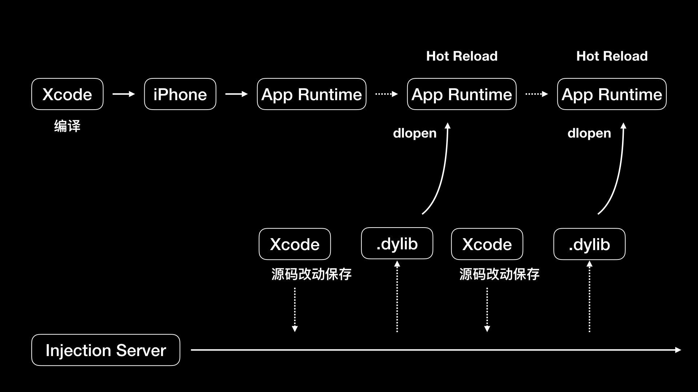
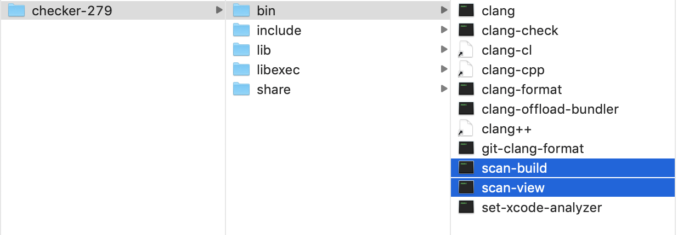
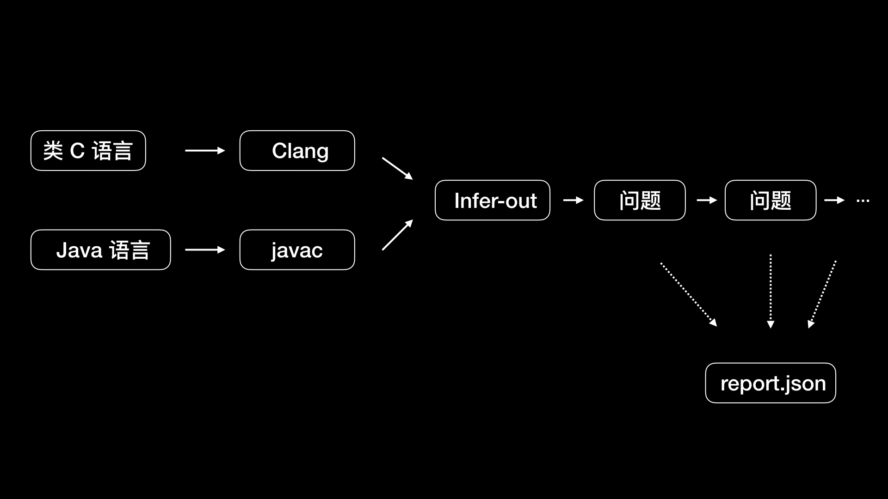
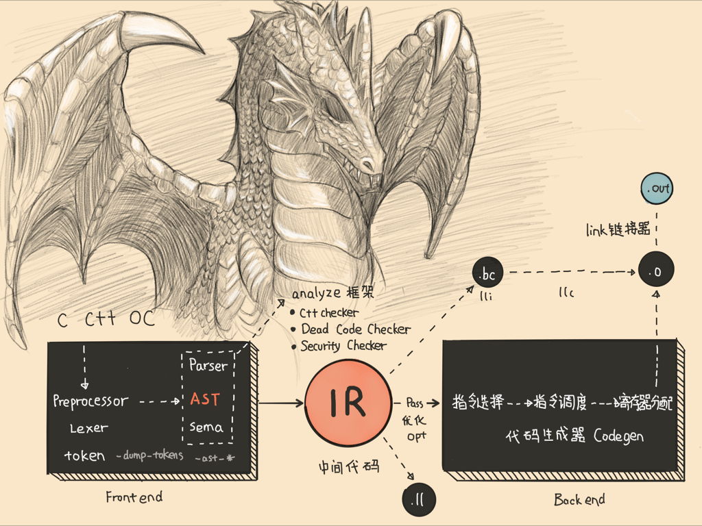

> <h2 id=''></h2>
-  [**控制台命令**](#控制台命令)
-  [**SwiftPlayground**](#SwiftPlayground)
-  [**Flutter热更新**](#Flutter热更新)
-  [**Injection for Xcode**](#InjectionForXcode)
-  [**静态分析**](#静分析)
	-  [OCLint](#OCLint)
	-  [Clang 静态分析器](#Clang静态分析器)
		-  [开发checker](#开发checker)
	-  [Infer](#Infer)
-  [**Clang为App提质**](#Clang为App提质)
	-  [Clang做了什么](#Clang做了什么)
	-  [Clang的功能](#Clang的功能)


<br/>

***
<br/>

><h2 id='控制台命令'>控制台命令</h2>

- **1.取出类地址**

```
p/x LGPerson.class 
// 或者x/4gx LGPerson.class
```


<br/>

***
<br/>

><h1 id='SwiftPlayground'>SwiftPlayground</h1>

&emsp; 说到 iOS 代码动态极速调试的工具，你首先能想到的估计就是 Playground。它是 Xcode 里集成的一个能够快速、实时调试程序的工具，可以实现所见即所得的效果


<br/>

***
<br/>

><h1 id='Flutter热更新'>Flutter热更新</h1>


Flutter 会在点击 reload 时去查看自上次编译以后改动过的代码，重新编译涉及到的代码库，还包括主库，以及主库的相关联库。所有这些重新编译过的库都会转换成内核文件发到 Dart VM 里，Dart VM 会重新加载新的内核文件，加载后会让 Flutter framework 触发所有的 Widgets 和 Render Objects 进行重建、重布局、重绘。


Flutter 为了能够支持跨平台开发，使用了自研的 Dart 语言配合在 App 内集成 Dart VM 的方式运行 Flutter 程序。目前 Flutter 还没有达到 Cocoa 框架那样的普及程度，所以如果你不是使用 Flutter 来开发 iOS 程序的话，想要达到极速调试应该要怎么做呢？


<br/>

***
<br/>

><h1 id='InjectionForXcode'>Injection for Xcode</h1>

&emsp; John Holdsworth 开发了一个叫作 Injection 的工具可以动态地将 Swift 或 Objective-C 的代码在已运行的程序中执行，以加快调试速度，同时保证程序不用重启。

[Injection](https://github.com/johnno1962/InjectionIII)使用方式就是 clone 下代码，构建 InjectionPluginLite/InjectionPlugin.xcodeproj ；删除方式是，在终端里运行下面这行代码：

```
rm -rf ~/Library/Application\ Support/Developer/Shared/Xcode/Plug-ins/InjectionPlugin.xcplugin
```

构建完成后，我们就可以编译项目。这时添加一个新的方法：
```
- (void)injected
{
    NSLog(@"I've been injected: %@", self);
}
```

然后在这个方法中添加一个断点，按下 ctrl + = ，接下来你会发现程序运行时会停到断点处，这样你的代码就成功地被运行中的 App 执行了。那么，Injection 是怎么做到的呢？

<br/>

Injection 会监听源代码文件的变化，如果文件被改动了，Injection Server 就会执行 rebuildClass 重新进行编译、打包成动态库，也就是 .dylib 文件。编译、打包成动态库后使用 writeSting 方法通过 Socket 通知运行的 App。writeString 的代码如下：

```
- (BOOL)writeString:(NSString *)string {
    const char *utf8 = string.UTF8String;
    uint32_t length = (uint32_t)strlen(utf8);
    if (write(clientSocket, &length, sizeof length) != sizeof length ||
        write(clientSocket, utf8, length) != length)
        return FALSE;
    return TRUE;
}
```

Server 会在后台发送和监听 Socket 消息，实现逻辑在 InjectionServer.mm 的 runInBackground 方法里。Client 也会开启一个后台去发送和监听 Socket 消息，实现逻辑在 InjectionClient.mm里的 runInBackground 方法里。

Client 接收到消息后会调用 inject(tmpfile: String) 方法，运行时进行类的动态替换。

<br/>

inject(tmpfile: String) 方法的代码大部分都是做新类动态替换旧类。inject(tmpfile: String) 的入参 tmpfile 是动态库的文件路径，那么这个动态库是如何加载到可执行文件里的呢？具体的实现在 inject(tmpfile: String) 方法开始里，如下：

```
let newClasses = try SwiftEval.instance.loadAndInject(tmpfile: tmpfile)
```

<br/>
<br/>

看下 SwiftEval.instance.loadAndInject(tmpfile: tmpfile) 这个方法的代码实现：

```
@objc func loadAndInject(tmpfile: String, oldClass: AnyClass? = nil) throws -> [AnyClass] {

    print("???? Loading .dylib - Ignore any duplicate class warning...")
    // load patched .dylib into process with new version of class
    guard let dl = dlopen("\(tmpfile).dylib", RTLD_NOW) else {
        throw evalError("dlopen() error: \(String(cString: dlerror()))")
    }
    print("???? Loaded .dylib - Ignore any duplicate class warning...")

    if oldClass != nil {
        // find patched version of class using symbol for existing

        var info = Dl_info()
        guard dladdr(unsafeBitCast(oldClass, to: UnsafeRawPointer.self), &info) != 0 else {
            throw evalError("Could not locate class symbol")
        }

        debug(String(cString: info.dli_sname))
        guard let newSymbol = dlsym(dl, info.dli_sname) else {
            throw evalError("Could not locate newly loaded class symbol")
        }

        return [unsafeBitCast(newSymbol, to: AnyClass.self)]
    }
    else {
        // grep out symbols for classes being injected from object file

        try injectGenerics(tmpfile: tmpfile, handle: dl)

        guard shell(command: """
            \(xcodeDev)/Toolchains/XcodeDefault.xctoolchain/usr/bin/nm \(tmpfile).o | grep -E ' S _OBJC_CLASS_\\$_| _(_T0|\\$S).*CN$' | awk '{print $3}' >\(tmpfile).classes
            """) else {
            throw evalError("Could not list class symbols")
        }
        guard var symbols = (try? String(contentsOfFile: "\(tmpfile).classes"))?.components(separatedBy: "\n") else {
            throw evalError("Could not load class symbol list")
        }
        symbols.removeLast()

        return Set(symbols.flatMap { dlsym(dl, String($0.dropFirst())) }).map { unsafeBitCast($0, to: AnyClass.self) }
```

在这段代码中，你是不是看到你所熟悉的动态库加载函数 dlopen 了呢？

```
guard let dl = dlopen("\(tmpfile).dylib", RTLD_NOW) else {
    throw evalError("dlopen() error: \(String(cString: dlerror()))")
}
```


如上代码所示，dlopen 会把 tmpfile 动态库文件载入运行的 App 里，返回指针 dl。接下来，dlsym 会得到 tmpfile 动态库的符号地址，然后就可以处理类的替换工作了。dlsym 调用对应代码如下：

```
guard let newSymbol = dlsym(dl, info.dli_sname) else {
    throw evalError("Could not locate newly loaded class symbol")
}
```


当类的方法都被替换后，我们就可以开始重新绘制界面了。整个过程无需重新编译和重启 App，至此使用动态库方式极速调试的目的就达成了。


我把 Injection 的工作原理用一张图表示了出来，如下所示：




<br/>

***
<br/>

><h1 id='静态分析'>静态分析</h1>

&emsp; Xcode 自带的静态分析工具 Analyze，通过静态语法分析能够找出在代码层面就能发现的内存泄露问题，还可以通过上下文分析出是否存在变量无用等问题。但是，Analyze 的功能还是有限，还是无法帮助我们在编写代码的阶段发现更多的问题。所以，这才诞生出了功能更全、定制化高、效率高的第三方静态检查工具。比如，OCLint、Infer、Clang 静态分析器等。

<br/>


><h2 id='OCLint'>OCLint</h2>

&emsp; OCLint 是基于 Clang Tooling 开发的静态分析工具，主要用来发现编译器检查不到的那些潜在的关键技术问题。

&emsp; 其中的基本覆盖了具有通用性的规则，主要包括语法上的基础规则、Cocoa 库相关规则、一些约定俗成的规则、各种空语句检查、是否按新语法改写的检查、命名上长变量名短变量名检查、无用的语句变量和参数的检查。

&emsp; 还包括了和代码量大小是否合理相关的一些规则，比如过大的类、类里方法是否太多、参数是否过多、Block 嵌套是否太深、方法里代码是否过多、圈复杂度的检查等。若是你还想了解其他的规则,[可以看这里.](http://docs.oclint.org/en/stable/rules/index.html)

&emsp; OCLint 的安装方式，我建议你使用 Homebrew 的方式。Homebrew 是 macOS 下专门用来进行软件包管理的一个工具，使用起来很方便，让你无需关心一些依赖和路径配置。

```
brew tap oclint/formulae
brew install oclint
```

安装完OCLint后,先编写一个 Hello world 代码来测试下，创建一个 Hello.m 文件来编写代码，使用 OCLint 来检查下前面编写的 Hello.m ，在终端输入如下命令：

```
oclint Hello.m
```

然后，我们可以使用下面的命令，将检查结果生成为一个 HTML 格式的报告：

```
oclint -report-type html -o report.html Hello.m
```


<br/>
<br/>


><h2 id='Clang静态分析器'>Clang 静态分析器</h2>

&emsp; Clang 静态分析器（Clang Static Analyzer）是一个用 C++ 开发的，用来分析 C、C++ 和 Objective-C 的开源工具，是 Clang 项目的一部分，构建在 Clang 和 LLVM 之上。Clang 静态分析器的分析引擎用的就是 Clang 的库。

&emsp;Clang 静态分析器专门为速度做过优化，可以在保证查出错误的前提下，使用更聪明的算法减少检查的工作量。


&emsp; 你可以[**点击这里下载Clang 静态分析器**](https://clang-analyzer.llvm.org/release_notes.html)，然后解压就可以了，不需要放到特定目录下。而卸载它的话，删除这个解压后的目录即可。

<br/>

&emsp; **在 Clang 静态分析器中，常用的就是 scan-build 和 scan-view 这两个工具。**

&emsp; scan-build 和 scan-view 所在的目录路径，如下图所示:



&emsp; scan-build 是用来运行分析器的命令行工具；scan-view 包含了 scan-build 工具，会在 scan-build 执行完后将结果可视化。


&emsp; scan-build 的原理是，将编译器构建改成另一个“假的”编译器来构建，这个“假的”编译器会执行 Clang 来编译，然后执行静态分析器分析你的代码。

&emsp; scan-build 的使用方法，也很简单，你只需要到项目目录下，使用如下命令即可：

```
\yourpath\scan-build -k -V make
```

&emsp; 关于 scan-build 的更多参数和使用说明，你可以[**点击这个链接查看。**](https://clang-analyzer.llvm.org/scan-build)


<br/>
<br/>

> <h3 id='开发checker'>开发checker</h3>

&emsp; Clang 静态分析器是由分析引擎 (analyzer core) 和 checkers 组成的。所有的 checker 都是基于底层分析引擎之上的。通过分析引擎提供的功能，我们可以编写新的 checker。

&emsp; checker 架构能够方便用户扩展代码检查的规则，或者通过自定义来扩展 bug 类型。如果你想编写自己的 checker，可以在 Clang 项目的 lib/StaticAnalyzer/Checkers 目录下找到示例参考，比如 ObjCUnusedIVarsChecker.cpp 就是用来检查是否有定义了，但是从未使用过的变量。

&emsp; 当然，如果为了编写自定义的 checker 一开始就埋头进去看那些示例代码是很难看懂的，你甚至都不能知道编写 checker 时有哪些方法可以为我所用。所以，你需要先了解 Clang 静态分析器提供了哪些功能接口，然后再参考官方的大量实例，去了解怎么使用这些功能接口，在这之后再动手开发才会事半功倍。


<br/>

&emsp; **开发 checker 时需要了解的 Clang 静态分析器提供的一些功能接口。**

&emsp; checker 的官方示例代码里有一个非常实用的，也就是内存泄露检查示例 MallocChecker，你可以点击[这个链接查看代码](https://clang.llvm.org/doxygen/MallocChecker_8cpp_source.html)。

&emsp; 在这段代码开头，我们可以看到引入了 clang/AST/ 和 clang/StaticAnalyzer/Core/PathSensitive/ 目录下的头文件。这两个目录下定义的接口功能非常强大，大部分 checker 都是基于此开发的。


&emsp; clang/AST/ 目录中，有语法树遍历 RecursiveASTVisitor，还有语法树层级遍历 StmtVisitor，遍历过程中，会有很多回调函数可以让 Checker 进行检查。比如，方法调用前的回调 checkPreCall、方法调用后的回调 checkPostCall，CFG（Control Flow Graph 控制流程图） 分支调用时的回调 checkBranchCondition、CFG 路径分析结束时的回调 checkEndAnalysis 等等。有了这些回调，我们就可以从语法树层级和路径上去做静态检查的工作了。


&emsp; clang/StaticAnalyzer/Core/PathSensitive/ 目录里，可以让 checker 检查变量和值上的更多变化。从目录 PathSensitive，我们也能看出这些功能叫做路径敏感分析（Path-Sensitive Analyses），是从条件分支上去跟踪，而这种跟踪是跟踪每一种分支去做分析。


&emsp; 但是，要去追踪所有路径的话，就可能会碰到很多复杂情况，特别是执行循环后，问题会更复杂，需要通过路径合并来简化复杂的情况，但是简化后可能就不会分析出所有的路径。所以，考虑到合理性问题的话，我们还是需要做些取舍，让其更加合理，达到尽量输出更多信息的目的，来方便我们开发 checker，检查出更多的 bug 。

&emsp; 路径敏感分析也包含了模拟内存管理，SymbolManager 符号管理里维护着变量的生命周期分析。想要了解具体实现的话，你可以点击这个[**链接参看源码实现。**](https://clang.llvm.org/doxygen/SymbolManager_8h_source.html)

&emsp; 这个内存泄露检查示例 MallocChecker 里，运用了 Clang 静态分析器提供的语法树层级节点检查、变量值路径追踪以及内存管理分析功能接口，对我们编写自定义的 checker 是一个很全面、典型的示例。


&emsp; 追其根本，编写自己的 checker ，其核心还是要更多地掌握 Clang 静态分析器的内在原理。很早之前，苹果公司就在 [LLVM Developers Meeting ](https://www.youtube.com/watch?v=4lUJTY373og&t=102s)上，和我们分享过怎样通过 Clang 静态分析器去找 bug。你可以点击这个链接，[查看相应的 PPT](https://llvm.org/devmtg/2008-08/Kremenek_StaticAnalyzer.pdf)，这对我们了解 Clang 静态分析器的原理有很大的帮助。

不过，checker 架构也有不完美的地方，比如每执行完一条语句，分析引擎需要回去遍历所有 checker 中的回调函数。这样的话，随着 checker 数量的增加，整体检查的速度也会变得越来越慢。

如果你想列出当前 Clang 版本下的所有 checker，可以使用如下命令：

```
clang —analyze -Xclang -analyzer-checker-help
```

下面显示的就是常用的 checker：

```
debug.ConfigDumper              配置表
debug.DumpCFG                   显示控制流程图
debug.DumpCallGraph             显示调用图
debug.DumpCalls                 打印引擎遍历的调用
debug.DumpDominators            打印控制流程图的 dominance tree
debug.DumpLiveVars              打印实时变量分析结果
debug.DumpTraversal             打印引擎遍历的分支条件
debug.ExprInspection            检查分析器对表达式的理解
debug.Stats                     使用分析器统计信息发出警告
debug.TaintTest                 标记污染的符号
debug.ViewCFG                   查看控制流程图
debug.ViewCallGraph             使用 GraphViz 查看调用图
debug.ViewExplodedGraph         使用 GraphViz 查看分解图
```


<br/>

让我示范下如何使用checker,先来一段简单代码:

```
int main()
{
  int a;
  int b = 10;
  a = b;
  return a;
}
```

<br/>

使用如下命令,调用 DumpCFG 这个 checker 对上面代码进行分析:

```
clang -cc1 -analyze -analyzer-checker=debug.DumpCFG
```

可以看出，代码的控制流程图被打印了出来。控制流程图会把程序拆得更细，可以把执行过程表现得更直观，有助于我们做静态分析。


<br/>
<br/>


><h2 id='Infer'>Infer</h2>

Infer 是 Facebook 开源的、使用 OCaml 语言编写的静态分析工具，可以对 C、Java 和 Objective-C 代码进行静态分析，可以检查出空指针访问、资源泄露以及内存泄露。

Infer 的安装，有从源码安装和直接安装 binary releases 两种方式。

如果想在 macOS 上编译源码进行安装的话，你需要预先安装一些工具，这些工具在后面编译时会用到，命令行指令如下：

```
brew install autoconf automake cmake opam pkg-config sqlite gmp mpfr
brew cask install java
```


可以使用如下所示的命令，通过编译源码来安装：

```
# Checkout Infer
git clone https://github.com/facebook/infer.git
cd infer
# Compile Infer
./build-infer.sh clang
# install Infer system-wide...
sudo make install
# ...or, alternatively, install Infer into your PATH
export PATH=`pwd`/infer/bin:$PATH
```

使用源码安装所需的时间会比较长，因为会编译一个特定的 Clang 版本，而 Clang 是个庞大的工程，特别是第一次编译的耗时会比较长。我在第一次编译时，就大概花了一个多小时。所以，直接安装 binary releases 会更快些，在终端输入：

```
brew install infer
```

Infer 就安装好了。

<br/>
<br/>

下面让我们示范下,如何使用Infer:

```
#import <Foundation/Foundation.h>

@interface Hello: NSObject
@property NSString* s;
@end

@implementation Hello
NSString* m() {
    Hello* hello = nil;
    return hello->_s;
}
@end
```

在终端输入:

```
infer -- clang -c Hello.m
```

结果如下:

```

Capturing in make/cc mode...
Found 1 source file to analyze in /Users/ming/Downloads/jikeshijian/infer-out
Starting analysis...

legend:
  "F" analyzing a file
  "." analyzing a procedure

F.
*Found 5 issues*

hello.m:10: error: NULL_DEREFERENCE
  pointer `hello` last assigned on line 9 could be null and is dereferenced at line 10, column 12.
  8.   NSString* m() {
  9.       Hello* hello = nil;
  10. *>*    return hello->_s;
  11.   }

hello.m:10: warning: DIRECT_ATOMIC_PROPERTY_ACCESS
  Direct access to ivar `_s` of an atomic property at line 10, column 12. Accessing an ivar of an atomic property makes the property nonatomic.
  8.   NSString* m() {
  9.       Hello* hello = nil;
  10. *>*    return hello->_s;
  11.   }

hello.m:4: warning: ASSIGN_POINTER_WARNING
  Property `s` is a pointer type marked with the `assign` attribute at line 4, column 1. Use a different attribute like `strong` or `weak`.
  2.   
  3.   @interface Hello: NSObject
  4. *>*@property NSString* s;
  5.   @end
  6.   

hello.m:10: warning: DIRECT_ATOMIC_PROPERTY_ACCESS
  Direct access to ivar `_s` of an atomic property at line 10, column 12. Accessing an ivar of an atomic property makes the property nonatomic.
  8.   NSString* m() {
  9.       Hello* hello = nil;
  10. *>*    return hello->_s;
  11.   }

hello.m:4: warning: ASSIGN_POINTER_WARNING
  Property `s` is a pointer type marked with the `assign` attribute at line 4, column 1. Use a different attribute like `strong` or `weak`.
  2.   
  3.   @interface Hello: NSObject
  4. *>*@property NSString* s;
  5.   @end
  6.   


*Summary of the reports*

  DIRECT_ATOMIC_PROPERTY_ACCESS: 2
         ASSIGN_POINTER_WARNING: 2
               NULL_DEREF
```


可以看出，我们前面的 hello.m 代码里一共有五个问题，其中包括一个错误、四个警告。第一个错误如下：

```
hello.m:10: error: NULL_DEREFERENCE
  pointer `hello` last assigned on line 9 could be null and is dereferenced at line 10, column 12.
  8.   NSString* m() {
  9.       Hello* hello = nil;
  10. *>*    return hello->_s;
  11.   }
```

这个错误的意思是， hello 可能为空，需要去掉第 10 行 12 列的引用。我把这行代码做下修改，去掉引用：

```
return hello.s;
```

再到终端运行一遍 infer 命令：

```
infer -- clang -c Hello.m
```

然后，就发现只剩下了一个警告:

```
hello.m:4: warning: ASSIGN_POINTER_WARNING
  Property `s` is a pointer type marked with the `assign` attribute at line 4, column 1. Use a different attribute like `strong` or `weak`.
  2.   
  3.   @interface Hello: NSObject
  4. *>*@property NSString* s;
  5.   @end
  6.  
```


这个警告的意思是说，属性 s 是指针类型，需要使用 strong 或 weak 属性。这时，我将 s 的属性修改为 strong：

```
@property(nonatomic, strong) NSString* s;
```

运行 Infer 后，发现没有问题了。

```

Capturing in make/cc mode...
Found 1 source file to analyze in /Users/ming/Downloads/jikeshijian/infer-out
Starting analysis...

legend:
  "F" analyzing a file
  "." analyzing a procedure

F.
*No issues found
```

**为了帮助你理解 Infer 的工作原理，我来梳理下 Infer 工作的流程：**

- 第一个阶段是转化阶段，将源代码转成 Infer 内部的中间语言。类 C 语言使用 Clang 进行编译，Java 语言使用 javac 进行编译，编译的同时转成中间语言，输出到 infer-out 目录。

- 第二个阶段是分析阶段，分析 infer-out 目录下的文件。分析每个方法，如果出现错误的话会继续分析下一个方法，不会被中断，但是会记录下出错的位置，最后将所有出错的地方进行汇总输出。

默认情况下，每次运行 infer 命令都会删除之前的 infer-out 文件夹。你可以通过 --incremental 参数使用增量模式。增量模式下，运行 infer 命令不会删除 infer-out 文件夹，但是会利用这个文件夹进行 diff，减少分析量。一般进行全新一轮分析时直接使用默认的非增量模式，而对于只想分析修改部分情况时，就使用增量模式。

Infer 检查的结果，在 infer-out 目录下，是 JSON 格式的，名字叫做 report.json 。生成 JSON 格式的结果，通用性会更强，集成到其他系统时会更方便。

Infer工作流程图:

?token=GHSAT0AAAAAABXBBIRX7EX3RW62BZ4SAZPEYXFAMJQ

https://raw.githubusercontent.com/harleyGit/StudyNotes/master/Pictures/ios_oc1_2.webp?token=GHSAT0AAAAAABXBBIRWXW2SKEEP5BOZLVOKYXFANNQ




<br/>

***
<br/>

><h1 id='Clang为App提质'>Clang为App提质</h1>

&emsp; Clang提供的丰富的功能接口可以用来开发出静态工具,用来管控代码质量外.我们还可以基于Clang开发出用于代码增量分析、代码可视化、代码质量报告来保障 App 质量的系统平台，比如[**CodeChecker**](https://github.com/Ericsson/CodeChecker)。

&emsp; 比如，当休息天发现线上问题时，你会发现很多时候分析问题的人都不在电脑边，无法及时处理问题。这时，我们就需要一款在线网页代码导航工具，比如 Mozilla 开发的 [**DXR**](https://github.com/mozilla/dxr#dxr)，方便在便携设备上去操作、分析问题，这样的工具都是基于 Clang 开发的。

<br/>

**什么是Clang? 了解过吗? 它是什么? 你能说说嘛?**

看一下iOS开发的完整编译流程图:




图上，左侧黑块部分就是 Clang。Clang 是 C、C++、Objective-C 的编译前端，而 Swift 有自己的编译前端（也就是 Swift 前端多出的 SIL optimizer）。


<br/>

**Clang的优势:**
- Clang 编译的速度非常快，对内存的使用率非常低，并且兼容 GCC。
- 对于代码诊断来说， Clang 也非常强大，Xcode 也是用的 Clang。使用 Clang 编译前端，可以精确地显示出问题所在的行和具体位置，并且可以确切地说明出现这个问题的原因，并指出错误的类型是什么，使得我们可以快速掌握问题的细节。这样的话，我们不用看源码，仅通过 Clang 突出标注的问题范围也能够了解到问题的情况。
- Clang 对 typedef 的保留和展开也处理得非常好。typedef 可以缩写很长的类型，保留 typedef 对于粗粒度诊断分析很有帮助。但有时候，我们还需要了解细节，对 typedef 进行展开即可。
- Fix-it 提示也是 Clang 提供的一种快捷修复源码问题的方式。在宏的处理上，很多宏都是深度嵌套的， Clang 会自动打印实例化信息和嵌套范围信息来帮助你进行宏的诊断和分析。
- Clang 的架构是模块化的。除了代码静态分析外，利用其输出的接口还可以开发用于代码转义、代码生成、代码重构的工具，方便与 IDE 进行集成。

<br/>

&emsp; Clang 的强大功能相对立的是，GCC 对于 Objective-C 的支持比较差，效率和性能都没有办法达到苹果公司的要求，而且它还难以推动 GCC 团队。

&emsp; 于是，苹果公司决定自己来掌握编译相关的工具链，将天才克里斯·拉特纳（Chris Lattner）招入麾下后开发了 LLVM 工具套件，将 GCC 全面替换成了 LLVM。这，也使得 Swift 这门集各种高级语言特性的语言，能够在非常高的起点上，出现在开发者面前。


Clang 是基于 C++ 开发的，如果你想要了解 Clang 的话，需要有一定的 C++ 基础。但是，[**Clang 源码本身质量非常高]**(https://code.woboq.org/llvm/clang/)，有很多值得学习的地方，比如说目录清晰、功能解耦做得很好、分类清晰方便组合和复用、代码风格统一而且规范、注释量大便于阅读等。

我们阅读 Clang 的源码，除了可以帮助我们了解 Clang 以外，还可以给我们提供一个学习优秀代码、提升编程思维能力的机会。特别是在编写自定义插件或者工具时，如果你对用到的接口了解得不是很清楚，或者好奇接口的实现，这时候去看源码，对于你的帮助是非常大的。


<br/>
<br/>


> <h2 id='Clang做了什么'>Clang做了什么</h2>

前面提到的 Driver 命令来看看 Clang 对源码做了哪些事儿？

来看一段事例Demo,有助于我们的了解:

```
int main()
{
  int a;
  int b = 10;
  a = b;
  return a;
}
```

<br/>

- **1.首先，Clang 会对代码进行词法分析，将代码切分成 Token。**

输入一个命令可以查看上面代码的所有的 Token。命令如下：

```
clang -fmodules -E -Xclang -dump-tokens main.m
```

&emsp; 这个命令的作用是，显示每个 Token 的类型、值，以及位置。[**你可以在这个链接中**](https://opensource.apple.com//source/lldb/lldb-69/llvm/tools/clang/include/clang/Basic/TokenKinds.def)，看到 Clang 定义的所有 Token 类型。我们可以把这些 Token 类型，分为下面这 4 类:
- 关键字：语法中的关键字，比如 if、else、while、for 等；
- 标识符：变量名；
- 字面量：值、数字、字符串；
- 特殊符号：加减乘除等符号。

<br/>

**接下来，词法分析完后就会进行语法分析，**将输出的 Token 先按照语法组合成语义，生成类似 VarDecl 这样的节点，然后将这些节点按照层级关系构成抽象语法树（AST）。

在终端输入下面的这条命令，你就可以查看前面源码的语法树：

```
clang -fmodules -fsyntax-only -Xclang -ast-dump main.m
```

打印出来效果如下:

```
TranslationUnitDecl 0xc75b450 <<invalid sloc>> <invalid sloc>
|-TypedefDecl 0xc75b740 <<invalid sloc>> <invalid sloc> implicit __builtin_va_list ‘char *’
`-FunctionDecl 0xc75b7b0 <test.cpp:1:1, line:7:1> line:1:5 main ‘int (void)’
  `-CompoundStmt 0xc75b978 <line:2:1, line:7:1>
    |-DeclStmt 0xc75b870 <line:3:2, col:7>
    | `-VarDecl 0xc75b840 <col:2, col:6> col:6 used a ‘int’
    |-DeclStmt 0xc75b8d8 <line:4:2, col:12>
    | `-VarDecl 0xc75b890 <col:2, col:10> col:6 used b ‘int’ cinit
    |   `-IntegerLiteral 0xc75b8c0 <col:10> ‘int’ 10

<<<<<<<<<<<<<<<<<<<<<<<<<<<<<<< a = b <<<<<<<<<<<<<<<<<<<<<<<<<<<<<<<<<<<<<<<<
    |-BinaryOperator 0xc75b928 <line:5:2, col:6> ‘int’ lvalue ‘=‘
    | |-DeclRefExpr 0xc75b8e8 <col:2> ‘int’ lvalue Var 0xc75b840 ‘a’ ‘int’
    | `-ImplicitCastExpr 0xc75b918 <col:6> ‘int’ <LValueToRValue>
    |   `-DeclRefExpr 0xc75b900 <col:6> ‘int’ lvalue Var 0xc75b890 ‘b’ ‘int’
<<<<<<<<<<<<<<<<<<<<<<<<<<<<<<<<<<<<<<<<<<<<<<<<<<<<<<<<<<<<<<<<<<<<<<<<<<<<<<

    `-ReturnStmt 0xc75b968 <line:6:2, col:9>
      `-ImplicitCastExpr 0xc75b958 <col:9> ‘int’ <LValueToRValue>
        `-DeclRefExpr 0xc75b940 <col:9> ‘int’ lvalue Var 0xc75b840 ‘a’ ‘int
```

其中 TranslationUnitDecl 是根节点，表示一个编译单元；Decl 表示一个声明；Expr 表示的是表达式；Literal 表示字面量，是一个特殊的 Expr；Stmt 表示陈述。

除此之外，Clang 还有众多种类的节点类型。Clang 里，节点主要分成 Type 类型、Decl 声明、Stmt 陈述这三种，其他的都是这三种的派生。通过扩展这三类节点，就能够将无限的代码形态用有限的形式来表现出来了。


<br/>
<br/>


<h2 id='Clang的功能'>Clang的功能</h2>


Clang 为一些需要分析代码语法、语义信息的工具提供了基础设施。这些基础设施就是 LibClang、Clang Plugin 和 LibTooling。


<br/>
<br/>


<h3 id='LibClang'>LibClang</h3>


&emsp; LibClang 提供了一个稳定的高级 C 接口，Xcode 使用的就是 LibClang。LibClang 可以访问 Clang 的上层高级抽象的能力，比如获取所有 Token、遍历语法树、代码补全等。由于 API 很稳定，Clang 版本更新对其影响不大。但是，LibClang 并不能完全访问到 Clang AST 信息。

&emsp; 使用 LibClang 可以直接使用它的 C API。官方也提供了 Python binding 脚本供你调用。还有开源的 node-js/ruby binding。你要是不熟悉其他语言，还有个第三方开源的 Objective-C 写的[ClangKit](https://github.com/macmade/ClangKit) 库可供使用。


<br/>
<br/>


<h3 id='Clang Plugins'>Clang Plugins</h3>


&emsp; Clang Plugins 可以让你在 AST 上做些操作，这些操作能够集成到编译中，成为编译的一部分。插件是在运行时由编译器加载的动态库，方便集成到构建系统中。


&emsp; 使用 Clang Plugins 一般都是希望能够完全控制 Clang AST，同时能够集成在编译流程中，可以影响编译的过程，进行中断或者提示。


<br/>
<br/>


<h3 id='LibTooling'>LibTooling</h3>

&emsp; LibTooling 是一个 C++ 接口，通过 LibTooling 能够编写独立运行的语法检查和代码重构工具。LibTooling 的优势如下：
- 所写的工具不依赖于构建系统，可以作为一个命令单独使用，比如 clang-check、clang-fixit、clang-format；
- 可以完全控制 Clang AST；
- 能够和 Clang Plugins 共用一份代码。


&emsp; LibTooling 基于能够完全控制 Clang AST 和可独立运行的特点，可以做的事情就非常多:
- 改变代码：可以改变 Clang 生成代码的方式。基于现有代码可以做出大量的修改。还可以进行语言的转换，比如把 OC 语言转成 JavaScript 或者 Swift。
- 做检查：检查命名规范，增加更强的类型检查，还可以按照自己的定义进行代码的检查分析。


<br/>
<br/>


<h3 id=''></h3>

&emsp; 


<br/>

***
<br/>`

><h1 id=''></h1>


<br/>

***
<br/>

><h1 id=''></h1>


<br/>

***
<br/>

><h1 id=''></h1>


<br/>

***
<br/>

><h1 id=''></h1>


