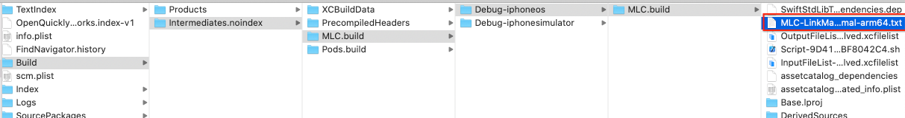
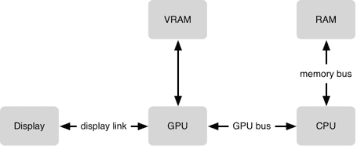
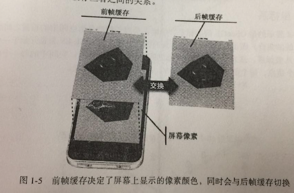
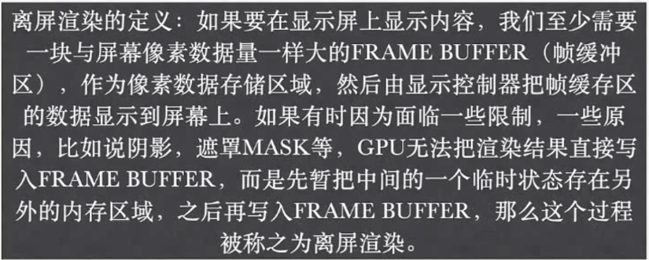

> <h2 id=''></h2>
- [**性能优化概要**](#性能优化概要)
	- [存储器分类](#存储器分类)
	- [物理内存&虚拟内存](#物理内存&虚拟内存)
	- [内存分页](#内存分页)
- [**UI流畅**](#UI流畅)
	- [**界面流畅**](#界面流畅)
		- [CPU和GPU](#CPU和GPU)
		- [缓冲机制](#缓冲机制)
		- [绘制渲染流程](#绘制渲染流程)
		- [离屏渲染](#离屏渲染)
	- [**图片加载**](#图片加载)
		- [mmap映射](#mmap映射)
	- [**图片压缩**](#图片压缩)
	- [**内存图片与显示的图片Size不符**](#内存图片与显示的图片Size不符)
		- [缩放图片Code](#缩放图片Code)
		- [上传图片优化](#上传图片优化)
		- [加载大量图片优化](#加载大量图片优化)
	- [UITableView滑动卡顿](#UITableView滑动卡顿)
	- [网络请求](#网络请求)
	- [减少在UI中对象频繁创建](#减少在UI中对象频繁创建)
- [**网络优化**](#网络优化)
	- [**压缩HTTP请求体**](#压缩HTTP请求体)
- [**优化角度**](#优化角度)
	- [解码](#解码)
	- [性能优化](#性能优化)
- [**NSTimer内存泄漏**](#NSTimer内存泄漏)
	- 	[视图控制器判断](#视图控制器判断)
	- [	运行时解决](#运行时解决)
	- [	方法重定向解决](#方法重定向解决)
	- [精准计时](#精准计时)
		- [GCD计时](#GCD计时)
- [**优化框架Accelerate**](#优化框架Accelerate)
	- [简介](#简介)
- **资料**
	- [**性能优化**](https://www.cnblogs.com/guohai-stronger/p/10430106.html)
	- **UI优化资料**
		- 	[性能优化那些事](https://www.cnblogs.com/oc-bowen/p/5999997.html)
		- 	[异步绘制Cell](https://blog.csdn.net/mo_xiao_mo/article/details/52622172)
		- 	[UITableView性能优化](https://www.jianshu.com/p/0014f736b130)

	


<br/>

***
<br/>

> <h1 id='性能优化概要'>性能优化概要</h1>

**iOS性能优化，主要围绕以下问题解决的：**
- 内存
	- 内存布局
	- retain
	- weak
- Runloop
	- NSTimer
	- 面试-Runloop
- 界面
	- 内存泄露
	- TableView优化


<br/><br/>

> <h2 id='存储器分类'>存储器分类</h2>

- **存储器分为：**

	- 易失性存储器
	- 	特点是读写速度快，断电数据会丢失，价格贵，容量小；主要代表是随机访问存储器（RAM），RAM 又分为 SRAM（静态）和 DRAM（动态），静态价格更贵速度也更快，从上图可以看到 L1~L3 使用的是SRAM，L4 主存用的 DRAM，通常情况下，SRAM 都会集成中 CPU 芯片中。


- 非易失性存储器
	- 特点是读写速度较慢，但断电数据会保存，价格贵，容量大；分为只读存储器（ROM）和闪存（Flash memory）两类，计算机用的机械硬盘就是 ROM 的一种，而闪存常用于手机中。


<br/><br/>

> <h2 id='物理内存&虚拟内存'>物理内存&虚拟内存</h2>


- **物理内存**：在进程运行时，为操作系统及进程提供临时存储空间，需要借助物理存储器进行存储。目前最新的 iPhone 11 内存为 4GB。


- **虚拟内存**：Virtual Memory，是计算机内存管理的技术之一，为每个进程提供一个连续并私有的地址空间，从而保护每个进程的地址空间不被其它进程损坏，降低了开发的复杂度，开发者只需要关注自身进程即可，如下图所示。（iOS分别在 32 / 64 位操作系统下，给每个进程提供了 4 / 16 GB  的虚拟内存）




有了虚拟内存后，进程访问的是分配给它的虚拟内存，而虚拟内存实际可能映射到物理内存以及硬盘的任何区域，这样就方便了系统使用共享库，并且当内存空间不足时，还可以将部分不使用的内存数据交换到硬盘中或者进行压缩。


<br/><br/><br/>

>## <h2 id='内存分页'>[内存分页](https://juejin.cn/post/6864492188404088846#heading-6)</h2>


为了方便虚拟内存和物理内存的映射及管理，目前大部分计算机的内存都采用了分页管理，将虚拟内存和物理内存分别分割成 大小相同的单位。iOS下每个进程空间先分段，每个段内再分页，所以物理地址由 段号 + 段内页号 + 页内地址 组成，目前 64 为系统每页为 16KB。

内存分页的最大意义在于支持了物理内存的离散使用，连续的虚拟内存页实际映射的物理内存页可以是任意存放的，方便了操作系统对物理内存的管理，也能最大化利用物理内存，减少内存空间的浪费。


<br/>

***
<br/><br/><br/>

># <h1 id='UI流畅'>[UI流畅](https://blog.ibireme.com/2015/11/12/smooth_user_interfaces_for_ios/)</h1>

<br/>

># <h2 id = "界面流畅">[界面流畅](https://xilankong.github.io/ios性能优化/2017/10/29/iOS如何保持界面流畅.html)</h2>

[iOS 性能优化总结](https://juejin.cn/post/6844903590138478600)

<br/><br/><br/>

> <h2 id='CPU和GPU'>CPU和GPU</h2>

**CPU**

&emsp; 加载资源，对象创建，对象调整，对象销毁，布局计算，Autolayout，文本计算，文本渲染，图片的解码， 图像的绘制（Core Graphics）都是在CPU上面进行的。

<br/>

**GPU**

&emsp; GPU是一个专门为图形高并发计算而量身定做的处理单元，比CPU使用更少的电来完成工作并且GPU的浮点计算能力要超出CPU很多。

&emsp; GPU的渲染性能要比CPU高效很多，同时对系统的负载和消耗也更低一些，所以在开发中，我们应该尽量让CPU负责主线程的UI调动，把图形显示相关的工作交给GPU来处理，当涉及到光栅化等一些工作时，CPU也会参与进来，这点在后面再详细描述。

&emsp; 相对于CPU来说，GPU能干的事情比较单一：接收提交的纹理（Texture）和顶点描述（三角形），应用变换（transform）、混合（合成）并渲染，然后输出到屏幕上。通常你所能看到的内容，主要也就是纹理（图片）和形状（三角模拟的矢量图形）两类。


<br/><br/>

**CPU 和 GPU 的协作**



由上图可知，要在屏幕上显示视图，需要CPU和GPU一起协作，CPU计算好显示的内容提交到GPU，GPU渲染完成后将结果放到帧缓存区，随后视频控制器会按照 VSync 信号逐行读取帧缓冲区的数据，经过可能的数模转换传递给显示器显示。


<br/><br/><br/>

> <h2 id='缓冲机制'>缓冲机制</h2>



iOS使用的是双缓冲机制。即GPU会预先渲染好一帧放入一个缓冲区内（前帧缓存），让视频控制器读取，当下一帧渲染好后，GPU会直接把视频控制器的指针指向第二个缓冲器（后帧缓存）。当你视频控制器已经读完一帧，准备读下一帧的时候，GPU会等待显示器的VSync信号发出后，前帧缓存和后帧缓存会瞬间切换，后帧缓存会变成新的前帧缓存，同时旧的前帧缓存会变成新的后帧缓存。


<br/><br/><br/>

> <h2 id='绘制渲染流程'>绘制渲染流程</h2>

UIView从Draw到Render的过程有如下几步：

&emsp; 每一个UIView都有一个layer，每一个layer都有个content，这个content指向的是一块缓存，叫做Backing store(后备存储)。

&emsp; &emsp; **Bcking Store（后备存储）：** 后备存储通常是指用于保存控件或视图绘制的像素数据的内存或图像缓冲区。它是一个用于存储绘制内容的备份，当需要在屏幕上显示时，可以从后备存储中复制到屏幕上。在某些情况下，后备存储也可以用于支持离屏渲染。


<br/>

&emsp; UIView的绘制和渲染是两个过程，当UIView被绘制时，CPU执行drawRect，通过context将数据写入backing store。

&emsp; 当backing store写完后，通过render server交给GPU去渲染，将backing store中的bitmap数据显示在屏幕上。


**下图就是从CPU到GPU的过程：**


<br/><br/><br/>

> <h2 id='离屏渲染'>离屏渲染</h2>

**离屏渲染：** 当一个视图或图层需要进行离屏渲染时，系统会创建一个离屏上下文，将相关的渲染操作在该离屏上下文中执行，然后将结果合成到屏幕上。这通常涉及到对离屏上下文的创建、渲染、合成等一系列操作。




<br/>


iOS中图形绘制框架的大致结构

<br/><br/>

**离屏渲染的一般流程，包括上下文切换：**

- 创建离屏上下文和帧缓冲区： 当进行离屏渲染时，会创建一个离屏上下文，同时为这个上下文创建一个帧缓冲区。这个帧缓冲区的大小通常与需要渲染的内容相对应，而不是与整个屏幕大小相同。这个上下文通常是在 GPU 中创建的。

- 在离屏上下文中进行绘制： 渲染操作发生在离屏上下文中，其中包括绘制一些需要特殊处理的图形，如圆角或阴影。

- 缓冲区中存储渲染结果： 离屏上下文中的渲染结果被存储到帧缓冲区中

- 设置离屏上下文为当前上下文： 在执行离屏渲染之前，**系统会将新创建的离屏上下文设置为当前上下文**。这个过程涉及上下文切换。

- 在离屏上下文中进行渲染： 所有与离屏渲染相关的绘制操作都在这个新的离屏上下文中进行，而不会影响到屏幕上的渲染。

- 将渲染结果合成到屏幕上： 当离屏渲染完成后，系统将离屏上下文的渲染结果合成到屏幕上。这可能涉及到将渲染缓冲区的内容复制到屏幕上，这也是上下文切换的一部分。

- 恢复当前上下文： 完成离屏渲染后，**系统会将原先的屏幕上下文恢复为当前上下文**。这也是上下文切换的一部分。


<br/><br/>

- **名词解读:**
	- 	**原先的屏幕上下文：** 这是应用程序通常渲染到的屏幕上的上下文。它用于处理显示在屏幕上的图形内容。

	- **离屏上下文：** 这是用于离屏渲染的上下文。离屏上下文的渲染目标通常是一个离屏缓冲区或者纹理，而不是直接显示在屏幕上。这个渲染目标是在离屏上下文中创建的，可以是一个图像缓冲区或者帧缓冲区。
	
	- **上下文切换：** 上下文切换是指将当前图形渲染的上下文从屏幕上下文切换到离屏上下文，以确保在离屏渲染期间不影响到屏幕上的渲染。具体的切换过程会因使用的图形 API 而异，例如，在 OpenGL 或 Metal 中，可能涉及使用帧缓冲区对象（Framebuffer Object）来切换渲染目标。

	- **合成**： 当离屏上下文中的渲染完成后，渲染结果会被合成到屏幕上。这可能涉及到将离屏上下文中的帧缓冲区内容复制到屏幕上的帧缓冲区中。

<br/><br/>

**疑问1:为什么要上下文切换？**

- 隔离效果： 上下文切换确保离屏渲染的操作不会影响到当前屏幕的渲染。离屏渲染通常用于处理一些复杂的图形效果，而这些效果在执行过程中可能需要更改渲染状态，如果不切换上下文，就有可能影响到当前屏幕上的渲染。

- 避免相互影响： 离屏渲染的目的是为了生成一个独立的渲染结果，如果与当前屏幕上下文混合使用，可能导致图形效果的不一致或不正确。

- 性能考虑： 上下文切换是一种开销较大的操作，但是在离屏渲染的场景下，通常是必要的。性能开销的大小取决于具体的实现和硬件，因此在设计中需要谨慎使用离屏渲染，特别是在大量渲染操作频繁发生的情况下


<br/><br/>

**疑问2:离屏渲染的时候为什么设置离屏上下文为当前上下文?**

- 在进行离屏渲染时，将离屏上下文设置为当前上下文是为了确保后续的渲染操作都在这个离屏上下文中进行。这样做的目的主要有两个：

	- 隔离渲染操作： 将离屏上下文设置为当前上下文可以将离屏渲染的操作与当前屏幕上的渲染操作隔离开来。这样可以确保在离屏渲染期间对渲染状态的更改不会直接影响到当前屏幕上的显示。

	- 保持状态独立性： 渲染状态包括诸如颜色、深度、模板缓冲区等设置。通过将离屏上下文设置为当前上下文，可以确保在离屏渲染中进行的状态更改不会影响到当前屏幕上的渲染状态。这种状态独立性对于处理一些特殊的图形效果非常重要，如圆角、阴影等


**示例代码（以OpenGL为例）：**

```
// 创建离屏上下文
glGenFramebuffers(1, &offscreenFramebuffer);
glBindFramebuffer(GL_FRAMEBUFFER, offscreenFramebuffer);

// 创建离屏渲染的纹理附件
glGenTextures(1, &offscreenTexture);
glBindTexture(GL_TEXTURE_2D, offscreenTexture);
glTexImage2D(GL_TEXTURE_2D, 0, GL_RGBA, width, height, 0, GL_RGBA, GL_UNSIGNED_BYTE, NULL);
glFramebufferTexture2D(GL_FRAMEBUFFER, GL_COLOR_ATTACHMENT0, GL_TEXTURE_2D, offscreenTexture, 0);

// 设置离屏上下文为当前上下文
glBindFramebuffer(GL_FRAMEBUFFER, offscreenFramebuffer);
```

在上面的例子中，通过glBindFramebuffer函数将离屏渲染的帧缓冲区设置为当前上下文，然后进行后续的渲染操作。这样，所有的渲染操作都将影响到离屏帧缓冲区，而不是直接影响到当前屏幕上的渲染。


<br/>

**疑问3:为什么离屏渲染完成后当前屏幕上下文不是离屏渲染上下文? 而是系统将原先的屏幕上下文恢复为当前上下文? 原先的屏幕上下文指的是离屏上下文吗?**


在离屏渲染完成后，将原先的屏幕上下文恢复为当前上下文的目的是为了确保渲染结果正确地显示在屏幕上。让我们详细解释一下这个过程：

- 离屏渲染的过程：
	- 创建离屏上下文。
	- 在离屏上下文中进行渲染操作，将结果存储在帧缓冲区中。
- 合成到屏幕上的过程：
	- 将离屏上下文切换回当前上下文。
	- 将帧缓冲区的内容合成到屏幕上。


<br/><br/>

- 为什么要将离屏上下文切换回当前上下文？

	- 确保合成正确： 离屏上下文中的渲染结果通常存储在帧缓冲区中。将离屏上下文切换回当前上下文后，合成的操作能够正确地将帧缓冲区的内容显示在屏幕上。这个合成过程可能涉及将帧缓冲区的内容复制到屏幕上的帧缓冲区中。

	- 上下文的隔离： 离屏上下文的切换回当前上下文，确保了离屏渲染期间对渲染状态的更改不会持续影响到当前屏幕上的渲染状态。这是为了保持上下文之间的隔离性。


&emsp; 原先的屏幕上下文指的是进行离屏渲染之前的当前上下文，而不是离屏上下文本身。在离屏渲染期间，为了隔离离屏渲染和当前屏幕渲染，将当前上下文切换到离屏上下文。完成离屏渲染后，为了正确显示结果，需要将当前上下文切换回原先的屏幕上下文。这确保了离屏渲染不会持续影响当前屏幕上的其他渲染操作。


<br/>
<br/>

**疑问4.帧缓冲区与离屏渲染创建的缓冲区一样吗? 这个缓冲区用来做什么的? 还有帧缓冲区是用来做什么的?**

&emsp; 在图形编程中，术语 "帧缓冲区"（Frame Buffer）是一个通用的概念，而不仅仅是用于离屏渲染。帧缓冲区是用于存储图形渲染的结果的内存区域。

&emsp; **帧缓冲区的作用：** 帧缓冲区是图形渲染管线的最终目标，它存储了在渲染过程中生成的像素数据。这个数据可以被渲染到屏幕上，也可以用于离屏渲染、渲染到纹理等操作。帧缓冲区通常包含颜色缓冲区、深度缓冲区、模板缓冲区等。

&emsp; 在离屏渲染中，离屏上下文通常会创建一个**帧缓冲区**作为渲染目标，`将图形渲染结果存储到这个帧缓冲区中`。然后，这个帧缓冲区的内容可以被合成到屏幕上，或者作为纹理传递给其他渲染过程使用。

&emsp; 总结而言，帧缓冲区是存储图形渲染结果的内存区域，而离屏渲染则是一种使用帧缓冲区的技术，将渲染结果存储在一个独立的上下文中，以达到隔离和特殊效果的目的。


<br/>
<br/>


**疑问5**.`离屏上下文的渲染目标通常是一个离屏缓冲区或者纹理，这个目标是不是一块区域,比如圆角、阴影啥的? `

离屏上下文的渲染目标通常是一个帧缓冲区（Frame Buffer），而这个帧缓冲区是一块内存区域，不是指具体的形状（比如圆角或阴影）。帧缓冲区是一个用于存储渲染结果的二维数组，其中每个元素对应屏幕上的一个像素


<br/>

&emsp; UIKit是iOS中用来管理用户图形交互的框架，但是UIKit本身构建在CoreAnimation框架之上，CoreAnimation分成了两部分OpenGL ES和Core Graphics，OpenGL ES是直接调用底层的GPU进行渲染；Core Graphics是一个基于CPU的绘制引擎；

&emsp; 我们平时所说的硬件加速其实都是指OpenGL，Core Animation / UIKit 基于GPU之上对计算机图形合成以及绘制的实现，由于CPU是渲染能力要低于GPU，所以当采用CPU绘制时动画时会有明显的卡顿。

&emsp; 有些绘制会产生离屏渲染，额外增加GPU以及CPU的绘制渲染。

&emsp; GPU屏幕渲染有以下两种方式：

- On-Screen Rendering 当前屏幕渲染，指的是GPU的渲染操作是在当前用于显示的屏幕缓冲区中进行。
- Off-Screen Rendering 离屏渲染，指的是GPU在当前屏幕缓冲区以外新开辟一个缓冲区进行渲染操作。


<br/>
<br/>


离屏渲染的代价主要包括两方面内容：

- 创建新的缓冲区
- 上下文的切换，离屏渲染的整个过程，需要多次切换上下文环境：先是从当前屏幕（On-Screen）切换到离屏（Off-Screen）；等到离屏渲染结束以后，将离屏缓冲区的渲染结果显示到屏幕上有需要将上下文环境从离屏切换到当前屏幕。而上下文环境的切换是要付出很大代价的。


<br/>


<br/>

为什么需要离屏渲染？

&emsp; 目的在于当使用圆角，阴影，遮罩的时候，图层属性的混合体被指定为在未预合成之前不能直接在屏幕中绘制，即当主屏的还没有绘制好的时候，所以就需要屏幕外渲染，最后当主屏已经绘制完成的时候，再将离屏的内容转移至主屏上。


<br/>

- **离屏渲染的触发方式：**

	- shouldRasterize（光栅化）
	- masks（遮罩）
	- shadows（阴影）
	- edge antialiasing（抗锯齿）
	- group opacity（不透明）


CPU渲染:

&emsp; 以上所说的都是离屏渲染发生在OpenGL SE也就是GPU中，但是CPU也会发生特殊的渲染，我们的CPU渲染，也就是我们使用Core Graphics的时候，但是要注意的一点的是只有在我们重写了drawRect方法，并且使用任何Core Graphics的技术进行了绘制操作，就涉及到了CPU渲染。整个渲染过程由CPU在App内 同步地 完成，渲染得到的bitmap最后再交由GPU用于显示。理论上CPU渲染应该不算是标准意义上的离屏渲染，但是由于CPU自身做渲染的性能也不好，所以这种方式也是需要尽量避免的。

&emsp; 所以对于当屏渲染，离屏渲染和CPU渲染的来说，当屏渲染永远是最好的选择，但是考虑到GPU的浮点运算能力要比CPU强，但是由于离屏渲染需要重新开辟缓冲区以及屏幕的上下文切换，所以在离屏渲染和CPU渲染的性能比较上需要根据实际情况作出选择。


<br/>
<br/>
<br/>


> <h2 id='图片加载'>图片加载</h2>
图片的显示分为三步：加载、解码、渲染。

通常，我们操作的只有加载，解码和渲染是由UIKit进行。


<br/>

**什么是解码？**

以UIImageView为例。当其显示在屏幕上时，需要UIImage作为数据源。

UIImage持有的数据是未解码的压缩数据，能节省较多的内存和加快存储。

**当UIImage被赋值给UIImage时（例如imageView.image = image;），图像数据会被解码，变成RGB的颜色数据。**

解码是一个计算量较大的任务，且需要CPU来执行；并且解码出来的图片体积与图片的宽高有关系，而与图片原来的体积无关。

其体积大小可简单描述为：宽 * 高 * 每个像素点的大小 = width * height * 4bytes。


```
func downsample(imageAt imageURL: URL, to pointSize: CGSize, scale: CGFloat) -> UIImage {
	let imageSourceOptions = [kCGImageSourceShouldCache: false] as CFDictionary
	
	let imageSource = CGImageSourceCreateWithURL(imageURL as CFURL, imageSourceOptions)!
	
	let maxDimensionInPixels = max(pointSize.width, pointSize.height) * scale
	
	let downsampleOptions = [kCGImageSourceCreateThumbnailFromImageAlways: true,
	kCGImageSourceShouldCacheImmediately: true,
	kCGImageSourceCreateThumbnailWithTransform: true,
	kCGImageSourceThumbnailMaxPixelSize: maxDimensionInPixels] as CFDictionary
	
	/**
	 * 创建了一个 CGImageSource 对象，然后使用 CGImageSourceCreateThumbnailAtIndex 函数在索引为 0 的位置创建了一个缩略图。
	 * 选项字典指定了一些生成缩略图的参数，例如如果缩略图不存在则从原始图像创建，以及缩略图的最大像素大小
	 *   source: 一个 CGImageSource 对象，表示图像源。
	 *   index: 指定要创建缩略图的图像的索引。
	 *   options: 一个可选的 CFDictionary，包含指定缩略图生成选项的键值对。可以为 nil，表示使用默认选项
	*/
	let downsampledImage = CGImageSourceCreateThumbnailAtIndex(imageSource, 0, downsampleOptions)!
	
	return UIImage(cgImage: downsampledImage)
}
```

&emsp; 我的理解：正常的UIImage加载是从APP本地读取，或者从网络下载图片，此时不涉及图片内容相关的操作，并不需要解码；当图片被赋值给UIImageView时，CALayer读取图片内容进行渲染，所以需要对图片进行解码；

&emsp; 而上文的缩略图生成过程中，已经对图片进行解码操作，此时的UIImage只是一个CGImage的封装，所以当UIImage赋值给UIImageView时，CALayer可以直接使用CGImage所持有的图像数据。


<br/><br/>

> <h2 id='mmap映射'>mmap映射</h2>

&emsp; 在iOS中，内存映射通常使用mmap系统调用实现。这对于在用户空间和内核空间之间共享数据非常有用，因为通过内存映射，内核缓冲区的数据可以直接映射到用户空间的地址，从而减少了不必要的数据复制。

- &emsp; 下面是内存映射的一般流程：

	- 1.开文件： 首先，需要打开一个文件，以便能够映射其内容。
	
	- 2.内存映射： 使用mmap系统调用，将文件的一部分或全部映射到应用程序的地址空间。这样一来，应用程序可以通过访问内存地址来读取或写入文件的内容。
	
	- 3.操作数据： 通过对映射内存的直接访问，应用程序可以像操作普通的内存一样来读写文件的数据。
	
	- 4.解除映射： 当不再需要映射时，可以使用munmap系统调用来解除映射。

使用内存映射的好处之一是避免了在用户空间和内核空间之间进行昂贵的数据复制，因为数据直接在内存中共享。这对于大型数据集或需要频繁访问的数据非常有效率。

内存映射例子:

```
#include <sys/mman.h>
#include <sys/stat.h>
#include <fcntl.h>

// 函数声明
void processFileWithMmap(const char *filePath);

int main() {
    @autoreleasepool {
        const char *filePath = "path/to/your/largefile.bin";
        processFileWithMmap(filePath);
    }

    return 0;
}

void processFileWithMmap(const char *filePath) {
    // 打开文件
    int fd = open(filePath, O_RDONLY);
    if (fd == -1) {
        perror("Error opening file");
        return;
    }

    // 获取文件信息，以便知道文件大小
    struct stat fileStat;
    if (fstat(fd, &fileStat) == -1) {
        perror("Error getting file size");
        close(fd);
        return;
    }

    // 使用 mmap 将文件映射到内存
    void *mappedData = mmap(NULL, fileStat.st_size, PROT_READ, MAP_PRIVATE, fd, 0);
    if (mappedData == MAP_FAILED) {
        perror("Error mapping file to memory");
        close(fd);
        return;
    }

    // 在这里，你可以使用 mappedData 指针访问文件数据
    // 例如，可以处理文件的二进制数据

    // 在完成操作后，解除映射并关闭文件
    munmap(mappedData, fileStat.st_size);
    close(fd);
}
```

我们打开一个文件，获取其大小，然后使用mmap将整个文件映射到内存中。映射后，你可以通过mappedData指针直接访问文件的内容。需要注意的是，这样的做法需要谨慎处理，因为映射整个文件可能导致内存占用较大，特别是对于大型文件。

请注意，直接使用mmap可能不是必需的，而且可能会引入复杂性。在大多数情况下，使用高级的Objective-C和Swift API（如NSData和NSFileHandle）来处理文件操作更为推荐。

<br/>
<br/>

&emsp; 平常我们读取磁盘上的一个文件，上层API调用到最后会使用系统方法read()读取数据，内核把磁盘数据读入内核缓冲区，用户再从内核缓冲区读取数据复制到用户内存空间，这里有一次内存拷贝的时间消耗，并且读取后整个文件数据就已经存在于用户内存中，占用了进程的内存空间。


**FastImageCache(一个开源库)** 采用了另一种读写文件的方法，就是用mmap把文件映射到用户空间里的虚拟内存，文件中的位置在虚拟内存中有了对应的地址，可以像操作内存一样操作这个文件，相当于已经把整个文件放入内存，但在真正使用到这些数据前却不会消耗物理内存，也不会有读写磁盘的操作，只有真正使用这些数据时，也就是图像准备渲染在屏幕上时，虚拟内存管理系统VMS才根据缺页加载的机制从磁盘加载对应的数据块到物理内存，再进行渲染。这样的文件读写文件方式少了数据从内核缓存到用户空间的拷贝，效率很高。


<br/>

- **灵魂3问:**

	- 1.这里的内核是怎么把磁盘数据读入内核缓冲区的?

	- 2.内核缓冲区是什么?有什么用?

	- 3.还有用户内存空间是什么? 是某一个app进程的沙盒吗?


<br/>

**回答:**

&emsp; 在UNIX-like操作系统中，包括Linux和类Unix的操作系统（例如macOS），文件系统的读取通常经历以下几个**步骤：**

- 用户空间请求： 用户空间的程序（例如应用程序）通过系统调用（如read）请求读取文件的数据。

- 系统调用： 操作系统内核收到用户空间的系统调用请求，开始处理文件读取请求。

- 文件系统抽象： 操作系统将文件系统抽象层介入，负责处理文件的物理存储位置等细节。这个层次将文件看作是一个连续的字节序列，并管理文件的读写。

- 磁盘I/O调度： 操作系统内核负责管理磁盘I/O，包括对磁盘上的数据块进行读取。

- 内核缓冲区： 为了提高性能，操作系统使用内核缓冲区来存储从磁盘读取的数据。这个缓冲区是一块内存区域，通常称为页缓存（Page Cache）。
- 磁盘读取： 操作系统通过设备驱动程序发起对磁盘的读取请求，将需要的数据块读取到内核缓冲区。

- 用户内存空间： 一旦数据被读取到内核缓冲区，用户空间程序可以通过系统调用中提供的缓冲区指针直接访问这些数据。数据会从内核缓冲区复制到用户空间。


&emsp; 内核缓冲区是操作系统内核中的一块内存区域，用于暂时存储磁盘上的数据，以提高读写性能。内核缓冲区对应于物理内存中的一部分，它存储最近读取或写入的数据块，以便提供对这些数据的快速访问。内核缓冲区允许多个进程同时访问相同的文件，而无需每个进程都直接与磁盘进行I/O操作。

&emsp; 用户内存空间是指属于用户进程的地址空间，用于存储该进程的代码、数据和堆栈等。当用户进程需要访问文件数据时，操作系统会将磁盘上的数据从内核缓冲区复制到用户内存空间，以便应用程序可以直接操作这些数据。

&emsp; 在iOS中，每个应用程序运行在自己的沙盒中，沙盒提供了一种受限制的环境，限制应用程序对系统和其他应用程序的访问。用户内存空间在这里指的是应用程序的地址空间，而内核缓冲区和磁盘I/O操作仍然是操作系统的责任。在应用程序中，你可以使用高级的文件读写API，如NSData和NSFileHandle，而无需直接与内核缓冲区和系统调用打交道。这些API封装了底层的细节，简化了文件操作的处理。


<br/>
<br/>
<br/>


> <h2 id='图片压缩'>图片压缩</h2>

&emsp;   对于大量上传的图片，我们需要对其进行优化，对一些大图片进行压缩后再进行上传

[不失真的图片压缩](https://www.jianshu.com/p/76f7eb00ef13)

[图片加载和处理](https://www.jianshu.com/p/7d8a82115060)


<br/>
<br/>
<br/>


> <h2 id='内存图片与显示的图片Size不符'>内存图片与显示的图片Size不符</h2>

&emsp;  假如内存里有一张400x400的图片，要放到100x100的`UIImageView`里，如果不做任何处理，直接丢进去，问题就大了。

&emsp;  这意味着，GPU需要对大图进行缩放到小的区域显示，需要做像素点的sampling，这种smapling的代价很高，又需要兼顾pixel alignment。计算量会飙升。

OpenGL ES是直接调用底层的GPU进行渲染；Core Graphics是一个基于CPU的绘制引擎；


- <h2 id='缩放图片Code'>缩放图片Code</h2>

```
//重新绘制图片
//按照imageWidth, imageHeight指定宽高开始绘制图片
UIGraphicsBeginImageContext(CGSizeMake(imageWidth, imageHeight));
//把image原图绘制成指定宽高
[image drawInRect:CGRectMake(0,0,imageWidth,  imageHeight)];
//从绘制中获取指定宽高的图片
UIImage* newImage = UIGraphicsGetImageFromCurrentImageContext();
//结束绘制
UIGraphicsEndImageContext();
```
&emsp;  RunLoop开始，RunLoop是一个60fps的回调，也就是说每16.7ms绘制一次屏幕，也就是我们需要在这个时间内完成view的缓冲区创建，view内容的绘制这些是CPU的工作；然后把缓冲区交给GPU渲染，这里包括了多个View的拼接(Compositing),纹理的渲染(Texture)等等，最后Display到屏幕上。但是如果你在16.7ms内做的事情太多，导致CPU，GPU无法在指定时间内完成指定的工作，那么就会出现卡顿现象，也就是丢帧。


<br/>
<br/>

> <h2 id='上传图片优化'>上传图片优化</h2>


<br/>
<br/>

> <h2 id='加载大量图片优化'>加载大量图片优化</h2>


```
#import "HGWeiBoController.h"

@interface HGWeiBoController ()<UITableViewDelegate, UITableViewDataSource>
@property(nonatomic, retain) NSArray *wbModels;
@property(nonatomic, retain) NSOperationQueue *queue;

@end
@implementation HGWeiBoController

- (NSOperationQueue *)queue {
    if (!_queue) {
        _queue = [[NSOperationQueue alloc] init];
    }
    return _queue;
}

- (NSArray *)wbModels {
    if (!_wbModels) {
        NSURL *url = [[NSBundle mainBundle] URLForResource:@"apps.plist" withExtension:nil];
        NSArray *array = [NSArray arrayWithContentsOfURL:url];
        //2.遍历数组
        NSMutableArray *arrayM = [NSMutableArray array];
        [array enumerateObjectsUsingBlock: ^(id obj, NSUInteger idx, BOOL *stop) {
            //数组中存放的是字典, 转换为app对象后再添加到数组
            [arrayM addObject:[MicroblogModel appWithDict:obj]];
        }];
        _wbModels = [arrayM copy];
    }
    return _wbModels;
}

#pragma mark -- UITableViewDataSource
- (UITableViewCell *)tableView:(UITableView *)tableView cellForRowAtIndexPath:(NSIndexPath *)indexPath {
    static NSString *cellID = @"Cell";
    UITableViewCell *cell = [tableView dequeueReusableCellWithIdentifier:cellID];
    if (!cell) {
        cell = [[UITableViewCell alloc] initWithStyle:UITableViewCellStyleDefault reuseIdentifier:cellID];
        cell.selectionStyle = UITableViewCellSelectionStyleNone;
    }
    
    MicroblogModel *mm = self.wbModels[indexPath.row];
    cell.textLabel.text = mm.name;  //设置文字
    
    //设置图像: 模型中图像为nil时用默认图像,并下载图像. 否则用模型中的内存缓存图像.
    if (!mm.image) {
        cell.imageView.image = [UIImage imageNamed:@"user_default"];
        
        [self downloadImg:indexPath];
    }
    else {
        //直接用模型中的内存缓存
        cell.imageView.image = mm.image;
    }

    return cell;
}


//始终记住, 通过模型来修改显示. 而不要试图直接修改显示
- (void)downloadImg:(NSIndexPath *)indexPath {
    MicroblogModel *mm  = self.wbModels[indexPath.row]; //取得改行对应的模型
    
    [self.queue addOperationWithBlock: ^{
        NSData *imgData = [NSData dataWithContentsOfURL:[NSURL URLWithString:mm.icon]]; //得到图像数据
        UIImage *image = [UIImage imageWithData:imgData];
        
        //在主线程中更新UI
        [[NSOperationQueue mainQueue] addOperationWithBlock: ^{
            //通过修改模型, 来修改数据
            mm.image = image;
            //刷新指定表格行
            [self.tableView reloadRowsAtIndexPaths:@[indexPath] withRowAnimation:UITableViewRowAnimationNone];
        }];
    }];
}


- (NSInteger)numberOfSectionsInTableView:(UITableView *)tableView {
    return 1;
}

- (NSInteger)tableView:(UITableView *)tableView numberOfRowsInSection:(NSInteger)section {
    return self.wbModels.count;
}

@end

```


<br/>
<br/>


> <h1 id='UITableView滑动卡顿'>UITableView滑动卡顿</h1>


①大量加载图片，没有进行缓存和异步绘制；

②使用大量Autolayout以及frame和bounds计算(可以计算后放在Modle中)


<br/>

***
<br/>


> <h1 id='网络请求'>网络请求</h1>


对于一些网络请求放在后台，做法是把耗时的请求操作放入后台线程，用GCD、NSOperation开启新线程；

<br/>

***
<br/>


> <h2 id='减少在UI中对象频繁创建'>减少在UI中对象频繁创建</h2>


如在朋友圈中的cell，在进行UI操作时才把时间戳转化为一定的时间格式，这个可以在model的set方法进行转化；


<br/>

***
<br/>

> <h1 id='网络优化'>网络优化</h1>


<br/>
<br/>

> <h2 id='压缩HTTP请求体'>压缩HTTP请求体</h2>


[使用 zlib 库实现 HTTP 请求数据压缩](https://www.jianshu.com/p/dc76bcfef553)
如何压缩？有什么好处？服务端如何解压缩？
函数：`deflateInit2`

<br/>

降低请求延迟，使用HTTP管道重用现有TCP连接，使HTTP客户端能够在对第一个请求的响应返回前在相同的TCP Socket 上发送第二个请求。

```
NSMutableURLRequest *request =[ [NSMutableURLRequest alloc] initWithURL: url];

[request setHTTPShouldUsePipelining: YES];`
```

这个在现在的Session如何做，


避免网络请求：是要求检查返回数据是否是新的，若是新的返回新数据，若不是没有修改的数据返回 304 响应。

提供了多个控制响应缓存的方式：

```
NSURLRequestUseProtocolCachePolicy

NSURLRequestReloadIgnoringLocalCacheData

```


<br/>
<br/>

> <h2 id='上传优化'>上传优化</h2>


[加载高清大图](https://juejin.cn/post/6844903540578582536#heading-9)


<br/>

***
<br/>

> <h1 id='优化角度'>优化角度</h1>

<br/>

<h2 id='解码'>**解码**</h2>


- CPU 把就算好的内容提交给GPU;

- GPU 进行变换、合成、渲染；


<br/>
<br/>


- <h2 id='性能优化'>性能优化：</h2>
	-  透明度：消耗CPU，若有透明度，CPU需要计算；
	-  圆角、阴影离屏渲染会消耗CPU，这是因为有太多的layer导致不停地切换上下文消耗时间、性能；
	-  重绘；
	-  图片解压：无论是从磁盘加载还是从网络下载的图片都是没经过解压，在渲染的时候解压，在主线程解压；


自动打包的时候使用shell脚本。


<br/>

***
<br/>


> <h1 id='NSTimer内存泄漏'>NSTimer内存泄漏</h1>

[**循环引用**](https://www.cnblogs.com/guohai-stronger/p/9011806.html)

[防止循环引用](https://www.jianshu.com/p/d154791da395)

```
__weak typeof(self) weakSelf = self;
_timer = [NSTimer scheduledTimerWithTimeInterval:1.0f target:self selector:@selector(fire) userInfo:nil repeats:YES];
```
上面的代码依然不可以解决循环引用。`__weak typeof(self) weakSelf = self;`这个weakSelf指向的地址就是当前self指向的地址；如果再使用`strong--->weakSelf`，也会使self连带指针retain（加1）操作，没有办法避免当前VC引用计数加1。如下图：


- **`NSTimer循环引用解决，目前有以下几种:`**
	- 类方法
	- GCD方法
	- weakProxy


<br/>
<br/>


># <h2 id='视图控制器判断'>**视图控制器判断**</h2>

DEMO:
viewController -----Push------>LeakedViewController


**`LeakedViewController.m`**

```
- (void)dealloc {
    NSLog(@"GBuildFamilyController 调用dealloc 方法");
}


- (void)viewDidLoad {
    [super viewDidLoad];
    
    //会造成内存泄漏，因为这个NSTimer在主线程中运行，它强引用了self，只要它运行主控制器就不会释放掉，造成了内存的泄漏。
    //用weak也不行，因为在他的内部使用了strong强引用
    self.timer = [NSTimer timerWithTimeInterval:1.0f target:self selector:@selector(fire) userInfo:nil repeats:YES];
    [[NSRunLoop currentRunLoop] addTimer:self.timer forMode:NSDefaultRunLoopMode];
}

- (void)fire {
    NSLog(@"fire 调用了");
}


//当向父VC添加子VC之后，该方法不会被自动调用，需要显示调用告诉编译器已经完成添加（事实上不调用该方法也不会有问题，不太明白）;
//从父VC移除子VC之后，该方法会自动调用，传入的参数为nil,所以不需要显示调用。
- (void)didMoveToParentViewController:(UIViewController *)parent {
    if (parent == nil) {
        [self.timer invalidate];
        self.timer = nil;
    }
}

//可以解决内存泄漏问题，调用dealloc析构方法

```

输出：

```
2019-06-08 23:54:20.937609+0800 Genealogy[7703:553726] fire 调用了
2019-06-08 23:54:21.938562+0800 Genealogy[7703:553726] fire 调用了
2019-06-08 23:54:22.179312+0800 Genealogy[7703:553726] LeakedViewController 调用dealloc 方法
```


<br/>
<br/>

># <h2 id='运行时解决'>**运行时解决**</h2>


```
- (void)viewDidLoad {
    [super viewDidLoad];
    
    //不让当前timer强制引用当前的vc,self持有_target
    _target = [NSObject new];
    class_addMethod([_target class], @selector(fire), (IMP)fireImp, "v@:");
    
    //self.timer持有了_target,timer没有强引用self
    self.timer = [NSTimer scheduledTimerWithTimeInterval:1.0f target:_target selector:@selector(fire) userInfo:nil repeats:YES];
}

void fireImp(id self, SEL _cmd){
    NSLog(@"fireImp 调用了 fire ");
}

- (void)dealloc {
    NSLog(@"GBuildFamilyController 调用dealloc 方法");


    [self.timer invalidate];
    self.timer = nil;
}

```
输出：

```
2019-06-09 10:58:13.603251+0800 Genealogy[10606:696072] fireImp 调用了 fire 
2019-06-09 10:58:14.603689+0800 Genealogy[10606:696072] fireImp 调用了 fire 
2019-06-09 10:58:14.684340+0800 Genealogy[10606:696072] GBuildFamilyController 调用dealloc 方法
```


<br/>
<br/>

># <h2 id='方法重定向解决'>**方法重定向解决**</h2>


&emsp; NSProxy是Foundation框架中的一个抽象基类，用于实现轻量级的代理模式。它提供了一种在运行时为其他对象提供代理的方式。代理模式允许一个对象（代理）代表另一个对象，以便在两者之间进行通信或控制。

&emsp; NSProxy的主要作用是作为一个抽象基类，供开发者继承以创建自定义的代理对象。自定义的NSProxy子类需要实现消息转发的相关方法，以处理来自客户端对象的消息。

&emsp; NSProxy的子类通常会实现以下方法：

- 1.`- (void)forwardInvocation:(NSInvocation *)invocation:` 该方法在NSProxy的子类中被调用，用于将消息转发到实际的代理对象。开发者需要在这个方法中编写代码，将消息传递给真正的对象，实现自定义的消息转发逻辑。

- 2.`- (NSMethodSignature *)methodSignatureForSelector:(SEL)sel:` 该方法返回一个NSMethodSignature对象，描述了指定选择器的方法的返回类型和参数类型。这个方法在消息发送给NSProxy的子类时被调用


<br/>

下面我们主要看使用 [NSProxy](https://www.jianshu.com/p/923f119333d8)类来解决：

**`GProxy.h 文件`**

```
#import <Foundation/Foundation.h>

NS_ASSUME_NONNULL_BEGIN

@interface GProxy : NSProxy

@property(nonatomic, weak)id target;

@end

NS_ASSUME_NONNULL_END
```

**`GProxy.m 文件`**

```
#import "GProxy.h"
#import <objc/runtime.h>

@implementation GProxy

//方法签名
- (NSMethodSignature *)methodSignatureForSelector:(SEL)sel {
    return [self.target methodSignatureForSelector:sel];
}

//消息转发
- (void)forwardInvocation:(NSInvocation *)invocation {
    [invocation invokeWithTarget:self.target];
}

@end

```

**`GBuildFamilyController.m 文件`**

```
- (void)dealloc {
    NSLog(@"GBuildFamilyController 调用dealloc 方法");
    
    [self.timer invalidate];
    self.timer = nil;
}


- (void)viewDidLoad {
    [super viewDidLoad];
    
    _gproxy = [GProxy alloc];
    //_gproxy.target弱引用了self,self可以正常走dealloc析构方法
    _gproxy.target = self;
    
    //self.timer强引用了_gproxy.target
    self.timer = [NSTimer scheduledTimerWithTimeInterval:1.0f target:_gproxy.target selector:@selector(fire) userInfo:nil repeats:YES];
}

- (void)fire {
    NSLog(@"fire 调用了");
}
```
输出：

`2019-06-09 13:14:14.188451+0800 Genealogy[11849:767419] fire 调用了`
`2019-06-09 13:14:15.188988+0800 Genealogy[11849:767419] fire 调用了`
`2019-06-09 13:14:16.187918+0800 Genealogy[11849:767419] fire 调用了`
`2019-06-09 13:14:17.111693+0800 Genealogy[11849:767419] GBuildFamilyController 调用dealloc 方法`


<br/>


<br/>

使用weakProxy解决循环引用的原因是：

&emsp;  weakProxy是利用runtime消息转发机制来断开NSTimer对象与视图的强引用关系。初始NSTimer时把触发事件的target对象替换成了另一个单独的对象，紧接着对象中NSTimer的SEL方法触发时让这个方法在当前视图中实现。


<br/>
<br/>


> <h2 id='精准计时'>精准计时</h2>

&emsp; **`NSTimer`** 是不准确的，当程序执行的时候，遇到cpu忙碌的时候，NSTimer会被放到一边不执行，就会造成该执行的事件不执行，会造成事件的叠加。

&emsp; 所以说NSTimer通常会用来做一些有一定时间跨度的时间处理。

解决办法：
- 多线程，
- CADdisplay link
- [三种精准计时](https://www.cnblogs.com/XYQ-208910/p/6590829.html)


<br/>
<br/>


> <h3 id='GCD计时'>GCD计时</h3>


&emsp; GCD中的定时器计时更加精准，不受主线程runloop的影响。它会在自己所在的线程中一直执行下去，直到你suspend或者cancel掉它，而且还可以指定handler所执行的线程。GCD定时器简单实用的代码：

```
gcdTimer = DispatchSource.makeTimerSource(queue: DispatchQueue.main)
gcdTimer.schedule(deadline: DispatchTime.now(), repeating: DispatchTimeInterval.seconds(1))
gcdTimer.setEventHandler(handler: {
    print("gcd timer\(Thread.current)")
})
gcdTimer.resume()
```


<br/>

***
<br/>


> <h1 id ="优化框架Accelerate">优化框架Accelerate</h1>

<br/><br/>

> <h2 id='简介'>简介</h2>

&emsp; **Accelerate 框架**是苹果提供的一个用于高性能数学和信号处理的框架，旨在提高图像、信号处理和线性代数等领域的计算性能。该框架提供了一系列优化的函数和工具，用于在 iOS 和 macOS 系统上执行复杂的数学和科学计算。


<br/>

- **主要功能包括：**

	- **图像处理：** 提供了一系列高效的图像处理函数，包括颜色空间转换、图像旋转、缩放、滤波、直方图等操作。通过使用 SIMD（Single Instruction, Multiple Data）指令集，Accelerate 能够在底层硬件上并行执行这些图像处理操作，提高性能。

	- **信号处理：** 提供了一系列用于数字信号处理的函数，包括快速傅立叶变换（FFT）、卷积、滤波等。这对于音频处理、通信系统和其他信号处理应用非常有用。

	- **矩阵和线性代数：** 提供了高性能的线性代数库，包括矩阵乘法、求逆、特征值计算等操作。这对于科学计算、机器学习等领域非常重要。

	- **数学运算：** 提供了一系列数学函数，包括数值积分、差值、最小二乘法等。这些函数能够通过 SIMD 指令集进行高效的并行计算。

	- **加速数学函数：** Accelerate 框架还包括了加速的数学函数库，例如加速的三角函数、指数函数、对数函数等。这些函数通过硬件加速，提供了比标准数学库更高的性能。


<br/>

&emsp; 通过使用 Accelerate 框架，开发者能够充分利用底层硬件的性能，加速复杂的数学和科学计算任务，提高应用程序的性能和响应速度。这对于需要进行大规模数据处理和科学计算的应用，如图像处理、音频处理、机器学习等领域特别有用。


