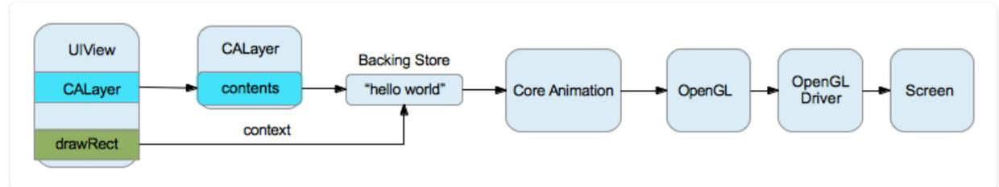
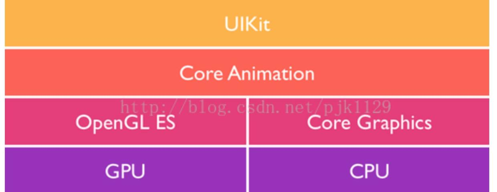
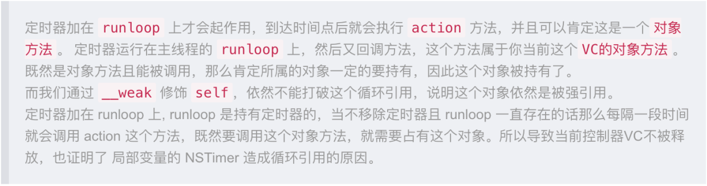
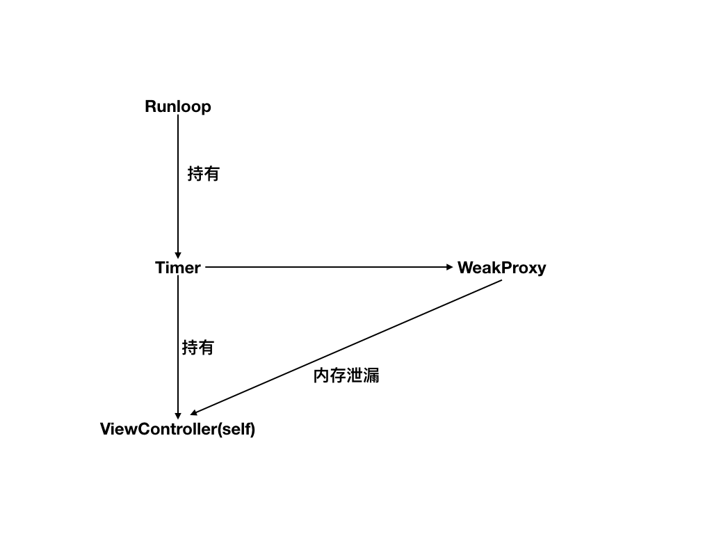
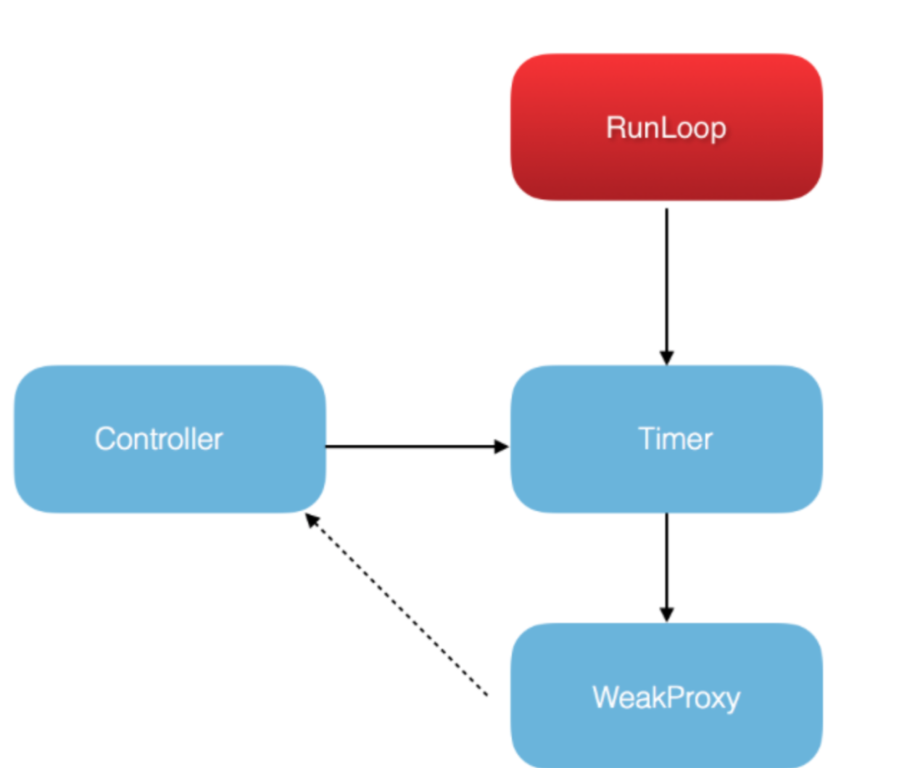

> <h2 id=''></h2>
- [**性能优化概要**](#性能优化概要)
- [**性能优化**](https://www.cnblogs.com/guohai-stronger/p/10430106.html)
- [**UI流畅**](#UI流畅)
	- [**界面流畅**](#界面流畅)
		- [绘制渲染流程](#绘制渲染流程)
		- [离屏渲染](#离屏渲染)
	- [**图片加载**](#图片加载)
	- [**图片压缩**](#图片压缩)
	- [**内存图片与显示的图片Size不符**](#内存图片与显示的图片Size不符)
		- [缩放图片Code](#缩放图片Code)
		- [上传图片优化](#上传图片优化)
		- [加载大量图片优化](#加载大量图片优化)
	- [UITableView滑动卡顿](#UITableView滑动卡顿)
	- [网络请求](#网络请求)
	- [减少在UI中对象频繁创建](#减少在UI中对象频繁创建)
- **UI优化资料**
	- [实战UITableview深度优化](http://www.cocoachina.com/ios/20180207/22197.html)
	- 	[性能优化那些事](https://www.cnblogs.com/oc-bowen/p/5999997.html)
	- 	[异步绘制Cell](https://blog.csdn.net/mo_xiao_mo/article/details/52622172)
	- 	[UITableView性能优化](https://www.jianshu.com/p/0014f736b130)
- [**网络优化**](#网络优化)
	- [**压缩HTTP请求体**](#压缩HTTP请求体)
	- **网络资料**
		- [**上传优化**](https://note.youdao.com/ynoteshare1/index.html?id=a6dd4f1ec0789fa563594ce7a7bfc5ac&type=note)
- [**优化角度**](#优化角度)
	- [解码](#解码)
	- [性能优化](#性能优化)
- [**NSTimer内存泄漏**](#NSTimer内存泄漏)
	- 	[视图控制器判断](#视图控制器判断)
	- [	运行时解决](#运行时解决)
	- [	方法重定向解决](#方法重定向解决)
	- [精准计时](#精准计时)
		- [GCD计时](#GCD计时)
	


<br/>

***
<br/>

> <h1 id='性能优化概要'>性能优化概要</h1>

**iOS性能优化，主要围绕以下问题解决的：**
- 内存
	- 内存布局
	- retain
	- weak
- Runloop
	- NSTimer
	- 面试-Runloop
- 界面
	- 内存泄露
	- TableView优化


<br/>

***
<br/>
<br/>

># <h1 id='UI流畅'>[UI流畅](https://blog.ibireme.com/2015/11/12/smooth_user_interfaces_for_ios/)</h1>

<br/>


># <h1 id = "界面流畅">[界面流畅](https://xilankong.github.io/ios性能优化/2017/10/29/iOS如何保持界面流畅.html)</hr>


<br/>

- > <h2 id='绘制渲染流程'>绘制渲染流程</h2>

UIView从Draw到Render的过程有如下几步：

&emsp; 每一个UIView都有一个layer，每一个layer都有个content，这个content指向的是一块缓存，叫做backing store。

&emsp; UIView的绘制和渲染是两个过程，当UIView被绘制时，CPU执行drawRect，通过context将数据写入backing store。

&emsp; 当backing store写完后，通过render server交给GPU去渲染，将backing store中的bitmap数据显示在屏幕上。

&emsp; 下图就是从CPU到GPU的过程：




<br/>

- > <h2 id='离屏渲染'>离屏渲染</h2>

<br/>



iOS中图形绘制框架的大致结构


<br/>

&emsp; UIKit是iOS中用来管理用户图形交互的框架，但是UIKit本身构建在CoreAnimation框架之上，CoreAnimation分成了两部分OpenGL ES和Core Graphics，OpenGL ES是直接调用底层的GPU进行渲染；Core Graphics是一个基于CPU的绘制引擎；

&emsp; 我们平时所说的硬件加速其实都是指OpenGL，Core Animation / UIKit 基于GPU之上对计算机图形合成以及绘制的实现，由于CPU是渲染能力要低于GPU，所以当采用CPU绘制时动画时会有明显的卡顿。

&emsp; 有些绘制会产生离屏渲染，额外增加GPU以及CPU的绘制渲染。

&emsp; GPU屏幕渲染有以下两种方式：

- On-Screen Rendering 当前屏幕渲染，指的是GPU的渲染操作是在当前用于显示的屏幕缓冲区中进行。
- Off-Screen Rendering 离屏渲染，指的是GPU在当前屏幕缓冲区以外新开辟一个缓冲区进行渲染操作。


离屏渲染的代价主要包括两方面内容：

- 创建新的缓冲区
- 上下文的切换，离屏渲染的整个过程，需要多次切换上下文环境：先是从当前屏幕（On-Screen）切换到离屏（Off-Screen）；等到离屏渲染结束以后，将离屏缓冲区的渲染结果显示到屏幕上有需要将上下文环境从离屏切换到当前屏幕。而上下文环境的切换是要付出很大代价的。


为什么需要离屏渲染？

&emsp; 目的在于当使用圆角，阴影，遮罩的时候，图层属性的混合体被指定为在未预合成之前不能直接在屏幕中绘制，即当主屏的还没有绘制好的时候，所以就需要屏幕外渲染，最后当主屏已经绘制完成的时候，再将离屏的内容转移至主屏上。


离屏渲染的触发方式：

- shouldRasterize（光栅化）
- masks（遮罩）
- shadows（阴影）
- edge antialiasing（抗锯齿）
- group opacity（不透明）


CPU渲染:

&emsp; 以上所说的都是离屏渲染发生在OpenGL SE也就是GPU中，但是CPU也会发生特殊的渲染，我们的CPU渲染，也就是我们使用Core Graphics的时候，但是要注意的一点的是只有在我们重写了drawRect方法，并且使用任何Core Graphics的技术进行了绘制操作，就涉及到了CPU渲染。整个渲染过程由CPU在App内 同步地 完成，渲染得到的bitmap最后再交由GPU用于显示。理论上CPU渲染应该不算是标准意义上的离屏渲染，但是由于CPU自身做渲染的性能也不好，所以这种方式也是需要尽量避免的。

&emsp; 所以对于当屏渲染，离屏渲染和CPU渲染的来说，当屏渲染永远是最好的选择，但是考虑到GPU的浮点运算能力要比CPU强，但是由于离屏渲染需要重新开辟缓冲区以及屏幕的上下文切换，所以在离屏渲染和CPU渲染的性能比较上需要根据实际情况作出选择。


<br/>
<br/>
<br/>


> <h2 id='图片加载'>图片加载</h2>
图片的显示分为三步：加载、解码、渲染。
通常，我们操作的只有加载，解码和渲染是由UIKit进行。


<br/>
<br/>
<br/>


> <h2 id='图片压缩'>图片压缩</h2>

&emsp;   对于大量上传的图片，我们需要对其进行优化，对一些大图片进行压缩后再进行上传

[不失真的图片压缩](https://www.jianshu.com/p/76f7eb00ef13)

[图片加载和处理](https://www.jianshu.com/p/7d8a82115060)


<br/>
<br/>
<br/>


> <h2 id='内存图片与显示的图片Size不符'>内存图片与显示的图片Size不符</h2>

&emsp;  假如内存里有一张400x400的图片，要放到100x100的`UIImageView`里，如果不做任何处理，直接丢进去，问题就大了。
&emsp;  这意味着，GPU需要对大图进行缩放到小的区域显示，需要做像素点的sampling，这种smapling的代价很高，又需要兼顾pixel alignment。计算量会飙升。
OpenGL ES是直接调用底层的GPU进行渲染；Core Graphics是一个基于CPU的绘制引擎；


- <h2 id='缩放图片Code'>缩放图片Code</h2>

```
//重新绘制图片
//按照imageWidth, imageHeight指定宽高开始绘制图片
UIGraphicsBeginImageContext(CGSizeMake(imageWidth, imageHeight));
//把image原图绘制成指定宽高
[image drawInRect:CGRectMake(0,0,imageWidth,  imageHeight)];
//从绘制中获取指定宽高的图片
UIImage* newImage = UIGraphicsGetImageFromCurrentImageContext();
//结束绘制
UIGraphicsEndImageContext();
```
&emsp;  RunLoop开始，RunLoop是一个60fps的回调，也就是说每16.7ms绘制一次屏幕，也就是我们需要在这个时间内完成view的缓冲区创建，view内容的绘制这些是CPU的工作；然后把缓冲区交给GPU渲染，这里包括了多个View的拼接(Compositing),纹理的渲染(Texture)等等，最后Display到屏幕上。但是如果你在16.7ms内做的事情太多，导致CPU，GPU无法在指定时间内完成指定的工作，那么就会出现卡顿现象，也就是丢帧。


<br/>
<br/>

> <h2 id='上传图片优化'>上传图片优化</h2>


<br/>
<br/>

> <h2 id='加载大量图片优化'>加载大量图片优化</h2>


```
#import "HGWeiBoController.h"

@interface HGWeiBoController ()<UITableViewDelegate, UITableViewDataSource>
@property(nonatomic, retain) NSArray *wbModels;
@property(nonatomic, retain) NSOperationQueue *queue;

@end
@implementation HGWeiBoController

- (NSOperationQueue *)queue {
    if (!_queue) {
        _queue = [[NSOperationQueue alloc] init];
    }
    return _queue;
}

- (NSArray *)wbModels {
    if (!_wbModels) {
        NSURL *url = [[NSBundle mainBundle] URLForResource:@"apps.plist" withExtension:nil];
        NSArray *array = [NSArray arrayWithContentsOfURL:url];
        //2.遍历数组
        NSMutableArray *arrayM = [NSMutableArray array];
        [array enumerateObjectsUsingBlock: ^(id obj, NSUInteger idx, BOOL *stop) {
            //数组中存放的是字典, 转换为app对象后再添加到数组
            [arrayM addObject:[MicroblogModel appWithDict:obj]];
        }];
        _wbModels = [arrayM copy];
    }
    return _wbModels;
}

#pragma mark -- UITableViewDataSource
- (UITableViewCell *)tableView:(UITableView *)tableView cellForRowAtIndexPath:(NSIndexPath *)indexPath {
    static NSString *cellID = @"Cell";
    UITableViewCell *cell = [tableView dequeueReusableCellWithIdentifier:cellID];
    if (!cell) {
        cell = [[UITableViewCell alloc] initWithStyle:UITableViewCellStyleDefault reuseIdentifier:cellID];
        cell.selectionStyle = UITableViewCellSelectionStyleNone;
    }
    
    MicroblogModel *mm = self.wbModels[indexPath.row];
    cell.textLabel.text = mm.name;  //设置文字
    
    //设置图像: 模型中图像为nil时用默认图像,并下载图像. 否则用模型中的内存缓存图像.
    if (!mm.image) {
        cell.imageView.image = [UIImage imageNamed:@"user_default"];
        
        [self downloadImg:indexPath];
    }
    else {
        //直接用模型中的内存缓存
        cell.imageView.image = mm.image;
    }

    return cell;
}


//始终记住, 通过模型来修改显示. 而不要试图直接修改显示
- (void)downloadImg:(NSIndexPath *)indexPath {
    MicroblogModel *mm  = self.wbModels[indexPath.row]; //取得改行对应的模型
    
    [self.queue addOperationWithBlock: ^{
        NSData *imgData = [NSData dataWithContentsOfURL:[NSURL URLWithString:mm.icon]]; //得到图像数据
        UIImage *image = [UIImage imageWithData:imgData];
        
        //在主线程中更新UI
        [[NSOperationQueue mainQueue] addOperationWithBlock: ^{
            //通过修改模型, 来修改数据
            mm.image = image;
            //刷新指定表格行
            [self.tableView reloadRowsAtIndexPaths:@[indexPath] withRowAnimation:UITableViewRowAnimationNone];
        }];
    }];
}


- (NSInteger)numberOfSectionsInTableView:(UITableView *)tableView {
    return 1;
}

- (NSInteger)tableView:(UITableView *)tableView numberOfRowsInSection:(NSInteger)section {
    return self.wbModels.count;
}

@end

```


<br/>
<br/>


> <h1 id='UITableView滑动卡顿'>UITableView滑动卡顿</h1>


①大量加载图片，没有进行缓存和异步绘制；

②使用大量Autolayout以及frame和bounds计算(可以计算后放在Modle中)


<br/>

***
<br/>


> <h1 id='网络请求'>网络请求</h1>


对于一些网络请求放在后台，做法是把耗时的请求操作放入后台线程，用GCD、NSOperation开启新线程；

<br/>

***
<br/>


> <h2 id='减少在UI中对象频繁创建'>减少在UI中对象频繁创建</h2>


如在朋友圈中的cell，在进行UI操作时才把时间戳转化为一定的时间格式，这个可以在model的set方法进行转化；


<br/>

***
<br/>

> <h1 id='网络优化'>网络优化</h1>


<br/>
<br/>

> <h2 id='压缩HTTP请求体'>压缩HTTP请求体</h2>


[使用 zlib 库实现 HTTP 请求数据压缩](https://www.jianshu.com/p/dc76bcfef553)
如何压缩？有什么好处？服务端如何解压缩？
函数：`deflateInit2`

<br/>

降低请求延迟，使用HTTP管道重用现有TCP连接，使HTTP客户端能够在对第一个请求的响应返回前在相同的TCP Socket 上发送第二个请求。

```
NSMutableURLRequest *request =[ [NSMutableURLRequest alloc] initWithURL: url];

[request setHTTPShouldUsePipelining: YES];`
```

这个在现在的Session如何做，


避免网络请求：是要求检查返回数据是否是新的，若是新的返回新数据，若不是没有修改的数据返回 304 响应。

提供了多个控制响应缓存的方式：

```
NSURLRequestUseProtocolCachePolicy

NSURLRequestReloadIgnoringLocalCacheData

```


<br/>
<br/>

> <h2 id='上传优化'>上传优化</h2>


[加载高清大图](https://juejin.cn/post/6844903540578582536#heading-9)


<br/>

***
<br/>

> <h1 id='优化角度'>优化角度</h1>


- <h2 id='解码'>**解码**</h2>
	- CPU 把就算好的内容提交给GPU;
	- GPU 进行变换、合成、渲染；

<br/>
<br/>

- <h2 id='性能优化'>性能优化：</h2>
	-  透明度：消耗CPU，若有透明度，CPU需要计算；
	-  圆角、阴影离屏渲染会消耗CPU，这是因为有太多的layer导致不停地切换上下文消耗时间、性能；
	-  重绘；
	-  图片解压：无论是从磁盘加载还是从网络下载的图片都是没经过解压，在渲染的时候解压，在主线程解压；


自动打包的时候使用shell脚本。


<br/>

***
<br/>


> <h1 id='NSTimer内存泄漏'>NSTimer内存泄漏</h1>

[**循环引用**](https://www.cnblogs.com/guohai-stronger/p/9011806.html)

[防止循环引用](https://www.jianshu.com/p/d154791da395)

```
__weak typeof(self) weakSelf = self;
_timer = [NSTimer scheduledTimerWithTimeInterval:1.0f target:self selector:@selector(fire) userInfo:nil repeats:YES];
```
上面的代码依然不可以解决循环引用。`__weak typeof(self) weakSelf = self;`这个weakSelf指向的地址就是当前self指向的地址；如果再使用`strong--->weakSelf`，也会使self连带指针retain（加1）操作，没有办法避免当前VC引用计数加1。如下图：




- **`NSTimer循环引用解决，目前有以下几种:`**
	- 类方法
	- GCD方法
	- weakProxy


<br/>
<br/>


># <h2 id='视图控制器判断'>**视图控制器判断**</h2>

DEMO:
viewController -----Push------>LeakedViewController


**`LeakedViewController.m`**

```
- (void)dealloc {
    NSLog(@"GBuildFamilyController 调用dealloc 方法");
}


- (void)viewDidLoad {
    [super viewDidLoad];
    
    //会造成内存泄漏，因为这个NSTimer在主线程中运行，它强引用了self，只要它运行主控制器就不会释放掉，造成了内存的泄漏。
    //用weak也不行，因为在他的内部使用了strong强引用
    self.timer = [NSTimer timerWithTimeInterval:1.0f target:self selector:@selector(fire) userInfo:nil repeats:YES];
    [[NSRunLoop currentRunLoop] addTimer:self.timer forMode:NSDefaultRunLoopMode];
}

- (void)fire {
    NSLog(@"fire 调用了");
}


//当向父VC添加子VC之后，该方法不会被自动调用，需要显示调用告诉编译器已经完成添加（事实上不调用该方法也不会有问题，不太明白）;
//从父VC移除子VC之后，该方法会自动调用，传入的参数为nil,所以不需要显示调用。
- (void)didMoveToParentViewController:(UIViewController *)parent {
    if (parent == nil) {
        [self.timer invalidate];
        self.timer = nil;
    }
}

//可以解决内存泄漏问题，调用dealloc析构方法

```

输出：

```
2019-06-08 23:54:20.937609+0800 Genealogy[7703:553726] fire 调用了
2019-06-08 23:54:21.938562+0800 Genealogy[7703:553726] fire 调用了
2019-06-08 23:54:22.179312+0800 Genealogy[7703:553726] LeakedViewController 调用dealloc 方法
```


<br/>
<br/>

># <h2 id='运行时解决'>**运行时解决**</h2>


```
- (void)viewDidLoad {
    [super viewDidLoad];
    
    //不让当前timer强制引用当前的vc,self持有_target
    _target = [NSObject new];
    class_addMethod([_target class], @selector(fire), (IMP)fireImp, "v@:");
    
    //self.timer持有了_target,timer没有强引用self
    self.timer = [NSTimer scheduledTimerWithTimeInterval:1.0f target:_target selector:@selector(fire) userInfo:nil repeats:YES];
}

void fireImp(id self, SEL _cmd){
    NSLog(@"fireImp 调用了 fire ");
}

- (void)dealloc {
    NSLog(@"GBuildFamilyController 调用dealloc 方法");


    [self.timer invalidate];
    self.timer = nil;
}

```
输出：

```
2019-06-09 10:58:13.603251+0800 Genealogy[10606:696072] fireImp 调用了 fire 
2019-06-09 10:58:14.603689+0800 Genealogy[10606:696072] fireImp 调用了 fire 
2019-06-09 10:58:14.684340+0800 Genealogy[10606:696072] GBuildFamilyController 调用dealloc 方法
```


<br/>
<br/>

># <h2 id='方法重定向解决'>**方法重定向解决**</h2>


下面我们主要看使用 [NSProxy](https://www.jianshu.com/p/923f119333d8)类来解决：

**`GProxy.h 文件`**

```
#import <Foundation/Foundation.h>

NS_ASSUME_NONNULL_BEGIN

@interface GProxy : NSProxy

@property(nonatomic, weak)id target;

@end

NS_ASSUME_NONNULL_END
```

**`GProxy.m 文件`**

```
#import "GProxy.h"
#import <objc/runtime.h>

@implementation GProxy

//方法签名
- (NSMethodSignature *)methodSignatureForSelector:(SEL)sel {
    return [self.target methodSignatureForSelector:sel];
}

//消息转发
- (void)forwardInvocation:(NSInvocation *)invocation {
    [invocation invokeWithTarget:self.target];
}

@end

```

**`GBuildFamilyController.m 文件`**

```
- (void)dealloc {
    NSLog(@"GBuildFamilyController 调用dealloc 方法");
    
    [self.timer invalidate];
    self.timer = nil;
}


- (void)viewDidLoad {
    [super viewDidLoad];
    
    _gproxy = [GProxy alloc];
    //_gproxy.target弱引用了self,self可以正常走dealloc析构方法
    _gproxy.target = self;
    
    //self.timer强引用了_gproxy.target
    self.timer = [NSTimer scheduledTimerWithTimeInterval:1.0f target:_gproxy.target selector:@selector(fire) userInfo:nil repeats:YES];
}

- (void)fire {
    NSLog(@"fire 调用了");
}
```
输出：

`2019-06-09 13:14:14.188451+0800 Genealogy[11849:767419] fire 调用了`
`2019-06-09 13:14:15.188988+0800 Genealogy[11849:767419] fire 调用了`
`2019-06-09 13:14:16.187918+0800 Genealogy[11849:767419] fire 调用了`
`2019-06-09 13:14:17.111693+0800 Genealogy[11849:767419] GBuildFamilyController 调用dealloc 方法`


<br/>




<br/>

使用weakProxy解决循环引用的原因是：

&emsp;  weakProxy是利用runtime消息转发机制来断开NSTimer对象与视图的强引用关系。初始NSTimer时把触发事件的target对象替换成了另一个单独的对象，紧接着对象中NSTimer的SEL方法触发时让这个方法在当前视图中实现。




<br/>
<br/>


> <h2 id='精准计时'>精准计时</h2>

&emsp; **`NSTimer`** 是不准确的，当程序执行的时候，遇到cpu忙碌的时候，NSTimer会被放到一边不执行，就会造成该执行的事件不执行，会造成事件的叠加。

&emsp; 所以说NSTimer通常会用来做一些有一定时间跨度的时间处理。

解决办法：
- 多线程，
- CADdisplay link
- [三种精准计时](https://www.cnblogs.com/XYQ-208910/p/6590829.html)


<br/>
<br/>


> <h3 id='GCD计时'>GCD计时</h3>


&emsp; GCD中的定时器计时更加精准，不受主线程runloop的影响。它会在自己所在的线程中一直执行下去，直到你suspend或者cancel掉它，而且还可以指定handler所执行的线程。GCD定时器简单实用的代码：

```
gcdTimer = DispatchSource.makeTimerSource(queue: DispatchQueue.main)
gcdTimer.schedule(deadline: DispatchTime.now(), repeating: DispatchTimeInterval.seconds(1))
gcdTimer.setEventHandler(handler: {
    print("gcd timer\(Thread.current)")
})
gcdTimer.resume()
```


<br/>

***
<br/>


