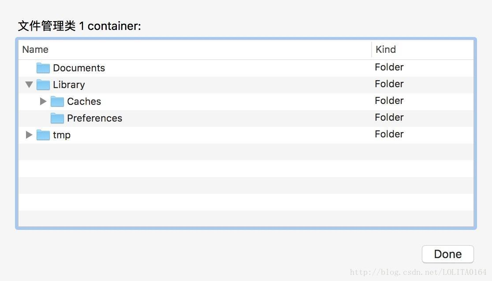
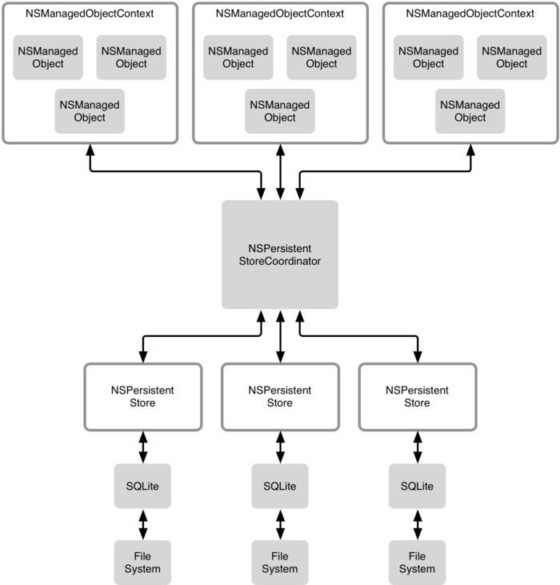
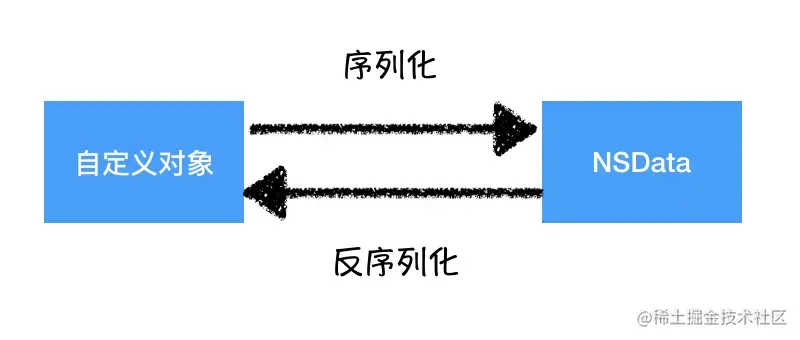

> <h2 id=''></h2>
- [**文件操作**](#文件操作)
	- [沙盒](#沙盒)
- [**CoreData**](#CoreData)
	- [基础使用](#基础使用)
- [**持久化**](#持久化)
	- [序列化和反序列化](#序列化和反序列化)
- **参考资料**
	- [CoreData持久化存储数据至 SQLite](https://www.jianshu.com/p/f4d0f42398df)
	- [添加与查询数据](https://yq.aliyun.com/articles/39426)
	- [CoreData入门](https://www.cnblogs.com/mjios/archive/2013/02/26/2932999.html)


<br/>
<br/>

***
<br/>


> <h1 id='文件操作'>文件操作</h1>

<br/>

> <h2 id='沙盒'>沙盒</h2>

**沙盒机制**

&emsp; 每一个iOS应用程序都会为自己创建一个文件系统目录，这个独立、封闭、安全的空间叫做沙盒。沙盒就是一种安全体系，它规定了应用程序只能在自己的文件系统目录内访问文件，不可以访问其他应用沙盒内的内容。所有的非代码文件都保存在这个地方。

**沙盒根目录结构：Documents、Library、temp**





<br/>

- **Documents**

	- 保存应用运行时生成的需要持久化的数据，iTunes备份和恢复的时候会包括此目录，所以苹果建议将程序中建立的或在程序中浏览到的文件数据保存在该目录下。


<br/>

- **Library**

	- **Caches**：存放缓存文件，iTunes不会备份此目录，此目录下文件不会在应用退出后删除 。一般存放体积比较大，不是特别重要的资源。
	- 	**Preferences**：保存APP的所有偏好设置，iOS的Settings（设置）应用会在该目录中查找应用的设置信息，iTunes会自动备份该目录。注意：通过NSUserDefaults类来读取和设置。

<br/>

- **tmp**
	- 保存应用运行时所需的临时数据，这个可以放一些当APP退出后不再需要的文件。应用没有运行时，系统也有可能会清除该目录下的文件，iTunes不会同步该目录。iPhone重启时，该目录下的文件会被删除。


<br/>
<br/>

***
<br/>


> <h1 id='CoreData'>CoreData</h1>



- **NSManagedObjectContext：** 数据库操作， 管理对象的上下文，类似于应用程序和数据存储间的一块缓冲区，你可以增删改查管理对象。也可以理解为是一个容器，从持久化存储（文件）中查询的数据在这个容器中形成对象图，对这些对象图中的对象操作都会存储在这个容器里，直到发出指令让容器中的内容同步到磁盘。

- **NSManagedObjectContext:** 发起save操作，才会通过NSPersistentStoreCoordinate与数据交互并执行数据库操作，这样避免了因数据操作而带来的I/O操作，提高了效率

- **NSManagedObject：** 表记录，一个管理对象代表你想要保存到数据存储中的一个对象，类似于SQL中的一条记录，并且包含一些对象属性。简单点来说，NSManagedObject 就是NSManagedObjectContext对象图中的实际对象。由NSManagedObjectContext管理。NSManagedObjectContext会存储这些对象的变化来支持重做和撤销。

- **NSPersistentStoreCoordinator：** 数据库存储方式， 持久化存储协调者 ，包含数据存储的名字和位置，简单点来说它是连接两端的纽带。所以整个流程就是：
	- 1、数据（NSManagedObject）被创建修改或删除等等，这些都被context看在眼里，然后你要保存了，context把修改的信息提交给，context根据数据信息找到正确的数据库文件，根据数据模型，正确的把数据写入到数据库文件里。
	- 2、查询时，context把查询条件提交给Coordinator，它去数据库文件里把数据查出来，给context,context再把这些数据和以在它管理内的结合。

- **NSPersistentStore：** 是持久化存储核心数据的抽象类，可以理解为持久化存储区，它的主要责任是把对象图中的信息map到实际的存储信息。持久化存储区支持的数据类型为SQLite、二进制、XML和内存。

<br/>

&emsp; SQLite 和FileSystem就是保存到持久化存储的文件，CoreData支持SQLite的数据格式。但是注意，coreData不是DBMS，并不能管理SQLite 


<br/>

> <h2 id='基础使用'>基础使用</h2>


- **1.创建NSManagedObjectModel**

```
// 加载：Model.xcdatamodeld 文件
lazy var managedObjectModel: NSManagedObjectModel = {

	if self.isTestMode {
	
	    return NSManagedObjectModel.mergedModel(from: Bundle.allBundles)! //连接项目中所有的 .xcdatamodeld 文件为一个datamodel，这是一个非常好的方法，把多个entity放在各自的xcodemodel文件中分开管理，然后用这个函数连接起来生成一个datamodel
	
	}
	
	let modelURL = Bundle.main.url(forResource: "Model", withExtension: "momd")!
	
	return NSManagedObjectModel(contentsOf: modelURL)!

}()
```


<br/>
<br/>


> <h2 id=''></h2>


<br/>
<br/>


> <h2 id=''></h2>


<br/>
<br/>


<br/>
<br/>

***
<br/>


> <h1 id='持久化'>持久化</h1>

- **持久化三个常见方法**
	- plist
	- NSUserDefault
	- 数据库

&emsp; 不管是哪一种方案，都不可能直接存储用户自定义的对象，所以需要将自定义的对象序列化成NSData，才能持久化。

&emsp; 需要用到的时候，就用数据库中取出，然后反序列化，恢复成对象

<br/>

> <h2 id='序列化和反序列化'>序列化和反序列化</h2>

&emsp; 如果自定义对象要想转成NSData，需要服从NSCoding协议。并实现其中的两个方法。



<br/>

&emsp; iOS6中，苹果引入了一个新的协议，是基于NSCoding的，叫做NSSecureCoding。NSSecureCoding和NSCoding是一样的，除了在解码时要同时指定key和要解码的对象的类，如果要求的类和从文件中解码出的对象的类不匹配，NSCoder会抛出异常，告诉你数据已经被篡改了。大部分支持NSCoding的系统对象都已经升级到支持NSSecureCoding。

**DEMO**

**Person.h**

```
@interface Person : NSObject<NSSecureCoding>

@property (nonatomic, copy) NSString *name;

@property (nonatomic, assign) float *numberID;
```

<br/>

**Person.m**

```
@implementation Foo

- (void)encodeWithCoder:(nonnull NSCoder *)aCoder {
    [aCoder encodeObject:self.name forKey:NSStringFromSelector(@selector(name))];
    [aCoder encodeFloat:self.numberID forKey:NSStringFromSelector(@selector(numberID))];
}

- (nullable instancetype)initWithCoder:(nonnull NSCoder *)aDecoder {
    if (self = [super init]) {
        self.name = [aDecoder decodeObjectForKey:NSStringFromSelector(@selector(name))];
        self.numberID = [aDecoder decodeFloatForKey:NSStringFromSelector(@selector(numberID))];
    }    return self;
}

+ (BOOL)supportsSecureCoding
{
    return YES;
}

-(NSString *)description{
    return [NSString stringWithFormat:@"bar:%@ ; baz:%f",self.bar, self.baz];
}

@end

```

<br/>

**使用:**

```
+ (void) testHandelData {
    HGHandleData *handleData = [[HGHandleData alloc] init];
    handleData.name = @"祈求者Kael";
    handleData.numberID = 24;
    
    //获取家目录路径的函数：
    NSString *homeDir = NSHomeDirectory();
    NSString *paths = NSSearchPathForDirectoriesInDomains(NSDocumentDirectory, NSUserDomainMask, YES).firstObject;
    NSString *archievePath = [paths stringByAppendingPathComponent:@"HGHandleData.txt"];
    SLog(@"目录路径:%@ \n archievePath:%@", homeDir, archievePath);
    
    
    
    
    
    //方式一:序列化数据
    NSError *error0;
    NSData *archiverData;
    if (@available(iOS 11.0, *)) {//序列化
        archiverData = [NSKeyedArchiver archivedDataWithRootObject:handleData requiringSecureCoding:YES error:&error0];
        //写入指定路径或者存入NSUserDefaults
        [archiverData writeToFile:archievePath atomically:YES];
        SLog(@"data --- %@", archiverData);
        
    } else {
        archiverData = [NSKeyedArchiver archivedDataWithRootObject:handleData];
    }
    
    NSString *archiverString1 = [archiverData base64EncodedStringWithOptions:0];
    [[NSUserDefaults standardUserDefaults] setObject:archiverString1 forKey:@"cacheData"];
    [[NSUserDefaults standardUserDefaults] synchronize];
    
    
    
    
    //反序列化
    NSString *archiverString = [[NSUserDefaults standardUserDefaults] objectForKey:@"cacheData"];
    NSError *error = nil;
    if (archiverString) {
        @try {
            NSData *archiverData = [NSData dataWithContentsOfFile:archievePath];
            //或者
            //NSData *archiverData = [[NSData alloc] initWithBase64EncodedString:archiverString options:0];
            HGHandleData *handleData = nil;
            if (@available(iOS 11.0, *)) {
                handleData = (HGHandleData*)[NSKeyedUnarchiver unarchivedObjectOfClass:[HGHandleData class] fromData:archiverData error:&error];
                //handleData = [NSKeyedUnarchiver unarchiveTopLevelObjectWithData:archiverData error:&error];
            } else {
                handleData = [NSKeyedUnarchiver unarchiveObjectWithData:archiverData];
            }
        } @catch (NSException *exception) {
            [[NSUserDefaults standardUserDefaults] removeObjectForKey:@"cacheData"];
        }
        SLog(@"反序列化数据:%@ \n error:%@", handleData, error);
        
        
        
        //方式二:序列化数据
        BOOL isSuccess = [NSKeyedArchiver archiveRootObject:handleData toFile:@"/Users/harleyhuang/Desktop/Stu.txt"];
        if(isSuccess) {
            SLog(@"序列化成功");
        }else{
            SLog(@"序列化失败");
        }
        
        
        HGHandleData *handleData1 = [NSKeyedUnarchiver unarchiveObjectWithFile:@"/Users/harleyhuang/Desktop/Stu.txt"];
        SLog(@"handleData1 = %@", handleData1);
        
    }
}

```


打印:

```
🍎 🍎  +[HGHandleData testHandelData][47] 
 目录路径:/Users/harleyhuang/Library/Developer/CoreSimulator/Devices/9272805F-0992-4ED3-9C3B-953A3DC33370/data/Containers/Data/Application/F146CDCF-39B5-440B-94C0-ACB0FB539C16 
 archievePath:/Users/harleyhuang/Library/Developer/CoreSimulator/Devices/9272805F-0992-4ED3-9C3B-953A3DC33370/data/Containers/Data/Application/F146CDCF-39B5-440B-94C0-ACB0FB539C16/Documents/HGHandleData.txt

2022-10-27 14:32:22.403673+0800 MLC[80338:1304890] 🍎 🍎  +[HGHandleData testHandelData][60] 
 data --- {length = 268, bytes = 0x62706c69 73743030 d4010203 04050607 ... 00000000 000000d1 }

2022-10-27 14:32:22.414001+0800 MLC[80338:1304890] [general] *** -[NSKeyedUnarchiver validateAllowedClass:forKey:] allowed unarchiving safe plist type ''NSString' (0x10e0b17f0) [/Applications/Xcode.app/Contents/Developer/Platforms/iPhoneOS.platform/Library/Developer/CoreSimulator/Profiles/Runtimes/iOS.simruntime/Contents/Resources/RuntimeRoot/System/Library/Frameworks/Foundation.framework]' for key 'name', even though it was not explicitly included in the client allowed classes set: '{(
    "'HGHandleData' (0x1028ab3c0) [/Users/harleyhuang/Library/Developer/CoreSimulator/Devices/9272805F-0992-4ED3-9C3B-953A3DC33370/data/Containers/Bundle/Application/4AEE75C1-74F4-4454-91C6-9286E445F552/MLC.app]"
)}'. This will be disallowed in the future.
2022-10-27 14:32:22.414187+0800 MLC[80338:1304890] 🍎 🍎  +[HGHandleData testHandelData][89] 
 反序列化数据:name:祈求者Kael ; NumberID:24.000000 
 error:(null)

2022-10-27 14:32:22.414933+0800 MLC[80338:1304890] 🍎 🍎  +[HGHandleData testHandelData][96] 
 序列化成功

2022-10-27 14:32:22.417283+0800 MLC[80338:1304890] 🍎 🍎  +[HGHandleData testHandelData][103] 
 handleData1 = name:祈求者Kael ; NumberID:24.000000

```

<br/>

```
///测试属性@selector和序列号和反序列化
-(void) testUUIDMethod {
    self.testUUID = [NSUUID UUID].UUIDString;
    
    NSLog(@"🇨🇫 testUUID: %@,  @selector(testUUID): %@", self.testUUID, NSStringFromSelector(@selector(testUUID)));
}
```

打印:

```
2022-09-17 11:39:36.619385+0800 MLC[54350:1043294] 🇨🇫 testUUID: 503BBFA7-CA58-4CC0-BFDE-50F2925F897D,  @selector(testUUID): testUUID
(lldb) po @selector(testUUID)
"testUUID"

(lldb) p @selector(testUUID)
(SEL) $1 = "testUUID"
(lldb) 
```


<br/>
<br/>


<br/>
<br/>

***
<br/>


> <h1 id=''></h1>

<br/>

> <h2 id=''></h2>


<br/>
<br/>


<br/>
<br/>

***
<br/>

> <h1 id=''></h1>

