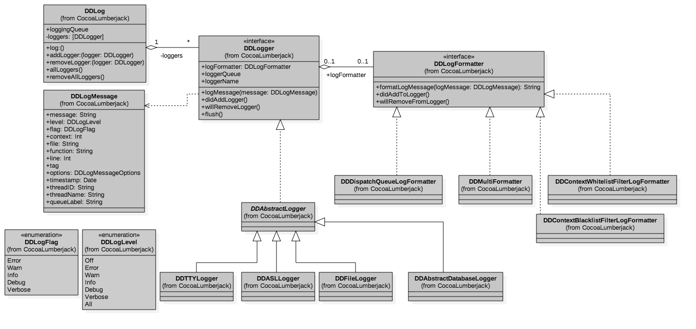

> <h2 id=''></h2>

- [**获取系统日志**](#获取系统日志)
	- [ASL获取系统日志](#ASL获取系统日志)
	- [captureAslLogs处理ASL日志](#captureAslLogs处理ASL日志)
- [**获取CocoaLumberjack日志**](#获取CocoaLumberjack日志)


<br/>
<br/>
<br/>

***
<br/>

> <h1 id='获取系统日志'>获取系统日志</h1>

&emsp； NSLog 其实就是一个 C 函数，它的作用是，输出信息到标准的 Error 控制台和系统日志（syslog）中。在内部实现上，它其实使用的是 ASL（Apple System Logger，是苹果公司自己实现的一套输出日志的接口）的 API，将日志消息直接存储在磁盘上。

<br/>

> <h2 id='#ASL获取系统日志'>ASL获取系统日志</h2>

ASL 会提供接口去查找所有的日志，通过 [**CocoaLumberjack**](https://github.com/CocoaLumberjack/CocoaLumberjack) 这个第三方日志库里的 DDASLLogCapture 这个类，我们可以找到实时捕获 NSLog 的方法。DDASLLogCapture 会在 start 方法里开启一个异步全局队列去捕获 ASL 存储的日志。start 方法的代码如下：

```
+ (void)start {
    ...
    dispatch_async(dispatch_get_global_queue(DISPATCH_QUEUE_PRIORITY_DEFAULT, 0), ^(void) {
        [self captureAslLogs];
    });
}
```

&emsp; 可以看出，捕获 ASL 存储日志的主要处理都在 captureAslLogs 方法里。在日志被保存到 ASL 的数据库时，syslogd（系统里用于接收分发日志消息的日志守护进程） 会发出一条通知。因为发过来的这一条通知可能会有多条日志，所以还需要先做些合并的工作，将多条日志进行合并。具体的实现，你可以查看 captureAslLogs 方法的实现，关键代码如下：

```
+ (void)captureAslLogs {
    @autoreleasepool {
        ...
        notify_register_dispatch(kNotifyASLDBUpdate, &notifyToken, dispatch_get_global_queue(DISPATCH_QUEUE_PRIORITY_HIGH, 0),^(int token) {
            @autoreleasepool {
                ...
                // 利用进程标识兼容在模拟器情况时其他进程日志无效通知
                [self configureAslQuery:query];
                // 迭代处理所有新日志
                aslmsg msg;
                aslresponse response = asl_search(NULL, query);
                while ((msg = asl_next(response))) {
                    // 记录日志
                    [self aslMessageReceived:msg];
                    lastSeenID = (unsigned long long)atoll(asl_get(msg, ASL_KEY_MSG_ID));
                }
                asl_release(response);
                asl_free(query);
                if (_cancel) {
                    notify_cancel(token);
                    return;
                }
            }
        });
```

&emsp; 在上面这段代码中，notify_register_dispatch 的作用是用来注册进程间的系统通知。其中，kNotifyASLDBUpdate 宏表示的就是，日志被保存到 ASL 数据库时发出的跨进程通知，其键值是 com.apple.system.logger.message。

&emsp; 既然是跨进程通知，那么多个 App 之间也是可以进行通知的。不过对于 iPhone 来说，多个 App 同时保活的机会太少，所以一般都是接收系统功能发出的通知。

&emsp; 在 iOS 系统中，类似地把日志保存到 ASL 数据库时发出的通知还有很多种，比如键值是 com.apple.system.lowdiskspace 的 kNotifyVFSLowDiskSpace 宏，该通知是在系统磁盘空间不足时发出的。当捕获到这个通知时，你可以去清理缓存空间，避免发生缓存写入磁盘失败的情况。


更多的跨进程通知宏，你可以在 notify_keys.h 里看到，终端查看命令如下：

```
cat /usr/include/notify_keys.h
```


<br/>
<br/>

> <h2 id='captureAslLogs处理ASL日志'>captureAslLogs处理ASL日志</h2>

&emsp; 在 captureAslLogs 方法里，处理日志的方法是 aslMessageReceived，入参是 aslmsg 类型，由于 aslmsg 类型不是字符串类型，无法直接查看。所以在 aslMessageReceived 方法的开始阶段，会使用 asl_get 方法将其转换为 char 字符串类型。类型转换代码如下：

```
const char* messageCString = asl_get( msg, ASL_KEY_MSG );
```

&emsp; 接下来，char 字符串会被转换成 NSString 类型，NSString 是 Objective-C 里字符串类型，转成 NSString 更容易在 Objective-C 里使用。

```
NSString *message = @(messageCString);
```

&emsp; 因为 CocoaLumberjack 的日志最后都是通过 DDLog:log:message: 方法进行记录的，其中 message 参数的类型是 DDLogMessage，所以 NSString 类型还需要转换成 DDLogMessage 类型。


&emsp; 因为 DDLogMessage 类型包含了日志级别，所以转换类型后还需要设置日志的级别。CocoaLumberjack 这个第三方日志库，将捕获到的 NSLog 日志的级别设置为了 Verbose。那为什么要这么设置呢？


<br/>

CocoaLumberjack 的日志级别，包括两类：
- 第一类是 Verbose 和 Debug ，属于调试级；
- 第二类是 Info、Warn、Error ，属于正式级，适用于记录更重要的信息，是需要持久化存储的。特别是，Error 可以理解为严重级别最高。


&emsp; 将日志级别定义为 Verbose，也只是基于 CocoaLumberjack 对 NSLog 日志的理解。其实，NSLog 是被苹果公司专门定义为记录错误信息的.

<br/>


&emsp; 据我观察，现在有很多开发者都用 NSLog 来调试。但是我觉得，**一般的程序调试，用断点就好了，我不推荐你把 NSLog 作为一种调试手段**。因为，使用 NSLog 调试，会发生 IO 磁盘操作，当频繁使用 NSLog 时，性能就会变得不好。另外，各团队都使用 NSLog 来调试的话很容易就会刷屏，这样你也没有办法在控制台上快速、准确地找到你自己的调试信息。


&emsp; 而如果你需要汇总一段时间的调试日志的话，自己把这些日志写到一个文件里就好了。这样的话，你随便想要怎么看都行，也不会参杂其他人打的日志。


<br/>


&emsp; 所以说 ，CocoaLumberjack 将 NSLog 设置为 Verbose ，在我看来 CocoaLumberjack 对 NSLog 的理解也不够准确。说完如何创建一个 DDLogMessage，接下来我们再看看如何**通过 DDLog 使用 DDLogMessage 作为参数添加一条 ASL 日志。**下面是 DDLog 记录 ASL 日志相关的代码：

```
DDLogMessage *logMessage = [[DDLogMessage alloc] initWithMessage:message level:_captureLevel flag:flag context:0 file:@"DDASLLogCapture" function:nil line:0 tag:nil option:0 timestamp:timeStamp];
[DDLog log:async message:logMessage]

```

&emsp; 到这里，通过 ASL 获取 NSLog 日志的过程你就应该很清楚了。你可以直接使用 CocoaLumberjack 这个库通过 [DDASLLogCapture start] 捕获所有 NSLog 的日志。

你现在已经清楚了 CocoaLumberjack 的捕获原理和方法，如果不想引入这个第三方库的话，也可以按照它的思路写个简化版的工具出来，只要这个工具能够把日志记录下来，并且能够在出现问题的时候，把日志上传到服务器，方便我们进行问题的追踪和定位即可。


为了使日志更高效，更有组织，在 iOS 10 之后，使用了新的统一日志系统（Unified Logging System）来记录日志，全面取代 ASL 的方式。

下面看下iOS 10 之后，如何来获取 NSLog 日志。

统一日志系统的方式，是把日志集中存放在内存和数据库里，并提供单一、高效和高性能的接口去获取系统所有级别的消息传递。

macOS 10.12 开始使用了统一日志系统，我们通过控制台应用程序或日志命令行工具，就可以查看到日志消息。


但是，新的统一日志系统没有 ASL 那样的接口可以让我们取出全部日志，所以**为了兼容新的统一日志系统，你就需要对 NSLog 日志的输出进行重定向**


&emsp; 对 NSLog 进行重定向，我们首先想到的就是采用 Hook 的方式。因为 NSLog 本身就是一个 C 函数，而不是 Objective-C 方法，所以我们就可以使用 fishhook 来完成重定向的工作。具体的实现代码如下所示：

```
static void (&orig_nslog)(NSString *format, ...);
void redirect_nslog(NSString *format, ...) {
    // 可以在这里先进行自己的处理
    
    // 继续执行原 NSLog
    va_list va;
    va_start(va, format);
    NSLogv(format, va);
    va_end(va);
}
int main(int argc, const char * argv[]) {
    @autoreleasepool {
        struct rebinding nslog_rebinding = {"NSLog",redirect_nslog,(void*)&orig_nslog};
        NSLog(@"try redirect nslog %@,%d",@"is that ok?");
    }
    return
```

&emsp; 可以看到，我在上面这段代码中，利用了 fishhook 对方法的符号地址进行了重新绑定，从而只要是 NSLog 的调用就都会转向 redirect_nslog 方法调用。

&emsp; 在 redirect_nslog 方法中，你可以先进行自己的处理，比如将日志的输出重新输出到自己的持久化存储系统里，接着调用 NSLog 也会调用的 NSLogv 方法进行原 NSLog 方法的调用。当然了，你也可以使用 fishhook 提供的原方法调用方式 orig_nslog，进行原 NSLog 方法的调用。上面代码里也已经声明了类 orig_nslog，直接调用即可。


&emsp; NSLog 最后写文件时的句柄是 STDERR，我先前跟你说了苹果对于 NSLog 的定义是记录错误的信息，STDERR 的全称是 standard error，系统错误日志都会通过 STDERR 句柄来记录，所以 NSLog 最终将错误日志进行写操作的时候也会使用 STDERR 句柄，而 dup2 函数是专门进行文件重定向的，那么也就有了另一个不使用 fishhook 还可以捕获 NSLog 日志的方法。你可以使用 dup2 重定向 STDERR 句柄，使得重定向的位置可以由你来控制，关键代码如下：

```
int fd = open(path, (O_RDWR | O_CREAT), 0644);
dup2(fd, STDERR_FILENO);
```

其中，path 就是你自定义的重定向输出的文件地址。

&emsp; 这样，我们就能够获取到各个系统版本的 NSLog 了。那么，通过其他方式打的日志，我们怎么才能获取到呢？

&emsp; 现在与日志相关的第三方库里面，使用最多的就是 CocoaLumberjack。而且，其他的很多第三库的思路也和 CocoaLumberjack 类似，都是直接在 CocoaLumberjack 的基础上包装了一层，增加了统一管控力和易用性而已。

&emsp; 接下来，我们就先看看 CocoaLumberjack 的整体架构是怎样的，进而找到获取 CocoaLumberjack 所有日志的方法。


<br/>
<br/>
<br/>

***
<br/>

> <h1 id='获取CocoaLumberjack日志'>获取CocoaLumberjack日志</h1>

&emsp; CocoaLumberjack 主要由 DDLog、DDLoger、DDLogFormatter 和 DDLogMessage 四部分组成，其整体架构如下图所示：



&emsp; 在这其中，DDLog 是个全局的单例类，会保存 DDLogger 协议的 logger；DDLogFormatter 用来格式化日志的格式；DDLogMessage 是对日志消息的一个封装；DDLogger 协议是由 DDAbstractLogger 实现的。logger 都是继承于 DDAbstractLogger：
- 日志输出到控制台是通过 DDTTYLogger 实现的；
- DDASLLogger 就是用来捕获 NSLog 记录到 ASL 数据库的日志；
- DDAbstractDatabaseLogger 是数据库操作的抽象接口；
- DDFileLogger 是用来保存日志到文件的，还提供了返回 CocoaLumberjack 日志保存文件路径的方法，使用方法如下：

```
DDFileLogger *fileLogger = [[DDFileLogger alloc] init];
NSString *logDirectory = [fileLogger.logFileManager logsDirectory];
```

&emsp; 其中，logDirectory 方法可以获取日志文件的目录路径。有了目录以后，我们就可以获取到目录下所有的 CocoaLumberjack 的日志了，也就达到了我们要获取 CocoaLumberjack 所有日志的目的。


> <h2 id=''></h2>


<br/>
<br/>
<br/>

***
<br/>

> <h1 id=''></h1>

> <h2 id=''></h2>


<br/>
<br/>
<br/>

***
<br/>

> <h1 id=''></h1>

> <h2 id=''></h2>


<br/>
<br/>
<br/>

***
<br/>

> <h1 id=''></h1>


> <h2 id=''></h2>


