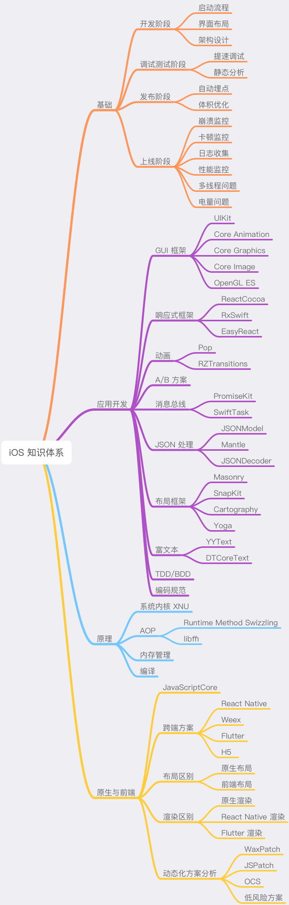

> <h2 id=""></h2>
- [**知识体系**](#知识体系)
- [基础模块](#基础模块)
- [应用开发](#应用开发)
- [原理模块](#原理模块)
- [原生与前端](#原生与前端)

 

***
 

> <h1 id='知识体系'>知识体系</h1>

&emsp; **Awesome系列**，就是专门用来搜集各类资料的，这其中就涉及了 [iOS 开发的各个方面](https://github.com/vsouza/awesome-ios)。

&emsp; 很多 iOS 开发者，刚学会通过网络请求个数据、摆摆界面弄出 App 后，看到人工智能火了就去学一下，区块链火了又去学一下，前端火了又开始蠢蠢欲动。但结果呢？每一门技术都学不深不说，学起来还都非常费劲。

&emsp; 因此最好是不要被新技术牵着鼻子走，而是努力提升自己的内功，这样才能得心应手地应对层出不穷的各种新技术。

&emsp; 举个例子，iOS 动态化和静态分析技术里有大量与编译相关的知识。编译作为计算机学科的基础知识，除了 iOS 开发，在跨端技术 Weex、React Native，甚至前端领域（比如 Babel）都被广泛使用。

&emsp; 但是，这些知识的学习也要有所取舍，毕竟精力有限，而且我们也确实需要一些“立竿见影”的效果来激励自己。那么，我们应该先学习哪些知识，才能快速提高日后学习和工作的效率呢？接下来，我就和你分享一下我脑海中的 iOS 知识体系，帮你梳理出要重点掌握的核心知识脉络。

&emsp; iOS 的知识体系，包括了基础、原理、应用开发、原生与前端四大模块。我认为好的知识体系首先需要能起到指导 iOS 应用的开发和发现并解决开发问题的作用。所以，这四大模块的设置初衷是：
- 基础模块的作用，就是让你具有基本的发现并解决开发问题的能力；
- 应用开发模块，就是用来指导应用开发的；
- 好的知识体系还要能够应对未来变革，也就是需要打好底子掌握原理、理清规律，看清方向。所以，原理模块的作用就是帮你掌握原理和理清规律，而原生与前端模块会助你看清方向。

 

 
 

 

***
 

> <h1 id='基础模块'>基础模块</h1>

- **1.1 开发阶段**
	- 启动流程:启动的快慢，是App的门面,那App的启动做了哪些事? 可以做到哪些优化?
	- 页面布局: 如何提高质量和开发效率?
	- 架构设计:如何设计符合之后的业务、长远发展?

 

- **1.2.调试测试阶段**
	- iOS代码量大后如何提高编译速率?
	- App质量检查,分为人工和自动检查,自动化静态分析代码如何做到?

 

- **1.3.发布阶段**
	- iOS安转包过大,如何优化?
	- 埋点:发布前需要加上各种埋点，这样才能让你充分地掌握 App 运行状态是否健康，同时埋点也是分析上线后遇到的各种问题的重要手段,如何避免埋的到处都是?给维护修改造成困难
	 

- **1.4.上线阶段**
	- 崩溃、卡顿、内存、日志、性能、线程、电量

 

***
 

> <h1 id='应用开发'>应用开发</h1>
&emsp; 在这一阶段需要关注的就是一些经典库，因为这些经典库往往出自技术大拿之手，代码结构和设计思想都非常优秀，同时经过了大规模的实践，不断打磨完善，具有很高的质量保障。比如：**`动画库 Pop，响应式框架 RAC、RxSwift，JSON 处理库 JSONModel、Mantle、布局框架新贵 Cartography 和富文本霸王 YYText 、DTCoreText 等`**。

 

***
 

> <h1 id='原理模块'>原理模块</h1>

&emsp; iOS 开发原理，主要就是系统内核 XNU、AOP、内存管理和编译的知识。这些知识具有很强的通用性，其他任何语言、系统和领域都会涉及到。这个我们想学习的话,可以在Github上下载源码对其进行研究.

 

***
 

> <h1 id='原生与前端'>原生与前端</h1>

&emsp; 从 H5 到 Flutter，渲染底层图形库都使用的是 Skia。也就是说，这么多年来渲染底层技术就基本没有变过。而且，向 Flutter 的演进也只是去掉了 H5 对低版本标准的支持。但，仅仅是去掉这些兼容代码，就使性能提升了数倍。

 

***
 

> <h1 id=''></h1>

 

***
 

> <h1 id=''></h1>

