-  **[OC知识点(II)](./../Swift/OC知识点(II).md)** 
-  [基础算法知识](https://hit-alibaba.github.io/interview/)

<br/>

***
<br/>

> <h2 id=""></h2>
- [**线上面试控制平台**](https://www.showmebug.com/pads)
- **[OC基础](#oc基础)**
	- [UILabel多适应](#UILabel多适应)
	- [不同账号内购后崩溃处理异常](#不同账号内购后崩溃处理异常)
	- [适配器、响应元是什么](#适配器响应元是什么)
	- [热更新](#热更新)
	- [NSString的属性copy和strong区别](#NSString的属性copy和strong区别)
	- [retain和strong区别](#retain和strong区别)
	- [NSCache详解](#NSCache详解)
	- [load和initialize区别](#load和initialize区别)
	- [为什么说atomic不是安全的](#为什么说atomic不是安全的)
	- [代码管理](#代码管理)
	- [数据本地持久化](#数据本地持久化)
	- [@property声明的NSString（或NSArray，NSDictionary）经常使用copy关键字，为什么？](#使用copy关键字为什么)
	- [nil、Nil、NULL、NSNull区别](#几个空的区别)
- **多线程**
	- [如何用GCD同步若干个异步调用](#如何用GCD同步若干个异步调用)
	- [dispatch_once安全的原因](#dispatch_once安全的原因)
- [**性能优化**](#性能优化)
	- [性能优化总结](#性能优化总结)
	- [循环引用解决](#循环引用解决)
	- [NSTimer循环引用解决](#NSTimer循环引用解决)
	- [NSTimer计时不准确怎么办](#NSTimer计时不准确怎么办)
	- [图片优化](#图片优化)
		 - [图片的处理](#图片的处理)
			 - [图片异步绘制](#图片异步绘制)
			 - [图片格式判断](#图片格式判断) 
			 - [ImageIO图片缩放](#ImageIO图片缩放)
	- [图片上传](#图片上传)
	- [界面保持流畅](#界面保持流畅)
	- [UI卡顿优化](#UI卡顿优化)
	- [UITableView优化](#UITableView优化)
	- [内存优化(微盟、货拉拉问到)](#内存优化)
	- [启动优化(微盟、货拉拉问到)](#启动优化)
	- 	[包体积优化](#包体积优化)
	- [内存暴涨解决](#内存暴涨解决)
	- [文件存储优化](#文件存储优化)
- [**架构与设计模式**](#架构与设计模式)
	- [MVC和MVVM](#MVC和MVVM)
	- [单例类](#单例类)
	- [协议代理](#协议代理)
	- [KVC和KVO](#KVC和KVO)
- [**底层**](#底层)
	- [Runloop](#Runloop)
		- [Runloop底层原理](#Runloop底层原理)
		- [Runloop有几种运行状态](#Runloop有几种运行状态)
		- [RunLoop与自动释放池关系，什么时侯释放](#runloop与自动释放池关系什么时侯释放)
		- [RunLoop原理和与线程的联系](#RunLoop原理和与线程的联系)
	- [自动释放池](#自动释放池)
		- [自动释放池的实现原理](#自动释放池的实现原理)
	- [APP](#APP)
		- [app启动流程(货拉拉、微盟面试问到)](#app启动流程) 
		- [app启动优化](#启动优化)
		- [app生命周期](#app生命周期)
	- [main函数之前会做什么](#main函数之前会做什么)
	- [响应者链](#响应者链)
	- [OC的引用计数是存放](#OC的引用计数是存放)
	- [类库没有导入](#类库没有导入)
	- [类](#类)
		- [load和initialize哪个先调用](#load和initialize哪个先调用)
		- [消息转发](#消息转发)
		- [sel和IMP是什么?二者关系如何](#sel和IMP是什么，二者关系如何)
		- [分类Category](#分类Category)
			- [Asssociate关联的对象在什么时候释放](#Asssociate关联的对象在什么时候释放)
	- [Block深入探究](#Block深入探究)
		- [blokc分类](#blokc分类)
			- [block内如何修改block外部变量](#block内如何修改block外部变量)
		- [block原理](#block原理)
		- [block都会发生循环引用吗](#block都会发生循环引用吗)
			- [系统UIView的动画Block](#系统UIView的动画Block)
			- 	[通知+block](#通知+block)
	- [KVO的原理](#KVO的原理)
	- [APNS底层原理](#APNS底层原理)
	- [NSDictionary、NSArray原理](#NSDictionaryNSArray原理)
	- [self和super实现的原理](#self和super实现的原理)
	- [ARC原理是什么](#ARC原理是什么)
	- [内存管理](#内存管理)
		- [一个objc对象如何进行内存布局?](#一个objc对象如何进行内存布局)
		- [isa指针包含了什么（货拉拉面试）](#isa指针包含了什么)
		- [weak原理（货拉拉）](#weak原理)
		- [内存销毁时间表&步骤](#内存销毁时间表&步骤)
		- [Category属性放在哪(货拉拉)](#Category属性放在哪)
		- [能否向编译后得到的类中增加实例变量？能否向运行时创建的类中添加实例变量?](#能否向编译后得到的类中增加实例变量？能否向运行时创建的类中添加实例变量?)
		- [objc使用什么机制管理对象内存](#objc使用什么机制管理对象内存)
- [**网络**](#网络)
	- [NSURLSession与RunLoop的联系](#NSURLSession与RunLoop的联系)
	- [网络性能优化](#网络性能优化)
	- [TCP和UDP区别](#TCP和UDP区别)
	- [Socket通信](#Socket通信)
		- [Socket封包、拆包](#Socket封包拆包)
- [**类库** ](#类库)
	- [FishHook](#fishhook) 
	- [SDWebImage](#SDWebImage)
	- [AFNetworking](#AFNetworking)
	- [静态库和动态库](#静态库和动态库)
		- [库引用错误解析](#库引用错误解析)
- **资料**
	- [**Quesion(I)**](https://rencheng.cc/2020/04/30/ios/general/iOS高级面试题/) 
	- [靠谱iOS](https://github.com/ChenYilong/iOSInterviewQuestions)
	- [求职寒冬:技巧](https://juejin.cn/post/7164222659528491022)
	- [2021 面试心得](https://mp.weixin.qq.com/s/v-kAFWXW3lQSPy3QWsO62g)


<br/>

***
<br/>

># <h1 id="OC基础">[OC基础](https://my.oschina.net/antsky/blog/1475173)</h1>

<br/>

> <h2 id="UILabel多适应">UILabel多适应?</h2>

Label自适应宽度

```
+ (float)widthAuto:(NSString *)content fontSize:(CGFloat)fontSize contentheight:(CGFloat)height{

	// 列寬
	//CGFloat contentHeight = height;
	
	// 用何種字體進行顯示
	UIFont *font = [UIFont systemFontOfSize:fontSize];
	
	// 計算出顯示完內容需要的最小尺寸
	CGSize size = CGSizeMake(100, 100);
	
	// 計算出顯示完內容需要的最小尺寸
	NSDictionary * tdic = [NSDictionary dictionaryWithObjectsAndKeys:font,NSFontAttributeName,nil];
	
	//ios7方法，获取文本需要的size，限制宽度
	CGSize  actualsize =[content boundingRectWithSize:size options:NSStringDrawingUsesLineFragmentOrigin |NSStringDrawingUsesFontLeading attributes:tdic context:nil].size;
	
	return actualsize.width;

}
```


<br/>
<br/>


> <h3 id= "不同账号内购后崩溃处理异常">不同账号内购后崩溃处理异常<h3>
 

IAP支付的过程：

- 调用IAP接口发起支付
- 支付成功，获取App Receipt票据，调用充值接口验证
- 验证通过，给用户充值虚拟货币并回调给 App

&emsp; 这里需要了解一下IAP支付的机制，每次支付行为或每笔交易被认为是一个SKPaymentTransation，只有当SKPaymentTransation被finishTransaction:，这次支付（交易）行为才算是正常结束了。即使这次支付途中被中断，其实也并没有丢失。假设支付没有完成 App 就退出了（比如崩溃），那么当下次 App 重启之后，只要设置了监听addTransactionObserver:，之前被中断的支付就会接着进行。

**掉单**可能会出现在哪些环节：
- 第1步，这个过程中 App 进程因为某种原因被 kill 了，其实支付行为还在系统后台进行着，苹果自己做的，很有可能扣款成功。但是这时候没法为用户充值虚拟货币。
- 第2步，App 端与自己服务器端通信失败；自己服务器端与 AppStore 服务器之间的通信失败。

&emsp; 针对第一种情况，可以在 App 一启动就设置监听，如果有未完成的支付，则会回调`- (void)paymentQueue:(SKPaymentQueue *)queue updatedTransactions:(NSArray *)transactions;`这个方法，在这个方法里调用接口充值。
至于第二种情况，App 端需要做接口重试，设置一个重试的逻辑。

&emsp; 下面来描述一下我的具体做法。

&emsp; 我使用了RMStore，稍作了一些修改。新建一个数据表（字段有：`transactionIdentifier、productIdentifier、uid、transactionDate(支付时间)、rechargeDate(充值到账时间)、state`(「已支付」和「已充值」)），存每一笔交易。

&emsp; 在`- (void)paymentQueue:(SKPaymentQueue *)queue updatedTransactions:(NSArray *)transactions;`这个方法里，首先根据`SKPaymentTransaction的transactionIdentifier`去本地数据表中判断这条交易：

- 如果没有，则在数据表中创建一条交易，状态为「已支付」，接着去调用充值接口；
- 如果有这条交易，并且状态为「已支付」，则不需要创建该条交易，只需要去调用充值接口；
- 如果有这条交易，并且状态为「已充值」（虚拟货币到了用户账上），则不需要创建，也不需要去充值，直接结束交易（finishTransaction:）。

&emsp; 充值接口的设置，App 端需要传这些参数：交易id、商品id、用户uid、票据，该接口在服务器端需要做一些操作：transactionIdentifier需要入库，和App Receipt对应起来，每次访问接口都要先做去重判断，如果是已经验证通过的transactionIdentifier，也返回成功。只要是访问成功，该接口都需要带上transactionIdentifier返回给 App 端，可能不止一个，因为一个App Receipt票据验证成功后返回的交易列表可能有多个

<br/>

**漏单：**

&emsp; 以上流程中可能会出现漏单的情况：当客户端向苹果支付成功后，准备向服务端发起验证，此时若网络发生抖动或者人为退出app等情况，就会出现用户充值成功，但是没加金币的情况。
解决方案：在paymentQueue:updatedTransactions:代理方法中获取到支付成功的回调，此时马上缓存订单信息（`包括支付凭证、订单号、用户id等；担心用户卸载app的，可以直接缓存到钥匙串`），然后再向服务端验证订单。若订单验证成功，则删除该项订单缓存；否则不做处理。另外，每次app启动的时候，可以延时几秒钟，去检测本地是否有未验证成功的苹果订单；如果有，就一个个重新验证。


<br/>


**刷单：**

&emsp; 我们公司的app最早的时候，服务端还是用的Http请求，也没有考虑到刷单这一块，然后被某些用户钻了空子；他们先发起苹果支付，获取一个订单号，然后拿这个订单号和之前支付成功的凭证，向服务端发起验证；然后服务端发现订单号也对得上，凭证也验证有效，就给用户加金币了；用户用同一个凭证不断的换订单号。。。。。

<br/>

**解决方案：**
	- 首先服务端每次生成的订单号都缓存起来，客户端在请求完订单号后，将该订单号记录在内购订单对象里（赋值给SKPayment的applicationUsername属性）；
	- 然后当客户端支付成功后，把订单id和支付凭证传给服务端，服务端先拿凭证去苹果校验，苹果返回的结果中有一个transactionId（跟前面记录的applicationUsername是一致的） ，这时候服务端判断该transactionId和订单id是否一致，若一致，且该订单id是一个新id，之前没有缓存过；才算是完全的校验成功。


<br/>

**订单重复：**

&emsp; 订单重复的情况就是支付成功后，从本地拿到了错误的支付凭证（之前的凭证），去校验的时候，会发现该订单已经完成了。
我这边发现这个问题的情况是这样的：客户端发起苹果支付的时候调用addPayment方法，在paymentQueue:updatedTransactions:回调中获取支付的状态，支付成功、支付失败和重复购买的状态下要结束订单finishTransaction。我当时是支付失败的情况，没有结束订单，然后下次支付成功的时候，获取的支付凭证是上次失败的凭证，然后不仅校验会失败，订单也是重复的。

<br/>

[**内购全面实战**](https://www.jianshu.com/p/2f98b7937b6f)


<br/>

> <h3 id ="适配器响应元是什么">适配器、响应元是什么？</h3>

- **[适配器](https://www.jianshu.com/p/61ade7936c93)**
	- [**适配器Demo**](https://github.com/idage/iOSAdapterDemo)
	- [**适配器模式实战**](https://www.jianshu.com/p/5a45fe49f8b6)


**定义：** 将一个类的接口转换成客户希望的另外一个接口。Adapter模式使得原本由于接口不兼容而不能一起工作的那些类可以在一起工作。

&emsp; 适配器其实就是在视图控制器和子视图之间的一个媒介，这个媒介其实用来解耦两者之间的耦合度的。
当然这个子视图控件是被封装好的一个公有视图类，比如一个特有风格的按钮、tabelViewCell等，虽然这个控件只是一个展示类，并没有什么交互。但是在项目好几个地方都用到了这个控件了，你在给这个视图控件负值的时候是怎么做的呢？

这个时候就需要建立一个适配器了。

适配器使用场景：
- 将一个类的接口转换成客户希望的另外一个接口。Adapter 模式使得原本由于接口不兼容而不能一起工作的那些类可以一起工作；
- 对于一些第三方的统计分析、错误收集等SDK应该都不陌生。就目前而言市面上也有许多相同功能的产品，眼花缭乱，让人无法抉择选哪一款SDK才是最靠谱的；
- 已经存在的类的接口不符合我们的需求；
- 创建一个可以复用的类，使得该类可以与其他不相关的类或不可预见的类（即那些接口可能不一定兼容的类）协同工作；
- 在不对每一个都进行子类化以匹配它们的接口的情况下，使用一些已经存在的子类。

**优点：**解耦合，让视图类不合数据类产生耦合，使视图类更加独立。 新增加数据类的时候不需要修改视图类；
**缺点：**会新增加很多类，使系统更凌乱，代码可读性更弱了。


<br/>

- **响应元**


<br/>
<br/>

>## <h2 id="热更新">[热更新](https://juejin.cn/post/6844904144411574285)</h2>


<br/>
<br/>

> <h2 id="NSString的属性copy和strong区别">NSString的属性copy和strong区别</h2>

```
/ strong  类型  NSString
@property (nonatomic, strong) NSString *strongString;
// copy    类型  NSString
@property (nonatomic, copy)   NSString *copyedString;


/// 测试NSString的copy和strong区别
- (void)testStringPropertyStrongAndCopy {
    NSString *tmpString = @"123456";

    self.strongString = tmpString;
    self.copyedString = tmpString;

    NSLog(@"tmpString: %@, %p", tmpString, tmpString);
    NSLog(@"self.strongString: %@, %p", self.strongString, self.strongString);
    NSLog(@"self.copyedString: %@, %p", self.copyedString, self.copyedString);
    
    tmpString = @"qqqqqq";
    
    NSLog(@"🍎tmpString: %@, %p", tmpString, tmpString);
    NSLog(@"🍎self.strongString: %@, %p", self.strongString, self.strongString);
    NSLog(@"🍎self.copyedString: %@, %p", self.copyedString, self.copyedString);
    
}
```

打印:

```
tmpString: 123456, 0x107b2bff0
self.strongString: 123456, 0x107b2bff0
self.copyedString: 123456, 0x107b2bff0


🍎tmpString: qqqqqq, 0x107b2c070
🍎self.strongString: 123456, 0x107b2bff0
🍎self.copyedString: 123456, 0x107b2bff0
```

&emsp; tmpString修改值后,可以看到其内存地址变了,它只想了另一块内存地址了.所以strongString、copyedString的打印值还是不变.

&emsp;&emsp;  解释:若是确定要给属性NSString赋一个不可变的值时，用strong，其他情况用copy。使用copy来修饰属性，在进行赋值的时候，会先做一个类型判断，如果赋的值是一个不可变的字符串，则走strong的策略，进行的是浅拷贝；如果是可变的字符串，则进行深拷贝创建一个新的对象。所以如果我们确定是给属性赋值一个不可变的值，就不用copy再多去判断一遍类型.

<br/>

&emsp; &emsp; 或者另一种解释: 苹果对NSString的copy做了优化，还是指向同一个内存地址，但是也不会互相影响。因为这里跟上面还是有点差别的，想想看，修改s2的值，不就是直接把s2指向新的地址了吗？是不会影响到s1指向的值的，那何必多占用一个内存呢？

&emsp;&emsp;  我们经常使用对象接收网络数据，通常使用strong，因为不会改变。而如NSCache属性中的name字段，应该使用copy，不然打印出来的名字就有可能非预想值。这是为什么?

解释: `copy 对于 NSString 是拷贝，strong对于NSString是引用，strong引用的NSString 可能会被更改，导致key 被修改，无法取出之前存的value`


<br/>

这里顺便插入一下NSMutableCopying和NSCopying, NSMutableCopying和NSCopying是同一个原理，在调用mutableCopy的时候会走到这个方法来索取一个新对象。至于他们两个的区别主要是用来区分浅拷贝和深拷贝。

- **浅拷贝:只复制对象本身,对象里的属性,包含的对象不做拷贝;**
- **深拷贝:即复制对象本身,对象里的包含对象,属性也都复制.**

<br/>

即你需要像下面这样实现这两个方法:

```
-(id)copyWithZone:(NSZone *)zone  
{  
    //浅拷贝的实现  
    Person *person = [[[self class] allocWithZone:zone] init];  
    person.username = _username;
}


-(id)mutableCopyWithZone:(NSZone *)zone  
{  
    //深拷贝的实现  
    Person *person = [[[self class] allocWithZone:zone] init];  
    person.username = [_username copy];
}
```


类似的[NSArray和NSMutableArray](https://github.com/harleyGit/StudyNotes/blob/master/iOS/Objective-C/NSArray.md#%E6%B5%85%E6%8B%B7%E8%B4%9D%E5%92%8C%E6%B7%B1%E6%8B%B7%E8%B4%9D)和这个差不多.

<br/>
<br/>


> <h2 id="retain和strong区别">retain和strong区别</h2>

- **retain和strong都是强引用**，除了某些情况下不一样，比如修饰block，其他的时候也是可以通用的。
	- [不同点](https://www.jianshu.com/p/19a7c049ab3d)：引入external(外部)变量时，retain和strong（copy）是有区别的，
		- 在MRC(手动管理引用计数)时，block存在栈区（stack）的，因此使用的时候要注意此时的block是否还存在，以免操作了野指针而闪退。
		- 在ARC(自动引用计数)时，block是存在堆区（heap）的。
		- block的修饰符可以用storng、copy、retain进行修饰，但是要注意在MRC环境不要用retain


<br/>
<br/>


> <h2 id='NSCache详解'>NSCache详解</h2>


<br/>
<br/>


> <h2 id="load和initialize区别">load和initialize区别</h2>

- **调用顺序**
	- 以main为分界，load方法在main函数之前执行，initialize在main函数之后执行

- **相同点**
	- load和initialize会被自动调用，不能手动调用它们。
	- 子类实现了load和initialize的话，会隐式调用父类的load和initialize方法
	- load和initialize方法内部使用了锁，因此它们是线程安全的。
	
- **不同点**
	- 子类中没有实现load方法的话，会调用父类的load方法(**亲自写代码证实了**)；而子类如果没有实现initialize方法的话，也会自动调用父类的initialize方法。
	- 当类被引用进项目的时候就会执行load函数(在main函数开始执行之前）,与这个类是否被用到无关,每个类的load函数只会自动调用一次.由于load函数是系统自动加载的，因此不需要调用父类的load函数，否则父类的load函数会多次执行。
	- initialize在第一次给某个类发送消息时调用（比如实例化一个对象），并且只会调用一次，是懒加载模式，如果这个类一直没有使用，就不回调用到initialize方法。


<br/>

**load**

&emsp; 提问：当有FatherClass、FatherClass (fatherCategory)、SubClass、SubClass (subCategory)四个类，当它们都实现了load方法时，它们的调用顺序是怎么样的(得物(毒)面试提问)？

自己实际操作了一下，当我们在load方法中，加入了这段代码`[super load]`会出现下面的打印，调用顺序如下：

```
2021-05-19 12:21:01.565405+0800 OCTest[5522:237002] FatherClass 的 load 方法调用了
2021-05-19 12:21:01.565927+0800 OCTest[5522:237002] -----》FatherClass Category的 load 方法调用了
2021-05-19 12:21:01.566003+0800 OCTest[5522:237002] SubClass 的 load 方法调用了
2021-05-19 12:21:01.566087+0800 OCTest[5522:237002] -----》FatherClass Category的 load 方法调用了
2021-05-19 12:21:01.566152+0800 OCTest[5522:237002] ++++++ >>> SubClass Category 的 load 方法调用了
2021-05-19 12:21:01.566205+0800 OCTest[5522:237002] -----》FatherClass Category的 load 方法调用了

```


当我们在load方法中去除`[super load]`方法时是以下打印：

```
2021-05-19 12:53:11.038671+0800 OCTest[6107:261238] FatherClass 的 load 方法调用了
2021-05-19 12:53:11.039148+0800 OCTest[6107:261238] SubClass 的 load 方法调用了
2021-05-19 12:53:11.039231+0800 OCTest[6107:261238] ++++++ >>> SubClass Category 的 load 方法调用了
2021-05-19 12:53:11.039354+0800 OCTest[6107:261238] -----》FatherClass Category的 load 方法调用了

```

&emsp; 这才是正确的调用顺序，先**调用父类load方法->子类load方法->子类类别load方法->父类类别方法**。


<br/>


**initialize:**

- **描述：**
	- 在这个类接收第一条消息之前调用,是系统调用不需要调用 **[super initialize]**，否则父类的initialize会被多次执行 。
	- Runtime在一个程序中每一个类的一个程序中发送一个初始化一次，或是从它继承的任何类中，都是在程序中发送第一条消息。（因此，当该类不使用时，该方法可能永远不会被调用。）运行时发送一个线程安全的方式初始化消息。父类的调用一定在子类之前。

- **调用特点**
	- 父类的initialize方法会比子类先执行；
	- 当子类未实现initialize方法时,会调用父类initialize方法;
	- 当子类实现initialize方法时,父类、子类的initialize方法都会执行，但是父类先执行;

	```
	2021-05-19 19:36:02.439298+0800 OCTest[12800:544647] FatherClass 的 initialize 方法调用了
	2021-05-19 19:36:02.439464+0800 OCTest[12800:544647] SubClass 的 initialize 方法调用了
	```

	- 当有父类、父类Categore、子类、子类Category都实现了initialize时，先调用父类Categore -> 子类Category。也就是有Category的先执行里面的方法。
	- 当有多个Category都实现了initialize方法,会覆盖类中的方法,只执行一个(会执行Compile Sources 列表中最后一个Category 的initialize方法)


<br/>

- **情况下使用:**
	- load
		- 由于调用load方法时的环境很不安全，我们应该尽量减少load方法的逻辑。另一个原因是load方法是线程安全的，它内部使用了锁，所以我们应该避免线程阻塞在load方法中
		- load很常见的一个使用场景,交换两个方法的实现

		```
		//摘自MJRefresh
		+ (void)load
		{
		    [self exchangeInstanceMethod1:@selector(reloadData) method2:@selector(mj_reloadData)];
		    [self exchangeInstanceMethod1:@selector(reloadRowsAtIndexPaths:withRowAnimation:) method2:@selector(mj_reloadRowsAtIndexPaths:withRowAnimation:)];
		    [self exchangeInstanceMethod1:@selector(deleteRowsAtIndexPaths:withRowAnimation:) method2:@selector(mj_deleteRowsAtIndexPaths:withRowAnimation:)];
		    [self exchangeInstanceMethod1:@selector(insertRowsAtIndexPaths:withRowAnimation:) method2:@selector(mj_insertRowsAtIndexPaths:withRowAnimation:)];
		    [self exchangeInstanceMethod1:@selector(reloadSections:withRowAnimation:) method2:@selector(mj_reloadSections:withRowAnimation:)];
		    [self exchangeInstanceMethod1:@selector(deleteSections:withRowAnimation:) method2:@selector(mj_deleteSections:withRowAnimation:)];
		    [self exchangeInstanceMethod1:@selector(insertSections:withRowAnimation:) method2:@selector(mj_insertSections:withRowAnimation:)];
		}
		
		+ (void)exchangeInstanceMethod1:(SEL)method1 method2:(SEL)method2
		{
		    method_exchangeImplementations(class_getInstanceMethod(self, method1), class_getInstanceMethod(self, method2));
		}
		
		
		```
		

<br/>

- **+initialize**
	-  initialize方法主要用来对一些不方便在编译期初始化的对象进行赋值。比如:NSMutableArray这种类型的实例化依赖于runtime的消息发送，所以显然无法在编译器初始化：
		```
			
		// In Person.m
		// int类型可以在编译期赋值
		static int someNumber = 0; 
		static NSMutableArray *someArray;
		+ (void)initialize {
		    if (self == [Person class]) {
		        // 不方便编译期复制的对象在这里赋值
		        someArray = [[NSMutableArray alloc] init];
		    }
		}
		
		```


<br/>
<br/>


> <h2 id="为什么说atomic不是安全的">为什么说atomic不是安全的</h2>

**先说我的结论：** 用atomic修饰后，这个属性的setter、getter方法是线程安全的，但是对于整个对象来说不一定是线程安全的。

1).为什么setter、getter方法是线程安全的？

因为在setter和getter赋值取值的时候添加了自旋锁，不懂看这[《oc中的线程锁》](https://www.jianshu.com/p/36bb249d4512)

```
// getter
id objc_getProperty(id self, SEL _cmd, ptrdiff_t offset, BOOL atomic) {
   // ...
   if (!atomic) return *slot;

   // Atomic retain release world
   spinlock_t& slotlock = PropertyLocks[slot];
   slotlock.lock();
   id value = objc_retain(*slot);
   slotlock.unlock();
   // ...
}

// setter
static inline void reallySetProperty(id self, SEL _cmd, id newValue, ptrdiff_t offset, bool atomic, bool copy, bool mutableCopy)
{
   // ...
   if (!atomic) {
       oldValue = *slot;
       *slot = newValue;
   } else {
       spinlock_t& slotlock = PropertyLocks[slot];
       slotlock.lock();
       oldValue = *slot;
       *slot = newValue;        
       slotlock.unlock();
   }
   // ...
}

```


<br/>

2).为什么说atomic没办法保证整个对象的线程安全，这里主要看一下网上主流的答案？

> 1.对于NSArray类型 @property(atomic)NSArray *array我们用atomic修饰，数组的添加和删除并不是线程安全的，这是因为数组比较特殊，我们要分成两部分考虑，一部分是&array也就是这个数组本身，另一部分是他所指向的内存部分。atomic限制的只是&array部分，对于它指向的对象没有任何限制。
atomic表示，我TM也很冤啊！！！！


> 2.当线程A进行写操作，这时其他线程的读或者写操作会因为该操作而等待。当A线程的写操作结束后，B线程进行写操作，然后当A线程需要读操作时，却获得了在B线程中的值，这就破坏了线程安全，如果有线程C在A线程读操作前release了该属性，那么还会导致程序崩溃。所以仅仅使用atomic并不会使得线程安全，我们还要为线程添加lock来确保线程的安全。
个人觉得这个就有点杠精的意味了，atomic还要管到你方法外面去了？？？？？不过面试人家问你还要这么答，要严谨！！😄哈哈


<br/>
<br/>

> <h2 id="NSArray和NSMutableArray修饰符">NSArray和NSMutableArray修饰符</h2>
[NSArray和NSMutableArray关键字修饰](https://www.jianshu.com/p/0fa2c965af4a)

&emsp; **总结：**当修饰可变类型的属性时，如NSMutableArray、NSMutableDictionary、NSMutableString，用strong。当修饰不可变类型的属性时，如NSArray、NSDictionary、NSString，用copy。


<br/>
<br/>

> <h2 id="代码管理">代码管理</h2>

<br/>

> <h3 id="pod instal和pod update区别">**pod install**和**pod update**区别
</h3>

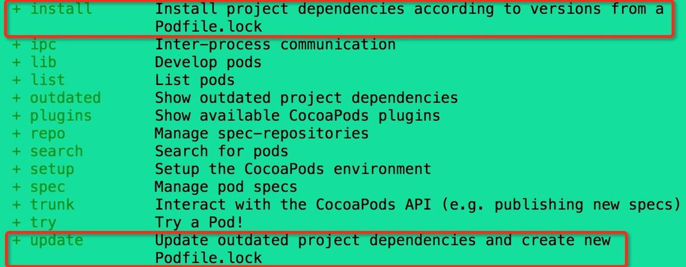

- **pod install:**执行该命令时，如果Podfile.lock文件存在, 则直接从此文件中读取框架信息并且它会只下载Podfile.lock文件中指定的版本安装。对于不在Podfile.lock文件中的pod库，pod install命令会搜索这个pod库在Podfile文件中指定的版本来安装；如果Podfile.lock不存在, 则会读取Podfile文件内的框架信息，然后执行下载并且根据下载好的框架信息, 生成Podfile.lock文件。

- **pod update:**只有当你想要更新pod库的版本时才使用pod update；它不管Podfile.lock是否存在, 都会读取Podfile文件的的框架信息去下载安装，下载好之后, 再根据下载好的框架信息, 生成Podfile.lock文件

当多人合作开发项目时，最开始把项目下载下来时最好都执行**`pod install`**，以后为了保持类库版本一致统一用**`pod update`**命令。


<br/>
<br/>


>## <h2 id = "数据本地持久化">[数据本地持久化](https://www.jianshu.com/p/d1c621631f7e)</h2>

- plist文件（序列化）
	- 可以被序列化的类型

	```
	NSArray;  //数组
	NSMutableArray;  //可变数组
	NSDictionary;  //字典
	NSMutableDictionary;  //可变字典
	NSData;  //二进制数据
	NSMutableData;  //可变二进制数据
	NSString;  //字符串
	NSMutableString;  //可变字符串
	NSNumber;  //基本数据
	NSDate;  //日期
	```
- preference（偏好设置）
	- 使用NSUserDefaults保存程序的配置信息
- NSKeyedArchiver（归档）
	- 要使用归档，其归档对象必须实现NSCoding协议

	```
	NSCoding协议声明的两个方法都必须实现。
	encodeWithCoder：用来说明如何将对象编码到归档中。
	initWithCoder：用来说明如何进行解档来获取一个新对象。
	```

- SQLite3
- FMDB
	- 介绍： FMDB是一种第三方的开源库，FMDB就是对SQLite的API进行了封装，加上了面向对象的思想，让我们不必使用繁琐的C语言API函数，比起直接操作SQLite更加方便。
	- 主要是使用以下三个类：

	```
	FMDatabase ： 一个单一的SQLite数据库，用于执行SQL语句。
	FMResultSet ：执行查询一个FMDatabase结果集。
	FMDatabaseQueue ：在多个线程来执行查询和更新时会使用这个类。
	
	```

- CoreData


<br/>
<br/>

> <h2 id="使用copy关键字为什么">@property声明的NSString（或NSArray，NSDictionary）经常使用copy关键字，为什么？</h2>

- 当修饰可变类型的属性时，如NSMutableArray、NSMutableDictionary、NSMutableString，用strong。当修饰不可变类型的属性时，如NSArray、NSDictionary、NSString，用copy；

- 用 @property 声明 NSString、NSArray、NSDictionary 经常使用 copy 关键字，是因为他们有对应的可变类型：NSMutableString、NSMutableArray、NSMutableDictionary，他们之间可能进行赋值操作，为确保对象中的字符串值不会无意间变动，应该在设置新属性值时拷贝一份。


- [参考](https://github.com/ChenYilong/iOSInterviewQuestions)
- [参考2](https://juejin.cn/post/6844903480017043464#heading-3)
- [copy的使用](https://www.jianshu.com/p/bdc516a514f6)


<br/>
<br/>

> <h2 id="几个空的区别">nil、Nil、NULL、NSNull区别</h2>

- nil：指向一个对象的空指针,对objective c id 对象赋空值.

- Nil：指向一个类的空指针,表示对类进行赋空值.

- NULL：指向其他类型（如：基本类型、C类型）的空指针, 用于对非对象指针赋空值.

- NSNull：在集合对象中，表示空值的对象.


<br/>

1).nil 在指向一个对象的指针为空 定义如下：

```
#ifndef nil
# if __has_feature(cxx_nullptr)
#   define nil nullptr
# else
#   define nil __DARWIN_NULL
# endif
#endif
```
在Objective-C中用于id类型的对象

```
NSString *str = nil;
NSURL    *url  = nil;
id object      = nil;
```

<br/>

2).Nil 指向一个类的指针为空 定义如下：

```

#ifndef Nil
# if __has_feature(cxx_nullptr)
#   define Nil nullptr
# else
#   define Nil __DARWIN_NULL
# endif
#endif
```

在Objective-C中用于Class类型的对象

```
Class Class1 = Nil;
Clsss Class2 = [NSURL class];
```


<br/>

3).NULL 指向C类型的指针为空 在stddef.h中定义如下:

```
#if defined(__need_NULL)
#undef NULL
#ifdef __cplusplus
#  if !defined(__MINGW32__) && !defined(_MSC_VER)
#    define NULL __null
#  else
#    define NULL 0
#  endif
#else
#  define NULL ((void*)0)
#endif
```

用于对非对象指针赋空值简单举例

```
int   *intA    = NULL;
char *charC     = NULL;
struct structStr = NULL; 
```


<br/>

4).NSNull在Objective-C中是一个类.

NSNull有 + (NSNull *)null; 单例方法.

多用于集合(NSArray,NSDictionary)中值为空的对象.

```
NSMutableDictionary *mutableDictionary = [[NSMutableDictionary alloc] init];
[mutableDictionary setObject:nil forKey:@"Key-nil"]; // 会引起Crash
[mutableDictionary setObject:[NSNull null] forKey:@"Key-nil"]; // 不会引起Crash
//所以在使用时，如下方法是比较安全的
[mutableDictionary setObject:(nil == value ? [NSNull null] : value)
                      forKey:@"Key"];
                      
                      
                      
//=======================================

NSArray *array = [NSArray arrayWithObjects:
                      [[NSObject alloc] init],
                      [NSNull null],
                      @"aaa",
                      nil,
                      [[NSObject alloc] init],
                      [[NSObject alloc] init], nil];

NSLog(@"%ld", array.count); // 输出 3，NSArray以nil结尾


//======================================

NSDictionary *dictionary = [[NSDictionary alloc] initWithObjectsAndKeys:
                                @"Object0", @"Key0",
                                @"Object1", @"Key1",
                                nil,        @"Key-nil"
                                @"Object2", @"Key2",
                                nil];
NSLog(@"%@", dictionary); // 输出2个key-value,NSDictionary也是以nil结尾

```


<br/>

***
<br/>


> <h1 id='多线程'>多线程</h1>

<br/>

> <h2 id='如何用GCD同步若干个异步调用'>如何用GCD同步若干个异步调用？</h2>

比如:如根据若干个url异步加载多张图片，然后在都下载完成后合成一张整图

使用Dispatch Group追加block到Global Group Queue,这些block如果全部执行完毕，就会执行Main Dispatch Queue中的结束处理的block。


```
dispatch_queue_t queue = dispatch_get_global_queue(DISPATCH_QUEUE_PRIORITY_DEFAULT, 0);
dispatch_group_t group = dispatch_group_create();
dispatch_group_async(group, queue, ^{ /*加载图片1 */ });
dispatch_group_async(group, queue, ^{ /*加载图片2 */ });
dispatch_group_async(group, queue, ^{ /*加载图片3 */ }); 
dispatch_group_notify(group, dispatch_get_main_queue(), ^{
        // 合并图片
});
```


<br/>
<br/>


># <h2 id='dispatch_once安全的原因'>[dispatch_once安全的原因](./多线程.md#dispatch_once)</h2>


<br/>

***
<br/>
<br/>


># <h1 id = "性能优化"> [性能优化](https://www.jianshu.com/p/3ad7880e3667) </h1>

[包体积优化总览](https://juejin.cn/post/7185079396678991928/)

<br/>

>## <h2 id = "性能优化总结"> [**性能优化总结**](https://juejin.cn/post/6844903590138478600) </h2>


<br/>
<br/>

> <h2 id = "循环引用解决">循环引用解决</h2>

[♻️解决循环引用框架：FBRetainCycleDetector](https://draveness.me/retain-cycle1/)


<br/>
<br/>

> <h3 id = "NSTimer循环引用解决">NSTimer循环引用解决？</h1>

NSTimer循环引用的解决方法，目前有以下几种
- 类方法
- GCD方法
- [weakProxy](https://www.cnblogs.com/guohai-stronger/p/10430106.html)
	- 解决NSTimer循环引用的更佳方案:NSProxy直接消息转发，不会像继承于NSObject的对象去父类里面搜索，降低效率


<br/>


**方法一：** 类方法

```
@interface NSTimer (JQUsingBlock)
+ (NSTimer *)jq_scheduledTimerWithTimeInterval:(NSTimeInterval)ti
                                     block:(void(^)())block
                                   repeats:(BOOL)repeats;
@end

@implementation NSTimer (JQUsingBlock)

+ (NSTimer *)jq_scheduledTimerWithTimeInterval:(NSTimeInterval)ti
                                     block:(void(^)())block
                                   repeats:(BOOL)repeats{

    return [self scheduledTimerWithTimeInterval:ti
                                     target:self
                                   selector:@selector(jq_blockInvoke:)
                                   userInfo:[block copy]
                                    repeats:repeats];
}

+ (void)jq_blockInvoke:(NSTimer *)timer{

    void(^block)() = timer.userInfo;
    if (block) {
        block();
    }
}

@end
```

&emsp; 定义一个NSTimer的类别，在类别中定义一个类方法。类方法有一个类型为块的参数（定义的块位于栈上，为了防止块被释放，需要调用copy方法，将块移到堆上）。使用这个类别的方式如下：

```
__weak ViewController *weakSelf = self;
_timer = [NSTimer jq_scheduledTimerWithTimeInterval:5.0
                                              block:^{
                                                  __strong ViewController *strongSelf = weakSelf;
                                                  [strongSelf startCounting];
                                              }
                                            repeats:YES];

```

&emsp; 使用这种方案就可以防止NSTimer对类的保留，从而打破了循环引用的产生。__strong ViewController *strongSelf = weakSelf主要是为了防止执行块的代码时，类被释放了。在类的dealloc方法中，记得调用[_timer invalidate]。


提问1：类方法中使用**self**是调用对象方法嘛？

&emsp; 不是！类方法使用self时，self代表类本身即Class，所以类方内可以直接调用类方法（别调用自己！死循环！），不能直接调用实例方法，但是可以通过创建实例对象来调用实例方法。

[类方法和实例方法及self和super](#self和super实现的原理)


<br/>

提问2: 使用Block都会发生循环引用吗？

[不一定，看这里](#block都会发生循环引用吗)


<br/>


**方法二：** 用GCD的dispatch_timer方法替代NSTimer来进行计时


<br/>

**方法三：** weakProxy示例


新建一个继承NSProxy类的子类WeakProxy类

```
#import <Foundation/Foundation.h>
NS_ASSUME_NONNULL_BEGIN

@interface WeakProxy : NSProxy
@property(nonatomic , weak)id target;

@end

NS_ASSUME_NONNULL_END


#import "WeakProxy.h"
#import <objc/runtime.h>

@implementation WeakProxy

- (void)forwardInvocation:(NSInvocation *)invocation{
    [self.target forwardInvocation:invocation];
}

- (nullable NSMethodSignature *)methodSignatureForSelector:(SEL)sel{
    return [self.target methodSignatureForSelector:sel];
}

@end

```

然后在需要用到的类中引入WeakProxy，并声明属性

```
#import "ViewController.h"
#import "WeakProxy.h"

@interface ViewController ()
@property (strong, nonatomic) NSTimer *timer;
@property(nonatomic,strong)WeakProxy *weakProxy;

@end

@implementation ViewController

- (void)viewDidLoad {
    [super viewDidLoad];
    
    _weakProxy = [WeakProxy alloc];
    _weakProxy.target = self;
    _timer = [NSTimer scheduledTimerWithTimeInterval:1.0f target:_weakProxy selector:@selector(fire) userInfo:nil repeats:YES];

}

- (void)fire{
    NSLog(@"fire");
}

- (void)dealloc{
    [self.timer invalidate];
    self.timer = nil;
}

@end

```


<br/>

> <h3 id = "NSTimer计时不准确怎么办">NSTimer计时不准确怎么办？</h1>


&emsp; 不准确是因为当线程切换到主线程时会阻碍它计时，当用的是NSRunloopCommentModels时，可以用GCD来计时。

&emsp; GCD的定时器不依赖于runloop，而是和内核挂钩的，会比较准时，定时器的接口设计

接口定义：

```
+ (NSString *)execTask:(void(^)(void))task
           start:(NSTimeInterval)start
        interval:(NSTimeInterval)interval
         repeats:(BOOL)repeats
           async:(BOOL)async;

+ (NSString *)execTask:(id)target
              selector:(SEL)selector
                 start:(NSTimeInterval)start
              interval:(NSTimeInterval)interval
               repeats:(BOOL)repeats
                 async:(BOOL)async;

+ (void)cancelTask:(NSString *)name;

```


<br/>

接口实现

```

static NSMutableDictionary *timers_;
dispatch_semaphore_t semaphore_;
+ (void)initialize
{
    static dispatch_once_t onceToken;
    dispatch_once(&onceToken, ^{
        timers_ = [NSMutableDictionary dictionary];
        semaphore_ = dispatch_semaphore_create(1);
    });
}

+ (NSString *)execTask:(void (^)(void))task start:(NSTimeInterval)start interval:(NSTimeInterval)interval repeats:(BOOL)repeats async:(BOOL)async
{
    if (!task || start < 0 || (interval <= 0 && repeats)) return nil;
    
    // 队列
    dispatch_queue_t queue = async ? dispatch_get_global_queue(0, 0) : dispatch_get_main_queue();
    
    // 创建定时器
    dispatch_source_t timer = dispatch_source_create(DISPATCH_SOURCE_TYPE_TIMER, 0, 0, queue);
    
    // 设置时间
    dispatch_source_set_timer(timer,
                              dispatch_time(DISPATCH_TIME_NOW, start * NSEC_PER_SEC),
                              interval * NSEC_PER_SEC, 0);
    
    
    dispatch_semaphore_wait(semaphore_, DISPATCH_TIME_FOREVER);
    // 定时器的唯一标识
    NSString *name = [NSString stringWithFormat:@"%zd", timers_.count];
    // 存放到字典中
    timers_[name] = timer;
    dispatch_semaphore_signal(semaphore_);
    
    // 设置回调
    dispatch_source_set_event_handler(timer, ^{
        task();
        
        if (!repeats) { // 不重复的任务
            [self cancelTask:name];
        }
    });
    
    // 启动定时器
    dispatch_resume(timer);
    
    return name;
}

+ (NSString *)execTask:(id)target selector:(SEL)selector start:(NSTimeInterval)start interval:(NSTimeInterval)interval repeats:(BOOL)repeats async:(BOOL)async
{
    if (!target || !selector) return nil;
    
    return [self execTask:^{
        if ([target respondsToSelector:selector]) {
#pragma clang diagnostic push
#pragma clang diagnostic ignored "-Warc-performSelector-leaks"
            [target performSelector:selector];
#pragma clang diagnostic pop
        }
    } start:start interval:interval repeats:repeats async:async];
}

+ (void)cancelTask:(NSString *)name
{
    if (name.length == 0) return;
    
    dispatch_semaphore_wait(semaphore_, DISPATCH_TIME_FOREVER);
    
    dispatch_source_t timer = timers_[name];
    if (timer) {
        dispatch_source_cancel(timer);
        [timers_ removeObjectForKey:name];
    }

    dispatch_semaphore_signal(semaphore_);
}

```


<br/>
<br/>

> <h2 id="图片优化">图片优化</h2>

[**京喜图片库优化**](https://jishuin.proginn.com/p/763bfbd5a439)

<br/>

**图片性能瓶颈：**

大部分格式的图片，都需要被首先解码为bitmap，然后才能渲染到UI上。

UIImageView 显示图片，也有类似的过程。实际上，一张图片从在文件系统中，到被显示到 UIImageView，会经历以下几个步骤：

- 分配内存缓冲区和其它资源。
- 从磁盘拷贝数据到内核缓冲区
- 从内核缓冲区复制数据到用户空间
- 生成UIImageView，把图像数据赋值给UIImageView
- 将压缩的图片数据，解码为位图数据（bitmap），如果数据没有字节对齐，Core Animation会再拷贝一份数据，进行字节对齐。
- CATransaction捕获到UIImageView layer树的变化，主线程Runloop提交CATransaction，开始进行图像渲染
- GPU处理位图数据，进行渲染。

由于 UIKit 的封装性，这些细节不会直接对开发者展示。实际上，当我们调用`[UIImage imageNamed:@"xxx"]`后，UIImage 中存储的是未解码的图片，而调用 `[UIImageView setImage:image]`后，会在主线程进行图片的解码工作并且将图片显示到 UI 上，这时候，UIImage 中存储的是解码后的 bitmap 数据。

而图片的解压缩是一个非常消耗 CPU 资源的工作，如果我们有大量的图片需要展示到列表中，将会大大拖慢系统的响应速度，降低运行帧率。这就是 UIImageView 的一个性能瓶颈。

<br/>
<br/>

> <h2 id = "图片的处理">图片的处理</h2>

<br/>

- <h3 id="图片异步绘制">图片异步绘制</h3>

```
- (void)image
{
    UIImageView *imageView = [[UIImageView alloc] init];
    imageView.frame = CGRectMake(100, 100, 100, 56);
    [self.view addSubview:imageView];
    self.imageView = imageView;
    
	//在子线程中对图片原始数据进行强制解码，再将解码后的图片抛回主线程继续使用，从而提高主线程的响应速度。
    dispatch_async(dispatch_get_global_queue(0, 0), ^{
        // 获取CGImage
        CGImageRef cgImage = [UIImage imageNamed:@"timg"].CGImage;

		//+colorSpaceForImageRef: 方法来获取原始图片的颜色空间参数
		//CGColorSpaceRef colorspaceRef = [UIImage colorSpaceForImageRef:imageRef];
        // alphaInfo
        CGImageAlphaInfo alphaInfo = CGImageGetAlphaInfo(cgImage) & kCGBitmapAlphaInfoMask;
        BOOL hasAlpha = NO;
        if (alphaInfo == kCGImageAlphaPremultipliedLast ||
            alphaInfo == kCGImageAlphaPremultipliedFirst ||
            alphaInfo == kCGImageAlphaLast ||
            alphaInfo == kCGImageAlphaFirst) {
            hasAlpha = YES;
        }

        // bitmapInfo
        CGBitmapInfo bitmapInfo = kCGBitmapByteOrder32Host;
        bitmapInfo |= hasAlpha ? kCGImageAlphaPremultipliedFirst : kCGImageAlphaNoneSkipFirst;

        // size
        size_t width = CGImageGetWidth(cgImage);
        size_t height = CGImageGetHeight(cgImage);

        // context
        //CGBitmapContextCreate() 方法，生成一个空白的图片绘制上下文，我们传入了上述的一些参数，指定了图片的大小、颜色空间、像素排列等等属性
        CGContextRef context = CGBitmapContextCreate(NULL, width, height, 8, 0, CGColorSpaceCreateDeviceRGB(), bitmapInfo);

        // draw
        //CGContextDrawImage() 方法，将未解码的 imageRef 指针内容，写入到我们创建的上下文中，这个步骤，完成了隐式的解码工作。
        CGContextDrawImage(context, CGRectMake(0, 0, width, height), cgImage);

        // get CGImage
        //从 context 上下文中创建一个新的 imageRef，这是解码后的图片了
        cgImage = CGBitmapContextCreateImage(context);

        // into UIImage
        /*
        从 imageRef 生成供UI层使用的 UIImage 对象，同时指定图片的 scale 和orientation 两个参数。

				scale 指的是图片被渲染时需要被压缩的倍数，为什么会存在这个参数呢，因为苹果为了节省安装包体积，允许开发者为同一张图片上传不同分辨率的版本，也就是我们熟悉的@2x，@3x后缀图片。不同屏幕素质的设备，会获取到对应的资源。为了绘制图片时统一，这些图片会被set自己的scale属性，比如@2x图片，scale 值就是2，虽然和1x图片的绘制宽高一样，但是实际的长是width * scale。

				orientation 很好理解，就是图片的旋转属性，告诉设备，以哪个方向作为图片的默认方向来渲染。
        */
        //UIImage *newImage = [UIImage imageWithCGImage:newImageRef scale:image.scale orientation:image.imageOrientation];
	     UIImage *newImage = [UIImage imageWithCGImage:cgImage];

        // release
        CGContextRelease(context);
        CGImageRelease(cgImage);

        // back to the main thread
        dispatch_async(dispatch_get_main_queue(), ^{
            self.imageView.image = newImage;
        });
    });
}
```


<br/>

- <h3 id="图片格式判断">图片格式判断</h3>

根据图片不同压缩格式的原始二进制数据的编码特征，就可以进行简单的分类了，如下Code：

```
+ (XRImageFormat)imageFormatForImageData:(nullable NSData *)data {
    if (!data) {
        return XRImageFormatUndefined;
    }
    
    uint8_t c;
    [data getBytes:&c length:1];
    switch (c) {
        case 0xFF:
            return XRImageFormatJPEG;
        case 0x89:
            return XRImageFormatPNG;
        case 0x47:
            return XRImageFormatGIF;
        case 0x49:
        case 0x4D:
            return XRImageFormatTIFF;
        case 0x52:
            if (data.length < 12) {
                return XRImageFormatUndefined;
            }
            
            NSString *testString = [[NSString alloc] initWithData:[data subdataWithRange:NSMakeRange(0, 12)] encoding:NSASCIIStringEncoding];
            if ([testString hasPrefix:@"RIFF"] && [testString hasSuffix:@"WEBP"]) {
                return XRImageFormatWebP;
            }
    }
    return XRImageFormatUndefined;
}
```


<br/>
<br/>


> <h2 id="ImageIO图片缩放">ImageIO图片缩放</h2>

UIImage 在设置和调整大小的时候，需要将原始图像加压到内存中，然后对内部坐标空间做一系列转换，整个过程会消耗很多资源。我们可以使用 ImageIO，它可以直接读取图像大小和元数据信息，不会带来额外的内存开销。

- Swift代码

```
func downsample(imageAt imageURL: URL, to pointSize: CGSize, scale: CGFloat) -> UIImage {

    //生成CGImageSourceRef 时，不需要先解码。
    let imageSourceOptions = [kCGImageSourceShouldCache: false] as CFDictionary
    let imageSource = CGImageSourceCreateWithURL(imageURL as CFURL, imageSourceOptions)!
    let maxDimensionInPixels = max(pointSize.width, pointSize.height) * scale
    
    //kCGImageSourceShouldCacheImmediately 
    //在创建Thumbnail时直接解码，这样就把解码的时机控制在这个downsample的函数内
    let downsampleOptions = [kCGImageSourceCreateThumbnailFromImageAlways: true,
                                 kCGImageSourceShouldCacheImmediately: true,
                                 kCGImageSourceCreateThumbnailWithTransform: true,
                                 kCGImageSourceThumbnailMaxPixelSize: maxDimensionInPixels] as CFDictionary
    //生成
    let downsampledImage = CGImageSourceCreateThumbnailAtIndex(imageSource, 0, downsampleOptions)!
    return UIImage(cgImage: downsampledImage)
}
```


<br/>

- **OC实现**

```
- (UIImage *)resizeScaleImage:(CGFloat)scale {
    
    CGSize imgSize = self.size;
    CGSize targetSize = CGSizeMake(imgSize.width * scale, imgSize.height * scale);
    NSData *imageData = UIImageJPEGRepresentation(self, 1.0);
    CFDataRef data = (__bridge CFDataRef)imageData;
    
    CFStringRef optionKeys[1];
    CFTypeRef optionValues[4];
    optionKeys[0] = kCGImageSourceShouldCache;
    optionValues[0] = (CFTypeRef)kCFBooleanFalse;
    CFDictionaryRef sourceOption = CFDictionaryCreate(kCFAllocatorDefault, (const void **)optionKeys, (const void **)optionValues, 1, &kCFTypeDictionaryKeyCallBacks, &kCFTypeDictionaryValueCallBacks);
    CGImageSourceRef imageSource = CGImageSourceCreateWithData(data, sourceOption);
    CFRelease(sourceOption);
    if (!imageSource) {
        NSLog(@"imageSource is Null!");
        return nil;
    }
    //获取原图片属性
    int imageSize = (int)MAX(targetSize.height, targetSize.width);
    CFStringRef keys[5];
    CFTypeRef values[5];
    //创建缩略图等比缩放大小，会根据长宽值比较大的作为imageSize进行缩放
    keys[0] = kCGImageSourceThumbnailMaxPixelSize;
    CFNumberRef thumbnailSize = CFNumberCreate(NULL, kCFNumberIntType, &imageSize);
    values[0] = (CFTypeRef)thumbnailSize;
    keys[1] = kCGImageSourceCreateThumbnailFromImageAlways;
    values[1] = (CFTypeRef)kCFBooleanTrue;
    keys[2] = kCGImageSourceCreateThumbnailWithTransform;
    values[2] = (CFTypeRef)kCFBooleanTrue;
    keys[3] = kCGImageSourceCreateThumbnailFromImageIfAbsent;
    values[3] = (CFTypeRef)kCFBooleanTrue;
    keys[4] = kCGImageSourceShouldCacheImmediately;
    values[4] = (CFTypeRef)kCFBooleanTrue;
    
    CFDictionaryRef options = CFDictionaryCreate(kCFAllocatorDefault, (const void **)keys, (const void **)values, 4, &kCFTypeDictionaryKeyCallBacks, &kCFTypeDictionaryValueCallBacks);
    CGImageRef thumbnailImage = CGImageSourceCreateThumbnailAtIndex(imageSource, 0, options);
    UIImage *resultImg = [UIImage imageWithCGImage:thumbnailImage];
    
    CFRelease(thumbnailSize);
    CFRelease(options);
    CFRelease(imageSource);
    CFRelease(thumbnailImage);
    
    return resultImg;
}
```


<br/>
<br/>

> <h2 id="图片上传">图片上传</h2>

<br/>


- 上传图片时出现的问题？需要注意的事项

**事项一：** 上传图片到服务器一般是将图片NSData上传到服务器，服务器返回一个图片NSString地址，之后再将NSString的路径转为url并通过url请求去更新图片（图片此时更新的便是NSString）

上传的图片一般压缩方式是：

```
NSData *eachImgData = UIImageJPEGRepresentation(image, 0.5);
```

但是你可能会发现这样设置之后，上传还是比较慢，即使是把压缩比例设置为0.1 结果还是一样。你也许会看到图片大小大概为200-300KB  为何这么小了  还是上传比较慢，或者加载比较慢，这是因为你忽略了一个图片分辨率的压缩过程，所以此时你要压缩的不只是图片大小，还是图片分辨率。图片分辨率压缩代码：

```
//等比例压缩

+ (UIImage *) imageCompressForSize:(UIImage *)sourceImage targetSize:(CGSize)size {

    UIImage *newImage = nil;
    CGSize imageSize = sourceImage.size;
    CGFloat width = imageSize.width;
    CGFloat height = imageSize.height;

    CGFloat targetWidth = size.width;
    CGFloat targetHeight = size.height;
    CGFloat scaleFactor = 0.0;

    CGFloat scaledWidth = targetWidth;
    CGFloat scaledHeight = targetHeight;

    CGPoint thumbnailPoint = CGPointMake(0.0, 0.0);

	//Size是否相等
    if(CGSizeEqualToSize(imageSize, size) == NO){
		//宽度因子
        CGFloat widthFactor = targetWidth / width;
        CGFloat heightFactor = targetHeight / height;

        if(widthFactor > heightFactor){
            scaleFactor = widthFactor;
        }
        else{
            scaleFactor = heightFactor;
        }

		//缩放宽度
        scaledWidth = width * scaleFactor;
        scaledHeight = height * scaleFactor;

        if(widthFactor > heightFactor){
			//缩图坐标
            thumbnailPoint.y = (targetHeight - scaledHeight) * 0.5;
        }else if(widthFactor < heightFactor){
            thumbnailPoint.x = (targetWidth - scaledWidth) * 0.5;
        }

    }

   
    UIGraphicsBeginImageContext(size);
 
	  CGRect thumbnailRect = CGRectZero;
    thumbnailRect.origin = thumbnailPoint;
    thumbnailRect.size.width = scaledWidth;
    thumbnailRect.size.height = scaledHeight;
    
	[sourceImage drawInRect:thumbnailRect];

    newImage = UIGraphicsGetImageFromCurrentImageContext();

    if(newImage == nil){
        NSLog(@"scale image fail");
    }

    UIGraphicsEndImageContext();

    return newImage;
}
```
这样双重压缩，完美解决图片压缩问题。


<br/>

NSData的length是bytes格式需要进行除以1024进行单位转换,格式判断Code：

```
- (BOOL)imgeData:(NSData *)data andImage:(UIImage *)image{
    
    double dataLength = [data length] * 1.0;
    
    NSArray *typeArray = @[@"bytes",@"KB",@"MB",@"GB",@"TB",@"PB", @"EB",@"ZB",@"YB"];
        NSInteger index = 0;
        while (dataLength > 1024) {
            dataLength /= 1024.0;
            index ++;
        }
    NSString *str = [NSString stringWithFormat:@"%.3f %@\n",dataLength,typeArray[index]];
   
    if(index >=2){
        //大于1M
        return YES;
    }
    
    if(index ==1 && dataLength > 850){
        //大于850KB
        return YES;
    }
    
    NSLog(@"str=== 无压缩====%@",str);
    
    return NO;
}

```

对于非常大的图片和视频请看[网络优化(I)](https://github.com/harleyGit/StudyNotes/blob/master/Optimization/网络优化(I).md)中的**上传优化**。


<br/>
<br/>

>## <h2 id ="界面保持流畅">[界面保持流畅](https://xilankong.github.io/ios性能优化/2017/10/29/iOS如何保持界面流畅.html)</h2>

<br/>

文本绘制

> [TextKit 最佳实践](https://juejin.cn/post/6844903621553831944)

> [CoreText使用说明书](https://www.jianshu.com/p/1c3d0936bba6)


图片
> [图片解码](https://www.cnblogs.com/dins/p/ios-tu-pian.html)

Alpha（不透明度）：
 - 属性为浮点类型的值，取值范围从0到1.0，表示从完全透明到完全不透明，其特性有当前UIView的alpha值会被其所有subview继承。
 - alpha值会影响到UIView跟其所有subview，alpha具有动画效果。
 - 当alpha为0时，跟hidden为YES时效果一样，但是alpha主要用于实现隐藏的动画效果，在动画块中将hidden设置为YES没有动画效果。


&emsp; 事实上，解压缩后的图片大小与原始文件大小之间没有任何关系，而只与图片的像素有关：
`解压缩后的图片大小(3600) = 图片的像素宽(30) * 图片的像素高(30) * 每个像素所占的字节数(4)`


&emsp; 当未解压缩的图片将要渲染到屏幕时，系统会在主线程对图片进行解压缩，而如果图片已经解压缩了，系统就不会再对图片进行解压缩。因此，也就有了业内的解决方案，在子线程提前对图片进行强制解压缩。

&emsp; 而强制解压缩的原理就是对图片进行重新绘制，得到一张新的解压缩后的位图。其中，用到的最核心的函数是 

```
/*

data ：如果不为 NULL ，那么它应该指向一块大小至少为 bytesPerRow * height 字节的内存；如果 为 NULL ，那么系统就会为我们自动分配和释放所需的内存，所以一般指定 NULL 即可；

width 和 height ：位图的宽度和高度，分别赋值为图片的像素宽度和像素高度即可；

bitsPerComponent ：像素的每个颜色分量使用的 bit 数，在 RGB 颜色空间下指定 8 即可；

bytesPerRow ：位图的每一行使用的字节数，大小至少为 width * bytes per pixel 字节。有意思的是，当我们指定 0 时，系统不仅会为我们自动计算，而且还会进行 cache line alignment 的优化，更多信息可以查看 what is byte alignment (cache line alignment) for Core Animation? Why it matters? 和 Why is my image’s Bytes per Row more than its Bytes per Pixel times its Width?

space ：就是我们前面提到的颜色空间，一般使用 RGB 即可；

bitmapInfo ：就是我们前面提到的位图的布局信息。
到这里，你已经掌握了强制解压缩图片需要用到的最核心的函数


*/


CG_EXTERN CGContextRef __nullable CGBitmapContextCreate(void * __nullable data,
    size_t width, size_t height, size_t bitsPerComponent, size_t bytesPerRow,
    CGColorSpaceRef cg_nullable space, uint32_t bitmapInfo)
    CG_AVAILABLE_STARTING(__MAC_10_0, __IPHONE_2_0);
```

<br/>

- Pixel Format（像素格式）

位图其实就是一个像素数组，而像素格式则是用来描述每个像素的组成格式，它包括以下信息：

	- Bits per component：一个像素中每个独立的颜色分量使用的 bit 数；
	- Bits per pixel：一个像素使用的总 bit 数；
	- Bytes per row：位图中的每一行使用的字节数。
	

<br/>

- Color and Color Spaces（颜色空间）

在 Quartz 中，一个颜色是由一组值来表示的，比如 (0, 0, 1)。而颜色空间则是用来说明如何解析这些值的，离开了颜色空间，它们将变得毫无意义。比如,下面的值都表示蓝色：

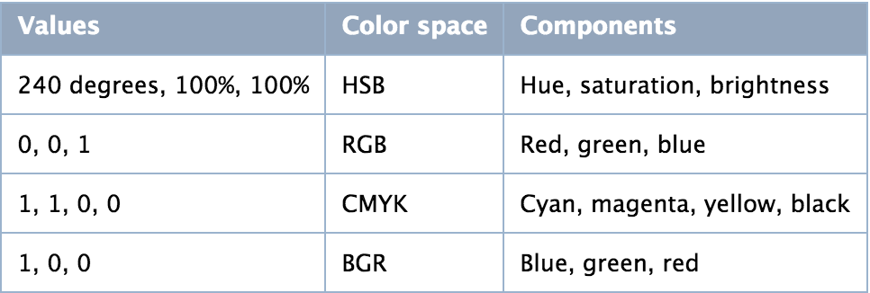


<br/>

- Color Spaces and Bitmap Layout（颜色空间和位图格式）

像素格式是用来描述每个像素的组成格式的，比如每个像素使用的总 bit 数。而要想确保 Quartz 能够正确地解析这些 bit 所代表的含义，我们还需要提供位图的布局信息 CGBitmapInfo：


```

typedef CF_OPTIONS(uint32_t, CGBitmapInfo) {
    kCGBitmapAlphaInfoMask = 0x1F,

    kCGBitmapFloatInfoMask = 0xF00,
    kCGBitmapFloatComponents = (1 << 8),

    kCGBitmapByteOrderMask     = kCGImageByteOrderMask,
    kCGBitmapByteOrderDefault  = (0 << 12),
    kCGBitmapByteOrder16Little = kCGImageByteOrder16Little,
    kCGBitmapByteOrder32Little = kCGImageByteOrder32Little,
    kCGBitmapByteOrder16Big    = kCGImageByteOrder16Big,
    kCGBitmapByteOrder32Big    = kCGImageByteOrder32Big
} CG_AVAILABLE_STARTING(__MAC_10_0, __IPHONE_2_0);

```


<br/>
<br/>


>## <h2 id ="启动优化">[启动优化](https://juejin.cn/post/6844904127068110862#heading-3)</h2>


[基于PGO优化启动时间](https://jishuin.proginn.com/p/763bfbd56d2b)

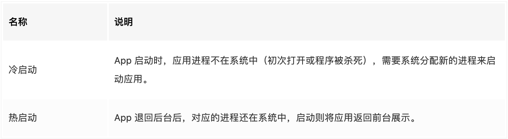


- **冷启动流程**

&emsp; Apple 官方的《WWDC Optimizing App Startup Time》 将 iOS 应用的启动可分为 pre-main 阶段和 main 两个阶段，最佳的启动速度是400ms以内，最慢不得大于20s，否则会被系统进程杀死（最低配置设备）。

&emsp; 为了更好的区分，笔者将整个启动流程分为三个阶段， **App总启动流程 = pre-main + main函数代理（didFinishLaunchingWithOptions）+ 首屏渲染（viewDidAppear），后两个阶段都属于 main函数  执行阶段**。


<br/>

[**APP的启动流程:**](https://www.jianshu.com/p/229dd6190b95)

```
1.iOS系统首先会加载解析该APP的Info.plist文件，因为Info.plist文件中包含了支持APP加载运行所需要的众多Key，value配置信息，例如APP的运行条件(Required device capabilities)，是否全屏，APP启动图信息等。

2.创建沙盒(iOS8后，每次启动APP都会生成一个新的沙盒路径)

3.根据Info.plist的配置检查相应权限状态

4.加载Mach-O文件读取dyld路径并运行dyld动态连接器(内核加载了主程序，dyld只会负责动态库的加载)
	4.1 首先dyld会寻找合适的CPU运行环境
	4.2 然后加载程序运行所需的依赖库和我们自己写的.h.m文件编译成的.o可执行文件，并对这些库进行链接。
	4.3 加载所有方法(runtime就是在这个时候被初始化并完成OC的内存布局)
	4.4 加载C函数
	4.5 加载category的扩展(此时runtime会对所有类结构进行初始化)
	4.6 加载C++静态函数，加载OC+load
	4.7 最后dyld返回main函数地址，main函数被调用
```

<br/>


**Mach-O文件说明:**

&emsp; Mach-O文件格式是 OS X 与 iOS 系统上的可执行文件格式，类似于windows的 PE 文件。像我们编译产生的.o文件、程序可执行文件和各种库等都是Mach-O文件。

Mach-O文件主要有3部分组成：

1).Header：保存了一些基本信息，包括了该文件运行的平台、文件类型、LoadCommands的个数等等。Headers的主要作用就是帮助系统迅速的定位Mach-O文件的运行环境，文件类型。保存了一些dyld重要的加载参数

2).LoadCommands：可以理解为加载命令，在加载Mach-O文件时会使用这里的数据来确定内存的分布以及相关的加载命令。比如我们的main函数的加载地址，程序所需的dyld的文件路径，以及相关依赖库的文件路径。

3).Data： 每一个segment的具体数据都保存在这里，这里包含了具体的代码、数据等等。


<br/>

[**高德启动耗时优化**](https://cloud.tencent.com/developer/news/616444)


<br/>


- **优化点**

	- 合并动态库，并减少使用 Embedded Framework，即非系统创建的动态 Framework，如果对包体积要求不严格还可以使用静态库代替。
	
	- 删除无用代码（未使用的静态变量、类和方法等）并抽取重复代码。
	
	- 避免在 +load 执行方法，使用 +initialize 代替。
	
	- 避免使用 attribute((constructor))，可将要实现的内容放在初始化方法中配合 dispatch_once 使用。
	
	- 减少非基本类型的 C++ 静态全局变量的个数。（因为这类全局变量通常是类或者结构体，如果在构造函数中有繁重的工作，就会拖慢启动速度）


<br/>
<br/>


> <h2 id = "UI卡顿优化">UI卡顿优化</h2>

卡顿的优化，哪几个方面？从哪可以检测到？

- **卡顿优化**

<br/>

**1）. CPU优化**

- 尽量用轻量级的对象，比如用不到事件处理的地方使用CALayer取代UIView
- 尽量提前计算好布局（例如cell行高）
- 不要频繁地调用和调整UIView的相关属性，比如frame、bounds、transform等属性，尽量减少不必要的调用和修改(UIView的显示属性实际都是CALayer的映射，而CALayer本身是没有这些属性的，都是初次调用属性时通过resolveInstanceMethod添加并创建Dictionry保存的，耗费资源)
- Autolayout会比直接设置frame消耗更多的CPU资源，当视图数量增长时会呈指数级增长
- 图片的size最好刚好跟UIImageView的size保持一致，减少图片显示时的处理计算(项目中图片可以降低采样率使用缩略图，重新绘制所需图片大小)
- 控制一下线程的最大并发数量（开启多个线程也会耗费cpu资源）
- 尽量把耗时的操作放到子线程（项目比如：图片解码、大数据读取、网络异步请求）
- 文本处理（尺寸计算、绘制、CoreText和YYText）

- 计算文本宽高boundingRectWithSize:options:context: 和文本绘制drawWithRect:options:context:放在子线程操作
- 使用CoreText自定义文本空间，在对象创建过程中可以缓存宽高等信息，避免像UILabel/UITextView需要多次计算(调整和绘制都要计算一次)，且CoreText直接使用了CoreGraphics占用内存小，效率高。（YYText）

- 图片处理（解码、绘制）
- 图片都需要先解码成bitmap才能渲染到UI上，iOS创建UIImage，不会立刻进行解码，只有等到显示前才会在主线程进行解码，固可以使用Core Graphics中的CGBitmapContextCreate相关操作提前在子线程中进行强制解压缩获得位图(YYImage/SDWebImage/kingfisher的对比)

```
SDWebImage的使用:
 CGImageRef imageRef = image.CGImage;
        // device color space
        CGColorSpaceRef colorspaceRef = SDCGColorSpaceGetDeviceRGB();
        BOOL hasAlpha = SDCGImageRefContainsAlpha(imageRef);
        // iOS display alpha info (BRGA8888/BGRX8888)
        CGBitmapInfo bitmapInfo = kCGBitmapByteOrder32Host;
        bitmapInfo |= hasAlpha ? kCGImageAlphaPremultipliedFirst : kCGImageAlphaNoneSkipFirst;
        
        size_t width = CGImageGetWidth(imageRef);
        size_t height = CGImageGetHeight(imageRef);
        
        // kCGImageAlphaNone is not supported in CGBitmapContextCreate.
        // Since the original image here has no alpha info, use kCGImageAlphaNoneSkipLast
        // to create bitmap graphics contexts without alpha info.
        CGContextRef context = CGBitmapContextCreate(NULL,
                                                     width,
                                                     height,
                                                     kBitsPerComponent,
                                                     0,
                                                     colorspaceRef,
                                                     bitmapInfo);
        if (context == NULL) {
            return image;
        }
        
        // Draw the image into the context and retrieve the new bitmap image without alpha
        CGContextDrawImage(context, CGRectMake(0, 0, width, height), imageRef);
        CGImageRef imageRefWithoutAlpha = CGBitmapContextCreateImage(context);
        UIImage *imageWithoutAlpha = [[UIImage alloc] initWithCGImage:imageRefWithoutAlpha scale:image.scale orientation:image.imageOrientation];
        CGContextRelease(context);
        CGImageRelease(imageRefWithoutAlpha);
        
        return imageWithoutAlpha;

```


<br/>

- **GPU优化**
	- 尽量避免短时间内大量图片的显示，尽可能将多张图片合成一张进行显示
	
	- GPU能处理的最大纹理尺寸是4096x4096，一旦超过这个尺寸，就会占用CPU资源进行处理，所以纹理尽量不要超过这个尺寸

	- GPU会将多个视图混合在一起再去显示，混合的过程会消耗CPU资源，尽量减少视图数量和层次

	- 减少透明的视图（alpha<1），不透明的就设置opaque为YES，GPU就不会去进行alpha的通道合成

	- 尽量避免出现离屏渲染

		- 	这里特别说下离屏渲染，对 GPU 的资源消耗极大。
		- 在OpenGL中，GPU有2种渲染方式，分别是屏幕渲染（On-Screen Rendering）和离屏渲染（Off-Screen Rendering），区别在于渲染操作是在当前用于显示的屏幕缓冲区进行还是新开辟一个缓冲区进行渲染，渲染完成后再在当前显示的屏幕展示。
		- 离屏渲染消耗性能的原因，在于需要创建新的缓冲区，并且在渲染的整个过程中，需要多次切换上下文环境，先是从当前屏幕（On-Screen）切换到离屏（Off-Screen）；等到离屏渲染结束以后，将离屏缓冲区的渲染结果显示到屏幕上，又需要将上下文环境从离屏切换到当前屏幕，造成了资源的及大小消耗。
		- 一些会触发离屏渲染的操作：

			- 光栅化，layer.shouldRasterize = YES
			
			- 遮罩，layer.mask
			
			- 圆角，同时设置layer.masksToBounds = YES、layer.cornerRadius大于0
			- 考虑通过CoreGraphics绘制裁剪圆角，或者叫美工提供圆角图片
			
			- 阴影，layer.shadowXXX
			- 如果设置了layer.shadowPath就不会产生离屏渲染


	
<br/>


- [**卡顿监测**](https://juejin.cn/post/6844904004053368846#heading-6)
	- Xcode 自带 Instruments
	- 帧率FPS（CADisplayLink）监测
	- RunLoop 监听


<br/>
<br/>


>## <h2 id = "UITableView优化">UITableView优化</h2>


**1）.Cell的重用**

- 如果cell内部显示的内容来自web，使用异步加载，缓存结果请求
- 尽量少在cellForRowAtIndexPath中设置数据，假如有100个数据，那么cellForRowAtIndexPath会执行100次，但实际屏幕显示却只有几个。这样会大量消耗时间，可以在willDisplayCell里进行数据的设置，因为willDisplayCell只会在cell将要显示时调用，屏幕显示几个cell才会调用。可以大大减少数据设置时间

```
-(UITableViewCell *)tableView:(UITableView *)tableView cellForRowAtIndexPath:(NSIndexPath *)indexPath{
//不要去设置cell的数据
}
-(void)tableView:(UITableView *)tableView willDisplayCell:(UITableViewCell *)cell forRowAtIndexPath:(NSIndexPath *)indexPath
{
//当cell要显示时才去设置需要显示的cell对应的数据
}
```


<br/>

**2）.cell动画和绘制**

重用时，它内部绘制的内容并不会被自动清除，因此你可能需要调用setNeedsDisplayInRect:或setNeedsDisplay方法。

CPU与GPU的说明

```
CPU就是做绘制的操作把内容放到缓存里，GPU负责从缓存里读取数据然后渲染到屏幕上。CPU将准备好的bitmap放到RAM里，GPU去搬这快内存到VRAM中处理。 而这个过程GPU所能承受的极限大概在16.7ms完成一帧的处理，所以最开始提到的60fps其实就是GPU能处理的最高频率。 GPU是图形硬件，主要的工作是混合纹理并算出像素的RGB值，这是一个非常复杂的计算过程，计算的过程越复杂，所需要消耗的时间就越长，GPU的使用率就越高，这并不是一个好的现像，而我们需要做的是减少GPU的计算量。
```

如果不需要动画效果，最好不要使用insertRowsAtIndexPaths:withRowAnimation:方法，而是直接调 用reloadData方法

当图片下载完成后，如果cell是可见的，还需要更新图像

```
NSArray *indexPaths = [self.tableView indexPathsForVisibleRows];
for (NSIndexPath *visibleIndexPath in indexPaths) {
if (indexPath == visibleIndexPath) { 
MyTableViewCell *cell = (MyTableViewCell *)[self.tableView cellForRowAtIndexPath:indexPath];
cell.image = image; 
[cell setNeedsDisplayInRect:imageRect]; break; 
}
}// 也可不遍历，直接与头尾相比较，看是否在中间即可。
```

insertRowsAtIndexPaths:withRowAnimation:方法，插入新行需要在主线程执行，而一次插入很多行的话（例如50行），会长时间阻塞主线程。而换成reloadData方法的话，瞬间就处理完了。


<br/>

**3）.cell内部图片处理**

>假如内存里有一张400x400的图片，要放到100x100的imageview里，如果不做任何处理，直接丢进去，问题就大了，这意味着，GPU需要对大图进行缩放到小的区域显示，需要做像素点的sampling，这种smapling的代价很高，又需要兼顾pixel alignment。计算量会飙升。
OpenGL ES是直接调用底层的GPU进行渲染；Core Graphics是一个基于CPU的绘制引擎

```
//重新绘制图片
//按照imageWidth, imageHeight指定宽高开始绘制图片
UIGraphicsBeginImageContext(CGSizeMake(imageWidth, imageHeight));
//把image原图绘制成指定宽高
[image drawInRect:CGRectMake(0,0,imageWidth,  imageHeight)];
//从绘制中获取指定宽高的图片
UIImage* newImage = UIGraphicsGetImageFromCurrentImageContext();
//结束绘制
UIGraphicsEndImageContext();

```

**丢帧概念：** RunLoop开始，RunLoop是一个60fps的回调，也就是说每16.7ms绘制一次屏幕，也就是我们需要在这个时间内完成view的缓冲区创建，view内容的绘制这些是CPU的工作；然后把缓冲区交给GPU渲染，这里包括了多个View的拼接(Compositing),纹理的渲染(Texture)等等，最后Display到屏幕上。但是如果你在16.7ms内做的事情太多，导致CPU，GPU无法在指定时间内完成指定的工作，那么就会出现卡顿现象，也就是丢帧。


<br/>

**4）.圆角图片处理**

- 直接在原图上层覆盖一个内部透明圆的图片。(目前来说最优的方式)
- 重新绘制图片(虽然重新绘制后会减少渲染的计算，但还是会影响渲染。这种方式只是把GPU的压力转义到了CPU上。负载平衡)。下面是绘制图片的方法

```
//根据size 和 radius 把image重新绘制。
-(UIImage *)getCornerRadius:(UIImage *)image size:(CGSize)size radius:(int)r
{
    int w = size.width;
    int h = size.height;
    int radius = r;

    UIImage *img = image;
    CGColorSpaceRef colorSpace = CGColorSpaceCreateDeviceRGB();
    CGContextRef context = CGBitmapContextCreate(NULL, w, h, 8, 4 * w, colorSpace, kCGImageAlphaPremultipliedFirst);
    CGRect rect = CGRectMake(0, 0, w, h);

    CGContextBeginPath(context);
    addRoundedRectToPath(context, rect, radius, radius);
    CGContextClosePath(context);
    CGContextClip(context);
    CGContextDrawImage(context, CGRectMake(0, 0, w, h), img.CGImage);
    CGImageRef imageMasked = CGBitmapContextCreateImage(context);
    img = [UIImage imageWithCGImage:imageMasked];

    CGContextRelease(context);
    CGColorSpaceRelease(colorSpace);
    CGImageRelease(imageMasked);
    return img;
}


static void addRoundedRectToPath(CGContextRef context, CGRect rect, float ovalWidth,
                                 float ovalHeight)
{
    float fw, fh;
    
    if (ovalWidth == 0 || ovalHeight == 0)
    {
        CGContextAddRect(context, rect);
        return;
    }
    
    CGContextSaveGState(context);
    CGContextTranslateCTM(context, CGRectGetMinX(rect), CGRectGetMinY(rect));
    CGContextScaleCTM(context, ovalWidth, ovalHeight);
    fw = CGRectGetWidth(rect) / ovalWidth;
    fh = CGRectGetHeight(rect) / ovalHeight;
    
    CGContextMoveToPoint(context, fw, fh/2);  // Start at lower right corner
    CGContextAddArcToPoint(context, fw, fh, fw/2, fh, 1);  // Top right corner
    CGContextAddArcToPoint(context, 0, fh, 0, fh/2, 1); // Top left corner
    CGContextAddArcToPoint(context, 0, 0, fw/2, 0, 1); // Lower left corner
    CGContextAddArcToPoint(context, fw, 0, fw, fh/2, 1); // Back to lower right
    
    CGContextClosePath(context);
    CGContextRestoreGState(context);
}
```

当然这里圆角的处理最好还是使用不透明的mask来遮罩。既能不用因为绘制造成CPU计算，而多余区域的渲染造成GPU的计算。

<br/>

优化方案1:使用贝塞尔曲线UIBezierPath和Core Graphics框架画出一个圆角

```
UIImageView *imageView = [[UIImageView alloc]initWithFrame:CGRectMake(100, 100, 100, 100)];
imageView.image = [UIImage imageNamed:@"myImg"]; 
//开始对imageView进行画图 
UIGraphicsBeginImageContextWithOptions(imageView.bounds.size, NO, 1.0); 
//使用贝塞尔曲线画出一个圆形图
[[UIBezierPath bezierPathWithRoundedRect:imageView.bounds cornerRadius:imageView.frame.size.width] addClip];
[imageView drawRect:imageView.bounds];
imageView.image = UIGraphicsGetImageFromCurrentImageContext(); 
//结束画图 
UIGraphicsEndImageContext();
[self.view addSubview:imageView]; 

```


<br/>

优化方案2：使用CAShapeLayer和UIBezierPath设置圆角

```
UIImageView *imageView = [[UIImageViewalloc]initWithFrame:CGRectMake(100,100,100,100)];
imageView.image = [UIImageimageNamed:@"myImg"];
UIBezierPath *maskPath = [UIBezierPathbezierPathWithRoundedRect:imageView.boundsbyRoundingCorners:UIRectCornerAllCornerscornerRadii:imageView.bounds.size];
CAShapeLayer *maskLayer = [[CAShapeLayer alloc]init];
//设置大小
maskLayer.frame=imageView.bounds;
//设置图形样子
maskLayer.path=maskPath.CGPath;
imageView.layer.mask=maskLayer;
[self.viewaddSubview:imageView];

```

对于方案2需要解释的是：
CAShapeLayer继承于CALayer,可以使用CALayer的所有属性值；CAShapeLayer需要贝塞尔曲线配合使用才有意义（也就是说才有效果）使用CAShapeLayer(属于CoreAnimation)与贝塞尔曲线可以实现不在view的drawRect（继承于CoreGraphics走的是CPU,消耗的性能较大）方法中画出一些想要的图形CAShapeLayer动画渲染直接提交到手机的GPU当中，相较于view的drawRect方法使用CPU渲染而言，其效率极高，能大大优化内存使用情况。
总的来说就是用CAShapeLayer的内存消耗少，渲染速度快，建议使用优化方案2。

[异步绘制](https://juejin.cn/post/6850418118850789390#heading-4)


<br/>


**4）.[cell图片加载优化](https://segmentfault.com/a/1190000018161741)**


<br/>
<br/>


>## <h2 id = "内存优化">[**内存优化**](https://juejin.cn/post/6864492188404088846)</h2>

- **内存泄漏**
	- ARC模式下由于循环引用造成内存泄漏，可以使用**`weak`**和**`unowned`**来避免;
		- 提问： [weak和unowened区别](https://hisoka0917.github.io/swift/2017/10/17/closure-unowned-weak-self/)？
			- 答：1）.unowned相当于以前的unsafe_unretained，当对象被释放时，unowned引用地址不会被指向nil，而是维持原内存地址，而实际上该地址上的对象已经被释放，此时去访问这个地址，程序当然会崩溃。而weak的对象在释放后会指向nil，这样不会造成crash。
			- 2）.如何正确选择这两者的使用，Apple给我们的建议是如果能够确定在访问时不会已被释放的话，尽量使用 unowned，如果存在被释放的可能，那就选择用 weak。
		- 提问：weak的原理？
			- 答：[weak原理](http://cloverkim.com/ios_weak-principle.html)

<br/>

- **野指针**
	- 开发阶段可以通过开启编译里的 **Zombie Objects**（在edit scheme的Run中进行打开）复现问题，原理是 Hook 系统的 dealloc 方法，执行 __dealloc_zombie 将对象进行僵尸化，如果当前对象再次收到消息，则终止程序并打印出调用信息。 

<br/>

- **图片存取** 
	- 图片读取
		- imageNamed 会被缓存到内存中，适用于频繁使用的小图片；
		- imageWithContentOfFile 适用于大图片，持有者生命周期结束后既被释放。
	- 缩放图片 
		- 将大图片加载到小空间时， UIImage （UIImage.contentsOfFile）需要先解压整个图像再渲染，会产生内存峰值，用 [ImageIO框架 替代 UIImage 可避免图像峰值](#ImageIO图片缩放)，ImageIO框架（CGImageSourceCreateWithURL）可以直接指定加载到内存的图像尺寸和信息，省去了解压缩的过程。
	- 后台优化
		-  当应用切入后台时，图像默认还在内存中 ，可以在退到后台或view消失时从内存中移除图片，进入前台或view出现时再加载图片 （通过监听系统通知) 
	- HEIC格式 
		- HEIC 是苹果推出的专门用于其系统的图片格式，iOS 11以上支持。
		- 据测试，相同画质比 JPEG 节省 50% 内存，且支持保存辅助图片（深度图、视差图等）。 

<br/>

- **OOM 监控**
	- 指 App 在前台因消耗内存过大导致被系统杀死，针对这类问题，我们需要记录发生 FOOM 时的调用栈、内存占用等信息，从而具体分析解决内存占用大的问题。
	- **OOMDetector(腾讯开源)**通过  malloc/free 的更底层接口 malloc_logger_t 记录当前存活对象的内存分配信息，同时也根据系统的 backtrace_symbols 回溯了堆栈信息。之后再根据伸展树（Splay Tree）等做数据存储分析，具体方式参看这篇文章：[iOS微信内存监控](https://wetest.qq.com/lab/view/367.html)。


<br/>

- 其它优化
	- 构建缓存时使用 NSCache 替代 NSMutableDictionary
		- NSCache 是线程安全的，当内存不足时会自动释放内存（取数据时需要先判空），并且可以通过 countLimit 和 totalCostLimit 属性设置上限，另外对存在 Compressed Memory 情况下的内存警告也做了优化，这些都是 NSDictionary 不具备的。
	- 不要将序列化的数据文件当作数据库使用
		- Plists、XML、JSON等文件修改都必须替换整个文件，拓展性差，且开销大，容易误用
		- NSUserDefaults默认是Plist


<br/>
<br/>


>## <h2 id = "包体积优化">[包体积优化](https://juejin.cn/post/6844904169938092045)</h3>

[包优化](https://jishuin.proginn.com/p/763bfbd5bce2)

<br/>

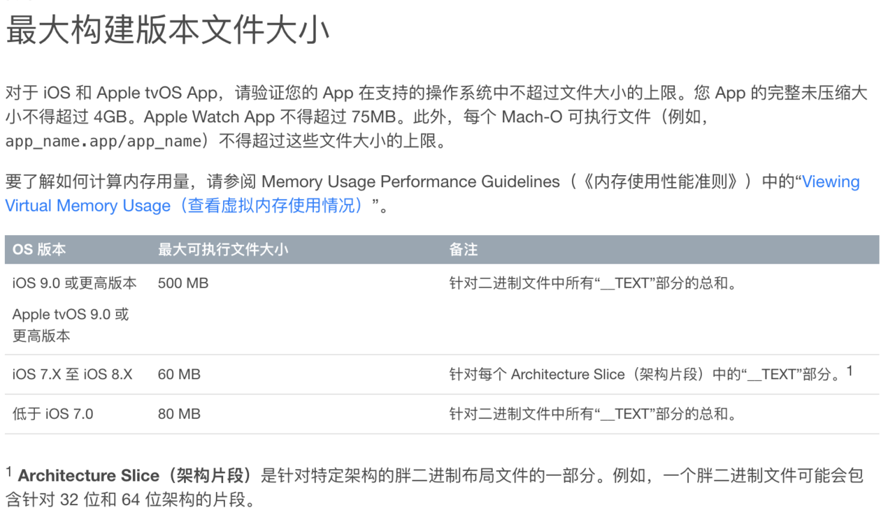


- **资源瘦身**
	
	<br/>
	
- 移除无用图片资源

&emsp； 这里推荐使用工具 [LSUnusedResources](https://github.com/tinymind/LSUnusedResources)，可以根据项目实际情况定义查找文件的正则表达式。另外建议勾选 Ignore similar name ，避免扫描出图片组。


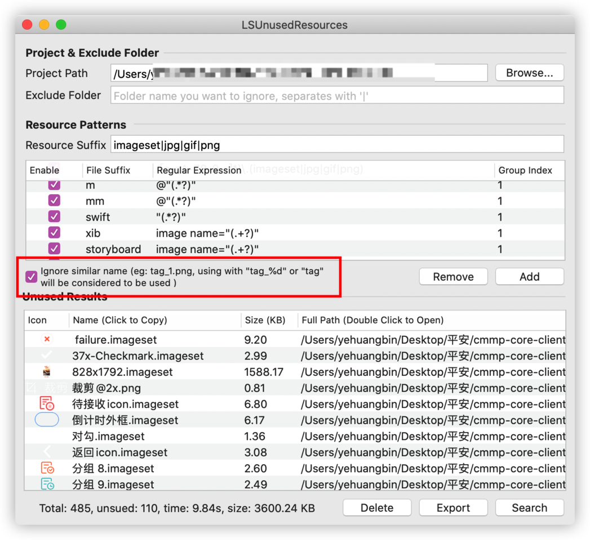


<br/>

- 压缩图片等资源文件


&emsp; 建议使用无损压缩，例如 ImageOptim、pngquant命令、tinypng ，如果涉及有损压缩最好要求设计介入进行资源检查。


&emsp; 还可以使用 Webp 格式的图片，Webp 是由 Google 推出的图片格式，有损压缩模式下图片体积只有 jpeg 格式的 1/3，无损压缩也能减小 1/4，可以使用 cwebp 进行格式压缩转换，目前 SDWebImage、Kingfisher 都用支持该格式解析的拓展。无损压缩命令如下：

```
// 语法
cwebp [options] input_file -o output_file.webp
// 无损压缩
cwebp -lossless original.png -o new.webp
复制代码
除了终端命令，还可以使用 iSparta 进行批量转换格式。
```


<br/>

- Xcode 本身也提供压缩图片的编译选项
	- Compress PNG Files
打包的时候基于 pngcrush 工具自动对图片进行无损压缩，如果我们已自行对图片进行压缩，该选项最好关闭。
	
	- Remove Text Medadata From PNG Files
移除 PNG 资源的文本字符，比如图像名称、作者、版权、创作时间、注释等信息。

***


<br/>

- **删除重复文件**

&emsp; 通过校验所有资源的 MD5，筛选出项目中的重复资源，推荐使用 fdupes 工具进行重复文件扫描，[fdupes ](https://github.com/adrianlopezroche/fdupes)是 Linux 平台的一个开源工具，由 C 语言编写 ，文件比较顺序是`大小对比 > 部分 MD5 签名对比 > 完整 MD5 签名对比 > 逐字节对比`。

通过 `Homebrew 安装 fdupes：`

```
brew install fdupes

```

查看目标文件夹下的重复文件：

```
fdupes -Sr 文件夹   // 查看文件夹下所有子目录中的重复文件及大小
fdupes -Sr 文件夹 > 输出地址.txt  // 将信息输出到txt文件中
```

输出内容如下，一般情况下，相同文件仅保留一份，修改对应的引用即可。

```
4474 bytes each:
Test/Images.xcassets/TabBarImage/tabBar_2.imageset/tabBar_2@2x.png
Test/Resource/TabBarImage/tabBar_2@2x.png

3912 bytes each:
Test/Images.xcassets/TabBarImage/tabBar_3.imageset/tabBar_3@2x.png
Test/Resource/TabBarImage/tabBar_3@2x.png
```


<br/>
<br/>


> <h2 id ="内存暴涨解决">内存暴涨解决</h2>

[**自建内存泄漏检测工具**](https://jishuin.proginn.com/p/763bfbd56d2c)


&emsp; 在列表滑动的情况内存莫名的增长，频繁访问图片的时候内存莫名的增长，频繁的打开和关闭数据库的时候内存莫名的增长……。 这些都是拜iOS的autorelease机制所赐；具体分析如下：

1.滑动列表的时候，内存出现莫名的增长，原因可能有如下可能：

	a. 没有使用UITableView的reuse机制； 导致每显示一个cell都用autorelease的方式重新alloc一次；导致cell的内存不断的增加；

	b. 每个cell会显示一个单独的UIView， 在UIView发生内存泄漏，导致cell的内存不断增长；


<br/>

2.频繁访问图片的时候，内存莫名的增长；

&emsp; 频繁的访问网络图片，导致iOS内部API，会不断的分配autorelease方式的buffer来处理图片的解码与显示； 利用图片NSCache可以缓解一下此问题；

**NSCache使用：**

```
// 创建对象
NSCache *cache = [[NSCache alloc] init];
// 设置缓存数量限制，默认值是 0，表示没有限制
cache.countLimit = 10;
// 设置缓存总成本限制，默认值是 0，表示没有限制
cache.totalCostLimit = 1024 * 1024;
// 设置是否自动清理缓存，默认为 YES，表示自动清理
cache.evictsObjectsWithDiscardedContent = YES;
// 设置代理
cache.delegate = self;
// 设置缓存
/*
	0 成本，与可变字典不同，缓存对象不会对键名做 copy 操作，只是做强引用
*/
[cache setObject:str forKey:@(i)];
// 设置缓存
/*
	指定成本
*/
[cache setObject:str forKey:@(i) cost:1024];
// 查看缓存内容
/*
	NSCache 没有提供遍历的方法，只支持用 key 来取值，NSCache 的 Key 只是做强引用，不需要实现 NSCopying 协议
*/
NSString *string = [cache objectForKey:@(i)];
// 删除指定缓存
[cache removeObjectForKey:@8];
// 删除所有缓存
/*
	一旦调用了 removeAllObjects，就无法给 cache 添加对象，关于 NSCache 的内存管理，交给他自己就行
*/
[cache removeAllObjects];
// 缓存协议方法
/*
	须遵守 <NSCacheDelegate> 协议，obj 就是要被清理的对象
	当缓存中的对象被清除的时候，会自动调用，不建议平时开发时重写！仅供调试使用
*/
- (void)cache:(NSCache *)cache willEvictObject:(id)obj {
}
	
```

 
<br/>


3.频繁打开和关闭SQLite，导致内存不断的增长；

&emsp; 在进行SQLite频繁打开和关闭操作，而且读写的数据buffer较大，那么SQLite在每次打开与关闭的时候，都会利用autorelease的方式分配51K的内存； 如果访问次数很多，内存马上就会顶到几十兆，甚至上百兆！ 所以针对频繁的读写数据库且数据buffer较大的情况， 可以设置SQLite的长连接方式；避免频繁的打开和关闭数据库；

**SQLite操作封装-长连接方式**

```
using System;
using System.Collections.Generic;
using System.Data;
using System.Data.SQLite;
using System.IO;
using System.Linq;
using System.Text;
using System.Threading.Tasks;
 
namespace Acon.UrineAnalyzerPlatform.DataAccess
{
    /// <summary>
    /// SQLite数据库操作类，长连接模式
    /// </summary>
    public sealed class SQLiteHelper
    {
        public static string ConnectionString { get; set; }
 
        private static SQLiteConnection Connection;
 
        static SQLiteHelper()
        {
            string fileName = Path.Combine(Application.StartupPath, @"Data\\UrineMachine.db");
            ConnectionString = string.Format("Data Source={0};{1}", fileName, ";foreign keys=true;");
        }
 
        #region 静态方法
 
        private static SQLiteConnection CreateConnection()
        {
            if (Connection == null)
                Connection = new SQLiteConnection(ConnectionString);
            
            return Connection;
        }
 
        public static SQLiteTransaction GetTransaction()
        {
            return CreateConnection().BeginTransaction();
        }
 
        private static void PrepareCommand(SQLiteCommand command, SQLiteConnection connection, SQLiteTransaction transaction, CommandType commandType, string commandText, SQLiteParameter[] parms)
        {
            if (connection.State != ConnectionState.Open) connection.Open();
 
            command.Connection = connection;
            //command.CommandTimeout = CommandTimeOut;
            // 设置命令文本(存储过程名或SQL语句)
            command.CommandText = commandText;
            // 分配事务
            if (transaction != null)
            {
                command.Transaction = transaction;
            }
            // 设置命令类型.
            command.CommandType = commandType;
            if (parms != null && parms.Length > 0)
            {
                //预处理SqlParameter参数数组，将为NULL的参数赋值为DBNull.Value;
                foreach (SQLiteParameter parameter in parms)
                {
                    if ((parameter.Direction == ParameterDirection.InputOutput || parameter.Direction == ParameterDirection.Input) && (parameter.Value == null))
                    {
                        parameter.Value = DBNull.Value;
                    }
                }
                command.Parameters.AddRange(parms);
            }
        }
 
        #region ExecuteNonQuery
        public static int ExecuteNonQuery(string commandText, params SQLiteParameter[] parms)
        {
            return ExecuteNonQuery(CreateConnection(), commandText, parms);
        }
   
        public static int ExecuteNonQuery(SQLiteConnection connection, string commandText, params SQLiteParameter[] parms)
        {
            return ExecuteNonQuery(connection, CommandType.Text, commandText, parms);
        }
 
        /// <summary>
        /// 执行SQL语句,返回影响的行数
        /// </summary>
        /// <param name="connection">数据库连接</param>
        /// <param name="commandType">命令类型(存储过程,命令文本, 其它.)</param>
        /// <param name="commandText">SQL语句或存储过程名称</param>
        /// <param name="parms">查询参数</param>
        /// <returns>返回影响的行数</returns>
        public static int ExecuteNonQuery(SQLiteConnection connection, CommandType commandType, string commandText, params SQLiteParameter[] parms)
        {
            return ExecuteNonQuery(connection, null, commandType, commandText, parms);
            //try
            //{
            //    return ExecuteNonQuery(connection, null, commandType, commandText, parms);
            //}
            //finally
            //{
            //    connection.Close();
            //}
        }
 
        /// <summary>
        /// 执行SQL语句,返回影响的行数
        /// </summary>
        /// <param name="transaction">事务</param>
        /// <param name="commandType">命令类型(存储过程,命令文本, 其它.)</param>
        /// <param name="commandText">SQL语句或存储过程名称</param>
        /// <param name="parms">查询参数</param>
        /// <returns>返回影响的行数</returns>
        public static int ExecuteNonQuery(SQLiteTransaction transaction, CommandType commandType, string commandText, params SQLiteParameter[] parms)
        {
            return ExecuteNonQuery(transaction.Connection, transaction, commandType, commandText, parms);
 
        }
 
        /// <summary>
        /// 执行SQL语句,返回影响的行数
        /// </summary>
        /// <param name="connection">数据库连接</param>
        /// <param name="transaction">事务</param>
        /// <param name="commandType">命令类型(存储过程,命令文本, 其它.)</param>
        /// <param name="commandText">SQL语句或存储过程名称</param>
        /// <param name="parms">查询参数</param>
        /// <returns>返回影响的行数</returns>
        private static int ExecuteNonQuery(SQLiteConnection connection, SQLiteTransaction transaction, CommandType commandType, string commandText, params SQLiteParameter[] parms)
        {
            SQLiteCommand command = new SQLiteCommand();
            PrepareCommand(command, connection, transaction, commandType, commandText, parms);
            int retval = command.ExecuteNonQuery();
            command.Parameters.Clear();
            return retval;
        }
 
        #endregion ExecuteNonQuery
 
        #region ExecuteScalar
        /// <summary>
        /// 执行SQL语句,返回结果集中的第一行第一列
        /// </summary>
        /// <param name="connectionString">数据库连接字符串</param>
        /// <param name="commandText">SQL语句</param>
        /// <param name="parms">查询参数</param>
        /// <returns>返回结果集中的第一行第一列</returns>
        public static object ExecuteScalar(string commandText, params SQLiteParameter[] parms)
        {
            return ExecuteScalar(CreateConnection(), commandText, parms);
        }
 
        public static object ExecuteScalar(SQLiteConnection connection, string commandText, SQLiteParameter[] parms)
        {
            return ExecuteScalar(connection, CommandType.Text, commandText, parms);
        }
 
        public static object ExecuteScalar(SQLiteConnection connection, CommandType commandType, string commandText, SQLiteParameter[] parms)
        {
            SQLiteCommand command = new SQLiteCommand();
            PrepareCommand(command, connection, null, commandType, commandText, parms);
            object retval = command.ExecuteScalar();
            command.Parameters.Clear();
            return retval;
        }
 
 
        #endregion
 
        #region ExecuteDataSet
        public static DataSet ExecuteDataSet(string commandText, params SQLiteParameter[] parms)
        {
            return ExecuteDataSet(CreateConnection(), commandText, parms);
        }
 
        public static DataSet ExecuteDataSet(SQLiteConnection connection, string commandText, SQLiteParameter[] parms)        {
            return ExecuteDataSet(connection, CommandType.Text, commandText, parms);
        }
 
        public static DataSet ExecuteDataSet(SQLiteConnection connection, CommandType commandType, string commandText, SQLiteParameter[] parms)
        {
            return ExecuteDataSet(connection, null, commandType, commandText, parms);
        }
 
        /// <summary>
        /// 执行SQL语句,返回结果集
        /// </summary>
        /// <param name="transaction">事务</param>
        /// <param name="commandType">命令类型(存储过程,命令文本, 其它.)</param>
        /// <param name="commandText">SQL语句或存储过程名称</param>
        /// <param name="parms">查询参数</param>
        /// <returns>返回结果集</returns>
        public static DataSet ExecuteDataSet(SQLiteTransaction transaction, CommandType commandType, string commandText, params SQLiteParameter[] parms)
        {
            return ExecuteDataSet(transaction.Connection, transaction, commandType, commandText, parms);
        }
 
        private static DataSet ExecuteDataSet(SQLiteConnection connection, SQLiteTransaction transaction, CommandType commandType, string commandText, SQLiteParameter[] parms)
        {
            SQLiteCommand command = new SQLiteCommand();
            PrepareCommand(command, connection, transaction, commandType, commandText, parms);
            SQLiteDataAdapter adapter = new SQLiteDataAdapter(command);
            DataSet ds = new DataSet();
            adapter.Fill(ds);
            command.Parameters.Clear();
            return ds;
        }
        #endregion
 
        #endregion 静态方法
 
        public static void Close()
        {
            if (Connection != null && Connection.State == ConnectionState.Open)
            {
                Connection.Close();
                System.Data.SQLite.SQLiteConnection.ClearPool(Connection);//清除连接池，否则数据库文件不会被释放。
            }
        }
    }
}


```


<br/>
<br/>

> <h2 id = "文件存储优化">文件存储优化</h2>

<br/>


- Documents：保存应用运行时生成的需要持久化的数据,iTunes会自动备份该目录。苹果建议将在应用程序中浏览到的文件数据保存在该目录下。

- tmp：临时文件目录，在程序重新运行的时候，和开机的时候，会清空tmp文件夹。

- Library:
	- Caches：一般存储的是缓存文件，例如图片视频等，此目录下的文件不会再应用程序退出时删除。在手机备份的时候，iTunes不会备份该目录。例如:音频,视频等文件存放其中
	- Preferences：保存应用程序的所有偏好设置iOS的Settings(设置)，我们不应该直接在这里创建文件，而是需要通过NSUserDefault这个类来访问应用程序的偏好设置。iTunes会自动备份该文件目录下的内容。比如说:是否允许访问图片,是否允许访问地理位置......


<br/>

***
<br/>


># <h1 id = "架构与设计模式">架构与设计模式</h1>

<br/>

- [开发架构设计思考](https://www.jianshu.com/p/1e1009ba061c)
- [组件化开发实施](https://www.jianshu.com/p/599e97b63af7)
- [组件优化](https://casatwy.com/iOS-Modulization.html?hmsr=toutiao.io)


<br/>
<br/>

>## <h2 id="MVC和MVVM">[MVC和MVVM](./设计模式.md#MVC)</h2>


<br/>
<br/>

>## <h2 id="单例类">[**单例类**](./设计模式.md#单例类)</h2>

<br/>
<br/>

>## <h2 id="协议代理">[**协议代理**](./设计模式.md#代理协议)</h2>


<br/>
<br/>

>## <h2 id="KVC和KVO">[**KVC和KVO**](./设计模式.md#KVC和KVO)</h2>


<br/>

***
<br/>


># <h1 id = "底层">底层</h1>

<br/>

>## <h2 id = "Runloop">[Runloop](https://www.jianshu.com/p/e29f846d8a97)</h2>

[Run Loop 原理详解](http://chuquan.me/2018/10/06/understand-ios-runloop/)


[深入理解RunLoop](https://blog.ibireme.com/2015/05/18/runloop/#base)

<br/>


> <h3 id ="Runloop底层原理">Runloop底层原理</h3>
[Runloop详解](https://imlifengfeng.github.io/article/487/)


[**Runloop底层原理**](https://juejin.cn/post/6844903604965523464#heading-11)，[**CFRunLoop开源代码**](http://opensource.apple.com/source/CF/CF-855.17/)


Runloop 源码：

```
void CFRunLoopRun(void) {	/* DOES CALLOUT */
    int32_t result;
    do {
        result = CFRunLoopRunSpecific(CFRunLoopGetCurrent(), kCFRunLoopDefaultMode, 1.0e10, false);
        CHECK_FOR_FORK();
    } while (kCFRunLoopRunStopped != result && kCFRunLoopRunFinished != result);
}

```


&emsp; 我们发现RunLoop确实是do while通过判断result的值实现的。因此，我们可以把RunLoop看成一个死循环。如果没有RunLoop，UIApplicationMain函数执行完毕之后将直接返回，也就没有程序持续运行一说了。
执行顺序的伪代码：

```

int32_t __CFRunLoopRun()
{
    // 通知即将进入runloop
    __CFRunLoopDoObservers(KCFRunLoopEntry);
    
    do
    {
        // 通知将要处理timer和source
        __CFRunLoopDoObservers(kCFRunLoopBeforeTimers);
        __CFRunLoopDoObservers(kCFRunLoopBeforeSources);
        
        // 处理非延迟的主线程调用
        __CFRunLoopDoBlocks();
        // 处理Source0事件
        __CFRunLoopDoSource0();
        
        if (sourceHandledThisLoop) {
            __CFRunLoopDoBlocks();
         }
        /// 如果有 Source1 (基于port) 处于 ready 状态，直接处理这个 Source1 然后跳转去处理消息。
        if (__Source0DidDispatchPortLastTime) {
            Boolean hasMsg = __CFRunLoopServiceMachPort();
            if (hasMsg) goto handle_msg;
        }
            
        /// 通知 Observers: RunLoop 的线程即将进入休眠(sleep)。
        if (!sourceHandledThisLoop) {
            __CFRunLoopDoObservers(runloop, currentMode, kCFRunLoopBeforeWaiting);
        }
            
        // GCD dispatch main queue
        CheckIfExistMessagesInMainDispatchQueue();
        
        // 即将进入休眠
        __CFRunLoopDoObservers(kCFRunLoopBeforeWaiting);
        
        // 等待内核mach_msg事件
        mach_port_t wakeUpPort = SleepAndWaitForWakingUpPorts();
        
        // 等待。。。
        
        // 从等待中醒来
        __CFRunLoopDoObservers(kCFRunLoopAfterWaiting);
        
        // 处理因timer的唤醒
        if (wakeUpPort == timerPort)
            __CFRunLoopDoTimers();
        
        // 处理异步方法唤醒,如dispatch_async
        else if (wakeUpPort == mainDispatchQueuePort)
            __CFRUNLOOP_IS_SERVICING_THE_MAIN_DISPATCH_QUEUE__()
            
        // 处理Source1
        else
            __CFRunLoopDoSource1();
        
        // 再次确保是否有同步的方法需要调用
        __CFRunLoopDoBlocks();
        
    } while (!stop && !timeout);
    
    // 通知即将退出runloop
    __CFRunLoopDoObservers(CFRunLoopExit);
}

```


[**Runloop面试题分析**](https://www.neroxie.com/2019/07/26/RunLoop面试题分析/)


<br/>
<br/>


> <h3 id="Runloop有几种运行状态">Runloop有几种运行状态</h3>

Runloop是通过观察者CFRunLoopObserverRef来监听RunLoop的状态改变：

```

-(void)touchesBegan:(NSSet<UITouch *> *)touches withEvent:(UIEvent *)event
{
     //创建监听者
     /*
     第一个参数 CFAllocatorRef allocator：分配存储空间 CFAllocatorGetDefault()默认分配
     第二个参数 CFOptionFlags activities：要监听的状态 kCFRunLoopAllActivities 监听所有状态
     第三个参数 Boolean repeats：YES:持续监听 NO:不持续
     第四个参数 CFIndex order：优先级，一般填0即可
     第五个参数 ：回调 两个参数observer:监听者 activity:监听的事件
     */
     /*
     所有事件
     typedef CF_OPTIONS(CFOptionFlags, CFRunLoopActivity) {
     kCFRunLoopEntry = (1UL << 0),   //   即将进入RunLoop
     kCFRunLoopBeforeTimers = (1UL << 1), // 即将处理Timer
     kCFRunLoopBeforeSources = (1UL << 2), // 即将处理Source
     kCFRunLoopBeforeWaiting = (1UL << 5), //即将进入休眠
     kCFRunLoopAfterWaiting = (1UL << 6),// 刚从休眠中唤醒
     kCFRunLoopExit = (1UL << 7),// 即将退出RunLoop
     kCFRunLoopAllActivities = 0x0FFFFFFFU
     };
     */
    CFRunLoopObserverRef observer = CFRunLoopObserverCreateWithHandler(CFAllocatorGetDefault(), kCFRunLoopAllActivities, YES, 0, ^(CFRunLoopObserverRef observer, CFRunLoopActivity activity) {
        switch (activity) {
            case kCFRunLoopEntry:
                NSLog(@"RunLoop进入");
                break;
            case kCFRunLoopBeforeTimers:
                NSLog(@"RunLoop要处理Timers了");
                break;
            case kCFRunLoopBeforeSources:
                NSLog(@"RunLoop要处理Sources了");
                break;
            case kCFRunLoopBeforeWaiting:
                NSLog(@"RunLoop要休息了");
                break;
            case kCFRunLoopAfterWaiting:
                NSLog(@"RunLoop醒来了");
                break;
            case kCFRunLoopExit:
                NSLog(@"RunLoop退出了");
                break;

            default:
                break;
        }
    });

    // 给RunLoop添加监听者
    /*
     第一个参数 CFRunLoopRef rl：要监听哪个RunLoop,这里监听的是主线程的RunLoop
     第二个参数 CFRunLoopObserverRef observer 监听者
     第三个参数 CFStringRef mode 要监听RunLoop在哪种运行模式下的状态
     */
    CFRunLoopAddObserver(CFRunLoopGetCurrent(), observer, kCFRunLoopDefaultMode);
     /*
     CF的内存管理（Core Foundation）
     凡是带有Create、Copy、Retain等字眼的函数，创建出来的对象，都需要在最后做一次release
     GCD本来在iOS6.0之前也是需要我们释放的，6.0之后GCD已经纳入到了ARC中，所以我们不需要管了
     */
    CFRelease(observer);
}
```


输出结果：

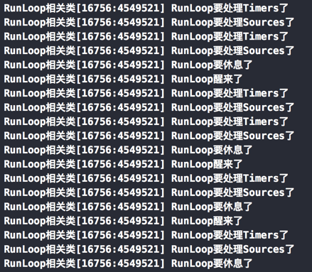


<br/>
<br/>

>### <h3 id ="runloop与自动释放池关系什么时侯释放">[RunLoop](https://github.com/harleyGit/StudyNotes/blob/master/底层/RunLoop(I).md)与自动释放池关系，什么时侯释放?</h3>


- **分两种情况：手动干预释放和系统自动释放**
	- 手动干预释放就是指定autoreleasepool,当前作用域大括号结束就立即释放
	- 系统自动去释放:不手动指定autoreleasepool,Autorelease对象会在当前的 runloop 迭代结束时释放
	- kCFRunLoopEntry(1):第一次进入会自动创建一个autorelease
	- kCFRunLoopBeforeWaiting(32):进入休眠状态前会自动销毁一个autorelease,然后重新创建一个新的autorelease
	- kCFRunLoopExit(128):退出runloop时会自动销毁最后一个创建的autorelease

<br/>

- **系统自动释放时机：**

&emsp; 每个runloop中都创建一个Autorelease Pool，并在runloop的末尾进行释放。所以，一般情况下，每个接受autorelease消息的对象，都会在下个runloop开始前被释放。也就是说，在一段同步的代码中执行过程中，生成的对象接受autorelease消息后，一般是不会在作用域结束前释放的。Autorelease对象出了作用域之后，会被添加到最近一次创建的自动释放池中，并会在当前的 runloop 迭代结束（RunLoop 在第一次获取时创建, 在线程结束时销毁）时释放,至于何时runloop结束并没有固定的duration。

&emsp; Runloop是一个运行循环，但是它不可能一直运行着，所以它会有一个休眠期。Runloop维护着一个AutoreleasePool，当它进入休眠前它会把这个释放池里的对象进行释放。

&emsp; UIKit通过RunLoopObserver在RunLoop两次Sleep间对AutoreleasePool进行pop和push,将这次Loop中产生的Autorelease对象释放。


<br/>

- **在UIKit中Runloop什么时候进入休眠？**

先看一个简单Demo：

```
- (void)viewDidLoad{
    [super viewDidLoad];
    NSString *string = [NSString stringWithFormat:@"齐滇大圣"];
}

```

&emsp; 这里[NSString stringWithFormat:@”齐滇大圣”];创建对象时这个对象的引用计数为 1 。当使用局部变量 string 指向这个对象时，这个对象的引用计数 +1 ，变成了 2 。而当 viewDidLoad 方法返回时，局部变量 string 被回收，指向了 nil 。因此，其所指向对象的引用计数 -1 ，变成了 1 。

&emsp; 然后我们的这个对象是一个autorelease的实例，是被系统自动添加到了当前的 autoreleasepool 中的。所以会当Runloop一次迭代结束即将进入休眠的时候autoreleasepool drain对象引用计数 -1，对象释放。

下面我们配合着堆栈信息看一下这个Runloop什么时候结束一次迭代。

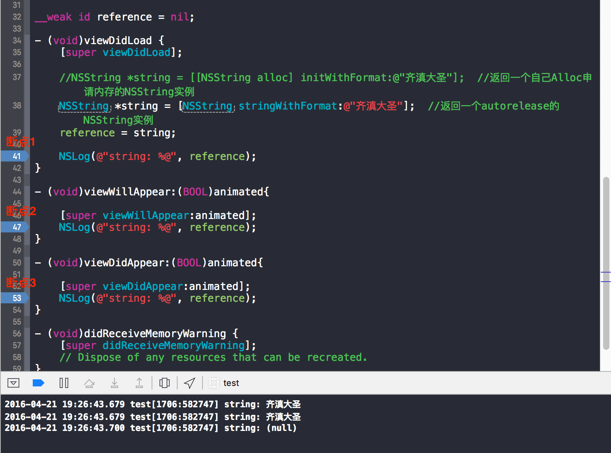


&emsp; 这里我们加入一个weak的全局变量reference来指向我们的对象。因为weak引用不持有我们的对象，不会影响所指向对象的生命周期，所以我们用它来输出以判断我们的对象什么时候释放。

&emsp; 我们能看到reference在viewDidLoad和viewWillAppear的时候有输出，而在viewDidAppear的时候为null，说明被释放了。那我们来猜测一下runloop的迭代周期。

&emsp; viewWillAppear很容易理解是即将进入页面嘛，那runloop肯定是还有事要做的嘛，当viewDidAppear的时候表示已经进入页面了。那就表示没事做了，进入睡眠，等待用户动作的时候再次唤醒。你可能会觉得我口说无凭不靠谱，好那我就拿出证据来，我们来看下面两张图。

断点1和断点2:

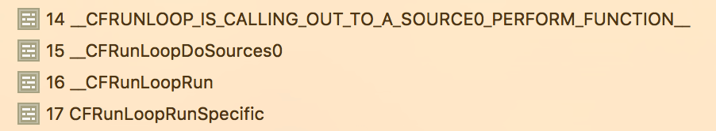

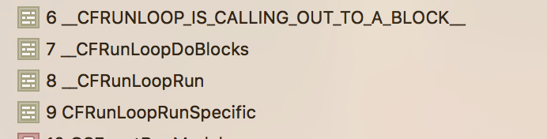

我们能看到断点1和断点2 runloop还是在执行的，断点3表示runloop一个迭代已经结束了，即将进入睡眠。

```
//触发 Source0 (非基于port的) 回调。
__CFRUNLOOP_IS_CALLING_OUT_TO_A_SOURCE0_PERFORM_FUNCTION__(source0);
//out_to_block表示从block跳出，block执行完毕，即将进入睡眠。
__CFRUNLOOP_IS_CALLING_OUT_TO_A_BLOCK__(block);
```


<br/>

- **自动释放池使用时机：**
	- 写给予命令行的程序时，就是没有UI框架；
	- 写循环，循环里边包含了大量临时创建的对象；
	- 创建了新的线程；
	- 长时间在后台运行的任务；
	- 合理运用自动释放池，可以降低程序的内存峰值，异步的方式将文件保存在磁盘（SDWebimage里边异步保存图片到磁盘，类似的占用内存的操作）；


<br/>
<br/>


 > <h3 id ="RunLoop原理和与线程的联系">[RunLoop原理和与线程的联系？说一下你对他的了解](https://blog.csdn.net/wzzvictory/article/details/9237973)</h3>

1. RunLoop 的作用就是来管理线程的，当线程的 RunLoop开启后，线程就会在执行完任务后，处于休眠状态，随时等待接受新的任务，而不是退出。

2. 只有主线程的RunLoop是默认开启的，所以程序在开启后，会一直运行，不会退出。其他线程的RunLoop如果需要开启，就手动开启，


3. **runloop的mode作用:**

	- model 主要是用来指定事件在运行循环中的优先级的，分为：

	```
	* NSDefaultRunLoopMode（kCFRunLoopDefaultMode）：默认，空闲状态
	* UITrackingRunLoopMode                       ：界面跟踪 Mode，用于 ScrollView 追踪触摸滑动，保证界面滑动时不受其他 Mode 影响
	* UIInitializationRunLoopMode                  ：在刚启动 App 时进入的第一个 Mode ，启动完成后就不再使用
	* GSEventReceiveRunLoopMode                  ：接受系统事件的内部 Mode，通常用不到
  	* kCFRunLoopCommonModes                      ：这是一个占位的 Mode，没有实际作用
	```

	- 苹果公开提供的 Mode有两个：

	```
	NSDefaultRunLoopMode（kCFRunLoopDefaultMode）
	NSRunLoopCommonModes（kCFRunLoopCommonModes）
	```


<br/>

提问：Runloop在线程中有哪些用法？
实例：[看这里](https://www.jianshu.com/p/e29f846d8a97)


提问：主线程默认开启Runloop的mode是什么mode？
主线程的Runloop默认的 RunloopMode 是 NSDefaultRunLoopMode。


<br/>
<br/>


> <h2 id = "多线程">多线程</h2>

<br/>

>### <h3 id = "进程和线程之间的关系"> [进程和线程之间的关系](https://juejin.cn/post/6844903939599515655) </h3>

- **线程定义：**
	- 线程是进程的基本执行单元，一个进程的所有任务都在线程中执行
	- 进程要想执行任务，必须得有线程，进程至少要有一条线程
	- 程序启动会默认开启一条线程，这条线程被称为主线程或 UI 线程


<br/>


- **进程定义**

	- 进程是指在系统中正在运行的一个应用程序
	
	- 每个进程之间是独立的，每个进程均运行在其专用的且受保护的内存空间内
	
	- 通过“活动监视器”可以查看 Mac 系统中所开启的进程


<br/>

- **进程与线程的区别**

	- 地址空间：同一进程的线程共享本进程的地址空间，而进程之间则是独立的地址空间。
	
	- 资源拥有：同一进程内的线程共享本进程的资源如内存、I/O、cpu(线程之间的资源是可以共享的，比如：在子线程请求到的图片，要转到住线程进行显示这就涉及到线程的通信、资源共享)等，**但是进程之间的资源是独立的**。
	
	- 一个进程崩溃后，在保护模式下不会对其他进程产生影响，但是一个线程崩溃整个进程都死掉。所以多进程要比多线程健壮。
	
	- 进程切换时，消耗的资源大，效率高。所以涉及到频繁的切换时，使用线程要好于进程。同样如果要求同时进行并且又要共享某些变量的并发操作，只能用线程不能用进程
	
	- 执行过程：每个独立的进程有一个程序运行的入口、顺序执行序列和程序入口。但是线程不能独立执行，必须依存在应用程序中，由应用程序提供多个线程执行控制。
	
	- 线程是处理器调度的基本单位，但是进程不是。


<br/>
<br/>


> <h2 id = "自动释放池">自动释放池</h2>


<br/>

> <h3 id = "自动释放池的实现原理">自动释放池实现原理</h3> 

**实现原理：**

&emsp; 自动释放池以栈的形式实现，当你创建一个新的自动释放池时，他将被添加到栈顶，当一个对象收到autorelease消息的时候，他被添加到当前线程的处于顶的自动释放池中，当自动释放池被回收时，他们就从栈中被删除，并且会给池子里面所有对象的使用都会做一次release操作


<br/>
<br/>


> <h2 id = "APP">APP</h2>

<br/>

> <h3 id = "app启动流程">app启动流程</h3>

[**APP的启动流程:**](https://www.jianshu.com/p/229dd6190b95)

```
1.iOS系统首先会加载解析该APP的Info.plist文件，因为Info.plist文件中包含了支持APP加载运行所需要的众多Key，value配置信息，例如APP的运行条件(Required device capabilities)，是否全屏，APP启动图信息等。
2.创建沙盒(iOS8后，每次启动APP都会生成一个新的沙盒路径)
3.根据Info.plist的配置检查相应权限状态
4.加载Mach-O文件读取dyld路径并运行dyld动态连接器(内核加载了主程序，dyld只会负责动态库的加载)
	4.1 首先dyld会寻找合适的CPU运行环境
	4.2 然后加载程序运行所需的依赖库和我们自己写的.h.m文件编译成的.o可执行文件，并对这些库进行链接。
	4.3 加载所有方法(runtime就是在这个时候被初始化并完成OC的内存布局)
	4.4 加载C函数
	4.5 加载category的扩展(此时runtime会对所有类结构进行初始化)
	4.6 加载C++静态函数，加载OC+load
	4.7 最后dyld返回main函数地址，main函数被调用
```


Mach-O文件说明:
Mach-O文件格式是 OS X 与 iOS 系统上的可执行文件格式，类似于windows的 PE 文件。像我们编译产生的.o文件、程序可执行文件和各种库等都是Mach-O文件。
Mach-O文件主要有3部分组成：

1.Header：保存了一些基本信息，包括了该文件运行的平台、文件类型、LoadCommands的个数等等。Headers的主要作用就是帮助系统迅速的定位Mach-O文件的运行环境，文件类型。保存了一些dyld重要的加载参数

2.LoadCommands：可以理解为加载命令，在加载Mach-O文件时会使用这里的数据来确定内存的分布以及相关的加载命令。比如我们的main函数的加载地址，程序所需的dyld的文件路径，以及相关依赖库的文件路径。

3.Data： 每一个segment的具体数据都保存在这里，这里包含了具体的代码、数据等等。

安全
ASLR（Address Space Layout Randomization）：地址空间布局随机化，镜像会在随机的地址上加载。

代码签名：为了在运行时验证 Mach-O 文件的签名，并不是每次重复的去读入整个文件，而是把文件每页内容都生成一个单独的加密散列值，并把值存储在 __LINKEDIT 中。这使得文件每页的内容都能及时被校验确并保不被篡改。而不是每个文件都做hash加密并做数字签名。


<br/>
<br/>

> <h3 id = "app启动优化">app启动优化</h3>

<br/>
<br/>


> <h3 id = "app生命周期">app生命周期</h3>
	
ViewController的生命周期方法说明:(详细说明都在代码注释中)
	
```
#pragma mark --- sb相关的life circle
//执行顺序1
// 当使用storyBoard时走的第一个方法。这个方法而不走initWithNibName方法。
- (instancetype)initWithCoder:(NSCoder *)aDecoder {
     NSLog(@"%s", __func__);
    if (self = [super initWithCoder:aDecoder])
     {
          //这里仅仅是创建self，还没有创建self.view所以不要在这里设置self.view相关操作
     }
    return self;
}
#pragma mark --- life circle
//执行顺序1
// 当控制器不是SB时，都走这个方法。(xib或纯代码都会走这个方法)
- (instancetype)initWithNibName:(NSString *)nibNameOrNil bundle:(NSBundle *)nibBundleOrNil {
    NSLog(@"%s", __func__);
    if (self = [super initWithNibName:nibNameOrNil bundle:nibBundleOrNil]) 
    {
        //这里仅仅是创建self，还没有创建self.view所以不要在这里设置self.view相关操作
    }
    return self;
}

//执行顺序2
// xib加载完成时调用，纯代码不会调用。系统自行调用
- (void)awakeFromNib {
    [super awakeFromNib];
     //当awakeFromNib方法被调用时，所有视图的outlet和action已经连接，但还没有被确定。
     NSLog(@"%s", __func__);
}

//执行顺序3
// 加载控制器的self.view视图。(默认从nib)
- (void)loadView {
    //该方法一般开发者不主动调用，应该由系统自行调用。
    //系统会在self.view为nil的时候调用。当控制器生命周期到达需要调用self.view的时候会自行调用。
    //或者当我们设置self.view=nil后，下次需要用到self.view时，系统发现self.view为nil，则会调用该方法。
    //该方法一般会首先根据nibName去找对应的nib文件然后加载。
    //如果nibName为空或找不到对应的nib文件，则会创建一个空视图(这种情况一般是纯代码)
    NSLog(@"%s", __func__);
    //该方法比较特殊，如果重写不能调用父类的方法[super loadView];
    self.view = [[UIView alloc] initWithFrame:[UIScreen mainScreen].bounds];
}

//执行顺序4
//视图控制器中的视图加载完成，viewController自带的view加载完成后会第一个调用的方法
- (void)viewDidLoad {
    //当self.view被创建后，会立即调用该方法。一般用于完成各种初始化操作
    NSLog(@"%s", __func__);
    [super viewDidLoad];
}

//执行顺序5
//视图将要出现
- (void)viewWillAppear:(BOOL)animated {
    NSLog(@"%s", __func__);
    [super viewWillAppear:animated];
}

//执行顺序6
// view 即将布局其 Subviews
- (void)viewWillLayoutSubviews {
    //view即将布局它的Subviews子视图。 当view的的属性发生了改变。
    //需要要调整view的Subviews子视图的位置，在调整之前要做的工作都可以放在该方法中实现
    NSLog(@"%s", __func__);
    [super viewWillLayoutSubviews];
}

//执行顺序7
// view 已经布局其 Subviews
- (void)viewDidLayoutSubviews {
    //view已经布局其Subviews，这里可以放置调整完成之后需要做的工作
    NSLog(@"%s", __func__);
    [super viewDidLayoutSubviews];
}

//执行顺序8
//视图已经出现
- (void)viewDidAppear:(BOOL)animated {
    NSLog(@"%s", __func__);
    [super viewDidAppear:animated];
}

//执行顺序9
//视图将要消失
- (void)viewWillDisappear:(BOOL)animated {
    NSLog(@"%s", __func__);
    [super viewWillDisappear:animated];
}

//执行顺序10
//视图已经消失
- (void)viewDidDisappear:(BOOL)animated {
    NSLog(@"%s", __func__);
    [super viewDidDisappear:animated];
}

//执行顺序11
// 视图被销毁
- (void)dealloc {
    //系统会在此时释放掉init与viewDidLoad中创建的对象
    NSLog(@"%s", __func__);
}

//执行顺序12
//出现内存警告  //模拟内存警告:点击模拟器->hardware-> Simulate Memory Warning
- (void)didReceiveMemoryWarning {
    //在内存足够的情况下，app的视图通常会一直保存在内存中，但是如果内存不够，一些没有正在显示的viewController就会收到内存不足的警告。
    //然后就会释放自己拥有的视图，以达到释放内存的目的。但是系统只会释放内存，并不会释放对象的所有权，所以通常我们需要在这里将不需要显示在内存中保留的对象释放它的所有权，将其指针置nil。
    NSLog(@"%s", __func__);
    [super didReceiveMemoryWarning];
}

```
		
		
		
		
		
<br/>
<br/>

>## <h2 id ="main函数之前会做什么">[main函数之前会做什么](https://juejin.cn/post/6844903783160348685#heading-11)</h2>

main()函数调用之前，其实是做了很多准备工作，主要是dyld这个动态链接器在负责，核心流程如下:

- 程序执行从_dyld_star开始
	- 读取macho文件信息，设置虚拟地址偏移量，用于重定向;
	- 调用dyld::_main方法进入macho文件的主程序;

<br/>

- 配置一些环境变量
	- 设置的环境变量方便我们打印出更多的信息。
	- 调用getHostInfo()来获取machO头部获取当前运行架构的信息

<br/>

- 实例化主程序,即macho可执行文件

<br/>

- 加载共享缓存库

<br/>


- 插入动态缓存库

<br/>

- 链接主程序

<br/>

- 初始化函数
	- 经过一系列的初始化函数最终调用notifSingle函数
	-  此回调是被运行时_objc_init初始化时赋值的一个函数load_image(后面的总结是：先类文件load,再分类文件load,然后再是C++构造函数，最后就进入了我们的main主程序)
	-  load_images里面执行call_load_methods函数，循环调用所用类以及分类的load方法
		-  call_load_methods方法调用,在call_load_methods中，通过doWhile循环来调用call_class_loads加载`每个类的load方法`,然后再加`载分类的loads方法`;
	- doModInitFunctions函数，内部会调用全局C++对象的构造函数，即_ _ attribute_ _((constructor))这样的函数
		- 在调用完notifySigin后，继续调用了doInitialization，doModInitFunctions会调用machO文件中_mod_init_func段的函数，也就是我们在文件中所定义的全局C++构造函数

	
<br/>


- 	返回主程序的入口函数，开始进入主程序的main（）函数


<br/>
<br/>

> <h2 id = "响应者链">响应者链</h2>

<br/>

- [响应者链（I）](https://github.com/harleyGit/StudyNotes/blob/master/iOS/Objective-C/响应链(I).md)


<br/>
<br/>


> <h2 id = "OC的引用计数是存放">OC的引用计数是存放在哪？</h2>

在64bit操作系统中,apple对对象中的isa进行了优化使用isa_t结构来保存关于对象的更多信息.

```
# if __arm64__
#   define ISA_MASK        0x0000000ffffffff8ULL
#   define ISA_MAGIC_MASK  0x000003f000000001ULL
#   define ISA_MAGIC_VALUE 0x000001a000000001ULL
#   define ISA_BITFIELD                                                      \
      uintptr_t nonpointer        : 1;   //指针是否优化过                                   \
      uintptr_t has_assoc         : 1;   //是否有设置过关联对象，如果没有，释放时会更快                                   \
      uintptr_t has_cxx_dtor      : 1; 	 //是否有C++的析构函数（.cxx_destruct），如果没有，释放时会更快                                     \
      uintptr_t shiftcls          : 33; //存储着Class、Meta-Class对象的内存地址信息 \
      uintptr_t magic             : 6;  //用于在调试时分辨对象是否未完成初始化                                     \
      uintptr_t weakly_referenced : 1;  //是否有被弱引用指向过，如果没有，释放时会更快                                     \
      uintptr_t deallocating      : 1;  //对象是否正在释放                                     \
      uintptr_t has_sidetable_rc  : 1;  //引用计数器是否过大无法存储在isa中                                     \
      uintptr_t extra_rc          : 19  //里面存储的值是引用计数器减1
#   define RC_ONE   (1ULL<<45)
#   define RC_HALF  (1ULL<<18)
 
# elif __x86_64__
#   define ISA_MASK        0x00007ffffffffff8ULL
#   define ISA_MAGIC_MASK  0x001f800000000001ULL
#   define ISA_MAGIC_VALUE 0x001d800000000001ULL
#   define ISA_BITFIELD                                                        \
      uintptr_t nonpointer        : 1;                                         \
      uintptr_t has_assoc         : 1;                                         \
      uintptr_t has_cxx_dtor      : 1;                                         \
      uintptr_t shiftcls          : 44; /*MACH_VM_MAX_ADDRESS 0x7fffffe00000*/ \
      uintptr_t magic             : 6;                                         \
      uintptr_t weakly_referenced : 1;                                         \
      uintptr_t deallocating      : 1;                                         \
      uintptr_t has_sidetable_rc  : 1;                                         \
      uintptr_t extra_rc          : 8
#   define RC_ONE   (1ULL<<56)
#   define RC_HALF  (1ULL<<7)
 
# else
#   error unknown architecture for packed isa
# endif


```

其中：extra_rc和has_sidetable_rc两个标志就是用来存储对象引用计数的.


isa中不同的位域代表不同的含义。


- nonpointer
	- 0，代表普通的指针，存储着Class、Meta-Class对象的内存地址
	- 1，代表优化过，使用位域存储更多的信息


- has_assoc
	- 是否有设置过关联对象，如果没有，释放时会更快


- has_cxx_dtor
	- 是否有C++的析构函数（.cxx_destruct），如果没有，释放时会更快


- shiftcls
	- 存储着Class、Meta-Class对象的内存地址信息

- magic
	- 用于在调试时分辨对象是否未完成初始化


- weakly_referenced
	- 是否有被弱引用指向过，如果没有，释放时会更快


- deallocating
	- 对象是否正在释放


- extra_rc
	- 里面存储的值是引用计数器减1


- has_sidetable_rc
	- 引用计数器是否过大无法存储在isa中
	- 如果为1，那么引用计数会存储在一个叫SideTable的类的属性中


<br/>

**引用计数的存储**

引用计数的增加主要通过retain()函数来实现.

```
// Equivalent to calling [this retain], with shortcuts if there is no override
inline id 
objc_object::retain()
{
    assert(!isTaggedPointer());
 
    if (fastpath(!ISA()->hasCustomRR())) {
        //在ARC中直接调用
        return rootRetain();
    }
 
    return ((id(*)(objc_object *, SEL))objc_msgSend)(this, SEL_retain);
}
 
ALWAYS_INLINE id 
objc_object::rootRetain()
{
    return rootRetain(false, false);
}
 
ALWAYS_INLINE id 
objc_object::rootRetain(bool tryRetain, bool handleOverflow)
{
    if (isTaggedPointer()) return (id)this;
 
    bool sideTableLocked = false;
    //是否将引用计数结果转存到sidetable中
    bool transcribeToSideTable = false;
 
    isa_t oldisa;
    isa_t newisa;
 
    do {
        transcribeToSideTable = false;
        oldisa = LoadExclusive(&isa.bits);
        newisa = oldisa;
        //不支持nonpointer：引用计数保存在sidetable中
        if (slowpath(!newisa.nonpointer)) {
            ClearExclusive(&isa.bits);
            //不尝试增加引用计数且sidetable被锁，则打开sidetable锁定
            if (!tryRetain && sideTableLocked) sidetable_unlock();
            //尝试增加引用计数:如果尝试成功则返回当前对象;如果尝试失败则返回nil
            if (tryRetain) return sidetable_tryRetain() ? (id)this : nil;
            //直接进行retain操作:在sidetable中使引用计数增加1
            else return sidetable_retain();
        }
        
        //支持nonpointer
 
        // 尝试增加引用计数且对象正在释放
        if (slowpath(tryRetain && newisa.deallocating)) {
            ClearExclusive(&isa.bits);
            if (!tryRetain && sideTableLocked) sidetable_unlock();
            return nil;
        }
        uintptr_t carry;
        newisa.bits = addc(newisa.bits, RC_ONE, 0, &carry);  // extra_rc++
 
        //extra_rc溢出
        if (slowpath(carry)) {
            // newisa.extra_rc++ overflowed
            if (!handleOverflow) {
                ClearExclusive(&isa.bits);
                return rootRetain_overflow(tryRetain);
            }
            // Leave half of the retain counts inline and 
            // prepare to copy the other half to the side table.
            if (!tryRetain && !sideTableLocked) sidetable_lock();
            //sidetable加锁
            sideTableLocked = true;
            //引用计数转存到sidetable中
            transcribeToSideTable = true;
            newisa.extra_rc = RC_HALF;
            newisa.has_sidetable_rc = true;
        }
    } while (slowpath(!StoreExclusive(&isa.bits, oldisa.bits, newisa.bits)));
 
    if (slowpath(transcribeToSideTable)) {
        // Copy the other half of the retain counts to the side table.
        sidetable_addExtraRC_nolock(RC_HALF);
    }
 
    if (slowpath(!tryRetain && sideTableLocked)) sidetable_unlock();
    return (id)this;
}


```


- 在不支持nonpointer的对象中,引用计数只存储在sidetable中;
- 可以看出在支持nonpointer的情况下：
	- 在isa的位域extra_rc足以存储的情况,引用计数会优先选择存储在isa的extra_rc位域中;
	- 若isa位域extra_rc溢出，则会选择将将引用计数的RC_HALF(如果extra_rc占据8bit，则RC_HALF=2^7)保存在isa中，另一半RC_HALF叠加保存在sidetable中.之所以这样选择是因为isa_t的存取理论上会比sidetable的操作效率上快很多,这样做既可以使超出extra_rc存储范围的引用计数得到有效存储,又可以确保引用计数的增减足够快速(存取都以extra_rc优先).


<br/>

**引用计数的获取**

因为对象的引用计数主要存储在isa位域extra_rc和散列表中,所以要获取对象的引用计数也需要从两个位置进行获取.

```
uintptr_t
_objc_rootRetainCount(id obj)
{
    assert(obj);
 
    return obj->rootRetainCount();
}
 
inline uintptr_t 
objc_object::rootRetainCount()
{
    if (isTaggedPointer()) return (uintptr_t)this;
 
    //添加sidetable操作锁
    sidetable_lock();
    //加载对象isa
    isa_t bits = LoadExclusive(&isa.bits);
    ClearExclusive(&isa.bits);
    //如果对象开启了nonpointer
    if (bits.nonpointer) {
        //获取isa中存储的引用计数
        uintptr_t rc = 1 + bits.extra_rc;
        if (bits.has_sidetable_rc) {
            //获取散列表中存储的引用计数
            rc += sidetable_getExtraRC_nolock();
        }
        sidetable_unlock();
        return rc;
    }
    //对象未开启nonpointer
    sidetable_unlock();
    return sidetable_retainCount();
}
 
 
 
uintptr_t
objc_object::sidetable_retainCount()
{
    SideTable& table = SideTables()[this];
 
    size_t refcnt_result = 1;
    
    table.lock();
    RefcountMap::iterator it = table.refcnts.find(this);
    if (it != table.refcnts.end()) {
        // this is valid for SIDE_TABLE_RC_PINNED too
        refcnt_result += it->second >> SIDE_TABLE_RC_SHIFT;
    }
    table.unlock();
    return refcnt_result;
}


```

- 在开启nonpointer的对象中,对象的引用计数包括两部分:
	- 存储在isa中的引用计数;
	- 存储在sidetable中的引用计数.
- 在未开启nonpointer的对象中,对象的引用计数全部存储在sidetable中，只需要从sidetable中获取就可以.


这里有一个有意思的问题：

- 在开启nonpointer的对象中,引用计数retainCount=1+isa.extra_rc+sidetable_getExtraRC_nolock();
- 在未开启nonpointer的对象中,引用计数retainCount=1+table.refcnts.find(this)->second >> SIDE_TABLE_RC_SHIFT;


&emsp; 所以其实在创建对象的过程中(例如alloc和copy)，存储的引用计数并没有进行+1操作,而是默认对象的最小引用计数为1.在release操作时才会判断引用计数-1是否为0，如果为0则进行释放;否则进行引用计数-1.

[引用计数说起](https://juejin.cn/post/6844903919127101448)


<br/>
<br/>


> <h2 id="类库没有导入">类库没有导入</h2>

- 当一个类库没有进行导入文件时，但是我想使用它，如何做到？
	使用runtime


<br/>
<br/>


> <h2 id='类'>类</h2>


> <h2 id='load和initialize哪个先调用'>load和initialize哪个先调用</h2>

- load方的调用

	- load方法是在dyld完成调用，是在main函数之前调用的
	- load方法的调用顺序是父类 -> 子类 -> 分类
	- 多个类和多个分类的调用顺序都是以编译顺序为主，可以在build Phases中调整


- initialize方法的调用

	- initialize在第一次消息发送的时候调用。所以load先于initialize调用。
	- 调用initialize时，会优先调用父类，再子类


- C++构造函数

	- 如果C++构造方法写在objc中，系统会通过static_init()方法直接调用，此时的顺序为：C++ -> +load -> main
	- 如果写在main或者自己的代码中，则调用顺序是为：+load -> C++ -> main


<br/>
<br/>


> <h3 id = "消息转发">消息转发</h3>

[Runtime的消息转发](https://blog.csdn.net/zhw521411/article/details/85617353)

[Objective-C 中的消息与消息转发](https://segmentfault.com/a/1190000018585408)


<br/>

- 方法的本质是：**消息发送**，消息有以下几个流程

	- 快速查找：(objc_msgSend) ~ cache_t缓存查找
	- 慢速查找：递归自己|父类lookUpImpOrForward
	- 查找不到：动态方法决议resolveInstanceMethod
	- 消息快速转发：forwardingTargetForSelector
	- 消息慢速转发：methodSignatureForSelector & forwardInvocation


<br/>
<br/>

> <h3 id = "sel和IMP是什么，二者关系如何">sel和IMP是什么，二者关系如何</h3>


- **sel和IMP**

	- sel是⽅法编号 ~ 在read_images期间就编译进⼊了内存
	- imp就是我们函数实现指针 ，找imp就是找函数的过程
	- sel就相当于书本的⽬录tittle 
	- imp就是书本的⻚码


- 查找具体的函数就是想看这本书⾥⾯具体篇章的内容：

	- 我们⾸先知道想看什么tittle也就是(sel)
	- 根据⽬录找到对应的⻚码也就是(imp)
	- 翻到具体的内容方法实现


<br/>
<br/>


> <h3 id="分类Category">分类Category</h3>
[OC的分类Category](https://blog.csdn.net/LIN1986LIN/article/details/86009099)

<br/>

- 分类中能不能定义实例变量，为什么？

不能。类的内存布局在编译时期就已经确定了，category是运行时才加载的早已经确定了内存布局所以无法添加实例变量，如果添加实例变量就会破坏category的内部布局。

<br/>

- 不能添加实例变量，那为什么能添加属性？

因为在category的初始化防范中只把实例方法、协议以及属性添加到类上。


<br/>
<br/>


> <h4 id="Asssociate关联的对象在什么时候释放">Asssociate关联的对象在什么时候释放</h4>


流程图如下:

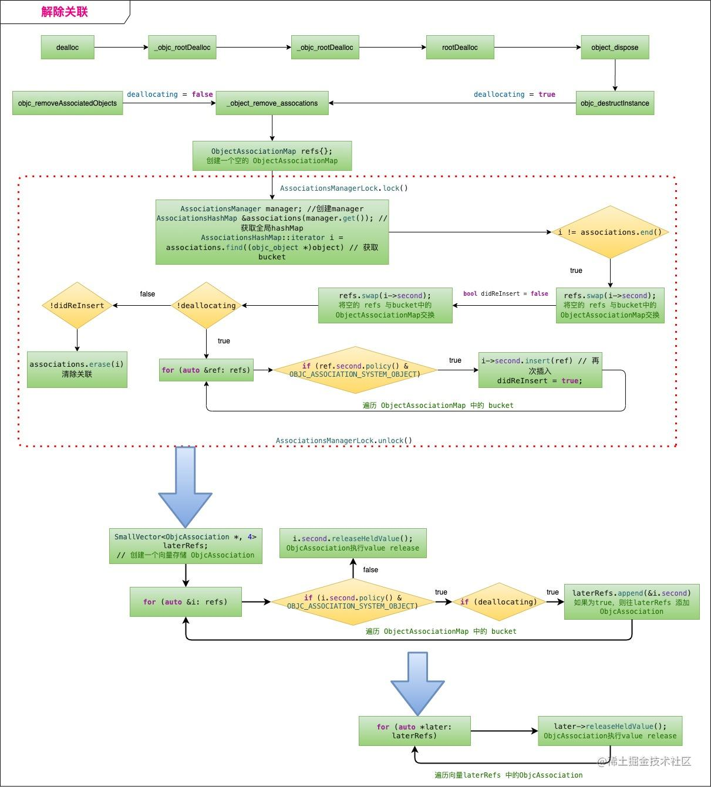

需要更深入的理解,可以对照runtime源码进行了解


<br/>
<br/>


> <h2 id="Block深入探究">Block深入探究</h2>

<br/>

- <h3 id="blokc分类">blokc分类</h3>
[blokc分类](https://github.com/harleyGit/StudyNotes/blob/master/iOS/Objective-C/Block(I).md)


<br/>
<br/>

> <h4 id='block内如何修改block外部变量'>block内如何修改block外部变量</h4>


&emsp; 默认情况下，在block中访问的外部变量是复制过去的，即：**写操作不对原变量生效**。但是你可以加上 __block 来让其写操作生效，示例代码如下:

```
   __block int auto = 0;
   void (^foo)(void) = ^{ 
       auto = 1; 
   };
   foo(); 
   //这里，a的值被修改为1
```

&emsp; 这是网上常见的描述。你同样可以在面试中这样回答，但你并没有答到“点子上”。真正的原因，并没有这么“神奇”，而且这种说法也有点牵强。面试官肯定会追问“为什么写操作就生效了？” 实际上需要有几个必要条件：

- "将 auto 从栈 copy 到堆"
- “将 auto 变量封装为结构体(对象)”

- 我会将本问题分下面几个部分，分别作答：
	- 该问题研究的是哪种 block 类型?
	- 在 block 内为什么不能修改 block 外部变量
	- 最优解及原理解析
	- 其他几种解法
	- 改外部变量必要条件之"将 auto 从栈 copy 到堆"
	- 改外部变量必要条件之“将 auto 变量封装为结构体(对象)”

<br/>
<br/>

- <h3 id="block原理">block原理</h3>
[block原理](https://www.jianshu.com/p/00a0747740ba)

[Block原理详解](https://gsl201600.github.io/2020/05/13/iOSblock原理详解/)


<br/>

- <h3 id="block都会发生循环引用吗">block都会发生循环引用吗</h3>

<br/>

> <h4 id='系统UIView的动画Block'>系统UIView的动画Block</h4>

&emsp; 系统的某些block api中，比如 UIView 的 block 版本写动画时不需要考虑循环引用的问题，但也有一些系统 api 需要考虑内存泄漏的问题。


**不会循环应用	,不会发生内存泄漏**

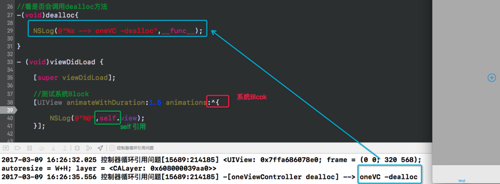

如上图，使用系统自带的UIView 的Blcok，控制器能被销毁-->说明没有发送循环引用。

原理： UIView的调用的是类方法，当前控制器不可能强引用一个类 ，所以循环无法形成 --> 动画block不会造成循环引用的原因。

&emsp; 上述的UIView动画 block 会立即执行，所以并不会持有 block 。 其中 duration 延迟时间并不能决定 block 执行的时机， block 始终是瞬间执行。

这里涉及了 CoreAnimation （核心动画）相关的知识：

首先分清下面几个结构概念：
- UIView 层
- Layer 层
- data 数据层


**其中**

- UIView 层的block 仅仅是提供了类似快照 data 的变化。
- 当真正执行  Animation 动画时才会将“原有状态”与“执行完 block 的状态”做一个差值，来去做动画。


<br/>

&emsp; AFN也有可能不会发生循环引用，是因为可能底层做了一些操作吧。


<br/>
<br/>

> <h4 id='通知+block'>通知+block</h4>

实际开发中：使用通知（NSNotifation），调用系统自带的Block，在Block中使用self --> 会发生循环引用。

twoVC发送通知 --> 给oneVC

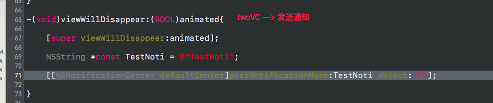

<br/>

oneVC 接收通知 使用通知-发生循环引用

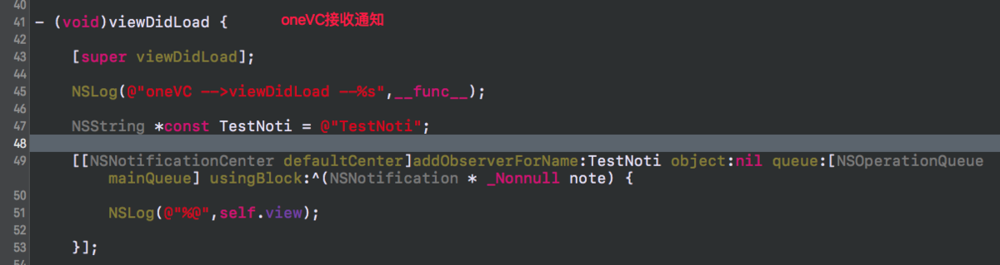

<br/>

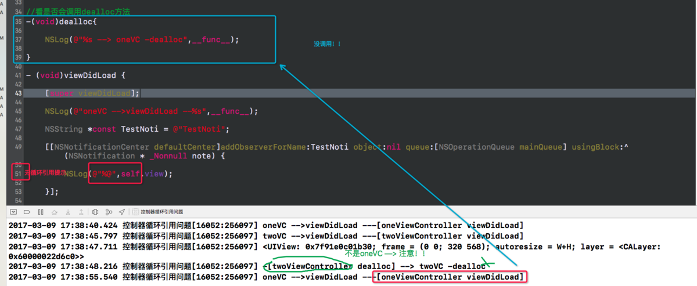


&emsp; 其实和循环引用没有关系；这里 block 强引用了 self , 但是 self 并没有强引用block; 所以没有循环引用。

**上述出现内存泄漏问题实际上是因为：**

- [NSNoficationCenter defaultCenter] 持有了 block
- 这个 block 持有了 self;
- 而 [NSNoficationCenter defaultCenter] 是一个单例，因此这个单例持有了 self, 从而导致 self 不被释放。


**解决方法：`使用weakSelf`**


<br/>

通知的另一种情况,如下:

```
//情况❶ NSNotificationCenterIVARBlock
//会循环引用	,会发生内存泄漏
 _observer = [[NSNotificationCenter defaultCenter] addObserverForName:@"testKey"
                                                               object:nil
                                                                queue:nil
                                                           usingBlock:^(NSNotification *note) {
     [self dismissModalViewControllerAnimated:YES];
 }];
```


<br/>

2). AFN框架的Block


<br/>

3). GCD的Block

```
//情况❶  GCDBlock
//不会循环引用,不会发生内存泄漏
dispatch_group_async(self.operationGroup, self.serialQueue, ^{
   [self doSomething];
});
```


<br/>

4). NSOperationQueueBlock的Block

```
//情况❶ NSOperationQueueBlock
//不会循环引用,不会发生内存泄漏
[[NSOperationQueue mainQueue] addOperationWithBlock:^{ 
	self.someProperty = xyz; 
}]; 
```


&emsp; 在 Gnustep 源码中可以证实 [NSOperationQueue mainQueue] 是单例，然后参考 addOperationWithBlock 源码可知：

虽然是单例，但它并不持有 block，不会造成循环引用，传递完成后就销毁了，不会造成无法释放的内存泄漏问题。

拓展:

&emsp;&emsp; [**GNUstep是GUN计划的项目之一**](https://www.jianshu.com/p/14bf1456dc25)，它将Cocoa的OC库重新开源实现了一遍，并且开源出来了。虽然GNUstep不是苹果官方的源码，是GNU计划写的，但是还是具有一定参考价值的。
[GNUstep源码下载地址](http://www.gnustep.org/resources/downloads.php)


<br/>
<br/>


>## <h2 id="KVO的原理"> [KVO的原理](https://www.jianshu.com/p/e59bb8f59302) </h2>

- **基本原理：**
	- 	当观察某对象 A 时，KVO 机制动态创建一个对象A当前类的子类，并为这个新的子类重写了被观察属性 keyPath 的 setter 方法。setter 方法随后负责通知观察对象属性的改变状况。

<br/>

- **深入剖析原理：**

>Apple 使用了 isa 混写（isa-swizzling）来实现 KVO 。当观察对象A时，KVO机制动态创建一个新的名为：NSKVONotifying_A 的新类，该类继承自对象A的本类，且 KVO 为 NSKVONotifying_A 重写观察属性的 setter 方法，setter 方法会负责在调用原 setter 方法之前和之后，通知所有观察对象属性值的更改情况。
（备注： isa 混写（isa-swizzling）isa：is a kind of ； swizzling：混合，搅合；）

>①NSKVONotifying_A 类剖析：在这个过程，被观察对象的 isa 指针从指向原来的 A 类，被 KVO 机制修改为指向系统新创建的子类 NSKVONotifying_A 类，来实现当前类属性值改变的监听；
所以当我们从应用层面上看来，完全没有意识到有新的类出现，这是系统“隐瞒”了对 KVO 的底层实现过程，让我们误以为还是原来的类。但是此时如果我们创建一个新的名为“NSKVONotifying_A”的类，就会发现系统运行到注册 KVO 的那段代码时程序就崩溃，因为系统在注册监听的时候动态创建了名为 NSKVONotifying_A 的中间类，并指向这个中间类了。
（isa 指针的作用：每个对象都有 isa 指针，指向该对象的类，它告诉 Runtime 系统这个对象的类是什么。所以对象注册为观察者时，isa 指针指向新子类，那么这个被观察的对象就神奇地变成新子类的对象（或实例）了。） 因而在该对象上对 setter 的调用就会调用已重写的 setter，从而激活键值通知机制。
—>我猜，这也是 KVO 回调机制，为什么都俗称KVO技术为黑魔法的原因之一吧：内部神秘、外观简洁。

>②子类setter方法剖析：KVO 的键值观察通知依赖于 NSObject 的两个方法:willChangeValueForKey:和 didChangevlueForKey:，在存取数值的前后分别调用 2 个方法：
被观察属性发生改变之前，willChangeValueForKey:被调用，通知系统该 keyPath 的属性值即将变更；当改变发生后， didChangeValueForKey: 被调用，通知系统该 keyPath 的属性值已经变更；之后， observeValueForKey:ofObject:change:context: 也会被调用。且重写观察属性的 setter 方法这种继承方式的注入是在运行时而不是编译时实现的。
KVO 为子类的观察者属性重写调用存取方法的工作原理在代码中相当于：


```
-(void)setName:(NSString *)newName{
    [self willChangeValueForKey:@"name"];    //KVO 在调用存取方法之前总调用
    [super setValue:newName forKey:@"name"]; //调用父类的存取方法
    [self didChangeValueForKey:@"name"];     //KVO 在调用存取方法之后总调用
}
```


**嘿侍面试提问：**	当使用KVO时，一个类的实例使用kvo，它的属性值改变了，那它的另一个实例变量属性值会变吗？

比如它有2个实例变量分别是A，B，若是A加的属性添加监听而B没有添加监听，则A的属性值可以改变B的不变。

若2者都添加爱了监听，则属性值都会改变。


<br/>

注意：观察者是谁，就在谁里面写观察者方法

```
//观察者是self
[self.myObject addObserver:self
                       forKeyPath:@"num"
                          options:NSKeyValueObservingOptionOld|NSKeyValueObservingOptionNew
                          context:nil];
                          
                          

//观察键值方法                          
-(void)observeValueForKeyPath:(NSString *)keyPath
                     ofObject:(id)object
                       change:(NSDictionary<NSString *,id> *)change
                      context:(void *)context {}
```


<br/>
storehub提问：NSNotification的class方法指向谁？

错误答案：指向了**NSKVONotifying_MyKVOModel**，这说明你根本就没有理解class方法如何使用的。

```
#import <objc/message.h>


- (void)viewDidLoad {
    [super viewDidLoad];
    
    // 初始化待观察类对象
    self.myObject2 = [[MyKVOModel alloc]init];
    self.myObject2.num = 2;
    
    [self.myObject2 addObserver:self
                       forKeyPath:@"num"
                          options:NSKeyValueObservingOptionOld|NSKeyValueObservingOptionNew
                          context:nil];
                          
    NSLog(@"%@", [self.myObject2 class]);
	//[obj class]返回类对象本身
	NSLog(@"---->>>2: %@", [self.myObject2 class]);
	
	//object_getClass(obj)返回类对象中的isa指向的元类对象，即指向元类对象
	NSLog(@"---->>>3: %s", object_getClassName(self.myObject2));
	NSLog(@"---->>>4: %@", object_getClass(self.myObject2));
}

```

打印结果：

```
2021-05-27 12:31:41.461998+0800 KVO演示[5668:218909] MyKVOModel
2021-05-27 12:31:43.766168+0800 KVO演示[5668:218909] ---->>>2: MyKVOModel
2021-05-27 12:31:49.794671+0800 KVO演示[5668:218909] ---->>>3: NSKVONotifying_MyKVOModel
2021-05-27 12:31:50.925324+0800 KVO演示[5668:218909] ---->>>4: NSKVONotifying_MyKVOModel

```


<br/>
<br/>


> <h2 id="APNS底层原理">APNS如何通知的，底层如何处理？</h2>
[APNs远程推送详解](https://juejin.cn/post/6844903893592178696#heading-42)


- **推送的实现方式：** 
	- 手机客户端和APNS服务器之间维持一个TCP/IP长连接，APNS服务器向客户端push消息。 
	- 苹果的推送系统是在系统级别维护一个TCP/IP长连接（所以你需要注册推送证书）

- **实现消息推送的步骤** 
	- 注册：为应用程序申请消息推送服务。此时你的app会向APNs服务器发送注册请求。 
	- APNs服务器接受请求，并将deviceToken响应给你设备上的应用程序 
	- 客户端应用程序将deviceToken发送给后台服务器程序，后台接收并储存。 
	- 后台服务器向APNs服务器发送推送消息 
	- APNs服务器将消息发给deviceToken对应的应用程序

- 想要收到推送消息，就必须要有后台服务器（下面的1、2）往 苹果的APNs的服务器发请求。 
	- 	公司自己开发后台服务器程序 
	- 	采用第三方的后台服务程序，比如：百度云推送、极光推送、友盟推送


[远程推送示意图](https://github.com/harleyGit/StudyNotes/blob/master/iOS/Objective-C/远程推送(US).md)


<br/>
<br/>

> <h2 id="NSDictionaryNSArray原理">NSDictionaryNSArray原理</h2>
[NSDictionary原理](https://juejin.cn/post/6844903608954126344)

- NSDictionary
	- NSDictionary（字典）是使用 hash表来实现key和value之间的映射和存储的， hash函数设计的好坏影响着数据的查找访问效率。数据在hash表中分布的越均匀，其访问效率越高。而在Objective-C中，通常都是利用NSString 来作为键值，其内部使用的hash函数也是通过使用 NSString对象作为键值来保证数据的各个节点在hash表中均匀分布。

<br/>

**原理：**
- NSDictionary是通过NSMapTable实现的，NSMapTable同样是一个key－value的容器。

- NSMapTable是一个哈希＋链表的数据结构，因此在NSMapTable中插入或者删除一对对象时，
- 寻找的时间是O（1）＋O（m），m最坏时可能为n
	- O（1）：为对key进行hash得到bucket的位置
	- O（m）：遍历该bucket后面冲突的value，通过链表连接起来。

- 因此NSDictionary中的Key-Value遍历时是无序的，至如按照什么样的顺序，跟hash函数相关。NSMapTable使用NSObject的哈希函数。

```
- (NSUInteger)hash {
   return (NSUInteger)self>>4;
}
```
上述是NSObject的哈希值的计算方式，简单通过移位实现。右移4位，左边补0。因为对象大多存于堆中，地址相差4位应该很正常。

**如果对象key的hash值相同，那在hash表里面的对应的value值是相同的(value值被更新了)**


<br/>

- NSArray实现原理：

&emsp； [NSArray原理](https://blog.csdn.net/Deft_MKJing/article/details/82732833)得益于使用了环形缓冲区的方法。

**ivars 的意思：**

```
_used 是计数的意思
_list 是缓冲区指针
_size 是缓冲区的大小
_offset 是在缓冲区里的数组的第一个元素索引
```

<br/>

**内存布局:**

&emsp; 最关键的部分是决定 realOffset 应该等于 fetchOffset（减去 0）还是 fetchOffset 减 _size。看着纯代码不一定能画出完美的图画，我们设想一下两个关于如何获取对象的例子。


<br/>
<br/>

>  <h2 id="self和super实现的原理">self和super实现的原理</h2>
[self和super实现的原理](https://www.jianshu.com/p/7a9912c97fdb)

**class 方法只是获取类，并不能获取真正获取其类对象。**

<br/>

**使用clang重写命令:**

```
clang -rewrite-objc test.m
```

可以将题目中的

```
[self class];
[super class];
```

转化为如下:

```
   NSLog((NSString *)&__NSConstantStringImpl__var_folders_gm_0jk35cwn1d3326x0061qym280000gn_T_main_a5cecc_mi_0, NSStringFromClass(((Class (*)(id, SEL))(void *)objc_msgSend)((id)self, sel_registerName("class"))));

   NSLog((NSString *)&__NSConstantStringImpl__var_folders_gm_0jk35cwn1d3326x0061qym280000gn_T_main_a5cecc_mi_1, NSStringFromClass(((Class (*)(__rw_objc_super *, SEL))(void *)objc_msgSendSuper)((__rw_objc_super){ (id)self, (id)class_getSuperclass(objc_getClass("Son")) }, sel_registerName("class"))));
```

<br/>


**原理：**
- 在调用[self class]时,会转换成objc_msgSend函数,我们把self作为第一个参数传递进去,第二个参数op是调用的具体类的方法的selector，后面是 selector 方法的可变参数.如例所示`[self returnSomething]`实际上是`id _Nullable objc_msgSend(self, @selector(returnSomething))`而returnSomething方法会从[self class]类中查找。如下:

```
id objc_msgSend(id self, SEL op, ...)
```

-  而在调用 [super class]时，会转化成 objc_msgSendSuper函数, 但是第一个参数是一个objc_super结构体。看下函数定义:

```
id objc_msgSendSuper(struct objc_super *super, SEL op, ...)
```

objc_super的结构体定义:

```
//结构体有两个成员，第一个成员是 receiver, 类似于上面的 objc_msgSend函数第一个参数self 
//第二个成员是记录当前类的父类是什么。
struct objc_super {
    __unsafe_unretained _Nonnull id receiver;
    __unsafe_unretained _Nonnull Class super_class;
};
```


&emsp; 当调用 ［self class] 时，实际先调用的是 objc_msgSend函数，第一个参数是 Son 为当前的这个实例，然后在 Son 这个类里面去找 - (Class)class这个方法，没有，去父类 Father里找，也没有，最后在 NSObject类中发现这个方法。而 - (Class)class的实现就是返回self的类别，故上述输出结果为 Son。

objc Runtime开源代码对- (Class)class方法的实现:

```
- (Class)class {
   return object_getClass(self);
}
```


&emsp; 而当调用 [super class]时，会转换成objc_msgSendSuper函数。第一步先构造 objc_super 结构体，结构体第一个成员就是 self 。 第二个成员是 (id)class_getSuperclass(objc_getClass(“Son”)) , 实际该函数输出结果为 Father。

&emsp; 第二步是去 Father这个类里去找 - (Class)class，没有，然后去NSObject类去找，找到了。最后内部是使用 objc_msgSend(objc_super->receiver, @selector(class))去调用，

&emsp; 此时已经和[self class]调用相同了，故上述输出结果仍然返回 Son。


<br/>
<br/>

>## <h2 id="ARC原理是什么">[ARC原理是什么](https://github.com/harleyGit/StudyNotes/blob/master/iOS/Objective-C/ARC原理.md)</h2>

&emsp; ARC 是 iOS 中管理引用计数的技术，帮助 iOS 实现垃圾自动回收，具体实现的原理是由编译器进行管理的，同时运行时库协助编译器辅助完成。主要涉及到 Clang （LLVM 编译器） 和 objc4 运行时库。


<br/>
<br/>

>## <h2 id="内存管理">[内存管理](https://github.com/harleyGit/StudyNotes/blob/master/底层/内存管理.md)</h2>


<br/>
<br/>

> <h3 id="一个objc对象如何进行内存布局">一个objc对象如何进行内存布局?</h3>

**在考虑有父类的情况下**

- 所有父类的成员变量和自己的成员变量都会存放在该对象所对应的存储空间中.
- 每一个对象内部都有一个isa指针,指向他的类对象,类对象中存放着本对象的:
	- 对象方法列表（对象能够接收的消息列表，保存在它所对应的类对象中）
	- 成员变量的列表,
	- 属性列表,

&emsp; 类对象内部也有一个isa指针指向元对象(meta class),元对象内部存放的是类方法列表,类对象内部还有一个superclass的指针,指向他的父类对象。

&emsp; 每个 Objective-C 对象都有相同的结构，如下图所示：


翻译过来如下:

| **Objective-C 对象的结构图** |
|:--|
| ISA指针 |
| 根类的实例变量 |
| 倒数第二层父类的实例变量 |
| . . . . . |
| 父类的实例变量 |
| 类的实例变量 |

<br/>

- 根对象就是NSObject，它的superclass指针指向nil
- 类对象既然称为对象，那它也是一个实例。类对象中也有一个isa指针指向它的元类(meta class)，即类对象是元类的实例。元类内部存放的是类方法列表，根元类的isa指针指向自己，superclass指针指向NSObject类。
- 类对象 是放在**数据段(数据区)**上的, 和全局变量放在一个地方. 这也就是为什么: **同一个类对象的不同实例对象,的isa指针是一样的**.
- 实例对象存放在堆中


<br/>
<br/>


>### <h3 id="isa指针包含了什么">[isa指针包含了什么](https://juejin.cn/post/6844904134286524429#heading-2)</h3>

在控制台输出obj的数据结构，排在第一位的就是isa的地址。

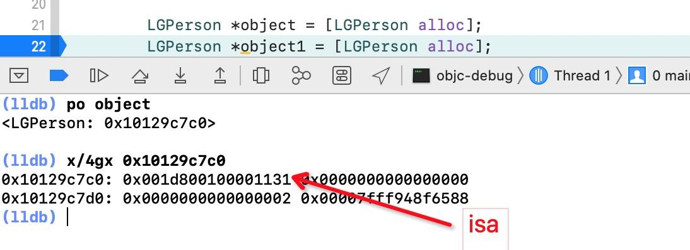

&emsp; 若对象继承自NSObject，NSObject在底层的实现是结构体objc_object，里面只有一个isa成员变量，那么对象的首地址指向的第一块就是isa所在。


从源码里面看isa是Class类型：

```
struct objc_object {
	Class _Nonnull isa OBJC_ISA_AVAILABILITY;
}
```

Class 类型其实是objc_class:

```
typedef struct objc_class *Class;
typedef struct objc_object *id;

```


&emsp; 可以看到objc_class继承自objc_object，那么里面就应该有一个isa。此外还有的成员变量就是**`superclass、cache、bits、data`** ，在**`objc-runtime-new.h`**文件中，这是最新的:

```
struct objc_class : objc_object {
    // Class ISA;
    Class superclass;
    cache_t cache;             // 方法缓存
    class_data_bits_t bits;    // 获取具体类信息

    class_rw_t *data() const {
        return bits.data();
    }
    void setData(class_rw_t *newData) {
        bits.setData(newData);
    }

    void setInfo(uint32_t set) {
        ASSERT(isFuture()  ||  isRealized());
        data()->setFlags(set);
    }

    void clearInfo(uint32_t clear) {
        ASSERT(isFuture()  ||  isRealized());
        data()->clearFlags(clear);
    }

    // set and clear must not overlap
    void changeInfo(uint32_t set, uint32_t clear) {
        ASSERT(isFuture()  ||  isRealized());
        ASSERT((set & clear) == 0);
        data()->changeFlags(set, clear);
    }
    
    · · · · · · · · · ·
    
    · · · · · · · ·
    
    · · · · · ·
    
    //下面还有300多行代码，我就不粘贴复制了
}


```


<br/>

**isa结构**

从上面的代码看，还是看不出isa的结构，但是看过 [**iOS alloc & init 方法解析**](https://juejin.cn/post/6844904133074370573) 的朋友应该有印象，在alloc方法里面会调用一个叫initIsa()的方法，那么是不是可以在这个方法中找到isa的真正结构呢？

在runtime的源码文件**objc-object.h**,可以看到这个C++方法：**objc_object::initIsa**

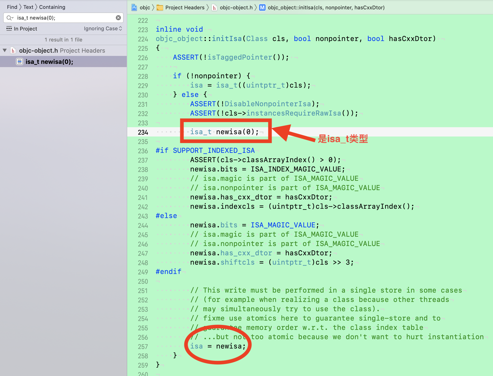

点击isa_t,发现其是个联合体，接下来看**ISA_BITFIELD**


```
#include "isa.h"

union isa_t {
    isa_t() { }
    isa_t(uintptr_t value) : bits(value) { }

    Class cls;
    uintptr_t bits;
#if defined(ISA_BITFIELD)
    struct {
        ISA_BITFIELD;  // defined in isa.h
    };
#endif
};
```


点击 ISA_BITFIELD可以看到其宏定义内容：

```
#if SUPPORT_PACKED_ISA

    // extra_rc must be the MSB-most field (so it matches carry/overflow flags)
    // nonpointer must be the LSB (fixme or get rid of it)
    // shiftcls must occupy the same bits that a real class pointer would
    // bits + RC_ONE is equivalent to extra_rc + 1
    // RC_HALF is the high bit of extra_rc (i.e. half of its range)

    // future expansion:
    // uintptr_t fast_rr : 1;     // no r/r overrides
    // uintptr_t lock : 2;        // lock for atomic property, @synch
    // uintptr_t extraBytes : 1;  // allocated with extra bytes

# if __arm64__
#   define ISA_MASK        0x0000000ffffffff8ULL
#   define ISA_MAGIC_MASK  0x000003f000000001ULL
#   define ISA_MAGIC_VALUE 0x000001a000000001ULL
#   define ISA_BITFIELD                                                      \
      uintptr_t nonpointer        : 1;                                       \
      uintptr_t has_assoc         : 1;                                       \
      uintptr_t has_cxx_dtor      : 1;                                       \
      uintptr_t shiftcls          : 33; /*MACH_VM_MAX_ADDRESS 0x1000000000*/ \
      uintptr_t magic             : 6;                                       \
      uintptr_t weakly_referenced : 1;                                       \
      uintptr_t deallocating      : 1;                                       \
      uintptr_t has_sidetable_rc  : 1;                                       \
      uintptr_t extra_rc          : 19
#   define RC_ONE   (1ULL<<45)
#   define RC_HALF  (1ULL<<18)

# elif __x86_64__
#   define ISA_MASK        0x00007ffffffffff8ULL
#   define ISA_MAGIC_MASK  0x001f800000000001ULL
#   define ISA_MAGIC_VALUE 0x001d800000000001ULL
#   define ISA_BITFIELD                                                        \
      uintptr_t nonpointer        : 1;                                         \
      uintptr_t has_assoc         : 1;                                         \
      uintptr_t has_cxx_dtor      : 1;                                         \
      uintptr_t shiftcls          : 44; /*MACH_VM_MAX_ADDRESS 0x7fffffe00000*/ \
      uintptr_t magic             : 6;                                         \
      uintptr_t weakly_referenced : 1;                                         \
      uintptr_t deallocating      : 1;                                         \
      uintptr_t has_sidetable_rc  : 1;                                         \
      uintptr_t extra_rc          : 8
#   define RC_ONE   (1ULL<<56)
#   define RC_HALF  (1ULL<<7)

# else
#   error unknown architecture for packed isa
# endif

// SUPPORT_PACKED_ISA
#endif

```

| 参数名 | 作用 | 大小 | 所在位置 |
|:--|:--|:--|:--|
| nonpointer | 是否对isa指针开启指针优化 0：纯isa指针只包含类对象地址  1：isa中包含了类对象地址、类信息、对象的引用计数等 | 1 | 0 |
| has_assoc | 是否有关联对象 0：没有 1：存在 | 1 | 1 |
| has_cxx_dtor | 该对象是否有C++或者Objc的析构器 如果有析构函数则需要做析构逻辑 如果没有则可以更快的释放对象 | 1 | 2 |
| shiftcls | 存储类指针的值。开启指针优化的情况下，在arm64架构中有 33 位用来存储类指针 | 33 | 3 ~ 35 |
| magic | 用于调试器判断当前对象是真的对象还是没有初始化的空间 | 5 | 36 ~ 40 |
| weakly_referenced | 是否有弱引用 0：没有1：存在 | 1 | 41 |
| deallocating | 是否正在释放内存 0：不是 1：是 | 1 | 42 |
| has_sidetable_rc | 是否需要用到外挂引用计数，当对象引用技术大于 10 则需要借用该变量存储进位 | 1 | 43 |
| extra_rc | 该对象的引用计数值，实际上是引用计数值减 1。 如果对象的引用计数为10，那么 extra_rc 为 9。如果引用计数大于 10 则需要使用 has_sidetable_rc | 19 | 44 ~ 63 |

<br/>
<br/>


>### <h3 id="weak原理">[weak原理](http://www.cocoachina.com/articles/18962)</h3>


&emsp; **介绍：**Runtime维护了一个weak表，用于存储指向某个对象的所有weak指针。weak表其实是一个hash（哈希）表，Key是所指对象的地址，Value是weak指针的地址数组。更多人的人只是知道weak是弱引用，所引用对象的计数器不会加一，并在引用对象被释放的时候自动被设置为nil，通常用于解决循环引用问题。


- weak 的实现原理可以概括一下三步：

	- 1)、初始化时：runtime会调用objc_initWeak函数，初始化一个新的weak指针指向对象的地址。

	- 2)、添加引用时：objc_initWeak函数会调用 objc_storeWeak() 函数， objc_storeWeak() 的作用是更新指针指向，创建对应的弱引用表。

	- 3)、释放时，调用clearDeallocating函数。clearDeallocating函数首先根据对象地址获取所有weak指针地址的数组，然后遍历这个数组把其中的数据设为nil，最后把这个entry从weak表中删除，最后清理对象的记录。


<br/>
<br/>

>## <h3 id="内存销毁时间表&步骤">内存销毁时间表&步骤</h3>

```
// 对象的内存销毁时间表
// http://weibo.com/luohanchenyilong/ (微博@iOS程序犭袁)
// https://github.com/ChenYilong
// 根据 WWDC 2011, Session 322 (36分22秒)中发布的内存销毁时间表 

 1. 调用 -release ：引用计数变为零
     * 对象正在被销毁，生命周期即将结束.
     * 不能再有新的 __weak 弱引用， 否则将指向 nil.
     * 调用 [self dealloc] 
 2. 子类 调用 -dealloc
     * 继承关系中最底层的子类 在调用 -dealloc
     * 如果是 MRC 代码 则会手动释放实例变量们（iVars）
     * 继承关系中每一层的父类 都在调用 -dealloc
 3. NSObject 调 -dealloc
     * 只做一件事：调用 Objective-C runtime 中的 object_dispose() 方法
 4. 调用 object_dispose()
     * 为 C++ 的实例变量们（iVars）调用 destructors 
     * 为 ARC 状态下的 实例变量们（iVars） 调用 -release 
     * 解除所有使用 runtime Associate方法关联的对象
     * 解除所有 __weak 引用
     * 调用 free()
```

<br/>
<br/>

>## <h3 id="Category属性放在哪">[Category属性放在哪](https://www.jianshu.com/p/bc4678829397)</h3>


Category的实现原理或者本质 ？

   Category编译之后的底层结构是struct category_t，里面存储着分类的对象方法、类方法、属性、协议信息

    在程序运行的时候，runtime会将Category的数据合并到类信息中（类对象、元类对象中）

    分类的实现原理是将category中的方法，属性，协议数据放在category_t结构体中，然后将结构体内的方法列表拷贝到类对象的方法列表中。 

3.Category的加载处理过程是什么？

   通过Runtime加载某个类的所有Category数据

    把所有Category的方法、属性、协议数据，合并到一个大数组中

    后面参与编译的Category数据，会在数组的前面

    将合并后的分类数据（方法、属性、协议），插入到类原来数据的前面

可以理解为：

    把 category 的实例方法、协议以及属性添加到类上。

    把 category 的类方法和协议添加到类的 metaclass 上。

其中需要注意的是：

category 的方法没有「完全替换掉」原来类已经有的方法，也就是说如果 category 和原来类都有 methodA，那么 category 附加完成之后，类的方法列表里会有两个 methodA。

category 的方法被放到了新方法列表的前面，而原来类的方法被放到了新方法列表的后面，这也就是我们平常所说的category 的方法会「覆盖」掉原来类的同名方法，这是因为运行时在查找方法的时候是顺着方法列表的顺序查找的，它只要一找到对应名字的方法，就会返回，不会管后面可能还有一样名字的方法。

4.Category为什么不能添加成员变量?

Category 可以给类增加方法和属性，但是并不会自动生成成员变量及set/get方法。因为category_t结构体中并不存在成员变量。我们知道成员变量是存放在实例对象中的，并且编译的那一刻就已经决定好了。而分类是在运行时才去加载的。那么我们就无法再程序运行时将分类的成员变量中添加到实例对象的结构体中。因此分类中不可以添加成员变量。

在 Objective-C 提供的 runtime 函数中，确实有一个 class_addIvar() 函数用于给类添加成员变量，

大概的意思说，这个函数只能在“构建一个类的过程中”调用。当编译类的时候，编译器生成了一个实例变量内存布局 ivar layout，来告诉运行时去那里访问类的实例变量们，一旦完成类定义，就不能再添加成员变量了。经过编译的类在程序启动后就被 runtime 加载，没有机会调用 addIvar。程序在运行时动态构建的类需要在调用 objc_registerClassPair 之后才可以被使用，同样没有机会再添加成员变量。

不能为一个类动态的添加成员变量，可以给类动态增加方法和属性。因为方法和属性并不“属于”类实例，而成员变量“属于”类实例。我们所说的“类实例”概念，指的是一块内存区域，包含了isa指针和所有的成员变量。所以假如允许动态修改类成员变量布局，已经创建出的类实例就不符合类定义了，变成了无效对象。但方法定义是在objc_class中管理的，不管如何增删类方法，都不影响类实例的内存布局，已经创建出的类实例仍然可正常使用。


<br/>
<br/>


> <h3 id='能否向编译后得到的类中增加实例变量？能否向运行时创建的类中添加实例变量?'>能否向编译后得到的类中增加实例变量？能否向运行时创建的类中添加实例变量?</h3>

- 不能向编译后得到的类中增加实例变量；
- 能向运行时创建的类中添加实例变量；

<br/>

**解释下：**

&emsp; 因为编译后的类已经注册在 runtime 中，类结构体中的 objc_ivar_list 实例变量的链表 和 instance_size 实例变量的内存大小已经确定，同时runtime 会调用 class_setIvarLayout 或 class_setWeakIvarLayout 来处理 strong weak 引用。所以不能向存在的类中添加实例变量；

&emsp; 运行时创建的类是可以添加实例变量，调用 class_addIvar 函数。但是得在调用 objc_allocateClassPair 之后，objc_registerClassPair 之前，原因同上。


<br/>
<br/>

- **[Xcode编译过程步骤大概可以分为4个](https://blog.csdn.net/fanyun_01/article/details/118279039)：**
	- (1).预处理（Pre-process）：把宏替换，删除注释，展开头文件，产生 .i 文件
	- (2).编译（Compliling）：把之前的 .i 文件转换成汇编语言，产生 .s文件
	- (3).汇编（Asembly）：把汇编语言文件转换为机器码文件，产生 .o 文件
	- (4).链接（Link）：对.o文件中的对于其他的库的引用的地方进行引用，生成最后的可执行文件（同时也包括多个 .o 文件进行 link）


<br/>

[**OC动态性总结:**](https://blog.csdn.net/cordova/article/details/53876682)

**编译时：** 即编译器对语言的编译阶段，编译时只是对语言进行最基本的检查报错，包括词法分析、语法分析等等，将程序代码翻译成计算机能够识别的语言（例如汇编等），编译通过并不意味着程序就可以成功运行。

**运行时：** 即程序通过了编译这一关之后编译好的代码被装载到内存中跑起来的阶段，这个时候会具体对类型进行检查，而不仅仅是对代码的简单扫描分析，此时若出错程序会崩溃。

&emsp; 可以说编译时是一个静态的阶段，类型错误很明显可以直接检查出来，可读性也好；而运行时则是动态的阶段，开始具体与运行环境结合起来。


<br/>
<br/>


> <h3 id='objc使用什么机制管理对象内存'>objc使用什么机制管理对象内存</h3>

- 通过 retainCount 的机制来决定对象是否需要释放。
- release 对象的各种情况如下：


<br/>

- **1.对象成员变量**

&emsp; 这个对象 dealloc 时候，成员变量 objc_storeStrong(&ivar,nil) release

- **2.局部变量变量的释放 分情况：**

	- 2.1strong obj变量，出了作用域{}，就  objc_storeStrong(obj,nil) release 对象；

```
void
objc_storeStrong(id *location, id obj)
{

id prev = *location;
if (obj == prev) {
   return;
}
objc_retain(obj);
*location = obj;
objc_release(prev);
}
```

- 2.1weak obj变量，出了作用域，objc_destroyWeak 将变量（obj）的地址从weak表中删除。；

- 2.2 autorelease obj变量，交给 autoreleasePool对象管理， 
	- （1）主动使用 @autoreleasepool{}，出了 {} 对象release 
	- （2）不使用 @autoreleasepool{}，交给线程管理
		- 	①线程开启runloop，在每次 kCFRunLoopBeforeWaiting 休眠时候，执行PoolPop（release对象）再PoolPush;
		- 	②线程没有开启runloop，在线程结束时候执行 PoolPop（release对象）


<br/>

***
<br/>

># 网络

[**iOS状态码解读**](https://github.com/ChenYilong/iOSDevelopmentTips/blob/master/Tips/HTTP状态码汇总.md)

<br/>

> <h2 id="NSURLSession与RunLoop的联系">NSURLSession与RunLoop的联系</h2>


AFNet2.0网络请求常驻线程机制

```
//使用GCD开启一个子线程来发送网络请求
dispatch_async(dispatch_get_global_queue(0, 0), ^{
    //使用非自动发送网络请求模式,发送请求OK
    /*
    //创建NSURLConnection对象，设置代理，暂不发送
	  NSURLConnection *connect =  [[NSURLConnection alloc]initWithRequest:request delegate:self startImmediately:NO];
    //设置代理方法的执行队列
    [connect setDelegateQueue:[[NSOperationQueue alloc]init]];

    //调用start发送网络请求
    [connect start];
    */

    //使用自动发送网络请求模式，发送请求失败（需要改造代码）
    //WHY?
    /*1⃣️ 网络请求发送和数据接收是否成功，和一些因素相关，比如客户端的网速、服务器端的查询速度等等。
      2⃣️ 而在子线程中创建的NSURLConnection对象是一个临时变量，当请求发送完成之后就被释放了，所以这个时候它的代理方法不会调用用。
      3⃣️ 为什么使用非自动发送网络请求模式是OK的。
        因为在该模式中，调用了start来开始发送网络请求，该方法内部会自动将当前的connect作为一个Source添加到当前线程所在的Runloop中
        如果当前线程是子线程（即当前线程的runloop并未创建），那么该方法内部会默认先创建当前线程的Runloop,设置在runloop的默认模式下运行。
        此时runloop会对这个Connect对象进行强引用，保证了代理方法被调用的前提
     */
    NSURLConnection *connect = [[NSURLConnection alloc]initWithRequest:request delegate:self];
    [connect setDelegateQueue:[[NSOperationQueue alloc]init]];
    
    //创建当前线程的runloop，并开启runloop
    [[NSRunLoop currentRunLoop] run];
});

```

&emsp; 在 SDWebImage 的 v3.7.0 版本及以前，并没有引入 NSURLSession 而是采用的 NSURLConnection。而后者往往是需要与 Runloop 协同使用，因为每个 Connect 会作为一个 Source 添加到当前线程所在的 Runloop 中，并且 Runloop 会对这个 Connect 对象强引用，以保证代理方法可以调用。

<br/>

iOS 中，关于网络请求的接口自下至上有如下几层:

```
CFSocket
CFNetwork       ->ASIHttpRequest
NSURLConnection ->AFNetworking
NSURLSession    ->AFNetworking2, Alamofire
```


CFSocket 是最底层的接口，只负责 socket 通信。
- CFNetwork 是基于 CFSocket 等接口的上层封装，ASIHttpRequest 工作于这一层。
- NSURLConnection 是基于 CFNetwork 的更高层的封装，提供面向对象的接口，AFNetworking 工作于这一层。
- NSURLSession 是 iOS7 中新增的接口，表面上是和 NSURLConnection 并列的，但底层仍然用到了 NSURLConnection 的部分功能 (比如 com.apple.NSURLConnectionLoader 线程)，AFNetworking2 和 Alamofire 工作于这一层。

下面主要介绍下 NSURLConnection 的工作过程。

&emsp; 通常使用 NSURLConnection 时，你会传入一个 Delegate，当调用了 [connection start] 后，这个 Delegate 就会不停收到事件回调。实际上，start 这个函数的内部会会获取 CurrentRunLoop，然后在其中的 DefaultMode 添加了4个 Source0 (即需要手动触发的Source)。CFMultiplexerSource 是负责各种 Delegate 回调的，CFHTTPCookieStorage 是处理各种 Cookie 的。

&emsp; 当开始网络传输时，我们可以看到 NSURLConnection 创建了两个新线程：com.apple.NSURLConnectionLoader 和 com.apple.CFSocket.private。其中 CFSocket 线程是处理底层 socket 连接的。NSURLConnectionLoader 这个线程内部会使用 RunLoop 来接收底层 socket 的事件，并通过之前添加的 Source0 通知到上层的 Delegate。

<br/>


**RunLoop实际应用举例**

AFNetworking
AFURLConnectionOperation 这个类是基于 NSURLConnection 构建的，其希望能在后台线程接收 Delegate 回调。为此 AFNetworking 单独创建了一个线程，并在这个线程中启动了一个 RunLoop：


```
+ (void)networkRequestThreadEntryPoint:(id)__unused object {
    @autoreleasepool {
        [[NSThread currentThread] setName:@"AFNetworking"];
        NSRunLoop *runLoop = [NSRunLoop currentRunLoop];
        [runLoop addPort:[NSMachPort port] forMode:NSDefaultRunLoopMode];
        [runLoop run];
    }
}
 
+ (NSThread *)networkRequestThread {
    static NSThread *_networkRequestThread = nil;
    static dispatch_once_t oncePredicate;
    dispatch_once(&oncePredicate, ^{
        _networkRequestThread = [[NSThread alloc] initWithTarget:self selector:@selector(networkRequestThreadEntryPoint:) object:nil];
        [_networkRequestThread start];
    });
    return _networkRequestThread;
}
```

RunLoop 启动前内部必须要有至少一个 Timer/Observer/Source，所以 AFNetworking 在 [runLoop run] 之前先创建了一个新的 NSMachPort 添加进去了。通常情况下，调用者需要持有这个 NSMachPort (mach_port) 并在外部线程通过这个 port 发送消息到 loop 内；但此处添加 port 只是为了让 RunLoop 不至于退出，并没有用于实际的发送消息。

```
- (void)start {
    [self.lock lock];
    if ([self isCancelled]) {
        [self performSelector:@selector(cancelConnection) onThread:[[self class] networkRequestThread] withObject:nil waitUntilDone:NO modes:[self.runLoopModes allObjects]];
    } else if ([self isReady]) {
        self.state = AFOperationExecutingState;
        [self performSelector:@selector(operationDidStart) onThread:[[self class] networkRequestThread] withObject:nil waitUntilDone:NO modes:[self.runLoopModes allObjects]];
    }
    [self.lock unlock];
}
```

当需要这个后台线程执行任务时，AFNetworking 通过调用 [NSObject performSelector:onThread:..] 将这个任务扔到了后台线程的 RunLoop 中。


<br/>
<br/>


>## <h2 id="网络性能优化">[**网络性能优化**](https://www.jianshu.com/p/a470ab485e39)</h2>


<br/>

- [**网络缓存（URL缓存）**](https://www.jianshu.com/p/fb5aaeac06ef)

&emsp; 如果打算在項目中加入網絡請求緩存，你並不需要自己造一個輪子，瞭解一下NSURLCache就足夠，這是一個Apple已經為你準備好了的網絡請求緩存類。

```
public enum NSURLRequestCachePolicy : UInt {
case UseProtocolCachePolicy // 默認值
case ReloadIgnoringLocalCacheData // 不使用緩存數據
case ReloadIgnoringLocalAndRemoteCacheData // Unimplemented
public static var ReloadIgnoringCacheData: NSURLRequestCachePolicy { get } //忽略缓存直接从原始地址下载
case ReturnCacheDataElseLoad // 無論緩存是否過期都是用緩存，沒有緩存就進行網絡請求
case ReturnCacheDataDontLoad // 無論緩存是否過期都是用緩存，沒有緩存也不會進行網絡請求
case ReloadRevalidatingCacheData // Unimplemented
}


//使用NSURLCache之前需要在AppDelegate中緩存空間的設置：
- (BOOL)application:(UIApplication *)application didFinishLaunchingWithOptions:(NSDictionary *)launchOptions
{
	NSURLCache *URLCache = [[NSURLCache alloc] initWithMemoryCapacity:4 * 1024 * 1024
	diskCapacity:20 * 1024 * 1024
	diskPath:nil];
	[NSURLCache setSharedURLCache:URLCache];
}
```

&emsp; 文件的缓存是否有效是通过`Last-Modified`和`ETag`来进行判断的。

<br/>

- **`Last-Modified`**顾名思义，是资源最后修改的时间戳，往往与缓存时间进行对比来判断缓存是否过期。

&emsp; 在浏览器第一次请求某一个URL时，服务器端的返回状态会是200，内容是你请求的资源，同时有一个Last-Modified的属性标记此文件在服务期端最后被修改的时间，格式类似这样：

`Last-Modified: Fri, 12 May 2006 18:53:33 GMT`

&emsp; 客户端第二次请求此URL时，根据 HTTP 协议的规定，浏览器会向服务器传送 If-Modified-Since 报头，询问该时间之后文件是否有被修改过：

`If-Modified-Since: Fri, 12 May 2006 18:53:33 GMT`


<br/>

- ETag 是的功能与 Last-Modified 类似：服务端不会每次都会返回文件资源。

&emsp; 客户端每次向服务端发送上次服务器返回的 ETag 值，服务器会根据客户端与服务端的 ETag 值是否相等，来决定是否返回 data，同时总是返回对应的 HTTP 状态码。客户端通过 HTTP 状态码来决定是否使用缓存。比如：服务端与客户端的 ETag 值相等，则 HTTP 状态码为 304，不返回 data。服务端文件一旦修改，服务端与客户端的 ETag 值不等，并且状态值会变为200，同时返回 data。


总结： 在官方给出的文档中提出 ETag 是首选的方式，优于 Last-Modified 方式。因为 ETag 是基于 hash ，hash 的规则可以自己设置，而且是基于一致性，是“强校验”。 Last-Modified 是基于时间，是弱校验，弱在哪里？比如说：如果服务端的资源回滚客户端的 Last-Modified 反而会比服务端还要新。


<br/>

- [网络模块优化(失败、缓存请求重发)](https://www.cnblogs.com/ziyi--caolu/p/8176331.html)


<br/>

- [HTTPDNS实践](https://www.jianshu.com/p/fb54405dbdca)

[HTTPDNS在App开发中实践总结](http://www.iosfly.com/2016/12/03/HTTPDNS/)

为什么有些公司的网络接口使用的英文域名而不是IP地址？

这是因为使用IP地址就可以防止你的域名被DNS劫持，造成网络差和其他运营商给你加各种内容。

- [HttpDns 在 iOS 端的接入方案](https://juejin.cn/post/6844904144705339400)

- [即时通讯性能调优](https://github.com/ChenYilong/iOSBlog/issues/6)
- [网络请求优化之取消请求](https://www.jianshu.com/p/20f6172524d6)
- [iOS网络层设计](https://www.jianshu.com/p/fe0dd50d0af1)


<br/>
<br/>


> <h2 id="TCP和UDP区别">TCP和UDP区别</h2>


- **TCP：**面向连接、传输可靠(保证数据正确性,保证数据顺序)、用于传输大量数据(流模式)、速度慢，建立连接需要开销较多(时间，系统资源)。

- **UDP：**面向非连接、传输不可靠、用于传输少量数据(数据包模式)、速度快。

- 比较：
	- 基于连接与无连接；
	- 对系统资源的要求（TCP较多，UDP少）；
	- UDP程序结构较简单；
	- 流模式与数据报模式 ；
	- TCP保证数据正确性，UDP可能丢包，TCP保证数据顺序，UDP不保证


<br/>
<br/>

> <h2 id="Socket通信">Socket通信</h2>

<br/>

> <h3 id="Socket封包拆包">Socket封包、拆包</h3>
[Socket封包、粘包、拆包处理](https://www.jianshu.com/p/9ea0f0c84990)


&emsp; iOS客户端用第三方[CocoaAsyncSocket](https://github.com/robbiehanson/CocoaAsyncSocket)来进行长连接连接和传输数据。

&emsp; 一般在使用Socket的时候，后台会对Socket传输数据有一个自定义的协议，协议可能有些差别不过基本上是大同小异。 如图

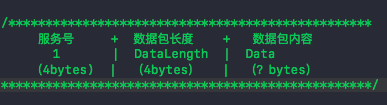

&emsp; 也就是说我们通过Socket发送给服务器的数据，最终要转换成二进制流数据，并且按照协议约定的格式。

&emsp; 下面我简单解释下这个协议，因为一开始我自己也不是很理解。这个协议是指我们在发送的数据包头部开辟一个4个字节长度的空间，用来存储服务号转换成的二进制数据。（将1转换成二进制数据存储进去占4个字节长度），然后再将数据包长度转换成二进制数据并存储到后面开辟的4个字节中（这里需要注意下如果数据要进行加密传输，这里的长度应是加密后的长度），最后将数据数据包转换成二进制数据添加到后面，组成一个完整的数据包也就是封包。这里一定要按协议规定的顺序不然服务器解析不了。


&emsp; **字段定义：**
- **粘包：**
	- 指TCP协议中，发送方发送的若干包数据到接收方接收时粘成一包，从接收缓冲区看，后一包数据的头紧接着前一包数据的尾。
	
	- TCP是面向字节流的协议，就是没有界限的一串数据，本没有“包”的概念，“粘包”和“拆包”一说是为了有助于形象地理解这两种现象。


<br/>

- **提问：为什么UDP没有粘包？**
	- 粘包拆包问题在数据链路层、网络层以及传输层都有可能发生。日常的网络应用开发大都在传输层进行，由于UDP有消息保护边界，不会发生粘包拆包问题，因此粘包拆包问题只发生在TCP协议中。


<br/>

- **粘包拆包发生场景**

	- 因为TCP是面向流，没有边界，而操作系统在发送TCP数据时，会通过缓冲区来进行优化，例如缓冲区为1024个字节大小。
	
	- 如果一次请求发送的数据量比较小，没达到缓冲区大小，TCP则会将多个请求合并为同一个请求进行发送，这就形成了粘包问题。
	
	- 如果一次请求发送的数据量比较大，超过了缓冲区大小，TCP就会将其拆分为多次发送，这就是拆包。

关于粘包和拆包可以参考下图的几种情况：

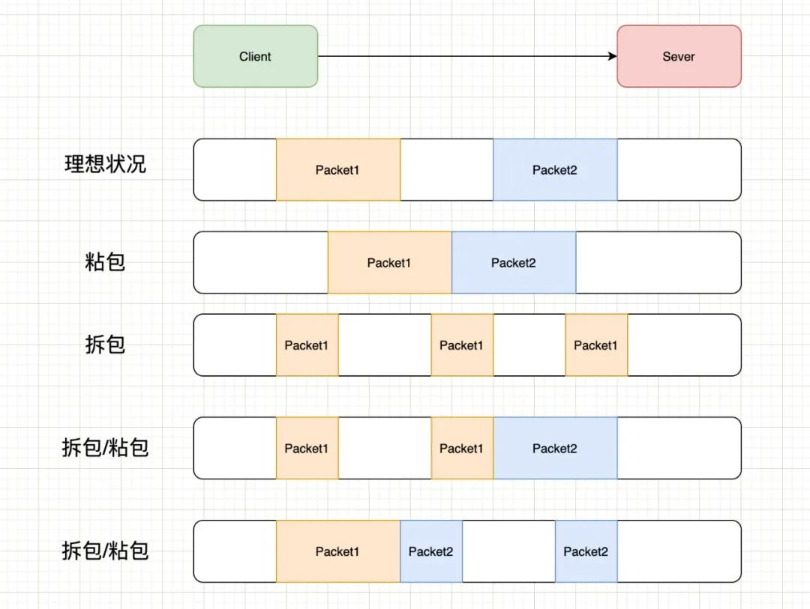

- 上图中演示了以下几种情况：
	- 正常的理想情况，两个包恰好满足TCP缓冲区的大小或达到TCP等待时长，分别发送两个包；
	- 粘包：两个包较小，间隔时间短，发生粘包，合并成一个包发送；
	- 拆包：一个包过大，超过缓存区大小，拆分成两个或多个包发送；
	- 拆包和粘包：Packet1过大，进行了拆包处理，而拆出去的一部分又与Packet2进行粘包处理。


<br/>

- **常见的四种解决方案**
	- 发送端将每个包都封装成固定的长度，比如100字节大小。如果不足100字节可通过补0或空等进行填充到指定长度；
	- 发送端在每个包的末尾使用固定的分隔符，例如\r\n。如果发生拆包需等待多个包发送过来之后再找到其中的\r\n进行合并；例如，FTP协议；
	- 将消息分为头部和消息体，头部中保存整个消息的长度，只有读取到足够长度的消息之后才算是读到了一个完整的消息；
	- 通过自定义协议进行粘包和拆包的处理。


<br/>


**Netty对粘包和拆包问题的处理**
- Netty对解决粘包和拆包的方案做了抽象，提供了一些解码器（Decoder）来解决粘包和拆包的问题。如：
	- LineBasedFrameDecoder：以行为单位进行数据包的解码；
	- DelimiterBasedFrameDecoder：以特殊的符号作为分隔来进行数据包的解码；
	- FixedLengthFrameDecoder：以固定长度进行数据包的解码；
	- LenghtFieldBasedFrameDecode：适用于消息头包含消息长度的协议（最常用）；
	- 基于Netty进行网络读写的程序，可以直接使用这些Decoder来完成数据包的解码。对于高并发、大流量的系统来说，每个数据包都不应该传输多余的数据（所以补齐的方式不可取），LenghtFieldBasedFrameDecode更适合这样的场景。

<br/>

**总结：**TCP协议粘包拆包问题是因为TCP协议数据传输是基于字节流的，它不包含消息、数据包等概念，需要应用层协议自己设计消息的边界，即消息帧（Message Framing）。如果应用层协议没有使用基于长度或者基于终结符息边界等方式进行处理，则会导致多个消息的粘包和拆包。

<br/>

**拓展：**

&emsp; [**Netty**](https://juejin.cn/post/6844903703183360008)是一个非阻塞I/O客户端-服务器框架，主要用于开发Java网络应用程序，如协议服务器和客户端。异步事件驱动的网络应用程序框架和工具用于简化网络编程，例如TCP和UDP套接字服务器。[2]Netty包括了反应器编程模式的实现。Netty最初由JBoss开发，现在由Netty项目社区开发和维护。

&emsp; 有了Netty，你可以实现自己的HTTP服务器，FTP服务器，UDP服务器，RPC服务器，WebSocket服务器，Redis的Proxy服务器，MySQL的Proxy服务器等等。 

[聊天系统设计](https://m.imooc.com/wiki/nettylesson-netty28)

[**Netty是什么？它能干什么？**](https://www.cnblogs.com/ivy-xu/p/12656290.html) 


<br/>

***
<br/>

># <h2 id = "类库">类库<h3>

<br/>
<br/>

> <h2 id = "fishhook">FishHook</h2>

hook系统函数，一个faceBook写的三方框架


<br/>
<br/>


>## <h2 id = "SDWebImage">[SDWebImage](https://github.com/harleyGit/StudyNotes/blob/master/ClassLibrary/SDWebImage(I).md)</h2>

<br/>

> <h3 id = "SDWebImage实现原理">SDWebImage实现原理, tableView复用错乱问题</h3>

解决tableView复用错乱问题：每次都会调UIImageView+WebCache文件中的 [self sd_cancelCurrentImageLoad];

**SDWebImage实现过程**

- 第一步，入口 setImageWithURL:placeholderImage:options: 会先把 placeholderImage 显示，然后 SDWebImageManager 根据 URL 开始处理图片。

- 第二步，进入 SDWebImageManager-downloadWithURL:delegate:options:userInfo:，交给 SDImageCache 从缓存查找图片是否已经下载 queryDiskCacheForKey:delegate:userInfo:.

- 第三步，先从内存图片缓存查找是否有图片，如果内存中已经有图片缓存，SDImageCacheDelegate 回调 imageCache:didFindImage:forKey:userInfo: 到 SDWebImageManager。

- 第四步，SDWebImageManagerDelegate 回调 webImageManager:didFinishWithImage: 到 UIImageView+WebCache 等前端展示图片。

- 第五步，如果内存缓存中没有，生成 NSInvocationOperation 添加到队列开始从硬盘查找图片是否已经缓存。

- 第六步，根据 URLKey 在硬盘缓存目录下尝试读取图片文件。这一步是在 NSOperation 进行的操作，所以回主线程进行结果回调 notifyDelegate:。

- 第七步，如果上一操作从硬盘读取到了图片，将图片添加到内存缓存中（如果空闲内存过小，会先清空内存缓存）。SDImageCacheDelegate 回调 imageCache:didFindImage:forKey:userInfo:。进而回调展示图片。

- 第八步，如果从硬盘缓存目录读取不到图片，说明所有缓存都不存在该图片，需要下载图片，回调 imageCache:didNotFindImageForKey:userInfo:。

- 第九步，共享或重新生成一个下载器 SDWebImageDownloader 开始下载图片。

- 第十步，图片下载由 NSURLConnection 来做，实现相关 delegate 来判断图片下载中、下载完成和下载失败，connection:didReceiveData: 中利用 ImageIO 做了按图片下载进度加载效果。

- 第十一步，connectionDidFinishLoading: 数据下载完成后交给 SDWebImageDecoder 做图片解码处理。图片解码处理在一个 NSOperationQueue 完成，不会拖慢主线程 UI。如果有需要对下载的图片进行二次处理，最好也在这里完成，效率会好很多。

- 第十二步，在主线程 notifyDelegateOnMainThreadWithInfo: 宣告解码完成，imageDecoder:didFinishDecodingImage:userInfo: 回调给 SDWebImageDownloader。

- 第十三步，imageDownloader:didFinishWithImage: 回调给 SDWebImageManager 告知图片下载完成。

- 第十四步，通知所有的 downloadDelegates 下载完成，回调给需要的地方展示图片。

- 第十五步，将图片保存到 SDImageCache 中，内存缓存和硬盘缓存同时保存。写文件到硬盘也在以单独 NSInvocationOperation 完成，避免拖慢主线程。

- 另外，SDImageCache 在初始化的时候会注册一些消息通知，在内存警告或退到后台的时候清理内存图片缓存，应用结束的时候清理过期图片。


<br/>


**原理：**
- SDWebImageDownloader
- 图片的下载操作放在一个NSOperationQueue并发操作队列中，队列默认最大并发数是6
- 每个图片对应一些回调（下载进度，完成回调等），回调信息会存在downloader的URLCallbacks（一个字典，key是url地址，value是图片下载回调数组）中，URLCallbacks可能被多个线程访问，所以downloader把下载任务放在一个barrierQueue中，并设置屏障保证同一时间只有一个线程访问URLCallbacks。，在创建回调URLCallbacks的block中创建了一个NSOperation并添加到NSOperationQueue中
- 下载的核心是利用NSURLSession加载数据，每个图片的下载都有一个operation操作来完成，并将这些操作放到一个操作队列中，这样可以实现图片的并发下载。
- 内存缓存的处理由NSCache对象实现，NSCache类似一个集合的容器，它存储key-value对，类似于nsdictionary类，我们通常使用缓存来临时存储短时间使用但创建昂贵的对象，重用这些对象可以优化新能，同时这些对象对于程序来说不是紧要的，如果内存紧张就会自动释放。
- 先在内存中放置一份缓存，如果需要缓存到磁盘，将磁盘缓存操作作为一个task放到串行队列中处理，会先检查图片格式是jpeg还是png，将其转换为响应的图片数据，最后吧数据写入磁盘中（文件名是对key值做MD5后的串）。


<br/>


<br/>
<br/>

>## <h2 id = "RxSwift">[RxSwift](https://github.com/harleyGit/StudyNotes/blob/master/ClassLibrary/RxSwift(I).md)<h2>


<br/>
<br/>


>## <h2 id = "AFNetworking">AFNetworking</h2>

[AFNetworking实现原理](https://www.jianshu.com/p/7ef7f818aa95)


<br/>
<br/>

>## <h2 id = "静态库和动态库">[静态库和动态库](https://www.jianshu.com/p/a200b593696b)<h3>

介绍
> 静态库：链接时完整地拷贝至可执行文件中，被多次使用就有多份冗余拷贝。利用静态函数库编译成的文件比较大，因为整个 函数库的所有数据都会被整合进目标代码中，他的优点就显而易见了，即编译后的执行程序不需要外部的函数库支持，因为所有使用的函数都已经被编译进去了。当然这也会成为他的缺点，因为如果静态函数库改变了，那么你的程序必须重新编译。


<br/>

> 动态库：链接时不复制，程序运行时由系统动态加载到内存，供程序调用，系统只加载一次，多个程序共用，节省内存。由于函数库没有被整合进你的程序，而是程序运行时动态的申请并调用，所以程序的运行环境中必须提供相应的库。动态函数库的改变并不影响你的程序，所以动态函数库的升级比较方便。

&emsp; 静态库和动态库都是闭源库，只能拿来满足某个功能的使用，不会暴露内部具体的代码信息，而从github上下载的第三方库大多是开源库


<br/>

静态库优点：
>- 模块化，分工合作
- 避免少量改动经常导致大量的重复编译连接
- 也可以重用，注意不是共享使用


动态库优点：

>- 可以将最终可执行文件体积缩小
- 多个应用程序共享内存中得同一份库文件，节省资源
- 可以不重新编译连接可执行程序的前提下，更新动态库文件达到更新应用程序的目的。
- 将整个应用程序分模块，团队合作，进行分工，影响比较小。


<br/>
格式区别：
>静态库：.a和.framework (windows:.lib , linux: .a)

>动态库：.dylib和.framework（系统提供给我们的framework都是动态库！）(windows:.dll , linux: .so)

注意：两者都有framework的格式，但是当你创建一个framework文件时，系统默认是动态库的格式，如果想做成静态库，需要在buildSetting中将Mach-O Type选项设置为Static Library就行了！


<br/>
<br/>

- <h2 id = "库引用错误解析">库引用错误解析</h2>

framework和[host工程](https://www.jianshu.com/p/d25f9465cfa8)(可执行的工程项目)资源共用

第方三库

Class XXX is implemented in both XXX and XXX. One of the two will be used. Which one is undefined.

这是当 framework 工程和 host 工程链接了相同的第三方库或者类造成的。

为了让打出的 framework 中不包含 host 工程中已包含的三方库（如 cocoapods 工程编译出的 .a 文件），可以这样：

删除 Build Phases > Link Binary With Libraries 中的内容（如有）。此时编译会提示三方库中包含的符号找不到。

在 framework 的 Build Settings > Other Linker Flags 添加 -undefined dynamic_lookup。必须保证 host 工程编译出的二进制文件中包含这些符号。


<br/>
<br/>

>## <h2 id = "MJRefresh">**MJRefresh**<h3>

- MJRefresh使用时有什么问题？有哪些需要注意的？

&emsp;
**事项1：**在很多情况下，如果endRefreshing 先执行  reloadData后执行 会出现indexPath.row不准确（值为4）这时候你的数组中很有可能不到四个成员，这时候就会造成数组越界。

所以一定要先执行reloadData 方法 再执行endRefreshing方法

```
 [_tableView reloadData];

 [_tableView.header endRefreshing];

 [_tableView.footer endRefreshing];
```


<br/>

**事项2：**使用上拉加载更多， 当数据加载完调用`[ableView.mj_footer endRefreshingWithNoMoreData]`方法显示已经全部加载完毕这个方法，一定要放在`[tableView.mj_footer endRefreshing];`停止加载方法的后面，不然`[ableView.mj_footer endRefreshingWithNoMoreData]`这个方法会失效。

```
[Request requestGET:parameter view:nil urlPre:CourseCenterURL funItem:HuFuncItem_DiscoverCourseLibraryList success:^(NSDictionary *dic) {
    NSArray *dataListArray =  [HospitalShareRightModel mj_objectArrayWithKeyValuesArray:dic[@"data"][@"result"]];
    //下拉刷新
    if (weakSelf.pageNum == kPageNum) {
        [weakSelf.rightTableView.mj_header endRefreshing];
        [weakSelf.hospitalShareRightArray removeAllObjects];
        if (dataListArray.count <= 0) {
            [weakSelf.rightTableView removeFromSuperview];
            [weakSelf defauleView];
        }
    }
    [weakSelf.rightTableView.mj_footer endRefreshing];
    [weakSelf.hospitalShareRightArray addObjectsFromArray:dataListArray];
    if (dataListArray.count < 10) {
        [weakSelf.rightTableView.mj_footer endRefreshingWithNoMoreData];//放到停止加载方法后面 不然会失效
    }
    [weakSelf.rightTableView reloadData];
} error:^(NSDictionary *dic) {
    [MBProgressHUD showError:dic[@"errmsg"]];
} failure:^{
}];

```


<br/>
<br/>

> 
JSONModel 如何处理数据的？那个怎么对属性进行赋值的？


