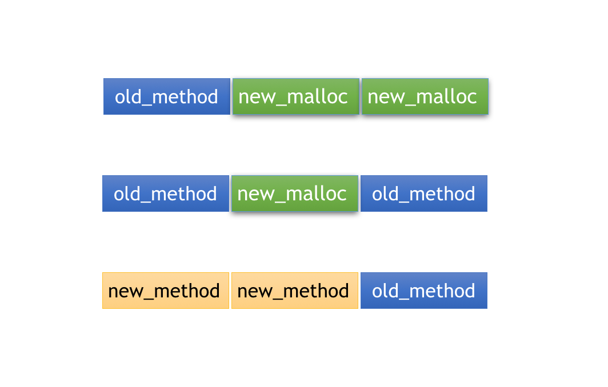
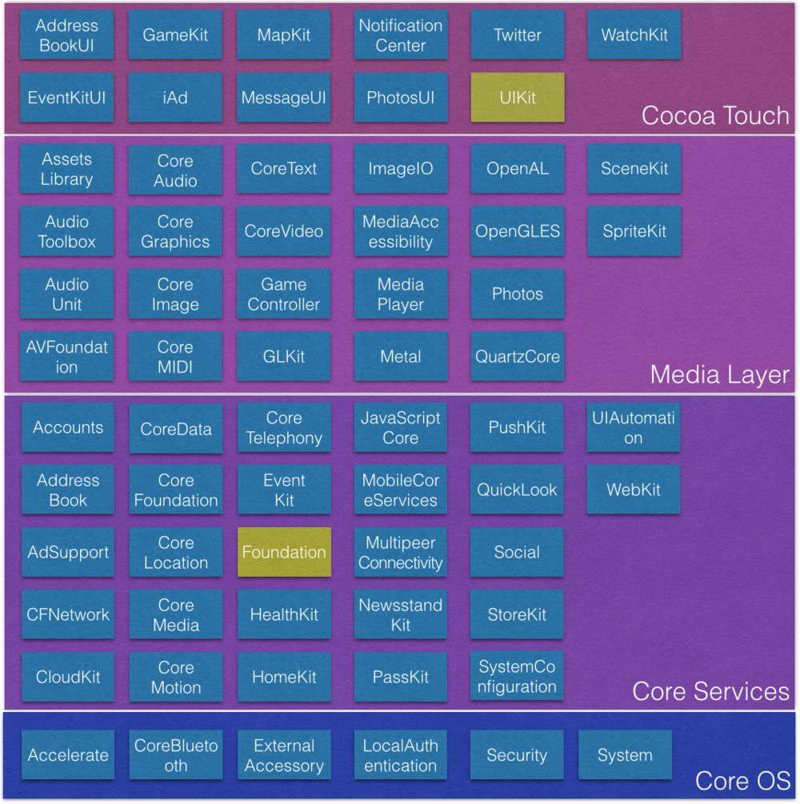

> <h2 id=''></h2>
- [**类**](#类)
	- [动态能力相关的isa指针](#动态能力相关的isa指针)
	- [NSObject简化版](#NSObject简化版)
	- [objc_class结构体定义](#objc_class结构体定义)
	- [消息转发](#消息转发)
	- [指针平移](#指针平移)
- [**Category分类**](#Category分类)
	- [代码原理](#代码原理)
	- [关联对象AssociatedObject](#关联对象AssociatedObject)
		- [关联对象本质](#关联对象本质)
		- [**Demo**](#Demo)
		- [**添加属性**](#添加属性)
		- [分类中的load方法和initialize方法](#分类中的load方法和initialize方法)
- [**Extension扩展**](#Extension扩展)
- [**NSProxy(伪多继承)**](#NSProxy(伪多继承))
- [**iOS原生系统架构**](#iOS原生系统架构)
	- [iOS的系统架构成](#iOS的系统架构成)
	- [Cocoa](#Cocoa)
	- [Cocoa和CocoaTouch](#Cocoa和CocoaTouch)
	- [架构层级细分](#架构层级细分)
- [**NSObject 继承关系图**](#NSObject继承关系图)
	- [Foundation框架类继承体系](#Foundation框架类继承体系)
- [**UIResponder 继承关系图**](#UIResponder继承关系图)
- [**手势继承关系图**](#手势继承关系图)
- **资料**
	- [iOS分类不能添加属性原因的探索](https://blog.csdn.net/u012409247/article/details/80206229)
	- [类的原理(上)](https://juejin.cn/post/6974962306530672670)
	- [类的原理(中)](https://juejin.cn/post/6975813381060034574)
	- [类的原理(下)](https://juejin.cn/post/6978374430267457573)
	- [内存管理](https://blog.csdn.net/u013378438/article/details/80733391)


<br/>

***
<br/>
<br/>


> <h1 id='类'>类</h1>

&emsp; 源代码转换为可执行的程序，通常要经过三个步骤： **编译、链接、运行**。不同的编译语言，在这三个步骤中所进行的操作又有些不同。

- **静态语言：** 如C语言，编译阶段就要决定调用哪个函数，如果函数未实现就会编译报错。
- **动态语言：** 如OC语言，编译阶段并不能决定真正调用哪个函数，只要函数声明过即使没有实现也不会报错。

&emsp; 我们常说OC是一门动态语言，就是因为它总是把一些决定性的工作从编译阶段推迟到运行时阶段。OC代码的运行不仅需要编译器，还需要运行时系统(Runtime Sytem)来执行编译后的代码。

&emsp; Runtime是一套底层纯C语言API，OC代码最终都会被编译器转化为运行时代码，通过消息机制决定函数调用方式，这也是OC作为动态语言使用的基础。


<br/>

>## <h2 id='动态能力相关的isa指针'>**动态能力相关的isa指针**</h2>


&emsp; 每个Objective-C对象都有一个隐藏的数据结构，这个数据结构是Objective-C对象的第一个成员变量，它就是isa指针。

&emsp; `这个指针指向哪呢？`

&emsp; 它指向一个类对象(class object记住它是个对象，是占用内存空间的一个变量，[这个对象在编译的时候编译器就生成了](./知识点(I).md#启动优化)，专门来描述某个类的定义)，这个类对象包含了Objective-C对象的一些信息（为了区分两个对象，我把前面提到的对象叫Objective-C对象），包括Objective-C对象的方法调度表，实现了什么协议等等。这个包含信息就是Objective-C动态能力的根源了。


[isa结构](./知识点(I).md#arm64前后isa结构)


<br/>

**`那我们看看isa指针类型的数据结构是什么样的？`**


通过查看runtime源码,在objc.h中有如下关于objc_class的定义如下:

```
#if !OBJC_TYPES_DEFINED
/// An opaque type that represents an Objective-C class.
typedef struct objc_class *Class;

/// Represents an instance of a class.
struct objc_object {
    Class _Nonnull isa  OBJC_ISA_AVAILABILITY;
};

/// A pointer to an instance of a class.
typedef struct objc_object *id;
#endif
```

&emsp; 由上述的代码可以看出**Class**是一个**objc_class**结构类型的指针；

&emsp; 而 id（任意对象） 是一个 objc_object 结构类型的指针，其第一个成员是一个 objc_class 结构类型的指针。

&emsp; 注意这里有一关键的引申解读： 内存布局以一个 objc_class 指针为开始的所有东东都可以当做一个 object 来对待


<br/>

在runtime中，可以这样获取isa的内容：

```
#define _OBJC_TAG_SLOT_SHIFT 60
#define _OBJC_TAG_EXT_SLOT_MASK 0xff

inline Class 
objc_object::getIsa() 
{
	// 如果不是tagged pointer，则返回ISA()
    if (!isTaggedPointer()) return ISA();

	// 如果是tagged pointer，取出高4位的内容，查找对应的class
    uintptr_t ptr = (uintptr_t)this;
	  
    uintptr_t slot = (ptr >> _OBJC_TAG_SLOT_SHIFT) & _OBJC_TAG_SLOT_MASK;
    return objc_tag_classes[slot];
    
}
```

在runtime中，还有专用的方法用于判断指针是tagged pointer还是普通指针：

```
#   define _OBJC_TAG_MASK (1UL<<63)
static inline bool 
_objc_isTaggedPointer(const void * _Nullable ptr) 
{
    return ((uintptr_t)ptr & _OBJC_TAG_MASK) == _OBJC_TAG_MASK;
}
```


<br/>
<br/>
<br/>

> <h2 id='NSObject简化版'>NSObject简化版</h2>


如果抛开NSObject对象的其他的成员数据和变量，NSObject可以看成这样：

```
@interface NSObject  {

Class    isa;

}

```

不考虑@interface关键字在编译时的作用，可以把NSObject更接近C语言结构表示为：

```
struct NSObject{

Class isa;

}
```

Class是用typedef定义的`typedef struct objc_class *Class;`

那NSObject可以这样写了

```
struct NSObject{

objc_class *isa

}
```


<br/>
<br/>

> <h2 id='objc_class结构体定义'>objc_class结构体定义</h2>


```
struct objc_class {
    Class _Nonnull isa  OBJC_ISA_AVAILABILITY;  // objc_class 结构体的实例指针

#if !__OBJC2__
    Class _Nullable super_class                              OBJC2_UNAVAILABLE; // 指向父类的指针
    const char * _Nonnull name                               OBJC2_UNAVAILABLE; // 类的名字
    long version                                             OBJC2_UNAVAILABLE; // 类的版本信息，默认为 0
    long info                                                OBJC2_UNAVAILABLE; // 类的信息，供运行期使用的一些位标识
    long instance_size                                       OBJC2_UNAVAILABLE; // 该类的实例变量大小(实例变量的内存大小);
    struct objc_ivar_list * _Nullable ivars                  OBJC2_UNAVAILABLE; // 该类的实例变量列表(实际上是一个链表)
    struct objc_method_list * _Nullable * _Nullable methodLists                    OBJC2_UNAVAILABLE;  // 方法定义的列表
    struct objc_cache * _Nonnull cache                       OBJC2_UNAVAILABLE; // 方法缓存
    struct objc_protocol_list * _Nullable protocols          OBJC2_UNAVAILABLE; // 遵守的协议列表
#endif

} OBJC2_UNAVAILABLE;
```


<br/>
<br/>

- **isa ：** 是一个 objc_class 类型的指针. 这就是说 objc_class 或者说类其实也可以当做一个 objc_object 对象来对待！
	- ObjC还对类对象与实例对象中的 isa 所指向的类结构作了不同的命名：类对象中的 isa 指向类结构被称作 metaclass，metaclass 存储类的static类成员变量与static类成员方法（+开头的方法）；
	- 实例对象中的 isa 指向类结构称作 class（普通的），class 结构存储类的普通成员变量与普通成员方法（-开头的方法）。 

- **super_class** ：指向该类的父类呗！如果该类已经是最顶层的根类（如 NSObject 或 NSProxy），那么 super_class 就为 NULL。 

- **name** ：一个 C 字符串，指示类的名称。我们可以在运行期，通过这个名称查找到该类（通过：id objc_getClass(const char *aClassName)）或该类的 metaclass（id objc_getMetaClass(const char *aClassName)）； 

- **version** ：类的版本信息，默认初始化为 0。我们可以在运行期对其进行修改（class_setVersion）或获取（class_getVersion）。 

- **info** ：供运行期使用的一些位标识。有如下一些位掩码：

```
CLS_CLASS (0x1L) 表示该类为普通 class ，其中包含实例方法和变量； 
CLS_META (0x2L) 表示该类为 metaclass，其中包含类方法； 
CLS_INITIALIZED (0x4L) 表示该类已经被运行期初始化了，这个标识位只被 objc_addClass 所设置； 
CLS_POSING (0x8L) 表示该类被 pose 成其他的类；（poseclass 在ObjC 2.0中被废弃了）； 
CLS_MAPPED (0x10L) 为ObjC运行期所使用
CLS_FLUSH_CACHE (0x20L) 为ObjC运行期所使用 
CLS_GROW_CACHE (0x40L) 为ObjC运行期所使用
CLS_NEED_BIND (0x80L) 为ObjC运行期所使用
CLS_METHOD_ARRAY (0x100L) 该标志位指示 methodlists 是指向一个 objc_method_list 还是一个包含 objc_method_list 指针的数组； 
```

- **instance_size**：该类的实例变量大小（包括从父类继承下来的实例变量）；

- **ivars** ：指向 objc_ivar_list 的指针，存储每个实例变量的内存地址，如果该类没有任何实例变量则为 NULL； 

- **methodLists** ：与 info 的一些标志位有关，CLS_METHOD_ARRAY 标识位决定其指向的东西（是指向单个 objc_method_list还是一个 objc_method_list 指针数组），如果 info 设置了 CLS_CLASS 则 objc_method_list  存储实例方法，如果设置的是 CLS_META 则存储类方法； 

- **cache** ：指向 objc_cache 的指针，用来缓存最近使用的方法，以提高效率； 

- **protocols** ：指向 objc_protocol_list 的指针，存储该类声明要遵守的正式协议。


<br/>
<br/>

&emsp; 这里会看到，在这个结构体里还有一个isa指针，又是一重指向，是不是有种到了盗梦空间的感觉。不用紧张，不会有那么多层次的，这里的isa指针指向的是元类对象(metaclass
 object)，带有元字，证明快到头了。
 
 `那元对象有啥用呢？`
 
 它用来存储关于类的版本，名字，类方法等信息。所有的元类对象(metaclass object)都指向NSObject的元类对象，到头还是NSObject。一共三次：类对象->元类对象->NSObject元类对象。

为了得到整个类组织架构的信息，objc_class结构里定义了第二个成员变量Class super_class，它指向父类的类对象。说了这么多，可能关系缕不清楚，有道是一张图胜过千言万语:


图中可以看出，D3继承D2,D2继承D1,D1最终继承NSObject。下图从D3的一个对象开始，排列出D3 D2 D1 NSObject 类对象，元类对象等关系。


相当于 


<br/>

- **子类，父类，根类（这些都是普通 class）以及其对应的 metaclass 的 isa 与 super_class 之间关系:** 
	- 规则一：类的实例对象的 isa 指向该类；该类的 isa 指向该类的 metaclass；
	- 规则二：类的 super_class 指向其父类，如果该类为根类则值为 NULL； 
	- 规则三：metaclass 的 isa 指向根 metaclass，如果该 metaclass 是根 metaclass 则指向自身；
	- 规则四：metaclass 的 super_class 指向父 metaclass，如果该 metaclass 是根 metaclass 则指向该 metaclass 对应的类； 


<br/>
<br/>


> <h2 id='类与元类区别'>类与元类区别</h2>

&emsp; 实例对象的class方法可以查看类对象本身,而**object_getClass(id _Nullable obj)** 返回isa指向的元类对象.

```
DataModel *obj = [DataModel new];
//[obj class]返回类对象本身
NSLog(@"---->>>2: %@", [self.myObject2 class]);

//object_getClass(obj)返回类对象中的isa指向的元类对象，即指向元类对象
NSLog(@"---->>>3: %s", object_getClassName(self.myObject2));
NSLog(@"---->>>4: %@", object_getClass(self.myObject2));
```


&emsp; 实力对象obj的isa指向的是本类,即消息接收者是[DataModel本类](https://juejin.cn/post/6949585271692197925#heading-1);

&emsp; class 是 instance object 的类类型。当我们向实例对象发送消息（实例方法）时，我们在该实例对象的 class 结构的 methodlists 中去查找响应的函数，如果没找到匹配的响应函数则在该 class 的父类中的 methodlists 去查找（查找链为上图的中间那一排）。如下面的代码中，向str 实例对象发送 lowercaseString 消息，会在 NSString 类结构的 methodlists 中去查找 lowercaseString 的响应函数。 

```
NSString * str; 
[str lowercaseString];
```

<br/>

&emsp; metaclass 是 class object 的类类型。当我们向类对象发送消息（类方法）时，我们在该类对象的 metaclass 结构的 methodlists 中去查找响应的函数，如果没有找到匹配的响应函数则在该 metaclass 的父类中的 methodlists 去查找（查找链为上图的最右边那一排）。如下面的代码中，向 NSString 类对象发送 stringWithString 消息，会在 NSString 的 metaclass 类结构的 methodlists 中去查找 stringWithString 的响应函数。 

```
[NSString stringWithString:@"str"];
```


<br/>
<br/>


> <h2 id='消息转发'>消息转发</h2>

[消息转发](https://blog.csdn.net/zhw521411/article/details/85617353)


**查找 IMP 的过程：**

&emsp; objc_msgSend 会根据方法选标 SEL 在类结构的方法列表中查找方法实现IMP。

&emsp; 在类结构**struct objc_clas**s中看到有一个叫objc_cache *cache 的成员，这个缓存为提高效率而存在的。每个类都有一个独立的缓存，同时包括继承的方法和在该类中定义的方法。


下面来剖析一段苹果官方运行时源码：

```
static Method look_up_method(Class cls, SEL sel, 
                             BOOL withCache, BOOL withResolver)
{
    Method meth = NULL;
 
    if (withCache) {
        meth = _cache_getMethod(cls, sel, &_objc_msgForward_internal);
        if (meth == (Method)1) {
            // Cache contains forward:: . Stop searching.
            return NULL;
        }
    }
 
    if (!meth) meth = _class_getMethod(cls, sel);
 
    if (!meth  &&  withResolver) meth = _class_resolveMethod(cls, sel);
 
    return meth;
}
```

通过分析上面的代码，可以看到，查找时：

- 1，首先去该类的方法 cache中查找，如果找到了就返回它；

- 2，如果没有找到，就去该类的方法列表中查找。如果在该类的方法列表中找到了，则将 IMP返回，并将它加入cache中缓存起来。根据最近使用原则，这个方法再次调用的可能性很大，缓存起来可以节省下次调用再次查找的开销。

- 3，如果在该类的方法列表中没找到对应的 IMP，在通过该类结构中的 super_class指针在其父类结构的方法列表中去查找，直到在某个父类的方法列表中找到对应的IMP，返回它，并加入cache中；

- 4，如果在自身以及所有父类的方法列表中都没有找到对应的 IMP，则看是不是可以进行动态方法决议（后面有专文讲述这个话题）；

- 5，如果动态方法决议没能解决问题，进入下面要讲的消息转发流程。


<br/>


我们可以通过NSObject的一些方法获取运行时信息或动态执行一些消息,如下便利函数：

```
class   返回对象的类；

isKindOfClass 和 isMemberOfClass检查对象是否在指定的类继承体系中；

respondsToSelector 检查对象能否相应指定的消息；

conformsToProtocol 检查对象是否实现了指定协议类的方法；

methodForSelector  返回指定方法实现的地址。

performSelector:withObject 执行SEL 所指代的方法。
```


消息转发：

通常，给一个对象发送它不能处理的消息会得到出错提示，然而，Objective-C运行时系统在抛出错误之前，会给消息接收对象发送一条特别的消息forwardInvocation 来通知该对象，`该消息的唯一参数是个NSInvocation类型的对象——该对象封装了原始的消息和消息的参数`。

我们可以实现forwardInvocation:方法来对不能处理的消息做一些默认的处理，也可以将消息转发给其他对象来处理，而不抛出错误


<br/>
<br/>


> <h2 id=''></h2>


<br/>
<br/>


> <h2 id=''></h2>


<br/>
<br/>


> <h2 id='指针平移'>指针平移</h2>

**PersonModel.h文件**

```
@interface WSPerson : NSObject

// 姓名
@property (nonatomic, copy) NSString *name;

/// 测试类指针平移
+ (void)testClassPointerTranslation;

/// 类指针平移测试
- (void) sayNB;
@end
```


**PersonModel.m文件**

```
- (void) sayNB {
    NSLog(@"🥺🥺 %s name: %@", __func__, self.name);
}

/// 测试类指针平移
/// 下面的1 和 2 代码块不能调换位置,否则会报错
+ (void)testClassPointerTranslation {
	
		//1.
    WSPerson *person = [WSPerson alloc];
    person.name = @"HarleyHuang20230318";
    [person sayNB];
    
    //2.
    Class pClass = [WSPerson class];
    void *ws = &pClass;
    [(__bridge  id)ws sayNB];
}
```

person能调用成功可以理解,但是ws能调用成功吗? 试一试,打印如下:

```
2023-03-18 10:45:54.852829+0800 MLC[5281:106009] 🥺🥺 -[WSPerson sayNB] name: HarleyHuang20230318
2023-03-18 10:45:54.853075+0800 MLC[5281:106009] 🥺🥺 -[WSPerson sayNB] name: <WSPerson: 0x6000005bdc40>
```


2个能打印成功,这是为什么? name打印不同,这是为什么?

- **分析:**
	- 首先方法是存在类里的，person能调用是因为person里的isa指向类，person能调用类的方法实质是指针平移的结果，所以person可以访问到类里的方法。

	- void *ws = &pClass，实质是将pClass地址赋值给ws指针，此时ws也指向类，进而能访问到方法。


<br/>

***
<br/>
<br/>


 
># <h1 id='Category分类'>Category分类</h1>

**用处:**
- 可以添加类方法, 协议, 属性(只有get和set方法的声明, 没有对其实现);


<br/>


**特点**
- 运行时决议
	- 分类文件在编译后, 并没有立即把其添加的内容添加到原类中, 而是在运行时, 动态的把方法,协议等内容添加到原类中
- 可以为系统类添加方法


<br/>
<br/>

> <h2 id='代码原理'>代码原理</h2>


- **1.分类底层是个C++的结构体, 内部存储了分类的各种信息:**

```
struct category_t {
    const char *name;   // 分类名
    classref_t cls;     // 原类对象
    WrappedPtr<method_list_t, PtrauthStrip> instanceMethods;    // 实例方法列表
    WrappedPtr<method_list_t, PtrauthStrip> classMethods;       // 类方法列表
    struct protocol_list_t *protocols;                          // 协议方法列表
    struct property_list_t *instanceProperties;                 // property属性列表
    // Fields below this point are not always present on disk.
    struct property_list_t *_classProperties;

    method_list_t *methodsForMeta(bool isMeta) {
        if (isMeta) return classMethods;
        else return instanceMethods;
    }

    property_list_t *propertiesForMeta(bool isMeta, struct header_info *hi);
    
    protocol_list_t *protocolsForMeta(bool isMeta) {
        if (isMeta) return nullptr;
        else return protocols;
    }
};
```

<br/>

- **2.分类的合并**

&emsp; 当程序启动之后, 系统会在运行时通过一系列的函数调用进行初始化、加载镜像文件、读取可执行文件等操作.

&emsp; 分类中的实例方法和类方法会通过运行时机制**Runtime**分别合并到类对象和元类对象中

- objc_init
- map_2_images
- map_images_nolock
- _read_images()
- remethodizeClass()
- attachCategories()

之后调用了remethodizeClass函数来处理分类逻辑

```
static void remethodizeClass(Class cls) {
    category_list *cats;
    bool isMeta;
    runtimeLock.assertWriting();
    // 判断当前类是否为元类对象
    // 如果添加的是类方法,则为YES, 实例方法为NO
    isMeta = cls->isMetaClass();
    // Re-methodizing: check for more categories
    // 这里获取了未拼接的所有分类
    // 注意: 这里是运行时执行, 即分类的运行时决议特点, 在运行时添加
    if ((cats = unattachedCategoriesForClass(cls, false/*not realizing*/))) {
        if (PrintConnecting) {
            _objc_inform("CLASS: attaching categories to class '%s' %s", 
                         cls->nameForLogging(), isMeta ? "(meta)" : "");
        }
        // 把分类拼接到原类上
        attachCategories(cls, cats, true /*flush caches*/);        
        free(cats);
    }
}

```


<br/>

**把分类的内容动态拼接:**

```
static void attachCategories(Class cls, category_list *cats, bool flush_caches) {//cls 类对象  cats 分类列表  
    if (!cats) return;
    if (PrintReplacedMethods) printReplacements(cls, cats);

    bool isMeta = cls->isMetaClass();

    // fixme rearrange to remove these intermediate allocations
    //方法列表数组
    /*
    [
        [method_t, method_t],
        [method_t, method_t]
    ]
    */
    // 创建局部集合变量存储分类方法, 属性, 协议等
    method_list_t **mlists = (method_list_t **)malloc(cats->count * sizeof(*mlists));
    //属性数组, 结构与方法列表数组类似
    property_list_t **proplists = (property_list_t **)
        malloc(cats->count * sizeof(*proplists));
    //协议数组, 结构同上
    protocol_list_t **protolists = (protocol_list_t **)
        malloc(cats->count * sizeof(*protolists));
        
           
    // Count backwards through cats to get newest categories first    
    int mcount = 0;
    int propcount = 0;
    int protocount = 0;
    int i = cats->count; // 原类的分类总数
    bool fromBundle = NO;
    /**
    *这一点是重点,解释了分类内容什么时候被拼接到原类对象上, 以及如果多个分类有同名方法, 系统会调用哪个方法, 即哪个方法最终会生效
    */
    // 倒序遍历所有分类, 最先访问最后编译的分类
    // 换句话说, 分类编译的越早, 被遍历到的越晚
    while (i--) {
        //取出某个分类
        auto& entry = cats->list[i];
        //取出分类中的对象方法列表
        method_list_t *mlist = entry.cat->methodsForMeta(isMeta);
      
        if (mlist) {
            // 最后编译的分类, 最先被添加到分类数组中
            mlists[mcount++] = mlist;
            fromBundle |= entry.hi->isBundle();
        }

        property_list_t *proplist = 
            entry.cat->propertiesForMeta(isMeta, entry.hi);
        if (proplist) {
            proplists[propcount++] = proplist;
        }

        protocol_list_t *protolist = entry.cat->protocols;
        if (protolist) {
            protolists[protocount++] = protolist;
        }
    }
    
    //取出类对象中数据
    // 读取原类数据,包含方法列表等信息
    auto rw = cls->data();
    
    // 对要添加的分类内容作一些内存方面的处理, 为后续拼接做准备
    prepareMethodLists(cls, mlists, mcount, NO, fromBundle);
  
	  // 注意:
   	// 这里, 将包括mcount个元素的mlists拼接到原类的methods方法列表中
    //将所有分类的对象附加到类对象方法列表中
    rw->methods.attachLists(mlists, mcount);
    free(mlists);
    if (flush_caches  &&  mcount > 0) flushCaches(cls);
  
    //将所有分类的属性附加到类对象属性列表中
    rw->properties.attachLists(proplists, propcount);
    free(proplists);
  
    //将所有分类的协议附加到类对象协议列表中
    rw->protocols.attachLists(protolists, protocount);
    free(protolists);
}
```


<br/>
<br/>


 最后的组装, 需要注意的是, 其他分类的添加的内容, 如方法, 并非是被覆盖了, 而是因为方法的位置并非在首位. 所以该方法没有机会调用, 而造成了被覆盖的假象.

同理, '**原类中方法被分类中方法<覆盖实现>**'的原因也是这样.
 
```
void attachLists(List* const * addedLists, uint32_t addedCount) {
    if (addedCount == 0) return;

    if (hasArray()) {
        // many lists -> many lists
        // 获取原类中元素总数
        uint32_t oldCount = array()->count;
        // 拼接之后的元素总数
        uint32_t newCount = oldCount + addedCount;
        
        // 根据拼接后的内容, 添加分类元素, 重新分配内存(申请新的空间)
        setArray((array_t *)realloc(array(), array_t::byteSize(newCount)));
        
        // 设置总数
        array()->count = newCount;
        
             
        /**重点来了
	       *先把内存移动好, 给分类元素腾出空间 
         * [[],[],[原有第一个元素],[原有第二个元素]....]
        */
        //将原来内存的位置的数据挪动后面，array()->lists为原来的方法列表
        memmove(array()->lists + addedCount, array()->lists, 
                oldCount * sizeof(array()->lists[0]));
        
        //拷贝将新的数据，从内存首端开始
        把分类元素添加到原类元素列表中 
        /**
         *[
	        [addedLists中的第一个元素],
	        [addedLists中的第二个元素]...
	        [原有第一个元素],
	        [原有第二个元素]....
        ]
         * 到此, 因为addedLists中的元素添加规则是最后编译的最先被添加
         * 所以, 以方法为例,最后编译的分类的方法最终插入到原类方法列表的第0个位置
         * 也就是, 该方法在运行时调用时, 最终被执行
         */
         memcpy(array()->lists, addedLists, 
   addedCount * sizeof(array()->lists[0]));
    }
}
```




- old_method 为原类方法所占用的内存，new_malloc 为新申请的内存区域
- 然后 old_method 复制到所申请新的内存区域的最末端
- 最后添加分类的方法 new_method ，从整个方法的内存从首端开始覆盖
- 编译顺序越靠后的分类方法的优先级越高

&emsp; 所以在调用实例对象的方法时，会优先调用分类中的实例对象方法，具体的分类顺序需要在 XCode 中设置分类文件的编译顺序，在 **Project-BuildPhases-Compile Sources** 中进行设置


<br/>
<br/>

> <h2 id='关联对象AssociatedObject'>关联对象AssociatedObject</h2>

- **1.是什么**

&emsp; 白话说就是把一个对象关联到另一个对象上, 如给分类添加关联的成员变量. 但是, 只是关联, 并非被关联的对象属于关联对象.

<br/>

- **2.如何使用**

就3个方法: **设定关联值、取关联值、移除值**

**2.1 设定关联值**

```
// 设定值,并通过给定的关联策略建立key和value的关联关系关联到被关联对象object上(有点绕)
objc_setAssociatedObject(id _Nonnull object, const void * _Nonnull key, id _Nullable value, objc_AssociationPolicy policy)
```

- id object ：关联的源对象
- const void *key：关联的key
- id value：关联对象，通过将此个值置成nil来清除关联。
- objc_AssociationPolicy policy：关联的策略

**关键策略是一个enum值**

```
OBJC_ASSOCIATION_ASSIGN = 0,      <指定一个弱引用关联的对象>
OBJC_ASSOCIATION_RETAIN_NONATOMIC = 1,<指定一个强引用关联的对象>
OBJC_ASSOCIATION_COPY_NONATOMIC = 3,  <指定相关的对象复制>
OBJC_ASSOCIATION_RETAIN = 01401,      <指定强参考>
OBJC_ASSOCIATION_COPY = 01403    <指定相关的对象复制>
```

<br/>

**2.2 取关联值**

```
// 根据指定的key获取对应的关联对象值, 并返回
id objc_getAssociatedObject(id object, const void *key)
```


<br/>

**2.3 移除关联值**

```
// 移除该对象的所有关联对象
void objc_removeAssociatedObjects(id object)
```


<br/>
<br/>

> <h3 id='关联对象本质'>关联对象本质</h3>


&emsp; 系统维护了一个全局的AssociationsManager单例管理类, 该类的生命周期和程序同属一个生命周期, AssociationsManager管理者维护了一个全局的AssociationsHashMap哈希表存储容器, 所有对象的关联内容存储在这个容器中.所以说, 假如给分类添加了一个关联对象, 那么该关联内容既不需要分类管理, 也不是由原类管理.

```
class AssociationsManager {
    static spinlock_t _lock;
    static AssociationsHashMap *_map;               // associative references:  object pointer -> PtrPtrHashMap.
public:
    AssociationsManager()   { _lock.lock(); }
    ~AssociationsManager()  { _lock.unlock(); }
    
    AssociationsHashMap &associations() {
        if (_map == NULL)
            _map = new AssociationsHashMap();
        return *_map;
    }
};
```


<br/>

AssociationsHashMap内部维护了一个ObjectAssociationMap哈希表

```
class AssociationsHashMap : public unordered_map<disguised_ptr_t, ObjectAssociationMap *, DisguisedPointerHash, DisguisedPointerEqual, AssociationsHashMapAllocator> {
    public:
        void *operator new(size_t n) { return ::malloc(n); }
        void operator delete(void *ptr) { ::free(ptr); }
    };


```

<br/>

ObjectAssociationMap内部维护了一个ObjcAssociation哈希表

```
class ObjectAssociationMap : public std::map<void *, ObjcAssociation, ObjectPointerLess, ObjectAssociationMapAllocator> {
    public:
        void *operator new(size_t n) { return ::malloc(n); }
        void operator delete(void *ptr) { ::free(ptr); }
    };

```


<br/>


**关系如下图:**


hash结构图:


<br/>
<br/>

> <h3 id='Demo'>Demo</h3>


```
- (void) personTest {
    
    
    static char overviewKey;
    NSArray *array = [[NSArray alloc] initWithObjects:@"one", @"two", nil];
    NSString * overview = [[NSString alloc] initWithFormat:@"%@",@"First three numbers"];
    objc_setAssociatedObject(array, &overviewKey, overview, OBJC_ASSOCIATION_RETAIN);
    NSString *associatedObject = (NSString *)objc_getAssociatedObject(array, &overviewKey);
    NSLog(@"🍎 associatedObject:%@", associatedObject);
    
    objc_setAssociatedObject(array, &overviewKey, nil, OBJC_ASSOCIATION_ASSIGN);
    NSString *associatedObject2 = (NSString *)objc_getAssociatedObject(array, &overviewKey);

    NSLog(@"🍊 associatedObject:%@", associatedObject2);
}
```

打印：

```
 🍎 associatedObject:First three numbers
 🍊 associatedObject:(null)
```


<br/>
<br/>


> <h3 id='添加属性'>添加属性</h3>


`NSString分类.h文件`

```
#import <Foundation/Foundation.h>

NS_ASSUME_NONNULL_BEGIN

@interface NSString (Tool)


/// 分类添加属性(使用运行时)
@property(nonatomic, copy)NSString *name;

/// 使用临时全局变量来替代成员变量
@property (nonatomic, strong) NSString *title;


@end
```
<br/>

`.m文件`

```
#import "NSString+Tool.h"
#import <objc/runtime.h>

static const void *nameKey = &nameKey;
//***临时全局变量***
static NSString *_title;

@implementation NSString (Tool)


- (void)setName:(NSString *)name {
    
    
   /**
    *  根据某个对象，还有key，还有对应的策略(copy,strong等) 动态的将值设置到这个对象的key上
    *
    *  @param object 某个对象
    *  @param key    属性名,根据key去获取关联的对象, 是一个字符串常量，是一个地址(这里注意，地址必须是不变的，地址不同但是内容相同的也不算同一个key)
    *  @param value  要设置的值
    *  @param policy 策略(copy,strong，assign等)
    */
    objc_setAssociatedObject(self, &nameKey, name, OBJC_ASSOCIATION_COPY_NONATOMIC);
}

- (NSString *)name {
    return objc_getAssociatedObject(self, nameKey);
}

- (void)setTitle:(NSString *)title {
    _title = title;
}

- (NSString *)title {
    return _title;
}

@end


//调用
 NSString *test = @"大头爸爸";
 test.name = @"张光北";
 NSLog(@"字符串分类属性name值： %@", test.name);
```
打印：

`2019-11-16 19:36:41.693406+0800 HGSWB[19518:789236] 字符串分类属性name值： 张光北
`


<br/>

> <h3 id='分类中的load方法和initialize方法'>分类中的load方法和initialize方法</h3>


**1.load方法**

&emsp; load() 方法会在runtime加载 类，分类 时调用，无论这些 类 或 分类 是否包含于 main() 函数的文件中或包含于其他的类文件中，它们各自的load() 方法都会在内存中被执行，且 load() 方法不会通过消息的发送机制进行调用。

<br/>


**1.1 load方法的调用顺序**

**1.1.1 分类中的load方法**

&emsp; 和分类中的实例方法 相反 ，load() 方法的内存位置并不会被后编译的 分类 中的 load() 所覆盖，只与 分类 文件的编译顺序有关，编译越靠前的分类越优先调用。

**1.1.2 继承中的load方法**

&emsp; 先查找到其源码，在 objc-runtime-new.mm 中的prepare_load_methods() 方法中调用了schedule_class_load() 方法。

```
static void schedule_class_load(Class cls)
{
    if (!cls) return;
    assert(cls->isRealized());  // _read_images should realize

    if (cls->data()->flags & RW_LOADED) return;

    // Ensure superclass-first ordering
    schedule_class_load(cls->superclass);

    add_class_to_loadable_list(cls);
    cls->setInfo(RW_LOADED); 
}
```

&emsp; 其中有一个递归的调用，传入的参数为cls->superclass，且注释说明其用意是确保父类最优先调用。


<br/>
<br/>


**2.initialize方法**

&emsp; 仅在类第一次接收消息的时候调用 initialize() 方法，如果分类中实现了 initialize() ，会直接覆盖本身的initialize()方法。

&emsp; 打开源码，在 objc-runtime-new.mm 文件中


```
if (initialize  &&  !cls->isInitialized()) {//其中对类是否初始化进行了判断，如果没有初始化则进入 _class_initialize() 方法。
    runtimeLock.unlockRead();
    _class_initialize (_class_getNonMetaClass(cls, inst));
    runtimeLock.read();
}
```

于是找到方法所在的文件 objc-initialize.mm

```
void _class_initialize(Class cls)
{
    assert(!cls->isMetaClass());

    Class supercls;
    bool reallyInitialize = NO;

    // Make sure super is done initializing BEFORE beginning to initialize cls.
    // See note about deadlock above.
    supercls = cls->superclass;
    //会对传入的父类先进行 initialize 的判断，然后再对子类进行 initialize
    if (supercls  &&  !supercls->isInitialized()) 
        _class_initialize(supercls);
    }
    
    // Try to atomically set CLS_INITIALIZING.
    {
        monitor_locker_t lock(classInitLock);
        if (!cls->isInitialized() && !cls->isInitializing()) {
            cls->setInitializing();
            reallyInitialize = YES;
        }
    }
}
```


&emsp; 所以如果是继承关系的类，在子类第一次接收消息的时候会先调用父类的 initialize() 方法，然后再调用子类的 initialize() 方法


<br/>


**总结**

- 调用方式
	- ​ load() 根据函数地址直接调用
	
	- ​ initialize() 是通过 objc_msgSend() 调用

- 调用时刻

	- load() 是运行时在加载类，分类的时候调用(只会调用1次)
	
	- initialize() 是类第一次接收到消息的时候调用，每一个类只会使用 initialize() 初始化一次，但父类的 initialize() 可能会被调用多次

- 调用顺序

	- load

		- 先调用类的 load()
		- 先编译的类，优先调用 load()
		- 调用子类的 load() 之前，会先调用父类的 load()
		- 再调用分类的 load()
		- 先编译的分类，优先调用 load()

	- initialize
	
		- 先初始化父类
		- 再初始化子类(可能最终调用的是父类的initialize方法)


<br/>

***
<br/>
<br/>

># <h1 id='Extension扩展'>Extension扩展</h1>


**Extension扩展和分类比有什么区别?**

扩展可以为类添加私有属性, 私有方法, 声明私有变量.

- 扩展是在编译时决议的, 类扩展中的方法属性, 在编译阶段就会被添加到类中, 因此扩展中的方法没有实现, 编译器会报警告;
- 类扩展没有独立的实现(@implementation), 即类扩展所声明的方法必须依托对应类的实现部分来实现;
- 类扩展即可以声明属性, 又可以声明私有成员变量;

<br/>

***
<br/>


># <h1 id='NSProxy(伪多继承)'>NSProxy(伪多继承)</h1>

># 

[NSProxy](https://www.jianshu.com/p/923f119333d8)


<br/>

***
<br/>


<br/>

***
<br/>
<br/>

># <h1 id='iOS原生系统架构'>iOS原生系统架构</h1>

<br/>

> <h2 id='iOS的系统架构成'>iOS的系统架构成</h2>

- Application Layer（应用层）、
- Cocoa Touch Layer（触摸层）、
- Media Layer （媒体层）、
- Core Services Layer（核心服务层）、
- Core OS Layer （核心系统操作层）、
- The Kernel and Device Drivers layer（内核和驱动层）。


<br/>


>## <h2 id='Cocoa'>**Cocoa**</h2>


<br/>


**来源：**
>早些年，苹果公司启动Copland计划，致力于开发出自己的操作系统，可惜后来Copland计划逐渐失控了，苹果公司最终决定放弃开发，转向从别的公司购买下一个版本的Mac OS。在经过调查现存的操作系统之后，苹果公司选择了NextSTEP，因为NextSTEP很小，苹果1996年收购了Next整个公司。

>NextStep内置许多库和工具，能唐程序员以一种优雅的方式与窗口管理器进行监护，这些库叫做Framework，在1993年这些frameworks和工具被重新修改并重命名OpenStep，后来被重命名为Cocoa，所以Cocoa的类都有着NS的前缀。

<br/>

**什么是Cocoa？**
>事实上，Cocoa（iOS上的叫Cocoa Touch）是一个面向对象的软件组件---类的集成套件，它使开发者可以快速创建和健壮全功能的Mac OS X和iOS应用程序。

>Cocoa 是一套框架和运行时支持，简单来说就是 API 应用程序接口。


<br/>


> <h2 id='Cocoa和CocoaTouch'>Cocoa和CocoaTouch</h2>

>Cocoa是Mac OS X 的开发环境               Cocoa Touch是iPhone OS 的开发环境。

>Cocoa包含了很多框架，最核心的是Foundation框架和Application Kit 框架

>Cocoa Toouch包含了很多框架，最核心的是Foundation框架和UIKit 框架


<br/>

**框架**

>Foundation框架以Core Foundation框架为基础，Core Foundation框架提供的是过程化（ANSI C）接口。您可以使用 AppKit 和UIKit 框架开发应用程序的用户接口。二者用途相同，但是针对平台不同。


<br/>


> **`架构层级细分`**




<br/>

**Core OS层：**系统核心层包含大多数低级别接近硬件的功能，它所包含的框架常常被其它框架所使用。

- Accelerate框架包含数字信号，线性代数，图像处理的接口。针对所有的iOS设备硬件之间的差异做优化，保证写一次代码在所有iOS设备上高效运行。
- CoreBluetooth框架利用蓝牙和外设交互，包括扫描连接蓝牙设备，保存连接状态，断开连接，获取外设的数据或者给外设传输数据等等。
- Security框架提供管理证书，公钥和私钥信任策略，keychain,hash认证数字签名等等与安全相关的解决方案。


<br/>

**Core Services Layer**:系统服务层提供给应用所需要的基础的系统服务。

- Accounts: 账户框架，广告框架，数据存储框架，网络连接框架，地理位置框架，运动框架等等。这些服务中的最核心的是CoreFoundation和Foundation框架，定义了所有应用使用的数据类型。
- CoreFoundation是基于C的一组接口，Foundation是对CoreFoundation的OC封装。

<br/>

**Media Layer**: 媒体层提供应用中视听方面的技术，如图形图像相关的:
- 	CoreGraphics,CoreImage,GLKit,OpenGL ES,CoreText,ImageIO等等。

声音技术相关的:
- 	CoreAudio,OpenAL,AVFoundation,

视频相关的:
- 	CoreMedia,Media Player框架，音视频传输的AirPlay框架等等。


<br/>

**Cocoa Touch Layer:**触摸层提供应用基础的关键技术支持和应用的外观。
- NotificationCenter的本地通知和远程推送服务;
- iAd广告框架;
- GameKit游戏工具框架;
- 消息UI框架;
- 图片UI框架;
- 地图框架;
- 连接手表框架;
- 自动适配等等


<br/>


原生架构细分接受，请看[这里](https://www.jianshu.com/p/80a27d111605)


```
NS函数归属于Cocoa Foundation框架；

CF函数归属于Core Foundation框架；

CG函数归属于CoreGraphics.frameworks框架；

CA函数归属于CoreAnimation.frameworks框架；

UI函数归属于UIKit框架。

UIKit继承自 Core Animation 和Core Graphics；
Core Animation：核心动画； 
Core Graphics：核心绘制 ；
UIkit：iOS基础视图框架.

```


<br/>

***
<br/>

># <h1 id='NSObject继承关系图'>NSObject继承关系图</h1>


<br/>
<br/>

> <h2 id='Foundation框架类继承体系'>Foundation框架类继承体系</h2>

&emsp; 下面三个图，包括了Foundation所以的类，图中灰色的是iOS不支持的，灰色部分是OS X系统的。


&emsp; **将上图Foundation框架中的类进行逻辑分类如下：**
- 值对象
- 集合
- 操作系统服务 包括下面三个：文件系统和URL进程间通讯。
	- 这个范畴中的大部分类代表不同的系统端口、套接字、和名字服务器，对实现底层的IPC很有用。
	- NSPipe代表一个BSD管道，即一种进程间的单向通讯通道。
	- 线程和子任务:NSThread类使您可以创建多线程的程序，而各种锁（lock）类则为彼此竞争的线程在访问进程资源时提供各种控制机制。通过NSTask，您的程序可以分出      一个子进程来执行其它工作或进行进度监控。
- 通知
- 归档和序列化
- 表达式和条件判断
- Objective-C语言服务


<br/>
<br/>


**Objective-C是面向对象的语言:**

&emsp; Objective-C和Java C++一样，有封装，继承，多态，重用。但是它不像C++那样有重载操作法、模版和多继承，也没有Java的垃圾回收机制


<br/>

**Objective-C的优点:**

- Objective-C语言有C++ Java等面向对象的特点，那是远远不能体现它的优点的。Objective-C的优点是它是动态的。动态能力有三种：
- 动态类-运行时确定类的对象
- 动态绑定-运行时确定要调用的方法
- 动态加载--运行时为程序加载新的模块


<br/>
<br/>


<br/>

># <h1 id='UIResponder继承关系图'>UIResponder 继承关系图</h1>

<br/>
<br/>

> <h2 id=''></h2>


<br/>

***
<br/>


> <h1 id='手势继承关系图'>手势继承关系图</h1>


