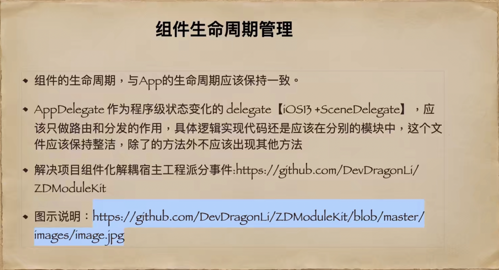
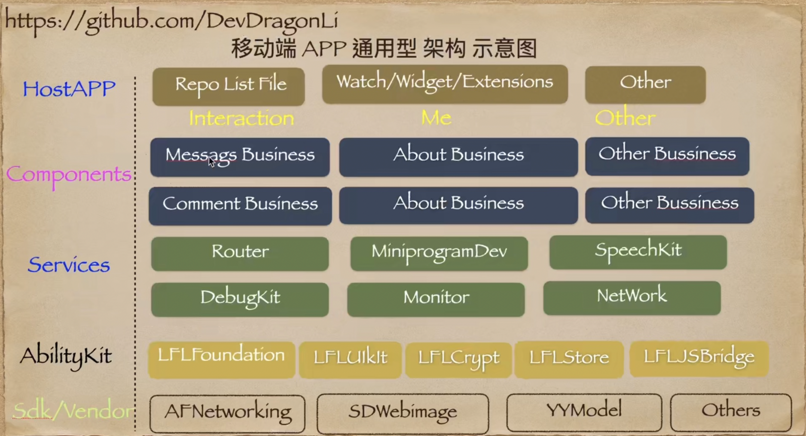

> <h2 id=''></h2>
- [**概略**](#概略)
- [**组件化分层**](#组件化分层)
- [**组件化方案**](#组件化方案)
	- [本地组件化](#本地组件化)
	- [cocoapods组件化](#cocoapods组件化)
		- [私有库创建](#私有库创建)
			- [工程中使用私有库](#工程中使用私有库)
			- [问题解决](#问题解决)
			- [443时间超时](#443时间超时)
			- [更新发布](#更新发布)
- **参考资料**
	- [](https://juejin.cn/post/6921970988796248077) 
	- [CocoaPods私有库的创建和版本更新](https://www.jianshu.com/p/51b0aed5db2a)


<br/>

***
<br/>

> <h1 id='概略'>概略</h1>

- **具备组件化的情况**


<br/>

- **组件生命周期维持**




<br/>


<br/>

***
<br/>


> <h1 id='组件化分层'>组件化分层</h1>

项目组件化优秀评判，可以通过以下几个方面：
 
- 模块之间没有耦合，模块内部的修改不影响其他模块；

- 模块可以单独编译；

- 模块间数据传递明确；

- 模块可以随时被另一个提供了相同功能的模块替换；

- 模块对外接口清晰且易维护；

- 当模块接口改变时，此模块的外部代码能够被高效重构；

- 尽量用最少的修改和代码，让现有的项目实现模块化；

- 支持OC和Swift，以及混编。
 
&emsp; 前4条主要用于衡量一个模块是否真正解耦，后4条主要用于衡量在项目实践中的易用程度。

<br/>

一般一个项目主要分为三层：业务层、通用层、基础层


- 组件化封层之后，需要遵循一下原则：
 
	- 只能上层对下层依赖， 不能下层对上层依赖（下层是对上层的抽象）；
	
	- 项目公共代码资源下沉；
	
	- 横向的依赖尽量少有，最好下称到通用模块或者基础模块。


<br/>
<br/>

- **通用架构层级**




<br/>


- **通用架构注意：**


<br/>

***
<br/>

> <h2 id='组件化方案'>组件化方案</h2>

- 目前常用的组件化方案主要有两种：

	- 本地组件化：主要是通过在 工程中创建 library， 利用 cocoapods 的 workspec 进行 本地管理， 不需要将项目上传git，而是直接在项目中以 framework 的方式 进行调用。

	- cocoapods组件化：主要是利用 cocoapods 来进行 模块的远程管理，需要将项目上传 git （这里的组件化模块分为 公有库 和 私有库 ， 对公司而言， 一般是私有库）


<br/>

> <h2 id='本地组件化'>本地组件化</h2>

- **创建主工程**

	- 新建项目主工程
	
	- 集成 cocoapods ， 进行本地管理，执行命令 pod init
	
	- 编辑 Podfile， 并执行 pod install

<br/>

- **创建组件**

- 可以创建 自己的模块：

	- 主工程：主要实现表层业务代码

	- Base：基类封装

	- Tools：工具（字符串，颜色，字体等）

	- Service：服务层，封装业务工具类，例如网络层服务、持久化服务等

	- Pods：第三方依赖

其中，各个模块间的关系如下所示：


<br/>
<br/>
<br/>


>## <h1 id='cocoapods组件化'>[cocoapods组件化](https://mp.weixin.qq.com/s/wGrjGsodJ1KZfGS2OksQKA)</h1>


<br/>
<br/>

> <h2 id='私有库创建'>私有库创建</h2>

<br/>

- **1.创建步骤模板**

```
//创建一个文件夹，然后在终端使用这个文件夹
$ cd /Users/harleyhuang/Desktop/HGLibrary

//pod库创建
$ pod lib create HGLibrary

//网络不好或者其他原因造成了失败，如下：
/System/Library/Frameworks/Ruby.framework/Versions/2.6/usr/lib/ruby/2.6.0/universal-darwin20/rbconfig.rb:229: warning: Insecure world writable dir /opt/homebrew/bin in PATH, mode 040777
Ignoring executable-hooks-1.6.1 because its extensions are not built. Try: gem pristine executable-hooks --version 1.6.1
Ignoring ffi-1.15.1 because its extensions are not built. Try: gem pristine ffi --version 1.15.1
Ignoring gem-wrappers-1.4.0 because its extensions are not built. Try: gem pristine gem-wrappers --version 1.4.0
Cloning `https://github.com/CocoaPods/pod-template.git` into `HGLibrary`.
[!] /usr/bin/git clone https://github.com/CocoaPods/pod-template.git HGLibrary

Cloning into 'HGLibrary'...
fatal: unable to access 'https://github.com/CocoaPods/pod-template.git/': Could not resolve host: github.com


//解决：我是使用了终端挂上代理
$ export http_proxy=http://127.0.0.1:7890
$ export https_proxy=http://127.0.0.1:7890


//pod再次创建库
$ pod lib create HGLibrary

//回车后终端会让你回答一些问题，如下：
```


<br/>

- **2.文件夹模板展示**


<br/>

- **3.添加一个日志打印类`LogInfo`**


<br/>

- **4.进行测试**

```
//移动到Example目录下
$ cd /Users/harleyhuang/Desktop/HGLibrary/HGLibrary/Example

//安装CocoaPods项目
$ pod install --no-repo-update
```


本地测试：


<br/>

- **5.编辑CocoaPods的配置文件（后缀名为podspec)**


复制私有库地址，在.podspec文件内的s.source替换地址


配置完成了

再次移到我们的Example文件，pod更新一下

```
$ pod update --no-repo-update
```


打开项目，看看是否成功了。

然后再测试项目中运行，发现完美可以运行，并在控制台中进行打印。😄😄

这就验证了其的准确性！

<br/>

- **6.验证pod配置文件为了保证项目正确性，pod文件配置没问题，在提交之前，我们需要验证一下**
用终端移到我们的项目路径

```
$ cd /Users/harleyhuang/Desktop/HGLibrary
```


到这里，我们已经完成源码导入、验证项目是否能运行、pod配置文件本地验证了


<br/>

- **7.验证本地spec文件**

```
$ pod lib lint
```


出现了2个警告和一个错误，后来分析原因：
- 警告一：详细描述没有修改，需要进行修改；
- 警告二：URL不能通过，可能这个网页就不存在，我的错误是`s.homepage`(项目主页地址)没有修改，进行修改就好了；
- 错误三：打开Xcode > Preferences > Locations ，更改一下 Command Line Tools选项就可以了。


描述和首页地址部分截取：

```
# This description is used to generate tags and improve search results.
#   * Think: What does it do? Why did you write it? What is the focus?
#   * Try to keep it short, snappy and to the point.
#   * Write the description between the DESC delimiters below.
#   * Finally, don't worry about the indent, CocoaPods strips it!
  # 详细描述
  s.description      = <<-DESC
  #TODO: Add long description of the pod here.
  自定义的小组件封装，版本 0.0.1，后续会不断更新。
                       DESC
  # 项目主页地址
  s.homepage         = 'https://github.com/harleyGit/HGLibrary/tree/master'
```

对修改后的配置进行提交

```
$ git add .

$ git commit -m '配置文件修改 & Xcode 配置'

$ git push origin master
```

推送时，出现提示如下：


解决如下：

```
# 原因是远程仓库origin上的分支master和本地分支master被Git认为是不同的仓库，所以不能直接合并，需要添加 --allow-unrelated-histories

$ git pull origin master --allow-unrelated-histories
# 会进入一个要求填写 提交信息 的窗口，填写你的提交信息就可以了
# 推送到Github的HGLibrary项目的master分支上
$ git push origin master

```


<br/>

- **8.验证远程spec文件**

```
$ pod spec lint 
# 如果验证错误 可以使用下面的命令
$ pod lib lint --allow-warnings --use-libraries
```


<br/>

- **9.发布tag 0.0.1版本，移动到该项目文件下执行git的相关命令**

打开github网站，在远程创建一个索引库：


远程索引库地址加入repo

```
$ pod repo add HGIndexLibraryRepo https://github.com/harleyGit/HGIndexLibraryRepo.git
```

注意:`HGIndexLibraryRepo`为私有库名称
    `https://github.com/harleyGit/HGIndexLibraryRepo.git`为私有库地址。
    
在终端下的运行结果,此时索引库已经制作完成,可以进行创建组件工程了
    


<br/>

- **10.将私有库的spec文件推送到远程索引库**

```
# HGIndexLibraryRepo 为远程索引库的名称  
# HGLibrary.podspec  为私有库工程里的spec文件
$ pod repo push HGIndexLibraryRepo HGLibrary.podspec
```


发布成功后，我们可以去码云看看HGIndexLibraryRepo的git项目有没有提交成功：


**成功之后, 我们的组件及索引就已经完成了,下面集成到主工程中！**

终端输入：

```
$ pod search HGLibrary
```

如下效果：


<br/>
<br/>
<br/>

> <h3 id='工程中使用私有库'>工程中使用私有库</h3>

```
platform :ios, '12.0'

target 'Test1' do
  # Comment the next line if you don't want to use dynamic frameworks
  use_frameworks!
  pod 'ReactiveObjC', '~> 3.1.1'
  pod 'HGLibrary', '~> 0.0.1'
#  pod 'RxSwift', '~> 6.2.0'
#  pod 'ReactObjC', '~> 0.6.0'
#  pod 'ReactiveCocoa', '~> 11.2.1'
  
  # Pods for Test1
  
end

```

错误提示和解决如下图：


后来各种尝试还是不行，经过同事提示原来私有库需要注明索引库的来源（公有库是不需要的），在Podfile注明引用库来源

```
# 查看索引库
$ pod repo list

# 拷贝注定索引库的URL

# 粘贴到Podfile中
source 'https://github.com/harleyGit/HGIndexLibraryRepo.git'
```

接着再 工程中进行`pod install`,然后就可以再工程中使用了。😄


<br/>
<br/>
<br/>


> <h3 id='问题解决'>问题解决</h3>

<br/>


> <h3 id='443时间超时'>443时间超时</h3>

出现以下情况：

- 电脑无法访问github了,无论你重启电脑，重置网络，重置你的大脑都无法正常访问了;
- 使用【绿色上网】却可以神奇的访问到GitHub。
- 使用昂贵的【绿色上网】，开心的在命令行上敲上你熟悉的`git 、pull、push`等命令进行访问远程库的时候，却给命令行甩你一行【`Failed to connect to github.com port 443: Operation timed out`】

一番不停的搜索后，你知道了设置代理：

```
$ git config --global https.proxy http://127.0.0.1:1080
$ git config --global http.proxy http://127.0.0.1:1080

# 或者绿色上网后挂代理：

$ export http_proxy=http://127.0.0.1:7890
$ export https_proxy=http://127.0.0.1:7890

```

但是还是不行，遭狠狠的打脸！😢

<br>

解决如下：

打开[**iPAddress**](https://github.com.ipaddress.com)，复制如下**IP Adress**：


打开[**github.global.ssl.fastly**](https://fastly.net.ipaddress.com/github.global.ssl.fastly.net#ipinfo)，复制如下**IP Adress**：


打开[**assets-cdn.Github.com - Github Website**](https://github.com.ipaddress.com/assets-cdn.github.com)，复制如下**IP Adress**：


<br/>

打开Mac电脑的host文件夹，选中Finder->【前往】->【前往文件夹】->【/private/etc/hosts】，然后使用其他软件进行打开，将下面的地址复制进去

```
140.82.114.4(图1的IP Address) github.com 
199.232.5.194(图2的IP Address) github.global.ssl.fastly.net
185.199.108.153(图3的IP Address)  assets-cdn.github.com
185.199.109.153(图3的IP Address)  assets-cdn.github.com
185.199.110.153(图3的IP Address)  assets-cdn.github.com
185.199.111.153(图3的IP Address)  assets-cdn.github.com
```

然后 Command+S 进行保存，在终端输入如下指令进行刷新DNS：

```
$ sudo killall -HUP mDNSResponder;say DNS cache has been flushed
```


<br/>
<br/>
<br/>


> <h3 id='更新发布'>更新发布</h3>

在主项目MainProject、子库Foundation,步骤按照下面操作进行更新.


&emsp; **1.** 首先我们需要把子库Foundation拉下来,放在iOS_PrivateLibraries.在Foundation库中新建一个TestOne的文件夹,用来存放新的功能代码,切记新的功能代码要放在这里,否则主项目MainProject无法使用.


<br/>

&emsp; **2.** 将新建的TestOne文件夹放入子库Foundation中:


<br/>

&emsp; **3.** 新建LogInfo类,并进行配置


<br/>

&emsp; **4.** 在主项目的Podfile配置子库Foundation的路径,将其和主项目连接起来

主项目Podfile地址:/Users/xxx/Documents/GitLab/Ccrm/Ccrm-iOS/Podfile
子库Foundation地址: /Users/xxx/Documents/GitLab/Ccrm/iOS_PrivateLibraries/Foundation 


<br/>

主项目的Podfile引入本地子库Foundation路径,如下:


然后在终端输入:

```
//切换到主项目文件地址
cd /Users/xxx/Documents/GitLab/Ccrm/Ccrm-iOS

pod install 
```

然后就可以在主项目中的**Pods/Development Pods/Foundation/TestOne**下看到之前在子库Foundation新建的文件,如下:


然后你就可以在主项目./Development Pods/Foundation文件下添加修改子库Foundation的代码,同时代码也会同步到子库中了.

<br/>

&emsp; **5.** 在Foundation中测试代码

其实在Foundation的Example中也可以进行代码的测试,打开Terminal,然后定为到Example的地址:

```
cd /Users/xxx/Documents/GitLab/Ccrm/iOS_PrivateLibraries/Foundation/Example

pod install
```
这样就可以在Example中进行子库代码的调试了


<br/>

&emsp; **6.** 子库代码修改完后,然后就可以修改配置文件的版本号,然后提交代码,打版本tag了


<br/>

也可以不用更新版本号的,可以直接定位到要提交的记录,如下:


<br/>

**7.** 更新完了后,需要更新本地对应的资源索引

```
//查看组件库的索引库
pod repo list

pod repo update 资源索引库

cd /Users/xxx/Documents/GitLab/Ccrm/Ccrm-iOS

pod install
```


<br/>

***
<br/>

> <h1 id=''></h1>


<br/>

***
<br/>

> <h1 id=''></h1>