> <h2 id=''></h2>
- [**概略**](#概略)
- [**组件化分层**](#组件化分层)
- [**组件化方案**](#组件化方案)
	- [本地组件化](#本地组件化)
	- [cocoapods组件化](#cocoapods组件化)
		- [xxx-umbreall.h文件作用](#xxx-umbreall.h文件作用)
		- [私有库创建](#私有库创建)
			- [subspec创建子模块，及子模块之间的引用](#subspec创建子模块，及子模块之间的引用)
			- [工程中使用私有库](#工程中使用私有库)
			- [问题解决](#问题解决)
			- [443时间超时](#443时间超时)
			- [更新发布](#更新发布)
			- [podspec文件解析](#podspec文件解析)
				- [Podfile语法示例](#Podfile语法示例)
					- [子模块下如何引入**`.podspec`**文件](#子模块下如何引入**`.podspec`**文件)
- [**问题解决**](#问题解决)
	- [本地调试私有库依赖的另一个私有库](#本地调试私有库依赖的另一个私有库)
	- [文件引用导致Generated duplicate UUIDS](#文件引用导致GeneratedduplicateUUIDS)
- **参考资料**
	- [**官方Podspec语法**](https://guides.cocoapods.org/syntax/podspec.html#specification)
	- [podspec书写规范](https://blog.csdn.net/u014600626/article/details/123885064)
	- [](https://juejin.cn/post/6921970988796248077) 
	- [CocoaPods私有库的创建和版本更新](https://www.jianshu.com/p/51b0aed5db2a)
	- [自建 iOS 静态库并用 pod 管理](https://juejin.cn/post/6844903578071482382)
	- [在自己的私有服务器上创建Git仓库](https://www.cnblogs.com/LeeGof/p/6635522.html)
	- [私有Pod库部署](https://tenloy.github.io/2021/05/03/iOS-private-pod.html)
	- [Swift/Objective-C-使用Cocoapods创建/管理私有库（高级用法）](https://www.jianshu.com/p/abb4ffe60e6a)


<br/>

***
<br/>

> <h1 id='概略'>概略</h1>

- **具备组件化的情况**

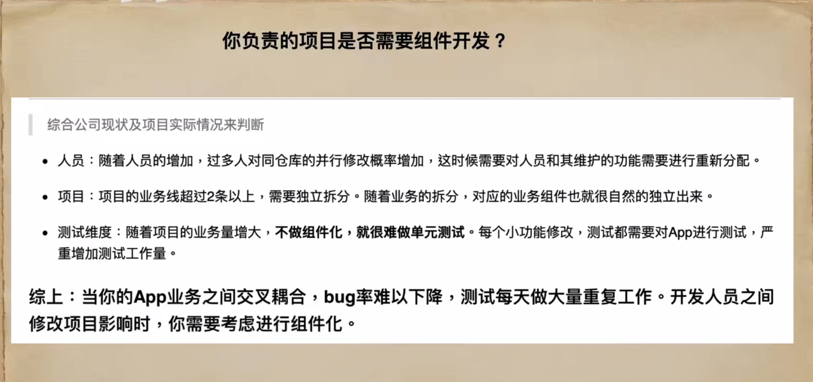


<br/>

- **组件生命周期维持**


<br/>


<br/>

***
<br/>


> <h1 id='组件化分层'>组件化分层</h1>

项目组件化优秀评判，可以通过以下几个方面：
 
- 模块之间没有耦合，模块内部的修改不影响其他模块；

- 模块可以单独编译；

- 模块间数据传递明确；

- 模块可以随时被另一个提供了相同功能的模块替换；

- 模块对外接口清晰且易维护；

- 当模块接口改变时，此模块的外部代码能够被高效重构；

- 尽量用最少的修改和代码，让现有的项目实现模块化；

- 支持OC和Swift，以及混编。
 
&emsp; 前4条主要用于衡量一个模块是否真正解耦，后4条主要用于衡量在项目实践中的易用程度。

<br/>

一般一个项目主要分为三层：业务层、通用层、基础层


- 组件化封层之后，需要遵循一下原则：
 
	- 只能上层对下层依赖， 不能下层对上层依赖（下层是对上层的抽象）；
	
	- 项目公共代码资源下沉；
	
	- 横向的依赖尽量少有，最好下称到通用模块或者基础模块。


<br/>
<br/>

- **通用架构层级**


<br/>


- **通用架构注意：**

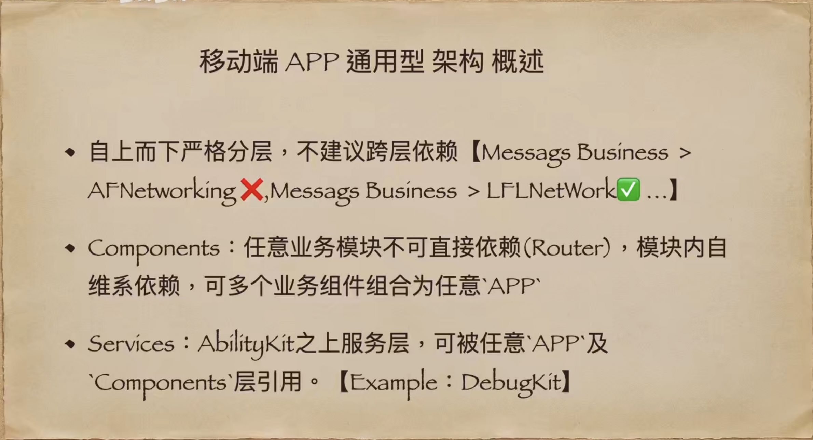


<br/>

***
<br/>

> <h2 id='组件化方案'>组件化方案</h2>

- 目前常用的组件化方案主要有两种：

	- 本地组件化：主要是通过在 工程中创建 library， 利用 cocoapods 的 workspec 进行 本地管理， 不需要将项目上传git，而是直接在项目中以 framework 的方式 进行调用。

	- cocoapods组件化：主要是利用 cocoapods 来进行 模块的远程管理，需要将项目上传 git （这里的组件化模块分为 公有库 和 私有库 ， 对公司而言， 一般是私有库）


<br/>

> <h2 id='本地组件化'>本地组件化</h2>

- **创建主工程**

	- 新建项目主工程
	
	- 集成 cocoapods ， 进行本地管理，执行命令 pod init
	
	- 编辑 Podfile， 并执行 pod install

<br/>

- **创建组件**

- 可以创建 自己的模块：

	- 主工程：主要实现表层业务代码

	- Base：基类封装

	- Tools：工具（字符串，颜色，字体等）

	- Service：服务层，封装业务工具类，例如网络层服务、持久化服务等

	- Pods：第三方依赖

其中，各个模块间的关系如下所示：


<br/>
<br/>
<br/>


>## <h1 id='cocoapods组件化'>[cocoapods组件化](https://mp.weixin.qq.com/s/wGrjGsodJ1KZfGS2OksQKA)</h1>

<br/><br/><br/>

> <h2 id='xxx-umbreall.h文件作用'>xxx-umbreall.h文件作用</h2>

[Swift/Objective-C-使用Cocoapods创建/管理私有库（高级用法](https://www.jianshu.com/p/abb4ffe60e6a)

xxx-umbrella.h 文件在 CocoaPods 或者其他类似的依赖管理系统中扮演了一个重要的角色，它是一个头文件，用于包含某个框架或库中所有的公开头文件，从而使得开发者可以通过包含这一个头文件来访问该框架或库的所有功能和类。

<br/>

**具体来说，xxx-umbrella.h 文件的作用如下：**

- 1.整合所有公开头文件：

在一个复杂的框架或库中，可能存在多个头文件，每个头文件对应着不同的模块或功能。为了方便开发者使用，可以将所有公开的头文件都包含在一个统一的头文件中，即 xxx-umbrella.h。这样开发者只需要包含这一个头文件，就可以访问到所有该框架或库提供的功能。

<br/>

- 2.简化使用：

通过引入 xxx-umbrella.h，开发者不需要关心框架内部的头文件结构，也不需要逐个引入各个头文件。这样做可以极大地简化代码，提高开发效率。

<br/>

- 3.隐藏内部细节：

xxx-umbrella.h 文件可以隐藏框架内部的实现细节，只暴露给外部需要的接口和功能。这有助于提高框架的封装性和安全性。

<br/>

- 4.适用于依赖管理系统：

在依赖管理系统中（比如 CocoaPods、Carthage 等），通过包含 xxx-umbrella.h 文件来引入整个框架或库，从而统一管理依赖关系。


总之，xxx-umbrella.h 文件的存在使得框架或库的使用更加方便和简洁，是对外公开接口的集合点，对于库的使用者来说具有重要的作用。


<br/><br/>

> <h2 id='私有库创建'>私有库创建</h2>

<br/>

- **1.创建步骤模板**

```
//创建一个文件夹，然后在终端使用这个文件夹
$ cd /Users/harleyhuang/Desktop/HGLibrary

//pod库创建
$ pod lib create HGLibrary

//网络不好或者其他原因造成了失败，如下：
/System/Library/Frameworks/Ruby.framework/Versions/2.6/usr/lib/ruby/2.6.0/universal-darwin20/rbconfig.rb:229: warning: Insecure world writable dir /opt/homebrew/bin in PATH, mode 040777
Ignoring executable-hooks-1.6.1 because its extensions are not built. Try: gem pristine executable-hooks --version 1.6.1
Ignoring ffi-1.15.1 because its extensions are not built. Try: gem pristine ffi --version 1.15.1
Ignoring gem-wrappers-1.4.0 because its extensions are not built. Try: gem pristine gem-wrappers --version 1.4.0
Cloning `https://github.com/CocoaPods/pod-template.git` into `HGLibrary`.
[!] /usr/bin/git clone https://github.com/CocoaPods/pod-template.git HGLibrary

Cloning into 'HGLibrary'...
fatal: unable to access 'https://github.com/CocoaPods/pod-template.git/': Could not resolve host: github.com


//解决：我是使用了终端挂上代理
$ export http_proxy=http://127.0.0.1:7890
$ export https_proxy=http://127.0.0.1:7890


//pod再次创建库
$ pod lib create HGLibrary

//回车后终端会让你回答一些问题，如下：
```


<br/>

- **2.文件夹模板展示**

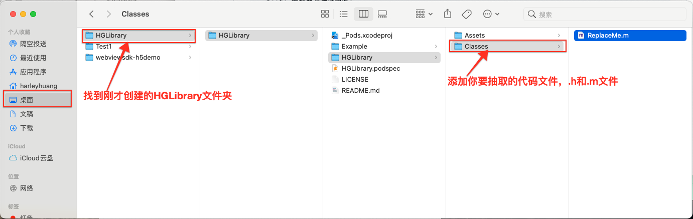

<br/>

- **3.添加一个日志打印类`LogInfo`**

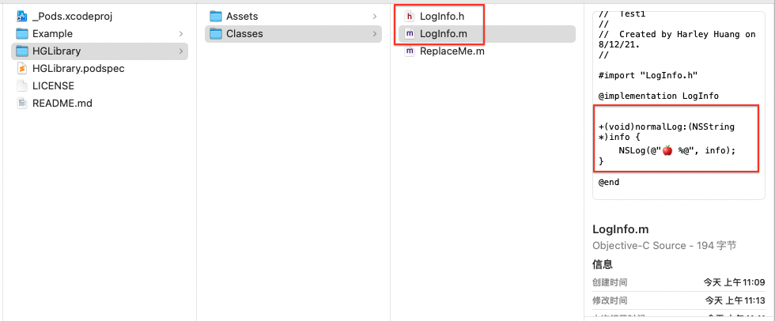


<br/>

- **4.进行测试**

```
//移动到Example目录下
$ cd /Users/harleyhuang/Desktop/HGLibrary/HGLibrary/Example

//安装CocoaPods项目, 每次加入了新的文件后需要pod install把刚才新建的类文件加入到pod库
$ pod install --no-repo-update
```


本地测试：


<br/>

- **5.编辑CocoaPods的配置文件（后缀名为podspec)**

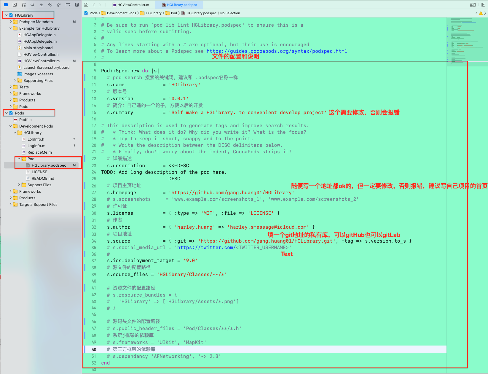

复制私有库地址，在.podspec文件内的s.source替换地址

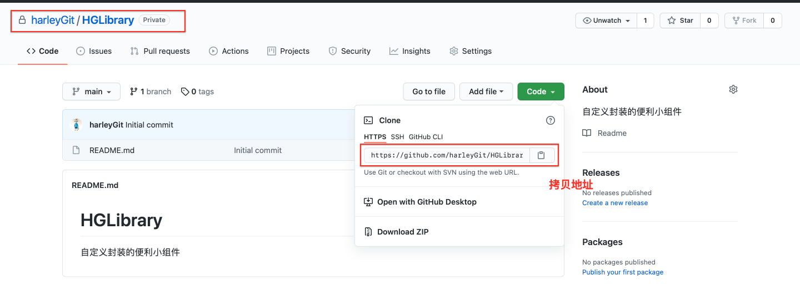

配置完成了

再次移到我们的Example文件，pod更新一下

```
$ pod update --no-repo-update
```


打开项目，看看是否成功了。

然后再测试项目中运行，发现完美可以运行，并在控制台中进行打印。😄😄

这就验证了其的准确性！

<br/>

- **6.验证pod配置文件为了保证项目正确性，pod文件配置没问题，在提交之前，我们需要验证一下**
用终端移到我们的项目路径

```
$ cd /Users/harleyhuang/Desktop/HGLibrary
```


到这里，我们已经完成源码导入、验证项目是否能运行、pod配置文件本地验证了


<br/>

- **7.验证本地spec文件**
在编辑好.podspec文件内容的前提下，使用如下命令先本地检查一下podspec是否合法

```
$ pod lib lint --verbose
```


出现了2个警告和一个错误，后来分析原因：
- 警告一：详细描述没有修改，需要进行修改；
- 警告二：URL不能通过，可能这个网页就不存在，我的错误是`s.homepage`(项目主页地址)没有修改，进行修改就好了；
- 错误三：打开Xcode > Preferences > Locations ，更改一下 Command Line Tools选项就可以了。


描述和首页地址部分截取：

```
# This description is used to generate tags and improve search results.
#   * Think: What does it do? Why did you write it? What is the focus?
#   * Try to keep it short, snappy and to the point.
#   * Write the description between the DESC delimiters below.
#   * Finally, don't worry about the indent, CocoaPods strips it!
  # 详细描述
  s.description      = <<-DESC
  #TODO: Add long description of the pod here.
  自定义的小组件封装，版本 0.0.1，后续会不断更新。
                       DESC
  # 项目主页地址
  s.homepage         = 'https://github.com/harleyGit/HGLibrary/tree/master'
```

对修改后的配置进行提交

```
$ git add .

$ git commit -m '配置文件修改 & Xcode 配置'

$ git push origin master
```

推送时，出现提示如下：


解决如下：

```
# 原因是远程仓库origin上的分支master和本地分支master被Git认为是不同的仓库，所以不能直接合并，需要添加 --allow-unrelated-histories

$ git pull origin master --allow-unrelated-histories
# 会进入一个要求填写 提交信息 的窗口，填写你的提交信息就可以了
# 推送到Github的HGLibrary项目的master分支上
$ git push origin master

```

若是 git push origin master 失败,这是因为本地和远程没有建立联系,则可以:

```
$ git remote add origin https://github.com/harleyGit/xxxx.git
```


<br/>

- **8.发布tag 0.0.1版本，移动到该项目文件下执行git的相关命令**

```
$ git tag 0.1.0
$ git push --tags

* [new tag] 0.1.0 -> 0.1.0
```


若是想建立一个索引库可以打开github网站，在远程创建一个索引库：

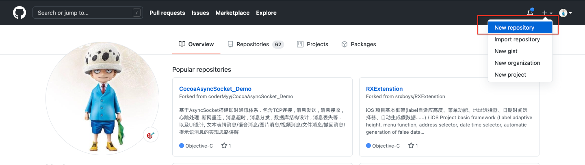

若是不想建也可以


远程索引库地址加入repo

```
$ pod repo add HGIndexLibraryRepo https://github.com/harleyGit/HGIndexLibraryRepo.git
```

注意:`HGIndexLibraryRepo`为私有库名称
    `https://github.com/harleyGit/HGIndexLibraryRepo.git`为私有库地址。
    
在终端下的运行结果,此时索引库已经制作完成,可以进行创建组件工程了
    


<br/>

- **9.验证远程spec文件**

```
$ pod spec lint 
# 如果验证错误 可以使用下面的命令
$ pod lib lint --allow-warnings --use-libraries
```


<br/>

- **10.将私有库的spec文件推送到远程索引库**

```
# HGIndexLibraryRepo 为远程索引库的名称  
# HGLibrary.podspec  为私有库工程里的spec文件
$ pod repo push HGIndexLibraryRepo HGLibrary.podspec
```


发布成功后，我们可以去码云看看HGIndexLibraryRepo的git项目有没有提交成功：

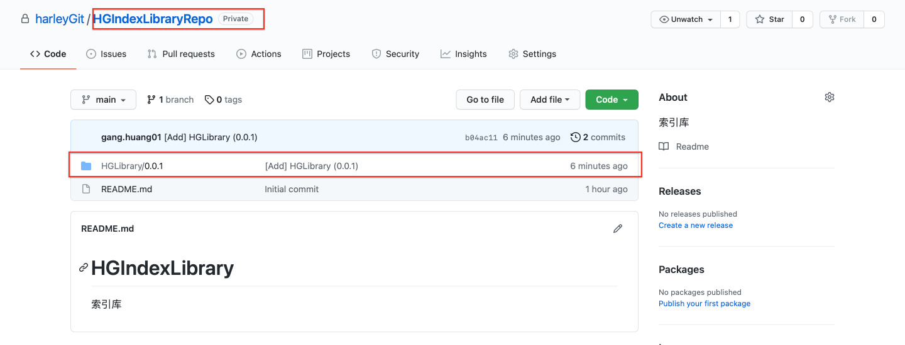

<br/>

```
//注册 CocoaPods 账户
pod trunk register xx@qq.com 'harley'

//登录 CocoaPods 账户
pod trunk login

//默认推送到 CocoaPods 仓库： 在验证和登录后，可以执行以下命令将库推送到 CocoaPods 仓库：
pod trunk push HGLIbrary.podspec --verbose
````


.成功后，就可以pod search到我们提交的库了,如果搜不到我们的pod库。就先执行如下命令

```
rm ~/Library/Caches/CocoaPods/search_index.json
```

**成功之后, 我们的组件及索引就已经完成了,下面集成到主工程中！**

终端输入：

```
$ pod search HGLibrary
```

如下效果：


<br/><br/><br/>

> <h2 id='subspec创建子模块，及子模块之间的引用'>subspec创建子模块，及子模块之间的引用</h2>

[Swift/Objective-C-使用Cocoapods创建/管理私有库（高级用法）](https://www.jianshu.com/p/abb4ffe60e6a)


Subspecs是一种分解Podspec功能的方法，它允许人们安装库的一个子集。也就是说，一个私有库中，包含很多模块，有时我们只需要pod这个私有库中的某个或者某些模块，选择性的使用，并不是pod全部，这时我们就需要在私有库中添加subspec，将各个模块开放分解出来，成为一个单独的子模块，以实现这样的需求。或者私有库中的某个模块和某个模块之间有引用关联，为了不影响其他模块的使用和冗余，也需要将这部分和其他模块区分开，也需要添加subspec。
在添加subspec时需要我们在编码的过程中尽量减少模块之间的依赖，使各个模块儿可以独立运行。

.podspec文件中添加子模块（subspec），并设置子模块键，配置如下：

```
Pod::Spec.new do |s|
  s.name             = 'JYPrivateLibTest0'
  s.version          = '1.0.1'
  s.summary          = '这是一个私有测试库！'

  s.homepage         = 'https://git.asd.net/pod/JYPrivateLibTest0'
  s.license          = { :type => 'MIT', :file => 'LICENSE' }
  s.author           = { 'JYanshao' => '654565181@qq.com' }
  s.source           = { :git => 'https://git.asd.net/pod/JYPrivateLibTest0.git', :tag => s.version.to_s }

  s.ios.deployment_target = '8.0'
  s.requires_arc = true
  s.swift_version = '4.0'
  # s.source_files = 'JYPrivateLibTest0/Classes/**/*'

  # ------ 创建子模块 ------
  s.subspec 'TextField' do |tf|  # tf为子模块键
      tf.source_files = 'JYPrivateLibTest0/Classes/TextField/*'
      tf.dependency 'JYPrivateLibTest0/Constant'  # TextField模块中文件使用了Constant模块的东西，所以需要引入依赖。如果不写依赖，当你只引入TextField模块的时候，就会报错，由于找不到Constant模块中你使用的东西。这里不可以直接引入主spec，即tf.dependency 'JYPrivateLibTest0'，因为cocospods不允许（podspec文件:[!子规范不能要求它的父规范。），且在实际项目中引入时引入不成功，错误移步下边。
  end
  
  s.subspec 'Constant' do |c|  # c为子模块键
      c.source_files = 'JYPrivateLibTest0/Classes/Constant/*'
  end
   
end
```

在上面的例子中，一个工程中，有多个模块，并把各模块分解为子模块，使用 pod 'JYPrivateLibTest0' 的Podfile会包含整个库，而 pod 'JYPrivateLibTest0/Constant' 会只包含Constant模块。只引入你的项目中需要的模块，其他不需要的可以不引入。

<br/>

问题：tf.dependency 'JYPrivateLibTest0/Constant' TextField模块中文件使用了Contants模块的东西，子模块的依赖不能直接依赖父spec，如tf.dependency 'JYPrivateLibTest0', 这样cocospods是不允许，你pod的时候也不会pod成功，错误如下：

```
Analyzing dependencies
Fetching podspec for `JYPrivateLibTest0 ` from `../`
[!] Failed to load 'JYPrivateLibTest0' podspec: 
[!] Invalid `JYPrivateLibTest0.podspec` file: [!] A subspec can't require one of its parents specifications.

 #  from /Users/123456/Desktop/PrivateRepository/JYPrivateLibTest0/JYPrivateLibTest0.podspec:49
 #  -------------------------------------------
 #      tf.source_files = 'JYPrivateLibTest0/Classes/TextField/*'
 >      tf.dependency 'JYPrivateLibTest0'
 #    end
 #  -------------------------------------------
```

**解释：** 

```
[!]加载“ JYPrivateLibTest0”podspec失败:
[! JYPrivateLibTest0]无效”。podspec文件:[!子规范不能要求它的父规范。
```

也就是说：同一工程中一子模块使用了另一子模块的东西，需要引入对另一子模块的依赖，且另一子模块也必须为subspec，不能直接依赖父spec。


<br/><br/><br/>

> <h3 id='工程中使用私有库'>工程中使用私有库</h3>

```
platform :ios, '12.0'

target 'Test1' do
  # Comment the next line if you don't want to use dynamic frameworks
  use_frameworks!
  pod 'ReactiveObjC', '~> 3.1.1'
  pod 'HGLibrary', '~> 0.0.1'
#  pod 'RxSwift', '~> 6.2.0'
#  pod 'ReactObjC', '~> 0.6.0'
#  pod 'ReactiveCocoa', '~> 11.2.1'
  
  # Pods for Test1
  
end

```

错误提示和解决如下图：

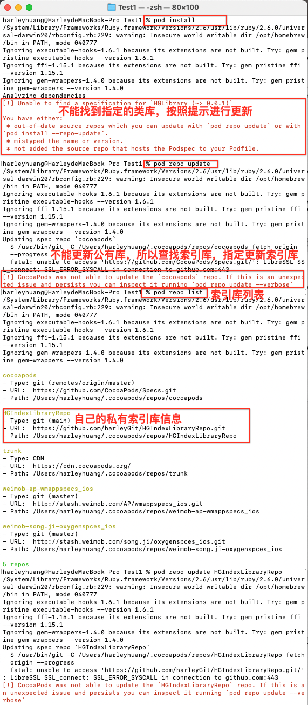


后来各种尝试还是不行，经过同事提示原来私有库需要注明索引库的来源（公有库是不需要的），在Podfile注明引用库来源

```
# 查看索引库
$ pod repo list

# 拷贝注定索引库的URL

# 粘贴到Podfile中
source 'https://github.com/harleyGit/HGIndexLibraryRepo.git'
```

接着再 工程中进行`pod install`,然后就可以再工程中使用了。😄


<br/><br/>
> <h3 id="Podfile语法示例">Podfile语法示例</h3>


```ruby
cocoapods中的Podfile文件有如下：

 def argus_source_sdk_local   
     sdk_path_prefix = '../AB-iOS/' 
 pod 'ACLog', :path => "#{sdk_path_prefix}ACLog.podspec"
end

def argus_app_used_source_sdk
  argus_source_sdk_local

end

target 'abc-demo' do
use_frameworks!

  # Pods for argus-app-ios
  argus_app_used_source_sdk
  argus_app_lint
  argus_app_debug

 pod 'AppBle', :path => 'LocalPods/AppBle.podspec'
end
```

这段脚本有啥用， 还有为什么加了 `pod 'AppBle', :path => 'LocalPods/AppBle.podspec' `这一行后，**`AppBle`**库的Pod文件下有`AppBle.podspec`文件了，怎么回事？


<br/>

 **顶部部分（定义函数）**

```ruby
def argus_source_sdk_local
  sdk_path_prefix = '../AB-iOS/' 
  pod 'ACLog', :path => "#{sdk_path_prefix}ACLog.podspec"
end
```

* `def argus_source_sdk_local`
  这是定义一个方法（函数），名字叫 `argus_source_sdk_local`。
* `sdk_path_prefix = '../AB-iOS/'`
  定义了一个路径前缀，表示本地路径（相对于 Podfile 所在位置，回到上一级目录再进入 AB-iOS 目录）。
* `pod 'ACLog', :path => "#{sdk_path_prefix}ACLog.podspec"`
  指定使用名为 `ACLog` 的 Pod，并且是从本地的 `ACLog.podspec` 文件加载（而不是从 CocoaPods 官方仓库获取）。
  最终等价于：

  ```ruby
  pod 'ACLog', :path => '../AB-iOS/ACLog.podspec'
  ```

<br/>

```ruby
def argus_app_used_source_sdk
  argus_source_sdk_local
end
```

* 又定义了一个函数 `argus_app_used_source_sdk`，它的作用是调用前面那个函数 `argus_source_sdk_local`。
* 这种结构可能是为了后续可扩展性，比如你可以通过这个函数切换成远程源：

```ruby
def argus_source_sdk_remote
  pod 'ACLog', git: 'https://github.com/xxx/ACLog.git'
end
```

然后通过 `argus_app_used_source_sdk` 来决定调用本地还是远程版本。

<br/> 

**✅ `target` 目标配置部分**

```ruby
target 'abc-demo' do
  use_frameworks!
```

* 这是指定 **项目中某个 target（目标）** 使用的 Pod 配置，这里是 `abc-demo`。
* `use_frameworks!` 表示使用 `dynamic frameworks` 而不是 `static libraries`，是现代 CocoaPods 的主流做法。

<br/>

```ruby
  # Pods for argus-app-ios
  argus_app_used_source_sdk
  argus_app_lint
  argus_app_debug
```

* 这些都是调用你前面定义的方法，也就是说：

  * `argus_app_used_source_sdk` 会执行 `argus_source_sdk_local`，最终就是引入了 `ACLog`
  * `argus_app_lint` 和 `argus_app_debug` 应该也是你项目中定义的类似方法，用于引入特定功能的 Pod

<br/>

```ruby
  pod 'AppBle', :path => 'LocalPods/AppBle.podspec'
```

* 这行显式引入了一个本地 Pod，名字叫 `AppBle`，路径是当前目录下的 `LocalPods/AppBle.podspec` 文件。
* `:path =>` 表示使用本地的 Podspec 文件，而不是从远程仓库下载。

<br/>

```ruby
end
```

* 结束 `target 'abc-demo'` 的配置块。

<br/>

**问题：为什么加了这一行后，AppBle 的 Pod 文件夹里就有了 AppBle.podspec？**

这其实是 **正常行为**：

1. 你添加了：

   ```ruby
   pod 'AppBle', :path => 'LocalPods/AppBle.podspec'
   ```

2. 运行 `pod install` 后，CocoaPods 会将本地路径下的 `AppBle.podspec` 解析，并将对应的源码路径加入到 Pod 项目的构建中。

3. 如果你看到了在 `Pods/AppBle/` 中有 `AppBle.podspec` 文件，是因为 CocoaPods 会将它复制进去，作为它构建的一个部分（方便调试和还原）。

这不代表 CocoaPods 自己“生成”了一个 Podspec，而是它把你本地已有的 `AppBle.podspec` 文件引用并放进了构建目录下。


<br/><br/>
> <h3 id="子模块下如何引入**`.podspec`**文件">子模块下如何引入**`.podspec`**文件</h3>


```ruby
def  argus_app_module_chinamainland
pod 'ArgusAppBle/Overseas', :path => 'LocalPods/ArgusAppBle.podspec'
end
target 'argus-app-ios' do

 argus_app_module_chinamainland
end
```

**问题：** 这样写没有把AppBle.podspec放入其模块下Pod文件夹下

 **Podfile:**

```ruby
pod 'ArgusAppBle/Overseas', :path => 'LocalPods/ArgusAppBle.podspec'
```

<br/>

 **1.CocoaPods 如何处理 `:path` 本地子模块（subspec）**

你这行：

```ruby
pod 'ArgusAppBle/Overseas', :path => 'LocalPods/ArgusAppBle.podspec'
```

表示：

> 加载 `LocalPods/ArgusAppBle.podspec` 文件，并**只使用**其中的 `Overseas` 子模块（subspec）。

但是，注意：

 **🔸如果你 Podspec 中的 `Overseas` subspec 本身不包含任何源文件或资源（比如是空的、或者只是依赖别的 subspec），那么它不会在 `Pods/` 中生成对应的文件结构或副本。**

也就是说：

* CocoaPods 只会将实际使用的源码加入构建（例如 `.m`、`.swift`、`.h`）。
* 不会像你期望的那样：**无论如何都拷贝 `podspec` 文件过去** —— 除非你用的是整个 pod（不带 subspec），并且里面包含源码。

<br/>

 **2.为什么之前 `AppBle.podspec` 会出现在 Pods 下？**

你那时候用的是整包：

```ruby
pod 'AppBle', :path => 'LocalPods/AppBle.podspec'
```

* 这表示 **加载整个 Podspec 并包含所有 subspec 或默认 subspec 的内容**。
* 这样做会导致 CocoaPods：

  * 把 podspec 中定义的所有源码、资源、甚至 podspec 文件本身也复制到 `Pods/AppBle/` 目录下。
  * 是完整处理流程。

而你这次：

```ruby
pod 'ArgusAppBle/Overseas', :path => 'LocalPods/ArgusAppBle.podspec'
```

* 指定了子模块（subspec），所以 CocoaPods 只会复制该子模块中定义的内容。
* 如果 `Overseas` 这个子模块没有包含 `source_files`、`resources`、或 `dependencies` 等内容，它可能不会被当作一个独立的文件夹处理。

<br/> 

**3.如何验证/解决**

 检查 podspec 文件中是否有定义 `Overseas`：

你可以打开 `ArgusAppBle.podspec` 文件，检查是否有类似这样定义：

```ruby
Pod::Spec.new do |s|
  s.name = 'ArgusAppBle'
  # ... 其他配置 ...
  s.subspec 'Overseas' do |ss|
    ss.source_files = 'Sources/Overseas/**/*.{h,m,swift}'
  end
end
```

如果 `ss.source_files` 是空的或路径错误，CocoaPods 可能就不会把它处理成一个独立的模块。

<br/> 

✅ 如果你希望 **`ArgusAppBle.podspec` 文件在 `Pods/ArgusAppBle` 下出现**：

* 使用主模块（不带 subspec）：

```ruby
pod 'ArgusAppBle', :path => 'LocalPods/ArgusAppBle.podspec'
```

这样会包含整个 pod，包括 podspec 文件本身。
<br/> 

**✅ 如果你只使用子模块 `Overseas`，且希望内容被复制：**

* 确保 `Overseas` 子模块中定义了有效的 `source_files` 路径，指向实际存在的代码文件。
* 否则，CocoaPods 不会生成任何对应结构。


<br/><br/>


要确保 `ArgusAppBle/Overseas` 子模块能够被 CocoaPods 正常识别并生成对应的文件结构（如出现在 `Pods/ArgusAppBle` 目录下），你需要：

<br/> 

**✅ 正确配置 `Overseas` 子模块的 `source_files`**

假设你有这样的项目结构：

```
LocalPods/
└── HGAppBle/
    ├── Assets/
    │   └── ChinaMainland/
    │   ├── OOverseas
    │       
    ── Classes/
    │   └── ChinaMainland/
    │   ├── Common/
    │   └── Overseas/
    └── ArgusAppBle.podspec
```

你需要确保 `podspec` 文件中包含类似如下内容：

```ruby
Pod::Spec.new do |s|
  s.name             = 'HGAppBle'
  s.version          = '1.0.0'
  s.summary          = 'HGAppBle BLE SDK'
  s.homepage         = 'http://github.com/huangang/HGApple'
  s.license          = { :type => 'MIT', :file => 'LICENSE' }
  s.author           = { 'huanggang' => 'you@example.com' }
  s.platform         = :ios, '11.0'
  s.source           =    = { :git => 'https://github.com/600esss122133/app/HGAppBle-iOS.git', :tag => s.version.to_s }

  # 必须定义一个主模块（哪怕不使用）
  s.source_files     = []
  
    #通用子模块,作为对外模块的基础,一般不直接引用,所有通用的代码及资源应该定义在此处,资源及代码各个子模块之间不能相同,否则pod会报警告,编译也有问题
  s.subspec 'Common' do |ss|
    ss.source_files = 'HGAppBle/Classes/Common/**/*'
    ss.resource_bundles = {
      'HGAppBle_Common' => ["HGAppBle/Assets/Common/**/*"]
    }
    ss.dependency 'Snapkit'
    ss.dependency 'SWebImage'
  end
  
  
   #中国大陆子模块,作为对外模块,渠道代码及资源应该定义在此处,资源及代码各个子模块之间不能相同,否则pod会报警告,编译也有问题
  s.subspec 'ChinaMainland' do |ss|
    ss.source_files = 'HGAppBle/Classes/ChinaMainland/**/*'
    ss.resource_bundles = {
      'HGAppBle_ChinaMainland' => ['HGAppBle/Assets/ChinaMainland/**/*']
    }
    ss.dependency 'HGAppBle/Common'
  end


  # 子模块
  #  #海外子模块,作为对外模块,渠道代码及资源应该定义在此处,资源及代码各个子模块之间不能相同,否则pod会报警告,编译也有问题
  s.subspec 'Overseas' do |ss|
    ss.source_files = 'HGAppBle/Overseas/*.{h,m,swift}'
    ss.resource_bundles = {
      'HGAppBle_Overseas' => ['HGAppBle/Assets/Overseas/**/*']
    }
    ss.dependency 'HGAppBle/Common'
  end
end
```

> ✅ 确保 `Sources/Overseas/` 文件夹里真的存在 `.swift` 或 `.m/.h` 文件。路径不能写错！

<br/>

**✅ Podfile 中使用子模块**

```ruby
pod 'ArgusAppBle/Overseas', :path => 'LocalPods/ArgusAppBle.podspec'
```

然后运行：

```sh
pod install --verbose
```

你会看到：

* `Pods/ArgusAppBle/` 目录下会出现 `OverseasManager.swift` 等文件。
* 虽然不会出现 podspec 文件本身，但模块源码会存在。

<br/> 

**🧪 验证模块是否生效的办法**

你可以在主项目中：

```swift
import ArgusAppBle

let manager = OverseasManager()
```

如果能编译通过，说明模块 `Overseas` 确实集成进来了。

<br/> 

**❗注意事项**

| 错误情况                                  | 原因                        |
| ------------------------------------- | ------------------------- |
| `No such module 'ArgusAppBle'`        | 模块源码没被编译进来，通常是路径错误或文件为空   |
| `pod install` 后 Pods/ArgusAppBle 目录为空 | 子模块中未指定或找不到源文件            |
| 没有生成模块                                | 没有使用 `source_files`，或路径写错 |

<br/>


**你需要做的就是：**

1. 确保 podspec 中 `s.subspec 'Overseas'` 中的 `source_files` 路径正确，指向实际存在的文件。

2. 然后在 Podfile 中使用：

   ```ruby
   pod 'ArgusAppBle/Overseas', :path => 'LocalPods/ArgusAppBle.podspec'
   ```

3. 运行：

   ```bash
   pod install
   ```

这样 `Pods/ArgusAppBle/` 中才会有对应内容。


<br/>
***
<br/><br/><br/>

> <h3 id='问题解决'>问题解决</h3>

<br/>

> <h3 id='443时间超时'>443时间超时</h3>

出现以下情况：

- 电脑无法访问github了,无论你重启电脑，重置网络，重置你的大脑都无法正常访问了;
- 使用【绿色上网】却可以神奇的访问到GitHub。
- 使用昂贵的【绿色上网】，开心的在命令行上敲上你熟悉的`git 、pull、push`等命令进行访问远程库的时候，却给命令行甩你一行【`Failed to connect to github.com port 443: Operation timed out`】

一番不停的搜索后，你知道了设置代理：

```
$ git config --global https.proxy http://127.0.0.1:1080
$ git config --global http.proxy http://127.0.0.1:1080

# 或者绿色上网后挂代理：

$ export http_proxy=http://127.0.0.1:7890
$ export https_proxy=http://127.0.0.1:7890

```

但是还是不行，遭狠狠的打脸！😢

<br>

解决如下：

打开[**iPAddress**](https://github.com.ipaddress.com)，复制如下**IP Adress**：


打开[**github.global.ssl.fastly**](https://fastly.net.ipaddress.com/github.global.ssl.fastly.net#ipinfo)，复制如下**IP Adress**：


打开[**assets-cdn.Github.com - Github Website**](https://github.com.ipaddress.com/assets-cdn.github.com)，复制如下**IP Adress**：


<br/>

打开Mac电脑的host文件夹，选中Finder->【前往】->【前往文件夹】->【/private/etc/hosts】，然后使用其他软件进行打开，将下面的地址复制进去

```
140.82.114.4(图1的IP Address) github.com 
199.232.5.194(图2的IP Address) github.global.ssl.fastly.net
185.199.108.153(图3的IP Address)  assets-cdn.github.com
185.199.109.153(图3的IP Address)  assets-cdn.github.com
185.199.110.153(图3的IP Address)  assets-cdn.github.com
185.199.111.153(图3的IP Address)  assets-cdn.github.com
```

然后 Command+S 进行保存，在终端输入如下指令进行刷新DNS：

```
$ sudo killall -HUP mDNSResponder;say DNS cache has been flushed
```


<br/>
<br/>
<br/>


> <h3 id='更新发布'>更新发布</h3>

在主项目MainProject、子库Foundation,步骤按照下面操作进行更新.


&emsp; **1.** 首先我们需要把子库Foundation拉下来,放在iOS_PrivateLibraries.在Foundation库中新建一个TestOne的文件夹,用来存放新的功能代码,切记新的功能代码要放在这里,否则主项目MainProject无法使用.


<br/>

&emsp; **2.** 将新建的TestOne文件夹放入子库Foundation中:

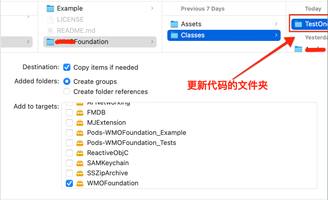

<br/>

&emsp; **3.** 新建LogInfo类,并进行配置

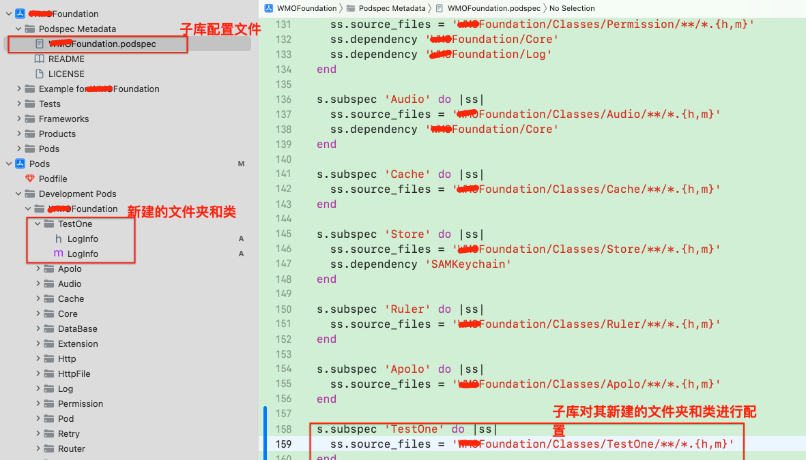


<br/>

&emsp; **4.** 在主项目的Podfile配置子库Foundation的路径,将其和主项目连接起来

主项目Podfile地址:/Users/xxx/Documents/GitLab/Ccrm/Ccrm-iOS/Podfile
子库Foundation地址: /Users/xxx/Documents/GitLab/Ccrm/iOS_PrivateLibraries/Foundation 


<br/>

主项目的Podfile引入本地子库Foundation路径,如下:

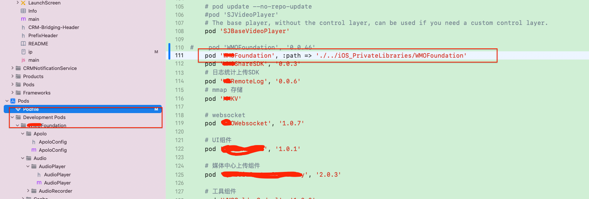

然后在终端输入:

```
//切换到主项目文件地址
cd /Users/xxx/Documents/GitLab/Ccrm/Ccrm-iOS

pod install 
```

然后就可以在主项目中的**Pods/Development Pods/Foundation/TestOne**下看到之前在子库Foundation新建的文件,如下:

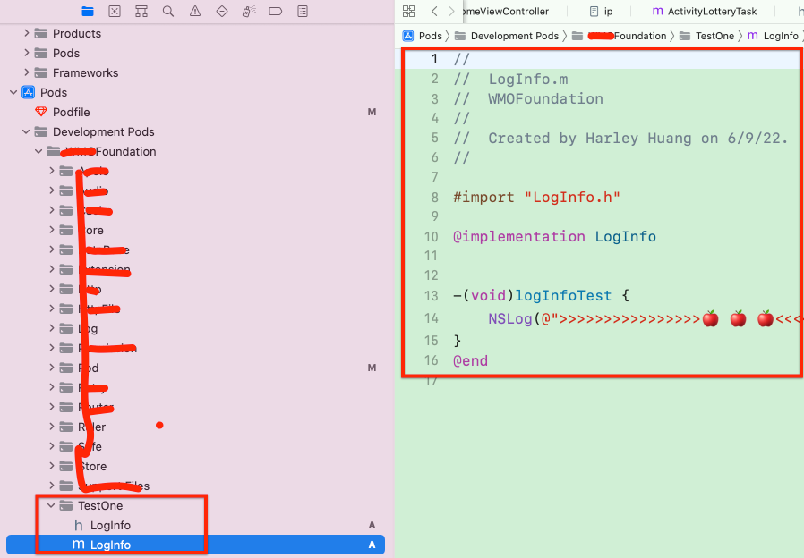

然后你就可以在主项目./Development Pods/Foundation文件下添加修改子库Foundation的代码,同时代码也会同步到子库中了.

<br/>

&emsp; **5.** 在Foundation中测试代码

其实在Foundation的Example中也可以进行代码的测试,打开Terminal,然后定为到Example的地址:

```
cd /Users/xxx/Documents/GitLab/Ccrm/iOS_PrivateLibraries/Foundation/Example

pod install
```
这样就可以在Example中进行子库代码的调试了


<br/>

&emsp; **6.** 子库代码修改完后,然后就可以修改配置文件的版本号,然后提交代码,打版本tag了


<br/>

也可以不用更新版本号的,可以直接定位到要提交的记录,如下:


<br/>

**7.** 更新完了后,需要更新本地对应的资源索引

```
//查看组件库的索引库
pod repo list

pod repo update 资源索引库

cd /Users/xxx/Documents/GitLab/Ccrm/Ccrm-iOS

pod install
```


<br/><br/>


> <h3 id='podspec文件解析'>podspec文件解析</h3>

- **1、s.source_files**

&emsp; s.source_files 用于指定哪些文件是库的源代码文件。这个配置告诉 CocoaPods 在将你的库集成到用户项目中时，应该包括哪些源代码文件。这样可以确保用户在导入你的库时能够访问到库中的所有类和方法。

&emsp; 具体地说，s.source_files 是一个通配符模式，用于匹配库中的源文件,如下:

```
s.source_files  = "Classes/**/*.{h,m}"
```

&emsp; 这表示包括 Classes 文件夹中的所有 .h 和 .m 文件。通配符 ** 表示递归匹配子文件夹。

&emsp; 通过正确配置 s.source_files，确保 CocoaPods 在集成你的库时包含了所有必要的源代码文件，使得用户能够轻松地导入你的库并使用其中的类和方法。

<br/>

&emsp; 在**AFNetworking.h**有这样 `s.source_files = 'AFNetworking/AFNetworking.h`的配置表明只包括了一个头文件，即 AFNetworking.h，而不包括其他源文件。

&emsp; 这样的配置通常适用于那些只需要用户导入一个头文件就能使用整个库的情况。例如，在这个例子中，用户只需要导入 AFNetworking/AFNetworking.h 就可以使用 AFNetworking 库的所有功能，而不需要手动导入其他文件。


<br/>
<br/>


- **2、public_header_files**

&emsp; public_header_files 用于指定哪些头文件应该被包含在库的公共接口中，以便用户在使用库时能够访问这些头文件。这对于确保用户只能访问你希望他们使用的公共 API 非常重要。

```
Pod::Spec.new do |s|
  # 其他配置...

  s.source_files  = "Classes/**/*.{h,m}"

  # public_header_files 指定了公共头文件的路径
  s.public_header_files = "Classes/**/*.h"
end

```

v在这个例子中，s.public_header_files 指定了在 Classes 文件夹中的所有 .h 文件都应该被包含在公共接口中。这样，用户在导入你的库时，就可以直接使用这些头文件中声明的类和方法。

&emsp; 如果你的库的头文件不在统一的文件夹中，你可以适当调整 public_header_files 的路径模式以匹配你的文件结构。例如，如果你的头文件散布在不同的文件夹中，你可以使用多个通配符：

```
s.public_header_files = ["Classes/Folder1/**/*.h", "Classes/Folder2/**/*.h"]
```

&emsp; **请注意，public_header_files 中的路径模式**是相对于 .podspec 文件所在的目录的。确保设置的路径正确，以便 CocoaPods 能够正确地包含这些头文件。

<br/>

**拓展:** 若是没有public_header_files 那么用户在使用库时能访问哪些头文件?

如果在 CocoaPods 的 .podspec 文件中没有指定 public_header_files，默认情况下，所有在 s.source_files 中包含的头文件都可以被用户访问。这包括在库的 .h 文件中声明的所有类和方法。


<br/>
<br/>

- **3、prefix_header_file**

&emsp; 在 CocoaPods 的 .podspec 文件中，prefix_header_file 用于指定一个预处理头文件，该文件中的内容会被添加到每个源文件的开头。这使得你可以在整个库中共享一些通用的定义、宏或导入语句。

下面是一个简单的例子，说明如何使用 prefix_header_file：


```
Pod::Spec.new do |s|
  # 其他配置...

  s.source_files  = "Classes/**/*.{h,m}"

  # prefix_header_file 指定了预处理头文件的路径
  s.prefix_header_file = "Classes/YourLibraryPrefixHeader.h"
end

```

&emsp; 在这个例子中，s.prefix_header_file 指定了一个名为 YourLibraryPrefixHeader.h 的预处理头文件。这个文件中的内容会在编译库中的每个源文件之前被插入。

&emsp; YourLibraryPrefixHeader.h 文件的内容可以包括一些通用的宏定义、导入语句，或者其他你希望在整个库中共享的内容：

```
// YourLibraryPrefixHeader.h

#ifndef YourLibraryPrefixHeader_h
#define YourLibraryPrefixHeader_h

// 定义一些通用的宏
#define YOUR_LIBRARY_VERSION 1.0.0

// 导入一些通用的头文件
#import <Foundation/Foundation.h>
#import <UIKit/UIKit.h>

#endif /* YourLibraryPrefixHeader_h */

```

<br/>
<br/>

- **4、ios.deployment_target**

&emsp; deployment_target 是在 CocoaPods 中用于指定目标部署版本（deployment target）的一个配置项。目标部署版本表示你的库或应用程序要支持的最低操作系统版本。

&emsp; 在 CocoaPods 的 .podspec 文件中，你可以通过设置 deployment_target 来定义你的库或应用程序所支持的最低 iOS 或 macOS 版本。这对于确保你的代码能够在特定版本的操作系统上正常运行是很重要的。

```
s.platform = :ios, '9.0'
s.deployment_target = '9.0'
```

&emsp; 在这个例子中，platform 设置了支持的平台为 iOS，最低版本为 9.0。然后，deployment_target 指定了具体的 iOS 部署目标版本，也是 9.0。这表示你的库或应用程序要求运行在 iOS 9.0 及以上的设备上。


<br/>
<br/>

- **5、s.resource**


&emsp;在 CocoaPods 的 .podspec 文件中，s.resource 用于指定你的库或应用程序包含的资源文件。资源文件可以包括图片、字体、xib 文件、HTML 文件等，它们在应用程序中使用，而不是直接编译成代码。

&emsp;resources 用于将这些资源文件包含在生成的 CocoaPods 二进制文件中，以便用户在使用你的库时可以直接访问这些资源。这在创建包含资源的库时非常有用。

```
s.resource = 'Assets/*.png'
```

&emsp;在这个例子中，s.resource 指定了一个通配符模式，用于包含 Assets 目录中的所有 .png 文件。这些文件将被包含在生成的 CocoaPods 二进制文件中，用户可以直接访问这些资源。

&emsp; 注意：资源文件的路径是相对于 .podspec 文件所在目录的相对路径。确保指定的路径是正确的相对路径，并且资源文件确实存在于该路径中。


<br/>
<br/>

- **6、s.requires_arc**

&emsp; 在 CocoaPods 的 .podspec 文件中，s.requires_arc 用于指定你的库是否需要 ARC（Automatic Reference Counting）。ARC 是一种自动内存管理机制，它由编译器负责自动插入和移除 Objective-C 代码中的内存管理方法，使得开发者不再需要手动管理引用计数。

&emsp; 如果你的库中的源文件使用了 ARC，你应该将 s.requires_arc 设置为 true。如果你的库中的源文件不使用 ARC，那么设置为 false。

```
s.requires_arc = true
```


<br/>
<br/>

- **7、s.static_framework**

&emsp; static_framework 是在 CocoaPods 1.11.0 版本引入的一个新特性。它用于指定是否生成一个静态 framework。

&emsp; 在 CocoaPods 中，默认情况下，当你创建一个 Pod 库时，CocoaPods 会生成一个动态 framework（.framework）。动态 framework 允许在应用程序运行时动态加载库，而静态 framework 则在编译时将库的代码和依赖关系静态链接到应用程序中。

&emsp; 使用 s.static_framework 你可以控制生成的 Pod 是否作为静态 framework。这个属性接受一个布尔值，如果设置为 true，则生成静态 framework；如果设置为 false，则生成默认的动态 framework。

```
s.static_framework = true
```

在这个示例中，s.static_framework 被设置为 true，表示生成静态 framework。

使用静态 framework 的优势包括：

不依赖于动态库： 静态 framework 将库的代码静态链接到应用程序中，无需依赖动态库。

简化发布： 将静态 framework 作为单一的二进制文件发布，方便用户集成。

减少运行时加载时间： 不需要在运行时加载动态库，可能会减少应用程序启动时间。

但同时也有一些注意事项和缺点，例如静态 framework 在包含大量代码时可能会导致应用程序体积增加，而且无法动态更新库版本。

在使用 static_framework 之前，请确保你了解静态和动态 framework 的区别，并明确你的需求和偏好。

<br/>

**拓展: 如何将这个静态库集成到项目中呢?**

在 CocoaPods 中使用 static_framework 创建静态库后，你可以通过以下步骤找到并导出这个库，然后集成到主工程中：

- a.找到生成的静态库： 在你的 Pod 项目的 Pods 目录下，可以找到生成的静态库。通常路径是 Pods/Target Support Files/Pods-YourTargetName。在这个目录下，你可以找到一个名为 libYourLibraryName.a 的文件，这就是生成的静态库。

- b.导出静态库： 将 libYourLibraryName.a 文件拷贝到一个你方便管理的目录中，例如一个新建的文件夹。

- c.导出头文件： 在你的 Pod 项目中，你的静态库的头文件应该被包含在 Pods/Headers/Public/YourLibraryName 目录下。你需要将这个目录的内容一并导出。

- d.集成到主工程中： 将导出的静态库和头文件集成到你的主工程中。

	- 将 libYourLibraryName.a 添加到主工程的 "Build Phases" -> "Link Binary With Libraries" 中。

	- 将导出的头文件目录添加到主工程的 "Build Settings" -> "Header Search Paths" 中。

	- 在主工程的代码中通过 #import 导入你的库的头文件即可开始使用。


- **注意事项：**

	- 确保导出的静态库和头文件的版本和配置与你的主工程匹配。

	- 在导入静态库的过程中，可能需要调整主工程的构建设置，确保正确链接并使用静态库中的符号。

<br/>
<br/>

- **8、s.resource**

&emsp; 在 CocoaPods 的 Podspec 文件中，s.resource 用于指定你的库或应用程序包含的资源文件。资源文件可以包括图片、字体、xib 文件、HTML 文件等，这些文件不是直接编译成代码，而是在运行时需要被加载或使用。

&emsp; 使用 s.resource 可以告诉 CocoaPods 库的使用者，在集成你的库时还需要包含一些资源文件。这样，当其他项目使用你的库时，这些资源文件会被正确地添加到项目中。

```
s.resource = 'Assets/*.png', 'Assets/*.json'
```

在这个示例中，s.resource 设置了两个通配符模式，用于包含 Assets 目录下的所有 .png 和 .json 文件。这些文件将会被包含在生成的 CocoaPods 二进制文件中，用户可以直接访问这些资源。

确保正确设置 s.resource 是很重要的，以确保在集成你的库时，相关的资源文件也被正确地添加到项目中。


<br/>
<br/>

- **9、**

&emsp; 在 CocoaPods 的 Podspec 文件中，s.dependency 用于指定你的库依赖的其他 CocoaPods 库。这是用于声明你的库需要依赖哪些其他库的配置项。

&emsp; 使用 s.dependency 可以告诉 CocoaPods 在安装你的库时，同时安装指定的其他库。这对于构建有依赖关系的项目是非常有用的，因为它确保了依赖库的正确版本被安装。

```
s.dependency 'Alamofire', '~> 5.0'
```


&emsp; 在这个示例中，s.dependency 指定了你的库依赖于 Alamofire 库，并且版本应该在 5.0 版本及以上，但不包括下一个主版本。这样，在安装你的库时，CocoaPods 会自动安装 Alamofire 作为依赖项。

&emsp; 如果你的库有多个依赖，你可以在 s.dependencies 数组中指定多个依赖项：

```
s.dependencies = ['Alamofire', '~> 5.0', 'SwiftyJSON', '~> 4.0']
```

<br/>
<br/>

- **10、s.frameworks**

&emsp; 在 CocoaPods 的 Podspec 文件中，s.frameworks 用于指定你的库或应用程序依赖的系统框架。系统框架是由操作系统提供的共享库，包含了一些常见的功能和工具，例如 UIKit、Foundation、CoreData 等。

&emsp; 使用 s.frameworks 可以告诉 CocoaPods 在集成你的库时，需要链接哪些系统框架。这是很重要的，因为你的库可能使用了某些系统框架提供的功能，而这些框架需要在链接时被引入。

```
s.frameworks = 'UIKit', 'Foundation', 'CoreData'
```

&emsp; 在这个示例中，s.frameworks 指定了你的库依赖于 UIKit、Foundation 和 CoreData 这三个系统框架。在使用 CocoaPods 安装你的库时，这些框架会被添加到项目的链接阶段。

&emsp; 虽然在某些情况下你可能不需要手动指定系统框架，但通常来说，特定的库可能需要链接一些系统框架以确保其正常运行。如果你的库使用了某些系统框架，最好还是指定这些框架，以确保用户在使用你的库时不会遇到链接错误。


<br/>
<br/>

- **11、s.subspec 'Serialization' do |ss|**

```
s.subspec 'Serialization' do |ss|
  ss.source_files = 'AFNetworking/AFURL{Request,Response}Serialization.{h,m}'
end

```


- `s.subspec 'Serialization'`：定义了一个名为 'Serialization' 的子规格。

- `do |ss| ... end`：这是一个代码块，用于配置子规格的属性。

- `ss.source_files`：配置了子规格包含的源文件。在这里，使用了一个包含花括号的通配符模式 `'AFNetworking/AFURL{Request,Response}Serialization.{h,m}'`。

- `'AFNetworking/AFURL{Request,Response}Serialization.{h,m}'`：这个通配符模式匹配了两个文件：`AFURLRequestSerialization.h、AFURLResponseSerialization.h `和它们的对应 .m 文件。

- 因此，这个子规格 'Serialization' 表示在主规格的基础上，你可以选择只包含关于 URL 请求和响应序列化的部分功能。用户可以通过在 Podfile 中指定子规格的方式，只引入他们需要的功能模块，而不是整个库。


<br/>

***
<br/>

> <h1 id='问题解决'>问题解决</h1>


<br/><br/><br/>

> <h2 id='本地调试私有库依赖的另一个私有库'>本地调试私有库依赖的另一个私有库</h2>

- 主工程：MainProject
	- 私有库A：PrivateLibA
		- 私有库B：PrivateLibB

<br/>

主工程中的Podfile：

```
pod 'PrivateLibA', '1.2.3'
```

这个时候主工程中会有私有库PrivateLibA、PrivateLibB，但是这个时候PrivateLibB有Bug，那该如何修改呢？

<br/>

**错误想法一：**

之前想的是把私有库PrivateLibB下载下来然后在主工程中的Podfile中进行配置PrivateLibB的本地路径如下：

```
pod 'PrivateLibB', :path=>'./../PrivateLibB'
```

但是会报错，说明方法不对！


<br/>

**错误想法2：**

我把PrivateLibA下载下来，然后在PrivateLibA的 **PrivateLibA.podspec**中进行如下配置：

```
s.subspec 'Core' do |ss|
    ss.source_files = 'PrivateLibA/Core/**/*'
    ss.dependency 'PrivateLibB', :path=>'./../PrivateLibB'
    ss.dependency 'PrivateLibCC'
end
```

然后在终端输入`pod install`后，还是会报错库，说明这种写法还是不对，后来在ChatGpt下采用下面的方法，才可以


<br/><br/>

**正确如下：**

这个时候你需要把PrivateLibA和PrivateLibB都下载到本地，然后在主工程中的Podfile进行如下进行修改：

```
pod 'PrivateLibA', :path=>'./../PrivateLibA'
pod 'PrivateLibB', :path=>'./../PrivateLibB'
```

然后在终端输入命令：

```
pod install
```

就好了


***
<br/><br/><br/>
> <h2 id="文件引用导致GeneratedduplicateUUIDS">文件引用导致Generated duplicate UUIDS</h2>


**`pod install`**出现很多警告，这个问题查了很久，使用ChatGPT但是都是很机械，不能正确解答。

究其原因，还是因为：
- **`[!] [Xcodeproj] Generated duplicate UUIDs`**:这是因为私有库中出现了很多重复的文件，虽然他们处于不同的文件夹下. 同时我还发现如果没有指明resource_bundles的扩展名，也会出现这个问题**`{xib,xcdatamodeld,png,svg,jpg,xcassets,html,js,css,json,glb,xodr,txt}`**
	- **解决办法1**：在项目正常运行且没有强迫症的情况下，可以在podfile中加入`install! 'cocoapods', :deterministic_uuids => false`，但是这个方法只是掩耳盗铃，问题还是存在，只是隐藏了。
	- **解决办法2：** 也可在警告中的最后一行，找出文件名，去xcode中的全局搜索文件名看看，是否重复，想办法解决。
		- 这个方法还是很有效的，你也以在**终端**搜索`.swift`文件，看看项目中是否有重复的文件，这个问题常常因为合并代码导致因为一个文件从一个库移到另一个库，导致重复造成的。我这里根据末尾找到：`DeviceActivatorTipView.swift`文件。


<br/>

***
<br/>

> <h1 id=''></h1>