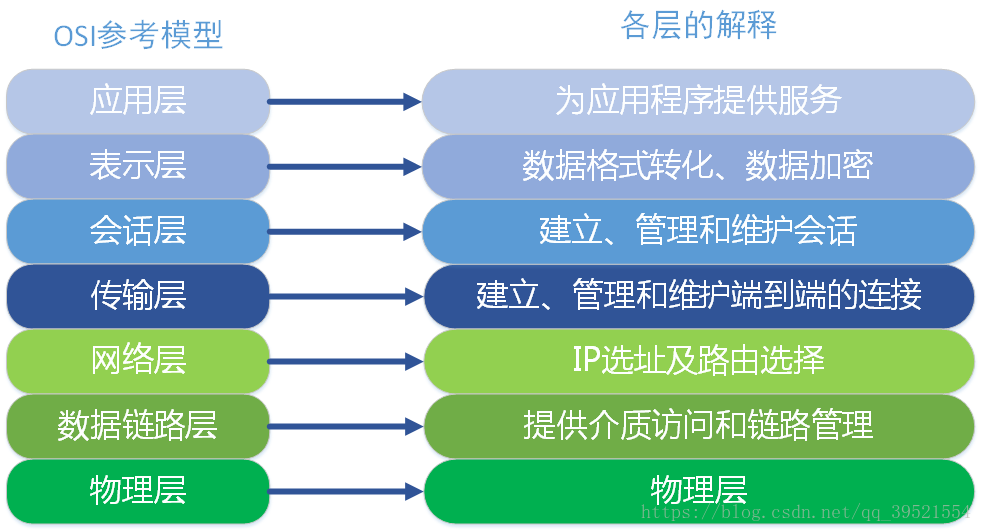
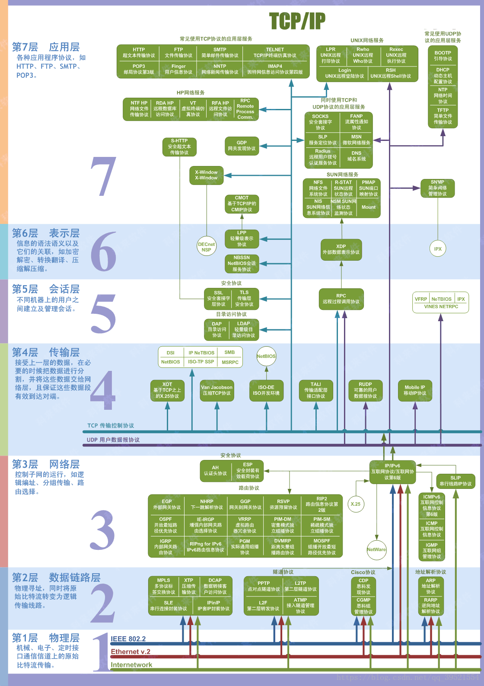

> <h1 id=''></h1>
- [**通信7层协议**](#通信7层协议)
- [**TCP/IP、HTTP的用法**](#TCP/IP、HTTP的用法)
- [**Socket**](#Socket)
- [**HTTPS**](#HTTPS) 
	- [HTTPS通信过程](#HTTPS通信过程)
	- [HTTP 和 HTTPS 的区别](#HTTP和HTTPS的区别)


<br/>

***

<br/><br/>

> <h1 id='通信7层协议'>通信7层协议</h1>
 


<br/>



- **`应用层`** 协议有：HTTP、 FTP、 TFTP、 SMTP、 SNMP、 DNS、 TELNET、 HTTPS、 POP3、 DHCP;

- **`表示层`** 数据的表示、安全、压缩，格式有：JPEG、ASCll、DECOIC、加密格式等(数据格式化，代码转换，数据加密),没有协议;

- **`会话层`** 建立、管理、终止会话,没有协议;

- **`传输层`** (主要协议是`TCP/UDP`协议)定义传输数据的协议端口号，以及流控和差错校验。协议有：TCP、 UDP，数据包一旦离开网卡即进入网络传输层;

- **`网络层`** (外界工具：路由器，主要协议是`IP`协议)进行逻辑地址寻址，实现不同网络之间的路径选择。协议有：ICMP、 IGMP、 IP（IPV4 IPV6） 、ARP、 RARP;

- **`数据链路层`** (外界工具：交换机/网卡)建立逻辑连接、进行硬件地址寻址、差错校验 等功能。（由底层网络定义协议，作用是打包数据）将比特组合成字节进而组合成帧，用MAC地址访问介质，错误发现但不能纠正。协议有：SLIP、 CSLIP、 PPP、 MTU、 ARP、  RARP;

- **`物理层`** (外界工具：网线)建立、维护、断开物理连接。以二进制数据形式在物理媒体上传输数据（由底层网络定义协议）协议有：ISO2110 IEEE802 IEEE802.2;


<br/>




<br/>

***
<br/><br/>

> <h1 id='TCP/IP、HTTP的用法'>TCP/IP、HTTP的用法</h1>


TCP/IP协议是传输层协议，主要解决数据如何在网络中传输；

HTTP是应用层协议，主要解决如何包装数据；

&emsp;我们在传输数据时，可以只使用（传输层）TCP/IP协议，但是那样的话，如果没有应用层，便无法识别数据内容，如果想要使传输的数据有意义，则必须使用到应用层协议，应用层协议有很多，比如HTTP、FTP、TELNET等，也可以自己定义应用层协议；


<br/>

***
<br/><br/>

> <h1 id='Socket'>Socket</h1>


**1).**  Socket其实并不是一个协议 而是一个通信模型。它是为了方便大家直接使用更底层协议（TCP | UDP）而存在的抽象层,是介于`传输层`和`应用层`的抽象通信模型，充当一个媒介，就像一个排插，传输层充当电源、客户端充当用电器，Socekt充当转换操作;

**2).**  Socket是对 TCP/IP协议的封装，Socket本身并不是协议，而是一个调用的接口（API），主要用来一台电脑的两个进程通信;

**3)\.**  Socket在网络通信中，它涵盖了网络层、传输层、会话层、表示层、应用层，因为其信时候用到了IP和端口，仅这两个就表明了它用到了网络层和传输层，而且它无视多台电脑通信的系统差别，所以它涉及了表示层，一般Socket都是基于一个应用程序的，所以会涉及到会话层和应用层.


<br/>

***
<br/><br/>

> <h1 id='HTTPS'>HTTPS </h1>


&emsp;  `HTTPS(Hyper Text Transfer Protocol over Secure Socket Layer)`, 是以安全为目标的HTTP通道，简单讲是HTTP的安全版。即HTTP下加入SSL层，HTTPS的安全基础是SSL，因此加密的详细内容就需要SSL；

<br/>


&emsp;  HTTP是应用层协议，TCP是传输层协议，在应用层和传输层之间，增加了一个安全套接层SSL/TLS。

&emsp;  如上图所示 HTTPS 相比 HTTP 多了一层 SSL/TLS，SSL/TLS层负责客户端和服务器之间的加解密算法协商、密钥交换、通信连接的建立。

&emsp;  HTTPS在传输数据之前需要客户端（浏览器）与服务端（网站）之间进行一次握手，在握手过程中将确立双方加密传输数据的密码信息。TLS/SSL协议不仅仅是一套加密传输的协议，更是一件经过艺术家精心设计的艺术品，TLS/SSL中使用了非对称加密，对称加密以及HASH算法。

<br/><br/><br/>

> <h2 id='HTTPS通信过程'>HTTPS通信过程</h2>


- **`HTTPS通信过程`**

```
a.  客户端请求https链接，服务端返回公钥
b.  客户端产生随机对称密钥
c.  客户端用公钥对对称密钥加密
d.  客户端发送加密后的对称密钥
e.  客户端发送通过对称密钥加密的密文通信

```


<br/><br/><br/>

> <h2 id='HTTP和HTTPS的区别'>HTTP 和 HTTPS 的区别</h2>


- **`HTTP 和 HTTPS 的区别`**

a.    超文本传输协议HTTP协议被用于在Web浏览器和网站服务器之间传递信息;

b.  HTTP协议以明文方式发送内容，不提供任何方式的数据加密;

c.  HTTPS：安全套接字层超文本传输协议HTTPS， 在HTTP的基础上加入SSL协议，SSL依靠证书来验证服务器的身份，并为浏览器和服务器之间的通信加密;

d.  https协议需要到ca申请证书，一般免费证书很少，需要交费;

e.  http是超文本传输协议，信息是明文传输，https 则是具有安全性的ssl加密传输协议;

f.  http和https使用的是完全不同的连接方式，用的端口也不一样，前者是80，后者是443;

g.http的连接很简单，是无状态的；HTTPS协议是由SSL+HTTP协议构建的可进行加密传输、身份认证的网络协议，比http协议安全;

<br/>

-  **`如何保证公钥不被篡改？`**
 
&emsp; 解决方法：将公钥放在数字证书中。只要证书是可信的，公钥就是可信的。


- **`公钥加密计算量太大，如何减少耗用的时间？`**

&emsp; 解决方法：每一次对话（session），客户端和服务器端都生成一个"对话密钥"（session key），用它来加密信息。由于"对话密钥"是对称加密，所以运算速度非常快，而服务器公钥(非对称加密)只用于加密"对话密钥"本身，这样就减少了加密运算的消耗时间。
