> <h1 id=''></h1>
- [**通信7层协议**](#通信7层协议)
- [**TCP/IP、HTTP的用法**](#TCP/IP、HTTP的用法)
	- [IP 直连在IPv6 环境下的可行性](#IP直连在IPv6环境下的可行性)
		- [IPV4兼容IPV6](#IPV4兼容IPV6)
- [**Socket**](#Socket)
	- [账户安全](#账户安全)
- [WebSocket](#WebSocket)
	- 	[WebSocket使用场景](#WebSocket使用场景)
	- 	[WebSocket诞生由来](#WebSocket诞生由来)
		- 	[一般网络请求](#一般网络请求)
		- 	[最开始的轮询Polling阶段(短轮询)](#最开始的轮询Polling阶段(短轮询))
		- 	[改进后的长轮询(Longpolling)](#改进后的长轮询(Longpolling))
	- 	[WebSocket诞生](#WebSocket诞生)
	- [WebSocket协议原理](#WebSocket协议原理)
	- [WebSocket和Socket的区别与联系](#WebSocket和Socket的区别与联系)
	- [	iOS开源WebSocket和Socket框架](#iOS开源WebSocket和Socket框架)
- [**‌SRWebSocket**](#SRWebSocket)
	- [重连机制优化](#重连机制优化)
	- 	[SRWebSocket成员变量](#SRWebSocket成员变量)
	- [	SRWebSocket方法](#SRWebSocket方法)
	- 	[5种状态代理方法](#5种状态代理方法)
	- 	[使用](#使用)
- [**HTTPS**](#HTTPS) 
	- [HTTPS通信过程](#HTTPS通信过程)
	- [HTTP 和 HTTPS 的区别](#HTTP和HTTPS的区别)
- [**CDN和DNS**](#CDN和DNS)
	- [CDN简介](#CDN简介)
	- [DNS介绍](#DNS介绍)
	- [dns与cdn的关系](#dns与cdn的关系)
	- [http调度方式](#http调度方式)
	- [缓存的两种方式](#缓存的两种方式)
	- [cdn的整个工作过程](#cdn的整个工作过程)
- **参考**
	- [IM系列文章](https://github.com/ChenYilong/iOSBlog/blob/master/Tips/%E5%9F%BA%E4%BA%8EWebsocket%E7%9A%84IM%E5%8D%B3%E6%97%B6%E9%80%9A%E8%AE%AF%E6%8A%80%E6%9C%AF/%E6%8A%80%E6%9C%AF%E5%AE%9E%E7%8E%B0%E7%BB%86%E8%8A%82.md)


<br/>

***

<br/><br/>

> <h1 id='通信7层协议'>通信7层协议</h1>
 


<br/>


- **`应用层`** 协议有：HTTP、 FTP、 TFTP、 SMTP、 SNMP、 DNS、 TELNET、 HTTPS、 POP3、 DHCP;

- **`表示层`** 数据的表示、安全、压缩，格式有：JPEG、ASCll、DECOIC、加密格式等(数据格式化，代码转换，数据加密),没有协议;

- **`会话层`** 建立、管理、终止会话,没有协议;

- **`传输层`** (主要协议是`TCP/UDP`协议)定义传输数据的协议端口号，以及流控和差错校验。协议有：TCP、 UDP，数据包一旦离开网卡即进入网络传输层;

- **`网络层`** (外界工具：路由器，主要协议是`IP`协议)进行逻辑地址寻址，实现不同网络之间的路径选择。协议有：ICMP、 IGMP、 IP（IPV4 IPV6） 、ARP、 RARP;

- **`数据链路层`** (外界工具：交换机/网卡)建立逻辑连接、进行硬件地址寻址、差错校验 等功能。（由底层网络定义协议，作用是打包数据）将比特组合成字节进而组合成帧，用MAC地址访问介质，错误发现但不能纠正。协议有：SLIP、 CSLIP、 PPP、 MTU、 ARP、  RARP;

- **`物理层`** (外界工具：网线)建立、维护、断开物理连接。以二进制数据形式在物理媒体上传输数据（由底层网络定义协议）协议有：ISO2110 IEEE802 IEEE802.2;


<br/>


<br/>

***
<br/><br/>

> <h1 id='TCP/IP、HTTP的用法'>TCP/IP、HTTP的用法</h1>


TCP/IP协议是传输层协议，主要解决数据如何在网络中传输；

HTTP是应用层协议，主要解决如何包装数据；

&emsp;我们在传输数据时，可以只使用（传输层）TCP/IP协议，但是那样的话，如果没有应用层，便无法识别数据内容，如果想要使传输的数据有意义，则必须使用到应用层协议，应用层协议有很多，比如HTTP、FTP、TELNET等，也可以自己定义应用层协议；


<br/><br/><br/>

> <h2 id='IP直连在IPv6环境下的可行性'>IP直连在IPv6环境下的可行性</h2>


**IP 直连在IPv6 环境下的可行性**

首先：所有防 DNS 方案都是基于IP直连的方案，那么就要首先介绍 IP 直连这个方案的可行性。

从2016年6月1日起，iOS 应用必须支持 IPv6，否则审核将被拒。IPv6 规则出来后，网上有一种言论称：IP 直连不可行。

其实是 IP 直连，在 IPv6 环境下也是可行的，下面做下说明：

IP或域名在到达服务器前，经历了两个步骤往往会被我们所忽略：

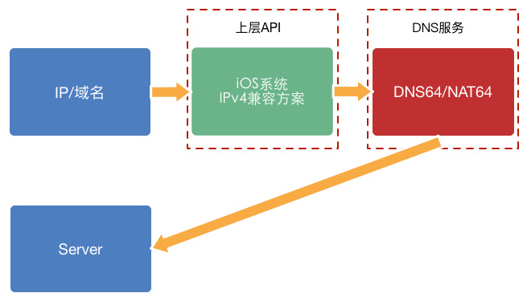


如果你拿一个 IPv4 的 IP 或域名进行请求，在 IPv6-Only 环境下，有[两个机制(IPV4兼容IPV6)](#IPV4兼容IPV6)可以保证最终能够到达 Server 地址。

<br/><br/><br/>

> <h2 id='IPV4兼容IPV6'>IPV4兼容IPV6</h2>

**第一个机制是绿色部分**，指的是 iOS系统级别的 IPv4 兼容方案，只要你使用了 NSURLSession 或 CFNetwork， 那么 iOS 系统会将帮你把它转为 IPv6 地址。


<br/><br/>

**第二个机制是 DNS 服务的兼容方案**，可以是运营商提供的服务，也可以是第三方 DNS 解析机构比如 DNSPod。如果 DNS 解析出来的域名是 IPv4 地址，也会转为 IPv6 兼容的地址。DNS64/NAT64 起到的作用就是将网关的出口地址进行转换，映射到 IPv4 地址上，保证路由能寻址到 IPv4 的地址。

<br/>

综上所述，IPv6 政策的应对方案可以有下面几种：

- 使用高层API，比如 NSURLSession and CFNetwork。

- 升级服务器，让服务端支持 IPv6。在 APP 中替换 IPv4 的地址。

- 如果你的 APP 需要使用了更底层的 API 连接到仅支持 IPv4 的服务器，且不使用 DNS 域名解析，请在APP端使用 getaddrinfo 处理 IPv4 地址串( getaddrinfo 可通过传入一个IPv4或IPv6地址，得到一个 sockaddr 结构链表)。如果当前的网络接口不支持 IPv4，仅支持 IPv6，NAT64和DNS64，这样做可以得到一个合成的IPv6地址。

- 就目前国内的情况来看，据大部分的服务端器是不支持IPv6的，最后一种方法更加适用。这样一来，服务端完全不用做更改，在服务端看来，客户端是能够正常连接到 IPv4 的地址的。


<br/>

***
<br/><br/>

> <h1 id='Socket'>Socket</h1>


**1).**  Socket其实并不是一个协议 而是一个通信模型。它是为了方便大家直接使用更底层协议（TCP | UDP）而存在的抽象层,是介于`传输层`和`应用层`的抽象通信模型，充当一个媒介，就像一个排插，传输层充当电源、客户端充当用电器，Socekt充当转换操作;

**2).**  Socket是对 TCP/IP协议的封装，Socket本身并不是协议，而是一个调用的接口（API），主要用来一台电脑的两个进程通信;

**3).**  Socket在网络通信中，它涵盖了网络层、传输层、会话层、表示层、应用层，因为其信时候用到了IP和端口，仅这两个就表明了它用到了网络层和传输层，而且它无视多台电脑通信的系统差别，所以它涉及了表示层，一般Socket都是基于一个应用程序的，所以会涉及到会话层和应用层.


<br/><br/><br/>

> <h2 id='账户安全'>账户安全</h2>

**1.无侵入的权限控制：**

与用户的用户帐号体系完全隔离，只需要提供一个ID就可以通信，接入方可以对该 ID 进行 MD5 加密后再进行传输和存储，保证开发者用户数据的私密性及安全。

<br/>

**2.签名机制**

对关键操作，支持第三方服务器鉴权，保护你的信息安全。

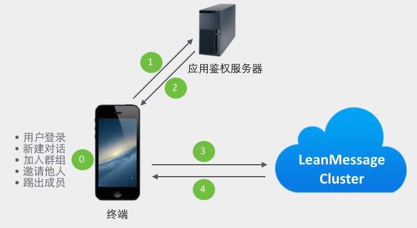

<br/>

**3.单点登录**

让 APP 支持单点登录，能有限减少盗号造成的安全问题。在 ChatKit-OC 中，我们就默认开启了单点登录功能，以此来提升 APP 的安全性。


<br/><br/><br/>


> <h2 id='WebSocket'>WebSocket</h2>

<br/><br/><br/>

> <h2 id='WebSocket使用场景'>WebSocket使用场景</h2>

- 1.社交聊天

<br/>

- 2.弹幕

<br/>

- 3.多玩家游戏

<br/>

- 4.协同编辑

<br/>

- 5.股票基金实时报价

<br/>

- 6.体育实况更新

<br/>

- 7.视频会议/聊天

<br/>

- 8.基于位置的应用
	
	- 越来越多的开发者借用移动设备的GPS功能来实现他们基于位置的网络应用。如果你一直记录用户的位置(比如运行应用来记录运动轨迹)，你可以收集到更加细致化的数据。

<br/>

- 9.在线教育

	- 在线教育近几年也发展迅速。优点很多，免去了场地的限制，能让名师的资源合理的分配给全国各地想要学习知识的同学手上，Websocket是个不错的选择，可以视频聊天、即时聊天以及其与别人合作一起在网上讨论问题

<br/>

- 10.智能家居
	
	- 这也是我一毕业加入的一个伟大的物联网智能家居的公司。考虑到家里的智能设备的状态必须需要实时的展现在手机app客户端上，毫无疑问选择了Websocket。

<br/>

**总结:** 从上面我列举的这些场景来看，一个共同点就是，高实时性！

<br/><br/><br/>

> <h2 id='WebSocket诞生由来'>WebSocket诞生由来</h2>

<br/><br/><br/>

> <h2 id='一般网络请求'>一般网络请求</h2>


<br/><br/><br/>

> <h2 id='最开始的轮询Polling阶段(短轮询)'>最开始的轮询Polling阶段(短轮询)</h2>

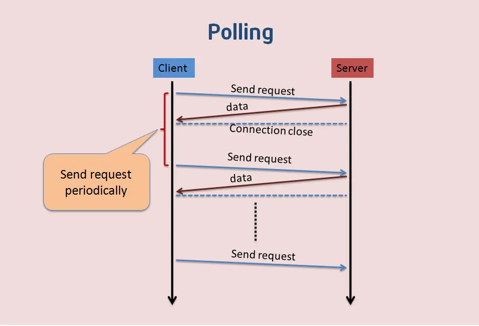

<br/>

比如设备:

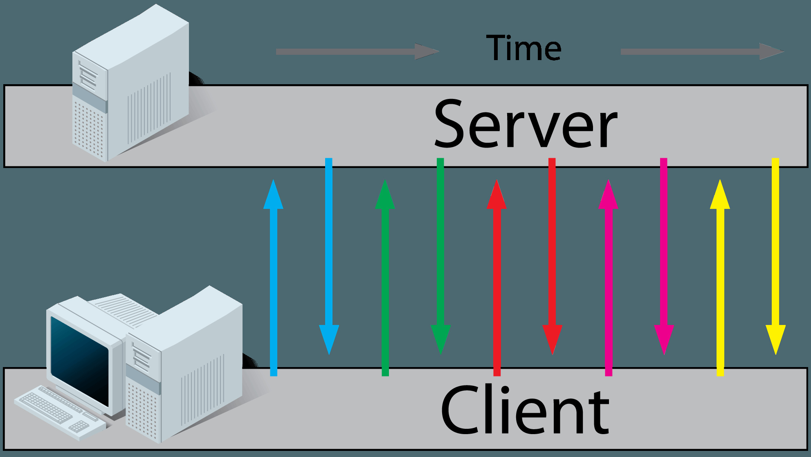

这种方式下，是不适合获取实时信息的，客户端和服务器之间会一直进行连接，每隔一段时间就询问一次。客户端会轮询，有没有新消息。这种方式连接数会很多，一个接受，一个发送。而且每次发送请求都会有Http的Header，会很耗流量，也会消耗CPU的利用率。


<br/><br/><br/>

> <h2 id='改进后的长轮询(Longpolling)'>改进后的长轮询(Long polling)</h2>

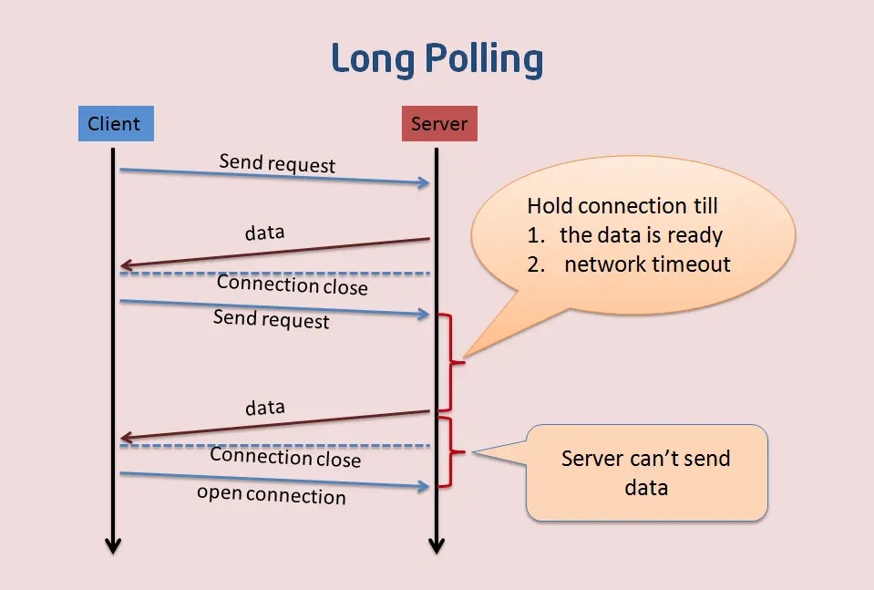

比如现实设备:

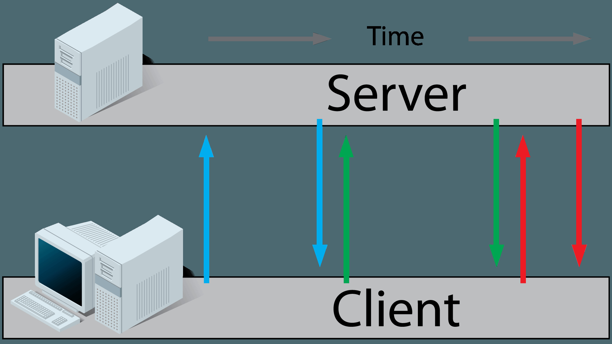


长轮询是对轮询的改进版，客户端发送HTTP给服务器之后，有没有新消息，如果没有新消息，就一直等待。

当有新消息的时候，才会返回给客户端。在某种程度上减小了网络带宽和CPU利用率等问题。但是这种方式还是有一种弊端：例如假设服务器端的数据更新速度很快，服务器在传送一个数据包给客户端后必须等待客户端的下一个Get请求到来，才能传递第二个更新的数据包给客户端，那么这样的话，客户端显示实时数据最快的时间为2×RTT（往返时间），而且如果在网络拥塞的情况下，这个时间用户是不能接受的，比如在股市的的报价上。

另外，由于http数据包的头部数据量往往很大（通常有400多个字节），但是真正被服务器需要的数据却很少（有时只有10个字节左右），这样的数据包在网络上周期性的传输，难免对网络带宽是一种浪费。

<br/><br/><br/>

> <h2 id='WebSocket诞生'>WebSocket诞生</h2>

现在急需的需求是能支持客户端和服务器端的双向通信，而且协议的头部又没有HTTP的Header那么大，于是，Websocket就诞生了!

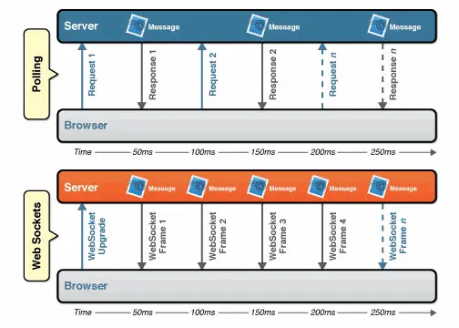

<br/>

上图就是Websocket和Polling的区别，从图中可以看到Polling里面客户端发送了好多Request，而下图，只有一个Upgrade，非常简洁高效。至于消耗方面的比较就要看下图了.


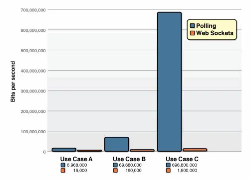

上图中，我们先看蓝色的柱状图，是Polling轮询消耗的流量，这次测试，HTTP请求和响应头信息开销总共包括871字节。当然每次测试不同的请求，头的开销不同。这次测试都以871字节的请求来测试。

&emsp; 相同的每秒客户端轮询的次数，当次数高达10W/s的高频率次数的时候，Polling轮询需要消耗665Mbps，而Websocket仅仅只花费了1.526Mbps，将近435倍！


<br/><br/><br/>

> <h2 id='WebSocket协议原理'>WebSocket协议原理</h2>

Websocket是应用层第七层上的一个应用层协议，它必须依赖 [**HTTP 协议进行一次握手**](https://datatracker.ietf.org/doc/html/rfc6455)，握手成功后，数据就直接从 TCP 通道传输，与 HTTP 无关了。

Websocket的数据传输是frame形式传输的，比如会将一条消息分为几个frame，按照先后顺序传输出去。这样做会有几个好处：

- 1.大数据的传输可以分片传输，不用考虑到数据大小导致的长度标志位不足够的情况;

- 2.和http的chunk一样，可以边生成数据边传递消息，即提高传输效率;

<br/>

```
 0                   1                   2                   3
 0 1 2 3 4 5 6 7 8 9 0 1 2 3 4 5 6 7 8 9 0 1 2 3 4 5 6 7 8 9 0 1
 +-+-+-+-+-------+-+-------------+-------------------------------+
 |F|R|R|R| opcode|M| Payload len |    Extended payload length    |
 |I|S|S|S|  (4)  |A|     (7)     |             (16/64)           |
 |N|V|V|V|       |S|             |   (if payload len==126/127)   |
 | |1|2|3|       |K|             |                               |
 +-+-+-+-+-------+-+-------------+ - - - - - - - - - - - - - - - +
 |     Extended payload length continued, if payload len == 127  |
 + - - - - - - - - - - - - - - - +-------------------------------+
 |                               |Masking-key, if MASK set to 1  |
 +-------------------------------+-------------------------------+
 | Masking-key (continued)       |          Payload Data         |
 +-------------------------------- - - - - - - - - - - - - - - - +
 :                     Payload Data continued ...                :
 + - - - - - - - - - - - - - - - - - - - - - - - - - - - - - - - +
 |                     Payload Data continued ...                |
 +---------------------------------------------------------------+


    FIN      1bit 表示信息的最后一帧，flag，也就是标记符
    RSV 1-3  1bit each 以后备用的 默认都为 0
    Opcode   4bit 帧类型，稍后细说
    Mask     1bit 掩码，是否加密数据，默认必须置为1 （这里很蛋疼）
    Payload  7bit 数据的长度
    Masking-key      1 or 4 bit 掩码
    Payload data     (x + y) bytes 数据
    Extension data   x bytes  扩展数据
    Application data y bytes  程序数据
```

具体的规范，还请看官网的[RFC 6455](https://datatracker.ietf.org/doc/html/rfc6455) 文档给出的详细定义。这里还有一个[翻译版本](https://www.gitbook.com/?utm_source=legacy&utm_medium=redirect&utm_campaign=close_legacy)


<br/><br/><br/>

> <h2 id='WebSocket和Socket的区别与联系'>WebSocket 和 Socket的区别与联系</h2>

Socket 其实并不是一个协议。它工作在 OSI 模型会话层（第5层），是为了方便大家直接使用更底层协议（一般是 TCP 或 UDP ）而存在的一个抽象层。Socket是对TCP/IP协议的封装，Socket本身并不是协议，而是一个调用接口(API)。

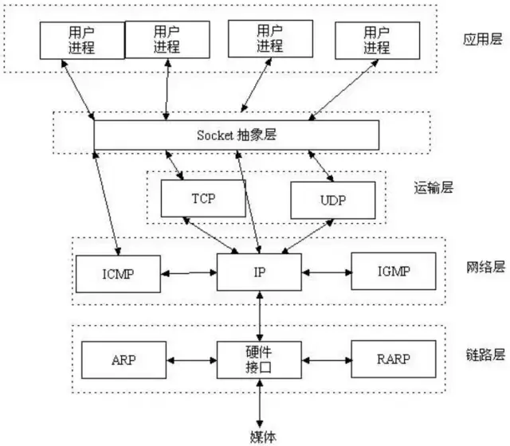

<br/><br/>

Socket通常也称作”套接字”，用于描述IP地址和端口，是一个通信链的句柄。网络上的两个程序通过一个双向的通讯连接实现数据的交换，这个双向链路的一端称为一个Socket，一个Socket由一个IP地址和一个端口号唯一确定。应用程序通常通过”套接字”向网络发出请求或者应答网络请求。

Socket在通讯过程中，服务端监听某个端口是否有连接请求，客户端向服务端发送连接请求，服务端收到连接请求向客户端发出接收消息，这样一个连接就建立起来了。客户端和服务端也都可以相互发送消息与对方进行通讯，直到双方连接断开。

所以基于WebSocket和基于Socket都可以开发出IM社交聊天类的app


<br/><br/><br/>

> <h2 id='iOS开源WebSocket和Socket框架'>iOS开源WebSocket和Socket框架</h2>


- **Socket开源框架:**
	- [CocoaAsyncSocket ](https://github.com/robbiehanson/CocoaAsyncSocket)

	- [socket.io-client-swift](https://github.com/socketio/socket.io-client-swift)


<br/>

- **WebSocket开源框架:**
	- [SocketRocket](https://github.com/facebookincubator/SocketRocket)
	
	- [SwiftWebSocket](https://github.com/tidwall/SwiftWebSocket)


<br/><br/><br/>

> <h2 id='iOS实现WebSocket协议'>iOS实现WebSocket协议</h2>

来看看[SocketRocket](https://github.com/facebookincubator/SocketRocket)的实现方法.

<br/><br/>


***
<br/><br/><br/>


> <h1 id='SRWebSocket'>SRWebSocket</h1>


<br/><br/><br/>


> <h2 id='重连机制优化'>重连机制优化</h2>

- 精简心跳包，保证一个心跳包大小在10字节之内；

- 减少心跳次数：心跳包只在空闲时发送；从收到的最后一个指令包进行心跳包周期计时而不是固定时间。

- 重连冷却
	- 2的指数级增长2、4、8，消息往来也算作心跳。类似于 iPhone 密码的 错误机制，冷却单位是5分钟，依次是5分钟后、10分钟后、15分钟后，10次输错，清除数据。

<br/>

当然，这样灵活的策略也同样决定了，只能在 APP 层进行心跳ping。


<br/>

这里有必要提一下重连机制的必要性，我们知道 TCP 也有保活机制，但这个与我们在这里讨论的“心跳保活”机制是有区别的。

TCP 保活（TCP KeepAlive 机制）和心跳保活区别：

| **TCP保活** | **心跳保活** |
|--|--|
|在定时时间到后，一般是 7200s，发送相应的 KeepAlive 探针。失败后重试 10 次，每次超时时间 75s。|通常可以设置为3-5分钟发出 Ping|
|检测连接的死活（对应于下图中的1）|检测通讯双方的存活状态（对应于下图中的2）|

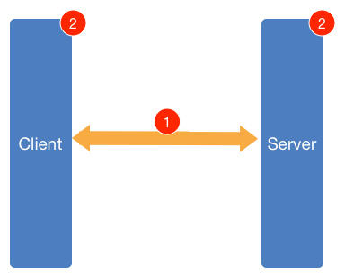


<br/>

**疑问:** 保活，究竟保的是谁？

比如：考虑一种情况，某台服务器因为某些原因导致负载超高，CPU 100%，无法响应任何业务请求，但是使用 TCP 探针则仍旧能够确定连接状态，这就是典型的连接活着但业务提供方已死的状态，对客户端而言，这时的最好选择就是断线后重新连接其他服务器，而不是一直认为当前服务器是可用状态，一直向当前服务器发送些必然会失败的请求。


<br/><br/><br/>

> <h2 id='SRWebSocket成员变量'>SRWebSocket成员变量</h2>

```
@property (nonatomic, weak) id <SRWebSocketDelegate> delegate;
/**
 A dispatch queue for scheduling the delegate calls. The queue doesn't need be a serial queue.

 If `nil` and `delegateOperationQueue` is `nil`, the socket uses main queue for performing all delegate method calls.
 */
@property (nonatomic, strong) dispatch_queue_t delegateDispatchQueue;
/**
 An operation queue for scheduling the delegate calls.

 If `nil` and `delegateOperationQueue` is `nil`, the socket uses main queue for performing all delegate method calls.
 */
@property (nonatomic, strong) NSOperationQueue *delegateOperationQueue;
@property (nonatomic, readonly) SRReadyState readyState;
@property (nonatomic, readonly, retain) NSURL *url;
@property (nonatomic, readonly) CFHTTPMessageRef receivedHTTPHeaders;
// Optional array of cookies (NSHTTPCookie objects) to apply to the connections
@property (nonatomic, copy) NSArray<NSHTTPCookie *> *requestCookies;

// This returns the negotiated protocol.
// It will be nil until after the handshake completes.
@property (nonatomic, readonly, copy) NSString *protocol;
```


<br/><br/><br/>

> <h2 id='SRWebSocket方法'>SRWebSocket方法</h2>


```

// Protocols should be an array of strings that turn into Sec-WebSocket-Protocol.
- (instancetype)initWithURLRequest:(NSURLRequest *)request;
- (instancetype)initWithURLRequest:(NSURLRequest *)request protocols:(NSArray<NSString *> *)protocols;
- (instancetype)initWithURLRequest:(NSURLRequest *)request protocols:(NSArray<NSString *> *)protocols allowsUntrustedSSLCertificates:(BOOL)allowsUntrustedSSLCertificates;

// Some helper constructors.
- (instancetype)initWithURL:(NSURL *)url;
- (instancetype)initWithURL:(NSURL *)url protocols:(NSArray<NSString *> *)protocols;
- (instancetype)initWithURL:(NSURL *)url protocols:(NSArray<NSString *> *)protocols allowsUntrustedSSLCertificates:(BOOL)allowsUntrustedSSLCertificates;

// By default, it will schedule itself on +[NSRunLoop SR_networkRunLoop] using defaultModes.
- (void)scheduleInRunLoop:(NSRunLoop *)aRunLoop forMode:(NSString *)mode;
- (void)unscheduleFromRunLoop:(NSRunLoop *)aRunLoop forMode:(NSString *)mode;

// SRWebSockets are intended for one-time-use only.  Open should be called once and only once.
- (void)open;
- (void)close;
- (void)closeWithCode:(NSInteger)code reason:(NSString *)reason;

///--------------------------------------
#pragma mark Send
///--------------------------------------

//下面是4个发送的方法
/**
 Send a UTF-8 string or binary data to the server.

 @param message UTF-8 String or Data to send.

 @deprecated Please use `sendString:` or `sendData` instead.
 */
- (void)send:(id)message __attribute__((deprecated("Please use `sendString:` or `sendData` instead.")));
- (void)sendString:(NSString *)string;
- (void)sendData:(NSData *)data;
- (void)sendPing:(NSData *)data;

@end
```

<br/><br/><br/>

> <h2 id='5种状态代理方法'>5种状态代理方法</h2>

```
///--------------------------------------
#pragma mark - SRWebSocketDelegate
///--------------------------------------
@protocol SRWebSocketDelegate <NSObject>

- (void)webSocket:(SRWebSocket *)webSocket didReceiveMessage:(id)message;

@optional
- (void)webSocketDidOpen:(SRWebSocket *)webSocket;
- (void)webSocket:(SRWebSocket *)webSocket didFailWithError:(NSError *)error;
- (void)webSocket:(SRWebSocket *)webSocket didCloseWithCode:(NSInteger)code reason:(NSString *)reason wasClean:(BOOL)wasClean;
- (void)webSocket:(SRWebSocket *)webSocket didReceivePong:(NSData *)pongPayload;

// Return YES to convert messages sent as Text to an NSString. Return NO to skip NSData -> NSString conversion for Text messages. Defaults to YES.
- (BOOL)webSocketShouldConvertTextFrameToString:(SRWebSocket *)webSocket;
@end
```


didReceiveMessage方法是必须实现的，用来接收消息的。
下面4个did方法分别对应着Open，Fail，Close，ReceivePong不同状态的代理方法

方法就上面这些了，我们实际来看看代码怎么写


<br/><br/><br/>

> <h2 id='使用'>使用</h2>

先是初始化Websocket连接，注意此处ws://或者wss://连接有且最多只能有一个，这个是Websocket协议规定的

```
self.ws = [[SRWebSocket alloc] initWithURLRequest:[NSURLRequest requestWithURL:[NSURL URLWithString:[NSString stringWithFormat:@"%@://%@:%zd/ws", serverProto, serverIP, serverPort]]]];

self.ws.delegate = delegate;
[self.ws open];
```

<br/>

发送消息

```
[self.ws send:message];
```


<br/>

接收消息以及其他3个代理方法

```
//这个就是接受消息的代理方法了，这里接受服务器返回的数据，方法里面就应该写处理数据，存储数据的方法了。
- (void)webSocket:(SRWebSocket *)webSocket didReceiveMessage:(id)message
{
    NSDictionary *data = [NetworkUtils decodeData:message];
    if (!data)
        return;
}

//这里是Websocket刚刚Open之后的代理方法。就想微信刚刚连接中，会显示连接中，当连接上了，就不显示连接中了，取消显示连接的方法就应该写在这里面
- (void)webSocketDidOpen:(SRWebSocket *)webSocket
{
    // Open = silent ping
    [self.ws receivedPing];
}

//这是关闭Websocket的代理方法
- (void)webSocket:(SRWebSocket *)webSocket didCloseWithCode:(NSInteger)code reason:(NSString *)reason wasClean:(BOOL)wasClean
{
    [self failedConnection:NSLS(Disconnected)];
}

//这里是连接Websocket失败的方法，这里面一般都会写重连的方法
- (void)webSocket:(SRWebSocket *)webSocket didFailWithError:(NSError *)error
{
    [self failedConnection:NSLS(Disconnected)];
}
```


<br/>

***
<br/><br/>

> <h1 id='HTTPS'>HTTPS </h1>


&emsp;  `HTTPS(Hyper Text Transfer Protocol over Secure Socket Layer)`, 是以安全为目标的HTTP通道，简单讲是HTTP的安全版。即HTTP下加入SSL层，HTTPS的安全基础是SSL，因此加密的详细内容就需要SSL；

<br/>


&emsp;  HTTP是应用层协议，TCP是传输层协议，在应用层和传输层之间，增加了一个安全套接层SSL/TLS。

&emsp;  如上图所示 HTTPS 相比 HTTP 多了一层 SSL/TLS，SSL/TLS层负责客户端和服务器之间的加解密算法协商、密钥交换、通信连接的建立。

&emsp;  HTTPS在传输数据之前需要客户端（浏览器）与服务端（网站）之间进行一次握手，在握手过程中将确立双方加密传输数据的密码信息。TLS/SSL协议不仅仅是一套加密传输的协议，更是一件经过艺术家精心设计的艺术品，TLS/SSL中使用了非对称加密，对称加密以及HASH算法。

<br/><br/><br/>

> <h2 id='HTTPS通信过程'>HTTPS通信过程</h2>


- **`HTTPS通信过程`**

```
a.  客户端请求https链接，服务端返回公钥
b.  客户端产生随机对称密钥
c.  客户端用公钥对对称密钥加密
d.  客户端发送加密后的对称密钥
e.  客户端发送通过对称密钥加密的密文通信

```


<br/><br/><br/>

> <h2 id='HTTP和HTTPS的区别'>HTTP 和 HTTPS 的区别</h2>


- **`HTTP 和 HTTPS 的区别`**

a.    超文本传输协议HTTP协议被用于在Web浏览器和网站服务器之间传递信息;

b.  HTTP协议以明文方式发送内容，不提供任何方式的数据加密;

c.  HTTPS：安全套接字层超文本传输协议HTTPS， 在HTTP的基础上加入SSL协议，SSL依靠证书来验证服务器的身份，并为浏览器和服务器之间的通信加密;

d.  https协议需要到ca申请证书，一般免费证书很少，需要交费;

e.  http是超文本传输协议，信息是明文传输，https 则是具有安全性的ssl加密传输协议;

f.  http和https使用的是完全不同的连接方式，用的端口也不一样，前者是80，后者是443;

g.http的连接很简单，是无状态的；HTTPS协议是由SSL+HTTP协议构建的可进行加密传输、身份认证的网络协议，比http协议安全;

<br/>

-  **`如何保证公钥不被篡改？`**
 
&emsp; 解决方法：将公钥放在数字证书中。只要证书是可信的，公钥就是可信的。


- **`公钥加密计算量太大，如何减少耗用的时间？`**

&emsp; 解决方法：每一次对话（session），客户端和服务器端都生成一个"对话密钥"（session key），用它来加密信息。由于"对话密钥"是对称加密，所以运算速度非常快，而服务器公钥(非对称加密)只用于加密"对话密钥"本身，这样就减少了加密运算的消耗时间。


<br/>

***
<br/><br/><br/>


> <h1 id='CDN和DNS'>CDN和DNS</h1>


<br/><br/><br/>

> <h2 id='CDN简介'>CDN简介</h2>

**什么是cdn?**

&emsp; cdn全称是内容分发网络。其目的是让用户能够更快速的得到请求的数据。简单来讲，cdn就是用来加速的，他能让用户就近访问数据，这样就更更快的获取到需要的数据。

&emsp; 举个例子，现在服务器在北京，深圳的用户想要获取服务器上的数据就需要跨越一个很远的距离，这显然就比北京的用户访问北京的服务器速度要慢。但是现在我们在深圳建立一个cdn服务器，上面缓存住一些数据，深圳用户访问时先访问这个cdn服务器，如果服务器上有用户请求的数据就可以直接返回，这样速度就大大的提升了
       
<br/><br/><br/>

> <h2 id='DNS介绍'>DNS介绍</h2>

&emsp; 要了解cdn就先要了解一下dns。当我们在浏览器中输入一个域名时，首先需要将域名转换为ip地址，再将ip地址转换为mac地址，这样才能在网络上找到该服务器。我们先不看ip转换mac地址的过程，先来看看是怎么将一个域名转换为ip的。

&emsp; 当我们向dns服务器发起解析域名的请求时，dns服务器首先会查询自己的缓存中有没有该域名，如果缓存中存在该域名，则可以直接返回ip地址。如果缓存中没有，服务器则会以递归的方式层层访问。例如，我们要访问www.baidu.com，首先我们会先向全球13个根服务器发起请求，询问com域名的地址，然后再向负责com域名的名称服务器发送请求，找到baidu.com，这样层层递归，最终找到我们需要的ip地址。


<br/><br/><br/>

> <h2 id='dns与cdn的关系'>dns与cdn的关系</h2>

刚才说到cdn实际上是一个就近访问，那么现在有一个问题是，我们怎么知道用户的所在位置从而给他分配最佳的cdn节点呢。这就需要dns服务来进行定位了。当我们通过使用dns服务的时候，可以根据他使用的LDNS服务器来进行一个定位，例如我们的调度服务器看到他是来自深圳电信的LDNS服务器，那么我们就认为该用户来自深圳电信，然后调度服务器可以让该用户去访问深圳电信的CDN服务器，这样就让用户访问到了最优的cdn节点。

通过dns服务我们可以很快的定位到用户的位置，然后给用户分配最佳cdn节点，但是这种调度方式存在一个问题，例如，当我 是北京联通的用户但是使用的却是深圳电信的ldns的话，调度服务器会给我分配到深圳电信的cdn服务器，这样就产生了错误的调度。


<br/><br/><br/>

> <h2 id='http调度方式'>http调度方式</h2>


针对上面的问题，我们还有另一种调度方式——http调度。

    当用户访问我们的服务器时，服务器先分析用户的ip地址，然后服务器给用户返回一个302重定向，将离用户最近的服务器存在location中，用户再去请求这个cdn服务器就能得到最佳的cdn节点。

    这种调度方式的优点是他的定位更加准确，不会因为错误的ldns造成访问偏差。但是他的缺点就是需要一次额外的http访问，这样首次访问的延时就会比较高。所以如果是对大文件的请求，显然采用http的调度方式比较合适，因为大文件的请求需要更多的时间，相比之下可以忽略这次http请求的时间，但是如果是一些小文件的请求，花费这个时间有时就有些得不偿失了。

    当然我们也可以将这两种方式结合起来使用，先通过dns的方式来定位，然后通过http的方式来纠正偏差。


<br/><br/><br/>

> <h2 id='缓存的两种方式'>缓存的两种方式</h2>


cdn中缓存了服务器上的部分资源。那么服务器怎么去更新cdn节点的缓存呢？这里有两种方式，一种是服务器主动去更新缓存，cdn节点被动接受。另一种方式是当用户请求的资源不存在时，cdn服务器向上游服务器发起请求，更新缓存，然后将数据返回给用户，这种方式是cdn服务器主动，源站服务器被动。显然第一种方式存在很多问题，例如很容易产生404等，所以一般采用第二种缓存方式。


<br/><br/><br/>

> <h2 id='cdn的整个工作过程'>cdn的整个工作过程</h2>


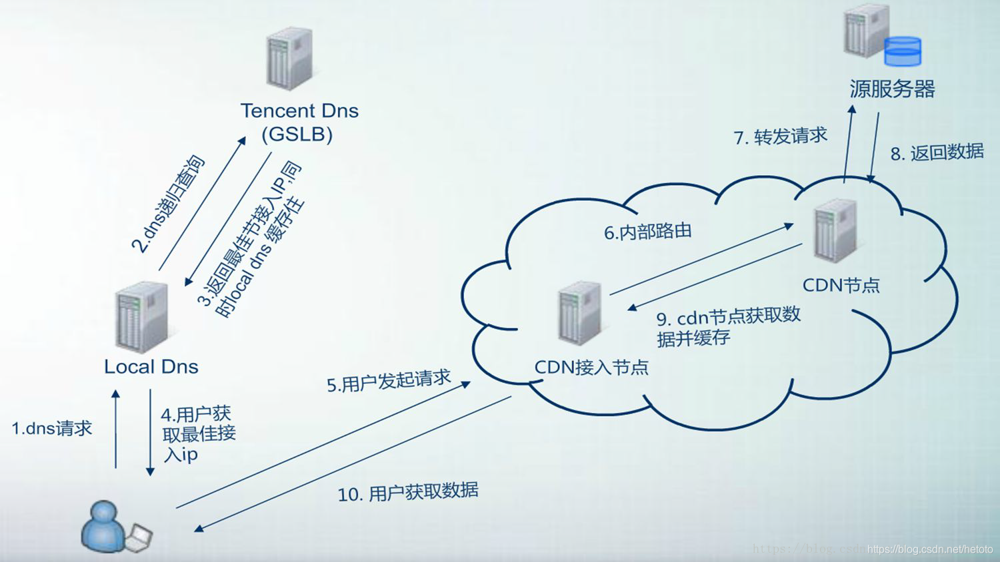


当用户请求一个文件时，cdn的工作过程如下：

1.dns请求当地local DNS

2.当地local DNS递归的查询服务器的gslb

3.服务器根据local DNS 分配最佳节点，返回ip

4.用户获得最佳接入ip，访问最佳节点。

5.如果该节点没有用户想要获取的内容，则通过内部路由访问上一节点，直到找到文件或到达源站为止。

6.cdn节点缓存该数据，下次请求该文件时可以直接返回。

