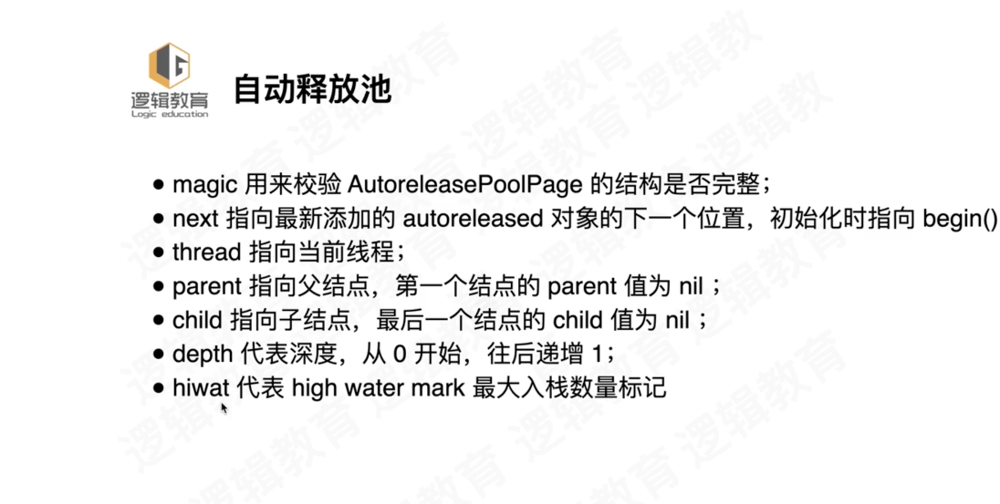
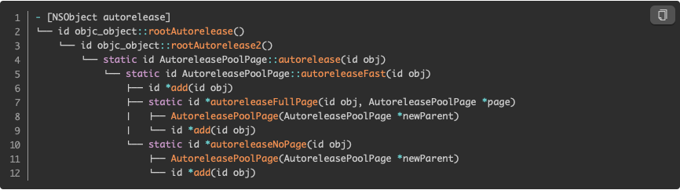
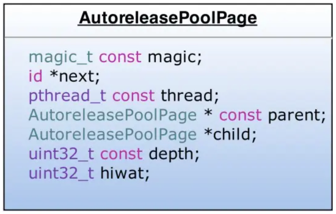
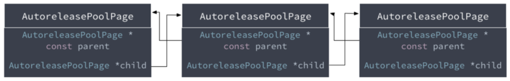
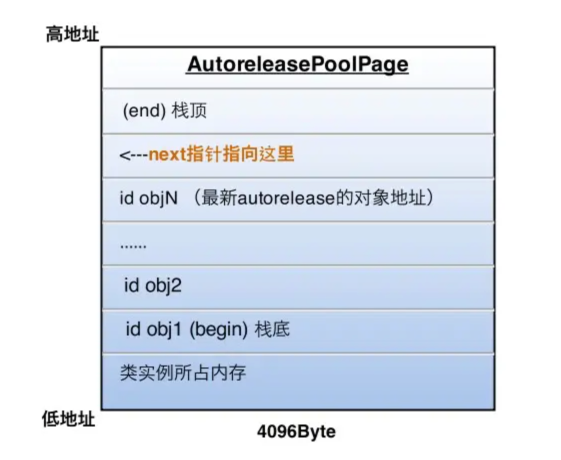
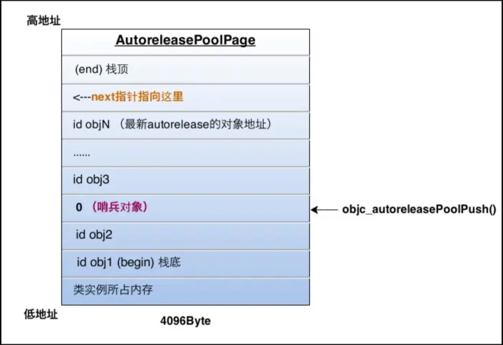
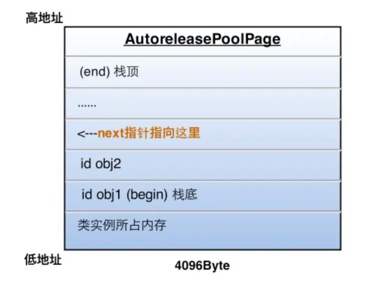

- [**Autorelease原理**](#Autorelease原理)
	- [源码解析](#源码解析)
	- [分析结构体__AtAutoreleasePool](#分析结构体__AtAutoreleasePool)
	- [objc_autoreleasePoolPush与objc_autoreleasePoolPop](#objc_autoreleasePoolPush与objc_autoreleasePoolPop)
	- [AutoreleasePoolPage](#AutoreleasePoolPage)
		- [AutoreleasePoolPage类重要方法](#AutoreleasePoolPage类重要方法)
	- [autorelease方法调用栈](#autorelease方法调用栈)
- [**Autorelease 释放时刻**](#Autorelease释放时刻)
	- [释放条件](#释放条件)
	- [释放原理](#释放原理)
- [**AutoreleasePool与NSThread、NSRunLoop的关系**](#AutoreleasePool与NSThread-NSRunLoop的关系)
	- [RunLoop和NSThread的关系](#RunLoop和NSThread的关系)
	- [RunLoop和AutoreleasePool的关系](#RunLoop和AutoreleasePool的关系)
	- [Thread和AutoreleasePool的关系](#Thread和AutoreleasePool的关系)
- [**AutoreleasePool手动添加情况**](#AutoreleasePool手动添加情况)
- **资料**
	- [](https://www.jianshu.com/p/7bd2f85f03dc)


<br/>

***
<br/>

> <h1 id='Autorelease原理'>Autorelease原理</h1>

自动释放池的创建和释放，销毁的时机如下所示

- `kCFRunLoopEntry`; // 进入runloop之前，创建一个自动释放池
- `kCFRunLoopBeforeWaiting`; // 休眠之前，销毁自动释放池，创建一个新的自动释放池
- `kCFRunLoopExit`; // 退出runloop之前，销毁自动释放池

<br/>


<br/>
<br/>


> <h2 id='源码解析'>源码解析</h2>

Main函数中的自动释放池范例：

```
int main(int argc, const char * argv[]) {
    @autoreleasepool {
        NSLog(@"Hello, World!");
    }
    return 0;
}

```

在终端使用clang -rewrite-objc + 文件名命令将上述OC代码转化为C++源码：

```

int main(int argc, const char * argv[]) {
    /* @autoreleasepool */
    {
        __AtAutoreleasePool __autoreleasepool;
        NSLog((NSString *)&__NSConstantStringImpl__var_folders_3f_crl5bnj956d806cp7d3ctqhm0000gn_T_main_d37e0d_mi_0);
     }//大括号对应释放池的作用域
     
     return 0;
}

```

我们看到的所谓的@autoreleasePool块，其实对应着__AtAutoreleasePool的结构体。


<br/>
<br/>
<br/>


> <h2 id='分析结构体__AtAutoreleasePool'>分析结构体__AtAutoreleasePool</h2>


```
/*
* __AtAutoreleasePool结构体包含了：构造函数、析构函数和一个边界对象；
* 构造函数内部调用：objc_autoreleasePoolPush()方法，返回边界对象atautoreleasepoolobj
* 析构函数内部调用：objc_autoreleasePoolPop()方法，传入边界对象atautoreleasepoolobj
*/

extern "C" __declspec(dllimport) void * objc_autoreleasePoolPush(void);
extern "C" __declspec(dllimport) void objc_autoreleasePoolPop(void *);

struct __AtAutoreleasePool {
  __AtAutoreleasePool() {atautoreleasepoolobj = objc_autoreleasePoolPush();}
  ~__AtAutoreleasePool() {objc_autoreleasePoolPop(atautoreleasepoolobj);}
  void * atautoreleasepoolobj;
};

```


<br/>

- **main函数中__autoreleasepool结构体实例的生命周期**

`__autoreleasepool`是一个自动变量，其构造函数是在程序执行到声明这个对象的位置时调用的，而其析构函数则是在程序执行到离开这个对象的作用域时调用。所以，我们可以将上面main函数的代码简化如下：

```

int main(int argc, const char * argv[]) {
    /* @autoreleasepool */ {
        void *atautoreleasepoolobj = objc_autoreleasePoolPush();
        NSLog((NSString *)&__NSConstantStringImpl__var_folders_kb_06b822gn59df4d1zt99361xw0000gn_T_main_d39a79_mi_0);
        objc_autoreleasePoolPop(atautoreleasepoolobj);
    }
    return 0;
}


```


<br/>
<br/>


> <h2 id='objc_autoreleasePoolPush与objc_autoreleasePoolPop'>objc_autoreleasePoolPush与objc_autoreleasePoolPop</h2>


自动释放池构造函数与析构函数的实现，它们都只是对AutoreleasePoolPage对应静态方法push和pop的封装.

```

void *objc_autoreleasePoolPush(void) {
    return AutoreleasePoolPage::push();
}

void objc_autoreleasePoolPop(void *ctxt) {
    AutoreleasePoolPage::pop(ctxt);
}

```


<br/>


<br/>
<br/>


> <h2 id='AutoreleasePoolPage'>AutoreleasePoolPage</h2>


```

struct AutoreleasePoolPageData
{
	magic_t const magic;//校验AutoreleasePagePoolPage结构是否完整
	__unsafe_unretained id *next;//指向新加入的autorelease对象的下一个位置，初始化时指向begin()
	pthread_t const thread;//当前所在线程，AutoreleasePool是和线程一一对应的
	AutoreleasePoolPage * const parent;//指向父节点page，第一个结点的parent值为nil
	AutoreleasePoolPage *child;//指向子节点page，最后一个结点的child值为nil
	uint32_t const depth;//链表深度，节点个数
	uint32_t hiwat;//数据容纳的一个上限

	AutoreleasePoolPageData(__unsafe_unretained id* _next, pthread_t _thread, AutoreleasePoolPage* _parent, uint32_t _depth, uint32_t _hiwat)
		: magic(), next(_next), thread(_thread),
		  parent(_parent), child(nil),
		  depth(_depth), hiwat(_hiwat)
	{
	}
};

```





<br/>


`AutoreleasePoolPage继承自AutoreleasePoolPageData`

&emsp; **`AutoreleasePoolPage`类是C++中的类，打开Runtime的源码工程，在NSObject.mm文件中可以找到它的定义，摘取它的一些基本定义带码如下：**

```
class AutoreleasePoolPage : private AutoreleasePoolPageData
{
	friend struct thread_data_t;

public:
	static size_t const SIZE =
#if PROTECT_AUTORELEASEPOOL
		PAGE_MAX_SIZE;  // must be multiple of vm page size
#else
		PAGE_MIN_SIZE;  // size and alignment, power of 2
#endif
    
private:
	static pthread_key_t const key = AUTORELEASE_POOL_KEY;
	static uint8_t const SCRIBBLE = 0xA3;  // 0xA3A3A3A3 after releasing
	static size_t const COUNT = SIZE / sizeof(id);
	
#   define EMPTY_POOL_PLACEHOLDER ((id*)1)  //空池占位


	/*
	* 边界对象其实就是nil的别名，而它的作用事实上也就是为了起到一个标识的作用。
	* 每当自动释放池初始化调用objc_autoreleasePoolPush方法时，总会通过AutoreleasePoolPage的push方法，将POOL_BOUNDARY放到当前page的栈顶，并且返回这个边界对象；
	* 自动释放池释放调用objc_autoreleasePoolPop方法时，又会将边界对象以参数传入，这样自动释放池就会向释放池中对象发送release消息，直至找到第一个边界对象为止。
	*/
	#   define POOL_BOUNDARY nil               //边界对象(即哨兵对象）
		
	 //省略
	 . . . . . . 
	 . . . . . . 
 
	AutoreleasePoolPage(AutoreleasePoolPage *newParent) :
		AutoreleasePoolPageData(begin(),
								objc_thread_self(),
								newParent,
								newParent ? 1+newParent->depth : 0,
								newParent ? newParent->hiwat : 0)
	{ 
	    if (parent) {
	        parent->check();
	        ASSERT(!parent->child);
	        parent->unprotect();
	        parent->child = this;
	        parent->protect();
	    }
	    protect();
	}
	
	~AutoreleasePoolPage() 
	{
	    check();
	    unprotect();
	    ASSERT(empty());
	
	    // Not recursive: we don't want to blow out the stack 
	    // if a thread accumulates a stupendous amount of garbage
	    ASSERT(!child);
	}
	
	
	//省略
	. . . . . . 
	. . . . . . 
```


<br/><br/>

> <h3 id='AutoreleasePoolPage类重要方法'>AutoreleasePoolPage类重要方法</h3>


<br/>


- **1.autorelease方法**

autorelease函数入栈的是一个具体的Autorelease的对象

``` 
public:
static inline id autorelease(id obj)
{
    ASSERT(obj);
    ASSERT(!obj->isTaggedPointer());
    id *dest __unused = autoreleaseFast(obj);
    ASSERT(!dest  ||  dest == EMPTY_POOL_PLACEHOLDER  ||  *dest == obj);
    return obj;
}
```


<br/>

- **2.push方法**

push函数入栈的是一个边界对象, 返回一个新的AutoreleasePool


```

/*
* 每次调用push其实就是创建一个新的AutoreleasePool，在对应的AutoreleasePoolPage中插入一个POOL_BOUNDARY 
* 并且返回插入的POOL_BOUNDARY 的内存地址。
push方法内部调用的是autoreleaseFast方法，并传入边界对象(POOL_BOUNDARY)。
* hotPage可以理解为当前正在使用的AutoreleasePoolPage。
*
* 自动释放池最终都会通过page->add(obj)方法将边界对象添加到释放池中，而这一过程在autoreleaseFast方法中被分为三种情况：
1. 当前page存在且不满，调用page->add(obj)方法将对象添加至page的栈中，即next指向的位置
2. 当前page存在但是已满，调用autoreleaseFullPage初始化一个新的page，调用page->add(obj)方法将对象添加至page的栈中
3. 当前page不存在时，调用autoreleaseNoPage创建一个hotPage，再调用page->add(obj) 方法将对象添加至page的栈中
*/
//自动释放池的push操作
//其实就是创建一个新的AutoreleasePool
static inline void *push() 
{
    id *dest;
    if (slowpath(DebugPoolAllocation)) {
        // Each autorelease pool starts on a new pool page.
        //初始化一个自动释放池页
        dest = autoreleaseNewPage(POOL_BOUNDARY);
    } else {
        dest = autoreleaseFast(POOL_BOUNDARY);
    }
    ASSERT(dest == EMPTY_POOL_PLACEHOLDER || *dest == POOL_BOUNDARY);
    return dest;
}

```


<br/>

- **3.autoreleaseNewPage方法**

```
//
static __attribute__((noinline))
id *autoreleaseNewPage(id obj)
{
    AutoreleasePoolPage *page = hotPage();
    if (page) return autoreleaseFullPage(obj, page);
    else return autoreleaseNoPage(obj);
}
```


<br/>

- **4. autoreleaseFast方法**


```
static inline id *autoreleaseFast(id obj)
{
    AutoreleasePoolPage *page = hotPage();
    if (page && !page->full()) {
        //压栈操作
        return page->add(obj);
    } else if (page) {
        //当前hotPage已满时调用
        return autoreleaseFullPage(obj, page);
    } else {
        //当前hotpage不存在时调用
        return autoreleaseNoPage(obj);
    }
}
```


<br/>

- **5.add**

将对象放入到AutoreleaseNoPage并移动栈顶的指针

这里有加锁的操作,起到保护的作用

```
//压栈操作：将对象加入AutoreleaseNoPage并移动栈顶的指针
id *add(id obj)
{
    ASSERT(!full());
    unprotect();
    id *ret = next;  // faster than `return next-1` because of aliasing
    *next++ = obj;
    protect();
    return ret;
}
```


<br/>

- **6.autoreleaseFullPage方法**


```
static __attribute__((noinline))
//当前hotPage已满时调用
id *autoreleaseFullPage(id obj, AutoreleasePoolPage *page)
{
    // The hot page is full. 
    // Step to the next non-full page, adding a new page if necessary.
    // Then add the object to that page.
    ASSERT(page == hotPage());
    ASSERT(page->full()  ||  DebugPoolAllocation);

    do {
        if (page->child) page = page->child;
        else page = new AutoreleasePoolPage(page);
    } while (page->full());

    setHotPage(page);
    return page->add(obj);
}
```


<br/>

- **7.pop**

```
static inline void
pop(void *token)
{
    AutoreleasePoolPage *page;
    id *stop;
    if (token == (void*)EMPTY_POOL_PLACEHOLDER) {
        // Popping the top-level placeholder pool.
        page = hotPage();
        if (!page) {
            // Pool was never used. Clear the placeholder.
            return setHotPage(nil);
        }
        // Pool was used. Pop its contents normally.
        // Pool pages remain allocated for re-use as usual.
        page = coldPage();
        token = page->begin();
    } else {
		//通过POOL_BOUNDARY找到对应的page
        page = pageForPointer(token);
    }

    stop = (id *)token;
    if (*stop != POOL_BOUNDARY) {
        if (stop == page->begin()  &&  !page->parent) {
            // Start of coldest page may correctly not be POOL_BOUNDARY:
            // 1. top-level pool is popped, leaving the cold page in place
            // 2. an object is autoreleased with no pool
        } else {
            // Error. For bincompat purposes this is not 
            // fatal in executables built with old SDKs.
            return badPop(token);
        }
    }

    if (slowpath(PrintPoolHiwat || DebugPoolAllocation || DebugMissingPools)) {
        return popPageDebug(token, page, stop);
    }

    return popPage<false>(token, page, stop);
}
```


<br/>

- **8.popPage方法**

```
template<bool allowDebug>
static void
popPage(void *token, AutoreleasePoolPage *page, id *stop)
{
    if (allowDebug && PrintPoolHiwat) printHiwat();// 记录最高水位标记

    page->releaseUntil(stop);//向栈中的对象发送release消息，直到遇到第一个哨兵对象

    // memory: delete empty children
    // 删除空掉的节点
    if (allowDebug && DebugPoolAllocation  &&  page->empty()) {
        // special case: delete everything during page-per-pool debugging
        AutoreleasePoolPage *parent = page->parent;
        page->kill();
        setHotPage(parent);
    } else if (allowDebug && DebugMissingPools  &&  page->empty()  &&  !page->parent) {
        // special case: delete everything for pop(top)
        // when debugging missing autorelease pools
        page->kill();
        setHotPage(nil);
    } else if (page->child) {
        // hysteresis: keep one empty child if page is more than half full
        if (page->lessThanHalfFull()) {
            page->child->kill();
        }
        else if (page->child->child) {
            page->child->child->kill();
        }
    }
}
    
//省略
. . . . . . . .


};
```


&emsp； 上述代码中，首先根据传入的边界对象地址找到边界对象所处的page；然后选择当前page中最新加入的对象一直向前清理，可以向前跨越若干个page，直到边界所在的位置；清理的方式是向这些对象发送一次release消息，使其引用计数减一；


<br/>
<br/>
<br/>


> <h2 id='autorelease方法调用栈'>autorelease方法调用栈</h2>





&emsp; autorelease方法最终也会调用上面提到的 autoreleaseFast方法，将当前对象加到AutoreleasePoolPage中。关于autoreleaseFast的分析这里不再累述，我们主要来考虑一下两次调用的区别：

&emsp; autorelease函数和push函数一样，关键代码都是调用autoreleaseFast函数向自动释放池的链表栈中添加一个对象，不过push函数入栈的是一个边界对象，而autorelease函数入栈的是一个具体的Autorelease的对象。


<br/>


&emsp;  `AutoreleasePoolPage`是一个C++实现的类




-  `AutoreleasePool`并没有单独的结构，而是由若干个`AutoreleasePoolPage`以双向链表的形式组合而成（分别对应结构中的parent指针和child指针）

-  `AutoreleasePool`是按线程一一对应的（结构中的`thread`指针指向当前线程）
`AutoreleasePoolPage`每个对象会开辟4096字节内存（也就是虚拟内存一页的大小），除了上面的实例变量所占空间，剩下的空间全部用来储存 `autorelease`对象的地址

-  上面的`id *next`指针作为游标指向栈顶最新`add进来的autorelease对象`的下一个位置。

-  一个`AutoreleasePoolPage`的空间被占满时，会新建一个`AutoreleasePoolPage`对象，连接链表，后来的autorelease对象在新的page加入。


<br/>




<br/>

&emsp;  若当前线程中只有一个AutoreleasePoolPage对象，并记录了很多autorelease对象地址时内存如下图：




&emsp;  图中的情况，这一页再加入一个autorelease对象就要满了（也就是next指针马上指向栈顶），这时就要执行上面说的操作，建立下一页page对象，与这一页链表连接完成后，新page的next指针被初始化在栈底（begin的位置），然后继续向栈顶添加新对象。

&emsp;  所以，`向一个对象发送- autorelease消息，就是将这个对象加入到当前AutoreleasePoolPage的栈顶next指针指向的位置。`


<br/>

***
<br/>
<br/>


> <h1 id='Autorelease释放时刻'>Autorelease释放时刻</h1>


&emsp;  每当进行一次`objc_autoreleasePoolPush`调用时，runtime向当前的AutoreleasePoolPage中add进一个哨兵对象，值为0（也就是个nil）， 如下图：

push 哨兵对象




&emsp; `objc_autoreleasePoolPush` 的返回值是这个哨兵对象的地址，被`objc_autoreleasePoolPop` (哨兵对象)作为入参，于是根据传入的哨兵对象地址找到哨兵对象所处的page。

&emsp; 在当前page中，将晚于哨兵对象插入的所有autorelease对象都发送一次- release消息，并向回移动next指针到正确位置

&emsp; 补充2：从最新加入的对象一直向前清理，可以向前跨越若干个page，直到哨兵所在的page。`objc_autoreleasePoolPop`执行后，最终变成了下面的样子：


pop 哨兵对象:





**`嵌套的AutoreleasePool`**

&emsp;  知道了上面的原理，嵌套的AutoreleasePool就非常简单了，pop的时候总会释放到上次push的位置为止，多层的pool就是多个哨兵对象而已，就像剥洋葱一样，每次一层，互不影响。


<br/>
<br/>
<br/>


> <h2 id='释放条件'>释放条件</h2>


1）手动释放Autorelease pool

2）Runloop结束后自动释放

&emsp; 对于autorelease pool内部的对象在引用计数的retain == 0的时候释放。release和autorelease pool 的 drain都会触发retain事件。


<br/>
<br/>


> <h2 id='释放原理'>释放原理</h2>


&emsp; 程序在main()调用的时候会自动调用一个autorelease，然后在每一个Runloop， 系统会隐式创建一个Autorelease pool，这样所有的release pool会构成一个象CallStack一样的一个栈式结构，在每一个Runloop结束时，当前栈顶的 Autorelease pool（main()里的autorelease）会被销毁，这样这个pool里的每个Object会被release。

&emsp; 可以把autorelease pool理解成一个类似父类与子类的关系，main()创建了父类，每个Runloop自动生成的或者开发者自定义的autorelease pool都会成为该父类的子类。当父类被释放的时候，没有被释放的子类也会被释放，这样所有子类中的对象也会收到release消息。

&emsp; 那什么是一个Runloop呢？ 一个UI事件，Timer call， delegate call， 一个鼠标事件,键盘按下(MAC OSX),或者iphone上的触摸事件，异步http连接下后当接收完数据时，都会是一个新的Runloop。


<br/>

***
<br/>

> <h1 id='AutoreleasePool与NSThread-NSRunLoop的关系'>AutoreleasePool与NSThread、NSRunLoop的关系</h1>


<br/>
<br/>


> <h2 id='RunLoop和NSThread的关系'>RunLoop和NSThread的关系</h2>


RunLoop是用于控制线程生命周期并接收事件进行处理的机制，其实质是一个do-While循环。

**RunLoop与NSThread(线程)之间的关系如下：**

- RunLoop与线程是一一对应关系，每个线程(包括主线程)都有一个对应的RunLoop对象；其对应关系保存在一个全局的Dictionary里；
- 主线程的RunLoop默认由系统自动创建并启动；而其他线程在创建时并没有RunLoop，若该线程一直不主动获取，就一直不会有RunLoop；
- 苹果不提供直接创建RunLoop的方法；所谓其他线程Runloop的创建其实是发生在第一次获取的时候，系统判断当前线程没有RunLoop就会自动创建；
- 当前线程结束时，其对应的Runloop也被销毁；


<br/>
<br/>
<br/>


> <h2 id='RunLoop和AutoreleasePool的关系'>RunLoop和AutoreleasePool的关系</h2>


主线程的NSRunLoop在监测到事件响应开启每一次event loop之前，会自动创建一个autorelease pool，并且会在event loop结束的时候执行drain操作，释放其中的对象。


<br/>
<br/>
<br/>


> <h2 id='Thread和AutoreleasePool的关系'>Thread和AutoreleasePool的关系</h2>


包括主线程在内的所有线程都维护有它自己的自动释放池的堆栈结构。新的自动释放池被创建的时候，它们会被添加到栈的顶部，而当池子销毁的时候，会从栈移除。对于当前线程来说，Autoreleased对象会被放到栈顶的自动释放池中。当一个线程线程停止，它会自动释放掉与其关联的所有自动释放池。


<br/>

***
<br/>


> <h1 id='AutoreleasePool手动添加情况'>AutoreleasePool手动添加情况</h1>


- 手动添加自动释放池：
	- 编写的不是基于UI框架的程序，例如命令行工具；
	- 通过循环方式创建大量临时对象；
	- 使用非Cocoa程序创建的子线程；


<br/>

ARC环境下的实际开发中，我们最常遇到的也是第二种情况，以下面为例：

```
- (void)viewDidLoad {
    [super viewDidLoad];
    for (int i = 0; i < 1000000; i++) {
        NSObject *obj = [[NSObject alloc] init];
        NSLog(@"打印obj：%@", obj);
    }
 }
```


上述代码中，obj因为离开作用域所以会被加入最近一次创建的自动释放池中，而这个释放池就是主线程上的RunLoop管理的；

因为for循环在当前线程没有执行完毕，Runloop也就没有完成当前这一次的迭代，所以导致大量对象被延时释放。

释放池中的对象将会在viewDidLoad方法执行后就被销毁。在此情况下，我们就有必要通过手动干预的方式及时释放不需要的对象，减少内存消耗。优化的代码如下：

```
- (void)viewDidLoad {
    [super viewDidLoad];
    for (int i = 0; i < 1000000; i++) {
        @autoreleasepool{
             NSObject *obj = [[NSObject alloc] init];
             NSLog(@"打印obj：%@", obj);
        }
    }
 }
```


<br/>
<br/>


> <h2 id='应用案例'>应用案例</h2>

SDWebImage中根据Key从缓冲中查找Image片段

```

  @autoreleasepool {
	  //key：独一无二的key值
        NSData *diskData = [self diskImageDataBySearchingAllPathsForKey:key];
        UIImage *diskImage;
        SDImageCacheType cacheType = SDImageCacheTypeNone;
        if (image) {
            // the image is from in-memory cache, but need image data
            diskImage = image;
            cacheType = SDImageCacheTypeMemory;
        } else if (diskData) {
            cacheType = SDImageCacheTypeDisk;
            // decode image data only if in-memory cache missed
            diskImage = [self diskImageForKey:key data:diskData options:options context:context];
            if (diskImage && self.config.shouldCacheImagesInMemory) {
                NSUInteger cost = diskImage.sd_memoryCost;
                [self.memoryCache setObject:diskImage forKey:key cost:cost];
            }
        }
        
        if (doneBlock) {
            if (shouldQueryDiskSync) {
                doneBlock(diskImage, diskData, cacheType);
            } else {
                dispatch_async(dispatch_get_main_queue(), ^{
                    doneBlock(diskImage, diskData, cacheType);
                });
            }
        }
    }

```


<br/>


SDWebimage中返回带有帧数组的动画图像的

```
+ (UIImage * _Nullable)animatedImageWithFrames:(NSArray<SDImageFrame *> * _Nullable)frames;
```
方法的代码片段

```


for (size_t i = 0; i < frameCount; i++) {
        @autoreleasepool {
            // NSBitmapImageRep need to manually change frame. "Good taste" API
            [bitmapImageRep setProperty:NSImageCurrentFrame withValue:@(i)];
            NSTimeInterval frameDuration = [[bitmapImageRep valueForProperty:NSImageCurrentFrameDuration] doubleValue];
            NSImage *frameImage = [[NSImage alloc] initWithCGImage:bitmapImageRep.CGImage scale:scale orientation:kCGImagePropertyOrientationUp];
            SDImageFrame *frame = [SDImageFrame frameWithImage:frameImage duration:frameDuration];
            [frames addObject:frame];
        }
    }
```


