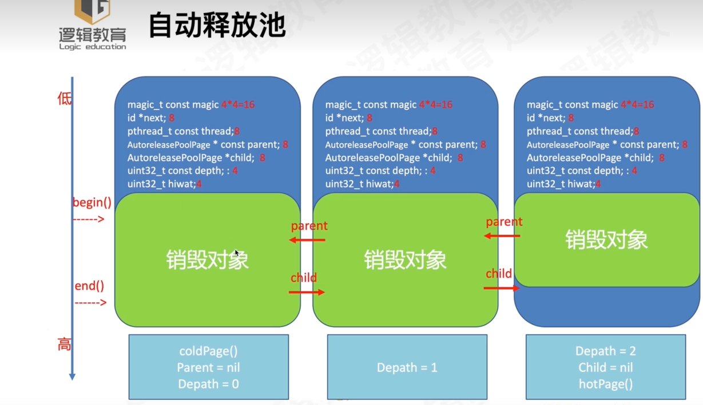

- [**Autorelease原理**](#Autorelease原理)
	- [源码解析](#源码解析)
	- [分析结构体__AtAutoreleasePool](#分析结构体__AtAutoreleasePool)
	- [objc_autoreleasePoolPush与objc_autoreleasePoolPop](#objc_autoreleasePoolPush与objc_autoreleasePoolPop)
	- [AutoreleasePoolPage](#AutoreleasePoolPage)
		- [AutoreleasePoolPage类重要方法](#AutoreleasePoolPage类重要方法)
			- [1.push方法](#1.push方法)
			- [2.autorelease方法](#2.autorelease方法)
			- [3.autoreleaseFast方法](#3.autoreleaseFast方法)
				- 	[3.1 hotPage](#3.1hotPage)
					- 	[线程TSD详解和作用](#线程TSD详解和作用)
					- 	[与自动释放池和 RunLoop 的关系](#与自动释放池和RunLoop的关系)
				- 	[3.2 full](#3.2full)
				- 	[3.3 begin()和end()](#3.3begin()和end())
				- 	[3.4 add()](#3.4add())
			- [4.autoreleaseNewPage方法](#4.autoreleaseNewPage方法)
			- [5.autoreleaseFullPage方法](#5.autoreleaseFullPage方法)
			- [6.autoreleaseNoPage](#6.autoreleaseNoPage)
			- [7.pop](#7.pop)
			- [8.popPage方法](#8.popPage方法)
	- [**何时需要autoreleasePool**](#何时需要autoreleasePool)
	- [autorelease方法调用栈](#autorelease方法调用栈)
		- [哨兵的作用](#哨兵的作用)
- [**Autorelease 释放时刻**](#Autorelease释放时刻)
	- [释放条件](#释放条件)
	- [释放原理](#释放原理)
- [**AutoreleasePool与NSThread、NSRunLoop的关系**](#AutoreleasePool与NSThread-NSRunLoop的关系)
	- [RunLoop和NSThread的关系](#RunLoop和NSThread的关系)
	- [RunLoop和AutoreleasePool的关系](#RunLoop和AutoreleasePool的关系)
	- [Thread和AutoreleasePool的关系](#Thread和AutoreleasePool的关系)
- [**AutoreleasePool手动添加情况**](#AutoreleasePool手动添加情况)
- **资料**
	- [](https://www.jianshu.com/p/7bd2f85f03dc)


<br/>

***
<br/>

> <h1 id='Autorelease原理'>Autorelease原理</h1>

自动释放池的创建和释放，销毁的时机如下所示

- `kCFRunLoopEntry`; // 进入runloop之前，创建一个自动释放池
- `kCFRunLoopBeforeWaiting`; // 休眠之前，销毁自动释放池，创建一个新的自动释放池
- `kCFRunLoopExit`; // 退出runloop之前，销毁自动释放池

<br/>


<br/>
<br/>


> <h2 id='源码解析'>源码解析</h2>

Main函数中的自动释放池范例：

```
int main(int argc, const char * argv[]) {
    @autoreleasepool {
        NSLog(@"Hello, World!");
    }
    return 0;
}

```

在终端使用clang -rewrite-objc + 文件名命令将上述OC代码转化为C++源码：

```

int main(int argc, const char * argv[]) {
    /* @autoreleasepool */
    {
        __AtAutoreleasePool __autoreleasepool;
        NSLog((NSString *)&__NSConstantStringImpl__var_folders_3f_crl5bnj956d806cp7d3ctqhm0000gn_T_main_d37e0d_mi_0);
     }//大括号对应释放池的作用域
     
     return 0;
}

```

我们看到的所谓的@autoreleasePool块，其实对应着__AtAutoreleasePool的结构体。


<br/>
<br/>
<br/>


> <h2 id='分析结构体__AtAutoreleasePool'>分析结构体__AtAutoreleasePool</h2>




```
/*
* __AtAutoreleasePool结构体包含了：构造函数、析构函数和一个边界对象；
* 构造函数内部调用：objc_autoreleasePoolPush()方法，返回边界对象atautoreleasepoolobj
* 析构函数内部调用：objc_autoreleasePoolPop()方法，传入边界对象atautoreleasepoolobj
*/

extern "C" __declspec(dllimport) void * objc_autoreleasePoolPush(void);
extern "C" __declspec(dllimport) void objc_autoreleasePoolPop(void *);

struct __AtAutoreleasePool {
  __AtAutoreleasePool() {atautoreleasepoolobj = objc_autoreleasePoolPush();}
  ~__AtAutoreleasePool() {objc_autoreleasePoolPop(atautoreleasepoolobj);}
  void * atautoreleasepoolobj;
};

```


<br/>

- **main函数中__autoreleasepool结构体实例的生命周期**

`__autoreleasepool`是一个自动变量，其构造函数是在程序执行到声明这个对象的位置时调用的，而其析构函数则是在程序执行到离开这个对象的作用域时调用。所以，我们可以将上面main函数的代码简化如下：

```

int main(int argc, const char * argv[]) {
    /* @autoreleasepool */ {
        void *atautoreleasepoolobj = objc_autoreleasePoolPush();
        NSLog((NSString *)&__NSConstantStringImpl__var_folders_kb_06b822gn59df4d1zt99361xw0000gn_T_main_d39a79_mi_0);
        objc_autoreleasePoolPop(atautoreleasepoolobj);
    }
    return 0;
}
```


<br/>

**科普:** `__autoreleasepool`是一个自动变量,自动变量是什么?有什么用?

```
for (int i = 0; i < 10; i++) {
    @autoreleasepool {
        // 在这里创建一些临时对象
        NSString *tempString = [NSString stringWithFormat:@"Object %d", i];
        
        // 这些临时对象会在 autorelease pool 结束时自动释放
        NSLog(@"%@", tempString);
    }
}
```

&emps;  "自动变量"，它是指在 C 语言及其衍生的语言中，声明在局部作用域内的变量。这些变量的生命周期与其所在作用域的生命周期相对应，变量在进入作用域时被创建，在离开作用域时被销毁。这与全局变量或静态变量的生命周期不同，后者在整个程序执行期间都存在。在上述 Objective-C 代码中，tempString 就是一个自动变量，因为它是在 @autoreleasepool 语句块内声明的。


<br/>
<br/>


> <h2 id='objc_autoreleasePoolPush与objc_autoreleasePoolPop'>objc_autoreleasePoolPush与objc_autoreleasePoolPop</h2>


自动释放池构造函数与析构函数的实现，它们都只是对AutoreleasePoolPage对应静态方法push和pop的封装.

```

void *objc_autoreleasePoolPush(void) {
    return AutoreleasePoolPage::push();
}

void objc_autoreleasePoolPop(void *ctxt) {
    AutoreleasePoolPage::pop(ctxt);
}

```


<br/>


<br/>
<br/>


> <h2 id='AutoreleasePoolPage'>AutoreleasePoolPage</h2>


```

struct AutoreleasePoolPageData
{
	magic_t const magic;//校验AutoreleasePagePoolPage结构是否完整
	__unsafe_unretained id *next;//指向新加入的autorelease对象的下一个位置，初始化时指向begin()
	pthread_t const thread;//当前所在线程，AutoreleasePool是和线程一一对应的
	AutoreleasePoolPage * const parent;//指向父节点page，第一个结点的parent值为nil
	AutoreleasePoolPage *child;//指向子节点page，最后一个结点的child值为nil
	uint32_t const depth;//链表深度，节点个数
	uint32_t hiwat;//数据容纳的一个上限

	AutoreleasePoolPageData(__unsafe_unretained id* _next, pthread_t _thread, AutoreleasePoolPage* _parent, uint32_t _depth, uint32_t _hiwat)
		: magic(), next(_next), thread(_thread),
		  parent(_parent), child(nil),
		  depth(_depth), hiwat(_hiwat)
	{
	}
};

```


<br/>


`AutoreleasePoolPage继承自AutoreleasePoolPageData`

&emsp; **`AutoreleasePoolPage`类是C++中的类，打开Runtime的源码工程，在NSObject.mm文件中可以找到它的定义，摘取它的一些基本定义带码如下：**

```
class AutoreleasePoolPage : private AutoreleasePoolPageData
{
	friend struct thread_data_t;

public:
	static size_t const SIZE =
#if PROTECT_AUTORELEASEPOOL
		PAGE_MAX_SIZE;  // must be multiple of vm page size
#else
		PAGE_MIN_SIZE;  // size and alignment, power of 2
#endif
    
private:
	static pthread_key_t const key = AUTORELEASE_POOL_KEY;
	static uint8_t const SCRIBBLE = 0xA3;  // 0xA3A3A3A3 after releasing
	static size_t const COUNT = SIZE / sizeof(id);
	
#   define EMPTY_POOL_PLACEHOLDER ((id*)1)  //空池占位


	/*
	* 边界对象其实就是nil的别名，而它的作用事实上也就是为了起到一个标识的作用。
	* 每当自动释放池初始化调用objc_autoreleasePoolPush方法时，总会通过AutoreleasePoolPage的push方法，将POOL_BOUNDARY放到当前page的栈顶，并且返回这个边界对象；
	* 自动释放池释放调用objc_autoreleasePoolPop方法时，又会将边界对象以参数传入，这样自动释放池就会向释放池中对象发送release消息，直至找到第一个边界对象为止。
	*/
	#   define POOL_BOUNDARY nil               //边界对象(即哨兵对象）
		
	 //省略
	 . . . . . . 
	 . . . . . . 
 
	AutoreleasePoolPage(AutoreleasePoolPage *newParent) :
		AutoreleasePoolPageData(begin(),
								objc_thread_self(),
								newParent,
								newParent ? 1+newParent->depth : 0,
								newParent ? newParent->hiwat : 0)
	{ 
	    if (parent) {
	        parent->check();
	        ASSERT(!parent->child);
	        parent->unprotect();
	        parent->child = this;
	        parent->protect();
	    }
	    protect();
	}
	
	~AutoreleasePoolPage() 
	{
	    check();
	    unprotect();
	    ASSERT(empty());
	
	    // Not recursive: we don't want to blow out the stack 
	    // if a thread accumulates a stupendous amount of garbage
	    ASSERT(!child);
	}
	
	
	//省略
	. . . . . . 
	. . . . . . 
```


&emsp; 每个AutoreleasePoolPage的大小为一个SIZE，即内存管理中一个页的大小。这在Mac中是4KB，而在iOS中，这里没有相关代码，估计差不多。

<br/><br/>

> <h3 id='AutoreleasePoolPage类重要方法'>AutoreleasePoolPage类重要方法</h3>


<br/><br/><br/>

> <h2 id='1.push方法'>1.push方法</h2>

当用户调用@autoreleasepool{}的时候，系统首先会调用AutoreleasePoolPage::push()方法，来创建或获取当前的hotPage，并向对象栈中插入一个POOL_BOUNDARY。


```

/*
* 每次调用push其实就是创建一个新的AutoreleasePool，在对应的AutoreleasePoolPage中插入一个POOL_BOUNDARY 
* 并且返回插入的POOL_BOUNDARY 的内存地址。
push方法内部调用的是autoreleaseFast方法，并传入边界对象(POOL_BOUNDARY)。
* hotPage可以理解为当前正在使用的AutoreleasePoolPage。
*
* 自动释放池最终都会通过page->add(obj)方法将边界对象添加到释放池中，而这一过程在autoreleaseFast方法中被分为三种情况：
1. 当前page存在且不满，调用page->add(obj)方法将对象添加至page的栈中，即next指向的位置
2. 当前page存在但是已满，调用autoreleaseFullPage初始化一个新的page，调用page->add(obj)方法将对象添加至page的栈中
3. 当前page不存在时，调用autoreleaseNoPage创建一个hotPage，再调用page->add(obj) 方法将对象添加至page的栈中
*/
//自动释放池的push操作
//其实就是创建一个新的AutoreleasePool
static inline void *push() 
{
    id *dest;
    if (slowpath(DebugPoolAllocation)) {//是Objective-C自动释放池的调试机制之一，用于帮助开发者追踪和解决与内存管理相关的问题。
        // Each autorelease pool starts on a new pool page.
        //初始化一个自动释放池页,这个dest就是添加对象后的next指针地址
        dest = autoreleaseNewPage(POOL_BOUNDARY);
    } else {
        dest = autoreleaseFast(POOL_BOUNDARY);
    }
    ASSERT(dest == EMPTY_POOL_PLACEHOLDER || *dest == POOL_BOUNDARY);
    return dest;
}

```


<br/>
**疑问:** “自动释放池push函数入栈的是一个边界对象, 返回一个新的AutoreleasePool”这个栈指的是哪个栈?还有自动释放池什么时候创建的? 它与线程创建有什么关系吗?


&emsp; 在 Objective-C 中，自动释放池的管理是由运行时系统提供的，它是一个辅助的机制，用于管理对象的生命周期。在较早版本的 Objective-C 运行时中，确实有一个 autoreleasepool 栈，但在较新的运行时实现中，这个栈的概念被更为动态和复杂的实现所替代。

&emsp; 在现代的 Objective-C 运行时中，自动释放池是基于线程的，而不是栈的概念。每个线程都有一个自己的自动释放池堆栈。当你创建一个自动释放池时（例如使用 @autoreleasepool 语法），这个池会被推入当前线程的自动释放池堆栈中。当池结束时，它就会从堆栈中弹出。这样做的目的是确保自动释放池的嵌套和正确管理对象生命周期。


<br/>

**现在回到你的问题：**

- **自动释放池的创建时机：** 自动释放池是在程序运行时动态创建的。通常，你会在方法、循环或其他代码块中使用 @autoreleasepool 语法创建自动释放池，以确保在该范围内创建的对象能够在适当的时候被释放。
 
- **自动释放池与线程的关系：** 每个线程都有自己的自动释放池堆栈。这确保了在多线程环境中，每个线程的对象都能够正确地被释放。在多线程应用中，每个线程的自动释放池是独立管理的，不同线程的池不会相互干扰。

总的来说，自动释放池是为了帮助管理对象的生命周期而引入的，确保在适当的时机释放不再需要的对象。这个机制在 Objective


<br/>
<br/>

**疑问:** 线程调用栈是什么? 它是什么时候创建的?还有自动释放池栈什么时候创建的?这个还有自动释放池什么时候创建的? 它与线程创建有什么关系吗?


- **线程调用栈：** 当我们提到“栈”时，通常指的是调用栈（call stack），是程序运行时用于追踪函数调用的数据结构。在每个线程中，都有一个独立的调用栈。这个调用栈是在线程启动时创建的，并在线程结束时销毁。

- **自动释放池栈：** 没有一个真正的“自动释放池栈”的概念。在 Objective-C 的运行时中，自动释放池是基于线程的，每个线程都有一个自己的自动释放池堆栈。这个堆栈是动态的，当你在代码中使用 @autoreleasepool 语法创建自动释放池时，池会被推入当前线程的堆栈中，当池结束时，它会被从堆栈中弹出。

- **自动释放池的创建时机：** 自动释放池是在运行时动态创建的，而不是在程序启动时。自动释放池的创建时机是在你的代码中使用 @autoreleasepool 语法时，每次遇到这个语法块，一个新的自动释放池就会被创建。这个池会被推入当前线程的自动释放池堆栈中。

- **自动释放池与线程的关系：** 每个线程都有自己的自动释放池堆栈，这确保了在多线程环境中，每个线程的对象都能够正确地被释放。自动释放池与线程的关系是一对多的关系，即一个线程可以有多个自动释放池，而每个自动释放池在栈上形成了一个层次结构，方便管理对象的生命周期。


总结：自动释放池是在运行时动态创建的，它与线程的关系是每个线程都有一个自己的自动释放池堆栈，确保在多线程环境中对象的正确释放。


<br/><br/><br/>

> <h2 id='2.autorelease方法'>**2.autorelease方法**</h2>

也可以通过调用`autorelease(id obj)`方法将某个特定的对象指针插入到AutoreleasePoolPage中：

``` 
public:
static inline id autorelease(id obj)
{
    ASSERT(obj);
    ASSERT(!obj->isTaggedPointer());
    id *dest __unused = autoreleaseFast(obj);
    ASSERT(!dest  ||  dest == EMPTY_POOL_PLACEHOLDER  ||  *dest == obj);
    return obj;
}
```


<br/><br/><br/>

> <h2 id='3.autoreleaseFast方法'>3.autoreleaseFast方法</h2>


&emsp; 可以看到，无论是push还是autorelease方法，最后都是调用了autoreleaseFast(obj)，该方法会将一个id放入到autoreleasePage中


```
static inline id *autoreleaseFast(id obj)
{
    AutoreleasePoolPage *page = hotPage();
    if (page && !page->full()) {
        //压栈操作
        return page->add(obj);
    } else if (page) {
        //当前hotPage已满时调用
        return autoreleaseFullPage(obj, page);
    } else {
        //当前hotpage不存在时调用
        return autoreleaseNoPage(obj);
    }
}
```


- **可以看到方法实现逻辑也很简单：**

	- 首先取出当前的hotPage，所谓hotPage，就是在autoreleasePage链表中正在使用的autoreleasePage节点。
	- 如果有hotPage，且hotPage还没满，这将obj加入到page中。
	- 如果有hotPage，但是已经满了，则进入page full逻辑（autoreleaseFullPage）。
	- 如果没有hotPage，进入no page逻辑autoreleaseNoPage。


<br/><br/><br/>

> <h2 id='3.1hotPage'>3.1hotPage</h2>

&emsp; hotPage是autoreleasePage链表中正在使用的autoreleasePage节点。实质上是指向autoreleasepage的指针，**并存储于线程的TSD(线程私有数据：Thread-specific Data)中**：

```
static inline AutoreleasePoolPage *hotPage() 
{
    AutoreleasePoolPage *result = (AutoreleasePoolPage *)
        tls_get_direct(key);
    if ((id *)result == EMPTY_POOL_PLACEHOLDER) return nil;
    if (result) result->fastcheck();
    return result;
}
```


从这段代码可以看出，
**autoreleasepool是和线程绑定的，一个线程对应一个autoreleasepool。而autoreleasepool虽然叫做自动释放池，其实质上是一个双向链表。**

&emsp; 在介绍runloop的时候，我们也曾提到过，runloop和线程也是一一对应的，并且在当前线程的runloop指针，也会存储到线程的TSD中。这是runtime对于TSD的一个应用。


<br/><br/>

> <h2 id='线程TSD详解和作用'>线程TSD详解和作用</h2>

**疑问:TSD有什么用?与自动释放池和Runloop有什么关系?**


TSD（线程私有数据：Thread-Specific Data）是一种在多线程环境中管理线程本地数据的机制。每个线程都有自己独立的 TSD 区域，可以用于存储和检索线程相关的数据。TSD 在多线程编程中的使用主要有以下几个方面的作用：

- 线程本地存储： TSD 允许在每个线程中存储特定于该线程的数据。这对于一些全局变量在多线程环境中需要不同副本的情况非常有用。每个线程可以在 TSD 中存储自己的副本，避免了全局数据在多线程中的竞态条件问题。

- 线程安全： 通过使用 TSD，可以确保在线程之间共享数据时不会出现冲突。每个线程都可以独立访问自己的 TSD 区域，而不会影响其他线程的数据。

- 线程状态的保存： TSD 可以用于保存线程的特定状态，以便在线程执行期间的不同位置共享数据。这对于一些需要在线程执行过程中保留状态的场景非常有用.


<br/><br/>

> <h2 id='与自动释放池和RunLoop的关系'>与自动释放池和 RunLoop 的关系</h2>

- 与自动释放池的关系： 在 Objective-C 中，自动释放池通常与线程一起使用，而线程的 TSD 可以用于存储与自动释放池相关的信息。在主线程中，自动释放池通常由 RunLoop 管理，而在其他线程中可能需要手动创建和管理自动释放池。线程的 TSD 区域可以用于存储与自动释放池相关的信息，确保在不同线程中正确管理自动释放池。

- 与 RunLoop 的关系： RunLoop 是一个与线程相关的事件处理循环，而 TSD 可以在 RunLoop 中使用。线程的 TSD 可以用于存储与 RunLoop 相关的信息，例如定时器、观察者等。这样可以在 RunLoop 的生命周期内方便地访问和管理这些信息。


&emsp; 总的来说，TSD 是一种用于在线程级别存储数据的机制，它与自动释放池和 RunLoop 相关，可以用于管理线程特定的状态和数据。


<br/><br/><br/>

> <h2 id='3.2full'>3.2full</h2>


如果有hot page，先判断page 是否已经full了，判断逻辑是next*是否等于end()：

```
bool full() { 
    return next == end();
}
```


<br/><br/><br/>

> <h2 id='3.3begin()和end()'>3.3begin()和end()</h2>

begin()和end()，定义如下，结合page的图示，应该比较容易理解：

```
id * begin() {
    return (id *) ((uint8_t *)this+sizeof(*this));
}

id * end() {
    return (id *) ((uint8_t *)this+SIZE);
}
```


<br/><br/>

> <h2 id='3.4add()'>3.4add()</h2>

如果page没有满，就调用page的add方法.`*add(id obj)`方法将对象放入到AutoreleaseNoPage并移动栈顶的指针

这里通过将next指向obj,也就是放入自动释放池中了.同时还返回next指针地址

这里有加锁的操作,起到保护的作用

```
//压栈操作：将对象加入AutoreleaseNoPage并移动栈顶的指针
id *add(id obj)
{
    ASSERT(!full());
    unprotect();
    id *ret = next;  // faster than `return next-1` because of aliasing
    *next++ = obj;
    protect();
    return ret;
}
```


<br/><br/><br/>

> <h2 id='4.autoreleaseNewPage方法'>4.autoreleaseNewPage方法</h2>

```
//返回next指针地址
static __attribute__((noinline))
id *autoreleaseNewPage(id obj)
{
    AutoreleasePoolPage *page = hotPage();
    //这里的返回值是添加入自动释放池page的next指针地址
    if (page) return autoreleaseFullPage(obj, page);
    else return autoreleaseNoPage(obj);
}
```


<br/><br/><br/>

> <h2 id='5.autoreleaseFullPage方法'>5.autoreleaseFullPage方法</h2>


- **查找当前没有满的page**
- 如果hot page满了，就需要在链表中‘加页’，同时将新页置为hot page
- 将对象加入到这个page中


```
static __attribute__((noinline))
//当前hotPage已满时调用
id *autoreleaseFullPage(id obj, AutoreleasePoolPage *page)
{
    // The hot page is full. 
    // Step to the next non-full page, adding a new page if necessary.
    // Then add the object to that page.
    ASSERT(page == hotPage());
    ASSERT(page->full()  ||  DebugPoolAllocation);

    do {
        if (page->child) page = page->child;
        else page = new AutoreleasePoolPage(page);
    } while (page->full());

    setHotPage(page);
    return page->add(obj);
}
```


&emsp; 这一段代码重点需要关注的是寻找可用page的do while逻辑。
其实注释中已经写得很清楚，系统会首先尝试在hot page的child pages中挑出第一个没有满的page，如果没有符合要求的child page，则只能创建一个新的new AutoreleasePoolPage(page)。

&emsp; 最后，将挑选出的page作为当前线程的hot page （实际上存储到了TSD中），并将obj存到新的hot page中


<br/><br/>

> <h2 id='6.autoreleaseNoPage'>6.autoreleaseNoPage</h2>

若当前线程没有hot Page，则说明当前的线程还未建立起autorelease pool 。这时，就会调用autoreleaseNoPage：


```
  static __attribute__((noinline))
    id *autoreleaseNoPage(id obj)
    {
        // "No page" could mean no pool has been pushed
        // or an empty placeholder pool has been pushed and has no contents yet
        assert(!hotPage());

        bool pushExtraBoundary = false;
        if (haveEmptyPoolPlaceholder()) { // 如果当前线程只有一个虚拟的空池，则这次需要真正创建一个page
            // We are pushing a second pool over the empty placeholder pool
            // or pushing the first object into the empty placeholder pool.
            // Before doing that, push a pool boundary on behalf of the pool 
            // that is currently represented by the empty placeholder.
            pushExtraBoundary = true;
        }else if (obj == POOL_BOUNDARY  &&  !DebugPoolAllocation) { // 如果obj == POOL_BOUNDARY，这里苹果有个小心机，它不会真正创建page，而是在线程的TSD中做了一个空池的标志
            // We are pushing a pool with no pool in place,
            // and alloc-per-pool debugging was not requested.
            // Install and return the empty pool placeholder.
            return setEmptyPoolPlaceholder();
        }

        // We are pushing an object or a non-placeholder'd pool.

        // 创建线程的第一个page，并置为hot page。
        AutoreleasePoolPage *page = new AutoreleasePoolPage(nil);
        setHotPage(page);
        
        // 如果之前只是做了空池标记，这里还需要在栈中补上POOL_BOUNDARY，作为栈底哨兵
        if (pushExtraBoundary) {
            page->add(POOL_BOUNDARY);
        }
        
        // Push the requested object or pool.  注意，这里的注释，进入page的不光可以有object，还可以是pool。
        return page->add(obj);
    }

```

&emsp; 当系统发现当前线程没有对应的autoreleasepool时，我们自然的想到需要为线程创建一个page。但是苹果其实在这里是耍了一个小心机的，当在创建第一个page时，苹果并不会真正创建一个page，因为它害怕创建了page后，并没有真正的object需要插入page，这样就造成了无谓的内存浪费。

&emsp; 在没有第一个真正的object入栈之前，苹果是这样做的：**仅仅在线程的TSD中做了一个EMPTY_POOL_PLACEHOLDER标记，并返回它。这里没有真正的new 一个AutoreleasePoolPage**。


<br/><br/><br/>

> <h2 id='7.pop'>7.pop</h2>

```
static inline void
pop(void *token)
{
    AutoreleasePoolPage *page;
    id *stop;
    if (token == (void*)EMPTY_POOL_PLACEHOLDER) {
        // Popping the top-level placeholder pool.
        page = hotPage();
        if (!page) {
            // Pool was never used. Clear the placeholder.
            return setHotPage(nil);
        }
        // Pool was used. Pop its contents normally.
        // Pool pages remain allocated for re-use as usual.
        page = coldPage();
        token = page->begin();
    } else {
		//通过POOL_BOUNDARY找到对应的page
        page = pageForPointer(token);
    }

    stop = (id *)token;
    if (*stop != POOL_BOUNDARY) {
        if (stop == page->begin()  &&  !page->parent) {
            // Start of coldest page may correctly not be POOL_BOUNDARY:
            // 1. top-level pool is popped, leaving the cold page in place
            // 2. an object is autoreleased with no pool
        } else {
            // Error. For bincompat purposes this is not 
            // fatal in executables built with old SDKs.
            //   这是为了兼容旧的SDK，看来在新的SDK里面，token 可能的取值只有两个:POOL_BOUNDARY, page->begin() && !page->parent

            return badPop(token);
        }
    }

    if (slowpath(PrintPoolHiwat || DebugPoolAllocation || DebugMissingPools)) {
        return popPageDebug(token, page, stop);
    }

    return popPage<false>(token, page, stop);
}
```


<br/><br/><br/>

> <h2 id='8.popPage方法'>8.popPage方法</h2>


```
template<bool allowDebug>
static void
popPage(void *token, AutoreleasePoolPage *page, id *stop)
{
    if (allowDebug && PrintPoolHiwat) printHiwat();// 记录最高水位标记

    page->releaseUntil(stop);//向栈中的对象发送release消息，直到遇到第一个哨兵对象

    // memory: delete empty children
    // 删除空掉的节点
    if (allowDebug && DebugPoolAllocation  &&  page->empty()) {
        // special case: delete everything during page-per-pool debugging
        AutoreleasePoolPage *parent = page->parent;
        page->kill();
        setHotPage(parent);
    } else if (allowDebug && DebugMissingPools  &&  page->empty()  &&  !page->parent) {
        // special case: delete everything for pop(top)
        // when debugging missing autorelease pools
        page->kill();
        setHotPage(nil);
    } else if (page->child) {
        // hysteresis: keep one empty child if page is more than half full
        if (page->lessThanHalfFull()) {
            page->child->kill();
        }
        else if (page->child->child) {
            page->child->child->kill();
        }
    }
}
    
//省略
. . . . . . . .


};
```


&emsp； 上述代码中，首先根据传入的边界对象地址找到边界对象所处的page；然后选择当前page中最新加入的对象一直向前清理，可以向前跨越若干个page，直到边界所在的位置；清理的方式是向这些对象发送一次release消息，使其引用计数减一；


<br/>

***
<br/><br/>


> <h1 id='何时需要autoreleasePool'>何时需要autoreleasePool</h1>


- **一般的，有下面两种情况：**

	- 创建子线程。当我们创建子线程的时候，需要将子线程的runloop用@autoreleasepool包裹起来，进而达到自动释放内存的效果。因为系统并不会为子线程自动包裹一个@autoreleasepool，这样加入到autoreleasepage中的元素就得不到释放。
	
	
	- 在大循环中创建autorelease对象。当我们在一个循环中创建autorelease对象(不是用alloc创建的对象)，该对象会加入到autoreleasepage中，而这个page中的对象，会等到外部池子结束才会释放。在主线程的runloop中，会将所有的对象的释放权都交给了RunLoop 的释放池，而RunLoop的释放池会等待这个事件处理之后才会释放，因此就会使对象无法及时释放，堆积在内存造成内存泄露。


<br/>
<br/>
<br/>


> <h2 id='autorelease方法调用栈'>autorelease方法调用栈</h2>


&emsp; autorelease方法最终也会调用上面提到的 autoreleaseFast方法，将当前对象加到AutoreleasePoolPage中。关于autoreleaseFast的分析这里不再累述，我们主要来考虑一下两次调用的区别：

&emsp; autorelease函数和push函数一样，关键代码都是调用autoreleaseFast函数向自动释放池的链表栈中添加一个对象，不过push函数入栈的是一个边界对象，而autorelease函数入栈的是一个具体的Autorelease的对象。


<br/>


&emsp;  `AutoreleasePoolPage`是一个C++实现的类


-  `AutoreleasePool`并没有单独的结构，而是由若干个`AutoreleasePoolPage`以双向链表的形式组合而成（分别对应结构中的parent指针和child指针）

<br/>

-  `AutoreleasePool`是按线程一一对应的（结构中的`thread`指针指向当前线程）
`AutoreleasePoolPage`每个对象会开辟4KB(4096字节)内存（也就是虚拟内存一页的大小），除了上面的7个成员属性，实例变量所占为56Bytes空间，剩下的这4040Bytes空间全部用来存储AutoreleasePoolPage所管理的对象指针.
	- 在autoreleasepool中的对象指针是按照栈的形式存储的，栈低是一个POOL_BOUNDARY哨兵，之后对象指针依次入栈存储。
	- 所以下面的next指针后存放的是对象指针,直到end()为止;
	- 下面的`id *next`指针作为游标指向栈顶**最新对象指针**的下一个位置;


	

<br/>

- **POOL_BOUNDARY**
	- 在上图中可以看到，除了AutoreleasePoolPage 类中的7个成员之外，还有一个叫POOL_BOUNDARY, 其实这是一个nil指针，AutoreleasePoolPage中的next指针用来指向栈中下一个入栈位置。
	- 它作为一个哨兵，当需要将AutoreleasePoolPage 中存储的对象指针依次出栈时，会执行到POOL_BOUNDARY为止。

```
#   define POOL_BOUNDARY nil
```

<br/>

-  一个`AutoreleasePoolPage`的空间被占满时，会新建一个`AutoreleasePoolPage`对象，连接链表，后来的autorelease对象在新的page加入。


<br/>


<br/>

&emsp;  若当前线程中只有一个AutoreleasePoolPage对象，并记录了很多autorelease对象地址时内存如下图：


&emsp;  图中的情况，这一页再加入一个autorelease对象就要满了（也就是next指针马上指向栈顶），这时就要执行上面说的操作，建立下一页page对象，与这一页链表连接完成后，新page的next指针被初始化在栈底（begin的位置），然后继续向栈顶添加新对象。

&emsp;  所以，`向一个对象发送- autorelease消息，就是将这个对象加入到当前AutoreleasePoolPage的栈顶next指针指向的位置。`


<br/><br/>

> <h2 id='哨兵的作用'>哨兵的作用</h2>


&emsp; 在一些 Objective-C 的运行时实现中，使用 EMPTY_POOL_PLACEHOLDER 或类似的宏定义作为空的占位符，来模拟一个哨兵对象，用于表示自动释放池的边界。虽然这不是 Objective-C 标准库的一部分，但在某些运行时中的底层实现中，确实存在这种实践。


<br/>

**下面详细解释这个概念：**

- 标记自动释放池的边界： 自动释放池通常由于程序员使用 @autoreleasepool 语法而被创建。当编译器处理这样的语法时，它会生成一些代码来管理自动释放池的入栈和出栈。在一些运行时实现中，使用一个特殊的对象，如 EMPTY_POOL_PLACEHOLDER，作为自动释放池的边界标记。这个对象在池结束时，作为标记被检测到，表示池的生命周期结束。

- 确保正确的释放： 在没有池的情况下，EMPTY_POOL_PLACEHOLDER 可以帮助运行时系统确保在嵌套的自动释放池场景中，上一层池中的对象能够正确释放。通过在每个池的边界放置这个特殊的对象，运行时系统能够识别每个池的开始和结束，并根据这些边界进行正确的释放操作。

- 适应嵌套池： 当嵌套的自动释放池存在时，每个池的边界必须清晰可见。使用 EMPTY_POOL_PLACEHOLDER 或类似的机制，可以确保即使在嵌套池的情况下，系统也能够正确地处理边界标记。


&emsp; 需要注意的是，这种做法不是 Objective-C 的官方标准，不同的运行时实现可能采用不同的方式来管理自动释放池。在使用这些标记时，要注意了解特定运行时的实现细节，以免产生不确定的行为。


<br/>

***
<br/>
<br/>


> <h1 id='Autorelease释放时刻'>Autorelease释放时刻</h1>


&emsp;  每当进行一次`objc_autoreleasePoolPush`调用时，runtime向当前的AutoreleasePoolPage中add进一个哨兵对象，值为0（也就是个nil）， 如下图：

push 哨兵对象


&emsp; `objc_autoreleasePoolPush` 的返回值是这个哨兵对象的地址，被`objc_autoreleasePoolPop` (哨兵对象)作为入参，于是根据传入的哨兵对象地址找到哨兵对象所处的page。

&emsp; 在当前page中，将晚于哨兵对象插入的所有autorelease对象都发送一次- release消息，并向回移动next指针到正确位置

&emsp; 补充2：从最新加入的对象一直向前清理，可以向前跨越若干个page，直到哨兵所在的page。`objc_autoreleasePoolPop`执行后，最终变成了下面的样子：


pop 哨兵对象:


**`嵌套的AutoreleasePool`**

&emsp;  知道了上面的原理，嵌套的AutoreleasePool就非常简单了，pop的时候总会释放到上次push的位置为止，多层的pool就是多个哨兵对象而已，就像剥洋葱一样，每次一层，互不影响。


<br/>
<br/>
<br/>


> <h2 id='释放条件'>释放条件</h2>


- 1）.手动释放Autorelease pool

- 2）.Runloop结束后自动释放


<br/>


&emsp; 对于autorelease pool内部的对象在引用计数的retain == 0的时候释放。release和autorelease pool 的 drain都会触发retain事件。


<br/>
<br/>

**疑问:** 如何手动释放Autorelease pool?

&emsp; 在 Objective-C 中，自动释放池是由编译器在编译时插入的代码来管理的，而不是由开发者手动创建和释放。自动释放池的生命周期通常与当前作用域的大括号 {} 相关联，池在离开这个作用域时被自动销毁。这是因为编译器会在作用域结束时插入相应的池销毁代码。

&emsp; 如果你在使用 Automatic Reference Counting（ARC），通常情况下你不需要手动释放自动释放池。ARC 会自动管理引用计数，包括自动释放池的创建和销毁。

&emsp; 如果你在使用手动引用计数（Manual Reference Counting，MRC），你可以使用 drain 方法来手动释放自动释放池。drain 方法是 NSAutoreleasePool 类的方法，在 MRC 环境中用于释放池中的所有对象。

以下是一个示例：

```
#import <Foundation/Foundation.h>

int main() {
    @autoreleasepool {
        // 在自动释放池中创建一些对象

        // 手动释放池中的对象
        [NSAutoreleasePool drain];
    }

    // 在这里，自动释放池已经被销毁，其中的对象也被释放
    return 0;
}
```


&emsp; 需要注意的是，如果你使用的是 ARC，drain 方法会被忽略，因为 ARC 管理引用计数的方式不同。如果你使用 MRC，请确保在适当的时机手动释放自动释放池。在现代 Objective-C 开发中，大多数情况下都建议使用 ARC，以减轻手动引用计数管理的负担。


<br/>
<br/>


> <h2 id='释放原理'>释放原理</h2>


&emsp; 程序在main()调用的时候会自动调用一个autorelease，然后在每一个Runloop， 系统会隐式创建一个Autorelease pool，这样所有的release pool会构成一个象CallStack一样的一个栈式结构，在每一个Runloop结束时，当前栈顶的 Autorelease pool（main()里的autorelease）会被销毁，这样这个pool里的每个Object会被release。

&emsp; 可以把autorelease pool理解成一个类似父类与子类的关系，main()创建了父类，每个Runloop自动生成的或者开发者自定义的autorelease pool都会成为该父类的子类。当父类被释放的时候，没有被释放的子类也会被释放，这样所有子类中的对象也会收到release消息。

&emsp; 那什么是一个Runloop呢？ 一个UI事件，Timer call， delegate call， 一个鼠标事件,键盘按下(MAC OSX),或者iphone上的触摸事件，异步http连接下后当接收完数据时，都会是一个新的Runloop。


<br/>

***
<br/>

> <h1 id='AutoreleasePool与NSThread-NSRunLoop的关系'>AutoreleasePool与NSThread、NSRunLoop的关系</h1>


<br/>
<br/>


> <h2 id='RunLoop和NSThread的关系'>RunLoop和NSThread的关系</h2>


RunLoop是用于控制线程生命周期并接收事件进行处理的机制，其实质是一个do-While循环。

**RunLoop与NSThread(线程)之间的关系如下：**

- RunLoop与线程是一一对应关系，每个线程(包括主线程)都有一个对应的RunLoop对象；其对应关系保存在一个全局的Dictionary里；
- 主线程的RunLoop默认由系统自动创建并启动；而其他线程在创建时并没有RunLoop，若该线程一直不主动获取，就一直不会有RunLoop；
- 苹果不提供直接创建RunLoop的方法；所谓其他线程Runloop的创建其实是发生在第一次获取的时候，系统判断当前线程没有RunLoop就会自动创建；
- 当前线程结束时，其对应的Runloop也被销毁；


<br/>
<br/>
<br/>


> <h2 id='RunLoop和AutoreleasePool的关系'>RunLoop和AutoreleasePool的关系</h2>


主线程的NSRunLoop在监测到事件响应开启每一次event loop之前，会自动创建一个autorelease pool，并且会在event loop结束的时候执行drain操作，释放其中的对象。


<br/>
<br/>
<br/>


> <h2 id='Thread和AutoreleasePool的关系'>Thread和AutoreleasePool的关系</h2>


包括主线程在内的所有线程都维护有它自己的自动释放池的堆栈结构。新的自动释放池被创建的时候，它们会被添加到栈的顶部，而当池子销毁的时候，会从栈移除。对于当前线程来说，Autoreleased对象会被放到栈顶的自动释放池中。当一个线程线程停止，它会自动释放掉与其关联的所有自动释放池。


<br/>

***
<br/>


> <h1 id='AutoreleasePool手动添加情况'>AutoreleasePool手动添加情况</h1>


- 手动添加自动释放池：
	- 编写的不是基于UI框架的程序，例如命令行工具；
	- 通过循环方式创建大量临时对象；
	- 使用非Cocoa程序创建的子线程；


<br/>

ARC环境下的实际开发中，我们最常遇到的也是第二种情况，以下面为例：

```
- (void)viewDidLoad {
    [super viewDidLoad];
    for (int i = 0; i < 1000000; i++) {
        NSObject *obj = [[NSObject alloc] init];
        NSLog(@"打印obj：%@", obj);
    }
 }
```


上述代码中，obj因为离开作用域所以会被加入最近一次创建的自动释放池中，而这个释放池就是主线程上的RunLoop管理的；

因为for循环在当前线程没有执行完毕，Runloop也就没有完成当前这一次的迭代，所以导致大量对象被延时释放。

释放池中的对象将会在viewDidLoad方法执行后就被销毁。在此情况下，我们就有必要通过手动干预的方式及时释放不需要的对象，减少内存消耗。优化的代码如下：

```
- (void)viewDidLoad {
    [super viewDidLoad];
    for (int i = 0; i < 1000000; i++) {
        @autoreleasepool{
             NSObject *obj = [[NSObject alloc] init];
             NSLog(@"打印obj：%@", obj);
        }
    }
 }
```


<br/>
<br/>


> <h2 id='应用案例'>应用案例</h2>

SDWebImage中根据Key从缓冲中查找Image片段

```

  @autoreleasepool {
	  //key：独一无二的key值
        NSData *diskData = [self diskImageDataBySearchingAllPathsForKey:key];
        UIImage *diskImage;
        SDImageCacheType cacheType = SDImageCacheTypeNone;
        if (image) {
            // the image is from in-memory cache, but need image data
            diskImage = image;
            cacheType = SDImageCacheTypeMemory;
        } else if (diskData) {
            cacheType = SDImageCacheTypeDisk;
            // decode image data only if in-memory cache missed
            diskImage = [self diskImageForKey:key data:diskData options:options context:context];
            if (diskImage && self.config.shouldCacheImagesInMemory) {
                NSUInteger cost = diskImage.sd_memoryCost;
                [self.memoryCache setObject:diskImage forKey:key cost:cost];
            }
        }
        
        if (doneBlock) {
            if (shouldQueryDiskSync) {
                doneBlock(diskImage, diskData, cacheType);
            } else {
                dispatch_async(dispatch_get_main_queue(), ^{
                    doneBlock(diskImage, diskData, cacheType);
                });
            }
        }
    }

```


<br/>


SDWebimage中返回带有帧数组的动画图像的

```
+ (UIImage * _Nullable)animatedImageWithFrames:(NSArray<SDImageFrame *> * _Nullable)frames;
```
方法的代码片段

```


for (size_t i = 0; i < frameCount; i++) {
        @autoreleasepool {
            // NSBitmapImageRep need to manually change frame. "Good taste" API
            [bitmapImageRep setProperty:NSImageCurrentFrame withValue:@(i)];
            NSTimeInterval frameDuration = [[bitmapImageRep valueForProperty:NSImageCurrentFrameDuration] doubleValue];
            NSImage *frameImage = [[NSImage alloc] initWithCGImage:bitmapImageRep.CGImage scale:scale orientation:kCGImagePropertyOrientationUp];
            SDImageFrame *frame = [SDImageFrame frameWithImage:frameImage duration:frameDuration];
            [frames addObject:frame];
        }
    }
```


