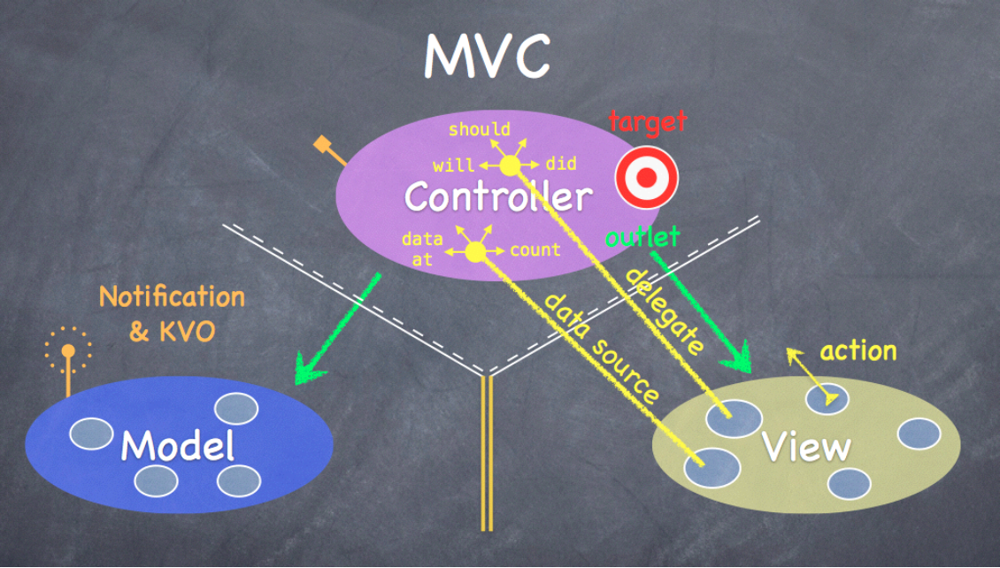
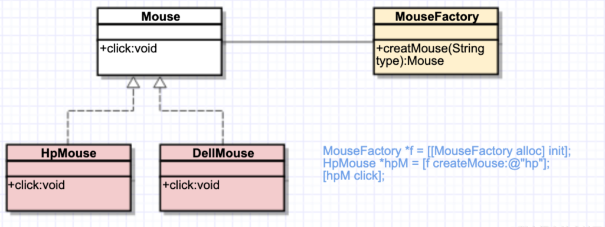
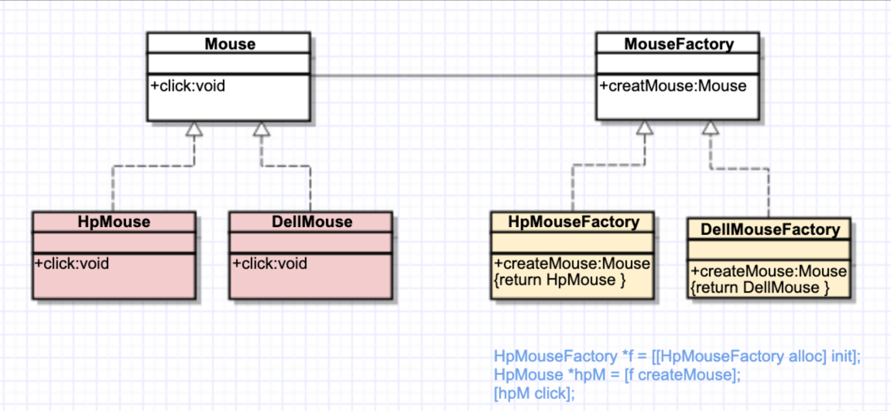
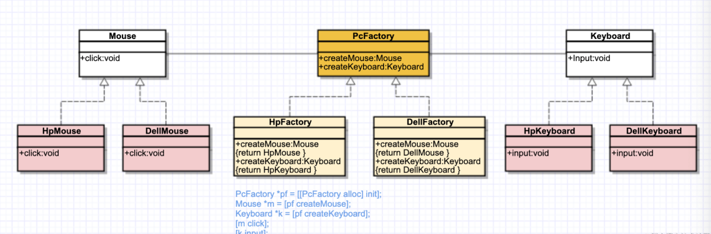
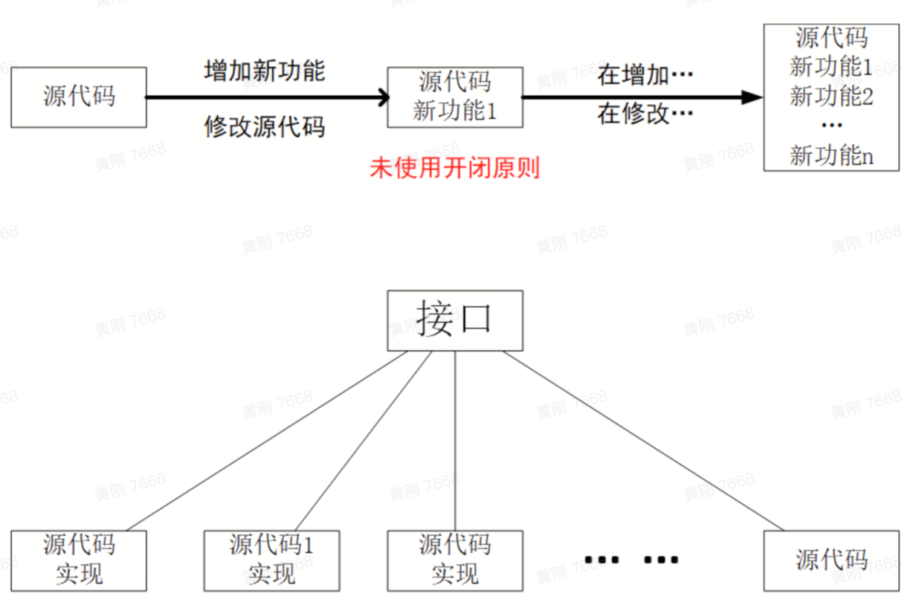
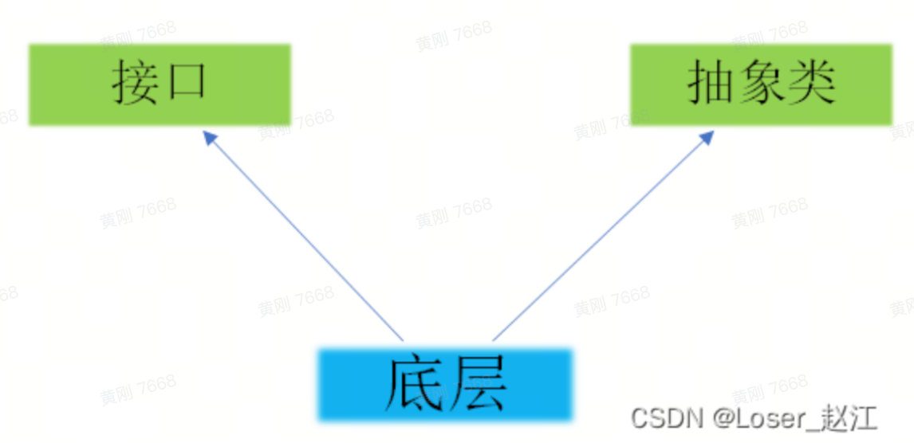
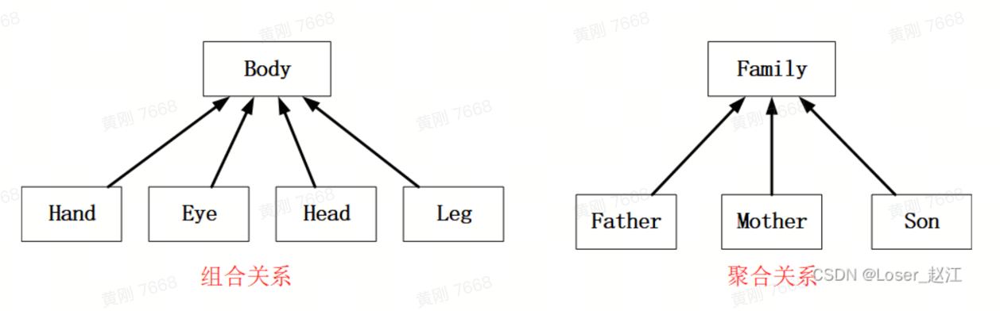

> <h2 id=''></h2>
- [**MVC**](#MVC)
	- [MVC介绍](#MVC介绍)
	- [V对C的交流方式](#V对C的交流方式)
	- [MVC实战](#MVC实战)
- [**MVVM**](#MVVM)
- **MVC和MVVM资料**
	- [**MVC和MVVM设计模式的那些事**](https://www.jianshu.com/p/caaa173071f3)
	-  [**MVC、MVP和MVVM理解**](https://www.cnblogs.com/GJ-ios/p/13139565.html)
	- [ **MVVM案例解读**](https://www.jianshu.com/p/db8400e1d40e)
- [**单例类**](#单例类)
	- [**系统单例类**](#系统单例类)
		- [变量在内存中的状态](#变量在内存中的状态)
	- [**自定义单例类**](#自定义单例类)
		- [Demo](#Demo)
	- [**单例设计(Swift)**](#单例设计Swift)
	- **资料**
		- [单例类书写](https://www.jianshu.com/p/a92c0283f243)
		- [单例模式的简单使用](https://www.jianshu.com/p/d07298613f86)
	- [**代理协议**](#代理协议)
		- [**Swift可选协议**](#Swift可选协议)
		- [**面向协议编程**](#面向协议编程)
			- [面向对象和协议对比 ](#面向对象和协议对比)
		- **资料**
			- [**Swift标准库中常见的协议**](https://blog.csdn.net/daiqiao_ios/article/details/79581729)
- [**KVC和KVO**](#KVC和KVO)
	- [**KVC**](#KVC)
	- [KVC处理数值和结构体类型属性](#KVC处理数值和结构体类型属性)
	- [**KVO**](#KVO)
		- [KVO实现的原理](#KVO实现的原理)
- [工厂设计模式](#工厂设计模式)
	- [简单工厂模式](#简单工厂模式)
	- [工厂模式](#工厂模式)
	- [抽象工厂模式](#抽象工厂模式)
- [**SOLID七原则**](#SOLID七原则)
	- [S：单一原则](#S：单一原则)
	- [O：开闭原则](#O：开闭原则)
	- [L:里氏替换原则](#L:里氏替换原则)
	- [I:接口隔离原则](#接口隔离原则)
	- [D:依赖倒置原则](#D:依赖倒置原则)
	- [L：迪米特原则](#L：迪米特原则)
	- [C:组合/聚合原则](#C:组合/聚合原则)
	- **资料**
		- [**KVC和KVO详解**](https://www.jianshu.com/p/b9f020a8b4c9)
		- [整洁架构](https://github.com/kudoleh/iOS-Clean-Architecture-MVVM?tab=readme-ov-file)


<br/>

***
<br/>


> <h2 id='MVC'>MVC</h2>


<br/>


> <h2 id='MVC介绍'>MVC介绍</h2>



 
- **黄线**意味着你不能 穿越这黄线，任何一个方向都不行，即M和V完全分离。
- **白色的虚线**，它意味着你可以自由的穿越它，只要是安全的。
- **白色的实线**代表你可以穿越，但你必须要买票，或者交点过路费。

<br/>

- **C和M之间的绿色箭头**

&emsp;C和M之间的绿色箭头，这箭头的方向就代表着“发起对话”的方向，也就是说，发起对话的是C，而做出回答的是M。C可以问M各种各样的问题，但M 只是回答C的问题或要求，它不可以主动的向C要求什么。还记得虚线是畅通无阻的意思吧，所以，C知道M的所有的事情,如果用代码来说明这件事情，就是 说，C可以导入M的头文件或是M的接口（API）。因为C可以通过M的API，所以它就可以肆无忌惮的向M要求这要求那了。


<br/>

- **C和V之间绿色箭头**

&emsp;我们再来看看另外的一个绿色箭头，它是在C和V之间，和前一个绿色箭头的意义一样，它代表C可以直接地向V进行交流。你可以想想，C要把V放到屏幕 上，并设置V的属性，告诉它们什么时候从屏幕上消失，把它们分成组等等。如果C不能自由的向V发号施令的话，程序的显示将会多么的困难,所以，C可以毫无 限制地向V说话。

&emsp;可能你已经注意到了，这个箭头上还有outlet(输出口)，outlet可以看作是从C指向V的指针，它在C中被定义。outlet给我们提供了很大的 方便，它使我们在C的内部就可以轻松准确地向V施令。C可以拥有很多的outlet，可以不止一个，这也使它可以更高效的和V进行交流。


<br/>

- **M和V之间黄线隔开**

&emsp;那M和V之间可以交流么？还记得黄线的意思么？完全不可以通过，所以我们是不允许M和V进行交流的。这是因为我们不希望这三部分之间有过多的交流，你想想，假如V在显示时出现了问题，比如有一个图形没有显示出来，我们就要去查找错误，因为C可以和V交流，M也可以和V交流的话，我们就要去检查两个部分。 相反的，只有C可以和V交流的话，在出错时，我们就只需要去C那里查找原因，这样查找错误不就很是简单了么？所以，我们不允许M和V之间有直接的联系，这 也是在它们两之间有两根黄线的原因。 总结下来也就是以下三点：

（1）Model和View永远不能相互通信，只能通过Controller传递。

（2）Controller可以直接与Model对话（读写调用Model），Model通过Notification和KVO机制与Controller间接通信。

（3）Controller可以直接与View对话，通过outlet,直接操作View,outlet直接对应到View中的控件,View通过action向Controller报告事件的发生(如用户Touch我了)。Controller是View的直接数据源（数据很可能是Controller从Model中取得并经过加工了）。Controller是View的代理（delegate),以同步View与Controller。


<br/>

> <h2 id='V对C的交流方式'>V对C的交流方式</h2>

- 第一种我们称为目标操作(target-action)。

&emsp; 它是这样工作的，C会在自己的内部“悬挂”一个目标(target)，如图中的红白相间的 靶子，对应的，它还会分发一个操作(action，如图中的黄色箭头)给将要和它交流的视图对象(可能是屏幕上的一个按钮)，当按钮被按时，action 就会被发送给与之对应的target，这样V就可以和C交流了。但是在这种情况下，V只是知道发送action给对应的target,它并不知道C中的 类，也不知道它到底发送了什么。target-action是我们经常使用的方法。

<br/>

- 第二种方式我们叫做委托(delegate)。

&emsp; 有时候，V需要和C进行同步，你知道，用户交互不仅仅是什么按按钮，划滑块，还有很多种形式。好了， 让我们来看看图中的delegate黄色箭头，你发现箭头上又分出了四个小箭头：should，did，will，还有一个没标注的。绝大部分的 delegate信息都是should，will，did这三种形式。和英文意思相对应，should代表视图对象将询问C中的某个对象“我应该这么做 么？”，举个例子，有一个web视图，有人点击了一个链接，web视图就要问“我应该打开这个链接么？这样做安全么？”。这就是should信息。那 will和did呢？will就是“我将要做这件事了”，did就是“我已经做了这件事”。C把自己设置为V的委托(delegate),它让V知道：如 果V想知道更多的关于将如何显示的信息的话，就向C发送delegate信息。通过接受V发过来的delegate信息，C就会做出相应的协调和处理。还 有一点，每个V只能有一个delegate。

<br/>

- 第三种方式就是数据源(datasource)

&emsp; V不能拥有它所要显示的数据，记住这点非常重要。V希望别人帮助它管理将要显示的数据，当 它需要数据时，它就会请求别人的帮助,把需要的数据给它。再者，iphone的屏幕很小，它不能显示包含大量信息的视图。看图中的datasource箭 头，和delegate类似，V会发送cout，data at信息给C来请求数据。

&emsp; 对于不同的UIView，有相应的UIViewController，对应MVC中的C。例如在iOS上常用的UITableView，它所对应的Controller就是UITableViewController。


<br/>


- M：模型model的对象通常非常的简单。根据Apple的文档，model应包括数据和操作数据的业务逻辑。而在实践中，model层往往非常薄，不管怎样，model层的业务逻辑不应被拖入到controller。

- V：视图view通常是UIKit控件（component，这里根据习惯译为控件）或者编码定义的UIKit控件的集合。View的如何构建（PS：IB或者手写界面）何必让Controller知晓，同时View不应该直接引用model（PS：现实中，你懂的！），并且仅仅通过IBAction事件引用controller。业务逻辑很明显不归入view，视图本身没有任何业务。

- C：控制器controller。Controller是app的“胶水代码”：协调模型和视图之间的所有交互。控制器负责管理他们所拥有的视图的视图层次结构，还要响应视图的loading、appearing、disappearing等等，同时往往也会充满我们不愿暴露的model的模型逻辑以及不愿暴露给视图的业务逻辑。

&emsp; 网络数据的请求及后续处理，本地数据库操作，以及一些带有工具性质辅助方法都加大了Massive View Controller的产生。


<br/>


> <h2 id='MVC实战'>MVC实战</h2>


- Controller ->Model:单向通信，Controller需要将Model呈现给用户，因此需要知道模型的一切，还需要有同Model完全通信的能力，并且能任意使用Model的API。
- 2、Controller ->View:单向通信，Ccontroller通过View来布局用户界面。
- 3、Model ->View：永远不要直接通信，Model是独立于UI的，并不需要和View直接通信，View通过Controller获取Model数据。


<br/>

创建一个名为APP的model

**App.h**

```
#import <Foundation/Foundation.h>
@interface App : NSObject
@property (copy, nonatomic) NSString *name;
@property (copy, nonatomic) NSString *image;
@end
```


**App.m**

```
#import "App.h"
 
@implementation App
 
@end
```


**创建一个APPView.h**

```
#import <UIKit/UIKit.h>
@class App, AppView;
 
@protocol AppViewDelegate <NSObject>
@optional
- (void)appViewDidClick:(AppView *)appView;
@end
 
@interface AppView : UIView
@property (strong, nonatomic) App *app;
@property (weak, nonatomic) id<AppViewDelegate> delegate;
@end
```

**APPView.m**

```
#import "AppView.h"
#import "App.h"
 
@interface AppView()
@property (weak, nonatomic) UIImageView *iconView;
@property (weak, nonatomic) UILabel *nameLabel;
@end
 
@implementation AppView
 
- (instancetype)initWithFrame:(CGRect)frame
{
    if (self = [super initWithFrame:frame]) {
        UIImageView *iconView = [[UIImageView alloc] init];
        iconView.frame = CGRectMake(0, 0, 100, 100);
        [self addSubview:iconView];
        _iconView = iconView;
         
        UILabel *nameLabel = [[UILabel alloc] init];
        nameLabel.frame = CGRectMake(0, 100, 100, 30);
        nameLabel.textAlignment = NSTextAlignmentCenter;
        [self addSubview:nameLabel];
        _nameLabel = nameLabel;
    }
    return self;
}
 
- (void)setApp:(App *)app
{
    _app = app;
    self.iconView.image = [UIImage imageNamed:app.image];
    self.nameLabel.text = app.name;
}
 
- (void)touchesBegan:(NSSet<UITouch *> *)touches withEvent:(UIEvent *)event
{
    if ([self.delegate respondsToSelector:@selector(appViewDidClick:)]) {
        [self.delegate appViewDidClick:self];
    }
}
 
@end
```

**ViewController.m**

```
#import "ViewController.h"
#import "App.h"
#import "AppView.h"
 
@interface ViewController () <AppViewDelegate>
 
@end
 
@implementation ViewController
 
- (void)viewDidLoad {
    [super viewDidLoad];
     
    // 创建view
    AppView *appView = [[AppView alloc] init];
    appView.frame = CGRectMake(100, 100, 100, 150);
    appView.delegate = self;
    [self.view addSubview:appView];
     
    // 加载模型数据
    App *app = [[App alloc] init];
    app.name = @"QQ";
    app.image = @"QQ";
     
    // 设置数据到view上
    appView.app = app;
}
 
#pragma mark - AppViewDelegate
- (void)appViewDidClick:(AppView *)appView
{
    NSLog(@"控制器监听到了appView的点击");
}
 
@end
```


<br/>

***
<br/>


> <h1 id='MVVM'>MVVM</h1>

- **MVVM 的基本概念**
	- 在MVVM 中，view 和 view controller正式联系在一起，我们把它们视为一个组件
	- view 和 view controller 都不能直接引用model，而是引用视图模型（viewModel）
	- viewModel 是一个放置用户输入验证逻辑，视图显示逻辑，发起网络请求和其他代码的地方
	- 使用MVVM会轻微的增加代码量，但总体上减少了代码的复杂性


<br/>

- **MVVM 的注意事项**
	- view 引用viewModel ，但反过来不行（即不要在viewModel中引入#import UIKit.h，任何视图本身的引用都不应该放在viewModel中）（PS：基本要求，必须满足）
	- viewModel 引用model，但反过来不行

<br/>

- **MVVM 的使用建议**
	- MVVM 可以兼容你当下使用的MVC架构。
	- MVVM 增加你的应用的可测试性。
	- MVVM 配合一个绑定机制效果最好（PS：ReactiveCocoa你值得拥有）。
	- viewController 尽量不涉及业务逻辑，让 viewModel 去做这些事情。
	- viewController 只是一个中间人，接收 view 的事件、调用  viewModel 的方法、响应 viewModel 的变化。
	- viewModel 绝对不能包含视图 view（UIKit.h），不然就跟 view 产生了耦合，不方便复用和测试。
	- viewModel之间可以有依赖。
	- viewModel避免过于臃肿，否则重蹈Controller的覆辙，变得难以维护。


<br/>


&emsp; `Controller`夹在`View`和`ViewModel`之间做的其中一个主要事情就是将`View`和`ViewModel`进行绑定。在逻辑上，`Controller`知道应当展示哪个`View`，`Controller`也知道应当使用哪个`ViewModel`来提供数据，然而`View`和`ViewModel`它们之间是互相不知道的，所以Controller仅关注于用 `view-model 的数据配置`和`管理各种各样的视图`。

<br/>


Controller可以引用ViewModel和View；

ViewModel千万不要主动对视图控制器C以任何形式直接起作用或直接通告其变化，而是等待视图控制器C来主动获取；


<br/>

***
<br/>
<br/>


> <h1 id='单例类'>单例类</h1>

> <h1 id='系统单例类'>系统单例类</h1>

>UIApplication                     (应用程序实例类)<br/>
NSNotificationCenter         (消息中心类)<br/>
NSFileManager                   (文件管理类)<br/>
NSUserDefaults                  (应用程序设置)<br/>
NSURLCache                      (请求缓存类)<br/>
NSHTTPCookieStorage     (应用程序cookies池)<br/>


<br/>
<br/>


> <h2 id='变量在内存中的状态'>变量在内存中的状态</h2>


全局区域使用关键字：`static`,单例类使用这个关键字。


<br/>

***
<br/>


> <h1 id='自定义单例类'>自定义单例类</h1>


<br/>

># <h2 id='Demo'> **`Demo`**</h2>

`GUserManager .h`

```
#import <Foundation/Foundation.h>

NS_ASSUME_NONNULL_BEGIN

@interface GUserManager : NSObject<NSCopying, NSMutableCopying>


@end

NS_ASSUME_NONNULL_END
```

`GUserManager .m`

```
#import "GUserManager.h"
#define user    [NSUserDefaults standardUserDefaults]

@implementation GUserManager
static GUserManager *_userManager = nil;

+ (instancetype) shareInstance {
    if (_userManager != nil) {
        return _userManager;
    }
    
    return [[self alloc] init];
}

+ (instancetype)allocWithZone:(struct _NSZone *)zone {
    static dispatch_once_t onceToken;
    dispatch_once(&onceToken, ^{
        if (!_userManager) {
            _userManager = [super allocWithZone:zone];
        }
    });
    
    return _userManager;
}

- (nonnull id)copyWithZone:(nullable NSZone *)zone {
     return _userManager;
}

- (nonnull id)mutableCopyWithZone:(nullable NSZone *)zone {
     return _userManager;
}

@end
```

**遵守`NSCopying, NSMutableCopying`协议的原因：**

&emsp;如果不慎调用了 `copy` 或 `mutableCopy` 方法就会导致程序运行崩溃，自定义的类，要实现 copy 就要默认实现 `NSCopying` 协议，同理实现 `mutablecopy` 就要实现 `NSMutableCopying` 协议。

&emsp; `NSCopying` 协议中有一个唯一的方法 `- (id)copyWithZone:(nullable NSZone *)zone;` 需要实现，同样的，`NSMutableCopying` 也有唯一一个方法 `- (id)mutableCopyWithZone:(nullable NSZone *)zone;` 需要实现。


<br/>

***
<br/>


> <h1 id='单例设计Swift'>单例设计(Swift)</h1>


&emsp; 使用一个静态类型属性创建简单的单例对象，它保证懒初始化一次，即使在多个线程同时访问时也是如此:

**`创建一个单例`**

```
class Singleton {
    static let sharedInstance = Singleton()
}
```

&emsp; 如果需要在初始化之外执行其他设置，可以将闭包调用的结果分配给全局常量:

```
class Singleton {
    static let sharedInstance: Singleton = {
        let instance = Singleton()
        // setup code
        return instance
    }()
}
```


<br>

***
<br/>
<br/>


> <h1 id='代理协议'>代理协议</h1>


<br/>

***
<br/>


> <h1 id='Swift可选协议'>Swift可选协议</h1>


```
protocol  MiningHeaderViewDelegate {
    //可选协议的实现
    func setUpContent(_ titleArray: [String]?, completeHandler:@escaping (_ index: Int) -> Void)
    
    //必选协议实现
    func setTitles(_ titleArray: [String])
}

extension MiningHeaderViewDelegate {
    
    func setUpContent(_ titleArray: [String]?, completeHandler:@escaping (_ index: Int) -> Void) {}
}
```


<br/>

***
<br/>

> <h1 id='面向协议编程'>面向协议编程</h1>


**简介：**

&emsp; 简单来说，面向协议编程是在面向对象编程基础上演变而来，将程序设计过程中遇到的数据类型的抽取（抽象）由使用基类进行抽取改为使用协议（Java语言中的接口）进行抽取。更简单点举个栗子来说，一个猫类、一个狗类，我们很容易想到抽取一个描述动物的基类，也会有人想到抽取一个动物通用的协议，那后者就可以被叫做面向协议编程了。什么？就是这样而已？苹果官方那么正式的称Swift是一门支持面向协议编程的语言，难道就是这么简单的内容？当然不会，有过面向对象编程经验的人都会清楚，协议的使用限制很多，并不能适用于大多数情况下数据类型的抽象。而在Swift语言中，协议被赋予了更多的功能和更广阔的使用空间，在Swift 2.0中，更为协议增加了扩展功能，使其能够胜任绝大多数情况下数据类型的抽象，所以苹果开始声称Swift是一门支持面向协议编程的语言。

&emsp; Swift中许多常见的数据类型、字符串、集合类型，以及结构体和枚举都是值类型而非引用类型，值类型的变量在赋值时会自动进行一次低消耗的值拷贝，**对比对象的copy要更加高效而且不存在线程安全问题**。


<br/>

**引用类型**

```
class Book {
    var name: String
    var pages: Int
    init(name: String, pages: Int) {
        self.name = name
        self.pages = pages
    }
}
class Person {
    var name: String
    var book: Book
    init(name: String, book: Book) {
        self.name = name
        self.book = book
    }
}
let 围城 = Book(name: "围城", pages: 888)
let 小明 = Person(name: "小明", book: 围城) // 小明有一本全新的《围城》
let 小刚 = Person(name: "小刚", book: 围城) // 小刚也有一本全新的《围城》
小明.book.pages = 88 // 小明淘气把书弄坏了，只剩88页了
print(小刚.book.pages) // 输出结果：88  WTF! Where is my new book?
```

<br/>

**值类型**

```
struct Book {
    var name: String
    var pages: Int
    init(name: String, pages: Int) {
        self.name = name
        self.pages = pages
    }
}
struct Person {
    var name: String
    var book: Book
    init(name: String, book: Book) {
        self.name = name
        self.book = book
    }
}


let 围城 = Book(name: "围城", pages: 888)
var 小明 = Person(name: "小明", book: 围城) // 小明有一本全新的《围城》
let 小刚 = Person(name: "小刚", book: 围城) // 小刚也有一本全新的《围城》
小明.book.pages = 88 // 小明淘气把书弄坏了，只剩88页了
print(小刚.book.pages) // 输出结果：888
```


<br/>

**更好的抽象类型的特点：**

- 更多地支持值类型，同时也支持引用类型
- 更多地支持静态类型关联（编译期），同时也支持动态派发（运行时）
- 结构不庞大不复杂
- 模型可扩展
- 不给模型强制添加数据
- 不给模型增加初始化任务的负担
- 清楚哪些方法该实现哪些方法不需实现


<br/>
<br/>

> <h2 id='面向对象和协议对比'>面向对象和协议对比</h2>

- **面向对象**

```
class Ordered {
    func precedes(other: Ordered) -> Bool { fatalError("implement me!") }
}
class Number: Ordered {
    var value: Double = 0
    override func precedes(other: Ordered) -> Bool {
        return self.value < (other as! Number).value
    }
}
func binarySearch(sortedKeys: [Ordered], forKey k: Ordered) -> Int {
    var lo = 0
    var hi = sortedKeys.count
    while hi > lo {
        let mid = lo + (hi - lo) / 2
        if sortedKeys[mid].precedes(k) { lo = mid + 1 }
        else { hi = mid }
    }
    return lo
}
```


<br/>

- **面向协议**

```
protocol Ordered {
    func precedes(other: Self) -> Bool
}
struct Number: Ordered {
    var value: Double = 0
    func precedes(other: Number) -> Bool {
        return self.value < other.value
    }
}
func binarySearch<T: Ordered>(sortedKeys: [T], forKey k: T) -> Int {
    var lo = 0
    var hi = sortedKeys.count
    while hi > lo {
        let mid = lo + (hi - lo) / 2
        if sortedKeys[mid].precedes(k) { lo = mid + 1 }
        else { hi = mid }
    }
    return lo
}
```

面向对象不足：
- OC语言中没有抽象类这个概念，所有抽象类都是靠文档注释标明；
- 其他类型若想使用该二分查找法，必须继承自Ordered抽象类，在单继承体系中，该类型将无法再继承其他类型
- 方法参数接收的数组中，类型要求不严格，可以放入多种不同类型的Ordered子类对象
- 基于前一点原因，为保证严谨性，必须在方法实现内部增加类型判断；


<br/>

&emsp；基于上面的2个案例我们可以体会到面向协议编程的优势了，在Swift2.0中我们用Self用于约束泛型，功能类似于OC中的instancetype，示例：`extension Ordered where Self: Comparable`

&emsp；而且协议可扩展，意味着你不仅可以扩展一个类型使其遵守Ordered协议，还可以直接扩展某个协议，详见如下两段代码示例

```
// 扩展类型
extension Int: Ordered {
    func precedes(other: Int) -> Bool {
        return self < other
    }
}
extension String: Ordered {
    func precedes(other: String) -> Bool {
        return self < other
    }
}
let intIndex = binarySearch([2, 3, 5, 7], forKey: 5) // 输出结果2
let stringIndex = binarySearch(["2", "3", "5", "7"], forKey: "5") // 输出结果2
```

<br/>

```
// 扩展协议：方式一
//extension Comparable {
//    func precedes(other: Self) -> Bool {
//        return self < other
//    }
//}
// 扩展协议：方式二（Swift 2.0的推荐方式）
extension Ordered where Self: Comparable {
    func precedes(other: Self) -> Bool {
        return self < other
    }
}
extension Int: Ordered {}
extension String: Ordered {}
let intIndex = binarySearch([2, 3, 5, 7], forKey: 5) // 输出结果2
let stringIndex = binarySearch(["2", "3", "5", "7"], forKey: "5") // 输出结果2
```


<br/>

**总结：**
- 面向对象编程和面向协议编程最明显的区别在于程序设计过程中对数据类型的抽取（抽象）上，面向对象编程使用类和继承的手段，数据类型是引用类型；而面向协议编程使用的是遵守协议的手段，数据类型是值类型（Swift中的结构体或枚举）。
- 面向协议编程是在面向对象编程基础上发展而来的，而并不是完全背离面向对象编程的思想。
- 面向对象编程是伟大的编程思想，也是当今主流的编程思想，它的问题在于被过多的使用在其实并不需要使用它的情况下。
- Swift是一门支持多编程范式的语言，既支持面向对象编程，也支持面向协议编程，同时还支持函数式编程。在项目开发过程中，控制器和视图部分由于使用系统框架，应更多采用面向对象编程的方式；而模型或业务逻辑等自定义类型部分，则应优先考虑面向协议编程。


<br/>

***
<br/>
<br/>


> <h1 id='KVC和KVO'>KVC和KVO</h1>


<br/>

***
<br/>
<br/>


> <h1 id='KVC'>KVC</h1>


[**KVC原理**](https://juejin.cn/post/6890465066089447432)

&emsp; ` KVC（Key-Value-Coding）`键值编码，就是指iOS的开发中，可以允许开发者通过Key名直接访问对象的属性，或者给对象的属性赋值。而不需要调用明确的存取方法。这样就可以在运行时动态地访问和修改对象的属性。而不是在编译时确定，这也是iOS开发中的黑魔法之一。很多高级的iOS开发技巧都是基于KVC实现的。


<br/>
<br/>


># <h2 id='KVC处理数值和结构体类型属性'>**`KVC处理数值和结构体类型属性`**</h2>

&emsp;  不是每一个方法都返回对象，但是valueForKey：总是返回一个id对象，如果原本的变量类型是值类型或者结构体，返回值会封装成NSNumber或者NSValue对象。

&emsp;  这两个类会处理从数字，布尔值到指针和结构体任何类型。然后开发者需要手动转换成原来的类型。

&emsp;  尽管valueForKey：会自动将值类型封装成对象，但是setValue：forKey：却不行。你必须手动将值类型转换成NSNumber或者NSValue类型，才能传递过去。

&emsp;  因为传递进去和取出来的都是id类型，所以需要开发者自己担保类型的正确性，运行时Objective-C在发送消息的会检查类型，如果错误会直接抛出异常。


<br/>

***
<br/>
<br/>


> <h1 id='KVO'>KVO</h1>


&emsp;  `KVO (即 Key-Value-Observing)`，翻译成键值观察。它是一种观察者模式的衍生。其基本思想是，对目标对象的某属性添加观察，当该属性发生变化时，通过触发观察者对象实现的KVO接口方法，来自动的通知观察者。


<br/>
<br/>


># <h2 id='KVO实现的原理'>**`KVO实现的原理`**</h2>


&emsp;  KVO 是通过 isa-swizzling 实现的。

&emsp;  基本的流程就是编译器自动为被观察对象创造一个派生类，并将被观察对象的isa 指向这个派生类。如果用户注册了对某此目标对象的某一个属性的观察，那么此派生类会重写这个方法，并在其中添加进行通知的代码。

&emsp;  Objective-C 在发送消息的时候，会通过 isa 指针找到当前对象所属的类对象。而类对象中保存着当前对象的实例方法，因此在向此对象发送消息时候，实际上是发送到了派生类对象的方法。

&emsp;  由于编译器对派生类的方法进行了 override，并添加了通知代码，因此会向注册的对象发送通知。注意派生类只重写注册了观察者的属性方法。

```
KVO底层实现原理：
1. 动态生成子类 NSKVONotifiying_A;
2. 重写get方法；
3. 子类消息转发给父类；
```


<br/>

***
<br/>
<br/>


> <h1 id='工厂设计模式'>工厂设计模式</h1>


<br/>
<br/>


> <h3 id='简单工厂模式'>简单工厂模式</h3>


简单工厂模式，定义一个工厂类，根据传入参数的不同返回不同的实例，被创建的实例具有共同的父类或者接口。




<br/>
<br/>


> <h3 id='工厂模式'>工厂模式</h3>

**工厂模式:** 定义一个用于创建对象的接口，让子类决定将哪一个类实例化。工厂方法模式让一个类的实例化延迟到其子类。工厂方法模式是简单工厂的仅一步深化， 在工厂方法模式中，我们不再提供一个统一的工厂类来创建所有的对象，而是针对不同的对象提供不同的工厂。也就是说每个对象都有一个与之对应的工厂。



<br/>
<br/>


> <h3 id='抽象工厂模式'>抽象工厂模式</h3>





上述的例子都是很简单的例子，只能说明工厂模式，但是却无法体现使用的实际场景和价值。使用工厂模式（简单工厂模式，抽象工厂模式）有什么用呢？我觉得主要由以下几个作用：

延迟及隐藏子类实例化过程。
解耦，把对象的创建和使用的过程分开。
代码复用，简化实例化代码。
容易扩展或修改。

工厂模式适用的一些场景（不仅限于以下场景）：

对象的创建过程/实例化准备工作很复杂，需要初始化很多参数、查询数据库等。
类本身有很多子类，这些类的创建过程在业务中容易发生改变，或者对类的调用容易发生改变。

可以看到，抽象工厂方法隐藏了具体工厂类创建具体产品子类实现的过程，只暴露了抽象工厂的创建接口。结合到使用类簇的原因，我们就会发现这完美解决了我们的需求——只暴露抽象类及创建接口，隐藏一系列子类的实例化过程及具体实现，简化API。


<br/>

***
<br/><br/><br/>


> <h1 id='SOLID七原则'>SOLID七原则</h1>

<br/><br/>
> <h2 id='S：单一原则'>S：单一原则</h2>

**`S （Single Responsibility Principle）`：** 简单来说在设计一个类时，这个类工作单一，不会做其他事。否则会导致耦合性很高，后期维护成本


<br/><br/><br/>

> <h2 id="O：开闭原则">O：开闭原则</h2>

**`开闭原则（Open Close Principle）：`** 设计好最开始的抽象层也就是所谓的开，

闭指的是在开的基础上进行实现，当然这里的抽象在开发中我们指的是协议比如iOS，Android的借口。然后具体的实现代码就是实现这些接口。做到尽量少的修改之前的代码，避免测试、避免出现不必要的bug。




<br/><br/><br/>

> <h2 id="L:里氏替换原则">L:里氏替换原则</h2>

**`里氏替换原则（liskov Substitution Principle）`**
其实是对开闭原则的补充，把里面的抽象层换成了面向对象中的父类，其子类继承父类的方法和属性。

<br/>

它的原则是： 子类继承父类时除添加新的方法完成新增功能外尽量不要重写父类的方法

<br/>

里氏替换原是继承复用的基础，它反映了基类与子类之间的关系，是对开闭原则的补充，是对实现抽象化的具体步骤的规范。

<br/>

- **继承优点：**
	- （1）提高代码的复用性（每个子类有拥有父类的属性和方法）
	- （2）提高代码的可扩展性

<br/>

- **继承缺点：**
	- （1）继承是侵入性的（只要继承，就必须拥有父类的属性和方法，体系结构复杂）
	- （2）继承机制增加了耦合性(父类被子类继承，父类出现修改情况时，需要考虑子类的修改)
	- （3）继承具有约束性(子类需要拥有父类的属性和方法，子类多了一些约束)


<br/><br/><br/>

> <h2 id="接口隔离原则">I:接口隔离原则</h2>


**`接口隔离原则（Interface Segregation Principle，ISP）`** 可以根据不同的功能设计接口,不要将所有的功能设计到一个接口中， 让子类可以根据自己的需要去实现不同的接口，不用实现一些不必要的功能

接口分隔原则总的来说是鼓励使用接口的，只是进行了一定的约束，便于更好的发挥接口的作用

**总结：** 使用多个接口，而不使用单一的总接口，不强迫新功能实现不需要的方法

**缺点：** 增加了代码的复杂性

**优点：** 提高了代码的灵活性


<br/><br/><br/>

> <h2 id="D:依赖倒置原则">D:依赖倒置原则</h2>

依赖倒置原则（Dependence Inversion Principle）

依赖倒转原则是鼓励使用接口

什么是依赖？在程序设计中，如果一个模块a使用/调用了另一个模块b，我们称模块a依赖模块b。

<br/>

**高层模块与低层模块：** 往往在一个应用程序中，我们有一些低层次的类，这些类实现了一些基本的操作，我们称之为低层模块；另外有一些高层次的类，这些类封装了某些复杂的逻辑，并且依赖于低层次的类，这些类我们称之为高层模块

这里的高层在实际的项目代码中可以理解为我们的业务逻辑代码，比如视图的UI组件、数据处理、多个网络请求的组合。

然后低层次的类，比如网络请求的一些get、post等，还有请求的配置参数啥的等。

<br/>

**依赖倒置解释：** 程序要依赖于抽象接口，不要依赖于具体实现。简单的说就是要求对抽象进行编程，不要对实现进行编程，这样就降低了客户与实现模块间的耦合。也就是针对抽象层编程，面向接口编程。

<br/>

抽象接口是对低层模块的抽象，低层模块继承或实现该抽象接口。这样，高层模块不直接依赖低层模块，而是依赖抽象接口层。抽象接口也不依赖低层模块的实现细节，而是低层模块依赖（继承或实现）抽象接口。

类与类之间都通过抽象接口层来建立关系。



这个之前没有接触过，了解的不是太多，这个需要多学习下.这个对于低层的架构还是很不错的。尤其针对于公司多个工程，然后用的低层架构都是一样的，这个很重要的。


<br/><br/><br/>

> <h2 id="L：迪米特原则">L：迪米特原则</h2>


**`迪米特原则（Law Of Demeter）：`** `如果两个软件实体无须直接通信，那么就不应当发生直接的相互调用，可以通过第三方转发该调用。其目的是降低类之间的耦合度，提高模块的相对独立性`

<br/>

迪米特原则（Law of Demeter）又叫作**最少知识原则（The Least Knowledge Principle）**，通俗的来讲，就是一个类对自己依赖的类了解的的越少越好。也就是说，从被依赖者的角度来说，尽量将逻辑封装在类的内部，对外除了提供的 public 方法，不泄露任何信息

<br/>

迪米特原则简单定义：只与你的直接朋友交谈，不与“陌生人”说话

- **“直接朋友”：** 我们称出现成员变量、方法参数、方法返回值中的类为直接的朋友，而出现在局部变量中的类则不是直接的朋友。也就是说，陌生的类最好不要作为局部变量的形式出现在类的内部。

<br/>

迪米特法则的目的：**降低类之间的耦合（核心）**。由于每个类尽量减少对其他类的依赖，因此，很容易使得系统的功能模块相互独立，相互之间不存在依赖关系。

<br/>

**狭义的迪米特法则的缺点：** 遵循类之间的迪米特法则会使一个系统的局部设计简化，因为每一个局部都不会和远距离的对象有之间的关联。但是，这会造成系统的不同模块之间的通信效率降低，也会使系统的不同模块之间不容易协调。

<br/> <br/>

其实这个用在项目中的就是适配器，比如一个A组件和另一个B组件进行交互的，若是只有A和B交互还好，若是后面A还会和B、C、D等交互怎么办？

那要求在A里面写很多，多余的代码。这回造成侵入式污染了A组件，导致A里面的业务逻辑越来越复杂，后面可能维护难度很大。最好造一个抽象层，在用么某个F类实现这个抽象层，然后在F类中进行A、B、C、D类的处理交互。这样会起到很好的解耦合的效果。


<br/><br/><br/>

> <h2 id="C:组合/聚合原则">C:组合/聚合原则</h2>

**`组合/聚合原则（Composite/Aggregate Reuse Principle CARP）`**

- **聚合：** 表示整体与部分的关系，表示“含有”，整体由部分组合而成，部分可以脱离整体作为一个独立的个体存在

- **组合：** 是一种更强的聚合，部分组成整体，而且不可分割，部分不能脱离整体而单独存在。在合成关系中，部分和整体的生命周期一样，组合的新的对象完全支配其组成部分，包括他们的创建和销毁。

<br/>

- **组合与聚合的区别：**
	- （1）简单来讲，组合是一种较为紧密的关系，从生命周期上看，部分和整体是共存亡的关系。聚合则是一种较为松散的关系，部分和整体的生命周期未必一致。
	- （2）在实际代码中，组合关系中部分的实例化在整体中进行。聚合关系中，部分的实例化过程在整体外进行，然后通过某种方式注入给整体。
	- （3）另一种表现可能是，组合是静态聚集，聚合是动态聚集。




这个SDWebImage做的很不错，在这里。可以看下这库。在Sdwebimg中的用的协议和基层最后教育SDWebManger来进行来管理和实现。有空可以看下三方优秀代码。

<br/> <br/>

**使用如下简单Demo帮助理解：**

### 构思

1. **整体结构**：
   - 在图的中心画两个主要部分：一个代表“组合”，另一个代表“聚合”。

2. **组合部分**：
   - 使用一个大矩形框表示“组合”。
   - 在框内，绘制一个大的类（比如“车”），并在其内部包含一些小的类（比如“发动机”、“车轮”）。
   - 在“车”和“发动机”、“车轮”之间用实心的菱形连接，表示它们之间的关系是组合。
   - 加上说明：“组合表示强关系，整体的生命周期与部分相同。”

3. **聚合部分**：
   - 另一个大矩形框表示“聚合”。
   - 在框内，绘制一个大的类（比如“学校”），并在其内部包含一些小的类（比如“学生”、“老师”）。
   - 在“学校”和“学生”、“老师”之间用空心的菱形连接，表示它们之间的关系是聚合。
   - 加上说明：“聚合表示弱关系，整体与部分可以独立存在。”

### 示例描述

- **组合**（Composition）：
  - 类名：`Car`
  - 组成部分：`Engine`, `Wheel`
  - 连接类型：实心菱形
  - 注释：“一个车必须有发动机和轮子，如果车被销毁，发动机和轮子也会被销毁。”

- **聚合**（Aggregation）：
  - 类名：`School`
  - 组成部分：`Student`, `Teacher`
  - 连接类型：空心菱形
  - 注释：“学校与学生和老师有关系，但学生和老师可以独立于学校存在。”

<br/>

当然可以！下面是一个简单的例子，使用 Swift 来说明组合（Composition）和聚合（Aggregation）的区别。

### 1. 组合（Composition）示例

在组合中，部分的生命周期与整体相同。比如，一个 `Car` 类包含一个 `Engine` 类和多个 `Wheel` 类。

```swift
class Engine {
    var horsepower: Int
    
    init(horsepower: Int) {
        self.horsepower = horsepower
    }
}

class Wheel {
    var size: Int
    
    init(size: Int) {
        self.size = size
    }
}

class Car {
    var engine: Engine
    var wheels: [Wheel]
    
    init(engine: Engine, wheels: [Wheel]) {
        self.engine = engine
        self.wheels = wheels
    }
}

// 使用组合
let engine = Engine(horsepower: 150)
let wheels = [Wheel(size: 16), Wheel(size: 16), Wheel(size: 16), Wheel(size: 16)]
let car = Car(engine: engine, wheels: wheels)

// 当 car 被销毁时，engine 和 wheels 也会被销毁
```

### 2. 聚合（Aggregation）示例

在聚合中，部分可以独立于整体存在。比如，一个 `School` 类包含多个 `Student` 类，但学生可以存在于没有学校的情况下。

```swift
class Student {
    var name: String
    
    init(name: String) {
        self.name = name
    }
}

class School {
    var students: [Student] = []
    
    func addStudent(_ student: Student) {
        students.append(student)
    }
}

// 使用聚合
let student1 = Student(name: "Alice")
let student2 = Student(name: "Bob")
let school = School()
school.addStudent(student1)
school.addStudent(student2)

// 学生可以独立存在，即使 school 被销毁，student1 和 student2 仍然可以存在
```

### 总结

- **组合**：在 `Car` 类中，`Engine` 和 `Wheel` 是组合关系，`Car` 的生命周期与它们相同。如果 `Car` 被销毁，`Engine` 和 `Wheel` 也会被销毁。
  
- **聚合**：在 `School` 类中，`Student` 是聚合关系，学生可以独立于学校存在。如果 `School` 被销毁，`Student` 仍然可以存在。


<br/>

***
<br/><br/>


> <h1 id=''></h1>


<br/>
<br/>


> <h2 id=''></h2>


<br/>

***
<br/>
<br/>


> <h1 id=''></h1>


<br/>
<br/>


> <h2 id=''></h2>


