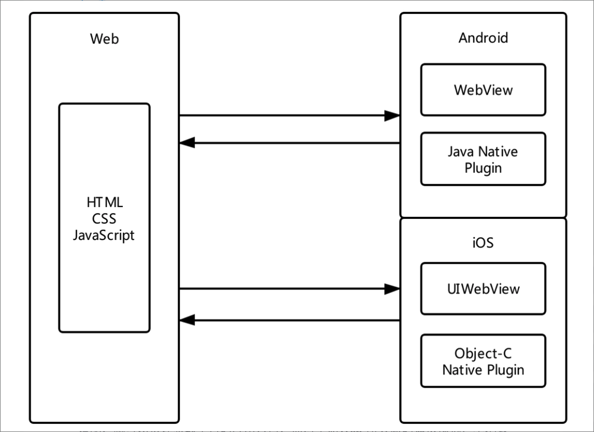
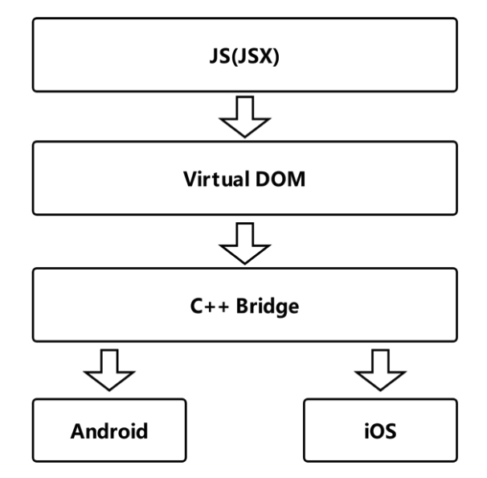
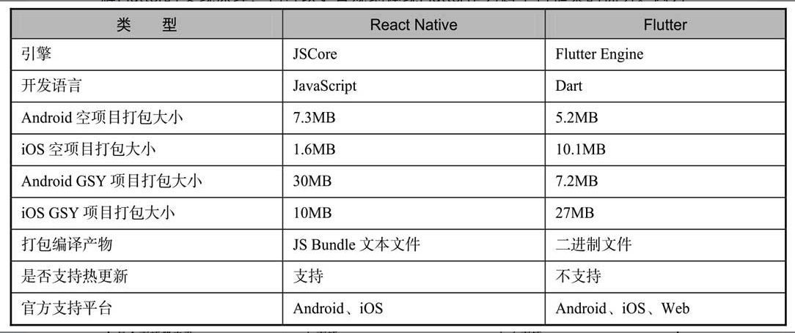

> <h1 id=''></h1>
- [**‌Cordova框架**](#‌Cordova框架)
- [**React Native**](#ReactNative)
- [**Flutter语言**](#Flutter语言)
- [**综合对比**](#综合对比)
	- [实现原理](#实现原理)
	- [编译和产物](#编译和产物)
- [**iOS原生渲染**](#iOS原生渲染)

 

***
   

> <h1 id='‌Cordova框架'>‌Cordova框架</h1>

Cordova作为跨平台领域应用最广泛的框架，它被早期的前端人员所熟知，其主要原理是：将Web代码打包到本地，利用平台的WebView进行加载，通过内部约定好的JavaScript（以下简称JS）协议进行通信，从而调用具备平台原生能力的插件。Cordova框架图如图1-2所示。

Cordova 让前端开发人员可以快速地构建移动应用，对于原有的 Web 代码只需做少量适配，就可以快速获取平台的应用入口，而对早期Web 所欠缺的如摄像机、本地缓存、文件读写等能力，也能进行快速的支持。

 

***
   

> <h1 id='React Native'>React Native</h1>
Cordova 虽然方便实用，但是受制于 WebView 的性能瓶颈，无法满足某些需要高性能交互的场景需求，而这时候由Facebook开源的React Native框架打开了新思路。React Native让JavaScript代码运行在框架内置的JS引擎（JavaScriptCore）上，利用JS引擎实现了跨平台能力，之后利用JS Bridge将JavaScript的标签控件对应解析为平台原生控件进行渲染，从而实现性能的优化与提升。React Native框架图如图1-3所示。

这个设计思路也在后来阿里开源的Weex框架中有所体现，不同之处在于Weex利用了V8引擎实现跨平台，使用了Vue的设计理念。

React Native和React的不同之处在于：React Native中所有的标签都不是真实控件，JS代码中所写控件的作用类似于Map中的key值，JS端通过这个key值组合出来的DOM，最后会在Native端被解析成对应的Native控件进行渲染。例如＜view＞标签这个key对应Android平台的ViewGroup控件，也就是说React Native中的控件依赖于原生平台实现。

但是React Native的JS引擎和JS Bridge同样存在性能限制，Facebook也在着力优化这一问题。而JS控件转化为平台控件进行渲染的设计，也导致了React Native框架和平台控件耦合过多。在版本兼容和系统升级等历史因素的困扰下，框架的维护越发困难，不少React Native的开发者会选择一个框架版本后不再升级。

 

***
   

> <h1 id='Flutter语言'>Flutter语言</h1>

2017年谷歌开源了Flutter，如果说React Native是为开发者做了平台兼容统一，那么Flutter更像是为开发者屏蔽了平台的概念。Flutter作为跨平台的UI框架，只需平台提供一个Surface和一个Canvas就可以完成界面的工作。

如图1-4所示，Flutter中绝大部分的Widget都与平台无关，开发者基于Framework开发App，而Framework运行在Flutter Engine之上，由Engine进行适配和提供跨平台支持。这个跨平台的支持过程，其实就是将Flutter Framework中的Widget进行“数据化”处理，然后通过Engine上的Skia直接绘制到屏幕上。

Flutter可以实现跨平台且内部控件与平台无关的原因，就在于Skia图形引擎。Skia是谷歌的图形引擎，在Chrome浏览器、Android等系统内均使用Skia作为绘图处理引擎。Android平台本身就内置了Skia，将NativeCode代码渲染成界面，所以相比React Native，Flutter在绘制性能上少了中间代理，可以更接近原生的交互体验。

 

***
   

> <h1 id='综合对比'>综合对比</h1>

因为Cordova更多是提供打包脚手架的功能，所以这里的对比排除了Cordova，直接对比React Native和Flutter，如表1-1所示。

从表 1-1 中可以很直观地看到，GSY 项目是开源的 GSYGithubApp 项目，它们在React Native与Flutter都实现了类似的功能，所以有一定的对比价值。Flutter与React Native在各自的应用场景下互有优劣，但是有一点Flutter一定比React Native优秀，那就是Flutter的版本号早就超越了React Native。

   

> <h2 id='实现原理'>实现原理</h2>

在Android和iOS上，默认情况下Flutter和React Native都需要一个原生平台的Activity/ViewController支持，且在原生层面属于一个“单页面应用”。这里的Activity和ViewController可以理解为原生平台的一个独立原生页面，常用于组成多页堆栈，而默认情况下在 Android和iOS上只会有一个Activity或ViewController做原生承载，所以对于原生端都属于“单页面应用”。

 

**而其实它们之间最大的不同点在于界面构建，分别介绍如下:**

- ● React Native在默认情况下会在原生页面下加载JS Bundle文件，然后JS端的DOM布局会被解析成原生平台的控件，如＜View＞标签对应ViewGroup/UIView，＜ScrollView＞标签对应ScrollView/UIScrollView，＜Image＞标签对应ImageView/UIImageView等，最终堆叠出一系列的原生控件进行渲染。

- ● 而Flutter在默认情况下会在原生页面中加载一个FlutterView，用于提供Surface，之后Flutter Enigne会将Flutter Framework的在Android和iOS上，默认情况下Flutter和React Native都需要一个原生平台的Activity/ViewController支持，且在原生层面属于一个“单页面应用”。这里的Activity和ViewController可以理解为原生平台的一个独立原生页面，常用于组成多页堆栈，而默认情况下在 Android和iOS上只会有一个Activity或ViewController做原生承载，所以对于原生端都属于“单页面应用”。而其实它们之间最大的不同点在于界面构建，分别介绍如下。

- ● React Native在默认情况下会在原生页面下加载JS Bundle文件，然后JS端的DOM布局会被解析成原生平台的控件，如＜View＞标签对应ViewGroup/UIView，＜ScrollView＞标签对应ScrollView/UIScrollView，＜Image＞标签对应ImageView/UIImageView等，最终堆叠出一系列的原生控件进行渲染。

- ● 而Flutter在默认情况下会在原生页面中加载一个FlutterView，用于提供Surface，之后Flutter Enigne会将Flutter Framework的控件通过Skia绘制到Surface上。

 

从以上对比可以看出：React Native“Learn once，write anywhere”的思路就是只要你会React，那么就可以用写React的方式，再去开发一个性能不错的App；而Flutter则是让你忘掉平台，专注于Flutter UI就够了。

   

> <h2 id='编译和产物'>编译和产物</h2>

React Native编译后的文件主要是JS bundle文本文件，Flutter编译后的产物是可执行的二进制文件。从安全性的角度考虑，Flutter编译后的产物是更加安全和高效的。

 

如上所示，可以看到React Native的空项目打包大小，Android是大于iOS的；Flutter的空项目打包大小，iOS是大于Android的。这是因为React Native运行所需的JSCore在iOS中是内置的，而 Android 需要打包到项目里。这个现象在 Flutter 中却是相反的情况，Flutter绘制所需要的Skia在Android平台中是内置的，而iOS平台中需要打包到项目里。这个大小规律在GSY实际项目上也有着相同的体现。

 

综上所述，在同等条件下，React Native打包的结果是Android的比iOS的大，而Flutter打包的结果则正好相反，iOS的比Android的大。

 

***
   

> <h1 id='iOS原生渲染'>iOS原生渲染</h1>

  

> <h2 id=''></h2>

 

***
   

&emsp; 用户在使用 App 时，界面的设计、流畅程度是最直接的体验。为此，苹果公司提供了各个层级的库，比如 SwiftUI、UIKit、Core Animation、Core Graphic、OpenGL ，以方便 App 界面的开发。

&emsp; 说起来，即使你不了解这些库的实现原理，也可以通过它们提供的易用接口上手去开发 App，特别是 SwiftUI 大大简化了界面的开发，也确实能够解决大部分问题。但是，一旦遇到性能问题，完全依靠搜索获得的不完整的、拼凑来的知识，大概率只能解一时之需，要想系统地解决问题，还是要知道这些库的实现原理。

&emsp; 而这些与界面相关的库，背后的知识其实就是渲染。接下来，我就和你说说渲染的原理。渲染原理我们看到的 App 界面，都是由 CPU 和 GPU 共同计算处理的。

&emsp; CPU 内部流水线结构拥有并行计算能力，一般用于显示内容的计算。而 GPU 的并行计算能力更强，能够通过计算将图形结果显示在屏幕像素中。

 

&emsp; 内存中的图形数据，经过转换显示到屏幕上的这个过程，就是渲染。而负责执行这个过程的，就是 GPU。渲染的过程中，GPU 需要处理屏幕上的每一个像素点，并保证这些像素点的更新是流畅的，这就对 GPU 的并行计算能力要求非常高。

 

&emsp; 早期，图形渲染是由 VGA（Video Graphics Array，视频图形阵列）来完成的，随着 3D 加速的需要，带来了比如三角形生成、光栅化、纹理贴图等技术。处理这一系列技术的处理器，就被统称为 GPU。GPU 的主要工作是将 3D 坐标转化成 2D 坐标，然后再把 2D 坐标转成实际像素，具体实现可以分为**顶点着色器（确定形状的点）、形状装配（确定形状的线）、几何着色器（确定三角形个数）、光栅化（确定屏幕像素点）、片段着色器（对像素点着色）、测试与混合（检查深度和透明度进行混合）六个阶段**。

 

&emsp; 为了能够更方便地控制 GPU 的运算，GPU 的可编程能力也不断加强，开始支持 C 和 C++ 语言。通过 OpenGL 标准定义的库，可以更容易地操作 GPU。在渲染过程中，CPU 专门用来处理渲染内容的计算，比如视图创建、布局、图片解码等，内容计算完成后，再传输给 GPU 进行渲染。在这个过程中，CPU 和 GPU 的相互结合，能够充分利用手机硬件来提升用户使用 App 的体验。当然，在这个过程中，如果 CPU 的计算时间超过了屏幕刷新频率要求的时间，界面操作就会变得不流畅。

 

&emsp; 那么，如果你想要知道原生、大前端和 Flutter 谁会更流畅，就要分别去了解在渲染过程中，谁的 CPU 计算内容会更快。

 

&emsp; 接下来，我们先看看原生渲染中的计算。

- **原生**:原生渲染原生界面更新渲染的流程，可以分为以下四步。
	- 第一步，更新视图树，同步更新图层树。
	- 第二步，CPU 计算要显示的内容，包括视图创建（设置 Layer 的属性）、布局计算、视图绘制（创建 Layer 的 Backing Image）、图像解码转换。当 runloop 在 BeforeWaiting 和 Exit 时，会通知注册的监听，然后对图层打包，打完包后，将打包数据发送给一个独立负责渲染的进程 Render Server。
	- 第三步，数据到达 Render Server 后会被反序列化，得到图层树，按照图层树中图层顺序、RGBA 值、图层 frame 过滤图层中被遮挡的部分，过滤后将图层树转成渲染树，渲染树的信息会转给 OpenGL ES/Metal。

 

&emsp; 前面 CPU 所处理的这些事情统称为 Commit Transaction。
	
- 第四步，Render Server 会调用 GPU，GPU 开始进行前面提到的顶点着色器、形状装配、几何着色器、光栅化、片段着色器、测试与混合六个阶段。完成这六个阶段的工作后，再将 CPU 和 GPU 计算后的数据显示在屏幕的每个像素点上。整个渲染过程，如下图所示：