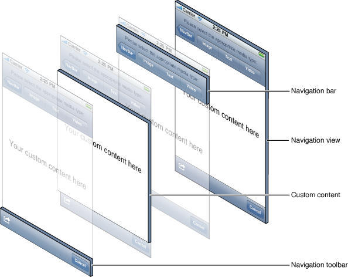
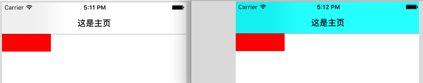

- **导航控制器**
	- 改变导航栏风格
	- 改变导航栏背景颜色
	- 	改变导航栏渲染色(titnColor)
	- 	改变title 字体颜色
	- 	将导航栏以图片为背景
	- 	改变导航栏透明状态
- [**iOS组件化与路由的本质**](http://www.cocoachina.com/cms/wap.php?action=article&id=27025)
- [组件化方案探索](http://wereadteam.github.io/2016/03/19/iOS-Component/)
- [JLRoutes 实战篇(一)App内控制器跳转](https://developer.aliyun.com/article/742104)


<br/>

***
<br/>

># 导航控制器




<br/>

- **`改变导航栏风格`**

&emsp;  可以通过代码修改也可以通过 plist修改

&emsp;  有 UIBarStyleDefault 和 UIBarStyleBlack 两种, 默认是UIBarStyleDefault 白底黑字半透明的, UIBarStyleBlack是黑底白字半透明。

```
@property(nonatomic,assign) UIBarStyle barStyle;
typedef NS_ENUM(NSInteger, UIBarStyle) {
    UIBarStyleDefault          = 0,
    UIBarStyleBlack            = 1,
    
    UIBarStyleBlackOpaque      = 1, // Deprecated. Use UIBarStyleBlack
    UIBarStyleBlackTranslucent = 2, // Deprecated. Use UIBarStyleBlack and set the translucent property to YES
}


self.navigationController.navigationBar.barStyle = UIBarStyleBlack;
```
效果如下:


<br/>

- **`改变导航栏背景颜色(barTintColor)`**

```
@property(nullable, nonatomic,strong) UIColor *barTintColor 

//self.navigationController.navigationBar.barTintColor = [UIColor whiteColor];
self.navigationController.navigationBar.barTintColor = [UIColor cyanColor];
```
&emsp;  此属性默认为 nil, 所有默认是半透明的, 当设置颜色后, 变为不透明颜色， 效果如下:




<br/>

- **`改变导航栏渲染色(titnColor)`**

```
@property(null_resettable, nonatomic,strong) UIColor *tintColor;


self.navigationController.navigationBar.tintColor = [UIColor purpleColor];
```

&emsp;  此属性只能影响导航栏上的按钮的颜色,效果如下:


<br/>

- **`改变title 字体颜色`**

```
[self.navigationController.navigationBar setTitleTextAttributes:@{NSForegroundColorAttributeName: [UIColor orangeColor], NSFontAttributeName:[UIFont systemFontOfSize:20.0f]}];

```


<br/>

- **`将导航栏以图片为背景`**

```
[self.navigationController.navigationBar setBackgroundImage:[UIImage imageNamed:@"NavBar_64.png"] forBarMetrics:UIBarMetricsDefault];
```

&emsp;  对于导航栏设置背景图片有一些需要注意的地方:
>navigationBar竖屏下默认高度44,横屏下默认高度32。对于 navigationBar 背景图片的问题,对尺寸有严格的要求(竖屏来说):

> a.  当图片高度小于44或者大于64时,会对 nabigationBar 以及 statusBar 同时附上图片,并且是平铺效果;

> b. 当图片高度等于44时,只会给 navigationBar 附上图片,不会对 statusBar 做任何修改;

> c. 当图片高度等于64时,会对 navigaBar 和 statusBar 同时附上图片。


<br/>

- **`改变导航栏透明状态`**

```
@property(nonatomic,assign,getter=isTranslucent) BOOL translucent
```

<br/>

***
<br/>

>#  栈内视图控制器管理

**`① 移除视图控制器`**

```
navigationController?.viewControllers.removeAll(where: { (viewController) -> Bool in
  return (viewController is MemonicsSelectViewController || viewController is PurseManageViewController || viewController is MyMemonicsViewController) ? false : true
})
```
&emsp;  导航控制器对栈内的视图控制器进行移除，若移则对返回的控制器返回`true`否则返回`false`。如上面的代码中，对`MemonicsSelectViewController 、 PurseManageViewController、 MyMemonicsViewController `不移除。


<br/>

***
<br/>


<br/>

参考资料：

[自定义导航栏 UINavigationBar US](https://blog.csdn.net/wangyanchang21/article/details/50925648)

[UINavigationBar 使用总结 US](https://www.jianshu.com/p/f0d3df54baa6)


