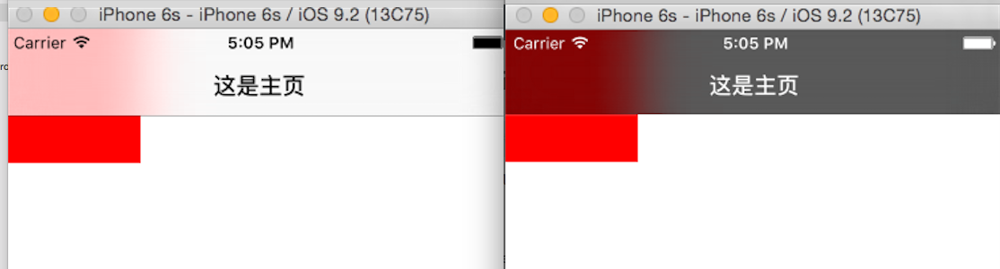

> <h2 id=''></h2>
- [**导航控制器**](#导航控制器)
	- [改变导航栏风格](#改变导航栏风格)
	- [改变导航栏背景颜色(barTintColor)](#改变导航栏背景颜色(barTintColor))
	- 	[改变导航栏渲染色(titnColor)](#改变导航栏渲染色(titnColor))
	- [	改变title 字体颜色](#改变title字体颜色)
	- [	将导航栏以图片为背景](#将导航栏以图片为背景)
	- 	[改变导航栏透明状态](#改变导航栏透明状态)
- 	[**栈内视图控制器管理**](#栈内视图控制器管理)
- [**Hybrid**](#Hybrid)
	- [app调用H5](#app调用H5)
	- [H5调用app](#H5调用app)
- 	**App跳转**
	- [**前奏**](#前奏)
	- [**注册URL Scheme**](#注册URLScheme)
	- [**App在App Store的下载链接**](#App在AppStore的下载链接)
- 	**资料**
	- [**iOS组件化与路由的本质**](http://www.cocoachina.com/cms/wap.php?action=article&id=27025)
	- [组件化方案探索](http://wereadteam.github.io/2016/03/19/iOS-Component/)
	- [JLRoutes 实战篇(一)App内控制器跳转](https://developer.aliyun.com/article/742104)
	- [自定义导航栏 UINavigationBar US](https://blog.csdn.net/wangyanchang21/article/details/50925648)
	- [UINavigationBar 使用总结 US](https://www.jianshu.com/p/f0d3df54baa6)
	- [微信跳转到appstore下载App](https://blog.csdn.net/sinat_35861727/article/details/70282504)


<br/>

***
<br/>

># <h1 id='导航控制器'>导航控制器</h1>


<br/>
<br/>

> <h2 id='改变导航栏风格'>改变导航栏风格</h2>

&emsp;  可以通过代码修改也可以通过 plist修改

&emsp;  有 UIBarStyleDefault 和 UIBarStyleBlack 两种, 默认是UIBarStyleDefault 白底黑字半透明的, UIBarStyleBlack是黑底白字半透明。

```
@property(nonatomic,assign) UIBarStyle barStyle;
typedef NS_ENUM(NSInteger, UIBarStyle) {
    UIBarStyleDefault          = 0,
    UIBarStyleBlack            = 1,
    
    UIBarStyleBlackOpaque      = 1, // Deprecated. Use UIBarStyleBlack
    UIBarStyleBlackTranslucent = 2, // Deprecated. Use UIBarStyleBlack and set the translucent property to YES
}


self.navigationController.navigationBar.barStyle = UIBarStyleBlack;
```
效果如下:


<br/>
<br/>
<br/>

> <h2 id='改变导航栏背景颜色(barTintColor)'>改变导航栏背景颜色(barTintColor)</h2>
> 

```
@property(nullable, nonatomic,strong) UIColor *barTintColor 

//self.navigationController.navigationBar.barTintColor = [UIColor whiteColor];
self.navigationController.navigationBar.barTintColor = [UIColor cyanColor];
```
&emsp;  此属性默认为 nil, 所有默认是半透明的, 当设置颜色后, 变为不透明颜色， 效果如下:


<br/>
<br/>

> <h2 id='改变导航栏渲染色(titnColor)'>改变导航栏渲染色(titnColor)</h2>


```
@property(null_resettable, nonatomic,strong) UIColor *tintColor;


self.navigationController.navigationBar.tintColor = [UIColor purpleColor];
```

&emsp;  此属性只能影响导航栏上的按钮的颜色,效果如下:


<br/>
<br/>

> <h2 id='改变title字体颜色'>改变title 字体颜色</h2>

```
[self.navigationController.navigationBar setTitleTextAttributes:@{NSForegroundColorAttributeName: [UIColor orangeColor], NSFontAttributeName:[UIFont systemFontOfSize:20.0f]}];

```


<br/>
<br/>

> <h2 id='将导航栏以图片为背景'>将导航栏以图片为背景</h2>


```
[self.navigationController.navigationBar setBackgroundImage:[UIImage imageNamed:@"NavBar_64.png"] forBarMetrics:UIBarMetricsDefault];
```

&emsp;  对于导航栏设置背景图片有一些需要注意的地方:
>navigationBar竖屏下默认高度44,横屏下默认高度32。对于 navigationBar 背景图片的问题,对尺寸有严格的要求(竖屏来说):

> a.  当图片高度小于44或者大于64时,会对 nabigationBar 以及 statusBar 同时附上图片,并且是平铺效果;

> b. 当图片高度等于44时,只会给 navigationBar 附上图片,不会对 statusBar 做任何修改;

> c. 当图片高度等于64时,会对 navigaBar 和 statusBar 同时附上图片。


<br/>
<br/>

> <h2 id='改变导航栏透明状态'>改变导航栏透明状态</h2>

```
@property(nonatomic,assign,getter=isTranslucent) BOOL translucent
```

<br/>

***
<br/>
<br/>

># <h1 id='栈内视图控制器管理'>栈内视图控制器管理</h1>


**`① 移除视图控制器`**

```
navigationController?.viewControllers.removeAll(where: { (viewController) -> Bool in
  return (viewController is MemonicsSelectViewController || viewController is PurseManageViewController || viewController is MyMemonicsViewController) ? false : true
})
```
&emsp;  导航控制器对栈内的视图控制器进行移除，若移则对返回的控制器返回`true`否则返回`false`。如上面的代码中，对`MemonicsSelectViewController 、 PurseManageViewController、 MyMemonicsViewController `不移除。


<br/>

***
<br/>
<br/>

># <h1 id='Hybrid'>Hybrid</h1>

&emsp; App目前主要分为三类，分为Web App、Hybrid App、 Native App.

- Native App ： 本地应用程序（原生App）
- Web App：网页应用程序（移动web）
- Hybrid App：混合应用程序（混合App)

<br/>
<br/>


> <h2 id='app调用H5'>app调用H5</h2>

App端调用H5端的方法，调用的必须是绑定到window对象上面的方法。

**1.首先把say方法注册到window对象上。**

```
window.say = (name) => {
 alert(name)
}
```


<br/>


**2.iOS调用H5端的方法**

iOS使用不同的语言有不同的调用方法。

```
// Objective-C
// say 方法是H5端挂载在window对象上的方法
[self.webView evaluateJavaScript:@"say('params')" completionHandler:nil];

// Swift
// say 方法是H5端挂载在window对象上的方法
webview.stringByEvaluatingJavaScriptFromString("say('params')")
```


<br/>
<br/>


> <h2 id='H5调用app'>H5调用app</h2>

**1.H5调用IOS端方法**

苹果 WKWebView scriptMessageHandler 注入:
```
#pragma mark -  OC注册供JS调用的方法 register方法
- (void)addScriptFunction {
    self.wkUserContentController = [self.webView configuration].userContentController;

    [self.wkUserContentController addScriptMessageHandler:self name:@"register"];
}

#pragma mark - register方法
- (void)register:(id)body {
     NSDictionary *dict = body;
    [self.userDefaults setObject:[dict objectForKey:@"password"] forKey:[dict objectForKey:@"username"]];
    不能直接返回结果，需要再次调用H5端的方法，告诉H5端注册成功。
    [self.webView evaluateJavaScript:@"registerCallback(true)" completionHandler:nil];
}
```

ios 在暴露给 web 端调用的方法不能直接有返回值，如果需要有返回值需要再调用 web 端的方法来传递返回值。（也就是需要两步完成）。

H5调用IOS端暴露的方法。

```
// 与android不同，ios这里的webkit.messageHandlers是固定写法，不能变。
// 不传参数
window.webkit.messageHandlers.register.postMessage(null);
// 传递参数
// 与android不同，ios这里的参数可以是基本类型和引用数据类型。
window.webkit.messageHandlers.register.postMessage(params);
```


<br/>

***
<br/>
<br/>

># <h1 id='前奏'>前奏</h1>

&emsp;  我们都知道苹果手机中的APP都有一个沙盒，APP就是一个信息孤岛，相互是不可以进行通信的。但是iOS的APP可以注册自己的URL Scheme，URL Scheme是为方便app之间互相调用而设计的。我们可以通过系统的OpenURL来打开该app，并可以传递一些参数。

&emsp;  **URL Scheme**必须能唯一标识一个APP，如果你设置的URL Scheme与别的APP的URL Scheme冲突时，你的APP不一定会被启动起来。因为当你的APP在安装的时候，系统里面已经注册了你的URL Scheme。一般情况下，是会调用先安装的app。但是iOS的系统app的URL Scheme肯定是最高的。所以我们定义URL Scheme的时候，尽量避开系统app已经定义过的URL Scheme。

&emsp;  URL Schemes 有两个单词：

&emsp;  &emsp;  ①.  URL，我们都很清楚，`http://www.apple.com `就是个 URL，我们也叫它链接或网址；

&emsp;  &emsp;  ②. Schemes，表示的是一个 URL 中的一个位置——最初始的位置，即 ://之前的那段字符。比如 `http://www.apple.com` 这个网址的 Schemes 是 http。


<br/>

***

<br/>
<br/>

># <h1 id='注册URLScheme'>注册**URL Scheme**</h1>


右键单击info.plist,按下图所示：


`URL Scheme: Harley109`

根据[微信开发平台](https://open.weixin.qq.com/cgi-bin/showdocument?action=dir_list&t=resource/res_list&verify=1&id=1417694084&token=b2efd44becf512cd1ae681b36801c951a3c4240b&lang=zh_CN)对数据进行接入

`AppDelegate.h  增加 WXApiDelegate 协议。`

```
#import <UIKit/UIKit.h>
#import "WXApi.h"

@interface AppDelegate : UIResponder <UIApplicationDelegate, WXApiDelegate>

@property (strong, nonatomic) UIWindow *window;


@end
```

`AppDelegate.m  代码中使用开发工具包`

```
#pragma mark -- 微信分享
+ (void) weixinShareRegister {
    //wxd930ea5d5a258f4f 微信SDK demo里的appID
    //注册appID
    [WXApi registerApp:@"wxd930ea5d5a258f4f"];
}

- (BOOL)application:(UIApplication *)app openURL:(NSURL *)url options:(NSDictionary<UIApplicationOpenURLOptionsKey,id> *)options {
    // 接受传过来的参数
    NSString *text = [[url host] stringByReplacingPercentEscapesUsingEncoding:NSUTF8StringEncoding];
    
    UIAlertController *ac = [UIAlertController alertControllerWithTitle:@"URL Scheme" message:text preferredStyle: UIAlertControllerStyleAlert];
    UIAlertAction *action1 = [UIAlertAction actionWithTitle:@"标题" style:UIAlertActionStyleDefault handler:nil];
    [ac addAction:action1];
    
    [self.window.rootViewController presentViewController:ac animated:YES completion:nil];

    return YES;

}
```

`HGMyController.m  添加分享事件`

```
//分享文本到微信
- (void)shareButtonClick:(id)sender {
    SendMessageToWXReq *req = [[SendMessageToWXReq alloc]init];
    req.bText = YES;           // 指定为发送文本
    req.text = @"hello world"; // 要发送的文本
    req.scene = WXSceneSession;// 指定发送到会话
    [WXApi sendReq:req];
}

//分享网页到微信
-(void)sendUrl:(NSString*)url To:(enum WXScene)scene{
    SendMessageToWXReq *req = [[SendMessageToWXReq alloc]init];
    req.bText = NO;
    req.scene = WXSceneSession;// 分享到会话
    WXMediaMessage *medMessage = [WXMediaMessage message];
    medMessage.title = @"分享网页的标题"; // 标题
    medMessage.description = @"这个就是描述啦";// 描述
    WXWebpageObject *webPageObj = [WXWebpageObject object];
    [medMessage setThumbImage:[UIImage imageNamed:@"kitty"]];// 缩略图
    webPageObj.webpageUrl = @"http://www.baidu.com";
    medMessage.mediaObject = webPageObj;
    req.message = medMessage;
    [WXApi sendReq:req];
}


- (void) testShareFunction {
    CGRect frame = CGRectMake(50, 100, 100, 60);
    UIButton *button = [[UIButton alloc] initWithFrame:frame];
    button.backgroundColor = [UIColor greenColor];
    [button addTarget:self action:@selector(shareButtonClick:) forControlEvents:UIControlEventTouchUpInside];
    
    [self.view addSubview:button];
    
}
```


`重写AppDelegate的 application: openURL: options: 方法`

```
- (BOOL)application:(UIApplication *)app openURL:(NSURL *)url options:(NSDictionary<UIApplicationOpenURLOptionsKey,id> *)options {
    return [WXApi handleOpenURL:url delegate:self];
}
```

`程序要实现和微信终端交互的具体请求与回应，因此需要实现WXApiDelegate协议的两个方法`

```
-(void) onReq:(BaseReq*)reqonReq
//是微信终端向第三方程序发起请求，要求第三方程序响应。第三方程序响应完后必须调用sendRsp返回。在调用sendRsp返回时，会切回到微信终端程序界面。
```

```
-(void) onResp:(BaseResp*)resp
//如果第三方程序向微信发送了sendReq的请求，那么onResp会被回调。sendReq请求调用后，会切到微信终端程序界面。`
//具体在此两方法中所要完成的内容由你定义，具体可参考微信开发工具包中的SDK Sample Demo源码。
```

` 如果你的程序要发消息给微信，那么需要调用WXApi的sendReq函数`

```
-(BOOL) sendReq:(BaseReq*)req
//其中req参数为SendMessageToWXReq类型。
//需要注意的是，SendMessageToWXReq的scene成员，如果scene填WXSceneSession，那么消息会发送至微信的会话内。
//如果scene填WXSceneTimeline，那么消息会发送至朋友圈。
//如果scene填WXSceneFavorite,那么消息会发送到“我的收藏”中。
//scene默认值为WXSceneSession。
```

**参考资料:**

 &emsp;&emsp;&emsp;&emsp; [微信SDK Sample Demo源码](https://open.weixin.qq.com/zh_CN/htmledition/res/dev/download/sdk/WeChatSDK_sample_iOS_1.4.2.1.zip)
 
 &emsp;&emsp;&emsp;&emsp; [打开另一个APP](https://www.jianshu.com/p/0811ccd6a65d)
 
 &emsp;&emsp;&emsp;&emsp; [使用URLScheme进行App跳转](https://blog.csdn.net/shimazhuge/article/details/79450412)
 
&emsp;&emsp;&emsp;&emsp; [分享到微信简明教程](https://www.jianshu.com/p/db2751ff334a)

<br/>
***
<br/>
<br/>

># <h1 id='App在AppStore的下载链接'>App在App Store的下载链接</h1>


&emsp;  基本格式是: `https://itunes.apple.com/cn/app/idxxxxxxxxxx?mt=8 `
&emsp;  这里的"xxxxxxxxxx"就是自己在[itunesconnect.apple.com](https://itunesconnect.apple.com/)中创建自己的App之后iTunesConnect为你的App创建的一个Apple ID。

&emsp;  ***查看已发布的AppID:***


现在，我的App 下载链接是： https://itunes.apple.com/cn/app/id1234897980?mt=8 ，在微信中也可以点开：


<br/>

***
<br/>

