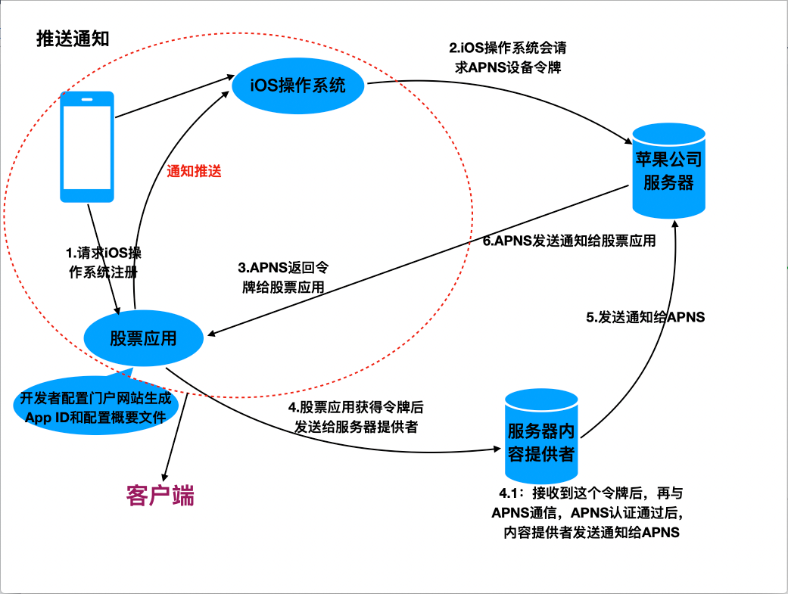

- **远程推送**
	- 不同版本远程注册通知处理
	- iOS10之前接收通知的方法
- **模拟推送**
- [**iOS 远程通知**](https://www.jianshu.com/p/4cca4e8a889e)
- [**消息推送（UserNotifications）秘籍总结（一）**](https://www.jianshu.com/p/c58f8322a278)
- [**通知详解：iOS 10 UserNotifications API**](https://www.jianshu.com/p/792b21db2c11)
- [**iOS10通知框架UserNotifications学习及兼容笔记**](http://www.cocoachina.com/articles/20207)


<br/>

***
<br/>


># 远程推送





第6阶段：`APNS`在自身的已注册Push服务的iPhone列表中，查找有相应标识的iPhone，并把消息发到iPhone;

&emsp;  `iPhone`把发来的消息传递给相应的应用程序， 并且按照设定弹出Push通知。
<br/>
**远程通知中`AppDelegate.m`代理方法回调**

```
// iOS<10时，且app被完全杀死
- (BOOL)application:(UIApplication *)application didFinishLaunchingWithOptions:(NSDictionary *)launchOptions;

// 注：iOS10以上，如果不使用UNUserNotificationCenter，将走此回调方法
- (void)application:(UIApplication *)application didReceiveRemoteNotification:(NSDictionary *)userInfo;

// iOS7及以上系统
- (void)application:(UIApplication *)application didReceiveRemoteNotification:(NSDictionary *)userInfo fetchCompletionHandler:(void (^)(UIBackgroundFetchResult))completionHandler;

//  iOS>=10: App在前台获取到通知
- (void)userNotificationCenter:(UNUserNotificationCenter *)center willPresentNotification:(UNNotification *)notification withCompletionHandler:(void (^)(UNNotificationPresentationOptions))completionHandler;

//  iOS>=10: 点击通知进入App时触发（杀死/切到后台唤起）
- (void)userNotificationCenter:(UNUserNotificationCenter *)center didReceiveNotificationResponse:(UNNotificationResponse *)response withCompletionHandler:(void (^)(void))completionHandler;
```


<br/>

- **不同版本远程注册通知处理**

```
#ifdef NSFoundationVersionNumber_iOS_9_x_Max
#import <UserNotifications/UserNotifications.h>
#endif

@interface AppDelegate () <UNUserNotificationCenterDelegate>

@end


//注册APNs消息
+ (void) registerRemoteNotification {
    if ([[UIDevice currentDevice].systemVersion floatValue] >= 10.0) {
#if __IPHONE_OS_VERSION_MAX_ALLOWED >= __IPHONE_10_0 //Xcode8 编译会调用
        if (@available(iOS 10.0, *)) {
            UNUserNotificationCenter *center = [UNUserNotificationCenter currentNotificationCenter];
            center.delegate = self;
            [center requestAuthorizationWithOptions:(UNAuthorizationOptionBadge | UNAuthorizationOptionSound | UNAuthorizationOptionAlert | UNAuthorizationOptionCarPlay) completionHandler:^(BOOL granted, NSError * _Nullable error) {
                if (!error) {
                    NSLog(@"request notification authorization succeeded!");
                }
            }];
        }
        [[UIApplication sharedApplication] registerForRemoteNotifications];
#else   //Xcode7 编译会调用
        UIUserNotificationType types = (UIUserNotificationTypeAlert | UIUserNotificationTypeSound | UIUserNotificationTypeBadge);
        UIUserNotificationSettings *settings = [UIUserNotificationSettings settingsForTypes: types categories:nil];
        [[UIApplication sharedApplication] registerUserNotificationSettings: settings];
        [[UIApplication sharedApplication] registerForRemoteNotifications];
#endif
    } else if ([[[UIDevice currentDevice] systemVersion] floatValue] >= 8.0) {
        UIUserNotificationType types = (UIUserNotificationTypeAlert | UIUserNotificationTypeSound | UIUserNotificationTypeBadge);
        UIUserNotificationSettings *settings = [UIUserNotificationSettings settingsForTypes: types categories:nil];
        [[UIApplication sharedApplication] registerUserNotificationSettings: settings];
        [[UIApplication sharedApplication] registerForRemoteNotifications];
    }else {
        UIRemoteNotificationType apn_type = (UIRemoteNotificationType)(UIRemoteNotificationTypeAlert |
                                                                       UIRemoteNotificationTypeSound |
                                                                       UIRemoteNotificationTypeBadge);
        [[UIApplication sharedApplication] registerForRemoteNotificationTypes:apn_type];
    }
}


//注册 APNs 成功并上报 DeviceToken
- (void)application:(UIApplication *)application didRegisterForRemoteNotificationsWithDeviceToken:(nonnull NSData *)deviceToken {
    
    NSString *deviceStr = [[deviceToken description] stringByTrimmingCharactersInSet:[NSCharacterSet characterSetWithCharactersInString:@"<>"]];
    //字符替换
    deviceStr = [deviceStr stringByReplacingOccurrencesOfString:@" " withString:@""];
    NSLog(@"success get deviceToken: %@", deviceStr);
    
    //极光推送注册 DeviceToken
    [JPUSHService registerDeviceToken:deviceToken];
    //获得注册后的regist_id，此值一般传给后台做推送的标记用,先存储起来
    self.registerid = [JPUSHService registrationID];
    
}


//实现注册 APNs 失败接口（可选）
- (void)application:(UIApplication *)application didFailToRegisterForRemoteNotificationsWithError:(NSError *)error {
    //Optional
    NSLog(@"did Fail To Register For Remote Notifications With Error: %@", error. description);
}


#pragma mark -- UNUserNotificationCenterDelegate
//iOS10 收到通知(本地和远端)

//App处于前台接收通知时
//当app处于前台状态才会走，后台模式下是不会走这里的
- (void)userNotificationCenter:(UNUserNotificationCenter *)center willPresentNotification:(UNNotification *)notification withCompletionHandler:(void (^)(UNNotificationPresentationOptions))completionHandler {
    
    //收到推送的请求
    UNNotificationRequest *request = notification.request;
   
    //收到推送的内容
    UNNotificationContent *content = request.content;
    
    //收到用户的基本信息
    NSDictionary *userInfo = content.userInfo;
    
    //收到推送消息的角标
    NSNumber *badge = content.badge;
    
    //收到推送消息body
    NSString *body = content.body;
    
    //推送消息的声音
    UNNotificationSound *sound = content.sound;
    
    //推送消息的副标题
    NSString *subtitle = content.subtitle;
    
    //推送消息的标题
    NSString *title = content.title;
    
    //本地和远程通知判断
    if ([notification.request.trigger isKindOfClass:[UNPushNotificationTrigger class]]) {
        //远程通知处理Code
        NSLog(@"iOS10 收到远程通知:%@",userInfo);
    }else {
        // 判断为本地通知
        //此处省略一万行需求代码。。。。。。
        NSLog(@"iOS10 收到本地通知:{\nbody:%@，\ntitle:%@,\nsubtitle:%@,\nbadge：%@，\nsound：%@，\nuserInfo：%@\n}",body,title,subtitle,badge,sound,userInfo);
    }
    
    //提醒用户有badge、sound、Alert三种类型选择，需要执行下面的方法
    completionHandler(UNNotificationPresentationOptionSound | UNNotificationPresentationOptionBadge | UNNotificationPresentationOptionAlert);
}

//App通知的点击事件
//用户点击消息才会触发，如果用户长按（3DTouch）、弹出Action页面等并不会触发。点击Action的时候会触发！
- (void)userNotificationCenter:(UNUserNotificationCenter *)center didReceiveNotificationResponse:(UNNotificationResponse *)response withCompletionHandler:(void (^)(void))completionHandler {
    
    //收到推送的请求
    UNNotificationRequest *request = response.notification.request;
    
    //收到推送的内容
    UNNotificationContent *content = request.content;
    
    //收到用户的基本信息
    NSDictionary *userInfo = content.userInfo;
    
    //收到推送消息的角标
    NSNumber *badge = content.badge;
    
    //收到推送消息body
    NSString *body = content.body;
    
    //推送消息的声音
    UNNotificationSound *sound = content.sound;
    
    //推送消息的副标题
    NSString *subtitle = content.subtitle;
    
    //推送消息的标题
    NSString *title = content.title;
    
    //本地和远程通知判断
    if ([response.notification.request.trigger isKindOfClass:[UNPushNotificationTrigger class]]) {
        //远程通知处理Code
        NSLog(@"iOS10 收到远程通知:%@",userInfo);
    }else {
        // 判断为本地通知
        //此处省略一万行需求代码。。。。。。
        NSLog(@"iOS10 收到本地通知:{\nbody:%@，\ntitle:%@,\nsubtitle:%@,\nbadge：%@，\nsound：%@，\nuserInfo：%@\n}",body,title,subtitle,badge,sound,userInfo);
    }
    
    //UserNotificationsDemo[1765:800117] Warning: UNUserNotificationCenter delegate received call to -userNotificationCenter:didReceiveNotificationResponse:withCompletionHandler: but the completion handler was never called.
    completionHandler(); // 系统要求执行这个方法
}


```
获得deviceToken需要使用真机进行测试，否则获取不到deviceToken的值。

打印：

`success get deviceToken: 95b561f4808f19bf8013401d02af7f4a9ae73062418a692b81592854443e4883`


<br/>

- **`iOS10` 之前接收通知的方法**

```
#pragma mark -- iOS10 之前接收到的通知
- (void)application:(UIApplication *)application didReceiveRemoteNotification:(NSDictionary *)userInfo {
    NSLog(@"iOS6及以下系统，收到通知:%@", userInfo);
    //此处省略处理代码。。。。。。
    if (userInfo) {
        if ([UIApplication sharedApplication].applicationState == UIApplicationStateActive) {// app位于前台通知
            NSLog(@"app位于前台通知(didReceiveRemoteNotification:):%@", userInfo);
        } else {// 切到后台唤起
            NSLog(@"app位于后台通知(didReceiveRemoteNotification:):%@", userInfo);
        }
    }
}

// a. 该回调方法，App杀死后并不执行；
// b. 该回调方法，会与application:didReceiveRemoteNotification:互斥执行；
// c. 该回调方法，会与userNotificationCenter:willPresentNotification:withCompletionHandler:一并执行；
// d. 该回调方法，会与userNotificationCenter:didReceiveNotificationResponse::withCompletionHandler:一并执行。
- (void)application:(UIApplication *)application didReceiveRemoteNotification:(NSDictionary *)userInfo fetchCompletionHandler:(void (^)(UIBackgroundFetchResult))completionHandler {
    NSLog(@"iOS7及以上系统，收到通知:%@", userInfo);
    //此处省略处理代码。。。。。。
    if (userInfo) {
        if ([UIApplication sharedApplication].applicationState == UIApplicationStateActive) {// app位于前台通知
            NSLog(@"app位于前台通知(didReceiveRemoteNotification:fetchCompletionHandler:):%@", userInfo);
        } else {// 切到后台唤起
            NSLog(@"app位于后台通知(didReceiveRemoteNotification:fetchCompletionHandler:):%@", userInfo);
        }
    }
    completionHandler(UIBackgroundFetchResultNewData);
}

```


<br/>

**App将device token发送给 `公司的App Server`**

&emsp;  只有苹果公司知道device token的生成算法，保证唯一，device token在App重装等情况时会变化，因此为确保device token变化后App仍然能够正常接收服务器端发送的通知，建议每次应用程序启动都重新获得device token，并传给App Server

<br/>

***
<br/>


># 模拟推送

&emsp;  本文只侧重于介绍iOS端对远程推送通知的处理，因此我们把App Server对应的处理过程交给了第三方工具，第三方推送测试工具有很多，如`SmartPush`、`Pusher`等，在这里我们选用Pusher作为测试工具

`Pusher的`使用步骤说明：

（1）选择p12格式的推送证书；

（2）设置是否为测试环境（默认勾选为测试环境，由于推送证书分为测试推送证书和生产测试证书，并且苹果的APNs也分为测试和生产两套环境，因此Pusher需要手动置顶是否为测试环境）；

（3）输入device token；

（4）输入符合苹果要求的推送内容字符串；

（5）当确认手机端设置无误，并且以上4点设置正确时，执行推送。

`Pusher`推送的消息，以第4点中的示例为例进行测试，手机收到远程推送通知的效果截


