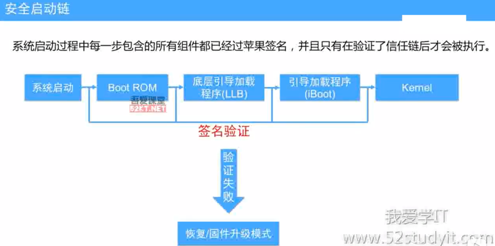
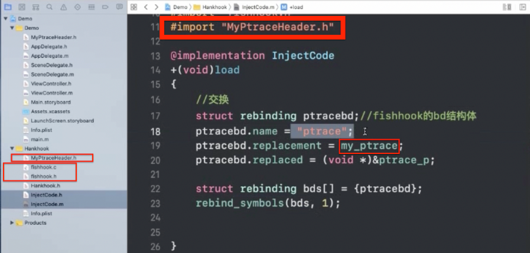
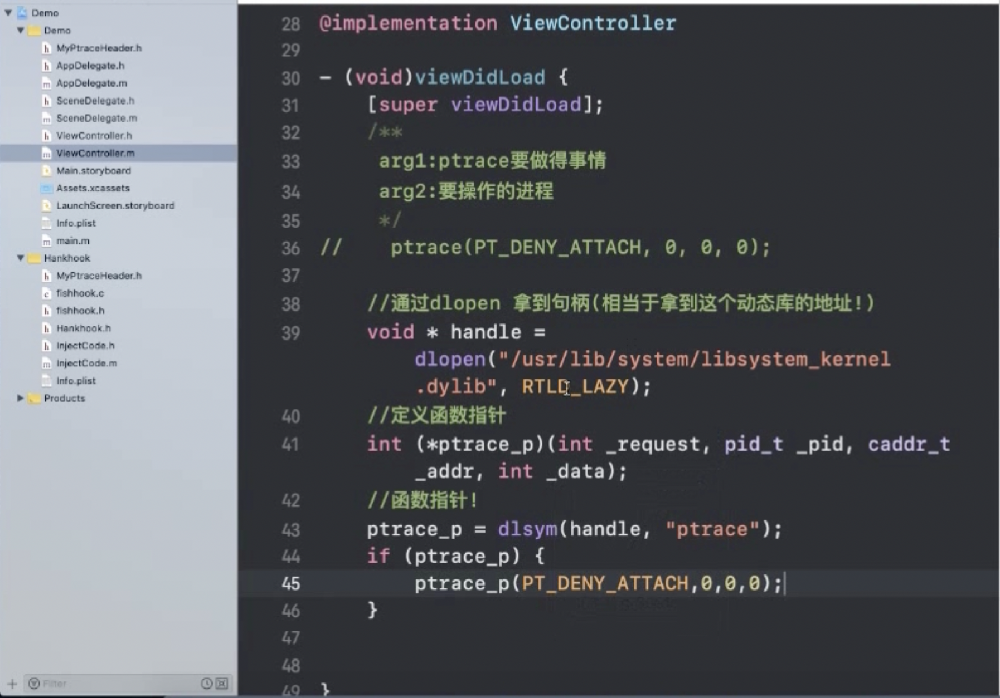

><h2 id=''></h2>
- [**安全机制**](#安全机制)
	- [ptrace防护](#ptrace防护)
- [HOOK原理](#HOOK原理)


<br/>

***
<br/>


> <h1 id='安全机制'>安全机制</h1>

> 安全启动

**安全启动链:** 




<br/>

> <h2 id='ptrace防护'>ptrace防护</h2>


&emsp; Mac->Xcode->Xcode上集成了LLDB-> 问题:真机上上是如何进行应用程序的开发的呢?

&emsp; 实际上是LLDB上追加了一个debugServer,这个debugServer附加trace进程,通过这个trace进程我们就可以在我们的真机上进行调试了.Xcode运行的时候,是默认开启了debugServer.

&emsp; 根据这个我们可以在我们的程序上禁止别人对我们开发的程序进行调试,可以通过`trace()函数`,但是这个函数我们是我无法直接使用的.需要我们先把头文件`MyTraceHeader.h`拖到我们的项目文件里.

```
//
trace(PT_DENY_ATTACH, 0, 0,);
```

&emsp; 通过这个函数,用户是可以正常使用我们的函数,但是其他像调试我们的人是不行的.只要他通过xcode运行在真机或者模拟器就会直接闪退.原因是trace这个函数检测到debugServer后会直接杀掉trace进程.

**若是对方使用ptrace禁止我们对齐进行调试,我们该怎么办?**

&emsp; 这个时候我们可以使用fishhook,fishhook是针对系统函数的hook.说的直白点就是对系统函数进行交换,这里的交换也就是涉及到代码的注入.

防调试图:




```
//定义函数指针
int (*ptrace_p) (int _request, pid_t _pid, caddr_t _addr, int _data);

//定义自定义的函数
int my_ptrace(int _request, pid_t _pid, caddr_t _addr, int _data) {
	if (_request == PT_DENY_ATTACH) {
		return 0;
	}
	
	return ptrace_p(_request, _pid, _addr, _data);
}

```


<br/>

**若是对方知道我们使用ptrace进行的防护,那我们如何防止对方对我们程序进行调试呢?**

防调试图:




<br/>

><h2 id=''></h2>


<br/>

***
<br/>


><h1 id='HOOK原理'>HOOK原理</h1>

&emsp; HOOK分为**`静态HOOK`**和**`动态HOOK`**,iOS的运行时使用方法的交换就是动态HOOK,而C语言的HOOK属于静态HOOK,静态HOOK涉及到汇编、二进制比较复杂.

FaceBook提供了一个框架fishhook,可以实现C函数的HOOK


<br/>

><h2 id=''></h2>


<br/>

***
<br/>


><h1 id=''></h1>


<br/>

><h2 id=''></h2>


<br/>

***
<br/>


><h1 id=''></h1>


<br/>

><h2 id=''></h2>


<br/>

***
<br/>


><h1 id=''></h1>


<br/>

><h2 id=''></h2>
