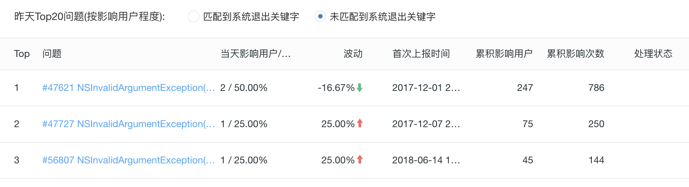

> <h2 id=''></h2>
- [**崩溃捕获**](#崩溃捕获)
	- [日志收集](#日志收集)
		- [处理收集不到的崩溃信息](#处理收集不到的崩溃信息)
		- [分析解决崩溃](#分析解决崩溃)
	- [**OOM内存超出**](#OOM内存超出)
		- [iOS系统如何发现Jetsam](#iOS系统如何发现Jetsam)
		- [XNU 获取内存限制值](#XNU获取内存限制值)
		- [通过内存警告获取内存限制值](#通过内存警告获取内存限制值)
		- [定位内存问题信息收集](#定位内存问题信息收集)
- [**异常类型**](#异常类型)
	- [内存爆增解决](#内存爆增解决)
	- [库版本兼容](#库版本兼容)
	- [没有导入文件或者类库](#没有导入文件或者类库)
	- [添加新账户或者验证账户是否具有有效凭证](#添加新账户或者验证账户是否具有有效凭证)
	- [模拟器可运行,真机无法运心](#模拟器可运行真机无法运心)
	- [再次添加内购不被审核](#再次添加内购不被审核)
	- [地理位置导致构建失败](#地理位置导致构建失败)


<br/>
<br/>
<br/>

***
<br/>

> <h1 id='崩溃捕获'>崩溃捕获</h1>

<br/>

- **1.常见崩溃**

	- 数组越界：在取数据索引时越界，App 会发生崩溃。还有一种情况，就是给数组添加了 nil 会崩溃。
	- 多线程问题：在子线程中进行 UI 更新可能会发生崩溃。多个线程进行数据的读取操作，因为处理时机不一致，比如有一个线程在置空数据的同时另一个线程在读取这个数据，可能会出现崩溃情况。
	- 主线程无响应：如果主线程超过系统规定的时间无响应，就会被 Watchdog 杀掉。这时，崩溃问题对应的异常编码是 0x8badf00d。关于这个异常编码，我还会在后文和你说明。
	- 野指针：指针指向一个已删除的对象访问内存区域时，会出现野指针崩溃。野指针问题是需要我们重点关注的，因为它是导致 App 崩溃的最常见，也是最难定位的一种情况。

<br/>

- **2.可捕获和不可捕获异常**
	- 可捕获异常(通过信号捕获)
		- KVO 问题
		- NSNotification 线程问题
		- 数组越界
		- 野指针等崩溃信息
	- 不可捕获异常(无法通过信号捕获)
		- 后台任务超时
		- 内存被打爆
		- 主线程卡顿超阈值等信息


<br/>
<br/>


> <h2 id='日志收集'>日志收集</h2>

- **1.Xcode收集**

&emsp; 收集崩溃日志最简单的方法，就是打开 Xcode 的菜单选择 Product -> Archive。如下图所示：


&emsp; 然后，在提交时选上“Upload your app’s symbols to receive symbolicated reports from Apple”，以后你就可以直接在 Xcode 的 Archive 里看到符号化后的崩溃日志了。


<br/>


- **2.开源库收集**

&emsp; 但是上面通过Xcode查看日志的方式，每次都是纯手工的操作，而且时效性较差。所以，目前很多公司的崩溃日志监控系统，都是通过[PLCrashReporter](https://github.com/microsoft/plcrashreporter) 这样的第三方开源库捕获崩溃日志，然后上传到自己服务器上进行整体监控的。

&emsp; 而没有服务端开发能力，或者对数据不敏感的公司，则会直接使用 [Fabric](https://firebase.google.com/)或者[Bugly](https://bugly.qq.com/v2/)来监控崩溃。

<br/>

&emsp; 探索疑问: PLCrashReporter 和 Bugly 这类工具，是怎么知道 App 什么时候崩溃的？

&emsp; 崩溃日志里，你经常会看到下面这段说明：

```
Exception Type:        EXC_BAD_ACCESS (SIGSEGV)
```

<br/>

&emsp; 它表示的是，EXC_BAD_ACCESS 这个异常会通过 SIGSEGV 信号发现有问题的线程。虽然信号的种类有很多，但是都可以通过注册 signalHandler 来捕获到。其实现代码，如下所示：

```
void registerSignalHandler(void) {
    signal(SIGSEGV, handleSignalException);
    signal(SIGFPE, handleSignalException);
    signal(SIGBUS, handleSignalException);
    signal(SIGPIPE, handleSignalException);
    signal(SIGHUP, handleSignalException);
    signal(SIGINT, handleSignalException);
    signal(SIGQUIT, handleSignalException);
    signal(SIGABRT, handleSignalException);
    signal(SIGILL, handleSignalException);
}

void handleSignalException(int signal) {
    NSMutableString *crashString = [[NSMutableString alloc]init];
    void* callstack[128];
    int i, frames = backtrace(callstack, 128);
    char** traceChar = backtrace_symbols(callstack, frames);
    for (i = 0; i <frames; ++i) {
        [crashString appendFormat:@"%s\n", traceChar[i]];
    }
    NSLog(crashString);
}
```


&emsp; 上面这段代码对各种信号都进行了注册，捕获到异常信号后，在处理方法 handleSignalException 里通过 backtrace_symbols 方法就能获取到当前的堆栈信息。堆栈信息可以先保存在本地，下次启动时再上传到崩溃监控服务器就可以了。


先将捕获到的堆栈信息保存在本地，是为了实现堆栈信息数据的持久化存储。那么，为什么要实现持久化存储呢？


这是因为，在保存完这些堆栈信息以后，App 就崩溃了，崩溃后内存里的数据也就都没有了。而将数据保存在本地磁盘中，就可以在 App 下次启动时能够很方便地读取到这些信息。


<br/>
<br/>


> <h3 id='处理收集不到的崩溃信息'>3.处理收集不到的崩溃信息</h3>


你是不是经常会遇到这么一种情况，App 退到后台后，即使代码逻辑没有问题也很容易出现崩溃。而且，这些崩溃往往是因为系统强制杀掉了某些进程导致的，而系统强杀抛出的信号还由于系统限制无法被捕获到。


一般，在退后台时你都会把关键业务数据保存在内存中，如果保存过程中出现了崩溃就会丢失或损坏关键数据，进而数据损坏又会导致应用不可用。这种关键数据的损坏会给用户带来巨大的损失。

那么，后台容易崩溃的原因是什么呢？如何避免后台崩溃？怎么去收集后台信号捕获不到的那些崩溃信息呢？还有哪些信号捕获不到的崩溃情况？怎样监控其他无法通过信号捕获的崩溃信息？

<br/>
<br/>


**现在，带着下面五个问题,来探讨下**

- **1.后台崩溃的原因是什么**

iOS 后台保活的 5 种方式：Background Mode、Background Fetch、Silent Push、PushKit、Background Task。

- 使用 Background Mode 方式的话，App Store 在审核时会提高对 App 的要求。通常情况下，只有那些地图、音乐播放、VoIP 类的 App 才能通过审核。
- Background Fetch 方式的唤醒时间不稳定，而且用户可以在系统里设置关闭这种方式，导致它的使用场景很少。
- Silent Push 是推送的一种，会在后台唤起 App 30 秒。它的优先级很低，会调用 application:didReceiveRemoteNotifiacation:fetchCompletionHandler: 这个 delegate，和普通的 remote push notification 推送调用的 delegate 是一样的。
- PushKit 后台唤醒 App 后能够保活 30 秒。它主要用于提升 VoIP 应用的体验。
- Background Task 方式，是使用最多的。App 退后台后，默认都会使用这种方式。

接下来，我们就看一下，**Background Task 方式为什么是使用最多的，它可以解决哪些问题？**

&emsp; 在你的程序退到后台以后，只有几秒钟的时间可以执行代码，接下来就会被系统挂起。进程挂起后所有线程都会暂停，不管这个线程是文件读写还是内存读写都会被暂停。但是，数据读写过程无法暂停只能被中断，中断时数据读写异常而且容易损坏文件，所以系统会选择主动杀掉 App 进程。


而 Background Task 这种方式，就是系统提供了 beginBackgroundTaskWithExpirationHandler 方法来延长后台执行时间，可以解决你退后台后还需要一些时间去处理一些任务的诉求。


Background Task 方式的使用方法，如下面这段代码所示：

```
- (void)applicationDidEnterBackground:(UIApplication *)application {
    self.backgroundTaskIdentifier = [application beginBackgroundTaskWithExpirationHandler:^( void) {
        [self yourTask];
    }];
}
```

&emsp; 在这段代码中，yourTask 任务最多执行 3 分钟，3 分钟内 yourTask 运行完成，你的 App 就会挂起。 如果 yourTask 在 3 分钟之内没有执行完的话，系统会强制杀掉进程，从而造成崩溃，这就是为什么 App 退后台容易出现崩溃的原因。

后台崩溃造成的影响是未知的。持久化存储的数据出现了问题，就会造成你的 App 无法正常使用。


<br/>


- **2.如何避免后台崩溃呢？**

&emsp; App 退后台后，如果执行时间过长就会导致被系统杀掉。那么，如果我们要想避免这种崩溃发生的话，就需要严格控制后台数据的读写操作。比如，你可以先判断需要处理的数据的大小，如果数据过大，也就是在后台限制时间内或延长后台执行时间后也处理不完的话，可以考虑在程序下次启动或后台唤醒时再进行处理。


&emsp; 同时，App 退后台后，这种由于在规定时间内没有处理完而被系统强制杀掉的崩溃，是无法通过信号被捕获到的。这也说明了，随着团队规模扩大，要想保证 App 高可用的话，后台崩溃的监控就尤为重要了。

&emsp; 那么，**我们又应该怎么去收集退后台后超过保活阈值而导致信号捕获不到的那些崩溃信息呢？**

&emsp; 采用 Background Task 方式时，我们可以根据 beginBackgroundTaskWithExpirationHandler 会让后台保活 3 分钟这个阈值，先设置一个计时器，在接近 3 分钟时判断后台程序是否还在执行。如果还在执行的话，我们就可以判断该程序即将后台崩溃，进行上报、记录，以达到监控的效果


其他捕获不到的崩溃情况还有很多，主要就是内存打爆和主线程卡顿时间超过阈值被 watchdog 杀掉这两种情况。

其实，监控这两类崩溃的思路和监控后台崩溃类似，我们都先要找到它们的阈值，然后在临近阈值时还在执行的后台程序，判断为将要崩溃，收集信息并上报。关于这个阈值怎么获取可以通过利用Runloop进行卡顿监控、临近OOM分析内存来找到.

对于内存打爆信息的收集，你可以采用内存映射（mmap）的方式来保存现场。主线程卡顿时间超过阈值这种情况，你只要收集当前线程的堆栈信息就可以了。

<br/>
<br/>


> <h3 id='分析解决崩溃'>分析解决崩溃</h3>

&emsp; 我们采集到的崩溃日志，主要包含的信息为：进程信息、基本信息、异常信息、线程回溯。
- 进程信息：崩溃进程的相关信息，比如崩溃报告唯一标识符、唯一键值、设备标识；
- 基本信息：崩溃发生的日期、iOS 版本；
- 异常信息：异常类型、异常编码、异常的线程；
- 线程回溯：崩溃时的方法调用栈。

&emsp; 通常情况下，我们分析崩溃日志时最先看的是异常信息，分析出问题的是哪个线程，在线程回溯里找到那个线程；然后，分析方法调用栈，符号化后的方法调用栈可以完整地看到方法调用的过程，从而知道问题发生在哪个方法的调用上。


&emsp; 如下的调用栈图:


&emsp; 方法调用栈顶，就是最后导致崩溃的方法调用。完整的崩溃日志里，除了线程方法调用栈还有异常编码。异常编码，就在异常信息里。

&emsp; 一些被系统杀掉的情况，我们可以通过异常编码来分析。你可以在维基百科上，查看完整的[**异常编码**](https://en.wikipedia.org/wiki/Hexspeak)。这里列出了 44 种异常编码，但常见的就是如下三种：
- 0x8badf00d，表示 App 在一定时间内无响应而被 watchdog 杀掉的情况。
- 0xdeadfa11，表示 App 被用户强制退出。
- 0xc00010ff，表示 App 因为运行造成设备温度太高而被杀掉


&emsp; 0x8badf00d 这种情况是出现最多的。当出现被 watchdog 杀掉的情况时，我们就可以把范围控制在主线程被卡的情况。

&emsp; 0xdeadfa11 的情况，是用户的主动行为，我们不用太关注。

&emsp; 0xc00010ff 这种情况，就要对每个线程 CPU 进行针对性的检查和优化。关注下怎么减少 App 的电量消耗？


<br/>


&emsp; 除了崩溃日志外，崩溃监控平台还需要对所有采集上来的日志进行统计。我以腾讯的 Bugly 平台为例，和你一起看一下崩溃监控平台一般都会记录哪些信息，来辅助开发者追溯崩溃问题。


&emsp; 上图展示的就是整体崩溃情况的趋势图，你可以选择 App 的不同版本查看不同时间段的趋势。这个相当于总控台，能够全局观察 App 的崩溃大盘。

&emsp; 除了崩溃率，你还可以在这个平台上能查看次数、用户数等趋势。下图展示的是某一个 App 的崩溃在不同 iOS 系统、不同 iPhone 设备、App 版本的占比情况。这也是全局大盘观察，从不同维度来分析。


<br/>

有了全局大盘信息，一旦出现大量崩溃，你就需要明白是哪些方法调用出现了问题，需要根据影响的用户数量按照从大到小的顺序排列出来，优先解决影响面大的问题。如下图所示：




同时，每个崩溃也都有自己的崩溃趋势图、iOS 系统分布图等信息，来辅助开发者跟踪崩溃修复效果。


有了崩溃的方法调用堆栈后，大部分问题都能够通过方法调用堆栈，来快速地定位到具体是哪个方法调用出现了问题。有些问题仅仅通过这些堆栈还无法分析出来，这时就需要借助崩溃前用户相关行为和系统环境状况的日志来进行进一步分析。


<br/>
<br/>
<br/>

***
<br/>

> <h1 id='OOM内存超出'>OOM内存超出</h1>

&emsp; OOM，是 Out of Memory 的缩写，指的是 App 占用的内存达到了 iOS 系统对单个 App 占用内存上限后，而被系统强杀掉的现象。是由 iOS 的 Jetsam 机制导致的一种“另类”崩溃，并且日志无法通过信号捕捉到。

&emsp; JetSam 机制，指的就是操作系统为了控制内存资源过度使用而采用的一种资源管控机制。

&emsp; 我们都知道，物理内存和 CPU 对于手机这样的便携设备来说，可谓稀缺资源。所以说，在 iOS 系统的虚拟内存管理中，内存压力的管控就是一项很重要的内容。


<br/>
<br/>


> <h2 id='计算内存限制值'>计算内存限制值</h2>

可以通过**JetsamEvent日志计算内存限制值**, 若是想要了解不同机器在不同系统版本的情况下，对 App 的内存限制是怎样的，有一种方法就是查看手机中以 JetsamEvent 开头的系统日志（我们可以从设置 -> 隐私 -> 分析中看到这些日志）。

&emsp; 想要了解不同机器在不同系统版本的情况下，对 App 的内存限制是怎样的，有一种方法就是查看手机中以 JetsamEvent 开头的系统日志（我们可以从设置 -> 隐私 -> 分析中看到这些日志）。

&emsp; 在这些系统日志中，查找崩溃原因时我们需要关注 per-process-limit 部分的 rpages。rpages 表示的是 ，App 占用的内存页数量；per-process-limit 表示的是，App 占用的内存超过了系统对单个 App 的内存限制。


这部分日志的结构如下：

```
"rpages" : 89600,
"reason" : "per-process-limit",
```

&emsp; 从上面我们已经知道内存页数量  rpages 为 89600，只要再知道内存页大小的值，就可以计算出系统对单个 App 限制的内存是多少了。

&emsp; 内存页大小的值，我们也可以在 JetsamEvent 开头的系统日志里找到，也就是 pageSize 的值。如下图红框部分所示：


可以看到，内存页大小 pageSize 的值是 16384。接下来，我们就可以计算出当前 App 的内存限制值：pageSize * rpages / 1024 /1024 =16384 * 89600 / 1024 / 1024 得到的值是 1400 MB，即 1.4G。

这些 JetsamEvent 日志，都是系统在杀掉 App 后留在手机里的。在查看这些日志时，我们就会发现，很多日志都是 iOS 系统内核强杀掉那些优先级不高，并且占用的内存超过限制的 App 后留下的。

这些日志属于系统级的，会存在系统目录下。App 上线后开发者是没有权限获取到系统目录内容的，也就是说，被强杀掉的 App 是无法获取到系统级日志的，只能线下设备通过连接 Xcode 获取到这部分日志。获取到 Jetsam 后，就能够算出系统对 App 设置的内存限制值。


<br/>
<br/>


> <h2 id='iOS系统如何发现Jetsam'>iOS系统如何发现Jetsam</h2>

&emsp; iOS 系统会开启优先级最高的线程 vm_pressure_monitor 来监控系统的内存压力情况，并通过一个堆栈来维护所有 App 的进程。另外，iOS 系统还会维护一个内存快照表，用于保存每个进程内存页的消耗情况。

&emsp; 当监控系统内存的线程发现某 App 内存有压力了，就发出通知，内存有压力的 App 就会去执行对应的代理，也就是你所熟悉的 didReceiveMemoryWarning 代理。通过这个代理，你可以获得最后一个编写逻辑代码释放内存的机会。这段代码的执行，就有可能会避免你的 App 被系统强杀。


<br/>

**系统在强杀 App 前，会先做优先级判断。那么，这个优先级判断的依据是什么呢？**

&emsp; iOS 系统内核里有一个数组，专门用于维护线程的优先级。这个优先级规定就是：内核用线程的优先级是最高的，操作系统的优先级其次，App 的优先级排在最后。并且，前台 App 程序的优先级是高于后台运行 App 的；线程使用优先级时，CPU 占用多的线程的优先级会被降低。

&emsp; iOS 系统在因为内存占用原因强杀掉 App 前，至少有 6 秒钟的时间可以用来做优先级判断。同时，JetSamEvent 日志也是在这 6 秒内生成的。

除了 JetSamEvent 日志外，我们还可以通过 XNU 来获取内存的限制值。


<br/>
<br/>


> <h2 id='XNU获取内存限制值'>XNU获取内存限制值</h2>

在 XNU 中，有专门用于获取内存上限值的函数和宏。我们可以通过 memorystatus_priority_entry 这个结构体，得到进程的优先级和内存限制值。结构体代码如下：

```
typedef struct memorystatus_priority_entry {
  pid_t pid;
  int32_t priority;
  uint64_t user_data;
  int32_t limit;
  uint32_t state;
} memorystatus_priority_entry_t;
```

在这个结构体中，priority 表示的是进程的优先级，limit 就是我们想要的进程内存限制值。

<br/>


<br/>
<br/>


> <h2 id='通过内存警告获取内存限制值'>通过内存警告获取内存限制值</h2>

&emsp; 通过 XNU 的宏获取内存限制，需要有 root 权限，而 App 内的权限是不够的，所以正常情况下，作为 App 开发者你是看不到这个信息的。那么，如果你不想越狱去获取这个权限的话，还可以利用 didReceiveMemoryWarning 这个内存压力代理事件来动态地获取内存限制值。

iOS 系统在强杀掉 App 之前还有 6 秒钟的时间，足够你去获取记录内存信息了。**那么，如何获取当前内存使用情况呢？**

iOS 系统提供了一个函数 task_info， 可以帮助我们获取到当前任务的信息。关键代码如下：

```
struct mach_task_basic_info info;
mach_msg_type_number_t size = sizeof(info);
kern_return_t kl = task_info(mach_task_self(), MACH_TASK_BASIC_INFO, (task_info_t)&info, &size);
```

代码中，task_info_t 结构里包含了一个 resident_size 字段，用于表示使用了多少内存。这样，我们就可以获取到发生内存警告时，当前 App 占用了多少内存。代码如下：

```
float used_mem = info.resident_size;
NSLog(@"使用了 %f MB 内存", used_mem / 1024.0f / 1024.0f)
```


<br/>
<br/>


> <h2 id='定位内存问题信息收集'>定位内存问题信息收集</h2>

&emsp; 现在，我们已经可以通过JetsamEvent、XNU、内存警告3种方法来获取内存上限值了，而且通过内存警告的方式还能够动态地获取到这个值。有了这个内存上限值以后，你就可以进行内存问题的信息收集工作了。

&emsp; 要想精确地定位问题，我们就需要 dump 出完整的内存信息，包括所有对象及其内存占用值，在内存接近上限值的时候，收集并记录下所需信息，并在合适的时机上报到服务器里，方便分析问题。

&emsp; 获取到了每个对象的内存占用量还不够，你还需要知道是谁分配的内存，这样才可以精确定位到问题的关键所在。一个对象可能会在不同的函数里被分配了内存并被创建了出来，当这个对象内存占用过大时，如果不知道是在哪个函数里创建的话，问题依然很难精确定位出来。**那么，怎样才能知道是谁分配的内存呢？**

&emsp; 这个问题，我觉得应该从根儿上去找答案。内存分配函数 malloc 和 calloc 等默认使用的是 nano_zone。**nano_zone 是 256B 以下小内存的分配，大于 256B 的时候会使用 scalable_zone 来分配。**

&emsp; 针对不同的分配内存大小，我们可以主要针对大内存的分配监控，也就是只针对 scalable_zone 进行分析，同时也可以过滤掉很多小内存分配监控。比如，malloc 函数用的是 malloc_zone_malloc，calloc 用的是 malloc_zone_calloc。

&emsp; 使用 scalable_zone 分配内存的函数都会调用 malloc_logger 函数，因为系统总是需要有一个地方来统计并管理内存的分配情况。

&emsp; 具体实现的话，你可以查看 malloc_zone_malloc 函数的实现，代码如下：

```
void *malloc_zone_malloc(malloc_zone_t *zone, size_t size)
{
  MALLOC_TRACE(TRACE_malloc | DBG_FUNC_START, (uintptr_t)zone, size, 0, 0);
  void *ptr;
  if (malloc_check_start && (malloc_check_counter++ >= malloc_check_start)) {
    internal_check();
  }
  if (size > MALLOC_ABSOLUTE_MAX_SIZE) {
    return NULL;
  }
  ptr = zone->malloc(zone, size);
  // 在 zone 分配完内存后就开始使用 malloc_logger 进行进行记录
  if (malloc_logger) {
    malloc_logger(MALLOC_LOG_TYPE_ALLOCATE | MALLOC_LOG_TYPE_HAS_ZONE, (uintptr_t)zone, (uintptr_t)size, 0, (uintptr_t)ptr, 0);
  }
  MALLOC_TRACE(TRACE_malloc | DBG_FUNC_END, (uintptr_t)zone, size, (uintptr_t)ptr, 0);
  return ptr;
}

```

在这个结构体中，priority 表示的是进程的优先级，limit 就是我们想要的进程内存限制值。


&emsp; 其他使用 scalable_zone 分配内存的函数的方法也类似，所有大内存的分配，不管外部函数是怎么包装的，最终都会调用 malloc_logger 函数。这样的话，问题就好解决了，你可以使用 fishhook 去 Hook 这个函数，加上自己的统计记录就能够通盘掌握内存的分配情况。出现问题时，将内存分配记录的日志捞上来，你就能够跟踪到导致内存不合理增大的原因了。

<br/>
<br/>

&emsp; 为什么用于占用内存过大时会被系统强杀呢？macOS 打开一堆应用也会远超物理内存，怎么没见系统去强杀 macOS 的应用呢？

&emsp; 其实，这里涉及到的是设备资源的问题。苹果公司考虑到手持设备存储空间小的问题，在 iOS 系统里去掉了交换空间，这样虚拟内存就没有办法记录到外部的存储上。于是，苹果公司引入了 MemoryStatus 机制。

&emsp; 这个机制的主要思路就是，在 iOS 系统上弹出尽可能多的内存供当前应用使用。把这个机制落到优先级上，就是先强杀后台应用；如果内存还不够多就强杀掉当前应用。而在 macOS 系统里，MemoryStatus 只会强杀掉标记为空闲退出的进程。

&emsp; 在实现上，MemoryStatus 机制会开启一个 memorystatus_jetsam_thread 的线程。这个线程，和内存压力监测线程 vm_pressure_monitor 没有联系，只负责强杀应用和记录日志，不会发送消息，所以内存压力检测线程无法获取到强杀应用的消息。

&emsp; 在实现上，MemoryStatus 机制会开启一个 memorystatus_jetsam_thread 的线程。这个线程，和内存压力监测线程 vm_pressure_monitor 没有联系，只负责强杀应用和记录日志，不会发送消息，所以内存压力检测线程无法获取到强杀应用的消息。


&emsp; 除内存过大被系统强杀这种内存问题以外，还有以下三种内存问题：
- 访问未分配的内存： XNU 会报 EXC_BAD_ACCESS 错误，信号为 SIGSEGV Signal #11 。
- 访问已分配但未提交的内存：XNU 会拦截分配物理内存，出现问题的线程分配内存页时会被冻结。
- 没有遵守权限访问内存：内存页面的权限标准类似 UNIX 文件权限。如果去写只读权限的内存页面就会出现错误，XNU 会发出 SIGBUS Signal #7 信号。

&emsp; 第一种和第三种问题都可以通过崩溃信息获取到，在收集崩溃信息时如果发现是这两类，我们就可以把内存分配的记录同时传过来进行分析，对于不合理的内存分配进行优化和修改。


<br/>
<br/>
<br/>

***
<br/>

> <h1 id='异常类型'>异常类型</h1>

- **EXC_BAD_ACCESS/KERN_INVALID_ADDRESS** 访问未分配的内存地址造成，多是由数据访问或提取指令触发 
- **EXC_BAD_ACCESS/KERN_PROTECTION_FAILURE** 向只读区域写数据造成 
- **EXC_BAD_INSTRUCTION** 线程执行了非法指令 
- **EXC_ARITHMETIC/EXC_I386_DIV** 在基于 intel 计算机上执行了除零操作


<br/>
<br/>


> <h2 id='内存爆增解决'>内存爆增解决</h2>

<br/>

- **1.图片内存过大,导致App崩溃**

**Message from debugger: Terminated due to memory issue**

&emsp; 内存一直增长，导致无法释放，程序闪退。   使用Instrument的Allocations检查内存增长，对于一些临时产生的对象使用@autorelease进行释放。

**选择Allocations**


<br/>

**Allocations 配置**


<br/>

**选择真机，运行查找内存Boss**


**`解决方法：清理内存`**

```
- (void)didReceiveMemoryWarning {
    [super didReceiveMemoryWarning];
    
    //bug: 加载太多图片crash
    [SDImageCache sharedImageCache].config.shouldCacheImagesInMemory = NO;
    [[SDImageCache sharedImageCache] clearDiskOnCompletion:nil];
    [[SDImageCache sharedImageCache] clearMemory];
}

```


<br/>
<br/>


> <h2 id='库版本兼容'>库版本兼容</h2>

**The iOS Simulator deployment target is set to x.x, but the range of supported deployment target versions for this platform is 8.0 to 12.0. (in target 'xxx')**

```
post_install do |installer|
  installer.pods_project.targets.each do |target|
 target.build_configurations.each do |config|
  if config.build_settings['IPHONEOS_DEPLOYMENT_TARGET'].to_f < 8.0
    config.build_settings['IPHONEOS_DEPLOYMENT_TARGET'] = '8.0'
     end
   end
  end
end
```

&emsp; 将这个判断添加到Podfile文件的最后，然后执行pod install，再次运行项目，你会发现整个世界都清净了。   

&emsp; 上面对第三方库进行了判断若DEPLOYMENT_TARGET<8.0就会切换成8.0，可以说是一劳永逸，下次苹果再去提高最低版本只需要修改版本号就可以了。


<br/>
<br/>


> <h2 id='没有导入文件或者类库'>没有导入文件或者类库</h2>

![缺失文件或没有配置好][image-1]


<br/>
<br/>

> <h2 id='添加新账户或者验证账户是否具有有效凭证'>添加新账户或者验证账户是否具有有效凭证</h2>

![账户不正确存在问题][image-2]

`解决方案，请看下图：`
![融云demo下载，账户不正确问题的修改][image-3]


<br/>
<br/>


> <h2 id='模拟器可运行真机无法运心'>模拟器可运行,真机无法运心</h2>


&emsp; **模拟器可以运行真机不可以运行(反之模拟器不能运行，真机可以)报错：Undefined symbols for architecture i386:**

![报错截图][image-4]

解决方案：
![Build Active Architecture Only 的 Release 模式修改为 Yes][image-5]

`原因：`这是我当初在勾选了自动签名

![选择自动签名][image-6]

修改了自动签名时的代码签名导致的。

![修改代码签名导致][image-7]


<br/>
<br/>

> <h2 id='再次添加内购不被审核'>再次添加内购不被审核</h2>


&emsp;项目初建时添加的苹果内购项目，通过提交二进制代码通过审核批准后的内购项目。

![第一次内购审核通过后][image-8]

&emsp;  上图可以看到已通过的内购项目如绿色圆圈显示的。

&emsp;  当第二次更新APP版本并且又增加了内购项目时，我们需要`提前`在Appstore Connect -\> 我的App -\>App Store的
![版本或平台][image-9]上新建一个版本，然后在
![App 内购买项目][image-10]上添加新的内购项目。`若是没有建立新的版本`，苹果会把审核视为上一版本的内购，当他审核时会找不到，就会报错让你再次提交二进制代码。
 
&emsp;  结果就是你傻傻的提交，但是它还是报错，让你抓狂不已，叫天天不应，叫地地不灵！


正确的方法是：
- ①.建立新的版本，先放在那；
- ②.在![App 内购买项目][image-11]上添加你的内购信息，然后存储(千万不要点击`提交已审核`，若点了他会把这个内购视为你的上一个版本，你又做了无用功);
- ③.当你的这个版本开发完成后，提交二进制到App Store了，构建版本成功了，如下图：![2.3.5的版本][image-12]
你往下拉网页，你会看到![添加购买项目][image-13]
就像新添加的一样，你点击那个蓝色加号就会看见你这个版本要添加的IAP了，选择你要这次审核的IAP就好了。成功后的图为：![2.3.3版本的内购项目部分][image-14]


&emsp;  就为了这东西，上下了折腾了3次，烦死了！！！！


<br/>
<br/>


> <h2 id='地理位置导致构建失败'> 地理位置导致构建失败</h2>

&emsp; 地理位置隐私数据要求访问，但是没有提示，导致构建失败

`错误提示：`Your delivery was successful, but you may wish to correct the following issues in your next delivery:
Missing Purpose String in Info.plist File - Your app's code references one or more APIs that access sensitive user data. `The app's Info.plist file should contain a NSLocationAlwaysUsageDescription key with a user-facing purpose string explaining clearly and completely why your app needs the data.`Starting Spring 2019, all apps submitted to the App Store that access user data will be required to include a purpose string.

&emsp;  当时我看到了`NSLocationAlwaysUsageDescription`这个，就在APP内的 `Info.plist`文件中添加这个字段，然后打包，结果还是提示上述问题，而且
`NSLocationAlwaysUsageDescription`也没变。后来查了别人的博客才知道，原来使用一些第三方API(如：高德地图SDK)会要求定位，所以按照下图所示：

这几个访问地理字段的都有才可以：
	
	    <key>NSLocationAlwaysAndWhenInUseUsageDescription</key>
		<string>太极.道需要您的同意，才能使用GPS</string>
	
		<key>NSLocationAlwaysUsageDescription </key>
		<string>太极.道需要您的同意，才能始终访问位置</string>
	
		<key>NSLocationUsageDescription</key>
		<string>太极.道需要您的同意，才能访问位置</string>
	
		<key>NSLocationWhenInUseUsageDescription</key>
		<string>太极.道需要您的同意，才能在使用期间访问位置</string>

&emsp;  添加完以后，再次打包，上传到Appstore，在提交审核的地方等个15分钟，发现了要构建的新版本了。

[image-1]:	https://upload-images.jianshu.io/upload_images/2959789-c5a5b4882b2146f5.png?imageMogr2/auto-orient/strip%7CimageView2/2/w/1240
[image-2]:	https://upload-images.jianshu.io/upload_images/2959789-5882fd3cd40e8055.png?imageMogr2/auto-orient/strip%7CimageView2/2/w/1240
[image-3]:	https://upload-images.jianshu.io/upload_images/2959789-15feec72a369a7df.png?imageMogr2/auto-orient/strip%7CimageView2/2/w/1240
[image-4]:	https://upload-images.jianshu.io/upload_images/2959789-f56b99b7923d0dd8.png?imageMogr2/auto-orient/strip%7CimageView2/2/w/1240
[image-5]:	https://upload-images.jianshu.io/upload_images/2959789-4dcf8c80c66273a4.png?imageMogr2/auto-orient/strip%7CimageView2/2/w/1240
[image-6]:	https://upload-images.jianshu.io/upload_images/2959789-59f4ee92a049c28b.png?imageMogr2/auto-orient/strip%7CimageView2/2/w/1240
[image-7]:	https://upload-images.jianshu.io/upload_images/2959789-c1ba393f4cda301d.png?imageMogr2/auto-orient/strip%7CimageView2/2/w/1240
[image-8]:	https://upload-images.jianshu.io/upload_images/2959789-06a341638688b839.png?imageMogr2/auto-orient/strip%7CimageView2/2/w/1240
[image-9]:	https://upload-images.jianshu.io/upload_images/2959789-4b7b26e583c561ad.png?imageMogr2/auto-orient/strip%7CimageView2/2/w/1240
[image-10]:	https://upload-images.jianshu.io/upload_images/2959789-7aa044908bc9a770.png?imageMogr2/auto-orient/strip%7CimageView2/2/w/1240
[image-11]:	https://upload-images.jianshu.io/upload_images/2959789-7aa044908bc9a770.png?imageMogr2/auto-orient/strip%7CimageView2/2/w/1240
[image-12]:	https://upload-images.jianshu.io/upload_images/2959789-e901c1bcfc084515.png?imageMogr2/auto-orient/strip%7CimageView2/2/w/1240
[image-13]:	https://upload-images.jianshu.io/upload_images/2959789-f6e935e654844802.png?imageMogr2/auto-orient/strip%7CimageView2/2/w/1240
[image-14]:	https://upload-images.jianshu.io/upload_images/2959789-22f47a262f781570.png?imageMogr2/auto-orient/strip%7CimageView2/2/w/1240


<br/>
<br/>


> <h2 id=''></h2>


<br/>
<br/>


> <h2 id=''></h2>


<br/>
<br/>
<br/>

***
<br/>

> <h1 id=''></h1>


<br/>
<br/>
<br/>

***
<br/>

> <h1 id=''></h1>


