> <h2 id=''></h2>
- [**知识预备**](#知识预备)
	- [Creat groups、Create folder references和copy item if needed区别](#CreatgroupsCreatefolderreferences和copyitemifneeded区别)
	- [代码分发方式](#代码分发方式)
	- [各个语言编译流程](#各个语言编译流程)
- [**语言编译流程**](#语言编译流程)
	- [将程序编译成可执行文件的步骤](#将程序编译成可执行文件的步骤)
- [**静态库和动态库**](#静态库和动态库)
	- [Build Settings配置](#BuildSettings配置)
		- [Header Search Paths 与 User Header Search Paths 区别](#HeaderSearchPaths与UserHeaderSearchPaths区别)
		- [Library search path和Framewrok Search Path区别](#Librarysearchpath和FramewrokSearchPath区别)
			- [inherited](#inherited)
			- [non-recursive和recursive](#non-recursive和recursive)
		- [Other Linker Flags](#OtherLinkerFlags)
	- [引入库出现问题](#引入库出现问题)
		- [warning：ld: warning: directory not found for option '-L'.](#警告一)
	- [设备架构](#设备架构)
	- [Xcode理解](#Xcode理解)
	- [动、静态库知识预备](#动、静态库知识预备)
		- [静态库与动态库的区别](#静态库与动态库的区别)
	- [静、动态库打包](#静、动态库打包)
		- [静态库.a生成](#静态库.a生成)
			- [解决没有Products文件夹](#解决没有Products文件夹)
			- [静态库脚本合并模拟器、真机](#静态库脚本合并模拟器真机)
			- [framework创建](#framework创建)
		- [静态库.framework生成](#静态库.framework生成)
			- [5.加入公共头文件](#5.加入公共头文件)
			- [问题](#问题)
				- [引入外部静态库头文件找不到](#引入外部静态库头文件找不到)
	- [主工程和静态库的联调](#主工程和静态库的联调)
		- [工程内拖入Framework](#工程内拖入Framework)
		- [xcworkspace联调试](#xcworkspace联调试)
- [**静态库**](#静态库)
- [**动态库**](#动态库)
	- [tbd格式](#tbd格式)
	- [Framework](#Framework)
	- [Mach-o格式](#Mach-o格式)
	- [动态库打包](#动态库打包)
		- [动态库脚本合并模拟器、真机](#动态库脚本合并模拟器真机)
		- [Embed&Signing嵌入和签名](#Embed&Signing嵌入和签名)
			- [命令判断动态库和静态库](#命令判断动态库和静态库)
- [**自动打包**](#自动打包)
	- [上传蒲公英脚本](#上传蒲公英脚本)
- **参考资料**
	- [LLVM&Clang入门](https://juejin.cn/post/6844903748435705864)
	- [iOS深入浅出编译](https://github.com/LeoMobileDeveloper/Blogs/blob/master/Compiler/xcode-compile-deep.md)
	- [Umbrella Framework框架](http://chuquan.me/2021/02/14/understand-ios-library-and-framework/)
	- [Cocoapods 静态库/动态库相关配置的使用(简书)](https://www.jianshu.com/p/dd0e281d84bb)
	- [iOS开发——创建你自己的Framework(简书)](https://www.jianshu.com/p/544ccde0cbd2)


<br/>

***
<br/>

> <h1 id='知识预备'>知识预备</h1>


<br/><br/>

> <h2 id='CreatgroupsCreatefolderreferences和copyitemifneeded区别'>Creat groups和Create folder references和copy item if needed区别区别</h2>

- Creat groups :一般添加代码,因为groups下的cpp文件是会被编译的(所以这个用来添加代码中的类文件)

<br>

- Create folder references: 一般是资源文件,比如图片啥的
正确的是先把文件放入项目中的文件夹,然后再add File进行添加
之前都是野路子

    &emsp; **Create folder references**只是将文件单纯的创建了引用，这些文件不会被编译，所以在使用的时候需要加入其路径，比如在我们想要使用上图中的myScripts文件夹下面有某个头文件，则需要按照下面的方法添加声明：

```
#include myScripts/xxx.h
```

否则编译器就会告诉你找不到xxx.h文件。

这就是项目中黄色文件夹与蓝色文件夹的区别以及使用方法


<br/>


- copy item if needed

&emsp; 至于Destination对应【copy item if needed】 选项,

- 1、当你选择了这个选项时，如果你想要引入的文件不在你的项目文件的目录下，Xcode则会自动将这个文件复制一份拷贝到你的项目的目录下

- 2、如果你不选择，并且这个文件也并不在你的项目目录下，那么这个文件仍然可以被使用，但是一旦你将项目拷贝到了别的地方时，这个文件就会找不到了。因为这个文件在你的电脑中，而不在你的项目中。


<br/>
<br/>


> <h2 id='代码分发方式'>代码分发方式</h2>


**库可分为开源库和闭源库:**
- 开源库：对外公开源代码, 能看到具体的代码实现, 例如Github上面的第三方开源库都称之为开源库
- 闭源库：不公开源代码, 文件是经过编译后的二进制文件, 看不到具体实现.可分为静态库和动态库

<br/>

> <h2 id='各个语言编译流程'>各个语言编译流程</h2>


<br/>

***
<br/>


> <h1 id='语言编译流程'>语言编译流程</h1>

<br/>

> <h2 id='将程序编译成可执行文件的步骤'>将程序编译成可执行文件的步骤</h2>

- 将程序编译成可执行文件的步骤

```
cd 项目文件夹

clang -ccc-print-phases main.m 
```


<br/>

&emsp; MacOS采用的是均为clang编译器，安装路径在Xcode中，其头文件也均在Xcode中默认路径usr/include/c++中，如果需要引用头文件，可以直接将其复制到该路径。[深入浅出iOS编译](https://github.com/LeoMobileDeveloper/Blogs/blob/master/Compiler/xcode-compile-deep.md)


- **经历的步骤是: `源代码=>预处理器=>编译器=>汇编=>机器码=>链接=>可执行文件`**

	- 预处理（Pre-process）：把宏替换，删除注释，展开头文件，产生 .i 文件。
	
	- 编译（Compliling）：把之前的 .i 文件转换成汇编语言，产生 .s文件。
	
	- 汇编（Asembly）：把汇编语言文件转换为机器码文件，产生 .o 文件。
	
	- 链接（Link）：对.o文件中的对于其他的库的引用的地方进行引用，生成最后的可执行文件（同时也包括多个 .o 文件进行 link）。


<br/>

> **configure/make/make install的作用-摘录**

- **1). configure命令**

	- 这一步一般用来生成 Makefile，为下一步的编译做准备，你可以通过在 configure 后加上参数来对安装进行控制，比如代码:./configure –prefix=/usr 意思是将该软件安装在 /usr 下面，执行文件就会安装在 /usr/bin （而不是默认的 /usr/local/bin),资源文件就会安装在 /usr/share（而不是默认的/usr/local/share）。
	
	- 同时一些软件的配置文件你可以通过指定 –sys-config= 参数进行设定。有一些软件还可以加上 –with、–enable、–without、–disable 等等参数对编译加以控制，你可以通过允许 ./configure –help 察看详细的说明帮助。

- **2).make([CMake扫盲](https://www.hahack.com/codes/cmake/))**

	- make命令执行时，需要一个makefile文件，以告诉make命令需要怎么样的去编译和链接程序。
	
	- 比如某个工程有8个c文件，和3个头文件，我们要写一个makefile来告 诉make命令如何编译和链接这几个文件。我们的规则是：
	
	- 如果这个工程没有编译过，那么我们的所有c文件都要编译并被链接。
	如果这个工程的某几个c文件被修改，那么我们只编译被修改的c文件，并链接目标程序。
	如果这个工程的头文件被改变了，那么我们需要编译引用了这几个头文件的c文件，并链接目标程序。

- **3).make insatll**

	- 这条命令来进行安装（当然有些软件需要先运行 make check 或 make test 来进行一些测试），这一步一般需要你有 root 权限（因为要向系统写入文件）。


<br/>


<br/>

***
<br/>


> <h1 id='静态库和动态库'>静态库和动态库</h2>


<br/><br/>

> <h2 id='BuildSettings配置'>Build Settings配置</h2>

在加入动、静态库或者自己制作动、静态库引入外部的动静态库时要配置搜索路径,比如: Header Searh Paths、Framework Search Paths进行配置.

<br/><br/>

> <h3 id='HeaderSearchPaths与UserHeaderSearchPaths区别'>Header Search Paths 与 User Header Search Paths 区别</h3>

Header Search Paths 和 User Header Search Paths 是具有同样功能都是管理导入头文件路径的.


<br/>


区别在于在于 import 或者 include 头文件时,
Header Search Paths 会比User Header Search Paths多一种方式.

Header Search Paths 方式:

```
#import <SomeClass.h>
#import "SomeClass.h"
```


User Header Search Paths方式:

```
#import "SomeClass.h"
```


<br/>

&emsp; 若在Header Search Paths中设置SomeClass的路径后, 上面两种方式都可以使用. 但是若在User Header Search Paths中设置后, #import <SomeClass.h> 就会编译报错（include也是一样）.

&emsp; 具体一点的区别是，<>是从系统目录空间 （对应Header Search Paths）中搜索文件，" " 是从用户目录空间（对应 User Header Search Paths）中搜索文件。如果你把路径加到User Header Search Paths 中，而 <>无法从系统目录空间中找到新加的路径，从而报错


<br/>


Xcode 的 **Build Settings** 下 **Search Paths** 设置搜索路径，Header Search Paths:头文件搜索路径设置

```
$(SRCROOT) 和 $(PROJECT_DIR) 都指xxx.xcodeproj所在的父目录
```

例如：引用工程testDemo/scr/test.h 头文件，

**注意：**

- 如果在Header Search Paths中添加$(SRCROOT)/scr，那么头文件引用直接引用 include "test.h"

- 如果在Header Search Paths中添加$(SRCROOT)/，那么头文件引用直接引用 include "scr/test.h"

- 一般工作中我们最好都使用相对路径，这样在共同开发项目时，防止发生路径错误问题。


Library / Header Search Paths中写法：

```
$(SRCROOT) / 当前工程名字 / 需要包含头文件所在文件夹
```

如图:


文件夹路径如下:


<br/><br/>

> <h3 id='Librarysearchpath和FramewrokSearchPath区别'>Library search path和Framewrok Search Path区别</h3>

- **Library Search Paths** 管理导入的*.a的路径

- **Framework Search Paths** 管理导入的*.framework的路径


&emsp; 当我们做静态库引入外部的静态库.a文件时,只能用Library Search Paths进行路径的配置;

&emsp; 当动、静态库引入第三方的动、静态库事就需要用Framework Search Paths这个配置了,否则我们的动静态库就无法找到了.当时第一次做静态库引入其他的动、静态库时就因为这个没有配置了,犯下了很低级的错误!哎!


如图:


文件夹路径如下:


<br/>


**扩展**

- 1.其实还有另一个设置Always Search User Paths, 如果出现上面这样的错误, 这时把Always Search User Paths设置成 Yes，强制也import<> 也在User Header Search Paths搜索。 但是现在这个设置已经废弃了, 也不必过多探究了.

- 2.c / c++ 头文件引用问题
	- include <> 引用编译器的类库路径下的头文件
	- include "" 引用工程目录的相对路径的头文件
	- include 是编译指令，在编译时，编译器会将相对路径替换成绝对路径，因此，头文件绝对路径 = 搜索路径 + 相对路径


<br/><br/>

> <h4 id='inherited'>inherited</h4>

在Framework Search Path中添加 $(inherited)参数会从PROJECT -> Build Settings -> Framework Search Paths`里面的路径会被其继承，没有的话不会继承。

所以一个项目里面有多个target，使用到了同一个库(Library或Framework)那么为了方便我们可以在target添加继承参数，并且PROJECT统一中添加库的路径。


<br/><br/>


> <h4 id='non-recursive和recursive'>non-recursive和recursive</h4>


- non-recursive：默认路径设置，不遍历该目录。

- recursive：遍历该目录，如果路径的属性为recursive，那么编译的时候在找库的路径的时候，会遍历该目录下的所有子目录的库文件。


<br/><br/>

> <h3 id='OtherLinkerFlags'>Other Linker Flags</h3>


在项目中我们经常在**Other Linker Flags**加入 **-ObjC** 或者 **-all_load** 或者 **-force_load**,那么这3者有什么用呢?可以用来解决什么呢?


在ios开发中，我们经常会使用到第三方的一些静态库,导入第三方类库运行程序后你会发现,编译时可以正常编译但是运行时会app会闪退,报出

```
selector not recognized的错误
```

一般的第三方库的开发文档中都会写出这种问题的解决方法,在Other Linker Flags中加入-ObjC或者-all_load或者-force_load这样的解决方法。

- **-ObjC**
	- 一般这个参数足够解决前面提到的问题,这个flag告诉链接器把库中定义的Objective-C类和Category都加载进来。这样编译之后的app会变大,因为加载了很多不必要的文件而导致可执行文件变大。但是如果静态库中有类和category的话只有加入这个flag才行,但是Objc也不是万能的,当静态库中只有分类而没有类的时候,Objc就失效了,这就需要使用-all_load或者-force_load了。

- **-all_load**
	- -all_load会强制链接器把目标文件都加载进来，即使没有objc代码。但是这个参数也有一个弊端,那就是你使用了不止一个静态库文件，那么你很有可能会遇到ld: duplicate symbol错误，因为不同的库文件里面可能会有相同的目标文件 这里会有两种方法解决 1:用命令行就行拆包. 2:就是用下面的这个参数

- **-force_load**
	- 这个flag所做的事情跟-all_load其实是一样的，只是-force_load需要指定要进行全部加载的库文件的路径，这样的话，你就只是完全加载了一个库文件，不影响其余库文件的按需加载 .


<br/><br/>

> <h2 id='引入库出现问题'>引入库出现问题</h2>


<br/><br/>

> <h3 id='警告一'>warning：ld: warning: directory not found for option '-L'.</h3>

```
warning：ld: warning: directory not found for option '-L'.
```

问题:通常是Path问题.

解决:

**Taraget->Build Settings->Library Search Paths 和 Framework Search Paths,删掉编译报warning的路径即OK**


<br/><br/>

> <h3 id=''></h3>


<br/><br/>

> <h3 id=''></h3>


<br/><br/>

> <h3 id=''></h3>


<br/><br/>

> <h3 id=''></h3>


<br/><br/>

> <h3 id=''></h3>


<br/><br/>

> <h3 id=''></h3>


<br/><br/>


> <h2 id='设备架构'> 设备架构</h2>

|**模拟器CPU架构**||
|:--|:--|
|CPU类型|模拟器机型|
| i386 | iPhone4s、 iPhone5、iPhone5C |
| x86_64 | iPhone5s模拟器以上|


<br/>


|    **真机CPU架构**||
|:--|:--|
| armv6 | iPhone、iPhone 2、iPhone 3G、iPod Touch |
| armv7 | iPhone3Gs、 iPhone4s |
| armv7s | iPhone5、iPhone5c |
| armv64 | iPhone5s以上真机|


<br/>


|    **CPU架构演进**|||
|:--|:--|:--|
| 年份 | 芯片 | 架构 | 设备 |
| 2013 | A7 | arm64 | iPhone 5S |
| 2014 | A8 | arm64 | iPhone 6/6P |
| 2015 | A9 | arm64 | iPhone 6S/6SP |
| 2016 | A10 | arm64 | iPhone 7/7SP |
| 2017 | A11 | arm64 | iPhone 8/8SP/X |
| 2018 | A12 | arm64e | iPhone XS/XS Max/XR |

<br/>

&emsp; 理论上指令集是向下兼容的，比如连接设备为 arm64，那么是有可能编译出的动态库所支持的指令集为 armv7s 或者是 armv7。但是向下兼容并不是说一个 armv7s 的动态库可以用在 arm64 架构的设备上，如果连接的设备是 arm64 的，而导入的动态库是没有支持 arm64，那么在编译阶段即会报错。


<br/>


> <h2 id='Xcode理解'>Xcode理解</h2>

xcode本质上是大号的脚本，Xcode编译的时候有下面的几个步骤：

```
1.编译产物路径
2.VFS
3.copy -》编译产物路径/headers
4.clang（包括汇编/链接器）-〉 exc（可执行文件）
5. sign（对付好的签名）
6. strip（符号处理）
```

&emsp; xcconfig （控制这个build setting）-> build setting（控制上面的6步的流程）

&emsp;上述的6个步骤需要在 shell环境下进行执行，但是执行的时候肯定需要参数配置吧，那样就在build setting里进行配置:
shell环境 => 环境变量（也就是build setting参数）


> <h2 id=''></h2>


> <h2 id='动、静态库知识预备'>动、静态库知识预备</h2>

<br/>

>静态库与动态库本质

<br/>

> <h3 id='静态库与动态库的区别'>静态库与动态库的区别</h3>

- **静态库：**
	- 在链接时，Xcode会自动从库文件中，筛选出相应的架构，之后合并到主程序的二进制文件中；
	- 在打包时，Xcode会自动忽略库文件中不使用的架构，如会忽略x86_64等模拟器使用的架构；
	- 链接时完整地拷贝至可执行文件中，被多次使用就有多份冗余拷贝，存在形式：.a和.framework


<br/>

- **动态库：**
	- 在编译时，Xcode会直接拷贝整个动态framework文件到最终的.ipa中，只有在App真正启动运行时，才会进行动态链接；
	- 但是苹果不允许上传到App Store Connect后台的.ipa包含x86_64等模拟器的架构（报Invalid错误）；所以对于工程中的动态framework，在打Release包时，一般会通过执行命令脚本的方式移除这些Invalid Architectures；
	- 通过CocoaPods集成动态库时，其会自动添加一个shell脚本（[CP] Embed Pods Frameworks），用于移除不需要的架构；
	- 通过Carthage集成动态库时，需要手动配置相关shell脚本，用于移除不需要的架构；
	- 链接时不会拷贝至可执行文件中，程序运行时由系统动态加载到内存以供程序调用，系统只加载一次，多个程序共用，可以节省内存。存在形式：.dylib和.framework

<br/><br/>

> 格式:
> - 静态库：
	>- 以.a 和 .framework为文件后缀名
	>- .a库：使用时需要将.h头文件及资源文件（比如图片等）拖入到工程项目中，配置一些header、lib路径之类的；使用起来比较麻烦；
	>- .framework库：Apple平台独有，其本质是将.a库文件、.h头文件及资源文件打包在一起的包文件；使用时直接将其拖到工程项目中即可，或在 General -> Link Binary With Libraries 中添加使用；
- 动态库：
	>- .tdb库：Xcode 7（iOS9）开始使用，之前名称为.dylib；在 General -> Link Binary With Libraries 中添加使用；
	>- .framework库：必须在 General -> Embedded Binaries 中添加使用；

解释:
- .a是一个纯二进制文件
- .framework中除了有二进制文件之外还有资源文件
- .a 要有 .h 文件以及资源文件配合， .framework 文件可以直接使用。总的来说，`.framework = .a + .h + sourceFile `
- .dylib：动态库的后缀名
- .tbd：text-based stub libraries，本质上就是一个YAML描述的文本文件。[iOS 7 之后取代 .dylib
](https://satanwoo.github.io/2018/12/22/LD-1/)作用是记录动态库的一些信息，包括导出的符号、动态库的架构信息、动态库的依赖信息


<br/>

> 静态库 好处：

> - 模块化，分工合作，提高了代码的复用及核心技术的保密程度

> - 避免少量改动经常导致大量的重复编译连接

> - 也可以重用，注意不是共享使用

> 动态库 好处：

> - 使用动态库，可以将最终可执行文件体积缩小，将整个应用程序分模块，团队合作，进行分工，影响比较小

> - 使用动态库，多个应用程序共享内存中得同一份库文件，节省资源

> - 使用动态库，可以不重新编译连接可执行程序的前提下，更新动态库文件达到更新应用程序的目的。

> - 应用插件化

> - 软件版本实时模块升级

**注意⚠️:** 

&emsp; 我们在iOS8之后(iOS8之前苹果是不允许开发者使用动态库的)使用CocoaTouchFramework框架制作的动态库在在打包和提交 app 时会被放到 app main bundle 的根目录 中，运行在沙盒里，而不是系统中。换句话说,不同的 app 就算使用了同样的 framework，但还是会有多份的框架被分别签名、打包和加载。不过 iOS8 上开放了 App Extension 功能，可以为一个应用创建插件，这样主app和插件之间共享动态库还是可行的.

&emsp; 但是苹果系统专属的framework 是共享的（如UIKit）,因为这个框架是提前内置道我们的iPhone设备上的,并没有在我们的app上.

&emsp; 所以我们自己使用CocoaTouchFramework框架制作的动态库实际上相对于系统的动态库是被阉割了,去掉了多个app共享的功能.想一想,毕竟这不是android开源的.


<br/>
<br/>

> 动、静态库配置
> - 动态库的 Framework，添加到工程的时候需要在 Embedded Binaries 下面手动添加，意思是嵌入，并不是嵌入 app 可执行文件，而是嵌入 app 的 bundle 文件。当一个 app 通过 Embedded 的方式嵌入一个 app 后，在打包之后解压 ipa 可以在包内看到一个 framework 的文件夹，下面都是与这个应用相关的动态 framework
> - 静态的 Framework，添加到工程的时候需要在 Linked Frameworks and Libraries 添加，这些 Framework 将会被拷贝到 App 的可执行文件中


<br/>

>静态库与分类的联系

<br/>

>framework与库的区别

<br/>

>tbd、XCFramework格式

<br/>

>理解tbd、framework格式与动态库的关系

<br/>

>理解标志-noall_load、-all_load、-ObjC、-force_load的作用
动态库与静态库分发体积与链接体积大小

<br/>

>静态链接过程


<br/>

> <h2 id='静、动态库打包'>静、动态库打包</h2>

<br/>

> <h3 id='静态库.a生成'>静态库.a生成</h3>

<br/>

- **1.新建工程**

&emsp; 静态库: 首先新建一个工程,工程选择的是一个静态库工程不要选择运行时的工程,然后写好代码后,点击运行(这里要选择真机运行还是模拟器运行会生成对应机型的库文件)然后会生成一个`.a`的文件.这个时候想使用这个静态库只需要将生成的`include`文件夹拖进项目文件夹即可.


<br/>

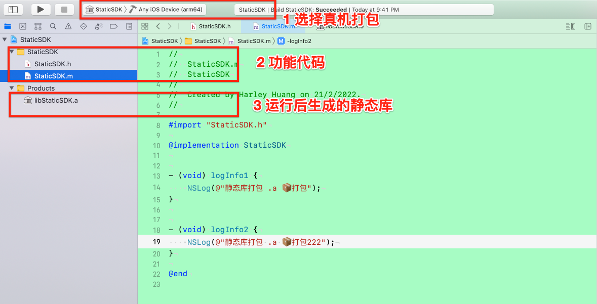


<br/>

> 1.1 导入系统UI库

&emsp; 若是构建关于UI型的静态库,需要添加**系统依赖库UIKit.framework**,**添加这个系统依赖库以后才出现Products文件夹**,否则不出现,如下:


做好上面的以后,将StaticSDK.h中导入 **#import <UIKit/UIKit.h>**.

<br/>

&emsp; 接下来需要在Build Phases栏目中添加Headers,用来包含需要暴露出的头文件否则别人在使用你的静态库时无法使用你的类,没有添头文件之前:


<br/>

在导航栏中按照如下设置进行配置,如下:

\


添加后多了如下栏目:


<br/>

> 1.2 导入其他framewokr到StaticSDK静态库中


&emsp; 这一步默认把实现文件添加到编译列表，把头文件添加到Project组。这意味着它们目前是私有的;

&emsp; **Headers下的Public、Private、Project**中的Public是你期望的，Private下的头文件依然是可以暴露出来的，但是名字可能有些误导。讽刺的是，在Project下的头文件对你的工程来说才是“私有”的. 因此，你将会更多地希望你的头文件或者在Public下，或者在Project下。

&emsp; 现在，你需要将控件的头文件分享出来(这里我用Scrollview.h)，有几种方式可以实现这一点，首先是在Headers面板中将这个头文件从Project栏拖到Public栏。

<br/>


&emsp;  你可能会发现，更简单的方法是，编辑文件，改变Target Membership面板下的membership。这个选项更方便一些，可以让你不断添加文件，扩充你的库。

&emsp; 需要注意的是如果你不断往库中添加新的类，记得及时更新这些类的关系（membership），使尽可能少的类成为public，并确保其他非public的头文件都在Project下。

&emsp; 还需要把头文件导入到StaticSDK.h文件中,方便其他人使用.

&emsp; 另外，注意拖进来的文件或文件夹不要有图片，静态库里面是不包含图片的，图片的后面需要另做处理


<br/>
<br/>


> <h4 id='解决没有Products文件夹'>2.解决没有Products文件夹</h4>

&emsp; [**Xcode13**后看不到Products怎么办?](https://juejin.cn/post/7026978788395188237)因为.a静态库放在Products文件夹中,可以通过如下方法查看:

**方法1**


<br/>

**方法2**

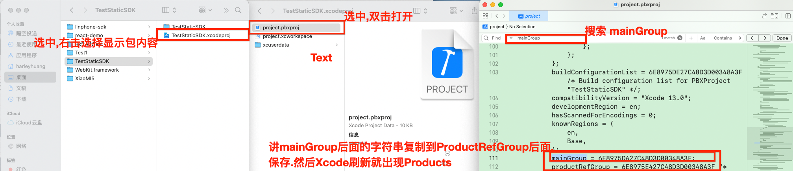


<br/>
<br/>

- **3.查看静态库所在文件路径:**

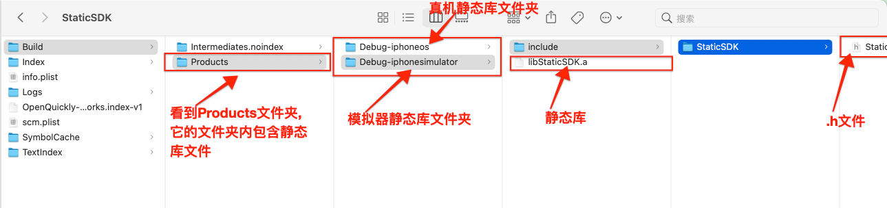

比如真机类库的路径是:`‌/Users/xxxx/Library/Developer/Xcode/DerivedData/StaticSDK-gczvnjclhtamtrbcfscahauqmazt/Build/Products/Debug-iphoneos`

<br/>
<br/>

- **4.查看静态库要暴露的接口头文件**

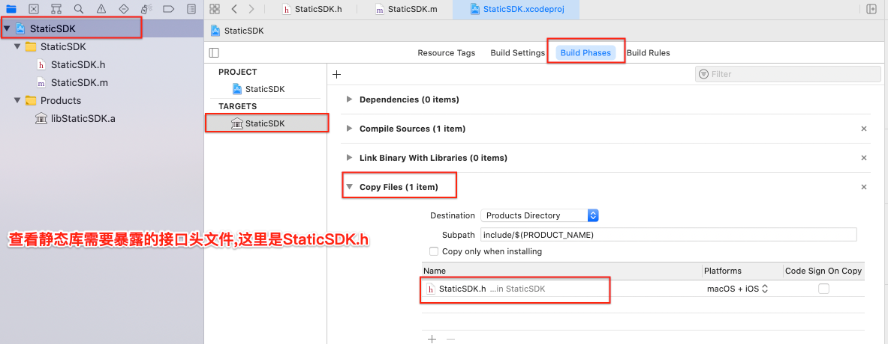


<br/>
<br/>


- **5.配置Buil Settings**

> 5.1 设置模拟器支持的架构类型

&emsp; iPhone 5模拟器正好是i386架构，iPhone 7模拟器 的cpu是 x86_64架构。所以还需要进行一步设置，使模拟器静态库支持i386 、x86_64设置如何查看静态库所支持的架构.如下:


1). 设置为NO的时候，会编译支持的所有的版本;

2). 设置为YES的时候，是为Debug的时候速度更快，它只编译当前的architecture 版本


<br/>

> 5.2 公共头文件设置

&emsp; **Public Headers Folder Path**, 默认路径是:`/usr/local/include` .在其提供一个目录名，将公共头文件存放到该位置,确保使用静态库的时候可以定位到相关头文件的位置。在该属性下输入：include/$(PROJECT_NAME),操作步骤如下:


一会你就会看到这个目录了.


<br/>

> 5.3 消除无用代码

&emsp; 无用的代码就是永远不会被执行的代码。可以移除掉一些debug用符号，例如某些函数名称或者其他跟debug相关的细节。

因为你正在创建framework供他人使用，最好禁掉这些功能（无效代码和debug用符号），让用户自己选择对自己的项目有利的部分使用。和之前一样，使用搜索框，改变下述设置：

- Dead Code Stripping设置为NO
- Strip Debug Symbol During Copy 全部设置为NO(在我这个版本下，默认为NO，只用确认一遍即可)
- Strip Style设置为Non-Global Symbols


<br/>
<br/>

- **6.查看包支持架构类型**

&emsp; 然后就可以点击运行,生成静态库包了. 这时库又分成模拟器库和真机的库,上面使用的是模拟器的库在真机中是没法使用的.真机的库是运行时通过选择`Any iOS Device(arm64)`来生成的.

可以通过命令来查看时模拟器库还是真机库:

```
$ lipo -info xxx.a


//模拟器
$  lipo -info /Users/xxxx/Library/Developer/Xcode/DerivedData/StaticSDK-gczvnjclhtamtrbcfscahauqmazt/Build/Products/Debug-iphonesimulator/libStaticSDK.a

Architectures in the fat file: /Users/harleyhuang/Library/Developer/Xcode/DerivedData/StaticSDK-gczvnjclhtamtrbcfscahauqmazt/Build/Products/Debug-iphonesimulator/libStaticSDK.a are: arm64 x86_64 (架构)

//真机
$ lipo -info /Users/xxxx/Library/Developer/Xcode/DerivedData/StaticSDK-gczvnjclhtamtrbcfscahauqmazt/Build/Products/Debug-iphoneos/libStaticSDK.a
Non-fat file: /Users/harleyhuang/Library/Developer/Xcode/DerivedData/StaticSDK-gczvnjclhtamtrbcfscahauqmazt/Build/Products/Debug-iphoneos/libStaticSDK.a is architecture: arm64 (架构)

```

有没有看到上面出现的问题?

可以看到模拟器的架构是:arm64 x86_64, 真机的是: arm64 ,当对这2个包进行合并的时候会出现如下错误:

```
fatal error: /Applications/Xcode.app/Contents/Developer/Toolchains/XcodeDefault.xctoolchain/usr/bin/lipo: xxxxx/Debug-iphoneos/libStaticSDK.a and xxxxx/Debug-iphonesimulator/libStaticSDK.a have the same architectures (arm64) and can't be in the same fat output file
```

怎么解决呢?


<br/>
<br/>

- **7.模拟器库和真机库合并**

&emsp; 将两个库合并为一个通用库，使用终端的lipo命令行来打包。操作如下：
`lipo -create （这里分别拖入两个libStaticSDK.a文件路径） -output /Desktop/libStaticSDK.a`这样在目标路径下就生成了libStaticSDK.a静态库文件如:

```
$ lipo -create /Users/xxxx/Library/Developer/Xcode/DerivedData/StaticSDK-gczvnjclhtamtrbcfscahauqmazt/Build/Products/Debug-iphoneos/libStaticSDK.a /Users/xxxx/Library/Developer/Xcode/DerivedData/StaticSDK-gczvnjclhtamtrbcfscahauqmazt/Build/Products/Debug-iphonesimulator/libStaticSDK.a -output /Users/xxxx/Desktop/libStaticSDK.a

```

然后在桌面生成一个libStaticSDK.a的文件


<br/>
<br/>

> <h4 id='静态库脚本合并模拟器真机'>8. 静态库脚本合并模拟器、真机</h3>


```
#! /bin/sh
# 先在工程根目录创建好SDK文件夹
mkdir -p ${PROJECT_NAME}_SDK
cd ${PROJECT_NAME}_SDK
mkdir -p ${PROJECT_NAME}
cd ${PROJECT_NAME}
mkdir -p include
mkdir -p lib

#回到工程目录
cd ./../../
#真机build生成的.a文件路径
DEVICE_DIR_A=${BUILD_DIR}/${CONFIGURATION}-iphoneos/lib${PROJECT_NAME}.a
#模拟器build生成的.a文件路径
SIMULATOR_DIR_A=${BUILD_DIR}/${CONFIGURATION}-iphonesimulator/lib${PROJECT_NAME}.a

if [[ -f "${DEVICE_DIR_A}" ]]; then
	say "真机编译完成"
fi

if [[ -f "${SIMULATOR_DIR_A}" ]]; then
	say "模拟器编译完成"
fi

if [[ -f "${DEVICE_DIR_A}" ]] ; then
	if [[ -f "${SIMULATOR_DIR_A}" ]]; then
		lipo -create ${DEVICE_DIR_A} ${SIMULATOR_DIR_A} -output ./${PROJECT_NAME}_SDK/${PROJECT_NAME}/lib/lib${PROJECT_NAME}.a
		#头文件转移大法
		HEADER_FOLDER="${BUILD_DIR}/${CONFIGURATION}-iphoneos/include/${PROJECT_NAME}"
		cp -a ${HEADER_FOLDER}/. ./${PROJECT_NAME}_SDK/${PROJECT_NAME}/include
		open ./
		say "静态库合并成功"
	fi
fi
```

<br/>
<br/>


- **9.项目使用**


&emsp; 新建工程OCTest工程,将静态库工程中的StaticSDK.h和刚刚导出的libStaticSDK.a放入新建的OCTest工程中。在所需.m文件中导入静态库头文件即可调用相应功能代码.

&emsp; **注意:**在把StaticSDK.h和libStaticSDK.a拖入OCTest工程中要勾选**Destination、Added folders、Add to Targets**.


<br/>
<br/>


- **10.静态库联调**

在StaticSDK静态库的文件夹内，将StaticSDK.xcodeproj从Finder中拖到Xcode中OCTest文件下:


<br/>

> 10.1 **静态库作为项目依赖库**


&emsp; 添加静态库作为实例项目的依赖库,在项目导航栏中选择 OCTest --> Build Phases --> Dependencies --> 点击+按钮. 找到StaticSDK静态库，选择并点击Add.当构建应用时，Xcode会检查是否静态库需要重新构建.


<br/>

> 10.2 **连接静态库**

&emsp; 链接静态库,展开**Link Binary With Libraries**面板，**点击+按钮**，从Workspace组中选择StaticSDK.a然后点击Add。确保Xcode可以连接到静态库，就像连接到系统framework（例如UIKit）一样。


这样分别运行静态库和动态库,就可以了,如下:ios_oc40_8

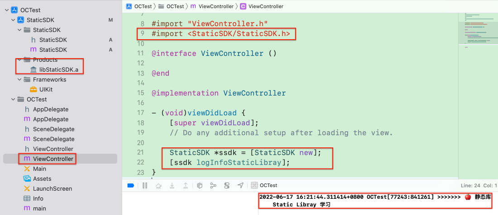


<br/>
<br/>

> <h3 id='framework创建'>11. framework创建</h3>

<br/>

> **10.1 framework组成**

**framework = 静态库+一组头文件;**
&emsp; framework有几点不同之处：

- 目录结构。Framework有一个能被Xcode识别的特殊的目录结构，你将会创建一个build task，由它来为你创建这种结构。

- 片段（Slice）。目前为止，当你构建库时，仅仅考虑到当前需要的结构（architecture）。例如，i386、arm7等，为了让一个framework更有用，对于每一个运行framework的结构，该framework都需要构建这种结构。一会你就会创建一个新的工程，构建所有需要的结构，并将它们包含到framework中。


我们可以通过添加脚本创建这样的目录结构.

<br/>

> **10.2 添加脚本创建目录**


&emsp; 这时在**build phases**面板会增加一项**Run Script**，这时你可以在构建时运行一个Bash脚本。若是你希望让脚本在build的某一过程中执行，
就可以把这新建的**Run Script**拖动到列表中相对应的那一位置。对于该framework工程来说，脚本最后执行，因此你可以让它保留在默认的位置即可。我们可以把脚本命名为**BuildFramework**,将下面的脚本复制到刚刚创建的BuildFramework中:

```
set -e  

export FRAMEWORK_LOCN="${BUILT_PRODUCTS_DIR}/${PRODUCT_NAME}.framework"  

# Create the path to the real Headers die 
mkdir -p "${FRAMEWORK_LOCN}/Versions/A/Headers"  

# Create the required symlinks
/bin/ln -sfh A "${FRAMEWORK_LOCN}/Versions/Current"
/bin/ln -sfh Versions/Current/Headers "${FRAMEWORK_LOCN}/Headers"
/bin/ln -sfh "Versions/Current/${PRODUCT_NAME}" \
"${FRAMEWORK_LOCN}/${PRODUCT_NAME}"
  
# Copy the public headers into the framework
/bin/cp -a "${TARGET_BUILD_DIR}/${PUBLIC_HEADERS_FOLDER_PATH}/" \
"${FRAMEWORK_LOCN}/Versions/A/Headers"

```

选择StaticSDK静态库scheme，然后选择iOS Device构建目标，然后使用cmd+B构建。然后选择libStatic.a然后点击show in finder后,到其所在文件夹,如下:


上面的脚本将StaticSDK静态库的公共头文件从之前定义的公共头文件路径拷贝到Versions -> A -> Headers目录下， -a参数确保修饰次数作为拷贝的一部分不会改变，防止不必要的重新编译。

我们会注意到这里并没有一个静态lib文件,这就是我们下一步将要解决的问题。


<br/>
<br/>

> <h3 id='多架构编译'>12. 多架构编译</h3>

iOS app需要在许多不同的CPU架构下运行：

- arm7: 在最老的支持iOS7的设备上使用
- arm7s: 在iPhone5和5C上使用
- arm64: 运行于iPhone5S的64位 ARM 处理器 上
- i386: 32位模拟器上使用
- x86_64: 64为模拟器上使用

&emsp; 每个CPU架构都需要不同的二进制数据，当你编译一个应用时，无论你目前在使用哪种架构，Xcode都会正确地依照对应的架构编译。例如，如果你想跑在虚拟机上，Xcode只会编译i386版本（或者是64位机的x86_64版本）。

&emsp; 当你创建你的framework时，你自然会想让所有开发者都能在所有可能的架构上运行它，不是吗?因此你需要让Xcode在所有架构下都进行编译。这一过程实际上是创建了二进制FAT（File Allocation Table，文件配置表），它包含了所有架构的片段（slice）。

**注意：库仅仅在示例项目运行所需要的架构下编译，只有当有变化的时候才重新编译，因此开发周期会尽可能地缩短。**按下面步骤来:


&emsp; 为什么使用集合（**Aggregate**）目标来创建一个framework呢？为什么这么不直接？因为OS X对库的支持更好一些，事实上Xcode会为每一个OS X工程提供一个Cocoa Framework编译目标。基于此，你将使用集合编译目标，作为Bash脚本的连接串来创建神奇的framework目录结构。

&emsp; 为了确保每当这个新的framework目标被创建时，静态链接库都会被编译，你需要往静态库目标中添加依赖（Dependency）。

&emsp; 在库工程中选择StaticSDK目标，在Build Phases中添加一个依赖,展开Target Dependencies面板，点击 + 按钮选择StaticSDK静态库。


&emsp; 这个目标的主要编译部分是多平台编译，你将使用一个脚本来做到这一点。和你之前做的一样，在Framework目标下选择Build Phases栏，点击Editor -> Add Build Phase -> Add Run Script Build Phase，创建一个新的Run Script Build Phase。脚本名称为:MultiPlatform Build.


在脚本框中,添加如下脚本:(下面的脚本有问题,不要使用.知道流程什么意思即可)

```
set -e  

# If we're already inside this script then die
if [ -n "$RW_MULTIPLATFORM_BUILD_IN_PROGRESS" ]; then  
exit 0
fi
export RW_MULTIPLATFORM_BUILD_IN_PROGRESS=1  

RW_FRAMEWORK_NAME=${PROJECT_NAME}
RW_INPUT_STATIC_LIB="lib${PROJECT_NAME}.a"
RW_FRAMEWORK_LOCATION="${BUILT_PRODUCTS_DIR}/${RW_FRAMEWORK_NAME}.framework"

```

- set –e确保脚本的任何地方执行失败，则整个脚本都执行失败。这样可以避免让你创建一个部分有效的framework。

- 接着，用RW_MULTIPLATFORM_BUILD_IN_PROGRESS变量决定是否循环调用脚本，如果有该变量，则退出。

- 然后设定一些变量。该framework的名字与项目的名字一样。也就是RWUIControls，另外，静态lib的名字是libRWUIControls.a


<br/>

接下来，用脚本设置一些函数，这些函数一会项目就会用到，把下面的代码加到脚本的底部。

```
function build_static_library {    
    # Will rebuild the static library as specified    
    # build_static_library sdk    
    xcrun xcodebuild -project "${PROJECT_FILE_PATH}" \
    -target "${TARGET_NAME}" \
    -configuration "${CONFIGURATION}" \
    -sdk "${1}" \
    ONLY_ACTIVE_ARCH=NO \
    BUILD_DIR="${BUILD_DIR}" \
    OBJROOT="${OBJROOT}/DependantBuilds" \
    BUILD_ROOT="${BUILD_ROOT}" \
    SYMROOT="${SYMROOT}" $ACTION
}

function make_fat_library {    
	# Will smash 2 static libs together    
	# make_fat_library in1 in2 out    
	xcrun lipo -create "${1}" "${2}" -output "${3}"
}
```

- build_static_library把SDK作为参数，例如iPhone7.0，然后创建静态lib，大多数参数直接传到当前的构建工作中来，

- 不同的是设置ONLY_ACTIVE_ARCH来确保为当前SDK构建所有的结构。

- make_fat_library使用lipo将两个静态库合并为一个，其参数为两个静态库和结果的输出位置。从这里了解更多关于lipo的知识。


<br/>

为了使用这两个方法，接下来脚本将定义更多你要用到的变量，你需要知道其他SDK是什么，例如，iphoneos7.0应该对应iphonesimulator7.0，反过来也一样。你也需要找到该SDK对应的编译目录。把下面的代码添加到脚本的底部:

```
# 1 - Extract the platform (iphoneos/iphonesimulator) from the SDK name
if [[ "$SDK_NAME" =~ ([A-Za-z]+) ]]; then  
RW_SDK_PLATFORM=${BASH_REMATCH[1]}
else  
echo "Could not find platform name from SDK_NAME: $SDK_NAME"  
exit 1
fi

# 2 - Extract the version from the SDK
if [[ "$SDK_NAME" =~ ([0-9]+.*$) ]]; then  
RW_SDK_VERSION=${BASH_REMATCH[1]}
else  
echo "Could not find sdk version from SDK_NAME: $SDK_NAME"  
exit 1
fi  

# 3 - Determine the other platform
if [ "$RW_SDK_PLATFORM" == "iphoneos" ]; then  
RW_OTHER_PLATFORM=iphonesimulator
else  
RW_OTHER_PLATFORM=iphoneos
fi  

# 4 - Find the build directory
if [[ "$BUILT_PRODUCTS_DIR" =~ (.*)$RW_SDK_PLATFORM$ ]]; then  
RW_OTHER_BUILT_PRODUCTS_DIR="${BASH_REMATCH[1]}${RW_OTHER_PLATFORM}"
else  
echo "Could not find other platform build directory."  
exit 1
fi

```

&emsp; 上面四句声明都非常相似，都是使用字符串比较和正则表达式来确定RW_OTHER_PLATFORM和RW_OTHER_BUILT_PRODUCTS_DIR。

详细解释一下上面四句声明：

- SDK_NAME将指代iphoneos7.0和iphonesimulator6.1，这个正则表达式取出字符串开头不包含数字的那些字符，因此，其结果是iphoneos 或 iphonesimulator。

- 这个正则表达式取出SDK_NAME中表示版本用的数字，7.0或6.1等。

- 这里用简单的字符串比较来将iphonesimulator 转换为iphoneos，反过来也一样。

- 从构建好的工程的目录路径的末尾找出平台名称，将其替换为其他平台。这样可以确保为其他平台构建的目录可以被找到。这是将两个静态库合并的关键部分。

现在你可以启动脚本为其他平台编译，然后得到合并两静态库的结果。

<br/>

在脚本最后添加下面的代码：

```
# Build the other platform
build_static_library "${RW_OTHER_PLATFORM}${RW_SDK_VERSION}"  

# If we're currently building for iphonesimulator, then need to rebuild
# to ensure that we get both i386 and x86_64
if [ "$RW_SDK_PLATFORM" == "iphonesimulator" ]; then    
build_static_library "${SDK_NAME}"
fi  

# Join the 2 static libs into 1 and push into the .framework
make_fat_library "${BUILT_PRODUCTS_DIR}/${RW_INPUT_STATIC_LIB}" \
"${RW_OTHER_BUILT_PRODUCTS_DIR}/${RW_INPUT_STATIC_LIB}" \                 
"${RW_FRAMEWORK_LOCATION}/Versions/A/${RW_FRAMEWORK_NAME}"
```

- 首先，调用你之前定义好的函数为其他平台编译

- 如果你现在正在为模拟器编译，那么Xcode会默认只在该系统对应的结构下编译，例如i386 或 x86_64。为了在这两个结构下都进行编译，这里调用了build_static_library，基于iphonesimulator SDK重新编译，确保这两个结构都进行了编译。

- 最后调用make_fat_library将在当前编译目录下的静态lib同在其他目录下地lib合并，依次实现支持多结构的FAT静态库。这个被放到了framework中。

<br/>
脚本的最后是简单的拷贝命令，将下面代码添加到脚本最后：

```
# Ensure that the framework is present in both platform's build directories
cp -a "${RW_FRAMEWORK_LOCATION}/Versions/A/${RW_FRAMEWORK_NAME}" \ 
"${RW_OTHER_BUILT_PRODUCTS_DIR}/${RW_FRAMEWORK_NAME}.framework/Versions/A/${RW_FRAMEWORK_NAME}"  

# Copy the framework to the user's desktop
ditto "${RW_FRAMEWORK_LOCATION}" "${HOME}/Desktop/${RW_FRAMEWORK_NAME}.framework"
```

- 第一条命令确保framework在所有平台的编译目录中都存在。
- 第二条将完成的framework拷贝到用户的桌面上，这一步是可选的，但我发现这样做可以很方便的存取framework。

<br/>

最后完整版的脚本是:

```
set -e  

# If we're already inside this script then die
if [ -n "$RW_MULTIPLATFORM_BUILD_IN_PROGRESS" ]; then  
exit 0
fi
export RW_MULTIPLATFORM_BUILD_IN_PROGRESS=1  

RW_FRAMEWORK_NAME=${PROJECT_NAME}
RW_INPUT_STATIC_LIB="lib${PROJECT_NAME}.a"
RW_FRAMEWORK_LOCATION="${BUILT_PRODUCTS_DIR}/${RW_FRAMEWORK_NAME}.framework"
function build_static_library {    
    # Will rebuild the static library as specified    
    # build_static_library sdk    
    xcrun xcodebuild -project "${PROJECT_FILE_PATH}" \
    -target "${TARGET_NAME}" \
    -configuration "${CONFIGURATION}" \
    -sdk "${1}" \
    ONLY_ACTIVE_ARCH=NO \
    BUILD_DIR="${BUILD_DIR}" \
    OBJROOT="${OBJROOT}/DependantBuilds" \
    BUILD_ROOT="${BUILD_ROOT}" \
    SYMROOT="${SYMROOT}" $ACTION
}

function make_fat_library {    
    # Will smash 2 static libs together    
    # make_fat_library in1 in2 out    
    xcrun lipo -create "${1}" "${2}" -output "${3}"
}
# 1 - Extract the platform (iphoneos/iphonesimulator) from the SDK name
if [[ "$SDK_NAME" =~ ([A-Za-z]+) ]]; then  
RW_SDK_PLATFORM=${BASH_REMATCH[1]}
else  
echo "Could not find platform name from SDK_NAME: $SDK_NAME"  
exit 1
fi

# 2 - Extract the version from the SDK
if [[ "$SDK_NAME" =~ ([0-9]+.*$) ]]; then  
RW_SDK_VERSION=${BASH_REMATCH[1]}
else  
echo "Could not find sdk version from SDK_NAME: $SDK_NAME"  
exit 1
fi  

# 3 - Determine the other platform
if [ "$RW_SDK_PLATFORM" == "iphoneos" ]; then  
RW_OTHER_PLATFORM=iphonesimulator
else  
RW_OTHER_PLATFORM=iphoneos
fi  

# 4 - Find the build directory
if [[ "$BUILT_PRODUCTS_DIR" =~ (.*)$RW_SDK_PLATFORM$ ]]; then  
RW_OTHER_BUILT_PRODUCTS_DIR="${BASH_REMATCH[1]}${RW_OTHER_PLATFORM}"
else  
echo "Could not find other platform build directory."  
exit 1
fi
# Build the other platform
build_static_library "${RW_OTHER_PLATFORM}${RW_SDK_VERSION}"  

# If we're currently building for iphonesimulator, then need to rebuild
# to ensure that we get both i386 and x86_64
if [ "$RW_SDK_PLATFORM" == "iphonesimulator" ]; then    
build_static_library "${SDK_NAME}"
fi  

# Join the 2 static libs into 1 and push into the .framework
make_fat_library "${BUILT_PRODUCTS_DIR}/${RW_INPUT_STATIC_LIB}" \
"${RW_OTHER_BUILT_PRODUCTS_DIR}/${RW_INPUT_STATIC_LIB}" \                 
"${RW_FRAMEWORK_LOCATION}/Versions/A/${RW_FRAMEWORK_NAME}"

```

进行编译:


为了检查一下我们的多平台编译真的成功了，启动终端，导航到桌面上的framework，像下面一样：

```
$ cd ~/Desktop/StaticSDK.framework
$ StaticSDK.framework  xcrun lipo -info StaticSDK
```

第一条指令导航到framework中，第二行使用lipo指令从StaticSDK静态库中得到需要的信息，这将列出存在于该库中的所有片段。


现在，你就已经有一个属于你自己的Framework了。

只需要在拖进工程，包含你的头文件就能使用了！！


<br/>

***
<br/>


> <h3 id='静态库.framework生成'>静态库.framework生成</h3>

<br/>

**1.新建一个项目**



<br/>
<br/>


- **2.静态库项目配置**

&emsp; 这时创建的一个工程它默认是动态库,我们要通过设置对它进行设置为静态库, 选择`TARGETS` ——> `Build Settings` ——> `搜索框输入Mach` ——> `Linking中的Mach-o Type 修改为 Static Library`.

&emsp; 在新建的项目中StaticFrameworkSDK的文件夹中有一个自动生成的文件`StaticFrameworkSDK.h`,在我们需要公开功能的头文件都可以导入到此文件中,当我们使用时只需导入`StaticFrameworkSDK.h`就可以了


<br/>
<br/>

- **3.导入第三方静态库和待封装的代码配置**

正常导入要打包的文件就可以了

**⚠️注意：导入第三方静态库的时候不要选择添加到target中**

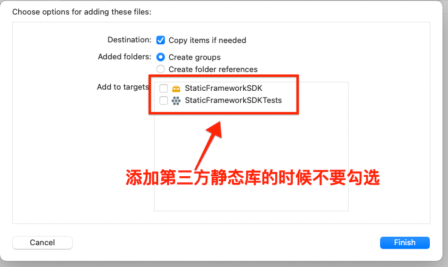

&emsp; 如果你用到的第三方库需要依赖其他系统库的话，需要在导入第三方静态库之后再link依赖的系统库

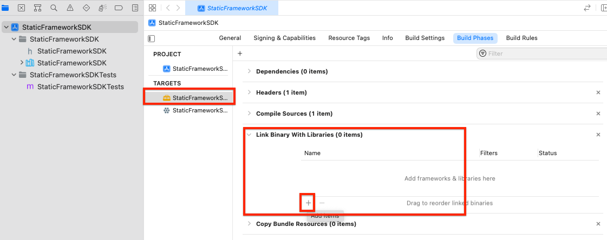

所有文件导入完成后的文件目录,如下:


<br/>
<br/>

- **4.设置需要暴露的StaticFrameworkSDK.h文件**

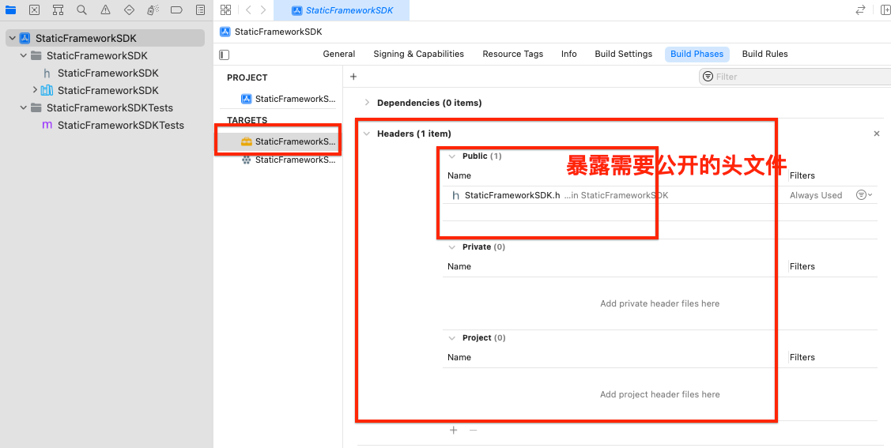

&emsp; 需要暴露的头文件放置在Public里, 若是不放则在打包后会爆如下错误:

```
In file included from /Users/harleyhuang/Desktop/Test1/Test1/ViewController.m:14:
/Users/harleyhuang/Desktop/Test1/Test1/Lib/StaticFrameworkSDK.h:19:9: fatal error: 'StaticFrameworkTest.h' file not found
#import "StaticFrameworkTest.h"
        ^~~~~~~~~~~~~~~~~~~~~~~
1 error generated.

```

所以进行如下配置:

&emsp; 在StaticFrameworkSDK.h中(将其中无用的进行删除)导入StaticFrameworkTest.h头文件:

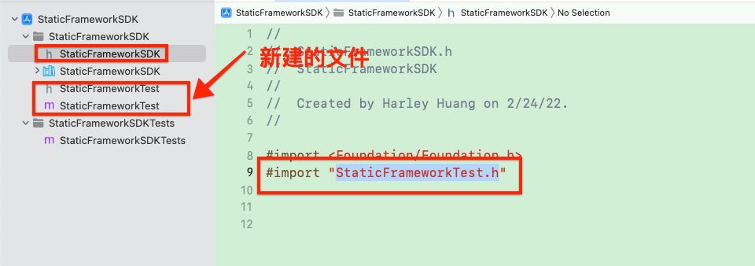


<br/><br/>

> <h2 id='5.加入公共头文件'>5.加入公共头文件</h2>


****


<br/>

这里写了一个StaticFrameworkTest类,将其导入到StaticFrameworkSDK.h头文件中.


<br/>

**注意:** 导入的头文件 `‌#import <StaticFrameworkSDK/StaticFrameworkTest.h>` 不要用`‌#import "StaticFrameworkTest.h"` 这样导入,即使这样可以导入但是导入工程后没有办法看到StaticFrameworkTest类的接口头文件.如下:


<br/>
<br/>


- **6.编译配置**


&emsp; 分别选择 `真机`和`模拟器,cmd+b`进行编译。

**注：编译之前要设置 Deployment Target 你要最低支持的版本，这里要低于真机版本，否则会无法编译。**


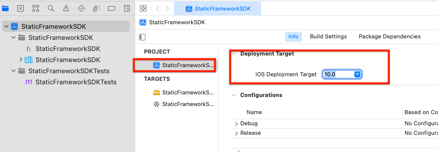


<br/>
<br/>

-  **6.1. 制作支持各机型的静态库**


- Build Active Architecture Only 统一为 NO
- Architectures 和 Valid Architectures 都设置为 armv7、armv7s、arm64、arm64e
- 真机 Command + B 则生成支持 armv7、armv7s、arm64 的动态库，模拟器运行，则生成支持 i386、x86_64 的动态库。
- 补充: Build Active Architecture Only设置为YES的时候，是为Debug的时候速度更快，它只编译当前的architecture 版本

<br/>

- 属性介绍:
	- Architectures：指明选定 Target 要求被编译生成的二进制包所支持的指令集
	- Build Active Architecture Only：指明是否只编译当前连接设备所支持的指令集，如果为 YES，那么只编译出连接设备所对应的指令集；如果为 NO，则编译出所有其它有效的指令集（由 Architectures 和 Valid Architectures决定）
	- Valid Architectures：指明可能支持的指令集并非 Architectures 列表中指明的指令集都会被支持
	- 编译产生的动态库所支持的指令集将由上面三个编译选项所影响，首先一个动态库要成功编译，则需要这三个编译选项的交集不为空。


<br/>


```
示例1：
  Architectures 为armv7、arm64
  Valid Architectures 为armv7、armv7s、arm64
  Build Active Architecture Only 为 debug:YES release:NO
  链接设备:iPhone 6s (arm64架构的设备)
  编译(command + shift + B,保证Build Active Architecture Only 为 debug:YES 生效)
  结果：编译成功，生成的动态库支持的指令集为arm64.因为Architectures和Valid Architectures的交集为armv7、arm64.而armv7、arm64和Build Active Architecture Only(Debug为Yes,则为arm64),所以只有arm64

示例2：
  Architectures 为armv7、arm64
  Valid Architectures 为 armv7s
  Build Active Architecture Only 为 debug:YES release:NO
  链接设备:iPhone 6s (arm64架构的设备)
  编译(command + shift + B,保证Build Active Architecture Only 为 debug:YES 生效)
  结果：编译失败，因为当前是debug模式，在该模式下Build Active Architecture Only  为YES，表示只编译支持该指令集的动态库，
      但是由于Architectures和Build Active Architecture Only的交集中并不存在arm64，故三者的交集为空，故编译失败，无法生成动态库。

示例3：
  Architectures 为armv7、arm64
  Valid Architectures 为armv7、armv7s、arm64
  Build Active Architecture Only 为 debug:NO release:NO
  链接设备:iPhone 6s (arm64架构的设备)
  编译(command + shift + B,保证Build Active Architecture Only 为 debug:NO 生效)
  结果：编译成功，因为当前是debug模式，在该模式下Build Active Architecture Only  为NO，
    表示可以编译的结果可能为当前连接的设备所支持的指令集以及其向上兼容的指令集(armv64、armv7s、armv7)，其和另外两个编译选项的交集为armv7，故所生成的动态库支持的指令集为armv7
```


<br/>
<br/>

- **6.2. 生成静态包**

&emsp; 选择模拟器iPhone 13 Pro Max和真机 Any iOS Device(arm64 armv7) 分别生成模拟器包和真机包.


⚠️注意：编译时可能会出现三方静态库文件找不到的情况：报"XXXX/XXXX.h file not found "错误，那是因为没有设置Framework Search Paths。
我项目中的三方在MyIMSDK目录下（点击+，将MyIMSDK目录拖进来就可以了）


&emsp; 当然也可以使用真机环境下进行编译,与[静态库.a生成](#静态库.a生成)生成真机framework一样,将2个库使用终端命令lipo来打包如下:

```
lipo -create （这里分别拖入两个目录下的签名文件路径） -output /Desktop/StaticFrameworkSDK 
```

注意: 签名文件要和库名保持一致.


&emsp; 最后，将生成真机和模拟器的静态库文件StaticFrameworkSDK拷贝到之前生成的带有_CodeSignature 文件夹StaticFrameworkSDK.framework目录下,替换掉原来StaticFrameworkSDK。至此StaticFrameworkSDK.framework就是我们最终生成的通用版静态framework库。

&emsp; 将最终通用库拖进工程,导入`#import <StaticFrameworkSDK/StaticFrameworkSDK.h>`即可调用功能代码


&emsp; `StaticFrameworkSDK.framework` 我们拷到项目中后发现它并不能展开,然后导致看不到对应的头文件.这是正常的,但是我们通过Cocoapods管理就可以做到看到其脚本,这可能是因为其内部运行了对应的脚本将.h头文件给暴露了出来.


<br/>

&emsp; 之后在模拟器环境下，让Xcode进行Build，之后在对应的Build文件夹下的Products文件夹中可以找到生成的framework文件.

&emsp; 这里要说下,在Xcode13里,你在运行以后找不到Products文件下生成的
StaticFrameworkSDK.framework,需要通过下面路径找到:


<br/>
<br/>

- **7.文件介绍**

在framework文件会发现其中有5类文件，如下:


- `_CodeSignature`中存放的是framework的签名文件。

- Headers中存放的是头文件，需要注意，在编译framework工程时，要将需要暴露的头文件设置为public。

- Info.plist文件是当前framework的配置文件。

- Modules中的modulemap文件用来管理LLVM的module map，定义组件结构。


<br/><br/>

> <h2 id='问题'>问题</h2>

<br/>

<br/><br/>

> <h2 id='引入外部静态库头文件找不到'>引入外部静态库头文件找不到</h2>

问题产生: 当我制作一个静态库的时候,再引入一个外静态库的时候,发现外部静态库的头文件找不到了?


后来发现是因为把外部静态库放在主工程了,没有放入到静态库子工程中造成的.为什么会出现这个问题?还没弄清楚


<br/>

***
<br/>


> <h2 id='主工程和静态库的联调'>主工程和静态库的联调</h2>

[工程和静态库进行联调](https://www.jianshu.com/p/ca5c0bc69e08)

<br/>

> <h3 id='工程内拖入Framework'>工程内拖入Framework</h3>

- **1.新建主工程StaticLibTest,再建动态库DynamicFramework**

&emsp; 这里需要注意的是把**动态库DynamicFramework**工程关掉留下主工程StaticLibTest打开.

<br/>

- **2.将动态库DynamicFramework中的DynamicFramework.xcodeproj拖入到主工程StaticLibTest中**


<br/>

- **3.关联动态库和工程**


效果如下:


<br/>
<br/>
<br/>

> <h3 id='xcworkspace联调试'>xcworkspace联调试</h3>

<br/>

- **1.创建Workspace项目**

&emsp; 新建一个DLianTiaoTest文件夹,File->New->Workspace，项目命名为DLianTiaoTest，存放在新建的文件夹中。

<br/>

- **2.动态库和主工程添加入xcworkspace中**


添加后的效果如下:


<br/>

- **3.将动态库和工程关联起来**

&emsp; **在这之前,请先把动态库跑起来,生成.framework文件,否则无法关联**


<br/>

- **4.一边开发一边调试动态库**


&emsp; 后续开发中就可以边在framework项目中修改静态库核心代码，边在demo中运行查看效果了。


<br/>

***
<br/><br/>

> <h1 id='静态库'>静态库</h1>


<br/><br/>

> <h2 id='链接过程'>链接过程</h2>


Mach-o文件是在编译阶段的时候就确定下来了,也就是文件的各个结构!如下:静态库链接过程:


<br/>

Mach-O文件的结构:


静态库: .o文件的合集-》包含了各自的代码  
动态库: .o文件的集合 -> 链接 -> 整合在一起 -〉体积小

静态库比动态库体积大的原因是什么？ 你真的知道吗?

可能比并不是都知道,这是因为动态库会把`.o`文件进行了整合这就导致动态库的Mach-o文件只有一个Mach-header和一个load commands,从而使文件体积小.但是里面的代码都是一样的

但是静态库就不一样了,它只是`.o`文件的合集,没有链接在一块.有多个Mach-header和load command.

<br/>


通过下面的图,我们可以在xconfig中配置我们的库文件的头文件搜索历经、库文件搜索路径、OTHER_LDFLAGS,以后可以用在MLC项目中,不用每次在Build Settings中进行配置,如下:


<br/>

- HEADER_SEARCH_PATHS:App -> 库 -》 API -〉.h
	- 就是app寻找库,比如afnetworking库,然后找到它的api,所导出的.h头文件

- LIBRARY_SEARCH_PATHS: App -> 库 -》 所在的位置
	- 这个配置是用来告诉app我提供的库放在什么地方了,你可以通过这个路径来查找,否则你找不到,然后没法使用

- OTHER_LDFLAGS: App -> 库 -》 名称
	- 告诉app你引用库模块的名称,表示你在配置 LIBRARY_SEARCH_PATHS 这个后,去链接这个库,比如:你配置好了afn,然后你去链接afn这个模块
	- -l 表示library


<br/>


<br/><br/>

> <h2 id='Framework结构'>Framework结构</h2>


Framework包含2种,一种是静态库的一种是动态库的!

这2种各自包含的文件有所不同,如下图:


签名: 是为了防止代码被篡改,动态库里面也包含了这个以后苹果可以防止你利用动态库搞热更新!


<br/><br/>

> <h2 id='解决错误'>解决错误</h2>


<br/><br/>

> <h3 id='Librarynotloaded'>Library not loaded</h3>


@runpath: 运行过程的搜索路径


在 项目的Build Settings 中有 Runpath Search Paths有如下参数,其解释为:


 


<br/>

***
<br/>


> <h1 id='动态库'>动态库</h1>


<br/>


> <h2 id='tbd格式'>tbd格式</h2>


<br/>
<br/>
<br/>

> <h2 id='Framewor'>**Framework**</h2>


- Embedded Framework

开发中使用的动态库会被放入到ipa下的framework目录下,基于沙盒运行.

不同的App使用相同的动态库,并不会只在系统中存在一份.而是会在多个App总各自打包、签名、加载一份.


<br/>
<br/>
<br/>

> <h2 id='Mach-o格式'>Mach-o格式</h2>


<br/>
<br/>
<br/>


> <h2 id=''></h2>


<br/>
<br/>
<br/>

> <h2 id=''></h2>


<br/>
<br/>
<br/>

> <h2 id=''></h2><br/>


<br/>
<br/>
<br/>

> <h2 id=''></h2>

<br/>


&emsp; 动态库合静态库的继承、查找、链接，其实静态库是**.o文件**的合集，经过一定的转化可以变为动态库.


<br/>


AFNetworking的静态库

静态库其实就是.o文件的集合


<br/>


AFNetworking的动态库

&emsp; 动态库其实也是.o文件的集合,只不过是它比静态库要小.小的原因是其把静态态库的MachHeader、Segment、Section整合为一个不是那么臃余了


<br/>
<br/>
<br/>


> <h2 id='动态库打包'>动态库打包</h2>


<br/>

- **创建一个DynamicFrameworkSDK动态库,然后再创建一个Test类文件,将Test文件导入DynamicFrameworkSDK.h文件中,如下:**


头文件导入:


&emsp; 动态库frame的打包和[静态库.framework生成](#静态库.framework生成)基本一样,如在动态库打包中需要修改`Mach-o`属性为`Dynamic Library`;


<br/>

- **导出动态库**

&emsp; 使用**Command+B**分别运行真机和模拟器打出真机动态库和模拟器动态库,然后使用 **`lipo -out xxx模拟器库地址 xxx真机库地址 -output /Users/harleyhuang/Desktop/DynamicFrameworkSDK1`** 打出真机和模拟器都能用的动态库.


&emsp; 这里会出现一个问题那就是,若是模拟器动态库和真机动态库的架构都有arm64则会合并时报错如:

```
error: /Applications/Xcode.app/Contents/Developer/Toolchains/XcodeDefault.xctoolchain/usr/bin/lipo: xxxx/Products/Debug-iphonesimulator/DynamicFrameworkSDK.framework/DynamicFrameworkSDK and xxxx/Products/Debug-iphoneos/DynamicFrameworkSDK.framework/DynamicFrameworkSDK have the same architectures (arm64) and can't be in the same fat output file
```

那么则让模拟器排除arm64架构就可以了,如下图:


&emsp; 但是在M1的Mac并且Xcode12版本以上,制作动态库可以不设置,也是可以的.如下:


<br/>


&emsp; 然后将导出的动态库DynamicFrameworkSDK1拖入真机或者模拟器生成的动态库DynamicFrameworkSDK.framework文件夹内,然后删除其DynamicFrameworkSDK将DynamicFrameworkSDK1改为DynamicFrameworkSDK即可.

如下:


&emsp; 但是在项目中会报错:`building for iOS Simulator, but linking in object file built for iOS, for architecture arm64`这是因为Apple M1，Xcode 12模拟器的库需要的是arm64架构；但是很多第三方针对模拟器编译后的库并不包含arm64，因此报错.

解决方法是使用rossetta2运行XCode,具体设置如下:


<br/><br/>

> <h4 id='Embed&Signing嵌入和签名'>Embed&Signing嵌入和签名</h4>


下面有几种嵌入和签名有什么区别吗?

- **Do Not Embed**
- **Embed & Sign**
- **Embed Without Signing**

&emsp; 通过上述可以控制动、静态库要不要嵌入到你的代码中.比如: 我的静态库工程嵌入了别人的静态库打出的代码可能就非常大,否则就很小.可以从你打出的静态库文件来看.😄😄,这个是大白话


<br/><br/>

> <h5 id='命令判断动态库和静态库'>命令判断动态库和静态库</h5>

```
file frameworkToLink.framework/frameworkToLink
```

**如果返回：**

- current ar archive:说明是静态库，选择Do not embed
- Mach-0 dynamically：说明是动态库，选择Embed


&emsp; 对于静态库，在应用程序进行编译链接时，会将静态库中的 被使用的部分 都添加到应用程序的可执行文件，这意味着应用程序的可执行文件大小会随着静态库数量的增加而增大。在运行时，静态库会随着应用程序的可执行文件一起加载到同一代码区。在 iOS 开发中，应用程序的可执行文件就是 ipa 解压后，包内容中与 app 同名的可执行文件。

<br/>

&emsp; 对于动态库，事实上可以根据其加载时机分为两种：动态链接库、动态加载库。

- 动态链接库：当加载目标主程序的可执行文件时，动态库也会被加载到内存中，即 在程序启动时加载。
- 动态加载库：当用到相关功能时，使用 dlopen 或其他方式对相关动态库进行加载，即 在程序启动后加载。

<br/>
<br/>

&emsp; 在 iOS 开发中，在项目设置【General】->【Frameworks, Libraries, and Embedded Content】中，定义了应用程序所依赖的静态库和动态库。

<br/>

**Embed**: 嵌入，用于动态库，动态库在运行时链接，所以它们需要被打进bundle里面;

&emsp; 对于 系统动态库，可以将 Embed 属性设置成 Do Not Embed，因为 iOS 系统提供了相关的库，我们无需将它们再嵌入到应用程序的 ipa 包中，如：Foundation.framework、UIKit.framework。


&emsp; 对于 用户动态库，需要将 Embed 属性设置成 Embed，因为链接发生在运行时，链接器需要从应用程序的 ipa 包中加载完整的动态库。


&emsp; 对于 静态库，需要将 Embed 属性设置成 Do Not Embed，因为链接发生在编译时，编译完成后相关代码都已经包含在了应用程序的可执行文件中了，无需在应用程序的 bundle 中再保存一份。

<br/>
<br/>

Signing：只用于动态库，如果已经有签名了就不需要再签名。如何判断呢？使用终端执行：

```
codesign -dv frameworkToLink.framwork
```

如果返回：

```
code object is not signed at all
```

 或者 
 
```
adhoc
```
 
选择Embed and sign

其它：表示已经正确签名，选择Embed Without Signing


<br/>

- 将打包好后的通用库拖进工程,在需要的地方进行如下导入:`#import<xxxxFramework/xxxxFramwork.h>`即可调用功能代码,另外还要进行如下配置流程

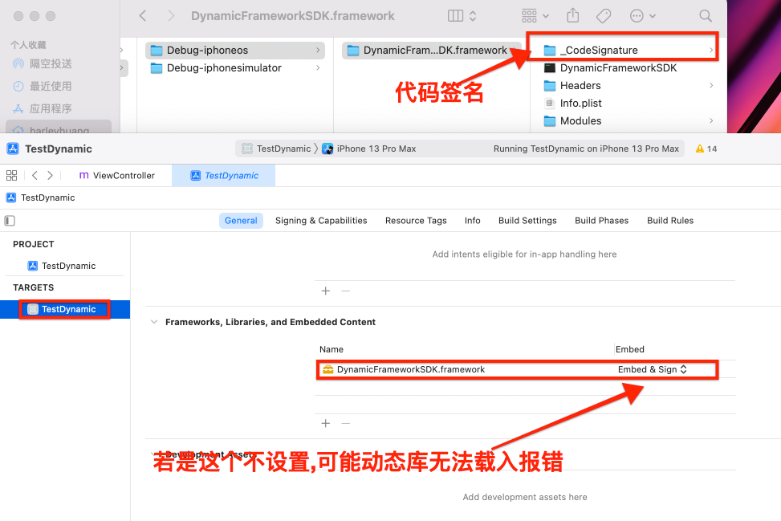


**注：默认是`Do not embed`, 需要设置为`Embed & Sign`，否则会报以下错误:**
**dyld: Library not loaded: @rpath/DynamicFramework.framework/DynamicFramework Referenced from: /private/var/containers/Bundle/Application/DF439DDF-5DBC-41E3-842D-26FAB1D5BFEE/YYYTest.app/YYYTest Reason: image not found**

<br/>


<br/>
<br/>

> <h3 id='动态库脚本合并模拟器真机'>动态库脚本合并模拟器、真机</h3>

- **创建一个脚本**


脚本文件为:

```
#! /bin/sh
#创建存放目录
mkdir -p ${PROJECT_NAME}.framework
INSTALL_DIR=./${PROJECT_NAME}.framework

#真机编译产物
DEVICE_DIR=${BUILD_DIR}/${CONFIGURATION}-iphoneos/${PROJECT_NAME}.framework
#模拟器编译产物
SIMULATOR_DIR=${BUILD_DIR}/${CONFIGURATION}-iphonesimulator/${PROJECT_NAME}.framework

#.framework是目录是文件夹 所以用-d判断 文件用-f
if [[ -d "$DEVICE_DIR" ]]; then
    say "真机编译完成"
fi

if [[ -d "$SIMULATOR_DIR" ]]; then
    say "模拟器编译完成"
fi

if [[ -d "${DEVICE_DIR}" ]] ; then
    if [[ -d "${SIMULATOR_DIR}" ]]; then
        cp -R ${DEVICE_DIR}/ ${INSTALL_DIR}/
        lipo -create "${DEVICE_DIR}/${PROJECT_NAME}" "${SIMULATOR_DIR}/${PROJECT_NAME}" -output "${INSTALL_DIR}/${PROJECT_NAME}"
        open ./
        say "静态库合并成功"
    fi
fi

```


<br/>

&emsp; 先选择模拟器运行Command+B,然后再选择真机运行Command+B,运行时可以发出呻吟哟‼️ 最后打开如下:


- **资料参考:**

	- [模拟器、真机动态库合并脚本](https://www.cnblogs.com/dins/p/ios-gou-jian-dong-tai-ku.html)
	- [创建你自己的Framework](https://juejin.cn/post/6844903930439139336)
	- [Swift Framework静态库制作与发布](https://blog.csdn.net/wmadao11/article/details/102635156)


<br/>
<br/>
<br/>


<br/>

***
<br/>


> <h1 id='自动打包'>自动打包</h1>

<br/>

> <h2 id='上传蒲公英脚本'>上传蒲公英脚本</h2>

```
#!/bin/bash
#安装器打包文件

#start---------------------------------------》


# 工程名
APP_NAME="会议"

# 1.设置配置标识
configuration="Debug"

#2.项目的根目录
cur_dir="/Users/guan/Desktop/github/app/app/IOS/iOS_mobile"
echo $cur_dir

#生成ipa的目录
desk_dir="/Users/guan/Desktop/ipa"
echo $desk_dir

#获取当前时间
CURTIME=`date '+%Y%m%d_%H%M%S'`
prefix_path="${desk_dir}/HuoMiao"
upload_path="${prefix_path}/${configuration}/${CURTIME}"
target_path=$cur_dir

echo "upload_path打包路径:$upload_path"
echo "target_path项目路径:$target_path"

#判断如果不存在upload_path创建,存在先删除再创建
if [ -d "$prefix_path" ]; then
if [ -d "$upload_path" ]; then
rmdir "$upload_path"
mkdir -p "$upload_path"
else
mkdir -p "$upload_path"
fi
else
mkdir -p "$prefix_path"
fi

# 项目名称
target_name="New"
workspace_name="${target_name}.xcworkspace"
scheme="TorchClass"

echo "configuration配置:$configuration"
echo "target_name项目名称:$target_name"
echo "workspace_name工作空间名称:$workspace_name"
echo "scheme名称:$scheme"

# archive包时使用证书、描述文件UUID；ipa包时使用描述文件（描述文件名称）
codeSignIdentity="iPhone Developer: xxx (9DFV2445HW)"
provision_UUID="63f0e245-c34a-4e94-8562-fa2e5ca5a52d.mobileprovision"
provisoning_profile="20211203_dev"

echo "codeSignIdentity开发证书:$codeSignIdentity"
echo "provision_UUID描述文件UUID:$provision_UUID"
echo "provisoning_profile描述文件:$provisoning_profile"

# 指定目录时
cd "$upload_path"
ipa_path="$upload_path"
archive_path="$upload_path/${target_name}.xcarchive"
# 日志路径
log_path="$upload_path/log.txt"
exportOptionsPlist_path="$desk_dir/HuoMiao/ExportOptions.plist"

pwd
echo "ipa_path导出路径:$ipa_path"
echo "archive_path生成路径:$archive_path"
echo "log_path打印路径:$log_path"

# 3 删除旧文件
rm -rf "$log_path"
rm -rf "$archive_path"
rm -rf "$ipa_path"
cd "$target_path"

pwd
# 4 清理构建目录
xcodebuild clean -configuration "$configuration" -alltargets
xcodebuild clean -configuration "$configuration" -alltargets | tee $log_path

echo $scheme
echo $workspace_name
echo $configuration

/usr/bin/security unlock-keychain -p 123456

# 5 归档（其他参数不指定的话，默认用的是.xcworkspace或.xcodeproj文件里的配置）
xcodebuild archive -workspace "$workspace_name" -scheme "$scheme" -configuration "$configuration" -archivePath "$archive_path" CODE_SIGN_IDENTITY="$codeSignIdentity" PROVISIONING_PROFILE="$provision_UUID" | tee $log_path

# 6 导出IPA
xcodebuild -exportArchive -archivePath "$archive_path" -exportPath "$ipa_path" -exportOptionsPlist "$exportOptionsPlist_path" | tee $log_path

# 7 删除项目目录下产生的build文件
rm -rf "$cur_dir/build"

#上传到蒲公英
#蒲公英上的user Key
uKey=“xxxx”
#蒲公英上的API Key
apiKey=“x’x’x’x’x”

#要上传的ipa文件路径
echo $upload_path
 
#执行上传至蒲公英的命令
echo "++++++++++++++upload+++++++++++++"
curl -F "file=@${upload_path}/$APP_NAME.ipa" -F "uKey=${uKey}" -F "_api_key=${apiKey}"
```


<br/>

***
<br/>


> <h1 id=''></h1>


<br/>

***
<br/>


> <h1 id=''></h1>