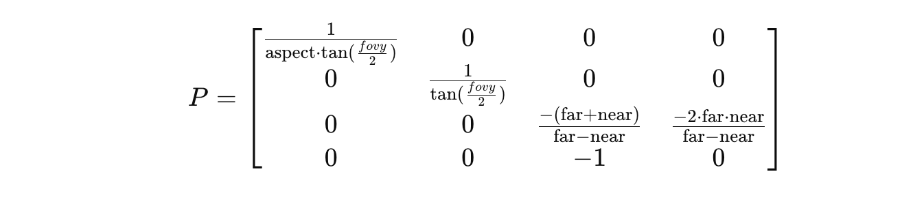
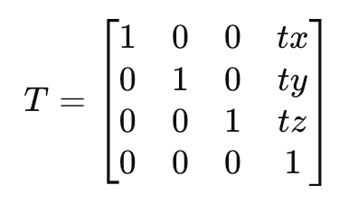
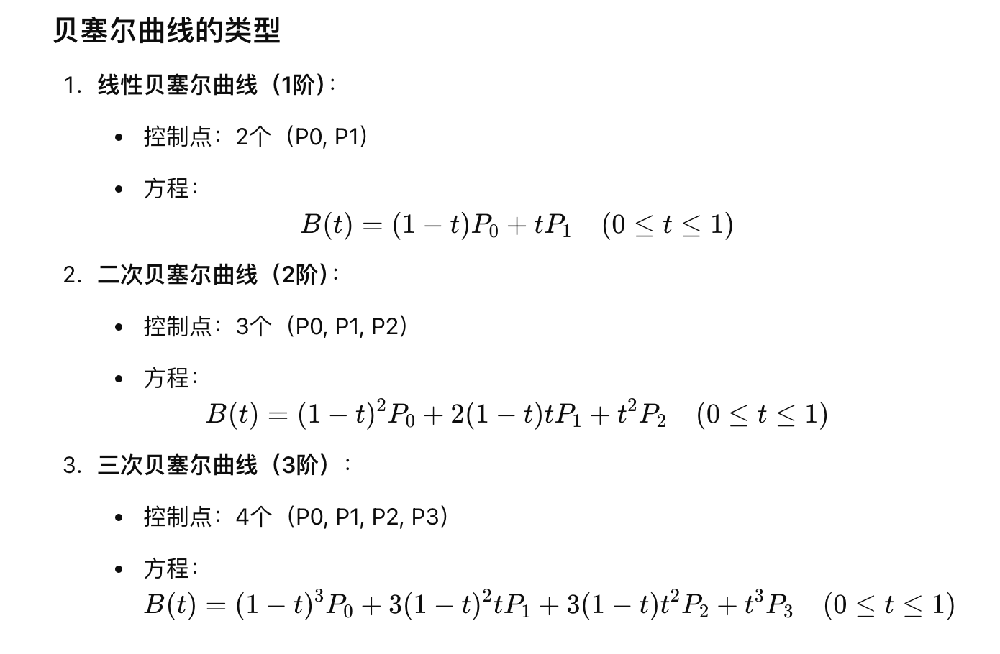
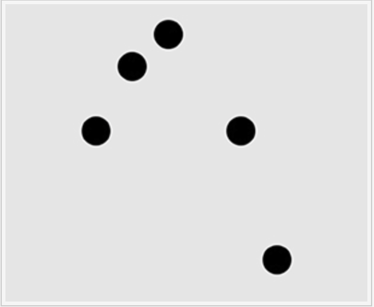
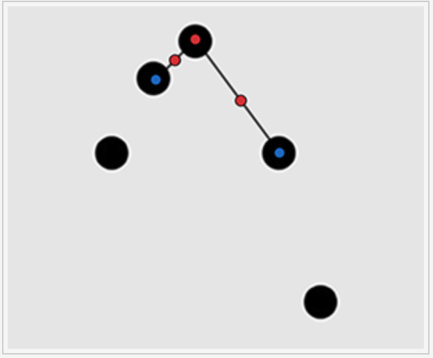
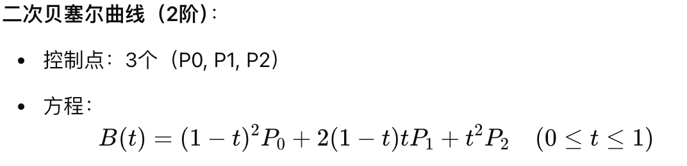
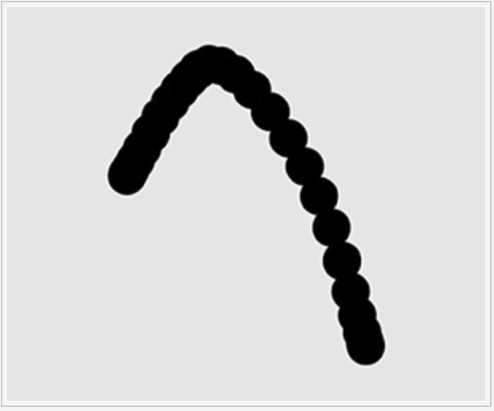

> <h1 id=""></h1>
- [**数据缓存步骤**](#数据缓存步骤)
- [**关键概念**](#关键概念)
	- [顶点缓冲区VBO(Vertex Buffer Object)](#顶点缓冲区VBO(VertexBufferObject))
	- [元素缓冲对象（EBO）](#元素缓冲对象（EBO）)
	- [帧缓冲对象（FBO）](#帧缓冲对象（FBO）)
	- [常量缓冲对象（CBO）](#常量缓冲对象（CBO）)
	- [像素缓冲对象（PBO）](#像素缓冲对象（PBO）)
- [**常用函数**](#常用函数)
	- [glViewport设置渲染区域](#glViewport设置渲染区域)
	- [GLuint glCreateShader(GLenum type)](#glCreateShader)
	- [glShaderSource将GLSL源代码绑定到着色器中](#glShaderSource将GLSL源代码绑定到着色器中)
	- [glGetShaderiv查询着色器状态](#glGetShaderiv查询着色器状态)
	- [glCreateProgram着色器程序对象](#glCreateProgram着色器程序对象)
	- [glBindAttribLocation](#glBindAttribLocation)
	- [glGenVertexArraysOES生成多个顶点数组对象](#glGenVertexArraysOES生成多个顶点数组对象)
	- [glBindVertexArrayOES绑定顶点数组对象](#glBindVertexArrayOES绑定顶点数组对象)
	- [视角（感觉就是放大和缩小）](#视角（感觉就是放大和缩小）)
	- [视距(其实物体在三维空间中沿着 x、y和z轴进行移动)](#视距(其实物体在三维空间中沿着x、y和z轴进行移动))
	- [glFramebufferTexture2D 将纹理（texture）附加到帧缓冲对象（FBO）中](#glFramebufferTexture2D)
	- [glBlendFunc颜色等混合](#glBlendFunc颜色等混合)
	- [glActiveTexture指定当前活跃纹理单元](#glActiveTexture指定当前活跃纹理单元)
	- [glUniform1i将纹理单元绑定到着色器中](#glUniform1i将纹理单元绑定到着色器中)
	- [glGetAttribLocation获取着色器程序中名为TextureCoords的顶点属性](#glGetAttribLocation获取着色器程序中名为TextureCoords的顶点属性)
- [**曲线绘制**](#曲线绘制)
	- [贝塞尔曲线了解](#贝塞尔曲线了解)
	- [如何绘制的不是折线而是曲线](#如何绘制的不是折线而是曲线)
- **资料**
	- [**OpenGL中文版**](https://learnopengl-cn.github.io/01%20Getting%20started/01%20OpenGL/)
	- [OpenGL学习资料合集（CSDN）](https://blog.csdn.net/kyl282889543/article/details/95727519)
	- [OpenGL很好的一个博客教程（CSDN）](https://blog.csdn.net/kyl282889543/category_9122773.html?spm=1001.2014.3001.5482)
	- [iOS视觉-OpenGL ES附带Swift源码（掘金）](https://juejin.cn/user/3021906185830247/posts)
	- [iOS视觉-- (04) OpenGL ES+GLSL实现金字塔解析(试用期demo帮助很大-简书)](https://www.jianshu.com/p/083f0fa63ced)
	- [iOS视觉-- (12) OpenGL ES+GLSL系列【桀骜不驯的搬砖者-掘金】](https://juejin.cn/user/3021906185830247/posts)
	- [OpenGLES实践教程-字节大佬【简书】](https://www.jianshu.com/nb/2135411)


<br/>

***
<br/><br/><br/>

> <h1 id="数据缓存步骤">数据缓存步骤</h1>


<br/>

***
<br/><br/><br/>

> <h1 id="关键概念">关键概念</h1>


<br/><br/><br/>
	
<h2 id="顶点缓冲区VBO(VertexBufferObject)">顶点缓冲区VBO(Vertex Buffer Object)</h2>

	
缓冲区（Buffer）在 OpenGL 中叫做 **VBO** 是因为它的全称是 **Vertex Buffer Object**，即**顶点缓冲对象**。VBO 是 OpenGL 用于管理顶点数据（如顶点坐标、法线、纹理坐标等）的缓冲区类型，存储在 GPU 内存中，从而提高渲染的效率。

### 详细解释

- **VBO 的定义**：
  VBO 是存储在 GPU 显存中的一块内存，用于存储顶点相关的数据。在现代 OpenGL 中，数据（如顶点位置、法线、纹理坐标）通常会放入一个缓冲区对象中，这样数据可以被 GPU 高效访问，并且不需要在每次绘制时重新传递到 GPU。VBO 是 OpenGL 用来表示这些顶点数据的特定缓冲区对象。

- **VBO 的作用**：
  - 提高性能：通过将顶点数据上传到 GPU 内存中，可以减少 CPU 和 GPU 之间的数据传输，特别是需要多次渲染的情况下。
  - 灵活性：VBO 可以用于存储不同类型的顶点数据，包括位置、颜色、法线、纹理坐标等。通过与 `glVertexAttribPointer` 结合，VBO 可以灵活地传递多种数据给顶点着色器。

### 为什么叫 VBO？

1. **Vertex**（顶点）：VBO 的主要用途是存储与顶点相关的数据（位置、法线、纹理坐标等）。在 OpenGL 的绘图管线中，顶点是组成图形的基本单元，因此顶点数据是渲染过程中最重要的数据之一。
   
2. **Buffer**（缓冲）：VBO 是一个缓冲区对象。缓冲区在计算机系统中通常表示一块内存区域，用于临时存储数据。在 VBO 中，它表示存储顶点数据的显存缓冲区。

3. **Object**（对象）：VBO 是 OpenGL 中的一个对象，它通过 OpenGL 函数调用（如 `glGenBuffers` 和 `glBindBuffer`）创建、绑定和使用。OpenGL 中的缓冲区对象是一个抽象的概念，程序员可以通过对象的句柄来管理显存中的数据。

### VBO 的使用流程

1. **创建缓冲区对象**：
   使用 `glGenBuffers` 函数生成一个缓冲区对象（VBO），并返回它的句柄：
   ```c
   GLuint vbo;
   glGenBuffers(1, &vbo);
   ```

2. **绑定缓冲区对象**：
   使用 `glBindBuffer` 函数绑定缓冲区对象到 OpenGL 上下文的某个缓冲区目标（通常是 `GL_ARRAY_BUFFER`，用于存储顶点数据）：
   ```c
   glBindBuffer(GL_ARRAY_BUFFER, vbo);
   ```

3. **上传数据到缓冲区对象**：
   使用 `glBufferData` 函数将数据上传到绑定的缓冲区中：
   ```c
   glBufferData(GL_ARRAY_BUFFER, sizeof(vertices), vertices, GL_STATIC_DRAW);
   ```

4. **使用 VBO 绘制图形**：
   通过 `glVertexAttribPointer` 函数告诉 OpenGL 如何解释这些缓冲区中的数据，并通过绘制命令（如 `glDrawArrays` 或 `glDrawElements`）进行渲染。

5. **解绑缓冲区对象**：
   完成操作后，可以通过绑定 `0` 来解绑当前缓冲区：
   ```c
   glBindBuffer(GL_ARRAY_BUFFER, 0);
   ```

### 总结

- **VBO** 是 OpenGL 中用于存储顶点数据的缓冲区对象，全称为 **Vertex Buffer Object**。
- 它允许将顶点数据上传到 GPU 中，以减少 CPU 与 GPU 之间的通信，提升渲染效率。
- VBO 的命名来源于其专门用于存储顶点数据（Vertex），作为一个缓冲区（Buffer）对象（Object）。


在 OpenGL 中，除了 **顶点缓冲对象（VBO）** 之外，还有多种类型的缓冲区，它们各自承担着不同的角色，以支持各种图形渲染需求。以下是几种常用的缓冲区及其详细介绍：


<br/><br/><br/>

> <h2 id="元素缓冲对象（EBO）">元素缓冲对象（EBO）</h2>

### 1. **元素缓冲对象（EBO / Index Buffer Object）**

- **定义**：元素缓冲对象（EBO）用于存储顶点的索引，允许在绘制时重用顶点数据，以减少内存使用和提高渲染性能。
- **用途**：特别适用于使用共享顶点的图形，如三角形、线段等。通过索引，多个图元可以共享相同的顶点数据，避免重复存储相同的顶点信息。
- **用法**：
  - 创建 EBO：
    ```c
    GLuint ebo;
    glGenBuffers(1, &ebo);
    ```
  - 绑定 EBO：
    ```c
    glBindBuffer(GL_ELEMENT_ARRAY_BUFFER, ebo);
    ```
  - 上传索引数据：
    ```c
    glBufferData(GL_ELEMENT_ARRAY_BUFFER, sizeof(indices), indices, GL_STATIC_DRAW);
    ```
  - 使用 `glDrawElements` 绘制图形：
    ```c
    glDrawElements(GL_TRIANGLES, numIndices, GL_UNSIGNED_INT, 0);
    ```

<br/><br/><br/>

> <h2 id="帧缓冲对象（FBO）">帧缓冲对象（FBO）</h2>

### 2. **帧缓冲对象（FBO / Frame Buffer Object）**

- **定义**：帧缓冲对象（FBO）是一种用于离屏渲染的缓冲区，允许 OpenGL 在一个不直接显示在屏幕上的目标上进行渲染。
- **用途**：用于实现后处理效果、阴影映射、反射等技术。可以创建多个附件（textures 或 renderbuffers）来存储颜色、深度和模板信息。
- **用法**：
  - 创建 FBO：
    ```c
    GLuint fbo;
    glGenFramebuffers(1, &fbo);
    ```
  - 绑定 FBO：
    ```c
    glBindFramebuffer(GL_FRAMEBUFFER, fbo);
    ```
  - 创建附件（例如纹理）：
    ```c
    GLuint texture;
    glGenTextures(1, &texture);
    glBindTexture(GL_TEXTURE_2D, texture);
    glTexImage2D(GL_TEXTURE_2D, 0, GL_RGBA, width, height, 0, GL_RGBA, GL_UNSIGNED_BYTE, NULL);
    glFramebufferTexture2D(GL_FRAMEBUFFER, GL_COLOR_ATTACHMENT0, GL_TEXTURE_2D, texture, 0);
    ```
  - 检查 FBO 状态：
    ```c
    if (glCheckFramebufferStatus(GL_FRAMEBUFFER) != GL_FRAMEBUFFER_COMPLETE) {
        // FBO 不完整，处理错误
    }
    ```

### 3. **渲染缓冲对象（RBO / Renderbuffer Object）**

- **定义**：渲染缓冲对象（RBO）用于存储渲染结果的内存对象，通常用于存储深度和模板信息。
- **用途**：与 FBO 结合使用时，RBO 可以提供深度测试或模板测试，而不需要存储在纹理中。
- **用法**：
  - 创建 RBO：
    ```c
    GLuint rbo;
    glGenRenderbuffers(1, &rbo);
    ```
  - 绑定 RBO：
    ```c
    glBindRenderbuffer(GL_RENDERBUFFER, rbo);
    ```
  - 指定 RBO 的存储格式：
    ```c
    glRenderbufferStorage(GL_RENDERBUFFER, GL_DEPTH24_STENCIL8, width, height);
    ```
  - 将 RBO 附加到 FBO：
    ```c
    glFramebufferRenderbuffer(GL_FRAMEBUFFER, GL_DEPTH_STENCIL_ATTACHMENT, GL_RENDERBUFFER, rbo);
    ```

<br/><br/><br/>

> <h2 id="常量缓冲对象（CBO）">常量缓冲对象（CBO）</h2>

### 4. **常量缓冲对象（CBO / Uniform Buffer Object）**

- **定义**：常量缓冲对象（CBO）是一种用于存储 uniform 变量的缓冲区，允许将多个 uniform 数据打包在一起并传递给着色器。
- **用途**：用于提高渲染效率，减少对 uniform 的多次调用，并支持共享 uniform 数据。
- **用法**：
  - 创建 CBO：
    ```c
    GLuint cbo;
    glGenBuffers(1, &cbo);
    ```
  - 绑定 CBO：
    ```c
    glBindBuffer(GL_UNIFORM_BUFFER, cbo);
    ```
  - 上传数据到 CBO：
    ```c
    glBufferData(GL_UNIFORM_BUFFER, sizeof(data), data, GL_STATIC_DRAW);
    ```
  - 绑定到着色器的绑定点：
    ```c
    GLuint bindingPoint = 0; // 绑定点索引
    glBindBufferBase(GL_UNIFORM_BUFFER, bindingPoint, cbo);
    glBindBufferRange(GL_UNIFORM_BUFFER, bindingPoint, cbo, 0, sizeof(data));
    ```

<br/><br/><br/>

> <h2 id="像素缓冲对象（PBO）">像素缓冲对象（PBO）</h2>

### 5. **像素缓冲对象（PBO / Pixel Buffer Object）**

- **定义**：像素缓冲对象（PBO）是一种专门用于异步纹理上传和读取的缓冲区，允许在 CPU 和 GPU 之间高效地传输像素数据。
- **用途**：用于提高纹理加载和更新的性能，尤其是在处理大量像素数据时。
- **用法**：
  - 创建 PBO：
    ```c
    GLuint pbo;
    glGenBuffers(1, &pbo);
    ```
  - 绑定 PBO：
    ```c
    glBindBuffer(GL_PIXEL_UNPACK_BUFFER, pbo);
    ```
  - 上传像素数据：
    ```c
    glBufferData(GL_PIXEL_UNPACK_BUFFER, size, NULL, GL_STREAM_DRAW);
    ```
  - 将数据写入 PBO，随后可以用于更新纹理：
    ```c
    void* ptr = glMapBuffer(GL_PIXEL_UNPACK_BUFFER, GL_WRITE_ONLY);
    memcpy(ptr, imageData, size);
    glUnmapBuffer(GL_PIXEL_UNPACK_BUFFER);
    ```

### 总结

OpenGL 提供了多种类型的缓冲区对象，以支持不同的渲染需求和性能优化。这些缓冲区对象允许开发者更有效地管理和传递数据给 GPU，促进高性能的图形渲染。每种缓冲区都有其特定的用途，理解它们的功能和用法对于优化 OpenGL 应用程序的性能至关重要。


<br/>

***
<br/><br/><br/>

> <h1 id="常用函数">常用函数</h1>

<br/><br/><br/>

> <h2 id="glViewport设置渲染区域">glViewport设置渲染区域</h2>

`glViewport` 是 OpenGL 中的一个重要函数，用于设置视口（viewport）的大小和位置。视口定义了渲染的区域，通常对应于窗口的大小。以下是对 `glViewport` 函数的详细解释：

### 函数原型
```swift
public func glViewport(_ x: GLint, _ y: GLint, _ width: GLsizei, _ height: GLsizei)
```

### 参数详解

1. **`_ x: GLint`**:
   - 指定视口的左下角的 x 坐标。该坐标是相对于窗口的左下角的。

2. **`_ y: GLint`**:
   - 指定视口的左下角的 y 坐标。该坐标也是相对于窗口的左下角的。

3. **`_ width: GLsizei`**:
   - 指定视口的宽度，以像素为单位。

4. **`_ height: GLsizei`**:
   - 指定视口的高度，以像素为单位。

### 功能和用途

- **定义渲染区域**: `glViewport` 设置了 OpenGL 渲染的区域，这意味着所有的渲染输出将被限制在这个指定的矩形区域内。常用于控制图形的显示位置和大小。
  
- **适应窗口大小**: 在窗口大小改变时，通常需要调用 `glViewport` 来调整视口的大小，以确保渲染图形正确适应新窗口大小。例如，在窗口重塑时，应该重新设置视口。

- **多视口渲染**: 通过多次调用 `glViewport`，可以在同一个窗口中渲染多个视口。这在需要分屏显示或实现小地图、用户界面元素等时非常有用。

### 示例

以下是一个使用 `glViewport` 的简单示例：

```swift
// 窗口大小改变时调用
func reshape(width: Int, height: Int) {
    glViewport(0, 0, GLsizei(width), GLsizei(height)) // 将视口设置为窗口的大小
}

// 在渲染循环中
func render() {
    glClear(GL_COLOR_BUFFER_BIT | GL_DEPTH_BUFFER_BIT) // 清除缓冲区

    // 渲染代码
}
```

### 总结

`glViewport` 是 OpenGL 中用于控制渲染区域的函数，允许开发者定义图形输出的区域位置和大小。通过合理使用 `glViewport`，可以确保图形在不同窗口尺寸和布局下的正确显示，支持多视口渲染等高级特性。


<br/><br/><br/>

> <h2 id="glCreateShader">GLuint glCreateShader(GLenum type)</h2>

`glCreateShader(type)` 是 OpenGL 中用于创建着色器对象的函数，它返回一个用于后续操作的着色器对象句柄。

**函数签名**

```c
GLuint glCreateShader(GLenum type);
```

<br/>

**参数详解**

- **`type`**：指定要创建的着色器的类型。该参数可以是以下几种之一：
  - `GL_VERTEX_SHADER`: 创建一个顶点着色器对象（Vertex Shader）。
  - `GL_FRAGMENT_SHADER`: 创建一个片段着色器对象（Fragment Shader）。
  - `GL_GEOMETRY_SHADER`: 创建几何着色器（Geometry Shader）。
  - `GL_TESS_CONTROL_SHADER`: 创建细分控制着色器（Tessellation Control Shader）。
  - `GL_TESS_EVALUATION_SHADER`: 创建细分评估着色器（Tessellation Evaluation Shader）。
  - `GL_COMPUTE_SHADER`: 创建计算着色器（Compute Shader）。

<br/>

**返回值**

- **`GLuint`**: 该函数返回一个无符号整数（`GLuint`），用于标识新创建的着色器对象。如果创建失败，返回 `0`。

<br/>

**用途**

创建着色器对象是编写 OpenGL 着色器程序的第一步。通过调用 `glCreateShader`，OpenGL 分配一个新的着色器对象，并为它分配一个句柄，该句柄可用于后续的着色器编译、链接等操作。

创建的着色器对象是空的，需要通过 `glShaderSource` 为其指定 GLSL 源代码，然后调用 `glCompileShader` 编译。

<br/> <br/>

**示例**

下面是一个简单的示例，展示了如何使用 `glCreateShader` 创建一个顶点和片段着色器。

```c
// 创建顶点着色器
GLuint vertexShader = glCreateShader(GL_VERTEX_SHADER);

// 创建片段着色器
GLuint fragmentShader = glCreateShader(GL_FRAGMENT_SHADER);

// 为顶点着色器和片段着色器指定 GLSL 源代码
const char* vertexShaderSource = "..."; // 顶点着色器代码
const char* fragmentShaderSource = "..."; // 片段着色器代码

glShaderSource(vertexShader, 1, &vertexShaderSource, NULL);
glShaderSource(fragmentShader, 1, &fragmentShaderSource, NULL);

// 编译着色器
glCompileShader(vertexShader);
glCompileShader(fragmentShader);

// 检查编译是否成功（可以使用 glGetShaderiv 和 glGetShaderInfoLog 获取错误信息）

// 如果编译成功，后续还需要将着色器对象附加到程序对象，并链接程序
GLuint shaderProgram = glCreateProgram();
glAttachShader(shaderProgram, vertexShader);
glAttachShader(shaderProgram, fragmentShader);
glLinkProgram(shaderProgram);

// 链接完成后可以删除着色器对象，因为它们已经被程序使用
glDeleteShader(vertexShader);
glDeleteShader(fragmentShader);
```

<br/>

**典型工作流程**

1. **创建着色器对象**：使用 `glCreateShader(type)` 创建顶点、片段或其他类型的着色器对象。
2. **设置着色器源代码**：使用 `glShaderSource` 为着色器对象提供 GLSL 源代码。
3. **编译着色器**：调用 `glCompileShader` 编译 GLSL 代码。
4. **检查编译结果**：通过 `glGetShaderiv` 和 `glGetShaderInfoLog` 获取编译状态和错误日志。
5. **链接到程序对象**：将编译好的着色器对象通过 `glAttachShader` 附加到程序对象中。
6. **删除着色器对象**：在不需要直接引用着色器对象时，可以通过 `glDeleteShader` 删除它们，因为它们已经链接到程序对象。

<br/>

 **注意事项**

- **编译错误**：着色器代码在编译时可能会产生错误，如语法错误或变量声明不正确。在编译着色器后，应该检查编译状态并获取错误信息。
- **资源管理**：在着色器成功编译并链接到程序对象后，可以通过 `glDeleteShader` 释放掉着色器对象，因为它们已经被程序对象引用，不再需要单独的着色器对象。
- **不同着色器类型的组合**：通常需要将多个不同类型的着色器（如顶点和片段着色器）组合在一起，构成完整的渲染管线。

<br/>

**总结**

`glCreateShader(type)` 是 OpenGL 中用于创建指定类型的着色器对象的函数。该函数用于生成顶点、片段等着色器的句柄，是实现 OpenGL 渲染管线的重要步骤。


<br/><br/><br/>

> <h2 id="glShaderSource将GLSL源代码绑定到着色器中"> glShaderSource将GLSL源代码绑定到着色器中 </h2>

`glShaderSource` 是 OpenGL 中的一个函数，用于将 GLSL 源代码绑定到一个着色器对象中。在创建了一个着色器对象后（通常通过 `glCreateShader`），需要使用 `glShaderSource` 来为着色器对象指定实际的着色器代码。

### 函数签名

```c
void glShaderSource(GLuint shader, GLsizei count, const GLchar** string, const GLint* length);
```

### 参数详解

1. **`shader`**:  
   这是一个 `GLuint` 类型的参数，表示要为其设置源代码的着色器对象的句柄。这个句柄通常由 `glCreateShader` 创建。

2. **`count`**:  
   一个 `GLsizei` 类型的参数，表示传入的 `string` 数组中包含的字符串数量。如果你只传入一个完整的着色器源代码字符串，`count` 通常为 `1`。可以将着色器代码拆分成多个字符串并传入。

3. **`string`**:  
   这是一个指向 `GLchar` 字符串数组的指针（即包含 GLSL 源代码的字符串数组）。每个元素都是一个 C 样式字符串。你可以将着色器代码拆分为多个部分，并使用数组的形式传入。每个字符串都表示着色器代码的一部分。

4. **`length`**:  
   这是一个指向 `GLint` 数组的指针，数组的每个元素表示 `string` 中每个字符串的长度。如果某个元素的值是 `NULL` 或负数，则表示相应的字符串是以 `NULL` 终止的 C 样式字符串。

   - 如果不指定 `length`（即传递 `NULL`），OpenGL 假定每个字符串都是以 `NULL` 终止的。

### 用途

`glShaderSource` 函数将 GLSL 源代码字符串绑定到着色器对象中。绑定后，可以通过 `glCompileShader` 编译该着色器，并将其附加到 OpenGL 程序对象中进行链接。

### 工作流程

1. **创建着色器对象**：首先需要调用 `glCreateShader` 来创建一个着色器对象。
2. **绑定 GLSL 源代码**：通过 `glShaderSource` 将源代码传递给着色器对象。
3. **编译着色器**：使用 `glCompileShader` 编译源代码。
4. **检查编译结果**：调用 `glGetShaderiv` 和 `glGetShaderInfoLog` 检查编译状态和获取错误日志。
5. **链接到程序对象**：将编译好的着色器对象通过 `glAttachShader` 附加到程序对象中，随后调用 `glLinkProgram` 链接整个程序。

### 示例

以下是一个完整的示例，展示了如何使用 `glShaderSource` 函数来指定着色器的 GLSL 代码并进行编译：

```c
// 创建顶点着色器
GLuint vertexShader = glCreateShader(GL_VERTEX_SHADER);

// 定义顶点着色器的 GLSL 源代码
const GLchar* vertexShaderSource = 
    "#version 330 core\n"
    "layout (location = 0) in vec3 aPos;\n"
    "void main()\n"
    "{\n"
    "   gl_Position = vec4(aPos, 1.0);\n"
    "}\n";

// 为顶点着色器对象设置源代码
glShaderSource(vertexShader, 1, &vertexShaderSource, NULL);

// 编译顶点着色器
glCompileShader(vertexShader);

// 检查编译结果
GLint success;
glGetShaderiv(vertexShader, GL_COMPILE_STATUS, &success);
if (!success) {
    char infoLog[512];
    glGetShaderInfoLog(vertexShader, 512, NULL, infoLog);
    printf("ERROR::SHADER::VERTEX::COMPILATION_FAILED\n%s\n", infoLog);
}

// 创建片段着色器
GLuint fragmentShader = glCreateShader(GL_FRAGMENT_SHADER);

// 定义片段着色器的 GLSL 源代码
const GLchar* fragmentShaderSource = 
    "#version 330 core\n"
    "out vec4 FragColor;\n"
    "void main()\n"
    "{\n"
    "   FragColor = vec4(1.0, 0.5, 0.2, 1.0);\n"
    "}\n";

// 为片段着色器对象设置源代码
glShaderSource(fragmentShader, 1, &fragmentShaderSource, NULL);

// 编译片段着色器
glCompileShader(fragmentShader);

// 检查编译结果
glGetShaderiv(fragmentShader, GL_COMPILE_STATUS, &success);
if (!success) {
    char infoLog[512];
    glGetShaderInfoLog(fragmentShader, 512, NULL, infoLog);
    printf("ERROR::SHADER::FRAGMENT::COMPILATION_FAILED\n%s\n", infoLog);
}

// 创建一个着色器程序
GLuint shaderProgram = glCreateProgram();

// 附加编译好的顶点和片段着色器
glAttachShader(shaderProgram, vertexShader);
glAttachShader(shaderProgram, fragmentShader);

// 链接着色器程序
glLinkProgram(shaderProgram);

// 检查链接结果
glGetProgramiv(shaderProgram, GL_LINK_STATUS, &success);
if (!success) {
    glGetProgramInfoLog(shaderProgram, 512, NULL, infoLog);
    printf("ERROR::SHADER::PROGRAM::LINKING_FAILED\n%s\n", infoLog);
}

// 使用着色器程序
glUseProgram(shaderProgram);

// 删除不再需要的着色器对象
glDeleteShader(vertexShader);
glDeleteShader(fragmentShader);
```

### 参数 `length` 的使用

`length` 数组用于明确指定 GLSL 源代码的每个字符串的长度。如果传递 `NULL`，OpenGL 假定每个字符串都以 `NULL` 结束。但在某些情况下，明确指定字符串的长度会更加高效，特别是当你需要传入包含 `NULL` 字符的代码段时。

例如，假设你有多个 GLSL 源代码段：

```c
const GLchar* shaderParts[] = {
    "#version 330 core\n",
    "layout (location = 0) in vec3 aPos;\n",
    "void main() {\n",
    "   gl_Position = vec4(aPos, 1.0);\n",
    "}\n"
};

// 如果你想明确指定每个段落的长度
GLint lengths[] = {
    strlen(shaderParts[0]),
    strlen(shaderParts[1]),
    strlen(shaderParts[2]),
    strlen(shaderParts[3])
};

// 为着色器对象设置源代码
glShaderSource(vertexShader, 4, shaderParts, lengths);
```

### 注意事项

- **多字符串支持**：`glShaderSource` 可以传入多个字符串，通过 `count` 和 `string` 数组来传递多个代码片段。这在需要动态生成着色器代码或使用多个部分来组合着色器时非常有用。
- **长度管理**：如果源代码包含 `NULL` 字符，明确传入 `length` 数组可以避免潜在的错误。否则，OpenGL 会依赖 `NULL` 终止符来确定字符串结束。

### 总结

`glShaderSource` 是用于将 GLSL 源代码加载到着色器对象中的关键函数。它允许通过多个字符串指定着色器代码，并在编译着色器之前将代码绑定到着色器对象中。


<br/><br/><br/>

> <h2 id="glGetShaderiv查询着色器状态">glGetShaderiv查询着色器状态</h2>

`glGetShaderiv` 是 OpenGL 用于查询着色器对象状态的函数。它可以获取着色器对象的多种信息，如编译状态、错误信息等。通常在编译着色器后使用它来检查编译是否成功，以及是否有任何编译错误。

### 函数签名

```c
void glGetShaderiv(GLuint shader, GLenum pname, GLint* params);
```

### 参数详解

1. **`shader`**:  
   这是一个 `GLuint` 类型的参数，表示要查询的着色器对象的句柄。这个句柄是在之前通过 `glCreateShader` 创建的。

2. **`pname`**:  
   这是一个 `GLenum` 类型的参数，指定要查询的着色器对象属性。可以查询的信息包括：
   - `GL_COMPILE_STATUS`: 编译状态，指示着色器是否成功编译。
   - `GL_SHADER_TYPE`: 着色器的类型（如 `GL_VERTEX_SHADER` 或 `GL_FRAGMENT_SHADER`）。
   - `GL_DELETE_STATUS`: 着色器对象是否被标记为删除。
   - `GL_INFO_LOG_LENGTH`: 着色器编译或验证日志的长度。
   - `GL_SHADER_SOURCE_LENGTH`: GLSL 源代码的长度。

3. **`params`**:  
   这是一个指向 `GLint` 的指针，用于存储查询结果。`glGetShaderiv` 会将请求的 `pname` 对应的信息存储到这个指针指向的内存中。

### 用途

- `glGetShaderiv` 函数常用于在编译着色器后，检查着色器的编译状态，以确保编译是否成功。
- 还可以用来获取日志的长度，以便后续调用 `glGetShaderInfoLog` 获取编译日志。
- 此外，它也可以查询着色器的其他信息，如着色器类型等。

### 典型用法

在编译着色器之后，使用 `glGetShaderiv` 检查编译是否成功。如果编译失败，可以调用 `glGetShaderInfoLog` 获取详细的编译错误信息。

### 示例

以下是一个使用 `glGetShaderiv` 来检查着色器编译状态的示例：

```c
// 创建顶点着色器对象
GLuint vertexShader = glCreateShader(GL_VERTEX_SHADER);

// 定义顶点着色器的 GLSL 源代码
const char* vertexShaderSource = 
    "#version 330 core\n"
    "layout (location = 0) in vec3 aPos;\n"
    "void main()\n"
    "{\n"
    "   gl_Position = vec4(aPos, 1.0);\n"
    "}\n";

// 设置顶点着色器的源代码
glShaderSource(vertexShader, 1, &vertexShaderSource, NULL);

// 编译顶点着色器
glCompileShader(vertexShader);

// 使用 glGetShaderiv 检查编译状态
GLint success;
glGetShaderiv(vertexShader, GL_COMPILE_STATUS, &success);

if (!success) {
    // 获取编译错误信息
    char infoLog[512];
    glGetShaderInfoLog(vertexShader, 512, NULL, infoLog);
    printf("ERROR::SHADER::VERTEX::COMPILATION_FAILED\n%s\n", infoLog);
}
```

### `pname` 参数的可能值

1. **`GL_COMPILE_STATUS`**:  
   编译状态，指示着色器是否成功编译。返回值为 `GL_TRUE`（成功）或 `GL_FALSE`（失败）。
   ```c
   GLint success;
   glGetShaderiv(shader, GL_COMPILE_STATUS, &success);
   ```

2. **`GL_SHADER_TYPE`**:  
   返回着色器的类型（如 `GL_VERTEX_SHADER`, `GL_FRAGMENT_SHADER` 等）。
   ```c
   GLint shaderType;
   glGetShaderiv(shader, GL_SHADER_TYPE, &shaderType);
   ```

3. **`GL_INFO_LOG_LENGTH`**:  
   返回着色器编译日志的长度。可以使用这个值为日志分配合适的缓冲区，然后调用 `glGetShaderInfoLog` 获取编译日志。
   ```c
   GLint logLength;
   glGetShaderiv(shader, GL_INFO_LOG_LENGTH, &logLength);
   ```

4. **`GL_SHADER_SOURCE_LENGTH`**:  
   返回着色器源代码的长度。这可以用于查询通过 `glShaderSource` 传入的 GLSL 源代码的长度。
   ```c
   GLint sourceLength;
   glGetShaderiv(shader, GL_SHADER_SOURCE_LENGTH, &sourceLength);
   ```

5. **`GL_DELETE_STATUS`**:  
   返回着色器对象的删除状态。如果着色器对象被标记为删除（通过 `glDeleteShader`），返回 `GL_TRUE`；否则返回 `GL_FALSE`。

### 示例：获取编译日志长度并打印日志

以下是一个使用 `glGetShaderiv` 和 `glGetShaderInfoLog` 打印着色器编译日志的示例：

```c
// 编译顶点着色器
glCompileShader(vertexShader);

// 检查编译状态
GLint success;
glGetShaderiv(vertexShader, GL_COMPILE_STATUS, &success);

if (!success) {
    // 获取日志长度
    GLint logLength;
    glGetShaderiv(vertexShader, GL_INFO_LOG_LENGTH, &logLength);

    // 为日志分配合适的空间
    char* infoLog = (char*)malloc(logLength);

    // 获取日志内容
    glGetShaderInfoLog(vertexShader, logLength, NULL, infoLog);

    // 打印日志
    printf("ERROR::SHADER::VERTEX::COMPILATION_FAILED\n%s\n", infoLog);

    // 释放日志空间
    free(infoLog);
}
```

### 注意事项

- **错误检查**：在调用 `glCompileShader` 编译着色器后，最好使用 `glGetShaderiv` 来检查编译状态。不要假设编译总是成功的，因为 GLSL 源代码中可能存在语法错误或其他问题。
- **日志长度**：在获取日志时，首先需要使用 `glGetShaderiv` 来确定日志的长度，然后分配合适的缓冲区空间以获取日志。

### 总结

`glGetShaderiv` 是一个非常重要的工具，用于查询 OpenGL 着色器对象的状态，特别是编译状态和错误信息。通过它，可以轻松地检查着色器是否编译成功，并在编译失败时获取详细的错误日志，帮助开发人员调试 GLSL 代码。


<br/><br/><br/>

> <h2 id="glCreateProgram着色器程序对象"> glCreateProgram着色器程序对象</h2>

`glCreateProgram` 是 OpenGL 中用于创建一个空的着色器程序对象的函数。它是着色器编译、链接流程中的第一步，用于将多个已编译的着色器对象（如顶点着色器和片段着色器）链接成一个完整的着色器程序，以便 GPU 执行。

### 函数签名

```c
GLuint glCreateProgram(void);
```

### 返回值

- **`GLuint`**：返回一个表示着色器程序对象的句柄（ID），这个句柄唯一标识着这个着色器程序。如果创建失败，则返回 `0`。

### 用途

`glCreateProgram` 主要用于以下情况：

1. **创建一个空的着色器程序**：该程序将包含多个着色器阶段的二进制代码。
2. **链接不同的着色器**：通过 `glAttachShader` 将已经编译好的着色器附加到这个程序对象上。
3. **激活和使用该程序**：通过 `glUseProgram` 激活程序后，可以使用该程序进行图形渲染。

### 使用流程

1. 调用 `glCreateProgram` 创建一个程序对象。
2. 使用 `glAttachShader` 附加已编译的着色器对象（如顶点着色器、片段着色器）。
3. 调用 `glLinkProgram` 链接着色器程序。
4. 使用 `glUseProgram` 激活着色器程序。
5. （可选）调用 `glDeleteProgram` 删除程序对象以释放资源。

### 示例

以下示例展示如何创建着色器程序，并将顶点和片段着色器附加到该程序对象上：

```c
// 创建着色器程序对象
GLuint shaderProgram = glCreateProgram();

// 创建并编译顶点着色器
GLuint vertexShader = glCreateShader(GL_VERTEX_SHADER);
const char* vertexShaderSource = "#version 330 core\n"
                                 "layout (location = 0) in vec3 aPos;\n"
                                 "void main()\n"
                                 "{\n"
                                 "    gl_Position = vec4(aPos, 1.0);\n"
                                 "}\n";
glShaderSource(vertexShader, 1, &vertexShaderSource, NULL);
glCompileShader(vertexShader);

// 创建并编译片段着色器
GLuint fragmentShader = glCreateShader(GL_FRAGMENT_SHADER);
const char* fragmentShaderSource = "#version 330 core\n"
                                   "out vec4 FragColor;\n"
                                   "void main()\n"
                                   "{\n"
                                   "    FragColor = vec4(1.0, 0.5, 0.2, 1.0);\n"
                                   "}\n";
glShaderSource(fragmentShader, 1, &fragmentShaderSource, NULL);
glCompileShader(fragmentShader);

// 将编译好的顶点和片段着色器附加到程序对象上
glAttachShader(shaderProgram, vertexShader);
glAttachShader(shaderProgram, fragmentShader);

// 链接着色器程序
glLinkProgram(shaderProgram);

// 检查链接是否成功
GLint success;
glGetProgramiv(shaderProgram, GL_LINK_STATUS, &success);
if (!success) {
    char infoLog[512];
    glGetProgramInfoLog(shaderProgram, 512, NULL, infoLog);
    printf("ERROR::SHADER::PROGRAM::LINKING_FAILED\n%s\n", infoLog);
}

// 激活着色器程序
glUseProgram(shaderProgram);

// 删除着色器对象，因为它们已经链接到程序中
glDeleteShader(vertexShader);
glDeleteShader(fragmentShader);
```

### 链接着色器程序

一旦所有的着色器都附加到程序对象上，必须调用 `glLinkProgram` 来完成着色器的链接操作，将它们组合成一个完整的着色器程序。然后可以调用 `glUseProgram` 来激活该程序并开始使用它进行绘制。

```c
glLinkProgram(shaderProgram);
glUseProgram(shaderProgram);
```

### 常用函数

- **`glAttachShader`**：将已编译的着色器附加到程序对象。
- **`glLinkProgram`**：链接程序对象，生成可供 GPU 执行的二进制代码。
- **`glUseProgram`**：使用该程序对象进行渲染。
- **`glDeleteProgram`**：删除着色器程序，释放资源。

### 错误检查

- 链接完成后，可以通过 `glGetProgramiv` 和 `glGetProgramInfoLog` 检查链接状态和错误信息。
- 示例代码中展示了如何使用 `glGetProgramiv` 来检查链接状态。

### 注意事项

1. **在链接之后删除着色器对象**：当着色器对象被成功链接到程序对象后，可以调用 `glDeleteShader` 删除它们，因为它们已经被程序引用，不再需要保留原始的着色器对象。
2. **链接失败的原因**：链接失败的常见原因可能是由于着色器间的数据类型不匹配、变量未正确传递等。通过 `glGetProgramInfoLog` 可以查看详细的错误信息。

### 总结

`glCreateProgram` 是创建 OpenGL 着色器程序对象的基础函数，它允许我们将多个已编译的着色器链接在一起，形成一个完整的程序。通过这个程序，GPU 可以执行复杂的着色器逻辑，生成所需的图形效果。

<br/><br/><br/>

> <h2 id="glBindAttribLocation">glBindAttribLocation</h2>

`glBindAttribLocation` 是 OpenGL 中用于指定在顶点着色器中使用的顶点属性的索引的函数。它的作用是将顶点属性的名称与属性位置进行绑定，以便在渲染时使用。

### 函数签名

```c
void glBindAttribLocation(GLuint program, GLuint index, const GLchar* name);
```

### 参数详解

1. **`program`**:  
   这是一个 `GLuint` 类型的参数，表示要绑定属性的位置的程序对象的 ID。这个程序对象通常是在之前通过 `glCreateProgram` 创建的。

2. **`index`**:  
   这是一个 `GLuint` 类型的参数，表示要绑定的属性位置索引。该索引将在顶点着色器中使用，以指定顶点属性的位置。

3. **`name`**:  
   这是一个指向以 null 结尾的字符串的指针，表示要绑定的顶点属性的名称。这个名称应该与顶点着色器中的输入变量名称相对应。

### 用途

- `glBindAttribLocation` 用于在链接程序之前将顶点属性的名称与程序中的索引绑定。这有助于确保在渲染时，顶点数据可以正确传递到着色器的输入变量。
- 在默认情况下，OpenGL 会自动为顶点属性分配索引，但使用 `glBindAttribLocation` 可以手动指定这些索引，提供更好的控制和一致性。

### 使用流程

1. 创建程序对象（使用 `glCreateProgram`）。
2. 使用 `glBindAttribLocation` 绑定顶点属性名称与索引。
3. 附加着色器并链接程序（使用 `glAttachShader` 和 `glLinkProgram`）。
4. 使用程序进行渲染。

### 示例

以下是一个简单的示例，演示如何使用 `glBindAttribLocation` 绑定顶点属性：

```c
// 创建程序对象
GLuint shaderProgram = glCreateProgram();

// 绑定顶点属性
glBindAttribLocation(shaderProgram, 0, "aPos"); // 绑定位置属性
glBindAttribLocation(shaderProgram, 1, "aColor"); // 绑定颜色属性

// 创建顶点着色器
GLuint vertexShader = glCreateShader(GL_VERTEX_SHADER);
const char* vertexShaderSource = 
    "#version 330 core\n"
    "layout (location = 0) in vec3 aPos;\n"   // 顶点位置
    "layout (location = 1) in vec3 aColor;\n"  // 顶点颜色
    "out vec3 vertexColor;\n"                   // 输出颜色到片段着色器
    "void main()\n"
    "{\n"
    "   gl_Position = vec4(aPos, 1.0);\n"
    "   vertexColor = aColor;\n"
    "}\n";

glShaderSource(vertexShader, 1, &vertexShaderSource, NULL);
glCompileShader(vertexShader);

// 创建片段着色器
GLuint fragmentShader = glCreateShader(GL_FRAGMENT_SHADER);
const char* fragmentShaderSource = 
    "#version 330 core\n"
    "in vec3 vertexColor;\n"
    "out vec4 FragColor;\n"
    "void main()\n"
    "{\n"
    "   FragColor = vec4(vertexColor, 1.0);\n"
    "}\n";

glShaderSource(fragmentShader, 1, &fragmentShaderSource, NULL);
glCompileShader(fragmentShader);

// 将着色器附加到程序对象
glAttachShader(shaderProgram, vertexShader);
glAttachShader(shaderProgram, fragmentShader);

// 链接程序
glLinkProgram(shaderProgram);

// 使用程序
glUseProgram(shaderProgram);

// 绑定 VAO 及绘制
```

### 注意事项

1. **绑定顺序**：必须在链接程序之前调用 `glBindAttribLocation`，否则绑定将无效。
2. **名称匹配**：属性名称必须与顶点着色器中的输入变量名称完全匹配。否则，绑定将不会成功，OpenGL 可能会生成未定义行为。
3. **索引范围**：在使用 `glBindAttribLocation` 绑定属性时，`index` 值应该是有效的，通常范围在 0 到最大属性数（由 `GL_MAX_VERTEX_ATTRIBS` 限定）。

### 典型错误

- **属性未定义**：如果在绑定属性时提供的名称在着色器中没有定义，程序链接时会失败。
- **索引重复**：如果多个属性绑定到了同一个索引，OpenGL 会使用最后一个绑定的属性，这可能导致未预期的行为。

### 总结

`glBindAttribLocation` 是 OpenGL 中用于手动绑定顶点属性索引的函数，可以提高渲染管线的灵活性和控制力。通过这种方式，开发者可以更好地管理着色器中的输入属性，确保它们在渲染时正确传递。


<br/><br/><br/>

> <h2 id="glGenVertexArraysOES生成多个顶点数组对象">glGenVertexArraysOES生成多个顶点数组对象</h2>

`glGenVertexArraysOES` 是 OpenGL ES 的一个扩展函数，主要用于生成一个或多个顶点数组对象（Vertex Array Objects，VAOs）。VAO 是 OpenGL 中用于存储与顶点缓冲区对象（VBOs）相关联的状态（如属性指针、缓冲区绑定等）的对象。它能够简化渲染过程中的状态管理，尤其是在处理多个不同的顶点格式时。

### 函数签名

```c
void glGenVertexArraysOES(GLsizei n, GLuint *arrays);
```

### 参数详解

1. **`n`**:  
   这是一个 `GLsizei` 类型的参数，表示要生成的 VAO 的数量。

2. **`arrays`**:  
   这是一个指向 `GLuint` 的指针，用于存储生成的 VAO 的 ID。在调用后，数组中的每个元素将包含一个唯一的 VAO 句柄。

### 用途

- `glGenVertexArraysOES` 用于创建 VAO，以便可以将顶点属性与对应的缓冲区绑定在一起。通过使用 VAO，可以在渲染时快速切换不同的顶点格式和数据布局。
- 在使用 VAO 时，程序可以将顶点状态封装在一个对象中，简化了渲染代码，使得在需要改变顶点格式时更加高效。

### 使用流程

1. 调用 `glGenVertexArraysOES` 生成 VAO。
2. 使用 `glBindVertexArray` 绑定 VAO，以设置与该 VAO 相关的顶点属性。
3. 使用 `glBindBuffer` 将 VBO 绑定到相应的目标（如 `GL_ARRAY_BUFFER`）。
4. 使用 `glVertexAttribPointer` 设置顶点属性指针。
5. 在渲染循环中，通过绑定不同的 VAO 来快速切换渲染状态。

### 示例

以下是一个简单的示例，展示如何使用 `glGenVertexArraysOES` 生成 VAO，并将其与顶点缓冲区对象绑定：

```c
// 定义 VAO 和 VBO 的 ID
GLuint vao, vbo;

// 生成 VAO
glGenVertexArraysOES(1, &vao);

// 生成 VBO
glGenBuffers(1, &vbo);

// 绑定 VAO
glBindVertexArray(vao);

// 绑定 VBO
glBindBuffer(GL_ARRAY_BUFFER, vbo);

// 为 VBO 提供数据
float vertices[] = {
    // 位置数据
    -0.5f, -0.5f, 0.0f, // 左下角
     0.5f, -0.5f, 0.0f, // 右下角
     0.0f,  0.5f, 0.0f  // 顶部
};
glBufferData(GL_ARRAY_BUFFER, sizeof(vertices), vertices, GL_STATIC_DRAW);

// 设置顶点属性指针
glVertexAttribPointer(0, 3, GL_FLOAT, GL_FALSE, 3 * sizeof(float), (void*)0);
glEnableVertexAttribArray(0);

// 解绑 VBO（不解绑 VAO）
glBindBuffer(GL_ARRAY_BUFFER, 0);

// 解绑 VAO
glBindVertexArray(0);

// 在渲染循环中使用 VAO
glBindVertexArray(vao);
glDrawArrays(GL_TRIANGLES, 0, 3);
glBindVertexArray(0); // 可选，解绑 VAO
```

### 注意事项

1. **VAO 绑定**: 绑定 VAO 时，所有后续的 VBO 和顶点属性指针设置都会与该 VAO 关联，直到下次绑定另一个 VAO。
2. **状态管理**: VAO 不仅存储顶点属性指针，也记录了当前绑定的 VBO，因此可以通过 VAO 方便地管理顶点状态。
3. **扩展支持**: `glGenVertexArraysOES` 是 OpenGL ES 的扩展，确保使用该函数的上下文支持此扩展。在 OpenGL ES 3.0 及以上版本中，VAO 是核心功能，建议使用 `glGenVertexArrays`。

### 总结

`glGenVertexArraysOES` 是一个重要的函数，用于创建顶点数组对象，帮助简化 OpenGL ES 渲染管线中的状态管理。通过 VAO，可以更有效地管理顶点数据，快速切换不同的渲染状态，从而提高渲染性能和灵活性。


<br/><br/><br/>

> <h2 id="glBindVertexArrayOES绑定顶点数组对象">glBindVertexArrayOES绑定顶点数组对象</h2>
`glBindVertexArrayOES` 是 OpenGL ES 中用于绑定一个顶点数组对象（Vertex Array Object, VAO）的函数。绑定 VAO 使得与该 VAO 相关的顶点状态（如顶点属性和缓冲区绑定）变得活跃，之后的所有绘制调用都会使用这个 VAO。

### 函数签名

```c
void glBindVertexArrayOES(GLuint array);
```

### 参数详解

- **`array`**:  
  这是一个 `GLuint` 类型的参数，表示要绑定的 VAO 的 ID。该 ID 应该是先前通过 `glGenVertexArraysOES` 创建的。

### 用途

- `glBindVertexArrayOES` 的主要用途是设置当前上下文中的 VAO，以便 OpenGL 知道在随后的绘制调用中使用哪个 VAO。
- VAO 存储与顶点缓冲区对象（VBO）相关的状态，包括顶点属性指针的设置和绑定的 VBOs。通过 VAO，可以快速切换不同的顶点格式和属性设置，而不需要重复设置每个属性。

### 使用流程

1. 通过 `glGenVertexArraysOES` 创建一个 VAO。
2. 使用 `glBindVertexArrayOES` 绑定 VAO，之后的 VBO 和顶点属性设置将与该 VAO 关联。
3. 使用 `glBindBuffer` 和 `glVertexAttribPointer` 设置顶点缓冲区和属性指针。
4. 在渲染循环中通过绑定不同的 VAO 来快速切换渲染状态。

### 示例

以下是一个简单的示例，展示如何使用 `glBindVertexArrayOES` 绑定 VAO，并配置顶点数据：

```c
// 定义 VAO 和 VBO 的 ID
GLuint vao, vbo;

// 生成 VAO
glGenVertexArraysOES(1, &vao);

// 生成 VBO
glGenBuffers(1, &vbo);

// 绑定 VAO
glBindVertexArrayOES(vao);

// 绑定 VBO
glBindBuffer(GL_ARRAY_BUFFER, vbo);

// 为 VBO 提供数据
float vertices[] = {
    // 位置数据
    -0.5f, -0.5f, 0.0f, // 左下角
     0.5f, -0.5f, 0.0f, // 右下角
     0.0f,  0.5f, 0.0f  // 顶部
};
glBufferData(GL_ARRAY_BUFFER, sizeof(vertices), vertices, GL_STATIC_DRAW);

// 设置顶点属性指针
glVertexAttribPointer(0, 3, GL_FLOAT, GL_FALSE, 3 * sizeof(float), (void*)0);
glEnableVertexAttribArray(0);

// 解绑 VBO（不解绑 VAO）
glBindBuffer(GL_ARRAY_BUFFER, 0);

// 解绑 VAO
glBindVertexArrayOES(0); // 可选，解绑 VAO

// 在渲染循环中使用 VAO
glBindVertexArrayOES(vao);
glDrawArrays(GL_TRIANGLES, 0, 3);
glBindVertexArrayOES(0); // 可选，解绑 VAO
```

### 注意事项

1. **VAO 状态**: 绑定 VAO 后，所有后续的 VBO 和顶点属性指针的设置都会与该 VAO 关联，直到绑定另一个 VAO。
2. **性能优化**: VAO 可以提高性能，因为它减少了每次渲染调用时需要设置的状态。绑定 VAO 可以一次性设置多个属性，而不必在每次渲染时重新配置。
3. **扩展支持**: `glBindVertexArrayOES` 是 OpenGL ES 的扩展。在 OpenGL ES 3.0 及以上版本中，VAO 是核心功能，建议使用 `glBindVertexArray`。

### 常见错误

- **未创建 VAO**: 试图绑定未创建的 VAO ID 可能导致未定义行为。
- **状态不一致**: 在绑定 VAO 时，确保与其相关的 VBO 和属性指针已正确设置。

### 总结

`glBindVertexArrayOES` 是 OpenGL ES 中用于绑定顶点数组对象的重要函数。通过 VAO，开发者可以更有效地管理顶点数据，简化渲染代码，并提高渲染性能。通过绑定 VAO，程序可以在绘制时快速切换不同的顶点格式和状态。


<br/><br/><br/>

> <h2 id="视角（感觉就是放大和缩小）">视角（感觉就是放大和缩小）</h2>

`GLKMatrix4MakePerspective` 是 `GLKit` 框架中的一个函数，用于生成透视投影矩阵。在 OpenGL ES 渲染中，投影矩阵用于将三维场景投影到二维屏幕上，以实现透视效果。透视投影使得远处的物体看起来更小，近处的物体看起来更大，从而产生深度感。

### 函数原型

```swift
func GLKMatrix4MakePerspective(_ fovyRadians: Float, _ aspect: Float, _ nearZ: Float, _ farZ: Float) -> GLKMatrix4
```

### 参数详解

1. **`fovyRadians`** (`Float`)：
   - 视野角度（Field of View, FOV）的大小，单位为弧度（Radians），即垂直视角范围。
   - 例如，如果你希望 45 度的视角，应该传递 `GLKMathDegreesToRadians(45.0)`，将角度转换为弧度。
   - 较大的值会产生更广的视角，但同时物体会显得更小；较小的值会让物体看起来更大，视角变窄。
   - 注意：这个角度是 30度到90度，否则图形可能看不到

2. **`aspect`** (`Float`)：
   - 宽高比（Aspect Ratio），即视图窗口的宽度除以高度。
   - 通常使用屏幕或窗口的实际宽高比，例如：`float aspect = width / height;`
   - 宽高比影响投影的比例，确保图像不会被水平或垂直拉伸。

3. **`nearZ`** (`Float`)：
   - 近裁剪平面（Near Clipping Plane）的距离，物体离摄像机比这个距离更近的部分将不会被绘制。
   - 必须是正数，但通常设置为非常接近 0 的值，如 `0.1`。值越小，允许观看的近距离物体越多。

4. **`farZ`** (`Float`)：
   - 远裁剪平面（Far Clipping Plane）的距离，物体离摄像机比这个距离更远的部分将不会被绘制。
   - 这个值必须大于 `nearZ`，通常设置为一个较大的值，如 `100.0` 或 `1000.0`，表示可视范围的最远距离。

### 返回值

该函数返回一个 `GLKMatrix4` 类型的 4x4 矩阵。该矩阵是一个标准的透视投影矩阵，可以直接用于 OpenGL ES 中的投影转换。

### 投影矩阵的数学原理

透视投影矩阵的核心是根据视角、近裁剪面、远裁剪面等信息将三维坐标转换为标准化设备坐标（NDC），以便在屏幕上进行正确的投影和显示。生成的矩阵会缩放物体，使其根据距离摄像机的远近大小不同。

透视投影矩阵的数学表达式为：




在 OpenGL 的右手坐标系中，摄像机位于原点，`nearZ` 和 `farZ` 用来限制可见范围。

### 示例代码

以下是如何使用 `GLKMatrix4MakePerspective` 创建投影矩阵并将其用于 OpenGL ES 渲染的示例。

```swift
import GLKit

class ViewController: GLKViewController {
    var baseEffect: GLKBaseEffect!
    
    override func viewDidLoad() {
        super.viewDidLoad()
        
        // 设置 GLKView
        let view = self.view as! GLKView
        view.context = EAGLContext(api: .openGLES3)!
        EAGLContext.setCurrent(view.context)
        
        // 创建基本效果 (GLKBaseEffect)
        baseEffect = GLKBaseEffect()
        
        // 设置投影矩阵
        let aspect = Float(self.view.bounds.size.width / self.view.bounds.size.height)
        let fovy = GLKMathDegreesToRadians(65.0) // 将视角从度数转换为弧度
        let projectionMatrix = GLKMatrix4MakePerspective(fovy, aspect, 0.1, 100.0)
        
        baseEffect.transform.projectionMatrix = projectionMatrix
    }
    
    override func glkView(_ view: GLKView, drawIn rect: CGRect) {
        glClear(GLbitfield(GL_COLOR_BUFFER_BIT | GL_DEPTH_BUFFER_BIT))
        
        // 设置视图矩阵 (摄像机位置)
        let viewMatrix = GLKMatrix4MakeLookAt(0, 0, 5,   // 摄像机位置 (eye)
                                              0, 0, 0,   // 目标 (center)
                                              0, 1, 0)   // 上方向 (up)
        
        baseEffect.transform.modelviewMatrix = viewMatrix
        
        // 在这里渲染你的物体
        // ...
        
        baseEffect.prepareToDraw()
    }
}
```

### 解释

1. **创建投影矩阵**：
   - 使用 `GLKMatrix4MakePerspective` 函数创建透视投影矩阵，指定视角为 65 度（弧度），窗口的宽高比为 `aspect`，近裁剪平面为 `0.1`，远裁剪平面为 `100.0`。
   
2. **设置视图矩阵**：
   - 使用 `GLKMatrix4MakeLookAt` 函数设置视图矩阵，模拟摄像机的位置、目标点和上方向。

3. **将矩阵传递给 GLKBaseEffect**：
   - 将投影矩阵和视图矩阵传递给 `baseEffect`，并在每一帧的渲染过程中应用这些矩阵。

### 投影矩阵的作用

透视投影矩阵会将顶点坐标映射到裁剪空间，在这个过程中会使远处的物体显得更小，近处的物体显得更大，从而产生透视效果。这是 3D 渲染中常见的投影方式，因为它符合人眼的观察习惯。

### 小结

- `GLKMatrix4MakePerspective` 用于创建透视投影矩阵，通常用于将三维场景投影到二维屏幕上。
- 你可以根据视角（`fovy`）、宽高比（`aspect`）、近裁剪平面（`nearZ`）和远裁剪平面（`farZ`）来控制透视投影的效果。
- 结合 `GLKMatrix4MakeLookAt` 函数可以实现摄像机效果，将场景渲染到屏幕上。


<br/><br/><br/>

> <h2 id="视距(其实物体在三维空间中沿着x、y和z轴进行移动)">视距（其实物体在三维空间中沿着 x、y 和 z 轴进行移动）</h2>

`GLKMatrix4Translate` 是 `GLKit` 框架中的一个函数，用于生成平移变换矩阵，或者将现有的 4x4 矩阵与平移矩阵相乘。平移矩阵可以将物体在三维空间中沿着 x、y 和 z 轴进行移动。

### 函数原型

```swift
func GLKMatrix4Translate(_ matrix: GLKMatrix4, _ tx: Float, _ ty: Float, _ tz: Float) -> GLKMatrix4
```

### 参数详解

1. **`matrix`** (`GLKMatrix4`)：
   - 原始的 4x4 矩阵，通常是一个已有的变换矩阵（例如模型矩阵、视图矩阵等）。
   - 此矩阵将与平移矩阵相乘，以得到新的变换矩阵。如果你传入单位矩阵，它会创建一个单独的平移矩阵。

2. **`tx`** (`Float`)：
   - 沿 x 轴的平移量。正数将物体向右移动，负数将其向左移动。

3. **`ty`** (`Float`)：
   - 沿 y 轴的平移量。正数将物体向上移动，负数将其向下移动。

4. **`tz`** (`Float`)：
   - 沿 z 轴的平移量。正数将物体向屏幕内移动，负数将其向屏幕外移动。

### 返回值

返回一个新的 4x4 矩阵，它是将平移矩阵与传入的矩阵相乘后的结果。这个结果可以作为新的模型矩阵或变换矩阵用于 OpenGL 渲染。

### 平移矩阵的数学原理

平移矩阵的形式如下：





当一个 4x4 矩阵与平移矩阵相乘时，它会将物体的位置平移 `tx`、`ty`、`tz` 个单位。

### 示例代码

以下是如何使用 `GLKMatrix4Translate` 来平移一个 3D 物体的示例：

```swift
import GLKit

class ViewController: GLKViewController {
    var baseEffect: GLKBaseEffect!
    
    override func viewDidLoad() {
        super.viewDidLoad()
        
        // 设置 GLKView
        let view = self.view as! GLKView
        view.context = EAGLContext(api: .openGLES3)!
        EAGLContext.setCurrent(view.context)
        
        // 创建基本效果 (GLKBaseEffect)
        baseEffect = GLKBaseEffect()
        
        // 设置投影矩阵
        let aspect = Float(self.view.bounds.size.width / self.view.bounds.size.height)
        let fovy = GLKMathDegreesToRadians(65.0)
        baseEffect.transform.projectionMatrix = GLKMatrix4MakePerspective(fovy, aspect, 0.1, 100.0)
    }
    
    override func glkView(_ view: GLKView, drawIn rect: CGRect) {
        glClear(GLbitfield(GL_COLOR_BUFFER_BIT | GL_DEPTH_BUFFER_BIT))
        
        // 设置初始模型视图矩阵
        var modelViewMatrix = GLKMatrix4MakeLookAt(0, 0, 5,  // 摄像机位置
                                                   0, 0, 0,  // 目标
                                                   0, 1, 0)  // 上方向
        
        // 使用 GLKMatrix4Translate 对模型进行平移
        modelViewMatrix = GLKMatrix4Translate(modelViewMatrix, 1.0, 0.0, 0.0)  // 向右平移 1 个单位
        
        baseEffect.transform.modelviewMatrix = modelViewMatrix
        
        // 渲染物体...
        baseEffect.prepareToDraw()
        
        // 在这里绘制你的物体
    }
}
```

### 解释

1. **初始化基本效果和投影矩阵**：
   - 使用 `GLKMatrix4MakePerspective` 设置一个透视投影矩阵。
   
2. **平移模型矩阵**：
   - 使用 `GLKMatrix4MakeLookAt` 创建视图矩阵，模拟摄像机的位置。
   - 然后使用 `GLKMatrix4Translate` 将物体沿 x 轴平移 1 个单位。最终的模型矩阵包含了视图矩阵和平移矩阵的组合。

### 使用场景

`GLKMatrix4Translate` 通常用于在 3D 空间中移动物体。例如，如果你有多个物体并希望它们出现在不同的位置，可以使用这个函数为每个物体创建不同的平移矩阵。

### 总结

- `GLKMatrix4Translate` 用于将物体在三维空间中沿 x、y、z 轴平移。
- 它接受一个原始矩阵（如模型矩阵或视图矩阵）并返回一个新的矩阵。
- 你可以使用这个函数在 OpenGL ES 渲染过程中控制物体的位置。

如果你对某些部分还有疑问，或者希望看到其他示例，请告诉我！


<br/><br/><br/>

> <h2 id="glFramebufferTexture2D">glFramebufferTexture2D</h2>


`glFramebufferTexture2D` 是 OpenGL ES 中用于将纹理附件附加到帧缓冲区的函数。这个函数非常重要，因为它允许你使用纹理作为渲染目标。以下是对该方法的详解，包括参数、作用及示例。

### 函数签名

```c
void glFramebufferTexture2D(GLenum target,
                             GLenum attachment,
                             GLenum textarget,
                             GLuint texture,
                             GLint level);
```

### 参数详解

1. **`target`**:
   - 类型：`GLenum`
   - 指定帧缓冲对象的目标，可以是 `GL_FRAMEBUFFER`。在 OpenGL ES 中，通常使用 `GL_FRAMEBUFFER`。

2. **`attachment`**:
   - 类型：`GLenum`
   - 指定要附加的纹理的附件点，常用的值包括：
     - `GL_COLOR_ATTACHMENT0`: 颜色附件
     - `GL_DEPTH_ATTACHMENT`: 深度附件
     - `GL_STENCIL_ATTACHMENT`: 模板附件

3. **`textarget`**:
   - 类型：`GLenum`
   - 指定纹理的目标类型。对于 2D 纹理，使用 `GL_TEXTURE_2D`。

4. **`texture`**:
   - 类型：`GLuint`
   - 要附加的纹理对象的名称（ID）。这个纹理必须是有效的，并且在调用此函数之前已经创建并配置。

5. **`level`**:
   - 类型：`GLint`
   - 指定要附加的纹理的 mipmap 层级。通常，对于基础纹理，使用 `0` 层。

### 作用

`glFramebufferTexture2D` 的主要作用是将指定的纹理附加到当前的帧缓冲对象的指定附件点。这允许渲染操作的结果被输出到纹理中，而不是默认的帧缓冲对象（通常是屏幕）。此功能通常用于实现离屏渲染（如后期处理、阴影贴图、反射等）。

### 使用示例

以下是一个示例，展示如何创建纹理并将其附加到帧缓冲对象：

```c
GLuint framebuffer;
glGenFramebuffers(1, &framebuffer);
glBindFramebuffer(GL_FRAMEBUFFER, framebuffer);

// 创建一个 2D 纹理
GLuint texture;
glGenTextures(1, &texture);
glBindTexture(GL_TEXTURE_2D, texture);
glTexImage2D(GL_TEXTURE_2D, 0, GL_RGBA, width, height, 0, GL_RGBA, GL_UNSIGNED_BYTE, NULL);
glTexParameteri(GL_TEXTURE_2D, GL_TEXTURE_MIN_FILTER, GL_LINEAR);
glTexParameteri(GL_TEXTURE_2D, GL_TEXTURE_MAG_FILTER, GL_LINEAR);

// 将纹理附加到帧缓冲对象
glFramebufferTexture2D(GL_FRAMEBUFFER, GL_COLOR_ATTACHMENT0, GL_TEXTURE_2D, texture, 0);

// 检查帧缓冲对象的状态
if (glCheckFramebufferStatus(GL_FRAMEBUFFER) != GL_FRAMEBUFFER_COMPLETE) {
    // 错误处理
}

// 解绑帧缓冲对象
glBindFramebuffer(GL_FRAMEBUFFER, 0);
```

### 注意事项

1. **检查完整性**: 每次附加纹理后，都应使用 `glCheckFramebufferStatus` 检查帧缓冲对象的状态，以确保它是完整的。如果未正确附加，可能会导致渲染问题。

2. **纹理格式**: 附加的纹理格式应与帧缓冲对象的附件格式兼容。例如，如果使用深度附件，纹理应使用深度格式。

3. **多个附件**: 你可以将多个纹理附加到同一个帧缓冲对象的不同附件点。比如可以同时附加颜色、深度和模板纹理，以支持复杂的渲染需求。

### 总结

`glFramebufferTexture2D` 是 OpenGL ES 中非常强大的函数，使得渲染到纹理成为可能。通过适当地附加纹理，可以实现许多视觉效果和优化，尤其是在游戏开发和图形应用程序中。确保理解其参数及用法，以便有效地利用该函数。


<br/><br/><br/>

> <h2 id="glBlendFunc颜色等混合">glBlendFunc颜色等混合</h2>

`glBlendFunc` 是 OpenGL 中用于控制颜色混合方式的函数。它决定了源颜色和目标颜色在帧缓冲区中如何组合，从而实现透明效果或其他颜色混合效果。颜色混合通常用于实现半透明、淡入淡出等效果。

### 函数原型
```c
void glBlendFunc(GLenum sfactor, GLenum dfactor);
```

- **`sfactor`**：源因子，定义了源颜色（即新绘制的颜色）的影响程度。
- **`dfactor`**：目标因子，定义了目标颜色（即帧缓冲区中已有的颜色）的影响程度。

### 工作原理
颜色混合使用以下公式进行计算：

```c
result = sourceColor * sfactor + destinationColor * dfactor;
```

- **`sourceColor`**：当前绘制操作生成的颜色。
- **`destinationColor`**：当前帧缓冲区中已有的颜色。
- **`sfactor`**：用于修改源颜色的因子。
- **`dfactor`**：用于修改目标颜色的因子。

你可以通过设置不同的因子，来改变源颜色和目标颜色的比例，进而实现不同的混合效果。

### 常见参数
`sfactor` 和 `dfactor` 的参数通常相同，OpenGL 提供了多种可用的因子，以下是一些常见的值及其含义：

#### 1. `GL_ZERO`
- 因子为 0，颜色会被完全忽略。
  
#### 2. `GL_ONE`
- 因子为 1，颜色保持不变。
  
#### 3. `GL_SRC_COLOR`
- 因子为源颜色的每个分量值。例如，对于红色分量，因子是 `sourceColor.r`。

#### 4. `GL_ONE_MINUS_SRC_COLOR`
- 因子为 `1 - sourceColor` 的每个分量值。

#### 5. `GL_DST_COLOR`
- 因子为目标颜色的每个分量值。

#### 6. `GL_ONE_MINUS_DST_COLOR`
- 因子为 `1 - destinationColor` 的每个分量值。

#### 7. `GL_SRC_ALPHA`
- 因子为源颜色的 alpha 值。

#### 8. `GL_ONE_MINUS_SRC_ALPHA`
- 因子为 `1 - sourceAlpha`。

#### 9. `GL_DST_ALPHA`
- 因子为目标颜色的 alpha 值。

#### 10. `GL_ONE_MINUS_DST_ALPHA`
- 因子为 `1 - destinationAlpha`。

### 常见用法

#### 1. **实现普通透明度**
这是最常见的情况，使用源的 alpha 值和目标的逆 alpha 值：
```c
glBlendFunc(GL_SRC_ALPHA, GL_ONE_MINUS_SRC_ALPHA);
```
这种混合模式可以很好地实现半透明效果。源颜色的影响根据它的 alpha 值，而目标颜色的影响根据 `1 - alpha`。

#### 2. **加法混合**
加法混合通常用于光效和粒子效果，源和目标颜色都以原始值相加：
```c
glBlendFunc(GL_SRC_ALPHA, GL_ONE);
```
这会将源颜色和目标颜色直接叠加，产生更加亮的效果。

#### 3. **乘法混合**
用于创建阴影、暗角效果，源颜色和目标颜色相乘：
```c
glBlendFunc(GL_DST_COLOR, GL_ZERO);
```
这种方式会使得颜色变得更暗。

### 例子
假设源颜色为 `(0.4, 0.6, 0.8, 0.5)`，目标颜色为 `(0.7, 0.2, 0.3, 1.0)`。

1. 使用 `glBlendFunc(GL_SRC_ALPHA, GL_ONE_MINUS_SRC_ALPHA)`：

源颜色的 alpha 值为 `0.5`，目标颜色的影响因子为 `1 - 0.5 = 0.5`。

计算后的结果为：
```
result = sourceColor * 0.5 + destinationColor * 0.5
       = (0.4, 0.6, 0.8) * 0.5 + (0.7, 0.2, 0.3) * 0.5
       = (0.2, 0.3, 0.4) + (0.35, 0.1, 0.15)
       = (0.55, 0.4, 0.55)
```
最终混合后的颜色为 `(0.55, 0.4, 0.55)`。

### 开启和关闭混合
使用 `glBlendFunc` 之前，通常需要显式开启颜色混合：
```c
glEnable(GL_BLEND);
```

关闭混合时：
```c
glDisable(GL_BLEND);
```

### 总结
`glBlendFunc` 允许开发者通过设置源和目标因子来自定义颜色的混合方式，灵活应用于各种场景，如透明度处理、光效模拟等。


<br/><br/><br/>

> <h2 id="glActiveTexture指定当前活跃纹理单元">glActiveTexture指定当前活跃纹理单元</h2>

`glActiveTexture` 是 OpenGL 中用于指定当前活跃纹理单元（Texture Unit）的函数。纹理单元允许我们在一个着色器程序中使用多个纹理，这对复杂场景和特效非常重要。通过 `glActiveTexture`，我们可以切换当前活跃的纹理单元，并将纹理绑定到该单元上。

### 函数原型
```c
void glActiveTexture(GLenum texture);
```

### 参数详解

- **`texture`**：指定要激活的纹理单元。这个值通常是 `GL_TEXTURE0`, `GL_TEXTURE1`, `GL_TEXTURE2` 等，表示不同的纹理单元，具体可以通过 `GL_TEXTURE0 + i` 来表示第 `i` 个纹理单元。

   OpenGL 至少保证支持 16 个纹理单元，分别为 `GL_TEXTURE0` 到 `GL_TEXTURE15`，但有些硬件可能支持更多纹理单元。你可以通过调用 `glGetIntegerv(GL_MAX_COMBINED_TEXTURE_IMAGE_UNITS, &maxTextureUnits)` 来查询具体支持的最大纹理单元数。

### 工作原理

在现代 OpenGL 中，着色器往往需要使用多个纹理，例如漫反射纹理、法线贴图、环境光遮蔽等。而 `glActiveTexture` 允许开发者指定当前激活的纹理单元，以便绑定相应的纹理对象。在调用 `glActiveTexture` 之后，所有的纹理绑定、纹理参数设置都作用于所激活的纹理单元。

- **纹理单元**：OpenGL 的纹理单元是一个抽象的概念，它允许 GPU 同时管理多个纹理对象。通过激活不同的纹理单元并绑定不同的纹理，开发者可以在同一个着色器中使用多个纹理。

### 使用步骤

1. **激活纹理单元**：通过 `glActiveTexture` 选择一个纹理单元。
   
2. **绑定纹理**：使用 `glBindTexture` 将纹理绑定到当前激活的纹理单元。
   
3. **设置纹理属性和使用**：然后，你可以设置纹理参数或将其传递到着色器中。

### 例子
假设我们有两个纹理需要在着色器中使用，步骤如下：

```c
// 激活纹理单元 0 并绑定第一个纹理
glActiveTexture(GL_TEXTURE0);
glBindTexture(GL_TEXTURE_2D, texture1);

// 激活纹理单元 1 并绑定第二个纹理
glActiveTexture(GL_TEXTURE1);
glBindTexture(GL_TEXTURE_2D, texture2);

// 在着色器中设置采样器为相应的纹理单元
glUniform1i(glGetUniformLocation(shaderProgram, "texture1"), 0);  // 对应 GL_TEXTURE0
glUniform1i(glGetUniformLocation(shaderProgram, "texture2"), 1);  // 对应 GL_TEXTURE1
```

在这个例子中，我们：

1. 激活 `GL_TEXTURE0` 纹理单元并绑定 `texture1`。
2. 激活 `GL_TEXTURE1` 纹理单元并绑定 `texture2`。
3. 使用 `glUniform1i` 设置着色器中的采样器，使得它们与适当的纹理单元绑定。

### 着色器中的使用
在着色器代码中，纹理通常使用 `sampler2D` 类型的变量。不同的 `sampler2D` 可以访问不同的纹理单元。你需要在程序中通过 `glUniform1i` 绑定这些采样器到适当的纹理单元。

```glsl
// 着色器代码
uniform sampler2D texture1;
uniform sampler2D texture2;

void main() {
    vec4 color1 = texture(texture1, texCoords);
    vec4 color2 = texture(texture2, texCoords);
    
    // 使用两张纹理
    gl_FragColor = mix(color1, color2, 0.5);
}
```

在上面的片段着色器中，`texture1` 和 `texture2` 对应于不同的纹理单元。OpenGL 会根据这些 `sampler2D` 的绑定，将纹理传递给着色器。

### 注意事项

1. **纹理单元的数量限制**：
   每个着色器程序能够使用的纹理单元数量是有限的，通常至少支持 16 个。你可以通过查询硬件能力来确定具体支持的纹理单元数：
   ```c
   GLint maxUnits;
   glGetIntegerv(GL_MAX_COMBINED_TEXTURE_IMAGE_UNITS, &maxUnits);
   printf("Max texture units: %d\n", maxUnits);
   ```

2. **默认激活的纹理单元**：
   当没有显式调用 `glActiveTexture` 时，OpenGL 默认使用 `GL_TEXTURE0`。这意味着如果你只需要使用一个纹理，你不需要调用 `glActiveTexture`，只需直接绑定纹理即可。

3. **每个纹理单元独立管理**：
   每个纹理单元都独立管理其绑定的纹理和纹理状态（如纹理过滤器和环绕模式）。因此，在一个单元中绑定的纹理和状态不会影响其他纹理单元。

### 总结

`glActiveTexture` 允许你选择当前活跃的纹理单元，并在该单元上绑定纹理。通过这种方式，你可以在同一个着色器程序中使用多个纹理进行复杂的渲染效果。


<br/><br/><br/>

> <h2 id="glUniform1i将纹理单元绑定到着色器中">glUniform1i将纹理单元绑定到着色器中</h2>

这一行代码涉及到在 OpenGL 中将一个纹理传递给着色器中的 `sampler` 变量，尤其是 `glUniform1i` 和 `glGetUniformLocation` 的结合使用。我们来分解每个部分的作用。

### 背景
在 OpenGL 中，当你在着色器中定义了一个 `sampler2D`（或者其他类型的 `sampler`，如 `samplerCube`）变量时，这个变量并不是直接指向一个纹理对象，而是指向一个纹理单元（Texture Unit）。通过 OpenGL 函数 `glUniform1i`，我们将纹理单元的索引传递给着色器中的采样器变量，这样，着色器就知道应该从哪个纹理单元采样。

### 代码分解

```c
glUniform1i(glGetUniformLocation(self.normalProgram, "Texture"), 0);
```

#### 1. `glGetUniformLocation(self.normalProgram, "Texture")`
- **作用**：获取着色器程序中 `Texture` 这个 uniform 变量的位置。
- **参数说明**：
  - `self.normalProgram`：这是已经编译和链接的 OpenGL 着色器程序的句柄（ID）。它可能是在之前使用 `glCreateProgram` 和 `glLinkProgram` 函数生成的程序对象。
  - `"Texture"`：这是着色器中定义的 uniform 变量的名称，通常是一个 `sampler2D` 类型的变量。

  **返回值**：`glGetUniformLocation` 返回的是这个变量在当前着色器程序中的位置索引（通常是一个整数），用于后续调用 `glUniform` 系列函数时指定哪个 uniform 变量需要赋值。

  **示例**（片段着色器中的 `Texture` uniform）：
  ```glsl
  uniform sampler2D Texture;
  ```

#### 2. `glUniform1i(location, 0)`
- **作用**：将 `0` 这个值赋给着色器中的 `Texture` uniform 变量。这里的 `0` 代表纹理单元 `GL_TEXTURE0`。
- **参数说明**：
  - `location`：通过 `glGetUniformLocation` 获取到的 `Texture` 变量的存储位置索引。
  - `0`：表示纹理单元索引 `GL_TEXTURE0`。这意味着 `Texture` 变量会从纹理单元 0 中采样。

#### 结合来看
1. **`glGetUniformLocation(self.normalProgram, "Texture")`**：
   这一部分获取了在 `self.normalProgram` 着色器程序中，名为 `Texture` 的 uniform 变量的位置索引。

2. **`glUniform1i(location, 0)`**：
   然后使用 `glUniform1i`，将纹理单元索引 `0`（即 `GL_TEXTURE0`）赋值给 `Texture` 这个 uniform 变量。这告诉 OpenGL，当 `Texture` 被引用时，它应该从 `GL_TEXTURE0` 纹理单元读取数据。

### 示例：如何在代码中使用

1. **激活纹理单元**：
   在渲染时，首先要激活 `GL_TEXTURE0` 纹理单元，并绑定相应的纹理。
   
   ```c
   glActiveTexture(GL_TEXTURE0);  // 激活第一个纹理单元
   glBindTexture(GL_TEXTURE_2D, textureID);  // 绑定要使用的纹理
   ```

2. **在着色器中指定采样器**：
   通过 `glUniform1i` 告诉着色器 `Texture` 变量应该使用哪个纹理单元（这里是 `GL_TEXTURE0`，对应的值是 `0`）。

   ```c
   glUniform1i(glGetUniformLocation(programID, "Texture"), 0);  // 设置采样器使用的纹理单元为 0
   ```

3. **片段着色器中的采样器变量**：
   在片段着色器中，`sampler2D Texture` 变量将会从纹理单元 `GL_TEXTURE0` 读取纹理数据。

   ```glsl
   uniform sampler2D Texture;

   void main() {
       vec4 texColor = texture(Texture, texCoords);
       // 使用 texColor 进行渲染
   }
   ```

### 总结
这行代码的核心作用是将纹理单元（在本例中是 `GL_TEXTURE0`）绑定到着色器中的 `Texture` 变量上，以便着色器能够使用正确的纹理进行采样。具体步骤如下：
1. 激活并绑定纹理到指定的纹理单元（如 `GL_TEXTURE0`）。
2. 使用 `glUniform1i` 函数将纹理单元索引（如 `0` 表示 `GL_TEXTURE0`）赋值给着色器中的 `sampler2D` 变量。

这是多重纹理处理的基本操作之一，尤其在需要多个纹理采样时，比如在光照、法线贴图、反射等效果中。


<br/><br/><br/>

> <h2 id="glGetAttribLocation获取着色器程序中名为TextureCoords的顶点属性">glGetAttribLocation获取着色器程序中名为TextureCoords的顶点属性</h2>


`glGetAttribLocation(self.normalProgram, "TextureCoords")` 这一行代码的作用是获取着色器程序中名为 `TextureCoords` 的 **顶点属性**（attribute）的位置索引。它与之前的 `glGetUniformLocation` 类似，但专门用于顶点着色器中的 **attribute** 变量。

在 OpenGL 中，顶点属性（attribute）用于从应用程序向顶点着色器传递每个顶点的数据，例如位置、颜色、纹理坐标等。`glGetAttribLocation` 函数允许我们获取一个特定顶点属性的位置索引，以便在后续操作中引用它。

### 函数原型
```c
GLint glGetAttribLocation(GLuint program, const GLchar *name);
```

### 参数详解

1. **`program`**：这是已经编译并链接的 OpenGL 着色器程序的 ID（句柄）。在这行代码中，它是 `self.normalProgram`，表示一个着色器程序对象。
   
2. **`name`**：这是需要获取位置索引的顶点属性的名称。在此例中，`"TextureCoords"` 是顶点着色器中的一个 attribute 变量名，通常与纹理坐标相关联。

### 返回值

`glGetAttribLocation` 返回一个整数，表示 `TextureCoords` 属性在着色器程序 `self.normalProgram` 中的位置索引。该索引用于在后续调用 `glVertexAttribPointer` 或 `glEnableVertexAttribArray` 函数时，引用这个顶点属性。

- 如果返回值为负数（例如 -1），表示该属性未找到，可能是因为：
  - 属性名称不存在。
  - 该属性在着色器中未被使用，因此在编译过程中被优化掉了。

### 使用背景

顶点属性（attribute）通常在顶点着色器中定义，用来接收每个顶点的数据。常见的顶点属性包括顶点位置、法线向量、颜色和纹理坐标。`TextureCoords` 可能是与纹理映射相关的顶点属性，它传递了每个顶点的纹理坐标。

在 OpenGL 中，将顶点数据传递给着色器时，首先需要获取这些顶点属性的位置索引，之后通过 `glVertexAttribPointer` 函数将实际的数据关联到这些属性上。

### 示例：顶点着色器中的 attribute 定义

假设在顶点着色器中有如下代码：

```glsl
// 顶点着色器
attribute vec2 TextureCoords;  // 纹理坐标，vec2 类型

void main() {
    // 其他代码
    // 使用 TextureCoords 做某些操作
}
```

在这种情况下，`glGetAttribLocation(self.normalProgram, "TextureCoords")` 会返回 `TextureCoords` 在着色器程序中的位置索引，供后续绑定数据时使用。

### 使用步骤

通常，在使用顶点属性的过程中，涉及到如下几个步骤：

1. **获取顶点属性位置**：通过 `glGetAttribLocation` 获取顶点属性的位置索引。
   
   ```c
   GLint texCoordLocation = glGetAttribLocation(self.normalProgram, "TextureCoords");
   ```

2. **启用顶点属性**：使用 `glEnableVertexAttribArray` 启用指定位置的顶点属性。

   ```c
   glEnableVertexAttribArray(texCoordLocation);
   ```

3. **设置顶点属性指针**：使用 `glVertexAttribPointer` 指定顶点属性数据的位置和格式。

   ```c
   glVertexAttribPointer(texCoordLocation, 2, GL_FLOAT, GL_FALSE, sizeof(Vertex), (void*)offsetof(Vertex, texCoords));
   ```

4. **禁用顶点属性（可选）**：如果不再需要，可以通过 `glDisableVertexAttribArray` 禁用顶点属性。

   ```c
   glDisableVertexAttribArray(texCoordLocation);
   ```

### 例子：完整的使用流程

```c
// 获取 "TextureCoords" 顶点属性的位置
GLint texCoordLocation = glGetAttribLocation(self.normalProgram, "TextureCoords");

// 如果找到了有效的位置（即位置索引不是 -1）
if (texCoordLocation != -1) {
    // 启用该顶点属性
    glEnableVertexAttribArray(texCoordLocation);

    // 假设我们的顶点数据中每个顶点包含位置和纹理坐标
    // 并且纹理坐标是 vec2 (两个浮点数)
    glVertexAttribPointer(texCoordLocation, 2, GL_FLOAT, GL_FALSE, stride, (void*)(offsetof(Vertex, texCoords)));

    // 其他渲染操作（绘制等）
}
```

在这个例子中：
- 我们首先通过 `glGetAttribLocation` 获取 `TextureCoords` 的位置索引。
- 然后，我们启用了这个顶点属性，并通过 `glVertexAttribPointer` 将纹理坐标数据关联到这个属性上。
- `glVertexAttribPointer` 中的第二个参数 `2` 表示纹理坐标是一个 `vec2`（两个浮点数）。
  
### 注意事项

1. **Shader Attribute 优化**：如果着色器中的顶点属性没有在着色器代码中实际使用，OpenGL 可能会优化掉这个属性，从而导致 `glGetAttribLocation` 返回 -1。所以确保在着色器中使用该属性。
   
2. **顶点数组对象（VAO）与属性绑定**：在现代 OpenGL 中，通常使用 VAO（顶点数组对象）来管理顶点属性的状态。你可以将 `glVertexAttribPointer` 和 `glEnableVertexAttribArray` 等操作封装在 VAO 中。

### 总结

`glGetAttribLocation` 用于获取在着色器中声明的顶点属性（如 `TextureCoords`）的位置索引，后续通过这个索引，我们可以将实际的顶点数据传递给着色器进行处理。在纹理映射、顶点数据管理等场景中，这个函数起到了桥梁的作用，使得应用程序可以有效地将顶点属性与 OpenGL 管理的 GPU 资源关联起来。


<br/>

***
<br/><br/><br/>

> <h1 id="曲线绘制">曲线绘制</h1>

[画板](https://github.com/wangyongy)


<br/><br/><br/>

> <h2 id="贝塞尔曲线了解">贝塞尔曲线了解</h2>


&emsp; **贝塞尔曲线（Bézier Curve）** 是一种参数化曲线，广泛用于计算机图形学、动画和CAD设计中，以平滑地表示和插值路径。贝塞尔曲线由一组控制点定义，其中最常用的是二次和三次贝塞尔曲线。

<br/>

**贝塞尔曲线数学计算公式：**



<br/><br/>

**如何绘制贝塞尔曲线**

为了绘制贝塞尔曲线而不是折线，可以遵循以下步骤：

- 选择控制点：确定您想要的控制点位置。
- 计算曲线点：使用贝塞尔方程计算一系列 t 值（通常在 0 到 1 之间均匀分布）对应的曲线点。
- 连接计算的点：将计算出的点连接起来形成平滑的曲线。


<br/><br/>

**Swift示例代码**

```Swift
import UIKit

class BezierCurveView: UIView {
    override func draw(_ rect: CGRect) {
        guard let context = UIGraphicsGetCurrentContext() else { return }

        // 设置贝塞尔曲线的控制点
        let p0 = CGPoint(x: 50, y: 200)
        let p1 = CGPoint(x: 150, y: 50)
        let p2 = CGPoint(x: 250, y: 200)

        // 绘制控制线（可选）
        context.setStrokeColor(UIColor.gray.cgColor)
        context.setLineWidth(1)
        context.move(to: p0)
        context.addLine(to: p1)
        context.addLine(to: p2)
        context.strokePath()

        // 绘制贝塞尔曲线
        context.setStrokeColor(UIColor.blue.cgColor)
        context.setLineWidth(2)
        context.move(to: p0)
        context.addQuadCurve(to: p2, control: p1) // 二次贝塞尔曲线
        context.strokePath()
    }
}
```


<br/><br/>

> <h2 id="如何绘制的不是折线而是曲线">如何绘制的不是折线而是曲线</h2>

由于 iOS 系统触摸事件的派发频率有限，我们最终得到的只能是稀疏的点。如下图所示，每个触摸点之间的间隔会比较大。




<br>

**如何绘制密集的点呢？**

很容易想到，只需要在两个点之间，按照一定的密度进行插值，就可以绘制出连续的轨迹。


但是很明显，我们的绘制结果是折线，并不平滑。

<br> <br>

**如何使我们绘制的线是柔滑的？不是有折点的呢？**

具体的做法是使用 **两个顶点间的中点** 和 **一个顶点** ，来构造一条贝塞尔曲线。如下图，图中的 3 个 **红点** 被用来构造一条贝塞尔曲线。



<br/>

于是，我们的问题就变成了 怎么在 OpenGL ES 中绘制贝塞尔曲线 。相当于已知贝塞尔曲线的 3 个关键点，反向来求曲线上的点序列。

我们知道贝塞尔曲线的方程是 



其**t**的取值范围是`0~1`

所以我们可以采取线性取值的方式，每一条贝塞尔曲线取 `n` 个点（`n` 是个确定的常量）。只要依次往方程中代入 `1 / n 、 2 / n 、 ... n / n `，就可以得到一个点序列。




<br/>

先将 **n** 取一个比较小的值，这样比较容易看出存在的问题。我们发现，点序列的间隔并不均匀。原因有两个：

- 不同贝塞尔曲线的长度不一样，使用同一个 n 值，算出来的点的疏密程度肯定不同。
- 由于贝塞尔曲线随着 t 增长，曲线长度的增长并不是线性的。按照我们上面的算法，最终会得到的结果是 两头比较稀疏，中间比较密集 。


