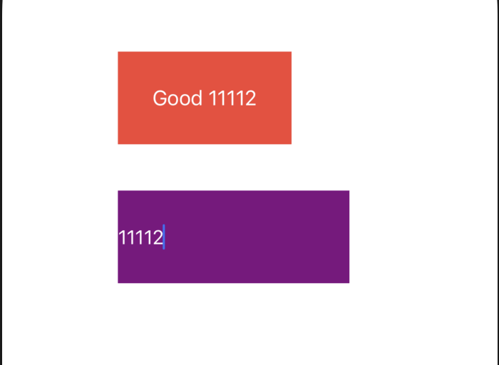

- [**Objective-C 项目**](https://hellogithub.com/periodical/category/Objective-C%20项目/?page=3)
- [**iOS进阶开发**](https://jianli2017.top)
- [**优化项目方案**](https://philm.gitbook.io/philm-ios-wiki/)
- [**SwiftHub**](https://gitee.com/harelyio/work/tree/master/Project/SwiftHub)
	- 项目解析
	- 类库使用
	- 库方法使用
		- ReplaySubject
			- skip
		- 操作符
			- just和take
			- share(relay:)和drive(to:)
		- Drive
		- BehaviorRelay
			- 参数范型String
			- 参数范型Void 
		- PublishSubject
			- 状态绑定 
- **Crash收集**
- **[MVVM之从理论到实践](https://www.jianshu.com/p/1c1b6bc557ac)**
	- [DemoCode](https://gitee.com/harelyio/work/tree/master/Project/MVVMReactive)
- **[仿SDWebImage逻辑](https://gitee.com/harelyio/work/tree/master/Project/ImageLoadSDK)**
- **[C++数据结构算法](https://gitee.com/harelyio/work/tree/master/Project/C2)**
- **SwiftEOS**
- [**开源库整理**](http://blogwenbo.com/2019/09/03/iOS优秀Swift开源库整理)


<br/>

***
<br/>

># SwiftHub

<br/>

> 项目解析

- [**SwiftHub项目解析**](https://juejin.cn/post/6844904127307186189)

<br/>

> 类库使用

- [**ObjectMapper**](https://www.jianshu.com/p/609fbdb62274)
	- Json数据解析
	- `pod 'ObjectMapper', '~> 4.2.0'`
- RxRelay 
	- `pod 'RxRelay', '~> 5.1.1'`
-  RxSwift
	- `pod 'RxSwift', '~> 5.1.1'`
-  RxTheme
	- ` pod 'RxTheme', '~> 4.1.1'`
	- AXThemeKit (0.0.3): 这是一个简单的主题框架，可以更换主题色、字体、icon，支持主题商店. `pod 'AXThemeKit', '~> 0.0.3'`
	- JXTheme (0.0.6): 主题、换肤、暗黑模式, `pod 'JXTheme', '~> 0.0.6'`
-  [**R.swift**](https://www.jianshu.com/p/727acc03f7b1) 
	-  iOS资源引入框架
-  [**CocoaLumberjackDemo**](https://www.jianshu.com/p/7b799bef0107)
	- 将程序运行过程中产生的Log保存起来或者发送到自己服务器，为了以后方便分析。
	- ` pod 'CocoaLumberjack-RemoteAccess', '~> 0.1.0'`
	- [**全量日志捕获CocoaLumberjack**](https://blog.csdn.net/shengpeng3344/article/details/105148752)
	- [**源码浅析 - CocoaLumberjack 3.6 之 DDLog**](https://juejin.cn/post/6844904147511164942#heading-25)
- **Toast-Swift**：提示框
	- [自定义Toast提示框](https://www.jianshu.com/p/bdfb174ddcf9) 
- [**KafkaRefresh刷新**](https://github.com/HsiaohuiHsiang/KafkaRefresh/blob/master/CREADME.md)


<br/>
<br/>

> **库方法使用**

<br/>
<br/>

> ReplaySubject

- skip

```
 let disposeBag = DisposeBag()
    
//创建一个bufferSize为2的ReplaySubject
let subject = ReplaySubject<String>.create(bufferSize: 1)

func replaySubjectTest() {
    
    //连续发送3个next事件
    subject.onNext("111")

    //skip: https://www.hangge.com/blog/cache/detail_1933.html
    //skip: 忽略1个序列，但是若是缓存序列则是对它无用
    subject.skip(1).subscribe(onNext: { (connected) in
        print("连接状态： \(connected)")
        
    }).disposed(by: disposeBag)
}
```

打印：

`连接状态： 111`

<br/>
<br/>

> 操作符

- just和take

BaseViewModel.swift

```
import Foundation
import RxSwift
import RxCocoa

class BaseViewModel: NSObject {
    
    struct Input {
        let modules: Observable<Void>
    }
    
    struct Output {
        //Driver：https://www.hangge.com/blog/cache/detail_1942.html
        let titles: Driver<[String]>
        let values: Driver<[String]>
    }

    func transform(input: Input) -> Output {
        
        let titles = Observable.just(true).map { (status) -> [String] in
            if status {
                return ["首页", "新闻", "资产", "设置"]
            }else {
                return ["1", "2", "3"]
            }
        }.asDriver(onErrorJustReturn: [])
        
        
        
        let values = input.modules.take(1).map{ _ -> [String] in
            
            return ["one", "two","there","four"]
            
        }.asDriver(onErrorJustReturn: [])
        
        return Output(titles: titles, values: values)
    }
    
    
}


//RxSwfit Extensions
extension ObservableType {
    
    func mapToVoid() -> Observable<Void> {
        return map { _ in }
    }
}


```

ViewController.swift

```

override func viewDidLoad() {
    super.viewDidLoad()
    
    
    
    rxTest1()
}

//rxTest1 方法必须放在viewDidLoad方法中，否则rx.viewWillAppear.mapToVoid()无法其作用
func rxTest1() {
    let baseVM = BaseViewModel()

    //rx: 进入RxSwift世界入口，https://iweiyun.github.io/2018/11/01/rxcocoa-code/
    let input = BaseViewModel.Input(modules: rx.viewWillAppear.mapToVoid())
    let output = baseVM.transform(input: input)
    
    output.titles.delay(.milliseconds(50)).drive(onNext: {[weak self] (titles) in
        if let strongSelf = self {
            print(">>>>>>>> titles: \(titles), strongSelf: \(strongSelf)")
        }
    }).disposed(by: disposeBag)
    
    
    output.values.drive(onNext: {(values) in
        print("========== values: \(values)")
    }).disposed(by: disposeBag)
    
    
}
```

打印：

```
========== values: ["one", "two", "there", "four"]
>>>>>>>> titles: ["首页", "新闻", "资产", "设置"], strongSelf: <SwiftTest.ViewController: 0x7f806be09230>

```

<br/>


- **share(relay:)和drive(to:)**

```
override func viewDidLoad() {
    super.viewDidLoad()
    
    //输入框
    self.view.addSubview(inputText)
    //按钮
    self.view.addSubview(btn)
    
    
    let textChange = inputText.rx.text.orEmpty.map { (text) -> String in
        print("<<<<<<<<<< \(text)")
        return "Good \(text)"
    }.share(replay: 1)
    
    //绑定到UIButton的title
    textChange.asDriver(onErrorJustReturn: "error").map { "\($0)" }.drive(btn.rx.title())// 这里改用 `drive` 而不是 `bindTo`，和bindTo作用是一样的
        .disposed(by: disposeBag)
    
    delay(10, closure: {
        textChange.subscribe(onNext: {(value) in
            print("============ \(value)")
        }).disposed(by: self.disposeBag)
    })
    
}

/// 延迟函数
func delay(_ delay: Double, closure: @escaping () -> Void) {
    DispatchQueue.main.asyncAfter(deadline: .now() + delay) {
        closure()
    }
}
```
打印：

```
<<<<<<<<<< 
<<<<<<<<<< 
<<<<<<<<<< 1
<<<<<<<<<< 11
<<<<<<<<<< 111
<<<<<<<<<< 1111 
============ Good 1111    //10秒之后打印的
<<<<<<<<<< 11112          //开始同步，共享
============ Good 11112

```



<br/>
<br/>

> Drive


```
class ViewModel2 {
    struct Input {
        let whatsNewTrigger: Observable<Bool>
    }
    
    struct Output {
        let tabBarItems: Driver<[String]>
        let openWhatsNews: Driver<String>
    }
    
    func transform(input: Input) -> Output {
        let tabBarItems = input.whatsNewTrigger.map { (authorized) -> [String] in
            if authorized {
                return ["首页", "新闻", "资产", "我的"]
            }else {
                return ["首页", "新闻", "我的"]
            }
        //1. 通过返回值生成一个数组的observable的序列
        //2. .asDriver(onErrorJustReturn: []) 方法将任何 Observable 序列都转成 Driver
        //3. 转化为Driver数组序列
        }.asDriver(onErrorJustReturn: [])
        
        //take: https://www.hangge.com/blog/cache/detail_1933.html
        let openWhatsNews = Observable.of("头条新闻📰", "GitHub").take(1).asDriver(onErrorJustReturn: "Error")
        
        return Output.init(tabBarItems: tabBarItems, openWhatsNews: openWhatsNews)
    }
}
```

Controller.swift

```
 //driver
func driverTest() {
    
    let viewModel2 = ViewModel2()
    
    let input = ViewModel2.Input.init(whatsNewTrigger: Observable.just(true))
    let output = viewModel2.transform(input: input)
    
    output.tabBarItems.delay(.milliseconds(50)).drive(onNext: {(tabBarItems) in
        tabBarItems.map { (value) in
            print("<<<<<< tabBarItem: \(value)")
        }
    }).disposed(by: disposeBag)
    
    output.openWhatsNews.drive(onNext: { value in
        print("========= openWhatsNews: \(value)")
    }).disposed(by: disposeBag)
    
    
}

@objc func clickAction() {
    
    driverTest()
        
}
```

打印：

```
========= openWhatsNews: 头条新闻📰
<<<<<< tabBarItem: 首页
<<<<<< tabBarItem: 新闻
<<<<<< tabBarItem: 资产
<<<<<< tabBarItem: 我的
```


<br/>
<br/>

> BehaviorRelay

- 参数范型String

```
let subject = BehaviorRelay<String>(value: "1111")
subject.accept("2222")

subject.asObservable().subscribe({
    print("值为： \($0)")
}).disposed(by: disposeBag)

subject.accept("3333")
//获取最近的属性值
print("\(subject.value)")

```

打印：

```
值为： next(2222)
值为： next(3333)
3333
```


<br/>

- 参数范型Void

```
let languageChanged = BehaviorRelay<Void>(value: ())
languageChanged.subscribe(onNext: { () in
    print("语言改变。。。。。。")
}).disposed(by: disposeBag)

languageChanged.accept(())

```

打印：

```
语言改变。。。。。。
语言改变。。。。。。

```


<br/>
<br/>

> PublishSubject

- 状态绑定

```
let error = PublishSubject<Bool>()
let isLoading = BehaviorRelay(value: false)

error.asObservable().bind(to: isLoading).disposed(by: disposeBag)

isLoading.subscribe(onNext: { isLoading in
    print("\(isLoading ? "加载中。。。。" : "停止加载")")
}).disposed(by: disposeBag)

error.onNext(true)

```
打印：

```
停止加载
加载中。。。。
```


<br/>
<br/>


```


let searchModeSelection: Observable<SearchModeSegments>
//SearchModeSegments 是一个枚举，.trending 该枚举的一种情况
let searchMode = BehaviorRelay<SearchModeSegments>(value: .trending)

//input是结构体，sortRepositorySelection 是 searchModeSelection 类型
input.sortRepositorySelection.bind(to: sortRepositoryItem).disposed(by: rx.disposeBag)
```


```

//Observable.combineLatest ？？
//filter ？？
//flatMapLatest ？？

Observable.combineLatest(keyword, currentLanguage, sortRepositoryItem)
            .filter({ (keyword, currentLanguage, sortRepositoryItem) -> Bool in
                return keyword.isNotEmpty || currentLanguage != nil
            })
            .flatMapLatest({ [weak self] (keyword, currentLanguage, sortRepositoryItem) -> Observable<RxSwift.Event<RepositorySearch>> in
                guard let self = self else { return Observable.just(RxSwift.Event.next(RepositorySearch())) }
                self.repositoriesPage = 1
                let query = self.makeQuery()
                let sort = sortRepositoryItem.sortValue
                let order = sortRepositoryItem.orderValue
                return self.provider.searchRepositories(query: query, sort: sort, order: order, page: self.repositoriesPage, endCursor: nil)
                    .trackActivity(self.loading)
                    .trackActivity(self.headerLoading)
                    .trackError(self.error)
                    .materialize()
            }).subscribe(onNext: { [weak self] (event) in
                switch event {
                case .next(let result):
                    //BehaviorRelay ？？
					//let repositorySearchElements = BehaviorRelay(value: RepositorySearch())
					//accept？？
					self?.repositorySearchElements.accept(result)
                default: break
                }
            }).disposed(by: rx.disposeBag)
```


<br/>

```

class TableViewCellViewModel: NSObject {

}

class DefaultTableViewCellViewModel: TableViewCellViewModel {
    let title = BehaviorRelay<String?>(value: nil)
    let detail = BehaviorRelay<String?>(value: nil)
    let secondDetail = BehaviorRelay<String?>(value: nil)
    let attributedDetail = BehaviorRelay<NSAttributedString?>(value: nil)
    let image = BehaviorRelay<UIImage?>(value: nil)
    let imageUrl = BehaviorRelay<String?>(value: nil)
    let badge = BehaviorRelay<UIImage?>(value: nil)
    let badgeColor = BehaviorRelay<UIColor?>(value: nil)
    let hidesDisclosure = BehaviorRelay<Bool>(value: false)
}


class SettingCellViewModel: DefaultTableViewCellViewModel {

    init(with title: String, detail: String?, image: UIImage?, hidesDisclosure: Bool) {
        super.init()
        self.title.accept(title)
        self.secondDetail.accept(detail)
        self.image.accept(image)
        self.hidesDisclosure.accept(hidesDisclosure)
    }
}


let logoutCellViewModel = SettingCellViewModel(with: R.string.localizable.settingsLogOutTitle.key.localized(), detail: nil,image: R.image.icon_cell_logout()?.template, hidesDisclosure: true)


```


<br/>

***
<br/>


># Crash收集

<br/>

>成熟开源类库Crash收集：
- [**KSCrash**](https://github.com/kstenerud/KSCrash)
- [**plcrashreporter**](https://github.com/microsoft/plcrashreporter)
- [**CrashKit**](https://github.com/kaler/CrashKit)


<br/>

>对保密性要求不高的程序来，可以选择各种一条龙Crash统计产品:
- [**Crashlytics**](https://firebase.google.com/products/crashlytics/)
- [**Hockeyapp**](https://appcenter.ms)
- [**友盟**](https://www.umeng.com)
- [**Bugly**](https://bugly.qq.com/v2/)


<br/>

***
<br/>

># MVVM之从理论到实践

RACSignal的几个操作:

```
map：使用提供的block来转换事件数据。

filter：使用提供的block来觉得事件是否往下传递。

combineLatest:reduce:：组合源信号数组中的信号，并生成一个新的信号。每次源信号数组中的一个输出新值时，reduce块都会被执行，而返回的值会作为组合信号的下一个值。

RAC宏：将信号的输入值指派给对象的属性。它带有两个参数，第一个参数是对象，第二个参数是对象的属性名。每次信号发送下一个事件时，其输出值都会指派给给定的属性。

rac_signalForControlEvents：从按钮的参数事件中创建一个信号。

注意：上面的操作输出仍然是一个RACSignal对象，所以不需要使用变量就可以构建一个管道。

doNext：附加操作，并不返回一个值。
```


<br/>

***
<br/>

># [仿SDWebImage逻辑](https://juejin.im/post/6844903807667666951)


<br/>

***
<br/>

># [C++数据结构算法](https://github.com/harleyGit/StudyNotes/blob/master/C语言/C2Exercise(I).md)


<br/>

***
<br/>

># SwiftEOS
加密库
