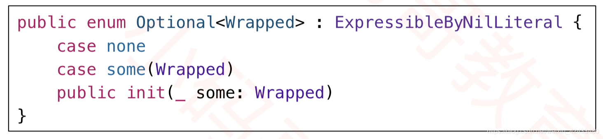

># <h2 id=''>[Swift教程](https://gitbook.swiftgg.team/swift/swift-jiao-cheng)</h2>
- [ swift 语法糖 ？ ！的本质]( #swift语法糖的本质)
- [@propertyWrapper](#@propertyWrapper)
- [**工具类**](#工具类)
	- [空数值处理](#空数值处理)
- [Task使用](#task使用)
- [**解包**](#解包)
- [**数组**](#数组)
	- [合并](#合并)
- [**UITableView**](#UITableView)
	- [contentSize、contentInset和contentOffset区别及相互关系](#contentSize、contentInset和contentOffset区别及相互关系)
- [**类库**](#类库)
	- [Alamofire](#Alamofire)
- **资料**
	- [**Swift学习笔记**](https://nintendoboy.gitbooks.io/swift-study-note-v2/content/)
	- [Swift组件Demo](https://github.com/pro648/BasicDemos-iOS.git)


<br/>

***
<br/><br/>

> <h1 id='swift语法糖的本质'>swift 语法糖 ？ ！的本质</h1>



这是底层可选项的代码，可以看出本质是enum

`var age: Int? = 10 `

等价于以下四种：

```
var age0: Optional<Int> = Optional<Int>.some(10)
var age1: Optional = .some(10)
var age2 = Optional.some(10)
var age3 = Optional(10)

```

```
？为optional的语法糖
optional 是一个包含了nil 和普通类型的枚举，确保使用者在变量为nil的情况下处理

！为optional 强制解包的语法糖

```


<br/>

***

<br/><br/>

> <h1 id='工具类'>工具类</h1>

<br/><br/>

> <h2 id='空数值处理'>空数值处理</h2>
通过为 Numeric 协议添加一个扩展来实现这个功能。以下是一个将数字转换为

```
extension Numeric {
    func handleOptionValue() -> String {
        let number = self
        // 如果数字等于零或者为空，返回空字符串
        guard number is Int || number is Double || number is Float else {
            return ""
        }

        // 使用字符串初始化数字
        let strValue = String(describing: number)
        // 如果字符串表示的是零或者为空，返回空字符串，否则返回字符串本身
        return strValue == "0" || strValue.isEmpty ? "" : strValue
    }
}


// 示例用法
let number1: Int = 42
let number2: Double = 0.0
let number3: Float = 0.0
let number4: Int? = nil

print(number1.stringValueOrEmpty()) // 输出: "42"
print(number2.stringValueOrEmpty()) // 输出: ""
print(number3.stringValueOrEmpty()) // 输出: ""
print(number4.stringValueOrEmpty()) // 输出: ""
```

<br/><br/>

> <h2 id='@propertyWrapper'>@propertyWrapper</h2>
是 Swift 语言中的一个属性包装器（Property Wrapper）特性，引入于 Swift 5.1 版本。属性包装器允许你定义包装器类型，将通用的代码用于属性的存取和设置，使代码更具可读性、可维护性，并提供了一种在属性上应用自定义行为的方式。

```
@propertyWrapper
struct TwelveOrLess {
    private var value: Int

    init() {
        self.value = 0
    }

    var wrappedValue: Int {
        get { return value }
        set { value = min(newValue, 12) }
    }
}
```

在这个例子中，TwelveOrLess 是一个属性包装器，它确保属性值不超过 12。然后，你可以将这个包装器应用于其他属性：

```
struct MyStruct {
    @TwelveOrLess var number: Int
}

var myStruct = MyStruct()

myStruct.number = 15
print(myStruct.number)  // 输出: 12
```

在这个示例中，number 属性被 @TwelveOrLess 包装器包装，当试图将其设置为大于 12 的值时，包装器会将其截断为 12。

<br/>

高级用法：

自定义初始化和其他方法：

你可以在属性包装器中定义自定义初始化方法以及其他方法，以满足特定的需求。

```
@propertyWrapper
struct CustomWrapper {
    var wrappedValue: Int

    init(initialValue: Int) {
        self.wrappedValue = initialValue
    }

    func doSomething() {
        // 在这里可以执行其他操作
        print("Doing something with \(wrappedValue)")
    }
}

struct MyStruct {
    @CustomWrapper(initialValue: 42) var number: Int
}

var myStruct = MyStruct()
myStruct.$number.doSomething()  // 输出: Doing something with 42
包装器设置和投影：
```
你可以通过在包装器中实现 projectedValue 属性，为属性包装器添加额外的设置或投影。

```
@propertyWrapper
struct WrapperWithProjection {
    var wrappedValue: Int
    var projectedValue: SomeOtherType

    init(initialValue: Int) {
        self.wrappedValue = initialValue
        self.projectedValue = SomeOtherType()
    }
}

struct MyStruct {
    @WrapperWithProjection(initialValue: 42) var number: Int
}

var myStruct = MyStruct()
print(myStruct.$number)  // 输出: SomeOtherType()
```
属性包装器为属性提供了一种声明性的、可复用的方式来添加额外的逻辑和行为。这样的结构使得代码更清晰、更易维护。


<br/><br/>

> <h2 id='task使用'>Task使用</h2>


Task 是 Swift Concurrency 中的一部分，它用于处理异步编程，包括协程（coroutines）和异步/等待（async/await）模式。Swift Concurrency 是在 Swift 5.5 版本中引入的，并通过 async 和 await 关键字提供了一种更直观和可读的异步编程模型。

基本用法：

异步函数声明和调用：

```
func fetchData() async -> String {
    return "Data fetched successfully"
}

async {
    let result = await fetchData()
    print(result)
}
```
在上述例子中，fetchData 函数被声明为异步函数，返回一个 String。在调用这个函数时，使用 await 关键字等待异步操作的完成，并获取异步操作的结果。

异步闭包：

```
func fetchData(completion: @escaping (String) -> Void) {
    DispatchQueue.global().async {
        let result = "Data fetched successfully"
        completion(result)
    }
}

func useFetchData() {
    fetchData { data in
        print(data)
    }
}
```
在上述例子中，fetchData 函数使用 DispatchQueue.global().async 异步执行操作，通过闭包回调返回数据。这是传统的异步编程方式，不涉及 Task。

<br/>

使用 Task 进行异步编程：

创建和运行 Task：

```
func fetchData() async -> String {
    return "Data fetched successfully"
}

let myTask = Task {
    let result = await fetchData()
    print(result)
}

// 或者更简洁的写法
Task {
    let result = await fetchData()
    print(result)
}
```
Task 可以用于创建异步任务。在上述例子中，通过 Task 创建一个异步任务，其中使用 await 关键字等待异步函数 fetchData 的完成。

<br/>

Task 组：

```
func fetchData(id: Int) async -> String {
    return "Data for id \(id) fetched successfully"
}

func fetchAllData() async {
    await Task.withGroup(resultType: String.self) { group in
        for id in 1...3 {
            group.addTask {
                return await fetchData(id: id)
            }
        }

        for try await data in group {
            print(data)
        }
    }
}
```
在这个例子中，Task.withGroup 创建了一个任务组，允许并发执行多个任务。group.addTask 添加了多个异步任务到任务组中，然后使用 for try await 循环等待所有任务的完成。


<br/>

***

<br/><br/>

> <h1 id='解包'>解包</h1>

<br/><br/>

> <h2 id='隐式解包-可选'>隐式解包-可选</h2>

```
var dataModel: MineDataModel! = nil
```

这行代码使用了隐式解包的可选类型。在 Swift 中，使用 ! 符号声明的变量表示隐式解包的可选类型，它表明这个变量可以为 nil，但是在使用时，编译器会自动解包，使你能够直接访问其包含的值。

简单来说,差不多相当于强制解包了,必须保证其变量在使用的时候为有值的.

在你的例子中，dataModel 是一个隐式解包的可选类型，初始值为 nil。这意味着你可以像使用非可选类型一样使用 dataModel，而不需要每次都进行可选值的解包。但是，如果在使用时发现 dataModel 的值为 nil，那么运行时会触发运行时错误。

这样的设计主要是为了方便使用，但需要谨慎使用。确保在访问 dataModel 之前，它已经被正确初始化。否则，如果在访问时它仍然为 nil，将导致运行时崩溃。

如果有可能，你可以考虑使用普通的可选类型 var dataModel: MineDataModel? 并在使用之前明确地进行解包，这样可以更加安全。


<br/>

***
<br/><br/>

> <h1 id='数组'>数组</h1>

<br/><br/>

> <h2 id='合并'>合并</h2>

&emsp; merge 方法的第二个参数是一个闭包，用于决定当有重复的元素时如何选择保留。在你提到的语句 { (_, new) in new } 中，这是一个闭包的写法，用于指定当有重复元素时选择保留新元素。

&emsp; 具体来说，这个闭包的参数是两个元素，分别是已存在于目标数组中的元素和要合并的新元素。这里使用了通配符 _ 表示不使用已存在的元素，而 new 表示要合并的新元素。闭包的返回值表示在有重复元素时选择保留的是新元素。

```
var array1 = ["apple", "orange", "banana"]
let array2 = ["orange", "grape", "kiwi"]

// 使用merge方法和自定义合并规则将array2合并到array1中
array1.merge(array2) { (_, new) in new }

print(array1)
```


&emsp; 在这个例子中，array1 和 array2 包含一些相同的元素（"orange"）。使用 { (_, new) in new } 这个闭包，表示当有重复元素时选择保留新元素。因此，"orange" 这个元素会被从 array2 中合并到 array1 中。最终的输出将包含所有不同的元素。


<br/>

***

<br/><br/>

> <h1 id='UITableView'>UITableView</h1>

<br/><br/>

> <h2 id='contentSize、contentInset和contentOffset区别及相互关系'>contentSize、contentInset和contentOffset区别及相互关系</h2>

[区别](https://blog.csdn.net/zyzxrj/article/details/74006774)

在UIScorllView、UITableView、UICollectionView3大滑动组件的角度来讲,这3个属性对于掌握这3个组件很重要

- **frame:** 是当前UIScorllView、UITableView、UICollectionView能给用户看到的区域,比如(0, 0, 414, 856)就是我们能在手机屏幕看到的视图大小


- **contentSize:** 表示的是内容实际展示的效果,若是它的值小于frame.size那么它就不能滚动,否则就可以滚动.
	- 当contentSize大于frame.size时,比如:contentSize=(0, 0, 414, 1000), frame = (0, 0, 414, 856),当我们滑动到大于frame宽度和高度时,UIScorllView、UITableView、UICollectionView有弹性回弹的效果.否则是没有的
	- 我们通过Xcode的图层是可以看到超出手机屏幕外还是能看到其他组件的


- **contentInset:** 这个怎么说呢? 
	- 我们看下它的swift的初始化:contentInset = UIEdgeInsets(top: 0, left: 0, bottom: 0, right: 0)
	- 学过HTML的都知道一个标签都有外边距margin、内边距padding.那contentInset就像当于UIScorllView、UITableView、UICollectionView的contentSize相当于frame在padding的上、下、左、右距离


- **contentOffset:** 是当前视图滑动的距离,比如向左、向右之类的


<br/>

***

<br/><br/>> <h1 id='类库'>类库</h1>

<br/><br/>

> <h2 id='Alamofire'>Alamofire</h2>

ParameterEncoding什么用法? **URLEncoding.default**、**JSONEncoding.default** 有啥区别

<br/>

在 Alamofire 中，ParameterEncoding 是一个枚举类型，用于表示将参数编码为 HTTP 请求的不同方式。URLEncoding.default 和 JSONEncoding.default 是其中两种常用的编码方式，分别用于 URL 编码和 JSON 编码。

<br/>

**URLEncoding.default:**

这种编码方式适用于将参数附加到 URL 中，通常用于 GET 请求。参数会以键值对的形式出现在 URL 的查询字符串中，以符号 "?" 开头，并使用 "&" 连接。
例如，将 { "key": "value" } 编码为 URL 的查询字符串为 ?key=value。

<br/>

**JSONEncoding.default:**

这种编码方式适用于将参数放置在请求的 HTTP 主体中，通常用于 POST 请求。参数会被序列化为 JSON 格式，并作为请求的主体内容发送。
例如，将 { "key": "value" } 编码为 JSON 格式为 {"key":"value"}，并作为请求的主体内容。
示例代码：

```
import Alamofire

let parameters: [String: Any] = ["key": "value"]

// 使用URLEncoding.default将参数编码为URL查询字符串
let urlEncodedRequest = try! URLEncoding.default.encode(URLRequest(url: URL(string: "https://example.com")!), with: parameters)

// 使用JSONEncoding.default将参数编码为JSON格式，并作为请求的主体内容
let jsonEncodedRequest = try! JSONEncoding.default.encode(URLRequest(url: URL(string: "https://example.com")!), with: parameters)
```
在上述代码中，urlEncodedRequest 是使用 URLEncoding.default 编码的请求，而 jsonEncodedRequest 是使用 JSONEncoding.default 编码的请求。这两种编码方式适用于不同的请求场景，根据实际需求选择合适的方式。


