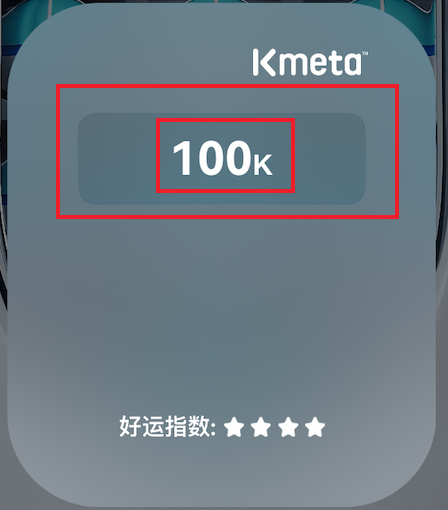

> <h2 id=''></h2>
- [**编译指令**](#编译指令)
	- [弃用方法的警告和使用](#弃用方法的警告和使用)
- [**文件模块**](#文件模块)
	- [支付模块](#支付模块)
	- [一键登录模块](#一键登录模块)
	- [路由导航](#路由导航)
	- [网页](#网页) 
		- [WebViewController](#HybridWebViewController)
		- [应用](#应用)
- [**三方库**](#三方库)
	- [调试解决](#调试解决) 
		- [断点打印为null](#断点打印为null)
	- [MJExtension](#MJExtension) 
		- [JSON数据中包含一个对象](#JSON数据中包含一个对象)
	- [ReactObj](#ReactObj) 
		- [类](#类)
		- [属性](#属性)
		- [方法](#方法)
	- [FMDB](#FMDB)
		- [dispatch_queue_set_specific使用](#dispatch_queue_set_specific使用)
- [**问题**](#问题)
	- [导航栏返回按钮图片颜色无法修改](#导航栏返回按钮图片颜色无法修改)
- **资料**
	- [Swift组件参考](https://github.com/CaamDau/CaamDau?tab=readme-ov-file#InputBox%E8%BE%93%E5%85%A5%E6%A1%86%E6%89%A9%E5%B1%95%E7%BB%84%E4%BB%B6)
	- [PullDownListSwift](https://github.com/CMlinksuccess/PullDownListSwift.git)
	- [弹出框](https://github.com/CoderLinLee/PopView)
	- [护眼模式开发](https://www.jianshu.com/p/188b64828ddb)
	- [弹幕上滑渐隐效果](https://www.hangge.com/blog/cache/detail_1778.html)
		- [渐变图层](https://blog.csdn.net/Hierarch_Lee/article/details/48337879)
	- [SF Symbols 内置图标库](https://swiftcafe.io/post/sf-symbol)
- [**废弃效果**](#废弃效果)
	- [镂空文字](#镂空文字)


```
解决问题: try 如何使用
await 如何使用,关于并发的

为什么用 try await结合使用,可以解决什么? 若是有返回值,怎么解决?

async throws -> DataResult?为什用 return try await (sss) 作为返回结果后,类型为  async throws -> 返回结果类型,为啥

```

<br/>

***

<br/><br/>

> <h1 id='编译指令'>编译指令</h1>

<br/><br/>

> <h2 id='弃用方法的警告和使用'>弃用方法的警告和使用</h2>

```
/// OC属性方法的弃用、提示
@property(nonatomic, assign)CGSize cellSize __attribute__((deprecated("Use cellSizeWithRow: 方法 instead.")));
```


<br/>

***
<br/>

> <h1 id='文件模块'>文件模块</h1>

<br/>


<br/><br/>

> <h2 id='支付模块'>支付模块</h2>


- 分为支付对象payObject
	- 包含支付类型,比如:微信、支付宝
	- 一些必备参数

<br/>

- 支付结果payResult
	- 支付返回结果
	- 订单号
	- 支付返回消息

<br/>

- 支付管理者PayClient
	- 通过传入PayObject作为参数
	- PayResult作为阿里支付、wx支付返回的结果,通过代理或者其他返回
	- 通过blcok作为回调,进行返回


<br/><br/>


> <h2 id='一键登录模块'>一键登录模块</h2>


<br/><br/>


> <h2 id='路由导航'>路由导航</h2>

> ModuleContainer：路由导航类


<br/>
<br/>


> <h2 id='网页'>网页</h2>

<br/>


> <h3 id='HybridWebViewController'>WebViewController</h3>

<br/>

> **方法**

```
//用来调用js中的方法，注意：javaScriptString 就是与前端约好的方法名
- (void)evaluateJavaScript:(NSString *)javaScriptString completionHandler:(void (^ _Nullable)(_Nullable id, NSError * _Nullable error))completionHandler;
```

案例：

```
//WKWebViewController.m文件
- (void)getLocation
{
    // 获取位置信息
    
    // 将结果返回给js
    NSString *jsStr = [NSString stringWithFormat:@"setLocation('%@')",@"广东省深圳市南山区学府路XXXX号"];
    //调用js里面的方法，这个要与前端写js的约定好： webView evaluateJavaScript:@"JS函数名称('参数1','参数2')" completionHandler:nil]来向JS发送消息
    [self.webView evaluateJavaScript:jsStr completionHandler:^(id _Nullable result, NSError * _Nullable error) {
        NSLog(@"%@----%@",result, error);
    }];
   
}


//index.html
 <script language="javascript">
	 function setLocation(location) {
		 //这个location就是：广东省深圳市南山区学府路XXXX号字符串
	    asyncAlert(location);
	    document.getElementById("returnValue").value = location;
	}

 </script>                
```


<br/>
<br/>


> <h3 id='应用'>应用</h2>

- [模拟网络调用](#模拟网络调用)

使用ReactiveObjC进行网络请求：

```
//导入头文件
#import <ReactiveObjC/ReactiveObjC.h>


- (void)testMethod12 {
    
    //ApplicationViewModel中的代码
    RACSubject *requestSubject1 = [RACSubject subject];
    RACSubject *requestSubject2 = [RACSubject subject];

    
    [requestSubject1 subscribeNext:^(id  _Nullable x) {
        NSLog(@"订阅数据2： %@", x);
        [requestSubject2 sendNext:x];
    } error:^(NSError * _Nullable error) {
        [requestSubject1 sendError:error];
        
    }];
    
    [requestSubject2 subscribeNext:^(id  _Nullable x) {
        NSLog(@"🔚 网络请求返回的数据： %@", x);
    }];
    
    
    //APICommand中的代码
    RACCommand *command = [[RACCommand alloc] initWithSignalBlock:^RACSignal * _Nonnull(id  _Nullable input) {
        NSLog(@"✈️开始网络请求： %@", input);
        return  [self requestSignal:input];
    }];
    
    [[command.executionSignals.switchToLatest map:^id _Nullable(id  _Nullable value) {
        NSLog(@"过滤数据： %@", value);
        return  value;
    }] subscribeNext:^(id  _Nullable x) {
        NSLog(@"订阅数据1： %@", x);
        [requestSubject1 sendNext:x];
    }];
    
    [command execute:@"param={token：12345678}"];
    
    
    
}


- (RACSignal *) requestSignal:(NSString *)params {
    
    RACSignal *signal = [
                         [
                          [
                           [
                            [RACSignal return:params] map:^id _Nullable(id  _Nullable value) {
        NSLog(@"🍎 <<<<<<< 执行 map 映射: %@", value);
        NSString *requestInfo = [NSString stringWithFormat:@"接口url&请求头header&%@", value];
        NSLog(@"======= 拼装后的请求信息 %@", requestInfo);

        return  requestInfo;
    }] flattenMap:^__kindof RACSignal * _Nullable(id  _Nullable value) {
        NSLog(@">>>>> 执行 flattenMap1 方法: %@", value);
        // combineLatestWith把两个信号组合成一个信号,跟zip一样，没什么区别
        return  [[RACSignal return:value] combineLatestWith:[self post:value]];
    }] doNext:^(id  _Nullable x) {
        
        //解元组：合并信号得到的是一个元组,里面存放的是两个信号发送的消息
        RACTupleUnpack(NSString *str1,NSString *str2) = x;
        
        NSLog(@"🍊 <<<<< 执行 doNext 方法，请求信息：%@,  处理网络请求回的数据： %@", str1, str2);
        
    }] flattenMap:^__kindof RACSignal * _Nullable(id  _Nullable value) {
        //解元组：合并信号得到的是一个元组,里面存放的是两个信号发送的消息
        RACTupleUnpack(NSString *str1,NSString *str2) = value;
        NSLog(@" ====== 执行 flattenMap2 方法, 请求信息：%@,  处理网络请求回的数据： %@", str1, str2);

        return [RACSignal return:str2];
    }];

    
    return  signal;
}


- (RACSignal *) post:(NSString *)value {
    RACSignal *requestSignal = [RACSignal createSignal:^RACDisposable * _Nullable(id<RACSubscriber>  _Nonnull subscriber) {
        
        [subscriber sendNext:@"jsonData={title:拓客利器, functionCode: 10915}"];
//        NSError *httpError = [NSError errorWithDomain:@"网络💔失联错误" code:10001 userInfo:@{
//                                NSLocalizedDescriptionKey:@"返回的消息？",
//                                NSLocalizedFailureReasonErrorKey:@"失败原因",
//                                NSLocalizedRecoverySuggestionErrorKey:@"意见：恢复初始化",
//                                @"自定义":@"自定义的内容",
//        }];
//        [subscriber sendError:httpError];
        return  nil;
    }];
    
    return  [requestSignal catch:^RACSignal * _Nonnull(NSError * _Nonnull error) {
        NSLog(@">>>>> 捕捉错误❌⁉️");
        return [RACSignal createSignal:^RACDisposable * _Nullable(id<RACSubscriber>  _Nonnull subscriber) {
            [subscriber sendNext:@"💣 检查年底网络，网络异常了"];
            [subscriber sendCompleted];
            return  nil;
        }];
    }];
}

/*
 
 - (RACSignal *)catch:(RACSignal * (^)(NSError *error))catchBlock

 返回一个新信号N
 当receiver发生error时，catchBlock中收到相应错误信息，并返回一个新的信号M，同时订阅M，自此以后新信号N中的数据便是M中的数据了
 当receiver不发生error时，数据仍会通过N进行发送
 还有一个精简的方法是- (RACSignal *)catchTo:(RACSignal *)signal，意思是相同的

 比如[A catchTo: B]表示，返回一个新信号，其中的数据是，如果A不发生错误就是A的数据，如果A发生错误，则数据边来源于B
 
 **************************>>>
 
 当对原信号进行订阅的时候，如果出现了错误，会去执行catchBlock( )闭包，入参为刚刚产生的error。catchBlock( )闭包产生的是一个新的RACSignal，并再次用订阅者订阅该信号。

 这里之所以说是高阶操作，是因为这里原信号发生错误之后，错误会升阶成一个信号。
 
 */

```

打印：


**心得体会：**

&emsp; 从这一连串打印下来，对`ReactiveObjC`的信号有了一定的认识。在RACCommand的实例对象执行`[command execute:@"param={token：12345678}"];`后就执行其闭包内的方法进行调用`[self requestSignal:input]`执行网络请求，在这个方法中通过断点调试我们可以看到当执行到`return  [[RACSignal return:value] combineLatestWith:[self post:value]];`方法的`[self post:value]`时它会跳到这个`post`方法中，在这个方法内当执行到`[subscriber sendNext:@"jsonData={title:拓客利器, functionCode: 10915}"];`时，它其实发送了一个信号，然后整体就开始活泛起来了。它会跳转到下面的闭包执行

```
 //解元组：合并信号得到的是一个元组,里面存放的是两个信号发送的消息
RACTupleUnpack(NSString *str1,NSString *str2) = x;

NSLog(@"🍊 <<<<< 执行 doNext 方法，请求信息：%@,  处理网络请求回的数据： %@", str1, str2);
```
然后一层一层的执行信号的处理，有点像剥🧅洋葱的感觉。其源头就是请求的数据来了，然后激发了信号，对信号的处理。


<br/>
<br/>


> <h3 id=''></h2>


<br/>
<br/>


> <h3 id=''></h2>


<br/>
<br/>


<br/>

***
<br/>

> <h1 id='调试解决'>调试解决</h1>

> <h2 id='断点打印为null'>断点打印为null</h2>

按照下图的提示进行解决：


<br/><br/>

> <h2 id='MJExtension'>MJExtension</h2>


<br/><br/>

> <h2 id='JSON数据中包含一个对象'>JSON数据中包含一个对象</h2>

```
{
	@"data":@"lsjlg",
	@"title":@"阿拉斯加的老公",
	@"content":{
			@"sex":@"哪呢",
			@"name":@"1212r",
		},
}
```

这个时候需要对content映射一个对象,如下:

```
@implementation PopupSignInModel

+ (NSDictionary *)mj_objectClassInArray {
    return @{
        @"content" : [Content Model class]
    };
}

@end
```


<br/>

***
<br/>

> <h1 id='三方库'>三方库</h1>

<br/>

> <h2 id='ReactObj'>ReactObj</h2>


<br/>


> <h3 id='类'>类</h3>
- [RACBehaviorSubject](#RACBehaviorSubject)
- [RACReplaySubject](#RACReplaySubject)
- [RACCommand](#RACCommand)
- [RACSubject](#RACSubject)


<br/>
<br/>

> <h4 id='RACBehaviorSubject'>RACBehaviorSubject</h4>

&emsp; `RACBehaviorSubject`在订阅时会向订阅者发送最新的消息。


&emsp;  `RACBehaviorSubject` 最重要的特性就是在订阅时，向最新的订阅者发送之前的消息，这是通过覆写 -subscribe: 方法实现的。

案例Demo：

```
//RACBehaviorSubject *subject = [RACBehaviorSubject behaviorSubjectWithDefaultValue:@0];
RACBehaviorSubject *subject = [RACBehaviorSubject subject];

[subject subscribeNext:^(id  _Nullable x) {
    NSLog(@"1st Sub: %@", x);
}];
[subject sendNext:@1];

[subject subscribeNext:^(id  _Nullable x) {
    NSLog(@"2nd Sub: %@", x);
}];
[subject sendNext:@2];

[subject subscribeNext:^(id  _Nullable x) {
    NSLog(@"3rd Sub: %@", x);
}];
[subject sendNext:@3];
[subject sendCompleted];
```


打印：

```
//使用了 +behaviorSubjectWithDefaultValue:
//2021-08-04 19:04:56.631576+0800 Test1[18063:523610] 1st Sub: 0
2021-08-04 19:00:46.531011+0800 Test1[17933:516457] 1st Sub: (null)
2021-08-04 19:00:53.163748+0800 Test1[17933:516457] 1st Sub: 1


2021-08-04 19:00:59.294161+0800 Test1[17933:516457] 2nd Sub: 1
2021-08-04 19:01:08.451922+0800 Test1[17933:516457] 1st Sub: 2
2021-08-04 19:01:10.061648+0800 Test1[17933:516457] 2nd Sub: 2


2021-08-04 19:01:14.737775+0800 Test1[17933:516457] 3rd Sub: 2
2021-08-04 19:01:20.714692+0800 Test1[17933:516457] 1st Sub: 3
2021-08-04 19:01:21.335019+0800 Test1[17933:516457] 2nd Sub: 3
2021-08-04 19:01:21.977903+0800 Test1[17933:516457] 3rd Sub: 3
```


<br/>

> <h4 id='RACReplaySubject'>RACReplaySubject</h4>

&emsp; `RACReplaySubject`在订阅之后可以重新发送之前的所有消息序列。


<br/>

>#### <h4 id='RACCommand'>[RACCommand](https://github.com/harleyGit/StudyNotes/blob/master/ClassLibrary/ReactiveObjc(I).md)</h4>

**`RACCommand`**RAC中用于处理事件的类，可以把事件如何处理,事件中的数据如何传递，包装到这个类中，他可以很方便的监控事件的执行过程。


**RACCommand使用步骤:**
>- 创建命令 initWithSignalBlock:(RACSignal * (^)(id input))signalBlock
- 在signalBlock中，创建RACSignal，并且作为signalBlock的返回值
- 执行命令 - (RACSignal *)execute:(id)input
    
>- RACCommand使用注意:
	- signalBlock必须要返回一个信号，不能传nil.
	- 如果不想要传递信号，直接创建空的信号[RACSignal empty];
	- RACCommand中信号如果数据传递完，必须调用[subscriber sendCompleted]，这时命令才会执行完毕，否则永远处于执行中。
	- RACCommand需要被强引用，否则接收不到RACCommand中的信号，因此RACCommand中的信号是延迟发送的。

>- RACCommand设计思想：内部signalBlock为什么要返回一个信号，这个信号有什么用。
	- 在RAC开发中，通常会把网络请求封装到RACCommand，直接执行某个RACCommand就能发送请求。
	- 当RACCommand内部请求到数据的时候，需要把请求的数据传递给外界，这时候就需要通过signalBlock返回的信号传递了。

>- 如何拿到RACCommand中返回信号发出的数据。
	- RACCommand有个执行信号源executionSignals，这个是signal of signals(信号的信号),意思是信号发出的数据是信号，不是普通的类型。
	- 订阅executionSignals就能拿到RACCommand中返回的信号，然后订阅signalBlock返回的信号，就能获取发出的值。

>- 监听当前命令是否正在执行executing

>- 使用场景,监听按钮点击，网络请求

<br/>

```
- (void) testMethod7 {
    // 1.创建命令
    RACCommand *command = [[RACCommand alloc] initWithSignalBlock:^RACSignal *(id input) {
        NSLog(@"执行命令");
        NSLog(@"执行命令--> %@", input);
        // 创建空信号,必须返回信号
        // return [RACSignal empty];
        // 2.创建信号,用来传递数据
        return [RACSignal createSignal:^RACDisposable *(id<RACSubscriber> subscriber) {
            [subscriber sendNext:@"请求数据"];
            // 注意：数据传递完，最好调用sendCompleted，这时命令才执行完毕。
            [subscriber sendCompleted];
            return nil;
        }];
    }];
    
    // 强引用命令，不要被销毁，否则接收不到数据
    //_loginCommand = command;
    
    // 3.订阅RACCommand中的信号
    [command.executionSignals subscribeNext:^(id x) {
        //订阅executionSignals就能拿到RACCommand中返回的信号，然后订阅signalBlock返回的信号，就能获取发出的值。
        [x subscribeNext:^(id x) {
            NSLog(@"🍎 %@",x);
        }];
    }];
    
    // RAC高级用法
    // switchToLatest:用于signal of signals，获取signal of signals发出的最新信号,也就是可以直接拿到RACCommand中的信号
    [command.executionSignals.switchToLatest subscribeNext:^(id x) {
        NSLog(@"🍊 %@",x);
    }];
    
    // 4.监听命令是否执行完毕,默认会来一次，可以直接跳过，skip表示跳过第一次信号。
    [[command.executing skip:0] subscribeNext:^(id x) {
        // executing：判断当前的block是否在执行，执行完之后会返回NO
        NSLog(@"是否执行： %@", x);
        if ([x boolValue] == YES) {
            // 正在执行
            NSLog(@"正在执行");
        }else{
            // 执行完成
            NSLog(@"执行完成");
        }
    }];
    
    // 5.执行命令（控制器里执行此句代码）
    [command execute:@"✈️ 执行命令！！"];
}

```

打印：

```
2021-08-09 11:40:53.519286+0800 Test1[4783:171682] 是否执行： 0
2021-08-09 11:40:58.701714+0800 Test1[4783:171682] 执行完成
2021-08-09 11:41:04.110605+0800 Test1[4783:171682] 执行命令
2021-08-09 11:41:04.954396+0800 Test1[4783:171682] 执行命令--> ✈️ 执行命令！！
2021-08-09 11:41:15.616669+0800 Test1[4783:171682] 是否执行： 1
2021-08-09 11:41:19.114076+0800 Test1[4783:171682] 正在执行
2021-08-09 11:41:24.337670+0800 Test1[4783:171682] 🍎 请求数据
2021-08-09 11:41:25.591968+0800 Test1[4783:171682] 🍊 请求数据
2021-08-09 11:41:28.640741+0800 Test1[4783:171682] 是否执行： 0
2021-08-09 11:41:29.558142+0800 Test1[4783:171682] 执行完成
```


<br/>

> <h4 id=''></h4>


<br/>

> <h4 id=''></h4>


<br/>
<br/>


> <h3 id='属性'>属性</h3>
- [executionSignals](#executionSignals)

<br/>

> <h4 id='executionSignals'>executionSignals</h4>

- **executionSignals:** RACCommand返回的信号时信号中的信号, 有两种方式可以获取最新的信号:
	- switchToLatest: 获取内部的最新信号(被动执行)
	- execute:        获取内部信号(这个是主动执行)

```
- (void)testMethod11 {
    
    RACCommand *command = [[RACCommand alloc] initWithSignalBlock:^RACSignal * _Nonnull(id  _Nullable input) {
        NSLog(@"<<<<<< 🍎");
        return [RACSignal createSignal:^RACDisposable * _Nullable(id<RACSubscriber>  _Nonnull subscriber) {
            NSLog(@"====== 🍎");
            //input为传入的参数
            [subscriber sendNext:@"发送数据"];
            //NSError *error = [NSError new];
            //[subscriber sendError:error];  发送error会自动调用
            //每次都会创建一个信号，发送完数据，此处记得销毁消息，不然会一直处于执行中。
            [subscriber sendCompleted];
            return [RACDisposable disposableWithBlock:^{
                NSLog(@"信号被销毁");
            }];
        }];
    }];
    
    [command.executionSignals subscribeNext:^(id  _Nullable x) {
        NSLog(@"获取一个信号---%@",x);
        [x subscribeNext:^(id x) {
            
            NSLog(@"%@",x);
        }];
    }];
    
    [command.executing subscribeNext:^(NSNumber * _Nullable x) {
        NSLog(@"监听完成---%@",x); //x为监听状态 0代表执行完毕，1代表执行中
    }];
    [command.errors subscribeNext:^(NSError * _Nullable x) {
        NSLog(@"错误"); // 接受错误信息
    }];
    [command.executionSignals.switchToLatest subscribeNext:^(id  _Nullable x) {
        NSLog(@"接受信号中的信号x为数据:%@",x);//x为发送的数据
    }];
    [command execute:@"11111"]; //调用command`
    
    
}
```

打印：

```
2021-08-10 19:06:59.313989+0800 Test1[16755:560762] 监听完成---0
2021-08-10 19:07:04.113967+0800 Test1[16755:560762] <<<<<< 🍎
2021-08-10 19:07:08.761295+0800 Test1[16755:560762] 监听完成---1
2021-08-10 19:07:13.356815+0800 Test1[16755:560762] 获取一个信号---<RACDynamicSignal: 0x6000010d1be0> name: 
2021-08-10 19:07:21.296164+0800 Test1[16755:560762] ====== 🍎
2021-08-10 19:07:24.038461+0800 Test1[16755:560762] 发送数据
2021-08-10 19:07:25.469458+0800 Test1[16755:560762] 接受信号中的信号x为数据:发送数据
2021-08-10 19:07:25.469853+0800 Test1[16755:560762] 信号被销毁
2021-08-10 19:07:27.209794+0800 Test1[16755:560762] 监听完成---0
```


<br/>

> <h4 id=''></h4>


<br/>

> <h4 id=''></h4>


<br/>
<br/>


>#### <h3 id='RACSubject'>[RACSubject](https://github.com/harleyGit/StudyNotes/blob/master/ClassLibrary/ReactiveObjc(I).md)</h3>


<br/>
<br/>


> <h3 id='方法'>方法</h3>

- [+(RACSignal *)createSignal:(RACDisposable * (^)(id<RACSubscriber> subscriber))didSubscribe](createSignal)

- [+(RACSignal *)return:(id)value](#return)

- [-(__kindof RACStream *)map:(id (^)(id value))block](#map)

- [-(RACSignal *)flattenMap:(__kindof RACSignal * _Nullable (^)(ValueType _Nullable value))block](#flattenMap)

- [-(RACSignal *)doNext:(void (^)(id x))block](#doNext)

- [-(RACSignal *)takeUntil:(RACSignal *)signalTrigger](#takeUntil)

- [-(RACSignal *)switchToLatest RAC_WARN_UNUSED_RESULT](#switchToLatest)


<br/>
<br/>


>#### <h4 id='createSignal'>+ (RACSignal *)createSignal:(RACDisposable * (^)(id<RACSubscriber> subscriber))didSubscribe</h4>

```
- (void) testMethod4 {
    //创建信号
    RACSignal *singalA = [RACSignal createSignal:^RACDisposable * _Nullable(id<RACSubscriber>  _Nonnull subscriber) {
        //发送信号
        [subscriber sendNext:@"1"];
        [subscriber sendNext:@(2)];
        [subscriber sendCompleted];
        
        return [RACDisposable disposableWithBlock:^{
            NSLog(@"------this is RACDisposable---------");
        }];
    }];
    //订阅信号
    [singalA subscribeNext:^(id  _Nullable x) {
        NSLog(@"-------singalA value is %@-------",x);
    }];
}

```

打印：

```
2021-08-04 11:36:00.935943+0800 Test1[11228:186004] -------singalA value is 1-------
2021-08-04 11:36:19.339155+0800 Test1[11228:186004] -------singalA value is 2-------
2021-08-04 11:36:34.775731+0800 Test1[11228:186004] ------this is RACDisposable---------

```


<br/>
<br/>

>#### <h4 id='return'>[+(RACSignal *)return:(id)value](https://draveness.me/racsignal/)</h4>


```
+ (RACSignal *)return:(id)value {
	return [RACReturnSignal return:value];
}
```

&emsp; 该方法接受一个 NSObject 对象，并返回一个 RACSignal 的实例，它会将一个 UIKit 世界的对象 NSObject 转换成 ReactiveCocoa 中的 RACSignal。

&emsp; 而 RACReturnSignal 也仅仅是把 NSObject 对象包装一下，并没有做什么复杂的事情：

```
+ (RACSignal *)return:(id)value {
	RACReturnSignal *signal = [[self alloc] init];
	signal->_value = value;
	return signal;
}
```


<br/>

> <h4 id='map'>- (__kindof RACStream *)map:(id (^)(id value))block </h4>

```
- (__kindof RACStream *)map:(id (^)(id value))block {
	NSCParameterAssert(block != nil);

	Class class = self.class;
	
	return [[self flattenMap:^(id value) {
		return [class return:block(value)];
	}] setNameWithFormat:@"[%@] -map:", self.name];
}
```

&emsp; Map将原信号中的内容映射成新的指定内容。
 通过对比，从map的实现方法中可以看出是基于flattenMap方法的一层封装，但同时又有不同之处。
 
 **案例Demo：**
 
 ```
 - (void) testMethod2 {
    [[self.inputField.rac_textSignal map:^id _Nullable(NSString * _Nullable value) {
        // 当源信号发出，就会调用这个block，修改源信号的内容
        // 返回值：就是处理完源信号的内容。
        return [NSString stringWithFormat:@"hello:%@",value];
    }] subscribeNext:^(id  _Nullable x) {
        NSLog(@"%@",x); // hello: "x"
    }];
    
}
```

打印：

```
2021-08-03 17:41:58.501753+0800 Test1[21997:481962] hello:
2021-08-03 17:42:04.605039+0800 Test1[21997:481962] hello:
2021-08-03 17:42:07.073937+0800 Test1[21997:481962] hello:1
2021-08-03 17:42:07.429275+0800 Test1[21997:481962] hello:12
2021-08-03 17:42:07.736910+0800 Test1[21997:481962] hello:123
2021-08-03 17:42:08.019351+0800 Test1[21997:481962] hello:1234
```

 &emsp; **map:** 中的闭包参数value就是源信号的内容，直接拿到源信号的内容做处理，把处理好的内容，直接返回就好了，不用包装成信号，返回的值，就是映射的值。


<br/>

> <h4 id='flattenMap'>- (RACSignal *)flattenMap:(__kindof RACSignal * _Nullable (^)(ValueType _Nullable value))block</h4>


```
- (void) testMethod1 {
    [[self.inputField.rac_textSignal flattenMap:^__kindof RACSignal * _Nullable(NSString * _Nullable value) {
        return  [RACSignal return:[NSString stringWithFormat:@"hello %@", value]];
    }] subscribeNext:^(id  _Nullable x) {
        NSLog(@"%@",x); // hello "x"
    }];
    
    
}
```

打印：

```
2021-08-03 17:36:47.264375+0800 Test1[21384:461035] hello S1
2021-08-03 17:36:48.205486+0800 Test1[21384:461035] hello S12
2021-08-03 17:36:48.748797+0800 Test1[21384:461035] hello S123
2021-08-03 17:36:49.127409+0800 Test1[21384:461035] hello S1234
```

- flattenMap:中闭包参数value就是源信号的内容，拿到源信号的内容做处理；
- value被包装成RACReturnSignal信号，返回出去；


<br/>

**flatternMap和Map的区别**
- FlatternMap中的Block返回信号
- Map中的Block返回对象
- 开发中，如果信号发出的值不是信号，映射一般使用Map
- 开发中，如果信号发出的值是信号，映射一般使用FlatternMap


<br/>

> <h4 id='doNext'>-(RACSignal *)doNext:(void (^)(id x))block</h4>

```
- (void) testMethod3 {
    
    [[[[RACSignal createSignal:^RACDisposable *(id<RACSubscriber> subscriber) {
        [subscriber sendNext:@"<<<<<<<<< 123456"];
        [subscriber sendCompleted];
        return nil;
        
    }] doNext:^(id x) {
        //doNext：执行Next之前，会先执行这个Block： https://blog.csdn.net/s3590024/article/details/76071748
        //doNext: 为一个附加操作，在一个next事件发生时执行的逻辑，而该逻辑并不改变事件本身。
        // 执行 [subscriber sendNext:@"hi"] 之前会调用这个 Block
        NSLog(@"================= 执行 %@", x);
        
    }] doCompleted:^{
        // 执行 [subscriber sendCompleted] 之前会调用这 Block
        NSLog(@">>>>>>>>>>>>>>doCompleted");
        
    }] subscribeNext:^(id x) {
        NSLog(@"%@", x);
    }];
}
```

打印值：

```
2021-08-03 19:27:07.193319+0800 Test1[24609:580637] ================= 执行 <<<<<<<<< 123456
2021-08-03 19:27:15.727391+0800 Test1[24609:580637] <<<<<<<<< 123456
2021-08-03 19:27:28.381956+0800 Test1[24609:580637] >>>>>>>>>>>>>>doCompleted
```


<br/>

> <h4 id='takeUntil'>-(RACSignal *)takeUntil:(RACSignal *)signalTrigger</h4>

&emsp; **takeUntil:**给takeUntil传的是哪个信号，那么当这个信号发送信号或sendCompleted，就不能再接受源信号的内容了。

```
- (void) testMethod9 {
    RACSubject *subjectA = [RACSubject subject];
    RACSubject *subjectB = [RACSubject subject];
    [[subjectA takeUntil:subjectB] subscribeNext:^(id  _Nullable x) {
        NSLog(@"==%@+",x);
    }];
    [subjectA sendNext:@"1"];
    [subjectA sendNext:@"2"];
    
    [subjectB sendNext:@"3"];
    [subjectB sendCompleted];
    
    [subjectA sendNext:@"4"];
}
```

打印：

```
2021-08-10 16:30:47.056630+0800 Test1[13385:391649] ==1+
2021-08-10 16:30:48.273529+0800 Test1[13385:391649] ==2+
```


<br/>

> <h4 id='switchToLatest'>-(RACSignal *)switchToLatest</h4>

```
- (void) testMethod10 {
    RACSubject *signalOfSignals = [RACSubject subject];
    RACSubject *signal = [RACSubject subject];
    // 获取信号中信号最近发出信号，订阅最近发出的信号。
    // 注意switchToLatest：只能用于信号中的信号
    [signalOfSignals.switchToLatest subscribeNext:^(id x) {
        NSLog(@"%@",x);
    }];
    //若是注释掉这一行，
    [signalOfSignals sendNext:signal];
    [signal sendNext:@1];
    [signal sendNext:@"123"];
}
```

打印：

```
2021-08-10 17:09:37.957480+0800 Test1[14129:421885] 1
2021-08-10 17:09:37.957852+0800 Test1[14129:421885] 123
```


<br/>

> <h4 id=''></h4>


<br/>

***
<br/>


> <h2 id='FMDB'>FMDB</h2>

```
[FMDatabaseQueue databaseQueueWithPath:path];
```

&emsp; 在App中保持一个FMDatabaseQueue的实例，并在所有的线程中都只使用这一个实例。

&emsp; `FMDatabaseQueue`虽然看似一个队列，实际上它本身并不是，它通过内部创建一个Serial的dispatch_queue_t来处理通过`inDatabase`和`inTransaction`传入的Blocks，所以当我们在主线程（或者后台）调用inDatabase或者inTransaction时，代码实际上是同步的。

&emsp; FMDatabaseQueue这么设计的目的是让我们避免发生并发访问数据库的问题，因为对数据库的访问可能是随机的（在任何时候）、不同线程间（不同的网络回调等）的请求。内置一个Serial队列后，FMDatabaseQueue就变成线程安全了，所有的数据库访问都是同步执行，而且这比使用@synchronized或NSLock要高效得多。

&emsp; 但是这么一来就有了一个问题：如果后台在执行大量的更新，而主线程也需要访问数据库，虽然要访问的数据量很少，但是在后台执行完之前，还是会阻塞主线程。
对此，robertmryan给出了一些想法：

- 如果你是在后台使用的inDatabase来执行更新，可以考虑换成inTransaction，后者比前者更新起来快很多，特别是在更新量比较大的时候（比如更新1000条或10000条）。

- 拆解你的更新数据量，如果有300条，可以分10次、每次更新30条。当然有时不能这么做，因为你可能通过网络请求回来的数据，你希望一次性、完整地写入到数据库中，虽然有局限性，不过这确实能很好地减少每个Block占用数据库的时间。

- 上面两点可以改善问题，但是问题依然是存在的，在大多数时候，你应该把从主线程调用inDatabase和inTransaction放在异步里：

```
dispatch_async(dispatch_get_global_queue(DISPATCH_QUEUE_PRIORITY_DEFAULT, 0), ^{
    [self.databaseQueue inDatabase:^(FMDatabase *db) {
        //do something...
    }];
});
```

&emsp; 这种方式能解决不依赖于数据库返回的结果的情况，如果对返回结果有依赖，就需要考虑UI上的体验了，如加一个UIActivityIndicatorView。


<br/><br/>

> <h3 id='dispatch_queue_set_specific使用'>dispatch_queue_set_specific使用</h3>

&emsp; dispatch_queue_set_specific 是 GCD（Grand Central Dispatch）中的一个函数，用于在一个特定的 dispatch queue 上设置一个自定义的键值对。这个函数的主要用途是在多线程环境中关联和检索特定于队列的数据。

&emsp; 在多线程编程中，有时候我们希望在一个 dispatch queue 上执行的任务能够访问或传递一些特定的数据，而不会影响到其他队列。dispatch_queue_set_specific 允许我们将特定的数据与队列关联起来。


<br/>

那什么是**特定数据**? 我如何获取? 如何使用呢?

<br/>

&emsp; "特定数据" 指的是你在使用 GCD（Grand Central Dispatch）的时候，可以关联到一个特定的队列（dispatch queue）上的任意自定义数据。这样，在队列上执行的任务可以访问或传递一些额外的信息。这个信息可以是任何你希望在队列上使用的数据，比如状态、配置信息、或者其他上下文相关的数据。

&emsp; 在网络请求的场景下，你可以使用特定数据来传递一些关于网络请求的上下文信息，比如请求的标识符、请求参数等。这样，在队列上执行的任务就可以根据这些信息来处理网络请求的结果。

**代码案例:**

```
#import <Foundation/Foundation.h>

static void *kNetworkRequestKey = &kNetworkRequestKey;

@interface NetworkRequest : NSObject
@property (nonatomic, strong) NSURL *url;
@property (nonatomic, copy) void (^completionHandler)(NSData *data, NSError *error);
@end

@implementation NetworkRequest
@end

void PerformNetworkRequest(NetworkRequest *request) {
    // 在队列上执行网络请求
    dispatch_async(dispatch_get_global_queue(DISPATCH_QUEUE_PRIORITY_DEFAULT, 0), ^{
        // 模拟网络请求
        NSData *responseData = [NSData dataWithContentsOfURL:request.url];

        // 执行完成回调
        dispatch_async(dispatch_get_main_queue(), ^{
            if (request.completionHandler) {
                request.completionHandler(responseData, nil);
            }
        });
    });
}

void SetNetworkRequestSpecificData(NetworkRequest *request) {
    // 获取当前队列
    dispatch_queue_t currentQueue = dispatch_get_current_queue();

    // 在队列上设置特定数据
    dispatch_queue_set_specific(currentQueue, kNetworkRequestKey, (__bridge_retained void *)request, NULL);

    // 在队列上执行任务
    dispatch_async(currentQueue, ^{
        // 获取特定数据
        NetworkRequest *currentRequest = (__bridge NetworkRequest *)dispatch_get_specific(kNetworkRequestKey);

        // 执行网络请求
        PerformNetworkRequest(currentRequest);
    });
}

int main(int argc, const char * argv[]) {
    @autoreleasepool {
        // 创建网络请求
        NetworkRequest *request = [[NetworkRequest alloc] init];
        request.url = [NSURL URLWithString:@"https://www.example.com"];
        request.completionHandler = ^(NSData *data, NSError *error) {
            NSLog(@"Network request completed with data: %@", data);
        };

        // 设置特定数据并执行网络请求
        SetNetworkRequestSpecificData(request);

        // 主线程等待，以保证异步任务完成
        dispatch_main();
    }
    return 0;
}

```

在这个示例中，我们定义了一个 NetworkRequest 类来表示一个网络请求。在 SetNetworkRequestSpecificData 函数中，我们将网络请求对象关联到当前队列的特定数据中，然后在队列上执行任务，该任务可以通过 dispatch_get_specific 获取特定数据，然后执行网络请求。这样，网络请求的上下文信息就能够传递到异步执行的任务中。


<br/>

***
<br/><br/>

> <h1 id='问题'>问题</h1>

<br/><br/>

> <h2 id='导航栏返回按钮图片颜色无法修改'>导航栏返回按钮图片颜色无法修改</h2>

```
func setDefaultBackItemForNavigationBar() {
        ///let backImage = UIImage(named: "navi_back_icon")?.withRenderingMode(.alwaysOriginal)
        ///需要向上述修改,否则图片为白色但是还是为蓝色,需要加上.withRenderingMode(.alwaysOriginal),保持原彩展示
        let backImage = UIImage(named: "navi_back_icon")
        
        self.navigationItem.leftBarButtonItem = UIBarButtonItem(image: backImage, style: .plain, target: self, action: #selector(backAction))
}
    
```


<br/>

***
<br/>

> <h2 id=''></h2>


<br/>

***
<br/>

> <h2 id=''></h2>


<br/>

***
<br/><br/>

> <h1 id='废弃效果'>废弃效果</h1>


<br/><br/>

> <h2 id='镂空文字'>镂空文字</h2>

效果:



**代码**

```
// 镂空矩形
CGRect holeRect = CGRectMake(200, 200 + 16, 300, 40);
// 矩形路径
UIBezierPath *path = [UIBezierPath bezierPathWithRoundedRect:self.bounds cornerRadius:0];
// 镂空矩形的圆角
UIBezierPath *holePath = [UIBezierPath bezierPathWithRoundedRect:holeRect cornerRadius:8.0];
[path appendPath:holePath];
[path setUsesEvenOddFillRule:YES];

// 创建一个CAShapeLayer，将路径设置为其遮罩
CAShapeLayer *maskLayer = [CAShapeLayer layer];
maskLayer.path = path.CGPath;
maskLayer.fillRule = kCAFillRuleEvenOdd;
// 将CAShapeLayer作为高斯模糊视图的mask
blurView.layer.mask = maskLayer;

// 添加一点模糊效果
UIVisualEffectView *effView = [[UIVisualEffectView alloc] initWithEffect:[UIBlurEffect effectWithStyle:UIBlurEffectStyleLight]];
effView.frame = holeRect;
effView.layer.cornerRadius = 8.0;
effView.clipsToBounds = YES;
[self addSubview:effView];

// 创建一个UILabel
UILabel *scoreLab = [[UILabel alloc] initWithFrame:CGRectMake(0, 0, 216, 24)];
scoreLab.center = effView.center;
scoreLab.textAlignment = NSTextAlignmentCenter;
[self addSubview:scoreLab];
// 创建富文本字符串
NSString *text = @"100K";
NSMutableAttributedString *attributedText = [[NSMutableAttributedString alloc] initWithString:text];
// 数值样式
NSRange socreRange = [text rangeOfString:@"100"];
NSDictionary *largeFontAttributes = @{
    NSFontAttributeName: [UIFont fontWithName:[KmetaConant getFontHanBld] size:20],
    NSForegroundColorAttributeName: [UIColor whiteColor]
};
[attributedText setAttributes:largeFontAttributes range:socreRange];


// 单位样式
NSDictionary *smallFontAttributes = @{
    NSFontAttributeName: [UIFont fontWithName:[KmetaConant getFontHanBld] size:12],
    NSForegroundColorAttributeName: [UIColor whiteColor]
};
[attributedText setAttributes:smallFontAttributes range:NSMakeRange(socreRange.length, @"K".length)];
// 将富文本字符串应用到UILabel上
scoreLab.attributedText = attributedText;
```


