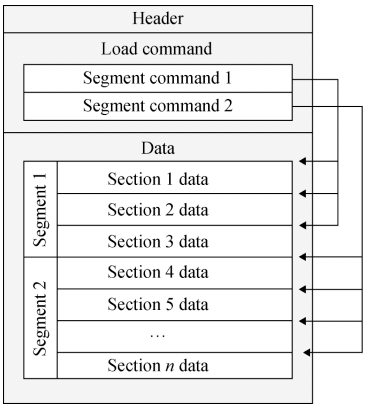
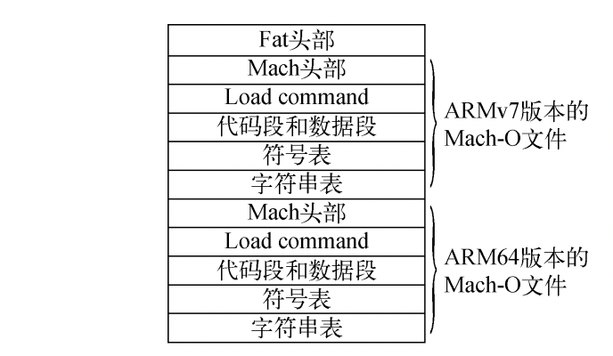

> <h2 id=''></h2>
- [**格式简介**](#格式简介)


<br/>

***
<br/>

> <h1 id='格式简介'>格式简介</h1>

<br/>


&emsp; **Mach-O 文件格式是 iOS 和 macOS 使用的一套可执行文件的文件格式**，类似于Windows 平台上使用的 PE 文件格式，以及 Linux 平台上使用的 ELF 文件格式。

&emsp; Mach-O 文件主要由 header（头部）、Load command（加载命令）和Data 三部分组成，其中 Data 包含多个 Segment（段），Segment 包含多个Section（节区）.



&emsp; 查看Mach-O文件,可以使用MachOView软件.不同的CPU架构对应不同的Mach-O文件,比如同时支持 ARMv7 和 ARM64.可以将这2个不同的架构的Mach-O文件进行合并称为fat文件.




<br/>

> fat文件

查看fat文件,我们可以使用Xcode自带的otool工具

- 查看fat文件的头部:

```
$ otool -f /usr/bin/file
```


<br/>

- 查看Mach文件的头部:

```
$ otool -h /usr/bin/file
```


<br/>

- 查看Load Command信息:


```
$ otool -l /usr/bin/file
```


<br/>

***
<br/>

> <h2 id=''></h2>

<br/>


<br/>

***
<br/>

> <h2 id=''></h2>

<br/>


<br/>

***
<br/>

> <h2 id=''></h2>

<br/>


<br/>

***
<br/>

> <h2 id=''></h2>

<br/>

<br/>

***
<br/>

> <h2 id=''></h2>

<br/>