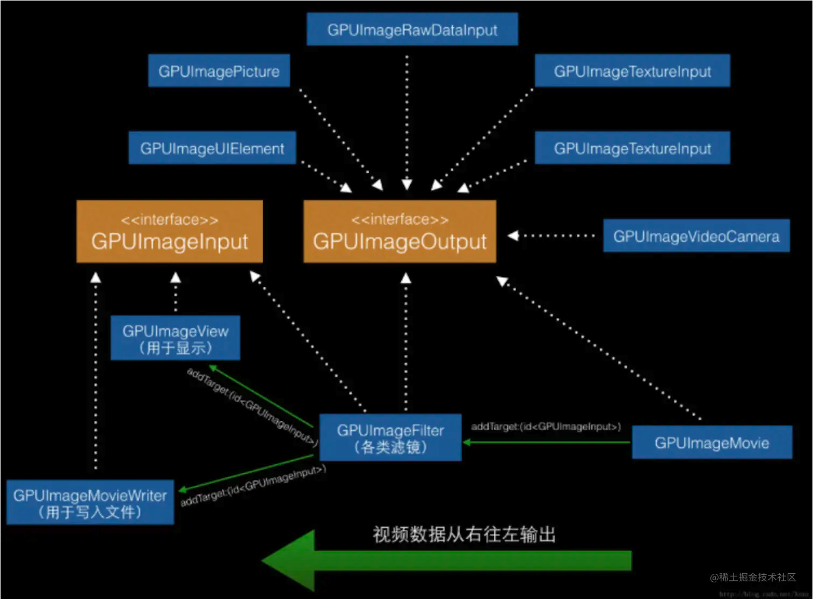
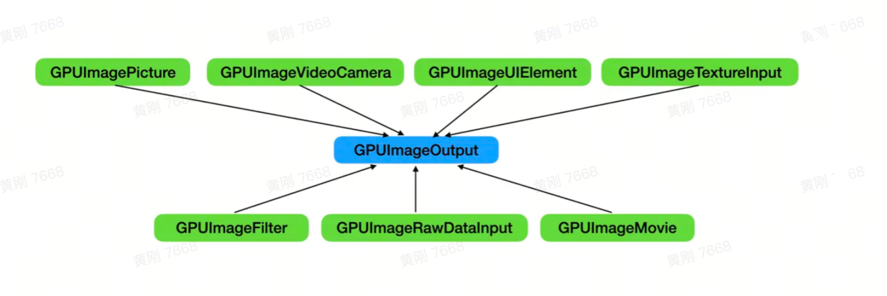
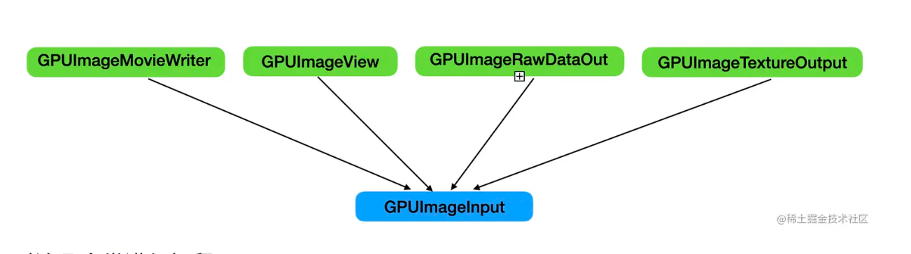

>[**GPUImage（GitHub）**](https://github.com/BradLarson/GPUImage3)
- **资料**
	- [iOS滤镜那些事儿 | 创作者训练营第二期](https://juejin.cn/post/6955668095348244516#heading-11)
	- [GPUImage系列教程（简书）](https://www.jianshu.com/nb/4268718)
	- [GPUImage简介与入门](https://www.zybuluo.com/qidiandasheng/note/1694590)
	- [iOS GPUImage源码解读（一）（腾讯云）](https://cloud.tencent.com/developer/article/1034551)
	- [GPUImage源码解读(一)（philm-iOS-wiki一个技术博主的知识点汇集）](https://philm.gitbook.io/philm-ios-wiki/mei-zhou-yue-du/gpuimage-yuan-ma-jie-du-yi)


<br/>

***
<br/><br/><br/>

> <h1 id=""></h1>

```
pod 'GPUImage', '0.17.0'
```

结构图：



从这张图中我们可以看到GPUImage的几个核心类: **`GPUImageOutput GPUImageFilter GPUImageInput 协议 GPUImageFrameBuffer`,** 接下来我们重点讲解这几个类。

<br/>

***
<br/><br/><br/>

> <h1 id="核心功能类">核心功能类</h1>

<br/><br/><br/>

> <h2 id="GPUImageOutput">GPUImageOutput</h2>

GPUImageOutput 是所有滤镜输入源的基类，也就是滤镜链的起点，先看下他的继承关系，如下图：



<br/>

- **上图绿色的都是GPUImageOutput的子类，它的各个子类的用法：**
	- **GPUImagePicture** 通过图片来初始化，本质上是先将图片转化为 CGImageRef，然后将 CGImageRef 转化为纹理。
	
	- **GPUImageVideoCamera**:通过相机来初始化,本质是封装了AVCaptureVideoDataOutput来获取持续的视频流数据输出，在代理方法`captureOutput:didOutputSampleBuffer:fromConnection:`拿到 **CMSampleBufferRef**，将其转化为纹理的过程。GPUImageStillCamera是 GPUImageVideoCamera 的子类，可以用它来实现拍照功能。
	
	- **GPUImageUIElement**:可以通过 UIView 或者 CALayer 来初始化。这个类可以用来实现在视频上添加文字水印的功能。
	
	- **GPUImageTextureInput:** 通过已经存在的纹理来初始化.
	
	- **GPUImageRawDataInput**:通过二进制数据初始化，然后将二进制数据转化为纹理.
	
	- **GPUImageMovie**:通过本地的视频来初始化。首先通过 AVAssetReader 来逐帧读取视频,然后将帧数据转化为纹理。
	
	- **GPUImageFilter**:比较特殊，它既继承自 GPUImageOutput,又遵守协议 GPUImageInput 协议,所以它既可以作为滤镜链的源头，又可以把渲染的纹理输出给遵守 GPUImageInput 协议的类。是滤镜的核心，后面会单独介绍。


<br/><br/><br/>

> <h2 id="核心功能和方法">核心功能和方法</h2>

想象一下，一个滤镜链的源头能做什么呢？

这个滤镜源头就是**GPUImageOutput**类。

在这之前需要一个渲染对象，这个需要渲染的对象就是**`GPUImageFrameBuffer`**.


<br/><br/><br/>

> <h2 id="GPUImageFramebuffer：管理和存储图像处理管道中的图像数据">GPUImageFramebuffer：管理和存储图像处理管道中的图像数据</h2>


**来科普下： GPUImageFramebuffer**

**GPUImageFramebuffer** 是 GPUImage 框架中的一个核心类，用于管理和存储图像处理管道中的图像数据。它在 GPU 上创建帧缓冲区（Framebuffer），其中包含了需要被处理的图像数据，确保高效的图像处理操作。

<br/>

- **作用和用途：**

	- 存储图像数据：GPUImageFramebuffer 存储每一帧图像的像素数据，可以在滤镜链中传递和处理这些数据。
	
	- GPU 资源管理：它负责将 CPU 上的图像数据上传到 GPU，并在 GPU 上处理后将图像数据传回 CPU，或者继续传递到下一个滤镜。
	
	- 高效复用：GPUImageFramebuffer 使用缓冲池来复用帧缓冲，避免频繁分配和释放内存，从而提高性能。
	
	- 纹理管理：GPUImageFramebuffer 将图像数据存储为 OpenGL ES 的纹理，滤镜通过读取这些纹理来执行相应的图像处理操作。

<br/><br/>

### 如何使用 `GPUImageFramebuffer`

虽然大多数时候 `GPUImageFramebuffer` 是在 `GPUImage` 框架内部处理的，开发者不需要直接操作它，但如果你想深入了解图像处理管道或自定义滤镜时，理解 `GPUImageFramebuffer` 是非常有帮助的。

#### 1. 创建 `GPUImageFramebuffer`

`GPUImageFramebuffer` 通常由框架内部创建，不过你也可以手动创建帧缓冲区，用于自定义滤镜或图像处理任务。

```swift
// 创建帧缓冲区
let framebuffer = GPUImageFramebuffer(size: CGSize(width: 640, height: 480), textureOptions: [GL_TEXTURE_MIN_FILTER: GL_LINEAR], onlyTexture: false)
```

- `size`：帧缓冲区的大小，通常与图像的分辨率一致。
- `textureOptions`：OpenGL ES 纹理的选项，如线性过滤（GL_LINEAR）等。
- `onlyTexture`：设置为 `true` 时，仅创建纹理，不创建完整的帧缓冲区。默认是 `false`。

#### 2. 使用 `GPUImageFramebuffer` 与 OpenGL 交互

当帧缓冲区被创建后，`GPUImageFramebuffer` 便可以通过 OpenGL 进行操作，比如将它绑定为当前帧缓冲区，进行图像处理或渲染操作。

```swift
framebuffer.activateFramebuffer()

// 在此之后，任何 OpenGL 的渲染操作都会发生在这个帧缓冲区上
glClear(GLbitfield(GL_COLOR_BUFFER_BIT))  // 清除当前帧缓冲区
```

#### 3. 读取帧缓冲区的图像

你可以从 `GPUImageFramebuffer` 中获取图像数据，例如在处理完图像后，提取处理后的纹理或图像。

```swift
// 获取帧缓冲区的纹理
let texture = framebuffer.texture

// 如果需要获取图片，可以从纹理中提取图像
let image = framebuffer.newCGImageFromFramebufferContents()
```

#### 4. 管理帧缓冲区的生命周期

`GPUImageFramebuffer` 使用引用计数机制来管理其生命周期，确保在使用完毕后正确释放 GPU 资源。通常你不需要手动干预，但可以调用以下方法来管理帧缓冲区。

```swift
// 增加引用计数
framebuffer.lock()

// 减少引用计数并在适当时释放帧缓冲区
framebuffer.unlock()
```

锁定和解锁机制确保帧缓冲区不会过早释放，避免崩溃。

### 实际应用场景

1. **自定义滤镜**：在创建自定义 GPU 滤镜时，`GPUImageFramebuffer` 允许你手动管理图像数据的输入输出，处理每一帧图像，并将处理后的图像输出给下一个滤镜。

2. **高效的图像处理**：通过复用 `GPUImageFramebuffer`，`GPUImage` 框架避免了频繁的内存分配和销毁操作，提升了多帧图像处理或视频滤镜处理的性能。

3. **纹理管理**：在 GPU 上处理图像时，`GPUImageFramebuffer` 管理了图像数据的存储形式——纹理。自定义渲染管道时，你可以直接操作帧缓冲区上的纹理，执行特定的 OpenGL ES 操作。

### 总结

`GPUImageFramebuffer` 在 `GPUImage` 框架中扮演着关键角色，用于管理图像处理任务中的帧数据。它提供了一种高效的方式将图像数据上传到 GPU，进行滤镜处理，并将结果传递给下一个处理单元。尽管在大多数情况下开发者不需要直接处理 `GPUImageFramebuffer`，但是在自定义复杂滤镜或优化图像处理流程时，理解它的工作机制是非常有帮助的。

<br/><br/>

**这里有几个关于frameBuffe的方法**

```
// 获得当前正在渲染的frameBuffer
- (GPUImageFramebuffer *)framebufferForOutput;

// 移除当前渲染的frameBuffer
- (void)removeOutputFramebuffer;

// 这个方法的调用发生在当前output渲染完毕后，需要通知下一个receiver可以开始渲染的时候，
// 把当前Output的FrameBuffer传递给下一个Input，让它可以使用这个FrameBuffer的结果进行渲染
- (void)setInputFramebufferForTarget:(id<GPUImageInput>)target atIndex:(NSInteger)inputTextureIndex;
```

<br/><br/><br/>

> <h2 id="">Target的使用</h2>

Target的添加以及管理，用来生成整个**FilterChain**.

- **Target的添加**

GPUImageOutput 既然作为一个滤镜的源头，相对应的就得有接受者接受它输出的 FrameBuffer ,这些接受者就是Target,而且有可能有多个接受者。管理这些target的主要方法：

```
// 添加Target
- (void)addTarget:(id<GPUImageInput>)newTarget;

- (void)addTarget:(id<GPUImageInput>)newTarget atTextureLocation:(NSInteger)textureLocation;

// 获取当前所有的target
- (NSArray*)targets;

// target的移除
- (void)removeTarget:(id<GPUImageInput>)targetToRemove;

- (void)removeAllTargets;

```

这两个addTarget方法的作用都是将下一个实现了GPUImageInput协议的对象添加到FilterChain当中来.一旦添加到滤镜链后，在当前Output渲染完成后就会收到通知，从而进行下一步的处理。

<br/><br/>

- **获取当前的GPUImageOutput对FrameBuffer的处理结果**

```
- (CGImageRef)newCGImageFromCurrentlyProcessedOutput;

- (CGImageRef)newCGImageByFilteringCGImage:(CGImageRef)imageToFilter;

- (UIImage *)imageFromCurrentFramebuffer;

- (UIImage *)imageFromCurrentFramebufferWithOrientation:(UIImageOrientation)imageOrientation;

- (UIImage *)imageByFilteringImage:(UIImage *)imageToFilter;

- (CGImageRef)newCGImageByFilteringImage:(UIImage *)imageToFilter;
```

其中最核心的方法是`newCGImageFromCurrentlyProcessedOutput`，基本上所有的方法最终都调用了这个方法。但是`GPUImageOutput`并没有为这个方法提供默认的实现，而是提供了一个方法定义。具体的实现在它的两个重要的子类 `GPUImageFilter` 和 `GPUImageFilterGroup` 中。而实际上最终调用的方法都在 `GPUImageFilter` 中实现了.


<br/><br/><br/>

> <h2 id="GPUImageInput协议">GPUImageInput协议</h2>

- **遵守该协议的类**

GPUImageInput 是一个协议，它定义了一个能够接收 FrameBuffer 的 receiver 所必须实现的基本功能。实现这个协议的类可以作为渲染的终点使用。 实现了 GPUImageInput 接口的类：



- **绿色继承类的解释：**
	- GPUImageMovieWriter：封装了 AVAssetWriter，可以逐帧从帧缓存的渲染结果中读取数据，最后通过 AVAssetWriter 将视频文件保存到指定的路径。
	- GPUImageView：继承自 UIView，通过输入的纹理，执行一遍渲染流程。我们一般使用它来呈现渲染结果。
	- GPUImageTextureOutput：它可以获取到输入的Framebuffer中的纹理对象.
	- GPUImageRawDataOutput：通过 rawBytesForImage 属性，可以获取到当前输入纹理的二进制数据。


