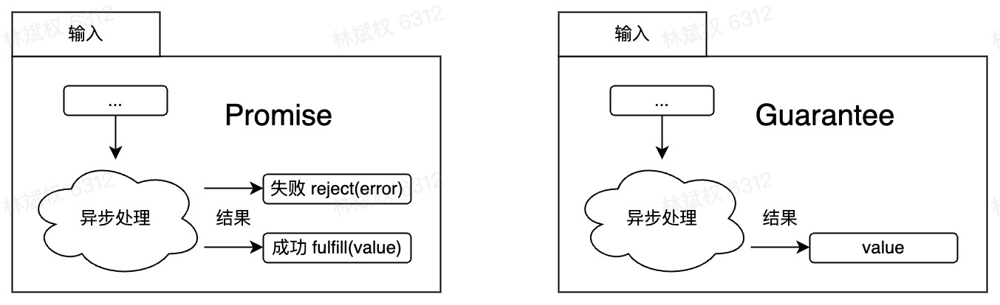

> <h1 id=""></h1>
- [**‌PromiseKit简介**](#PromiseKit简介)
- [Promise](#Promise)
- [Guarantee](#Guarantee)
- [Thenable](#Thenable)
- **资料**
	- [PromiseKit 教程](https://juejin.cn/post/7273085511842119737)


<br/>

***
<br/><br/><br/>

> <h1 id="PromiseKit简介">PromiseKit简介</h1>


PromiseKit 是一个用 Swift 编写的异步编程库，它提供了基于 “Promise” 的机制来简化异步任务的管理。PromiseKit 使用链式语法来处理异步操作，避免了回调地狱，让代码结构更清晰易读。PromiseKit 在 iOS 和 macOS 的开发中广泛应用，尤其适合处理网络请求、文件读写、动画和定时器等异步任务。


<br/>

***
<br/><br/><br/>

> <h1 id="Promise">Promise</h1>

可能会失败的异步封装对象。范型类型，范型是指成功值的类型。

```
class Promise<T>: Thenable, CatchMixin
```


### PromiseKit 的作用

1. **简化异步代码**：
   使用 PromiseKit，你可以用 `.then` 链式调用来处理异步操作，让代码流顺畅、逻辑清晰。
   
2. **错误处理**：
   PromiseKit 有 `catch` 方法，可以方便地捕获并处理错误，无需繁杂的回调嵌套。

3. **链式调用**：
   PromiseKit 的 `then` 方法支持连续调用，适合处理多个顺序异步任务的场景。

4. **任务组合**：
   PromiseKit 提供了 `when` 和 `race` 等方法，便于处理多个异步任务的组合。例如 `when` 可以等待多个任务都完成，而 `race` 则在第一个任务完成时就返回结果。

### 基本用法示例

以下是一个简单的网络请求示例，演示了如何使用 PromiseKit 处理异步任务。

```swift
import PromiseKit

func fetchUserData() -> Promise<String> {
    return Promise { seal in
        // 模拟网络请求，延时2秒后返回结果
        DispatchQueue.global().asyncAfter(deadline: .now() + 2) {
            let success = Bool.random()
            if success {
                seal.fulfill("User data fetched successfully")
            } else {
                seal.reject(NSError(domain: "NetworkError", code: -1, userInfo: nil))
            }
        }
    }
}

// 使用 PromiseKit 处理异步任务
fetchUserData()
    .done { userData in
        print(userData)  // 请求成功时打印数据
    }
    .catch { error in
        print("发生错误：\(error.localizedDescription)")  // 请求失败时处理错误
    }
```

打印：

```
请求成功: User data fetched successfully
```

### 代码解析

1. **定义 `fetchUserData` 函数**：
   - `fetchUserData` 返回一个 `Promise<String>`，表示该函数是一个异步任务。
   - 使用 `seal.fulfill` 来标记成功，传入数据；用 `seal.reject` 来标记失败，传入错误。

2. **调用和处理结果**：
   - `then` 用于处理成功结果，传递成功返回的数据。
   - `catch` 用于捕获错误，打印错误信息。

### PromiseKit 的优势

- **链式调用**：避免深层嵌套的回调（回调地狱）。
- **可读性强**：代码流符合逻辑结构，便于维护。
- **统一的错误处理**：使用 `catch` 集中处理异步任务中的错误。

### 常用方法

- **then**：处理成功的结果。
- **catch**：处理错误。
- **finally**：无论成功还是失败都会执行的代码块。
- **when**：等待多个 Promise 都完成。
- **race**：多个 Promise 中返回最先完成的结果。

PromiseKit 提供了现代化的异步编程风格，适合需要在 Swift 中进行复杂异步任务的开发者。


<br/><br/><br/>

> <h2 id="Guarantee">Guarantee</h2>

Guarantee：与 Promise 类似，也是异步行为的封装对象，但不会产生错误。

范型类型，范型是结果值的类型。

```
class Guarantee<T>: Thenable
```

**Guarantee和Promise的区别：**




`Guarantee` 是 `PromiseKit` 中的一种用于处理不需要返回值的异步操作的结构。它与 `Promise` 类似，但专注于成功的结果而不返回具体值，适用于那些只关心操作是否成功而不关心结果的场景。

### 使用场景

- **异步任务**：当你只想知道一个操作是否成功，而不需要返回具体的值时。
- **处理副作用**：例如，执行某个网络请求，更新 UI，但不需要返回任何结果。

```
// 定义一个异步操作的函数，返回 Guarantee<Void>
func testGuranteeData() -> Guarantee<Void> {
    return Guarantee { seal in
        // 模拟异步操作，比如一个网络请求或某个计算
        DispatchQueue.global().async {
            // 这里可以是任何异步任务
            sleep(2)  // 模拟延迟
            print("异步操作完成")
            seal(())  // 完成操作，不需要返回值
        }
    }
}


@objc private func testGuranteeAction00(_ sender: UIButton) {
    // 调用异步操作
    testGuranteeData()
        .done {
            print("操作成功，无返回值")  // 处理成功情况
        }
        .catch { error in
            print("发生错误: \(error.localizedDescription)")  // 处理错误情况
        }
}
```

打印：

```
操作成功，无返回值
```


### 代码解释

1. **`performAsyncOperation` 函数**：
   - 返回一个 `Guarantee<Void>` 类型。
   - 使用 `seal.resolve(())` 表示操作成功，且不需要返回具体值。

2. **调用 `performAsyncOperation`**：
   - 使用 `.done` 处理操作成功的情况。
   - 使用 `.catch` 处理错误情况。

### Guarantee 的优势

- **简单性**：在不需要返回结果的情况下，使用 `Guarantee` 简化了代码逻辑。
- **清晰的意图**：通过使用 `Guarantee`，代码的意图更加明确，表示只关注操作的成功与否。

### 注意事项

- 如果你在需要返回值的上下文中使用 `Guarantee`，可能会导致类型不匹配的错误，因此确保正确选择 `Promise` 或 `Guarantee`。
- `Guarantee` 只能在没有错误处理的情况下使用，如果操作可能失败，仍然应使用 `Promise`。

通过以上示例和解释，你可以更好地理解 `Guarantee` 的使用场景和方法。


<br/>

***
<br/><br/><br/>

> <h1 id="Thenable">Thenable</h1>

为 Promise 和 Guarantee 对象都遵循的协议，提供了拼接 Promise/Guarantee 并提供其他原语的能力。

```
/// 拼接 Promise/Guarantee，当其状态为成功时，执行拼接的 Promise/Guarantee。body 中返回的类型不必跟上一级任务的一致。
func then<U: Thenable>(_ body: @escaping(T) throws -> U) -> Promise<U.T>

/// 获取值，表示成功结束。注意其 body 不用返回值，后续也不能拼接获取值的 Promise/Guarantee。
func done(_ body: @escaping(T) throws -> Void) -> Promise<Void>

/// 获取值。也是只是获取值，且 body 中不用返回，后续可以继续拼接获取值的 Promise/Guarantee，即不会对后续拼接流程有副作用。
func get(_ body: @escaping (T) throws -> Void) -> Promise<T>

/// 获取 Result 对象，且 body 中不用返回。同样也是不会对后续拼接流程产生副作用。
func tap(_ body: @escaping(Result<T>) -> Void) -> Promise<T>

/// 值转换，同样要求状态为成功时才执行。
func map<U>(_ transform: @escaping(T) throws -> U) -> Promise<U>
func map<U>(_ keyPath: KeyPath<T, U>) -> Promise<U>
func compactMap<U>(_ transform: @escaping(T) throws -> U?) -> Promise<U>
func compactMap<U>(_ keyPath: KeyPath<T, U?>) -> Promise<U>
```

<br/>

**一个简单Demo**

```

class HGTestThenController: HGBaseController {
    
    private let tetLab00 = UILabel().then {
        $0.backgroundColor = .orange
        $0.textAlignment = .center
        $0.textColor = .black
        $0.text = "Hello, world!!"
    }
    
    let myThen = MyThen().then {
        $0.really = "8888888"
    }
    
    private let testBtn00 = UIButton(type: .custom).then {
        $0.frame = CGRect(x: 120, y: 200, width: 100, height: 60)
        $0.setTitle("测试Then的with", for: .normal)
        $0.backgroundColor = .red
    }
    
    
    override func viewDidLoad() {
        super.viewDidLoad()
        self.view.backgroundColor = .white
        
        self.view.addSubview(self.tetLab00)
        self.view.addSubview(self.testBtn00)
        
        self.tetLab00.frame = CGRect(x: 0, y: 100, width: 100, height: 60)
        
        testBtn00.addTarget(self, action: #selector(testThen_with_method(_:)), for: .touchUpInside)

        self.testUserdefaultsDo()
    }
    
    
    private func testUserdefaultsDo() {
        UserDefaults.standard.do {
            $0.set("devxoul", forKey: "userName")
            $0.set("devxoul@gmail.com", forKey: "email")
            $0.synchronize()
        }
    }
    
    @objc private func testThen_with_method(_ sender: UIButton) {
        let newFrame = self.tetLab00.frame.with {
            $0.size.width = 400
            $0.size.height = 100
            $0.origin.x = 40
        }
        
        self.tetLab00.do {
            $0.frame = newFrame
        }
    }
}

class MyThen {
    var really:String?
}

extension MyThen: Then {
    
}

```

<br/>
**调用：**

```
 func testThenableProtocol() {
    // 使用自定义的 Thenable 类
    let customThenable = HGTestCustomThenable(value: "Hello, Thenable!")
    
    customThenable
        .then { value in
            print("Received value: \(value)")  // 处理成功的值
            return "Processed \(value)"  // 返回下一个 Promise 的值
        }
        .done { processedValue in
            print("Final processed value: \(processedValue)")  // 处理最终值
        }
        .catch { error in
            print("发生错误: \(error.localizedDescription)")  // 处理错误
        }
    
    // 使用 pipe 方法
    customThenable.pipe { result in
        switch result {
        case .fulfilled(let value):
            print("Piped value: \(value)")
        case .rejected(let error):
            print("发生错误: \(error.localizedDescription)")
        }
    }
    
    // 输出 result 的值
    if let result = customThenable.result {
        switch result {
        case .fulfilled(let value):
            print("最终结果: \(value)")
        case .rejected(let error):
            print("最终错误: \(error.localizedDescription)")
        }
    }
}
```

**输出：**

```
Received value: Hello, Thenable!
最终结果: Hello, Thenable!
Piped value: Hello, Thenable!
```

- **关键点**
	- var result: PromiseKit.Result<String>?：现在这个属性在类中被保留，用于存储操作的结果。
	- then 和 pipe 方法中更新 result：在每个方法中，根据成功或失败的情况更新 result 属性。
	- 实现 then 方法，用于处理异步操作并返回 Promise<U>。
	- 实现 pipe(to:) 方法，用于将结果传递给给定的闭包。
	- result 变量：

	- var result: PromiseKit.Result<String>? 用于存储 PromiseKit 的结果，可能是成功或失败。
	- 在 then 方法中更新 result：
	- 
	- 在 then 方法中，如果成功，使用 self.result = .success(value) 更新结果；如果失败，使用 self.result = .failure(...) 进行更新。
	- 在 pipe(to:) 方法中更新 result：
	- 
	- 在 pipe(to:) 方法中，同样更新 result，以保持状态的一致性。
	- 输出 result 的值：
	- 
	- 在使用完 then 和 pipe 方法后，输出 customThenable.result 的值，查看最终结果。

