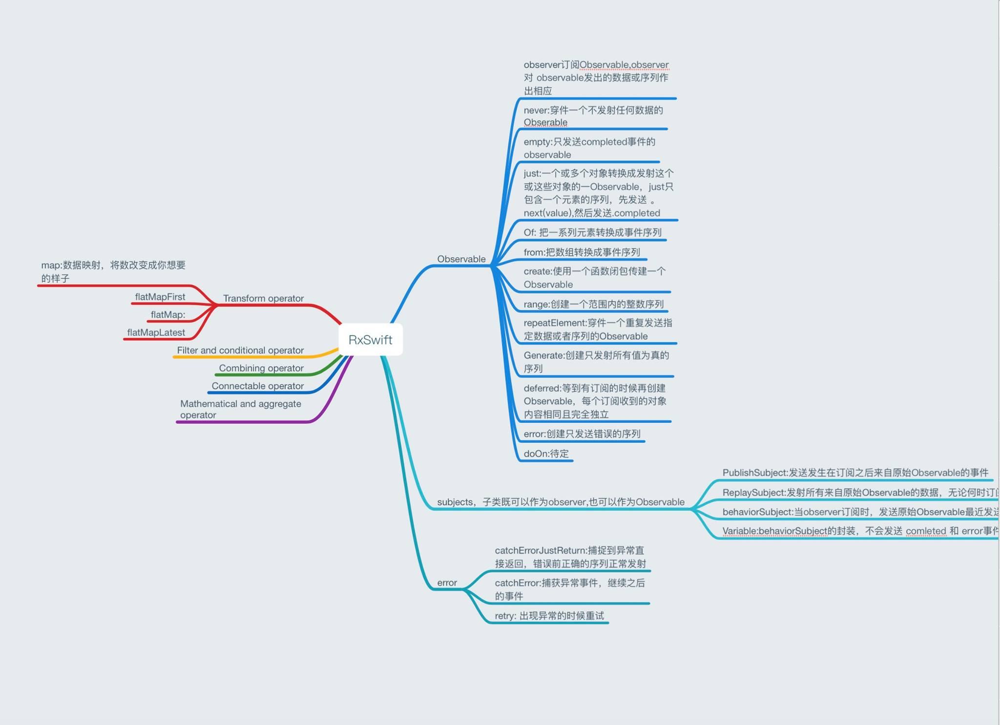
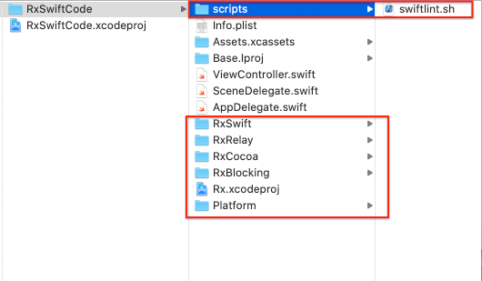
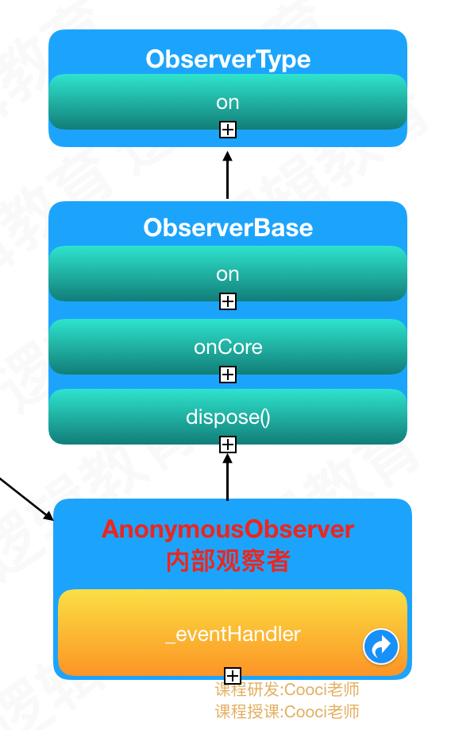
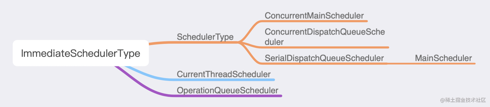

> <h2 id=''></h2>
- [**RxSwift**](#RxSwift)
	- [安装](#安装) 
	- [Observer(观察者)](#Observer(观察者))
	- [Observable(被观察者)继承链](#Observable被观察者继承链)
	- [Observable的核心函数](#Observable的核心函数)
	- [ObservableType协议扩展](#ObservableType协议扩展)
	- [Observer继承体系](#Observer继承体系)
	- [订阅、序列流程](#订阅序列流程)
- [**Observable(可观察序列)**](#Observable(可观察序列))
	- [函数式](#函数式)
	- [响应式](#响应式)
	- [Observable类](#Observable类)
	- [AnonymousObservableSink](#AnonymousObservableSink)
	- [Event](#Event)
	- [创建数据源](#创建数据源)
	- [AnonymousObserver](#AnonymousObserver)
	- [AsyncSubject](#AsyncSubject)
- [**Subject**](#Subject)
	- [PublishSubject](#PublishSubject)
	- [ReplaySubject](#ReplaySubject)
	- [BehaviorSubject](#BehaviorSubject)
		- [variable](#variable)
- [**Driver**](#Driver)
- [**操作符**](#操作符)
	- [rx、orEmpty](#rxorEmpty)
	- [**share(replay:scope:)**](#share(replay:scope:))
	- [filter](#filter)
	- [map转换](#map转换)
	- [zip组合](#zip组合)
	- [**empty**](#empty)
	- [**just**](#just)	
	- [**of**](#of)
	- [**from**](#from)
	- [**create**](#create)
- [**Scheduler调度器**](#Scheduler调度器)
	- [切换线程](#切换线程)
	- [CurrentThreadScheduler](#CurrentThreadScheduler)
	- 	[MainScheduler](#MainScheduler)
	- 	[SerialDispatchQueueScheduler](#SerialDispatchQueueScheduler)
	- 	[ConcurrentDispatchQueueScheduler](#ConcurrentDispatchQueueScheduler)
	- 	[OperationQueueScheduler](#OperationQueueScheduler)
- 	[**Disposable**](#Disposable)
	- 	
- 	[ErrorHandling错误处](#ErrorHandling错误处)
	- 	[retryWhen](#retryWhen)
	- [catchError恢复](#catchError恢复)
- [实践](#实践)
	- [网络请求](#网络请求)
	- [UITableView](#UITableView)
- **资料**
	- [**Cocoi老师RxSwift源码**](https://www.jianshu.com/p/5533c99bfa8e)
	- [RxSwift 使用详解系列](https://www.jianshu.com/p/f61a5a988590)
	- [**RxSwift中文文档**](https://beeth0ven.github.io/RxSwift-Chinese-Documentation/)
	- [**RxSwift特征序列**](http://www.cocoachina.com/articles/29100)
	- [**RxSwift销毁者Dispose源码分析**](https://blog.csdn.net/JeffersonZHabc/article/details/98962237)
	- [**RxSwift使用详解系列**](https://www.jianshu.com/p/f61a5a988590)
	- [**RxSwift使用**](https://www.hangge.com/blog/cache/detail_1917.html)
	- [线程切换](http://t.swift.gg/d/31-015)


<br/>

***
<br/>
<br/>


> <h1 id='RxSwift'>RxSwift</h1>


- **RxSwift：** 它只是基于 Swift 语言的 **Rx( ReactiveX)标准** 实现接口库，所以 RxSwift 里不包含任何 Cocoa 或者 UI方面的类。
	- ReactiveX 是一种编程范式，用于处理异步数据流和事件流。它提供了一系列操作符和工具，使得处理数据流和事件流变得简单、高效和直观。
	- ReactiveX 最初由 Microsoft 在 .NET 平台上开发，后来被移植到其他语言和平台，包括 Java（RxJava）、JavaScript（RxJS）、C++（RxCpp）等。Rx 标准定义了一系列操作符和模式，用于处理异步数据流，并提供了一种响应式的编程模型

<br/>

- **RxCocoa：** 是基于 RxSwift针对于 iOS开发的一个库，它通过 Extension 的方法给原生的比如 UI 控件添加了 Rx 的特性，使得我们更容易订阅和响应这些控件的事件。



<br/>

- **RxSwift主要有如下四个成员：**
	- 可观察序列 - Observable
	- 观察者 - Observer
	- 调度者 - Scheduler
	- 销毁者 - Dispose


<br/>

> <h2 id='安装'>安装</h2>

> **Cocoapods安装**

```
platform :ios, '12.0'

target 'RxSwiftDemo' do
  # Comment the next line if you're not using Swift and don't want to use dynamic frameworks
  use_frameworks!

  # Pods for FilterNumber
  pod 'RxSwift', '~> 6.2.0'
  pod 'RxCocoa', '~> 6.2.0'
end

```


<br/>

> [**手动安装**](https://www.jianshu.com/p/543c35ebc4b5)

- 在项目根目录，执行(或者直接**Download Zip**)：

```
$ git submodule add git@github.com:ReactiveX/RxSwift.git

```

让RxSwift以submodule的方式集成到项目目录中。

- 打开项目文件，把RxSwift目录下如下文件拷贝到,你所新建的项目中:
	
	

	


- 	在所要使用的地方导入 
	
	```
	import RxSwift
	import RxCocoa
	```
	

<br/>


- **类型**
	-  观察者（Observer）：执行要做的事
	-  被观察者(可观察的)（Observable）：产生的事件，也就是序列
	-  订阅者（Subscriber） 事件的最终处理者
	-  管道（Sink） Observer 和 Observable 沟通的桥梁

```
Observable<String>.create { observer -> Disposable in
  observer.onNext("hello")//发送序列
  return Disposables.create()
}.subscribe { event in //订阅序列
  print(event.element)
}

```


<br/><br/>


> <h2 id='Observer(观察者)'>Observer(观察者)</h2>

&emsp;  核心理解就是一个`观察者(Observer)`订阅一个`可观察序列(Observable)`,`观察者(Observer)`对`可观察序列(Observable)`发射的数据或数据序列作出响应。

观察者需要一个订阅序列的功能,如下：

```
class Observable<Element> {
    func subscribe(observer: Observer<Element>) -> Disposable
}

protocol ObserverType {
    func on(event: Event<Element>)
}
```

通过这个 `subscribe` 来订阅序列。这里就涉及到序列的“冷”、“热”：

- 冷：只有有观察者订阅这个序列时，序列才发射值（感觉是Observer）；
- 热：序列创建时就开始发射值（感觉是Observable）。


<br/><br/>


> <h2 id='Observable被观察者继承链'>Observable(被观察者)继承链</h2>

`Observable 继承关系图`


<br/>


<br/><br/>


> <h2 id='Observable的核心函数'>Observable的核心函数</h2>


a. `subscribe` 订阅操作, `Observable `和 `Observer` 通过订阅建立联系,
`Observable` 好比水源， `Observer` 好比水龙头(永远开着的水龙头)， 订阅的过程就是在`Observable` 和 `Observer` 之间建立管道， 一旦建立管道即是永久性的，只要水源有水， 水龙头就会有水;

b.  `run` 对用户不可见，隐藏了大量的实现细节， 这个函数就是建立水管的过程;

c.  `asObservable`： 这个协议的存在使得`Observable` 的定义变得更加广泛，`asObservable `的函数实现：

```
public func asObservable() -> Observable<Element> {
    return source
}

```


<br/><br/>


> <h2 id='ObservableType协议扩展'>ObservableType协议扩展</h2>

```
extension ObservableType {
	public func subscribe(_ on: @escaping (Event<E>) -> Void)
	    -> Disposable {
	        let observer = AnonymousObserver { e in
	            on(e)
	        }
	        return self.asObservable().subscribe(observer)
	}
}

```

&emsp;  `ObservableType: `扩展 `subscribe `方法， 确保所有的`Observable`行为一致， 都是经由`self.asObservable() `获取`Observable`;


<br/><br/>


> <h2 id='Observer继承体系'>Observer继承体系</h2>


<br/><br/>


> <h2 id='订阅序列流程'>订阅、序列流程</h2>


<br/>

***
<br/><br/>


> <h1 id='Observable(可观察序列)'>Observable(可观察序列)</h1>

<br/>

> <h2 id='函数式'>函数式</h2>

&emsp;  `函数式编程`是种编程范式，它需要我们将函数作为参数传递，或者作为返回值返还。通过组合不同的函数来得到想要的结果。

特点：**`允许把函数本身作为参数传入另一个函数，同时还允许返回一个函数！`**

函数表达式如：`y = f(x) ---> x = f(x) ---> y = f(f(x))`

**`优点：`**
- 灵活
- 高复用
- 简洁
- 易维护
- 适应各种需求变化


<br/><br/>


> <h2 id='响应式'>响应式</h2>


 
概念：**`对象对某一数据流变化做出响应的这种编码方式称为响应式。`**

<br/><br/>


&emsp; ` Observable` 如果你使用过 RAC ，它如同 Signal 一样。RxSwift 中关键点就是在于如何把普通的数据或者事件变成可观察的，这样当某些数据或事件有变化的时候就会通知它的订阅者。

`Observable(可观察序列)`是可以发送序列的

<br/><br/><br/>

> <h2 id='Observable类'>Observable类</h2>

- **Observable<T>**
	* **`Observable<T>`**   这个类就是 Rx 框架的基础，我们可以称它为可观察序列。它的作用就是可以异步地产生一系列的 Event（事件），即一个 Observable<T> 对象会随着时间推移不定期地发出 event(element : T) 这样一个东西。
	
	*   而且这些 Event 还可以携带数据，它的泛型 <T> 就是用来指定这个 Event 携带的数据的类型。
	
	*   有了可观察序列，我们还需要有一个 Observer（订阅者）来订阅它，这样这个订阅者才能收到 Observable<T> 不时发出的 Event。


```
public class Observable<Element> : ObservableType {
    init() {
#if TRACE_RESOURCES
        _ = Resources.incrementTotal()
#endif
    }
    
    public func subscribe<Observer: ObserverType>(_ observer: Observer) -> Disposable where Observer.Element == Element {
        rxAbstractMethod()
    }
    
    public func asObservable() -> Observable<Element> { self }
    
    deinit {
#if TRACE_RESOURCES
        _ = Resources.decrementTotal()
#endif
    }
}

```

<br/>

- Observable实现了一个协议ObservableType，而且ObservableType协议继承自ObservableConvertibleType协议，所以在Observable中实现了两个协议方法：subscribe和asObservable。

- subscribe方法没有具体实现的逻辑，需要子类去实现。

- asObservable方法返回的是self，看似用处不大，其实不是这样的。asObservable是非常有用的，如果一类是Observable的子类，我们可以直接返回self，如果不是Observable的子类，我们可以通过重写这个协议方法来返回一个Observable对象，这样保证了协议的一致性。在使用的时候我们可以直接写类似self.asObservable().subscribe(observer)这样的代码，有利于保持代码的简洁性，是良好的封装性的体现。所以我觉得这个设计非常的好，在我们日常开发中也可以借鉴。

- _ = Resources.incrementTotal()和_ = Resources.decrementTotal()这两行代码其实是RxSwift内部实现的一个引用计数。这部分内容我会在后面的文章中再详解。

- Observable子类非常多，感兴趣可以看下,主要区别在于对subscribe方法的实现不一样。


<br/><br/>

> <h2 id='AnonymousObservableSink'>AnonymousObservableSink</h2>

AnonymousObservableSink 是一个用于创建自定义 Observable 序列的工具类。它允许你手动创建 Observable 序列，以便更灵活地控制序列的行为和数据流。

<br/>

**详细解释如下：**

- 创建自定义 Observable 序列
AnonymousObservableSink 允许你根据特定需求创建自定义的 Observable 序列。你可以在内部定义序列的行为、产生的事件类型以及事件的发送时机等。

- 控制数据流
通过 AnonymousObservableSink，你可以更灵活地控制数据流。你可以手动指定序列的行为，例如何时发送事件、发送何种类型的事件以及如何处理错误。

- 自定义序列操作符
你可以使用 AnonymousObservableSink 创建自定义的序列操作符，以便对序列进行自定义的操作和转换。这使得你可以根据特定的业务逻辑创建特定的序列操作符，以适应不同的场景和需求。

- 功能扩展和定制
通过 AnonymousObservableSink，你可以对 Observable 序列的功能进行扩展和定制。你可以根据项目的需求创建特定的序列，以便更好地满足业务逻辑的要求。

总之，AnonymousObservableSink 提供了一种灵活、可定制的方式来创建和控制 Observable 序列，使得你可以更好地适应不同的数据流处理需求。

```
final private class AnonymousObservableSink<Observer: ObserverType>: Sink<Observer>, ObserverType {
    typealias Element = Observer.Element 
    typealias Parent = AnonymousObservable<Element>

    // state
    private let isStopped = AtomicInt(0)

    #if DEBUG
        private let synchronizationTracker = SynchronizationTracker()
    #endif

    override init(observer: Observer, cancel: Cancelable) {
        super.init(observer: observer, cancel: cancel)
    }

    func on(_ event: Event<Element>) {
        #if DEBUG
            self.synchronizationTracker.register(synchronizationErrorMessage: .default)
            defer { self.synchronizationTracker.unregister() }
        #endif
        switch event {
        case .next:
            if load(self.isStopped) == 1 {
                return
            }
            self.forwardOn(event)
        case .error, .completed:
            if fetchOr(self.isStopped, 1) == 0 {
                self.forwardOn(event)
                self.dispose()
            }
        }
    }

    func run(_ parent: Parent) -> Disposable {
        //parent 就是上面传过来的AnonymousObservable对象 
        //_subscribeHandler就是之前create函数的闭包 
        //在这个方法中把self转换成AnyObserver对象，也就是把AnonymousObservableSink对象转换成AnyObserver对象
        parent.subscribeHandler(AnyObserver(self))
    }
}
```

- AnonymousObservableSink是Sink的子类，AnonymousObservableSink本身遵守ObseverType协议，与此同时实现了run方法;

- AnonymousObservableSink是Observer和Observable的衔接的桥梁，也可以理解成管道。它存储了_observer和销毁者_cancel。通过sink就可以完成从Observable到Obsever的转变。

- 在run方法中的这行代码parent._subscribeHandler(AnyObserver(self))，其中parent是一个AnonymousObservable对象。_subscribeHandler这个block调用，代码会执行到创建序列时的block。然后会调用发送信号的代码obserber.onNext("发送信号")，然后代码会经过几个中间步骤会来到AnonymousObservableSink类的on方法。


<br/>

使用 AnonymousObservableSink 创建一个简单的定时序列：

```
import RxSwift

// 创建一个定时观察者
let customObservable = AnonymousObservableSink<Int> { observer in
    // 每隔一秒发送一个事件给观察者
    var count = 0
    let timer = Timer.scheduledTimer(withTimeInterval: 1.0, repeats: true) { _ in
        observer.onNext(count)
        count += 1
        
        // 如果计数达到 5，则发送完成事件并取消定时器
        if count == 5 {
            observer.onCompleted()
            timer.invalidate()
        }
    }
    
    // 返回一个可清理的资源
    return Disposables.create {
        timer.invalidate()
    }
}

// 订阅这个自定义序列
customObservable.subscribe(onNext: { value in
    print("Next value: \(value)")
}, onCompleted: {
    print("Sequence completed")
}).disposed(by: DisposeBag())
```

在这个例子中，我们使用 AnonymousObservableSink 来创建了一个定时序列。在闭包内部，我们使用定时器每隔一秒向观察者发送一个递增的整数值。当计数器达到 5 时，我们发送了一个完成事件，并停止定时器。然后，我们订阅了这个自定义序列，打印出接收到的事件值，并在序列完成时打印出完成信息。

这只是一个简单的例子，你可以根据自己的需求定义更复杂的自定义序列。使用 AnonymousObservableSink，你可以更灵活地控制序列的行为和数据流。


<br/><br/>


> <h2 id='Event'>Event</h2>

&emsp; 可观察序列存在三种情况：发射数据(Next)、遇到问题(Error)、发射完成(Completed),也就是3个事件.源码如下:

```
public enum Event<Element> {
    /// Next element is produced.
    // 序列的下一个元素
    case next(Element)
 
    /// Sequence terminated with an error.
    // 序列因为某些错误终止
    case error(Swift.Error)
 
    /// Sequence completed successfully.
    // 正常的序列技术
    case completed
}
```

&emsp;  可以看到 `Event` 就是一个枚举，也就是说一个` Observable `是可以发出 3 种不同类型的 Event 事件：
* `next` 事件就是那个可以携带数据 `<T> `的事件，可以说它就是一个“最正常”的事件;

* `error` 事件表示一个错误，它可以携带具体的错误内容，一旦` Observable `发出了 `error event`，则这个 `Observable` 就等于终止了，以后它再也不会发出 event 事件了;

* `completed` 事件表示 `Observable `发出的事件正常地结束了，跟 error 一样，一旦 `Observable` 发出了 `completed event`，则这个 Observable 就等于终止了，以后它再也不会发出 event 事件了;


<br/><br/>

> <h2 id='创建数据源'>创建数据源</h2>

那如何能够让某些数据或事件成为 Observable 呢？

&emsp;  RxSwift 中提供很多种创建 Observable  序列的静态方法。

比如：`From`、`never`、`empty` 和 `create` 等。订阅者可以收到 3 个事件，`onNext`、`onError` 和 `onCompleted`，每个 Observable 都应该至少有一个 `onError `或` onCompleted` 事件，`onNext `表示它传给下一个接收者时的数据流。

```
func createObserver() {
        //1. 序列创建
        let observer = Observable<Any>.create { (observer) -> Disposable in

            //3. 信号发送
            observer.onNext("Hello! 我来了！！！")
            observer.onCompleted()
            
            return Disposables.create()
        }
        
        //2. 序列订阅
        observer.subscribe(onNext: { (text) in
            print("---> \(text)")
        }, onError: nil, onCompleted: {
            print("Completed 完成！！")
        }, onDisposed: nil).disposed(by: disposeBag)
    }
```
打印：

```
---> Hello! 我来了！！！

Completed 完成！！
```


<br/><br/>


点击`②`中的`subscribe`方法，来到其源码：

```
public func subscribe(onNext: ((Element) -> Void)? = nil, onError: ((Swift.Error) -> Void)? = nil, onCompleted: (() -> Void)? = nil, onDisposed: (() -> Void)? = nil)
        -> Disposable {
            let disposable: Disposable
            
            if let disposed = onDisposed {
                disposable = Disposables.create(with: disposed)
            }
            else {
                disposable = Disposables.create()
            }
            
            #if DEBUG
                let synchronizationTracker = SynchronizationTracker()
            #endif
            
            let callStack = Hooks.recordCallStackOnError ? Hooks.customCaptureSubscriptionCallstack() : []
            

            //上述开始 ①中序列创建 的闭包中的参数 observer 就是来自于下面的这个observer
            let observer = AnonymousObserver<Element> { event in
                
                #if DEBUG
                    synchronizationTracker.register(synchronizationErrorMessage: .default)
                    defer { synchronizationTracker.unregister() }
                #endif
                
                switch event {
                case .next(let value):
                    onNext?(value)
                case .error(let error):
                    if let onError = onError {
                        onError(error)
                    }
                    else {
                        Hooks.defaultErrorHandler(callStack, error)
                    }
                    disposable.dispose()
                case .completed:
                    onCompleted?()
                    disposable.dispose()
                }
            }

            //返回值中进行函数调用
            return Disposables.create(
                self.asObservable().subscribe(observer),
                disposable
            )
    }
}
```

一旦进行这句`self.asObservable().subscribe(observer),
                disposable`的调用,就会来到
                
```
let observer = Observable<Any>.create { (observer) -> Disposable in

            //3. 信号发送
            observer.onNext("Hello! 我来了！！！")
            observer.onCompleted()
            
            return Disposables.create()
        }
```
上述闭包中的调用了，就开始走`onNext`、`onCompleted()`方法的调用了。


<br/>
<br/>

> <h2 id='AnonymousObserver'>AnonymousObserver</h2>


继承关系图:




AnonymousObservable是Observable的子类，它们的继承关系是：AnonymousObservable -> Producer -> Observable -> ObservableType -> ObservableConvertibleType

<br/>
<br/>

> <h2 id='AsyncSubject'>AsyncSubject</h2>

```
let disposeBag = DisposeBag()
let subject = AsyncSubject<String>()

subject.subscribe{
    print("subscription: 1 Event:", $0)
}.disposed(by: disposeBag)

subject.onNext("🐩")
subject.onNext("🐶")
subject.onNext("🐱")
subject.onNext("🥜")
subject.onCompleted()
```


打印：

```
subscription: 1 Event: next(🥜)

subscription: 1 Event: completed
```


<br/>

***
<br/>
<br/>

># <h1 id='Subject'>Subject</h1>

&emsp;  我们把 Subject 当作一个桥梁（或者说是代理）， Subject 既是 Observable 也是 Observer :
- 作为一个 Observer ，它可以订阅序列。
- 同时作为一个 Observable ，它可以转发或者发射数据。


<br/>

> <h2 id='PublishSubject'>PublishSubject</h2>


`PublishSubject` 只发射给观察者订阅后的数据


```        
let disposeBag = DisposeBag()
let subject = PublishSubject<String>()

subject.subscribe{
    print("subscription: 1 Event:", $0)
}.disposed(by: disposeBag)

subject.onNext("❤️")

```

打印：

```
subscription: 1 Event: next(❤️)
```


<br/>
<br/>


> <h2 id='ReplaySubject'>ReplaySubject</h2>

&emsp; 和 PushblishSubject 不同，不论观察者什么时候订阅， ReplaySubject 都会发射完整的数据给观察者

```
let disposeBag = DisposeBag()
let subject = ReplaySubject<String>.create(bufferSize: 1)

subject.subscribe{
    print("Subscription: 1 Event:", $0)
}.disposed(by: disposeBag)

subject.onNext("🐶")
subject.onNext("🐱")
```

打印:

```
Subscription: 1 Event: next(🐶)
Subscription: 1 Event: next(🐱)
```


<br/>
<br/>


> <h2 id='BehaviorSubject'>BehaviorSubject</h2>


&emsp;  当观察者对 BehaviorSubject 进行订阅时，它会将源 Observable 中最新的元素(**初始化元素**)发送出来（如果不存在最新的元素，就发出默认元素）。然后将随后产生的元素发送出来。

```
let disposeBag = DisposeBag()
let subject = BehaviorSubject.init(value: "🎈")

subject.subscribe{
    print("Subcription: 1 Event:", $0)
}.disposed(by: disposeBag)

subject.onNext("🦁")
subject.onNext("🐲")

```

打印:

```
Subcription: 1 Event: next(🎈)
Subcription: 1 Event: next(🦁)
Subcription: 1 Event: next(🐲)
```


<br/>
<br/>


> <h3 id='variable'>variable</h3>

Variable 是 BehaviorSubject 的一个封装。相比 BehaviorSubject ，它不会因为错误终止也不会正常终止，是一个无限序列。

`（注意：由于 Variable 在之后版本中将被废弃，建议使用 Varible 的地方都改用下面介绍的 BehaviorRelay 作为替代。）`

```
 ///BehaviorSubject测试
@objc class func testBehaviorSubject_VariableModule(){
    let disposeBag = DisposeBag()
    let varible = BehaviorRelay<String>(value: "OnePice：最强 Z")
    varible.asObservable().subscribe { (event) in
        print("Subscription: 1, event: \(event)")
    }.disposed(by: disposeBag)
    
    varible.accept("路飞")
    varible.accept("索大")
}
```

log:

```
Subscription: 1, event: next(OnePice：最强 Z)
Subscription: 1, event: next(路飞)
Subscription: 1, event: next(索大)
```

&emsp;  我们最常用的 Subject 应该就是 Variable 。Variable 很适合做数据源，比如作为一个 UITableView 的数据源，我们可以在这里保留一个完整的 Array 数据，每一个订阅者都可以获得这个 Array 。


<br/>
<br/>


> <h2 id=''></h2>


<br/>
<br/>


> <h2 id=''></h2>


<br/>

***
<br/>
<br/>


> <h1 id='Driver'>Driver</h1>

&emsp; Driver从名字上可以理解为驱动，在功能上它类似被观察者（Observable）.

<br/>

UITextField绑定到UILable:

```
//普通绑定
 let result  = inputTF.rx.text.orEmpty
    .asDriver() // 将序列转换为Driver序列
    .flatMap {
        return self.request(text: $0)
            .asDriver(onErrorJustReturn: "检测到了错误事件")
    }

// 将结果绑定到textLabel显示，注意这里使用的是drive而不是bindTo
let _ = result.map { "\($0 as! String)" } // 映射
    .drive(self.textLabel.rx.text)
    .disposed(by: disposeBag)
        


//使用driver
let result  = inputTF.rx.text.orEmpty
    .asDriver() // 将序列转换为Driver序列
    .flatMap {
        return self.request(text: $0)
            .asDriver(onErrorJustReturn: "检测到了错误事件")
    }

// 将结果绑定到textLabel显示，注意这里使用的是drive而不是bindTo
let _ = result.map { "\($0 as! String)" } // 映射
    .drive(self.textLabel.rx.text)
    .disposed(by: disposeBag)
```
    
可见，Driver的drive方法与Observable的方法bindTo用法非常相似，事实上，它们的作用也是一样，说白了就是被观察者与观察者的绑定。那为什么RxSwift的作者又搞出Driver这么个东西来呢？
其实，比较与Observable，Driver有以下的特性：


- 不会产生 error 事件
- 一定在主线程监听（MainScheduler）
- 共享状态变化（shareReplayLatestWhileConnected）

<br/>

当你将一个Observable转换成Driver时，用到的asDriver方法有下面几个重载：

```
asDriver(onErrorJustReturn onErrorJustReturn: Self.E)

asDriver(onErrorDriveWith onErrorDriveWith: RxCocoa.Driver<Self.E>)

asDriver(onErrorRecover onErrorRecover: (error: ErrorType) -> RxCocoa.Driver<Self.E>)
```
从这三个重载方法中可看出，当我们要将有可能会发出错误事件的Observable转换成Driver时，必须要先将所有可能发出的错误事件滤除掉，从而使得Driver不可能会发射出错误的事件。


- 一般我们在对Observable进行map操作后，我们会在后面加上shareReplay(1)或shareReplayLatestWhileConnected，以防止以后被观察者被多次订阅观察后，map中的语句会多次调用：

```
let rx_textChange = textField.rx_text
       .map { return "Good \($0)" }
       .shareReplay(1)
rx_textChange
       .subscribeNext { print("1 -- \($0)") }
       .addDisposableTo(disposeBag)
rx_textChange
       .subscribeNext { print("2 -- \($0)") }
       .addDisposableTo(disposeBag)
```
在Driver中，框架已经默认帮我们加上了shareReplayLatestWhileConnected，所以我们也没必要再加上"replay"相关的语句了。

&emsp; 从这些特性可以看出，Driver是一个专门针对于UI的特定可观察者类。并不是说对UI进行相应绑定操作不能使用纯粹的Observable，但是，Driver已经帮我们省去了好多的操作，让我们对UI的绑定更加的高效便捷。所以，对UI视图的绑定操作，我们首选Driver


<br/>

***
<br/>
<br/>


> <h1 id='操作符'>操作符</h1>

&emsp;  **操作符**可以帮助大家创建新的序列，或者变化组合原有的序列，从而生成一个新的序列。

<br/>

&emsp;  我们之前在[输入验证](https://beeth0ven.github.io/RxSwift-Chinese-Documentation/first_app.html)例子中就多次运用到操作符。

&emsp;  例如，通过 [map](https://beeth0ven.github.io/RxSwift-Chinese-Documentation/decision_tree/map.html) 方法将**输入的用户名**，转换为**用户名是否有效**。然后用这个转化后来的序列来控制红色提示语是否隐藏。我们还通过 [combineLatest](https://beeth0ven.github.io/RxSwift-Chinese-Documentation/decision_tree/combineLatest.html) 方法，将**用户名是否有效**和**密码是否有效**合并成**两者是否同时有效**。然后用这个合成后来的序列来控制按钮是否可点击。


<br/>
<br/>

> <h2 id='rxorEmpty'>rx、orEmpty</h2>


```
let usernameOutlet = UITextField()

//usernameOutlet.rx.text: 观察者初始化, 将usernameOutlet用Reactive封装
//.text: 监听和绑定text filed的值
//orEmpty：其实就是将String?转为String处理，这样就不需要考虑String？的情况，也就不需要考虑String为nil的情况。在Rxswift中，对于所有字符串的监听都是转为orEmpty处理的
//map: 操作符将源 Observable 的每个元素应用你提供的转换方法，然后返回含有转换结果的 Observable(新的可观察序列)。
let usernameValid = usernameOutlet.rx.text.orEmpty
            .map { $0.count >= 5 }
            .share(replay: 1)
```

<br/>

**`Demo`**

```
let disposeBag = DisposeBag()
    
    private lazy var userNameInput: UITextField = {
        let text = UITextField()
        text.placeholder = "用户名输入"
        text.layer.borderColor = UIColor.black.cgColor
        text.layer.borderWidth = 0.5
        text.layer.cornerRadius = 2
        text.layer.masksToBounds = true
        
        return text
    }()
    
    private lazy var reminderUserNameInput: UILabel = {
        let label = UILabel()
        label.font = UIFont.systemFont(ofSize: 14.0)
        label.textColor = UIColor.red
        label.text = "用户名至少3-10个字符组成"
        
        return label
    }()
    
    private lazy var registerBtn: UIButton = {
        let button = UIButton()
        button.backgroundColor = UIColor.cyan
        button.setTitle("注册", for: .normal)
        
        return button
    }()


func inputManager() {
        let inputValid = self.userNameInput.rx.text.orEmpty.map { (text) -> Bool in
            let length = text.count
            return length >= 3 && length <= 10
        }.share(replay: 1)
        
        inputValid.bind(to: self.reminderUserNameInput.rx.isHidden).disposed(by: disposeBag)
        
        inputValid.bind(to: self.registerBtn.rx.isEnabled).disposed(by: disposeBag)
        
        self.registerBtn.rx.tap.subscribe { (next) in
            print("\("注册了")")
        }.disposed(by: disposeBag)
    }
```


**上段Code解读**
- 安装 RxSwift 时会安装 RxSwift(对ReactiveX的实现) 和 RxCocoa(对iOS cocoa 层的实现)；

- orEmpty：主要使 String? 类型变为 String类型；

- map：它属于 Rx 变换操作中的一种，主要对 Observable 发射的数据应用一个函数，执行某种操作，返回经过函数处理过的 Observable。Observable 可观察的对象，用来被观察者(observer)订阅，这样observe可以监听Observable发出的事件；

- share(replay: 1)：只允许监听一次；


<br/>
<br/>


> <h2 id='share(replay:scope:)'>share(replay:scope:)</h2>
- 该操作符将使得观察者共享源 Observable，并且缓存最新的 n 个元素，将这些元素直接发送给新的观察者。
- 简单来说 shareReplay 就是 replay 和 refCount 的组合。


```
let seq = PublishSubject<Int>()
let a = seq.map { (i) -> Int in
    print("MAP---\(i)")
    return i * 2
}
//.share(replay: 1, scope: .forever)

let _ = a.subscribe(onNext: { (num) in
    print("--1--\(num)")
}, onError: nil, onCompleted: nil, onDisposed: nil)

seq.onNext(1)
seq.onNext(2)

seq.onCompleted()      
```

不加 **`.share(replay: 1, scope: .forever)`**

```
MAP---1
--1--2
MAP---2
--1--4
```

<br/>


**加了`.share(replay: 1, scope: .forever)`**

```
let seq = PublishSubject<Int>()
let a = seq.map { (i) -> Int in
    print("MAP---\(i)")
    return i * 2
}.share(replay: 1, scope: .forever)

let _ = a.subscribe(onNext: { (num) in
    print("--1--\(num)")
}, onError: nil, onCompleted: nil, onDisposed: nil)

seq.onNext(1)
seq.onNext(2)

seq.onCompleted()
```

Log:

```
MAP---1
--1--2
MAP---2
--1--4
```


<br/>
<br/>


> <h2 id='filter'>filter</h2>

&emsp; 一个序列的温度列表,你可以用 [filter](https://beeth0ven.github.io/RxSwift-Chinese-Documentation/decision_tree/filter.html) 创建一个新的序列。这个序列只发出温度大于 10 度的元素。


```
///操作符-filter
@objc class func testOperatorFilterModule(){
    let disposeBag = DisposeBag()

    Observable.of(2, 32, 22, 5, 60, 1).filter { (number) -> Bool in
        number > 10
    }.subscribe { (number) in
            print("温度： \(number)")
    }.disposed(by: disposeBag)
}
```

Log:

```
温度： next(32)
温度： next(22)
温度： next(60)
温度： completed
```


<br/>
<br/>


> <h2 id='map转换'>map转换</h2>


&emsp;  可以用 [map](https://beeth0ven.github.io/RxSwift-Chinese-Documentation/decision_tree/map.html) 创建一个新的序列。这个序列将原有的 **JSON** 转换成 **Model** 。这种转换实际上就是解析 **JSON** 。

```
let disposeBag = DisposeBag()
Observable.of(1, 2, 3)
    .map { $0 * 10 }
    .subscribe(onNext: { print($0) })
    .disposed(by: disposeBag)
        
```


<br/>
<br/>


> <h2 id='zip组合'>zip组合</h2>

&emps;  通过一个函数将多个 Observables 的元素(最多8个)组合起来，然后将每一个组合的结果发出来


```
///操作符-zip
@objc class func testOperatorZipModule(){
    let disposeBag = DisposeBag()
    let first = PublishSubject<String>()
    let second = PublishSubject<String>()
    
    Observable.zip(first, second) { $0 + $1 }
        .subscribe(onNext: {
            print($0)
        }).disposed(by: disposeBag)
    
    first.onNext("1")
    second.onNext("A")
    first.onNext("2")
    second.onNext("B")
    second.onNext("C")
    second.onNext("D")
    first.onNext("3")
    first.onNext("4")
}
```

Log:

```
1A
2B
3C
4D
```


<br/>
<br/>


> <h2 id='empty'>empty</h2>

`empty`就是创建一个空的sequence,只能发出一个completed事件

```
let disposeBag = DisposeBag()
Observable<Int>.empty().subscribe { event in
    print("--->>\(event)")
}.disposed(by: disposeBag)
```
打印：

`--->>completed`
`

<br/>
<br/>


> <h2 id='just'>just</h2>


`just` 是创建一个sequence只能发出一种特定的事件，能正常结束

```
let disposeBag = DisposeBag()
	Observable.just("🎈").subscribe { event in
	print("--->>\(event)")
}.disposed(by: disposeBag)
```

打印：

```
--->>next(🎈)

--->>completed
```


<br/>
<br/>


> <h2 id='of'>of</h2>


`of`是创建一个sequence能发出很多种事件信号

```
let disposeBag = DisposeBag()
Observable.of("🎈", "🐈", "🐩", "🐔", "🐭").subscribe { event in
    print("--->>\(event)")
}.disposed(by: disposeBag)
```
打印：
```
--->>next(🎈)

--->>next(🐈)

--->>next(🐩)

--->>next(🐔)

--->>next(🐭)

--->>completed
```

改进加入`onNext`，如下：

```
let disposeBag = DisposeBag()
Observable.of("🎈", "🐈", "🐩", "🐔", "🐭").subscribe(onNext: { (element) in
    print("--->>: \(element)")

}).disposed(by: disposeBag)
```
打印：
```
--->>: 🎈

--->>: 🐈

--->>: 🐩

--->>: 🐔

--->>: 🐭
```
正好对应了我们subscribe中，subscribe只监听事件。

[US](https://www.jianshu.com/p/a1e2665f9a6c)


<br/>
<br/>


> <h2 id='from'>from</h2>

`from`就是从集合中创建sequence，例如数组，字典或者Set

```
//`from`就是从集合中创建sequence，例如数组，字典或者Set
let disposeBag = DisposeBag()
Observable.from(["🐶", "🐱", "🐭", "🐹"]).subscribe(onNext:{
    print("~~~~>: \($0)")
}).disposed(by: disposeBag)
              
```

打印：
```
~~~~>: 🐶

~~~~>: 🐱

~~~~>: 🐭

~~~~>: 🐹
```


<br/>
<br/>


> <h2 id='create'>create</h2>


可以自定义可观察的`sequence`，那就是使用create

```

let createO = { (element: String) -> Observable<String> in
    return Observable.create({ (observer) -> Disposable in
        observer.on(.next(element))
        observer.on(.completed)
        return Disposables.create()
    })
}
createO("🔴").subscribe{
    print("---->> \($0)")
}.disposed(by: disposeBag)


```
打印：

```
---->> next(🔴)

---->> completed
```


<br/>
<br/>


> <h2 id=''></h2>


<br/>
<br/>


> <h2 id=''></h2>


<br/>

***
<br/>
<br/>


> <h1 id='Scheduler调度器'>Scheduler 调度器</h1>




&emsp;  `Schedulers` 是 Rx 实现多线程的核心模块，它主要用于控制任务在哪个线程或队列运行,它内部的实现是对GCD和OperationQueue进行了封装

<br/>

&emsp; 若你想给 Observable 操作符链添加多线程功能，你可以指定操作符（或者特定的Observable）在特定的调度器(Scheduler)上执行。对于 ReactiveX 中可观察对象操作符来说，它有时会携带一个调度器作为参数，这样可以指定可观察对象在哪一个线程中执行。而默认的情况下，某些可观察对象是在订阅者订阅时的那个线程中执行。SubscribeOn 可以改变可观察对象该在那个调度器中执行。ObserveOn 用来改变给订阅者发送通知时所在的调度器。这样就可以使可观察对象想在那个调度器中执行就在那个调度器中执行，不受约束，而这些细节是不被调用者所关心的。犹如 GCD 一样，你只管使用，底层线程是咋么创建的，你不必关心。


<br/>
<br/>


> <h2 id='切换线程'>切换线程</h2>


```
sequence1.observeOn(backgroundScheduler) // 切换到后台线程
  .map { n in
      print("在 background scheduler 执行")
  }
  .observeOn(MainScheduler.instance) // 切换到主线程
  .map { n in
      print("在 main scheduler")
  }
```

&emsp; 线程的切换支持 GCD 和 NSOperation，主要使用两个操作符：observeOn 和 subscribeOn ，常用的还是 observeOn 。

<br/>

- **observeOn**
	- 调用 observeOn 指定接下来的操作在哪个线程；

<br/>

- **subscribeOn**
	- 调用 subscribeOn 决定订阅者的操作执行在哪个线程;
	- subscribeOn 来决定数据序列的构建函数在哪个 Scheduler 上运行。以上例子中，由于获取 Data 需要花很长的时间，所以用 subscribeOn 切换到 后台 Scheduler 来获取 Data。这样可以避免主线程被阻塞

若我们没有明确调用这两个操作，后面的操作都是在当前线程执行的。

&emsp;  [subscribeOn](https://beeth0ven.github.io/RxSwift-Chinese-Documentation/content/decision_tree/subscribeOn.html) 来决定数据序列的构建函数在哪个 **Scheduler** 上运行。网络请求中，由于获取 `Data` 需要花很长的时间，所以用 [subscribeOn](https://beeth0ven.github.io/RxSwift-Chinese-Documentation/content/decision_tree/subscribeOn.html) 切换到 **后台 Scheduler** 来获取 `Data`。这样可以避免主线程被阻塞。

&emsp;  [observeOn](https://beeth0ven.github.io/RxSwift-Chinese-Documentation/content/decision_tree/observeOn.html) 来决定在哪个 **Scheduler** 监听这个数据序列。UI刷新数据，通过使用 [observeOn](https://beeth0ven.github.io/RxSwift-Chinese-Documentation/content/decision_tree/observeOn.html) 方法切换到主线程来监听并且处理结果。

&emsp;  一个比较典型的例子就是，在后台发起网络请求，然后解析数据，最后在主线程刷新页面。你就可以先用 [subscribeOn](https://beeth0ven.github.io/RxSwift-Chinese-Documentation/content/decision_tree/subscribeOn.html) 切到后台去发送请求并解析数据，最后用 [observeOn](https://beeth0ven.github.io/RxSwift-Chinese-Documentation/content/decision_tree/observeOn.html) 切换到主线程更新页面。


<br/>
<br/>

> <h2 id='CurrentThreadScheduler'>CurrentThreadScheduler</h2>

**表示当前线程，默认就在当前线程上**


<br/>
<br/>


> <h2 id='MainScheduler'>MainScheduler</h2>

&emsp;`MainScheduler` 代表主线程。如果你需要执行一些和 UI 相关的任务，就需要切换到该 Scheduler 运行。

```
public class func ensureExecutingOnScheduler() 
```
&emsp;  可以保证代码一定执行在主线程的地方调用 `MainScheduler.ensureExecutingOnScheduler() `，特别是在线程切换来切换去的情况下，或者是调用其他的库，我们不确定当前是否在执行在主线程。毕竟 UI 的更新还是要在主线程执行的。


<br/>
<br/>


> <h2 id='SerialDispatchQueueScheduler'>SerialDispatchQueueScheduler</h2>


&emsp;`SerialDispatchQueueScheduler `(串行的调度器)抽象了串行 DispatchQueue, MainScheduler 就是继承于它。如果你需要执行一些串行任务，可以切换到这个 Scheduler 运行。


<br/>
<br/>


> <h2 id='ConcurrentDispatchQueueScheduler'>ConcurrentDispatchQueueScheduler</h2>

&emsp;`ConcurrentDispatchQueueScheduler` 抽象了并行 DispatchQueue。如果你需要执行一些并发任务，可以切换到这个 Scheduler 运行。


<br/>
<br/>


> <h2 id='OperationQueueScheduler'>OperationQueueScheduler</h2>


&emsp;`OperationQueueScheduler` 抽象了 NSOperationQueue。它具备 NSOperationQueue 的一些特点，例如，你可以通过设置maxConcurrentOperationCount，来控制同时执行并发任务的最大数量。


<br/>

***
<br/>
<br/>


># <h1 id='Disposable'>Disposable</h1>


&emsp; Disposable是RxSwift的核心成员之一，它主要是用来清除不再需要的资源。


- 通常来说，一个序列如果发出了 error 或者 completed 事件，那么所有内部资源都会被释放，不需要我们手动释放。
- 但是如果你需要提前释放这些资源或取消订阅的话，那么你可以对返回的可被清除的资源（Disposable） 调用 dispose 方法。
- 不过官方推荐使用清除包（DisposeBag）来管理订阅的生命周期，一般是把资源加入到一个全局的DisposeBag里面，它跟随着页面的生命周期，当页面销毁时DisposeBag也会随之销毁，同时DisposeBag里面的资源也会被一一释放
- 当执行销毁时，销毁的是序列和观察者之间的响应关系，不是序列和观察者对象本身
- 如果是加入到disposeBag，是在disposeBag对象销毁时，依次销毁里面存储的东西


<br/>


> <h2 id=''></h2>


<br/>
<br/>


> <h2 id=''></h2>


<br/>
<br/>


> <h2 id=''></h2>


<br/>
<br/>


> <h2 id=''></h2>


<br/>
<br/>


> <h2 id=''></h2>


<br/>
<br/>


> <h2 id=''></h2>


<br/>

***
<br/>
<br/>


># <h1 id='ErrorHandling错误处理'>ErrorHandling错误处理</h1>


&emsp;  一旦序列里面产出了一个 `error` 事件，整个序列将被终止。`RxSwift` 主要有两种错误处理机制：

*   retry - 重试
*   catch - 恢复

<br/>
<br/>


> <h2 id='retryWhen'>retryWhen</h2>


&emsp;  `retryWhen `操作符，这个操作符主要描述应该在何时重试，并且通过闭包里面返回的 Observable 来控制重试的时机


<br/>
<br/>


> <h2 id='catchError恢复'>catchError恢复</h2>


&emsp;  [catchError](https://beeth0ven.github.io/RxSwift-Chinese-Documentation/content/decision_tree/catchError.html) 可以在错误产生时，用一个备用元素或者一组备用元素将错误替换掉


<br/>
<br/>


> <h2 id=''></h2>


<br/>

***
<br/>
<br/>


> <h1 id='实践'>实践</h1>


<br/>
<br/>


> <h2 id='网络请求'>网络请求</h2>

[RxSwift 网络请求封装](http://www.manongjc.com/article/3755.html)

网络安全请求合并：

```
 public func testRxZip() {
        
        let oneOb = Observable<Int>.create { observer -> Disposable in
            observer.on(.next(20))
            observer.on(.completed)
            return Disposables.create()
        }
        let twoOb = Observable<Int>.create { observer -> Disposable in
            observer.on(.next(80))
            observer.on(.completed)
            return Disposables.create()
        }
        
        Observable.zip(oneOb, twoOb).subscribe(onNext: {(one, two) in
            print("获取信息成功: \(one)")
            print("获取订单成功: \(two) 条")

            }).disposed(by: DisposeBag())
    }

///调用
self.testRxZip()
```
打印：

```
获取信息成功: 20
获取订单成功: 80 条
```


[**观察序列创建**](https://www.jianshu.com/p/2a45b502279a)


<br/>
<br/>


> <h2 id='UITableView'>UITableView</h2>


&emsp; 将 data 属性变成一个可观察序列对象（Observable Squence）;

&emsp; `可观察序列对象`，简单点来说就是“序列”，我们可以对这些数值进行“订阅（Subscribe）”，有点类似于“通知（NotificationCenter）”

- **`Model`**

```
//歌曲结构体
struct Music {
    let name: String //歌名
    let singer: String //演唱者
     
    init(name: String, singer: String) {
        self.name = name
        self.singer = singer
    }
}

//实现 CustomStringConvertible 协议，方便输出调试
extension Music: CustomStringConvertible {
    var description: String {
        return "name：\(name) singer：\(singer)"
    }
}
```

<br/>

- **`ShowCell`**

```
class ShowCell: UITableViewCell {
    lazy var mainTitle: UILabel = {
        let label = UILabel()
        label.font = UIFont.systemFont(ofSize: 16.0)
        
        return label
    }()
    
    lazy var subTitle: UILabel = {
        let label = UILabel()
        label.font = UIFont.systemFont(ofSize: 12.0)
        label.textColor = UIColor.lightGray
        
        return label
    }()
    
    class func cell(_ tableView: UITableView) -> ShowCell {
        let identifier = NSStringFromClass(self.classForCoder())
        var cell = tableView.dequeueReusableCell(withIdentifier: identifier) as? ShowCell
        if cell == nil {
            cell = ShowCell.init(style: .default, reuseIdentifier: identifier)
        }
        
        return cell ?? ShowCell()
    }
    
    
    override init(style: UITableViewCell.CellStyle, reuseIdentifier: String?) {
        super.init(style: style, reuseIdentifier: reuseIdentifier)
        
        self.addSubViews()
    }
    
    required init?(coder: NSCoder) {
        fatalError("init(coder:) has not been implemented")
    }
    
    func addSubViews() {
        
        self.contentView.addSubview(self.mainTitle)
        self.contentView.addSubview(self.subTitle)
    }
    
    override func layoutSubviews() {
        super.layoutSubviews()
        
        self.mainTitle.snp.makeConstraints { (make) in
            make.left.equalToSuperview().offset(16)
            make.top.equalToSuperview().offset(8)
        }
        self.subTitle.snp.makeConstraints { (make) in
            make.left.equalTo(self.mainTitle)
            make.top.equalTo(self.mainTitle.snp.bottom).offset(8)
        }
    }
}

```

<br/>

- **`ViewModel`**

```
//歌曲列表数据源
struct MusicListViewModel {
    let data = Observable.just([
        Music(name: "无条件", singer: "陈奕迅"),
        Music(name: "你曾是少年", singer: "S.H.E"),
        Music(name: "从前的我", singer: "陈洁仪"),
        Music(name: "在木星", singer: "朴树"),
    ])
}
```

<br/>

`ViewController` 中写一下响应式代码

```

private lazy var contentView: UITableView = {
        let tableView = UITableView()
        
        return tableView
    }()
    
let musicVM = MusicListViewModel()


override func viewDidLoad() {
        super.viewDidLoad()
        
        self.addTableView()
        self.layoutOfTableView()
        self.rxSwiftBindTableView()
        

    }


extension HGRegisterController: UITableViewDelegate {
    
    func rxSwiftBindTableView() {
        
        self.contentView.register(ShowCell.self, forCellReuseIdentifier: "ShowCell")
        //数据绑定
        self.musicVM.data.bind(to: self.contentView.rx.items(cellIdentifier: "ShowCell", cellType: ShowCell.self)){(row, model, cell) in
            cell.mainTitle.text = model.singer
            cell.subTitle.text = model.name
        }.disposed(by: disposeBag)
        
        //点击cell绑定
        self.contentView.rx.itemSelected.bind { (indexPath) in
            print("--->>: \(indexPath)")
        }.disposed(by: disposeBag)
        
        //代理绑定
        self.contentView.rx.setDelegate(self).disposed(by: disposeBag)
    }
    
    func tableView(_ tableView: UITableView, heightForRowAt indexPath: IndexPath) -> CGFloat {
        return 64
    }
    
    func addTableView() {
        self.view.addSubview(self.contentView)
    }
    
    func layoutOfTableView() {
        self.contentView.snp.makeConstraints { (make) in
            make.left.bottom.right.top.equalToSuperview()
            
        }
    }
}

```
**`rx.items(cellIdentifier:）`**这是 Rx 基于 `cellForRowAt` 数据源方法的一个封装。传统方式中我们还要有个` numberOfRowsInSection` 方法，使用 Rx 后就不再需要了（Rx 已经帮我们完成了相关工作）。

**`rx.modelSelected：`**这是 Rx 基于` UITableView `委托回调方法 `didSelectRowAt` 的一个封装


<br/><br/><br/>

> <h2 id=''></h2>


<br/><br/>

> <h2 id=''></h2>


<br/><br/>

> <h2 id=''></h2>


<br/><br/>

> <h2 id=''></h2>


<br/><br/>

> <h2 id=''></h2><br/>


> <h2 id=''></h2>


<br/><br/>

> <h2 id=''></h2>


<br/><br/>

> <h2 id=''></h2>


<br/><br/>

> <h2 id=''></h2>


<br/><br/>

> <h2 id=''></h2>


<br/><br/>

> <h2 id=''></h2>

