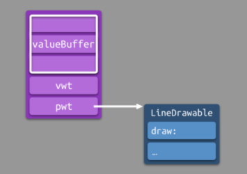

- [**OC知识点(I)**](./../Objective-C/知识点(I).md)
- [**React知识点**](./../../React/React知识点.md)
- [**Flutter知识点**](./../../Flutter/Flutter知识点.md)


<br/>

***
<br/><br/><br/>


> <h2 id=""></h2>
- [**Swift基础**](#Swift基础)
	- [Swift相对于OC的优缺点](#Swift相对于OC的优缺点)
	- [缺省基类](#缺省基类)
	- [Swift和OC区别](#Swift和OC区别)
	- [Swift和OC混编注意事项](#Swift和OC混编注意事项)
	- [面向协议编程](#面向协议编程)
		- [优缺点](#优缺点)
	- [协议中使用泛型](#协议中使用泛型)
	- [静态多态和动态多态区别](#静态多态和动态多态区别)
	- [数据解析中范型和协议有什么区别呢？(爱乐奇)](#数据解析中范型和协议有什么区别呢?)
	- [map和flatMap区别(同程旅行)](#map和flatMap区别)
	- [Set集合与NSArray、Dictionary区别(杭州腾展科技股份有限公司)](#Set集合与NSArray、Dictionary区别)
	- [实例对象数组去重有哪几种方法(杭州腾展科技股份有限公司)](#实例对象数组去重有哪几种方法)
	- [Any、AnyObject、AnyClass的区别](#AnyAnyObjectAnyClass的区别)
	- [逃逸闭包怎么使用，它的关键字@escaping什么时候使用](#逃逸闭包使用)
		- [逃逸闭包](#逃逸闭包)
		- [非逃逸闭包](#非逃逸闭包)
		- [自动闭包](#自动闭包)
	- [什么是写时复制(copy-on-write)(杭州腾展科技股份有限公司)](#什么是写时复制(copy-on-write))
	- [值类型和引用类型](#值类型和引用类型)
		- [区别](#区别)
		- [什么时候使用值类型?什么时候使用引用类型?(杭州灵伴科技)](#什么时候使用值类型什么时候使用引用类型)
		- [什么时候值类型会发生装箱](#什么时候值类型会发生装箱)
	- [关键字](#关键字)
		- [private、filePrivate、public、open权限关键字(杭州腾展科技股份有限公司、北京寰宇科技[加密货币交易说])](#private、filePrivate、public、open权限关键字)
		- [guard使用(北京寰宇科技[加密货币交易说])](#guard使用)
		- [final修饰符](#final修饰符)
		- [dynamic](#dynamic)
		- [@objc/@nonobjc](#@objc/@nonobjc)
		- [@inline](#@inline)
	- [语法基础](#语法基础)
		- [只能被类遵守的protocol](#只能被类遵守的protocol)
		- [defer 使用场景](#defer使用场景)
		- [数组索引越界会Crash,字典取不到为nil](#数组索引越界会Crash,字典取不到为nil)
		- [Self的使用场景](#Self的使用场景)
		- [throws和rethrows的用法与作用](#throws和rethrows的用法与作用)
		- [值类型(Value Type)](#值类型(ValueType))
		- [值类型和引用类型在什么时候使用](#值类型和引用类型在什么时候使用)
		- [Protocol](#Protocol)
		- [协议的动态](#协议的动态)
		- [Swift和OC常量区别](#Swift和OC常量区别)
		- [autoclosure的作用](#autoclosure的作用)
		- [编译选择whole module optmization优化了什么](#编译选择wholemoduleoptmization优化了什么)
		- [mutaing作用](#mutaing的作用)
		- [怎么表示函数的参数类型只要是数字](#怎么表示函数的参数类型只要是数字)
		- [dynamic的作用.](#dynamic的作用)
- [**常用类库**](#常用类库)
	- [ObjectMapper](#ObjectMapper)
	- [SwiftJSON](#SwiftJSON)
	- [RxSwift](#RxSwift)
	- [Snapkit](#Snapkit)
- [**数据存储**](#数据存储)
	- [CoreData](#CoreData) 
- [**组件化**](#组件化)
	- [路由导航](#路由导航)
- [**安全**](#安全)
	- [MD5](#MD5)
	- [防止反编译](#防止反编译)
- [**多线程**](#多线程)
	- [NSOperation](#NSOperation)
	- [GCD控制线程数量](#GCD控制线程数量) 
	- [线程锁](#线程锁)
	- [文件读写锁](#文件读写锁)
- [**底层**](#底层)
	- [Objective-C和Swift底层使用2套不同机制](#Objective-C和Swift底层使用2套不同机制)
	- [Swift动态性](#Swift动态性)
		- [Swift Runtime](#SwiftRuntime)
		- [科普](#科普)
			- 	[分派](#分派)
			- [静态分派和动态分派](#静态分派和动态分派)
			- [静态分派](#静态分派)
			- 	[inline](#inline)
			- [动态派发](#动态派发)
			- 	[虚函数表](#虚函数表)
		- [OC Runtime](#OCRuntime)
	- [Swift派发方式(同程旅行)](#Swift派发方式)
		- [派发效率](#派发效率)
		- [方法可见性影响](#方法可见性影响)
		- [KVO](#KVO)
		- [值类型和引用类型支持什么派发方式](#值类型和引用类型支持什么派发方式)
		- [Swfit中的@Objc和dynamic的原理(Versh面试)](#Swfit中的@Objc和dynamic的原理)
		- [@Objc和Dynamic的使用(Storehub)](#@Objc和Dynamic的使用)
		- [Swift Runtime的关键功能](#SwiftRuntime的关键功能)
			- [动态类型转换](#动态类型转换)
			- [泛型实例化](#泛型实例化)
			- [协议一致性注册](#协议一致性注册)
		- [Swift结构体存放的位置](#Swift结构体存放的位置)
			- [结构体装箱后的内存变化](#结构体装箱后的内存变化)
			- [结构体装箱和案例](#结构体装箱和案例)
				- [结构体装箱到NSValue](#结构体装箱到NSValue)
				- [结构体装箱到Any类型](#结构体装箱到Any类型)
				- [装箱到自定义类型](#装箱到自定义类型)
		- [OC调用Swift类型,找不到方法?](#OC调用Swift类型,找不到方法?)
	- [**存在容器**](#存在容器)
		- [存在容器简介](#存在容器简介)
		- [存在容器在内存的位置](#存在容器在内存的位置)
		- [存在容器由组成(Existential Container)](#存在容器由组成)
			- [Virtual Table和Protocol Witness Table区别](#VirtualTable和ProtocolWitnessTable区别)
		- [Existential Container 5个内存单元](#ExistentialContainer5个内存单元)
			- [Value Buffer](#ValueBuffer)
			- [Value Witness Table](#ValueWitnessTable)
- [**前端**](#前端)
	- [输入URL到加载过程发生了什么](#输入URL到加载过程发生了什么)
	- [302和301的区别](#302和301的区别)
	- [重定向原因](#重定向原因)
	- [什么时候进行301或者302跳转](#什么时候进行301或者302跳转)
- **参考资料**
	- [Swfit开源代码](https://github.com/apple)
	- [道长基础知识](https://www.jianshu.com/p/07c9c6464f83) 
	- [文件分片下载](https://benarvintec.com/2018/10/10/iOS分片下载器)


<br/>

***
<br/><br/><br/>

> <h1 id = "Swift基础">Swift基础</h1>


<br/><br/>


> <h2 id='Swift相对于OC的优缺点'>Swift相对于OC的优缺点</h2>


下面的是笼统的回复:

**1.优点**

<br/>

**1.1更加安全的语言**

- OC（Objective-C）是一种动态语言，它的类型检查和错误检查都是在运行时完成的。这意味着在编译时，编译器无法检查类型错误和其他常见的编程错误。这样就可能导致运行时错误，从而影响应用程序的稳定性和安全性。

- Swift是一种静态类型语言，这意味着编译器可以在编译时检查类型错误和其他常见的编程错误。这样可以减少运行时错误，从而提高应用程序的稳定性和安全性。此外，Swift还提供了一些安全性功能，例如可选类型、空类型和错误处理等，这些功能可以帮助开发人员更好地处理可能出现的错误和异常情况。


<br/>

**1.2更加简洁的语法**

- Objective-C的语法相对较为繁琐，需要使用大量的语法结构和代码来完成一些基本的操作。例如，在Objective-C中，创建一个字符串需要使用NSString类，并使用alloc和init方法来分配和初始化内存，代码比较冗长。

- Swift的语法相对简洁，使用起来更加方便。例如，Swift中可以使用字符串字面量创建一个字符串，无需使用类或初始化方法。Swift还提供了一些简洁的语法结构，例如可选绑定、guard语句和闭包表达式等，可以让代码更加易于编写和阅读。


<br/>

**1.3更加高效的性能**

- Objective-C的性能相对较低，这是由于它是一种动态语言，需要在运行时进行类型检查和消息传递。这些操作会导致额外的开销，并影响应用程序的性能。

- Swift的性能相对较高，这是由于它是一种静态类型语言，可以在编译时优化代码。此外，Swift还提供了一些性能优化功能，例如内联函数和高级优化等，可以进一步提高应用程序的性能。


<br/>

**1.4更加强大的特性**

- Swift具有许多Objective-C所不具备的特性，例如结构体、泛型和函数式编程等。这些特性可以帮助开发人员更好地组织和管理代码，并提高应用程序的可重用性和可维护性。

- Swift还具有许多其他特性，例如闭包、元组、类型推断和扩展等。这些特性可以帮助开发人员更加轻松地编写代码，并提高应用程序的质量和性能。


<br/>
<br/>


**2.缺点**


**2.1编译时间较长**

- Swift是一种静态类型语言，需要进行类型检查和编译优化，因此编译时间相对较长。对于大型项目来说，编译时间可能会很长，这会影响开发人员的效率和生产力。

<br/>

**2.2不支持动态库**

- Swift不支持动态库，这意味着在使用Swift编写的库时，需要将代码静态链接到应用程序中。这可能会导致一些问题，例如增加应用程序的大小和内存使用量，以及降低代码的可重用性和可维护性。


<br/>


**2.3.缺乏跨平台支持**

Swift是由苹果公司开发的编程语言，主要用于开发iOS、macOS和watchOS等应用程序。虽然Swift也可以用于开发服务器端应用程序和其他平台上的应用程序，但是它在跨平台方面的支持相对较弱，这可能会限制它在一些情况下的使用。


<br/>

当然我们可以根据某一点进行回答,比如:

- Swift比如:枚举对比OC枚举

- 函数编程

- 但是OC只能用block,不是函数


<br/><br/>

>## <h2 id = "缺省基类">[缺省基类](https://struggleblog.com/2020/06/22/swift的缺省基类/)</h2>

[Swift源码解析之弱引用](http://www.manongjc.com/article/64837.html)


<br/><br/><br/>


> <h2 id = "Swift和OC区别">Swift和OC区别</h2>

- swift是静态类型语言，OC是动态类型语言
	- 静态概念：类型判断是在运行前做的（如编译阶段） 
	- 静态表现：使用变量前需要声明变量。
	- 动态概念：意思就是类型的检查是在运行时做的；
	- 动态表现：使用变量前不需要声明变量。
- swift是类型安全的语言、注重安全（解释为：是因为它清楚的知道代码在编译阶段处理值的类型**‌**），OC注重灵活；
- swift注重面向协议编程、函数式编程、面向对象编程，OC注重面向对象编程；


<br/><br/>

> <h2 id = "Swift和OC混编注意事项">Swift和OC混编注意事项</h2>

- **导入文件注意事项：**
	- 在OC中创建swift文件，会弹出是否需要创建桥接文件项目名称-Bridging-Header.h，点击创建，在swift中调用OC类，只需要把OC类的头文件import到桥接文件中即可
	
	- 在OC中调用swift文件，需要导入隐式头文件：工程项目名-swift.h，xxx-Swift.h在项目中是看不到的，但是确实是可以import的
	
	- 在Swift代码中将需要暴露给OC调用的属性和方法前加上 @objc修饰符。

<br/>

- **使用第三方Framework相关配置：**
	- 设置： target-->build setting -->Packaging -->Defines Module为 “Yes”；

	- 然后，配置文件Target -> Build Phases  -> Link Binary，添加要导入的Framework；
	
	- 最后，还是要配置桥接文件，比如要使用 abc-lib.framework库中的 abc.h 就要这样配置：#import"abc-lib/abc.h";


<br/>

- **Subclass子类问题**
	- 对于自定义的类而言，Objective-C的类，不能继承自Swift的类，即要混编的OC类不能是Swift类的子类。反过来，需要混编的Swift类可以继承自OC的类。 
	- 提问：为什OC不能继承字Swift的子类？
		- 答：这是因为派发机制不同造成的,在原生声明（非 extension）中定义的普通方法和标记为 @objc 的方法都使用 V-Table 机制派发。用 Swift 编写的类是不能被 Objective-C 继承的，@objc 只是把方法暴露给 Objective-C，并没有改变方法派发的本质。


<br/>

- **宏文件**
	- 如Swift文件要使用OC中定义的宏，只能使用常量简单宏文件。

<br/>

- **Swift独有特性**
	- Swift中有许多OC没有的特性，比如，Swift有元组、为一等公民的函数、还有特有的枚举类型。所以，要使用的混编文件要注意Swift独有属性问题。


<br/>

- **Swift中使用OC的block**

Swift中使用Closure不能使用Block作为属性进行传值，必须是初始化方法或函数。

**Objective-C文件中：**

```
#import typedef void (^Myblock)(NSString *arg);

@interface FirViewController : UIViewController

//@property (copy, nonatomic) Myblock myBlock;

//这种作为公共参数的形式，如果在Swift类中去回调的话，是有问题的。提示没有初始化方法，所以使用下面的以Block为参数的方法

- (void)transValue:(Myblock) block;

@end
```

下面是.m文件

```
#import "FirViewController.h"

@implementation FirViewController

- (void)viewDidLoad{

	[super viewDidLoad];
	
	self.view.backgroundColor = [UIColor whiteColor];

}

- (void)transValue:(Myblock)block {
	
	if (block) {
		block(@"firBack");
	}
}

@end
```


<br/>

在Swift文件回调：

在Swift使用OC的类时，首先在桥接文件(**工程名-Bridging-Header.h**)中声明oc的头文件,这是在创建Swift工程的情况下

```
import UIKit

class ViewController: UIViewController {

override func viewDidLoad() {

	super.viewDidLoad()
	
	self.view.backgroundColor = UIColor.whiteColor()

}

@IBOutlet weak var goFirst: UIButton!

@IBAction func goFirstAction(sender: AnyObject) {

	let firVC:FirViewController = FirViewController()
	
	firVC. transValue { ( arg:String !) -> Void in
	
	self.aBtn?.setTitle(arg, forState: UIControlState.Normal)

}

self.navigationController?.pushViewController(firVC, animated: true)

}

```


<br/>
<br/>

> <h2 id = "面向协议编程">面向协议编程</h2>

- **OOP**：面向对象编程（英文Object Oriented Programming）；
- **POP**：面向协议编程（Protocol Oriented Programming），是Swift的一种编程范式；


<br/>
<br/>


>## <h3 id='优缺点'>[优缺点](https://cloud.tencent.com/developer/article/1828213)</h3>

- OOP缺点:
	- 	在继承、代码复用等方面，其灵活度不高;
	- 	Objective-C 时代的 OOP，其动态特性经常会导致异常；
	- 	无法应用于值类型

<br/>

- POP优点: 
	- 在继承、代码复用等方面，其灵活度高;
	- 可以保证 Swift 作为静态语言的安全性
	- 可以将其优势拓展到结构体（struct）和枚举（enum）类型上

<br/>

所谓**协议**，**就是一组属性和/或方法的定义**，而如果某个具体类型想要遵守一个协议，那它需要实现这个协议所定义的所有这些内容。


<br/>

&emsp; 在Swift的协议中定义属性永远不要用 `let` 关键字。只读属性规定使用 `var` 关键字，并在后面单独跟上 `{ get }`。如果有一个方法改变了一个或多个属性，你需要标记它为 `mutating`。


<br/>


在[面向协议编程与 Cocoa 的邂逅 (上)](https://onevcat.com/2016/11/pop-cocoa-1/)的文章里POP解决了面向对象编程的**OC动态派发安全性、横切关注点、菱形缺陷**问题。

协议扩展：
对于 P，可以在 extension P 中为 myMethod 添加一个实现：


```
protocol P {
    func myMethod()
}

extension P {
    func myMethod() {
        doWork()
    }
}
```


有了这个协议扩展后，我们只需要简单地声明 ViewController 和 AnotherViewController 遵守 P，就可以直接使用 myMethod 的实现了：

```
extension ViewController: P { }
extension AnotherViewController: P { }

viewController.myMethod()
anotherViewController.myMethod()
```
不仅如此，除了已经定义过的方法，我们甚至可以在扩展中添加协议里没有定义过的方法。在这些额外的方法中，我们可以依赖协议定义过的方法进行操作。我们之后会看到更多的例子。总结下来：

- **协议定义**
	- 提供实现的入口
	- 遵循协议的类型需要对其进行实现
- **协议扩展**
	- 为入口提供默认实现
	- 根据入口提供额外实现


这样一来，横切点关注的问题也简单安全地得到了解决。
- ✅ 动态派发安全性
- ✅ 横切关注点
- 菱形缺陷


<br/>

在[**面向协议编程与 Cocoa 的邂逅 (下)**](https://onevcat.com/2016/12/pop-cocoa-2/)中我们把POP运用到实际的项目中去，比如：网络的封装。很赞的，可以把其运用到项目中去，重构项目中的网络层。


<br/>
<br/>

> <h2 id = "协议中使用泛型">协议中使用泛型</h2>

[protocol中使用关联类型associatedtype和泛型的教程和注意事项](https://blog.csdn.net/boildoctor/article/details/113116245)

<br/>

- 协议中使用关联类型代替泛型
	- 协议不允许使用泛型参数,想要协议使用泛型,请使用关联类型代替；
	- 只是把protocol<泛型类型> 改成了在{添加 associatedtype 泛型类型}

```
protocol Stackble {   //定义一个栈的协议
    associatedtype Element// 在协议中用来占位的类型是关联类型,声明一个关联类型Element
    mutating func push(_ element:Element)
    mutating func pop()->Element
    func top() ->Element
    func size() ->Int
}

```

- 带泛型的class中,泛型类型填充关联类型

```
class Stack <E>: Stackble {
   
    var elements = [E]() //用关联类型
     func push(_ element:E){  //这里因为实现push 的时候给element输入了E,所以就相当于给Element 起了别名E
        //等于typealias E = Element
        
        elements.append(element)
    }
     func pop()->E{
        elements.removeLast()
    }
    func top() ->E{
        elements.last!
    }
    func size() ->Int{
        elements.count
    }
}


///代码调用
var s1 = Stack<Int>()
s1.push(1)
s1.push(2)
s1.push(3)
print("s1.top()" ,s1.top())

```

打印结果：`s1.top() 3`


<br/>

- **解决让class遵循带关联类型的协议,并且能当做形参和返回值的方法**

**方法一：让泛型遵循协议,然后让泛型当做形参或返回值,代码如下**

```
protocol Runnable {
    associatedtype Speed
    var speed : Speed {get}
    
} //协议中有关联类型associatedtype,类型不确定

class Person:Runnable{
    var speed: Double = 0.0
}
class Car:Runnable{
    var speed: Double = 0.0
}


func get<T:Runnable>(_ type:Int)->T{ //让泛型类型T遵守协议,然后返回T
    if  0 == type{
        
        //编译错误,系统认为 Person() 创建的结果 强转成T 可能失败,所以要用as!强转,因为可能失败,可能返回nil,所以是可选类型,要用as !
        //let result = Person() as T 
        let result = Person() as! T
        return result
    }
    return Car() as! T
}
```


<br/>

**方法二：不明确类型**

some让协议的关联类型变成透明的, 在协议前面标记上 some 后，返回值的类型对编译器就变成透明的了。

在这个值使用的时候编译器可以根据返回值进行类型推断得到具体类型。如果不加some 编译报错,会认为返回的是个关联类型,是不确定的类型

```
@available(OSX 10.15.0, *)//要求系统超过10.15,编译提示自动添加
func get2(_ type:Int )-> some Runnable{ //some让协议的关联类型变成透明的, 在协议前面标记上 some 后，返回值的类型对编译器就变成透明的了。

	//在这个值使用的时候编译器可以根据返回值进行类型推断得到具体类型。如果不加some 编译报错,会认为返回的是个关联类型,是不确定的类型
	return Car() //some只能返回一种类型
}
```

下面代码是错误的,因为some不能返回2种类型:

```
 func get3(_ type:Int )-> some Runnable{ //编译错误,some限制的类型不能返回2种类型
	 if  0 == type{
	 return Person()
	 }
	 return Car() //some只能返回一种类型
 }
```


<br/>
<br/>


> <h2 id='静态多态和动态多态区别'>静态多态和动态多态区别</h2>

```
func foo<T: Drawable>(local: T) {
    bar(local)
}

func bar<T: Drawable>(local: T) {
    
}

let point = Point()
foo(point)
```

上述代码中，泛型方法的调用过程大概如下：

```
// foo 方法执行时，Swift 将泛型 T 绑定为具体类型。示例中是 Point
foo(point) --> foo<T = Point>(point)
// 调用内部 bar 方法时，Swift 会使用已绑定的变量类型 Point 进一步绑定到 bar 方法的泛型 T 上。
bar(local) --> bar<T = Point>(local)
```

相比协议类型而言，泛型类型在调用时总是能确定类型，因此无需使用 Existential Container。在调用泛型方法时，只需要将 Value Witness Table/Protocol Witness Table 作为额外参数进行传递。

<br/>

注：根据方法调用时数据类型是否确定可以将多态分为：静态多态（Static Polymorphism）和 动态多态（Dynamic Polymorphism）。
- 在泛型类型调用方法时， Swift 会将泛型绑定为具体的类型。因此泛型实现的是静态多态。
- 在协议类型调用方法时，类型是 Existential Container，需要在方法内部进一步根据 pwt 进行方法索引。因此协议实现的是动态多态。


<br/><br/>


> <h2 id='数据解析中范型和协议有什么区别呢?'>数据解析中范型和协议有什么区别呢？</h2>


**泛型类型在调用时总是能确定类型**

这句话解释的本质是: 相比协议类型而言，泛型类型在调用时总是能确定类型，因此无需使用 **Existential Container**。在调用泛型方法时，只需要将 Value Witness Table/Protocol Witness Table 作为额外参数进行传递。

<br/>

- **协议使用场合：**
	- 在函数、方法或者初始化器里作为形参类型或者返回类型
	
	- 作为常量、变量或者属性的类型
	
	- 作为数组、字典或者其他存储器的元素的类型


&emsp; 协议在 Swift 中有两个目的，第一个目的是 用来实现多继承（Swift 语言被设计成单继承），第二个目的是 强制实现者必须遵守协议所指定的泛型约束。很明显，协议并不是用来表示某种类型，而是用来约束某种类型，比如：GenericProtocol 约束了 next() 方法的返回类型，而不是定义 GenericProtocol 的类型。而抽象类型成员则可以用来实现类型约束的。


<br/>

类型形式参数

```
func swapTwoValues<T>(_ a: inout T, _ b: inout T)
```

范型作为函数中参数类型的占位符,调用的时候传入实际类型!


<br/>

拓展下-泛型协议:

```
protocol Drawable { 
    func draw() 
}

struct Point: Drawable {
    var x, y: Double
    func draw() { ... }
}

struct Line: Drawable {
    var x1, y1, x2, y2: Double
    func draw() { ... }
}

let value: Drawable = arc4random()%2 == 0 ? Point(x: 0, y: 0) : Line(x1: 0, y1: 0, x2: 1, y2: 1)
```

&emsp; value 既可以表示 Point 类型，又可以表示 Line 类型。事实上，value 的实际类型是编译器生成的一种特殊数据类型 Existential Container。Existential Container 是编译器生成的一种特殊的数据类型，用于管理遵守了相同协议的协议类型。因为这些数据类型的内存空间尺寸不同，使用 Existential Container 进行管理可以实现存储一致性。

&emsp; Existential Container 对具体类型进行封装，从而实现存储一致性。[关于 Existential Container 的具体内容，可以参考《Swift性能优化(2)——协议与泛型的实现》](http://chuquan.me/2020/02/19/swift-performance-protocol-type-generic-type/)


&emsp; 针对要将[泛型协议](http://chuquan.me/2021/09/25/swift-generic-protocol/)所约束的类型进行擦除，即 类型擦除 （Type Erase），从而骗过编译器，可以将**泛型协议封装成的具体类型**这个思路,也就是建立一个中间层!

这个用法在RxSwift中用到的很多,可以看下!以后可以用到项目中,优化Code,很赞!


<br/><br/>

># <h2 id='map和flatMap区别'>[map和flatMap区别](./基础.md#map和flatMap区别)</h2>


<br/><br/><br/>


> <h2 id='Set集合与NSArray、Dictionary区别'>Set集合与NSArray、Dictionary区别</h2>


[Set集合与NSArray、Dictionary区别](./基础.md#Set集合与NSArray、Dictionary区别)


<br/><br/><br/>

> <h2 id='实例对象数组去重有哪几种方法'>实例对象数组去重有哪几种方法</h2>

 **疑问:** 实例对象数组去重,比如:实例对象元素有一个属性id,通过这个id去重相同元素,有哪几种方法?
 
 
 **1.使用 Set 进行去重：**  如果实例对象的 id 属性遵循 Hashable 协议，您可以先将数组转换为一个 Set，然后再转回数组。由于 Set 自动去除了重复元素，这样就实现了基于 id 去除重复的目的。这种方法简单直接，但需要注意的是，转换过程中会丢失原数组的顺序，且要求 id 能够正确实现 Hashable。
 
 ```
 struct MyObject: Hashable {
    let id: String // 假设id是String类型，且已经遵循了Hashable协议
    // 其他属性...
    
    func hash(into hasher: inout Hasher) {
        hasher.combine(id)
    }
    
    static func ==(lhs: MyObject, rhs: MyObject) -> Bool {
        return lhs.id == rhs.id
    }
}

var objectsArray = [MyObject(id: "1", ...), MyObject(id: "2", ...), MyObject(id: "1", ...)]

// 由于Set会根据MyObject的Hashable实现去重，因此需要确保id是唯一标识符
let uniqueObjectsSet: Set<MyObject> = Set(objectsArray)

// Set会自动去除重复元素，但顺序会被打乱
let uniqueObjectsArray = Array(uniqueObjectsSet)

// 若要保持原数组中首次出现的元素顺序，可以使用一个字典辅助
var uniqueObjectsOrdered: [MyObject] = []
var dictionaryOfObjects: [String: MyObject] = [:]
for obj in objectsArray {
    if dictionaryOfObjects[obj.id] == nil {
        uniqueObjectsOrdered.append(obj)
        dictionaryOfObjects[obj.id] = obj
    }
}
```


上面的代码中，MyObject遵循了Hashable协议，并正确实现了hash(into:)方法和==运算符，确保Set可以根据id进行去重。然后，我们创建了一个Set，其中包含了objectsArray中不重复的MyObject实例。若需要保持原数组中首次出现的元素顺序，可以使用一个字典记录每个id对应的首个对象，并最终将字典的值转换为数组。

然而，如果只是想根据id去重，而不在乎其他属性，那么需要先将id收集到Set中，然后再结合原始数组重构不重复的对象数组，但这通常不是一个理想的解决方案，因为它破坏了原始对象的完整性(这句话的意思说先获取id数组,在根据实例对象数组进行遍历,性能有点低)。在实际场景中，通常还是按照上述方法，确保整个对象都是Hashable的，并根据整个对象去重。


<br/>

**遵循Hashable协议代码解读:**

对于上述代码中MyObject遵循Hashable 协议并实现 hash(into:) 和 == 方法,这意味着在将 objectsArray 中的元素放入 Set 时，Swift 会调用这些方法来判断两个 MyObject 是否代表相同的元素。

如果您已经在 MyObject 中正确实现了 hash(into:) 和 == 方法，使其基于 id 属性进行比较，那么 Set 会根据 id 去除重复的 MyObject 实例。换句话说，uniqueObjectsSet 中的元素将是 id 不重复的 MyObject 实例。

接下来，将 uniqueObjectsSet 转换为数组 uniqueObjectsArray 时，得到的数组包含的是完整的 MyObject 实例，而不只是 id 数组。因此，uniqueObjectsArray 中的元素是去重后的 MyObject 实例，且它们的 id 属性各不相同。

<br/><br/>


**2.使用 Dictionary 进行去重：** 若 id 属性也是唯一标识符，可以利用 Dictionary 的键值对特性来达到去重目的。将 id 作为键，实例对象作为值，由于字典不允许键重复，所以最终字典中只会保留每个唯一 id 对应的一个对象。之后可将字典的值数组取出，得到去重后的结果。

```
var uniqueObjects = Dictionary(grouping: objectsArray, by: { $0.id }).values.map { $0.first! }
```
此处使用 grouping(_:by:) 方法将数组按 id 分组，得到一个字典，然后取字典的值（即每个 id 对应的对象组），最后使用 map 取每个组的第一个对象，得到去重后的数组。


<br/><br/>

**3.使用数组进行遍历移除**

这个就不多说了,基本都会!也就是直接遍历了!


<br/><br/>


**4.使用 reduce 或 filter 结合 indexOf(where:)：** 如果要保持原数组顺序且不使用额外数据结构，可以结合 reduce 或 filter 与 indexOf(where:) 方法来实现。这里以 reduce 为例：

```
var uniqueObjects = objectsArray.reduce(into: []) { (result, object) in
    if !result.contains(where: { $0.id == object.id }) {
        result.append(object)
    }
}
```

此处使用 reduce 初始化一个新的空数组 result，在遍历过程中检查当前元素是否已存在于 result 中，如果不存在，则将其添加到 result 中。最后得到的 result 就是去重后的数组。


 
 
 
 


<br/><br/>


> <h2 id="AnyAnyObjectAnyClass的区别">Any、AnyObject、AnyClass的区别</h2>

- Any: 可以表示任意类型，甚至方法类型（func）
- AnyObject: 表示任何class类型的实例对象（类似OC中的id类型）
- AnyClass：表示任意类的元类型.任意类的类型都隐式遵守这个协议.  AnyObject.Type中的.Type就是获取元类型, 辟如你有一个Student类, Student.Type就是获取Student的元类型.

```
// AnyObject的定义：
protocol AnyObject {

}
```

&emsp; 特别之处在于，所有的 class 都隐式地实现了这个接口，这也是 AnyObject 只适用于 class 类型的原因。而在 Swift 中所有的基本类型，包括 Array 和 Dictionary 这些传统意义上会是 class 的东西，统统都是 struct 类型，并不能由 AnyObject 来表示，于是 Apple 提出了一个更为特殊的 Any，除了 class 以外，它还可以表示包括 struct 和 enum 在内的所有类型。
为了深入理解，举个很有意思的例子。为了实验 Any 和 AnyObject 的特性，在 Playground 里写如下代码：

```
import UIKit

let swiftInt: Int = 1
let swiftString: String = "miao"

var array: [AnyObject] = []
array.append(swiftInt)
array.append(swiftString)
```

&emsp; 我们在这里声明了一个 Int 和一个 String，按理说它们都应该只能被 Any 代表，而不能被 AnyObject 代表的。但是你会发现这段代码是可以编译运行通过的。那是不是说其实 Apple 的编程指南出错了呢？不是这样的，你可以打印一下 array，就会发现里面的元素其实已经变成了 NSNumber 和 NSString 了，这里发生了一个自动的转换。因为我们 import 了 UIKit (其实这里我们需要的只是 Foundation，而在导入 UIKit 的时候也会同时将 Foundation 导入)，在 Swift 和 Cocoa 中的这几个对应的类型是可以进行自动转换的。因为我们显式地声明了需要 AnyObject，编译器认为我们需要的的是 Cocoa 类型而非原生类型，而帮我们进行了自动的转换。

&emsp; 在上面的代码中如果我们把 import UIKit 去掉的话，就会得到无法适配 AnyObject 的编译错误了。我们需要做的是将声明 array 时的 [AnyObject] 换成 [Any]，就一切正确了。

```
let swiftInt: Int = 1
let swiftString: String = "miao"

var array: [Any] = []
array.append(swiftInt)
array.append(swiftString)
array

```

&emsp; 顺便值得一提的是，只使用 Swift 类型而不转为 Cocoa 类型，对性能的提升是有所帮助的，所以我们应该尽可能地使用原生的类型。


<br/><br/>

> <h2 id="逃逸闭包使用">逃逸闭包怎么使用，它的关键字@escaping什么时候使用</h2>

<br/>

> <h3 id='逃逸闭包'>逃逸闭包</h3>


&emsp; **逃逸闭包概念：** 一个接受闭包作为参数的函数，该闭包可能在函数返回后才被调用，也就是说这个闭包逃离了函数的作用域，这种闭包称为逃逸闭包。当你声明一个接受闭包作为形式参数的函数时，你可以在形式参数前写@escaping来明确闭包是允许逃逸。

&emsp; 例如：当网络请求结束后调用的闭包。发起请求后过了一段时间后这个闭包才执行，并不一定是在函数作用域内执行的。


```
class ViewController: UIViewController {
   
    override func viewDidLoad() {
        super.viewDidLoad()
        getData { (data) in
            print("闭包结果返回--\(data)--\(Thread.current)")
        }
    }

    func getData(closure:@escaping (Any) -> Void) {
        print("函数开始执行--\(Thread.current)")
        DispatchQueue.global().async {
            DispatchQueue.main.asyncAfter(deadline: DispatchTime.now()+2, execute: {
                print("执行了闭包---\(Thread.current)")
                closure("345")
            })
        }
        print("函数执行结束---\(Thread.current)")
    }
}


```

打印结果：

```

函数开始执行--<NSThread: 0x600000072f40>{number = 1, name = main}
函数执行结束---<NSThread: 0x600000072f40>{number = 1, name = main}
执行了闭包---<NSThread: 0x600000072f40>{number = 1, name = main}
闭包结果返回--345--<NSThread: 0x600000072f40>{number = 1, name = main}

```

从结果可以看出，逃逸闭包的生命周期是长于函数的。

- 逃逸闭包的生命周期：

	- 闭包作为参数传递给函数；
	
	- 退出函数；
	
	- 闭包被调用，闭包生命周期结束。

即逃逸闭包的生命周期长于函数，函数退出的时候，逃逸闭包的引用仍被其他对象持有，不会在函数结束时释放。


<br/><br/><br/>


> <h3 id='非逃逸闭包'>非逃逸闭包</h3>

&emsp; **非逃逸闭包概念：** 一个接受闭包作为参数的函数， 闭包是在这个函数结束前内被调用。
例如：

```
class ViewController: UIViewController {
    
    override func viewDidLoad() {
        super.viewDidLoad()
        handleData { (data) in
            print("闭包结果返回--\(data)--\(Thread.current)")
        }
    }

    func handleData(closure:(Any) -> Void) {
        print("函数开始执行--\(Thread.current)")
        print("执行了闭包---\(Thread.current)")
        closure("4456")
        print("函数执行结束---\(Thread.current)")
    }
}
```

复制代码以上代码最后的执行结果为：

```
函数开始执行--<NSThread: 0x6000000fe8c0>{number = 1, name = main}
执行了闭包---<NSThread: 0x6000000fe8c0>{number = 1, name = main}
闭包结果返回--4456--<NSThread: 0x6000000fe8c0>{number = 1, name = main}
函数执行结束---<NSThread: 0x6000000fe8c0>{number = 1, name = main}
```

&emsp; 从结果可以看出，非逃逸闭包被限制在函数内。

非逃逸闭包的生命周期：
1、闭包作为参数传给函数；
2、函数中运行改闭包；
3、退出函数。

**为什么要分逃逸闭包和非逃逸闭包?**

&emsp; 为了管理内存，闭包会强引用它捕获的所有对象，比如你在闭包中访问了当前控制器的属性、函数，编译器会要求你在闭包中显示 self 的引用，这样闭包会持有当前对象，容易导致循环引用。

而对于非逃逸闭包：

&emsp; 非逃逸闭包不会产生循环引用，它会在函数作用域内释放，编译器可以保证在函数结束时闭包会释放它捕获的所有对象。

&emsp; 使用非逃逸闭包可以使编译器应用更多强有力的性能优化，例如，当明确了一个闭包的生命周期的话，就可以省去一些保留（retain）和释放（release）的调用。

&emsp; 非逃逸闭包它的上下文的内存可以保存在栈上而不是堆上。


<br/><br/><br/>


> <h3 id='自动闭包'>自动闭包</h3>

&emsp; 是一种用来把实际参数传递给函数表达式打包的闭包，不接受任何实际参数，当其调用是返回内部表达式的值。

好处：用普通表达式代替闭包的写法，语法糖的一种

```
func loginfo(_ condition: Bool , _ message: String){

    if condition {
     print("lg_debug:\(message)")
    }

}


func test()->String{
    //耗时操作
    return  "Application Error Occured"
}

loginfo(true, test())
loginfo(true, "HelloWord")

```


<br/>

自动闭包, 会自动将某一个表达式封装为闭包

```
func autoClosureFunction(_ closure: @autoclosure () -> Int) {
   closure()
}
autoClosureFunction(1)

```


<br/><br/><br/>

> <h2 id="什么是写时复制(copy-on-write)">什么是写时复制(copy-on-write)</h2>

&emsp; **有两种传值方式：** 引用类型(Class)和值类型(Struct/Enum)。而值类型有一个copy的操作，它的意思是当你传递一个值类型的变量的时候(给一个变量赋值，或者函数中的参数传值)，它会拷贝一份新的值让你进行传递。你会得到拥有相同内容的两个变量，分别指向两块内存。

&emsp; **问题：** 这样的话，在你频繁操作占用内存比较大的变量的时候就会带来严重的性能问题，Swift 也意识到了这个问题，所以推出了 Copy-on-Write 机制，用来提升性能。


**什么是 Copy-on-Write？**

&emsp; 当你有一个占用内存很大的一个值类型，并且不得不将它赋值给另一个变量或者当做函数的参数传递的时候，拷贝它的值是一个非常消耗内存的操作，因为你不得不拷贝它所有的东西放置在另一块内存中。

&emsp; 为了优化这个问题，Swift 对于一些特定的值类型(集合类型：Array、Dictionary、Set)做了一些优化，在`对于 Array 进行拷贝的时候，当传递的值进行改变的时候才会发生真正的拷贝`。而对于`String、Int 等值类型，在赋值的时候就会发生拷贝`。下面来看代码验证一下：

**先看一下基本类型(Int、String等)**

```

var num1 = 10
var num2 = num1
print(address(of: &num1)) //0x7ffee0c29828
print(address(of: &num2)) //0x7ffee0c29820

var str1 = "abc"          
var str2 = str1
print(address(of: &str1)) //0x7ffee0c29810
print(address(of: &str2)) //0x7ffee0c29800

//打印内存地址
func address(of object: UnsafeRawPointer) -> String {
    let addr = Int(bitPattern: object)
    return String(format: "%p", addr)
}


```
**`从上面的打印我们可以看出基本类型在进行赋值的时候就发生了拷贝操作。`**


<br/>

**在看一下集合类型：**

```
var arr1 = [1,2,3,4,5]
var arr2 = arr1
print(address(of: &arr1)) //0x6000023b06b0
print(address(of: &arr2)) //0x6000023b06b0

arr2[2] = 4
print(address(of: &arr1)) //0x6000023b06b0
print(address(of: &arr2)) //0x6000023b11f0


```

**`从上面代码我们可以看出，当arr1赋值给arr2时并没有发生拷贝操作，当arr2的值改变的时候才发生了拷贝操作`**


<br/>

**原理：**
&emsp; 使用class，这是一个引用类型，因为当我们将引用类型分配给另一个时，两个变量将共享同一个实例，而不是像值类型一样复制它。


在[OptimizationTips.rst](https://github.com/apple/swift/blob/main/docs/OptimizationTips.rst)里发现如下代码:

```
final class Ref<T> {
  var val: T
  init(_ v: T) { val = v }
}

struct Box<T> {
  var ref: Ref<T>
  init(_ x: T) { ref = Ref(x) }

  var value: T {
    get { return ref.val }
    set {
	  //有多个 reference，如果是多个 reference 则进行拷贝
      if !isKnownUniquelyReferenced(&ref) {
        ref = Ref(newValue)
        return
      }
      ref.val = newValue
    }
  }
}
```


由于struct是一个值类型，当我们将它分配给另一个变量时，它的值被复制，而属性ref的实例仍由两个副本共享，因为它是一个引用类型。

然后，我们第一次更改两个Box变量的值时，我们创建了一个新的ref实例，这要归功于

```
if !isKnownUniquelyReferenced(&ref) {
    ref = Ref(newValue)
    return
}
```

两个Box变量不再共享相同的ref实例。

>为了提供高效的写时复制特性，我们需要知道一个对象是否是唯一的。如果它是唯一引用，那么我们就可以直接原地修改对象。否则，我们需要在修改前创 建对象的复制。在 Swift 中，我们可以使用 isKnownUniquelyReferenced 函数来检查某个引 用只有一个持有者。如果你将一个 Swift 类的实例传递给这个函数，并且没有其他变量强引用 这个对象的话，函数将返回 true。如果还有其他的强引用，则返回 false。不过，对于 Objective-C 的类，它会直接返回 false。


<br/>


- **总结：**
	- Copy-on-Write 是一种用来优化占用内存大的值类型的拷贝操作的机制。
	- 对于 Int、String 等基本类型的值类型，它们在赋值的时候就会发生拷贝，它们没有 Copy-on-Write 这一特性（因为Copy-on-Write带来的开销往往比直接复制的开销要大）。
	- 对于 Array、Dictionary、Se t类型，当它们赋值的时候不会发生拷贝，只有在修改的之后才会发生拷贝，即 Copy-on-Write。
	- 对于自定义的结构体，不支持 Copy-on-Write。


提问：为什么自定义struct不支持 Copy-on-Write？

但是我们可以这样做：

```
struct Person {
    var name = ""
}

var p1 = Person(name: "aaa")
print(address(of: &p1)) // 0x104d6a300
var p2 = p1
print(address(of: &p2)) // 0x104d6a310
p2.name = "bbb"
print(address(of: &p2)) // 0x104d6a310
```


<br/>

***
<br/><br/>

>## <h1 id="值类型和引用类型">[值类型和引用类型](https://juejin.cn/post/6844904000794394637)</h1>

[值类型和引用类型](https://www.cnblogs.com/luoxiaofu/p/8528383.html)


<br/>

> <h2 id='区别'>区别</h2>

- **存储区别：**
	- 值类型存储在栈区。 每个值类型变量都有其自己的数据副本，并且对一个变量的操作不会影响另一个变量。
	
	- 引用类型存储在其他位置（堆区），我们在内存中有一个指向该位置的引用。 引用类型的变量可以指向相同类型的数据。 因此，对一个变量进行的操作会影响另一变量所指向的数据。

<br/>

&emsp; Swift有三种声明类型的方式：**class，struct和enum**。 它们可以分为值类型 **（struct和enum）和引用类型（class）**。 

**一般Swift值类型在栈上分配。 引用类型在堆上分配。**

- **比如:** 
	- 结构体和类的区别: 定义结构体类型时其成员可以没有初始值。如果使用这种格式定义一个类，编译器是会报错的，他会提醒你这个类没有被初始化。


<br/><br/>

>## <h3 id='什么时候使用值类型什么时候使用引用类型'>[什么时候使用值类型?什么时候使用引用类型?](https://juejin.cn/post/6844904000794394637)</h3>
&emsp; 关于在新建一个类型时如何选择到底是使用值类型还是引用类型的问题其实在理解了两者之间的区别后是非常简单的，在这苹果官方已经做出了非常明确的指示（以下内容引自苹果官方文档）：

当你使用Cocoa框架的时候，很多API都要通过NSObject的子类使用，所以这>时候必须要用到引用类型class。在其他情况下，有下面几个准则：

- 什么时候该用值类型：
	- 要用==运算符来比较实例的数据时

	- 你希望那个实例的拷贝能保持独立的状态时

	- 数据会被多个线程使用时

- 什么时候该用引用类型（class）：
	- 要用==运算符来比较实例身份的时候
	
	- 你希望有创建一个共享的、可变对象的时候

<br/><br/>


> <h3 id='什么时候值类型会发生装箱'>什么时候值类型会发生装箱</h3>

**Swift编译器可以将值类型装箱后放到堆上**

- 1.当值类型遵循了某个协议;
	- 当值类型遵循了某个协议，且存[储在existential（存在性）容器](https://blog.csdn.net/preyer2011/article/details/129052530)中超过3个机器字长时(将放在堆上)，除分配成本外，还会产生额外的开销。
	- Existential(存在性)容器是用于存储运行时未知类型的值的一种通用容器。 
		- 较小的值类型可以内嵌在存在性(existential)容器中。 
		- 较大的分配在堆上， 它们的引用存储在存在性(existential)容器缓冲区内。 此类值的生存期由值见证表(Value Witness Table)管理。 当调用协议方法时会产生引用计数和几个间接级别的开销。

<br/>

- 2.值类型和引用类型混合时
	- 结构体中包含类，类中包含结构的情况


<br/>

- 3.带有泛型的值类型。

让我们声明一个带泛型的结构体：

```
struct Bas<T> {
    var x: T

    init(xx: T) {
        x = xx
    }
}
```


<br/>

- 4. 逃避闭包捕获时
	- Swift的闭包对所有局部变量都是通过引用来捕获的


<br/>

- 5. Inout参数

让我们为foo(x :)生成一个接受inout参数的SIL：

```
func foo(x: inout Int) {
    x += 1
}
```


<br/><br/><br/><br/>


> <h2 id="关键字">关键字</h2>

<br/>

> <h2 id='private、filePrivate、public、open权限关键字'>private、filePrivate、public、open权限关键字</h2>


[private、filePrivate、public、open](./关键字.md#访问权限关键字使用)


<br/><br/><br/>

> <h2 id='guard使用'>guard使用</h2>

[guard关键字使用](./关键字.md#guard)


<br/><br/><br/>

> <h3 id="final修饰符">final修饰符</h3>

- **使用final规则：**
	- final修饰符只能修饰类，表明该类不能被其他类继承，也就是它没资格当父类；
	
	- final不能修饰结构体和枚举；
	
	- final修饰符也可以修饰类中的属性、方法和下标，但前提是该类并没有被final修饰过；
	
	- 结构体和枚举只能遵循协议（protocol）。虽然协议也可以遵循其他协议，但是它并不能重写遵循的协议的任何成员，这就是结构体和枚举不需要final修饰的原因。

	- 使用了 final 的，都用静态派发，因为 final 意味着完全没有动态性。final 用于类型，或是 function，都会造成这样的情况。
		
	- 而且 final 作用范围的方法，都不会被 export 到 OC runtime，也不会生成 selector


<br/><br/>

> <h3 id='dynamic'>dynamic</h3>


- Swift中也有dynamic关键字，它可以用于修饰变量或函数，它的意思也与OC完全不同。它告诉编译器使用动态分发而不是静态分发。OC区别于其他语言的一个特点在于它的动态性，任何方法调用实际上都是消息分发，而Swift则尽可能做到静态分发。

- 因此，标记为dynamic的变量/函数会隐式的加上@objc关键字，会开启 message 模式，让 OC runtime 可以调用;

- 虽然静态分发在效率上可能更好，不过一些app分析统计的库需要依赖动态分发的特性，动态的添加一些统计代码，这一点在Swift的静态分发机制下很难完成。这种情况下，虽然使用dynamic关键字会牺牲因为使用静态分发而获得的一些性能优化，但也依然是值得的。

- 使用动态分发，您可以更好的与OC中runtime的一些特性（如CoreData，KVC/KVO）进行交互，不过如果您不能确定变量或函数会被动态的修改、添加或使用了Method-Swizzle，那么就不应该使用dynamic关键字，否则有可能程序崩溃。

- 必须 @import Foundation，必须有 @objc，如果是 class，还必须是 NSObject 的子类

- 延展阅读： dynamic vs @objc: dynamic 是强制使用 message 派发，KVO 需要。@objc 只是 export 给 objc，swift 还是静态派发


<br/>
<br/>

> <h3 id='@objc/@nonobjc'>@objc/@nonobjc</h2>

- @objc / @nonobjc 控制方法对于 objc 的可见性。但是不会改变 swift 中的函数如何被派发。

- @nonobjc 可以禁止函数使用 message 派发 （和 final 在汇编上看起来类似，偏向于使用 final)

- // 并不会这样，@nonobjc 依然是使用 Table 调用，但是 @nonobjc 之后无法使用 dynamic，会提示 error: a declaration cannot be both '@nonobjc' and 'dynamic'

- @objc 的原理是生成两个函数引用，一个给 swift 调用，一个给 objc 调用

- @objc final func aFunc() {} 会让消息使用直接派发，不过依然会 export 给 objc


<br/>
<br/>


> <h3 id='@inline'>@inline</h3>

	
- @inline 可以告诉编译器去优化直接派发的性能。

- [see](https://github.com/vandadnp/swift-weekly/blob/master/issue11/README.md#inline)

- @inline 可以给生成的函数加上标记，后期编译器进行指定的优化

- inline 可以选择的参数有两个 never 和 __always

- 对于 inline 的使用建议：
	- 默认行为是编译器自己决定要不要使用 inline 进行优化，你也应该保持默认行为。
	
	- 如果你的函数特别长，你不想让你的打包体积变得特别大，可以使用 @inline(never)
	
	- 2，如果你的函数很小，你希望他可以快一点，就可以使用 @inline(__always)，不过其实编译器也会帮你做这样的事情，所以你这么做也基本上不会让他变得更快
	
	- 有趣的是，如果你用 dynamic @inline(__always) func dynamicOrDirect() {} 依然会得到一个 message 派发的函数。


<br/>
<br/>


> <h2 id="语法基础">语法基础</h2>


<br/>

> <h3 id="只能被类遵守的protocol">只能被类遵守的protocol</h3>

```
protocol OnlyClassProtocol : class {
}
```


<br/>
<br/>


> <h3 id="defer使用场景">defer使用场景</h3>

&emsp; **defer** **语句块中的代码**, **会在当前作用域结束前调用**, 常用场景如异常退出后, 关闭数据库连接.≥..

```
func someQuery() -> ([Result], [Result]){
    let db = DBOpen("xxx")
    defer {
        db.close()
    }
    guard results1 = db.query("query1") else {
        return nil
    }
    guard results2 = db.query("query2") else {
        return nil
    }
    return (results1, results2)
}

```


<br/>

需要注意的是, 如果有多个 defer, 那么**后加入的先执行**

```

func someDeferFunction() {
    defer {
        print("\(#function)-end-1-1")
        print("\(#function)-end-1-2")
    }
    defer {
        print("\(#function)-end-2-1")
        print("\(#function)-end-2-2")
    }
    if true {
        defer {
            print("if defer")
        }
        print("if end")
    }
    print("function end")
}


//调用
someDeferFunction()
```

<br/>

**输出**

```
if end
if defer
function end
someDeferFunction()-end-2-1
someDeferFunction()-end-2-2
someDeferFunction()-end-1-1
someDeferFunction()-end-1-2
```


<br/>
<br/>


> <h3 id="数组索引越界会Crash,字典取不到为nil">数组索引越界会Crash,字典取不到为nil</h3>

- 数组索引本来就是访问一段连续地址,越界访问也能访问到内存，但这段内存不一定可用，所以会引起Crash.
- 字典的key并没有对应确定的内存地址,所以是安全的.


<br/>
<br/>


> <h3 id="Self的使用场景">Self的使用场景</h3>

Self 通常在协议中使用, 用来表示实现者或者实现者的子类类型.

定义一个复制的协议:

```
protocol CopyProtocol {
    func copy() -> Self
}
```


如果是结构体去实现, 要将Self 换为具体的类型:

```
struct SomeStruct: CopyProtocol {
    let value: Int
    func copySelf() -> SomeStruct {
        return SomeStruct(value: self.value)
    }
}
```

如果是类去实现, 则有点复杂, 需要有一个 required 初始化方法, 具体可以看这里:


```
class SomeCopyableClass: CopyProtocol {
    func copySelf() -> Self {
        return type(of: self).init()
    }
    required init(){}
}
```


<br/>
<br/>

> <h3 id="throws和rethrows的用法与作用">throws和rethrows的用法与作用</h3>

throws 用在函数上, 表示这个函数会抛出错误.

有两种情况会抛出错误, 一种是直接使用 throw 抛出, 另一种是调用其他抛出异常的函数时, 直接使用 try xx 没有处理异常.

```
enum DivideError: Error {
    case EqualZeroError;
}
func divide(_ a: Double, _ b: Double) throws -> Double {
    guard b != Double(0) else {
        throw DivideError.EqualZeroError
    }
    return a / b
}
func split(pieces: Int) throws -> Double {
    return try divide(1, Double(pieces))
}
```


rethrows 与 throws 类似, 不过只适用于参数中有函数, 且函数会抛出异常的情况, rethrows 可以用 throws 替换, 反过来不行

```
func processNumber(a: Double, b: Double, function: (Double, Double) throws -> Double) rethrows -> Double {
    return try function(a, b)
}
```


<br/>
<br/>


> <h3 id='值类型(ValueType)'>值类型(ValueType)</h3>

- struct, enum 这样的值类型不支持继承，所以无需动态派发，它所有的方法调用（包括遵守的协议方法），都是直接调用。

- 虽然不支持继承，但值类型还是可以通过 extension 和 Protocol 可以实现扩展。


<br/>
<br/>


> <h3 id="值类型和引用类型在什么时候使用">值类型和引用类型在什么时候使用</h3>

- **什么时候该用值类型：**
	- 要用==运算符来比较实例的数据时.
	- 你希望那个实例的拷贝能保持独立的状态时.
	- 数据会被多个线程使用时.

<br/>

- **什么时候该用引用类型（class）：**
	- 	要用==运算符来比较实例身份的时候.
	- 	你希望有创建一个共享的、可变对象的时候.


```
let test1 = Test1()
let test2 = Test1()
//test1地址：SwiftTest.Test1	0x0000600003a1c300
//test2地址：SwiftTest.Test1	0x0000600003a1c320
if test1 === test2 {
    print("test1 == test2 ")
}else {
    print("test1 != test2 ")
    
}

let a1 = "123"
let a2 = "123"


if a1 == a2 {
    print("a1 == a2 ")
}else {
    print("a1 != a2 ")
    
}
```

打印：

```
test1 != test2 
a1 == a2 
```


<br/><br/>

> <h3 id='Protocol'>Protocol</h3>

Protocol 是一个比较特殊的情况，不同于 Objective-C，Swift 在对待 Protocol 方法调用时更重视实例的类型，而不是实例的内在（比如 Objc 中的 isa）


<br/>
<br/>
<br/>


> <h3 id="">协议的动态</h3>

```
protocol Pizzeria { 
  func makePizza(_ ingredients: [String])
  func makeMargherita()
} 

extension Pizzeria { 
  func makeMargherita() { 
    return makePizza(["tomato", "mozzarella"]) 
  }
}

struct Lombardis: Pizzeria { 
  func makePizza(_ ingredients: [String]) { 
    print(ingredients)
  } 

  func makeMargherita() {
    return makePizza(["tomato", "basil", "mozzarella"]) 
  }
}

let lombardis1: Pizzeria  = Lombardis()
let lombardis2: Lombardis = Lombardis() 
lombardis1.makeMargherita()
lombardis2.makeMargherita()


//打印
["tomato", "basil", "mozzarella"]
["tomato", "basil", "mozzarella"]
```

分析: 在Lombardis的代码中，重写了makeMargherita的代码，所以永远调用的是Lombardis 中的 makeMargherita.

再进一步，我们把 protocol Pizzeria 中的 func makeMargherita() 删掉，代码变为:

```
protocol Pizzeria {
  func makePizza(_ ingredients: [String])
}

extension Pizzeria  {
  func makeMargherita()  {
    return makePizza(["tomato", "mozzarella"])
  }
}

struct Lombardis: Pizzeria  {
  func makePizza(_ ingredients: [String])  {
    print(ingredients)
  }
  func makeMargherita() {
    return makePizza(["tomato", "basil", "mozzarella"])
  }
}
let lombardis1: Pizzeria = Lombardis()
let lombardis2: Lombardis = Lombardis()
lombardis1.makeMargherita()
lombardis2.makeMargherita()

* 打印结果:
["tomato", "mozzarella"]
["tomato", "basil", "mozzarella"]
```

因为lombardis1 是 Pizzeria，而 makeMargherita() 有默认实现，这时候我们调用默认实现。


<br/>
<br/>


> <h3 id="Swift和OC常量区别">Swift和OC常量区别</h3>

OC中定义的常量:

```
const int number = 0;
```


Swift 是这样定义常量的：
```
let number: Int = 0
```


- **区别:**
	- OC中用 const 来表示常量，而 Swift 中用 let 来判断是不是常量.
	
	- OC中 const 表明的常量类型和数值是在 compilation time 时确定的；
	
	- Swift 中 let 只是表明常量（只能赋值一次），其类型和值既可以是静态的，也可以是一个动态的计算方法，它们在 runtime 时确定的。


<br/>
<br/>


> <h3 id="编译选择wholemoduleoptmization优化了什么">编译选择 whole module optmization 优化了什么</h3>

编译器可以跨文件优化编译代码, 不局限于一个文件;
[这里](https://www.jianshu.com/p/8dbf2bb05a1c)


<br/>
<br/>


> <h3 id="mutaing的作用">[mutaing的作用](./关键字.md#Mutating)</h3>

- **作用1：**

```
struct Person  {
   var name: String  {
       mutating get  {
        return store
        }
     }
} 
```
让不可变对象无法访问name 属性;


<br/>
<br/>


> <h3 id="怎么表示函数的参数类型只要是数字">函数的参数类型只要是数字（Int、Float）都可以，要怎么表示</h3>

使用泛型

```
func isNumber<T : SignedNumber>(number : T){
print(" it is a number")
}
```


<br/>
<br/>


> <h3 id="dynamic的作用">dynamic的作用.</h3>

- **dynamic的作用.**

	- 由于swift是一门静态语言，所以没有Objective-C中的消息发送这些动态机制，dynamic的作用就是让swift代码也能有oc中的动态机制，常用的就是KVO。
	
	- 使用dynamic关键字标记属性，使属性启用Objc的动态转发功能；
	
	- dynamic只用于类，不能用于结构体和枚举，因为它们没有继承机制，而Objc的动态转发就是根据继承关系来实现转发。


<br/>
<br/>


> <h3 id=""></h3>


<br/>

***
<br/>


> <h1 id="常用类库">常用类库</h1>
<br/>

> <h2 id="ObjectMapper">ObjectMapper</h2>

使用ObjectMapper的时候，我们一定要实现Mappable协议。这个协议里又有两个要实现的方法：

```
init?(map: Map)
mutating func mapping(map: Map)
```

流程解析如下：

```
//其对应的JSON如下：
let json = """
{
"mathematics": "excellent",
"physics": "bad",
"chemistry": "fine"
}


//使用的时候，只用如下:
struct Ability: Mappable {
	var mathematics: String?
	var physics: String?
	var chemistry: String?

	init?(map: Map) {

	}

	mutating func mapping(map: Map) {
		mathematics <- map["mathematics"]
		physics <- map["physics"]
		chemistry <- map["chemistry"]
	}
}


//然后将这段json解析为Ability的Model, 即:
let ability = Mapper<Ability>().map(JSONString: json)
```

那么 **'<-'** 这么奇怪的符号，它又是啥意思呢？

<br/>

去看源码，发现这个符号是这个库自定义的一个操作符，在Operators.swift里如下：

```
infix operator <-

/// Object of Basic type
public func <- <T>(left: inout T, right: Map) {
	switch right.mappingType {
	// 当 mappingType 的值为 .fromJSON 并且键存在时执行以下代码块。
	case .fromJSON where right.isKeyPresent:
		// 调用 FromJSON.basicType 方法，将 JSON 数据转换为基本类型，并将结果赋值给目标对象 left
		FromJSON.basicType(&left, object: right.value())
	case .toJSON:
		//表示将目标对象中的数据序列化为 JSON 格式，并将结果存储在 right 中
		left >>> right
	default: ()
	}
}

```

然后根据不同的泛型类型，这个操作符会进行不同的处理。

接着，我们再看一下map方法。

map方法存在于Mapper类中, 定义如下:

```

 func map(JSONString: String) -> M? {
	if let JSON = Mapper.parseJSONString(JSONString: JSONString) as? [String: Any] {
  		return map(JSON: JSON)
	}
	return nil
}

func map(JSON: [String: Any]) -> M? {
	let map = Map(JSON: JSON)
	if let klass = M.self as? Mappable.Type {// 使用 Swift 的反射机制，检查类型 M 是否符合 Mappable 协议，即该类型是否可以进行映射操作。
	
		//如果类型 M 符合 Mappable 协议，那么通过调用 klass.init(map: map) 创建了一个对象，并尝试将其转换为类型 M。
		//如果对象创建成功，则执行以下代码块
	  	if var obj = klass.init(map: map) as? M {
		  	//将 map 对象中的数据映射到该对象上
	    	obj.mapping(map: map)
	    	return obj
	  		}
	}
	return nil
}

```

可以看到，在map的方法中，我们最后会调用Mappable协议中定义的mapping方法，来对json数据做出转化。

<br/>

最后再看一下Map这个类，这个类主要用来处理找到key所对应的value。处理方式如下:

```
//ArraySlice<String> 是 Swift 中的一种特殊类型，它表示了一个数组的切片（Slice），即原数组的一个连续的子序列
// 数组切片是一个轻量级的数据结构，它们只是对原始数组的引用，并没有实际拥有数组中的元素。切片允许你在不复制数组元素的情况下对数组进行切割、操作和传递，从而提高了性能和内存效率。
private func valueFor(_ keyPathComponents: ArraySlice<String>, dict: [String: Any]) -> (Bool, Any?) {
	guard !keyPathComponents.isEmpty else { return (false, nil) }

	if let keyPath = keyPathComponents.first {
  		let obj = dict[keyPath]
  		if obj is NSNull {
    		return (true, nil)
  		} else if keyPathComponents.count > 1, let d = obj as? [String: Any] {
    		let tail = keyPathComponents.dropFirst()
    		return valueFor(tail, dict: d)
  		} else if keyPathComponents.count > 1, let arr = obj as? [Any] {
    		let tail = keyPathComponents.dropFirst()
    		return valueFor(tail, array: arr)
  		} else {
    		return (obj != nil, obj)
  		}
	}

	return (false, nil)
}
```


其中在处理分隔符上，采用的是递归调用的方式，不过就我们目前项目中，还没有用到过。

上述这几个步骤，就是ObjectMapper的核心方法。我也根据这些步骤，自己实现了一个解析的库。

但是这个只能解析一些最简单的类型，其他的像enum之类的，还需要做一些自定义的转化。主要的数据转化都在Operators文件夹中。


<br/><br/>


> <h2 id="SwiftJSON">SwiftJSON</h2>


构造器

SwiftyJSON对外暴露的主要的构造器:


```
public init(data: Data, options opt: JSONSerialization.ReadingOptions = []) throws
public init(_ object: Any)
public init(parseJSON jsonString: String)
```


<br/>
<br/>

>## <h2 id = "RxSwift">[RxSwift](./RxSwift.md)<h2>

[RxSwift实现原理](https://juejin.cn/post/6844903862571106317#heading-2)


<br/>
<br/>

>## <h2 id="Snapkit">[Snapkit](https://www.jianshu.com/p/44f3d812839f)</h2>


<br/>

***
<br/>


> <h1 id="数据存储">数据存储</h1>
	
<br/>
	
<h2 id="CoreData">CoreData</h2>

&emsp; 一个基本的 [**Core Data**](https://objccn.io/products/core-data/preview/) 栈由四个主要部分组成：托管对象 (managed objects) (**NSManagedObject**)，托管对象上下文 (managed object context) (**NSManagedObjectContext**)，持久化存储协调器 (persistent store coordinator) (**NSPersistentStoreCoordinator**)，以及持久化存储 (persistent store) (**NSPersistentStore**):


- **托管对象:** 位于这张图的最上层，它是架构里最有趣的部分，同时也是我们的数据模型 
	- 在这个例子里，它是 Mood 类的实例们。Mood 需要是 NSManagedObject 类的子类，这样它才能与 Core Data 其他的部分进行集成。每个 Mood 实例表示了一个 **mood**，也就是用户用相机拍摄的照片。

- **托管对象上下文：** **mood** 对象是被 Core Data 托管的对象。也就是说，它们存在于一个特定的上下文 (context) 里：那就是托管对象上下文。托管对象上下文记录了它管理的对象，以及你对这些对象的所有操作，比如插入，删除和修改等。每个被托管的对象都知道自己属于哪个上下文。

- **持久化存储协调器：** 上下文与持久化存储协调器相连，协调器位于持久化存储和托管对象上下文之间。对于本章中的这个简单例子，我们不用太关心持久化存储协调器或者持久化存储，因为 NSPersistentContainer 这个辅助类会帮助我们把它们都设置好。可以这么说，默认情况下 Core Data 会使用一个 SQLite 类型的持久化存储，也就是说你的数据在底层实际上会被存储在一个 SQLite 数据库里。Core Data 也提供其他的存储类型 (比如 XML，二进制数据，内存)，但是现在我们不需要考虑其他的存储类型。


<br/>

***
<br/>


> <h1 id="组件化">组件化</h1>

[iOS组件化实践](https://www.jianshu.com/p/510ee1290ab4)

[iOS组件化-之搭建基于AFNetworking的网络请求框架](https://www.jianshu.com/p/b99520518f2f)


<br/>

***
<br/>


> <h1 id="路由导航">路由导航</h1>

- [路由设计思路分析](https://github.com/harleyGit/StudyNotes/blob/master/Sources/iOS组件化路由设计思路分析.pdf)

- [iOS 组件化 —— 路由设计思路分析](https://www.cnblogs.com/oc-bowen/p/6489070.html)

- [ALRouter路由导航](https://www.jianshu.com/p/61f20e23afc0)


<br/>

***
<br/><br/>

> <h1 id="安全">安全</h1>

<br/>

> <h2 id="MD5">MD5</h2>

<br/>

- 使用场景：

&emsp; MD5常用在密码加密中，一般为了保证用户密码的安全，在数据库中存储的都是用户的密码经过MD5签名后的值，在客户端用户输入密码后，也会使用MD5进行签名，这样即使用户的网络被窃听，窃听者依然无法拿到用户的原始密码，并且即使用户数据库被盗，没有存储明文的密码对用户来说也多了一层安全保障。

&emsp;MD5签名技术还常用于防止信息的篡改。使用MD5可以对进行进行签名，接收者拿到信息后只要重新计算签名和原始签名进行对比，即可知道数据信息是否中途被篡改了。

<br/>

- MD5 加密参数可能会发生丢失？解释下原理？

[MD5原理](https://cloud.tencent.com/developer/article/1402024)


OC实现MD5加密：

获得MD5加密

```
- (NSString *)md5:(NSString *)str {

	NSString *resultStr = nil;
	
	const char *cStr = [str UTF8String];//指针不能变，cStr指针变量本身可以变化
	
	//一个名为result的数组，类型为unsigned char，数组的大小为16个元素。
	//每个元素的大小是一个字节（8位），因此这个数组实际上是16个字节长
	unsigned char result[16];//这里可以CC_MD5_DIGEST_LENGTH宏代替16，这里不明白为什么写16后面我有解释的！
	
	CC_MD5(cStr, (unsigned int)strlen(cStr), result);
	
	resultStr = [NSString stringWithFormat:
	
	@"%02x%02x%02x%02x%02x%02x%02x%02x%02x%02x%02x%02x%02x%02x%02x%02x",
	
	result[0], result[1], result[2], result[3],
	
	result[4], result[5], result[6], result[7],
	
	result[8], result[9], result[10], result[11],
	
	result[12], result[13], result[14], result[15]
	
	];
	
	return [resultStr uppercaseString];
	
}
```
值得注意的是：

&emsp; 其中%02x是格式控制符：‘x’表示以16进制输出，‘02’表示不足两位，前面补0；如‘f’输出为0f，‘1f3’则输出1f3;

还有就是为什么是result[16]呢，这是因为MD5算法最后生成的是128位，而在计算机的最小存储单位为字节，1个字节是8位，对应一个char类型，计算可得需要16个char,所以result是[16]。

那么为什么输出的格式一定是%02x呢，而不是其它呢。这也是有原因的：因为约定MD5一般是以16进制的格式输出，那么其实这个问题就转换为把128个0和1以16进制来表示，每4位二进制对应一个16进制的元素，则需要32个16进制的元素，如果元素全部为0，放到char的数组中，正常是不会输出，如00001111，以%x输出，则是f,那么就会丢失0；

但如果以%02x表示则输出结果是0f，正好是转换的正确结果。

所以以上就是char[16]和%02x的来历。


<br/><br/>


> <h2 id="防止反编译">如何防止反编译？</h2>

[防止反编译](https://icocos.github.io/2017/10/26/iOS——防止反编译总结/)

<br/>

- **本地数据加密**

对NSUserDefaults，sqlite存储文件数据加密，保护帐号和关键信息,将文件进行加密

注意： **Base64并不是一种加密方式**，明文使用Base64编码后的字符串通过索引表可以直接还原为明文。因此，Base64只能作为一种数据的存储格式。

```
// 获取需要加密文件的二进制数据
NSData *data = [NSData dataWithContentsOfFile:@"/Users/wangpengfei/Desktop/photo/IMG_5551.jpg"];

// 或 base64EncodedStringWithOptions
NSData *base64Data = [data base64EncodedDataWithOptions:0];

// 将加密后的文件存储到桌面
[base64Data writeToFile:@"/Users/wangpengfei/Desktop/123" atomically:YES];
    
```

将文件进行解密,**不过我们可以对其中编码后的文本进行替换就好了。😂**

```
// 获得加密后的二进制数据
NSData *base64Data = [NSData dataWithContentsOfFile:@"/Users/wangpengfei/Desktop/123"];

// 解密 base64 数据
NSData *baseData = [[NSData alloc] initWithBase64EncodedData:base64Data options:0];

// 写入桌面
[baseData writeToFile:@"/Users/wangpengfei/Desktop/IMG_5551.jpg" atomically:YES];
```    


<br/>

- **URL编码加密**
对程序中出现的URL进行编码加密，防止URL被静态分析.在这个示例中，原始字符串是 "Hello World!"，经过编码后，空格将被转换成 %20，因此编码后的字符串是 "Hello%20World!"。

ARC模式下,编码

```
//用于 URL 编码的函数，可以帮助你处理 URL 中的特殊字符
NSString *originalString = @"Hello World!";
CFStringRef encodedString = CFURLCreateStringByAddingPercentEscapes(
                                kCFAllocatorDefault,
                                (__bridge CFStringRef)input,
                                NULL,
                                CFSTR(":/?#[]@!$&'()*+,;="),
                                kCFStringEncodingUTF8
                            );
NSLog(@"Encoded string: %@", (NSString *)encodedString);
```

解码

```
+ (NSString *)decodeFromPercentEscapeString: (NSString *) input

{
    
    NSMutableString *outputStr = [NSMutableString stringWithString:input];
    
    [outputStr replaceOccurrencesOfString:@"+"
     
                               withString:@""
     
                                  options:NSLiteralSearch
     
                                    range:NSMakeRange(0,[outputStr length])];
    
    return
    
    [outputStr stringByReplacingPercentEscapesUsingEncoding:NSUTF8StringEncoding];
    
}

```


<br/>


- 网络传输数据加密

使用MD5对一些参数进行hash防篡改：
需要导入第三方框架: NSString+Hash

```
NSString *password = @"WangPengfei";
password = [password md5String];
NSLog(@"password1:%@", password);


//为了保险，可以进行加盐
NSString *salt = @"234567890-!@#$%^&*()_+QWERTYUIOP{ASDFGHJKL:XCVBNM<>";
[password stringByAppendingString:salt];
password = [password md5String];
NSLog(@"password2:%@", password);
```


<br/>


- **方法体，方法名高级混淆**

对应用程序的方法名和方法体进行混淆，保证源码被逆向后无法解析代码。 使用hopper disassembler 反编译iPA之后不能得到相应的方法调用信息。


创建shell脚本(用来混淆代码生成代码名的)：

```
TABLENAME=symbols
SYMBOL_DB_FILE="symbols"
STRING_SYMBOL_FILE="fun.list"
HEAD_FILE="$PROJECT_DIR/$PROJECT_NAME/codeObfuscation.h"
export LC_CTYPE=C

createTable(){
    echo "create table $TABLENAME(src text, des text);" | sqlite3 $SYMBOL_DB_FILE
}

insertValue(){
    echo "insert into $TABLENAME values('$1' ,'$2');" | sqlite3  $SYMBOL_DB_FILE
}

query(){
    echo "select * from $TABLENAME where src='$1';" | sqlite3 $SYMBOL_DB_FILE
}

ramdomString(){
    openssl rand -base64 64 | tr -cd 'a-zA-Z' |head -c 16
}

rm -f $SYMBOL_DB_FILE
rm -f $HEAD_FILE
createTable

touch $HEAD_FILE
echo '#ifndef Demo_codeObfuscation_h
#define Demo_codeObfuscation_h' >> $HEAD_FILE
echo "//confuse string at `date`" >> $HEAD_FILE
cat "$STRING_SYMBOL_FILE" | while read -ra line; do
if [[ ! -z "$line" ]]; then
ramdom=`ramdomString`
echo $line $ramdom
insertValue $line $ramdom
echo "#define $line $ramdom" >> $HEAD_FILE
fi
done
echo "#endif" >> $HEAD_FILE
sqlite3 $SYMBOL_DB_FILE .dump


```


声明要替换的方法名列表，[运行Shell脚本](https://www.jianshu.com/p/5fb895ca503d)

```
//在上边脚本中提到了 STRING_SYMBOL_FILE="fun.list"，意思就是运行脚本的时候会到这个文件去读取需要替换的方法名，重新写入符号表中。
nameAction
refreshAction

```


生成对应的转义之后的无序字符串


<br/>

- **程序结构混排加密**


<br/>

- **借助第三方APP加固**

如：[网易易盾](https://dun.163.com/?from=baiduP_PP_PPWYY1)


<br/>

***
<br/><br/>

> <h1 id="多线程">多线程</h1>


<br/>

>## <h2 id="NSOperation">[NSOperation](./../Objective-C/多线程.md#NSOperation)</h2>

<br/>

> <h2 id="GCD控制线程数量">GCD控制线程数量</h2>


GCD 不像 NSOperation 那样有直接提供线程数量控制方法，但是通过 GCD 的 semaphore 功能一样可以达到控制线程数量的效果。

- dispatch_semaphore_create(long value); 利用给定的输出时创建一个新的可计数的信号量

<br/>

- dispatch_semaphore_wait(dispatch_semaphore_t dsema, dispatch_time_t timeout); 如果信号量大于 0 ，信号量减 1 ，执行程序。否则等待信号量
	- timeout:超过了指定的 timeout 时间，此时函数也会立即返回，不会阻塞

```
dispatch_semaphore_t semaphore = dispatch_semaphore_create(0);

dispatch_async(dispatch_get_global_queue(DISPATCH_QUEUE_PRIORITY_DEFAULT, 0), ^{
    // 在这里执行一些异步任务
    
    // 任务完成后发送信号量
    dispatch_semaphore_signal(semaphore);
});

// 等待信号量，设置超时时间为5秒
dispatch_time_t timeout = dispatch_time(DISPATCH_TIME_NOW, 5 * NSEC_PER_SEC);
long result = dispatch_semaphore_wait(semaphore, timeout);
if (result == 0) {
    NSLog(@"任务执行成功");
} else {
    NSLog(@"任务执行超时");
}
```

在这个示例中，一个异步任务在后台执行，然后在主线程中等待这个任务完成，最长等待时间为5秒。dispatch_semaphore_wait 函数将阻塞主线程，直到异步任务完成或者超时。

<br/>

- dispatch_semaphore_signal(dispatch_semaphore_t dsema); 增加信号量

```
// 控制线程数量
- (void)runMaxThreadCountWithGCD
{
    dispatch_queue_t concurrentQueue = dispatch_queue_create("concurrentRunMaxThreadCountWithGCD", DISPATCH_QUEUE_CONCURRENT);
    dispatch_queue_t serialQueue = dispatch_queue_create("serialRunMaxThreadCountWithGCD", DISPATCH_QUEUE_SERIAL);
    // 创建一个semaphore,并设置最大信号量，最大信号量表示最大线程数量
    dispatch_semaphore_t semaphore = dispatch_semaphore_create(2);
    // 使用循环往串行队列 serialQueue 增加 10 个任务
    for (int i = 0; i < 10 ; i++) {
        dispatch_async(serialQueue, ^{
            // 只有当信号量大于 0 的时候，线程将信号量减 1，程序向下执行
            // 否则线程会阻塞并且一直等待，直到信号量大于 0
            dispatch_semaphore_wait(semaphore, DISPATCH_TIME_FOREVER);
            dispatch_async(concurrentQueue, ^{
                NSLog(@"%@ 执行任务一次  i = %d",[NSThread currentThread],i);
                // 当线程任务执行完成之后，发送一个信号，增加信号量。
                dispatch_semaphore_signal(semaphore);
            });
        });
    }
    NSLog(@"%@ 执行任务结束",[NSThread currentThread]);
}
```


<br/>
<br/>

>## <h2 id="线程锁">[线程锁](https://www.jianshu.com/p/256f555cf7b5)</h2>

线程锁的种类：

```
 iOS中的常用的锁有如下几种：
 1、自旋锁：
    使用与多线程同步的一种锁，线程反复检查锁变量是否可用。由于线程在这一过程中保持执行，因此是一种忙等待。一旦获取了自旋锁，线程会一直保持该锁，直到显示释放自旋锁。
    
    自旋锁避免了进程上下文的调度开销，因此对于线程只会阻塞很短时间的场合是有效的。
    
    NSSpinLock ,它现在被废弃了，不能使用了，它是有缺陷的，会造成死锁
 
 
 2、互斥锁
    是一种用于多线程编程中，防止两条线程同时对同一公共资源（例如：同一个全局变量）进行读写的机制。
    
    互相排斥。例如线程A获取到锁，在释放锁之前，其他线程都获取不到锁。互斥锁也分为两种：递归锁和非递归锁。
    
    互斥锁是通过将代码切片成一个一个的临时区来实现。p_thread_mutex,NSLock,@synchronized这个顺序是按照性能排序的，也是我们常用的几个互斥锁。
 
 
 3、读写锁：
    计算机程序的并发控制的一种同步机制，也称“共享 - 互斥锁”、多个读者，单个作者（写入）的锁机制。
    
    用于解决多线程对公共资源读写问题，读操作可并发重入，写操作时互斥的。读写锁通常用互斥锁、条件变量、信号量实现。
 
 
 4、信号量：
    是一种更高级的同步机制，有更多的取值空间。用来实现更加复杂的同步，而不单单是线程间互斥。
    
    semphone在一定程度也可以当互斥锁用，它适用于编程逻辑更复杂的场景，同时它也是除了自旋锁以外性能最高的锁
 
 
 5、条件锁：
    就是条件变量，当进程的某些资源要求不满足时就锁住进入休眠。
    
    当资源被分配到了，条件锁打开继续运行。
    
    NSCondition,条件锁我们调用wait方法就把当前线程进入等待状态，当调用了signal方法就可以让该线程继续执行，也可以调用broadcast广播方法。

 临时区：
    指的是一块对公共资源进行访问的代码，并非一种机制或是算法。
```

- **iOS开发中常用的锁有如下几种：**
	- @synchronized
	- NSLock 非递归互斥锁
	- NSRecursiveLock 递归锁
	- NSConditionLock 条件锁
	- pthread_mutex 互斥锁（C语言）
	- dispatch_semaphore 信号量实现加锁（GCD）
	- OSSpinLock （暂不建议使用，原因参见这里）


<br/>

- **自旋锁和互斥锁的一些问题**
	- 互斥锁
		- 互斥锁又分 递归锁(NSRecursiveLock 等) 和 非递归锁(NSLock 等)。
		- 递归锁：可重入锁，统一线程在锁释放前可再次获取锁，即可以递归调用
		- 非递归锁：不可重入，必须等锁释放后才能再次获取锁。

	- 自旋锁和互斥锁的区别？
		- 互斥锁：当线程获取锁但没有获取到时，线程进入休眠状态。等到锁被释放，线程会被唤醒同时获取到锁。继续执行任务改变线程状态。
		- 自旋锁：当线程获取锁没有获取到时，不会进入休眠，而是一直循环看是否可用。线程一直处于活跃状态，不会改变线程状态。

	- 自旋锁和互斥锁的使用场景分别是？
		- 自旋锁：由于自旋锁一直等待会消耗较多CPU 资源，但是效率较高一旦锁释放立刻就能执行无序唤醒。所以适用于短时间内的轻量级锁定。
		- 互斥锁：需要修改线程状态，唤醒或休眠线程。所以适用于时间长相对自旋锁效率低的场景。


<br/>

***
<br/><br/>


> <h1 id="底层">底层</h2>

<br/><br/>

> <h2 id='Objective-C和Swift底层使用2套不同机制'>Objective-C和Swift底层使用2套不同机制</h2>

&emsp; **Objective-C** 和 **Swift** 在底层使用的是两套完全不同的机制:

- Cocoa 中的 Objective-C 对象是基于运行时的，它从骨子里遵循了 KVC (Key-Value Coding，通过类似字典的方式存储对象信息) 以及动态派发 (Dynamic Dispatch，在运行调用时再决定实际调用的具体实现)。

- Swift 为了追求性能，如果没有特殊需要的话，是不会在运行时再来决定这些的。也就是说，Swift 静态类型的成员或者方法在编译时就已经决定，在运行时便不再需要经过一次查找，而可以直接使用。
	- 而对于Swift中包含的动态特性，如运行时类型信息和动态派发，Swift的编译器可能无法进行同样程度的优化，因为这些操作涉及到在运行时根据实际对象的类型进行决策。动态特性可能导致一些性能开销，因为在运行时需要进行类型检查和动态派发，这可能不如静态类型系统那么高效。
	- 下面类型的常量、变量、方法在编译时因为可以确定类型,所以做了优化,如下:


**常量和变量:**

```
// 静态类型推断
let myInteger = 42  // Swift会推断myInteger为Int类型
var myString = "Hello"  // Swift会推断myString为String类型

// 显式声明类型
let explicitDouble: Double = 3.14
var explicitString: String = "Swift"

// 数组类型推断
let numbers = [1, 2, 3, 4]  // Swift会推断numbers为[Int]类型

// 字典类型推断
let person = ["name": "John", "age": 30]  // Swift会推断person为[String: Any]类型
```

在这些例子中，Swift根据赋值的字面量或表达式的类型进行类型推断。这种类型推断有助于编译器生成更为优化的机器代码。


<br/>

**函数参数和返回值：**

```
// 函数参数和返回值的类型推断
func addTwoNumbers(_ a: Int, _ b: Int) -> Int {
    return a + b
}

let result = addTwoNumbers(5, 7)  // Swift会推断result为Int类型
```

在这个例子中，函数addTwoNumbers的参数和返回值类型都没有显式声明，Swift会根据函数体中的操作进行类型推断。这样的推断使得函数在调用时能够进行更有效的编译时优化。

总的来说，Swift的类型推断和静态类型系统有助于编译器在编译时进行优化，提高代码的性能和执行效率。


<br/><br/>

>## <h2 id="Swift动态性">[Swift动态性](https://juejin.cn/post/6888989886280368141)</h2>


<br/><br/>

> <h2 id='SwiftRuntime'>Swift Runtime</h2>

**Swift Runtime**

- **Swift Runtime system**主要包括动态类型转换，泛型实例化和协议一致性注册，它仅用于描述编译器生成的代码应遵循的运行时接口，而不是有关如何实现的细节。

<br/>

- Swift中的方法派发分为**静态分派和动态分派**，与Objective-C的消息派发机制不同。
	
	- 静态派发会在编译时确定方法的实现，并且以内联的方式对方法进行优化，指定函数被调用的指针；
	
	- 其函数默认是静态派发模式，以及使用final、private、static关键字修饰的类也是静态派发模式。
	
	- 动态派发是在程序运行时才确定方法的实现，Swift中使用dynamic修饰的方法是使用动态派发模式（ps：@objc修饰的方法不一定是动态派发，只是标明该方法对Objective-C可见）。

<br/>

- Swift结构体通常情况下并不是被分配在堆区，而是分配在栈（stack）上。这是因为结构体是值类型，当声明一个结构体变量时，它的实例会直接存储在栈空间内，复制结构体时会执行深拷贝，也就是复制所有成员变量的副本;

	- 某些特定情况下，结构体实例也可能存在于堆区：
		
		- 当结构体作为类（class）的一个属性时，这个结构体会随着类实例一起存放在堆上。
		
		- 使用var关键字在函数内部声明一个结构体实例并超出其作用域时，如果该实例作为逃逸闭包（escaping closure）的捕获列表的一部分，Swift 会将其放入堆中以确保其生命周期能够跨越闭包执行的范围。
			- 上面的意思是:wift创建一个struct默认被存储于栈区。当编译器侦测到结构体变量被一个函数闭合的时候，此时这个结构体将存储在堆上.**这个函数闭合是什么意思?**
				- 在Swift中，当一个函数内部引用了一个结构体变量，并将其传递给一个闭包（或者说将结构体变量作为闭包的参数或捕获到闭包内部），编译器会使用引用语义，将这个结构体实例从栈上移动到堆上，以确保在闭包执行时能够正确捕获和访问这个结构体的实例。
				
				- 这种情况下，结构体实例不再被存储在栈上，而是在堆上分配内存，并且在闭包执行完成后，会被自动释放（即销毁内存），这是通过 Swift 的自动引用计数（ARC）机制来管理的。
		
		- 使用Box<T>或AnyObject等间接类型将结构体包装起来时，它们会被存储在堆上，因为这些间接类型本质上是引用类型。

<br/>

- 由于Swift为了性能，牺牲了它的动态性，使得我们在Swift层面上能做的事情很少。不过，由于Swift的类分为两种: 继承自NSObject的类以及默认继承自SwiftObject的类，既然Swift中有继承自NSObject的派生类，那么也就意味着OC的动态性也能在Swift里面应用

	- 许多 Objective-C 的类和接口在 Swift 中仍然可以使用，并且它们可能是从NSObject派生的。
		
		- 例如，NSString、NSArray、NSDictionary等都是 Objective-C 中的类，它们在 Swift 中可以使用，并且可能是从NSObject派生的。


<br/><br/>

> <h2 id='科普'>科普</h2>

<br/><br/>

> <h2 id='分派'>分派</h2>

- **分派:** 就是处理方法调用的过程.
	- 分派在处理方法调用的时候,可能会存在多个合理的可被调用的方法列表,此时就需要去选择最正确的方法.
	- 选择正确方法的整个过程,就是人们熟知是分派(dispatch).
	- 每种编程语言都需要分派机制来选择正确的唤起方法.

<br/><br/>

> <h2 id='静态分派和动态分派'>静态分派和动态分派</h2>


- **静态分派(static dispatch)和 动态分派(dynamic dispatch):**
	- 方法从书写完成到调用完成,概括上会经历编译期和运行期两个阶段,而前面说的确定哪个方法被执行,也是在这两个时期进行的.
	- 选择正确方法的阶段,可以分为编译期和运行期,而分派机制通过这两个不同的时期分为两种: `静态分派(static dispatch)和 动态分派(dynamic dispatch).`


<br/><br/>

> <h2 id='静态分派'>静态分派</h2>

static dispatch是在编译期就完全确定调用方法的分派方式.它是一种方法分派形式.用于描述一个语言或者环境是如何选择被调用的方法的实现的.

<br/>

**如何使用使用static dispatch**

static dispatch在编译期确定需要调用的方法,在运行期进行调用.所有的编程语言都是支持static dispatch的,不同语言默认的分派方式不同,有的默认为static dispatch,有的默认是dynamic dispatch.

有的语言可以通过声明关键字,来标明使用static dispatch,比如final或private或static等.这样用于避免基类的方法属性等不被子类修改.

<br/>

**static dispatch如何实现**


在编译器确定使用static dispatch后,会在生成的可执行文件内,直接指定包含了方法实现内存地址的指针.在运行时,直接通过指针调用特定的方法.这是static dispatch的标准做法.

static dispatch还可以进行**进一步优化**,优化的一种实现方式叫做内联(inline).inline是指编译期从指定被调用的方法指针,改为将方法的实现平铺在调用方的可执行文件内.下面就讲一下inline具体是如何实现的,它有什么优缺点.


<br/><br/>

> <h2 id='inline'>inline</h2>


inline也叫内联展开,它可以人为声明,也可以通过编译器优化来实现.inline是将被调用方法的指针替换为方法实现体.inline的具体实现其实就是内联展开,它和宏展开(macro expansion很像.

内联展开和宏展开的区别在于,内联发生在编译期,并且不会改变源文件.但是宏展开是在编译前就完成的,会改变源码本身,之后再对此进行编译.

内联是一种非常重要的优化方式,但是内联对于性能的影响比较复杂.从经验法则来讲,有些内联可以通过很小的内存消耗来提升运行速度.但是无节制的内联,也可能会降低速度,因为内联的代码需要大量的CPU 缓存,并且也会消耗内存空间.

内联方法的运行比传统的方法调用要快一些,因为节省了指针到方法实现体的调用的消耗,但是会带来一些内存损失.如果一个方法被内联10次,那么会出现10份方法的副本.所以内联适用于会被频繁调用的比较小的方法

<br/><br/>

> <h2 id='动态派发'>动态派发</h2>


在计算机科学中,dynamic dispatch是 用于在运行期选择调用方法的实现的流程.
dynamic dispatch被广泛应用,并且被认为是面向对象语言(Object-Oriented programming:OOP)的基本特性.

OOP是通过名称来查找对象和方法的.但是多态就是一种特殊情况了,因为可能会出现多个同名方法,但是内部实现各不相同.如果把OOP理解为向对象发送消息的话.在多态模式下,就是程序向不知道类型的对象发送了消息,然后在运行期再将消息分派给正确的对象.之后对象再确定执行什么操作.

与static dispatch在编译期确定最终执行不同,dynamic dispatch的目的是为了支持在编译期无法确定最终最合适的实现的操作.这种情况一般是因为在运行期才能通过一个或多个参数确定对象的类型.例如 B继承自A, 声明var obj : A = B(),编译期会认为是A类型,但是真正的类型B,只能在运行期确定.

<br/>

**dynamic dispatch的实现机制**

一种语言可能有多种dynamic dispatch的实现机制.语言的特性不同,动态分派的实现也各有差异.下面我们只针对一种实现虚函数表(vtable: virtual function table)来进行详细说明.

这里提一句,因为动态分派经常会引起高性能消耗,所以很多语言对某些特定的方法,提供了静态分派的方式.

<br/><br/>

> <h2 id='虚函数表'>虚函数表</h2>


虚函数表是用于支持动态分派的一种实现机制.

当一个类定义了虚函数virtual function之后,大部分编译器会对类增加一个隐藏的属性,属性指向一个包含了虚函数表,表内包含被收纳了调用方法的指针数组.这些方法指针用于在运行期来调用正确的方法实现.

用来实现动态分派的方式有很多,虚函数是在C类语言,例如C++中最普遍的实现方式.

Java所有的实例方法都默认使用虚函数表实现.因为所有方法都可以被子类重载使得类变得特别复杂.当类不可被继承时,理论上是不需要虚函数表的.所以当使用final或private等静态修饰符去修饰时,编译器就可以放心的去使用static dispatch.

Python是不支持static dispatch的.实际上Python所有的方法和属性的实现都使用了late binding.

<br/>

**虚函数表实现**

对象的虚函数表包含对象绑定的方法地址.方法的调用需要从虚函数表内获取方法地址.同一个类的所有对象,生成的虚函数表都是一样的.属于同一系列的派生类,他们对象的虚函数表都有相同的布局.同一个方法在表内的位移都是相同的.所以,在知道了方法的位移之后,就可以通过虚函数表直接获取正确的方法.

编译器会为每个类创建单独的虚函数表.当对象创建后,会生成一个隐藏对象,对象是一个指向虚函数表的指针.编译器也会生成包含了虚函数表指针的代码.
在不同的语言中,虚函数表可能在对象的最后或者第一个属性内,这不影响实际的功能实现.


<br/><br/>

> <h2 id='OCRuntime'>OC Runtime</h2>

- **OC Runtime**
	
	- 在Swift中，继承自NSObject的类都保留了其动态性，所以我们可以通过OC runtime获取到其方法，所以，也可以通过这个方式对Swift代码进行hook。
	
	- 从OC的运行时特性可知，所有的运行时方法都依赖TypeEncoding，也就是method_getTypeEncoding返回的结果，他指定了方法的参数类型以及在函数调用时参数入栈所要的内存空间，没有这个标识就无法动态的压入参数，而一些Swift特有的类型无法映射到OC的类型,也无法用OC的typeEncoding表示，就没法通过runtime获取;
	
	- 除了继承自NSObject的类之外，继承自Swift根类 **`Object类`** 也能开启其动态性，其开启方式是 **在属性或方法前加上@objc和dynamic**。
		
		- @objc是用来将Swift的API导出给Objective-C和Objective-C runtime使用的，如果你的类继承自Objective-C的类（如NSObject）将会自动被编译器插入@objc标识。
		
		- 加了@objc标识的方法、属性无法保证都会被运行时调用，因为Swift会做静态优化。要想完全被动态调用，必须使用dynamic修饰。使用dynamic修饰将会隐式的加上@objc标识。**
		
		- 在Swift中，所有类的根类是 Object，它是一个空协议。这个 Object 类允许Swift的类型体系中的所有类都共享一些通用的行为。

<br/><br/>

># <h3 id='Swift派发方式'>[Swift派发方式](./动态性.md#Swift派发方式)</h3>


<br/><br/>

> <h4 id='派发效率'>派发效率</h4>


派发效率从高到低为： **直接派发 > Table 派发 > Message 派发**


<br/><br/>

> <h4 id='方法可见性影响'>方法可见性影响</h4>

&emsp; Swift 编译器会尽可能的帮你优化派发，比如：你的方法没有被继承，那他就会注意到这个，并用尝试使用直接派发来优化性能。

<br/><br/>

> <h4 id='KVO'>KVO</h4>

&emsp;值得注意的是 KVO，被观察的属性也必须被声明为 dynamic，否则 setter 会走直接派发，无法触发变化。


<br/><br/><br/>


> <h4 id='值类型和引用类型支持什么派发方式'>值类型和引用类型支持什么派发方式</h4>

首先，值类型和引用类型都支持静态派发。

但是，仅引用类型（即 Class）支持动态派发。这样做的原因是，简而言之，对于动态性或动态派发而言，我们需要继承，而我们的值类型并不支持继承。


<br/>
<br/>


> <h4 id="Swfit中的@Objc和dynamic的原理">Swfit中的@Objc和dynamic的原理</h4>

[Swift 底层是怎么调度方法的](https://gpake.github.io/2019/02/11/swiftMethodDispatchBrief/)

&emsp; 这个问题涉及到**Swift派发原理**

- **类类型(Class Type)**

	- 对于一个纯 Swift class 来说，默认使用 Table 派发，影响它方法调用的关键字有 final、 dynamic 和 extension。
	
	- 函数如果被标记成 final (可以在类和其类的extension(扩展)中使用)，编译器就会知道这个方法不会被 override，并把它的调用方式标记成直接调用。而对于未标记成 final 并在 class 内部（非 extension）中定义的方法，Swift 会用一种叫作 **Virtual Table 的机制**来在运行时查找到这个方法并进行调用。

	- 	当一个方法被标记为 dymanic，你必须同时把它标记上 @objc，此时这个方法会使用 **Message 调用**，依赖 Objc runtime。

	- 	因为定义在 extension 中的方法目前还不支持 override，所以定义在其中的方法都是直接派发的。


<br/><br/>


> <h4 id="@Objc和Dynamic的使用">@Objc和Dynamic的使用</h4>

[Swift动态性](https://juejin.cn/post/6888989886280368141)


**@objc 关键字：**

- @objc 关键字用于标记一个 Swift 中的成员（属性、方法、类、协议等），以便它可以在 Objective-C 中访问。这通常用于需要与 Objective-C 代码进行交互的情况，例如，当你需要使用 Objective-C 的运行时特性或者在 Objective-C 中使用这些成员时。

```
@objc class MyClass: NSObject {
    @objc func myMethod() {
        // 在 Objective-C 中可以调用该方法
    }
}
```

在上面的示例中，MyClass 和 myMethod() 都用 @objc 标记，这使得它们可以在 Objective-C 中访问


<br/><br/>

**dynamic 关键字：**

- dynamic 关键字用于告诉编译器将成员的调用动态派发，而不是静态派发。这通常用于在运行时动态派发方法调用，以提供更灵活的行为，例如使用 Key-Value Observing（KVO）或者通过运行时动态修改方法的行为等情况。

```
class MyClass: NSObject {
    dynamic func myMethod() {
        // 方法实现
    }
}
```

&emsp; 使用final、private、static关键字修饰的类也是静态派发模式。动态派发是在程序运行时才确定方法的实现，Swift中使用dynamic修饰的方法是使用动态派发模式（ps：@objc修饰的方法不一定是动态派发，只是标明该方法对Objective-C可见）。


<br/><br/>

> <h2 id='SwiftRuntime的关键功能'>Swift Runtime的关键功能</h2>

&emsp; Swift Runtime system关键功能主要包括**动态类型转换**，**泛型实例化**和**协议一致性注册**，它仅用于描述编译器生成的代码应遵循的运行时接口，而不是有关如何实现的细节。

&emsp; Swift Runtime系统是一套支撑Swift语言特性的底层基础设施，确保Swift程序能够在运行时正确有效地执行。


<br/><br/>

> <h2 id='动态类型转换'>动态类型转换</h2>

在Swift中，尽管语言设计更偏向于静态类型安全，但在某些情况下仍然存在动态类型检查的需求。例如，使用is和as?（条件转换）以及as!（强制转换）进行类型转换。这些操作会在运行时验证对象是否属于特定类型或子类型，并可能完成类型之间的转换。

```
class Animal {}
class Dog: Animal {}

let anyAnimal: Animal = Dog()
if let doggy = anyAnimal as? Dog {
    // doggy 是 Dog 类型的实例
}
```

<br/><br/>

> <h2 id='泛型实例化'>泛型实例化</h2>

泛型允许定义可以处理多种类型的数据结构或函数。在Swift中，每个泛型类型的实例都有其自己的类型信息记录在运行时元数据中。例如，当我们创建一个泛型Array时：

```
struct Box<T> {
    var item: T
}

let integerBox = Box(item: 42)
let stringBox = Box(item: "Hello")

// 运行时会分别为整数类型和字符串类型创建独立的Box实例元数据
```


<br/><br/>

> <h2 id='协议一致性注册'>协议一致性注册</h2>

Swift运行时维护了一个类型与其遵循的协议之间的映射关系表。当一个类型声明遵循某个协议时，Swift编译器会在运行时为该类型注册它所符合的协议信息。这样，在需要检查一个对象是否遵循某个协议或使用协议相关的方法、属性时，运行时能够正确地进行一致性检查和调用。

```
protocol Printable {
    func description() -> String
}

struct Person: Printable {
    var name: String
    func description() -> String {
        return "Person named \(name)"
    }
}

let person = Person(name: "Alice")
// 运行时知道Person类型遵循Printable协议，因此可以安全地调用description()
print(person.description())
```

Swift Runtime系统保证了这些高级语言特性在实际运行时得以有效实现和管理，提供了类型安全性的同时也保持了一定程度的灵活性。


<br/><br/>

> <h2 id='Swift结构体存放的位置'>Swift结构体存放的位置</h2>


**疑问1:** Swift中的结构体存放在什么位置?

在 Swift 中，结构体（struct）是值类型，它们通常会被分配在栈上,尤其是在它们作为局部变量或作为其他结构体/枚举成员时。与类不同，结构体实例的内存分配和释放是在编译时处理的，而不是在运行时进行的。

当你创建一个结构体实例时，编译器会在栈上为该实例分配内存。这个内存空间大小取决于结构体中属性的数量和类型。然后，这个结构体实例的值被存储在这块分配的内存中。

由于结构体是值类型，当你传递或者赋值一个结构体实例时，实际上是将整个结构体的值进行了复制。这意味着在传递参数或者赋值时，实际上是复制了整个结构体的内存内容。这也是为什么结构体通常适用于较小的数据结构，因为复制的开销会随着结构体大小的增加而增加。

然而，**当struct作为某个类（class）的属性时**，或者当结构体实例被装箱（boxed）进一个引用类型容器（如AnyObject或NSValue）中，这时结构体会存储在堆区。即使在这种情况下，结构体本身的内存布局仍然保持连续性，即其属性依然会按照声明顺序在堆上连续分配内存。

另外需要注意的是，Swift 中的编译器会进行一些优化，例如在某些情况下，可以避免不必要的复制操作，提高性能。但总体来说，结构体的内存分配是在栈上进行的，并且它们的值是被存储在这块分配的内存中的。

<br/><br/>

> <h2 id='结构体装箱后的内存变化'>结构体装箱后的内存变化</h2>

在 Swift 中，结构体通常被存储在栈上，而不是堆上。这意味着当结构体作为参数传递给函数、方法或者闭包时，它们会被装箱（boxed），**即被包装到一个堆分配的对象中**，而不是直接复制到栈上。

当结构体被装箱时，它们的内存布局会发生变化。具体来说，原始结构体的实例会被存储在堆上的一个引用计数的容器对象中，而不是直接在栈上。这个容器对象包含了指向原始结构体数据的指针，以及其他管理内存和引用计数的数据。

由于结构体被装箱后存储在堆上，它们的内存布局会变得更加复杂，可能会增加一些额外的开销。此外，由于涉及到堆分配和引用计数管理，装箱操作可能会引入一些性能开销。

需要注意的是，并非所有情况下都会发生结构体的装箱。只有当结构体被传递给函数、方法或闭包时，且它们不是被标记为 @inlinable 或 @inlinable 的时候，才会发生装箱。如果结构体被内联优化，则不会发生装箱，它们仍然会保持在栈上。

总之，结构体的装箱会引入一些内存布局的变化和性能开销，但这种影响通常是微不足道的，除非在性能敏感的场景下使用。


<br/><br/>

> <h2 id='结构体装箱和案例'>结构体装箱和案例</h2>


**疑问2:** 什么叫装箱? 包含哪几种情况?


**简介:**

当结构体实例被装箱（boxed）进一个引用类型容器（如 AnyObject 或 NSValue）中时，意味着这个结构体实例被封装到一个引用类型对象中。这个过程称为装箱。

在 Swift 中，结构体是值类型，而引用类型（如类）是引用类型。值类型在被传递或者赋值时会发生复制，而引用类型则是共享内存。因此，为了将值类型转换为引用类型，需要进行装箱操作，即将值类型包装到一个引用类型对象中，以便它能够被存储在引用类型容器中，例如 AnyObject 或 NSValue。


<br/><br/><br/>

> <h2 id='结构体装箱到NSValue'>结构体装箱到NSValue</h2>


将结构体实例装箱到 NSValue 中：

```
import Foundation

// 定义一个结构体
struct Point {
    var x: Int
    var y: Int
}

// 创建一个Point结构体实例
let point = Point(x: 10, y: 20)

// 将Point结构体实例装箱到NSValue中
let boxedPoint = NSValue(nonretainedObject: point)

// 打印装箱后的NSValue对象
print(boxedPoint)
```

在这个示例中，我们首先定义了一个简单的结构体 Point，它具有两个整型属性 x 和 y。然后，我们创建了一个 Point 的实例 point。接下来，我们使用 NSValue 的构造函数将 point 装箱到 boxedPoint 中。最后，我们打印了装箱后的 boxedPoint 对象。

需要注意的是，装箱操作会增加一些额外的开销，因为它涉及到创建一个引用类型对象，并将值类型的数据复制到该对象中。因此，尽管装箱提供了一种在引用类型容器中存储值类型的方式，但应该谨慎使用，以避免不必要的性能开销。


<br/><br/>

> <h2 id='结构体装箱到Any类型'>结构体装箱到Any类型</h2>

**使用 Any 类型：** 当你将一个结构体实例赋值给 Any 类型变量或者将其作为函数的参数传递时，Swift 会进行装箱操作。因为 Any 类型是一个类型擦除（type erasure）的容器，它可以存储任意类型的值，但实际上内部是通过引用来管理的。

```
// 定义一个结构体
struct Point {
    var x: Int
    var y: Int
}

// 创建一个Point结构体实例
let point = Point(x: 10, y: 20)

// 将Point结构体实例装箱到Any类型中
let anyValue: Any = point
```


<br/><br/>

> <h2 id='装箱到自定义类型'>装箱到自定义类型</h2>


**使用自定义的引用类型包装器：** 有时候，你可能会定义自己的引用类型包装器来封装值类型。这种情况下，当你将结构体实例传递给或者赋值给这个自定义包装器类型时，也会发生装箱操作。


```
// 定义一个自定义的引用类型包装器
class Wrapper<T> {
    var value: T
    init(value: T) {
        self.value = value
    }
}

// 创建一个Point结构体实例
let point = Point(x: 10, y: 20)

// 将Point结构体实例装箱到自定义的Wrapper类型中
let wrappedPoint = Wrapper(value: point)
```


<br/><br/>

> <h4 id='OC调用Swift类型,找不到方法?'>OC调用Swift类型,找不到方法?</h4>

**问题是:** 如果我们要使用 Objective-C 的代码或者特性来调用纯 Swift 的类型时候，我们会因为找不到所需要的这些运行时信息而导致失败,怎么办？

- 1）.在 Swift 类型文件中，我们可以将需要暴露给 Objective-C 使用的任何地方 (包括类，属性和方法等) 的声明前面加上@objc修饰符。(注意这个步骤只需要对那些不是继承自NSObject的类型进行，如果你用 Swift 写的 class 是继承自NSObject的话，Swift 会默认自动为所有的非 private 的类和成员加上@objc。)

- 2）.@objc修饰符的另一个作用是为 Objective-C 侧重新声明方法或者变量的名字。虽然绝大部分时候自动转换的方法名已经足够好用 (比如会将 Swift 中类似init(name: String)的方法转换成-initWithName:(NSString *)name这样)，但是有时候我们还是期望 Objective-C 里使用和 Swift 中不一样的方法名或者类的名字;

- 3）.在[**Selector**](https://swifter.tips/selector/)一节中所提到的，即使是NSObject的子类，Swift 也不会在被标记为private的方法或成员上自动加@objc，以保证尽量不使用动态派发来提高代码执行效率。

- 4）.如果我们确定使用这些内容的动态特性的话，我们需要手动给它们加上@objc修饰.
	- 但是需要注意的是，添加@objc修饰符并不意味着这个方法或者属性会变成动态派发，Swift 依然可能会将其优化为静态调用。

	- **一定要用dynamic情况：** 如果你需要和 Objective-C 里动态调用时相同的运行时特性的话，你需要使用的修饰符是dynamic。

- 5）.一般情况下在做 app 开发时应该用不上，但是在施展一些像动态替换方法或者运行时再决定实现这样的 "黑魔法" 的时候，我们就需要用到dynamic修饰符了。


<br/><br/><br/>

> <h2 id='存在容器'>存在容器</h2>

```
class ClassA {

}

let aaa = ClassA()
```

**aaa 这个指针存放在内存什么位置?**

<br/>

在 Swift 中，变量 aaa 是一个指向 ClassA 类型的实例的引用，而实例通常存储在堆上。因此，aaa 这个指针（或引用）本身存放在栈上，而它指向的实际对象存放在堆上。

简而言之：

- aaa 这个指针（引用）本身存放在栈上，因为它是一个局部变量或全局变量。
- ClassA 类型的实例存放在堆上，因为它是一个引用类型的对象。


<br/><br/>

> <h2 id='存在容器简介'>存在容器简介</h2>

**Existential Container（存在容器）简介:**

Existential Container（存在容器）是一种用于存储符合协议的对象的数据结构。它是 Swift 中实现协议和泛型的关键机制之一。

Existential Container 用于存储任意类型的对象，只要它们符合某个特定的协议。这种存储方式使得可以在一个容器中存储不同类型的对象，只要它们都符合相同的协议。

Existential Container 内部包含了对对象的引用以及一些元数据，用于运行时确定对象的类型和协议的实现。它通过类型擦除的方式隐藏了对象的真实类型，从而实现了协议的抽象和动态派发。

- **包含的内容:** 
	- 对象的引用：Existential Container 中会存储指向对象实例的引用。
	
	- 类型元数据：Existential Container 中包含了一些用于运行时确定对象类型和协议实现的元数据，比如对象的实际类型和协议的类型信息。

<br/>

通过 Existential Container，Swift 能够实现协议的抽象和泛型的功能，同时保持类型安全和性能。这种存储机制使得 Swift 中的协议和泛型更加强大和灵活。


<br/><br/>

> <h2 id='存在容器在内存的位置'>存在容器在内存的位置</h2>

Existential Container（存在容器）在**内存中通常存放在堆上**。这是因为 Existential Container 通常包含引用类型的对象，而引用类型的对象在 Swift 中通常都是在堆上分配内存的。

因此，存在容器中存储的引用指向堆上实际对象的内存地址。这确保了对象的生命周期可以由引用计数管理，并且可以正确地处理对象的所有权和内存管理。

值得注意的是，存在容器中的引用是指向实际对象的，而不是 Value Buffer（值缓冲区）。Value Buffer 是用于存储值类型对象的内存区域，而对于引用类型的对象，它们的实例通常存储在堆上，而不是在容器的 Value Buffer 中。

因此，存在容器本身通常会被分配在堆上，而其中存储的引用指向实际对象的堆上内存地址。

<br/><br/>

>## <h2 id='存在容器组成'>[存在容器组成](https://blog.csdn.net/preyer2011/article/details/129052530)</h2>

- **Vlue Buffer（值缓冲区）:** 占 3 个字节的长度，如果符合协议的对象是值类型且小于等于 3 个字节，则直接放入 ValueBuffer 中.如果值类型对象大于 3 个字节，则将对象放在堆上，在 ValueBuffer 中保存一个指向堆上对象的引用。

- 一个指向 值目击表（Value Witness Table, VWT） 的指针，用来创建、拷贝和销毁值，表中保存了创建、拷贝、销毁等函数的地址，其中创建、销毁函数的地址仅在当对象分配在堆上时才会有。

- 一个指向 协议目击表（Protocol Witness Table, PWT） 的指针，每个符合了某个协议的类型都有自己的协议目击表，保存了实现协议中方法的方法地址。

- 如果类型符合了多个协议，后面还会有第二个协议的协议目击表指针，以及第三个，第四个等。符合的协议越多，存在容器占用内存空间就越大。


[为什么你需要使用泛型而不是 protocol](https://www.6hu.cc/archives/30535.html)


<br/><br/>

**疑问1:** 对于Value Buffer缓冲区是在堆还是栈上呢?

Value Buffer（值缓冲区）通常会存储在栈上或者堆上，具体取决于对象的大小和存储位置。在 Swift 中，如果值类型对象小于等于 3 个字节，它通常会直接存储在 Value Buffer 中，而 Value Buffer 会被存储在栈上。这样做可以提高内存访问的效率，因为栈上的内存访问通常比堆上的内存访问更快。

然而，如果值类型对象的大小超过了 3 个字节，或者在某些情况下需要动态分配内存（比如值类型对象被捕获在闭包中时），则对象会被分配在堆上。在这种情况下，Value Buffer 将会包含一个指向堆上对象的引用，而堆上的对象实际数据会被存储在另外的内存区域中。

综上所述，Value Buffer 可能存储在栈上或堆上，取决于对象的大小和存储位置。

<br/><br/>

**疑问2:** 遵守协议Protocol的引用类型对象,它在存在容器中的Value Buffer存储吗? 若是存储是怎样存储的?

对于遵守协议的引用类型对象，在存在容器中通常不会有 Value Buffer 存在。Value Buffer 主要用于存储值类型对象的实际数据，而不是引用类型对象。

在存在容器中，引用类型对象的引用通常会存储在堆上(也就是说存在容器本身分配在堆上)。这意味着存在容器会包含一个指向堆上存储的对象实例的引用。在 Swift 中，引用类型的对象（例如类的实例）通常是在堆上分配内存的，而不是在栈上。因此，在存在容器中存储的引用会指向堆上的对象实例。

存在容器主要用于存储引用类型对象的引用，以及一些元数据和 Witness Table。其中，元数据用于运行时确定对象的类型和协议的实现，而 Witness Table 则用于动态派发。这些部分共同组成了存在容器，在 Swift 中用于支持协议的抽象和动态派发。

因此，对于遵守协议的引用类型对象，在存在容器中不会存储 Value Buffer。相反，它会存储对实际对象的引用，以及一些元数据和 Witness Table。


<br/><br/>

**疑问3:**在Swift遵守协议的引用对象,引用类型对象的引用通常会存储在堆上是准确的吗?

那这个存在容器在内存什么位置?

<br/>

在 Swift 中，存在容器通常会包含引用类型对象的引用，**并且这些引用通常会指向堆上存储的对象实例**。这是因为引用类型的对象（比如类的实例）通常在堆上动态分配内存。因此，存在容器中存储的引用会指向堆上的对象实例。

至于存在容器本身在内存中的位置，**它通常会根据其生命周期和作用域而有所不同。在大多数情况下，存在容器会被分配在堆上。** 这是因为存在容器通常用于长时间存活的对象引用，而堆上的内存分配由引用计数（reference counting）机制管理，可以灵活地管理对象的生命周期。然而，在一些局部作用域中，例如函数的栈帧中，存在容器也可以存储在栈上，这取决于编译器的优化和具体的情况。


<br/><br/><br/>


> <h2 id='VirtualTable和ProtocolWitnessTable区别'>Virtual Table和Protocol Witness Table区别</h2>


<br/><br/>


> <h2 id='ExistentialContainer5个内存单元'>Existential Container 5个内存单元</h2>

Existential Container 类型占据 5 个内存单元（也称 词，Word）。其结构如下图所示：


- 3 个词作为 Value Buffer。
- 1 个词作为 Value Witness Table 的索引。
- 1 个词作为 Protocol Witness Table 的索引。


<br/><br/>


> <h4 id='Value Buffer'>Value Buffer</h4>

Value Buffer 占据 3 个字节，存储的可能是值，也可能是指针。对于 Small Value（存储空间小于等于 Value Buffer），可以直接内联存储在 Value Buffer 中。对于 Large Value（存储空间大于 Value Buffer），则会在堆区分配内存进行存储，Value Buffer 只存储对应的指针。如下图所示。


<br/>
<br/>


> <h4 id='Value Witness Table'>Value Witness Table</h4>


由于协议类型的具体类型不同，其内存布局也不同，Value Witness Table 则是对协议类型的生命周期进行专项管理，从而处理具体类型的初始化、拷贝、销毁。如下图所示：


- Value Witness Table 管理协议类型的生命周期, 从而处理具体类型的初始化、拷贝、销毁;

- Protocol Witness Table 则管理协议类型的方法调用;

在 OOP 中，基于继承关系的多态是通过 Virtual Table 实现的；在 POP 中，没有继承关系，因为无法使用 Virtual Table 实现基于协议的多态，取而代之的是 Protocol Witness Table。

<br/>

- Virtual Table和Protocol Witness Table 的区别，我的理解是：
	- 它们都是一个记录函数地址的列表（即函数表），只是它们的生成方式是不同的。
	
	- 对于 Virtual Table，在编译时，子类的函数表是通过对基类函数表进行拷贝、覆写、插入等操作生成的。
	
	- 对于 Protocol Witness Table，在编译时，函数表是通过检查具体类型对协议的实现，直接生成的。




<br/>

***
<br/><br/>


> <h1 id='前端'>前端</h1>

>### <h3 id='输入URL到加载过程发生了什么'>[输入URL到加载过程发生了什么](https://segmentfault.com/a/1190000006879700)</h3>

[从输入 URL 到页面展示到底发生了什么？看完吊打面试官！](https://zhuanlan.zhihu.com/p/133906695)

<br/><br/><br/>

><h2 id='302和301的区别'>302和301的区别</h2>

- 302和301的区别?以及原理

> - 301 和 302 的区别:

&emsp; 301和302状态码都表示重定向，就是说浏览器在拿到服务器返回的这个状态码后会自动跳转到一个新的URL地址，这个地址可以从响应的Location首部中获取（用户看到的效果就是他输入的地址A瞬间变成了另一个地址B）——这是它们的共同点。

&emsp; 他们的不同在于。301表示旧地址A的资源已经被永久地移除了（这个资源不可访问了），搜索引擎在抓取新内容的同时也将旧的网址交换为重定向之后的网址；

&emsp; 302表示旧地址A的资源还在（仍然可以访问），这个重定向只是临时地从旧地址A跳转到地址B，搜索引擎会抓取新的内容而保存旧的网址。SEO302好于301

<br/><br/>


><h2 id='重定向原因'>重定向原因</h2>

> - 重定向原因：

- 网站调整（如改变网页目录结构）；
- 网页被移到一个新地址；
- 网页扩展名改变(如应用需要把.php改成.Html或.shtml)。
- 这种情况下，如果不做重定向，则用户收藏夹或搜索引擎数据库中旧地址只能让访问客户得到一个404页面错误信息，访问流量白白丧失；再者某些注册了多个域名的网站，也需要通过重定向让访问这些域名的用户自动跳转到主站点等。


<br/><br/>


><h2 id='什么时候进行301或者302跳转'>什么时候进行301或者302跳转</h2>

>- 什么时候进行301或者302跳转呢？

&emsp; 当一个网站或者网页24—48小时内临时移动到一个新的位置，这时候就要进行302跳转，而使用301跳转的场景就是之前的网站因为某种原因需要移除掉，然后要到新的地址访问，是永久性的。

清晰明确而言：使用301跳转的大概场景如下：

&emsp; 域名到期不想续费（或者发现了更适合网站的域名），想换个域名。
在搜索引擎的搜索结果中出现了不带www的域名，而带www的域名却没有收录，这个时候可以用301重定向来告诉搜索引擎我们目标的域名是哪一个。
空间服务器不稳定，换空间的时候。


<br/><br/>


><h2 id=''></h2>


<br/>

***
<br/><br/>


> <h1 id=''></h1>


<br/>

***
<br/>


> <h1 id=''></h1>


<br/>

***
<br/><br/>


> <h1 id=''></h1>


<br/>

***
<br/><br/>


> <h1 id=''></h1>


