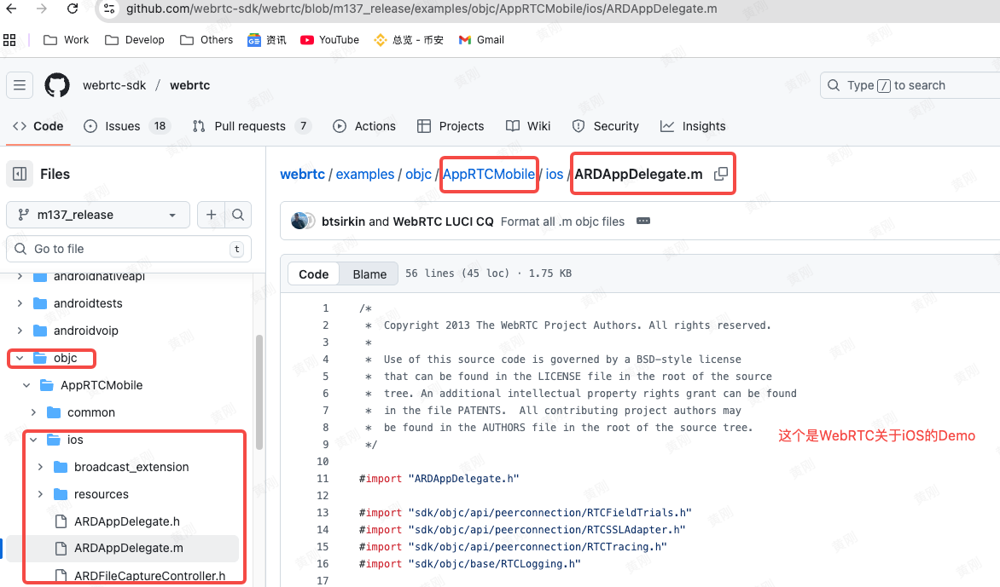
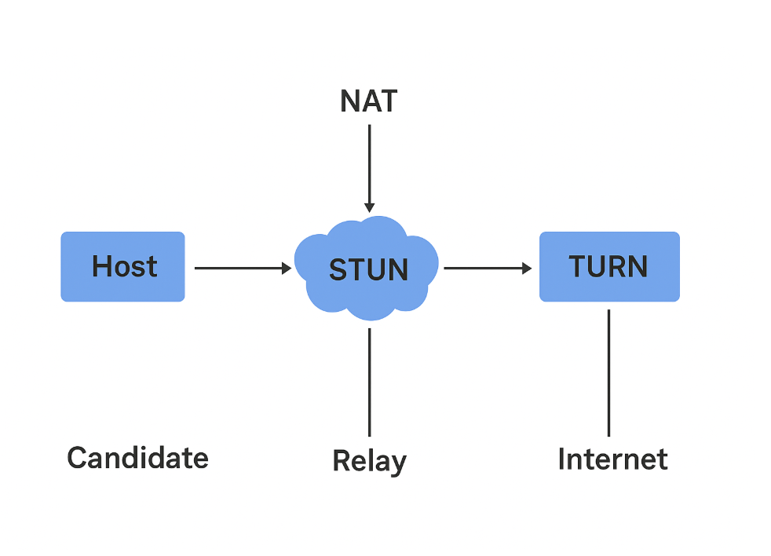

- [**‌介绍**](#介绍)
- [代码集成到工程](#代码集成到工程)
	- [源码集成](#源码集成) 
	- [静态库集成](#静态库集成)
- [视频编解码器](#视频编解码器)
- [创建音视频源](#创建音视频源)
- [视频采集](#视频采集) 
	- [采集和协商约束](#采集和协商约束)
- [本地视频预览](#本地视频预览)
- [信令建立](#信令建立)
- [**数据通道**](#数据通道)
	- [WebRTC整体连接流程图](#WebRTC整体连接流程图)
	- [WebRTC建连时序图](#WebRTC建连时序图)
- [启用或者禁用远端音频播放](#启用或者禁用远端音频播放)
- [**核心概念普及**](#核心概念普及)
	- [ICE服务](ICE服务)
	- [STUN和TURN科普](#STUN和TURN科普)


<br/><br/><br/>

***
<br/>

> <h1 id="介绍">介绍</h1>
**WebRTC 库**（一般指 `WebRTC.framework`，或通过 CocoaPods / SwiftPM 安装的 `GoogleWebRTC` 包）是 **Google 主导开发和维护** 的，属于 [WebRTC 开源项目](https://webrtc.org/)。

关键点：

* **来源**：最初由 Google 在 2011 年开源，用于实现浏览器端实时音视频（“Web Real-Time Communication”）。
* **平台支持**：官方仓库提供了跨平台实现，包括 Web（浏览器）、Android、iOS、Windows、macOS 等。
* **iOS 集成方式**：

  * 直接下载官方构建好的 `WebRTC.framework`；
  * 或通过 [CocoaPods `GoogleWebRTC`](https://cocoapods.org/pods/GoogleWebRTC) / Swift Package Manager 引入。
* **功能**：提供采集音视频、编解码、网络传输（RTP/RTCP）、信令层 API（需自己实现信令服务器）等，是做音视频通话、屏幕共享、P2P 传输等的核心 SDK。

> 另外，App Store 上常见的一些第三方库（如 ImilabRTC、Agora、Zoom SDK 等）通常是基于 WebRTC 或自行实现的音视频协议，但 WebRTC 本身是 Google 官方开源的。


<br/><br/>

WebRTC 是一个统一的跨平台仓库，iOS 代码和其他平台的都在同一个项目里：
- [官方仓库（Google 维护）, 源码的主仓库（使用 depot_tools 拉取）](https://webrtc.googlesource.com/src)
- [GitHub上的是一个同步镜像，只可读](https://github.com/webrtc-sdk/webrtc)

<br/>


iOS相关代码在这些路径：

```sh
/sdk/objc/            # iOS & macOS 的 Objective-C 封装
/sdk/objc/components/ # 视频渲染、音频采集等
/examples/            # 示例工程
```

iOS的示例代码路径，如下：




<br/>

- **关于 “.cc 文件”**
	- `.cc` 是 C++ 源文件 的一种常见扩展名。
	- WebRTC 的核心（音视频引擎、网络栈、编解码器等）大多是用 C++ 写的，所以你会看到大量 .cc 文件。
	- Objective-C 层只是做了一层封装，方便在 iOS/ macOS 上调用。

> 也就是说，WebRTC 库底层主要是 C++ 实现，iOS 用 Objective-C/Swift 调用这些 C++ 接口。

<br/><br/><br/>

***
<br/>

> <h1 id="代码集成到工程">代码集成到工程</h1>

***
<br/><br/><br/>
> <h2 id="源码集成">源码集成</h2>
若是公司要求高度自定义，你可以下载源码然后根据公司业务进行二次开发。但是也是最好不要对其源码C进行开发，最后用OC或者Swift对其进行包裹隔离。可以做到后面跟随源码升级。

***
<br/>

**1️⃣ 准备环境**

WebRTC 使用 **Chromium 的 GN + Ninja** 构建系统，必须用 Google 的 `depot_tools`。

```bash
# 安装 depot_tools
git clone https://chromium.googlesource.com/chromium/tools/depot_tools.git
# 把 depot_tools 目录加到 PATH
export PATH="$PATH:/path/to/depot_tools"
```

> macOS 上必须装好 Xcode（含 Command Line Tools），Python3、Git、Node 也要可用。

<br/> 

**2️⃣ 获取源码**

```bash
mkdir webrtc_ios && cd webrtc_ios
fetch --nohooks webrtc_ios   # fetch 脚本会拉取源码和依赖
gclient sync                 # 同步所有依赖
```

源码拉完后主要结构：

```
src/
  sdk/objc/     # iOS 封装
  api/
  modules/
  rtc_base/
  ...
```

<br/> 

**3️⃣ 生成 iOS 编译配置**

在 `src` 目录：

```bash
gn gen out/ios_armeabi --args='
    target_os="ios"
    target_cpu="arm64"
    is_component_build=false
    rtc_include_tests=false
    rtc_enable_objc_symbol_export=true
    ios_enable_code_signing=false'
```

<br/> 

**4️⃣ 编译静态库**

```bash
ninja -C out/ios_armeabi framework_objc
```

> `framework_objc` 是生成 Objective-C 静态库目标，结果通常在
> `out/ios_armeabi/obj/sdk/objc/` 下，有 `.a` 文件。

<br/> 

**5️⃣ 集成到你的 Xcode 工程**

1. 把编译出来的 `lib*.a` 和 `sdk/objc/` 里的头文件复制到项目中。
2. 在 **Build Settings → Header Search Paths** 中添加头文件目录。
3. 在 **Build Settings → Other Linker Flags** 加上：

   ```
   -ObjC -lstdc++ -framework AVFoundation -framework CoreAudio ...
   ```
4. 确保工程启用了 `C++` 支持（因为 WebRTC 核心是 C++）。

<br/>

**6️⃣ 编译验证**

可以先把官方示例 `AppRTCMobile` 的源码集成进你的工程，确认能显示摄像头预览，说明集成成功。

<br/>

💡 **注意事项**

* **WebRTC 源码体积很大（>2GB）**，更新时 `gclient sync` 也需要时间。
* 不推荐直接「把 `.cc` 文件拖进项目」：
	* 依赖链太复杂；
	* 编译脚本会生成很多宏和配置，否则容易报错。
* 如果只是想二次封装接口，建议用官方生成的静态库，再在你的工程里写 Swift/Objective-C 包装层。


***
<br/><br/><br/>
> <h2 id="静态库集成">静态库集成</h2>

将**WebRTC 源码编译成静态库** (`.a`) 和头文件后，供 **Swift** 来调用，并做一层自己的 API 封装。

---
<br/>


**1️⃣ 工程准备**

- 1.把编译好的 `libwebrtc.a`（或多个 `.a` 文件）和官方 `sdk/objc/` 中的头文件拷贝到 Xcode 工程目录下，例如：

   ```
   MyApp/
     ├─ WebRTC/
     │   ├─ libwebrtc.a
     │   ├─ include/    // 放头文件
   ```

- 2.在 Xcode 的 **Build Settings**:

	* **Library Search Paths**：指向 `.a` 文件所在目录。
	* **Header Search Paths**：指向 `include` 目录。
	* **Other Linker Flags**：加上 `-ObjC` 和 WebRTC 依赖的系统框架：

     ```
     -ObjC -lc++ -framework AVFoundation -framework CoreMedia -framework VideoToolbox -framework CoreAudio
     ```

<br/>

- 3.由于 WebRTC 是 Objective-C 接口，Swift 调用需要一个 **Bridging Header**：
	* 新建 `MyApp-Bridging-Header.h`
	* 内容示例：

     ```objc
     #import "WebRTC/RTCPeerConnection.h"
     #import "WebRTC/RTCVideoTrack.h"
     #import "WebRTC/RTCCameraVideoCapturer.h"
     // 这里根据你用到的类添加 import
     ```

   在 Build Settings → **Objective-C Bridging Header** 配置好这个文件路径。

<br/>

**2️⃣ 用 Swift 写一个封装层**

> 下面示例演示如何在 Swift 里封装 WebRTC 初始化和本地摄像头采集。

```swift
import Foundation
import UIKit

// 你的 WebRTC 封装类
public final class WebRTCManager: NSObject {
    private var peerConnectionFactory: RTCPeerConnectionFactory?
    private var videoSource: RTCVideoSource?
    private var videoCapturer: RTCCameraVideoCapturer?
    private var localVideoTrack: RTCVideoTrack?

    override public init() {
        super.init()
        RTCInitializeSSL()
        peerConnectionFactory = RTCPeerConnectionFactory()
    }

    /// 启动本地摄像头并返回一个视图
    public func startLocalVideo(on view: UIView) {
        guard let factory = peerConnectionFactory else { return }

        videoSource = factory.videoSource()
        videoCapturer = RTCCameraVideoCapturer(delegate: videoSource!)

        localVideoTrack = factory.videoTrack(with: videoSource!, trackId: "video0")

        let renderer = RTCEAGLVideoView(frame: view.bounds)
        renderer.autoresizingMask = [.flexibleWidth, .flexibleHeight]
        view.addSubview(renderer)

        localVideoTrack?.add(renderer)

        if let capturer = videoCapturer {
            let devices = RTCCameraVideoCapturer.captureDevices()
            if let front = devices.first(where: { $0.position == .front }),
               let format = RTCCameraVideoCapturer.supportedFormats(for: front).last,
               let fps = format.videoSupportedFrameRateRanges.first?.maxFrameRate {
                capturer.startCapture(with: front, format: format, fps: Int(fps))
            }
        }
    }
}
```

调用方式：

```swift
let manager = WebRTCManager()
manager.startLocalVideo(on: previewView)
```

<br/>

**3️⃣ 结构小建议**

* 把 C++/ObjC 层完全隔离在一个目录（`WebRTC/`），Swift 只通过 Bridging Header 暴露需要的类。
* 你的 Swift 封装可以暴露干净的接口，例如 `connect(to:)`、`send(message:)`，隐藏掉 WebRTC 比较底层的配置。

<br/>

**额外说明**

* 如果以后想更换成 Pod / SPM 的 `GoogleWebRTC`，Swift 代码基本不用变。
* WebRTC 静态库更新后，只要替换 `.a` 和头文件就行，不影响 Swift 封装层。


<br/><br/><br/>

***
<br/>

> <h1 id="视频编解码器">视频编解码器</h1>

```oc
RTCDefaultVideoDecoderFactory* decoderFactory = 
[[RTCDefaultVideoDecoderFactory alloc] init];

RTCDefaultVideoEncoderFactory* encoderFactory =
[[RTCDefaultVideoEncoderFactory alloc] init];

```

它们在 WebRTC 里是 **非常核心的一环**，用来告诉 `RTCPeerConnectionFactory` 该用哪些编解码器来处理音视频数据。
简单说：

<br/>

**1️⃣ `RTCDefaultVideoDecoderFactory`**

* 作用：**创建视频解码器**。
* 什么时候用：当远端传来视频帧（H.264 / VP8 / VP9 / AV1 …）时，PeerConnection 会通过这个工厂实例化对应的解码器，把 RTP 包解析成可播放的原始图像帧。
* 你可以：
	* 用默认工厂（`RTCDefaultVideoDecoderFactory`），自动包含 VP8 / VP9 / H.264。
	* 或者自定义工厂（实现 `RTCVideoDecoderFactory` 协议），只注册特定的解码器，或替换成硬件/第三方解码器。

<br/> 

**2️⃣ `RTCDefaultVideoEncoderFactory`**

* 作用：**创建视频编码器**。
* 什么时候用：当本地采集到摄像头帧后，需要压缩成 RTP 可发送的视频流；PeerConnection 会向这个工厂请求编码器。
* 默认工厂会：
	* 在支持硬件加速的设备上优先用硬件 H.264 / VP8；
	* 没有硬件加速时 fallback 到软件编码。

<br/>

**3️⃣ 它们如何和 `RTCPeerConnectionFactory` 配合**

创建 PeerConnectionFactory 时要把它们传进去，例如 Objective-C 代码：

```objc
RTCDefaultVideoDecoderFactory *decoderFactory = [[RTCDefaultVideoDecoderFactory alloc] init];
RTCDefaultVideoEncoderFactory *encoderFactory = [[RTCDefaultVideoEncoderFactory alloc] init];

RTCPeerConnectionFactory *factory = [[RTCPeerConnectionFactory alloc] initWithEncoderFactory:encoderFactory decoderFactory:decoderFactory];
```

<br/>

**Swift写法：**

```swift
let encoderFactory = RTCDefaultVideoEncoderFactory()
let decoderFactory = RTCDefaultVideoDecoderFactory()

let peerFactory = RTCPeerConnectionFactory(encoderFactory: encoderFactory, decoderFactory: decoderFactory)
```

这样 `peerFactory` 就知道如何对视频做编解码了。

<br/>

**4️⃣ 常见用途**

* **优化性能**：可以根据设备能力选择启用/禁用某些编解码器，比如只允许 H.264 以减小带宽。
* **增加新格式**：如果要用 AV1、HEVC 之类，需要自定义工厂注册新编码器。
* **限制分辨率/码率**：创建完 PeerConnection 后，可以针对具体 `RTCRtpSender` 调整参数。

<br/>

💡 **总结**

> 这两个 “工厂” 不是用来直接处理帧的，而是用来告诉 WebRTC：
> 「我有哪些视频编解码器可用，以及如何实例化它们」。
>
> 如果不用它们，`RTCPeerConnectionFactory` 就不知道该怎么把原始视频帧压缩成网络包，或者怎么把远端包还原成图像。


<br/><br/><br/>

***
<br/>

> <h1 id="创建音视频源">创建音视频源</h1>

分别创建音视频数据源对象（Source）、音视频 Track。分别将音视频源绑定到对应的 Track 上。

```oc
RTCAudioSource *audioSource = [factory audioSource];
RTCAudioTrack *audioTrack = [factory audioTrackWithSource:audioSource trackId:@"audio0"];

RTCVideoSource *videoSource = [factory videoSource];
RTCCameraVideoCapturer *capturer = [[RTCCameraVideoCapturer alloc] initWithDelegate:videoSource];
RTCVideoTrack *videoTrack = [factory videoTrackWithSource:videoSource trackId:@"video0"];
```

这是 WebRTC 里最基础的一步——**把「音视频采集」变成可以在 PeerConnection 上传输的轨道（Track）**。

上面的几行代码正是完成 **「采集源 → Track」的桥接**。

<br/>

**1️⃣ 每个对象的作用**

| 对象               | 作用                                                     |
| ---------------- | ------------------------------------------------------ |
| `RTCAudioSource` | 表示音频采集源（麦克风等）。它本身不直接输出声音，而是提供音频数据的“源头”。                |
| `RTCAudioTrack`  | 一条可传输的音频轨道。PeerConnection 发送/接收的单位就是 Track，而不是 Source。 |
| `RTCVideoSource` | 表示视频采集源（摄像头、屏幕共享等）。                                    |
| `RTCVideoTrack`  | 一条视频轨道，可以 attach 到渲染视图，也可以通过 RTP 发给远端。                 |

> Source 更底层，负责拿到「原始数据」。Track 是更上层的抽象，WebRTC 内部用 Track 管理编解码、发送、渲染等。

<br/><br/>

**2️⃣ `trackId` 是什么**

* `trackId` 是 **轨道的唯一标识符**（一个 `NSString`）。
* 在信令交换 SDP（Session Description）时，WebRTC 会把 `trackId` 写到 `a=msid:` / `a=mid:` 字段里，远端用它区分每一条音视频流。
* 业务上也可以用它做映射，例如：
	* `ARDAMSa0`：本地音频 track
	* `ARDAMSv0`：本地视频 track
	* 你也可以用自己的命名规则，如 `"audio_main"`、`"screen_share"`。

<br/>

**提问：** `trackId`是自己创建的，还是与后端协商深沉的？

在 WebRTC 里，`trackId` **不是后端必须给你的固定值**，它主要是给“本地应用”和“SDP 协商”用来标识轨道的。
通常做法是：

* **本地生成就行**：
  你创建 `RTCAudioTrack` / `RTCVideoTrack` 时，可以随便指定一个只要**在本地唯一**的字符串（例如 `"audio0"`、`"camera_main"`）。WebRTC 在生成 SDP 时会把这个 ID 带进去，远端就能知道“这是哪条轨道”。
* **不需要和后端提前约定**：
  Track ID 只在 WebRTC 信令交换（SDP 描述）里出现，后端不会直接参与轨道的媒体传输。
  只要你的信令服务器能把 SDP/ICE Candidate 正确转发给对端，Track ID 会自动传递过去。
* **可选：和业务做映射**
  如果你的业务需要根据不同轨道做特殊逻辑（比如“主讲人视频”“屏幕共享视频”），可以在应用层规定一套命名规范，并在 SDP/ICE 完成后根据 `trackId` 区分。

<br/>

**✅ 结论：**
> `trackId` 不必和后端商量固定值，你只要保证在一个 PeerConnection 里它是唯一的即可；后端只负责转发信令，不需要理解 Track ID 的语义。

<br/>

**3️⃣为什么要创建 Source & Track**

WebRTC 的流程大致是：

```
设备采集数据 → Source → Track → PeerConnection → 网络传输
```

* `Source`：采集层（麦克风、摄像头、屏幕等）。
* `Track`：包装成 WebRTC 可识别的媒体轨道，可被 `addTrack` 加到 `RTCPeerConnection`。

如果只采集数据却不创建 Track，PeerConnection 无法发送这些数据，也无法和 SDP/ICE 协商。

<br/>

**4️⃣ 在实际业务中采集本地音视频并传给远端**

```objc
RTCAudioSource *audioSource = [factory audioSource];
RTCAudioTrack *audioTrack = [factory audioTrackWithSource:audioSource trackId:@"audio0"];

RTCVideoSource *videoSource = [factory videoSource];
RTCCameraVideoCapturer *capturer = [[RTCCameraVideoCapturer alloc] initWithDelegate:videoSource];
RTCVideoTrack *videoTrack = [factory videoTrackWithSource:videoSource trackId:@"video0"];

// 把 track 加到 PeerConnection
[peerConnection addTrack:audioTrack streamIds:@[@"stream0"]];
[peerConnection addTrack:videoTrack streamIds:@[@"stream0"]];
```

**渲染本地预览**

```objc
RTCMTLVideoView *localView = [[RTCMTLVideoView alloc] initWithFrame:self.view.bounds];
[videoTrack addRenderer:localView];
```

**管理 Track**

* 可以在业务里维护一个 `Dictionary<String, RTCMediaStreamTrack>`，用 `trackId` 作为 key。
* 当远端通过 `onTrack` 回调给你轨道时，可以用 `track.trackId` 匹配业务逻辑（比如谁是主讲人/共享屏幕）。

<br/>

**5️⃣ 总结**

| 概念        | 用途                                      |
| --------- | --------------------------------------- |
| `Source`  | 原始媒体数据的“采集器”。                           |
| `Track`   | WebRTC 的“媒体通道”，PeerConnection 只认 Track。 |
| `trackId` | 轨道唯一标识，用于 SDP 协商、业务映射。                  |

👉 **记住：你要发送/播放媒体，必须创建 Track，并把它加到 PeerConnection；仅有 Source 是不够的。**


<br/><br/><br/>

***
<br/>

> <h1 id="视频采集">视频采集</h1>
在获取视频之前，我们首先要选择使用哪个视频设备采集数据。在WebRTC中，我们可以通过RTCCameraVideoCapture类操作设备：

创建对象：

```oc
capture = [[RTCCameraVideoCapturer alloc] initWithDelegate:videoSource];
```

<br/>

**获取所有视频设备：**


```oc
NSArray<AVCaptureDevice*>* devices = [RTCCameraVideoCapture captureDevices];
AVCaptureDevice* device = devices[0];
```

<br/>

**开启摄像头：**

```oc
[capture startCaptureWithDevice:device format:format fps:fps];
```

<br/>

现在已经可以通过RTCCameraVideoCapturer类控制视频设备来采集视频了， 那如何获取采集的视频流呢？上面的代码我们已经将视频采集到视频源RTCVideoSource了，那RTCVideoSource就是我们的视频流吗？显然不是。这里要提到的是WebRTC三大对象中的其中一个对象RTCMediaStream，它才是我们说的视频流。

- **视频采集的流程：**
	- `RTCCameraVideoCapturer` 将采集的视频数据交给`RTCVideoSource`
	- 通过`RTCVideoSource` 创建 `RTCVideoTrack`
	- `RTCMediaStream` 添加视频轨 `videoTrack`。


***
<br/><br/><br/>
> <h2 id="采集和协商约束">采集和协商约束</h2>

`RTCMediaConstraints` 是 WebRTC 里用来描述“采集 / 编码时的约束条件”的一个小工具类，可以理解为 **「采集参数配置对象」**。

它会在创建 `MediaSource` 或做某些协商时，把要求的参数传递给底层。

<br/> 

**1️⃣ `RTCMediaConstraints` 的作用**

* 它用来告诉 WebRTC：
	* 哪些参数是**必须满足的**（`mandatoryConstraints`）
	* 哪些是**可选的**（`optionalConstraints`）

* 常用于：
  * 创建 `RTCAudioSource` / `RTCVideoSource`
  * 创建 `RTCPeerConnection`、`RTCRtpTransceiver` 时指定配置
  * 设定回声消除、噪声抑制、自动增益等

> 在 iOS 上，`RTCAudioSource` 常用 `RTCMediaConstraints` 来控制麦克风处理选项。

<br/>

**2️⃣ 代码拆解**

你贴的那段 Swift 代码：

```swift
let audioSource = peerFactory.audioSource(
    with: RTCMediaConstraints(mandatoryConstraints: nil,
                              optionalConstraints: nil)
)
let audioTrack = peerFactory.audioTrack(with: audioSource, trackId: "audio_main")
peerConnection?.add(audioTrack, streamIds: ["stream0"])
```

执行流程：

1. `RTCMediaConstraints(mandatoryConstraints:nil, optionalConstraints:nil)`

   * 创建一个「空约束」对象，也就是使用默认的音频采集设置。
   * 如果要调整参数，可以传入键值对：

     ```swift
     let constraints = RTCMediaConstraints(
         mandatoryConstraints: ["googEchoCancellation": "true"],
         optionalConstraints: ["googAutoGainControl": "true"]
     )
     ```

2. `peerFactory.audioSource(with: constraints)`

   * 用这个约束新建一个 **音频源**（麦克风数据的提供者）。

3. `peerFactory.audioTrack(with: audioSource, trackId: "audio_main")`

   * 把上面那个源包装成一条 WebRTC 能管理的 **音频轨道**。

4. `peerConnection?.add(audioTrack, streamIds:["stream0"])`

   * 把轨道加到 `RTCPeerConnection`，这样 SDP 协商时会包含这条音频流，远端才能收到。

<br/>

**3️⃣ 实际业务中怎么用**

* 如果你只是默认采集麦克风，用空约束即可。
* 想自定义麦克风参数（回声消除、AGC、噪声抑制）时，传入对应 key：

  ```swift
  let constraints = RTCMediaConstraints(
      mandatoryConstraints: ["googEchoCancellation": "true",
                             "googNoiseSuppression": "true",
                             "googAutoGainControl": "true"],
      optionalConstraints: nil
  )
  let audioSource = factory.audioSource(with: constraints)
  ```
* 然后把这个 `audioTrack` 加到 `peerConnection`，远端就会在 `onTrack` 回调里接到对应的音频轨道。

<br/>

💡 **总结**

* `RTCMediaConstraints`：描述采集/协商时的「参数约束」。
* `audioSource`：基于约束创建的音频数据源（负责采集）。
* `audioTrack`：封装成 WebRTC 轨道，PeerConnection 只认 Track。
* `add(audioTrack, streamIds: ["stream0"])`：把轨道添加到会话流，后续通过 SDP/ICE 发送到远端。


<br/><br/><br/>

***
<br/>

> <h1 id="本地视频预览">本地视频预览</h1>

**在 iOS 端，WebRTC 准备了两种 View：**
- 1.`RTCCameraPreviewView：`专门用于预览本地视频。不再从`RTCVideoTrack` 获得数据，而是直接从`RTCCameraVideoCapturer` 获取，效率更高。
- `RTCEAGLVideoView：`显示远端视频。

`viewDidLoad() `在应用程序启动后被调用，属于应用程序生命周期的开始阶段。

```oc
@property (strong, nonatomic) RTCCameraPreviewView *localVideoView;

- (void)viewDidLoad {
	CGRect bounds = self.view.bounds;
	self.localVideoView = [[RTCCameraPreviewView alloc]
		initWithFrame:CGRectZero];
	[self.view addSubview:self.localVideoView];

	CGRect localVideoFrame =
		CGRectMake(0, 0, bounds.size.width, bounds.size.height);
	[self.localVideoView setFrame:localVideoFrame];
}
```

在 viewDidLoad() 函数里我们创建并初始化了一个 RTCCameraPreviewView，将 localVideoView 对象添加到应用程序的 Main View 中，最后设置了大小和显示位置。

关联 localVideoView 和 RTCCameraVideoCapturer：

```oc
self.localVideoView.captureSession = capture.captureSession;
```

传递 captureSession 后，localVideoView 就可以从 RTCCameraVideoCapturer 上获取数据并渲染了。

<br/><br/><br/>

***
<br/>

> <h1 id="信令建立">信令建立</h1>

>**关键点：**
* **Signaling（信令）是必须的**：WebRTC 本身**不规定信令协议**，你需要把 SDP/ICE candidate 等控制消息通过你选的通道（WebSocket/Socket.IO/HTTP 等）交换给对端。 
* **RTCPeerConnection 负责采集/编解码/ICE 及媒体传输**，但它不会替你把 SDP/ICE 发给对端 — 这由信令通道来做。 
* **STUN/TURN（ICE servers）用于 NAT 穿透**：STUN 用来发现公网地址（常见 public STUN 如 `stun:stun.l.google.com:19302`），当直连不可行时才会用 TURN 做中继。 
* `defaultPeerConnConstraints`：通常用于设置创建 peerConnection / createOffer 时的媒体协商约束（比如 `OfferToReceiveAudio/Video`、`DtlsSrtpKeyAgreement` 等）。这些是协商行为/兼容性的开关（不同版本 SDK 有差别）。 

---
<br/><br/>

- **1) 信令系统（Signaling）在做什么？和 `RTCPeerConnection` 的关系**

	* **职责**：把 `SDP offer/answer`、`ICE candidates`、以及业务层的控制消息（谁加入房间、谁发起通话等）在两端/房间成员之间转发。WebRTC **不要求用哪种协议**，只是要求这些消息能可靠交换即可（因此常见实现：WebSocket / Socket.IO / HTTP / MQTT / SIP 等）。 
	* **关系**：`RTCPeerConnection` 在本地生成 SDP（`createOffer`/`createAnswer`）并采集 ICE candidate；**然后你必须把这些字符串通过信令发送出去**；对端收到后用 `setRemoteDescription` / `addIceCandidate` 完成协商。换言之：`RTCPeerConnection` 做媒体 & 网络层，**信令负责“告诉对端怎么连”**。 

<br/>

- **2) `ICE servers`（STUN / TURN）是做什么的？**

	* **STUN**：告诉客户端“我的公网映射地址是什么”，以便把这个地址和候选（candidate）发送给对端，大多数场景下能直接 P2P 连接。比如常见的公共 STUN：`stun:stun.l.google.com:19302`。 ([Stack Overflow][3])
	* **TURN**：当 NAT/防火墙/企业网络阻止直连时，TURN 提供中继服务（把媒体走到 TURN，转发到对端），但代价是流量和延迟。 ([WebRTC][5])

<br/>

- **3) `defaultPeerConnConstraints` 的用途**

	* 这是 `RTCMediaConstraints`，用来控制协商选项（例如是否期望接收音/视频、DTLS-SRTP 是否开启等）。具体字段在不同 SDK 版本/平台上可能略有差异，但常见项有：

	  * `"OfferToReceiveAudio": "true"` / `"OfferToReceiveVideo": "true"`（是否在 offer/answer 中包含接收媒体的 m= 行）
	  * `"DtlsSrtpKeyAgreement": "true"`（DTLS+SRTP 的协商，保证媒体通道被安全加密）。 这些约束会影响后续 `createOffer`/`createAnswer` 的 SDP。 ([Google Groups][6])

<br/>

- **下面示例展示了：**
	* 准备 ICEServers（默认用 Google STUN）；
	* 准备 `RTCMediaConstraints`（默认约束）；
	* 用 `RTCPeerConnectionFactory` 创建 `RTCPeerConnection`。

> 说明：基于 **WebRTC iOS Obj-C API**。若用的是不同版本的 SDK，API 调整的点可能是 `peerConnectionWithConfiguration:constraints:delegate:` 的签名或 `RTCConfiguration` 字段名称。参考官方示例。 ([Chromium Git Repositories][4])

```oc
// WebRTCConnectionHelper.h
#import <Foundation/Foundation.h>
#import <WebRTC/WebRTC.h>

@interface WebRTCConnectionHelper : NSObject <RTCPeerConnectionDelegate>

@property (nonatomic, strong) RTCPeerConnectionFactory *factory;
@property (nonatomic, strong) RTCPeerConnection *peerConnection;

- (instancetype)init;
- (RTCIceServer *)defaultSTUNServer;
- (RTCMediaConstraints *)defaultPeerConnConstraints;
- (void)createPeerConnection;

@end

// WebRTCConnectionHelper.m
#import "WebRTCConnectionHelper.h"

@implementation WebRTCConnectionHelper

- (instancetype)init {
    if (self = [super init]) {
        // 初始化 SSL / Factory
        RTCInitializeSSL();
        self.factory = [[RTCPeerConnectionFactory alloc] init];
    }
    return self;
}

// 默认 STUN server（可以替换为自己的 TURN / STUN 列表）
- (RTCIceServer *)defaultSTUNServer {
    // 常见 public STUN： stun:stun.l.google.com:19302
    // 如果需要 TURN：使用 initWithURLStrings:username:credential: 并提供用户名/密码
    NSArray<NSString *> *urls = @[@"stun:stun.l.google.com:19302"];
    RTCIceServer *server = [[RTCIceServer alloc] initWithURLStrings:urls
                                                          username:nil
                                                        credential:nil];
    return server;
}

// 默认 peerConnection constraints（示例）
- (RTCMediaConstraints *)defaultPeerConnConstraints {
    NSDictionary *mandatory =
        @{ @"OfferToReceiveAudio": @"true",
           @"OfferToReceiveVideo": @"true" };
    NSDictionary *optional =
        @{ @"DtlsSrtpKeyAgreement": @"true" }; // 确保 DTLS/SRTP 协商（兼容某些实现）
    RTCMediaConstraints *constraints =
        [[RTCMediaConstraints alloc] initWithMandatoryConstraints:mandatory
                                               optionalConstraints:optional];
    return constraints;
}

// 创建 PeerConnection
- (void)createPeerConnection {
    // 组装 ice servers
    NSMutableArray<RTCIceServer *> *iceServers = [NSMutableArray array];
    [iceServers addObject:[self defaultSTUNServer]];
    // 如果你有 TURN，加入类似 initWithURLStrings:username:credential:

    // RTCConfiguration
    RTCConfiguration *config = [[RTCConfiguration alloc] init];
    config.iceServers = iceServers;
    // 建议使用 Unified Plan（如果 SDK 支持）
    config.sdpSemantics = RTCSdpSemanticsUnifiedPlan;

    RTCMediaConstraints *constraints = [self defaultPeerConnConstraints];

    // 创建 peerConnection
    self.peerConnection = [self.factory peerConnectionWithConfiguration:config constraints:constraints delegate:self];
}

// －－- RTCPeerConnectionDelegate 示例回调（你需要实现更完整的回调）－－-
- (void)peerConnection:(RTCPeerConnection *)peerConnection
        didChangeSignalingState:(RTCSignalingState)stateChanged {
    NSLog(@"Signaling state changed: %ld", (long)stateChanged);
}

- (void)peerConnection:(RTCPeerConnection *)peerConnection
           didAddStream:(RTCMediaStream *)stream {
    NSLog(@"didAddStream");
}

// 记得实现其它 delegate 方法（onIceCandidate、onIceGatheringStateChange 等）
@end

```

<br/>

**信令样例：用 Socket.IO（Swift）实现 SDP / Candidate 交换**

`Socket.IO-Client-Swift` 是 iOS 的 Socket.IO 客户端库（常用于做信令层：基于 WebSocket 的事件化双向通道）。仓库：Socket.IO-Client-Swift（GitHub）。 ([GitHub][7])

下面给出较完整的 Swift 信令示例（核心思想：收到 offer/answer -> setRemoteDescription -> 创建 answer 或 setLocal；收到 candidate -> 若已设 remoteDescription 则直接 `addIceCandidate`，否则 buffer）。

```swift
import SocketIO
import WebRTC

class SignalingClient {
    let manager: SocketManager
    let socket: SocketIOClient
    var iceBuffer: [RTCIceCandidate] = []
    weak var peerConnection: RTCPeerConnection?

    init(serverUrl: URL) {
        manager = SocketManager(socketURL: serverUrl, config: [.log(true), .compress])
        socket = manager.defaultSocket
        addHandlers()
        socket.connect()
    }

    private func addHandlers() {
        socket.on(clientEvent: .connect) { data, ack in
            print("Socket connected")
        }

        // Offer from remote
        socket.on("offer") { [weak self] data, ack in
            guard let dict = data[0] as? [String:Any],
                  let sdp = dict["sdp"] as? String else { return }
            let desc = RTCSessionDescription(type: .offer, sdp: sdp)
            self?.peerConnection?.setRemoteDescription(desc, completionHandler: { error in
                // create answer...
            })
        }

        // Answer from remote
        socket.on("answer") { [weak self] data, ack in
            guard let dict = data[0] as? [String:Any],
                  let sdp = dict["sdp"] as? String else { return }
            let desc = RTCSessionDescription(type: .answer, sdp: sdp)
            self?.peerConnection?.setRemoteDescription(desc, completionHandler: { error in
                // flush buffered ICE if any
                self?.flushIceBuffer()
            })
        }

        // Remote ICE candidate
        socket.on("candidate") { [weak self] data, ack in
            guard let dict = data[0] as? [String:Any],
                  let sdp = dict["candidate"] as? String,
                  let sdpMid = dict["sdpMid"] as? String,
                  let sdpMLineIndex = dict["sdpMLineIndex"] as? Int32 else { return }
            let candidate = RTCIceCandidate(sdp: sdp, sdpMLineIndex: sdpMLineIndex, sdpMid: sdpMid)
            // 如果 remoteDescription 尚未设置，先缓冲
            if self?.peerConnection?.remoteDescription == nil {
                self?.iceBuffer.append(candidate)
            } else {
                self?.peerConnection?.add(candidate)
            }
        }
    }

    func sendOffer(_ sdp: RTCSessionDescription) {
        socket.emit("offer", ["sdp": sdp.sdp, "type": "offer"])
    }

    func sendAnswer(_ sdp: RTCSessionDescription) {
        socket.emit("answer", ["sdp": sdp.sdp, "type": "answer"])
    }

    func sendCandidate(_ candidate: RTCIceCandidate) {
        let dict: [String:Any] = [
            "candidate": candidate.sdp,
            "sdpMid": candidate.sdpMid ?? "",
            "sdpMLineIndex": candidate.sdpMLineIndex
        ]
        socket.emit("candidate", dict)
    }

    private func flushIceBuffer() {
        for c in iceBuffer { peerConnection?.add(c) }
        iceBuffer.removeAll()
    }
}
```

**说明与要点**

* 信令消息格式是“自定的” JSON；你和后端/另一端要约定 key（例如上面的 `offer/answer/candidate`）。
* 信令通道建议走 **wss (TLS)** 并有身份校验（token），避免被恶意注入 SDP/ICE。
* 在实际生产中，Socket.IO 常用来简化房间管理/事件分发（比如 `join room`、`broadcast offer to other participants` 等）。库的 README 有更多示例。 ([GitHub][7])

<br/>

**注意事项**

* **Buffer ICE candidates**：对端的 `setRemoteDescription` 未完成前，收到 candidate 要缓存，等 `setRemoteDescription` 完成再 `addIceCandidate`。这是常见坑。 ([WebRTC][2])
* **TURN 必要时启用**：在企业网络或双 NAT 的场景，必须有 TURN 服务以保证连通性（公共 STUN 并不保证）。 ([WebRTC][5])
* **安全**：信令通道用 TLS/WSS 并加鉴权，避免中间人注入。
* **兼容**：不同 WebRTC 版本 API 有差异（例如 unified plan vs plan-b），若遇到 SDP 问题，可参考官方 demo（AppRTCMobile）。 ([Chromium Git Repositories][4])
* **DtlsSrtpKeyAgreement**：历史上某些平台上需要显式打开该约束以保证 DTLS-SRTP 正常协商（不同版本行为会变）。 ([Google Groups][6])


<br/><br/><br/>

***
<br/>

> <h1 id="数据通道">数据通道</h1>

**`数据通道（Data Channel）`**

除了音视频，WebRTC 还有一个很重要的能力就是 **Data Channel**，它走的也是点对点（P2P）通道。

<br/>

**作用：**

* 在已经建立的 WebRTC 连接上，传输任意数据（文本、二进制都行）。
* 延迟低，可靠性可选（类似 UDP / TCP 混合），适合实时应用。

<br/>

**常见应用场景：**

- 1.**IM 消息**：在音视频通话里加聊天功能。
- 2.**实时同步**：比如白板协作，鼠标轨迹同步。
- 3.**游戏联机**：小数据包状态同步。
- 4.**信令优化**：有时可以用来传递控制信息，而不必走外部服务器。

<br/>

**简单示例（Swift）**

```swift
// 创建 DataChannel
let config = RTCDataChannelConfiguration()
config.isReliable = true
let dataChannel = peerConnection.dataChannel(forLabel: "chat", configuration: config)

// 接收消息
dataChannel?.delegate = self

// 发送消息
let message = "Hello WebRTC!"
let buffer = RTCDataBuffer(data: message.data(using: .utf8)!, isBinary: false)
dataChannel?.sendData(buffer)
```

接收回调：

```swift
extension YourClass: RTCDataChannelDelegate {
    
    func dataChannel(_ dataChannel: RTCDataChannel, didReceiveMessageWith buffer: RTCDataBuffer) {
        if let text = String(data: buffer.data, encoding: .utf8) {
            print("收到消息: \(text)")
        }
    }
}
```

* `DataChannel` → **在 PeerConnection 里传任意数据（非音视频）**。

***
<br/><br/><br/>
> <h2 id="WebRTC整体连接流程图">WebRTC整体连接流程图</h2>

**下面是WebRTC整体连接流程图，** 帮你理清音频轨道、视频轨道和数据通道的关系

**🌐 WebRTC PeerConnection 结构图**

```sh
   ┌──────────────────────────┐
   │        Peer A (本地)      │
   │                          │
   │  ┌───────────┐           │
   │  │ 麦克风     │───┐       │
   │  └───────────┘   │       │
   │                   ▼       │
   │               [AudioTrack]│
   │                   │       │
   │  ┌───────────┐   │       │
   │  │ 摄像头     │───┘       │
   │  └───────────┘           │
   │                   ▼       │
   │               [VideoTrack]│
   │                           │
   │     ┌──────────────────┐ │
   │     │   DataChannel    │ │
   │     └──────────────────┘ │
   │                           │
   │       PeerConnection      │
   └─────────────┬─────────────┘
                 │ (ICE + DTLS/SRTP)
                 ▼
   ┌─────────────┴─────────────┐
   │        Peer B (远端)        │
   │                            │
   │            [AudioTrack] ◀──┘ 麦克风
   │            [VideoTrack] ◀──┘ 摄像头
   │         [DataChannel] ◀───► 聊天/白板/状态同步
   │                            │
   │  (可用 enableRemoteAudioTracks 控制是否播放远端音频)
   └────────────────────────────┘
```

---
<br/>

**🔑 说明**

- 1.**音频轨道 (AudioTrack)**
	* 从麦克风采集 → 通过 `PeerConnection` 传给对方。
	* 对方可以用 `enableRemoteAudioTracks(false)` 一键静音所有远端音频。

- 2.**视频轨道 (VideoTrack)**
	* 从摄像头采集 → 传给对方 → 在 `<RTCVideoView>` 中渲染。

- 3.**数据通道 (DataChannel)**
	* 建立在同一个 P2P 通道上，可以发文字、文件、二进制数据。
	* 适合聊天消息、白板协作、实时状态同步等。

***
<br/><br/><br/>
> <h2 id="WebRTC建连时序图">WebRTC建连时序图</h2>

**WebRTC建连时序图，涉及把音频、视频、数据通道建立过程都串起来**，展示从创建 PeerConnection → 建立连接 → 双方轨道和数据通道建立的全过程。

<br/>

**WebRTC 建立连接时序图**

```
Peer A (Caller)                          Peer B (Callee)
────────────────────────────────────────────────────────────
 |                                          |
 | 1. getUserMedia(音频/视频)                |
 | ───────────────────────────────────────> |
 |   (采集麦克风/摄像头，生成本地轨道)        |
 |                                          |
 | 2. 创建 PeerConnection                   |
 |                                          |
 | 3. pc.addTrack(AudioTrack/VideoTrack)    |
 |                                          |
 | 4. 可选：pc.createDataChannel("chat")     |
 |                                          |
 | 5. createOffer()                         |
 | ───────────────────────────────────────> |
 |                                          |
 | 6. setLocalDescription(Offer)            |
 |                                          |
 | 7. 发送 Offer SDP 给 Peer B (信令)        |
 | ───────────────────────────────────────> |
 |                                          |
 |                                          | 8. setRemoteDescription(Offer)
 |                                          |
 |                                          | 9. getUserMedia(音频/视频)
 |                                          |    (可选：也可以只收不发)
 |                                          |
 |                                          | 10. pc.addTrack(...)
 |                                          |
 |                                          | 11. createAnswer()
 |                                          | ────────────────────────────────>
 |                                          |
 |                                          | 12. setLocalDescription(Answer)
 |                                          |
 | 13. setRemoteDescription(Answer)         |
 |                                          |
 | 14. ICE Candidate 交换 (双向)             |
 | <──────────────────────────────────────> |
 |                                          |
 | === 建立 P2P 通道成功 ===                 |
 |                                          |
 | 15. 音频轨道播放 (可通过                  |
 |     enableRemoteAudioTracks 控制全局开关) |
 |                                          |
 | 16. 视频轨道渲染到 UI                     |
 |                                          |
 | 17. DataChannel 打开 (onopen)            |
 | <──────────────────────────────────────> |
 |                                          |
 | 18. 双方可以发文字/二进制消息             |
 |                                          |
```

---

### 🔑 关键点说明

* **音视频轨道**：通过 `addTrack` 添加到 `PeerConnection`，远端会在 `ontrack` 回调中收到。
* **数据通道**：一方用 `createDataChannel` 创建，另一方会在 `ondatachannel` 回调中收到。
* **信令**：Offer/Answer + ICE Candidate 的交换，通常要通过服务器（WebSocket/HTTP）转发。
* **控制远端音频**：

  * 全局开关：`pc.enableRemoteAudioTracks(false)`。
  * 单个轨道：`remoteAudioTrack.isEnabled = false`。

---

要不要我再帮你用 **Swift (iOS WebRTC)** 写一份代码骨架，把 **音频轨道、视频轨道、数据通道** 三者结合在一个 `PeerConnection` 中？这样就能和上面的时序图对应起来。


<br/><br/><br/>

***
<br/>

> <h1 id="启用或者禁用远端音频播放">启用或者禁用远端音频播放</h1>


**`① enableRemoteAudioTracks`**

在 `WebRTC iOS/Android 原生 SDK（C++ 层 PeerConnectionInterface）`里，
`enableRemoteAudioTracks(bool enable) `是 全局开关：

- **`true`** → 开启所有远端音频轨道的播放。

- **`false`** → 关闭所有远端音频轨道的播放（相当于一键全体静音）。

如果你只想控制某个特定的远端音频轨道，就用 `RTCAudioTrack.isEnabled = false（iOS Swift）`或者 **`remoteAudioTrack->set_enabled(false)（C++）`**。

****
<br/>

`PeerConnection` 里的 **`enableRemoteAudioTracks`** 主要作用是：
控制是否让 **所有远端音频轨道**（remote audio tracks）进入播放（渲染）状态。

换句话说，它是一个开关，用来**批量启用或禁用远端的音频播放**，而不是逐条轨道去 mute/unmute。

<br/>

**具体作用**

* **true（默认）**：
  所有远端音频轨道都会被解码并播放出来（如果已添加到 PeerConnection 并附加到音频输出设备）。
* **false**：
  即使远端有音频流传过来，本地也不会解码播放，等于把所有远端音频“静音”。

---
<br/>

**应用场景**

- 1.**会议应用的全局静音**
   比如主持人点一个“静音所有人”的按钮，可以直接调用 `pc.enableRemoteAudioTracks(false)`，而不用逐个对 track 调整。

- 2.**性能优化**
   某些场景暂时不需要音频时，可以关闭远端音频的解码和播放，节省 CPU/电池。

- 3.**用户隐私控制**
   如果用户想临时屏蔽所有远端声音，可以用这个接口，而不是依赖 UI 音量控制。

<br/>

**⚠️ 注意：**

* 这是 **批量控制**，不是单个轨道。
* 如果需要对某一个远端 `AudioTrack` 控制，通常用 `remoteAudioTrack.setEnabled(false)`。


<br/><br/><br/>

***
<br/>

> <h1 id="核心概念普及">核心概念普及</h1>


***
<br/><br/><br/>
> <h2 id="ICE服务">ICE服务</h2>

ICE 服务全称 **Interactive Connectivity Establishment**（交互式连接建立），是实时音视频（比如 WebRTC）里的一套 **NAT 穿透** 技术标准。

<br/>

它主要解决的问题是：
👉 在不同网络环境下（内网、公网、WiFi、4G…），两端设备要建立点对点（P2P）连接时，可能会遇到 NAT、防火墙等障碍，导致彼此无法直接通信。

ICE 就是一个 **候选路径搜集 + 优选机制**，帮你找到一条最可行的通信通道。

---
<br/>

**ICE 的核心流程**

- 1.**收集候选地址（candidates）**
	* 主机地址（Host Candidate）: 设备自己的 IP/端口
	* 反射地址（Server Reflexive Candidate）: 通过 **STUN** 服务器获取的公网地址
	* 中继地址（Relay Candidate）: 通过 **TURN** 服务器中转

- 2.**交换候选地址**
	* 双方通过信令（比如 WebSocket/HTTP）交换各自收集到的候选地址

- 3.**连通性检测**
	* 双方尝试用 STUN 探测各候选地址是否能互通

- 4.**优选最佳路径**
	* 如果直连（P2P）可行，走 P2P
	* 如果直连不通，就回退走 **TURN 中继**

<br/>

**ICE 相关的服务**

* **STUN（Session Traversal Utilities for NAT）**
  作用：告诉你“我在公网看到的 IP/端口”，帮助 NAT 穿透
  → 免费的，比如 `stun.l.google.com:19302`

* **TURN（Traversal Using Relays around NAT）**
  作用：如果 NAT 穿透失败，就通过 TURN 服务器转发流量
  → 成本较高，常由自己部署

* **ICE**
  就是把 Host + STUN + TURN 结合起来的完整框架，自动选择最优的连接方式。

---
<br/>

**🔑 总结：**
**ICE 服务不是单独一个服务器，而是一套连接机制**，它通常依赖 STUN/TURN 服务器来实现。开发 WebRTC、视频通话、实时互动时必须配置 ICE 服务，否则点对点连接可能在复杂网络下失败。


***
<br/><br/><br/>
> <h2 id="STUN和TURN科普">STUN和TURN科普</h2>


- 1.**STUN (Session Traversal Utilities for NAT)**

📌 **作用**：

* 帮设备**发现自己在公网的 IP 和端口**。
* 解决“内网机器不知道自己公网地址”的问题。

<br/>

📖 举个例子：

* 你在公司 WiFi 内网，IP 是 `192.168.1.100`。
* 你要跟外网设备视频通话。
* 你问 STUN 服务器：“请告诉我，我在外网的地址是什么？”
* STUN 服务器看到你访问它时的源地址，比如 `203.0.113.25:52341`，就返回给你。
* 这样你就知道“别人要找到我，就得打 `203.0.113.25:52341`”。

👉 **STUN 能解决大多数常见 NAT 场景**，比如家用路由器、手机 4G 网络。
👉 但如果 NAT 特别严格（比如公司网络、防火墙阻挡），STUN 就可能失效。

<br/>

- 2.**TURN (Traversal Using Relays around NAT)**

📌 **作用**：

* 当 **P2P 穿透失败**（STUN 不通、NAT 太严格）时，**提供中继转发**。
* TURN 服务器相当于一个“中转站”，流量绕道它转发。

<br/>

📖 举个例子：

* 甲方在中国内网，乙方在美国公司内网，两边 NAT 都很严格，STUN 获取的地址无法互通。
* 双方都连上 **TURN 服务器**（比如放在新加坡的云服务器）。
* 所有音视频数据都通过 TURN 转发，这样虽然延迟和带宽成本更高，但能保证“必通”。

👉 **TURN 是兜底方案**，保证 100% 连接成功。
👉 但 TURN 成本高（服务器带宽消耗大），所以一般只在必要时用。

<br/>

- 3.**ICE = STUN + TURN + Host**

ICE 就是一个“候选连接地址选择器”：

- 1.尝试 Host 地址（局域网直连） → 最快、无延迟。
- 2.尝试 STUN 地址（公网直连） → 成本低，能直连就最好。
- 3.如果都不行 → 回退 TURN 地址（中继） → 最稳妥，但耗资源。

---
<br/>


- 4.直观比喻 🚦
	* **Host** = “我家门牌号”
	* **STUN** = “去派出所问，我在全市的地址是多少”
	* **TURN** = “找快递站代收转发”
	* **ICE** = “我先试试看能不能直接去你家，不行就问派出所，再不行就通过快递站转交”

**STUN & TURN 在 ICE 流程中的图解**


<br/>

**ICE + STUN + TURN 的交互流程时序：**

```sh
Peer A (Caller)                              Peer B (Callee)
────────────────────────────────────────────────────────────
 |                                                 |
 | 1. getUserMedia(音频/视频)                       |
 |───────────────────────────────────────────────> |
 |                                                 |
 | 2. createOffer (包含本地候选地址 Candidate)       |
 |───────────────────────────────────────────────> |
 |                                                 |
 |                    3. setRemoteDescription      |
 | <────────────────────────────────────────────── |
 |                                                 |
 | 4. createAnswer (返回候选地址 Candidate)          |
 | <────────────────────────────────────────────── |
 |                                                 |
 | 5. setRemoteDescription                          |
 |───────────────────────────────────────────────> |
 |                                                 |
 | 6. 双方收集候选地址 (Host / STUN / TURN) 并交换    |
 |<──────────────────────────────────────────────> |
 |                                                 |
 | 7. ICE 连通性检测 (STUN 探测各候选可达性)          |
 |<──────────────────────────────────────────────> |
 |                                                 |
 | 8. 选定最佳连接路径 (直连优先，否则回退 TURN)       |
 |<──────────────────────────────────────────────> |
 |                                                 |
 | 9. 建立 P2P 媒体通道 (音视频/数据)                 |
 |<──────────────────────────────────────────────> |
```

- **可以更直观地看清：**
	- 候选收集（Host/STUN/TURN）是双方都做的事
	- 交换和检测需要靠信令通道
	- 最后才真正进入 媒体传输