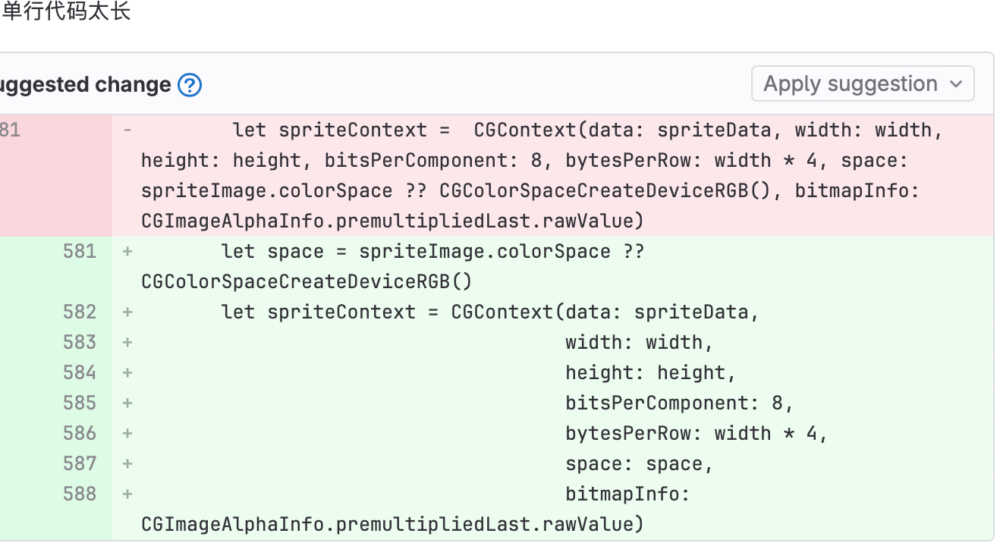
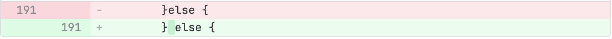
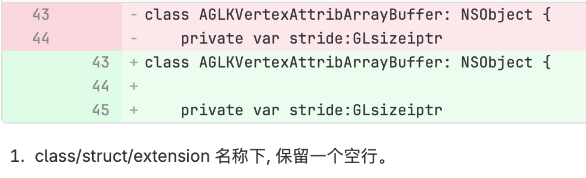
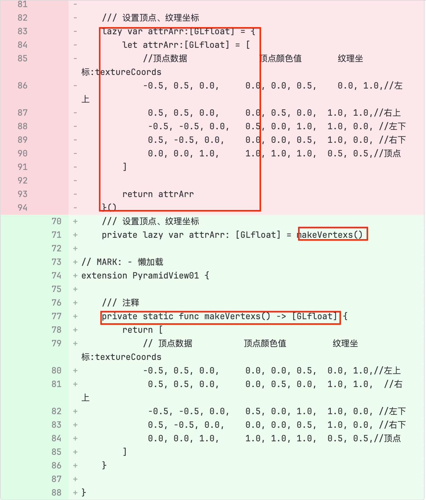
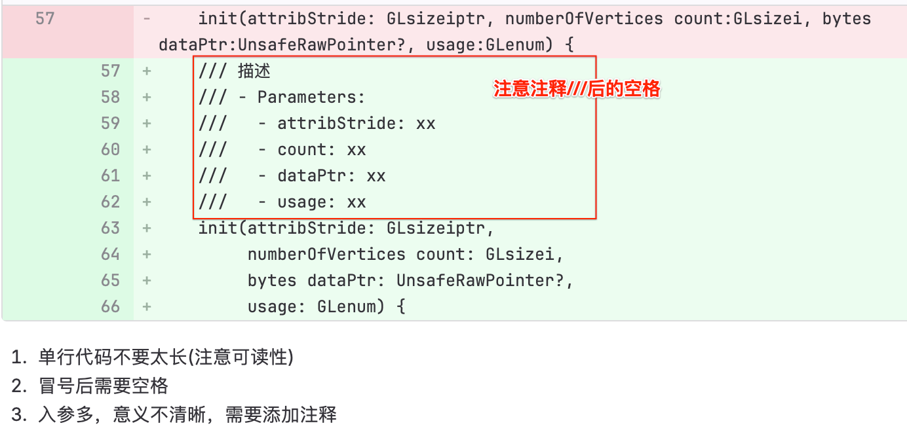
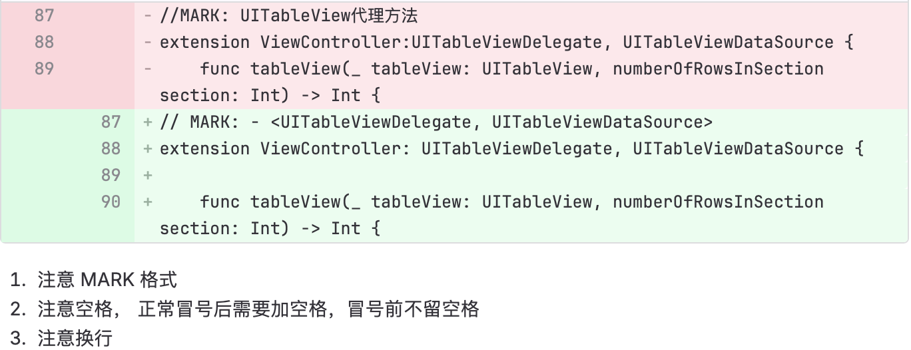
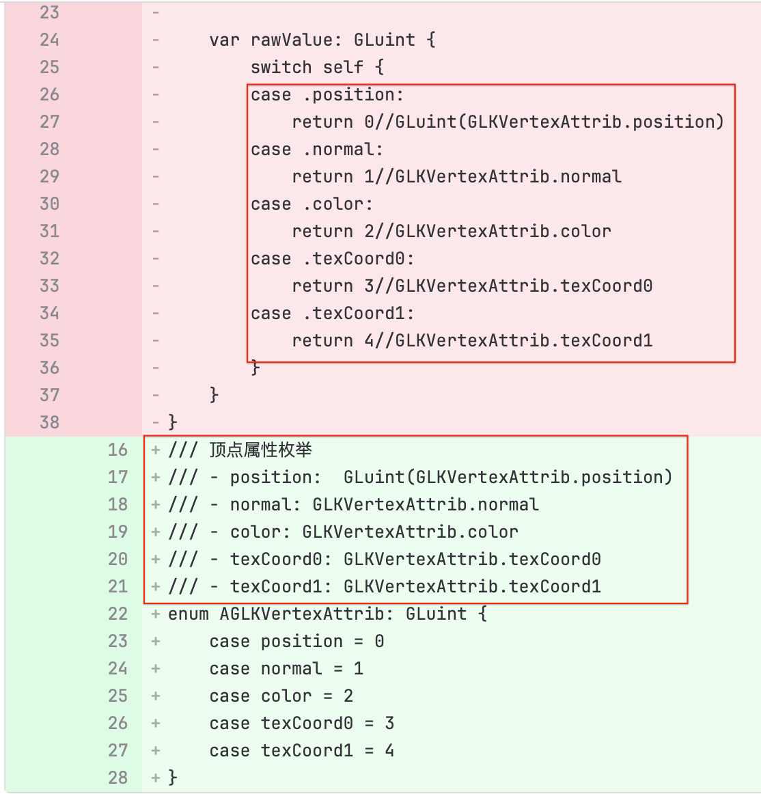

> <h1 id=""></h1>
- [**Swift代码规范**](#**Swift代码规范**)
	- [格式](#格式)
		- [类中的extension注意](#类中的extension注意)
		- [懒加载类扩展方法](#懒加载类扩展方法)
		- [函数参数长要换行](#函数参数长要换行)
		- [类后空一行再写代码](#类后空一行再写代码)
		- [属性懒加载多行调用方法](#属性懒加载多行调用方法)
	- [注释规范](#注释规范)
		- [标志注释MARK](#标志注释MARK)
		- [枚举类别说明注释](#枚举类别说明注释)
	- [提交代码规范](#提交代码规范)
- **资料**
	- SwiftLint（代码规范库）
	- The Official Kodeco Swift Style Guide.
	- Airbnb Swift Style Guide
	- Kodeco 官方代码风格指南中文版[长期维护项目]                                                                 


**‌**

<br/>

***
<br/><br/><br/>

> <h1 id="Swift代码规范">Swift代码规范</h1>


<br/><br/><br/>

> <h2 id="格式">格式</h2>


<br/><br/><br/>

> <h2 id="类中的extension注意">类中的extension注意</h2>


- **类中的extension要注意：**
	- 比如若是懒加载的方法，若是可以一行就一行，若是不行直接通过调用某个方法来进行方法的赋值

```
 class AAController{
	/// 这里要放入一些基础的属性，属性要加上访问限制的权限，不要用默认的
	private var vFrame: CGRect = .zero
}

```


<br/><br/>

> <h2 id="懒加载类扩展方法">懒加载类扩展方法</h2>


- **懒加载类扩展方法**

对于一些比较多的懒加载方法，你可以专门用一个扩张类来写，比如：

```
extennsion AController {
	private lazy var picureName: String?
	
	// 若是这个变量需要多行代码才能生成，你可以调用某个方法来对其进行赋值
	// 变量的冒号后要加一个空格
	private lazy var filePathy: String = self.crateFilePath()
	
	
	
	private func crateFilePath() -> String {
		// 多行代码生成字符串路径
		// 。。。。
		// 。。。
	}
}
```

<br/><br/>
> <h2 id="函数参数长要换行">函数参数长要换行</h2>




<br/><br/>

> <h2 id="空格的添加"> 空格的添加 </h2>


- **判断else的空格添加**




<br/> <br/>

- **属性空格添加**

```
var bufferSize:GLsizeiptr{}

// 改过的
var bufferSize: GLsizeiptr {}
```

<br/><br/>

> <h2 id="类后空一行再写代码">类后空一行再写代码</h2>

新建一个类后，要换行再空一行后再写代码，不要换行后立马写代码




<br/><br/>

> <h2 id="属性懒加载多行调用方法">属性懒加载多行调用方法</h2>

对于类属性懒加载能写一行的就用一行，不能一行的就调用一个函数



- 套了两层无意义，可以直接赋值
- 这么长的内容，会大大降低可读性，不适合在属性区域； 建议通过函数封装后调用；

<br/><br/><br/>

> <h2 id="注释规范">注释规范</h2>

- **变量注释要在顶部说明并要加一个空格，不要在变量的后面加**

```
/// 顶点缓冲区, 注意: 加上文件访问标志
private var vertexBuffer = Glint = 0
```

<br/><br/>

- **属性、方法要用 `///` 注释 ，注意都要在`///`后加一个空格**

记得要加文件访问限制关键字

```
class superClass {
	/// 视图动画的frame, 变量的冒号后要加一个空格
	private frame: CGRect = .zero
}

/// 安装纹理
/// - Parameter fileName: 纹理文件名
 @discardableResult 
private func setupTexture(pictureName name: String) -> GLuint {

}
```




<br/><br/>

> <h2 id="标志注释MARK">标志注释MARK</h2>



<br/><br/>

> <h2 id="枚举类别说明注释">枚举类别说明注释</h2>



- 尽量简化
- 注意注释格式


<br/><br/><br/>

> <h2 id=""></h2>

对一些封好的视图类最好要不要和ViewController放在一块，即使很简单，代码量很少，也不要放在一块，要新建一个类单独拎出来


<br/><br/><br/>

> <h2 id="提交规范">提交规范</h2>


- **提交git记录如： 【feature】边线，注意没有冒号**

```
【feature】添加了一个文件
```


