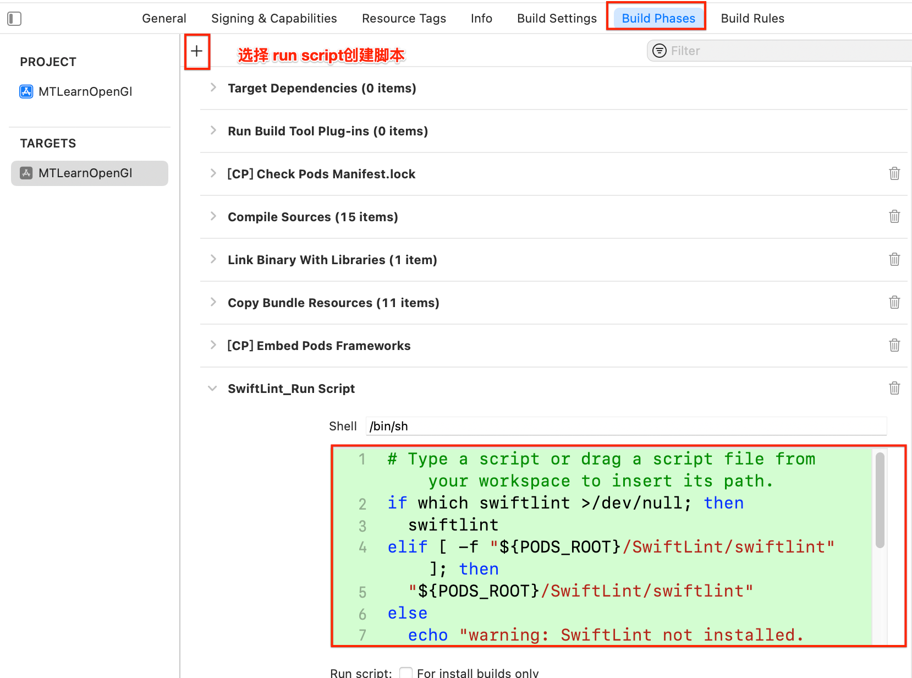
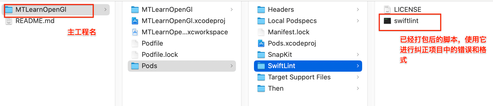

> <h1 id=""></h1>
- [**Swift代码规范**](#**Swift代码规范**)
	- [格式](#格式)
		- [类中的extension注意](#类中的extension注意)
		- [懒加载类扩展方法](#懒加载类扩展方法)
		- [函数参数长要换行](#函数参数长要换行)
		- [类后空一行再写代码](#类后空一行再写代码)
		- [属性懒加载多行调用方法](#属性懒加载多行调用方法)
		- [Project代码Review改正](#Project代码Review改正)
	- [注释规范](#注释规范)
		- [标志注释MARK](#标志注释MARK)
		- [枚举类别说明注释](#枚举类别说明注释)
	- [提交代码规范](#提交代码规范)
	- [**SwiftLint规范代码库**](#SwiftLint规范代码库)
		- [安装 ](#安装)
		- [配置文件](#配置文件) 
		- [警告报错处理](#警告报错处理) 
		- [命令自动纠正代码警告和错误](#命令自动纠正代码警告和错误)
- **资料**
	- [SwiftLint（代码规范库）](https://github.com/realm/SwiftLint)
	- [The Official Kodeco Swift Style Guide.](https://github.com/kodecocodes/swift-style-guide)
	- [Airbnb Swift Style Guide](https://github.com/airbnb/swift)
	- [Kodeco官方代码风格指南中文版(长期维护项目)](https://github.com/SwiftSIQI/swift-style-guide-by-kodeco-in-chinese)                                                                


**‌**

<br/>

***
<br/><br/><br/>

> <h1 id="Swift代码规范">Swift代码规范</h1>


<br/><br/><br/>

> <h2 id="格式">格式</h2>


<br/><br/><br/>

> <h2 id="类中的extension注意">类中的extension注意</h2>


- **类中的extension要注意：**
	- 比如若是懒加载的方法，若是可以一行就一行，若是不行直接通过调用某个方法来进行方法的赋值

```
 class AAController{
	/// 这里要放入一些基础的属性，属性要加上访问限制的权限，不要用默认的
	private var vFrame: CGRect = .zero
}

```

用扩展将代码组织成各个不同的功能逻辑块。每个扩展都应该添加` // MARK: - 注释符号`，以保证代码的结构清晰。

<br/><br/>

**协议一致性/Protocol Conformance**

**推荐（Preferred）‌**

```
class MyViewController: UIViewController {
  // class stuff here
}

// MARK: - UITableViewDataSource
extension MyViewController: UITableViewDataSource {
  // table view data source methods
}

// MARK: - UIScrollViewDelegate
extension MyViewController: UIScrollViewDelegate {
  // scroll view delegate methods
}
```

<br/>

**不推荐**

```
class MyViewController: UIViewController, UITableViewDataSource, UIScrollViewDelegate {
  // all methods
}
```

编译器不允许你在派生类中重新声明已经遵守的协议，因此可以在派生类中省略基类的扩展声明。这在派生类是一个终端类，且只有很少的方法需要重写的情况下是合理的。何时保留扩展声明将由开发者自行决定。

<br/><br/>

> <h2 id="懒加载类扩展方法">懒加载类扩展方法</h2>


- **懒加载类扩展方法**

对于一些比较多的懒加载方法，你可以专门用一个扩张类来写，比如：

```
extennsion AController {
	private lazy var picureName: String?
	
	// 若是这个变量需要多行代码才能生成，你可以调用某个方法来对其进行赋值
	// 变量的冒号后要加一个空格
	private lazy var filePathy: String = self.crateFilePath()
	
	
	
	private func crateFilePath() -> String {
		// 多行代码生成字符串路径
		// 。。。。
		// 。。。
	}
}
```

<br/><br/>
> <h2 id="函数参数长要换行">函数参数长要换行</h2>


<br/><br/>

> <h2 id="空格的添加"> 空格的添加 </h2>


- **判断else的空格添加**


<br/> <br/>

- **属性空格添加**

```
var bufferSize:GLsizeiptr{}

// 改过的
var bufferSize: GLsizeiptr {}
```

<br/><br/>

> <h2 id="类后空一行再写代码">类后空一行再写代码</h2>

新建一个类后，要换行再空一行后再写代码，不要换行后立马写代码


<br/><br/>

> <h2 id="属性懒加载多行调用方法">属性懒加载多行调用方法</h2>

对于类属性懒加载能写一行的就用一行，不能一行的就调用一个函数


- 套了两层无意义，可以直接赋值
- 这么长的内容，会大大降低可读性，不适合在属性区域； 建议通过函数封装后调用；


<br/><br/><br/>

> <h2 id="Project代码Review改正">Project代码Review改正</h2>


<br/><br/>

- **代码量短没必要换行写**

```
/// 图片名
var picName: String {
    picId + ".jpg"
}

// 修正后
var picName: String { picId + ".jpg"}
```


<br/><br/>

- **没有过多逻辑直接返回**

```
func deleteData(item: Object) -> Bool {
    self.items.removeAll { $0.picId == item.picId }
    let isSuccess = Repo.deleteImageFromDisk(item: item)
            
    return isSuccess
}
```

修改为：

```
func deleteData(item: Object) -> Bool {
    self.items.removeAll { $0.picId == item.picId }
            
    return Repo.deleteImageFromDisk(item: item)
}
```


<br/><br/>

- **guard的规范改正**

```
guard let rfObject = Expression.Object(JSON: dicData) else { return nil }
```

修改为：

```
guard 
    let rfObject = BPExpression.RFObject(JSON: dicData)
else { return nil }
```

要求`guard`和`‌else { return nil }`独占一行，中间每有一个独占一行


<br/><br/><br/>

> <h2 id="注释规范">注释规范</h2>

- **变量注释要在顶部说明并要加一个空格，不要在变量的后面加**

```
/// 顶点缓冲区, 注意: 加上文件访问标志
private var vertexBuffer = Glint = 0
```

<br/><br/>

- **属性、方法要用 `///` 注释 ，注意都要在`///`后加一个空格**

记得要加文件访问限制关键字

```
class superClass {
	/// 视图动画的frame, 变量的冒号后要加一个空格
	private frame: CGRect = .zero
}

/// 安装纹理
/// - Parameter fileName: 纹理文件名
 @discardableResult 
private func setupTexture(pictureName name: String) -> GLuint {

}
```


<br/><br/>

> <h2 id="标志注释MARK">标志注释MARK</h2>


用扩展将代码组织成各个不同的功能逻辑块。每个扩展都应该添加 `// MARK: - 注释符号`，以保证代码的结构清晰。


<br/><br/>

> <h2 id="枚举类别说明注释">枚举类别说明注释</h2>


- 尽量简化
- 注意注释格式


<br/><br/><br/>

> <h2 id=""></h2>

对一些封好的视图类最好要不要和ViewController放在一块，即使很简单，代码量很少，也不要放在一块，要新建一个类单独拎出来


<br/><br/><br/>

> <h2 id="提交代码规范">提交代码规范</h2>


- **提交git记录如： 【feature】边线，注意没有冒号**

```
【feature】添加了一个文件
```


<br/>

***
<br/><br/><br/>

># <h1 id="SwiftLint规范代码库">[SwiftLint规范代码库](https://github.com/realm/SwiftLint/blob/main/README_CN.md)</h1>

<br/><br/><br/>

> <h2 id="安装">安装</h2>


安装有几种，一个是通过`brew install swiftlint`安装，另一个通过`cocoapods`安装。这里我们通过`cocoapods`进行安装

```
pod 'SwiftLint', '0.57.0'
```

<br/>

**创建脚本**

```bash
if [ -f "${PODS_ROOT}/SwiftLint/swiftlint" ]; then
  "${PODS_ROOT}/SwiftLint/swiftlint"
else
  echo "warning: SwiftLint not installed in Pods. Please run 'pod install'."
fi


// 这个脚本是brew install swiftlint用的，如下：
if which swiftlint >/dev/null; then
  swiftlint
else
  echo “warning: SwiftLint not installed, download from https://github.com/realm/SwiftLint”
fi

```

如果你通过 **CocoaPods** 安装了 **SwiftLint**，那么它会被安装在项目的 `Pods` 目录中。因此，你需要在 **构建脚本** 中直接指定 `swiftlint` 的路径。你可以将路径 `${PODS_ROOT}/SwiftLint/swiftlint` 添加到脚本中。


- **`[ -f "${PODS_ROOT}/SwiftLint/swiftlint" ]`**：这个语句检查 SwiftLint 是否存在于 Pods 目录下。
- **`${PODS_ROOT}/SwiftLint/swiftlint`**：如果找到 SwiftLint 的路径，就执行它。
- **`echo "warning: ..."`**：如果找不到 SwiftLint，则输出警告信息，提醒开发者需要运行 `pod install`。

### 处理不同安装方式

如果你希望同时支持通过 CocoaPods 和 Homebrew 安装的 SwiftLint，脚本可以这样写：

```bash
if which swiftlint >/dev/null; then
  swiftlint
elif [ -f "${PODS_ROOT}/SwiftLint/swiftlint" ]; then
  "${PODS_ROOT}/SwiftLint/swiftlint"
else
  echo "warning: SwiftLint not installed. Please install it via Homebrew or CocoaPods."
fi
```

这个脚本首先检查 SwiftLint 是否通过 Homebrew 安装，如果没有找到，再检查是否通过 CocoaPods 安装。



<br/><br/><br/>

> <h2 id="配置文件">配置文件</h2>

[**腾讯翻译的SwiftLint规则**](https://cloud.tencent.com/developer/article/1617958)

```bash
pwd
/Users/ganghuang/HGFiles/GitHub/MTLearnOpenGL/MTLearnOpenGl

// 定位到主工程目录
ganghuang@bogon MTLearnOpenGl % ls
MTLearnOpenGl			Podfile
MTLearnOpenGl.xcodeproj		Podfile.lock
MTLearnOpenGl.xcworkspace	Pods

// 创建配置文件
ganghuang@bogon MTLearnOpenGl % touch .swiftlint.yml

// 打开配置文件
open .swiftlint.yml
```

<br/><br/>

`.swiftlint.yml`的配置如下：

```
excluded:  # 执行 linting 时忽略的路径。 优先级比 `included` 更高。
  - Pods # 忽略通过CocoaPods倒入的第三方库

  #- Source/ExcludedFolder       # 指定精确路径下的目录
  #- Source/ExcludedFile.swift   # 指定精确路径下的文件

disabled_rules: # 执行时排除掉的规则
  - identifier_name    # 命名规则必须按照驼峰原则，与后台传的Json字段命名冲突，建议排除掉
  - trailing_whitespace   # 每一个空行不能有空格，会与Xcode换行后自动对齐生成的空格冲突，建议排除掉

force_cast: warning # 类型判断
force_try: warning # try语句判断

cyclomatic_complexity: 20 #代码复杂度,默认为10

line_length:  # 单行代码长度,默认error 120
  warning: 120
  error: 200

file_length:  # 文件长度
  warning: 500
  error: 1200

function_body_length: # 函数体长度
  warning: 100
  error: 300
```

<br/>

**或者配置**

```
excluded:
  - Pods
disabled_rules:
    - trailing_whitespace # 每一个空行不能有空格，会与Xcode换行后自动对齐生成的空格冲突，建议排除掉加。
    - missing_docs # 缺失说明注释, 官方解释：”Public declarations should be documented.”， 公共声明应该被注释/标记。 在函数声明的时候， 一般情况下， 带public关键字的函数的注释只能用 “///”和 “/* /”来注释， 如果不带public关键字的函数只能用 “//”和 “/* */” 。这个属性应该禁用，没必要！！！
    - function_parameter_count # 函数参数计数违例:函数应该有5个参数，多余会报错 函数参数个数， 函数参数数量(init方法除外)应该少点， 不要太多，swiftlint规定函数参数数量超过5个给warning， 超过8个直接报error。这个属性推荐使用， 由于简单就不举例了。注：function_parameter_count: error 这样并不能改变它的警告或错误，该属性不允许修改，但是可以禁用
    - identifier_name   #命名规则必须按照驼峰原则（可能model中的某些字段与json字段命名冲突，建议排除掉）
    - type_name #类型命名规则限制,以大写字母开头，且长度在1到20个字符之间
    - shorthand_operator #使用+= ， -=， *=， /=  代替 a = a + 1
    - large_tuple #元祖成员 元组冲突:元组应该最多有2个成员，多余两个会报错
    - for_where #使用 `for where` 代替 简单的 `for { if }`
    - class_delegate_protocol #delegate protocol 应该被设定为 class-only,才能被弱引用
    - todo #避免 TODOs and FIXMEs 标识
cyclomatic_complexity: 20 #代码复杂度,默认为10
force_try: warning # try语句判断
force_cast: warning # 强制转换（代码中存在一些前面通过if判断过类型，后面做的强制转换的代码）
line_length:    #每行长度限制
  warning: 160
  error: 300
  ignores_function_declarations: true
  ignores_comments: true
file_length:    #文件长度
  warning: 1000
  error: 1500
function_body_length:   #函数体长度
  warning: 100
  error: 150
type_body_length:   #类的长度
  warning: 800
  error: 1200
```


<br/><br/>

**或者官方的范例**

```
disabled_rules: # 执行时排除掉的规则
  - colon
  - comma
  - control_statement
opt_in_rules: # 一些规则仅仅是可选的
  - empty_count
  - missing_docs
  # 可以通过执行如下指令来查找所有可用的规则:
  # swiftlint rules
included: # 执行 linting 时包含的路径。如果出现这个 `--path` 会被忽略。
  - Source
excluded: # 执行 linting 时忽略的路径。 优先级比 `included` 更高。
  - Carthage
  - Pods
  - Source/ExcludedFolder
  - Source/ExcludedFile.swift

# 可配置的规则可以通过这个配置文件来自定义
# 二进制规则可以设置他们的严格程度
force_cast: warning # 隐式
force_try:
  severity: warning # 显式
# 同时有警告和错误等级的规则，可以只设置它的警告等级
# 隐式
line_length: 110
# 可以通过一个数组同时进行隐式设置
type_body_length:
  - 300 # warning
  - 400 # error
# 或者也可以同时进行显式设置
file_length:
  warning: 500
  error: 1200
# 命名规则可以设置最小长度和最大程度的警告/错误
# 此外它们也可以设置排除在外的名字
type_name:
  min_length: 4 # 只是警告
  max_length: # 警告和错误
    warning: 40
    error: 50
  excluded: iPhone # 排除某个名字
variable_name:
  min_length: # 只有最小长度
    error: 4 # 只有错误
  excluded: # 排除某些名字
    - id
    - URL
    - GlobalAPIKey
reporter: "xcode" # 报告类型 (xcode, json, csv, checkstyle)
```

<br/><br/>

**swiftlint.yml关键字说明**

```
disabled_rules：禁用指定的规则

opt_in_rules：启动指定的规则

whitelist_rules：白名单规则，不能和上面两项混用

included：希望Lint检索的路径，SwiftLint会扫描该路径下的所有.swift后缀的文件

excluded: 希望不要检索的路径,SwiftLint会无视掉该路径下的文件，一般比如Pods、Carthage或者一些三方库
```


<br/><br/>

**swiftlint.yml配置文件的嵌套**

在我们使用.swift.yml配置文件的时候，如果在系统扫描的过程中发现了一个新的配置文件，那么子目录下的规则就会改为新的配置规则。

<br/><br/>

代码中若要禁用规则，需要首先拿到某个规则的 ID。全局安装的 Swift Lint 可以在 Terminal 输入 swiftlint rules 查看所有可获得的规则以及对应的 ID；未全局安装的 Swift Lint 也可以直接在警告或错误提示末尾的小括号中找到其对应的 ID。

**在代码中即可使用以下注释禁用或开启相应的规则。**

```
// 作用于该文件该行以下（除非遇到同一规则的 enable，disable）
// swiftlint:disable <rule1> [<rule2> <rule3>...]
// swiftlint:enable <rule1> [<rule2> <rule3>...]

// eg:
// swiftlint:disable trailing_whitespace vertical_whitespace
// swiftlint:enable trailing_whitespace

// 作用于下一（next），这一（this），上一（previous）行
// swiftlint:disable:next force_cast
let noWarning = NSNumber() as! Int
let hasWarning = NSNumber() as! Int
let noWarning2 = NSNumber() as! Int // swiftlint:disable:this force_cast
let noWarning3 = NSNumber() as! Int
// swiftlint:disable:previous force_cast
```


<br/><br/>

**swiftlint命令行介绍**

```
 --version               查看版本号
  -h, --help              帮助

SUBCOMMANDS:
  analyze                 执行规则分析
  docs                    浏览器打开swiftlint规则官网
  generate-docs           为所有规则生成markdown文件
  lint (default)          打印警告和错误
  rules                   显示所有规则
  version                 显示版本号
  autocorrect             将已知的能够自动修复的Error和Warning都自动修复，一般旧的项目配置SwiftLint之后会出现大量的报错和警告，此命令可减少大部分工作量)
```


<br/><br/><br/>

> <h2 id="警告报错处理">警告报错处理</h2>


```
Attribute Name Spacing Violation: @escaping must have a trailing space before the associated type (attribute_name_spacing) 

错误
```


这个警告来自 **SwiftLint**，它提示你在使用 `@escaping` 时，属性和类型之间需要有一个空格。根据 Swift 的语法和 **SwiftLint** 规则，属性（如 `@escaping`）后面应该紧跟一个空格，确保代码的可读性。

### 例子

#### 错误的写法

```swift
func someFunction(completion: @escaping(String) -> Void) {
    // ...
}
```

#### 正确的写法
```swift
func someFunction(completion: @escaping (String) -> Void) {
    // ...
}
```

注意这里 `@escaping` 和类型 `(String) -> Void` 之间需要有一个空格。

### 如何解决

只需要确保 `@escaping` 和后面的闭包类型之间有空格。你可以手动修改代码，或者使用 SwiftLint 自动修复功能：

```bash
swiftlint autocorrect
```

这将自动修复代码中与 SwiftLint 规则不符合的地方，包括 `@escaping` 的空格问题。

### 总结

要解决这个问题，确保 `@escaping` 后面紧跟一个空格再接闭包类型。如果有多处需要修改，可以使用 SwiftLint 的自动修复功能。

<br/><br/><br/>

> <h2 id="命令自动纠正代码警告和错误">命令自动纠正代码警告和错误</h2>

若是一个一个来进行纠正别人的和自己的代码，那自己的也不用写了。根本就没有办法做嘛。

下面仅仅仅针对使用cocoapods接入项目中的，其他的请自行搜索




cd到当前的工程目录中：

```
cd /Users/ganghuang/HGFiles/GitHub/MTLearnOpenGL/MTLearnOpenGl
```

查看我们需要哪个命令进行纠正和修复，查询用到的命令：

```
"./Pods/SwiftLint/swiftlint" lint --help             
OVERVIEW: Print lint warnings and errors

USAGE: swiftlint lint [<options>] [<paths> ...]

ARGUMENTS:
  <paths>                 List of paths to the files or directories to lint.

OPTIONS:
  --config <config>       The path to one or more SwiftLint configuration files,
                          evaluated as a parent-child hierarchy.
  --fix, --autocorrect    Correct violations whenever possible.
  --format                Should reformat the Swift files using the same mechanism
                          used by Xcode (via SourceKit).
                          Only applied with `--fix`/`--autocorrect`.
  --use-alternative-excluding
                          Use an alternative algorithm to exclude paths for
                          `excluded`, which may be faster in some cases.
  --use-script-input-files
                          Read SCRIPT_INPUT_FILE* environment variables as files.
  --strict                Upgrades warnings to serious violations (errors).
  --lenient               Downgrades serious violations to warnings, warning
                          threshold is disabled.
  --force-exclude         Exclude files in config `excluded` even if their paths are
                          explicitly specified.
  --benchmark             Save benchmarks to `benchmark_files.txt` and
                          `benchmark_rules.txt`.
  --reporter <reporter>   The reporter used to log errors and warnings.
  --baseline <baseline>   The path to a baseline file, which will be used to filter
                          out detected violations.
  --write-baseline <write-baseline>
                          The path to save detected violations to as a new baseline.
  --working-directory <working-directory>
                          The working directory to use when running SwiftLint.
  --output <output>       The file where violations should be saved. Prints to stdout
                          by default.
  --progress              Show a live-updating progress bar instead of each file
                          being processed.
  --check-for-updates     Check whether a later version of SwiftLint is available
                          after processing all files.
  --use-stdin             Lint standard input.
  --quiet                 Don't print status logs like 'Linting <file>' & 'Done
                          linting'.
  --silence-deprecation-warnings
                          Don't print deprecation warnings.
  --cache-path <cache-path>
                          The directory of the cache used when linting.
  --no-cache              Ignore cache when linting.
  --enable-all-rules      Run all rules, even opt-in and disabled ones, ignoring
                          `only_rules`.
  --only-rule <only-rule> Run only the specified rule, ignoring `only_rules`,
                          `opt_in_rules` and `disabled_rules`.
  --version               Show the version.
  -h, --help              Show help information.

```

**开始纠正工程中出现的警告** 

用到的命令参数是： `‌--fix, --autocorrect    Correct violations whenever possible.`

```
ganghuang@bogon MTLearnOpenGl % "./Pods/SwiftLint/swiftlint" --autocorrect ./MTLearnOpenGl  

yramid/PyramidController01.swift: Corrected Vertical Whitespace
Done correcting 15 files!   
```

几秒钟的工夫整个工程的代码都给你纠正好了，牛批！🤣哈哈


