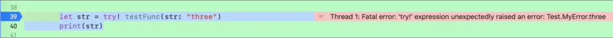

> <h2 id=''></h2>
- [**构造方法**](#构造方法)
- [**属性**](#属性)
	- [属性包装器](#属性包装器)
	- [属性包装器中的 `projectedValue`（呈现值）](#属性包装器中的projectedValue呈现值)
	- [BleDeviceModel数据模型的属性包装器](#BleDeviceModel数据模型的属性包装器)
	- [@UserDefault属性包装器](#@UserDefault属性包装器)
- [**数组**](#数组)
	- [一个数组对象元素id和另一个数组对象中的ProductNo相等后，将其对象属性赋值给另一个对象属性](#一个数组对象元素id和另一个数组对象中的ProductNo相等后，将其对象属性赋值给另一个对象属性)
	- [数组的compactMap和filter使用](#数组的compactMap和filter使用)
	- [数组map、first方法详解](#数组map、first方法详解)
	- [`contains(where:)`使用](#contains_where使用)
	- [`first(where:)`使用 ](#first_where使用)
- [Dictionary](#Dictionary)
	- [按指定字段分组](#按指定字段分组)
- [**类**](#类)
	- [流式API](#流式API)
- [**值引用类型**](#值引用类型)
	- [**引用类型**](#引用类型)
		- [引用类型使用intout参数，意义不大](#引用类型使用intout参数，意义不大)
		- [使用intout注意事项](#使用intout注意事项)
		- [inout 参数不能有默认值，不能为可变参数](#inout参数不能有默认值，不能为可变参数)
		- [inout 参数传递过程](#inout参数传递过程)
	- [**嵌套类型**](#嵌套类型)
		- [值类型嵌套值类型](#值类型嵌套值类型)
		- [值类型嵌套引用类型](#值类型嵌套引用类型)
		- [引用类型嵌套值类型](#引用类型嵌套值类型)
- [**枚举**](#枚举)
	- [枚举原始值](#枚举原始值)
	- [枚举关联值](#枚举关联值)
	- [枚举范型调用](#枚举范型调用)
	- [枚举运算](#枚举运算)
	- [二进制枚举位移掩码原理细解](#二进制枚举位移掩码原理细解)
	- [位移掩码枚举代码落实](#位移掩码枚举代码落实) 
	- [不同位移掩码枚举类型转换](#不同位移掩码枚举类型转换)
	- [主枚举包含多个子枚举](#主枚举包含多个子枚举)
	- [字符串转枚举](#字符串转枚举)
	- [状态机枚举使用](#状态机枚举使用)
- [**结构体**](#结构体)
	- [OC对象转换成结构体](#OC对象转换成结构体)
- [**集合**](#集合)
	- [Set集合与NSArray、Dictionary区别](#Set集合与NSArray、Dictionary区别)
	- [enumerated（）集合(如数组、字典、集合等)遍历](#enumerated（）集合(如数组、字典、集合等)遍历)
	- [compactMap-数组元素进行映射和过滤，去除nil元素](#compactMap-数组元素进行映射和过滤，去除nil元素)
- [**函数**](#函数)
	- [**函数使用**](#函数使用)
	- [内部参数和外部参数](#内部参数和外部参数)
	- [默认参数](#默认参数)
	- [判断是否为空](#判断是否为空)
	- [可变参数](#可变参数)
	- [引用类型（指针传递）](#引用类型（指针传递）)
	- [map和flatMap区别](#map和flatMap区别)
- [**函数作为参数**](#函数作为参数)
	- 	[函数可以作为另一个函数的返回值](#函数可以作为另一个函数的返回值)
	- 	[函数也可以当做参数传入另一个函数](#函数也可以当做参数传入另一个函数)
- [**闭包**](#闭包)
	- [**闭包变量**](#闭包变量)
	- [**闭包参数**](#闭包参数)
	- [**闭包捕获**](#闭包捕获)
	- [**闭包的柯西特性**](#闭包的柯西特性)
	- [立即执行闭包](#立即执行闭包)
	- [类似RxSwift数据转换](#类似RxSwift数据转换)
- [**异常**](#异常)
	- [throwing函数](#throwing函数)
	- [**三者区别**](#三者区别)
		- [try? 的使用](#try?的使用)
		-	[try!](#try!)
		-	[try](#try)
	-	[**泛型协议**](#泛型协议)
		-	[泛型](#泛型)
			-	[范型的高级使用-类型擦除](#范型的高级使用-类型擦除)
				-	[协议擦除](#协议擦除)
				-	[范型擦除](#范型擦除)
			-	[处理2种数据类型的范型-RxSwift的Signal](#处理2种数据类型的范型-RxSwift的Signal)
			-	[where约束和范型联合使用实践(可以加深理解)](./../ProjectDesc/mtbp.md#关键字where约束和范型的联合)
	-	[**协议**](#协议)
		-	[NSObjectProtocol协议](#NSObjectProtocol协议)
		-	[Sequence协议](#Sequence协议)
		-	[AsyncSequence 协议](#AsyncSequence协议)
-	[**并发**](#并发)
	-	**资料**
		-	[Swift并发体验](https://juejin.cn/post/7054058830304870414)
	-	[异步函数定义](#异步函数定义)
		- [异步函数掉用流程](#异步函数掉用流程)
		- [异步序列](#异步序列)
		- [并行的调用异步方法](#并行的调用异步方法)
		- [非结构化并发](#非结构化并发)
- **参考资料**
	- [Swift下如何使用#if条件编译](https://blog.csdn.net/guoxulieying/article/details/134665622)
	- [**swift的值类型和引用类型**](https://www.cnblogs.com/luoxiaofu/p/8528383.html)
	- [**枚举由浅入深**](https://blog.csdn.net/qq_34047841/article/details/78489380)
	- [**自定义写UIViewController的初始化方法**](https://www.jianshu.com/p/433afbb0f510)
	- [**初始化说起**](https://www.jianshu.com/p/fb1a91600468)
	- [Swift的init方法](https://www.jianshu.com/p/61fb73de4fcd)
	- [**@autoclosure自动闭包**](https://juejin.cn/post/6844903424413138958)
	- [闭包](https://zhuanlan.zhihu.com/p/92464947)
	- [Swift 中的协议、泛型、不透明类型](https://zzzw.cool/Swift-中的协议)
	- [Swift 性能优化(1)——基本概念(楚权的世界)](http://chuquan.me/2020/02/15/swift-performance-optimization-basic-concepts/)


<br/><br/><br/>

***
<br/>

> <h1 id="构造方法">构造方法</h1>

在 Swift 中，构造方法（初始化方法）用于在创建对象时进行初始化。构造方法有多种类型，主要包括：

1. **默认构造器** (Default Initializer)
2. **自定义构造器** (Custom Initializer)
3. **便利构造器** (Convenience Initializer)
4. **指定构造器** (Designated Initializer)
5. **继承构造器** (Inherited Initializer)
6. **要求构造器** (Required Initializer)
7. **聚合构造器** (Failable Initializer)

### 1. **默认构造器** (Default Initializer)
如果你没有显式定义构造器，Swift 会提供一个默认的构造器。默认构造器会为所有存储属性提供默认值，或者让它们具有初始值。

#### 示例：
```swift
class Person {
    var name: String
    var age: Int
    
    // Swift会自动生成默认构造器
}
let person = Person() // 自动提供
```

### 2. **自定义构造器** (Custom Initializer)
你可以手动定义初始化方法，用于初始化类或结构体的实例。自定义构造器允许你初始化对象并对属性进行配置。

#### 示例：
```swift
class Person {
    var name: String
    var age: Int
    
    // 自定义构造器
    init(name: String, age: Int) {
        self.name = name
        self.age = age
    }
}

let person = Person(name: "John", age: 30)
```

### 3. **便利构造器** (Convenience Initializer)
便利构造器是类中的辅助构造器，用于简化初始化过程。它通常用于提供更简洁的初始化方法，或者为已有构造器提供默认值。便利构造器需要调用指定构造器（`designated initializer`）。

#### 特点：
- 需要使用 `convenience` 关键字
- 必须调用同一类中的指定构造器（`designated initializer`）

#### 示例：
```swift
class Person {
    var name: String
    var age: Int
    
    // 指定构造器
    init(name: String, age: Int) {
        self.name = name
        self.age = age
    }
    
    // 便利构造器
    convenience init(name: String) {
        self.init(name: name, age: 18) // 默认年龄
    }
}

let person1 = Person(name: "John", age: 30)
let person2 = Person(name: "Alice") // 便利构造器
```

### 4. **指定构造器** (Designated Initializer)
指定构造器是类中的主要构造器，负责为类的所有属性赋初始值，并调用父类的构造器。每个类都有一个指定构造器，它可以是直接定义的，也可以由父类提供。

#### 示例：
```swift
class Animal {
    var name: String
    
    init(name: String) {
        self.name = name
    }
}

class Dog: Animal {
    var breed: String
    
    // Dog 的指定构造器
    init(name: String, breed: String) {
        self.breed = breed
        super.init(name: name) // 调用父类构造器
    }
}
```

### 5. **继承构造器** (Inherited Initializer)
子类可以继承父类的构造器。继承的构造器可以是指定构造器，也可以是便利构造器。你可以重写这些构造器以适应子类的需求。

#### 示例：
```swift
class Animal {
    var name: String
    
    init(name: String) {
        self.name = name
    }
}

class Dog: Animal {
    var breed: String
    
    // 继承父类的构造器
    init(name: String, breed: String) {
        self.breed = breed
        super.init(name: name)
    }
}
```

### 6. **要求构造器** (Required Initializer)
`required` 构造器是指子类必须实现的构造器。任何继承该类的子类都必须实现该构造器。

#### 示例：
```swift
class Animal {
    var name: String
    
    // 需要子类必须实现的构造器
    required init(name: String) {
        self.name = name
    }
}

class Dog: Animal {
    var breed: String
    
    // 子类必须实现父类的 required 构造器
    required init(name: String) {
        self.breed = "Unknown"
        super.init(name: name)
    }
}
```

### 7. **聚合构造器** (Failable Initializer)
聚合构造器允许你在初始化过程中失败。它返回一个可选类型的实例，如果初始化失败，构造器返回 `nil`。常用于初始化可能失败的场景，例如加载数据时遇到错误。

#### 示例：
```swift
class Person {
    var name: String
    var age: Int
    
    // 聚合构造器
    init?(name: String, age: Int) {
        guard !name.isEmpty else { return nil }
        self.name = name
        self.age = age
    }
}

if let person = Person(name: "John", age: 30) {
    print("初始化成功")
} else {
    print("初始化失败")
}
```

### 总结与区别：

| 构造器类型           | 说明                                                         |
|----------------------|--------------------------------------------------------------|
| 默认构造器           | 自动生成，适用于所有存储属性都有默认值的情况。                |
| 自定义构造器         | 由开发者手动定义，提供灵活的初始化方式。                      |
| 便利构造器           | 辅助构造器，用于简化初始化过程，必须调用指定构造器。           |
| 指定构造器           | 类的主要构造器，负责初始化所有属性，可能会调用父类构造器。     |
| 继承构造器           | 子类可以继承父类构造器。                                     |
| 要求构造器           | 子类必须实现的构造器，确保继承类具备该构造器。               |
| 聚合构造器（Failable）| 初始化可能失败，返回可选类型 `nil`。                        |

通过不同的构造方法，你可以根据需求选择最合适的初始化方式来确保对象创建的安全性和灵活性。


***
<br/><br/><br/>
> <h2 id="BleDeviceModel数据模型的属性包装器">BleDeviceModel数据模型的属性包装器</h2>

Swift 的 **属性包装器（Property Wrapper）** 适合这种场景，比如：

* 给属性一个默认值
* 自动进行合法化（比如 RSSI 范围限定）
* 自动持久化（比如存到 `UserDefaults`）
* 控制只读属性

---

**1.定义几个常用包装器**

```swift
import Foundation

/// 提供默认值
@propertyWrapper
struct Default<Value> {
    private var value: Value
    private let defaultValue: Value
    
    init(wrappedValue: Value) {
        self.value = wrappedValue
        self.defaultValue = wrappedValue
    }
    
    var wrappedValue: Value {
        get { value }
        set { value = newValue }
    }
}

/// RSSI 包装器（限制范围）
@propertyWrapper
struct RSSIValue {
    private var value: Int?
    
    var wrappedValue: Int? {
        get { value }
        set {
            if let rssi = newValue, (-100...0).contains(rssi) {
                value = rssi
            } else {
                value = nil // 超出范围则置空
            }
        }
    }
    
    init(wrappedValue: Int?) {
        self.wrappedValue = wrappedValue
    }
}

/// 只读包装器
@propertyWrapper
struct Readonly<Value> {
    private var value: Value
    
    init(wrappedValue: Value) {
        self.value = wrappedValue
    }
    
    var wrappedValue: Value {
        get { value }
    }
}
```

<br/>

**2.应用到 `BleDeviceModel`**

```swift
import CoreBluetooth

struct BleDeviceModel: Codable {
    /// 蓝牙外设对象（不编码）
    var peripheral: CBPeripheral? = nil
    
    /// 蓝牙名称
    @Default("") var name: String
    
    /// 信号强度（自动校验范围）
    @RSSIValue var rssi: Int?
    
    /// UUID
    @Default("") var uuid: String
    
    /// 唯一标识符
    @Default("") var uid: String
    
    /// 是否已注册绑定（只读）
    @Readonly(false) var isRegistered: Bool
    
    /// 是否操作（Solicited，只读）
    @Readonly(false) var isSolicited: Bool
    
    /// 是否可绑定（只读）
    @Readonly(false) var isEnableBind: Bool
    
    /// mac 地址
    @Default("") var macAddr: String
    
    /// 是否连接
    @Default(false) var isConnect: Bool
    
    /// 流程状态（只读）
    @Readonly(0) var processStatus: UInt8
    
    /// 产品 ID（只读）
    @Readonly(0) var productId: Int
    
    enum CodingKeys: String, CodingKey {
        case name, rssi, uuid, uid, isRegistered, isSolicited,
             isEnableBind, macAddr, isConnect, processStatus, productId
    }
}
```

<br/>

**3.使用示例**

```swift
var device = BleDeviceModel()
device.name = "MyDevice"
device.rssi = -60   // ✅ 合法
device.rssi = -120  // ❌ 超出范围 -> 自动变成 nil

print(device.name)       // "MyDevice"
print(device.rssi)       // Optional(-60)
print(device.isRegistered) // false（只读）
```

<br/>

这样，你就能通过属性包装器：

* `@Default` → 给属性提供默认值，避免 nil
* `@RSSIValue` → 自动校验数值范围
* `@Readonly` → 在模型外部不可修改


***
<br/><br/><br/>
> <h2 id="@UserDefault属性包装器">@UserDefault属性包装器</h2>

写一个通用的 `@UserDefault` 属性包装器，让属性和 **`UserDefaults`** 自动绑定，读写属性就等于读写持久化存储。

---
<br/>

**通用实现**

```swift
import Foundation

@propertyWrapper
public struct UserDefault<Value> {
    private let key: String
    private let defaultValue: Value
    private let container: UserDefaults
    
    public init(_ key: String, defaultValue: Value, container: UserDefaults = .standard) {
        self.key = key
        self.defaultValue = defaultValue
        self.container = container
    }
    
    public var wrappedValue: Value {
        get {
            return container.object(forKey: key) as? Value ?? defaultValue
        }
        set {
            container.set(newValue, forKey: key)
        }
    }
}
```

<br/>

**使用示例**

比如在 `BleDeviceModel` 里希望 **`macAddr`** 永久保存：

```swift
public struct BleDeviceModel {
    public var name: String?
    public var rssi: Int?
    
    @UserDefault("macAddr", defaultValue: "")
    public var macAddr: String
}
```

<br/>

这样使用：

```swift
var device = BleDeviceModel()
device.macAddr = "11:22:33:44:55:66"   // ✅ 自动写入 UserDefaults

print(device.macAddr)  // ✅ 下次重启 App 还能拿到
```

---
<br/>

**🚀 进阶（支持 `Codable` 对象）**

若想保存的不是 `String/Int/Bool`，而是自定义模型，可以扩展为 **支持 `Codable`**：

```swift
@propertyWrapper
public struct CodableUserDefault<Value: Codable> {
    private let key: String
    private let defaultValue: Value
    private let container: UserDefaults
    
    public init(_ key: String, defaultValue: Value, container: UserDefaults = .standard) {
        self.key = key
        self.defaultValue = defaultValue
        self.container = container
    }
    
    public var wrappedValue: Value {
        get {
            guard let data = container.data(forKey: key) else { return defaultValue }
            return (try? JSONDecoder().decode(Value.self, from: data)) ?? defaultValue
        }
        set {
            let data = try? JSONEncoder().encode(newValue)
            container.set(data, forKey: key)
        }
    }
}
```

这样就可以持久化整个 `BleDeviceModel` 或者别的 `Codable` 模型。


<br/><br/><br/>

***
<br/>

> <h1 id="数组">数组</h1>


***
<br/>
> <h2 id="一个数组对象元素id和另一个数组对象中的ProductNo相等后，将其对象属性赋值给另一个对象属性">一个数组对象元素id和另一个数组对象中的ProductNo相等后，将其对象属性赋值给另一个对象属性</h2>

**数据结构对象：**

```swift
public struct DeviceProductInfo {
    var productNo: String
    var name: String
    var icon: String
}

public struct DeviceCategoryInfo {
    var id: Int
    var title: String
}

public struct DeviceProductSection {
    var section: DeviceCategoryInfo
    var items: [DeviceProductInfo]
}

public class SurroundingDeviceViewModel {
    var productId: String
    var displayName: String = ""
    var iconUrl: String = ""
    
    init(productId: String) {
        self.productId = productId
    }
}

```

<br/>

**匹配对应：**

```swift
func mapDeviceInfoToViewModelsFast(
    dataModels: [DeviceProductSection],
    surroundingDevices: [SurroundingDeviceViewModel]
) {
    // 建立 productNo -> DeviceProductInfo 映射表
    let productMap = dataModels
        .flatMap { $0.items }
        .reduce(into: [String: DeviceProductInfo]()) { result, product in
            result[product.productNo] = product
        }
    
    for viewModel in surroundingDevices {
        if let product = productMap[viewModel.productId] {
            viewModel.displayName = product.name
            viewModel.iconUrl = product.icon
        }
    }
}

```

- **总结**
	- 使用 flatMap 将嵌套数组拉平
	- 用 first(where:) 或 Dictionary 匹配更高效
	- 赋值时直接对 ViewModel 成员进行设置

<br/>

```swift
let productMap = dataModels
    .flatMap { $0.items }
    .reduce(into: [String: DeviceProductInfo]()) { result, product in
        result[product.productNo] = product
    }
```

**作用：**
&emsp; 从 dataModels 中提取出所有的 DeviceProductInfo，然后把它们按照 productNo 建立成一个字典，方便后续通过 productNo 快速查找。


当然可以，这行代码比较浓缩，我们来 **分段解释** 并给出 **简单例子** 来帮助你理解。

<br/><br/>

**1.`dataModels.flatMap { $0.items }`**

```swift
let dataModels = [
    DeviceProductSection(section: ..., items: [p1, p2]),
    DeviceProductSection(section: ..., items: [p3])
]
```

执行 `flatMap { $0.items }` 后：

```swift
let allProducts = [p1, p2, p3]  // 展平成一个数组
```

<br/>

**2.`.reduce(into: [:]) { result, product in ... }`**

这一步是将 `[DeviceProductInfo]` 转成字典：

```swift
var result: [String: DeviceProductInfo] = [:]
for product in allProducts {
    result[product.productNo] = product
}
```

<br/>

最终结果是：

```swift
[
  "abc123": DeviceProductInfo(productNo: "abc123", ...),
  "def456": DeviceProductInfo(productNo: "def456", ...)
]
```

<br/>

假设我们有这个结构：

```swift
struct DeviceProductInfo {
    let productNo: String
    let name: String
}

struct DeviceProductSection {
    let section: String
    let items: [DeviceProductInfo]
}
```

<br/>

然后这样用：

```swift
let dataModels = [
    DeviceProductSection(section: "A", items: [
        DeviceProductInfo(productNo: "p1", name: "灯泡"),
        DeviceProductInfo(productNo: "p2", name: "空调")
    ]),
    DeviceProductSection(section: "B", items: [
        DeviceProductInfo(productNo: "p3", name: "风扇")
    ])
]
```


<br/>

使用那一行代码：

```swift
let productMap = dataModels
    .flatMap { $0.items }
    .reduce(into: [String: DeviceProductInfo]()) { result, product in
        result[product.productNo] = product
    }
```


<br/>

最终 `productMap` 是这个字典：

```swift
[
    "p1": DeviceProductInfo(productNo: "p1", name: "灯泡"),
    "p2": DeviceProductInfo(productNo: "p2", name: "空调"),
    "p3": DeviceProductInfo(productNo: "p3", name: "风扇")
]
```

<br/>

这样你就可以通过：

```swift
let fan = productMap["p3"]
```

快速拿到风扇信息了。

<br/>

**最后经过修改最终的代码：**

```swift
// 假设你已有的模型
public struct DeviceProductInfo {
    public var productNo: Int?
    public var name: String
}

public struct DeviceProductSection {
    var section: String
    var items: [DeviceProductInfo]
}

// 示例数据
let dataModels: [DeviceProductSection] = [
    .init(section: "A", items: [
        .init(productNo: 101, name: "A1"),
        .init(productNo: nil, name: "A2")
    ]),
    .init(section: "B", items: [
        .init(productNo: 202, name: "B1")
    ])
]

// 构建映射关系：productNo => DeviceProductInfo
let productMap = dataModels
    .flatMap { $0.items } // ✅ 这一行必须返回数组
    .compactMap { product -> (Int, DeviceProductInfo)? in
        guard let no = product.productNo else { return nil }
        return (no, product)
    }
    .reduce(into: [Int: DeviceProductInfo]()) { result, pair in
        let (no, product) = pair
        result[no] = product
    }

print(productMap)
```


***
<br/><br/><br/>
> <h2 id="数组的compactMap和filter使用">数组的compactMap和filter使用</h2>

 **1) 概念速览**

* `compactMap`：对序列中的每个元素执行闭包，闭包返回可选（`T?`）。`compactMap` 会把非 `nil` 的结果收集成新的数组，自动去掉 `nil` —— 常用来把 `String` 转为 `Enum?` 并移除无法转换的项。
* `filter`：对序列中的每个元素执行布尔闭包，返回 `true` 的元素保留，`false` 的元素丢弃。

<br/>

**2)示例**

```swift
let arr = ["1", "2", "three", "4"]

// compactMap：把字符串转成 Int，转换失败的会变成 nil，compactMap 会丢弃 nil
let ints = arr.compactMap { Int($0) }
print(ints) // [1, 2, 4]

// filter：只保留偶数
let evens = ints.filter { $0 % 2 == 0 }
print(evens) // [2, 4]
```

<br/>

**3) 组合使用**

情形：外部传来 `ways: [String]`，想把能转成 `ProvisioningMethod` 的项保留下来，并且只保留 App 支持的那些枚举。

先定义枚举（你之前的）：

```swift
enum ProvisioningMethod: String {
    case ap = "AP"
    case wired = "WN"
    case ble = "BLUETOOTH"

    static var supportedMethods: [ProvisioningMethod] {
        return [.ap, .wired, .ble]
    }
}
```

<br/>

**方法 A：先 `compactMap` 再 `filter`（常见）**

```swift
let ways = ["BLUETOOTH", "WN", "SN"]

let methods = ways
    .compactMap { str -> ProvisioningMethod? in
        return ProvisioningMethod(rawValue: str)
    }
    .filter { ProvisioningMethod.supportedMethods.contains($0) }

print(methods) // [.ble, .wired]
```

解释：

* `compactMap` 把 `"SN"` 无法转成枚举，会返回 `nil`，被丢弃。
* `filter` 再确保这些枚举在 `supportedMethods` 中（此例都在，所以都保留）。

<br/>

**方法 B：先 `filter`（字符串上过滤）再 `compactMap`（减少枚举创建）**

```swift
let supportedRawValues = Set(ProvisioningMethod.supportedMethods.map { $0.rawValue }) // {"AP","WN","BLUETOOTH"}

let methods2 = ways
    .filter { supportedRawValues.contains($0) }         // 先把不在 supportedRawValues 的字符串去掉（减少后续工作）
    .compactMap { ProvisioningMethod(rawValue: $0) }    // 然后再转成枚举

print(methods2) // [.ble, .wired]
```

优点：如果 `ways` 很大、并且大多数字符串是不支持的，用 `filter` 先淘汰不必要的字符串可以避免大量失败的枚举构造，提高性能。

<br/>

 **4) 顺序重要吗？什么时候先 `filter` 更好？**

* **正确性**：在大多数场景，`compactMap` → `filter` 与 `filter` → `compactMap` 得到的最终结果一致（如果 `filter` 的判断只基于已转换后的枚举或基于原始字符串的支持集合）。
* **性能**：如果 `ways` 很大，且 `ProvisioningMethod(rawValue:)` 的开销不算极小，或 `supported` 集合可以用字符串比较快速筛掉大量不相关项时，先对字符串做 `filter`（使用 `Set`）通常更快。
* **可读性**：`compactMap` → `filter` 更直观（先把不可转换的去掉，再做业务过滤）；`filter` → `compactMap` 更高效但需要先准备 `supportedRawValues`。

<br/>

**5) 给出的那行代码的正确写法（完整闭包样式）**

```swift
return ways.compactMap { LinkWayType(rawValue: $0) in
            
}
```

这是不正确的写法（`compactMap` 的闭包要返回一个可选值）。正确的完整闭包写法如下：

```swift
return ways.compactMap { str -> LinkWayType? in
    // 这里可以写复杂逻辑，然后 return 枚举或 nil
    return LinkWayType(rawValue: str)
}
.filter { LinkWayType.supportWays.contains($0) }
```

<br/>

如果你想用更紧凑的一行写法：

```swift
return ways.compactMap { LinkWayType(rawValue: $0) }
            .filter { LinkWayType.supportWays.contains($0) }
```

<br/>

或按性能优化（先字符串过滤再映射）：

```swift
let supportedValues = Set(LinkWayType.supportWays.map { $0.rawValue })
return ways.filter { supportedValues.contains($0) }
           .compactMap { LinkWayType(rawValue: $0) }
```

<br/>

**6) 与 `isAppSupported` 结合的完整示例（实用版）**

```swift
enum LinkWayType: String {
    case none = "None"
    case ap = "AP"
    case wired = "WN"
    case ble = "BLUETOOTH"
    case wifi = "WIFI"
    case sn = "SN"

    static var supportWays: [LinkWayType] { [.ap, .wired, .ble] }
}

func isAppSupported(_ way: LinkWayType) -> Bool {
    // 假设低版本不支持 wired
    if way == .wired { return false }
    return true
}

func supportedWaysFromDevice(ways: [String]) -> [LinkWayType] {
    // 推荐：字符串先过滤（快速）→ 再转换成枚举 → 再用 isAppSupported 过滤
    let supportedRaw = Set(LinkWayType.supportWays.map { $0.rawValue })

    return ways
        .filter { supportedRaw.contains($0) }              // 先把不在 app 支持 raw 值的字符串去掉
        .compactMap { LinkWayType(rawValue: $0) }         // 再转换成枚举（不会 nil）
        .filter { isAppSupported($0) }                    // 最终排除 app 版本不支持的枚举
}

// 使用
let device = ["BLUETOOTH", "WN", "SN"]
let final = supportedWaysFromDevice(ways: device)
print(final) // 结果可能只是 [.ble]，因为 .wired 被 isAppSupported 拒绝
```

<br/>

**总结（实用建议）**

- 1.当你需要把字符串转换为枚举并去掉无法转换的项，使用 `compactMap`。
- 2.当你需要基于某个条件筛选元素，使用 `filter`。
- 3.若关心性能：若能在字符串层面用 `Set` 快速剔除大量不可能的项，先 `filter`（字符串）再 `compactMap`（枚举）通常更快。
- 4.可读性：先 `compactMap` 再 `filter` 写法更直观，适合数据量小或清晰展示逻辑。
- 5.你给的那行代码应改成 `compactMap { str -> LinkWayType? in return LinkWayType(rawValue: str) }` 或直接 `compactMap { LinkWayType(rawValue: $0) }`，然后链 `filter`。


***
<br/><br/><br/>
> <h2 id="数组map、first方法详解">数组map、first方法详解</h2>


**`map` 是什么？**

> **对数组中的每一个元素做处理，并返回一个新的数组**

像“批量加工”。

<br/>

例子：所有数字 * 2

```swift
let numbers = [1, 2, 3]
let doubled = numbers.map { $0 * 2 }
print(doubled)  // [2, 4, 6]
```

📌含义：

| 原数组 | 处理后 |
| --- | --- |
| 1   | 2   |
| 2   | 4   |
| 3   | 6   |

<br/>

**例子：提取对象中的字段**

```swift
struct User { let name: String }

let users = [User(name: "Tom"), User(name: "Jerry")]
let names = users.map { $0.name }
print(names)  // ["Tom", "Jerry"]
```
<br/>

**`first(where:)` 是什么？**

> 在数组里 **找到第一个满足条件的元素**（找不到返回 nil）

像“从名单里找人”。

<br/>

**📌例子：查找大于 3 的第一个数**

```swift
let numbers = [1, 2, 4, 3, 5]
let result = numbers.first(where: { $0 > 3 })
print(result) // 4
```

<br/>

**📌例子：查找指定 id 的设备**

```swift
struct Device { let id: Int }

let list = [Device(id: 1), Device(id: 2)]
let match = list.first(where: { $0.id == 2 })
print(match?.id ?? "Not found") // 2
```

<br/>

```swift
return list.map { element in
    if let match = data.first(where: { $0.iotId == element.iotId }) {
        return match  // 找到了 → 用 data 的新数据替换
    }
    return element    // 找不到 → 原样返回
}
```

📌逻辑总结：

* `map`：对 `list` 每个设备进行更新检查
* `first(where:)`：查找 `data` 中是否有对应的更新数据

---

# 🎯直观理解表格

| 方法              | 作用         | 输入 | 输出      | 常用场景               |
| --------------- | ---------- | -- | ------- | ------------------ |
| `map`           | 批量加工数据     | 数组 | 新数组     | UI Model 转换、更新整个列表 |
| `first(where:)` | 查找符合条件的第一个 | 数组 | 元素或 nil | 根据 id 查找、去重、匹配蓝牙设备 |


<br/><br/><br/>
> <h2 id="contains_where使用">contains(where:)使用</h2>

**“最原始的 for 循环”理解逻辑**

假设模型：

```swift
class UpgradeDeviceInfo {
    var iotId: String?
    var channel: Int?

    init(iotId: String?, channel: Int?) {
        self.iotId = iotId
        self.channel = channel
    }
}
```

<br/>

数据：

```swift
let list = [
    UpgradeDeviceInfo(iotId: "A", channel: 1),
    UpgradeDeviceInfo(iotId: "B", channel: 1)
]

let data = [
    UpgradeDeviceInfo(iotId: "A", channel: 1), // 匹配
    UpgradeDeviceInfo(iotId: "B", channel: 2)  // channel 不同
]
```

<br/>

**用 for 循环“手写**

```swift
for element in list {
    var found = false

    for item in data {
        if item.iotId == element.iotId &&
           item.channel == element.channel {
            found = true
            break
        }
    }

    if found {
        print("找到匹配的")
    } else {
        print("没找到")
    }
}
```

<br/>

**`contains(where:)` 是上面代码的“函数式`**

```swift
let exists = data.contains { item in
    item.iotId == element.iotId &&
    item.channel == element.channel
}
```

<br/>

**它等价于什么？**

等价于：

> **data 里“是否存在”至少一个元素，使得闭包返回 true**

一旦返回 `true`，`contains` **立刻停止遍历**。

---
<br/>

**一个最小可运行 demo（重点）**

```swift
let devices = [
    UpgradeDeviceInfo(iotId: "A", channel: 1),
    UpgradeDeviceInfo(iotId: "B", channel: 2)
]

let target = UpgradeDeviceInfo(iotId: "A", channel: 1)

let result = devices.contains { device in
    device.iotId == target.iotId &&
    device.channel == target.channel
}

print(result) // true
```

**理解**

- 1.`contains` 开始遍历 `devices`
- 2.第一个元素：
	* `"A" == "A"` ✅
	* `1 == 1` ✅
	* 闭包返回 `true`
- 3.`contains` 立刻返回 `true`

<br/>

`contains(where:)` **只关心“有没有”**

```swift
let exists = data.contains {
    $0.iotId == element.iotId &&
    $0.channel == element.channel
}
```

返回值：`Bool`

***
<br/><br/><br/>
> <h2 id="first_where使用">`first(where:)`使用</h2>

**`first(where:)`是要“那个对象本身”****

```swift
class UpgradeDeviceInfo {
    var iotId: String?
    var channel: Int?

    init(iotId: String?, channel: Int?) {
        self.iotId = iotId
        self.channel = channel
    }
}

let list = [
    UpgradeDeviceInfo(iotId: "A", channel: 1),
    UpgradeDeviceInfo(iotId: "B", channel: 1)
]

let data = [
    UpgradeDeviceInfo(iotId: "A", channel: 1), // 匹配
    UpgradeDeviceInfo(iotId: "B", channel: 2)  // channel 不同
]


let match = data.first {
    $0.iotId == element.iotId &&
    $0.channel == element.channel
}

```

返回值：
`UpgradeDeviceInfo?`

<br/>

**最初的函数（完整 demo）**

```swift
func updateListWithData(
    list: [UpgradeDeviceInfo],
    data: [UpgradeDeviceInfo]
) -> [UpgradeDeviceInfo] {

    return list.map { element in
        data.first {
            $0.iotId == element.iotId &&
            $0.channel == element.channel
        } ?? element
    }
}
```

<br/>

**调用方式**

```swift
let result = updateListWithData(list: list, data: data)
```

**结果是:**

* `("A", 1)` → 被 `data` 中的新对象替换
* `("B", 1)` → 因为没匹配上，保留原对象


<br/>

```swift
let numbers = [1, 3, 5, 7]

let hasEven = numbers.contains { $0 % 2 == 0 }
print(hasEven) // false

let firstGreaterThan4 = numbers.first { $0 > 4 }
print(firstGreaterThan4) // Optional(5)
```


<br/><br/><br/>

***
<br/>

> <h1 id="Dictionary">Dictionary</h1>

<br/>

> <h2 id="按指定字段分组">按指定字段分组</h2>

```json
result = (
	{
		errorMesg = "";
		channel = 0;
		currentVersionName = "0.1";
		status = 0;
		upgradeType = 0;
		iotId = "fe11111";
		versionName = "0.03";
		copywriting = "版本0.1";
		percentage = 0;
		
	},
	{
		errorMesg = "";
		channel = 9;
		currentVersionName = "3.0.0_0002";
		status = 0;
		upgradeType = 0;
		iotId = "ab22222";
		versionName = "3.0.0_0012";
		copywriting =  "版本0.2";
		percentage = 1;
	}

);
```
<br/>

```swift
let grouped = Dictionary(grouping: list, by: { $0.iotId })
```
<br/>

它会把原来的数组 **按指定字段分组**。

> 就是“把相同 iotId 的固件全部放一起”。

比如你的 `result` 数组是：

| iotId | channel | versionName |
| ----- | ------- | ----------- |
| A     | 0       | v001        |
| A     | 9       | v002        |
| B     | 1       | v005        |

执行后：

```swift
grouped == [
    "A": [第一个固件, 第二个固件],
    "B": [第三个固件]
]
```

变成了 **字典**：

* key = iotId（相同的放一个 key 下）
* value = 对应的固件数组

<br/>

## 📌 有啥用？

因为你需要 ——

> 将 result 中 **iotId 相同的数据合并处理**
> （版本号拼接/文案合并/进度合并）

如果不分组的话，你就没办法知道哪些固件属于同一个 **设备**。

<br/>

你有 10 个学生成绩数据：

| 姓名 | 科目 | 成绩 |
| -- | -- | -- |
| 张三 | 数学 | 90 |
| 张三 | 英语 | 88 |
| 李四 | 语文 | 80 |

你想把同一个学生的数据放一起：

```swift
let grouped = Dictionary(grouping: students, by: { $0.name })
```

结果就是👇

```
"张三": [数学90, 英语88]
"李四": [语文80]
```

之后你就能算平均分、总分等 ——
**这个分组就是为了后面好处理。**

<br/>

| 功能                       | 描述                          |
| ------------------------ | --------------------------- |
| Dictionary(grouping:by:) | 让数组按指定属性分类成字典               |
| 解决问题                     | 把属于同一台设备（相同 iotId）的多个固件汇总处理 |

> 没有它，你就不知道哪些数据是同一设备来的
> 就不能做你的合并逻辑和进度计算


<br/><br/><br/>

***
<br/>

> <h1 id="类">类</h1>
> <h2 id="流式API">流式API</h2>

```
public func asObser() -> SonClass<Element> { self }
```
&emsp; 这个方法 **返回当前实例本身**，通常用于 **流式 API 设计**，让调用者可以继续操作 `SonClass` 实例。  

<br/>

- **🌟 示例：封装一个数据处理类**
	- 1.**`SonClass<Element>`** 负责存储数据，并支持流式调用。  
	- 2.**`asObser()` 返回自身**，用于链式调用，让调用更流畅。  

---

- **🌍 代码示例**

```swift
// 1️⃣ 定义 SonClass，支持泛型
class SonClass<Element> {
    var value: Element
    
    init(value: Element) {
        self.value = value
    }
    
    // 2️⃣ 返回自身，支持链式调用
    public func asObser() -> SonClass<Element> {
        self  // 直接返回当前实例
    }
    
    // 3️⃣ 示例方法，修改 value 并返回自身
    public func updateValue(_ newValue: Element) -> SonClass<Element> {
        self.value = newValue
        return self  // 继续返回自身，支持链式调用
    }
}

// 4️⃣ 创建实例并调用 asObser()
let obj = SonClass(value: 10)
    .asObser()
    .updateValue(20)  // 更新值
    .asObser()  // 继续链式调用

print(obj.value)  // 输出：20
```

---

- **📌 代码解析**
	- 1.**`SonClass<Element>`**：
		- 存储泛型 `value`，可以处理任意类型的数据。
	- 2.**`asObser()`**：
		- 直接返回 `self`，用于支持流式 API。
	- 3.**`updateValue(_:)`**：
		- 修改 `value` 后，继续返回 `self`，让调用者可以继续操作。
	- 4.**链式调用效果**：
		- `SonClass(value: 10).asObser().updateValue(20).asObser()`  

---
- **✅ 适用场景**
	- **RxSwift 风格 API 设计**：`Observable`、`Observer`  
	- **Builder 模式**：流式配置对象属性  
	- **链式数据处理**：如 JSON 解析、UI 配置

<br/><br/><br/>

***
<br/>

> <h1 id="属性">属性</h1>
> <h2 id="属性包装器">属性包装器</h2>

[属性包装](https://juejin.cn/post/6844904202834034696#heading-11)

**Swift 属性包装器（Property Wrappers）解析**

属性包装器（`@propertyWrapper`）是 **Swift 5.1** 引入的一项强大功能，可以封装属性的**逻辑**，使代码更加简洁、易读，并避免重复代码。

---

- **1.代码解析**

```swift
@propertyWrapper
struct TwelveOrLess {
    private var number = 0  // 私有存储变量，默认值为 0
    var wrappedValue: Int {  // 通过 wrappedValue 访问和修改值
        get { return number } 
        set { number = min(newValue, 12) }  // 设定值时，限制最大值为 12
    }
}
```
- **🔹 `@propertyWrapper` 关键点**
1. `TwelveOrLess` 是一个 **属性包装器**，它限制 `wrappedValue` 的最大值为 `12`。
2. `wrappedValue`：
   - **`get` 读取值** → 返回 `number`
   - **`set` 赋值时** → 限制最大值为 `12`
3. **存储变量 `number` 默认值为 `0`**。

---

## **2. 使用属性包装器**

```swift
struct SmallRectangle {
    @TwelveOrLess var height: Int
    @TwelveOrLess var width: Int
}
```
### **🔹 作用**
1. **在 `SmallRectangle` 结构体中**，`height` 和 `width` 现在都使用 `@TwelveOrLess` 作为属性包装器。
2. **自动限制赋值**：
   - `height = 10` ✅ → 存储 10
   - `height = 24` ❌ → 超过 12，实际存储 **12**

---

## **3. 运行示例**

```swift
var rectangle = SmallRectangle()
print(rectangle.height)  // 0（默认值）

rectangle.height = 10
print(rectangle.height)  // 10

rectangle.height = 24
print(rectangle.height)  // 12（超出限制，被修改为 12）
```

### **🔹 运行结果**

```
0
10
12
```
**解释：**
- 默认 `height = 0`
- 赋值 `10`，符合条件，成功存储
- 赋值 `24`，超过 `12`，被 `min(24, 12)` 限制为 `12`

---

## **4. `@TwelveOrLess` 底层实现**
在 `SmallRectangle` 结构体中：

```swift
struct SmallRectangle {
    @TwelveOrLess var height: Int
}
```
实际上 Swift **会自动扩展** 代码为：

```swift
struct SmallRectangle {
    private var _height = TwelveOrLess()  // 属性包装器实例
    var height: Int {
        get { _height.wrappedValue }
        set { _height.wrappedValue = newValue }
    }
}
```
🔹 **Swift 自动管理 `wrappedValue`，开发者只需简单声明 `@TwelveOrLess`。**

---

## **5. 进阶：提供默认值**
我们可以允许用户设置**默认值**：

```swift
@propertyWrapper
struct TwelveOrLess {
    private var number: Int
    var wrappedValue: Int {
        get { return number }
        set { number = min(newValue, 12) }
    }
    
    // 自定义初始化，允许设置默认值
    init(wrappedValue: Int) {
        self.number = min(wrappedValue, 12)
    }
}
```
**使用方式：**

```swift
struct SmallRectangle {
    @TwelveOrLess var height: Int = 8  // 默认值 8
    @TwelveOrLess var width: Int = 15  // 15 超出限制，实际存储 12
}

let rectangle = SmallRectangle()
print(rectangle.height) // 8
print(rectangle.width)  // 12（15 超出限制）
```
**解释：**
- `height` 赋值 `8`，符合限制，存储 `8`
- `width` 赋值 `15`，超过 `12`，被 `min(15, 12)` 限制为 `12`

---

## **6. 进阶：使用 `projectedValue`**

`projectedValue` 提供**额外功能**，允许访问内部状态：

```swift
@propertyWrapper
struct TwelveOrLess {
    private var number = 0
    var wrappedValue: Int {
        get { return number }
        set { number = min(newValue, 12) }
    }

    var projectedValue: String {
        return "当前值: \(number)"
    }
}

struct SmallRectangle {
    @TwelveOrLess var height: Int
}

var rect = SmallRectangle()
rect.height = 9
print(rect.$height)  // 输出 "当前值: 9"
```
### **🔹 关键点**
1. `projectedValue` 返回额外的信息（当前值）。
2. 通过 `$height` 访问 **`projectedValue`**。

---

## **7. 总结**
✅ **`@propertyWrapper` 可以封装属性逻辑，提高代码复用性**  
✅ **`wrappedValue` 控制属性的存取行为**  
✅ **可以使用 `init(wrappedValue:)` 设置默认值**  
✅ **可以使用 `projectedValue` 访问额外信息**  

🚀 **示例最终优化版本**

```swift
@propertyWrapper
struct TwelveOrLess {
    private var number: Int
    var wrappedValue: Int {
        get { return number }
        set { number = min(newValue, 12) }
    }
    
    var projectedValue: String {
        return "当前值: \(number)"
    }

    init(wrappedValue: Int) {
        self.number = min(wrappedValue, 12)
    }
}

struct SmallRectangle {
    @TwelveOrLess var height: Int = 8
    @TwelveOrLess var width: Int = 15
}

var rect = SmallRectangle()
print(rect.height)  // 8
print(rect.width)   // 12（15 超出限制）
print(rect.$height) // "当前值: 8"
```


<br/><br/><br/>
> <h2 id="属性包装器中的projectedValue呈现值">属性包装器中的 `projectedValue`（呈现值）</h2>

### **Swift 属性包装器中的 `projectedValue`（呈现值）详解**
在 Swift **属性包装器** (`@propertyWrapper`) 中，除了 `wrappedValue` 之外，还可以使用 **`projectedValue`** 来提供额外的信息或功能。

---

## **1. `projectedValue` 基本概念**
- **`wrappedValue`**：存取属性的值（必须实现）。
- **`projectedValue`**（呈现值）：提供额外的值或功能，通常用 `self` 或其他派生值返回。

**语法：**

```swift
@propertyWrapper
struct WrapperExample {
    var wrappedValue: Int  // 主要存储的值
    var projectedValue: String {  // 额外的呈现值
        return "当前值: \(wrappedValue)"
    }
}
```
**访问方式：**
- 直接访问属性：`instance.property` 获取 `wrappedValue`
- 通过 **`$property`** 访问 `projectedValue`

---

## **2. 举个例子：自动记录修改次数**
### **🔹 代码示例**

```swift
@propertyWrapper
struct TrackedValue {
    private var value: Int = 0
    private(set) var updateCount: Int = 0  // 记录值被修改的次数
    
    var wrappedValue: Int {
        get { value }
        set {
            value = newValue
            updateCount += 1
        }
    }
    
    var projectedValue: String {
        return "值已修改 \(updateCount) 次"
    }
}

struct Example {
    @TrackedValue var number: Int
}

var example = Example()

example.number = 5
example.number = 10
example.number = 15

print(example.number)   // 输出: 15
print(example.$number)  // 输出: "值已修改 3 次"
```

---

## **3. 代码详解**
### **(1) `TrackedValue` 结构体**

```swift
@propertyWrapper
struct TrackedValue {
    private var value: Int = 0
    private(set) var updateCount: Int = 0  
```
- `value` 存储实际值，默认 `0`。
- `updateCount` 记录**值被修改的次数**，默认 `0`。

### **(2) `wrappedValue`**

```swift
var wrappedValue: Int {
    get { value }
    set {
        value = newValue
        updateCount += 1  // 每次修改增加计数
    }
}
```
- 读取时返回 `value`。
- 赋值时 **增加 `updateCount` 记录修改次数**。

### **(3) `projectedValue`**

```swift
var projectedValue: String {
    return "值已修改 \(updateCount) 次"
}
```
- **返回一个 `String`**，显示值被修改的次数。

---

## **4. `projectedValue` 如何使用**
在 `Example` 结构体中：

```swift
struct Example {
    @TrackedValue var number: Int
}
```
等价于：

```swift
struct Example {
    private var _number = TrackedValue()
    var number: Int {
        get { _number.wrappedValue }
        set { _number.wrappedValue = newValue }
    }
    var $number: String {
        return _number.projectedValue
    }
}
```
- 直接访问 `example.number` 访问 `wrappedValue`
- 通过 `$number` 访问 `projectedValue`

---

## **5. `projectedValue` 的实际应用**
### **(1) 记录用户输入**

```swift
@propertyWrapper
struct TrackedString {
    private var value: String = ""
    private(set) var history: [String] = []

    var wrappedValue: String {
        get { value }
        set {
            history.append(newValue)
            value = newValue
        }
    }

    var projectedValue: [String] {
        return history
    }
}

struct User {
    @TrackedString var name: String
}

var user = User()
user.name = "Alice"
user.name = "Bob"
user.name = "Charlie"

print(user.name)     // 输出: Charlie
print(user.$name)    // 输出: ["Alice", "Bob", "Charlie"]
```
**解释：**
- 每次修改 `name`，都会把旧值存入 `history`。
- `projectedValue` 返回 **修改历史**。
- 通过 `$name` 访问用户所有输入的历史。

---

## **6. 结论**
✅ **`wrappedValue`** 是**主属性**，控制存储和访问。  
✅ **`projectedValue`** 用 `$` 访问，提供**额外功能**（如修改次数、历史记录）。  
✅ `projectedValue` 可以返回 **其他数据类型**（如 `String`、`Array`、`Bool`）。  
✅ **使用场景：**
   - **记录属性修改次数**
   - **提供额外功能（日志、历史记录）**
   - **简化逻辑（如输入验证、自动修正）**  


<br/><br/><br/>

***
<br/>
># <h1 id='值引用类型'>值引用类型</h1>

```
class SwiftClass {
    var name: String?
    var height = 0.0
    var width = 0.0
    
    var description: String {
        return "ResolutionClass(height: \(height), width: \(width))"
    }
    
    func printString(alert: String) -> Void {
        print("\(alert)")
    }
}

struct SwiftStruct {
    var height = 0.0
    var width = 0.0
}
```

<br/><br/><br/>
><h2 id='引用类型'>引用类型</h2>
<br/>
><h3 id='引用类型使用intout参数，意义不大'>引用类型使用intout参数，意义不大</h3>

```
func swap(clss: inout SwiftClass) {
    //打印引用类型变量指向的内存地址
    print("During calling: \(Unmanaged.passUnretained(clss).toOpaque())")
    let temp = clss.height
    clss.height = clss.width
    clss.width = temp
}


sc.height = 1080
sc.width = 1920
print(sc)
print("Before calling: \(Unmanaged.passUnretained(sc).toOpaque())")
swap(clss: &sc)
print(sc)
print("After calling: \(Unmanaged.passUnretained(sc).toOpaque())")
```

打印：

```
SwiftTest.SwiftClass

Before calling: 0x000000010284b5d0

During calling: 0x000000010284b5d0

SwiftTest.SwiftClass

After calling: 0x000000010284b5d0
```

<br/><br/>
<h3 id='使用intout注意事项'>使用intout注意事项：</h3>

- 使用 inout 关键字的函数，在调用时需要在该参数前加上 & 符号;
- inout 参数在传入时必须为变量，不能为常量或字面量（literal）;

```
//常量使用关键字 let 来声明
格式：let constantName = <initial value>
如：let constA = 42

//字面量：就是指能够直接了当地指出自己的类型并为变量进行赋值的值，与常量无异。
//字符串型字面常量
let name = "DevZhang"
```


<br/><br/>
> <h3 id='inout参数不能有默认值，不能为可变参数'>inout 参数不能有默认值，不能为可变参数</h3>

```
//可变参数，有多个参数用省略号表示
func add(a:Int, b:Int ,others:Int ...) -> Int {
	var result = a + b
	
	for num in others {
		result += num
	}
    return result
}

let number = add(2, b: 5, others: 2, 50, 4)
print(number)  //63
```

-  inout 参数不等同于函数返回值，是一种使参数的作用域超出函数体的方式
-  多个 inout 参数不能同时传入同一个变量，因为拷入拷出的顺序不定，那么最终值也不能确定

<br/>

```
struct Point {
    var x = 0.0
    var y = 0.0
}

struct Rectangle {
    var width = 0.0
    var height = 0.0
    var origin = Point()
    
    var center: Point {
        get {
            print("center GETTER call")
            return Point(x: origin.x + width / 2,
                         y: origin.y + height / 2)
        }
        
        set {
            print("center SETTER call")
            origin.x = newValue.x - width / 2
            origin.y = newValue.y - height / 2
        }
    }
    
    func reset(center: inout Point) {
        center.x = 0.0
        center.y = 0.0
    }
    
}

var rect = Rectangle(width: 100, height: 100, origin: Point(x: -100, y: -100))
print("rect.center 值：\(rect.center)\n")
rect.reset(center: &rect.center)
print("rect.center 重置后的值：\(rect.center)")

```

打印：

```
center GETTER call
rect.center 值：Point(x: -50.0, y: -50.0)

center GETTER call
center SETTER call
center GETTER call
rect.center 重置后的值：Point(x: 0.0, y: 0.0)
```

<br/><br/>
<h3 id='inout参数传递过程'>inout 参数传递过程</h3>

-  当函数被调用时，参数值被拷贝
-  在函数体内，被拷贝的参数修改
-  函数返回时，被拷贝的参数值被赋值给原有的变量

&emsp;  官方称这个行为为：copy-in copy-out 或 call by value result。我们可以使用 KVO 或计算属性来跟踪这一过程，这里以计算属性为例。排除在调用函数之前与之后的 center GETTER call，从中可以发现：参数值先被获取到（setter 被调用），接着被设值（setter 被调用）。

&emsp;  根据 inout 参数的传递过程，可以得知：inout 参数的本质与引用类型的传参并不是同一回事。inout 参数打破了其生命周期，是一个可变浅拷贝。在 Swift 3.0 中，也彻底摒除了在逃逸闭包（Escape Closure）中被捕获。


<br/><br/><br/>
> <h2 id='嵌套类型'>嵌套类型</h2>
<br/>
> <h3 id='值类型嵌套值类型'>值类型嵌套值类型</h3>


<br/><br/>
> <h3 id='值类型嵌套引用类型'>值类型嵌套引用类型</h3>


<br/><br/>
> <h3 id='引用类型嵌套值类型'>引用类型嵌套值类型</h3>


<br/><br/><br/>

***
<br/>
># <h1 id='枚举'>枚举</h1>

```
enum WeekDay {

   case Monday

   case Tuesday

   case Wednesday

   case Thursday

   case Friday

   case Saturday

   case Sunday

}
```

<br/>

```
func enumTest () {
    let day:WeekDay = .Wednesday

    switch day {
    case .Wednesday:
        print("今天是星期三")
        
    case .Saturday:
        print(":)")
        
    case .Sunday:
        print(":)")
        
    default:  //使用枚举表示来表示其它的选项，否则编译can't 通过
        print(":(")
     
    }
}

//调用
self.enumTest()
```

打印：

```
今天是星期三
```

&emsp;  但是这样会报出一个丑陋的黄色警告⚠️:`Switch condition evaluates to a constant`，这可能是编译器认为变量在函数内部是不变造成的。可以把这个变量作为类的常量属性就不会报错了。

```
class ViewController: UIViewController {
      let day:WeekDay = .Wednesday
}
```

&emsp;  如果没有`default`我们需要把枚举的每一项都要列举出来，否则会编译不通过，所以我们可用default来进行偷懒，来表示其他case情况。


<br/>
<br/>


> <h2 id='枚举原始值'>枚举原始值</h2>


**`枚举原始值:`** 每一个枚举项提供一个默认值，这个默认值是在编译的时候就确定的。

```
enum WeekDayWithRaw : String {  //后面有一个String，表示是一个字符串类型的枚举
 
    case Monday = "1. Monday"

    case Tuesday = "2. Tuesday"

    case Wednesday = "3. Wednesday"

    case Thursday = "4. Thursday"

    case Friday = "5. Friday"

    case Saturday = "6. Saturday"

    case Sunday = "7. Sunday"
 
}
```

<br/>

通过原始值进行初始化：

```
let day = WeekDayWithRaw(rawValue: "3. Wednesday") //是一个可选的枚举,也就是Optionals 的类型
       
if let tday = day {
   print("这个 day 是： \(tday)")
}else{
   print("init fail")
}

```
打印

```
这个 day 是： Wednesday
```

<br/>

枚举输出

```
let day = WeekDayWithRaw.Saturday.rawValue
print("这个 day 是： \(day)")
```

打印：

```
这个 day 是： 6. Saturday
```

<br/>

初始化不存在的值，用可选判定

```
let day = WeekDayWithRaw(rawValue: "No Exist Value")
if let thisDay = day {
    print("this day is: \(thisDay)")
}else {
    print("不知是何年何月")
}
```


<br/><br/>
> <h2 id='枚举关联值'>枚举关联值</h2>
**`关联值`：** 枚举的枚举项每一个都有附加信息，来扩充这个枚举项的信息表示,如下：

```
//定义一个表示学生类型的枚举类型 StudentType，他有三个成员分别是pupil、middleSchoolStudent、collegeStudents
enum StudentType {
    case pupil(String)
    case middleSchoolStudent(Int, String)
    case collegeStudents(Int, String)
}
```

<br/>

这里我们并没有为StudentType的成员提供具体的值，而是为他们绑定了不同的类型，分别是pupil绑定String类型、middleSchoolStudent和collegeStudents绑定（Int， String）元祖类型。接下来就可以创建不同StudentType枚举实例并为对应的成员赋值了。

```
//student1 是一个StudentType类型的常量，其值为pupil（小学生），特征是"have fun"（总是在玩耍）
let student1 = StudentType.pupil("have fun")

//student2 是一个StudentType类型的常量，其值为middleSchoolStudent（中学生），特征是 7, "always study"（一周7天总是在学习）
let student2 = StudentType.middleSchoolStudent(7, "always study")

//student3 是一个StudentType类型的常量，其值为collegeStudent（大学生），特征是 7, "always LOL"（一周7天总是在撸啊撸）
let student3 = StudentType.middleSchoolStudent(7, "always LOL")
```

<br/>

这个时候如果需要判断某个StudentType实例的具体的值就需要这样做了：

```
switch student3 {
      case .pupil(let things):
          print("is a pupil and \(things)")
      case .middleSchoolStudent(let day, let things):
          print("is a middleSchoolStudent and \(day) days \(things)")
      case .collegeStudent(let day, let things):
          print("is a collegeStudent and \(day) days \(things)")
    }
```  
控制台输出：

```
is a collegeStudent and 7 days always LOL
```


&emsp; 看到这你可能会想，是否可以为一个枚举成员提供原始值并且绑定类型呢，答案是不能的！

&emsp; 因为首先给成员提供了固定的原始值，那他以后就不能改变了；

&emsp; 而为成员提供关联值(绑定类型)就是为了创建枚举实例的时候赋值。这不是互相矛盾吗。


<br/><br/><br/>
> <h2 id="枚举范型调用">枚举范型调用</h2>

-  **🔹 代码示例**

```swift
import Foundation

// 1️⃣ 定义 Event 枚举
enum Event<Element> {
    case next(Element)
    case error(Error)
    case completed
}

// 2️⃣ AppleClass 负责事件处理
class AppleClass<Element> {
    private var isStopped = false  // 是否已经停止
    
    // 3️⃣ 触发 .completed 事件
    public func onCompleted() {
        self.on(.completed)  // 调用 on(_ event:) 方法
    }

    // 4️⃣ 处理事件
    func on(_ event: Event<Element>) {
        switch event {
        case .next(let value):
            print("🔹 处理 next 事件: \(value)")
            self.forwardOn(event)
        case .error(let err):
            print("❌ 发生错误: \(err)")
            if fetchOr(&isStopped, true) == false {
                self.forwardOn(event)
            }
        case .completed:
            print("✅ 处理 completed 事件")
            if fetchOr(&isStopped, true) == false {
                self.forwardOn(event)
            }
        }
    }

    // 5️⃣ 实际处理事件
    func forwardOn(_ event: Event<Element>) {
        print("➡️ 事件已转发: \(event)")
    }
}

// 6️⃣ 原子操作模拟 (fetchOr)
func fetchOr(_ value: inout Bool, _ newValue: Bool) -> Bool {
    let oldValue = value
    value = newValue
    return oldValue
}

// 7️⃣ 测试调用 onCompleted()
let apple = AppleClass<String>()
apple.onCompleted()

```

- **🔹 运行结果**

```
✅ 处理 completed 事件
➡️ 事件已转发: completed
```

---

>**🔹 代码解析:**
1. **定义 `Event<Element>` 枚举**：
   - 事件类型包括 `.next(Element)`、`.error(Error)` 和 `.completed`。
2. **在 `AppleClass` 内部**：
   - `onCompleted()` **触发 `.completed` 事件** → 调用 `on(.completed)`
   - `on(_ event:)` 处理事件：
     - `next(value)` 直接调用 `forwardOn(_:)`
     - `error(err)` 和 `completed` **只会执行一次**，防止重复触发
   - `forwardOn(_:)` 负责最终的事件处理（如传递给下游）
3. **`fetchOr` 作用**：
   - 防止 `.completed` 和 `.error` 事件多次触发（`isStopped` 只能从 `false` 变 `true`，不会变回去）。
4. **测试 `apple.onCompleted()`**：
   - `onCompleted()` 触发 `.completed` → `on(_ event:)` 处理 → `forwardOn(_ event:)` **转发事件**。

---
>**🔹 适用场景**
- **事件流**：如 `RxSwift` 中 `Observer` 处理 `.completed` 事件
- **数据流管理**：避免 `.completed` 或 `.error` 事件被重复触发
- **异步任务控制**：防止任务完成后多次回调

***
<br/><br/><br/>
> <h2 id="枚举运算">枚举运算</h2>

| 枚举成员                    | 二进制        | 十进制 |
| ----------------------- | ---------- | --- |
| `functionA`             | `00000001` | 1   |
| `functionB`             | `00000010` | 2   |
| `functionC`             | `00000100` | 4   |
| `functionA + functionC` | `00000101` | 5   |

<br/>

- **✅ 一、使用 `enum` + 手动位运算组合示例**

```swift
enum DisplacementFunction: UInt8, CaseIterable, CustomStringConvertible {
    case none      = 0
    case functionA = 1 << 0  // 00000001 = 1
    case functionB = 1 << 1  // 00000010 = 2
    case functionC = 1 << 2  // 00000100 = 4

    var description: String {
        switch self {
        case .none: return "None"
        case .functionA: return "Function A"
        case .functionB: return "Function B"
        case .functionC: return "Function C"
        }
    }
}
```

- **📝 解读：**
	- RawValue 是 UInt8，代表二进制标志。

	- 用位移 1 << n 分别设置每个功能的唯一位。

	- .description 是给人看的名字。

<br/>

- **✅ 二、定义组合类型（手动组合 `UInt8`）**

```swift
struct DisplacementFunctionSet: CustomStringConvertible {
    private(set) var rawValue: UInt8 = 0

    init(_ functions: [DisplacementFunction]) {
        for function in functions {
            rawValue |= function.rawValue  // 用或运算累加
        }
    }

    func contains(_ function: DisplacementFunction) -> Bool {
        return (rawValue & function.rawValue) != 0  // 判断某位是否被设置
    }

    mutating func insert(_ function: DisplacementFunction) {
        rawValue |= function.rawValue  // 添加功能
    }

    mutating func remove(_ function: DisplacementFunction) {
        rawValue &= ~function.rawValue // 移除功能
    }

    var description: String {
        if rawValue == 0 { return "None" }
        return DisplacementFunction.allCases
            .filter { $0 != .none && self.contains($0) }
            .map { $0.description }
            .joined(separator: ", ")
    }
    
    // 这是16进制的二进制显示
    var binaryString: String {
        let bin = String(rawValue, radix: 2)
        return String(repeating: "0", count: 16 - bin.count) + bin
    }
}
```

- **📝 解读：**
	- rawValue 是当前的组合状态，例如值为 5 就代表 A+C。

	- insert() 通过或运算 | 添加功能。

	- remove() 通过与反码 & ~ 移除功能。

	- contains() 检查功能是否包含。

---
<br/>

- **✅ 三、使用示例**

```swift
var activeFunctions = DisplacementFunctionSet([.functionA, .functionC])

print("启用功能: \(activeFunctions)") // 输出: 启用功能: Function A, Function C
print("原始值: \(activeFunctions.rawValue)") // 输出: 原始值: 5

// 判断功能
if activeFunctions.contains(.functionB) {
    print("包含 B")
} else {
    print("不包含 B")
}

// 添加功能 B
activeFunctions.insert(.functionB)
print("添加后: \(activeFunctions)") // 输出: Function A, Function B, Function C
```

---

- **✅ 四、额外说明**

	* 你使用 `enum` 的好处是类型安全、可枚举。
	* `DisplacementFunctionSet` 就是你的组合结构，可以看作是简易版 `OptionSet`。
	* 原始值操作 `rawValue` 是 `UInt8`，支持最多 8 个功能。

---

- **✅ 五、完整输出示例**

```swift
let combination = DisplacementFunctionSet([.functionA, .functionC])
print("组合功能值: \(combination.rawValue)")      // 输出: 5
print("功能列表: \(combination)")                // 输出: Function A, Function C
```


***
<br/><br/><br/>
> <h2 id="二进制枚举位移掩码原理细解">二进制枚举位移掩码原理细解</h2>

-  **二进制掩码位** 如何实现的？

功能组合是通过 **每个功能使用一个独立的“二进制位”** 来表示是否启用。我们使用 `UInt8`（8 位无符号整数），每一位都可以表示一个功能：

```
UInt8 的每个位：

位索引:  7 6 5 4 3 2 1 0
值:      128 64 32 16 8 4 2 1
```

---

**✅ 示例：定义功能掩码（bitmask）**

| 功能名         | 表示位        | 二进制        | 十进制 |
| ----------- | ---------- | ---------- | --- |
| `functionA` | bit 0      | `00000001` | 1   |
| `functionB` | bit 1      | `00000010` | 2   |
| `functionC` | bit 2      | `00000100` | 4   |
| 组合 A + C    | bits 0+2   | `00000101` | 5   |
| 全部功能（ABC）   | bits 0+1+2 | `00000111` | 7   |

---
<br/>

- **🔧 原理解释：掩码 + 按位运算**

	- **✅ 1. 添加功能（OR `|=`）**

```swift
rawValue |= function.rawValue
```

* 示例：已有 `00000100`（functionC）
* 插入 `.functionA`（值是 `00000001`）
* 运算后结果：`00000100 | 00000001 = 00000101`（A+C）

<br/>

- **✅ 2. 判断功能是否存在（AND `&`）**

```swift
(rawValue & function.rawValue) != 0
```

* 当前状态：`00000101`（A+C）
* 检查是否包含 `functionA`（`00000001`）
* `00000101 & 00000001 = 00000001` ≠ 0 → 表示包含

<br/>

- **✅ 3. 移除功能（AND 反码 `& ~`）**

```swift
rawValue &= ~function.rawValue
```

* 当前状态：`00000101`（A+C）
* 移除 `functionA`（反码是 `11111110`）
* `00000101 & 11111110 = 00000100` → 只剩 C

<br/>

- **🎯 为什么掩码位可以组合多个功能？**

因为每一个功能只占一位（bit），不会重叠，所以你可以**用一个整数同时表示多个功能**是否开启：

```swift
// 同时打开 A + C
rawValue = functionA.rawValue | functionC.rawValue // = 1 | 4 = 5
```

这就是为什么用位运算的枚举（或者 `OptionSet`）可以轻松表达组合状态的核心原理。

---

- **✅ 举例：掩码位表示法可扩展到几位？**

	* `UInt8`：最多 8 个功能（使用 8 位）
	* `UInt16`：最多 16 个功能
	* `UInt32`：最多 32 个功能
	* `UInt64`：最多 64 个功能

可以修改枚举原始值类型来支持更多功能，例如：

```swift
enum MyFunction: UInt16 { ... } // 支持最多 16 个功能
```

<br/>

- **🧪 补充调试函数（打印二进制）**

为了更清晰地看到每个组合的掩码，可以添加一个工具函数来打印 rawValue 的二进制：

```swift
extension DisplacementFunctionSet {
    var binaryString: String {
        let binary = String(rawValue, radix: 2)
        return String(repeating: "0", count: 8 - binary.count) + binary
    }
}
```

使用：

```swift
print("当前功能二进制: \(functionSet.binaryString)") 
// 输出: 当前功能二进制: 00000101 （表示 functionA + functionC）
```

---

**✅ 总结一下**

| 操作    | 对应位运算                        | 作用说明       |          |
| ----- | ---------------------------- | ---------- | -------- |
| 添加功能  | \`                           | =\`        | 把某位设置为 1 |
| 检查功能  | `&`                          | 检查某位是否为 1  |          |
| 移除功能  | `& ~`                        | 把某位清零（置 0） |          |
| 功能组合  | 多个 \`                        | \`         | 多功能合成一个值 |
| 二进制表示 | `String(rawValue, radix: 2)` | 直观显示掩码状态   |          |


***
<br/><br/><br/>
> <h2 id="位移掩码枚举代码落实"> 位移掩码枚举代码落实 </h2>

Swift **本身的 enum** 不支持 `|` 这种位运算符组合，因为枚举是单值类型。

但你想要的效果，**用类似 `.scan | .pair` 这样写法**，在 Swift 里是用 `OptionSet` 类型实现的。

<br/>

- **用 `OptionSet` 实现 `.scan | .pair` 组合示例**

```swift
struct ProcessStatus: OptionSet {
    let rawValue: UInt8

    static let none      = ProcessStatus(rawValue: 0)
    static let scan      = ProcessStatus(rawValue: 1 << 0) // 1
    static let pair      = ProcessStatus(rawValue: 1 << 1) // 2
    static let bind      = ProcessStatus(rawValue: 1 << 2) // 4
    static let reconnect = ProcessStatus(rawValue: 1 << 3) // 8
    static let activator = ProcessStatus(rawValue: 1 << 4) // 16
}
```

---

- **使用：**

```swift
let aa: ProcessStatus = [.scan, .pair]       // Swift 推荐写法，语法糖
// 或者用位运算符
let bb = ProcessStatus.scan.union(.pair)     // 用 union()
let cc = ProcessStatus.scan.formUnion(.pair) // 改变变量
let dd = ProcessStatus.scan.rawValue | ProcessStatus.pair.rawValue // 得到原始位值 UInt8

// 你也可以这样写，手动用位运算符：
let ee = ProcessStatus(rawValue: ProcessStatus.scan.rawValue | ProcessStatus.pair.rawValue)
```

---

- **判断是否包含：**

```swift
if aa.contains(.scan) {
    print("包含 scan")
}
```

---

- **小结**

	* `enum` 不支持 `|`，因为它是单值
	* `OptionSet` 是 Swift 专门设计的位掩码结构，支持位运算符组合和多选
	* 使用时推荐 `.scan, .pair` 写法或手动用 `.union()`，或者直接操作 `.rawValue`

---
<br/>

**正确写法示例:**

```swift
public struct ProcessStatus: OptionSet {
    public let rawValue: UInt8

    // 这里必须写成 public，满足 public 协议要求
    public init(rawValue: UInt8) {
        self.rawValue = rawValue
    }

    public static let none      = ProcessStatus(rawValue: 0)
    public static let scan      = ProcessStatus(rawValue: 1 << 0)
    public static let pair      = ProcessStatus(rawValue: 1 << 1)
    public static let bind      = ProcessStatus(rawValue: 1 << 2)
}
```

---

- **重点总结**

	* 结构体、属性、方法、初始化器只要想公开给模块外使用，都要声明 `public`
	* `OptionSet` 协议要求必须实现 `init(rawValue:)`，所以它的访问级别也必须和结构体一致（`public`）
	* 这条规则是 Swift 的访问控制机制决定的

***
<br/><br/><br/>
> <h2 id="不同位移掩码枚举类型转换"> 不同位移掩码枚举类型转换 </h2>

不同位移掩码枚举类型转换错误：

> `Cannot convert value of type 'ProcessStatus' to expected argument type 'ModelProcessStatus'`

意思是：我想把一个 `ProcessStatus` 类型传给一个要求是 `ModelProcessStatus` 类型的参数，但它们是**两个不同的类型**，即使结构相似，**Swift 不允许隐式转换**。

---

- **✅ 解决方案：确保统一使用同一个类型！**

	- **✅ 方法 1：改方法参数为同一个类型**

如果 `ProcessStatus` 和 `ModelProcessStatus` 其实是一样的结构（例如都是 `OptionSet<UInt8>`），那建议只保留一个，比如统一使用 `ProcessStatus`：

```swift
// 定义 OptionSet
public struct ProcessStatus: OptionSet {
    public let rawValue: UInt8

    public init(rawValue: UInt8) {
        self.rawValue = rawValue
    }

    public static let none      = ProcessStatus(rawValue: 0)
    public static let scan      = ProcessStatus(rawValue: 1 << 0)
    public static let pair      = ProcessStatus(rawValue: 1 << 1)
    public static let bind      = ProcessStatus(rawValue: 1 << 2)
}

// 使用统一类型
public func willBindBlePeripheral(needProcess: ProcessStatus) {
    Peripheral(needProcess: needProcess)
}

func Peripheral(needProcess: ProcessStatus) {
    // 继续使用 needProcess
}
```

---
<br/>

- **✅ 方法 2：如果必须保留两个类型（例如用于兼容 OC 与 Swift）**

```swift
public struct ModelProcessStatus: OptionSet {
   
    public let rawValue: UInt8
    public init(rawValue: UInt8) {
        self.rawValue = rawValue
    }

    public static let none      = ModelProcessStatus(rawValue: 0)
    public static let scan      = ModelProcessStatus(rawValue: 1 << 0)
    public static let pair      = ModelProcessStatus(rawValue: 1 << 1)
    public static let bind      = ModelProcessStatus(rawValue: 1 << 2)
}

// 显式转换 rawValue
public func willBindBlePeripheral(needProcess: ProcessStatus) {
    
    let converted = ModelProcessStatus(rawValue: needProcess.rawValue)
    Peripheral(needProcess: converted)
}

func Peripheral(needProcess: ModelProcessStatus) {
    print(needProcess)
}
```


***
<br/><br/><br/>
> <h2 id="主枚举包含多个子枚举">主枚举包含多个子枚举</h2>

若是想实现“**一个主枚举下面包含多个子枚举**”，例如：

```swift
enum DeviceCategory {
    enum Phone: String {
        case iPhone = "iPhone"
        case android = "Android"
    }

    enum Tablet: String {
        case iPad = "iPad"
        case androidPad = "AndroidPad"
    }
}
```

这种语法**是允许的**，但你无法直接使用 `DeviceCategory` 本身来遍历所有子枚举的 case，Swift 不支持多层嵌套的枚举做 CaseIterable。

---
<br/>

- **✅ 推荐做法一：扁平化设计 + 属性分组： “父分类+子项”的结构**

-  **1.定义带主分类的枚举**

```swift
enum DeviceType: String, CaseIterable {
    // Phone 类别
    case iPhone = "iPhone"
    case androidPhone = "Android Phone"
    
    // Tablet 类别
    case iPad = "iPad"
    case androidTablet = "Android Tablet"
    
    // Laptop 类别
    case macBook = "MacBook"
    case windowsLaptop = "Windows Laptop"

    // 返回主分类
    var category: Category {
        switch self {
        case .iPhone, .androidPhone:
            return .phone
        case .iPad, .androidTablet:
            return .tablet
        case .macBook, .windowsLaptop:
            return .laptop
        }
    }

    enum Category: String {
        case phone = "Phone"
        case tablet = "Tablet"
        case laptop = "Laptop"
    }
}
```

<br/>

**使用:**

```swift
let device: DeviceType = .iPad
print(device.rawValue)           // 输出: iPad
print(device.category.rawValue)  // 输出: Tablet
```

---
<br/>


- **✅ 推荐做法二：主枚举 + 关联值（更接近嵌套）**

如果你确实想模拟“子枚举”结构，可以用主枚举 + 关联值来实现：

```swift
enum DeviceCategory {
    case phone(PhoneType)
    case tablet(TabletType)

    enum PhoneType: String {
        case iPhone = "iPhone"
        case android = "Android"
    }

    enum TabletType: String {
        case iPad = "iPad"
        case androidPad = "AndroidPad"
    }

    var rawValue: String {
        switch self {
        case .phone(let type): return type.rawValue
        case .tablet(let type): return type.rawValue
        }
    }
}
```

**使用：**

```swift
let myDevice = DeviceCategory.phone(.iPhone)
print(myDevice.rawValue)  // 输出: iPhone
```

> ⚠️ 不支持 `CaseIterable` 自动列出所有情况，你可以手动维护静态方法列出所有组合。

---
<br/>

- **✅字典 + 分组枚举（用于 UI 显示结构）**

```swift
let allGrouped: [DeviceType.Category: [DeviceType]] = Dictionary(
    grouping: DeviceType.allCases,
    by: \.category
)

for (category, items) in allGrouped {
    print("Category: \(category.rawValue)")
    for item in items {
        print(" - \(item.rawValue)")
    }
}
```

---
<br/>

- **✅ 总结**

| 需求        | 推荐做法                               |
| --------- | ---------------------------------- |
| 扁平结构 + 分组 | 单一枚举 + `.category` 属性              |
| 子枚举嵌套     | 使用主枚举 + 关联值                        |
| 获取所有项     | 使用 `CaseIterable` + `.allCases` 分组 |
| 复杂结构      | 用 struct/class + enum 做组合          |


***
<br/><br/><br/>
> <h2 id="字符串转枚举">字符串转枚举</h2>

在 `compactMap` 里直接把 `mode` 转成 `LinkWayType`，
最后返回去重后的 `[LinkWayType]`。

可以这样写：

```swift
private func getPairModes(models: [DevicePairingNetGuideModel]?) -> [LinkWayType] {
    guard let models = models else { return [] }
    let uniqueModes: Set<LinkWayType> = Set(
        models.compactMap { model in
            guard let modeStr = model.mode else { return nil }
            return LinkWayType(linkWay: modeStr)
        }
    )
    return Array(uniqueModes)
}
```

<br/>

**你的枚举 `LinkWayType` 要改成支持所有情况**

目前你的 `init(linkWay:)` 里只写了部分 case，而且还没有 `sn` 和 `ble` 的 case 定义。
我帮你补完整：

```swift
internal enum LinkWayType: String {
    case none = "None"
    case ap = "AP"
    case wired = "WN"
    case sn = "SN"
    case ble = "BLUETOOTH"

    init(linkWay: String) {
        switch linkWay.uppercased() {
        case "SN":
            self = .sn
        case "BLUETOOTH":
            self = .ble
        case "AP":
            self = .ap
        case "WN":
            self = .wired
        default:
            self = .none
        }
    }
}
```

这样你的 `getPairModes` 方法就能直接返回一个去重后的 `[LinkWayType]`，
而且 nil 和非法字符串都会自动变成 `.none`。


 ***
<br/><br/><br/>
> <h2 id="状态机枚举使用">状态机枚举使用</h2>

```swift
public enum AKBLEConnectState: Equatable {

    /// 空闲状态
    case idle

    /// 正在扫描目标设备
    case scanningForTarget(mac: String)

    /// 正在连接设备
    case connecting(identifier: UUID)

    /// 已连接
    case connected(identifier: UUID)

    /// 连接失败
    case failed(error: Error?)
}
```

然后：

```swift
public final class AKBLEConnectManager {

    private var currentState: AKBLEConnectState = .idle

    func connect(identifier: UUID) -> Bool {

        // 只有 idle 状态才能继续
        guard case .idle = currentState else {
            return false
        }

        currentState = .connecting(identifier: identifier)

        print("开始连接")

        return true
    }
}
```

这里用了 Swift 的 `enum + guard case pattern matching` 来做“状态机（State Machine）”控制。

---
<br/>

### `guard case .idle = currentState` 是什么意思

这是：`Swift Pattern Matching`（模式匹配）,等价于：

```swift
if currentState != .idle {
    return false
}
```

但：

```swift
guard case .idle = currentState
```

是`“匹配枚举 case”`,这是 Swift 非常强大的语法。

---
<br/>

### 当前状态`‌currentState = .idle`,执行：

```swift
guard case .idle = currentState else {
    return false
}
```

相当于：

```swift
if case .idle = currentState {
    // 匹配成功
} else {
    return false
}
```

因为`‌currentState == .idle`,所以继续执行。

<br/>

**如果当前状态不是 idle**,例如：

```swift
currentState = .scanningForTarget(mac: "AA:BB")
```

此时：

```swift
guard case .idle = currentState
```

匹配失败。

直接：

```swift
return false
```

- **避免：**
	* 重复连接
	* 多次扫描
	* 状态错乱
	* 并发问题

---
<br/>

### 为什么 BLE 特别适合用 enum 状态机

因为 BLE 本身就是,**强状态流转系统**.例如：

```text
idle
  ↓
扫描中
  ↓
发现设备
  ↓
连接中
  ↓
发现服务
  ↓
发现特征
  ↓
订阅通知
  ↓
已连接
```

如果不用状态机,你会出现：
* 重复 connect
* 重复 discoverServices
* 状态错乱
* callback 地狱
* 多线程竞争

---
<br/>

## 真实 BLE 场景举例

- **场景 1：防止重复连接**

```swift
func connect(identifier: UUID) {

    guard case .idle = currentState else {
        print("当前已有连接流程")
        return
    }

    currentState = .connecting(identifier: identifier)

    centralManager.connect(peripheral)
}
```

- **如果已经**
	* scanning
	* connecting
	* connected

就不允许再次 connect。

<br/>

- **场景 2：扫描状态**

```swift
func startScan(mac: String) {

    guard case .idle = currentState else {
        return
    }

    currentState = .scanningForTarget(mac: mac)

    centralManager.scanForPeripherals(...)
}
```

---
<br/>

## Pattern Matching 真正厉害的地方

- **1.匹配关联值**

例如：

```swift
currentState = .scanningForTarget(mac: "AA:BB")
```

你可以：

```swift
if case let .scanningForTarget(mac) = currentState {
    print(mac)
}
```

输出：`‌AA:BB`


<br/>

- **2.多状态匹配**

```swift
switch currentState {

case .idle:
    print("空闲")

case .scanningForTarget(let mac):
    print("扫描 \(mac)")

case .connecting(let id):
    print("连接中 \(id)")

case .connected:
    print("已连接")

case .failed(let error):
    print("失败 \(String(describing: error))")
}
```

这就是：**Swift enum 状态机核心写法**

---
<br/>

## 为什么 Equatable 很重要

```swift
public enum AKBLEConnectState: Equatable
```

意味着：**Swift 自动帮你生成**`‌==`,于是：

```swift
if currentState == .idle {

}
```

可以直接比较。甚至：

```swift
if currentState == .scanningForTarget(mac: "AA") {

}
```

也能比较。

---
<br/>

## 更专业的 BLE 状态机写法（推荐）

实际项目建议：

```swift
enum BLEState {

    case idle

    case scanning(targetMac: String)

    case connecting(peripheral: CBPeripheral)

    case discoveringServices(peripheral: CBPeripheral)

    case discoveringCharacteristics(
        peripheral: CBPeripheral,
        service: CBService
    )

    case ready(peripheral: CBPeripheral)

    case disconnecting

    case failed(BLEError)
}
```

- **整个 BLE 生命周期：**
	* 非常清晰
	* 易维护
	* 易 Debug
	* 避免并发错乱

这是大型 BLE SDK 常见设计,例如：

* Bluejay
* RxBluetoothKit
* CoreBluetooth

都大量使用这种状态流设计。

---
<br/>

## 这段代码的核心本质

```swift
guard case .idle = currentState else {
    return false
}
```

本质是：**“只有状态机处于 idle 时，才允许进入下一流程”**,这是：

* 状态锁
* 流程保护
* 并发保护
* BLE 生命周期控制

属于：**iOS BLE 架构里的核心思想。**


<br/><br/><br/>

***
<br/>

> <h1 id='结构体'>结构体</h1>

结构体是由一系列具有相同类型或不同类型的数据构成的数据集合。

结构体是一种值类型的数据结构，在Swift中常常使用结构体封装一些属性甚至是方法来组成新的复杂类型，目的是简化运算。

```
//定义一个 Student（学生）类型的结构体用于表示一个学生，Student的成员分别是语、数、外三科`Int`类型的成绩
 struct Student {
    var chinese: Int
    var math: Int
    var english: Int
    
    
    init() {}
    init(chinese: Int, math: Int, english: Int) {
          self.chinese = chinese
          self.math = math
         self.english = english
    }
    
    /// 自定义初始化方法
    init(stringScore: String) {
             let cme = stringScore.characters.split(separator: ",")
             chinese = Int(atoi(String(cme.first!)))
             math = Int(atoi(String(cme[1])))
             english = Int(atoi(String(cme.last!)))
        }
 }
```


看到上述代码我们可能已经发现了一点结构体和类的区别了：**定义结构体类型时其成员可以没有初始值**。

如果使用这种格式定义一个类，编译器是会报错的，他会提醒你这个类没有被初始化。

<br/>
结构体初始化:

```
//使用Student类型的结构体创建Student类型的实例（变量或常量）并初始化三个成员（这个学生的成绩会不会太好了点）
let student2 = Student(chinese: 90, math: 80, english: 70)

let student7 = Student(chinese: 90, math: 80, english: 70)

//自定义初始化方法
let student8 = Student(stringScore: "70,80,90")
```


***
<br/><br/><br/>
> <h2 id="OC对象转换成结构体">OC对象转换成结构体</h2>

写一个 **转换方法**，把 Objective-C 的 `BleModel` 转换成 Swift 的 `BleDeviceModel`。

<br/> 

**`BleDeviceModel` 结构体是这样的：**

```swift
import CoreBluetooth

struct BleDeviceModel: Codable {
    var peripheral: CBPeripheral? = nil
    var name: String?
    var rssi: Int?
    private(set) var isRegistered: Bool = false


    enum CodingKeys: String, CodingKey {
        case name, rssi, isRegistered,
    }
}
```

<br/>

在 Swift 中扩展 `BleDeviceModel`，写一个静态工厂方法：

```swift
extension BleDeviceModel {
    static func from(_ model: BleModel) -> BleDeviceModel {
        return BleDeviceModel(
            peripheral: model.cbPeripheral,
            name: model.name,
            rssi: model.RSSI?.intValue,
            isRegistered: model.isRegistered,
        )
    }

    // 为了支持上面的工厂方法，补一个带参数 init
    init(
        name: String?,
        rssi: Int?,
        isRegistered: Bool,
    ) {
        self.peripheral = peripheral
        self.name = name
        self.rssi = rssi
        self.isRegistered = isRegistered
    }
}
```

<br/>

**使用示例**

```swift
let objcModel = BleModel()
// objcModel 已经被 CoreBluetooth 扫描赋值过

let swiftModel = BleDeviceModel.from(objcModel)

print(swiftModel.name ?? "No Name")
print(swiftModel.rssi ?? 0)
print(swiftModel.isRegistered)
```


<br/>

***
<br/><br/><br/>

> <h1 id='集合'>集合</h1>
> <h2 id='Set集合与NSArray、Dictionary区别'>Set集合与NSArray、Dictionary区别</h2>


- **1.Set集合特性:**
	- **无序性:** Set 不保证其元素的任何特定顺序。这意味着当你遍历一个 Set 或打印其内容时，元素可能出现的顺序是不确定的，每次可能都会有所不同。
	
	- **唯一性:** Set 保证其内不包含重复元素.这一特性使得 Set 非常适用于需要检查成员资格（是否存在某元素）、去重、以及计算集合交集、并集、差集等操作的场景。
	
<br/>


- **2.创建和初始化几种方式:**


```
使用空的构造器创建一个指定类型元素的空集合：var mySet: Set<Int> = Set()

通过数组字面量初始化：var mySet: Set<String> = ["apple", "banana", "orange"]

从现有集合、数组或其他序列类型创建：let array = ["a", "b", "c"]; let setFromArray = Set(array)

使用 Set(arrayLiteral:) 构造器：let set2 = Set(arrayLiteral: 1, 2, 3)
```


<br/>
**3.常用操作: Set 提供了一系列方法和操作符用于管理集合内容和执行集合间运算，包括但不限于：**

```
添加元素：mySet.insert(element)

删除元素：mySet.remove(element)

检查成员资格：if mySet.contains(element) { ... }

合并（并集）：let unionSet = set1.union(set2)

交集：let intersectionSet = set1.intersection(set2)

差集（去除相同元素）：let differenceSet = set1.subtracting(set2)

计算集合大小（元素数量）：let count = mySet.count

清空集合：mySet.removeAll()
```


<br/><br/>
> <h2 id="enumerated（）集合(如数组、字典、集合等)遍历">enumerated（）集合(如数组、字典、集合等)遍历</h2>

`enumerated()` 是 Swift 中一个用于遍历集合（如数组、字典、集合等）的高阶方法。它将集合中的每个元素和它的索引一起返回，以便你可以在遍历时同时访问元素的值和索引。

### 作用
`enumerated()` 方法将集合中的每个元素与其对应的索引一起返回，返回一个 `EnumeratedSequence` 类型的集合，每个元素是一个包含 `(index, element)` 元组的元素。这意味着你可以通过解构元组来同时访问元素的索引和它的值。

### 语法
```swift
let array = ["a", "b", "c", "d"]
for (index, element) in array.enumerated() {
    print("Index: \(index), Element: \(element)")
}
```

### 示例
假设你有一个字符串数组，你希望遍历每个元素并且访问它的索引：

```swift
let fruits = ["Apple", "Banana", "Cherry", "Date"]

for (index, fruit) in fruits.enumerated() {
    print("Index \(index): \(fruit)")
}
```

**输出**
```
Index 0: Apple
Index 1: Banana
Index 2: Cherry
Index 3: Date
```

在这个例子中：
- `enumerated()` 方法返回一个序列，其中的每个元素是一个 `(index, element)` 元组。
- `index` 是该元素在数组中的位置，`element` 是数组中的值（即每个水果名称）。

### 使用场景
1. **获取元素的索引和值**：当你需要同时访问集合中的元素和它们的位置时，`enumerated()` 是一个非常便利的方法。
2. **数组的索引操作**：比如在修改数组内容时，知道当前元素的索引很有用。
3. **实现带有索引的逻辑**：例如，如果你要根据索引对某些元素进行条件处理或排序时，可以使用 `enumerated()`。

### `enumerated()` 的返回值
`enumerated()` 返回的是一个 `EnumeratedSequence`，它是一个包含 `(Int, Element)` 元组的序列，其中 `Int` 是索引，`Element` 是集合中的元素。这使得它在遍历时可以解构元组并直接使用。

### 总结
`enumerated()` 是一个高效且方便的方法，可以让你在遍历集合时同时访问到元素的索引和值。它使得在循环中处理元素时更加简洁和直观，尤其是当你需要同时操作索引和值时。

<br/><br/><br/>
> <h2 id="compactMap-数组元素进行映射和过滤，去除nil元素">compactMap-数组元素进行映射和过滤，去除nil元素</h2>

在 Swift 中，`compactMap` 是一个非常常用的数组方法，用来对数组元素进行映射和过滤。它可以将数组中的 **`nil` 值去除**，并同时对每个非 `nil` 元素应用一个映射操作。

---

### **`compactMap` 的定义**
```swift
func compactMap<ElementOfResult>(_ transform: (Element) throws -> ElementOfResult?) rethrows -> [ElementOfResult]
```

- **输入**：一个闭包，用来对数组元素进行转换，并可能返回 `nil`。
- **输出**：一个新的数组，包含所有非 `nil` 的映射结果。

---

### **`compactMap` 的作用**

1. **移除数组中的 `nil` 值**  
   如果数组中存在 `nil`，`compactMap` 会将它们过滤掉。

2. **转换元素并过滤 `nil`**  
   结合转换和过滤操作，将结果直接输出为一个新数组。

---

### **常见用法**

#### **1. 移除数组中的 `nil`**
假设我们有一个包含 `nil` 值的数组，`compactMap` 可以移除所有 `nil`：

```swift
let numbers: [Int?] = [1, nil, 3, nil, 5]
let nonNilNumbers = numbers.compactMap { $0 }
print(nonNilNumbers) // 输出: [1, 3, 5]
```

---

#### **2. 转换并移除 `nil`**
可以在转换的同时移除不符合条件的值：

```swift
let strings = ["123", "abc", "456", "def"]
let numbers = strings.compactMap { Int($0) }
print(numbers) // 输出: [123, 456]
```

在这个例子中，只有能转换为 `Int` 的字符串才会保留，无法转换的元素被过滤掉。

---

#### **3. 映射并过滤复杂对象**
对于更复杂的数据模型，也可以用 `compactMap` 处理，例如：

```swift
struct User {
    let id: Int
    let name: String?
}

let users = [
    User(id: 1, name: "Alice"),
    User(id: 2, name: nil),
    User(id: 3, name: "Bob")
]

let names = users.compactMap { $0.name }
print(names) // 输出: ["Alice", "Bob"]
```

---

### **与其他方法的区别**

#### **`map`**
- `map` 会对每个元素应用转换，`nil` 会被保留。
- 示例：

```swift
let numbers = [1, 2, 3]
let mappedNumbers = numbers.map { $0 * 2 }
print(mappedNumbers) // 输出: [2, 4, 6]
```

#### **`filter`**
- `filter` 只过滤，不会转换元素。
- 示例：

```swift
let numbers = [1, 2, 3, 4]
let evenNumbers = numbers.filter { $0 % 2 == 0 }
print(evenNumbers) // 输出: [2, 4]
```

#### **`compactMap`**
- 同时转换和过滤 `nil`，是 `map` 和 `filter` 的组合。
- 示例：

```swift
let strings = ["1", "a", "3"]
let numbers = strings.compactMap { Int($0) }
print(numbers) // 输出: [1, 3]
```

---

### **适用场景**

1. **清理数据**：移除数组中的 `nil` 值。
2. **数据转换**：对数组元素进行映射，同时剔除无效值。
3. **提升代码简洁性**：结合映射和过滤逻辑，减少多余代码。

---

### **总结**
`compactMap` 是 Swift 中非常实用的高阶函数，适用于对数组中的元素进行过滤和映射的场景。如果你需要一个既去除 `nil` 又能转换的数组，`compactMap` 是首选工具！

<br/><br/><br/>

***
<br/>

> <h1 id='函数'>函数</h1>
<br/>
> <h2 id='函数使用'>函数使用</h2>


<br/><br/>
><h3 id='内部参数和外部参数'>内部参数和外部参数</h3>

- 在函数内部可以看到的参数,就是内部参数;

- 在函数外面可以看到的参数,就是外部参数;

- 默认情况下,从第二个参数开始,参数名称既是内部参数也是外部参数;

- 如果第一个参数也想要有外部参数,可以设置标签:在变量名前加标签即可;

- 如果不想要外部参数,可以在参数名称前加`_`;

```
// 默认情况下,从第二个参数开始,参数名称既是内部参数也是外部参数
func calculate_one(num1 : Int, num2 : Int, num3 : Int) -> Int {
   return num1 * num2 * num3
}

let result_one = self.calculate_one(num1: 1, num2: 2, num3: 3)
print("--->> calculate_one: \(result_one)")
```
打印：

```
--->> calculate_one: 6
```


<br/>

```
// 如果第一个参数也想要有外部参数，在变量名前加标签即可，如果不想要，在参数名前加 _
func calculate_two(myNum1 num1 : Int, _ num2 : Int, num3 : Int) -> Int {
   return num1 * num2 * num3
}

let result_two = self.calculate_two(myNum1: 4, 5, num3: 6)
print("--->> calculate_two: \(result_two)")
```

打印：

```
--->> calculate_two: 120
```

<br/>

```
// 方法的重载:方法名称相同,但是参数不同,可以称之为方法的重载
func calculate_three(num1: Int, _ num2 :Int) -> Int {
   return num1 * num2
}

let resutl_three = self.calculate_three(num1: 7, 8)
print("--->> calculate_three: \(resutl_three)")

```

打印：

```
--->> calculate_three: 56
```

<br/><br/>
># <h3 id='默认参数'>**`默认参数`**</h3>


若没有传入具体参数，可以使用默认参数。

```
public init(context: MapContext? = nil, shouldIncludeNilValues: Bool = false){
		self.context = context  //默认值 context 为nill
		self.shouldIncludeNilValues = shouldIncludeNilValues  // 默认值 shouldIncludeNilValues 为false
	}


public init(mappingType: MappingType, JSON: [String: Any], toObject: Bool = false, context: MapContext? = nil, shouldIncludeNilValues: Bool = false) {

}

//调用，toObject 省略了
let map = Map(mappingType: .fromJSON, JSON: json, context: context1, shouldIncludeNilValues: shouldIncludeNilValues)


func makecoffee(type :String = "卡布奇诺") -> String {
    return "制作一杯\(type)咖啡。"
}

print(makecoffee(type: "拿铁"))
print(makecoffee())

```
打印：

```
制作一杯拿铁咖啡。

制作一杯卡布奇诺咖啡。
```


<br/>
<br/>

># <h3 id='判断是否为空'>`判断是否为空`</h3>


```
if response.result is NSNULL {

}

```


<br/>

> <h3 id='可变参数'>可变参数</h3>

函数的参数个数可以不确定，但必须是相同类型，在参数类型名后面加入（…）来指示这是可变参数

```
func sum(numbers:Double...) -> Double {
    var total: Double = 0
    for number in numbers {
        total += number
    }
    return total
}


let three = sum(numbers: 100.0, 20, 30)
print("---> 3个数之和：\(three)")

let two = sum(numbers: 30, 80)
print("---> 2个数之和：\(two)")

```
打印：

```
---> 3个数之和：150.0

---> 2个数之和：110.0
```


<br/>
<br/>

> <h3 id='引用类型（指针传递）'>引用类型（指针传递）</h3>

 默认情况函数的参数是值传递，如果想改变外面的变量，则需要传递变量的地址，swift 提供 inout关键字就可以实现。注意：必须是变量

```
func swap2( m : inout Int, n : inout Int) {
     let temp = m
     m = n
     n = temp
     print("函数内的值：m:\(m), n:\(n)")
 }


var m = 10
var n = 20
swap2(m: &m, n: &n)

print("---->>> 调用后的值：m:\(m), n:\(n)")

```
打印：

```
函数内的值：m:20, n:10

---->>> 调用后的值：m:20, n:10
```

<br/><br/>
> <h2 id='map和flatMap区别'>map和flatMap区别</h2>
- **1).map**: 对元素进行闭包定义的映射操作

以下是map的定义,接收一个闭包，且类型为Element

```swift
@inlinable public func map<T>(_ transform: (Element) throws -> T) rethrows -> [T]
```

<br/>
map函数常⽤⽅式: 

```swift
let arr= [1,2,3]
let result=arr.map{ $0 *2}
let arr1 = ["HELLO","WORLD"]
let arr1Small = arr1.map{ $0.lowercased() }
let arr1StrCount = arr1.map{ $0.count }
let arr1String=arr1.map {"No. \($0)"}
```
<br/><br/>

- **2).flatMap**: 是将⼀个集合中的所有元素进⾏闭包定义的映射操作，添加到另⼀个集合

```swift
@inlinable public func flatMap<SegmentOfResult>(_ transform: (Element) throws ->
SegmentOfResult) rethrows -> [SegmentOfResult.Element] where SegmentOfResult
: Sequence
```
<br/>

flatMap常⽤⽅式:

```swift
let str: String? ="10"
let strflat = str.flatMap{ $0 }
```

<br/><br/>


- **3).map与flatMap的区别:**

	- **3.1). map不会对数组的结构造成影响；⽽flatMap会影响数组的结构,例如将多维数组转化为⼀维数组**

```swift
let arr= [[1,2,3],[4,5]]

let map = arr.map{ $0.map{ $0 * 2} }//[[2, 4, 6], [8, 10]]

letflatMap=arr.flatMap{ $0.map{ $0 *2} }//[2, 4, 6, 8, 10] 
```

<br/>


**3.2). flatMap对只有解包成功的元素，才会添加到集合中，可实现过滤数组中的nil值等，并且会对数组中的可选类型⾃动解包**

```swift
let a:String? ="10"
let arr= ["a","b",nil,a]

let map = arr.map{ $0 }
//输出[Optional("a"), Optional("b"), nil, Optional("10")]

let flatMap = arr.flatMap{ $0 }
//输出["a", "b", "10"]
```


<br/><br/>
> <h2 id='函数作为参数'>函数作为参数</h2>
<br/>

> <h3 id='函数可以作为另一个函数的返回值'>函数可以作为另一个函数的返回值</h3>

```swift

func makeIncrementer() ->((Int) -> Int) {
   func addOne(number: Int) -> Int {
       return 1 + number
   }
   return addOne
}

//初始化当前函数，increment为当前函数的返回值,也是一个函数
+ var increment = makeIncrementer()


//increment函数中传入值
- let result = increment(7)

print(result)

```

<br/>
<br/>

> <h3 id='函数也可以当做参数传入另一个函数'>函数也可以当做参数传入另一个函数</h3>

```

func hasAnyMatches(list:[Int], condition:(Int) -> Bool) ->Bool {
  for item in list {
      if condition(item) {
          return true;
      }
  }
  return false;
}


func lessThanTen(number: Int) ->Bool {
  return number < 10
}

let number = [8, 9, 10, 11]
let result = hasAnyMatches(list: number, condition: lessThanTen)


+ //执行顺序：先遍历 number 为 item,在将item传入第二个函数 condition获取结果
print(result)

```


<br/>

***
<br/>
<br/>


> <h1 id='闭包'>闭包</h1>

<br/>

***
<br/>


># <h1 id='闭包'>闭包</h1>

<br/>
<br/>

> <h2 id=' 闭包变量'> 闭包变量</h2>

```
var mySecondClosure:(_ a: Int, _ b: Int) -> Int = {
        (a: Int, b: Int) -> Int in
        return a * b
    }


let c = mySecondClosure(3, 5)
print("闭包变量 mySecondClosure 的闭包值：\(c)")

```
打印：

```
闭包变量 mySecondClosure 的闭包值：15
```

<br/>
<br/>

> <h2 id='闭包参数'>闭包参数</h2>

```
func myOperation(_ a: Int, _ b: Int, operation: (_ oa: Int, _ ob: Int) -> Int) -> Int {
        let res = operation(a, b)
        return res
    }


//使用
/*

//被捕获的参数列表中，含有a、b，下标从0开始，可通过"$"获取。
//编译器亦可通过，捕获列表自行推断出参数。
//故可省略参数列表 （a, b）和 关键字 in 
let multipyClosure:(Int, Int) -> Int = {
      $0 * $1
}
  
//若函数体只包含一句 return 代码，可省略 return      
let multipyClosure = {
      (a: Int, b: Int) in
       a * b
 }
 */

//上述两个闭包的写法与下同样        
let multipyClosure = {
      (a: Int, b: Int) in
       return a * b
}
        
let d = myOperation(9, 10, operation: multipyClosure)
print("参数闭包 operation 返回值：\(d)")


//闭包的展开-----------------------------------------------

func myOperation(_ a: Int, _ b: Int, operation: (_ oa: Int, _ ob: Int) -> Int) -> Int {
        let res = operation(a, b)
        return res
}

let d = self.myOperation(9, 10) { (a: Int, b: Int) -> Int in
      return a * b
 }
print("参数闭包 operation 返回值:  \(d)")        

```
打印：

```
参数闭包 operation 返回值：90
```

<br/>
<br/>

> <h2 id='闭包捕获'>闭包捕获</h2>

```
var count = 2
let incrementCount = {
    count += 8
}

incrementCount()
print("第 1 次计算: \(count)")

incrementCount()
print("第 2 次计算: \(count)")
```
打印：

```
第 1 次计算: 10

第 2 次计算: 18
```

&emsp;  由于闭包定义和变量count在同一作用域中，故闭包可以捕获并访问变量count。对变量counter做的任何改变，对闭包来说都是透明可见的。

<br/>
<br/>

> <h3 id='函数捕获值'>函数捕获值</h3>

```
func countingClosure() -> () -> Int {
	var counter = 0
	let incrementCounter: () -> Int = {
	    counter += 1
	    return counter
	}
	return incrementCounter
}


//该例子中，闭包捕获了封闭空间（函数实体内）的内部变量counter。
let counter1 = countingClosure()  //返回的是一个 () -> Int 闭包 
let counter2 = countingClosure()

let count_1 = counter1() // 1, 执行 () -> Int 闭包中的函数定义
print("\(String(describing: count_1))")

let count_2 = counter2() // 1
print("\(String(describing: count_2))")

let count_3 = counter1() // 2
print("\(String(describing: count_3))")

let count_4 = counter1() // 3
print("\(String(describing: count_4))")

let count_5 = counter2() // 2
print("\(String(describing: count_5))")
```
打印：

```
1
1
2
3
2
```


<br/>
<br/>

<h2 id="闭包的柯西特性">闭包的柯西特性</h2>

```
func keXiTest_add(adder: Int)-> (Int) -> Int {
    print("🍎 \(adder)")
    return { num in
        print("🍎 \(adder) 和 \(num)")

        return num + adder;
    }
}    
    
//上面相当于下面的
//定义一个接收参数num1，返回一个接收参数num2 的函数，并且这个函数的返回值是为Int类型的函数
func keXiTest_add2(num1 : Int) -> (_ num2 : Int) -> Int {
    print("🍊 \(num1)")

    //一个接收参数num2的函数，并且有返回结果为Int类型的函数
    return { (num2: Int) -> Int in
        print("🍊 \(num1) 和 \(num2)")

        
        return num1 + num2
    }
}


//方法调用
//实现一个数加2 ，这里就是接收需要相加的数字，并且返回一个函数 Int -> Int,其实这就是一个闭包
let addTwo = keXiTest_add(adder: 2)
//返回的函数将接收输入的数字，也就是我们这里的4.然后进行操作返回结果
let result = addTwo(4)
print("🍎 柯西特性测试 result: \(result)")


let addTwo2 = keXiTest_add2(num1: 2)
//返回的函数将接收输入的数字，也就是我们这里的4.然后进行操作返回结果
let result2 = addTwo2(4)
print("🍊 ----》柯西特性测试2 result: \(result2)")

```

打印:

```
🍎 2
🍎 2 和 4
🍎 柯西特性测试 result: 6
🍊 2
🍊 2 和 4
🍊 ----》柯西特性测试2 result: 6
```


总结： 其实根本就不是什么柯西特性，而是闭包的返回。其返回值不再是一个具体类型的值，而是一个闭包。


<br/><br/><br/>

> <h2 id="立即执行闭包">立即执行闭包</h2>

在 Swift 中，这种语法是一种**立即执行闭包**（Immediately Invoked Closure Expression, IICE）。让我们拆解一下：

### 语法结构
```swift
{ 
    AClass.Path() 
}()
```

- **大括号 `{}`**：表示一个闭包。
- **`() -> ReturnType`**：可选的闭包声明，省略时会自动推导类型。
- **`{}` 内部代码**：闭包的主体，是具体的逻辑代码。
- **`()**`：紧跟在闭包后面的括号，表示调用这个闭包。

这段代码的含义是：定义一个闭包，并立即执行它，结果将返回给调用它的地方。

---

### 为什么用这种语法？
这种语法的常见用途是为了初始化某些复杂的值。例如，某些属性需要用复杂的逻辑计算后赋值，可以使用这种方式。以下是几个场景：

#### 1. 初始化常量或变量
```swift
let initialPath: String = {
    return AClass.Path()
}()
```

等价于：
```swift
let initialPath: String
initialPath = AClass.Path()
```

但用闭包可以让初始化逻辑看起来更加紧凑。

---

#### 2. 属性的惰性初始化
对于类或结构体中的属性，也可以这样用：
```swift
class SomeClass {
    let path: String = {
        // 可以在这里放复杂逻辑
        return AClass.Path()
    }()
}
```

---

#### 3. 配置对象
如果你需要对对象进行初始化和复杂配置，也可以用这种语法：
```swift
let label: UILabel = {
    let label = UILabel()
    label.text = "Hello, World!"
    label.textColor = .red
    label.textAlignment = .center
    return label
}()
```

---

### 优点
1. **清晰性**：初始化逻辑被封装在闭包中，逻辑紧凑且容易维护。
2. **简洁性**：避免重复写多行代码，初始化后马上返回。
3. **一次性使用**：适合只需要初始化一次的场景。

---

### 注意事项
1. **闭包执行时机**：立即执行闭包在定义时就会被执行，不会延迟。
2. **可能捕获外部变量**：如果闭包内部使用了外部变量，它会捕获这些变量。
   ```swift
   var value = 42
   let result = { value * 2 }()
   print(result) // 输出 84
   ```

---

这就是 `{ ... }()` 的用法及其原理。是否需要更多示例？


<br/><br/><br/>
> <h2 id="类似RxSwift数据转换">类似RxSwift数据转换</h2>

**RxSwift一段代码：**

```
typealias SubscribeHandler = (AnyObserver<Element>) -> Disposable
```


&emsp; 如果你在 **`SonClass`** 中使用 `typealias NetHandler = (AClass<Int>) -> BClass`，通常是为了 **封装网络请求、数据转换或者异步操作**。  

以下是一个具体的使用示例：

- **示例场景**
	- 1.**`AClass<T>`** 代表输入的数据，比如请求参数或响应数据结构。  
	- 2.**`BClass`** 代表处理后的数据，比如解析后的模型对象。  
	- 3.**`NetHandler`** 处理 `AClass<Int>` 并返回 `BClass`。  
	- 4.**`SonClass`** 维护 `NetHandler`，在内部调用它并返回结果。  

---
- **代码示例**

```swift
// 1️⃣ 定义 AClass<T> 和 BClass
class AClass<T> {
    var value: T
    init(value: T) {
        self.value = value
    }
}

class BClass {
    var result: String
    init(result: String) {
        self.result = result
    }
}

// 2️⃣ 在 SonClass 中使用 typealias NetHandler
class SonClass {
    typealias NetHandler = (AClass<Int>) -> BClass  // 处理逻辑：接收 AClass<Int>，返回 BClass

    let netHandler: NetHandler  // 声明处理逻辑
    
    init(netHandler: @escaping NetHandler) {
        self.netHandler = netHandler  // 赋值处理逻辑
    }
    
    func processData(input: AClass<Int>) -> BClass {
        return netHandler(input)  // 触发处理逻辑
    }
}

// 3️⃣ 使用 SonClass
let son = SonClass { input in
    let transformedValue = "处理后的值: \(input.value * 10)"  // 简单转换
    return BClass(result: transformedValue)  // 返回 BClass 实例
}

// 4️⃣ 传入 AClass<Int> 实例并处理
let inputData = AClass(value: 5)
let outputData = son.processData(input: inputData)

print(outputData.result)  // 输出："处理后的值: 50"
```

---
- **代码解析**
	- 1.**`AClass<T>`**：泛型类，模拟请求参数或数据对象。  
	- 2.**`BClass`**：返回的数据类型，封装处理后的结果。  
	- 3.**`NetHandler`**：
	   - `typealias NetHandler = (AClass<Int>) -> BClass`  
	   - **输入 `AClass<Int>`，返回 `BClass`**。
	- 4.**`SonClass`**：
   - `netHandler` 作为 `SonClass` 的处理逻辑，在 `init` 时传入。
   - `processData(input:)` 通过 `netHandler` 处理数据，并返回 `BClass`。
	- 5.**实际调用**：
   - `son.processData(AClass(value: 5))` 处理输入数据 `5`，返回 `"处理后的值: 50"`。

---
- **总结**
	- `NetHandler` **封装数据转换逻辑**，`SonClass` 通过 `processData()` 触发它。  
	- 适用于 **网络数据处理、数据转换、缓存管理等场景**。  
	- `init(netHandler: @escaping NetHandler)` 让 `SonClass` 支持 **自定义处理逻辑**。  

这种模式 **高内聚、低耦合**，可以灵活替换 `NetHandler` 逻辑，使 `SonClass` 更具可扩展性 🚀。


<br/><br/><br/>

***
<br/>
># <h1 id='异常'>[异常](https://gitbook.swiftgg.team/swift/swift-jiao-cheng/17_error_handling)</h1>

- Swift1.0版本 Cocoa Touch 的 NSError ,Swift并没有真正的具备自己的异常处理机制；
-  Swift2.0版本 加入 ErrorType protocol；
-  Swift3.0版本 改名 Error protocol；

&emsp;  Swift3.0 Error protocol 的使用首先定义一个枚举,集成协议Error (Swift 2.0 的协议叫做ErrorType,3.0后协议改名Error)

```swift
enum MyError : Error {
    case one
    case two
    case three
}
```


<br/><br/>
> <h2 id='throwing函数'>throwing函数</h2>

什么是throwing函数函数呢?

&emsp; "throwing函数"通常是指能够抛出错误的函数。Swift使用错误处理机制来处理在程序执行过程中可能发生的错误或异常情况。与其他语言中使用异常处理类似，Swift使用错误处理来响应和传播错误。

```swift
enum CustomError: Error {
    case someError
}

func throwingFunction() throws {
    // 这个函数可能会抛出错误
    throw CustomError.someError
}

do {
    try throwingFunction()
    // 如果没有抛出错误，执行这里的代码
} catch {
    // 如果抛出错误，执行这里的代码
    print(error)
}
```
在上面的例子中，throwingFunction函数被标记为throws，并且抛出了一个自定义的错误CustomError.someError。在调用这个函数时，我们使用do-catch块来处理可能的错误。

值得注意的是，**`throws`是将函数标记为可抛出的方式来进行实现**.`throws`关键字只能用于**函数、方法和闭包的声明**中。在函数内部，你使用throw语句来抛出实际的错误。

<br/>

**案例:**

```swift
enum DivisionError: Error {
    case divisionByZero
}

func divide(_ numerator: Int, by denominator: Int) throws -> Int {
    if denominator == 0 {
        throw DivisionError.divisionByZero
    }
    
    return numerator / denominator
}

// 使用 do-catch 块来处理可能的错误
func testTryCatchExceptionn()  {
    print("捕获异常开始>>>>>>>>>")
    // 使用 do-catch 块来处理可能的错误
    do {
        let result = try divide(10, by: 2)
        print("Result: \(result)")
        
        // 尝试除以零，会抛出错误
        let invalidResult = try divide(5, by: 0)
        print("This line will not be executed.")
    } catch DivisionError.divisionByZero {
        print("Error: Division by zero is not allowed.")
    } catch {
        print("An unexpected error occurred: \(error)")
    }
    print("捕获异常结束<<<<<<<<<<<<<")

}

```

打印:

```
捕获异常开始>>>>>>>>>
Result: 5
Error: Division by zero is not allowed.
捕获异常结束<<<<<<<<<<<<<
```

在这个例子中，divide(_:_:) 函数通过检查除数是否为零来防止除以零的情况。如果尝试除以零，函数将抛出一个 DivisionError.divisionByZero 错误。在调用函数时，我们使用 try 关键字，并使用 do-catch 块捕获可能的错误。如果没有错误发生，代码将继续执行。如果抛出了错误，相应的 catch 块将被执行，处理特定的错误类型。

<br/><br/><br/>

># <h2 id='三者区别'>三者区别</h2> 

- try 出现异常处理异常
- try? 不处理异常,返回一个可选值类型,出现异常返回nil
- try! 不让异常继续传播,一旦出现异常程序停止,类似NSAssert()

```swift
public static func practiceException01() {
    print("<<<<<<<<<< 异常捕获前")
    do {
        let newTitle = try? self.practiceException01_00()
        if let netTitle = newTitle {
            print("🍎 00: \(netTitle)")
        }
        
        
        let finalTitle = try self.practiceException01_01()
        print("🍎 01: \(finalTitle)")
        
        print("🍎 02: 师兄啊师兄- 菩提珠饰!!!!")
    }catch {
        print("❌ 捕获到异常错误:\(error.localizedDescription)")
    }
    print("<<<<<<<<<< 异常捕获后")
    print("🌵 异常下继续执行")
}
// throws将函数标记为可抛出的方式来进行实现
public static func practiceException01_01() throws -> String {
    let isActive: Bool = true
    
    if isActive {
        return "师兄啊师兄- 太白金星!!!!"
    } else {
        throw URLError(.badServerResponse)
    }
}

public static func practiceException01_00() throws -> String {
    let isActive: Bool = false
    
    if isActive {
        return "师兄啊师兄- 云霄!!!!"
    } else {
        throw URLError(.appTransportSecurityRequiresSecureConnection)
    }
}
```

***
使用:

```sh
<<<<<<<<<< 异常捕获前
❌ 捕获到异常错误:The operation couldn’t be completed. (NSURLErrorDomain error -1011.)
<<<<<<<<<< 异常捕获后
🌵 异常下继续执行
```

- **结合代码和运行结果看到:**
	- 可以看到执行捕获异常`do{} catch{}`代码块后,代码会继续执行;
	- 在`do{}`代码块内, 即使我们使用`try?`捕获到异常后,因为`try?`会使结果为nil,所以代码可以继续执行;
	- 在捕获到异常后,`do{}`内的代码不会再执行了.


<br/><br/>
> <h2 id='try?的使用'>**try? 的使用**</h2>

**`try?`**, 如果不想处理异常那么可以用这个关键字,使用这个关键字返回一个可选值类型,如果有异常出现,返回nil.如果没有异常,则返回可选值

```swift
func testFunc(str: String) throws -> String  {
    if str == "one" {
        throw MyError.one
    }else if str == "two" {
        throw MyError.two
    }else if str == "three" {
        throw MyError.three
    }
    return "ok"
}

let str = try? testFunc(str: "three")
print(str)
```
打印：

```
nil
```

<br/><br/>
> <h3 id='try!'>try!</h3>

&emsp; 如果不想处理异常,而且不想让异常继续传播下去,可以使用try!.这有点儿类似NSAssert().但是一旦使用try!后,在可能抛出异常的方法中抛出了异常,那么程序会立刻停止.

```swift
let str = try! testFunc(str: "three")
print(str)
```

程序Crash



<br/><br/>
>## <h3 id='try'>**try**</h3>

```swift
do {
    let str = try testFunc(str: "three")
    let str1 = try testFunc(str: "333")
    print("++++>> \(str)")
    print("--->> \(str1)")

} catch MyError.one {
    print("MyError.one")
} catch MyError.two {
    print("MyError.two")
} catch let error as MyError {
    print(error)
} catch {

}

///或者如下
do {
    let str = try testFunc(str: "three")
    let str1 = try testFunc(str: "333")
    print("++++>> \(str)")
    print("--->> \(str1)")

} catch MyError.one {
    print("MyError.one")
} catch MyError.two {
    print("MyError.two")
} catch {
    print(error)
}
```

都打印为：

```
three
```


<br/>

***
<br/><br/><br/>

># <h1 id='泛型协议'>[泛型协议](http://chuquan.me/2021/09/25/swift-generic-protocol/)</h1>

<br/><br/>
> <h2 id='泛型'>泛型</h2>
<br/>

> <h2 id="范型的高级使用-类型擦除">范型的高级使用-类型擦除</h2>
在 Swift 中，“类型擦除”（Type Erasure）是一个设计模式，主要用于隐藏具体的类型信息，使得代码能够在保留泛型灵活性的同时，也可以进行类型抽象。

类型擦除通常在处理协议或泛型时使用，因为协议本身不能直接作为一种类型来使用。如果一个协议中有与关联类型或 Self 相关的要求，那么这个协议就不能直接用作函数的参数类型、返回类型或存储属性的类型。在这种情况下，就需要用到类型擦除。

<br/>

- **类型擦除的实现步骤:**
	- 定义一个协议：协议中包含需要的方法或属性，可能包含关联类型。
	- 创建类型擦除包装器：一个泛型结构体或类，遵循该协议。
	- 在包装器中存储闭包：将协议方法的实现通过闭包保存，从而隐藏具体类型。

<br/><br/>
> <h3 id="协议擦除">协议擦除</h3>
**示例：一个生成器（Generator）的类型擦除**

- **1.定义协议**
协议 Generator 包含一个关联类型 Value 和一个生成下一个值的方法：

```swift
protocol Generator {
    associatedtype Value
    mutating func next() -> Value?
}
```
<br/>

**2.创建类型擦除包装器**

```
struct AnyGenerator<T>: Generator {
    typealias Value = T
    private let _next: () -> T?
    
    init<G: Generator>(_ generator: G) where G.Value == T {
        var generator = generator
        _next = { generator.next() }
    }
    
    func next() -> T? {
        _next()
    }
}
```
- AnyGenerator 包装了任意遵循 Generator 的具体类型。
- 闭包 _next 捕获原始生成器的 next() 方法，隐藏了具体类型 G。
<br/>

**3.实现具体生成器**

示例1：倒计时生成器（整数）

```swift
struct CountdownGenerator: Generator {
    typealias Value = Int
    var count: Int
    
    init(start: Int) {
        count = start
    }
    
    mutating func next() -> Int? {
        guard count >= 0 else { return nil }
        defer { count -= 1 }
        return count
    }
}
```
<br/>
示例2：字符串生成器

```swift
struct StringGenerator: Generator {
    typealias Value = String
    var strings: [String]
    var index: Int = 0
    
    init(strings: [String]) {
        self.strings = strings
    }
    
    mutating func next() -> String? {
        guard index < strings.count else { return nil }
        defer { index += 1 }
        return strings[index]
    }
}
```
<br/>

**4.使用类型擦除包装器：**

```swift
// 包装倒计时生成器
let countdown = CountdownGenerator(start: 3)
let anyCountdown = AnyGenerator(countdown)

// 包装字符串生成器
let strings = StringGenerator(strings: ["Hello", "World", "!"])
let anyStrings = AnyGenerator(strings)

// 统一处理不同类型生成器
func printValues<T>(from generator: AnyGenerator<T>) {
    var gen = generator
    while let value = gen.next() {
        print(value)
    }
}

printValues(from: anyCountdown) // 输出 3, 2, 1, 0
printValues(from: anyStrings)    // 输出 Hello, World, !
```
- **关键点解析**
	- 隐藏具体类型：AnyGenerator 允许将不同具体类型的 Generator（如 CountdownGenerator 和 StringGenerator）统一处理。
	- 闭包捕获：通过闭包 _next 保存原始生成器的 next() 方法，绕过协议关联类型的限制。
	- 泛型约束：初始化时通过 where G.Value == T 确保关联类型一致。

<br/><br/>
> <h2 id="范型擦除">范型擦除</h2>
**举例说明**
假设我们有一个协议 Animal，它有一个关联类型 Food，并且定义了一个喂食的函数

```swift
protocol Animal {
    associatedtype Food
   
    func feed(_ food: Food)
}
```
<br/>
如果我们想要创建一个可以保存任意 Animal 的数组，比如：

```swift
var animals: [Animal] = []  // 这是不允许的
```

上面的代码会报错，因为 Animal 协议有一个关联类型 Food，所以不能直接将 Animal 用作具体的类型。
<br/>

为了实现这一点，我们可以使用类型擦除，来创建一个可以存储任意 Animal 的容器。我们可以定义一个类型擦除的包装器 AnyAnimal：

```swift
// MARK: - 定义类型擦除包装器
class AnyAnimal<FoodType>: Animal {
    private let _feed: (FoodType) -> Void
    
    /**
     * 泛型参数 <A: Animal>：
     *      这里定义了一个泛型参数 A，并要求 A 必须遵循 Animal 协议。
     *      因为 Animal 协议包含一个关联类型 Food，所以不同的 Animal 实现可能有不同的 Food 类型。
     *
     *
     *where A.Food == FoodType 约束：
     *      这个 where 子句要求传入的 Animal 实例的 Food 类型必须与 AnyAnimal 泛型参数 FoodType 相同。
     *      例如，如果你定义 AnyAnimal<String>，那么传入的 Animal 实例必须是其 Food 类型为 String 的（比如 Dog 实现中 Food 为 String）。
     *
     * 参数 _ animal: A：
     *      该初始化方法接收一个 Animal 实例 animal，其类型为泛型参数 A（并满足前面约束）。
     */
    init<A: Animal>(_ animal: A) where A.Food == FoodType {
        _feed = animal.feed
    }
    
    func feed(_ food: FoodType) {
        _feed(food)
    }
}


// MARK: - 具体实现
// 例如，定义一个 Dog 结构体，Animal 的 Food 类型为 String
struct Dog: Animal {
    typealias Food = String
    
    func feed(_ food: String) {
        LogInfo("范型擦除---- Dog is fed with \(food)")
    }
}
struct Cat: Animal {
    typealias Food = String
    
    func feed(_ food: String) {
        print("Cat is fed with \(food)")
    }
}
```
<br/>

**使用：**

```swift
@objc public static func testPatterTypeEraseAnimal() {
        
    // 定义一个数组，存储 AnyAnimal<String> 类型的对象
    var animals: [AnyAnimal<String>] = []
    
    let dog = Dog()
    let cat = Cat()
    
    // 将具体的 Animal 对象包装成 AnyAnimal<String>
    animals.append(AnyAnimal(dog))
    animals.append(AnyAnimal(cat))
    
    // 遍历数组，调用 feed 方法
    for animal in animals {
        animal.feed("Bone")
    }
}
```

**log：**

```
🍎 TestTypeErase.swift: [158] - 范型擦除---- Dog is fed with Bone
🍎 TestTypeErase.swift: [165] - 范型擦除---- Cat is fed with Bone
```
在这个例子中，AnyAnimal 类通过类型擦除隐藏了具体的 Animal 类型，使得可以将不同的 Animal 类型存储在同一个集合中。

**总结**
&emsp; 类型擦除的主要目的是在使用泛型或协议时，隐藏类型信息以满足 API 设计的需求，并且允许更灵活的代码复用。它在 Swift 中经常用于处理涉及到泛型或协议的复杂场景。

<br/>

**疑问：为什么在AnyAnimal没有显式声明 `typealias Food = FoodType`？**

- 在这里，AnyAnimal 实现了 feed(_:) 方法，其参数类型为 FoodType。
- 因为 Animal 协议要求的 feed(_:) 方法必须接受其关联类型 Food 的参数，所以编译器自动推断出 AnyAnimal 中的 Food 就是 FoodType。

**自动推导**
Swift 的类型推导机制允许你不用显式写出：

```swift
typealias Food = FoodType
```
而让编译器自动将 Food 与 FoodType 对应起来。换句话说，只要你满足了协议方法的签名要求，Swift 就能知道 Food 就是 FoodType。

因此，虽然你可以选择显式声明 typealias Food = FoodType 来增强代码的可读性，但这并不是必须的，因为编译器已经通过你实现的 feed 方法推导出了关联类型的具体类型。

<br/><br/>

**Demo2:范型类型擦除**

```swift

/// 定义协议
protocol Store {
    associatedtype Item
    func save(_ item: Item)
    func retrieve() -> Item?
}

/// 创建类型擦除包装器
struct AnyStore<T>: Store {
    typealias Item = T
    private let _save: (T) -> Void
    private let _retrieve: () -> T?
    
    init<S: Store>(_ store: S) where S.Item == T {
		    // 注意：此处对于值类型的 Store 可能会发生拷贝问题，建议使用 class 实现以确保引用语义
        _save = { store.save($0) }
        _retrieve = { store.retrieve() }
    }
    
    func save(_ item: T) {
        _save(item)
    }
    
    func retrieve() -> T? {
        _retrieve()
    }
}

/// 实现具体生成器：用于保存字符串的 Store 实现
class StringStore: Store {
    typealias Item = String
    var storedItem: String?
    
    func save(_ item: String) {
        storedItem = item
    }
    
    func retrieve() -> String? {
        return storedItem
    }
}


/// 测试函数
func testProtocolTypeEraseCountdownGenerator() {
    // 创建具体的 StringStore 对象
    let stringStore = StringStore()
    
    // 利用类型擦除包装成 AnyStore<String>
    let anyStore = AnyStore(stringStore)
    
    // 保存一个字符串
    anyStore.save("Hello, Swift!")
    
    // 尝试取出保存的字符串并打印
    if let value = anyStore.retrieve() {
        print("Retrieved value: \(value)")
    } else {
        print("No value retrieved")
    }
}

// 调用测试函数
testProtocolTypeEraseCountdownGenerator()
```
**log:**

```sh
Retrieved value: Hello, Swift!
```

- **说明：**
	- 我们首先定义了 Store 协议和 AnyStore 类型擦除包装器（与你提供的代码一致）。
	- 通过定义一个 StringStore 类（继承自 NSObject 不是必须的，但这里使用 class 以确保引用语义），实现了 Store 协议，用于保存和获取一个字符串。


<br/><br/><br/>

***
<br/>

> <h1 id='协议'>协议</h1>
[泛型和协议实现的底层原理](http://chuquan.me/2020/02/19/swift-performance-protocol-type-generic-type/)

<br/><br/>
> <h3 id='Sequence协议'>Sequence协议</h3>
Sequence 是 Swift 中的一个标准协议，用于表示一系列具有相同类型元素的值。它定义了一组操作，使得你可以按照特定顺序多次访问序列的元素，例如使用循环遍历数组或集合。

下面是一个简单的示例，演示如何使用 Sequence 协议：

```swift
// 定义一个实现 Sequence 协议的简单类型
struct SimpleSequence: Sequence {
    let elements: [Int]

    // 实现 makeIterator() 方法，返回一个迭代器
    func makeIterator() -> SimpleIterator {
        return SimpleIterator(elements: elements)
    }
}

// 定义一个实现 IteratorProtocol 协议的迭代器类型
struct SimpleIterator: IteratorProtocol {
    let elements: [Int]
    var currentIndex = 0

    // 实现 next() 方法，返回序列中的下一个元素
    mutating func next() -> Int? {
        guard currentIndex < elements.count else {
            return nil
        }
        defer { currentIndex += 1 }
        return elements[currentIndex]
    }
}


///调用
/// 测试Sequence
func sequenceTest() {
    // 使用 Sequence 协议
    let mySequence = SimpleSequence(elements: [1, 2, 3, 4, 5])

    for element in mySequence {
        print(element)
    }
}
```

打印:

```
1
2
3
4
5
```

在这个例子中，SimpleSequence 结构体采用了 Sequence 协议，并提供了 makeIterator() 方法，该方法返回了一个实现了 IteratorProtocol 协议的迭代器类型 SimpleIterator。通过实现 next() 方法，SimpleIterator 类型可以按顺序提供序列中的元素。

<br/>

Sequence 协议定义了一系列操作，使得类型可以表示一系列有序元素，并且可以使用 for-in 循环等语法对序列进行迭代。
<br/>

**makeIterator是一个什么样的方法呢?**

makeIterator() 是 Sequence 协议中定义的一个方法。这个方法返回一个符合 IteratorProtocol 协议的迭代器，用于遍历序列中的元素。迭代器负责追踪序列中的当前位置，并提供方法来获取下一个元素。

具体来说，makeIterator() 的定义如下：

```swift
protocol Sequence {
    associatedtype Iterator: IteratorProtocol

    func makeIterator() -> Iterator
}
```
在这里，makeIterator() 方法返回一个与序列关联的迭代器。这个迭代器必须符合 IteratorProtocol 协议，该协议包含了用于遍历元素的 next() 方法。

<br/><br/><br/>
> <h2 id="NSObjectProtocol协议">NSObjectProtocol协议</h2>

在 Swift 中，`NSObjectProtocol` 是一个协议，它定义了一组基础的行为和属性，使得遵循该协议的类具备一些核心功能。这个协议主要用于支持与 Objective-C 的互操作性，让 Swift 类可以和 Objective-C 类更好地兼容。

### 主要用途

1. **定义通用接口**：`NSObjectProtocol` 定义了一些常见的基础接口和属性，比如 `isEqual(_:)`、`hash`、`description` 等，确保实现此协议的对象能够支持这些操作。

2. **与 Objective-C 互操作性**：`NSObjectProtocol` 是 Objective-C 中的 `NSObject` 类的等价协议版本。当 Swift 类需要与 Objective-C 代码协同工作时，可以通过遵循 `NSObjectProtocol` 来实现类似 `NSObject` 的基本行为。

3. **适用于 Foundation 框架的类和方法**：很多 Foundation 框架中的类和方法要求对象遵循 `NSObjectProtocol`。例如，当使用 `Selector` 或与 Objective-C 类进行交互时，需要遵循该协议。

### 核心功能

`NSObjectProtocol` 定义了以下核心方法和属性：

- **比较**：`isEqual(_:)` 用于判断两个对象是否相等。
- **哈希值**：`hash` 属性，用于获取对象的哈希值。
- **字符串描述**：`description` 属性，用于获取对象的字符串表示。
- **响应选择器**：`responds(to:)` 和 `perform(_:)` 等方法，用于动态检查对象是否响应某个方法（选择器）。

### 使用示例

假设你想检查一个对象是否遵循 `NSObjectProtocol`，并调用其 `description`：

```swift
func printObjectDescription(_ object: AnyObject) {
    if let obj = object as? NSObjectProtocol {
        print(obj.description)  // 打印对象的描述
    } else {
        print("该对象不遵循 NSObjectProtocol")
    }
}
```

一般来说，大多数 Foundation 和 UIKit 类都自动遵循了 `NSObjectProtocol`。在日常开发中，如果你的类需要和 Objective-C 兼容，或者你想确保类具有一些基本的对象特性，可以让它遵循 `NSObjectProtocol`。


<br/><br/>

> <h3 id='AsyncSequence协议'>AsyncSequence 协议</h3>

AsyncSequence 是 Swift 标准库中引入的用于表示异步序列的协议。它允许你以异步的方式按顺序访问一系列元素。异步序列是在异步上下文中生成元素的序列，例如通过异步操作或者在异步任务中生成元素。

以下是一个简单的例子，演示了如何使用 AsyncSequence 协议：

```
// 定义一个异步生成元素的序列
/// AsyncSequence是swift5.5提出来的
struct SimpleAsyncSequence: AsyncSequence {
    typealias Element = Int

    let upperBound: Int

    // 定义异步生成器
    struct AsyncIterator: AsyncIteratorProtocol {
        var current: Int = 0
        let upperBound: Int

        // 定义异步的 next 方法
        mutating func next() async throws -> Int? {
            if current < upperBound {
                let result = current
                current += 1
                return result
            } else {
                return nil
            }
        }
    }

    // 实现 makeAsyncIterator 方法
    func makeAsyncIterator() -> AsyncIterator {
        return AsyncIterator(upperBound: upperBound)
    }
}

///调用
func testAsync() {
        
    // 使用 AsyncSequence
    let asyncSequence = SimpleAsyncSequence(upperBound: 5)

    // 异步遍历序列
    for try await element in asyncSequence {
        print(element)
    }
}
```

在这个例子中，我们定义了一个异步生成元素的序列 SimpleAsyncSequence，它采用了 AsyncSequence 协议，并实现了 AsyncIteratorProtocol 协议中的异步 next 方法。在 next 方法中，我们使用 async 和 throws 关键字表示这是一个异步的方法，并且可能抛出错误。

然后，我们创建了一个 SimpleAsyncSequence 实例，并使用异步 for-in 循环遍历序列中的元素。在异步上下文中，await 关键字用于等待异步操作的完成，并且序列的 next 方法也以异步的方式生成元素。


<br/>

- 总体而言，使用 AsyncSequence 主要涉及到两个步骤：
	- 定义实现 AsyncSequence 协议的异步序列类型。
	- 在异步上下文中使用异步 for-in 循环或其他异步方式遍历该序列。


<br/>
<br/>

**疑问:为什么在异步遍历序列中没有使用try catch进行捕获异常处理**

在异步遍历序列中没有直接使用 try-catch 块进行异常处理的原因是，Swift 在异步代码中有一种更直观、更清晰的处理异步操作错误的方式，即使用 async 和 await。

在异步代码中，错误通常通过 throws 关键字和异步函数的返回类型进行传递。如果异步操作中发生了错误，Swift 会通过异步的方式传播错误，而不是通过传统的同步方式中的 do-catch 块。

在异步 for-in 循环中，使用 try-catch 语法会变得复杂，因为异步操作可以在循环体内的多个异步点引发错误。为了更清晰地处理异步错误，Swift 引入了异步 try-catch 语法，即在异步上下文中使用 try-await，示例如下：

```
let asyncSequence = SimpleAsyncSequence(upperBound: 5)

do {
    // 异步遍历序列
    async for element in asyncSequence {
        print(element)
    }
} catch {
    // 处理异步错误
    print("An error occurred: \(error)")
}
```


上述代码使用了 try-await 来捕获可能在异步遍历序列中引发的错误。这种方式更符合 Swift 异步代码的风格，使得代码更加清晰和易读。异步 try-await 语法使得在异步代码中处理错误变得更为直观，而不需要在每个可能引发错误的异步点都使用 try-catch。

总之，Swift 在异步代码中引入了一种更符合异步特性的错误处理方式，即使用 try-await，以提高代码的可读性和清晰度。


<br/><br/><br/>
> <h2 id="处理2种数据类型的范型-RxSwift的Signal"> 处理2种数据类型的范型-RxSwift的Signal </h2>

```
updateUserInfoButton.rx.tap
    .withLatestFrom(rxUserInfo)
    .flatMapLatest { userInfo -> Observable<Result<Void, Error>> in
        return update(userInfo)
            .map(Result.success)  // 转换成 Result
            .catchError { error in Observable.just(Result.failure(error)) }
    }
    .observeOn(MainScheduler.instance)
    .subscribe(onNext: { result in
        switch result {           // 处理 Result
        case .success:
            print("用户信息更新成功")
        case .failure(let error):
            print("用户信息更新失败： \(error.localizedDescription)")
        }
    })
    .disposed(by: disposeBag)
```


<br/>

```
// 枚举定义
public enum Result<Success, Failure> where Failure: Error {
    case success(Success)
    case failure(Failure)
}
```


<br/>

在 Swift 中，泛型类型的使用和参数的传递有一定的灵活性。让我们详细解释一下这个过程。

- **泛型类型的定义与使用**

1. **泛型定义**：
   当你定义一个泛型类型（如 `Result<Success, Failure>`），你实际上是在声明这个类型可以处理的两种数据类型：成功类型和失败类型。在这个例子中，`Result` 有两个泛型参数 `Success` 和 `Failure`。

2. **类型参数的指定**：
   当你使用 `Result<Void, Error>` 时，你实际上是在为 `Result` 指定具体的类型：
   - `Success` 被指定为 `Void`，表示成功时不返回任何具体数据。
   - `Failure` 被指定为 `Error`，表示可能的错误类型。

<br/>

**使用 `map` 函数的情况**

在下面的代码中，使用 `map(Result.success)` 时，你只需传递一个参数（成功的结果）：

```swift
.map(Result.success)  // 这里调用 Result.success，只需要提供一个参数
```

- `Result.success` 是一个接受成功结果的函数，返回一个 `Result<Success, Failure>` 类型的实例。在这种情况下，`Success` 是 `Void`，`Failure` 是 `Error`。

### 为什么只需一个参数

这是因为 `Result` 是一个带有两个类型参数的泛型类型，但其构造器（如 `success` 和 `failure`）只要求提供对应的成功或失败值。在你调用 `Result.success` 时，Swift 能够通过上下文（即你已经为 `Result` 指定了 `Void` 和 `Error`）推断出另一个参数的类型。

### 示例总结

- **类型指定**：在使用 `Observable<Result<Void, Error>>` 时，指定了 `Result` 的具体类型，但在创建成功结果时，只需要传递成功的值（在此例中为 `Void`）。
- **函数参数**：`Result.success` 只需要提供一个参数，因为它定义了成功的关联值，Swift 会利用泛型的上下文来处理类型的匹配。

这种设计使得在实际使用时更加灵活和简洁，同时仍然保持了强大的类型安全性。

举一个例子：

```
import RxSwift

// 定义一个错误类型
enum FetchError: Error {
    case networkError
    case dataCorruption
}

// 模拟一个 fetchData 函数，它返回一个 Observable<Result<Data, FetchError>>
// fetchData 方法返回 Observable<Result<Data, FetchError>>，表示一个异步的数据获取操作，可能成功返回 Data，也可能失败返回 FetchError
func testFetchData() -> Observable<Result<Data, FetchError>> {
	// 我们使用 Observable.create 创建一个自定义的 Observable，并在 onNext 中发送数据
    return Observable.create { observer in
        // 模拟异步操作
        DispatchQueue.global().asyncAfter(deadline: .now() + 1.0) {
            let success = Bool.random()  // 随机成功或失败
            
            if success {
                let data = Data("Fetched Data".utf8)  // 假设这是成功的数据
                observer.onNext(Result.success(data)) // 使用 Result.success(Data)
            } else {
                observer.onNext(Result.failure(FetchError.networkError)) // 使用 Result.failure(Error)
            }
            observer.onCompleted()
        }
        
        return Disposables.create()
    }
}


@objc fileprivate func signalAction00(_ sender: UIButton) {
    self.testFetchData()
        .subscribe(onNext: { result in
            switch result {
            case .success(let data):
                if let string = String(data: data, encoding: .utf8) {
                    print("成功接收到数据：\(string)")
                }
            case .failure(let error):
                print("发生错误：\(error)")
            }
        }, onError: { error in
            print("Observable 错误：\(error)")
        }, onCompleted: {
            print("数据获取操作完成")
        })
        .disposed(by: disposeBag)
}
```

打印：

```
发生错误：networkError
数据获取操作完成
```

<br/><br/>

**为什么 Result.success(data) 只需传递一个参数？**

- Result<Data, FetchError> 类型中，Data 是 Success 类型，FetchError 是 Failure 类型。Result.success(data) 只要求提供 data，因为 success 只需一个 Data 值，Swift 能推断出 Success 的类型。

这个例子展示了如何在一个异步操作中使用 Result 来处理不同的结果。通过这种方式，你可以在 RxSwift 中优雅地管理成功和失败的情况。


<br/>

***
<br/><br/>


> <h1 id='并发'>并发</h1>

- 普通的同步函数或方法:
	- 它们只能运行到完成闭包、抛出错误或者永远不返回;


<br/>

- 异步函数和方法:
	- 	是一种能在运行中被挂起的特殊函数或方法;
	- 	也能运行到完成闭包、抛出错误或者永远不返回, 但同时也可以在等待其他资源的时候挂起;
	- 	在异步函数或者方法的函数体中，你可以标记其中的任意位置是可以被挂起的。


上述就是**异步方法**和函数与**普通方法**的区别与相同地方


<br/>

<br/><br/> <h2 id='异步函数定义'>异步函数定义</h2>


&emsp; 为了标记某个函数或者方法是异步的，你可以在**它的声明中的参数列表后边加上 async 关键字**，和使用 throws 关键字来标记 **throwing 函数(抛出异常函数用try...catch...)** 是类似的。如果一个函数或方法有返回值，**可以在返回箭头（->）前添加 async 关键字**。 比如，下面是从图库中拉取图片名称的方法：

```
func listPhotos(inGallery name: String) async -> [String] {
    let result = // 省略一些异步网络请求代码
    return result
}
```

对于那些既是异步又是 throwing 的函数，需要把 async 写在throws 关键字前边。


<br/>

提问: 为什么调用异步函数时,要将异步函数放在**do{}catch{}** 的捕获异常函数里?

&emsp; 在Swift中，异步函数可能会抛出错误（errors）。当你调用一个异步函数时，如果该函数可能抛出错误，你需要使用do-catch语句来捕获和处理这些错误。

&emsp; 使用do-catch语句的目的是为了更好地处理异步操作中可能出现的错误，确保你能够适当地处理错误情况。如果异步函数可能抛出错误，而你没有使用do-catch来捕获错误，编译器会产生错误。

```
func fetchData() async throws -> String {
    // 异步操作，可能抛出错误
    throw MyError.customError
}

async {
    do {
        let result = try await fetchData()
        print(result)
    } catch {
        print("Error: \(error)")
    }
}
```

&emsp; 在这个例子中，fetchData函数被声明为async throws，表示它是一个异步函数，并且可能抛出错误。在调用fetchData时，使用try await关键字来表示我们知道这个函数可能抛出错误。然后，使用do-catch语句来捕获并处理可能的错误。

&emsp; 如果你省略do-catch语句，编译器将会报错，因为在异步函数中使用try await而不捕获错误是不被允许的。这是为了确保在异步代码中及时处理错误，以防止错误被忽略而导致程序行为不可预测。


<br/><br/>

> <h3 id='异步函数掉用流程'>异步函数掉用流程</h3>

&emsp; 调用一个异步方法时，执行会被挂起直到这个异步方法返回。你需要在调用前增加 await 关键字来标记此处为可能的悬点（Suspension point）。这就像调用 throwing 函数需要添加 try 关键字来标记在发生错误的时候会改变程序流程一样。在一个异步方法中，执行只会在调用另一个异步方法的时候会被挂起；挂起永远都不会是隐式或者优先的，这也意味着所有的悬点都需要被标记为 await。

<br/>

比如，下面的这段代码可以拉取图库中所有图片的名称，然后展示第一张图片：

```
let photoNames = await listPhotos(inGallery: "Summer Vacation")
let sortedNames = photoNames.sorted()
let name = sortedNames[0]
let photo = await downloadPhoto(named: name)
show(photo)
```

<br/>

因为 listPhotos(inGallery:) 和 downloadPhoto(named:) 都需要发起网络请求，需要花费较长的时间完成。给这两个函数在返回箭头前加上 async 可以将它们定义为异步函数，从而使得这部分代码在等待图片的时候让程序的其他部分继续运行。

- 1.为了更好理解上面这段代码的并发本质，下面列举出这段程序可能的一个执行顺序：

- 2.代码从第一行开始执行到第一个 await，调用 listPhotos(inGallery:) 函数并且挂起这段代码的执行，等待这个函数的返回。

- 3.当这段代码的执行被挂起时，程序的其他并行代码会继续执行。比如，后台有一个耗时长的任务更新其他一些图库。那段代码会执行到被 await 的标记的悬点，或者执行完成。

- 4.当 listPhotos(inGallery:) 函数返回之后，上面这段代码会从上次的悬点开始继续执行。它会把函数的返回赋值给 photoNames 变量。

- 5.定义 sortedNames 和 name 的那行代码是普通的同步代码，因为并没有被 await 标记，也不会有任何可能的悬点。

- 6.接下来的 await 标记是在调用 downloadPhoto(named:) 的地方。这里会再次暂停这段代码的执行直到函数返回，从而给了其他并行代码执行的机会。

- 7.在 downloadPhoto(named:) 返回后，它的返回值会被赋值到 photo 变量中，然后被作为参数传递给 show(_:)。


<br/>

在可能的悬点之间的代码将按顺序运行，并不可能被其它并发代码中断。例如，以下代码将一张图片从一个图库移动到另一个图库：

```
let firstPhoto = await listPhotos(inGallery: "Summer Vacation")[0]
add(firstPhoto, toGallery: "Road Trip")
//此时，firstPhoto暂时地同时存在于两个画廊中
remove(firstPhoto, fromGallery: "Summer Vacation")
```

<br/>

其它代码不能在 add(_:toGallery:) 和 remove(_:fromGallery:) 两个方法之间运行。在此期间，第一张图片同时存在于两个图库，暂时打破了应用程序的一个不变量。为了更明确地表示这段代码不能加入 await 标记，你可以将这段代码重构为一个同步函数：

```
func move(_photoName: String, from source: String, to destination: String) {
	add(photoName, to: destination)
	remove(photoName, from: source)
}
//...
let firstPhoto = await listPhotos(inGallery: "Summer Vacation")[0]
move(firstPhoto, from: "Summer Vacation", to: "Road Trip")
```
在上例中，由于 move(_:from:to:) 函数为同步函数，你将能够保证它将不会包含潜在的悬点。在未来，试图在该函数中写入并发代码将引发编译错误而非产生bug。


<br/>

可以借助 **Task.sleep(_:)** 方法(相当于一个工具)进行网络延时,非常有用.

这个方法什么都没有做，只是等待不少于指定的时间（单位纳秒）后返回。下面是使用 sleep(until:clock:) 方法模拟网络请求实现 listPhotos(inGallery:) 的一个版本：

```
func listPhotos(inGallery name: String) async throws -> [String] {
	try await Task.sleep(until: .now + .seconds(2), clock: .continuous) 
	return ["IMG001", "IMG99", "IMG0404"]
}
```


<br/><br/>

> <h3 id='异步序列'>异步序列</h3>

上面的方法中 listPhotos(inGallery:) 方法会在拿到数组中的所有元素后，以异步的方式一次性返回整个数组。另一种方式是使用异步序列（asynchronous sequence），每次收到一个元素后对其进行处理。下面这段代码展示了如何遍历一个异步序列：

```
import Foundation

let handle = FileHandle.standardInput
for try await line in handle.bytes.lines {
    print(line)
}
```

&emsp; 与普通的 for-in 循环相比，上面的例子在 for 之后添加了 await 关键字。就像在调用异步函数或方法时一样，await 表明代码中有一个可能的悬点。for-await-in 循环会在每次循环开始的时候因为有可能需要等待下一个元素而挂起当前代码的执行。


&emsp; 想让自己创建的类型使用 for-in 循环需要遵循 [**Sequence 协议**](#Sequence协议)，这里也同理，如果想让自己创建的类型使用 for-await-in 循环，就需要[**遵循 AsyncSequence 协议**](#AsyncSequence协议)。


<br/><br/>

> <h2 id='并行的调用异步方法'>并行的调用异步方法</h2>

调用有 await 标记的异步函数在同一时间只能执行一段代码。在异步代码执行的过程中，调用方需要等待异步代码执行完后才能继续执行下一行代码。比如，当你想从图库中拉取前三张图片，可以像下面这样，等三次调用完后再执行 downloadPhoto(named:) 函数：

```
let firstPhoto = await downloadPhoto(named: photoNames[0])
let secondPhoto = await downloadPhoto(named: photoNames[1])
let thirdPhoto = await downloadPhoto(named: photoNames[2])

let photos = [firstPhoto, secondPhoto, thirdPhoto]
show(photos)
```

这种方式有一个非常严重的缺陷：虽然下载过程是异步的，并且在等待过程中可以执行其他任务，但每次只能执行一个 downloadPhoto(named:)。每一张图片只能在上一张图片下载结束了才开始下载。然而，并没有必要让这些操作等待，每张图片可以独立甚至同时下载。

为了在调用异步函数的时候让它附近的代码并发执行，定义一个常量时，在 let 前添加 async 关键字，然后在每次使用这个常量时添加 await 标记。

```
async let firstPhoto = downloadPhoto(named: photoNames[0])
async let secondPhoto = downloadPhoto(named: photoNames[1])
async let thirdPhoto = downloadPhoto(named: photoNames[2])

let photos = await [firstPhoto, secondPhoto, thirdPhoto]
show(photos)
```

在上面的例子中，三次调用 downloadPhoto(named:) 都不需要等待前一次调用结束。如果系统有足够的资源，这三次调用甚至都可以同时执行。

这三次调用都没有没标记为 await，因为代码不需要被挂起等待函数的结果。程序会继续执行直到 photos 被定义，与上面不同的是，在这个时间点由于程序需要上面几次异步调用的结果，所以你需要添加 await 关键字来挂起当前代码的执行直到所有图片下载完成。


- 下面是关于两种不同方法的一些说法：
	- 代码中接下来的几行需要依赖异步函数的结果时，需要使用 await 来调用异步函数。这样产生的结果是有序的。
	- 短时间内并不需要异步函数的结果时，需要使用 async-let 来调用异步函数。这样产生的任务是并发的。

await 和 async-let 都允许其他任务在他们被挂起的时候执行。
在两种情况下，都需要用 await 标记可能的悬点，以表明代码在这些点在需要的情况下会被挂起，直到异步函数执行结束。


<br/><br/>

> <h2 id='任务和任务组'>任务和任务组</h2>

&emsp; 任务（task) 是一项工作，可以作为程序的一部分并发执行。所有的异步代码都属于某个任务。上一部分介绍的 async-let 语法就会产生一个子任务。你也可以创建一个任务组并且给其中添加子任务，这可以让你对优先级和任务取消有了更多的掌控力，并且可以控制任务的数量。

&emsp; 任务是按层级结构排列的。同一个任务组中的任务拥有相同的父任务，并且每个任务都可以添加子任务。由于任务和任务组之间明确的关系，这种方式又被称为结构化并发（structured concurrency）。虽然你需要确保代码的正确性，但任务间明确的父子关系让 Swift 能替你处理一些如扩散取消（propagating cancellation）之类的行为，并且能让 Swift 在编译阶段发现一些错误。

```
await withTaskGroup(of: Data.self) { taskGroup in
    let photoNames = await listPhotos(inGallery: "Summer Vacation")
    for name in photoNames {
        taskGroup.addTask { await downloadPhoto(named: name) }
    }
}
```


<br/>

案例:

```
import Foundation

// 定义一个异步任务，模拟耗时操作
func performAsyncTask(taskNumber: Int) async {
    print("Task \(taskNumber) started")
    await Task.sleep(1_000_000_000) // 模拟一个耗时操作，单位为纳秒
    print("Task \(taskNumber) completed")
}

// 定义一个任务组，用于组织和管理并发任务
func performTasksConcurrently() async {
    // 创建任务组
    let taskGroup = Task.runDetached {
        // 使用任务组并行执行多个任务
        await withTaskGroup(of: Void.self) { group in
            for i in 1...5 {
                // 添加异步任务到任务组
                group.addTask {
                    await performAsyncTask(taskNumber: i)
                }
            }
            
            // 等待任务组内的所有任务完成
            for await _ in group {}
        }
        
        // 任务组内的所有任务已完成
        print("All tasks completed")
    }
    
    // 等待 performTasksConcurrently 函数执行完成
    await taskGroup.get()
}

// 启动并发执行的任务
await performTasksConcurrently()
```

&emsp; 在这个例子中，我们首先定义了一个模拟异步任务的 performAsyncTask 函数。然后，我们使用 withTaskGroup 创建了一个任务组，并使用 group.addTask 将多个异步任务添加到任务组中。最后，我们使用 for await _ in group 等待任务组内的所有任务完成。

<br/>

&emsp; 请注意，任务组内的任务是并行执行的，它们可能以不同的顺序完成。任务组提供了一种方便的方式来等待它们全部完成，而无需显式地管理每个任务的状态。


<br/>

**疑问1:Task.runDetached有什么作用?**

Task.runDetached 是 Swift Concurrency 中的一个函数，它的作用是在后台执行一个异步任务，并且不会等待该任务的完成。简而言之，它是一个“启动并忘记”的函数，即它不会阻塞当前任务，而是立即返回，让任务继续执行。

这个函数的声明如下：

```
func runDetached<T>(_ body: @escaping () async throws -> T) -> Task<T>
```

其中，body 参数是一个异步闭包，它定义了要在后台执行的任务。函数返回一个 Task<T> 对象，您可以使用它来跟踪任务的执行状态，等待任务的完成，或者取消任务。

下面是一个简单的例子，演示了 Task.runDetached 的使用：

```
import Foundation

// 异步任务，模拟耗时操作
func performAsyncTask() async {
    print("Task started")
    await Task.sleep(1_000_000_000) // 模拟一个耗时操作，单位为纳秒
    print("Task completed")
}

// 使用 Task.runDetached 启动后台任务
let detachedTask = Task.runDetached {
    await performAsyncTask()
}

// 主线程继续执行其他任务
print("Main thread continues")

// 在这里，您可以选择等待 detachedTask 的完成
// 如果您不等待，程序可能在后台任务尚未完成时结束
try? detachedTask.get()

```

在上面的例子中，Task.runDetached 启动了一个后台任务执行 performAsyncTask 函数，而主线程继续执行其他任务。请注意，程序可能在后台任务完成之前结束，如果您希望等待后台任务的完成，可以使用 try? detachedTask.get()。这里的 try? 是因为 get 函数可能抛出异常，但在这个例子中我们忽略了异常。


<br/><br/>

**疑问2:withTaskGroup 函数有什么用呢?**

withTaskGroup 是 Swift Concurrency 中的一个函数，它用于创建和管理一个任务组（Task Group）。任务组是一种结构化的方式，用于组织和协调多个相关的并发任务。withTaskGroup 提供了一个上下文，使您可以添加任务到任务组中，并等待它们全部完成，而无需显式地管理每个任务的状态。

这个函数的声明如下：

```
func withTaskGroup<ChildTaskResult>(of resultType: ChildTaskResult.Type, body: @escaping (inout TaskGroup<ChildTaskResult>) async throws -> Void) async rethrows -> [ChildTaskResult]
```

其中，resultType 是任务组中每个任务的结果类型。body 参数是一个闭包，接受一个 inout TaskGroup<ChildTaskResult> 参数，该参数表示任务组。在闭包内，您可以使用任务组的方法来添加任务，等待任务的完成等。

以下是一个简单的例子，演示了 withTaskGroup 的使用：

```
import Foundation

// 异步任务，模拟耗时操作
func performAsyncTask(taskNumber: Int) async -> String {
    await Task.sleep(1_000_000_000) // 模拟一个耗时操作，单位为纳秒
    return "Task \(taskNumber) completed"
}

// 使用 withTaskGroup 创建任务组
func performTasksConcurrently() async {
    // 使用任务组并行执行多个任务
    await withTaskGroup(of: String.self) { group in
        for i in 1...5 {
            // 添加异步任务到任务组
            group.addTask {
                return await performAsyncTask(taskNumber: i)
            }
        }

        // 等待任务组内的所有任务完成，并收集结果
        let results = await group.reduce(into: [String]()) { acc, taskResult in
            acc.append(taskResult)
        }

        // 任务组内的所有任务已完成
        print("All tasks completed with results: \(results)")
    }
}

// 启动并发执行的任务
await performTasksConcurrently()
```


在这个例子中，withTaskGroup 创建了一个任务组，然后使用 group.addTask 添加了多个异步任务到任务组中。最后，通过 await group.reduce 等待任务组内的所有任务完成，并收集它们的结果。withTaskGroup 提供了一种更简单的方式来组织和等待多个并发任务的完成。


<br/><br/>

> <h3 id='非结构化并发'>非结构化并发</h3>


<br/>
<br/>


> <h2 id=''></h2>
