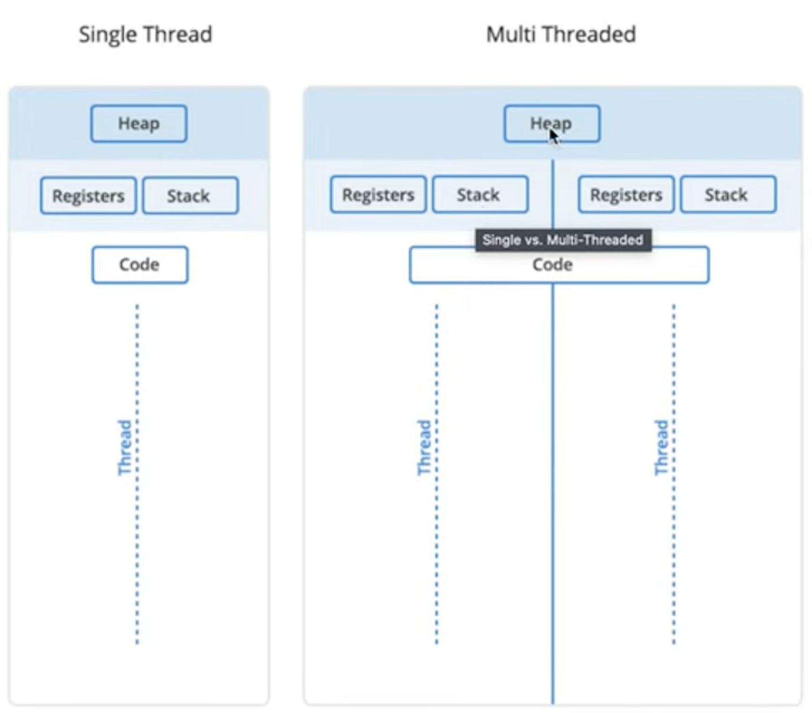

> <h1 id=""></h1>
- [**判断当前线程在哪条队列执行**](#判断当前线程在哪条队列执行)
- [barrier实现线程安全](#barrier实现线程安全)
- [**await和async**](#await和async)
	- [初步使用async和await](#初步使用async和await)
	- [async和await中使用演员进入主队列](#async和await中使用演员进入主队列)
	- [任务优先级](#任务优先级)
- [**多个任务处理**](#多个任务处理)
	- [多个图片下载简单版](#多个图片下载简单版)
	- [简单任务组](#简单任务组)
- [**逃逸闭包转换为支持async/await的现代异步方法**](#逃逸闭包转换为支持async/await的现代异步方法)
- [**线程安全类Actor**](#线程安全类Actor)
	- [actor初步认识](#actor初步认识)
	- [结构体值类型新理解](#结构体值类型新理解)
	- [传统线程安全和actor隔离比较](#传统线程安全和actor隔离比较)
	- [并发隔离属性:nonisolated、actor](#并发隔离属性:nonisolated、actor)
- [**全局隔离机制@globalActor**](#全局隔离机制@globalActor)
- [**‌ 核心安全协议Sendable**](#核心安全协议Sendable)
	- [@unchecked作用和意义](#@unchecked作用和意义)


<br/><br/><br/>

***
<br/>

> <h1 id="判断当前线程在哪条队列执行">判断当前线程在哪条队列执行</h1>

```swift
private let workQueueKey = DispatchSpecificKey<Void>()
```

`DispatchSpecificKey` 是 **Grand Central Dispatch (GCD)** 提供的一个工具，用来给某个 **DispatchQueue** 绑定“特定值（specific value）”，从而在运行时判断当前代码是不是在那条队列上执行，或者从队列里取出你自己挂上去的数据。

<br/>

**绑定 key 到队列**

```swift
let queue = DispatchQueue(label: "com.example.work")
private let workQueueKey = DispatchSpecificKey<Void>()

queue.setSpecific(key: workQueueKey, value: ())
```

这里把 `workQueueKey` 和 `()`（Void 的实例）绑定到 `queue`。

<br/>

**检查当前代码是否运行在指定队列**

```swift
func doSomething() {
    if DispatchQueue.getSpecific(key: workQueueKey) != nil {
        // 当前就在 workQueue 上
        print("Already on workQueue")
    } else {
        // 不在 workQueue 上，切换过去
        queue.async {
            doSomething()
        }
    }
}
```

这是 iOS 中避免 **死锁** 或 **多余派发** 的常见技巧。

<br/>

**也可以绑定任意类型的值**

```swift
let key = DispatchSpecificKey<String>()
queue.setSpecific(key: key, value: "worker-queue")

DispatchQueue.global().async {
    if let name = DispatchQueue.getSpecific(key: key) {
        print("Running on: \(name)")
    } else {
        print("Not on worker queue")
    }
}
```

<br/>

**总结**

* `DispatchSpecificKey` 是一个“标记”，让你把值与队列关联。
* 常用于：
	* 判断当前代码是否在某个队列上运行。
	* 在队列中存储与上下文相关的小数据（类似 thread-local storage）。
* 你定义 `private let workQueueKey = DispatchSpecificKey<Void>()`，是为了给自己的 `DispatchQueue` 做标识，后面再通过 `setSpecific` / `getSpecific` 来用。

<br/>

💡 **Tip**
很多 Apple 框架（例如 `URLSession`、`NSManagedObjectContext`）内部也用这个机制，来确定回调是不是在它们要求的队列上执行。

***
<br/><br/>

下面是演示如何用 `DispatchSpecificKey` 给队列“打标签”，然后在函数里检测自己当前是不是在那条队列上。

<br/>

```swift
import Foundation

// 1️⃣ 创建一个专用的工作队列
let workQueue = DispatchQueue(label: "com.example.work")

// 2️⃣ 创建一个 key，用来和队列绑定
private let workQueueKey = DispatchSpecificKey<Void>()

// 3️⃣ 绑定 key 到队列
workQueue.setSpecific(key: workQueueKey, value: ())

// 4️⃣ 定义一个函数，判断当前是否在 workQueue 上
func performTask() {
    if DispatchQueue.getSpecific(key: workQueueKey) != nil {
        // ✅ 已经在 workQueue 上，直接执行
        print("Already on workQueue, doing work immediately")
        doSomeWork()
    } else {
        // ❌ 不在 workQueue，上去再执行，避免死锁
        workQueue.async {
            performTask()
        }
    }
}

func doSomeWork() {
    print("doSomeWork running on thread: \(Thread.current)")
}

// 调用
performTask()

// 再次调用，但强制在 workQueue 上执行
workQueue.async {
    performTask()
}
```

<br/>

**运行结果**

```
Already on workQueue, doing work immediately
doSomeWork running on thread: <NSThread: 0x60000085c1c0>{number = 4, name = (null)}
Already on workQueue, doing work immediately
doSomeWork running on thread: <NSThread: 0x60000085c1c0>{number = 4, name = (null)}
```

> 当 `performTask()` 被直接调用时，如果已经在 `workQueue` 上，就直接执行；
> 如果不是，就 `async` 到 `workQueue`，保证线程安全，避免死锁。

<br/>

**关键点回顾**

1. **`DispatchSpecificKey`** 只是“钥匙”，需要用 `setSpecific` 绑定到队列。
2. 用 **`DispatchQueue.getSpecific`** 获取当前队列绑定的值，如果能取到，说明正在那个队列上。
3. 这种模式在写同步工具、数据库封装、线程安全对象时非常有用。


<br/><br/><br/>

***
<br/>

> <h1 id="barrier实现线程安全">barrier实现线程安全</h1>

通用的 **线程安全泛型容器**`ThreadSafe<T>`

```swift
import Foundation

/// 一个线程安全的泛型容器
public final class ThreadSafe<T> {
    
    private var value: T
    private let queue = DispatchQueue(
        label: "com.argus.threadSafeQueue",
        attributes: .concurrent
    )
    
    public init(_ value: T) {
        self.value = value
    }
    
    /// 线程安全读
    public func read() -> T {
        return queue.sync {
            return value
        }
    }
    
    /// 线程安全写
    public func write(_ newValue: T) {
        queue.sync(flags: .barrier) {
            self.value = newValue
        }
    }
    
    /// 支持闭包形式的修改（比单纯的 write 更灵活）
    public func mutate(_ transform: (inout T) -> Void) {
        queue.sync(flags: .barrier) {
            transform(&value)
        }
    }
}
```

<br/>

**使用示例**

```swift
let safeInt = ThreadSafe(0)

// 多线程并发写入
DispatchQueue.concurrentPerform(iterations: 1000) { i in
    safeInt.mutate { $0 += 1 }
}

// 最后读取
print("最终结果:", safeInt.read())  // 1000
```

<br/>

**特点**

* `read()`：多个线程可以并发读取，不阻塞。
* `write()`：写操作是独占的，保证安全。
* `mutate {}`：可以在闭包里对值做复杂修改，比如数组 `append`、字典更新等。


***
<br/>

**核心代码阅读：**

```swift
private let queue = DispatchQueue(
    label: "com.argus.threadSafeQueue", 
    attributes: .concurrent
)
```

* 定义了一个 **并发队列 (concurrent queue)**，名字是 `"com.argus.threadSafeQueue"`。
* 并发队列的特点是：可以同时并发执行多个任务。
* 但是，我们可以通过 **barrier** 让某些任务（写操作）变成“独占任务”。

<br/>

```swift
public func read() -> T {
    return queue.sync {
        return value
    }
}
```

* `read()` 方法通过 `queue.sync {}` 在并发队列里同步执行读操作。
* 因为是 **并发队列**，多个 `read()` 可以同时执行，不会互相阻塞。
* 读操作不会修改数据，因此允许并发执行是安全的。

<br/>

```swift
public func write(_ newValue: T) {
    queue.sync(flags: .barrier) {
        self.value = newValue
    }
}
```

* `write()` 使用了 `queue.sync(flags: .barrier)`。

* **barrier** 的作用：
	* 保证当前这个写任务 **等到之前所有任务（包括读）都完成后才执行**；
	* 在它执行时，会阻塞队列，不允许其他读/写并发；
	* 写任务执行完之后，新的读操作才会继续并发执行。

* 换句话说：
	* 多个 `read()` 可以并行
	* `write()` 是串行的，且写的时候会阻塞其他读写，避免数据竞争

<br/>

**总结：这段代码的作用**

它实现了一个 **线程安全的读写封装**（常见叫 `ThreadSafe<T>` 或 `Atomic<T>`）：

* **读**：多个线程可以同时读，性能好。
* **写**：写的时候加独占锁，确保数据一致性。
* **实现原理**：利用 GCD 并发队列 + barrier 替代传统的互斥锁（`NSLock`）。

<br/>

👉 对比一下：

* `NSLock`：读写都会加锁 → 并发读也会被阻塞 → 性能一般。
* `DispatchQueue + barrier`：读可以并发，写独占 → 性能更优，常用于缓存、配置、共享数据结构。


<br/><br/><br/>

***
<br/>

> <h1 id="await和async">await和async</h1>

***
<br/><br/><br/>
> <h2 id="初步使用async和await">初步使用async和await</h2>

- await基本上是任务的一个暂停点;
- 添加await后我们相当于高速编译器,我们得在此状态下暂停任务,等待响应后再继续;
- 通过Task进入异步环境;

***

```swift
private static func fetchImage() async {
    print("☘️>>>>>>>>> 异步请求前")
    
    // 这里我们调用await它会瞬间发生,但是我们不知道它需要多久,await并不会改变耗时是一秒还是一小时,只是我们在等待响应,等待响应的到来
    let image = try? await self.downloadWithAsync()
    
    print("☘️========= 异步请求结束")
    
    // 一旦我们处于异步环境,我们需要回到主线程一个是: 使用dispatch回到主队列,第二个是: 我们可以使用演员
    // 主演员或多或少就是在主线程
    // 使用异步等待关键字实际上是调用主演员的运行方法,需要加入await.然后将要执行执行主队列的代码放到run方法里
    await MainActor.run {
        // 将image赋值给图片view
        // self.image = image
        print("🍎 网络请求数据来了: \(image ?? "-.-")")
    }

    print("☘️》〉》〉》〉》〉》 异步请求继续执行下面代码....")
}

public static func downloadWithAsync() async throws -> String? {
    
    do {
        if #available(iOS 15.0, *) {
            print("🍎 ++++++++ 开始发起模拟请求")
           
            try await Task.sleep(nanoseconds: 2 * 1_000_000_000) // 延迟2秒
            
            //let (data, response) = try await URLSession.shared.data(from: URL(string: "https://picsum.photos/200")!, delegate: nil)
            //return handleResponse(data: data, response: response)
            
            print("🍎 ¥¥¥¥¥¥¥ 模拟请求完成")
            return "网络请求json数据来了"
        } else {
            Thread.sleep(forTimeInterval: 2.0)
            return "----------->> json📊数据来了"
        }
    }catch {
        throw error
    }
}

private static func handleResponse(data: Data?, response: URLResponse?) -> UIImage? {
    guard
        let data = data,
        let image = UIImage(data: data),
        let response = response as? HTTPURLResponse,
        response.statusCode >= 200 && response.statusCode < 300 else {
        return nil
    }
    return image
}
```

<br/>

**调用:**

```swift
// async 若是们需要支持并发的函数,需要添加async
public static func practiceException02() {
    // await标记代码的暂停点,表示执行这个操作比较耗时
    
    // 注意: 只能在异步函数里调用异步函数,那到底怎么进入支持并发的环境呢? 答案是: 创建或者启动一个任务Task(我们通过一个任务来进入异步上下文),然后在里面才能调用异步函数
    Task {
        await self.fetchImage()
    }
}
```

***
**打印:**

```sh
☘️>>>>>>>>> 异步请求前
🍎 ++++++++ 开始发起模拟请求
🍎 ¥¥¥¥¥¥¥ 模拟请求完成
☘️========= 异步请求结束
🍎 网络请求数据来了: 网络请求json数据来了
☘️》〉》〉》〉》〉》 异步请求继续执行下面代码....
```

***
<br/><br/><br/>
> <h2 id="async和await中使用演员进入主队列">async和await中使用演员进入主队列</h2>

```swift
public static func practiceException03()   {
    print("😁<<<<<<<<<<<<<<<<<")
    
    Task {
        await self.practiceException03_00()
        
    }
    print("😂+++++++++++++++++")
}

@MainActor //必须在主线程上运行，不允许在其他线程执行
public static func practiceException03_00() async {
    print("☘️>>>>>>>>> 异步请求前")
    
    let author1 = "Author1 : \(Thread.current)"
    print("🍎 当前作者Author1: \(author1)")
    
    // Task.sleep 是一个异步函数,所以要加入 await
    // 我们没有进入后台线程,但是却进入了后台线程了.原因是 Task.sleep 进入了后台线程并等待了,注意: 这里它有时会进入后台线程,有时不会
    // 然后它下面的代码则表示在后台线程,所以后面若是有关于UI方面的操作会报警告
    // 所以我们需要在异步等待后回到 主线程中去,我们只需要跳回到主执行器即可,跳到主执行器可以: await Main.actor.run 执行就好了
    try? await Task.sleep(nanoseconds: 2_000_000_000) //(换成: try? doSomething() 就不会发生进入到后台线程了,会一直在主线程)
    
    let author2 = "Author2 : \(Thread.current)"
    print("🍎 当前作者Author2: \(author2)")
    await MainActor.run(body: {
        let author3 = "Author3 : \(Thread.current)"
        print("🍎 当前作者Author3: \(author3)")
    })
    
    print("🌵 程序代码继续执行..........")
}

static func doSomething() async throws {
    print("+++++ HI")
}
```

***

**调用:**

```swift
HGPraceMulThread.practiceException03()
```

打印:

```sh
😁<<<<<<<<<<<<<<<<<
😂+++++++++++++++++
☘️>>>>>>>>> 异步请求前
🍎 当前作者Author1: Author1 : <_NSMainThread: 0x300e2c040>{number = 1, name = main}
🍎 当前作者Author2: Author2 : <_NSMainThread: 0x300e2c040>{number = 1, name = main}
🍎 当前作者Author3: Author3 : <_NSMainThread: 0x300e2c040>{number = 1, name = main}
🌵 程序代码继续执行..........
```

- **⚠️注意:**
	- Task是用来进入异步环境上下文的;
	- 我们在`practiceException03_00()‌`方法内调用了`‌try? await Task.sleep(nanoseconds: 2_000_000_000)`这个方法,这个需要注意,因为在UI环境中也就是它之前若是主线程后,经过它调用进入后台等待,可能是主线程等待,也可能是子线程等待,所以后面用主演员,表示在主线程操作UI.

***
<br/><br/><br/>
> <h2 id="任务优先级">任务优先级</h2>


- **1.任务优先级简单测试**

```swift
 public static func practiceException04() {
        
    print("🍟 <<<<<<<<<<<")
    Task{
        print("++最近的线程: \(Thread.current)")
        print("++线程优先级: \(Task.currentPriority)")
    }
    
    Task{
        print("\n\n--最近的线程: \(Thread.current)")
        print("--线程优先级: \(Task.currentPriority)")
    }
    print("🚫 ##############")
}


/// 调用
HGPraceMulThread.practiceException04()
```

***
**打印:**

```sh
🍟 <<<<<<<<<<<
🚫 ##############
++最近的线程: <NSThread: 0x302e95a80>{number = 8, name = (null)}


--最近的线程: <NSThread: 0x302e98000>{number = 3, name = (null)}
++线程优先级: TaskPriority.high
--线程优先级: TaskPriority.high
```

- **说明:**
	- 这里调用其实在cell点击后调用的,所以是一般在主线程,但是现在没有打印在当前主线程有点奇怪的;
	- 这2个任务都是在主队列异步的,所以看到打印显示都是在执行完后才执行任务内的函数的;
	- 可以看到2个任务互不干扰,没有先后的执行顺序的;
	- 在加载图片若是没有先后顺序可以这么做的;


***
<br/>

**多个优先级处理测试:**

```swift
public static func practiceException04_01() {
        
    print("💯 <<<<<<<<<<<<<<<<<<<")
    Thread.current.name = "我命名的🍎"
    Task(priority: .high) { // 优先级高的任务优先处理,但并不意味着它们首先完成
        //                try? await Task.sleep(nanoseconds: 2_000_000_000)
        await Task.yield() // 进行让步,让其他比较紧急的任务排在它前面
        print("high : \(Thread.current) : \(Task.currentPriority)")
    }
    Task(priority: .userInitiated) {
        print("userInitiated : \(Thread.current) : \(Task.currentPriority)")
    }
    Task(priority: .medium) {// 中等优先级
        print("medium : \(Thread.current) : \(Task.currentPriority)")
    }
    Task(priority: .low) {
        print("low : \(Thread.current) : \(Task.currentPriority)")
    }
    Task(priority: .utility) {
        print("utility : \(Thread.current) : \(Task.currentPriority)")
    }
    Task(priority: .background) {
        print("background : \(Thread.current) : \(Task.currentPriority)")
    }
    
    
    Task(priority: .low) {
        print("父任务: low : \(Thread.current) : \(Task.currentPriority)")
        
        
//            Task.detached { // detached: 使子任务脱离父任务,分离任务
//                print("子任务detached : \(Thread.current) : \(Task.currentPriority)")
//            }
        Task { // detached: 使子任务脱离父任务,分离任务
            print("子任务detached : \(Thread.current) : \(Task.currentPriority)")
        }
    }
    
    let taskObj: Task<(), Never> = Task{
        // 在这里可以起一个获取图片的任务
        
    }
    // 当不需要了,比如我进入一个导航页面,然后立马退出,剩下的20个图片任务不需要加载了,就可以调用 self.taskObj.cancel()
    
    print("🔚>>>>>>>>>>>>>>>>>>>>>>")
}


/// 调用
HGPraceMulThread.practiceException04_01()

```

打印:

```sh
💯 <<<<<<<<<<<<<<<<<<<
🔚>>>>>>>>>>>>>>>>>>>>>>
userInitiated : <NSThread: 0x301872140>{number = 4, name = (null)} : TaskPriority.high
high : <NSThread: 0x301879780>{number = 6, name = (null)} : TaskPriority.high
medium : <NSThread: 0x301864480>{number = 5, name = (null)} : TaskPriority.medium
父任务: low : <NSThread: 0x30186e700>{number = 9, name = (null)} : TaskPriority.low
子任务: <NSThread: 0x30186e700>{number = 9, name = (null)} : TaskPriority.low
background : <NSThread: 0x30186c680>{number = 10, name = (null)} : TaskPriority.background
low : <NSThread: 0x30186e6c0>{number = 7, name = (null)} : TaskPriority.low
utility : <NSThread: 0x301875640>{number = 8, name = (null)} : TaskPriority.low
```

- **说明:**
	- 优先级只是决定谁最有可能最先调用,但是并不决定谁最先完成任务;
	- 比如上述的最高优先级,加入了睡眠,那么它完成的时候可能就是最后的;
	- 子任务可以从父任务那里继承优先级;
	- 可以使用一个变量引用任务,对任务取消;
		- 对于任务比如需要很长时间才能执行完的,你需要检查一下它,有相关的方法进行检测,然后判断再取消是最好的.


<br/><br/><br/>

***
<br/>

> <h1 id="多个任务处理">多个任务处理</h1>

***
<br/><br/><br/>
> <h2 id="多个图片下载简单版">多个图片下载简单版</h2>

```swift

func practiceFetchImages() {
	
	Task {
        do {
            async let fetchImage1 = fetchImage()
            async let fetchTitle1 = fetchTitle()
            
            let (image, title) = await (try fetchImage1, fetchTitle1)
            
            
//                        async let fetchImage2 = fetchImage()
//                        async let fetchImage3 = fetchImage()
//                        async let fetchImage4 = fetchImage()
//
//                        let (image1, image2, image3, image4) = await (try fetchImage1, try fetchImage2, try fetchImage3, try fetchImage4)
//                        self.images.append(contentsOf: [image1, image2, image3, image4])
            
//                        let image1 = try await fetchImage()
//                        self.images.append(image1)
//
//                        let image2 = try await fetchImage()
//                        self.images.append(image2)
//
//                        let image3 = try await fetchImage()
//                        self.images.append(image3)
//
//                        let image4 = try await fetchImage()
//                        self.images.append(image4)

        } catch {
            
        }
    }

}


func fetchTitle() async -> String {
    return "NEW TITLE"
}

func fetchImage() async throws -> UIImage {
    do {
        let (data, _) = try await URLSession.shared.data(from: url, delegate: nil)
        if let image = UIImage(data: data) {
            return image
        } else {
            throw URLError(.badURL)
        }
    } catch {
        throw error
    }
}

```


如上所述,可以将任务中的`async`和`await`放入到类似元组中进行处理,但是少的下载任务还行,但是当多的时候,就不行了.这就需要下面的**任务组**了.


***
<br/><br/><br/>
> <h2 id="简单任务组"> 简单任务组</h2>


```swift

func test00() {

	Task {
	
		await self.getImages()
	}
}

func getImages() async {
    if let images = try? await fetchImagesWithAsyncLet() {
        self.images.append(contentsOf: images)
    }
}

 func fetchImagesWithAsyncLet() async throws -> [UIImage] {
    async let fetchImage1 = fetchImage(urlString: "https://picsum.photos/300")
    async let fetchImage2 = fetchImage(urlString: "https://picsum.photos/300")
    async let fetchImage3 = fetchImage(urlString: "https://picsum.photos/300")
    async let fetchImage4 = fetchImage(urlString: "https://picsum.photos/300")
    
    let (image1, image2, image3, image4) = await (try fetchImage1, try fetchImage2, try fetchImage3, try fetchImage4)
    return [image1, image2, image3, image4]
}

```


***

上述若是简单的几张图片还好,若是多张图片就不行了,下面介绍任务组:


```swift
 private func fetchImage(urlString: String) async throws -> UIImage {
    guard let url = URL(string: urlString) else {
        throw URLError(.badURL)
    }
    
    do {
        let (data, _) = try await URLSession.shared.data(from: url, delegate: nil)
        if let image = UIImage(data: data) {
            return image
        } else {
            throw URLError(.badURL)
        }
    } catch {
        throw error
    }
}
    
func fetchImagesWithTaskGroup() async throws -> [UIImage] {
    let urlStrings = [
        "https://picsum.photos/300",
        "https://picsum.photos/300",
        "https://picsum.photos/300",
        "https://picsum.photos/300",
        "https://picsum.photos/300",
    ]
    
    // 使用带抛出错误的任务组
    return try await withThrowingTaskGroup(of: UIImage?.self) { group in
        var images: [UIImage] = []
        // 告诉编译器预留多少空间,一点性能提升
        images.reserveCapacity(urlStrings.count)
        
        for urlString in urlStrings {
		        // 添加子任务
		        group.addTask {
                try? await self.fetchImage(urlString: urlString)
            }
        }
        
        // 这个for循环会等待每次的for循环
        for try await image in group {
            if let image = image {
                images.append(image)
            }
        }
        
        return images
    }
}


func getImages() async {
    if let images = try? await manager.fetchImagesWithTaskGroup() {
        self.images.append(contentsOf: images)
    }
}


/// 调用
func test01() {
	Task {
			await viewModel.getImages()
	}
}
```


<br/><br/><br/>

***
<br/>
> <h1 id="逃逸闭包转换为支持async/await的现代异步方法">逃逸闭包转换为支持async/await的现代异步方法</h1>

这是将传统基于“逃逸闭包”的异步 API 转换为支持 `async/await` 语法的现代异步方法。以下是详细解释：

---

**🔹 `withCheckedThrowingContinuation` 是什么？**

这是 Swift 提供的一个 API，用来将使用 **回调（逃逸闭包）风格的异步函数**，转换为支持 `async/await` 的 **结构化并发函数**。

**定义如下：**

```swift
func withCheckedThrowingContinuation<T>(
    _ body: (CheckedContinuation<T, Error>) throws -> Void
) async throws -> T
```

* `T` 是要返回的结果类型
* `CheckedContinuation<T, Error>` 是你从 `body` 闭包中获得的一个 **控制对象**，你可以通过它来 **resume（恢复）这个异步流程**

---

**🔸 传统异步函数是这样写的：**

```swift
func fetchData(completion: @escaping (Result<Data, Error>) -> Void)
```

你想把它封装为 `async` 形式：

```swift
func fetchData() async throws -> Data
```

这时候就可以用 `withCheckedThrowingContinuation` 来做桥接，避免逃逸闭包的复杂性。

---

**🔹 什么是 `resume`？**

`resume(returning:)` 和 `resume(throwing:)` 是 `CheckedContinuation` 的两个方法，用来手动恢复当前挂起的 `async` 调用：

* `resume(returning:)`：当你得到了期望的结果
* `resume(throwing:)`：当你遇到了错误并希望抛出

**⚠️ 注意：`resume` 只能调用一次！否则会崩溃。**

---

**🔸 示例：封装传统 API**

假设你有这个传统异步方法：

```swift
func oldStyleNetworkCall(completion: @escaping (Data?, Error?) -> Void)
```

你可以封装为：

```swift
func fetchData() async throws -> Data {
    return try await withCheckedThrowingContinuation { continuation in
        oldStyleNetworkCall { data, error in
            if let error = error {
                continuation.resume(throwing: error)
            } else if let data = data {
                continuation.resume(returning: data)
            } else {
                continuation.resume(throwing: NSError(domain: "UnknownError", code: -1))
            }
        }
    }
}
```

---

## ✅ 为什么这样做是“避免逃逸闭包”？

你用 `withCheckedThrowingContinuation` 包裹了逃逸闭包式的 API，但在你的 `async` 调用者看来：

```swift
let data = try await fetchData()
```

这只是一个普通的结构化异步函数，而不是基于逃逸闭包的写法，提升了代码的安全性、可读性和顺序逻辑。

---

**🔒 `withChecked...` 有什么“检查”功能？**

* 它会在调试环境中检测 `resume` 是否被调用
* 如果没有 resume 或多次 resume，会在运行时报错

这有助于发现错误用法。

---

**总结**

| 术语                                | 说明                                    |
| --------------------------------- | ------------------------------------- |
| `withCheckedThrowingContinuation` | 桥接传统逃逸闭包异步 API 与现代 `async/await` 异步函数 |
| `CheckedContinuation.resume(...)` | 手动恢复暂停的异步流程                           |
| 用处                                | 提升代码可读性、结构化，简化异步控制流程                  |


***
<br/>

**如下一个简单网络请求:**

```swift
struct NetworkClient {
    
    // 增加解析支持（泛型 + JSON 解码）
    static func requestDecodable<T: Decodable>(from url: URL) async throws -> T {
        let data = try await requestData(from: url)
        return try JSONDecoder().decode(T.self, from: data)
    }
    
    static func requestData(from url: URL) async throws -> Data {
        return try await withCheckedThrowingContinuation({ continuation in
            let task = URLSession.shared.dataTask(with: url, completionHandler: { data,response,err in
                if let error = err {
                    continuation.resume(throwing: error)
                } else if let data = data {
                    continuation.resume(returning: data)
                } else {
                    continuation.resume(throwing: URLError(.unknown))
                }
            })
            task.resume() // 必须调用以启动任务
        })
    }
}
struct Todo: Decodable {
    let id: Int
    let title: String
    let completed: Bool
}


/// 闭包转换成async/await
public static func practiceMulThread00() async {
    print("🍎 <<<<<<<<< 闭包转换成async/await")
    do {
        let url = URL(string: "https://jsonplaceholder.typicode.com/todos/1")!
        let todo: Todo = try await NetworkClient.requestDecodable(from: url)
        print("🍎 数据解析Todo title: \(todo.title), completed: \(todo.completed)")
    } catch {
        print("❌ 失败 Failed to fetch todo: \(error)")
    }
    print("🍎 ========== 闭包转换成async/await")
}
```

<br/>

**调用:**

```swift
Task{
    do {
        await HGPraceMulThread.practiceMulThread00()
    } catch {
        print(error)
    }
    
}
```

打印:

```sh
🍎 <<<<<<<<< 闭包转换成async/await
🍎 数据解析Todo: delectus aut autem, completed: false
🍎 ========== 闭包转换成async/await
```


<br/><br/><br/>

***
<br/>

> <h1 id="线程安全类Actor">线程安全类Actor</h1>

Actor 是 Swift 5.5（随着 Swift 并发引入）提供的一个 结构化并发模型中的线程安全引用类型。它用于解决并发环境下的数据竞争问题。

**它为什么是安全的?**
> 对 actor 内部状态的访问是 **串行的（serial）**，即任何时候只有一个执行体可以访问它的属性或方法。
> actor 的内部状态是 **“隔离的”**, 只能通过 actor 的 `async` 方法间接访问，且编译器确保**不会并发同时读写内部属性**。

***

**📦 什么是“安全隔离”？**

每个 actor 背后都有一个 **串行执行上下文**（可以理解成一个内部任务队列），它：

* 所有对 actor 的调用，会通过 `await` 进入这个队列
* 任务在队列中 **一个个串行执行**
* 不存在同时多个任务修改状态的情况


**✅ 特性：**

| 特性      | 说明                        |
| ------- | ------------------------- |
| ✅ 串行访问  | 同一时间只能一个任务访问其内部数据         |
| ✅ 自动同步  | 无需使用 `DispatchQueue` 或锁   |
| ✅ 编译器保护 | 不能直接跨线程访问内部属性，除非用 `await` |

***

可以把 actor 看作一种特殊的类（class），它的**内部状态只能被一个线程在某一时刻访问，从而自动实现线程安全（thread-safe）**。


```swift
actor Counter {
    public var value = 0
    
    func increment() {
        value += 1
    }

    func getValue() -> Int {
        return value
    }
}
```

***

- **📌 调用方式1️⃣**

```swift
public func testActor00(){
	let counter = Counter()
	
	Task {
	    await counter.increment()
	    let current = await counter.getValue()
	    print("Counter is \(current)")
	}
}
```

<br/>
**📌 调用方式2️⃣**

```
// 或者
public func testActor01() async {

	let counter = Counter()
	// 编译报错,因为actor要求是线程安全的只能在类的内部修改,外部修改会编译报错.所以actor是线程安全的
	// actor确保了参与者内部的所有操作都在线程安全的环境中进行的
	// counter.value = 22 
	await counter.increment()
	let current = await counter.getValue()
	print("Counter is \(current)")
}
```

- **注意到上述区别了吗?**
	- `‌testActor00()`和`‌testActor01()`方法后一个带了`async`一个后面没有携带;
		- 原因: `actor`必须是在异步环境中,进入异步环境(也就是上下文)要么是函数末尾带**async关键字**,要么使用**Task**进入,否则编译报错	
		- 因为actor具有线程安全性,所以需要我们等待进入,所以**访问属性需要等待**;
	- **actor和类差不多**,只是多了线程安全.一个线程访问一个actor时,另一个就需要等待,保证了线程安全
***

**⏱️ actor 适合用于什么时候？**

| 场景           | 示例                                          |
| ------------ | ------------------------------------------- |
| ✅ 管理共享状态     | 全局缓存、配置对象、连接池等                              |
| ✅ 并发写操作      | 多任务同时更新一个对象                                 |
| ✅ 替代锁机制      | 不再需要手动写 `DispatchQueue`、`NSLock`            |
| ✅ 和结构化并发结合使用 | Swift Concurrency（`Task`、`await`）结构中保护状态很自然 |

---

- **🚫 actor 不适合的场景：**
	* 对性能极高要求，且自己精细控制线程同步（如音频、图形高频刷新等）
	* 极度简单的数据结构，只用于单线程访问

---

**🧪 示例：缓存系统**

```swift
actor ImageCache {
    private var cache: [URL: Data] = [:]
    
    func set(_ data: Data, for url: URL) {
        cache[url] = data
    }
    
    func get(for url: URL) -> Data? {
        return cache[url]
    }
}
```

使用：

```swift
let cache = ImageCache()

Task {
    if let data = await cache.get(for: imageURL) {
        print("Loaded from cache")
    } else {
        let data = try await fetchImageData(from: imageURL)
        await cache.set(data, for: imageURL)
    }
}
```


***



- **上图是截自于其他博客上的图,由上图可得:**
	- 值类型比引用类型快的多,因为值距离线程距离近的多;
	- 每个线程都有自己的栈,所以线程里的东西默认都是线程安全的.
		- 当传递值类型时,我们传递的是数据副本,不是原始数据的引用.所以当赋值或传递值类型时会创建一个新的数据副本,相反还有引用类型.
	- 类、函数、Actor都是引用类型,不是存在某个特定线程上,所以它们不是线程安全的;
	- 如上面的图: 堆离线程更远,所以访问栈比访问堆快得多,因为堆会在所有线程同步数据(所以读写数据较慢 )
		- 堆是在线程间共享的
		 - 每个线程都有自己的栈,每个线程都没有自己的堆,线程共享堆.因为堆需要和那些类进行同步,和那些actor进行同步.


***
<br/><br/><br/>
> <h2 id="actor初步认识">actor初步认识</h2>

`actor` 是 Swift 5.5（随着 Swift 并发引入）提供的一个 **结构化并发模型中的线程安全引用类型**。它用于**解决并发环境下的数据竞争问题**。

---

- **🧠 简单解释：`actor` 是什么？**

可以把 `actor` 看作一种特殊的类（class），它的**内部状态只能被一个线程在某一时刻访问**，从而自动实现**线程安全（thread-safe）**。

```swift
actor Counter {
    private var value = 0
    
    func increment() {
        value += 1
    }

    func getValue() -> Int {
        return value
    }
}
```

<br/>

- **🔐 为什么 `actor` 是线程安全的？**

因为 Swift 编译器保证：

> 对 actor 内部状态的访问是 **串行的（serial）**，即任何时候只有一个执行体可以访问它的属性或方法。

<br/>

- **✅ 特性：**

| 特性      | 说明                        |
| ------- | ------------------------- |
| ✅ 串行访问  | 同一时间只能一个任务访问其内部数据         |
| ✅ 自动同步  | 无需使用 `DispatchQueue` 或锁   |
| ✅ 编译器保护 | 不能直接跨线程访问内部属性，除非用 `await` |

<br/>

**🔥 特别之处 vs. Class**

| 对比点            | class   | actor             |
| -------------- | ------- | ----------------- |
| 共享数据是否线程安全     | ❌ 默认不是  | ✅ 默认是             |
| 是否支持并发写        | ❌ 需手动同步 | ✅ 自动串行            |
| async/await 支持 | 不需要     | 调用方法时通常需要 `await` |

<br/>

**📌 调用方式**

```swift
let counter = Counter()

Task {
    await counter.increment()
    let current = await counter.getValue()
    print("Counter is \(current)")
}
```

---

## ⏱️ actor 适合用于什么时候？

使用 `actor` 的典型场景包括：

| 场景           | 示例                                          |
| ------------ | ------------------------------------------- |
| ✅ 管理共享状态     | 全局缓存、配置对象、连接池等                              |
| ✅ 并发写操作      | 多任务同时更新一个对象                                 |
| ✅ 替代锁机制      | 不再需要手动写 `DispatchQueue`、`NSLock`            |
| ✅ 和结构化并发结合使用 | Swift Concurrency（`Task`、`await`）结构中保护状态很自然 |

<br/>

- **🧪 示例：缓存系统**

```swift
actor ImageCache {
    private var cache: [URL: Data] = [:]
    
    func set(_ data: Data, for url: URL) {
        cache[url] = data
    }
    
    func get(for url: URL) -> Data? {
        return cache[url]
    }
}
```

使用：

```swift
let cache = ImageCache()

Task {
    if let data = await cache.get(for: imageURL) {
        print("Loaded from cache")
    } else {
        let data = try await fetchImageData(from: imageURL)
        await cache.set(data, for: imageURL)
    }
}
```

---

- **✅ 总结**

| 问题           | 答案                                |
| ------------ | --------------------------------- |
| `actor` 是什么？ | 一种自动线程安全的引用类型，用于并发模型              |
| 为什么线程安全？     | 编译器强制串行访问内部状态                     |
| 何时用？         | 需要并发访问共享数据时                       |
| 替代方案？        | `DispatchQueue`, `NSLock`, 但更复杂易错 |


***
<br/><br/><br/>
> <h2 id="结构体值类型新理解">结构体值类型新理解</h2>

```swift
struct MyStruct {
    var title: String
}

struct CustomStruct { 
    let title: String
    
    func updateTitle(newTitle: String) -> CustomStruct {
        CustomStruct(title: newTitle)
    }
}


let objectA = MyStruct(title: "Starting title!")
objectA.title = "Second title!" // 当我们把title变量由let改为var其实就是将这个旧的objectA废弃了,重新生成了一个结构体objectA,所以这个objectA也必须声明为var类型而不是let,若是你一开始就声明声明为let,然后改动其属性就会编译报错

// 上述的 objectA.title = "Second title!" 等价于下面的 struct2 = CustomStruct(title: "Title2")
var struct2 = CustomStruct(title: "Title1")
struct2 = CustomStruct(title: "Title2")
```


***
<br/><br/><br/>
> <h2 id="传统线程安全和actor隔离比较">传统线程安全和actor隔离比较</h2>

下面用到关键字**`nonisolated`**,它是用来做什么的呢?

- nonisolated 是 Swift 并发中用来声明一个 不受 actor 隔离规则约束的成员。
	- ❗默认情况下，actor 的方法和属性只能被 await 调用，因为编译器需要确保线程安全。

<br/>

- **使用** nonisolated **声明的函数或属性：**
	- 不需要 await 或 Task 就能访问
	- 不会访问 actor 的内部状态
	- 可以从 actor 外部线程同步安全地访问
	

```swift
// MARK: -- 隔离与传统线程安全比较
fileprivate class HGPraiceMyDataManager {
    static let instance = HGPraiceMyDataManager()
    private init() {}
    
    var data: [String] = []
    private let lock = DispatchQueue.init(label: "com.HG.HGPraceMulThread")
    
    func getRandomData(completionHandler: @escaping(_ title: String?) -> ()) {
        lock.async {
            self.data.append(UUID().uuidString)
            print("🍎 当前传统线程打印: \(Thread.current)")
            completionHandler(self.data.randomElement())
        }
    }
}

actor HGPraiceActorDataManager {
    static let instance = HGPraiceActorDataManager()
    private init() {}
    
    var data: [String] = []
    
    nonisolated let myRandomText = "但转眼一年过去，不仅国区的我们依然没有吃到这块苹果馅的大饼，已上线地区的反馈也难言乐观，传说中的「升级版 Siri 智能体」更是推进乏力"
    
    func getRandom() -> String? {  // ❗必须 await 调用
        self.data.append(UUID().uuidString)
        print("🍎 当前actor 安全打印: \(Thread.current)")
        
        return self.data.randomElement()
    }
    
    nonisolated func getSavedData() -> String { // ✅ 可以同步调用, 不需要 await 使用
        return "新的数据📊"
    }
}
```

***
**调用:**

```swift
/// 传统线程安全保护 & 使用演员Actor 比较
public static func practiceMulThread01() {
    // 传统
    let manager00 = HGPraiceMyDataManager.instance
    DispatchQueue.global(qos: .background).async {
        manager00.getRandomData(completionHandler: { title in
            if let data = title {
                DispatchQueue.main.async {
                    print("🍎 传统打印值: \(data)")
                }
            }
        })
    }
    
    // 传统
    let manager10 = HGPraiceActorDataManager.instance
    Task {
        if let data = await manager10.getRandom() { // 正常调用
            await MainActor.run(body: {
                print("🍎 actor打印值: \(data)")
            })
        }
    }
    // 不需要放在task内
    let netTxt = manager10.myRandomText
    let newStr = manager10.getSavedData() // 不需要 await
    print("🍎 不需要放在task内 newTxt: \(netTxt), newStr: \(newStr)")
    
}
```

***

**打印:**

```sh
🍎 不需要放在task内 newTxt: 但转眼一年过去，不仅国区的我们依然没有吃到这块苹果馅的大饼，已上线地区的反馈也难言乐观，传说中的「升级版 Siri 智能体」更是推进乏力, newStr: 新的数据📊
🍎 当前actor 安全打印: <NSThread: 0x3028b9ac0>{number = 7, name = (null)}
🍎 当前传统线程打印: <NSThread: 0x3028a02c0>{number = 8, name = (null)}
🍎 actor打印值: 47F619C3-C70F-4162-8894-384586E8A771
🍎 传统打印值: 741129F1-18D1-405A-85ED-5A21A326CEF3
```

***

**❗为什么需要 `nonisolated`？, 它解决两个问题：**

| 问题                 | `nonisolated` 的作用      |
| ------------------ | ---------------------- |
| ✅ 无需访问 actor 的内部状态 | 可直接从 actor 外调用         |
| ✅ 提高性能             | 避免 async/await 的开销     |
| ✅ 支持协议实现           | 使 actor 实现 `Sync` 协议成员 |

***

**✅ 使用场景**

| 场景                                         | 适用理由            |
| ------------------------------------------ | --------------- |
| 打印静态日志、版本号等                                | 无需访问内部状态        |
| 实现 `CustomStringConvertible.description`   | 需要同步访问          |
| 实现某些 `Equatable`, `Hashable` 的 protocol 方法 | 防止这些函数被 async 化 |


***
<br/><br/><br/>
> <h2 id="并发隔离属性:nonisolated、actor">并发隔离属性:nonisolated、actor</h2>

Swift 并发模型中的关键字：`nonisolated`、`actor` **都是表示隔离性（isolation）, 它的属性是线程安全的**。

<br/>

- **🧩 一、什么是 `nonisolated`？**

	- **✅ `nonisolated` 是 Swift 并发中用来声明一个 不受 actor 隔离规则约束的成员。**

> ❗默认情况下，**actor 的方法和属性只能被 `await` 调用**，因为编译器需要确保线程安全。

<br/>

- 而使用 `nonisolated` 声明的函数或属性：

	* 不需要 `await` 或 `Task` 就能访问
	* **不会访问 actor 的内部状态**
	* 可以从 actor 外部线程同步安全地访问

<br/>

- **✍ 示例对比：**

```swift
actor Logger {
    var name = "Default Logger"

    func log(_ message: String) {
        print("[\(name)] \(message)") // ❗必须 await 调用
    }

    nonisolated func metadata() -> String {
        return "Logger v1.0" // ✅ 可以同步调用
    }
}
```

**调用：**

```swift
let logger = Logger()

Task {
    await logger.log("hello")      // 正常调用
    print(logger.metadata())       // ✅ 不需要 await
}
```

---

- **❗为什么需要 `nonisolated`？**

它解决两个问题：

| 问题                 | `nonisolated` 的作用      |
| ------------------ | ---------------------- |
| ✅ 无需访问 actor 的内部状态 | 可直接从 actor 外调用         |
| ✅ 提高性能             | 避免 async/await 的开销     |
| ✅ 支持协议实现           | 使 actor 实现 `Sync` 协议成员 |

---

**✅ 使用场景**

| 场景                                         | 适用理由            |
| ------------------------------------------ | --------------- |
| 打印静态日志、版本号等                                | 无需访问内部状态        |
| 实现 `CustomStringConvertible.description`   | 需要同步访问          |
| 实现某些 `Equatable`, `Hashable` 的 protocol 方法 | 防止这些函数被 async 化 |


---
<br/>

- **🧠 二、actor 为什么是线程安全的？**

	- **✅ 核心原因：安全隔离（data isolation）**

<br/>

Swift actor 的内部状态是 **“隔离的”**：

> 只能通过 actor 的 `async` 方法间接访问，且编译器确保**不会并发同时读写内部属性**。

---
<br/>

- **📦 什么是“安全隔离”？**

	- 每个 actor 背后都有一个 **串行执行上下文**（可以理解成一个内部任务队列），它：

		* 所有对 actor 的调用，会通过 `await` 进入这个队列
		* 任务在队列中 **一个个串行执行**
		* 不存在同时多个任务修改状态的情况

---

- **🚫 编译器保护示例：**

```swift
actor Bank {
    var balance: Int = 1000
    
    func withdraw(amount: Int) {
        balance -= amount  // ✅ 通过 actor 内部访问
    }
}

let bank = Bank()
bank.balance = 999 // ❌ 编译器报错：Cannot assign to actor-isolated property
```

---

- **✅ 总结对比：关键点理解**

| 特性              | 解释                               |
| --------------- | -------------------------------- |
| `actor`         | 一种线程安全的引用类型，内部状态是隔离的             |
| 默认成员            | 只能通过 `await` 异步访问                |
| `nonisolated`   | 标记为“非隔离”的方法/属性，可以同步访问            |
| 安全隔离（Isolation） | 编译器保证 actor 状态只能被一个任务同时访问，防止数据竞争 |

---

- **🎯 何时用 `nonisolated`？**

	* 你实现的函数**不会也不应该访问 actor 的状态**
	* 想让这个函数在协议中保持 `sync` 签名（如 `description`, `id`, `hashValue` 等）
	* 追求性能优化，避免不必要的 `await`


<br/><br/><br/>

***
<br/>

> <h1 id="全局隔离机制@globalActor">全局隔离机制@globalActor</h1>

 **`@globalActor` 和 `@MainActor`** 是 Swift 并发模型中非常核心的“**全局隔离（Global Isolation）机制**”。

它们的设计初衷是：

> 🛡️ **在并发环境下，自动管理代码在哪个线程或上下文执行，从而避免数据竞争、UI 崩溃、线程错误等问题。**

---

**🧠 一、什么是 `@globalActor`？**

**✅ 简单定义：**

`@globalActor` 用于定义一个“**全局共享的 Actor 隔离上下文**”，你可以将某些代码（函数、属性等）标记为属于这个 Actor，Swift 就会自动把它们的执行安排到这个全局上下文上。

换句话说，它让你控制：

> ❗“这段代码必须在某个全局上下文下运行”

---

**🛠️ 示例：自定义 Global Actor**

```swift
import Foundation

@globalActor
struct FileActor {
    static let shared = FileActorActor()
}

actor FileActorActor {
    // 内部串行隔离
}
```

使用：

```swift
@FileActor
func writeToFile() {
    // 自动在 FileActor 的隔离上下文下执行
    print("writing file...")
}
```

---

**🟢 为什么要用 Global Actor？**

| 目的         | 说明                                   |
| ---------- | ------------------------------------ |
| 🔒 控制并发上下文 | 保证一组相关任务都在同一线程或执行上下文                 |
| ✅ 保证线程安全   | 自动串行调度，无需写锁                          |
| 🔁 跨模块共享资源 | 比如所有的文件操作、日志操作、数据库操作都由同一个 actor 串行处理 |

---

**🟩 二、`@MainActor` 是最常用的全局 Actor**

**✅ 什么是 `@MainActor`**

`@MainActor` 是 Swift 内置的全局 Actor，表示：

> **这个函数/变量必须在主线程上执行**（UI 线程）

你可以理解成 Swift 并发中用于替代 `DispatchQueue.main.async` 的高级语法。

---

**📱 示例：UI 操作必须在主线程**

```swift
@MainActor
func updateUILabel() {
    label.text = "Updated!"
}
```

或者：

```swift
@MainActor class ViewModel {
    var name: String = "Hello"
}
```

> 这样，所有 `ViewModel` 实例的属性访问都必须在主线程上进行。

---

**⏱️ 延伸：你也可以用 `@MainActor` 做跳线程**

```swift
Task {
    let result = await fetchData()

    await MainActor.run {
        label.text = result.title // ✅ 安全地回到主线程
    }
}
```

---

**🧱 三、为什么要有这些 Actor 隔离机制？**

| 问题           | Actor 隔离解决方案             |
| ------------ | ------------------------ |
| UI 操作不能在子线程  | 用 `@MainActor` 保证        |
| 数据库/文件写入不能并发 | 自定义 `@globalActor` 来串行处理 |
| 跨模块资源访问冲突    | 同一个全局 Actor 统一调度         |

---

**✅ 总结对比**

| 标注             | 功能          | 应用场景                |
| -------------- | ----------- | ------------------- |
| `@MainActor`   | 主线程执行       | UI 更新、UIKit/SwiftUI |
| `@globalActor` | 自定义执行上下文    | 文件、数据库、日志等串行管理      |
| `actor`        | 实例级线程安全     | 多个独立任务访问同一资源        |
| `nonisolated`  | 取消 actor 隔离 | 同步访问、安全代码外露         |

---

 **🧩 替代方式？**

可以，但更麻烦：

| 用法             | 替代写法                                |
| -------------- | ----------------------------------- |
| `@MainActor`   | `DispatchQueue.main.async { ... }`  |
| `@globalActor` | 使用 `DispatchQueue(label:)` + 手动控制访问 |


---

**🧪 Bonus 示例：混合使用**

```swift
@MainActor
class ViewModel {
    @Published var name: String = ""

    func fetchName() async {
        let name = await NetworkManager.shared.fetchName()
        self.name = name // ✅ 自动在主线程更新
    }
}
```


<br/><br/><br/>

***
<br/>

> <h1 id="核心安全协议Sendable">核心安全协议Sendable</h1>

`Sendable` 是 Swift 并发编程中一个**核心安全协议**，目的是：

> 🛡️ **确保跨线程传递的数据是安全的，不会造成数据竞争或崩溃。**

---

**✅ 一、`Sendable`是 Swift 并发引入的一个协议**

> "这个类型的值可以**在线程之间安全传递**，因为它是不可变的，或者是线程安全的。"

```swift
protocol Sendable { }
```

> 编译器通过它检查：**你传给异步任务的数据是不是安全的。**

---

**🔥 举个生活中的例子理解**

你在多线程中传递一个值，比如传给 `Task`：

```swift
let name = "Alice"
Task {
    print(name) // ⛔ name 是 String，没问题
}
```

这没问题，因为 `String` 是值类型、不可变，**可以安全发送**，它实现了 `Sendable`。

如果你传的是一个自定义类，那就得小心了：

```swift
class User {
    var name = "Alice"
}
```

```swift
let user = User()
Task {
    print(user.name) // ⚠️ 不安全，可能多个线程访问 user.name
}
```

> Swift 会 **警告或报错**，提醒你这个 `User` 类型不符合 `Sendable`，这样传入 Task 是不安全的！

---

**🛠️ 二、如何让自己的类型符合 `Sendable`？**

**✅ 方法1：结构体（值类型）+ `@unchecked Sendable`（或默认自动）**

```swift
struct SafeUser: Sendable {
    let name: String
}
```

这个就没问题，因为是不可变的 `struct`，所有成员都自动是 `Sendable`。

---

**✅ 方法2：类（引用类型）手动声明**

```swift
final class SafeUser: @unchecked Sendable {
    let name: String

    init(name: String) {
        self.name = name
    }
}
```

这里用了 `@unchecked Sendable` 表示：

> 我承诺我不会在线程间并发读写这个对象，但编译器无法检查，需要我自己保证。

---

**🧪 示例：使用不安全类型会报错**

```swift
class NotSafe {
    var counter = 0
}

func doSomething() {
    let obj = NotSafe()
    
    Task {
        obj.counter += 1 // ❗⚠️ 警告：'NotSafe' does not conform to 'Sendable'
    }
}
```

解决方法之一：

```swift
final class SafeClass: @unchecked Sendable {
    let counter: Int
    init(counter: Int) { self.counter = counter }
}
```

---

## 🎯 三、什么时候需要关心 `Sendable`？

| 场景                      | 是否要考虑 `Sendable`       |
| ----------------------- | ---------------------- |
| `Task { ... }` 里使用外部变量  | ✅ 是的，编译器检查它是否 Sendable |
| `actor` 之间传值            | ✅ 要 Sendable           |
| 多线程中传值（如 async closure） | ✅ 一定要是 Sendable        |
| 普通同步函数                  | ❌ 不需要 Sendable         |


***
<br/><br/><br/>
> <h2 id="@unchecked作用和意义">@unchecked作用和意义</h2>

**🧠 `@unchecked` 是什么？**

&emsp; `@unchecked` 是 Swift 用于**声明你承诺某个类型符合某协议，但不让编译器强制检查的关键字**。

常见搭配是：

```swift
final class MyClass: @unchecked Sendable {
    ...
}
```

---

- **🔒 为什么有这个关键字？**
	- 在 Swift 并发中，`Sendable` 协议要求：

> 类型的值必须是可以安全地在不同线程之间传递的。

**但是：**

* 对于 `struct` 和 `enum`，编译器可以自动检查是否所有成员都是 `Sendable`；
* 对于 `class`（引用类型），Swift 没法判断你是否正确管理了并发访问（线程安全），所以默认不符合 `Sendable`。

如果你知道你自己的类不会被多个线程同时访问（比如只读、外部加锁等），你就**可以自己承诺**：

```swift
final class MySafeClass: @unchecked Sendable {
    let value: String

    init(value: String) {
        self.value = value
    }
}
```

这就告诉编译器：

> ❗**我自己负责线程安全，请不要报错，我知道我在做什么。**

---

**⚠️ 为什么要小心使用？**

`@unchecked` 的意思就是：

> 我**跳过编译器的检查**，你别管了。

这很强大，但也有风险：

| 优点                             | 缺点                    |
| ------------------------------ | --------------------- |
| 解锁一些不能默认 Sendable 的场景（如 class） | 有可能会引入线程安全问题（数据竞争、崩溃） |
| 更灵活                            | 编译器无法保护你，完全靠你自己保证安全   |

---

**✅ 使用场景总结**

| 场景                         | 是否需要 `@unchecked`                  |
| -------------------------- | ---------------------------------- |
| `struct`、只包含 `Sendable` 成员 | ❌ 不需要，自动符合                         |
| `class`，你**能自己保证线程安全**     | ✅ 可以使用 `@unchecked Sendable`       |
| `class`，包含可变数据，多个线程访问      | ❌ 不要用 `@unchecked`，建议改为 `actor` 或锁 |

---

**🧪 ✅ 使用场景：只读不可变类**

```swift
final class ReadOnlyUser: @unchecked Sendable {
    let name: String

    init(name: String) {
        self.name = name
    }
}
```

这里没问题，因为你从不修改 `name`，线程之间传递时也不会有数据竞争。

---

**❌ 不建议场景：有可变属性**

```swift
final class Counter: @unchecked Sendable {
    var count = 0  // ⚠️ 非线程安全
}
```

这种写法是危险的，你应该改成 `actor` 或加锁机制。

