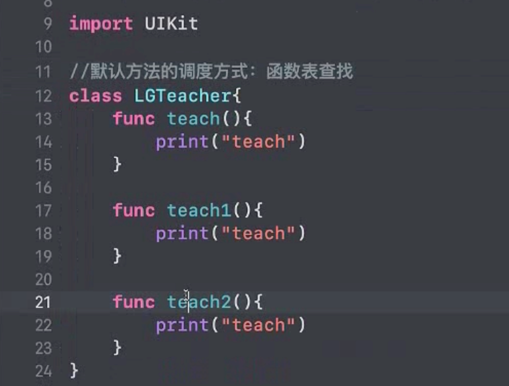
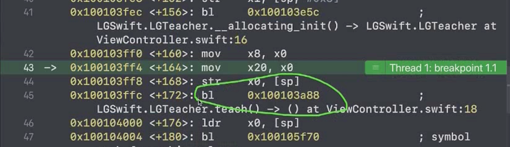
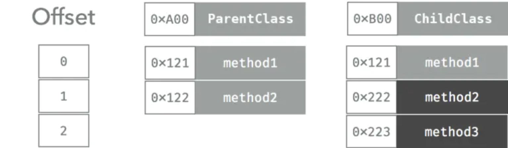

> <h4/>
- [**SwiftRuntime**](#SwiftRuntime)
	- [Dispatch(派发)是什么](#Dispatch(派发)是什么)
	- [了解Dispatch种类](#了解Dispatch种类)
		- [V-Table](#V-Table)
		- [PWT(协议目击表)](#PWT(协议目击表))
	- [**Swift派发方式**](#Swift派发方式)
		- [静态派发&动态派发(ChatGPT)](#静态派发&动态派发(ChatGPT))
			- [Swift方法调度的四种方式](#Swift方法调度的四种方式)
				- [直接调用(静态派发)](#直接调用(静态派发)) 
				- [表查找](#表查找) 
					- [VTable（虚函数表，适用于类继承）](#VTable（虚函数表，适用于类继承）)
					- [@objc、dynamic、final、extension方法调用全解](#@objc、dynamic、final、extension方法调用全解)
					- [Witness Table（见证表，适用于协议）](#WitnessTable（见证表，适用于协议）)
				- [动态派发（objc_msgSend 消息机制）](#动态派发（objc_msgSend消息机制）)
			- [Swift vs Objective-C 方法调度对比](#SwiftvsObjective-C方法调度对比)
		- [静态派发和动态派发的比较](#静态派发和动态派发的比较)
		- [静态派发](#静态派发)
		- [动态派发](#动态派发)
			- [函数表派发](#函数表派发)
			- [重写扩展中的方法](#重写扩展中的方法)
			- [消息派发](#消息派发)
		- [派发示例](#派发示例)
			- [值类型](#值类型)
			- [协议Protocol](#协议Protocol)
			- [Class](#Class)
			- [协议内存分配](#协议内存分配)
			- [重写扩展中的方法](#重写扩展中的方法)
	- @_dynamicReplacement
- [OC Runtime](#OCRuntime)


<br/><br/><br/><br/>

***
<br/>

> <h1 id='SwiftRuntime'>SwiftRuntime</h1>
<br/>

> <h2 id='Dispatch(派发)是什么'>Dispatch(派发)是什么</h2>
&emsp; Dispatch 派发，指的是**语言底层**找到用户想要调用的方法，并执行调用过程的动作。

&emsp; Call 调用，指的是**语言在高级层面**，指示一个函数进行相关命令的行为。

- 对于一个编译型语言来说，一般有三种方式可以派发到方法：**静态派发，基于 Table 的派发**，**消息派发(前者也被称作 Static Dispatch，后两个为 Dynamic Dispatch。)**。举例：

	- Java 默认是使用 Table 方式派发的，你可以使用 final 关键字来强制动态派发。
	
	- C++ 默认是静态派发的，你可以使用 virtual 关键字来启用 Table 派发(一句话总结，编译器在编译期间就已经确定了的推断路径，运行期间按照既定路线走就行。)。
	
	- Objective-C 全都基于消息派发，不过也允许你使用 C level 的函数直接派发。
	
	- Swift 则巧妙的使用了这三种方法，分别应对不同的情况.


<br/><br/><br/>
> <h2 id='了解Dispatch种类'>了解Dispatch种类</h2>
- **Direct Dispatch 直接派发**
	- 直接派发（静态派发）最快。不只是因为他的汇编命令少，还因为他可以应用很多编译器黑魔法，比如 inline 优化等。

	- 不过这种方式局限性最大，因为不够动态而无法支持子类。

<br/>

- **Table 派发**

	- 基于 Table 的派发机制是编译语言最常用的方式，Table 一般是用函数地址的数组来存储每个类的声明。大多数语言包括 Swift 都把这个称作 VTable，不过 Swift 中还有一个术语叫做 Witness Table 是服务于 Protocol 的，下面会提到。

	- 每个子类都会有自己的 VTable 副本，子类中 override 的方法指针也会被替换成新的，子类新添加的方法则会被添加在 Table 的尾部。程序会在运行时确定每个函数具体的地址。

	- 表的查找就实现而言非常简单，而且性能可以预测，不过还是比直接派发更慢一些。从字节码的角度来说，这种方法多了两步查找和一部跳转，这些都是开销。而且，这种方法没法使用一些黑魔法来优化。

	- 另一个不好的点在于，这种基于数组的派发让 extension 没法扩展这个 table。因为在子类添加方法列表到尾部后，extension 就没有一个安全的 index 可以添加他的方法到 table 中。

<br/>

- **Message 派发**
	- Message 派发是最灵活的派发方式。他是 Cocoa 的基石，也是 KVO，UIAppearance，Core Data 的核心。
	- 他的关键功能是可以让开发者在运行时改变消息发送的行为。不仅可以通过 swizzling 修改 method，还可以通过 isa-swizzling 来修改对象。
	- 一旦有消息发出，runtime 就会基于继承关系开始查找，虽然听起来很慢，但是有 cache 做保障，一旦 cache 经过预热，就和 Table 方式差不多快了。

<br/>

- [**队列派发**](https://hechen.xyz/post/messagedispatchinswift/#pwt)

&emsp; 在 Swift 中，针对拥有继承的 Class 类型来说，依然采用了 V-Table 这种实现形式达到对多态的支持，而针对值类型由于 Protocol 产生的多态而采用了另外一种函数表派发形式，这个表格被称为协议目击表 （Protocol Witness Table，简称 PWT），这个暂时略去不表。

<br/><br/>
> <h3 id='V-Table'>V-Table</h3>

- 对于 V-Table 的应用场景下，每一个类都会维护一个函数表，里面记录着该类所有的函数指针，主要包含：
	- 由父类继承而来的方法执行地址；
	
	- 如果子类覆写了父类方法的话，表格里面就会保存被重载之后的函数。
	
	- 子类新添加的函数会插入到这个表格的末尾

- 在程序运行期间会根据这个表去查询真正要调用的函数是哪一个。这种特性就极大的提升了代码的灵活性，也是 Java，C++ 等语言得以支持多态这种语言特性的基石。当然，相对于静态派发而言，表格派发则多了很多的隐式花销，因为函数调用不再是直接调用了，而是需要通过先行查表的形式找到真实的函数指针来执行，编译器也无法再进行诸如 inline 等编译期优化了。

<br/><br/>
> <h3 id='PWT(协议目击表)'>PWT(协议目击表)</h3>

&emsp; 对于 Swift 来说，还有更为重要的 Protocol，对于符合同一协议的对象本身是不一定拥有继承关系的，因此 V-Table 就没法使用了。这里，Swift 使用了 Protocol Witness Table 的数据结构达到动态查询协议方法的目的。如果将上面的例子中的 Drawable 抽象成协议。


<br/><br/><br/>

***
<br/>

> <h1 id='Swift派发方式'>Swift派发方式</h1>
首先，值类型和引用类型**都支持静态派发**。

但是，**仅引用类型（即 Class）支持动态派发**。这样做的原因是，简而言之，对于动态性或动态派发而言，我们需要继承，而我们的值类型并不支持继承。

<br/>

**Swift类的方法派发有2种:**
- 静态派发（Static Dispatch）
	- 内联(inline)最快

<br/>

- 动态派发（Dynamic Dispatch）
	- 消息派发（Messaging Dispatch）
	- 虚拟派发

Swift方法的调用是由编译器来决定应该使用哪种派发方法，优先使用内联，然后再按需选择。


<br/><br/><br/>
> <h2 id="静态派发&动态派发(ChatGPT)">静态派发&动态派发(ChatGPT)</h2>
Swift 和 Objective-C 在**方法调度（Method Dispatch）**上的最大区别在于它们的底层实现机制。Swift 结合了**静态派发（Static Dispatch）**和**动态派发（Dynamic Dispatch）**，而 Objective-C 主要依赖 **动态派发**。这使得 Swift 既能提高性能（通过静态优化），又能在需要时保持灵活性（通过动态派发）。

---

**1.什么是方法调度？**
方法调度决定了**当你调用一个方法时，底层如何找到并执行该方法**。这通常涉及到：
- **直接调用（Direct Call）**
- **表查找（Function Table Lookup）**
- **消息发送（Message Sending）**
- **动态分发（Dynamic Dispatch）**


<br/><br/>
> <h3 id="Swift方法调度的四种方式">Swift 方法调度的四种方式</h3>
> Swift 主要使用**四种方法调度方式**：
1. **直接调用（Direct Call / 静态派发）**
2. **表查找（VTable / Witness Table）**
3. **消息机制（objc_msgSend）**
4. **运行时反射（Reflection）**
接下来，我们详细介绍这些调度方式，并对比 Swift 和 Objective-C 的实现。

<br/><br/>
> <h3 id="直接调用(静态派发)">直接调用(静态派发)</h3>
**1.1 直接调用（Direct Call / 静态派发）**
**概念：**  
如果编译器在编译时就知道确切的方法实现位置，它可以直接生成目标代码来调用该方法，而**不需要任何额外的查找开销**。

**发生时机：**
- **全局函数**
- **静态方法**
- **final 方法**（`final` 修饰的方法不会被子类重写）
- **private 方法**（编译器知道它不会被外部访问）
- **内联（Inlining）优化**（编译器可能会直接替换方法调用）

**示例：**

```swift
struct Person {
    func sayHello() {
        print("Hello!")
    }
}

let p = Person()
p.sayHello()  // 直接调用，无需动态查找
```
**性能优势：**  
因为方法地址在编译期已知，调用它时不需要**动态分发**，执行速度最快。

<br/><br/>
> <h3 id="表查找">表查找</h3>
**表查找（VTable & Witness Table / 虚表 & 见证表）**

<br/><br/>
> <h3 id="VTable（虚函数表，适用于类继承）">VTable（虚函数表，适用于类继承）</h3>

**(1) VTable（虚函数表，适用于类继承）**

**概念：**  
在**类继承体系**中，Swift 使用 **VTable（虚函数表）** 来存储**可被子类重写**的方法。当调用方法时，会根据对象的类型查找**VTable**，从而确定正确的方法地址。

**发生时机：**
- **类的普通方法**（默认情况下，非 `final`、非 `static` 的方法）
- **允许子类重写的方法**

**示例：**

```swift
class Animal {
    func speak() {
        print("Animal makes a sound")
    }
}

class Dog: Animal {
    override func speak() {
        print("Dog barks")
    }
}

let animal: Animal = Dog()
animal.speak()  // 通过 VTable 查找方法
```
**底层实现流程：**
1. `animal` 变量的类型是 `Animal`，但实例是 `Dog`。
2. Swift 通过 `VTable` 查找 `speak()` 方法的具体实现。
3. `Dog.speak()` 被找到并调用。

**性能比对：**
- **比直接调用稍慢**（需要查表），但比 `objc_msgSend` **快**。
- **减少动态查找的开销**，但仍然支持**方法重写**。

<br/>
这个表其实也就是函数表,是在编译的时候就生成了，这个函数表我们可以通过脚本生成`xx.sil`文件，可以看到其实就是一个数组。如下：

原类如下：




LLVM编译后生成的函数表如下：


<br/><br/>
> <h2 id="@objc、dynamic、final、extension方法调用全解">@objc、dynamic、final、extension方法调用全解</h2>

```swift
class LGTeacher: NSObject {

	final func teach() {// 直接调用
		print("teach")
	}
	
	@objc func teach0() {// 函数表调度
		print("teach")
	}
	
	dynamic func teach2() {// 函数表调度
		print("teach")
	}
	
	@objc dynamic func teach3() {// 消息派发调度
		print("teach")
	}
}

extension LGTeacher {
	
	// extention申明的函数是不可以直接合并到原类LGTeacher的函数表中的 
	func teach4() { // 直接调用，通过地址（和final一样）。
		print("teach")
	}
}
```
&emsp; 由上面的代码可知道，单个`@objc、dynamic`不会改变 `teach()`方法的调用方式，但是一旦`@objc、dynamic`在一块 `‌@objc dynamic func teach3()`，方法调用类型就会变了，变成成消息派发了。

<br/>

&emsp; final意味着不可以继承，它修饰方法后会被直接优化成当前地址调用了，直接拿到这个地址直接调用了，如下：




<br/>

&emsp; teach4()方法之所以是通过地址直接调用的是因为原类 class LGTeach类是**默认通过函数表调用方法**的。假如LGTeacher有一个子类LGStudent，那么LGStudent也继承并默认使用函数表调用方法。现在在其他文件FSHing.swif文件中也对LGTeacher申明了一个extention扩展类，那么这会造成这个方法是在原类表中插入，那也会修改其子类LGStudent方法函数表，这个对性能不太友好的。

所以还不如通过extention扩展类，直接通过地址调用，性能比较高。


<br/><br/>
> <h3 id="WitnessTable（见证表，适用于协议）">WitnessTable（见证表，适用于协议）</h3>

> **(2) Witness Table（见证表，适用于协议）**
**概念：**  
Swift 采用**Witness Table（见证表）** 来实现**协议（Protocol）**的方法调度。协议本身不能存储方法的具体实现，但可以存储一个**表（WT）**，指向实现该协议的类型的方法地址。

**发生时机：**
- **协议方法（Protocol Methods）**
- **方法通过协议调用**

**示例：**

```swift
protocol Speaker {
    func speak()
}

struct Cat: Speaker {
    func speak() {
        print("Cat meows")
    }
}

func makeSound(animal: Speaker) {
    animal.speak()  // 通过 Witness Table 查找
}

let kitty = Cat()
makeSound(animal: kitty)
```
**底层实现流程：**
1. `kitty` 变量符合 `Speaker` 协议。
2. `animal.speak()` 被调用时，Swift 通过 **Witness Table** 查找 `Cat` 对应的 `speak()` 实现。
3. `Cat.speak()` 方法被找到并执行。

**Witness Table vs VTable**
- **Witness Table** 适用于**协议**，**VTable** 适用于**类继承**。
- Witness Table 允许**值类型**（`struct`、`enum`）支持多态行为。

<br/><br/>
> <h3 id="动态派发（objc_msgSend 消息机制）">动态派发（objc_msgSend 消息机制）</h3>
**概念：**  
Swift 支持与 Objective-C 互操作，因此如果某个方法是 `@objc` 的，并且是**可被动态调度**的（如 `dynamic` 修饰），它会使用 `objc_msgSend` 进行方法调用。

**发生时机：**
- 方法声明为 `@objc dynamic`
- 继承自 `NSObject` 且非 `final` 的方法

**示例：**

```swift
import Foundation

class Human: NSObject {
    @objc dynamic func greet() {
        print("Hello, I'm a human")
    }
}

let h = Human()
h.greet()  // 通过 objc_msgSend 进行方法调用
```
**底层实现流程：**
1. `h.greet()` 触发 `objc_msgSend`。
2. 运行时查找 `Human` 的 `greet` 方法的地址。
3. 调用找到的方法。

**性能对比**
- **比 VTable 慢**，因为它需要**运行时查找方法**。
- 但它提供了**强大的动态性**，如**方法交换（Method Swizzling）** 和 **KVO**（Key-Value Observing）。

<br/><br/><br/>> <h2 id="SwiftvsObjective-C方法调度对比">Swift vs Objective-C 方法调度对比</h2>
**Swift vs Objective-C 方法调度对比**

| 调度方式 | Swift | Objective-C |
|----------|-------|------------|
| **直接调用** | ✅（全局函数、final 方法等） | ❌（所有方法默认动态派发） |
| **VTable（虚表查找）** | ✅（类的普通方法） | ❌（不使用 VTable） |
| **Witness Table（协议查找）** | ✅（协议方法） | ❌（Objective-C 协议基于 `objc_msgSend`） |
| **objc_msgSend（动态派发）** | ✅（@objc dynamic 方法） | ✅（默认使用 objc_msgSend） |

**结论：**
- Swift **默认使用 VTable**，提高性能，但仍然支持**动态派发**（`@objc dynamic`）。
- Objective-C **完全依赖 `objc_msgSend`**，灵活但性能较低。

---

**结论**
1. **Swift 默认使用静态派发（直接调用 / VTable / Witness Table），以提高性能**。
2. **Objective-C 主要使用 `objc_msgSend` 进行动态派发，运行时查找方法，开销更大但更灵活**。
3. **Swift 仍支持 `@objc dynamic` 方法，可以与 Objective-C 交互**，但通常不推荐滥用。

如果你的 Swift 代码不需要动态性，尽量避免 `@objc dynamic`，这样可以利用 Swift 的静态优化，提高运行效率！🚀


<br/><br/>
> <h2 id='静态派发和动态派发的比较'>静态派发和动态派发的比较</h2>

**动态派发:**
- 动态派发以恒定的运行时开销为代价提高了语言的表达能力。这意味着，在动态派发的情况下，对于每个方法调用，我们的编译器都必须查看我们所调用的 **witness table（其他语言中的虚拟表或派发表）**，以检查特定方法的实现。

- 编译器需要确定你是在引用父类的实现，还是在引用子类的实现。由于所有对象的内存都是在运行时分配的，因此编译器只能在运行时执行该检查。

<br/>

**静态派发:**

- 但是，静态派发不存在此问题。使用这种派发技术，编译器在编译时就已经知道了某个方法会调用哪种方法实现。因此，编译器可以执行某些优化，甚至在可能的情况下甚至可以将代码转换为内联，从而使整体执行速度变得更快！

- 编译后就确定了方法的调用地址（也叫静态派发），汇编代码中，直接跳到方法的地址执行，生成的汇编指令最少，速度最快

- 例如C语言，C++默认也是直接派发

- 由于缺乏动态性，无法实现多态 


<br/>

**疑问:** Swift中是如何实现以上两种派发的呢？

- 为了实现动态派发，我们使用继承，对基类进行子类化，然后重写基类的现有方法。

- 另外，我们可以使用 dynamic 关键字，并且需要在它前面加上@objc 关键字，以便将我们的方法公开给 Objective-C 运行时

- 要实现静态派发，我们需要使用 final 和 static 关键字，因为两者都确保了类和方法不能被覆盖。


<br/><br/>

> <h3 id='静态派发'>静态派发</h3>

&emsp; **静态派发**: 与动态派发相比，它们的速度非常快，因为编译器能够在编译时定位指令所在的位置。因此，当函数被调用时，编译器直接跳转到函数的内存地址来执行操作。这将带来巨大的性能提升和某些编译器优化，比如内联。


&emsp; 其中Swift函数默认是静态派发模式，以及使用**final、private、static关键字**修饰的类也是静态派发模式。


<br/><br/>


> <h3 id='动态派发'>动态派发</h3>


**疑问:** 动态派发如此昂贵,为什么我们还要使用它呢?

好吧，因为它的灵活性。实际上，大多数 OOP 语言都支持动态派发，因为它允许多态的存在。

<br/>

- **动态派发有2种:**
	- 函数表派发(Table Dispatch, Swift里函数表叫 **Witness Table**,在其他语言中函数表叫 **Virtual Table(虚拟表)**)
	- 消息派发


<br/><br/>

> <h2 id='函数表派发'>函数表派发</h2>

- **简介:**

	- C++的虚函数（Virtual Table），维护一个虚函数表，这个表会被放在内存的静态区，表中是方法名到方法实现地址的映射;
	
	- 对象创建的时候会保存虚表的指针，调用方法之前，从对象中取出虚表地址，根据编译时的方法偏移量从虚表取出方法的地址，跳到方法的地址执行;
	
	- 一个函数被调用时会先去读取对象的函数表,再根据类的地址加上该函数的偏移量得到函数地址,然后跳转到相应的地址上去,从编译后的字节码来看就是两次读取一次跳转,比直接派发慢;


<br/><br/>


在Swift中，只有引用类型才支持函数表派发.

类的方法默认使用函数派发的方式，Swift的函数表叫witness table（其他语言叫virtual table）.

<br/>

**疑问:** 这个 witness table 是如何工作的呢？

- 每个子类都有它自己的表结构;

- 对于此类重写的每个方法，此表都有不同的函数指针;

- 当子类添加新方法时，这些方法指针会添加在表数组的末尾

- 最后，编译器在运行时使用此表来查找调用函数的实现


<br/>

```
class ParentClass {
    func method1() {}
    func method2() {}
}
class ChildClass: ParentClass {
    override func method2() {}
    func method3() {}
}

let obj = ChildClass()
obj.method2()
```

obj对象调用method2的过程



- 读取对象0xB00的函数表.
- 读取函数指针的索引，在这里method2的索引是1(偏移量)，也就是0xB00 + 1
- 跳到0x222


<br/>
	
&emsp;  是在程序运行时才确定方法的实现，Swift中使用dynamic修饰的方法是使用动态派发模式（ps：@objc修饰的方法**不一定是动态派发**，只是标明该方法对Objective-C可见）

<br/><br/>

动态派发是在程序运行时才确定方法的实现，Swift中使用dynamic修饰的方法是使用动态派发模式（ps：@objc修饰的方法不一定是动态派发，只是标明该方法对Objective-C可见）。


由于Swift为了性能，牺牲了它的动态性，使得我们在Swift层面上能做的事情很少。不过，由于Swift的类分为两种: 继承自NSObject的类以及默认继承自**SwiftObject的类**，既然Swift中有**继承自NSObject的派生类**，那么也就意味着OC的动态性也能在Swift里面应用

<br/><br/>

> <h3 id='消息派发'>消息派发</h3>


消息派发，这种动态派发技术是目前**最动态的（双关语）**。实际上，它是如此出色（省去了优化部分），以至于 Cocoa 框架在其许多大型框架中（例如 KVO，Core Data 等）使用了它。

此外，它还支持方法 swizzling，通常这意味着使用这种技术，我们可以在运行时更改方法的功能。

但是，Swift 编译器并不提供这种现成的功能。而是利用 Objective-C 运行时来实现这种派发技术。

为了显式地使用这种派发方法，我们需要使用 dynamic 关键字。在 Swift 4.0 之前，每当我们使用 dynamic 时，**都会隐式地添加 @objc**，但从swift4.0开始，我们需要显式地用 @objc 标记它，使我们的方法暴露给 Objective-C 运行时，从而进行消息派发。

**除非我们显示标记了 dynamic 关键字，否则编译器将始终尝试将派发方法升级为静态派发。**

```
class ParentClass {
    dynamic func method2() {}
}
```

因为我们使用的是 Objective-C 运行时，所以在派发消息时，运行时将抓取类的层次结构以确定调用哪个方法。这真的很慢。为了弥补它的性能，它提供了一个缓存，在某种程度下这有所不同。


<br/><br/>

> <h2 id='派发示例'>派发示例</h2>
<br/><br/>

> <h2 id='值类型'>值类型</h2>

```
struct Person {
    func isIrritating() -> Bool { } // Static
    func method2() {} // Static

}
final class ChildClass: Person {
    override func method2() { } // Static
    func method3() {}// Static
}


extension Person {
    func canBeEasilyPissedOff() -> Bool { } // Static
}


let obj = ChildClass()
// 下面调用都是直接派发
obj.method2()
obj.method3()
```

<br/>

**直接派发:**

在Swift中，下面方法会被编译为直接派发，在ARM64上调用方法会被编译为bl 函数地址:

- 1.全局函数

- 2.使用static声明的所有方法

- 3.使用final声明的所有方法，使用final声明的类里面的所有方法

- 4.使用private声明的方法和属性，会隐式final声明

- 5.值类型的方法, struct 和 enum 是值类型，并且不支持继承，因此编译器会将方法置于静态 派发，因为它知道这些永远不会被子类化。

- 6.extension中没有使用@objc修饰的实例方法


<br/><br/>


> <h2 id='协议Protocol'>协议Protocol</h2>

```
protocol Animal {
    func isCute() -> Bool { } // Table
}
extension Animal {
    func canGetAngry() -> Bool { } // Static
}
```

这里要注意的关键点是，在扩展中定义的任何方法都使用静态派发


<br/><br/>

> <h2 id='Class'>Class</h2>

```
class Dog: Animal {
    func isCute() -> Bool { } // Table
    @objc dynamic func hoursSleep() -> Int { } // Message
}
extension Dog {
    func canBite() -> Bool { } // Static
    @objc func goWild() { } // Message
}
final class Employee {
    func canCode() -> Bool { } // Static 
}
```

- 正常的方法声明遵循与协议相同的原则

- 每当我们使用 @objc 向 Objective-C 运行时显示声明一个方法时，该方法将使用消息派发

- 然而，如果我们将一个类标记为 final，那么这个类就不能被子类化，因此它的方法使用静态派发。


<br/><br/>

> <h2 id=''>协议内存分配</h2>


类继承是一个很好用的东西，但是它也存在一些问题，比如子类只能继承一个父类，并且子类会被强制包含父类的内存布局。

Swift 提供了一个解决方案来解决上述类继承的不足，这个解决方案提供了良好的封装，支持多态，不会和某个特定的内存布局绑定，并且可以基于值类型工作，这就是利用面向协议编程（POP）。

协议定义了一个类型具备的能力，和继承不同，我们可以给让一个类型符合任意多个协议，可以让不是自己写的类型去符合一个协议，可以给协议提供默认实现。在 Swift 中，类、结构体、枚举都可以去符合协议。

用面向协议的思想来编程，我们就会摒弃类继承，而是从设计一个协议开始，比如上面的代码，我们会将 Animal 设计为一个协议：

```
protocol Animal {
    func makeNoise()
}
```

然后可以用一个协议类型的变量来保存一个对象：

```
let animal: Animal = ...
```


<br/>

在类继承中，由于 Animal 是一个类，编译器知道 Animal 占用多大的内存空间，因此知道 animal 对象应该占用多大空间，但是如果 Animal 是一个协议类型，编译器怎样知道 animal 应该占用多大空间呢？

```
class Dog: Animal {
    let name: String
    func makeNoise() { ... }
}

class Cat: Animal {
    let age: Int
    func makeNoise() { ... }
}
```

协议并不限制符合协议的类型的内存布局，上面代码中，Dog 占 3 个字的大小，Cat 占 1 个字的大小。


Swift 引入了**存在容器（Existential Container）** 来解决这个问题。每个存在容器由以下几个部分组成：

- Value Buffer ValueBuffer 占 3 个字的长度，如果符合协议的对象是值类型且小于等于 3 个字，则直接放入 ValueBuffer 中，如果对象是引用类型或者大于 3 个字的值类型，则将对象放在堆上，在 ValueBuffer 中保存一个指向堆上对象的引用。

- 一个指向 值目击表（Value Witness Table, VWT） 的指针，用来创建、拷贝和销毁值，表中保存了创建、拷贝、销毁等函数的地址，其中创建、销毁函数的地址仅在当对象分配在堆上时才会有。

- 一个指向 协议目击表（Protocol Witness Table, PWT） 的指针，每个符合了某个协议的类型都有自己的协议目击表，保存了实现协议中方法的方法地址。

- 如果类型符合了多个协议，后面还会有第二个协议的协议目击表指针，以及第三个，第四个等。符合的协议越多，存在容器占用内存空间就越大。

这样对于某个协议类型，它的存在容器的大小总是相同的，编译器即可确定它的大小。


```
let animal: Animal = Dog()
animal.makeNoise()
```

上面的代码，animal 会被处理成一个存在容器，占用 5 个字大小的空间，由于 Dog 的大小小于等于 3 个字，它被直接放入存在容器的 ValueBuffer 中，也就是头 3 个字的空间。第 4 个字的位置是 VWT，保存了对象拷贝等函数的地址。在 PWT 中保存了 makeNoise 方法的实现地址，用存在容器第 5 个字的位置指向 PWT。

当调用 makeNoise 时，运行时会去 PWT 中寻找方法的地址，然后跳转指令，这其实和虚函数表差不多。

值得一提的是，使用协议类型的开销可能会很大，尤其是实现协议的对象是比较大的对象的时候，这会导致在堆上进行分配和引用技术操作。这种情况下使用泛型约束可能是更好的选择。


<br/>

**总结**

&emsp; 理解了 Swift 中的方法派发方式后，可以知道，应该优先使用静态派发，可以获得最佳的性能，只有在需要和 Objective-C 代码交互时才应该使用消息派发。在需要动态派发的地方，应该优先使用面向协议设计使用基于协议的派发，然后根据具体情况使用类本身的动态派发。


<br/><br/>

> <h4 id='重写扩展中的方法'>重写扩展中的方法</h4>


Swift 中扩展中的方法是不能被子类重写的，可以尝试编写以下代码：

```
extension Animal {
    func methodInExtension() {}
}

class Dog: Animal {
    ...
    
    override func methodInExtension() {
    
    }
}
```

此时 Xcode 会报告一个编译错误 扩展中的非 @objc 的实例方法不能被重写。这是因为扩展中的方法不会被添加到类的虚函数表中。如果一定想重写方法，只能添加 @objc 修饰符，这样这个方法会拥有完整的 Objective-C 的方法派发能力，编译器会知道这个方法可以在运行时被正确处理，从而允许重写。

默认情况下，如果继承了一个 Objective-C 类，子类中的方法派发是采用动态派发而不是消息派发。


<br/><br/>

>## <h2 id='@_dynamicReplacement'>[@_dynamicReplacement](https://juejin.cn/post/6888989886280368141)</h2>


<br/>

***
<br/><br/>


> <h1 id='OCRuntime'>OC Runtime</h1>


&emsp; 在Swift中，继承自NSObject的类都保留了其动态性，所以我们可以通过OC runtime获取到其方法，所以，也可以通过这个方式对Swift代码进行hook。

&emsp; 我们从OC的运行时特性可知，所有的运行时方法都依赖TypeEncoding，也就是method_getTypeEncoding返回的结果，他指定了方法的参数类型以及在函数调用时参数入栈所要的内存空间，没有这个标识就无法动态的压入参数，而一些Swift特有的类型无法映射到OC的类型,也无法用OC的typeEncoding表示，就没法通过runtime获取。


&emsp; 除了继承自NSObject的类之外，继承自SwiftObject类也能开启其动态性，其开启方式是在属性或方法前加上@objc和dynamic。@objc是用来将Swift的API导出给Objective-C和Objective-C runtime使用的，如果你的类继承自Objective-c的类（如NSObject）将会自动被编译器插入@objc标识。加了@objc标识的方法、属性无法保证都会被运行时调用，因为Swift会做静态优化。要想完全被动态调用，必须使用dynamic修饰。使用dynamic修饰将会隐式的加上@objc标识。


[Swift Runtime分析：还像OC Runtime一样吗？](https://mp.weixin.qq.com/s?__biz=MzUxMzcxMzE5Ng==&mid=2247488491&idx=1&sn=a5364eacd752f455837179681f4a774c&source=41#wechat_redirect)


