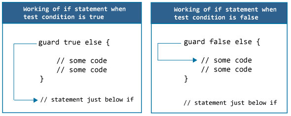

> <h4 id=""><h4/>
- [**Unmanaged**](#Unmanaged)
- [**where**](#where)
	- [条件扩展](#条件扩展)
- [**intout**](#intout)
- [**mutating**](#mutating)
- [extension](#extension)
- [**guard**](#guard)
- [**Lazy**](#Lazy的使用)
- [访问权限关键字使用](#访问权限关键字使用) 
	- [访问权限private](#访问权限private)
	- [识别原则](#识别原则)
	- [默认访问级别](#默认访问级别)
	- [自定义类型访问权限](#自定义类型访问权限)
- [**internal(set) 的使用**](#internal(set)的使用)
- [typealias](#typealias)
	- [范型中使用](#范型中使用)
	- [闭包别名简化](#闭包别名简化)
	- [与元祖结合](#v)
	- [组合协议](#组合协议)
	- [关联属性](#关联属性)
- [**associatedType协议关联类型**](#associatedType协议关联类型) 
- [where与范型约束](#where与范型约束)
- [**Any和AnyObject**](#Any和AnyObject)
- [**AnyClass**](#AnyClass)
- [**Self和discardableResult**](#Self和discardableResult)
- [**derf**](#derf)
- [**@inline(never)和@inline(__always)**](#@inline(never)和@inline(__always))
- [**@_exported**](#@_exported)
- [**__strong修饰符**](#__strong修饰符)
- [**__weak修饰符**](#__weak修饰符)
- [**__unsafe_unretained修饰符**](#__unsafe_unretained修饰符)
- [暴露给OC使用@objcMembers](#暴露给OC使用@objcMembers)
- [**编译属性**](#编译属性)
	- [NS_SWIFT_NAME在Objective-C指定Swift的名称](#NS_SWIFT_NAME在Objective-C指定Swift的名称)
- **资料：**
	- 	[Swift 关键字集锦](https://www.cnblogs.com/liYongJun0526/p/7522130.html)
	
	
	
<br/><br/><br/>

***
<br/>

> <h2 id='Unmanaged'>Unmanaged</h3>
**`不安全的代码`**

&emsp;  Swift 语言的类都是采用引用计数进行内存管理的。Swift 编译器会在每次对象被访问的时候插入增加引用计数的代码。例如，考虑一个遍历使用类实现的一个链表的例子。遍历链表是通过移动引用到链表的下一个节点来完成的：elem = elem.next，每次移动这个引用，Swift 都要增加 next 对象的引用计数并减少前一个对象的引用计数，这种引用计数代价昂贵但是只要使用 swift 类就无法避免。

```swift
final class Node {
 var next: Node?
 var data: Int
 ...
}
```
建议：使用未托管的引用避免引用计数的负荷

在效率至上的代码中你可以选择使用未托管的引用。Unmanaged结构体允许开发者对特别的引用关闭引用计数 

```swift
var Ref : Unmanaged = Unmanaged.passUnretained(Head)
  
while let Next = Ref.takeUnretainedValue().next {
  ...
  Ref = Unmanaged.passUnretained(Next)
}
```


参考资料
[^fn1]
[^fn1]: [Unmanaged](https://nshipster.cn/unmanaged/)

<br/><br/>
> <h3 id='where'>where</h3>
-  **协议使用where**

只有基类实现了当前协议才能添加扩展,也就是多个类实现了同一个协议，根据类名分别为这些类添加扩展。

```swift
protocol SomeProtocol {
    func someMethod()
}
 
class A: SomeProtocol {
    let a = 1
    
    func someMethod() {
       print("call someMethod")
    }
}
 
class B {
    let a = 2
}
 
//基类A继承了SomeProtocol协议才能添加扩展
extension SomeProtocol where Self: A {
    func showParamA() {
        print(self.a)
    }
}
//反例，不符合where条件
extension SomeProtocol where Self: B {
    func showParamA() {
        print(self.a)
    }
}


let objA = A()
let objB = B()  //类B没实现SomeProtocol， 所有没有协议方法
objA.showParamA()  //输出1
```


若是在这里柑橘看不出where的使用情况，可以看下[关键字where约束和范型的联合的实践](./../ProjectDesc/mtbp.md#关键字where约束和范型的联合)


<br/><br/>
> <h3 id="条件扩展">条件扩展</h3>

`extension Ordered where Self: Comparable` 是一个**条件扩展**（Conditional Extension）的例子，在 Swift 中是一种强大的功能，允许你为特定条件满足时的类型提供扩展方法。让我们逐步分析一下这段代码的含义。

<br/>
**1.`Ordered` 类定义**

```swift
class Ordered {
    func precedes(other: Ordered) -> Bool { fatalError("implement me!") }
}
```

这个方法的目的是比较当前实例与另一个 `Ordered` 类型的实例，并返回一个布尔值，表示当前实例是否“先于”另一个实例。当前的实现通过 `fatalError` 让这个方法抛出异常，意思是它需要在子类中实现。

<br/>
**2.`extension Ordered where Self: Comparable`**

```swift
extension Ordered where Self: Comparable {
    func precedes(other: Self) -> Bool {
        return self < other
    }
}
```

这部分是一个扩展，针对 `Ordered` 类增加了 `precedes(other:)` 方法的具体实现，并且使用了 **条件扩展**。条件扩展的意思是：**仅当某个条件（这里是 `Self` 遵循 `Comparable` 协议）成立时，才会为 `Ordered` 类添加这个扩展。**

<br/>
- **关键点：**
	- **`Self`**：在这里，`Self` 代表当前扩展的类型，`Self` 是一种泛型占位符，它会根据上下文动态确定为具体类型（比如 `Int`, `Double` 等）。当 `Ordered` 类被具体化为某个类型时，`Self` 就代表那个类型。
	- **`Comparable` 协议**：`Comparable` 是 Swift 中的一个标准协议，它要求类型提供 `<`（小于）和其他比较操作符的实现。如果某个类型遵循了 `Comparable` 协议，表示它可以进行比较操作，比如 `a < b`。
	- **`where Self: Comparable`**：这是条件扩展的核心，意思是只有当 `Self` 确定是符合 `Comparable` 协议的类型时，扩展中的方法才会被添加到 `Ordered` 类中。

<br/>

**3.具体化解释**

假设你有一个 `Ordered` 类型的子类 `IntegerOrdered`，并且 `IntegerOrdered` 遵循了 `Comparable` 协议：

```swift
class IntegerOrdered: Ordered, Comparable {
    var value: Int
    init(value: Int) {
        self.value = value
    }

    static func <(lhs: IntegerOrdered, rhs: IntegerOrdered) -> Bool {
        return lhs.value < rhs.value
    }

    static func ==(lhs: IntegerOrdered, rhs: IntegerOrdered) -> Bool {
        return lhs.value == rhs.value
    }
}
```

在这里，`IntegerOrdered` 遵循了 `Comparable` 协议，并且为 `IntegerOrdered` 类型提供了 `<` 和 `==` 的实现。由于 `IntegerOrdered` 类型遵循了 `Comparable` 协议，因此满足了 `extension Ordered where Self: Comparable` 中的条件，因此 `precedes(other:)` 方法会被自动提供，且通过 `<` 运算符进行比较。

你现在可以这样使用：

```swift
let a = IntegerOrdered(value: 5)
let b = IntegerOrdered(value: 10)

a.precedes(other: b)  // 返回 true，因为 5 < 10
```

### 总结

- **条件扩展**：`extension Ordered where Self: Comparable` 是 Swift 的条件扩展，它的作用是为 `Ordered` 类提供一个扩展方法，只有当扩展类型遵循了 `Comparable` 协议时，才会执行扩展中的方法。
- **`Self`**：代表具体类型，它在此扩展中被用来指代继承 `Ordered` 类的具体类型。
- **`Comparable` 协议**：此扩展只对符合 `Comparable` 协议的类型有效，允许使用 `<` 运算符进行比较。


<br/><br/>
> <h3 id='intout'>intout</h3>

**`使用intout注意事项：`**
-  使用 inout 关键字的函数，在调用时需要在该参数前加上 & 符号;
-  inout 参数在传入时必须为变量，不能为常量或字面量（literal）;

```
//常量使用关键字 let 来声明
格式：let constantName = <initial value>
如：let constA = 42

//字面量：就是指能够直接了当地指出自己的类型并为变量进行赋值的值，与常量无异。
//字符串型字面常量
let name = "DevZhang"

```

<br/>

-  inout 参数不能有默认值，不能为可变参数

```
//可变参数，有多个参数用省略号表示
func add(a:Int, b:Int ,others:Int ...) -> Int {
var result = a + b
for num in others {
    result += num
}
    return result
}

let number = add(2, b: 5, others: 2, 50, 4)
print(number)  //63
```

-  inout 参数不等同于函数返回值，是一种使参数的作用域超出函数体的方式
-  多个 inout 参数不能同时传入同一个变量，因为拷入拷出的顺序不定，那么最终值也不能确定

<br/>

```
struct Point {
    var x = 0.0
    var y = 0.0
}

struct Rectangle {
    var width = 0.0
    var height = 0.0
    var origin = Point()
    
    var center: Point {
        get {
            print("center GETTER call")
            return Point(x: origin.x + width / 2,
                         y: origin.y + height / 2)
        }
        
        set {
            print("center SETTER call")
            origin.x = newValue.x - width / 2
            origin.y = newValue.y - height / 2
        }
    }
    
    func reset(center: inout Point) {
        center.x = 0.0
        center.y = 0.0
    }
    
}

var rect = Rectangle(width: 100, height: 100, origin: Point(x: -100, y: -100))
print("rect.center 值：\(rect.center)\n")

rect.reset(center: &rect.center)
print("rect.center 重置后的值：\(rect.center)")
```

打印：

```
center GETTER call
rect.center 值：Point(x: -50.0, y: -50.0)

center GETTER call
center SETTER call
center GETTER call
rect.center 重置后的值：Point(x: 0.0, y: 0.0)
```

<br/>

**`inout 参数传递过程`**

-  当函数被调用时，参数值被拷贝
-  在函数体内，被拷贝的参数修改
-  函数返回时，被拷贝的参数值被赋值给原有的变量

&emsp;  官方称这个行为为：copy-in copy-out 或 call by value result。我们可以使用 KVO 或计算属性来跟踪这一过程，这里以计算属性为例。排除在调用函数之前与之后的 center GETTER call，从中可以发现：参数值先被获取到（setter 被调用），接着被设值（setter 被调用）。

&emsp;  根据 inout 参数的传递过程，可以得知：inout 参数的本质与引用类型的传参并不是同一回事。inout 参数打破了其生命周期，是一个可变浅拷贝。在 Swift 3.0 中，也彻底摒除了在逃逸闭包（Escape Closure）中被捕获。

<br/><br/>
> <h3 id='mutating'>mutating</h3>
- **`使用场景:`**
	-  结构体,枚举类型中声明修饰方法 mutating func funcName()
	-  extension, protocol 修饰 方法

<br/>

- **`注意:`**
	-  Swift 中struct,enum 均可以包含类方法和实例方法,Swift官方是不建议在struct,enum 的普通方法内修改属性变量,但是在func 前面添加 mutating 关键字之后就可以在方法内修改；     
	
	-  对于protocol 方法也是适用的,mutating 可以修饰的代理方法,如果struct,enum,class 实现协议之后也可以在其对应的 mutating 代理方法内修改本身的属性变量。(class 不影响,因为属性变量对于类的类方法,实例方法 是透明的,即随时都可以改变)

**`Test 工程中的 CustomController.swift 文件`**

```swift
import UIKit

protocol MyProtocol {
    mutating func testMutatingKeyValue(index: Int)
}

struct MyStruct: MyProtocol {
    var  index = 0
    
    //在结构体内部方法中如果修改了结构体的成员，那么该方法之前应该加入：mutating关键字
    mutating func testMutatingKeyValue(index: Int) {
        self.index = index
    } 
}

@objc class CustomController: UIViewController {

    override func viewDidLoad() {
        super.viewDidLoad()
        
        var ms = MyStruct()
        ms.testMutatingKeyValue(index: 20)
        print("index \(ms.index)")

    }
    

}

extension String {
    mutating func appendString(astring: String){
        self.append("test" + astring)
    }
}
```

<br/>

**`Test 工程中的 ViewController.m 文件`**

```swift
#import "Test-Swift.h"

@implementation ViewController
- (void)viewDidLoad {
    [super viewDidLoad];
    self.view.backgroundColor = [UIColor groupTableViewBackgroundColor];
    
    
    CustomController *cc = [CustomController new];
    [self presentViewController:cc animated:YES completion:nil];
}
```
输出：

```swift
index 20
```


<br/><br/><br/>
> <h3 id='guard'>guard</h3>
**1.Guard语句的语法**

```swift
guard expression else { 
    //语句
    //必须包含一个控制语句：return，break，continue或throw。
}

这里，expression是一个布尔表达式（返回true或者false）。
如果对表达式求值false，guard则执行代码块内的语句。
如果对表达式求值true，guard则从执行中跳过代码块内的语句
```



<br/><br/>

**2.函数内guard语句(起到解包的作用)**

```swift
func changeOptionalStringToUpperCase() {

    var name:String?
    guard let temp = name else {
        print("Name is nil. Cannot process")
        return
    }
    print("Uppercased:\(temp.uppercased())")
}

changeOptionalStringToUpperCase()
```

<br/>

**4.1具有多个条件的保护**

```swift
func changeOptionalStringToUpperCase() {
	var name:String? = ""
	guard let temp = name , temp.count > 0  else {
		print("Name is nil or an empty string. Cannot process")
		return
	}
	print("Uppercased:\(temp.uppercased())")
}


changeOptionalStringToUpperCase()

//guard----控制语句执行 即守护
let oAge: Int? = 20
//在swift3.0中，if-let和guard语句中的where都用“,”替代了
if let age = oAge , age > 18 {
     print(age)
}


 func guardTest(){
     let bAge:Int? = 30
     guard let age = bAge , age > 18 else {
         print("年龄小于18岁")
         return
     }
     print(age)
 }
 var aa: Int?? = 20
 guardTest()
```

<br/><br/>

># <h3 id='extension'>[extension](https://www.jianshu.com/p/783df05a9b59)</h3>


<br/><br/>
> <h3 id='Lazy的使用'>Lazy的使用</h3>
[lazy 简单的使用](https://www.jianshu.com/p/aa6707791ab6)


<br/><br/>

># <h2 id='访问权限关键字使用'>[访问权限关键字使用](https://swift.bootcss.com/02_language_guide/26_Access_Control#default-access-levels)</h2>

在认识和和注意**访问控制**之前，有几个概念需要弄清楚。

Swift 中的访问控制模型基于**模块**和**源文件**这两个概念。

模块指的是独立的代码单元，框架或应用程序会作为一个**独立的模块来构建和发布**。在 Swift 中，一个模块可以使用 import 关键字导入另外一个模块。

在 Swift 中，Xcode 的每个 target（例如框架或应用程序）都被当作独立的模块处理。如果你是为了实现某个通用的功能，或者是为了封装一些常用方法而将代码打包成独立的框架，这个框架就是 Swift 中的一个模块。当它被导入到某个应用程序或者其他框架时，框架的内容都将属于这个独立的模块。

源文件 就是 Swift 模块中的源代码文件（实际上，源文件属于一个应用程序或框架）。尽管我们一般会将不同的类型分别定义在不同的源文件中，但是同一个源文件也可以包含多个类型、函数等的定义。

**关键字权限图**


<br/><br/>
> <h3 id="访问权限private">访问权限private</h3>

- **1、private 修饰符**
	- private 限制实体只能在其定义的作用域，以及同一文件内的 extension 访问。
	- 如果功能的部分细节只需要在当前作用域内使用时，可以使用 private 来将其隐藏

同一文件**MyClass.swift**下代码:

```swift
enum ConnectionState {
    case disconnected
    case connecting
    case connected
    case failed(Error)
}

class MyClass {
    private var myPrivateVar = "This is private"
    
    // 只读的状态，外部只能看不能改
    private(set) var state: ConnectionState = .disconnected
    
    // 对外提供只读属性（可选）
    var currentState: ConnectionState { state }
    
    // 内部使用的方法来改变状态
    func connect() {
        state = .connecting
        // 模拟成功连接
        DispatchQueue.main.asyncAfter(deadline: .now() + 1) {
            self.state = .connected
        }
    }

    func disconnect() {
        state = .disconnected
    }

    private func fail(with error: Error) {
        state = .failed(error)
    }
    
    // 只能通过内部方法对其设值
    func setupCustom(myVar: String) {
        // 在这里可以直接访问myPrivateVar
        print(myPrivateVar)
        
        self.myPrivateVar = myPrivateVar
    }
    
    private func privateMethod() {
        print("This is a private method.")
    }
    
    func callPrivateMethod() {
        privateMethod() // 直接调用自己类的private方法，没问题
    }
}

extension MyClass {
    // 同一文件的其扩张类是可以使用的
    func anotherMethod() {
        privateMethod() // 在同一个文件中，扩展也可以访问private方法
    }
}

// 同一文件内的其他类无法访问myPrivateVar
class OtherClass {
    func tryAccess() {
        // Error: Cannot access 'myPrivateVar'
        print(MyClass().myPrivateVar)
    }
}
```

- 外部只能观察 `currentState`，而不能通过 `manager.state = ...` 强行改状态，这就保护了状态流程的完整性。
- 只能通过 `setupCustom` 方法修改myPrivateVar，不能直接操作 `myPrivateVar` 变量，避免数据被随意篡改

***

**封装原则**

| 场景              | 访问权限                       | 建议用法           |
| --------------- | -------------------------- | -------------- |
| 只读属性（外部只读，内部读写） | `private(set) var`         | 最常见，适合状态、配置等   |
| 严格内部使用（仅类内读写）   | `private var`              | 强封装，外部只能通过接口访问 |
| 子类也不能访问         | `private` 而非 `fileprivate` | 保证封装层级         |
| 限制写入方式          | 提供 `setXXX()` 方法           | 控制赋值流程或引入校验逻辑  |


<br/>


- **2、fileprivate 修饰符**
	- fileprivate 限制实体只能在其定义的文件内部访问。
	- 如果功能的部分实现细节只需要在文件内使用时，可以使用 fileprivate 来将其隐藏。


**AClass.swift文件中**

```swift

class AClass {
    private func privateMethod() {
        print("This is a private method.")
    }
    
    fileprivate func filePrivateMethod() {
        print("This is a fileprivate method.")
    }
}

extension AClass {
    func testMethods() {
        privateMethod()      // 可以访问
        filePrivateMethod()   // 可以访问
    }
}

class AnotherClass {
    func testAccess() {
        // AClass().privateMethod()  // 错误，无法访问 `private` 方法
        AClass().filePrivateMethod() // 可以访问 `fileprivate` 方法
    }
}
```

<br/>

**或者AClass.swift文件中**

```
class AClass {
    fileprivate var fileprivateVariable = "I am fileprivate"

    func printFileprivateVariable() {
        print(fileprivateVariable)
    }
}

extension AClass {
    func accessFileprivateVariable() {
        print(fileprivateVariable) // 这是合法的
    }
}
```


<br/>

- **3、public 修饰符**
	- open 和 public 级别可以让实体被同一模块源文件中的所有实体访问，在模块外也可以通过导入该模块来访问源文件里的所有实体。
	- 通常情况下，你会使用 open 或 public 级别来指定框架的外部接口。


```
public class PublicClass {
    public var publicVar = "This is public"
}

// 在另一个模块中导入并使用
import MyModule
let pc = PublicClass()
print(pc.publicVar) // 正常输出："This is public"
```


<br/>

- **4、open 修饰符**
	- open 和 public 级别可以让实体被同一模块源文件中的所有实体访问，在模块外也可以通过导入该模块来访问源文件里的所有实体。
	- 通常情况下，你会使用 open 或 public 级别来指定框架的外部接口。
	- open 只能作用于类和类的成员，它和 public 的区别主要在于 open 限定的类和成员能够在模块外能被继承和重写。


```
open class OpenClass {
    open var openVar = "This is open"
    open func openMethod() {}
}

// 在另一个模块中可以继承OpenClass
import MyModule
class DerivedClass: OpenClass {
    override func openMethod() {
        super.openMethod()
        print(openVar)
    }
}
```

<br/>

**5.internal(了解即可)**

internal 级别让实体被同一模块源文件中的任何实体访问，但是不能被模块外的实体访问。通常情况下，如果某个接口只在应用程序或框架内部使用，就可以将其设置为 internal 级别。

```
internal struct InternalStruct {
    internal var internalVar = "This is internal"
}

// 同一模块内的其他文件可以访问InternalStruct及其成员
// 但不同模块的代码无法直接访问
```

<br/>


**从高到低排序如下：**

`open > public > fileprivate > private`

<br/><br/><br/>

> <h2 id="识别原则">识别原则</h2>

有时候在想，若是类定义的private，它的属性或者方法是public怎么办？

<br/>

下面的回答，很好的解决了我的疑惑：

Swift 中的访问级别遵循一个基本原则：实体不能定义在具有更低访问级别（更严格）的实体中。

例如：

- 一个 public 的变量，其类型的访问级别不能是 internal，fileprivate 或是 private。
	- 因为无法保证变量的类型在使用变量的地方也具有访问权限。

- 函数的访问级别不能高于它的参数类型和返回类型的访问级别。
	- 因为这样就会出现函数可以在任何地方被访问，但是它的参数类型和返回类型却不可以的情况。

<br/><br/><br/>

> <h2 id="默认访问级别">默认访问级别</h2>

你代码中所有的实体，如果你不显式的指定它们的访问级别，那么它们将都有一个 **internal 的默认访问级别**，（有一些例外情况，本文稍后会有说明）。因此，多数情况下你不需要显示指定实体的访问级别。

难怪我之前制作的swift库，在用主工程的的代码调用的时候，是无法调用swift的代码的。当时还在奇怪，原来**默认的使用了internal**了。

<br/><br/>

**框架的访问级别**

当你开发框架时，就需要把一些对外的接口定义为 open 或 public 访问级别，以便使用者导入该框架后可以正常使用其功能。这些被你定义为对外的接口，就是这个框架的 API。

<br/><br/><br/>

> <h2 id="自定义类型访问权限">自定义类型访问权限</h2>

如果想为一个自定义类型指定访问级别，在定义类型时进行指定即可。新类型只能在它的访问级别限制范围内使用。例如，你定义了一个 fileprivate 级别的类，那这个类就只能在定义它的源文件中使用，可以作为属性类型、函数参数类型或者返回类型等等。

一个类型的访问级别也会影响到类型成员（属性、方法、构造器、下标）的默认访问级别。如果你将类型指定为 `private` 或者 `fileprivate `级别，那么该类型的所有成员的默认访问级别也会变成 `private` 或者 `fileprivate` 级别。如果你将类型指定为 `internal` 或 `public`（或者不明确指定访问级别，而使用默认的 `internal` ），那么该类型的所有成员的默认访问级别将是 `internal`。

> ==**重点**==
> 上面提到，一个 public 类型的所有成员的访问级别默认为 internal 级别，而不是 public 级别。如果你想将某个成员指定为 public 级别，那么你必须显式指定。这样做的好处是，在你定义公共接口的时候，可以明确地选择哪些接口是需要公开的，哪些是内部使用的，避免不小心将内部使用的接口公开。

```
public class SomePublicClass {                  // 显式 public 类
    public var somePublicProperty = 0            // 显式 public 类成员
    var someInternalProperty = 0                 // 隐式 internal 类成员
    fileprivate func someFilePrivateMethod() {}  // 显式 fileprivate 类成员
    private func somePrivateMethod() {}          // 显式 private 类成员
}

class SomeInternalClass {                       // 隐式 internal 类
    var someInternalProperty = 0                 // 隐式 internal 类成员
    fileprivate func someFilePrivateMethod() {}  // 显式 fileprivate 类成员
    private func somePrivateMethod() {}          // 显式 private 类成员
}

fileprivate class SomeFilePrivateClass {        // 显式 fileprivate 类
    func someFilePrivateMethod() {}              // 隐式 fileprivate 类成员
    private func somePrivateMethod() {}          // 显式 private 类成员
}

private class SomePrivateClass {                // 显式 private 类
    func somePrivateMethod() {}                  // 隐式 private 类成员
}
```


<br/><br/><br/>


> <h3 id='internal(set)的使用'>internal(set)的使用</h3>

[访问控制 US](https://www.cnblogs.com/xjf125/p/10088307.html)


<br/>
<br/>

> <h3 id='typealias'>typealias</h3>

&emsp; typealias 是用来为已经存在的类型重新定义名字的，通过命名，可以使代码变得更加清晰。使用的语法也很简单，使用 typealias 关键字像使用普通的赋值语句一样，可以将某个已经存在的类型赋值为新的名字

```
func distanceBetweenPoint(point: CGPoint, toPoint: CGPoint) -> Double {
    let dx = Double(toPoint.x - point.x)
    let dy = Double(toPoint.y - point.y)
    return sqrt(dx * dx + dy * dy)
}

let origin: CGPoint = CGPoint(x: 0, y: 0)
let point: CGPoint = CGPoint(x: 1, y: 1)

let distance: Double =  distanceBetweenPoint(origin, point)
```

使用typealias:

```
import UIKit

typealias Location = CGPoint
typealias Distance = Double

func distanceBetweenPoint(location: Location,
    toLocation: Location) -> Distance {
        let dx = Distance(location.x - toLocation.x)
        let dy = Distance(location.y - toLocation.y)
        return sqrt(dx * dx + dy * dy)
}

let origin: Location = Location(x: 0, y: 0)
let point: Location = Location(x: 1, y: 1)

let distance: Distance =  distanceBetweenPoint(origin, toLocation: point)
```

<br/>

> <h3 id='范型中使用'>范型中使用</h3>

一般在网络请求时，我们的回调函数总会携带一些关于当前网络请求的相关信息，用于我们的 Debug 过程。

```
typealias Handler<Number> = (Number, HTTPResponse?, Context) -> Void

typealias Success = Handler<Int>

typealias Failure = Handler<Error>

typealias Progress = Handler<Double>


class MyManager {
    var successHandler:Success?
    var failureHandler:Failure?
    //...
    func foo(success: Success, failure: Failure) {
        if isSuccess {
            success()
        } else {
            failure()
        }
    }

    func bar(success: @escaping Success, failure: @escaping Failure) {
        successHandler = success
        failureHandler = failure
        internalHandle()
    }
    // ...
    func internalHandle() {
        //...
    }
}
```

这样,我们定义的Success、Failure 和 Progress 能够传递更多的数据


<br/>
<br/>

> <h3 id='闭包别名简化'>闭包别名简化</h3>

```
typealias Success = (Int) -> Int
typealias Failure = (Error) -> Void
typealias Progress = (Double) -> Void

class MyHttpManager {
    var successHandler:Success?
    var failureHandler:Failure?
    //...
    func foo(success: Success, failure: Failure) {
        if isSuccess {
            success()
        } else {
            failure()
        }
    }

    func bar(success: @escaping Success, failure: @escaping Failure) {
        successHandler = success
        failureHandler = failure
        internalHandle()
    }
    // ...
    func internalHandle() {
        //...
    }
}

```


<br/><br/>

> <h3 id='与元祖结合'>与元祖结合</h3>

类似地，可以使用泛型和元组来定义类型，而不必去定义一个 Struct。

```
typealias TypedUserInfoKey<T> = (key: String, type: T.Type)

let integerTypedKey = TypedUserInfoKey(key: "Foo", type: Int.self)
```
就跟声明结构体一样，我们似乎声明一个具有逐一成员构造器的元祖。


<br/><br/>

> <h3 id='组合协议'>组合协议</h3>

有时会遇到这样的情况：存在多个协议，并且有一种特定的类型需要实现所有协议。
例如，在 Swift 中的 Codable 协议，就是 Decodable 和 Encodable 两个协议的 Typealias：

```
typealias Codable = Decodable & Encodable
通过这种组合协议的方式，我们的代码更具可读性。另一个例子就是：
// 载人
protocol CarriesPassengers { }

// 载货
protocol CarriesCargo { }
    
//陆地
protocol OnRoad { }

//水上
protocol OnWater { }
//车
typealias Car = CarriesPassengers & CarriesCargo & OnRoad
//船
typealias Boat = CarriesPassengers & CarriesCargo & OnWater
```
我们可以通过组合功能来实现不同的类的定义，这不失为一个解耦的好办法


<br/><br/><br/>

> <h3 id='关联属性'>关联属性</h3>


我们在 Day11 

- 协议和拓展 中讲解了协议中关联类型的用法。

```
protocol Identifiable {
    associatedtype ID: Equatable & CustomStringConvertible
    var id: ID { get }
}

struct Book: Identifiable {
    let id: String
}

struct Clothes: Identifiable {
    let id: Int
}
```

当我们不想在协议中声明一个遵循关联类型的用法时，我们可以使用 Typealias  来实现

```
protocol Identifiable {
    associatedtype ID: Equatable & CustomStringConvertible
}

struct Book: Identifiable {
    typealias ID = String
    
    let id: ID
}

struct Clothes: Identifiable {
    typealias ID = Int
    
    let id: ID
}
```


<br/><br/><br/>

> <h3 id='associatedType协议关联类型'>associatedType协议关联类型</h3>


&emsp;  定义一个协议时，有的时候声明一个或多个关联类型作为协议定义的一部分将会非常有用。关联类型为协议中的某个类型（任意类型）提供了一个占位名（或者说别名），其代表的实际类型在协议被采纳时才会被指定。你可以通过 associatedtype 关键字来指定关联类型，当然你也可以用来设计api用来构建统一的处理结构。比如使用协议声明更新cell的方法。


```
class  detail {
          //some properties
}
class  briefdetail {
          //some properties
}
class  skudetail {
          //some properties
}

protocol DTCellItemPro {
    associatedtype  T
   func updateCell(_ data: T)
}

class MyDTTableViewCell: UITableViewCell, DTCellItemPro{
    ///在类型不确定的情况下，需要声明一个或多个关联类型。
   ///相当于一个占位名。作为关联类型在协议被实现之前是不需要指定的。关键字：typealias
    typealias T = detail
    func updateCell(_ data: detail) {
             
    }
}
class MySKUTableViewCell: UITableViewCell, DTCellItemPro{
    typealias T = skudetail
    func updateCell(_ data: skudetail) {
             
    }
}
```


<br/>

**Demo**

```
protocol Container {
    associatedtype Item // 定义关联类型 Item

    var count: Int { get } // 协议要求实现一个返回元素数量的属性
    mutating func add(item: Item) // 协议要求实现一个添加元素的方法
    func getItem(at index: Int) -> Item // 协议要求实现一个获取指定位置元素的方法
}

struct MyContainer<T>: Container {
    // 在这里，关联类型 Item 被实际类型 T 替代
    typealias Item = T

    private var items: [T] = []

    var count: Int {
        return items.count
    }

    mutating func add(item: T) {
        items.append(item)
    }

    func getItem(at index: Int) -> T {
        return items[index]
    }
}

// 使用 MyContainer
var myContainer = MyContainer<String>()
myContainer.add(item: "Hello")
myContainer.add(item: "World")

print("Container count: \(myContainer.count)")
print("Item at index 1: \(myContainer.getItem(at: 1))")
```

&emsp; 在上述例子中，Container 协议定义了一个关联类型 Item，表示容器中的元素类型。然后，MyContainer 结构体遵循了 Container 协议，并使用 typealias 来指定关联类型 Item 的具体类型为 T。这样，MyContainer 结构体就可以使用泛型来定义容器的元素类型。


***
<br/><br/><br/>
> <h2 id="where与范型约束">where与范型约束</h2>

你想要：

* 使用 `enum APActivatorPeriod: Int, ActivatorPeriodProtocol { ... }` 作为类型传入泛型 `DeviceActivatorConnectingView<T>` 中；
* 在方法里调用 `view.updateView(period: .connectNet)` 之类的方法；

那就需要：

1. `APActivatorPeriod` 遵守 `ActivatorPeriodProtocol`；
2. `DeviceActivatorConnectingView` 是泛型类，但要求 `T == APActivatorPeriod`；
3. 在类中使用 `.connectNet` 枚举值时，**前提是 `T` 本身是那个枚举类型**（因为 `.connectNet` 是静态成员）。

<br/>

**1.枚举定义**

```swift
enum APActivatorPeriod: Int, ActivatorPeriodProtocol {
    case connectDevice = 1
    case connectNet = 2

    var name: String {
        switch self {
        case .connectDevice: return "连接设备"
        case .connectNet: return "连接网络"
        }
    }
}
```

<br/>

**2.泛型类支持 `updateView(period:)`，但只允许 `APActivatorPeriod`**

```swift
class DeviceActivatorConnectingView<T: ActivatorPeriodProtocol> {
    func updateView(period: T) {
        print("更新视图状态：\(period.name)")
    }
}
```

<br/>

**3.使用场景（只针对 `APActivatorPeriod`）**

```swift
func showInfo<T: ActivatorPeriodProtocol>(type: T.Type) where T == APActivatorPeriod {
    let view = DeviceActivatorConnectingView<APActivatorPeriod>()
    view.updateView(period: .connectNet)  // 这里可以用 .connectNet
}
```

这样 `view.updateView(period: .connectNet)` 不会报错，因为 Swift 已经知道 `T == APActivatorPeriod`，可以使用它的静态成员。

<br/> 

**✅ 完整示例代码：**

```swift
import Foundation

// MARK: - 协议
protocol ActivatorPeriodProtocol {
    var name: String { get }
}

// MARK: - 枚举类型作为状态
enum APActivatorPeriod: Int, ActivatorPeriodProtocol {
    case connectDevice = 1
    case connectNet = 2

    var name: String {
        switch self {
        case .connectDevice: return "连接设备"
        case .connectNet: return "连接网络"
        }
    }
}

// MARK: - 泛型类
class DeviceActivatorConnectingView<T: ActivatorPeriodProtocol> {
    func updateView(period: T) {
        print("更新视图状态：\(period.name)")
    }
}

// MARK: - 调用
func showInfo<T: ActivatorPeriodProtocol>(type: T.Type) where T == APActivatorPeriod {
    let view = DeviceActivatorConnectingView<APActivatorPeriod>()
    view.updateView(period: .connectNet)  // ✅ 使用 enum case
}

// MARK: - 运行
showInfo(type: APActivatorPeriod.self)
```

<br/>

 **输出**

```
更新视图状态：连接网络
```

<br/> 

**🔁 扩展**

你可以继续用类似的方式定义不同枚举类型，比如：

```swift
enum IPCActivatorPeriod: Int, ActivatorPeriodProtocol { ... }
```

然后：

```swift
func showInfo<T: ActivatorPeriodProtocol>(type: T.Type) where T == IPCActivatorPeriod {
    let view = DeviceActivatorConnectingView<T>()
    view.updateView(period: .someCase) // 编译器知道具体类型
}
```


<br/><br/><br/>
> <h3 id='Any和AnyObject'>Any和AnyObject</h3>


* AnyObject 可以代表任何 class 类型的实例*
* Any 可以表示任意类型，甚至包括方法（func）类型*

概念不多做介绍了，可以参考：[王巍 Any和AnyObject](http://swifter.tips/any-anyobject/)

<br/>

* 类型判断和应用

```
class Boy {
}

class Girl {
}

func enter(_ child: AnyObject) {
    // 方法1
    switch child {
    case let boy as Boy:
        print("boy")
    case let girl as Girl:
        print("girl")
    default:
        break
    }
    
    // 方法2
    if child is Boy {
        print("boy")
    }
    if child is Girl {
        print("girl")
    }
}

enter(Boy())
```


<br/><br/><br/>

> <h3 id='AnyClass'>AnyClass</h3>
 
-  AnyObject.Type

&emsp;  `AnyObject.Type` 这种方式得到的就是一个元类型`（Meta）`，也就是 `AnyClass`。在 Swift 中被一个 typealias 定义：

```
typealias AnyClass = AnyObject.Type
```

<br/>

`.self `用在类型后面取得类型本身，用在实例后面取得实例本身:
`Meta.Type `代表 `Meta` 这个类型的类型，也就是一个用来存储` Meta `类型的元类型。然后用  `.self `从 `Meta` 中取出其类型

```
class Meta {
    var title = ""
    required init(name: String) {
        self.title = name
    }
    
    func method1() {
        print(title)
    }
    
    class func method2() {
        print("class method")
    }
}

let typeMeta : Meta.Type = Meta.self
```

<br/>

- 类方法调用
- 
&emsp;  可以通过元类型直接调用 类方法，上面代码中 Meta 中声明了一个实例方法(method1)和一个类方法(method2)

```
let typeMeta1 : Meta.Type = Meta.self
typeMeta1.method2()

let typeMeta2: AnyClass = Meta.self
(typeMeta2 as! Meta.Type).method2()
```

<br/>

- 实例方法调用

&emsp;  实例方法的调用要先声明实例，直接通过 init 方法获取实例固然可以，但是我们这里介绍如果使用元类型获取实例，甚至调用实例方法

```
let typeMeta : Meta.Type = Meta.self
typeMeta.method1(Meta(name: "new meta"))()
// print: new meta
```

&emsp;  上面代码中` typeMeta` 是 `Meta.Type `类型，通过它调用实例方法 method1需要传入一个实例变量，然后系统会返回这个实例方法本身。如果上面第二行代码不好理解，看这里 :

```
let f = typeMeta.method1(Meta(name: "new meta"))
f()
```

或者

```
let meta = typeMeta.init(name: "type init")
meta.method1()
```

&emsp;  调用实例方法为什么不能直接创建实例再调用呢？例如：Meta().method1()。确实，对于一个独立的类型来说我们完全没有必要关心它的元类型，但是元类型或者元编程的概念的理解可以让你在设计框架时避免不断改动代码。下面这段代码便可看出元类型的优势：

```
class vc1: UIViewController {
}
class vc2: UIViewController {
}

func setupViewControllers(_ vcTypes: [AnyClass]) {
    for vctype in vcTypes {
        if vctype is UIViewController.Type {
            let vc = vctype.init()
            print(vc)
        }
    }
}

let usingvcTypes: [AnyClass] = [vc1.self, vc2.self]
setupViewControllers(usingvcTypes)
```

&emsp; 类似这样的用法，就可以避免你在开发中不断修改代码，也迫使你在封装代码时不断严格要求自己。


<br/><br/><br/>

> <h3 id='Self和discardableResult'>Self 和 discardableResult</h3>

```
class CustomClass {
    var a: Int
    var b: Int
    
    init(a: Int, b: Int) {
        self.a = a
        self.b = b
    }
    
    @discardableResult
    func setValueA(parameter: Int) -> Self {
        self.a = parameter
        
        return self
    }
    
    deinit {
        print("CustomClass 释放")    
    }
    
}


//调用
let obj = CustomClass(a: 1, b: 2)
//有了这个discardableResult关键字，可以没有警告⚠️了
obj.setValueA(parameter: 3)
print("objA a: \(obj.a)")
```


<br/><br/><br/>

> <h3 id='derf'>derf</h3>


[derf 的使用场景](https://www.jianshu.com/p/478cbb5cf8a1)


<br/><br/><br/>

> <h3 id='@inline(never)和@inline(__always)'>@inline(never) 和 @inline(__always)</h3>

```
@inline(never) // 声明这个函数never编译成inline的形式

@inline(__always) // 声明这个函数总是编译成inline的形式
```

inline函数可以用 闭包 的形式实现


<br/><br/><br/>


> <h3 id='@_exported'>@_exported</h3>


**`实现PCH的功能`**

```
@_exported用于在自己模块中导出其他模块。

比如，自己定义了一个 A 模块。
在 A 模块中定义：

@_exported import UIKit

当我们引入 A 模块（import A）时，可以使用 UIKit 中的符号。

````


&emsp;  在使用变量时，默认在变量前加 __strong;
&emsp;  如:

```
 id __strong  test = [[Test alloc] init];
```

<br/>


&emsp;  **`使用 init/new/copy/mutableCopy 方法返回值取得的对象是自己生成并持有的。但除了这些方法外生成的对象，是生成但不持有，可以通过一些修饰词来解决。如：__strong`**

<br/><br/><br/>

>## <h3 id='__strong修饰符'>**__strong修饰符**</h3>

&emsp;  `id类型和对象类型的所有权修饰符默认为__strong修饰符，所以不需要再写上“__strong”。`

&emsp;  通过__strong修饰符，不必再次键入retain或者release，完美的满足了“引用技术式内存管理的思考方式”

```
id __strong        obj0;
id __weak          obj1;
id __autoreleasing obj2;

//上面的赋值等同于下面的代码段
id __strong        obj0 = nil;
id __weak          obj1 = nil;
id __autoreleasing obj2 = nil;
```


<br/><br/><br/>

> <h3 id='__weak修饰符'> **__weak修饰符** </h3>

循环引用容易发生内存泄漏。

**`内存泄漏`** 就是应当废弃的对象在超出其生存周期后继续存在。


<br/><br/><br/>

>## <h3 id='__unsafe_unretained修饰符'>**__unsafe_unretained修饰符**</h3>

附有__unsafe_unretained修饰符的变量不属于编译器的内存管理对象。


***
<br/><br/><br/>
> <h2 id="暴露给OC使用@objcMembers">暴露给OC使用@objcMembers</h2>
在 Swift 中，`@objcMembers` 是一个属性（attribute），用于类（`class`）声明上，作用是：

> 自动为类中的所有 **符合条件** 的成员（属性、方法等）加上 `@objc` 属性，使它们可以暴露给 Objective-C 使用（比如被 Objective-C 调用，或用于 KVC/KVO、Selector 等机制）。

---

### ✅ 使用场景

* Swift 类需要与 Objective-C 交互时（比如和 OC 写的库交互，或者支持 `@objc` 的特性，比如 `Selector`、KVO、NSCoding 等）。
* 减少每个成员单独加 `@objc` 的繁琐写法。

---

### 🔁 示例对比

#### 不使用 `@objcMembers`

```swift
class MyClass: NSObject {
    @objc var name: String = ""
    @objc func greet() {
        print("Hello")
    }
}
```

#### 使用 `@objcMembers`

```swift
@objcMembers
class MyClass: NSObject {
    var name: String = ""
    func greet() {
        print("Hello")
    }
}
```

两个类在暴露给 Objective-C 时是等价的。

---

### ⚠️ 注意事项

1. **必须继承自 `NSObject`** 才能使用 `@objcMembers`。否则会报编译错误。
2. **只有兼容 Objective-C 的类型和成员** 才能成功暴露（比如 `String`、`Int`、`NSObject` 子类等）。
3. 如果成员不满足 `@objc` 要求（比如是 Swift 特有的类型，结构体等），即使用了 `@objcMembers`，也不会自动变成 `@objc`。

---

### ✅ 总结

| 特性       | 说明                                        |
| -------- | ----------------------------------------- |
| 作用范围     | 整个类的成员                                    |
| 必须继承自    | `NSObject`                                |
| 可暴露的成员限制 | 仅限可表示为 Objective-C 的成员                    |
| 常用于      | KVO、NSCoding、Selector、与 Objective-C 桥接等场景 |

是否你是在写和 Objective-C 交互的代码，想了解如何让 Swift 类支持 KVO 或其他特性？我可以帮你具体分析。


<br/>

***
<br/><br/><br/>

> <h1 id="编译属性">编译属性</h1>

<br/><br/><br/>

> <h2 id="NS_SWIFT_NAME在Objective-C指定Swift的名称">NS_SWIFT_NAME在Objective-C指定Swift的名称</h2>

`NS_SWIFT_NAME` 是一个编译器属性，用于在 Swift 中**指定 Objective-C 符号的 Swift 名称**。在将 Objective-C 的 API 曝露给 Swift 时，可以使用 `NS_SWIFT_NAME` 为方法、类、枚举、属性等指定更符合 Swift 风格的名称，使代码更简洁、符合 Swift 命名习惯。

### 作用
在混合开发时，通过 `NS_SWIFT_NAME` 可以：
1. **提升 API 可读性**：为 Swift 代码指定简洁、直观的名称，使得 Objective-C 的冗长或不符合 Swift 风格的命名变得更加符合 Swift 规范。
2. **便于使用**：减少复杂的类型名称、方法名转换，方便开发者调用 API。

### 常见用法示例

#### 1. 给类或方法重命名
假设有一个 Objective-C 类或方法，其名称不符合 Swift 命名习惯，可以使用 `NS_SWIFT_NAME` 指定 Swift 中显示的名称。

**Objective-C 代码**
```objc
// Objective-C 中的一个类
@interface MyOldClassName : NSObject
- (void)performOperationWithArgument:(NSString *)argument NS_SWIFT_NAME(performOperation(argument:));
@end
```

**Swift 中的效果**
```swift
let myObject = MyOldClassName()
myObject.performOperation(argument: "test") // 使用 Swift 样式的调用
```

在上面的代码中，`performOperationWithArgument:` 被重命名为 `performOperation(argument:)`，这样就符合 Swift 中的参数标签语法。

#### 2. 修改枚举名称
在 Objective-C 中，枚举通常有前缀，比如 `MyEnumValueA`、`MyEnumValueB`。使用 `NS_SWIFT_NAME` 可以在 Swift 中定义更简洁的名称。

**Objective-C 代码**
```objc
typedef NS_ENUM(NSInteger, MyEnum) {
    MyEnumValueA NS_SWIFT_NAME(valueA),
    MyEnumValueB NS_SWIFT_NAME(valueB),
};
```

**Swift 中的效果**
```swift
let myValue: MyEnum = .valueA // 更加简洁的 Swift 枚举用法
```

#### 3. 修改属性名称
也可以为属性指定 Swift 名称。

**Objective-C 代码**
```objc
@property (nonatomic, copy) NSString *userFullName NS_SWIFT_NAME(fullName);
```

**Swift 中的效果**
```swift
let user = MyClass()
user.fullName = "John Doe" // 使用更符合 Swift 风格的属性名
```

### 使用 `NS_SWIFT_NAME` 的注意事项
- **命名一致性**：确保 Swift 名称符合 Swift 命名惯例，通常使用驼峰命名，简洁清晰。
- **保持参数一致**：如果更改方法名时更改了参数标签，要确保方法功能保持一致。
- **跨语言兼容性**：通过 `NS_SWIFT_NAME`，可以保持 Objective-C 和 Swift API 的一致性，方便跨语言调用。

### 总结
`NS_SWIFT_NAME` 是一个有助于在 Swift 中优化 Objective-C API 命名的编译器指令，通过它可以实现更 Swift 风格的调用方式，提高代码的可读性和一致性。在混合语言项目中，`NS_SWIFT_NAME` 是提升接口友好度和开发效率的有力工具。


