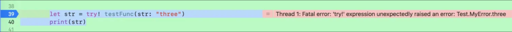

> <h2 id=''></h2>
- [**值引用类型**](#值引用类型)
	- [**引用类型**](#引用类型)
		- [引用类型使用intout参数，意义不大](#引用类型使用intout参数，意义不大)
		- [使用intout注意事项](#使用intout注意事项)
		- [inout 参数不能有默认值，不能为可变参数](#inout参数不能有默认值，不能为可变参数)
		- [inout 参数传递过程](#inout参数传递过程)
	- [**嵌套类型**](#**嵌套类型**)
		- [值类型嵌套值类型](#值类型嵌套值类型)
		- [值类型嵌套引用类型](#值类型嵌套引用类型)
		- [引用类型嵌套值类型](#引用类型嵌套值类型)
- [**枚举**](#枚举)
	- [枚举原始值](#枚举原始值)
	- [枚举关联值](#枚举关联值)
- [**结构体**](#结构体)
- [**集合**](#集合)
	- [Set集合与NSArray、Dictionary区别](#Set集合与NSArray、Dictionary区别)
- [**函数**](#函数)
	- [**函数使用**](#函数使用)
	- [内部参数和外部参数](#内部参数和外部参数)
	- [默认参数](#默认参数)
	- [判断是否为空](#判断是否为空)
	- [可变参数](#可变参数)
	- [引用类型（指针传递）](#引用类型（指针传递）)
	- [map和flatMap区别](#map和flatMap区别)
- [**函数作为参数**](#函数作为参数)
	- 	[函数可以作为另一个函数的返回值](#函数可以作为另一个函数的返回值)
	- 	[函数也可以当做参数传入另一个函数](#函数也可以当做参数传入另一个函数)
- [**闭包**](#闭包)
	- [**闭包变量**](#闭包变量)
	- [**闭包参数**](#闭包参数)
	- [**闭包捕获**](#闭包捕获)
	- [**闭包的柯西特性**](#闭包的柯西特性)
- [**异常**](#异常)
	- [throwing函数](#throwing函数)
	- [**三者区别**](#三者区别)
		- [try? 的使用](#try?的使用)
		-	[try!](#try!)
		-	[try](#try)
	-	[**泛型协议**](#泛型协议)
		-	[泛型](#泛型)
		-	[协议](#协议)
			-	[Sequence协议](#Sequence协议)
			-	[AsyncSequence 协议](#AsyncSequence协议)
-	[**并发**](#并发)
	-	**资料**
		-	[Swift并发体验](https://juejin.cn/post/7054058830304870414)
	-	[异步函数定义](#异步函数定义)
		- [异步函数掉用流程](#异步函数掉用流程)
		- [异步序列](#异步序列)
		- [并行的调用异步方法](#并行的调用异步方法)
		- [非结构化并发](#非结构化并发)
- **参考资料**
	- [**swift的值类型和引用类型**](https://www.cnblogs.com/luoxiaofu/p/8528383.html)
	- [**枚举由浅入深**](https://blog.csdn.net/qq_34047841/article/details/78489380)
	- [**自定义写UIViewController的初始化方法**](https://www.jianshu.com/p/433afbb0f510)
	- [**初始化说起**](https://www.jianshu.com/p/fb1a91600468)
	- [Swift的init方法](https://www.jianshu.com/p/61fb73de4fcd)
	- [**@autoclosure自动闭包**](https://juejin.cn/post/6844903424413138958)
	- [闭包](https://zhuanlan.zhihu.com/p/92464947)
	- [Swift 中的协议、泛型、不透明类型](https://zzzw.cool/Swift-中的协议)
	[Swift 性能优化(1)——基本概念(楚权的世界)](http://chuquan.me/2020/02/15/swift-performance-optimization-basic-concepts/)


<br/>

***
<br/>


># <h1 id='值引用类型'>值引用类型</h1>


```
class SwiftClass {
    var name: String?
    var height = 0.0
    var width = 0.0
    
    var description: String {
        return "ResolutionClass(height: \(height), width: \(width))"
    }
    
    func printString(alert: String) -> Void {
        print("\(alert)")
    }
}

struct SwiftStruct {
    var height = 0.0
    var width = 0.0
}
```

<br/>
<br/>
<br/>

> <h2 id='引用类型'>引用类型</h2>


<br/>

> <h3 id='引用类型使用intout参数，意义不大'>引用类型使用intout参数，意义不大</h3>

```
func swap(clss: inout SwiftClass) {
    //打印引用类型变量指向的内存地址
    print("During calling: \(Unmanaged.passUnretained(clss).toOpaque())")
    let temp = clss.height
    clss.height = clss.width
    clss.width = temp
}


sc.height = 1080
sc.width = 1920
print(sc)
print("Before calling: \(Unmanaged.passUnretained(sc).toOpaque())")
swap(clss: &sc)
print(sc)
print("After calling: \(Unmanaged.passUnretained(sc).toOpaque())")
```

打印：

```
SwiftTest.SwiftClass

Before calling: 0x000000010284b5d0

During calling: 0x000000010284b5d0

SwiftTest.SwiftClass

After calling: 0x000000010284b5d0
```

<br/>
<br/>
<br/>

<h3 id='使用intout注意事项'>使用intout注意事项：</h3>

- 使用 inout 关键字的函数，在调用时需要在该参数前加上 & 符号;
- inout 参数在传入时必须为变量，不能为常量或字面量（literal）;


```
//常量使用关键字 let 来声明
格式：let constantName = <initial value>
如：let constA = 42

//字面量：就是指能够直接了当地指出自己的类型并为变量进行赋值的值，与常量无异。
//字符串型字面常量
let name = "DevZhang"
```


<br/>
<br/>

> <h3 id='inout参数不能有默认值，不能为可变参数'>inout 参数不能有默认值，不能为可变参数</h3>

```
//可变参数，有多个参数用省略号表示
func add(a:Int, b:Int ,others:Int ...) -> Int {
	var result = a + b
	
	for num in others {
		result += num
	}
    return result
}

let number = add(2, b: 5, others: 2, 50, 4)
print(number)  //63
```

-  inout 参数不等同于函数返回值，是一种使参数的作用域超出函数体的方式
-  多个 inout 参数不能同时传入同一个变量，因为拷入拷出的顺序不定，那么最终值也不能确定


<br/>

```
struct Point {
    var x = 0.0
    var y = 0.0
}

struct Rectangle {
    var width = 0.0
    var height = 0.0
    var origin = Point()
    
    var center: Point {
        get {
            print("center GETTER call")
            return Point(x: origin.x + width / 2,
                         y: origin.y + height / 2)
        }
        
        set {
            print("center SETTER call")
            origin.x = newValue.x - width / 2
            origin.y = newValue.y - height / 2
        }
    }
    
    func reset(center: inout Point) {
        center.x = 0.0
        center.y = 0.0
    }
    
}

var rect = Rectangle(width: 100, height: 100, origin: Point(x: -100, y: -100))
print("rect.center 值：\(rect.center)\n")
rect.reset(center: &rect.center)
print("rect.center 重置后的值：\(rect.center)")

```

打印：

```
center GETTER call
rect.center 值：Point(x: -50.0, y: -50.0)

center GETTER call
center SETTER call
center GETTER call
rect.center 重置后的值：Point(x: 0.0, y: 0.0)
```

<br/>
<br/>

<h3 id='inout参数传递过程'>inout 参数传递过程</h3>

-  当函数被调用时，参数值被拷贝
-  在函数体内，被拷贝的参数修改
-  函数返回时，被拷贝的参数值被赋值给原有的变量

&emsp;  官方称这个行为为：copy-in copy-out 或 call by value result。我们可以使用 KVO 或计算属性来跟踪这一过程，这里以计算属性为例。排除在调用函数之前与之后的 center GETTER call，从中可以发现：参数值先被获取到（setter 被调用），接着被设值（setter 被调用）。

&emsp;  根据 inout 参数的传递过程，可以得知：inout 参数的本质与引用类型的传参并不是同一回事。inout 参数打破了其生命周期，是一个可变浅拷贝。在 Swift 3.0 中，也彻底摒除了在逃逸闭包（Escape Closure）中被捕获。


<br/>
<br/>

> <h2 id='嵌套类型'>嵌套类型</h2>

<br/>

> <h3 id='值类型嵌套值类型'>值类型嵌套值类型</h3>


<br/>
<br/>

> <h3 id='值类型嵌套引用类型'>值类型嵌套引用类型</h3>


<br/>
<br/>

> <h3 id='引用类型嵌套值类型'>引用类型嵌套值类型</h3>


<br/>

***
<br/>
<br/>

># <h1 id='枚举'>枚举</h1>

```
enum WeekDay {

   case Monday

   case Tuesday

   case Wednesday

   case Thursday

   case Friday

   case Saturday

   case Sunday

}
```

<br/>

```
func enumTest () {
    let day:WeekDay = .Wednesday

    switch day {
    case .Wednesday:
        print("今天是星期三")
        
    case .Saturday:
        print(":)")
        
    case .Sunday:
        print(":)")
        
    default:  //使用枚举表示来表示其它的选项，否则编译can't 通过
        print(":(")
     
    }
}

//调用
self.enumTest()
```

打印：

```
今天是星期三
```

&emsp;  但是这样会报出一个丑陋的黄色警告⚠️:`Switch condition evaluates to a constant`，这可能是编译器认为变量在函数内部是不变造成的。可以把这个变量作为类的常量属性就不会报错了。

```
class ViewController: UIViewController {
      let day:WeekDay = .Wednesday
}
```

&emsp;  如果没有`default`我们需要把枚举的每一项都要列举出来，否则会编译不通过，所以我们可用default来进行偷懒，来表示其他case情况。


<br/>
<br/>


> <h2 id='枚举原始值'>枚举原始值</h2>


**`枚举原始值:`** 每一个枚举项提供一个默认值，这个默认值是在编译的时候就确定的。

```
enum WeekDayWithRaw : String {  //后面有一个String，表示是一个字符串类型的枚举
 
    case Monday = "1. Monday"

    case Tuesday = "2. Tuesday"

    case Wednesday = "3. Wednesday"

    case Thursday = "4. Thursday"

    case Friday = "5. Friday"

    case Saturday = "6. Saturday"

    case Sunday = "7. Sunday"
 
}
```

<br/>

通过原始值进行初始化：

```
let day = WeekDayWithRaw(rawValue: "3. Wednesday") //是一个可选的枚举,也就是Optionals 的类型
       
if let tday = day {
   print("这个 day 是： \(tday)")
}else{
   print("init fail")
}

```
打印

```
这个 day 是： Wednesday
```

<br/>

枚举输出

```
let day = WeekDayWithRaw.Saturday.rawValue
print("这个 day 是： \(day)")
```

打印：

```
这个 day 是： 6. Saturday
```

<br/>

初始化不存在的值，用可选判定

```
let day = WeekDayWithRaw(rawValue: "No Exist Value")
if let thisDay = day {
    print("this day is: \(thisDay)")
}else {
    print("不知是何年何月")
}
```


<br/>
<br/>

> <h2 id='枚举关联值'>枚举关联值</h2>


**`关联值`：** 枚举的枚举项每一个都有附加信息，来扩充这个枚举项的信息表示,如下：

```
//定义一个表示学生类型的枚举类型 StudentType，他有三个成员分别是pupil、middleSchoolStudent、collegeStudents
enum StudentType {
    case pupil(String)
    case middleSchoolStudent(Int, String)
    case collegeStudents(Int, String)
}
```

<br/>

这里我们并没有为StudentType的成员提供具体的值，而是为他们绑定了不同的类型，分别是pupil绑定String类型、middleSchoolStudent和collegeStudents绑定（Int， String）元祖类型。接下来就可以创建不同StudentType枚举实例并为对应的成员赋值了。

```
//student1 是一个StudentType类型的常量，其值为pupil（小学生），特征是"have fun"（总是在玩耍）
let student1 = StudentType.pupil("have fun")

//student2 是一个StudentType类型的常量，其值为middleSchoolStudent（中学生），特征是 7, "always study"（一周7天总是在学习）
let student2 = StudentType.middleSchoolStudent(7, "always study")

//student3 是一个StudentType类型的常量，其值为collegeStudent（大学生），特征是 7, "always LOL"（一周7天总是在撸啊撸）
let student3 = StudentType.middleSchoolStudent(7, "always LOL")
```

<br/>

这个时候如果需要判断某个StudentType实例的具体的值就需要这样做了：

```
switch student3 {
      case .pupil(let things):
          print("is a pupil and \(things)")
      case .middleSchoolStudent(let day, let things):
          print("is a middleSchoolStudent and \(day) days \(things)")
      case .collegeStudent(let day, let things):
          print("is a collegeStudent and \(day) days \(things)")
    }
```  
控制台输出：

```
is a collegeStudent and 7 days always LOL
```


&emsp; 看到这你可能会想，是否可以为一个枚举成员提供原始值并且绑定类型呢，答案是不能的！

&emsp; 因为首先给成员提供了固定的原始值，那他以后就不能改变了；

&emsp; 而为成员提供关联值(绑定类型)就是为了创建枚举实例的时候赋值。这不是互相矛盾吗。


<br/>

***
<br/><br/>

> <h1 id='结构体'>结构体</h1>

结构体是由一系列具有相同类型或不同类型的数据构成的数据集合。

结构体是一种值类型的数据结构，在Swift中常常使用结构体封装一些属性甚至是方法来组成新的复杂类型，目的是简化运算。


```
//定义一个 Student（学生）类型的结构体用于表示一个学生，Student的成员分别是语、数、外三科`Int`类型的成绩
 struct Student {
    var chinese: Int
    var math: Int
    var english: Int
    
    
    init() {}
    init(chinese: Int, math: Int, english: Int) {
          self.chinese = chinese
          self.math = math
         self.english = english
    }
    
    /// 自定义初始化方法
    init(stringScore: String) {
             let cme = stringScore.characters.split(separator: ",")
             chinese = Int(atoi(String(cme.first!)))
             math = Int(atoi(String(cme[1])))
             english = Int(atoi(String(cme.last!)))
        }
 }
```


看到上述代码我们可能已经发现了一点结构体和类的区别了：**定义结构体类型时其成员可以没有初始值**。

如果使用这种格式定义一个类，编译器是会报错的，他会提醒你这个类没有被初始化。

<br/>


结构体初始化:

```
//使用Student类型的结构体创建Student类型的实例（变量或常量）并初始化三个成员（这个学生的成绩会不会太好了点）
let student2 = Student(chinese: 90, math: 80, english: 70)

let student7 = Student(chinese: 90, math: 80, english: 70)

//自定义初始化方法
let student8 = Student(stringScore: "70,80,90")
```


<br/>

***
<br/><br/><br/>

> <h1 id='集合'>集合</h1>


<br/><br/><br/>

> <h2 id='Set集合与NSArray、Dictionary区别'>Set集合与NSArray、Dictionary区别</h2>


- **1.Set集合特性:**
	- **无序性:** Set 不保证其元素的任何特定顺序。这意味着当你遍历一个 Set 或打印其内容时，元素可能出现的顺序是不确定的，每次可能都会有所不同。
	
	- **唯一性:** Set 保证其内不包含重复元素.这一特性使得 Set 非常适用于需要检查成员资格（是否存在某元素）、去重、以及计算集合交集、并集、差集等操作的场景。
	
<br/>


- **2.创建和初始化几种方式:**


```
使用空的构造器创建一个指定类型元素的空集合：var mySet: Set<Int> = Set()

通过数组字面量初始化：var mySet: Set<String> = ["apple", "banana", "orange"]

从现有集合、数组或其他序列类型创建：let array = ["a", "b", "c"]; let setFromArray = Set(array)

使用 Set(arrayLiteral:) 构造器：let set2 = Set(arrayLiteral: 1, 2, 3)
```


<br/>


**3.常用操作: Set 提供了一系列方法和操作符用于管理集合内容和执行集合间运算，包括但不限于：**

```
添加元素：mySet.insert(element)

删除元素：mySet.remove(element)

检查成员资格：if mySet.contains(element) { ... }

合并（并集）：let unionSet = set1.union(set2)

交集：let intersectionSet = set1.intersection(set2)

差集（去除相同元素）：let differenceSet = set1.subtracting(set2)

计算集合大小（元素数量）：let count = mySet.count

清空集合：mySet.removeAll()
```


<br/>

***
<br/><br/><br/>

> <h1 id='函数'>函数</h1>

<br/>

> <h2 id='函数使用'>函数使用</h2>

<br/>

><h3 id='内部参数和外部参数'>内部参数和外部参数</h3>

- 在函数内部可以看到的参数,就是内部参数;

- 在函数外面可以看到的参数,就是外部参数;

- 默认情况下,从第二个参数开始,参数名称既是内部参数也是外部参数;

- 如果第一个参数也想要有外部参数,可以设置标签:在变量名前加标签即可;

- 如果不想要外部参数,可以在参数名称前加`_`;

```
// 默认情况下,从第二个参数开始,参数名称既是内部参数也是外部参数
func calculate_one(num1 : Int, num2 : Int, num3 : Int) -> Int {
   return num1 * num2 * num3
}

let result_one = self.calculate_one(num1: 1, num2: 2, num3: 3)
print("--->> calculate_one: \(result_one)")
```
打印：

```
--->> calculate_one: 6
```


<br/>

```
// 如果第一个参数也想要有外部参数，在变量名前加标签即可，如果不想要，在参数名前加 _
func calculate_two(myNum1 num1 : Int, _ num2 : Int, num3 : Int) -> Int {
   return num1 * num2 * num3
}

let result_two = self.calculate_two(myNum1: 4, 5, num3: 6)
print("--->> calculate_two: \(result_two)")
```

打印：

```
--->> calculate_two: 120
```

<br/>

```
// 方法的重载:方法名称相同,但是参数不同,可以称之为方法的重载
func calculate_three(num1: Int, _ num2 :Int) -> Int {
   return num1 * num2
}

let resutl_three = self.calculate_three(num1: 7, 8)
print("--->> calculate_three: \(resutl_three)")

```

打印：

```
--->> calculate_three: 56
```

<br/>
<br/>

># <h3 id='默认参数'>**`默认参数`**</h3>


若没有传入具体参数，可以使用默认参数。

```
public init(context: MapContext? = nil, shouldIncludeNilValues: Bool = false){
		self.context = context  //默认值 context 为nill
		self.shouldIncludeNilValues = shouldIncludeNilValues  // 默认值 shouldIncludeNilValues 为false
	}


public init(mappingType: MappingType, JSON: [String: Any], toObject: Bool = false, context: MapContext? = nil, shouldIncludeNilValues: Bool = false) {

}

//调用，toObject 省略了
let map = Map(mappingType: .fromJSON, JSON: json, context: context1, shouldIncludeNilValues: shouldIncludeNilValues)


func makecoffee(type :String = "卡布奇诺") -> String {
    return "制作一杯\(type)咖啡。"
}

print(makecoffee(type: "拿铁"))
print(makecoffee())

```
打印：

```
制作一杯拿铁咖啡。

制作一杯卡布奇诺咖啡。
```


<br/>
<br/>

># <h3 id='判断是否为空'>`判断是否为空`</h3>


```
if response.result is NSNULL {

}

```


<br/>

> <h3 id='可变参数'>可变参数</h3>

函数的参数个数可以不确定，但必须是相同类型，在参数类型名后面加入（…）来指示这是可变参数

```
func sum(numbers:Double...) -> Double {
    var total: Double = 0
    for number in numbers {
        total += number
    }
    return total
}


let three = sum(numbers: 100.0, 20, 30)
print("---> 3个数之和：\(three)")

let two = sum(numbers: 30, 80)
print("---> 2个数之和：\(two)")

```
打印：

```
---> 3个数之和：150.0

---> 2个数之和：110.0
```


<br/>
<br/>

> <h3 id='引用类型（指针传递）'>引用类型（指针传递）</h3>

 默认情况函数的参数是值传递，如果想改变外面的变量，则需要传递变量的地址，swift 提供 inout关键字就可以实现。注意：必须是变量

```
func swap2( m : inout Int, n : inout Int) {
     let temp = m
     m = n
     n = temp
     print("函数内的值：m:\(m), n:\(n)")
 }


var m = 10
var n = 20
swap2(m: &m, n: &n)

print("---->>> 调用后的值：m:\(m), n:\(n)")

```
打印：

```
函数内的值：m:20, n:10

---->>> 调用后的值：m:20, n:10
```


<br/><br/>


> <h2 id='map和flatMap区别'>map和flatMap区别</h2>


- **1).map**: 对元素进行闭包定义的映射操作

以下是map的定义,接收一个闭包，且类型为Element

```
@inlinable public func map<T>(_ transform: (Element) throws -> T) rethrows -> [T]
```

<br/>

map函数常⽤⽅式: 

```
let arr= [1,2,3]
let result=arr.map{ $0 *2}
let arr1 = ["HELLO","WORLD"]
let arr1Small = arr1.map{ $0.lowercased() }
let arr1StrCount = arr1.map{ $0.count }
let arr1String=arr1.map {"No. \($0)"}
```


<br/>
<br/>


- **2).flatMap**: 是将⼀个集合中的所有元素进⾏闭包定义的映射操作，添加到另⼀个集合

```
@inlinable public func flatMap<SegmentOfResult>(_ transform: (Element) throws ->
SegmentOfResult) rethrows -> [SegmentOfResult.Element] where SegmentOfResult
: Sequence
```
<br/>

flatMap常⽤⽅式:

```
letstr:String? ="10"
letstrflat=str.flatMap{ $0 }
```

<br/>
<br/>


- **3).map与flatMap的区别:**

	- **3.1). map不会对数组的结构造成影响；⽽flatMap会影响数组的结构,例如将多维数组转化为⼀维数组**

```
letarr= [[1,2,3],[4,5]]

let map = arr.map{ $0.map{ $0 * 2} }//[[2, 4, 6], [8, 10]]

letflatMap=arr.flatMap{ $0.map{ $0 *2} }//[2, 4, 6, 8, 10] 
```

<br/>


**3.2). flatMap对只有解包成功的元素，才会添加到集合中，可实现过滤数组中的nil值等，并且会对数组中的可选类型⾃动解包**

```
let a:String? ="10"
let arr= ["a","b",nil,a]

let map = arr.map{ $0 }
//输出[Optional("a"), Optional("b"), nil, Optional("10")]

let flatMap = arr.flatMap{ $0 }
//输出["a", "b", "10"]
```


<br/>
<br/>

> <h2 id='函数作为参数'>函数作为参数</h2>

<br/>

> <h3 id='函数可以作为另一个函数的返回值'>函数可以作为另一个函数的返回值</h3>

```

func makeIncrementer() ->((Int) -> Int) {
   func addOne(number: Int) -> Int {
       return 1 + number
   }
   return addOne
}

//初始化当前函数，increment为当前函数的返回值,也是一个函数
+ var increment = makeIncrementer()


//increment函数中传入值
- let result = increment(7)

print(result)

```

<br/>
<br/>

> <h3 id='函数也可以当做参数传入另一个函数'>函数也可以当做参数传入另一个函数</h3>

```

func hasAnyMatches(list:[Int], condition:(Int) -> Bool) ->Bool {
  for item in list {
      if condition(item) {
          return true;
      }
  }
  return false;
}


func lessThanTen(number: Int) ->Bool {
  return number < 10
}

let number = [8, 9, 10, 11]
let result = hasAnyMatches(list: number, condition: lessThanTen)


+ //执行顺序：先遍历 number 为 item,在将item传入第二个函数 condition获取结果
print(result)

```


<br/>

***
<br/>
<br/>


> <h1 id='闭包'>闭包</h1>

<br/>

***
<br/>


># <h1 id='闭包'>闭包</h1>

<br/>
<br/>

> <h2 id=' 闭包变量'> 闭包变量</h2>

```
var mySecondClosure:(_ a: Int, _ b: Int) -> Int = {
        (a: Int, b: Int) -> Int in
        return a * b
    }


let c = mySecondClosure(3, 5)
print("闭包变量 mySecondClosure 的闭包值：\(c)")

```
打印：

```
闭包变量 mySecondClosure 的闭包值：15
```

<br/>
<br/>

> <h2 id='闭包参数'>闭包参数</h2>

```
func myOperation(_ a: Int, _ b: Int, operation: (_ oa: Int, _ ob: Int) -> Int) -> Int {
        let res = operation(a, b)
        return res
    }


//使用
/*

//被捕获的参数列表中，含有a、b，下标从0开始，可通过"$"获取。
//编译器亦可通过，捕获列表自行推断出参数。
//故可省略参数列表 （a, b）和 关键字 in 
let multipyClosure:(Int, Int) -> Int = {
      $0 * $1
}
  
//若函数体只包含一句 return 代码，可省略 return      
let multipyClosure = {
      (a: Int, b: Int) in
       a * b
 }
 */

//上述两个闭包的写法与下同样        
let multipyClosure = {
      (a: Int, b: Int) in
       return a * b
}
        
let d = myOperation(9, 10, operation: multipyClosure)
print("参数闭包 operation 返回值：\(d)")


//闭包的展开-----------------------------------------------

func myOperation(_ a: Int, _ b: Int, operation: (_ oa: Int, _ ob: Int) -> Int) -> Int {
        let res = operation(a, b)
        return res
}

let d = self.myOperation(9, 10) { (a: Int, b: Int) -> Int in
      return a * b
 }
print("参数闭包 operation 返回值:  \(d)")        

```
打印：

```
参数闭包 operation 返回值：90
```

<br/>
<br/>

> <h2 id='闭包捕获'>闭包捕获</h2>

```
var count = 2
let incrementCount = {
    count += 8
}

incrementCount()
print("第 1 次计算: \(count)")

incrementCount()
print("第 2 次计算: \(count)")
```
打印：

```
第 1 次计算: 10

第 2 次计算: 18
```

&emsp;  由于闭包定义和变量count在同一作用域中，故闭包可以捕获并访问变量count。对变量counter做的任何改变，对闭包来说都是透明可见的。

<br/>
<br/>

> <h3 id='函数捕获值'>函数捕获值</h3>

```
func countingClosure() -> () -> Int {
	var counter = 0
	let incrementCounter: () -> Int = {
	    counter += 1
	    return counter
	}
	return incrementCounter
}


//该例子中，闭包捕获了封闭空间（函数实体内）的内部变量counter。
let counter1 = countingClosure()  //返回的是一个 () -> Int 闭包 
let counter2 = countingClosure()

let count_1 = counter1() // 1, 执行 () -> Int 闭包中的函数定义
print("\(String(describing: count_1))")

let count_2 = counter2() // 1
print("\(String(describing: count_2))")

let count_3 = counter1() // 2
print("\(String(describing: count_3))")

let count_4 = counter1() // 3
print("\(String(describing: count_4))")

let count_5 = counter2() // 2
print("\(String(describing: count_5))")
```
打印：

```
1
1
2
3
2
```


<br/>
<br/>

<h2 id="闭包的柯西特性">闭包的柯西特性</h2>

```
func keXiTest_add(adder: Int)-> (Int) -> Int {
    print("🍎 \(adder)")
    return { num in
        print("🍎 \(adder) 和 \(num)")

        return num + adder;
    }
}    
    
//上面相当于下面的
//定义一个接收参数num1，返回一个接收参数num2 的函数，并且这个函数的返回值是为Int类型的函数
func keXiTest_add2(num1 : Int) -> (_ num2 : Int) -> Int {
    print("🍊 \(num1)")

    //一个接收参数num2的函数，并且有返回结果为Int类型的函数
    return { (num2: Int) -> Int in
        print("🍊 \(num1) 和 \(num2)")

        
        return num1 + num2
    }
}


//方法调用
//实现一个数加2 ，这里就是接收需要相加的数字，并且返回一个函数 Int -> Int,其实这就是一个闭包
let addTwo = keXiTest_add(adder: 2)
//返回的函数将接收输入的数字，也就是我们这里的4.然后进行操作返回结果
let result = addTwo(4)
print("🍎 柯西特性测试 result: \(result)")


let addTwo2 = keXiTest_add2(num1: 2)
//返回的函数将接收输入的数字，也就是我们这里的4.然后进行操作返回结果
let result2 = addTwo2(4)
print("🍊 ----》柯西特性测试2 result: \(result2)")

```

打印:

```
🍎 2
🍎 2 和 4
🍎 柯西特性测试 result: 6
🍊 2
🍊 2 和 4
🍊 ----》柯西特性测试2 result: 6
```


总结： 其实根本就不是什么柯西特性，而是闭包的返回。其返回值不再是一个具体类型的值，而是一个闭包。


<br/>

***
<br/>
<br/>


># <h1 id='异常'>[异常](https://gitbook.swiftgg.team/swift/swift-jiao-cheng/17_error_handling)</h1>

- Swift1.0版本 Cocoa Touch 的 NSError ,Swift并没有真正的具备自己的异常处理机制；
-  Swift2.0版本 加入 ErrorType protocol；
-  Swift3.0版本 改名 Error protocol；

&emsp;  Swift3.0 Error protocol 的使用首先定义一个枚举,集成协议Error (Swift 2.0 的协议叫做ErrorType,3.0后协议改名Error)

```
enum MyError : Error {
    case one
    case two
    case three
}
```


<br/><br/>

> <h2 id='throwing函数'>throwing函数</h2>

什么是throwing函数函数呢?

&emsp; "throwing函数"通常是指能够抛出错误的函数。Swift使用错误处理机制来处理在程序执行过程中可能发生的错误或异常情况。与其他语言中使用异常处理类似，Swift使用错误处理来响应和传播错误。

```
enum CustomError: Error {
    case someError
}

func throwingFunction() throws {
    // 这个函数可能会抛出错误
    throw CustomError.someError
}

do {
    try throwingFunction()
    // 如果没有抛出错误，执行这里的代码
} catch {
    // 如果抛出错误，执行这里的代码
    print(error)
}
```


在上面的例子中，throwingFunction函数被标记为throws，并且抛出了一个自定义的错误CustomError.someError。在调用这个函数时，我们使用do-catch块来处理可能的错误。

值得注意的是，throws关键字只能用于函数、方法和闭包的声明中。在函数内部，你使用throw语句来抛出实际的错误。

<br/>

**案例:**

```
enum DivisionError: Error {
    case divisionByZero
}

func divide(_ numerator: Int, by denominator: Int) throws -> Int {
    if denominator == 0 {
        throw DivisionError.divisionByZero
    }
    
    return numerator / denominator
}

// 使用 do-catch 块来处理可能的错误
func testTryCatchExceptionn()  {
    print("捕获异常开始>>>>>>>>>")
    // 使用 do-catch 块来处理可能的错误
    do {
        let result = try divide(10, by: 2)
        print("Result: \(result)")
        
        // 尝试除以零，会抛出错误
        let invalidResult = try divide(5, by: 0)
        print("This line will not be executed.")
    } catch DivisionError.divisionByZero {
        print("Error: Division by zero is not allowed.")
    } catch {
        print("An unexpected error occurred: \(error)")
    }
    print("捕获异常结束<<<<<<<<<<<<<")

}

```

打印:

```
捕获异常开始>>>>>>>>>
Result: 5
Error: Division by zero is not allowed.
捕获异常结束<<<<<<<<<<<<<
```

在这个例子中，divide(_:_:) 函数通过检查除数是否为零来防止除以零的情况。如果尝试除以零，函数将抛出一个 DivisionError.divisionByZero 错误。在调用函数时，我们使用 try 关键字，并使用 do-catch 块捕获可能的错误。如果没有错误发生，代码将继续执行。如果抛出了错误，相应的 catch 块将被执行，处理特定的错误类型。

<br/>
<br/>
<br/>

># <h2 id='三者区别'>三者区别</h2> 

- try 出现异常处理异常
- try? 不处理异常,返回一个可选值类型,出现异常返回nil
- try! 不让异常继续传播,一旦出现异常程序停止,类似NSAssert()


<br/>
<br/>

>## <h2 id='try?的使用'>**try? 的使用**</h2>

**`try?`**, 如果不想处理异常那么可以用这个关键字,使用这个关键字返回一个可选值类型,如果有异常出现,返回nil.如果没有异常,则返回可选值

```
func testFunc(str: String) throws -> String  {
    if str == "one" {
        throw MyError.one
    }else if str == "two" {
        throw MyError.two
    }else if str == "three" {
        throw MyError.three
    }
    return "ok"
}

let str = try? testFunc(str: "three")
print(str)

```
打印：

```
nil
```


<br/>
<br/>

> <h3 id='try!'>try!</h3>

&emsp; 如果不想处理异常,而且不想让异常继续传播下去,可以使用try!.这有点儿类似NSAssert().但是一旦使用try!后,在可能抛出异常的方法中抛出了异常,那么程序会立刻停止.

```
let str = try! testFunc(str: "three")
print(str)
```

程序Crash




<br/>
<br/>

>## <h3 id='try'>**try**</h3>

```
do {
    let str = try testFunc(str: "three")
    let str1 = try testFunc(str: "333")
    print("++++>> \(str)")
    print("--->> \(str1)")

} catch MyError.one {
    print("MyError.one")
} catch MyError.two {
    print("MyError.two")
} catch let error as MyError {
    print(error)
} catch {

}

///或者如下
do {
    let str = try testFunc(str: "three")
    let str1 = try testFunc(str: "333")
    print("++++>> \(str)")
    print("--->> \(str1)")

} catch MyError.one {
    print("MyError.one")
} catch MyError.two {
    print("MyError.two")
} catch {
    print(error)
}
```

都打印为：

```
three
```


<br/>

***
<br/>

># <h1 id='泛型协议'>[泛型协议](http://chuquan.me/2021/09/25/swift-generic-protocol/)</h1>


<br/>
<br/>


> <h2 id='泛型'>泛型</h2>


<br/>
<br/>


> <h2 id='协议'>协议</h2>


[泛型和协议实现的底层原理](http://chuquan.me/2020/02/19/swift-performance-protocol-type-generic-type/)

<br/><br/>

> <h3 id='Sequence协议'>Sequence协议</h3>

Sequence 是 Swift 中的一个标准协议，用于表示一系列具有相同类型元素的值。它定义了一组操作，使得你可以按照特定顺序多次访问序列的元素，例如使用循环遍历数组或集合。

下面是一个简单的示例，演示如何使用 Sequence 协议：

```
// 定义一个实现 Sequence 协议的简单类型
struct SimpleSequence: Sequence {
    let elements: [Int]

    // 实现 makeIterator() 方法，返回一个迭代器
    func makeIterator() -> SimpleIterator {
        return SimpleIterator(elements: elements)
    }
}

// 定义一个实现 IteratorProtocol 协议的迭代器类型
struct SimpleIterator: IteratorProtocol {
    let elements: [Int]
    var currentIndex = 0

    // 实现 next() 方法，返回序列中的下一个元素
    mutating func next() -> Int? {
        guard currentIndex < elements.count else {
            return nil
        }
        defer { currentIndex += 1 }
        return elements[currentIndex]
    }
}


///调用
/// 测试Sequence
func sequenceTest() {
    // 使用 Sequence 协议
    let mySequence = SimpleSequence(elements: [1, 2, 3, 4, 5])

    for element in mySequence {
        print(element)
    }
}
```

打印:

```
1
2
3
4
5
```

在这个例子中，SimpleSequence 结构体采用了 Sequence 协议，并提供了 makeIterator() 方法，该方法返回了一个实现了 IteratorProtocol 协议的迭代器类型 SimpleIterator。通过实现 next() 方法，SimpleIterator 类型可以按顺序提供序列中的元素。

<br/>

Sequence 协议定义了一系列操作，使得类型可以表示一系列有序元素，并且可以使用 for-in 循环等语法对序列进行迭代。


<br/>

**makeIterator是一个什么样的方法呢?**

makeIterator() 是 Sequence 协议中定义的一个方法。这个方法返回一个符合 IteratorProtocol 协议的迭代器，用于遍历序列中的元素。迭代器负责追踪序列中的当前位置，并提供方法来获取下一个元素。

具体来说，makeIterator() 的定义如下：

```
protocol Sequence {
    associatedtype Iterator: IteratorProtocol

    func makeIterator() -> Iterator
}
```
在这里，makeIterator() 方法返回一个与序列关联的迭代器。这个迭代器必须符合 IteratorProtocol 协议，该协议包含了用于遍历元素的 next() 方法。


<br/><br/>

> <h3 id='AsyncSequence协议'>AsyncSequence 协议</h3>

AsyncSequence 是 Swift 标准库中引入的用于表示异步序列的协议。它允许你以异步的方式按顺序访问一系列元素。异步序列是在异步上下文中生成元素的序列，例如通过异步操作或者在异步任务中生成元素。

以下是一个简单的例子，演示了如何使用 AsyncSequence 协议：

```
// 定义一个异步生成元素的序列
/// AsyncSequence是swift5.5提出来的
struct SimpleAsyncSequence: AsyncSequence {
    typealias Element = Int

    let upperBound: Int

    // 定义异步生成器
    struct AsyncIterator: AsyncIteratorProtocol {
        var current: Int = 0
        let upperBound: Int

        // 定义异步的 next 方法
        mutating func next() async throws -> Int? {
            if current < upperBound {
                let result = current
                current += 1
                return result
            } else {
                return nil
            }
        }
    }

    // 实现 makeAsyncIterator 方法
    func makeAsyncIterator() -> AsyncIterator {
        return AsyncIterator(upperBound: upperBound)
    }
}

///调用
func testAsync() {
        
    // 使用 AsyncSequence
    let asyncSequence = SimpleAsyncSequence(upperBound: 5)

    // 异步遍历序列
    for try await element in asyncSequence {
        print(element)
    }
}
```

在这个例子中，我们定义了一个异步生成元素的序列 SimpleAsyncSequence，它采用了 AsyncSequence 协议，并实现了 AsyncIteratorProtocol 协议中的异步 next 方法。在 next 方法中，我们使用 async 和 throws 关键字表示这是一个异步的方法，并且可能抛出错误。

然后，我们创建了一个 SimpleAsyncSequence 实例，并使用异步 for-in 循环遍历序列中的元素。在异步上下文中，await 关键字用于等待异步操作的完成，并且序列的 next 方法也以异步的方式生成元素。


<br/>

- 总体而言，使用 AsyncSequence 主要涉及到两个步骤：
	- 定义实现 AsyncSequence 协议的异步序列类型。
	- 在异步上下文中使用异步 for-in 循环或其他异步方式遍历该序列。


<br/>
<br/>

**疑问:为什么在异步遍历序列中没有使用try catch进行捕获异常处理**

在异步遍历序列中没有直接使用 try-catch 块进行异常处理的原因是，Swift 在异步代码中有一种更直观、更清晰的处理异步操作错误的方式，即使用 async 和 await。

在异步代码中，错误通常通过 throws 关键字和异步函数的返回类型进行传递。如果异步操作中发生了错误，Swift 会通过异步的方式传播错误，而不是通过传统的同步方式中的 do-catch 块。

在异步 for-in 循环中，使用 try-catch 语法会变得复杂，因为异步操作可以在循环体内的多个异步点引发错误。为了更清晰地处理异步错误，Swift 引入了异步 try-catch 语法，即在异步上下文中使用 try-await，示例如下：

```
let asyncSequence = SimpleAsyncSequence(upperBound: 5)

do {
    // 异步遍历序列
    async for element in asyncSequence {
        print(element)
    }
} catch {
    // 处理异步错误
    print("An error occurred: \(error)")
}
```


上述代码使用了 try-await 来捕获可能在异步遍历序列中引发的错误。这种方式更符合 Swift 异步代码的风格，使得代码更加清晰和易读。异步 try-await 语法使得在异步代码中处理错误变得更为直观，而不需要在每个可能引发错误的异步点都使用 try-catch。

总之，Swift 在异步代码中引入了一种更符合异步特性的错误处理方式，即使用 try-await，以提高代码的可读性和清晰度。


<br/>

***
<br/>
<br/>


> <h1 id='并发'>并发</h1>

- 普通的同步函数或方法:
	- 它们只能运行到完成闭包、抛出错误或者永远不返回;


<br/>

- 异步函数和方法:
	- 	是一种能在运行中被挂起的特殊函数或方法;
	- 	也能运行到完成闭包、抛出错误或者永远不返回, 但同时也可以在等待其他资源的时候挂起;
	- 	在异步函数或者方法的函数体中，你可以标记其中的任意位置是可以被挂起的。


上述就是**异步方法**和函数与**普通方法**的区别与相同地方


<br/>

<br/><br/> <h2 id='异步函数定义'>异步函数定义</h2>


&emsp; 为了标记某个函数或者方法是异步的，你可以在**它的声明中的参数列表后边加上 async 关键字**，和使用 throws 关键字来标记 **throwing 函数(抛出异常函数用try...catch...)** 是类似的。如果一个函数或方法有返回值，**可以在返回箭头（->）前添加 async 关键字**。 比如，下面是从图库中拉取图片名称的方法：

```
func listPhotos(inGallery name: String) async -> [String] {
    let result = // 省略一些异步网络请求代码
    return result
}
```

对于那些既是异步又是 throwing 的函数，需要把 async 写在throws 关键字前边。


<br/>

提问: 为什么调用异步函数时,要将异步函数放在**do{}catch{}** 的捕获异常函数里?

&emsp; 在Swift中，异步函数可能会抛出错误（errors）。当你调用一个异步函数时，如果该函数可能抛出错误，你需要使用do-catch语句来捕获和处理这些错误。

&emsp; 使用do-catch语句的目的是为了更好地处理异步操作中可能出现的错误，确保你能够适当地处理错误情况。如果异步函数可能抛出错误，而你没有使用do-catch来捕获错误，编译器会产生错误。

```
func fetchData() async throws -> String {
    // 异步操作，可能抛出错误
    throw MyError.customError
}

async {
    do {
        let result = try await fetchData()
        print(result)
    } catch {
        print("Error: \(error)")
    }
}
```

&emsp; 在这个例子中，fetchData函数被声明为async throws，表示它是一个异步函数，并且可能抛出错误。在调用fetchData时，使用try await关键字来表示我们知道这个函数可能抛出错误。然后，使用do-catch语句来捕获并处理可能的错误。

&emsp; 如果你省略do-catch语句，编译器将会报错，因为在异步函数中使用try await而不捕获错误是不被允许的。这是为了确保在异步代码中及时处理错误，以防止错误被忽略而导致程序行为不可预测。


<br/><br/>

> <h3 id='异步函数掉用流程'>异步函数掉用流程</h3>

&emsp; 调用一个异步方法时，执行会被挂起直到这个异步方法返回。你需要在调用前增加 await 关键字来标记此处为可能的悬点（Suspension point）。这就像调用 throwing 函数需要添加 try 关键字来标记在发生错误的时候会改变程序流程一样。在一个异步方法中，执行只会在调用另一个异步方法的时候会被挂起；挂起永远都不会是隐式或者优先的，这也意味着所有的悬点都需要被标记为 await。

<br/>

比如，下面的这段代码可以拉取图库中所有图片的名称，然后展示第一张图片：

```
let photoNames = await listPhotos(inGallery: "Summer Vacation")
let sortedNames = photoNames.sorted()
let name = sortedNames[0]
let photo = await downloadPhoto(named: name)
show(photo)
```

<br/>

因为 listPhotos(inGallery:) 和 downloadPhoto(named:) 都需要发起网络请求，需要花费较长的时间完成。给这两个函数在返回箭头前加上 async 可以将它们定义为异步函数，从而使得这部分代码在等待图片的时候让程序的其他部分继续运行。

- 1.为了更好理解上面这段代码的并发本质，下面列举出这段程序可能的一个执行顺序：

- 2.代码从第一行开始执行到第一个 await，调用 listPhotos(inGallery:) 函数并且挂起这段代码的执行，等待这个函数的返回。

- 3.当这段代码的执行被挂起时，程序的其他并行代码会继续执行。比如，后台有一个耗时长的任务更新其他一些图库。那段代码会执行到被 await 的标记的悬点，或者执行完成。

- 4.当 listPhotos(inGallery:) 函数返回之后，上面这段代码会从上次的悬点开始继续执行。它会把函数的返回赋值给 photoNames 变量。

- 5.定义 sortedNames 和 name 的那行代码是普通的同步代码，因为并没有被 await 标记，也不会有任何可能的悬点。

- 6.接下来的 await 标记是在调用 downloadPhoto(named:) 的地方。这里会再次暂停这段代码的执行直到函数返回，从而给了其他并行代码执行的机会。

- 7.在 downloadPhoto(named:) 返回后，它的返回值会被赋值到 photo 变量中，然后被作为参数传递给 show(_:)。


<br/>

在可能的悬点之间的代码将按顺序运行，并不可能被其它并发代码中断。例如，以下代码将一张图片从一个图库移动到另一个图库：

```
let firstPhoto = await listPhotos(inGallery: "Summer Vacation")[0]
add(firstPhoto, toGallery: "Road Trip")
//此时，firstPhoto暂时地同时存在于两个画廊中
remove(firstPhoto, fromGallery: "Summer Vacation")
```

<br/>

其它代码不能在 add(_:toGallery:) 和 remove(_:fromGallery:) 两个方法之间运行。在此期间，第一张图片同时存在于两个图库，暂时打破了应用程序的一个不变量。为了更明确地表示这段代码不能加入 await 标记，你可以将这段代码重构为一个同步函数：

```
func move(_photoName: String, from source: String, to destination: String) {
	add(photoName, to: destination)
	remove(photoName, from: source)
}
//...
let firstPhoto = await listPhotos(inGallery: "Summer Vacation")[0]
move(firstPhoto, from: "Summer Vacation", to: "Road Trip")
```
在上例中，由于 move(_:from:to:) 函数为同步函数，你将能够保证它将不会包含潜在的悬点。在未来，试图在该函数中写入并发代码将引发编译错误而非产生bug。


<br/>

可以借助 **Task.sleep(_:)** 方法(相当于一个工具)进行网络延时,非常有用.

这个方法什么都没有做，只是等待不少于指定的时间（单位纳秒）后返回。下面是使用 sleep(until:clock:) 方法模拟网络请求实现 listPhotos(inGallery:) 的一个版本：

```
func listPhotos(inGallery name: String) async throws -> [String] {
	try await Task.sleep(until: .now + .seconds(2), clock: .continuous) 
	return ["IMG001", "IMG99", "IMG0404"]
}
```


<br/><br/>

> <h3 id='异步序列'>异步序列</h3>

上面的方法中 listPhotos(inGallery:) 方法会在拿到数组中的所有元素后，以异步的方式一次性返回整个数组。另一种方式是使用异步序列（asynchronous sequence），每次收到一个元素后对其进行处理。下面这段代码展示了如何遍历一个异步序列：

```
import Foundation

let handle = FileHandle.standardInput
for try await line in handle.bytes.lines {
    print(line)
}
```

&emsp; 与普通的 for-in 循环相比，上面的例子在 for 之后添加了 await 关键字。就像在调用异步函数或方法时一样，await 表明代码中有一个可能的悬点。for-await-in 循环会在每次循环开始的时候因为有可能需要等待下一个元素而挂起当前代码的执行。


&emsp; 想让自己创建的类型使用 for-in 循环需要遵循 [**Sequence 协议**](#Sequence协议)，这里也同理，如果想让自己创建的类型使用 for-await-in 循环，就需要[**遵循 AsyncSequence 协议**](#AsyncSequence协议)。


<br/><br/>

> <h2 id='并行的调用异步方法'>并行的调用异步方法</h2>

调用有 await 标记的异步函数在同一时间只能执行一段代码。在异步代码执行的过程中，调用方需要等待异步代码执行完后才能继续执行下一行代码。比如，当你想从图库中拉取前三张图片，可以像下面这样，等三次调用完后再执行 downloadPhoto(named:) 函数：

```
let firstPhoto = await downloadPhoto(named: photoNames[0])
let secondPhoto = await downloadPhoto(named: photoNames[1])
let thirdPhoto = await downloadPhoto(named: photoNames[2])

let photos = [firstPhoto, secondPhoto, thirdPhoto]
show(photos)
```

这种方式有一个非常严重的缺陷：虽然下载过程是异步的，并且在等待过程中可以执行其他任务，但每次只能执行一个 downloadPhoto(named:)。每一张图片只能在上一张图片下载结束了才开始下载。然而，并没有必要让这些操作等待，每张图片可以独立甚至同时下载。

为了在调用异步函数的时候让它附近的代码并发执行，定义一个常量时，在 let 前添加 async 关键字，然后在每次使用这个常量时添加 await 标记。

```
async let firstPhoto = downloadPhoto(named: photoNames[0])
async let secondPhoto = downloadPhoto(named: photoNames[1])
async let thirdPhoto = downloadPhoto(named: photoNames[2])

let photos = await [firstPhoto, secondPhoto, thirdPhoto]
show(photos)
```

在上面的例子中，三次调用 downloadPhoto(named:) 都不需要等待前一次调用结束。如果系统有足够的资源，这三次调用甚至都可以同时执行。

这三次调用都没有没标记为 await，因为代码不需要被挂起等待函数的结果。程序会继续执行直到 photos 被定义，与上面不同的是，在这个时间点由于程序需要上面几次异步调用的结果，所以你需要添加 await 关键字来挂起当前代码的执行直到所有图片下载完成。


- 下面是关于两种不同方法的一些说法：
	- 代码中接下来的几行需要依赖异步函数的结果时，需要使用 await 来调用异步函数。这样产生的结果是有序的。
	- 短时间内并不需要异步函数的结果时，需要使用 async-let 来调用异步函数。这样产生的任务是并发的。

await 和 async-let 都允许其他任务在他们被挂起的时候执行。
在两种情况下，都需要用 await 标记可能的悬点，以表明代码在这些点在需要的情况下会被挂起，直到异步函数执行结束。


<br/><br/>

> <h2 id='任务和任务组'>任务和任务组</h2>

&emsp; 任务（task) 是一项工作，可以作为程序的一部分并发执行。所有的异步代码都属于某个任务。上一部分介绍的 async-let 语法就会产生一个子任务。你也可以创建一个任务组并且给其中添加子任务，这可以让你对优先级和任务取消有了更多的掌控力，并且可以控制任务的数量。

&emsp; 任务是按层级结构排列的。同一个任务组中的任务拥有相同的父任务，并且每个任务都可以添加子任务。由于任务和任务组之间明确的关系，这种方式又被称为结构化并发（structured concurrency）。虽然你需要确保代码的正确性，但任务间明确的父子关系让 Swift 能替你处理一些如扩散取消（propagating cancellation）之类的行为，并且能让 Swift 在编译阶段发现一些错误。

```
await withTaskGroup(of: Data.self) { taskGroup in
    let photoNames = await listPhotos(inGallery: "Summer Vacation")
    for name in photoNames {
        taskGroup.addTask { await downloadPhoto(named: name) }
    }
}
```


<br/>

案例:

```
import Foundation

// 定义一个异步任务，模拟耗时操作
func performAsyncTask(taskNumber: Int) async {
    print("Task \(taskNumber) started")
    await Task.sleep(1_000_000_000) // 模拟一个耗时操作，单位为纳秒
    print("Task \(taskNumber) completed")
}

// 定义一个任务组，用于组织和管理并发任务
func performTasksConcurrently() async {
    // 创建任务组
    let taskGroup = Task.runDetached {
        // 使用任务组并行执行多个任务
        await withTaskGroup(of: Void.self) { group in
            for i in 1...5 {
                // 添加异步任务到任务组
                group.addTask {
                    await performAsyncTask(taskNumber: i)
                }
            }
            
            // 等待任务组内的所有任务完成
            for await _ in group {}
        }
        
        // 任务组内的所有任务已完成
        print("All tasks completed")
    }
    
    // 等待 performTasksConcurrently 函数执行完成
    await taskGroup.get()
}

// 启动并发执行的任务
await performTasksConcurrently()
```

&emsp; 在这个例子中，我们首先定义了一个模拟异步任务的 performAsyncTask 函数。然后，我们使用 withTaskGroup 创建了一个任务组，并使用 group.addTask 将多个异步任务添加到任务组中。最后，我们使用 for await _ in group 等待任务组内的所有任务完成。

<br/>

&emsp; 请注意，任务组内的任务是并行执行的，它们可能以不同的顺序完成。任务组提供了一种方便的方式来等待它们全部完成，而无需显式地管理每个任务的状态。


<br/>

**疑问1:Task.runDetached有什么作用?**

Task.runDetached 是 Swift Concurrency 中的一个函数，它的作用是在后台执行一个异步任务，并且不会等待该任务的完成。简而言之，它是一个“启动并忘记”的函数，即它不会阻塞当前任务，而是立即返回，让任务继续执行。

这个函数的声明如下：

```
func runDetached<T>(_ body: @escaping () async throws -> T) -> Task<T>
```

其中，body 参数是一个异步闭包，它定义了要在后台执行的任务。函数返回一个 Task<T> 对象，您可以使用它来跟踪任务的执行状态，等待任务的完成，或者取消任务。

下面是一个简单的例子，演示了 Task.runDetached 的使用：

```
import Foundation

// 异步任务，模拟耗时操作
func performAsyncTask() async {
    print("Task started")
    await Task.sleep(1_000_000_000) // 模拟一个耗时操作，单位为纳秒
    print("Task completed")
}

// 使用 Task.runDetached 启动后台任务
let detachedTask = Task.runDetached {
    await performAsyncTask()
}

// 主线程继续执行其他任务
print("Main thread continues")

// 在这里，您可以选择等待 detachedTask 的完成
// 如果您不等待，程序可能在后台任务尚未完成时结束
try? detachedTask.get()

```

在上面的例子中，Task.runDetached 启动了一个后台任务执行 performAsyncTask 函数，而主线程继续执行其他任务。请注意，程序可能在后台任务完成之前结束，如果您希望等待后台任务的完成，可以使用 try? detachedTask.get()。这里的 try? 是因为 get 函数可能抛出异常，但在这个例子中我们忽略了异常。


<br/><br/>

**疑问2:withTaskGroup 函数有什么用呢?**

withTaskGroup 是 Swift Concurrency 中的一个函数，它用于创建和管理一个任务组（Task Group）。任务组是一种结构化的方式，用于组织和协调多个相关的并发任务。withTaskGroup 提供了一个上下文，使您可以添加任务到任务组中，并等待它们全部完成，而无需显式地管理每个任务的状态。

这个函数的声明如下：

```
func withTaskGroup<ChildTaskResult>(of resultType: ChildTaskResult.Type, body: @escaping (inout TaskGroup<ChildTaskResult>) async throws -> Void) async rethrows -> [ChildTaskResult]
```

其中，resultType 是任务组中每个任务的结果类型。body 参数是一个闭包，接受一个 inout TaskGroup<ChildTaskResult> 参数，该参数表示任务组。在闭包内，您可以使用任务组的方法来添加任务，等待任务的完成等。

以下是一个简单的例子，演示了 withTaskGroup 的使用：

```
import Foundation

// 异步任务，模拟耗时操作
func performAsyncTask(taskNumber: Int) async -> String {
    await Task.sleep(1_000_000_000) // 模拟一个耗时操作，单位为纳秒
    return "Task \(taskNumber) completed"
}

// 使用 withTaskGroup 创建任务组
func performTasksConcurrently() async {
    // 使用任务组并行执行多个任务
    await withTaskGroup(of: String.self) { group in
        for i in 1...5 {
            // 添加异步任务到任务组
            group.addTask {
                return await performAsyncTask(taskNumber: i)
            }
        }

        // 等待任务组内的所有任务完成，并收集结果
        let results = await group.reduce(into: [String]()) { acc, taskResult in
            acc.append(taskResult)
        }

        // 任务组内的所有任务已完成
        print("All tasks completed with results: \(results)")
    }
}

// 启动并发执行的任务
await performTasksConcurrently()
```


在这个例子中，withTaskGroup 创建了一个任务组，然后使用 group.addTask 添加了多个异步任务到任务组中。最后，通过 await group.reduce 等待任务组内的所有任务完成，并收集它们的结果。withTaskGroup 提供了一种更简单的方式来组织和等待多个并发任务的完成。


<br/><br/>

> <h3 id='非结构化并发'>非结构化并发</h3>


<br/>
<br/>


> <h2 id=''></h2>
