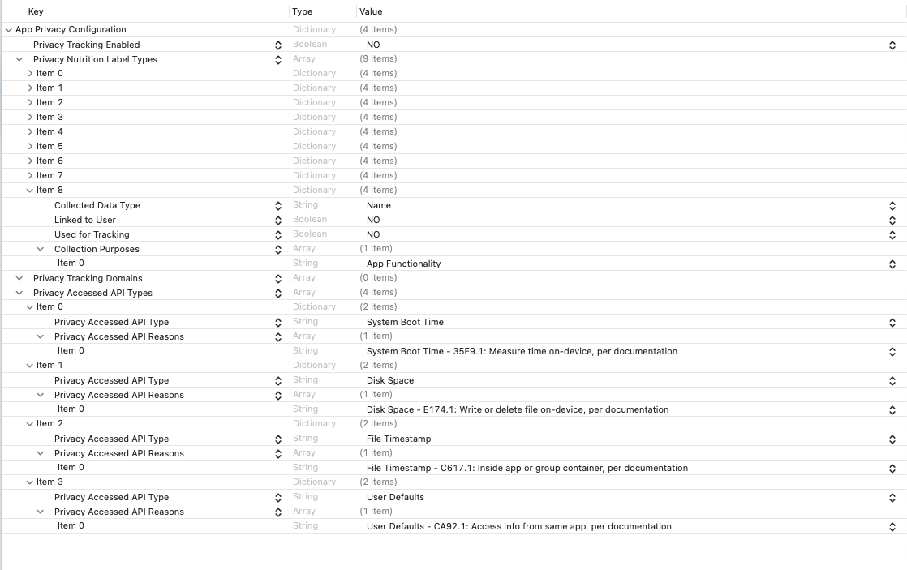
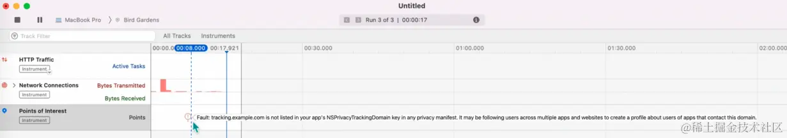
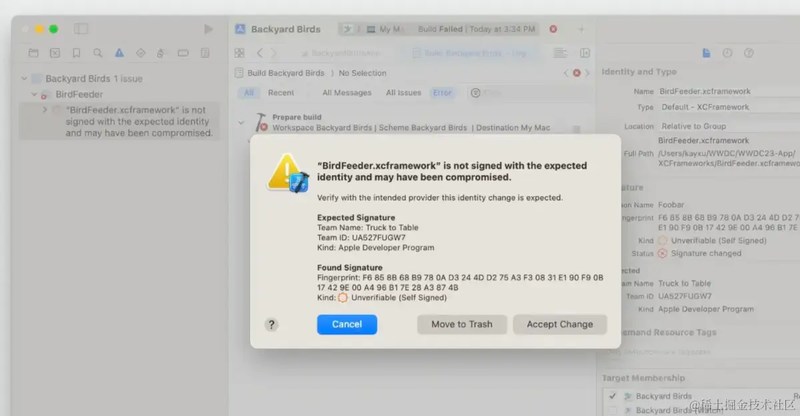

> <h2 id=''></h2>
- [**简介**](#简介)
- [**PrivacyInfo.xcprivacy文件**](#PrivacyInfo.xcprivacy文件)
	- [隐私文件创建条件](#隐私文件创建条件)
	- [Privacy相关字段说明](#Privacy相关字段说明)
- [**SDK签名**](#SDK签名)
	- [SDK签名做法](#SDK签名做法)
- [**隐私清单分析脚本**](#隐私清单分析脚本)
- **资料**
	- [iOS17 隐私协议适配详解](https://juejin.cn/post/7329732000087425064#linked-data)
	- [Flutter 上了 Apple 第三方重大列表，2024 春季 iOS 的隐私清单究竟是什么？](https://juejin.cn/post/7311876701909549065)
	- [iOS 审核 5月1日开始 Privacy manifest files 【隐私清单】](https://blog.csdn.net/lyh1083908486/article/details/137250581)
	- [苹果隐私清单PrivacyInfo.xcprivacy 调研及解决方式](https://www.jianshu.com/p/9a9ec34395e2)


<br/>

***
<br/><br/><br/>

> <h1 id='简介'>简介</h1>


[苹果官方隐私清单文件说明](https://developer.apple.com/documentation/bundleresources/privacy_manifest_files)

[隐私清单数据使用](https://developer.apple.com/documentation/bundleresources/privacy_manifest_files/describing_data_use_in_privacy_manifests)


**预览表**

应用程序和第三方SDK（作为XCFrameworks、Swift软件包或Xcode项目分发）可以包含一个名为 Privacy.xcprivacy的隐私清单文件。隐私清单是一个属性列表，记录您的应用程序或第三方SDK收集的数据类型，以及您的应用程序或第三方SDK使用的API所需原因。对于您的应用程序或第三方SDK收集的每种类型的数据及其使用的所需原因API类别，应用程序或第三方SDK需要在其捆绑的隐私清单文件中记录原因。
重要


<br/>


**注意:** 如果隐私清单文件列在[即将到来的第三方SDK](https://developer.apple.com/support/third-party-SDK-requirements/)要求中，则需要在第三方SDK中包含隐私清单文件。否则，如果使用所需原因API，请在第三方SDK中包含隐私清单文件，收集有关使用包含第三方SDK的应用程序的人的数据，使应用程序能够收集有关使用该应用程序的人的数据，或联系人跟踪域。提供隐私清单文件有助于应用程序开发人员了解第三方SDK的API使用和数据收集实践。


<br/>

***
<br/><br/><br/>

> <h1 id='PrivacyInfo.xcprivacy文件'> PrivacyInfo.xcprivacy文件 </h1> 


<br/><br/><br/>

> <h2 id='隐私文件创建条件'>隐私文件创建条件</h2>

清单文件需要使用xcode15来创建**PrivacyInfo.xcprivacy(切记这个文件名不要修改,否则无法导出隐私清单文件)** ，文件中的内容如图:




<br/><br/><br/>

> <h2 id='Privacy相关字段说明'>Privacy相关字段说明</h2>


- **NSPrivacyTracking(Privacy Tracking Enabled)**
	-  bool，指示您的应用程序或第三方 SDK 是否使用应用程序跟踪透明度框架下定义的数据进行跟踪。有关更多信息，请参阅用户隐私和数据使用。
	-  [用户隐私和数据使用](https://developer.apple.com/cn/app-store/user-privacy-and-data-use/)


<br/>


- **NSPrivacyTrackingDomains(Privacy Tracking Domains)**

	- array，列出您的应用或第三方 SDK 连接到的参与跟踪的互联网域。如果用户未通过应用程序跟踪透明度框架授予跟踪权限，则对这些域的网络请求将失败，并且您的应用程序会收到错误。

- 一组字符串，列出您的应用程序或第三方SDK连接到的参与跟踪的互联网域。如果用户未通过应用程序跟踪透明度框架授予跟踪权限，则对这些域的网络请求将失败，您的应用程序将收到错误. 如果将`NSPrivacyTracking`设置为true，则需要在`NSPrivaceTrackingDomains`中至少提供一个internet域；否则，您可以提供零个或多个域。
	
	- 如果设置NSPrivacyTracking为true则至少需要设置一个domain，否则可以为0个or多个。
	
	- 如果用户未通过ATT的隐私协议，则apple会阻止对追踪域（Tracking Domains）的网络请求。
	
	- 可以通过Xcode->open developer tool->Instruments->network->points of interest。
	
	- 如下图：




<br/>

- **NSPrivacyCollectedDataTypes(Privacy Nutrition Label Types)**
- 
	- 隐私营养标签，添加的内容会在打包后生成的PDF中
	
	- 描述您的应用程序或第三方 SDK 收集的数据类型的字典数组。
	
	- **NSPrivacyCollectedDataType**
		- string，用于标识您的应用或第三方 SDK 收集的数据类型。从下面的数据类型列表中选择与您的应用或第三方 SDK 收集的数据相匹配的值
		- [苹果官方列举字段](https://developer.apple.com/documentation/bundleresources/privacy_manifest_files/describing_data_use_in_privacy_manifests?language=objc)

	- **‌ NSPrivacyCollectedDataTypeLinked**
		- bool，应用程序或第三方 SDK 是否将此数据类型链接到用户的身份有关更多信息，请参阅App Store 上的应用程序隐私详细信息中链接到用户的数据.

	- **NSPrivacyCollectedDataTypeTracking**
		- bool,应用程序或第三方 SDK 是否使用此数据类型进行跟踪

	- **NSPrivacyCollectedDataTypePurposes**
		- 应用或第三方 SDK 收集数据的原因的字符串数组。从下面的目的列表中选择与您的应用或第三方 SDK 收集此数据类型的原因相匹配的值[(链接)](https://developer.apple.com/documentation/bundleresources/privacy_manifest_files/describing_data_use_in_privacy_manifests?language=objc)

	- **NSPrivacyCollectedDataTypePurposes**
		- dictionary，描述应用或第三方 SDK 访问的 API 类型，这些类型已被指定为需要访问原因的 API。有关字典中要使用的键和值的信息，[请参阅描述必要理由API 的使用](https://developer.apple.com/documentation/bundleresources/privacy_manifest_files/describing_use_of_required_reason_api?language=objc)[(其实也就是私有API)](https://juejin.cn/post/7280007176763949092)
		- **NSPrivacyAccessedAPIType**
			- string，标记应用程序必要理由的api类型
		- **NSPrivacyAccessedAPITypeReasons**
			- string，应用程序使用API的原因


<br/>

- **‌ NSPrivacyAccessedAPITypes(Privacy Accessed API Types)**
	- [使用的隐私API及原因](https://developer.apple.com/documentation/bundleresources/privacy_manifest_files/describing_use_of_required_reason_api)

<br/>

***
<br/><br/><br/>

> <h1 id='SDK签名'>SDK签名</h1>

[iOS17 隐私协议适配详解](https://juejin.cn/post/7329732000087425064#linked-data)

&emsp; 对于提供二进制版本的三方SDK，需要第三方提供包含签名的SDK。当你在 App 中采用第三方 SDK 的新版本时，Xcode 将验证它是否由同一开发者签名，从而提高软件供应链的完整性。


> 签名其实分 Apple Developer Program 签名和自签名。经过签名认证后的 SDK ，在 Xcode15 会显示对应的 Signature 信息，如果一旦发现本次前面和上次不一致，那么Xcode 就会让编译失败并弹出警告。

> 

> **Apple 鼓励所有 SDK 使用签名, 如果是在[苹果三方SDK列表](https://developer.apple.com/cn/support/third-party-SDK-requirements/)中的作为二进制依赖项，需要提供签名。(之前理解成主工程的了,但是主工程的静态库和动态库会合并到项目中所以不需要)**


<br/><br/><br/>

> <h2 id='SDK签名做法'>SDK 签名做法</h2>


```
# 1.搜索指定目录下是否包含_CodeSignature签名目录
find -name -type d "_CodeSignature"

# 2.列出本地与代码签名相关的证书
security find-identity -v -p codesigning

# 3.对SDK进行签名，苹果视频https://developer.apple.com/videos/play/wwdc2023/10061
codesign --timestamp -v --sign "Your Certificate Name" </path/to/SDK.framework>

# 4.验证签名(可以看到相关签名信息)
codesign -dvvv </path/to/SDK.framework>

```


<br/>

***
<br/><br/><br/>

> <h1 id='隐私清单分析脚本'>[隐私清单分析脚本](https://blog.csdn.net/crasowas/article/details/137659281)</h1>

[iOS问题记录 - App Store审核新政策：隐私清单 & SDK签名（持续更新）](https://blog.csdn.net/crasowas/article/details/137210258)


**命令开始分析脚本:**

```
sh ./xxx/MLC/OtherDocuments/PrivacyDoment/privacy_manifest_analyser.sh(脚本文件路径) ./xxx//MLC/MLC
```

<br/>

脚本开始执行后，如果你分析的是你的项目目录，你会得到类似这样的分析结果：

```
==================== Analyzing Target Directory ====================

💡 Found privacy manifest file(s): 1
[0] ./Runner/PrivacyInfo.xcprivacy
API usage analysis result(s): 0
✅ All required API reasons have been described in the privacy manifest.

==================== Analyzing Pods Directory ====================

Analyzing FBSDKCoreKit 🎯 ...
💡 Found privacy manifest file(s): 3
[0] ./Pods/FBSDKCoreKit/XCFrameworks/FBSDKCoreKit.xcframework/ios-arm64_x86_64-simulator/FBSDKCoreKit.framework/PrivacyInfo.xcprivacy
[1] ./Pods/FBSDKCoreKit/XCFrameworks/FBSDKCoreKit.xcframework/ios-arm64_x86_64-maccatalyst/FBSDKCoreKit.framework/Versions/A/Resources/PrivacyInfo.xcprivacy
[2] ./Pods/FBSDKCoreKit/XCFrameworks/FBSDKCoreKit.xcframework/ios-arm64/FBSDKCoreKit.framework/PrivacyInfo.xcprivacy
API usage analysis result(s): 3
[0] NSPrivacyAccessedAPICategoryUserDefaults:NSUserDefaults:./Pods/FBSDKCoreKit/XCFrameworks/FBSDKCoreKit.xcframework/ios-arm64/FBSDKCoreKit.framework/FBSDKCoreKit
[1] NSPrivacyAccessedAPICategoryUserDefaults:NSUserDefaults:./Pods/FBSDKCoreKit/XCFrameworks/FBSDKCoreKit.xcframework/ios-arm64_x86_64-maccatalyst/FBSDKCoreKit.framework/FBSDKCoreKit
[2] NSPrivacyAccessedAPICategoryUserDefaults:NSUserDefaults:./Pods/FBSDKCoreKit/XCFrameworks/FBSDKCoreKit.xcframework/ios-arm64_x86_64-simulator/FBSDKCoreKit.framework/FBSDKCoreKit
✅ All required API reasons have been described in the privacy manifest.

Analyzing DKImagePickerController 🎯 ...
⚠️  Missing privacy manifest file!
API usage analysis result(s): 1
[0] NSPrivacyAccessedAPICategoryFileTimestamp:.modificationDate:./Pods/DKImagePickerController/Sources/DKImagePickerController/DKImageAssetExporter.swift
🛠️  Descriptions for the following required API reason(s) may be missing: 1
[0] NSPrivacyAccessedAPICategoryFileTimestamp

Analyzing SDWebImage 🎯 ...
💡 Found privacy manifest file(s): 1
[0] ./Pods/SDWebImage/WebImage/PrivacyInfo.xcprivacy
API usage analysis result(s): 1
[0] NSPrivacyAccessedAPICategoryFileTimestamp:NSURLContentModificationDateKey,NSURLCreationDateKey:./Pods/SDWebImage/SDWebImage/Core/SDDiskCache.m
✅ All required API reasons have been described in the privacy manifest.

Analyzing Mantle ...
⚠️  Missing privacy manifest file!
API usage analysis result(s): 0

...

==================== Analyzing Flutter Plugins Directory ====================

Analyzing device_info_plus-9.1.0 🎯 ...
⚠️  Missing privacy manifest file!
API usage analysis result(s): 0

Analyzing shared_preferences_ios-2.1.1 🎯 ...
⚠️  Missing privacy manifest file!
API usage analysis result(s): 3
[0] NSPrivacyAccessedAPICategoryUserDefaults:UserDefaults,NSUserDefaults:./.symlinks/plugins/shared_preferences_ios/ios/Classes/FLTSharedPreferencesPlugin.m
[1] NSPrivacyAccessedAPICategoryUserDefaults:UserDefaults:./.symlinks/plugins/shared_preferences_ios/ios/Classes/messages.g.h
[2] NSPrivacyAccessedAPICategoryUserDefaults:UserDefaults:./.symlinks/plugins/shared_preferences_ios/ios/Classes/messages.g.m
🛠️  Descriptions for the following required API reason(s) may be missing: 1
[0] NSPrivacyAccessedAPICategoryUserDefaults

...

==================== Analysis completed! 💡: 6 ⚠️ : 30 🛠️ : 10 ✅: 6 🎯: 10 ====================

⚠️ 🛠️  https://developer.apple.com/documentation/bundleresources/privacy_manifest_files/describing_use_of_required_reason_api
🎯 https://developer.apple.com/support/third-party-SDK-requirements

🔔 If the directory you are analyzing is the app project directory, your app's privacy manifest may be affected by these analysis results: 20
[0] NSPrivacyAccessedAPICategoryFileTimestamp:.modificationDate:./Pods/DKImagePickerController/Sources/DKImagePickerController/DKImageAssetExporter.swift
[1] NSPrivacyAccessedAPICategoryFileTimestamp:NSURLContentModificationDateKey,NSURLCreationDateKey:./Pods/SDWebImage/SDWebImage/Core/SDDiskCache.m
[2] NSPrivacyAccessedAPICategoryUserDefaults:UserDefaults,NSUserDefaults:./.symlinks/plugins/shared_preferences_ios/ios/Classes/FLTSharedPreferencesPlugin.m
[3] NSPrivacyAccessedAPICategoryUserDefaults:UserDefaults:./.symlinks/plugins/shared_preferences_ios/ios/Classes/messages.g.h
[4] NSPrivacyAccessedAPICategoryUserDefaults:UserDefaults:./.symlinks/plugins/shared_preferences_ios/ios/Classes/messages.g.m
...

```


